# 目录

# 第一部分 教育学

# 第一章 教育与教育学 分值占比：2~10%

本章学习指南 003

核心考点 004

第一节 教育及其产生与发展 004

第二节 教育学及其产生与发展 022

第三节 教育研究及其方法 ………………………………………… 043

核心考点回顾 / 021/042/052

# 第二章 教育的基本规律 分值占比：2~13%

本章学习指南 053

核心考点 054

第一节 教育与社会发展 054

第二节 教育与人的发展 066

核心考点回顾 / 066 / 074

# 第三章 教育目的与教育制度 分值占比：1～10%

本章学习指南 076

核心考点 077

第一节 教育目的 … 077

第二节 我国的教育目的 088

第三节 学校与学校教育制度 …………………………………………099

第四节 我国的学校教育制度 ………………………………………… 105

核心考点回顾 / 087 / 098 / 105 / 109

# 第四章 教师与学生 分值占比：2~16%

本章学习指南 110

核心考点 111

第一节 教师 111

第二节 学生 … 128

第三节 师生关系 132

核心考点回顾/127/132/139

# 第五章 课程 分值占比：1~10%

# 本章学习指南 140

# 核心考点 141

第一节 课程概述 ………………………………………… 141  
第二节 课程开发 ………………………………………… 151  
第三节 课程管理 ………………………………………… 165  
第四节 课程资源 ………………………………………… 167

# 核心考点回顾 / 150/165/167/170

# 第六章 教学 分值占比：2~18%

# 本章学习指南 171

# 核心考点 172

第一节 教学概述 172  
第二节 教学过程 … 176  
第三节 教学原则与教学方法 ………………………………………… 185  
第四节 教学组织形式与教学工作的基本环节 198  
第五节 教学评价 209  
第六节 教学模式 … 217  
第七节 现代教育技术在教学中的应用 221

# 核心考点回顾 / 176 / 184 / 197 / 208 / 216 / 220 / 224

# 第七章 德育 分值占比：1~15%

# 本章学习指南 225

# 核心考点 226

第一节 德育概述 226  
第二节 德育过程 232  
第三节 德育原则 236  
第四节 德育的途径与方法 240  
第五节 德育模式 246  
第六节 我国中小学德育改革 250

# 核心考点回顾 / 231 / 235 / 240 / 245 / 249 / 251

# 第八章 班级管理与班主任工作 分值占比：1～8%

# 本章学习指南 252

# 核心考点 253

第一节 班级与班级管理 253  
第二节 良好班集体的培养 261  
第三节 班主任工作 … 265

# 核心考点回顾/261/265/276

# 目录

# 第九章 课外、校外教育与三结合教育 分值占比：1~6%

# 本章学习指南 277

# 核心考点 277

第一节 课外、校外教育 ………………………………………… 277  
第二节 学校、家庭、社会三结合教育 281

核心考点回顾/280/284

# 第二部分 心理学

# 第一章 心理学概述 分值占比：2~4%

# 本章学习指南 287

# 核心考点 287

第一节 心理学的研究对象与任务 287  
第二节 心理的实质 289  
第三节 心理学的产生与发展 293

核心考点回顾/289/293/295

# 第二章 认知过程 分值占比：3~10%

# 本章学习指南 296

# 核心考点 297

第一节 感觉和知觉 … 297  
第二节 记忆 308  
第三节 表象与想象 319  
第四节 言语与思维 324  
第五节 注意 337

核心考点回顾/307/318/323/336/346

# 第三章 情绪情感和意志过程 分值占比：1~6%

# 本章学习指南 347

# 核心考点 348

第一节 情绪情感过程 348  
第二节 意志过程 356

核心考点回顾/356/362

# 第四章 个性心理 分值占比：2~12%

# 本章学习指南 363

# 核心考点 364

第一节 需要、动机与兴趣 364  
第二节 能力 … 369

第三节 气质与性格 377

核心考点回顾 / 368 / 377 / 383

# 第三部分 教育心理学

# 第一章 教育心理学概述 分值占比： $1\sim 5\%$

本章学习指南 387

核心考点 387

第一节 教育心理学的基本内涵 387  
第二节 教育心理学的发展 390  
第三节 教育心理学的研究方法与研究原则 … 392

核心考点回顾/389/391/394

# 第二章 心理发展及个别差异 分值占比：2~10%

本章学习指南 395

核心考点 396

第一节 心理发展 396  
第二节 中小学生的认知发展 400  
第三节 中小学生人格、社会化发展 407  
第四节 学生的个别差异 417

核心考点回顾 / 400 / 406 / 416 / 422

# 第三章 学习理论 分值占比：2～12%

本章学习指南 423

核心考点 424

第一节 学习概述 424  
第二节 行为主义学习理论 429  
第三节 认知派学习理论 441  
第四节 人本主义学习理论 447  
第五节 建构主义学习理论 450

核心考点回顾 / 428 / 440 / 447 / 450 / 454

# 第四章 学习心理 分值占比：2~14%

本章学习指南 455

核心考点 456

第一节 学习动机 456  
第二节 学习策略 472  
第三节 学习迁移 481  
第四节 知识的学习 490

# IV 目录

第五节 技能的形成 … 500  
第六节 问题解决与创造性 … 509  
第七节 态度与品德的形成 518

核心考点回顾 / 471 / 480 / 489 / 499 / 508 / 517 / 530

# 第五章 教学心理 分值占比：2~8%

本章学习指南 532  
核心考点 533

第一节 教学设计 533  
第二节 课堂管理 … 543

核心考点回顾 / 542 / 557

# 第六章 心理健康教育与教师职业心理 分值占比：1～10%

本章学习指南 559  
核心考点 560

第一节 心理健康概述 560  
第二节 学生心理辅导 564  
第三节 教师职业心理 573

核心考点回顾 / 563 / 572 / 585

# 第四部分 教育法律法规

本部分学习指南 589  
核心考点 590

# 第一章 教育法律基础 分值占比： $1\sim 3\%$

第一节 教育法规概述 590  
第二节 教育法学基础知识 595

# 第二章 现行主要的教育法律法规 分值占比：2~6%

第一节 《中华人民共和国教育法》 ………………………………………… 604  
第二节 《中华人民共和国义务教育法》 … 611  
第三节 《中华人民共和国教师法》 ………………………………………… 615  
第四节 《中华人民共和国未成年人保护法》 … 618  
第五节 《学生伤害事故处理办法》 ………………………………………… 624

# 第三章 依法执教与教师违法(侵权)行为 分值占比：1~3%

第一节 依法执教· 628  
第二节 教师违法(侵权)行为 629

核心考点回顾 / 603 / 626 / 632

# 第五部分 新课程改革

# 本部分学习指南 635

# 核心考点 636

# 第一章 新课程改革概述 分值占比： $1\sim 6\%$

第一节 新课程改革的背景与发展趋势 636  
第二节 新课程改革的根本任务、目标、重点和理念 … 638

# 第二章 新课程与教学改革 分值占比：2~10%

第一节 教学改革的主要任务、观点及趋势 … 643  
第二节 教师角色与教学行为 644  
第三节 新的教学观 646  
第四节 学习方式的变革 648

# 第三章 综合实践活动 分值占比：1~2%

第一节 综合实践活动概述 651  
第二节 研究性学习 … 653

# 核心考点回顾 / 642 / 650 / 654

# 第六部分 教师职业道德

本部分学习指南 657

# 核心考点 658

# 第一章 教师职业道德概述 分值占比：1~3%

第一节 教师职业道德的概念、特点及价值蕴含 … 658  
第二节 教师职业道德的结构与功能 661

# 第二章 教师职业道德的基本原则、范畴及规范 分值占比：2～12%

第一节 教师职业道德基本原则 … 664  
第二节 教师职业道德范畴 666  
第三节 《中小学教师职业道德规范》解读 ………………………………………… 668

# 第三章 教师职业道德教育、修养与评价 分值占比：1～4%

第一节 教师职业道德教育 674  
第二节 教师职业道德修养 675  
第三节 教师职业道德评价 678

# 核心考点回顾 / 663 / 673 / 680

# VI 目录

# 第七部分 教育教学技能

# 本部分学习指南 683

# 核心考点 683

# 第一章 教学技能概述 分值占比： $1\sim 2\%$

第一节 教学技能的内涵 … 684  
第二节 教学技能的特点、构成与作用 … 685

# 第二章 教学设计技能 分值占比：1~2%

第一节 教学目标的设计技能 687  
第二节 教案的设计技能 688

# 第三章 课堂教学技能 分值占比：2~6%

第一节 课堂导入技能 … 691  
第二节 课堂提问技能 … 694  
第三节 课堂观察与倾听技能 ………………………………………… 699  
第四节 课堂板书技能  
第五节 巩固技能· 703  
第六节 教学反馈与强化技能 704  
第七节 结课技能 706

# 第四章 说课技能与教学反思技能 分值占比：1~2%

第一节 说课技能· 708  
第二节 教学反思技能 712

核心考点回顾/686/690/707/714

# 第八部分 教育活动设计与教育写作

# 本部分学习指南 717

# 核心考点 717

# 第一章 教育活动设计 分值占比： $10\sim 15\%$

第一节 教育方案设计 717  
第二节 教案设计 724

# 第二章 教育写作 分值占比：20~35%

# 索引

# 专家微课视频索引

(扫描正文中下列知识点处的二维码, 即可获取专家微课视频)

·教育的社会属性/008  
·生物起源说/014   
·卢梭的教育思想/031  
·影响个体身心发展的主要因素——遗传/069  
·个体身心发展的互补性/073   
·素质教育的内涵/095  
·教师劳动的复杂性/117   
·教师的知识素养/120   
·必修课程与选修课程/147   
·教学原则——启发性原则/186  
·教学工作的基本环节——备课/204  
- 绝对性评价、相对性评价和个体内差异评价/213  
·德育过程是对学生知、情、意、行的培养与提高的过程/233   
·说服教育法/242  
·班级管理的模式/257

·反射的分类/291  
·诱导运动和运动后效/299  
·知觉理解性和知觉整体性/303   
·压抑(动机)说和提取失败说/313   
·思维的特点/325   
·分析与综合、抽象与概括/332  
·注意的稳定性与注意的分配/341  
·情绪的分类/349  
·合理化、移置、投射/353   
·动机冲突/358   
·信度与效度/375   
自我中心性/402  
·场依存型和场独立型/418  
·学习的概念/424   
·奥苏贝尔的学习分类/427   
·影响问题解决的因素/512

# 01 第一部分教育学

# 内容导学

本部分内容共分为九章。  
- 第一章至第三章主要是对教育学基本原理的阐释。第一章的考查题型主要为客观题，第二、三章的考查题型主、客观均会涉及。  
- 第四章至第九章主要介绍教育教学实践中所涉及的基本理论,考查题型主、客观均会涉及。其中,第四章、第六章、第七章为主观题的高频考查章节。  
• 考生应重点掌握第一章、第二章、第四章至第七章的内容,并结合历年真题有针对性地进行复习。  
为了方便考生梳理知识脉络，我们在各节设置思维导图和核心考点回顾。

# 第一章 教育与教育学

# 本章学习指南

# 一、考情概况

本章属于教育学的基础章节，内容较为琐碎，考生可带着以下学习目标进行备考：

1.理解并区分教育和教育学的内涵。  
2. 掌握教育的属性、基本要素、功能和起源。  
3. 识记古代社会教育的发展概况和现代社会的教育。  
4. 掌握教育学各发展阶段主要教育家的教育思想。  
5.理解教育研究的基本过程。

# 二、考点地图

<table><tr><td>考点</td><td>年份/地区/题型</td></tr><tr><td>“教育”的词源</td><td>2024天津单选;2023福建单选;2023河北单选;2023内蒙古单选;2023湖南单选;2023广东判断;2022内蒙古单选;2022河南判断</td></tr><tr><td>“教育”的定义</td><td>2024安徽单选;2024浙江填空;2023黑龙江单选;2023江苏单选;2022河南单选、判断;2022江苏判断</td></tr><tr><td>教育的属性</td><td>2024河南多选;2024山东多选;2024四川判断;2023河北单选;2023江苏单选;2023河南单选、判断;2023安徽填空;2023广东判断;2022山西单选;2022内蒙古单选;2022天津判断</td></tr><tr><td>教育的基本要素</td><td>2024浙江判断;2023天津单选;2023河北单选、多选、判断;2023江苏填空;2022河南单选;2022山东单选;2022山西单选</td></tr><tr><td>教育功能的类型</td><td>2024山西单选;2024广东单选;2024山东单选;2024天津材料分析;2023河北单选、多选;2023山东多选;2022浙江单选</td></tr><tr><td>教育的起源</td><td>2024山东单选;2024福建多选;2023河北单选;2023安徽单选;2023河南单选</td></tr><tr><td>古代社会教育的发展概况</td><td>2024山东单选;2023河北单选、多选、判断;2022山东单选;2022辽宁判断</td></tr><tr><td>现代社会的教育</td><td>2024广东单选;2024安徽单选、判断、简答;2023内蒙古单选;2023河北单选;2023黑龙江多选;2023安徽多选;2022河南单选</td></tr><tr><td>孔子的教育思想</td><td>2024江苏单选;2024天津单选;2024山东单选;2024安徽单选;2023河北单选;2023安徽单选;2023河南单选;2022广西判断</td></tr><tr><td>孟子的教育思想</td><td>2024浙江单选;2024河南不定项;2023山东单选;2023河北判断</td></tr><tr><td>《学记》的教育思想</td><td>2024河南多选;2024福建填空;2023黑龙江单选;2023山东单选;2023河北单选、判断</td></tr><tr><td>夸美纽斯的教育思想</td><td>2024广东单选;2024江苏填空;2023辽宁单选;2023江苏单选;2023河北单选</td></tr><tr><td>赫尔巴特的教育思想</td><td>2024天津单选;2024福建单选;2024浙江判断;2023山东单选;2023河南单选;2023河北单选、多选;2022湖北单选</td></tr><tr><td>陶行知的教育思想</td><td>2024安徽单选;2024广东单选;2024山东单选、判断;2024天津判断;2023安徽单选;2023河南单选;2023河北多选</td></tr><tr><td>教育研究的基本过程</td><td>2024山东单选;2023安徽多选;2022广东单选</td></tr></table>

注：上述表格仅呈现重要考点的相关考情。

# 核心考点

# 第一节 教育及其产生与发展

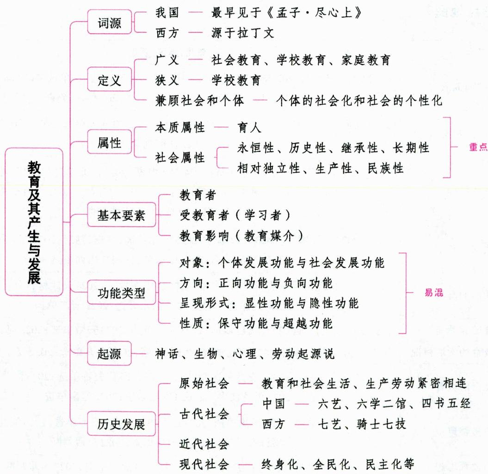

# 一、教育的内涵 ★★ 【单选、多选、填空、判断】

教育是人类有目的地培养人的一种社会活动，是传承文化、传递生产与社会生活经验的一种途径。

# 考点1 “教育”的词源

在我国，“教育”一词最早见于《孟子·尽心上》中的“得天下英才而教育之，三乐也”。孟子是最早将“教”“育”二字用在一起的人。许慎在《说文解字》中这样解释：“教，上所施，下所效也”“育，养子使作善也”。

在西方，“教育”一词源于拉丁文“educere”，前缀“e”有“出”的意思，意为“引出”或“导出”，意思是采用一定的手段，把某种本来就潜藏于人身上的东西引导出来，从一种潜质转变为现实。

# 小香课堂

关于“教育”一词的两个“最早”：

(1)最早使用——孟子；(2)最早解释——许慎。

真题1 [2024天津河北，单选]“得天下英才而教育之”出自（）

A.《论语》

B.《学记》

C. 《孟子·尽心上》

D.《劝学篇》

真题2 [2023内蒙古赤峰, 单选]将“教育”解释为“教, 上所施, 下所效也”“育, 养子使作善也”的著作是( )

A.《孟子》

B.《学记》

C.《说文解字》

D.《论语》

答案：1.C 2.C

# 考点2 “教育”的定义

# 1. 外国教育家对“教育”的界定

表 1-1 外国教育家对“教育”的界定  

<table><tr><td>人物</td><td>对“教育”的界定</td></tr><tr><td>苏格拉底</td><td>教育是“使人得到改进”</td></tr><tr><td>亚里士多德</td><td>教育是“形成人的理性”，从而“使天性、习惯和理性协调统一”</td></tr><tr><td>柏拉图</td><td>教育过程就是理智控制欲望的过程</td></tr><tr><td>夸美纽斯</td><td>教育就是“把一切事物教给一切人的全部艺术”</td></tr><tr><td>斯宾塞</td><td>教育是“为完满生活做准备”</td></tr><tr><td>涂尔干</td><td>教育是年长的几代人对社会生活方面尚未成熟的几代人所施加的影响</td></tr><tr><td>杜威</td><td>“教育即生活”“教育即生长”“教育即经验的改组或改造”</td></tr><tr><td>巴班斯基</td><td>“教育是老一代向新一代传递社会历史经验的过程，其目的在于培养他们参加生活和从事为保证社会进一步发展所必需的劳动”</td></tr></table>

# 2. 我国教育界对“教育”的界定

表 1-2 我国教育界对“教育”的界定  

<table><tr><td>人物或著作</td><td>对“教育”的界定</td></tr><tr><td>孔子</td><td>教育是一种重要的社会统治手段。“道之以政，齐之以刑，民免而无耻；道之以德，齐之以礼，有耻且格”</td></tr><tr><td>荀子</td><td>教育是以善教人。“以善先人者谓之教”</td></tr><tr><td>《学记》</td><td>教育就是长善救失。“教也者，长善而救其失者也”</td></tr><tr><td>《中庸》</td><td>教育就是将社会的伦理纲常加以推广和实行。“天命之谓性，率性之谓道，修道之谓教”</td></tr><tr><td>蔡元培</td><td>教育是帮助被教育的人，给他能发展自己的能力，完成他的人格</td></tr><tr><td>杨贤江</td><td>教育是帮助人营谋社会生活的一种手段</td></tr></table>

# 3. 本书所采用的教育定义

一般说来，人们是从两个角度给“教育”下定义的：一个是社会的角度，另一个是个体的角度。

# （1）从社会的角度来定义

从社会的角度来定义“教育”，可以把“教育”的定义区分为不同的层次：

①广义的教育。指增进人的知识与技能、发展人的智力与体力、影响人的思想观念的活动。广义的教育可能是无组织的、自发的或零散的，也可能是有组织的、自觉的或系统的。它包括社会教育、学校教育和家庭教育。  
②狭义的教育。主要指学校教育,是教育者依据一定的社会要求,依据受教育者的身心发展规律,有目的、有计划、有组织地对受教育者施加影响,促使其朝着所期望的方向发展变化的活动。  
③更狭义的教育。有时是指思想品德教育活动，与学校中常说的“德育”是同义词。

# (2)从个体的角度来定义

从个体的角度来定义“教育”，往往把“教育”等同于个体学习与发展的过程。

兼顾社会和个体两个方面给教育下定义：教育是在一定社会背景下发生的促使个体的社会化和社会的个性化的实践活动。

# 知识再拔高·

# 教育定义的方式

美国分析教育哲学家谢弗勒在《教育的语言》一书中探讨了三种定义的方式，即规定性定义、描述性定义和纲领性定义。

(1)规定性定义, 即作者自己所创制的定义, 其内涵在作者的某种话语情境中始终是同一的。也就是说, 不管其他人所用的“教育”一词是什么意思, “我”所用的“教育”一词就是这个意思。  
(2)描述性定义,是指对定义对象的适当描述或对如何使用定义对象的适当说明。在词典上,一般见到的大多是描述性定义的罗列,描述性定义回答的是“教育实际是什么”的问题。  
(3)纲领性定义, 是一种有关定义对象应该是什么的界定。它往往包含着“是”和“应当”两种成分, 是描述性定义和规定性定义的混合。

真题3 [2024安徽统考,单选]“天命之谓性,率性之谓道,修道之谓教”出自儒家著作中的( )

A.《大学》

B.《中庸》

C.《论语》

D.《孟子》

真题4 [2023黑龙江哈尔滨，单选]关于教育，下列观点表达错误的是（）

A. 苏格拉底认为, 教育是使人得到改进  
B. 杨贤江提出,教育是帮助人营谋社会生活的一种手段

C. 孔子认为, 以善先人者谓之教  
D. 斯宾塞提出, 教育为完满生活做准备

真题5 [2024浙江嘉兴，填空]教育是在一定社会背景下发生的促使________和________的实践活动。

答案：3.B 4.C 5.个体的社会化社会的个性化

# 考点 3 “教育”的日常用法

在日常生活中，人们经常使用“教育”一词。这些用法大致可分为三类：

(1)作为一种过程的“教育”，表明一种深刻的思想转变过程，如“我从这部影片中受到了一次深刻的教育”。  
(2)作为一种方法的“教育”，如“你的孩子真有出息，你是怎么教育孩子的”。  
(3)作为一种社会制度的“教育”，如“教育是振兴地方经济的基础”。

在这三类用法中, 最基本的还是第一种用法, 因为无论是作为一种方法的“教育”, 还是作为一种社会制度的“教育”, 如果不伴随着教育对象深刻的思想转变过程, 都很难称得上是真正的“教育”。

真题6 [2022河北保定，单选]下列表述中，将教育视作一种方法的是（）

A. 教育是振兴经济的基础  
B. 我从这个报告中受到了深刻的教育  
C. 你的孩子真有出息,你是怎么教育孩子的  
D. 我今天听了一场关于愉快教育的学术报告

答案：C

# 二、教育的属性 ★★ 【单选、多选、填空、判断】

# 考点1 教育的本质属性

教育的本质属性是育人，即教育是一种有目的地培养人的社会活动，这是教育区别于其他事物现象的根本特征，也是教育的质的规定性。教育的具体而实在的规定性体现在：(1)教育是人类所特有的一种有意识的社会活动；(2)教育是人类有意识地传递社会经验的活动；(3)教育是以人的培养为直接目标的社会实践活动。

此外，王道俊、郭文安主编的《教育学》中指出，教育是一种有目的地培养人的社会活动，是人类社会生活不可或缺的重要组成部分，教育有其相对稳定的质的特点：（1）有目的地培养人的活动；（2）教育者引导受教育者传承经验的互动活动；（3）激励与教导受教育者自觉学习和自我教育的活动。总之，教育是有目的地引导受教育者能动地学习与自我教育以促进其身心发展的活动。

# 小香课堂

关于教育的本质属性，考生需要注意：

(1)教育是人类社会特有的活动,动物界不存在教育。社会性和意识性是人的教育活动和动物的“教育”活动的本质区别。动物界的某些行为虽与人类社会的教育相类似,但本质不同:①动物的活动出于一种本能需要,属于本能活动;②动物界没有语言,不具备明确的意识;③动物的“教

育”以适应环境为指向，人类的教育还要改造环境和发展自己。

(2)人类社会中的一些行为是不属于教育的。例如: ①没有明确目的的、偶然发生的行为, 如孩子偶然把手指伸到火苗上, 被灼伤, 由此获得有关火的知识; ②片面强调个体社会化的行为 (如机械的“灌输”) 或片面强调社会个性化的行为 (如随心所欲的学习); ③日常家庭生活中的“抚养”“养育”行为, 如初生婴儿吸奶。

真题7 [2023河北保定,单选]教育区别于其他事物现象的本质特征在于( )

A. 教育能为人类生产生活提供经验

B. 教育是一种培养人的社会实践活动

C. 教育能够促进生产力水平的提高

D. 教育能够促进文化的传播

真题8 [2024四川统考，判断]有研究表明，成年猎豹会有技巧地“教育”幼崽学习如何捕猎。可见，动物界也存在教育。（）

真题9 [2023河南郑州, 判断]教育是自发地引导受教育者能动地学习与自我教育以促进其身心发展的活动。（）

答案：7.B 8. $\times$ 9. $\times$

# 考点2 教育的社会属性

(1) 永恒性。教育是人类所特有的社会现象, 它是一个永恒的范畴。只要人类社会存在, 就存在着教育。

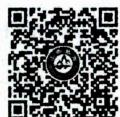  
教育的社会属性

(2) 历史性。在不同的社会或同一社会的不同历史阶段, 教育的性质、目的、内容等各不相同。不同时期的教育有其不同的历史形态、特征。  
(3)继承性。教育的继承性是指不同历史时期的教育都前后相继,后一时期教育是对前一时期教育的继承与发展。  
(4)长期性。无论从一个教育活动完成的角度,还是从一个个体的教育生长的角度,其时间周期都比较长。  
(5)相对独立性。教育受一定社会的政治经济等因素的制约，但作为一种培养人的社会活动，教育有其自身的规律，具有相对独立性。此外，教育的相对独立性还表现在特定的教育形态不一定跟其当时的社会形态保持一致，而存在教育“超前”或“滞后”的现象。  
(6)生产性。教育是生产性活动，与其他生产活动相比，在对象、过程与结果等方面有自己的特殊性。  
(7)民族性。教育是在具体的民族或国家中进行的，无论是在思想上还是在制度上，无论是在内容还是在方法手段等方面都有其民族性的特征，特别表现在运用民族语言教学、传授本民族的文化知识等方面。

# ·记忆有妙招·

为方便考生记忆，编者将教育的社会属性总结成以下口诀：

永利机场，相对民生。永：永恒性。利：历史性。机：继承性。场：长期性。相对：相对独立性。民：民族性。生：生产性。

真题10 [2023江苏苏州，单选]各个时期的教育都各有其特点，这显示了教育的（）

A. 阶段性

B. 历史性

C. 长期性

D. 局限性

真题11 [2023河南郑州, 单选]无论教材如何改革, 唐诗宋词始终是我国中小学教育的重要内容之一。这表明教育具有( )

A. 永恒性

B. 历史性

C. 相对独立性

D. 继承性

答案：10.B 11.D

# 三、教育的基本要素 ★★★ 【单选、多选、填空、判断】

一般认为，教育者、受教育者(学习者)和教育影响(教育媒介)是构成教育活动的基本要素。

# 1. 教育者

教育者是指能够在一定社会背景下促进个体社会化和社会个性化活动的人。在教育的构成要素中, 教育者是主导性的因素, 是教育活动的组织者和领导者。

广义的教育者指对受教育者态度、知识、技能、思想、品德等方面起到教育影响作用的人。其范围广泛，包括各级各类教育管理人员、专兼职教师、校外教育机构中的工作人员、家长乃至自己。

狭义的教育者指从事学校教育活动的人。其中，教师是学校教育者的主体，是直接的教育者，在整个教育过程中起主导作用，是学生身心发展的主要影响源。

现代学校的教育者的特征：(1)主体性——教育者是教育活动的设计者和具体实施者；(2)目的性——教育者所从事的是以教育为目的的活动；(3)社会性——现代学校的教育者是社会要求的体现者。

# 2. 受教育者（学习者）

在社会教育活动中，在生理、心理及性格发展方面有目的地接受影响、从事学习的人，统称为受教育者，既包括在校学习的学生，也包括各种形式成人教育中的学习者。

受教育者是教育的对象及学习的主体。从法律角度看，受教育者是教育活动的自然人，与教育者是平等的，在接受思想、品德、知识、技能、行为以及智慧、性格等方面的影响时，具有主观能动性。

# 小香课堂·

教育的基本要素说法众多，教育者与受教育者(学习者)是两个必备的要素。需注意：

(1)教育者 $\neq$ 教师；(2)受教育者（学习者） $\neq$ 学生。

# 3. 教育影响（教育媒介）

教育影响即教育活动中教育者作用于学习者的全部信息，既包括了信息的内容，也包括了信息选择、传递和反馈的形式，是内容与形式的统一。从内容上说，主要是教育内容、教育材料或教科书；从形式上说，主要是教育手段、教育方法和教育组织形式。

教育活动中有诸多矛盾, 其中, 受教育者与教育内容这一对矛盾是教育中基本的、决定性的矛盾, 因为它是教育活动的逻辑起点。

# 知识再拔高·

# 教育的基本要素的其他说法

说法一：构成教育活动的基本要素有教育者、受教育者和教育内容。

说法二：构成教育活动的基本要素有教育者、受教育者和教育措施（包括教育的内容和手段）。

说法三：构成教育活动的基本要素有教育者与受教育者，教育内容与教育物资。

说法四：凡是教育活动都具有教育者、受教育者、教育内容和教育活动方式等基本要素。

说法五：从宏观角度看，教育活动由教育主体、教育目标、教育内容、教育手段、教育环境、教育途径六个要素构成。从微观角度看，教育活动由教育者、学习者、教育内容和教育手段四个要素构成。教育者是教育活动中“教”的主体；学习者是教育活动中“学”的主体；教育内容是教育活动中师生共同认识的客体；教育手段是教育活动的基本条件，是教育者借以将教育内容作用于教育对象的媒介物，或者说，是受教育者借以实现认识客体的媒介物。

真题12 [2023河北石家庄，单选]在教育的诸多矛盾中，（ ）之间的矛盾是教育活动的逻辑起点，也是教育中基本的、决定性的矛盾。

A. 教育者与受教育者

B. 教育者与教育内容

C. 受教育者与教育内容

D. 教育内容与教育手段

真题13 [2024浙江宁波，判断]教育活动是由三个要素组成的，其中受教育者仅指学校中的适龄学生。（）

真题14 [2023江苏苏州，填空]教育的三个基本要素是________、学习者、教育影响，这三个基本要素既相互独立，又相互联系。

答案：12.C 13. $\times$ 14.教育者

# 四、教育的形态 ★ 【单选、多选、判断】

教育形态是指由教育者、学习者和教育影响三个基本要素所构成的教育系统在不同时空背景下的变化形式，也是“教育”理念的历史实现。根据不同的标准，可以划分出不同的教育形态。

表 1-3 教育的形态  

<table><tr><td>划分依据</td><td>教育形态</td><td>内涵/特征</td></tr><tr><td rowspan="2">自身形式化的程度</td><td>非制度化教育</td><td>教育与生产或生活高度一体化,没有从日常的生产或生活中分离出来</td></tr><tr><td>制度化教育</td><td>由专门的教育人员、机构及其运行制度所构成</td></tr><tr><td rowspan="3">赖以运行的空间标准</td><td>家庭教育</td><td>以家庭为单位进行的教育活动</td></tr><tr><td>学校教育</td><td>以学校为单位进行的教育活动,出现较晚</td></tr><tr><td>社会教育</td><td>社区、文化团体和组织等给予人的影响,出现较早</td></tr><tr><td rowspan="2">赖以运行的时间标准</td><td>农业社会的教育</td><td>(1)古代学校的出现和发展;(2)教育阶级性的出现和强化;(3)学校教育与生产劳动相脱离</td></tr><tr><td>工业社会的教育</td><td>(1)现代学校的出现和发展;(2)教育与生产劳动从分离走向结合,教育的生产性日益突出;(3)教育的公共性日益突出;(4)教育的复杂性程度和理论自觉性都越来越高,教育研究在推动教育改革中的作用越来越大</td></tr><tr><td>赖以运行的时间标准</td><td>信息社会的教育</td><td>(1)学校将发生一系列变革；
(2)教育的功能将进一步得到全面理解；
(3)教育的国际化与教育的本土化趋势都非常明显；
(4)教育的终身化、全民化和全纳教育的理念成为指导教育改革的基本理念</td></tr><tr><td rowspan="2">时空中存在的形态(存在形式)</td><td>实体教育</td><td>(1)教师与学生在真实的空间里面面对面地交流；
(2)教师在教学时所运用的语言、展现的形体动作、设计的板书等都对学生产生影响；
(3)要求学生规规矩矩地坐在教室里，认真地倾听教师按照固定的教学计划而实施的教学活动，无法照顾到学生的个体差异，学生学习的积极性和主动性受到一定限制；
(4)有利于形成优良的学习环境，浓郁的学习氛围，融洽的师生关系，亲密的同学之情</td></tr><tr><td>虚拟教育</td><td>(1)教育教学过程发生的场所是一系列虚拟化的教育环境，包括虚拟教室、虚拟实验室、虚拟校园、虚拟学社、虚拟图书馆等；
(2)人与人直接交往的机会急剧减少，学习者面对的是学习终端机器，或教师上课的画面，人们之间的关系呈现为一种虚拟的人际关系，这种情况很难对教育质量进行检测，难以培养全面发展的人；
(3)信息传递可以不受时间和地点的限制，学习内容可以重复，可以采用交互的方式进行学习，学生可以自主安排学习进度；
(4)不利于形成优良的学习环境，浓郁的学习氛围，融洽的师生关系，亲密的同学之情</td></tr></table>

真题15 [2024四川统考，单选]从教育现象在时空中的存在形态看，网课属于（）

A.非正规教育

B. 实体教育

C. 虚拟教育

D. 终身教育

真题16 [2022河南南阳，多选]信息社会的教育的特征包括（）

A. 教育的功能进一步得到全面理解  
B. 教育国际化与教育本土化趋势非常明显  
C. 教育的终身化和全民化理念成为指导教育改革的基本理念  
D. 学校教育与生产劳动分离

答案：15.C 16.ABC

# 五、教育的功能 【单选、多选、判断、材料分析】

教育功能是教育活动和教育系统对个体发展和社会发展所产生的各种影响和作用。它取决于教育本质，并随着对教育本质认识的变化而变化。但教育功能不是教育本质，本质回答“教育是什么”，而功能回答“教育能够干什么”。

# 考点1 教育功能的特征

(1)客观性。教育功能不是主观臆想的，它是由教育的本质和教育系统的结构所决定的。教育本

质和教育结构在人类发展历史过程中有着相对的稳定性,这就决定了教育功能的客观性。教育功能为教育本身所固有的客观属性,不以人的意志为转移。

(2)社会性。教育功能随社会历史条件的变化而变化。  
(3)多样性。教育对社会方方面面的作用，决定了教育功能的多样性。  
(4)整体性。教育功能的整体性不仅表现在教育系统内部的协调一致，还表现在教育与社会系统的整体联动。  
(5)条件性。教育功能的实现是需要条件的：一是要符合教育自身的规定和规律，二是需要现实提供适合功能发挥的条件。

# 考点2 教育功能的类型 ★★

表 1-4 教育功能的类型  

<table><tr><td>分类依据</td><td>类型</td><td>含义</td><td>关系</td></tr><tr><td rowspan="2">作用的对象</td><td>个体发展功能(本体功能)</td><td>教育对个体的生存和发展所产生的作用和影响。促进个体发展的功能是教育固有的功能</td><td rowspan="2">两者是辩证统一的关系:(1)教育的个体功能是教育的社会功能衍生的前提和基础;(2)教育的社会功能对教育的个体功能的发挥具有制约作用</td></tr><tr><td>社会发展功能(派生功能)</td><td>教育对社会的稳定、运行和发展所产生的影响。教育的社会功能的发挥必须通过培养人来实现。教育对社会的作用不是无限的,而要受社会结构、社会发展规律和社会性质所制约</td></tr><tr><td rowspan="2">作用的方向</td><td>正向功能</td><td>教育有助于社会进步和个体发展的积极影响和作用</td><td rowspan="2">对任何社会、任何时期的教育来说,正向和负向的功能并存,只不过比重不同而已,多数时期的教育以正向功能为主</td></tr><tr><td>负向功能</td><td>教育阻碍社会进步和个体发展的消极影响和作用</td></tr><tr><td rowspan="2">作用的呈现形式(功能的表面属性和外部特征)</td><td>显性功能</td><td>依照教育目的、任务和价值,教育在实际中所出现的与之相符合的结果。如促进人的全面和谐发展、促进社会的进步等。显性功能的主要标志是计划性</td><td rowspan="2">显性功能与隐性功能的区分是相对的,一旦隐性的潜在功能被有意识地开发、利用,就可以转变成显性教育功能</td></tr><tr><td>隐性功能</td><td>非预期的且具有较大隐藏性的功能。如不公正的教育复制了现有的社会关系,再现了社会的不平等;学校照管儿童的功能等。隐性功能既有积极的,也有消极的</td></tr><tr><td rowspan="2">性质</td><td>保守功能</td><td>教育具有自身的结构,具有内在的稳定性和自身的逻辑性,不随社会的变化而变化,形成了自我保存的功能性和承继性,表现出教育重复、封闭、保守的一面</td><td rowspan="2">教育必须把保守和超越有机结合起来,在保守性基础上实现教育的超越</td></tr><tr><td>超越功能</td><td>通过教育的自我更新和变革,促进和引领人类社会的发展</td></tr></table>

日本学者柴野昌山将教育功能的形式和方向结合起来，把教育功能划分为四类，即显性正向功能、隐性正向功能、隐性负向功能以及显性负向功能。柴野昌山对这四种教育功能分别予以举例说明，例如，考试作为教师评价学生学习效果、强化学生学习欲望的工具来说具有显性正向功能，但若教师仅凭考试成绩来评价学生，便会导致学生产生书呆子型成就中心的偏向，这是考试的隐性负向功能；又如，

学校中的表扬制度以及晨会之类的仪式性活动的本来目的只在于帮助学生区分正误,但也可能会产生增强学生对学校的归属意识、促进群体整合等预料之外的副产品,这些副产品便是隐性正向功能;至于显性负向功能,学校教育作为一种价值追求,一开始就竭力去避免教育的显性负向功能,但由学生群体的反学校、反教师的亚文化而导致的各种不良行为或越轨行为则属于显性负向功能。

# 知识再拔高·

# 教育的个体发展功能与社会发展功能有效发挥的条件

1. 教育的个体发展功能有效发挥的条件

教育具有个体发展的功能,但并非所有的教育都能够发挥这样的功能。教育促进个体的发展是有条件的,这些条件主要包括:(1)教育活动必须遵循个体的身心发展规律;(2)教育活动必须符合社会发展的方向和要求;(3)有效地组织教育活动以促进学生的发展;(4)发挥教师的引导作用,培养学生的自觉能动性。

2. 教育的社会发展功能有效发挥的条件

教育具有促进社会发展的功能，但这些功能的发挥是需要条件的。总体来说，这些条件是为了保持教育与社会之间的协调一致。具体来说，主要表现在以下方面：(1)遵循教育发展的社会规律；(2)正确地把握教育与社会之间的张力；(3)正确地处理教育功能间的关系。

真题17 [2024山西太原，单选]我国自实施“科教兴国战略”以来，大大推进了社会的改革，增强了综合国力，成为具有国际影响力的大国，表明了教育具有（）

A.个体发展功能

B.社会发展功能

C.繁荣文化功能

D. 增进国际交流功能

真题18 [2024广东珠海, 单选]陈老师是一名英语老师, 在正式上课之前, 陈老师总是会播放课文录音帮助学生提升听力水平, 但在一段时间之后, 陈老师发现学生的口语水平也得到了提升。这体现了教育的( )功能。

A. 正向显性

B. 正向隐性

C. 负向显性

D. 负向隐性

真题19 [2023山东济南，多选]教育具有促进个体发展的功能，但并非所有的教育都能够发挥这样的功能。教育促进个体发展功能的有效发挥的条件有（）

A. 教育活动必须遵循个体的身心发展规律

B. 教育活动应充分发挥教师的主体作用

C. 有效地组织教育活动以促进学生的发展

D. 教育活动必须符合社会发展的方向和要求

答案：17.B 18.B 19.ACD

# 六、教育的起源 ★★★ 【单选、多选、填空、判断】

表 1-5 教育的起源  

<table><tr><td>代表学说</td><td>代表人物</td><td>主要观点</td><td>评价</td></tr><tr><td>神话起源说</td><td>朱熹</td><td>(1)教育由人格化的神（上帝或天）所创造。
(2)教育目的是体现神或天的意志</td><td>(1)人类关于教育起源的最古老的观点。
(2)受到当时在人类起源问题上认识水平的局限，是根本错误的，非科学的</td></tr><tr><td>生物起源说</td><td>利托尔诺(法)沛西·能(英)</td><td>(1)利托尔诺认为,教育活动不仅存在于人类社会之中,而且也存在于人类社会之外,甚至存在于动物界。(2)沛西·能认为,教育从它的起源来说,是一个生物学的过程,不仅一切人类社会有教育,不管这个社会如何原始,甚至在高等动物中也有低级形式的教育。(3)教育是一种生物现象,而不是人类所特有的社会现象。教育的产生完全来自动物的本能,是种族发展的本能需要</td><td>(1)第一个正式提出的有关教育起源的学说;标志着在教育起源问题上开始转向科学解释。(2)没有把握人类教育的目的性和社会性,把教育的起源问题生物学化,抹杀了人和动物的区别</td></tr><tr><td>心理起源说</td><td>孟禄(美)</td><td>教育起源于日常生活中儿童对成人的无意识模仿</td><td>(1)使教育从动物界回归到人类社会,提出模仿是教育起源的新说,有一定的合理性。(2)把人类有意识的教育行为混同于无意识模仿,否定了教育活动的目的性和意识性,同样导致了教育的生物学化,否认了教育的社会属性,是不正确的</td></tr><tr><td>劳动起源说(社会起源说)</td><td>主要集中在苏联(如米丁斯基、凯洛夫)和我国</td><td>在马克思历史唯物主义理论指导下形成,认为教育起源于人类所特有的生产劳动</td><td>(1)认识到了社会性问题乃是教育起源的关键性问题,把握了人类的生存与物质生产的关系,并把工具制造作为一个显著标志。(2)提供了理解教育起源和教育性质的一把“金钥匙”</td></tr></table>

此外，以叶澜为代表的学者持交往起源说的观点，认为教育起源于人与人之间的交往。

# 记忆有妙招·

为方便考生记忆，编者将各教育起源学说的代表人物及其观点总结成以下口诀：

(1)诸神合一：神话起源说认为教育的目的是使人皈依于神或顺从于天。诸：朱熹。  
(2)本能生利息：生物起源说认为教育起源于动物的生存本能。利：利托尔诺。息：沛西·能。  
(3) 心里做着一个无意识的梦: 心理起源说认为教育起源于儿童对成人的无意识模仿。梦: 孟禄。  
(4)中苏(米凯)爱劳动：劳动起源说认为教育起源于生产劳动。米：米丁斯基。凯：凯洛夫。

真题20 [2023河北邯郸,单选]认为动物界也有教育且把教育看作是一个生物学的过程的是( )

A. 心理起源说

B. 生物起源说

C. 劳动起源说

D. 物种进化说

真题21 [2023安徽统考，单选]教育起源于儿童对成人无意识模仿的观点属于（）

A. 神话起源论

B. 生物起源论

C. 心理起源论

D. 劳动起源论

答案：20.B 21.C

# 七、教育的历史发展 【单选、多选、填空、判断、简答】

# 考点 原始社会的教育 ★

原始社会的教育主要有以下三个特征：

(1)教育具有非独立性, 教育和社会生活、生产劳动紧密相连。教育是在生产劳动和社会生产中进行的, 没有特定的教育场所和专职教育人员。  
(2)教育具有自发性、全民性(普及性)、广泛性、无等级性(平等性)和无阶级性, 是原始状态下的教育机会均等, 只因年龄、性别和劳动分工不同而有差别。  
(3)教育具有原始性。教育内容简单, 主要是传递生产经验; 教育方法单一, 由于没有文字和书籍, 教育方法只限于动作示范与观察模仿、口耳相传与耳濡目染。

真题22 [2024浙江金华，判断]原始社会的教育具有非独立性，教育与社会生活、生产劳动相联系。（）

答案：√

# 考点2 古代社会的教育 ★★★

# 1. 古代社会教育的特征

古代社会的教育一般指奴隶社会的教育和封建社会的教育。

(1)奴隶社会的教育及其特征

一般认为,学校教育正式产生于奴隶社会初期。学校的出现是教育形成自己相对独立形态的标志。奴隶社会的教育的共同特征表现在:

①学校教育成为奴隶主阶级手中的工具，具有鲜明的阶级性；  
②学校教育与生产劳动相脱离和相对立；  
③学校教育内容趋于分化和知识化；  
④学校教育制度尚不健全。

(2) 封建社会的教育及其特征

封建社会的学校教育较之奴隶社会的学校教育，在规模上逐渐扩大，在类型上逐渐增多，在内容上也日益丰富，并且具有等级性、专制性和保守性。但是，封建社会的学校教育仍然没有培养生产工作者的任务，基本上也是与生产劳动相脱离的。

(3)古代东西方教育的共同特征

①阶级性。学校成为统治阶级培养人才的场所，非统治阶级的子弟不能或无权进入学校接受正规的教育。如“唯官有书，而民无书”。  
(2)道统性。天道、神道、人道往往合而为一, 统治阶级的政治思想和伦理道德是唯一被认可的思想。  
③等级性。在统治阶级内部, 统治阶级子弟也要按照家庭出身等进入不同等级的学校。如唐朝的 “六学二馆”。  
④专制性。教育过程是管制与被管制、灌输与被灌输的过程，道统的威严通过教师、牧师的威严，通过招生、考试以及教学纪律的威严予以保证。  
⑤刻板性。教育方法和学习方法比较单一,都是死记硬背、机械模仿。

⑥象征性。教育的象征性功能占主导地位，即能不能受教育和受什么样的教育是区别社会地位的象征。

# 知识再拔高·

# 古代东西方教育的共同特征的其他说法

(1)出现了专门的教育机构和专职的教育人员；(2)教育对象有了鲜明的阶级性与严格的等级性；(3)教育内容逐渐丰富且与生产劳动相分离；(4)教育方法较多崇尚呆读死记与体罚；(5)官学与私学并行的教育体制；(6)教学组织形式主要是个别施教或集体个别施教。

真题23 [2023黑龙江哈尔滨，单选]学校教育与生产劳动相脱离，始于（）

A. 原始社会

B.奴隶社会

C. 封建社会

D.资本主义社会

真题24 [2023河南南阳，单选]隋唐时期建立了比较完备的官学体系，其中中央官学体系“六学二馆”体现了教育的（）

A. 阶级性

B.等级性

C. 象征性

D. 刻板性

答案：23.B 24.B

# 2. 古代社会教育的发展概况

(1)古代中国

表 1-6 古代中国的教育  

<table><tr><td>时期</td><td>教育发展概况</td></tr><tr><td>夏朝</td><td>我国最早的学校出现</td></tr><tr><td>商朝</td><td>有了比较正规的学校教育场所；根据不同年龄的学生在教育上的要求，划分了不同的教育阶段。瞽宗是商代大学特有的名称，是当时奴隶主贵族子弟学习礼乐的场所</td></tr><tr><td>西周</td><td>建立了政教合一的官学体系，其显著特征是“学在官府”（“学术官守”）。学校教育制度发展得比较完备，有“国学”“乡学”之分。学校教育的基本学科：“六艺”。“六艺”以“礼乐”为中心，具体包括礼、乐、射、御、书、数</td></tr><tr><td>春秋战国</td><td>官学衰微，私学兴起，教育的对象由贵族扩大到平民，促成了百家争鸣的社会盛况。稷下学宫是养士的缩影，是由官家举办、私家主持的学校，特点是学术自由</td></tr><tr><td>两汉时期</td><td>汉武帝采纳董仲舒“罢黜百家，尊崇儒术”的建议，实行思想专制主义的文化教育政策和选士制度。太学是当时的最高教育机构，其正式教师是博士，主要从事教学工作，同时参与政府的政治、学术活动。东汉灵帝时设立了鸿都门学，这是世界上最早的研究文学艺术的专门学校。地方官学的发展始于景帝末年、武帝初年的“文翁兴学”</td></tr><tr><td>隋唐时期</td><td>在选士制度上采取科举制；形成以六学二馆为主干的中央官学。六学：国子学、太学、四门学、律学、书学、算学；二馆：崇文馆、弘文馆</td></tr><tr><td>宋朝</td><td>程朱理学成为国学。教育内容主要为“四书五经”。(“四书”是《大学》《中庸》《论语》《孟子》的合称，“五经”是《诗》《书》《礼》《易》《春秋》的合称)书院盛行。书院最早出现在唐朝，正式的教育制度则是由朱熹创立的，发展于宋朝(六大书院包括白鹿洞书院、石鼓书院、岳麓书院、应天府书院、嵩阳书院、茅山书院)</td></tr><tr><td>明朝</td><td>八股文成为科考的固定格式，其出现标志着封建社会教育开始走向衰落。
在城镇和乡村地区广泛开设社学，这是对民间儿童进行教育的重要形式</td></tr><tr><td>清朝</td><td>1905年，清政府下令废科举开学堂</td></tr></table>

注：六艺——礼，包括政治、历史和以“孝”为本的伦理道德教育；乐，包括音乐、诗歌、舞蹈教育；射，射箭技术教育；御，以驾兵车为主的军事技术教育；书，文字教育；数，简单的计算教育。

真题25 [2022山东日照，单选]“六艺”教育的中心是（）

A.书、数

B. 射、御

C. 礼、乐

D. 礼、书

真题26 [2022辽宁营口，判断]稷下学宫是一所由官家出资操办而由私家主持的特殊形式的学校。（）

A. 正确

B. 错误

答案：25.C 26.A

(2)古代其他国家（地区）

表 1-7 古代其他国家(地区)的教育  

<table><tr><td>国家(地区)</td><td>教育发展概况</td></tr><tr><td>古代印度</td><td>教育与宗教联系在一起,分为婆罗门教育和佛教教育。教育目的主要是道德陶冶,内容多是消极的、遁世的,缺乏积极因素,主张禁欲修行。
①婆罗门教育:婆罗门教将人分为四个等级,依次为:婆罗门(僧侣)→刹帝利(武士)→吠舍(农民和从事工商业的平民)→首陀罗(处于奴隶地位的穷人,被剥夺了受教育的权利)。以家庭教育为主,记诵《吠陀》经,僧侣是唯一的教师。
②佛教教育:目的是让人们弃绝人间享乐,通过修行,追求虚幻的来世;教育活动主要是背诵经典和钻研经义</td></tr><tr><td>古代埃及</td><td>教育的总体特征:“以僧为师”“以吏为师”。主要有四种学校类型:
①宫廷学校:以教育皇子皇孙和朝臣的子弟为宗旨;
②僧侣学校:一种附设在寺庙中的学校,着重科学技术教育,亦为学术中心;
③职官学校:训练一般的能从事某种专项工作的官员;
④文士学校:培养能熟练运用文字从事书写及计算工作的人,是开设最多的学校</td></tr><tr><td>古代希腊</td><td>雅典教育和斯巴达教育是欧洲奴隶社会两种著名的教育体系。
①雅典教育:在西方最早形成体育、德育、智育、美育和谐发展的教育,教育内容比较丰富,教育方法也比较灵活,教育目的是培养有文化、有修养和多种才能的政治家和商人。雅典一向被看成“文雅教育”的发源地。
②斯巴达教育:以军事体育训练和政治道德灌输为主,教育内容单一,教育方法也比较严厉,其教育目的是培养忠于统治阶级的强悍的军人和武士。斯巴达重视女子教育,女子与男子受同样的教育与军事训练</td></tr><tr><td>中世纪西欧</td><td>形成了两种著名的封建教育体系:
①教会教育:目的是培养教士和僧侣,教育内容是“七艺”,包括“三科”(文法、修辞、辩证法)和“四学”(算术、几何、天文、音乐),而且各科都贯穿神学。
②骑士教育:一种特殊形式的家庭教育,主要目标是培养勇猛豪侠、忠君敬主的骑士精神和技能,教育内容是“骑士七技”(也称“武士七艺”),即骑马、游泳、击剑、打猎、投枪、下棋、吟诗</td></tr><tr><td>文艺复兴时期
的欧洲</td><td>提倡人文主义教育，即以“人”为中心的教育。
代表人物：维多利诺、埃拉斯莫斯(又译伊拉斯谟)、拉伯雷和蒙田等</td></tr></table>

# 小香课堂·

关于古代教育内容的“三四五六七”：

三科——文法、修辞、辩证法。 四学——算术、几何、天文、音乐。

四书——《大学》《中庸》《论语》《孟子》。五经——《诗》《书》《礼》《易》《春秋》。

六艺——礼、乐、射、御、书、数。 七技——骑马、游泳、击剑、打猎、投枪、下棋、吟诗。

真题27 [2024山东临沂，单选]在西方教育史上，重视女子教育，认为女子也要接受教育和军事训练的是（）

A. 雅典教育

B. 斯巴达教育

C. 智者派

D. 古罗马教育

真题28 [2023河北邯郸，多选]“三科”指的是（ ）

A. 文法

B.修辞

C. 辩证法

D.《尚书》

答案：27.B 28.ABC

# 考点 3 近代社会的教育 ★

(1)国家加强了对教育的重视和干预，公立教育崛起。  
(2)初等义务教育的普遍实施。马丁·路德是普及义务教育的理论先驱，他明确提出并系统阐述了义务教育的主张。受马丁·路德的影响，普及义务教育的实践活动在近代德国起步最早。德国是世界上最早颁布义务教育法的国家，也是世界上最早普及义务教育的国家。  
(3)教育的世俗化。教育从宗教中分离出来。  
(4)重视教育立法，以法治教。

真题29 [2023河北邯郸，判断]德国是最早颁布义务教育法的国家。（）

答案：√

# 考点4 现代社会的教育 ★★

进入20世纪以后，教育的改革和发展呈现出一些新的特点。

# 1. 教育的终身化

20世纪60年代以后提出的教育贯穿人一生的终身教育思想，强调职前教育与职后教育的一体化、青少年教育与成人教育的一体化、学校教育与社会教育的一体化。法国教育家保罗·朗格朗最早系统论述了终身教育。1975年，德国学者戴夫根据世界各国对于终身教育的探讨，将终身教育理论概括为20条，这成为20世纪70年代终身教育理论建设的重要里程碑。1996年，国际21世纪教育委员会向联合国教科文组织提交了《教育——财富蕴藏其中》的报告，该报告提出的最核心的思想是教育要使学习者“学会认知”“学会做事”“学会共同生活(学会合作)”和“学会生存”。这一思想很快被全球各国所认可，并被称为教育的四大支柱(或学习化社会的四大支柱)。该报告还对终身教育的内涵做了揭示：终身教

育固然要重视其在使人适应工作和职业需要方面的作用，然而，这决不意味着人就是经济发展的工具。除了人的工作和职业需要之外，终身教育还应该重视铸造人格、发展个性，使每个人的潜在才干和能力得到充分的发展。

终身教育是适应科学知识的加速增长和人的持续发展要求而逐渐形成的一种教育思想和教育制度，是人一生各阶段当中所受各种教育的总和，也是人所受的不同类型教育的综合。把终身教育等同于成人教育或职业教育是片面的。终身教育的特点包括：(1)终身性。这是终身教育最大的特征。(2)全民性。(3)广泛性。(4)灵活性和实用性。

# 2. 教育的全民化

所谓全民教育，是指教育必须向所有人开放，人人都有接受教育的权利且必须接受一定程度的教育。

# 3. 教育的民主化

孔子主张“有教无类”“因材施教”，夸美纽斯主张并亲身实践了“教育要普及到每一个人”、要“教一切人以一切知识”的思想，卢梭倡导“人人生而平等、人人都有同样权利”的教育思想以及亚里士多德的“吾爱吾师，吾更爱真理”均反映人类对于教育民主化的追求。教育民主化是对教育的等级化、特权化和专制性的否定。一方面，它追求让所有人都受到同样的教育，包括教育起点的机会均等，教育过程中享受教育资源的机会均等，甚至包括教育结果的均等，这就意味着对处于社会不利地位的学生予以特别照顾；另一方面，教育民主化追求教育的自由化，包括教育自主权的扩大，如办学的自主性，根据社会要求设置课程、编写教材的灵活性，价值观念的多样性等。

# 4. 教育的多元化

教育的多元化是对教育的单一性和统一性的否定，具体表现为培养目标的多元化、办学形式的多元化、管理模式的多元化、教学内容的多元化、评价标准的多元化等。教育多元化是社会生活多元化以及人的个性化在教育上的反映。

# 5. 教育技术的现代化

教育技术的现代化是指现代科学技术在教育上的应用，包括教育设备、教育手段、教育方法等的现代化以及由此而引起的教育思想、观念的变化。

# 小香课堂

教育的全民化与民主化是易混淆的知识点，考生可结合以下内容进行简单区分：

全民化——追求人人都能受教育。

民主化——追求人人都能受到同样的教育。

# 知识再拔高·

# 现代教育的特征的其他说法

说法一：

(1)现代教育的公共性。

(2)现代教育的生产性。现代教育越来越与人类的物质生产结合起来，越来越与生产领域发生密切的、多样化的关系；生产的发展也越来越对教育系统提出新的要求。一个重要的标志就是职业教育得到了很大的发展。人们日益认识到，今天的教育就是明天的经济。教育的消费是明显

的消费，潜在的生产；是有限的消费，扩大的生产；是今日的消费，明日的生产。

(3)现代教育的科学性。  
(4)现代教育的未来性。  
(5)现代教育的国际性。  
(6)现代教育的终身性。“活到老，学到老”的口号就体现了这一特征。  
(7)现代教育的革命性。

说法二：

(1)培养全面发展的人正由理想走向实践。  
(2)教育与生产劳动相结合成为现代教育规律之一。  
(3)教育民主化向纵深发展。具体表现在：①教育普及化的开始；②“教育机会均等”口号的提出；③教育法制化的形成；④教育民主化的质量和水平不断提高。  
(4)人文教育与科学教育携手并进。  
(5)教育普及制度化，教育形式多样化。  
(6)终身教育成为现代教育中一个富有生命力和感召力的教育理念。

(7) 实现教育现代化是各国教育的共同追求。教育现代化具体包括教育观念现代化、教育目标现代化、教育内容现代化、教育方法和手段现代化、教师队伍现代化、教育管理现代化、教育设备现代化、教育制度现代化、教师素质的现代化等。其中, 确立和形成现代化的教育观念是保证教育现代化实现的一个重要前提; 教师素质的现代化是教育现代化的核心。教育现代化的最高目的是实现人的现代化。

说法三：

(1)培养全面发展的个人的理想和理论走向现实实践；  
(2)教育与生产劳动相结合，意义日益广大；  
(3)科学精神和人文精神统一；  
(4)教育民主化向纵深发展；  
(5)教育拥有前所未有的新手段；  
(6)教育日益显示出整体性、开放性；  
(7)教育功能扩展和增强；  
(8)教育的社会地位逐步发生根本变化；  
(9)不断变革是现代教育的本性和存在形式；  
(10)理论自觉性越来越提高。

真题30 [2024广东佛山, 单选]（ ）是人一生各阶段当中所受各种教育的总和，也是人所受的不同类型教育的综合。

A. 成人教育

B. 终身教育

C. 高等教育

D. 义务教育

真题31 [2024安徽统考，单选]教育现代化的核心目标是( )

A.人的现代化

B. 教育观念的现代化

C. 教育制度的现代化

D. 教育内容的现代化

答案：30.B 31.A

# ★本节核心考点回顾 ★

# 1.“教育”一词在我国的词源

“教育”一词最早见于《孟子·尽心上》中的“得天下英才而教育之，三乐也”。

许慎在《说文解字》中最早解释：“教，上所施，下所效也”“育，养子使作善也”。

# 2. 教育的定义

(1)广义的教育：包括社会教育、学校教育和家庭教育。  
(2)狭义的教育：学校教育。  
(3)兼顾社会和个体两个方面：教育是在一定社会背景下发生的促使个体的社会化和社会的个性化的实践活动。

# 3. 教育的本质属性

教育的本质属性是育人，即教育是一种有目的地培养人的社会活动，这是教育区别于其他事物现象的根本特征。

# 4. 教育的一些社会属性

(1) 永恒性: 教育为人类所特有, 与人类社会共始终。  
(2) 历史性：不同时期的教育有不同的历史形态、特征。  
(3)继承性：不同历史时期的教育都前后相继。  
(4)相对独立性：教育有自身规律，可以“超前”或“滞后”于当时的社会发展。

# 5. 教育的基本要素

教育者、受教育者(学习者)和教育影响(教育媒介)是构成教育活动的基本要素。

# 6. 教育功能的类型

(1)根据作用的对象，教育功能可划分为个体发展功能和社会发展功能。  
(2)根据作用的方向，教育功能可划分为正向功能和负向功能。  
(3)根据作用的呈现形式，教育功能可划分为显性功能和隐性功能。

# 7. 教育的起源

(1)神话起源说：教育目的是体现神或天的意志，代表人物是朱熹。  
(2)生物起源说：教育的产生完全来自动物的本能，代表人物是利托尔诺和沛西·能。  
(3)心理起源说：教育起源于日常生活中儿童对成人的无意识模仿，代表人物是孟禄。  
(4)劳动起源说：教育起源于人类特有的生产劳动，代表人物是米丁斯基、凯洛夫等。

# 8.古代社会教育的发展概况

(1)“六艺”是西周学校教育的基本学科，具体指礼、乐、射、御、书、数。  
(2)“六学二馆”是隋唐时期的中央官学的主干，“六学”具体指国子学、太学、四门学、律学、书学、算学，“二馆”具体指崇文馆、弘文馆。  
(3)“四书五经”是宋朝的主要教育内容，“四书”具体指《大学》《中庸》《论语》《孟子》，“五经”具体指《诗》《书》《礼》《易》《春秋》。

# 9.20世纪以后教育的改革和发展呈现的新的特点

进入20世纪以后，教育的改革和发展呈现终身化、全民化、民主化、多元化、教育技术的现代化等特点。

# 第二节 教育学及其产生与发展

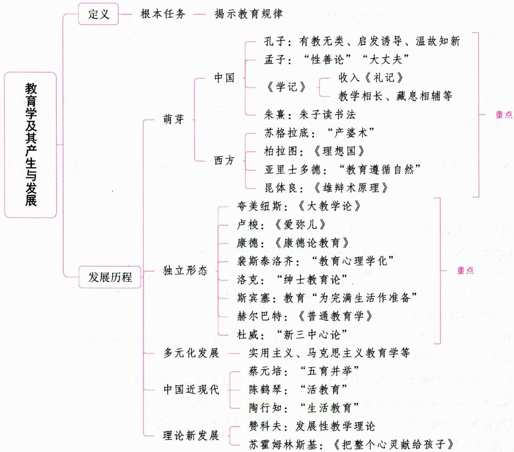

# 一、教育学的内涵 ★★ 【单选、填空、判断、名词解释、简答】

# 考点1 教育学的定义

教育学是研究教育现象和教育问题，揭示教育规律的一门科学。教育学的根本任务是揭示教育规律。

教育现象是教育活动在运动发展中的表现形式, 是教育活动外在的、表面的特征, 包括教育社会现象和教育认识现象。教育现象被认识和研究, 便成为教育问题。教育问题是推动教育学发展的内在动力。

教育规律是教育现象与其他社会现象及教育现象内部各个要素之间本质的、内在的、必然的联系或关系。教育最基本的规律有两条：（1）关于教育与社会发展关系的规律，我们称之为教育的外部关系规律；（2）关于教育和人的发展关系的规律，我们称之为教育的内部关系规律。

# 小香课堂·

关于教育学的研究对象，在教育学界存在着各种各样的观点：有的学者认为教育学的研究对象是“教育现象”；有的学者认为是“教育问题”；有的学者认为是“教育现象和教育问题”；等等。考生在做题时可根据试题的情况进行具体分析，灵活应对。

真题1 [2024浙江嘉兴,名词解释]教育学

答案：详见内文

# 考点2 教育学与教育、教育科学的关系

# 1. 教育学与教育的关系

教育与教育学的关系具体表现为：(1)教育实践孕育了作为一门知识的教育学。教育学作为一门知识的历史要比教育学作为一门学科的历史悠久得多。(2)教育实践规训了作为一门学科的教育学。

# 2. 教育学与教育科学的关系

教育学是庞大教育科学体系中的基础学科。教育科学是有关教育问题的各种科学理论的学科群，它包含教育社会学、教育经济学、教学论、课程论、教育技术学等。教育学研究的是教育基本的、一般的问题，是从总体上分析教育问题的，而其他学科则是从某个角度对某个方面问题的研究。

真题2 [2022山东济南，单选]教育科学有诸多的分支学科，其中在整个教育科学体系中处于基础地位的是（）

A.教育哲学

B.教育心理学

C. 教育学

D.教学论

答案：C

# 考点3 教育学的价值

(1)反思日常教育经验。(2)科学解释教育问题。(3)沟通教育理论与实践。教育学发展的“源”在教育实践。教育实践不仅是教育理论的源泉，还是检验教育理论正确与否的标准。但当某一教育理论形成以后，就成为影响以后教育思想发展的“流”，成为现成的思想体系，反过来指导教育实践的发展。教育学扮演着一种“中介”或“桥梁”的作用，沟通着教育理论与教育实践。

# 考点4 学习和研究教育学的意义

(1)有利于树立正确的教育观，掌握教育规律，指导教育实践；  
(2)有利于树立正确的教学观,掌握教学规律,提高教学质量;   
(3)有利于掌握学生思想品德发展规律，做好教书育人工作；  
(4)有利于建构教师合理优化的知识结构，提高教育理论水平和实际技能。

# 二、教育学的发展历程 【单选、多选、不定项、填空、判断、名词解释、简答】

# 考点1 教育学的萌芽阶段 ★★★

# 1. 中国萌芽阶段的教育思想

(1)孔子的教育思想

孔子是我国春秋末期的思想家和教育家,儒家学派的创始人。他的教育思想主要体现在《论语》一书中。

表 1-8 孔子的教育思想  

<table><tr><td>学说核心</td><td colspan="2">以“仁”为学说核心和最高道德标准,强调忠孝和仁爱</td></tr><tr><td>教育对象</td><td colspan="2">有教无类(孔子的办学方针);“自行束脩以上,吾未尝无诲焉”</td></tr><tr><td>教育目的</td><td colspan="2">培养德才兼备的从政君子;“仕而优则学,学而优则仕”(此话虽为子夏所述,但代表了孔子的教育观点)</td></tr><tr><td>教育作用</td><td colspan="2">①社会作用:庶、富、教。孔子认为人口、财富和教育是立国的三个要素,教育事业的发展,要建立在经济发展的基础上。孔子是中国历史上最先论述教育与经济发展关系的教育家。
②个体作用:“性相近也,习相远也”。孔子肯定了教育在人的发展过程中的关键作用,为人人有可能受教育、人人都应当受教育提供了理论依据</td></tr><tr><td>教育内容</td><td colspan="2">①整理修订《诗》《书》《礼》《易》《春秋》,奠定儒家教育内容的基础,但孔子对弟子们普遍传授的主要教材是《诗》《书》《礼》《乐》四种。
②道德教育居于首要地位,《论语·述而》中提到:“子以四教:文、行、忠、信。”
③教学内容的特点:偏重社会人事,偏重文事,轻视科技与生产劳动</td></tr><tr><td rowspan="4">教学原则与方法</td><td>启发诱导</td><td>孔子曾说:“不愤不启,不悱不发。举一隅不以三隅反,则不复也。”朱熹解释为:愤者,心求通而未得之意;悱者,口欲言而未能之貌;启,谓开其意;发,谓达其辞。(孔子是世界上最早提出启发式教学的教育家,比苏格拉底提出的“产婆术”早几十年)</td></tr><tr><td>因材施教</td><td>①因材施教的前提是承认学生间的个体差异,并了解学生特点,在了解的基础上有针对性地进行教育。孔子了解学生最常用的方法有两种:通过谈话、个别观察。
②《论语》中有多处记述,如“求也退,故进之;由也兼人,故退之”“中人以上,可以语上也;中人以下,不可以语上也”</td></tr><tr><td>学、思、行相结合</td><td>强调学思结合,两者并重而不偏,提出“学而不思则罔,思而不学则殆”;还强调学习与行动相结合,要求学以致用</td></tr><tr><td>温故知新</td><td>“温故而知新,可以为师矣”</td></tr><tr><td>教师观</td><td colspan="2">学而不厌、温故知新、海人不倦、以身作则、爱护学生、教学相长</td></tr></table>

# 小香课堂·

关于孔子提出的“有教无类”的原意, 历来有不同的理解, 关键在于对“类”作何解释。东汉的马融以及梁朝的皇侃都把“类”解释为“种类”。“有教无类”本来的意思是: 不分贵贱贫富和种族, 人人都可以入学受教育。需要注意的是, 孔子的“有教无类”“因材施教”等思想属于古代朴素的教育平等观, 反映了古代思想家对教育平等的追求, 但仍以阶级分层为基础, 带有特定历史阶层的等级观念, 因此并不是真正的教育平等。

真题3 [2024江苏宿迁,单选]先秦时期，“不愤不启，不悱不发”这句话出自（）

A.《学记》

B.《论语》

C. 四书五经

D.《说文解字》

真题4 [2023安徽蚌埠，单选]在教育学史上，提出“庶”“富”“教”观点的教育学家是（）

A. 孔子

B. 孟子

C.墨子

D. 苟子

真题5 [2022广西桂林，判断]荀子是世界上第一个提出启发式教学的人。（）

答案：3.B 4.A 5.×

# (2)孟子、荀子、墨家和道家的教育思想

表 1-9 孟子、荀子、墨家和道家的教育思想  

<table><tr><td>学者(学派)</td><td>教育思想</td></tr><tr><td>孟子</td><td>①持“性善论”,这是其教育思想的基础。认为教育的意义在于“存心养性”,使固有的善性得到保持。
②孟子第一次明确地概括出中国古代学校教育的目的——“明人伦”,又说明教育就是通过实现“明人伦”来为政治服务的。具体说来,“人伦”就是五对关系:“父子有亲,君臣有义,夫妇有别,长幼有序,朋友有信。”
③孟子追求“大丈夫”的理想人格,即“富贵不能淫,贫贱不能移,威武不能屈”。其实现主要靠人的内心修养:持志养气、动心忍性、存心养性、反求诸己。
④孟子认为教学活动要体现理性特点,要遵循和发展人的内在能力,他提出了:A. “深造自得”。深入地学习和钻研,有自己的收获和见解。“尽信《书》,则不如无《书》。”B. “盈科而进”。学习和教学过程要循序渐进。C. “教亦多术”。对不同情形的学生采取不同的教法。D. “专心致志”。学习必须专心致志,不能三心二意</td></tr><tr><td>荀子</td><td>①持“性恶论”,认为教育的作用是“化性起伪”,可以通过教育和学习来改变自己的本性,使人具有适应社会生活的道德智能。
②要求教育培养推行礼法的“贤能之士”,或者说具有儒家学者身份且长于治国理政的各级官僚。把当时的儒者划分为几个层次,即俗儒、雅儒、大儒,教育应当以大儒为理想目标。
③对孔子的六经进行了继承与改造,以“五经(《诗》《书》《礼》《乐》《春秋》)”为教育内容,以《礼》为重点。“礼”是荀子整个教育理论的核心。
④认为完整的学习过程是由感性认识到理性认识,再到行动的过程,即闻一见一知一行。“不闻不若闻之,闻之不若见之,见之不若知之,知之不若行之。学至于行之而止矣。行之,明也;明之为圣人。”
⑤在先秦儒家诸子中,最为提倡尊师,把教师提到与天地、祖宗并列的地位,将教师视为治国之本。
⑥在《致士篇》中对教师提出了很严格的要求:“师术有四,而博习不与焉。尊严而悖,可以为师;耆艾而信,可以为师;诵说而不陵不犯,可以为师;知微而论,可以为师。”意思是教师必须具备一些基本条件:有尊严,使人肃然起敬;有崇高的威信和丰富的教学经验;表达问题条理清楚、逻辑性强、语言规范,且不违背师说;能体会“礼法”的精微之处,又能进行恰当地阐发</td></tr><tr><td>墨家
(墨翟)</td><td>①主张教育目的是培养实现“兼相爱,交相利”社会理想的人,即“兼士”或“贤士”。具体标准有三条:
“博乎道术”“辩乎言谈”“厚乎德行”,即知识技能的要求、思维论辩的要求和道德的要求。
②以“兼爱”“非攻”为教,注重文史知识的掌握和逻辑思维能力的培养,还注重实用技术的传习。
③教育内容的特色和价值主要体现在科学技术教育和训练思维能力的教育上,它们突破了儒家六艺教育的范畴,堪称一大创造。
④认为人的知识来源可分为三个方面:“亲知”“闻知”和“说知”。前两种都不可靠,必须重视“说知”,即依靠类推和明故的方法来获得知识</td></tr><tr><td>道家
(老子、庄子)</td><td>①主张“绝圣弃智”“绝仁弃义”,引申为“绝学”“愚民”,认为“绝学无忧”。
②根据“道法自然”的哲学,道家主张回归自然,“复归”人的自然本性,一切任其自然,便是最好的教育。
③提倡怀疑的学习方法,讲究辩证法,提倡“用反”“虚静”等充满辩证法思想的教育教学原则</td></tr></table>

# 真题6 [2024浙江金华,单选]下列属于孟子的教育思想的是( )

A. 性善论

B. 性恶论

C. 道法自然

D. 兼爱

真题7 [2024江苏常州，单选]把学习过程划分为“闻、见、知、行”的教育家是（）

A. 孔子

B. 苟子

C.墨子

D. 孟子

真题8 [2024江苏南通, 单选]墨家教育内容的特色和价值主要体现在( )和训练思维能力的教育上。

A.理想的大丈夫人格

B.学、思、行相结合

C. 科学技术教育

D.遵循自然规则

答案：6.A 7.B 8.C

(3)《大学》的教育思想

《大学》是儒家学者论述大学教育的一篇论文, 它对大学教育的目的、程序和要求作了完整的概括。《大学》开头就说: “大学之道, 在明明德, 在亲民, 在止于至善。”这是儒家对大学教育目的和为学做人目标的纲领性表达, “明明德”“亲民”“止于至善”被称为“三纲领”。大学教育的终极目标是“止于至善”,每个人都应在其不同身份时做到尽善尽美。为了实现“三纲领”, 《大学》进一步提出八个步骤: 格物、致知、诚意、正心、修身、齐家、治国、平天下。这就是“八条目”。

(4)《学记》的教育思想

《学记》(收入《礼记》)是中国也是世界教育史上的第一部教育专著, 成文大约在战国末期, 它被称为 “教育学的雏形”。它比较系统和全面地总结和概括了我国先秦时期的教育经验, 强调了教育为社会政治服务的目的, 从而把教育与个人发展和社会进步密切联系起来, 尤其突出了教育的政治功能, 形成了中国古代教育的突出特色。《学记》开篇阐述了教育的目的: “建国君民, 教学为先” “君子如欲化民成俗, 其必由学乎”, 揭示了教育的重要性以及教育与政治的关系。《学记》中总结的教学原则主要包括:

表 1-10 《学记》中的教学原则  

<table><tr><td>教学原则</td><td>引文示例</td></tr><tr><td>教学相长</td><td>“虽有嘉肴,弗食,不知其旨也;虽有至道,弗学,不知其善也。是教学然后知不足,教然后知困。知不足,然后能自反也;知困,然后能自强也。故曰:教学相长也”</td></tr><tr><td>尊师重道</td><td>“凡学之道,严师为难。师严然后道尊,道尊然后民知敬学”(教师观)</td></tr><tr><td>藏息相辅</td><td>“大学之教也,时教必有正业,退息必有居学。不学操缦,不能安弦;不学博依,不能安诗;不学杂服,不能安礼。不兴其艺,不能乐学。故君子之于学也,藏焉修焉,息焉游焉”(正课学习与课外练习兼顾,课内与课外相结合,相互补充)</td></tr><tr><td>豫时孙摩</td><td>“禁于未发之谓豫”(预防性原则,要在不良倾向尚未发作时就采取预防措施);“当其可之谓时”(及时施教原则,要把握教学的最佳时机,适时进行);“不陵节而施之谓孙”(循序渐进原则,教学要遵循一定的顺序进行);“相观而善之谓摩”(学习观摩原则,学习中要相互观摩,取长补短)</td></tr><tr><td>启发诱导</td><td>“故君子之教,喻也。道而弗牵,强而弗抑,开而弗达。道而弗牵则和,强而弗抑则易,开而弗达则思;和易以思,可谓善喻矣”(反对死记硬背,主张启发式教学。强调开导学生,但不要牵着学生走;对学生提出较高的要求,但不能使学生灰心;指出解决问题的途径,但不提供现成的答案)</td></tr><tr><td>长善救失</td><td>“学者有四失,教者必知之。人之学也,或失则多,或失则寡,或失则易,或失则止。此四者,心之莫同也。知其心,然后能救其失也。教也者,长善而救其失者也”</td></tr></table>

此外，《学记》还主张“学不躁等”，即教学要遵循学生的心理发展特点，循序渐进；同时，提出“善歌

者，使人继其声；善教者，使人继其志”“善学者，师逸而功倍，又从而庸之”等。

# 小香课堂

《学记》中的“教学相长”有本义与引申义之分。“教学相长”的本义并非指教与学双方的相互促进，而是指教师以教为学。它说明了教师本身的学习是一种学习，而教导他人的过程也是一种学习。正是这两种不同形式的学习相互推动，使教师不断进步。但后人在注释“教学相长”时，对其作了引申，将它视为教学过程中教师、学生双方互相促进、共同提高的过程。

真题9 [2023黑龙江哈尔滨，单选]世界上最早的教育学著作是（）

A.《大教学论》

B.《学记》

C.《普通教育学》

D.《论演说家的教育》

真题10 [2024福建统考，填空]成书于我国战国后期的《________》，概括出了许多重要的教学原则。

真题11[2023河北衡水，判断]“是故学然后知不足，教然后知困。知不足，然后能自反也；知困，然后能自强也。故曰：教学相长也。”这句话出自《大学》。（）

A. 正确

B. 错误

答案：9.B 10.学记 11.B

# (5)朱熹的教育思想

朱熹是南宋著名理学家、教育家，其整理编撰的儒家基本读物中，《四书章句集注》（简称《四书集注》）对后世影响最大。

①关于教育目的、作用。朱熹将人性分成“天命之性”（绝对至善）和“气质之性”（有善有恶），认为教育的作用就在于“变化气质”，强调学校教育的目的是“明人伦”。  
②论“大学”与“小学”教育。朱熹把人受教育的过程大略划分为两个阶段: “小学”阶段, 主要是“教以事”, 让儿童懂得基本的伦理道德规范, 养成一定的行为习惯, 学到初步的文化知识技能; “大学”阶段主要是“教以理”, 即重在探究“事物之所以然”。  
③学习阶段。朱熹将《论语》和《中庸》中的思想纳入教育活动中,把教育活动分为“博学、审问、慎思、明辨、笃行”五个阶段。  
④朱子读书法。朱熹强调读书穷理，他的弟子汇集他的训导归纳为“朱子读书法”六条。

表 1-11 朱子读书法  

<table><tr><td>读书方法</td><td>解释</td><td>读书原则</td></tr><tr><td>循序渐进</td><td>一是读书应该按照一定次序,前后不要颠倒;二是应根据自己的实际情况和能力,安排读书计划,并切实遵守;三是不可囫囵吞枣,急于求成</td><td>量力性原则</td></tr><tr><td>熟读精思</td><td>读书既要熟读成诵,又要精于思考。在这方面,他有一句十分精辟的论述,即“大抵观书,先须熟读,使其言皆若出于吾之口;继以精思,使其意皆若出于吾之心,然后可以有得尔”</td><td>巩固性原则</td></tr><tr><td>虚心涵泳</td><td>“虚心”是指读书时要虚怀若谷,静心思虑,仔细体会书中的意思,不要先入为主,牵强附会;“涵泳”是指读书时要反复咀嚼,细心玩味</td><td>客观性原则</td></tr><tr><td>切己体察</td><td>读书不能仅停留在书本上、口头上，而必须见之于自己的实际行动，要身体力行</td><td>结合实际原则</td></tr><tr><td>着紧用力</td><td>一是必须抓紧时间；二是必须抖擞精神</td><td>积极性原则</td></tr><tr><td>居敬持志</td><td>“居敬”即读书时精神专一，注意力集中；
“持志”即树立远大的志向，高尚的目标，并以顽强的毅力长期坚持</td><td>目的性原则</td></tr></table>

⑤道德教育方法。道德教育是理学教育的核心，也是朱熹教育思想的重要内容。朱熹关于道德教育的方法，可以概括为以下几点：

立志。朱熹认为，志是心之所向，对人的成长至关重要。他要求学者首先应该树立远大的志向。

居敬。这要从两方面努力：“内无妄思”，即自觉抑制人欲的诱惑，自觉执守封建伦理道德；“外无妄动”，即在服饰动作、言语态度等外貌方面“整齐严肃”，符合封建伦理道德规范。

存养。朱熹认为每个人都有与生俱来的善性，但同时又有气质之偏和物欲之蔽。因此，需要用“存养”的功夫，来发扬善性，发明本心。

省察。“省”是反省，“察”是检查。“省察”即经常进行自我反省和检查。

力行。朱熹所说的“力行”，是要求将学到的伦理道德知识付之于自己的实际行动，转化为道德行为。

真题12 [2023河南驻马店，单选]朱熹把教育分为“小学”和“大学”两个阶段，其中“小学”以（）

A. 识字为主

B. 穷理为主

C. 读书为主

D.学事为主

真题13 [2023河北石家庄, 单选]朱熹强调读书穷理, 认为“为学之道, 莫先于穷理; 穷理之要, 必在于读书”。他的弟子汇集他的训导, 概括归纳出“朱子读书法”六条, 其中, “熟读精思”这条体现了读书的（）

A. 目的性原则

B. 客观性原则

C. 量力性原则

D. 巩固性原则

答案：12.D 13.D

(6)王守仁的教育思想

①论教育作用。实现“存天理、灭人欲”的根本任务。基于此,他认为用功求学受教育,并不是为了增加什么新内容,而是为了日减“人欲”。他说:“吾辈用功只求日减,不求日增,减得一分人欲,便是复得一分天理。”  
②论道德教育。以“知行合一”思想为指导，强调道德践履和实际行动对于道德教育和修养的重要性，提出了四个基本主张：静处体悟、事上磨炼、省察克治、贵于改过。  
③论儿童教育。他的儿童教育思想: 第一, 揭露和批判传统儿童教育不顾儿童的身心特点; 第二, 儿童教育必须顺应儿童的性情; 第三, 儿童教育的内容是“歌诗”“习礼”和“读书”; 第四, 要“随人分限所及”, 量力施教。

真题14 [2023河南洛阳, 单选]王守仁是明朝杰出的思想家、文学家、教育家, 他继承了我国古代儒家教育的传统, 把道德教育与修养放在学校教育工作的首要地位。在道德教育和修养的方法上, 他提出了四个基本主张, 其中不包括( )

A. 静处体悟

B. 事上磨炼

C. 省察克治

D. 居敬持志

答案：D

# 2. 西方萌芽阶段的教育思想

西方教育学的思想主要源于古希腊的哲学家苏格拉底、柏拉图和亚里士多德。

(1)苏格拉底

苏格拉底是古希腊著名的哲学家、教育家，在西方哲学史上开辟了从自然哲学向伦理哲学转变的新阶段，他视道德观念为天生，认为德育的任务是将它“接生”出来。其思想主要有：

①教育的目的和首要任务。苏格拉底认为教育的目的是培养治国人才，教育的首要任务是培养道德。“美德即知识”的思想是苏格拉底教育思想的一个重要内容。  
②“产婆术”。苏格拉底在向人传授知识时不是强制别人接受，而是发明和使用了以师生共同谈话、共同探讨问题而获得知识为特征的问答式教学法，这种方法被后世称为“产婆术”（又称“苏格拉底法”或“苏格拉底问答法”），具体分为三步：第一步称为苏格拉底讽刺，他认为这是使人变得聪明的一个必要的步骤，因为除非一个人很谦逊，“自知其无知”，否则他不可能学到真知；第二步称为定义，在问答中经过反复诘难和归纳，从而得出明确的定义和概念；第三步称为助产术，引导学生自己进行思索，自己得出结论。也有说法认为，“产婆术”分为四个步骤：讽刺（讥讽）、助产术、归纳、定义（下定义）。

真题15 [2024河南事业单位，单选]提出“道德观念为天生，德育的任务是将它‘接生’出来”观点的是（）

A. 苏格拉底

B. 亚里士多德

C. 柏拉图

D. 赫尔巴特

真题16 [2024山西太原, 单选]有一种被称为“产婆术”的教学法, 鼓励师生共同讨论辩论。该思想的提出者是（）

A. 昆体良

B. 亚里士多德

C. 柏拉图

D. 苏格拉底

答案：15.A 16.D

(2)柏拉图

柏拉图是西方第一个提出实施初等义务教育的思想家，他的教育思想集中体现在他的代表作《理想国》中，他认为教育与政治有着密切的联系。其思想主要有：

①哲学观和政治观。柏拉图把可见的“现实世界”与抽象的“理念世界”区分开来，认为“现实世界”不过是“理念世界”的摹本和影子，从而建立了本质思维的抽象世界，教育可以使人从“现实世界”走向“理念世界”。据此，他认为人的肉体是人的灵魂的影子，灵魂才是人的本质。灵魂是由理性、意志、情感三部分构成的，理性是灵魂的基础。理性表现为智慧，意志表现为勇敢，情感表现为节制。根据这三种品质哪一种在人的德行中占主导地位，他把人分成哲学家、军人和劳动者三个等级或集团。另外，在认识论上，柏拉图主张学习即回忆，“认识就是回忆”，学习并不是从外部得到什么东西，它只是回忆灵魂中已有的知识。

②《理想国》中的教育观。第一, 理想国中教育的最高目标是培养哲学家兼政治家——哲学王, 教育的最终目的是促使“灵魂转向”。第二, 女子应和男子受同样的教育, 从事同样的职业。第三, 重视早期教育, 他是“寓学习于游戏”的最早提倡者, 要求不强迫孩子学习, 主张采用做游戏的方法, 在游戏中更好地了解每个孩子的天性。

在西方教育思想史上，柏拉图的《理想国》、卢梭的《爱弥儿》、杜威的《民主主义与教育》被称为三个里程碑。

真题17 [2023辽宁锦州, 单选]( )认为教育的最高目标是培养哲学家兼政治家——哲学王，教育的最终目的是促使“灵魂转向”；认为女子应当和男子接受同样的教育，从事同样的职业。

A. 维多利诺

B. 柏拉图

C. 亚里士多德

D. 昆体良

答案：B

(3)亚里士多德

亚里士多德是古希腊百科全书式的哲学家,他秉承了柏拉图的理性说,认为追求理性就是追求美德,就是教育的最高目的。亚里士多德的教育思想主要体现在他的著作《政治学》中。其教育思想主要有:

①灵魂论。亚里士多德将人的灵魂分为三个部分：营养的灵魂、感觉的灵魂和理性的灵魂。灵魂论为教育必须包括体育、德育、智育提供了人性论上的依据。亚里士多德认为智力的健全依赖于身体的健全，主张体育先于智育进行。  
②普遍的公立的教育。亚里士多德认为，教育应该是国家的，每一个公民都属于城邦，所有的人都应受同样的教育，“教育事业应该是公共的，而不是私人的”。  
③教育遵循自然。亚里士多德在教育史上首次提出了“教育遵循自然”的观点, 他最早提出教育要适应儿童的年龄阶段, 进行德智体多方面和谐发展的教育。  
④文雅教育（自由教育）。文雅教育最早由亚里士多德提出，是其教育思想的重要组成部分。亚里士多德认为，人只有充分运用和发展理性，才能获得身心的自由发展。要实现文雅教育，需要具备两个基本条件：闲暇时间和自由学科。

真题18 [2022贵州贵阳，判断]夸美纽斯是第一个提出“教育遵循自然”的人。（）

答案：×

(4)昆体良

昆体良是古罗马教学法大师，他是西方教育史上第一个专门论述教育问题的教育家。其代表作《雄辩术原理》（《论演说家的教育》或《论演说家的培养》）是西方最早的教育著作，也是古代西方的第一部教学法论著，被誉为“欧洲古代教育理论发展的最高成就”。其教育思想主要有：

①学习过程。昆体良总结了他在修辞学校长期培养演说家的经验，提出了“模仿、理论、练习”三个循序渐进的学习过程。  
②教学组织形式。在教学的组织形式方面，昆体良提出了分班教学的思想，主张把学生分成班级，在同一时间由教师对全班学生而不是对个别学生进行教学。这是班级授课制思想的萌芽。  
③教学原则与方法。昆体良的一个重要见解是反对体罚，他是最早提出反对体罚的教育家。他认为体罚是对儿童的凌辱，会使儿童心情压抑、沮丧和消沉，对儿童的成长产生非常消极的后果。与此相联系，他强调运用奖励的方法。

# 考点2 教育学的独立形态阶段 ★★★

17世纪以后, 教育学的发展进入了一个新的阶段, 逐渐形成一门独立的学科。近代实验科学鼻祖培根首次提出把教育学作为一门独立的学科, 他提出的归纳法为教育学的发展奠定了方法论基础。

# 小香课堂·

教育学的学科形成时期是指教育学成为一门独立学科所经历的时期。由于认定学科形成的标准不同，人们对教育学成为一门独立学科的标志有不同的看法。一般认为，这个时期的起点是17世纪捷克教育家夸美纽斯《大教学论》的问世，终点是19世纪初德国教育家赫尔巴特《普通教育学》的发表。

# 1. 夸美纽斯

捷克教育家夸美纽斯深受人文主义精神影响, 具有强烈的民主主义思想, 他在教育学的创立过程中, 取得了突出的成就, 其 1632 年出版的《大教学论》是教育学开始形成一门独立学科的标志, 该书被认为是近代第一本教育学著作。夸美纽斯的教育观点主要有:

(1)泛智教育。夸美纽斯从他的民主主义的“泛智”思想出发，提出了普及教育的思想。所谓“泛智”，就是指把一切有用的东西教给一切人，并使其智慧得到普遍发展的理  
论。他认为教学应当成为“把一切事物教给一切人类的全部艺术”, 提出“一切男女青年都应该进学校”。为此他编写了很多教材, 如《世界图解》。“泛智论”贯穿于夸美纽斯的教育理论和实践中, 是他从事教育活动的一项重要指导思想。  
(2)教育适应自然原则。这是贯穿夸美纽斯整个教育思想体系的根本性指导原则。主要有两方面的内容: ①自然界存在着普遍秩序, 即自然规律。②教育要适应人的自然本性和儿童年龄特征。夸美纽斯认为秩序是把一切事物教给一切人们的教学艺术的主导原则, 因而教学艺术的根本指导原则就是模仿和遵循自然的秩序。据此, 他在教学上提出了许多原则, 均以自然秩序为学习、模仿和类比的对象。虽然, 他提到的模仿和类比的内容繁多, 但其应用都遵循三个步骤: 模仿、偏差、纠正。  
(3)学制系统。夸美纽斯提出建立全国统一的学校教育制度，他在《大教学论》中提出了一个四阶段的单轨学制：母育学校（婴儿期）、国语学校（儿童期）、拉丁语学校（少年期）和大学（青年期）。  
(4)班级授课制。夸美纽斯确立了班级教学制度及其理论，他提出改革旧的学校内容和课程设置；编写新的全国统一使用的教科书；建立学年制和班级授课制度，废除传统的个别施教等。  
(5)教学原则。夸美纽斯提出并论证了直观性、系统性、量力性、巩固性和自觉性等教学原则。  
(6)德育内容。夸美纽斯把智慧、勇敢、节制、公正这四种品德称为主要的或基本的德行，还纳入了一个在当时是崭新的概念——劳动教育。

真题19 [2023辽宁营口，单选]在教学上，夸美纽斯提到的模仿和类比的内容繁多，但其应用都遵循三个步骤（）

A.观察、练习、内化

B. 冲动、练习、应用

C. 好奇、提问、引导

D. 模仿、偏差、纠正

真题20 [2024江苏苏州，填空]教育学作为一门独立学科开始于夸美纽斯的

答案：19.D 20.《大教学论》

# 2. 卢梭

卢梭是坚定的“性善论”者，他高度尊重儿童的天性，倡导自然教育。卢梭于1762年出版的教育小说《爱弥儿》系统阐述了他的自然主义教育思想，强调教育活动必须注重感性、直观，必须遵循儿童的自然本性。“出自造物主之手的东西都是好的，而一到了人的手里，

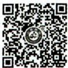  
卢梭的教育思想

就全变坏了”是《爱弥儿》的开篇第一句。该书最大的贡献在于开拓了以研究儿童生长与教育的关系的教育研究新领域, 提升了儿童在教育过程中的地位, 促进了近现代教育思想的变革。

(1)自然教育的目标。卢梭在《爱弥儿》中表示, 自然教育的最终培养目标是“自然人”。一方面, 他认为善良的人性存在于纯洁的自然状态之中, 只有“回归自然”、远离喧嚣社会的教育, 才有利于保持人的善良天性; 另一方面, 他说每个人都是由自然的教育、事物的教育、人为的教育三者培养起来的, 只有这三种教育圆满结合才能达到预期的目的。

(2)“消极教育”与“自然后果”法。所谓“消极教育”，即成人的不干预、不灌输、不压制和让儿童遵循自然率性发展。但“消极教育”并非无所作为，还有两件事要做：①观察自由活动中的儿童，了解他的自然倾向和特点；②防范来自外界的不良影响。所谓“自然后果”法，即杜绝常规的教育模式，让儿童通过亲身体验自己错误行为所产生的不良后果，从中受到教育并改正错误。

(3)教育阶段论。卢梭在《爱弥儿》中将儿童的成长发育划分为四个年龄阶段：

①幼儿期(0~2岁)。教育以身体的养护和锻炼为主，即重点为体育和保健。

②儿童期（2～12岁）。这一阶段的儿童处于“理性睡眠期”，这一时期的教育应是消极的，不适合进行理性教育，不适合学习文化知识，主要是防止儿童产生偏见和谬误，防止他染上恶习，沾上罪恶。教育的主要任务是注意儿童感觉器官的发展，进行感官教育，使儿童获得丰富的感觉经验，为以后的理性教育奠定感觉经验的基础。

③少年期（12～15岁）。教育的主要任务是智育和劳动教育：让少年学习生活所必要的和实用的知识，培养少年的学习兴趣，教给少年学习的方法；让少年通过劳动发展自己的体力，掌握专门的手艺。

④青年期（15~20岁）。教育的主要任务是着重发展道德教育和宗教教育，使青年形成良好的德行，以帮助青年在社会中生活并处理好群己关系。

卢梭被称为教育史上第一个发现儿童的人。他的自然主义教育思想被誉为“旧教育”和“新教育”的分水岭。

# ·记忆有妙招·

为方便考生记忆，编者将卢梭的教育思想总结成以下口诀：

卢梭自然爱弥儿。卢梭倡导自然教育，其代表作是《爱弥儿》。

真题21 [2022浙江温州，单选]教育史上系统阐述自然教育思想的著作是（）

A.《教育漫话》

B.《爱弥儿》

C.《大教学论》

D.《林哈德与葛笃德》

答案：B

# 3.康德

康德的教育思想主要反映在《康德论教育》一书中。他认为“人是唯一需要教育的动物”“人只有通过教育才能成为一个人。人是教育的产物”，教育的根本就是要对人的本性进行适当的控制，教育的最终目的就在于培养有道德的人。关于道德教育，康德提出虽然自由是道德教育的最高目的，但是必要的“管束”和“训导”是实现自由的必要保证。教育学作为一门学科在大学里讲授，最早始于德国哲学家康德。他从1776年开始在德国哥尼斯堡大学的哲学讲座中讲授教育学。

# 4. 裴斯泰洛齐

裴斯泰洛齐是享有世界盛誉的瑞士著名教育家，他的教育思想主要反映在他的教育小说《林哈德与葛笃德》中。其教育思想主要有：

(1)论教育心理学化。在西方教育史上, 也可以说在世界教育史上, 裴斯泰洛齐是第一个明确提出“教育心理学化”口号和诉求的教育家。所谓“教育心理学化”就是把教育提高到科学的水平, 将教育科学建立在人的心理活动规律的基础上。

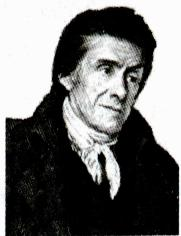  
裴斯泰洛齐

(2)论要素教育。要素教育论的基本思想,就是认为初等学校从它的本质讲,要求普遍地简化它的方法,初等学校的各种教育都应该从最简单的要素开始,然后逐渐转到日益循序渐进地促进人的和谐发展。裴斯泰洛齐认为儿童智力的最初萌芽是对事物的感觉、种能力的最初萌芽又与儿童眼前事物的最基本、最简单的外部特征,即数目、形状和名称,认识这三个要素的相应能力是计算、测量和表达,可培养这三种能力的学科是算术、几何和

(3)论初等学校各科教学法。裴斯泰洛齐根据教育心理学化和要素教育的理论，具体地研究了初等学校各科教学法，他是现代初等学校各科教学法的奠基人。  
(4)论教育目的。裴斯泰洛齐认为教育的目的在于按照自然的法则全面地、和谐地发展儿童的一切天赋力量。  
(5)关于教育与生产劳动相结合。裴斯泰洛齐虽不是第一个提出教育与生产劳动相结合思想的人,但他是西方教育史上第一个将这一思想付诸实践的教育家,并在自己的实践活动中推动和发展这一思想。

# ·记忆有妙招·

为方便考生记忆，编者将裴斯泰洛齐的教育思想总结成以下口诀：

裴齐要诉心里话。裴斯泰洛齐主张要素教育论，第一次明确提出“教育心理学化”口号。

真题22 [2024山东临沂，单选]世界教育史上第一个明确提出“教育心理化”的教育家是（）

A. 赫尔巴特

B. 裴斯泰洛齐

C. 夸美纽斯

D. 康德

真题23 [2024天津实验小学，单选]最早提出教育的目的在于按照自然的法则全面地、和谐地发展儿童的一切天赋力量的教育学家是（）

A. 裴斯泰洛齐

B. 康德

C. 杜威

D. 夸美纽斯

真题24 [2023河北石家庄，多选]裴斯泰洛齐认为，在一切知识中都存在着一些最简单的“要素”。儿童智力的最初萌芽是对事物的感觉与观察能力，这种能力的萌芽又与儿童眼前事物的最基本、最简单的外部特征即数目、形状和名称相统一。儿童认识这三个要素的相应能力是计算、测量和表达，可培养这三种能力的学科有（）

A.地理

B. 几何

C. 语文

D. 算术

答案：22.B 23.A 24.BCD

# 5. 洛克

洛克反对天赋观念，提出了“白板说”。他认为人的心灵原来就像一块白板，没有一切特性，没有任何观念，天赋的智力人人平等。他明确指出，“我们日常所见的人中，他们之所以或好或坏，或有用或无用，十分之九都是他们的教育所决定的。人之所以千差万别，便是由于教育之故。”洛克主张取消封建

等级教育，人人都可以接受教育。

洛克是英国著名的实科教育和绅士教育的倡导者。他认为, 教育目的就是培养绅士, 而这种培养只能通过家庭教育, 由此提出了 “绅士教育论”。在其著作《教育漫话》一书中, 洛克详细论述了绅士教育的内容 (即体育、德育和智育) 及方法。他首次把教育的三大组成部分——德育、智育、体育做了明确的区分。在其绅士教育理论体系中, 德育居于首要地位。因为在他看来, 德行是一个绅士必须具备的最重要的品质。他说: “我认为在一个人或一个绅士的各种品性当中, 德行是最重要的, 是第一位的, 他要被人看重, 被人喜爱, 要使自己也感到喜悦, 或者说, 也还过得去, 德行是绝对不可缺少的, 如果没有德行, 我觉得他在今生来世都得不到幸福。”洛克从唯物主义经验论立场和功利主义原则出发, 认为凡是给人带来快乐和幸福的行为就是善, 反之给人带来痛苦和不幸的行为就是恶。

# ·记忆有妙招·

为方便考生记忆，编者将洛克的教育思想总结成以下口诀：

洛克白板画绅士。洛克主张“白板说”，其代表作是《教育漫话》，提出了绅士教育论。

真题25 [2024山东济南，单选]英国哲学家洛克在《教育漫话》一书中，提出完整的（ ）理论体系，对后世产生了较大的影响。

A. 博雅教育

B. 人文教育

C. 绅士教育

D. 科学教学

答案：C

# 6. 斯宾塞

斯宾塞是19世纪英国著名的哲学家、社会学家和教育家，其代表作是《教育论》（1861年）。在《教育论》中，他提出教育的目的是“为完满生活作准备”，并按重要程度把人类生活进行了分类且排序为：(1)直接有助于自我保全的活动；(2)从获得生活必需品而间接有助于自我保全的活动；(3)目的在于抚养和教育子女的活动；(4)与维持正常的社会和政治关系有关的活动；(5)在生活中的闲暇时间用于满足爱好和感情的各种活动。此外，在教学方法方面，斯宾塞主张启发学生学习的自觉性，反对形式教育，重视实科教育。他还明确提出了科学知识最有价值的见解。

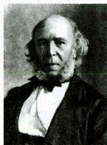  
斯宾塞

真题26 [2022福建统考，单选]主张最有价值的知识是科学，强调教育的任务是为完满生活作准备的教育家是（）

A. 斯宾塞

B. 乌申斯基

C. 夸美纽斯

D. 凯兴斯泰纳

答案：A

# 7.赫尔巴特

赫尔巴特是德国著名的心理学家和教育学家，在世界教育史上被认为是“现代教育学之父”或“科学教育学的奠基人”。他的《普通教育学》的出版（1806年）标志着规范教育学的建立，同时，这本书也被认为是第一本现代教育学著作。其教育思想包括：

(1)教育理论体系的理论基础。赫尔巴特提出教育理论体系的两个理论基础是伦理学和心理学，他把道德教育理论建立在伦理学的基础上，把教学理论建立在心理学的基

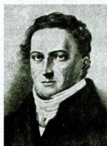  
赫尔巴特

础上, 企图在伦理学的基础上建立教育目的论, 在心理学的基础上建立教育方法论, 可以说是奠定了科学教育学的基础。伦理学即实践哲学, 主要体现为五种道德观念; 心理学就是研究观念的科学。赫尔巴特重视和发展了两个重要的概念, 即“意识阈”和“统觉”。儿童在原有基础上形成新观念的过程称统觉, 教学中的注意、兴趣都与统觉有紧密联系。依据统觉原理, 赫尔巴特为课程设计提出了“相关”和“集中”两项原则, 目的是保持课程教学的逻辑结构和知识的系统性。

(2)教育目的。赫尔巴特认为教育的目的可分为两种：①“可能的目的”，即与儿童未来所从事的职业有关的目的。②“必要的目的”，具体而言就是指养成内心自由、完善、仁慈、正义和公平这五种道德观念。教育的最高目的是道德和性格的完善。  
(3)教育性教学原则。在西方教学史上，赫尔巴特第一次提出了“教育性教学”的概念。他认为教学有不同于教育的特点，“教学的概念有一个显著的标记，它使我们非常容易把握研究方向。在教学中总是有一个第三者的东西为师生同时专心注意的。相反，在教育的其他一切职能中，学生直接处在教师的心目中”。“第三者”即知识，也就是“系统的知识体系”。他还指出“远非一切教学都是教育性的”，但他讲的教学不是任何一种教学，“仅仅是教育性教学”。“教育性教学”指没有任何无教学的教育，也没有任何无教育的教学。  
(4) 儿童管理与训育论。赫尔巴特的道德教育包括训育和儿童管理两方面。他认为教育过程应有一定的顺序, 包括管理、教学和训育三个阶段。管理的目的是在儿童心里“创造一种秩序”, 为以后的教学和训育创造必要的条件; 训育的目的在于形成性格的道德力量。  
(5)课程体系。赫尔巴特根据学生的六种兴趣提出了六种课程：经验的兴趣——自然学科，思辨的兴趣——数学与逻辑，审美的兴趣——艺术学科，同情的兴趣——语言学科，社会的兴趣——社会学科，宗教的兴趣——宗教学科。  
(6)教学四阶段论。赫尔巴特认为任何教学都必须经历四个阶段：

表 1-12 赫尔巴特的教学四阶段论  

<table><tr><td>阶段</td><td>含义</td><td>学生的心理状态</td></tr><tr><td>明了(清楚)</td><td>主要是把新教材分解为各个构成部分,并和意识中相关的观念即已经掌握的知识进行比较</td><td>学生处于“静态的专心活动”中,其心理状态主要表现为“注意”</td></tr><tr><td>联合(联想)</td><td>即建立新旧观念的联系,使学生在新旧观念的联系中继续深入学习新教材</td><td>学生处于“动态的专心活动”中,其心理状态主要表现为“期待”</td></tr><tr><td>系统</td><td>即学生在教师的指导下,在新旧观念联系的基础上进行深入思考,寻求结论和规律</td><td>学生处于“静态的审思活动”中,其心理特征是“探究”“感觉到系统知识的优点”</td></tr><tr><td>方法(应用)</td><td>即通过实际练习,运用系统的知识,使之变得更熟练、更牢固</td><td>学生处于“动态的审思活动”中,其心理特征是“行动”</td></tr></table>

赫尔巴特的教学四阶段论，后来被发展为五段，即预备、提示、联合、总结、应用。

赫尔巴特强调系统知识的传授，强调课堂教学的作用，强调教材的重要性，强调教师的权威作用和中心地位，形成了传统教育“课堂中心”“教材中心”“教师中心”的特点。他的教育思想对19世纪以后的教育实践和教育思想产生了很大影响，被看作是传统教育理论的代表。

# 小香课堂·

在教育学发展过程中，有很多“最早”“第一”的著作易混淆，考生可进行对比记忆：

《学记》——中国及世界最早的教育专著；《雄辩术原理》——西方最早的教育著作；

《大教学论》——近代第一本教育学著作；《普通教育学》——第一本现代教育学著作。

真题27 [2024天津和平，单选]强调教育学的心理学和伦理学基础，奠定了科学教育学的基础的教育家是（）

A. 康德

B. 第斯多惠

C. 赫尔巴特

D. 福禄贝尔

真题28 [2024浙江宁波，判断]赫尔巴特的《普通教育学》是近代最早的一部教育学著作，标志着教育学正式成为一门独立的学科。（）

答案：27.C 28.×

# 8. 杜威

杜威的教育理论是现代教育理论的代表，区别于传统教育“课堂中心”“教材中心”“教师中心”的“旧三中心论”，他提出了“儿童中心（学生中心）”“活动中心”“经验中心”的“新三中心论”。其代表作《民主主义与教育》（又译《民本主义与教育》，1916年）及反映在其作品中的实用主义教育思想，对20世纪的教育和教学有深远影响。作为一个综合而完整的教育思想体系，杜威的教育思想系统阐述了教育与生活、学校与社会、经验与课

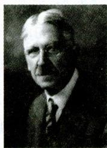  
杜威

程、知与行、思维与教学、教育与职业、教育与道德、儿童与教师八组关系。其主要教育观点包括：

(1)论教育的本质。杜威认为，教育即生活，教育即生长，教育即经验的改组或改造。“教育是生活的过程，而不是将来生活的准备。”此外，杜威还提出“学校即社会”，这是对“教育即生活”的进一步引申。从“教育即生活”到“学校即社会”，再到课程的变革（“从做中学”）是层层递进的。  
(2)论教育的目的。杜威从“教育即生活”中引出他的“教育无目的论”。“教育的过程,在它自身以外没有目的,它就是它自己的目的;教育的过程是一个不断改组、不断改造和不断转化的过程。”  
(3)“从做中学”。在经验论的基础上，杜威提出“从做中学”，要求以活动性、经验性的主动作业取代传统的书本式教材的统治地位。同时，“从做中学”也是杜威提出的教学方法，这是一种经验的方法、思维的方法和探究的方法。这种探究的五个步骤即思维五步说或五步探究教学法，即创设疑难情境、确定疑难所在、提出解决问题的种种假设、推断哪个假设能解决这个困难、验证这个假设。

杜威的教育学说提出以后，西方教育学便出现了以赫尔巴特为代表的传统教育学派和以杜威为代表的现代教育学派的对立局面。

# 记忆有妙招

为方便考生记忆，编者将杜威的主要教育思想总结成以下口诀：

三即两学无目的，还有一个三中心。三即：“教育即生活”“教育即生长”“教育即经验的改组或改造”。两学：“学校即社会”“从做中学”。无目的：“教育无目的论”。三中心：“儿童中心（学生中心）”“活动中心”“经验中心”。

真题29 [2023江苏常州，单选]主张学生中心、活动中心和经验中心的新三中心论的学者是（）

A. 杜威

B. 洛克

C. 赫尔巴特

D. 卢梭

真题30 [2022河南信阳，判断]教育的过程，在它自身以外没有目的，它就是它自己的目的。这是夸美纽斯关于教育目的的观点。（）

答案：29.A 30.×

# 考点 20世纪教育学的多元化发展 ★

表 1-13 20 世纪主要的教育学流派  

<table><tr><td>教育学流派</td><td>代表人物及代表著作</td><td>主要思想</td></tr><tr><td>实验教育学</td><td>拉伊的《实验教育学》、梅伊曼的《实验教育学纲要》以及比纳、霍尔和桑代克</td><td>19世纪末20世纪初产生于德国，以教育实验为标志。其基本观点包括：
(1)反对以赫尔巴特为代表的强调概念思辨的教育学，认为这种教育学对检验教育方法的优劣毫无用途；
(2)提倡把实验心理学的研究成果和方法运用于教育研究，使教育研究“科学化”；
(3)把教育实验分为提出假设、进行实验和确证三个基本阶段；
(4)认为教育实验与心理实验的差别在于心理实验是在实验室里进行的，而教育实验则要在真正的学校环境和教学实践活动中进行；
(5)主张用实验、统计和比较的方法探索儿童心理发展过程的特点及其智力发展水平，用实验数据作为改革学制、课程和教学方法的依据。
实验教育学所强调的定量研究成为20世纪教育学研究的一个基本范式，极大地推动了教育科学的发展</td></tr><tr><td>文化教育学
(精神科学
教育学)</td><td>狄尔泰的《关于普遍妥当的教育学的可能》、斯普兰格的《教育与文化》、利特</td><td>19世纪末出现在德国，其基本观点包括：
(1)人是一种文化的存在，人类历史是一种文化的历史；
(2)教育的过程是一种历史文化过程；
(3)教育的研究既不能采用赫尔巴特纯粹的概念思辨来进行，也不能依靠实验教育学的数量统计来进行，而必须采用精神科学或文化科学的方法，亦即理解与解释的方法进行；
(4)教育的目的是促进社会历史的客观文化向个体的主观文化转变，并将个体的主观世界引导向博大的客观文化世界，从而培养完整的人格，而培养完整人格的主要途径就是“陶冶”与“唤醒”，发挥教师和学生个体两方面的积极作用，建构和谐的、对话的师生关系</td></tr><tr><td>实用主义教育学</td><td>杜威的《民主主义与教育》、克伯屈的《设计教学法》</td><td>19世纪末20世纪初兴起于美国，对20世纪整个世界的教育理论研究和教育实践发展产生了极大的影响。其基本观点包括：
(1)教育即生活，教育的过程与生活的过程是合一的；
(2)教育即学生个体经验持续不断的增长，除此之外教育不应该有其他目的；
(3)学校是一个维形的社会；
(4)课程组织应以学生的经验为中心；
(5)师生关系以儿童为中心；
(6)教学过程注重学生自己的独立发现、表现和体验，尊重学生发展的差异性</td></tr><tr><td>马克思主义教育学
(社会主义教育学)</td><td>(1)克鲁普斯卡娅的《国民教育与民主主义教育》是最早以马克思主义为基础探讨教育学问题的著作。
(2)凯洛夫于1939年主编的《教育学》是世界上第一部马克思主义的教育学著作。
(3)我国教育家杨贤江于1930年以李浩吾为化名出版的《新教育大纲》是我国第一部马克思主义的教育学著作</td><td>其基本观点包括:
(1)教育是一种社会历史现象,在阶级社会中具有鲜明的阶级性,不存在脱离社会影响的教育;
(2)教育起源于生产劳动;
(3)教育的根本目的是促进学生的全面发展;
(4)现代教育与生产劳动相结合不仅是发展社会生产力的重要方法,也是培养全面发展的人的唯一方法;
(5)在与社会政治、经济、文化的关系上,教育一方面受其制约,另一方面又具有相对独立性,并反作用于政治、经济、文化;
(6)马克思主义唯物辩证法和历史唯物主义是教育科学研究的方法论基础</td></tr><tr><td>批判教育学</td><td>鲍尔斯和金蒂斯的《资本主义美国的学校教育》、阿普尔的《教育中的文化和经济再生产》、布厄迪尔的《教育、社会和文化再生产》</td><td>兴起于20世纪70年代,是当代西方教育理论界占主导地位的教育思潮。其基本观点包括:
(1)当代资本主义学校教育是维护现实社会的不公平、造成社会差别和对立的根源;
(2)学校教育的功能就是再生产出占主导地位的社会政治意识形态、文化关系和经济结构;
(3)教育目的是要对师生进行“启蒙”,以达到意识“解放”;
(4)教育现象不是中立的和客观的,教育理论研究不能采用唯科学主义的态度和方法,而要采用实践批判的态度和方法</td></tr><tr><td>制度教育学</td><td>A.瓦斯凯和F.乌里的《走向制度教育学》《从合作班级到制度教育学》以及M.洛布罗的《制度教育学》</td><td>20世纪60年代诞生于法国,其基本观点包括:
(1)教育学的研究应该首先把培养制度亦即教育制度作为优先目标,以阐明教育制度对于教育情境中的个体行为的影响;
(2)教育实践中的官僚主义、师生与行政人员彼此间的疏离主要是由教育制度造成的;
(3)教育的目的是帮助完成想要完成的社会变迁,而要想达到这一目的,就必须进行制度分析;
(4)教育制度的分析不仅要分析那些显在的制度,如教育组织制度、学生生活制度等,而且还要分析那些隐性的制度,如学校的建筑等</td></tr></table>

真题31 [2024广东佛山, 单选]某教育学流派认为教育即学生个体经验持续不断的增长, 除此之外教育不应该有其他目的。这个流派是( )

A. 制度教育学

B. 实验教育学

C. 批判教育学

D. 实用主义教育学

真题32 [2024安徽合肥/淮北/铜陵，单选]“教育是一种社会历史现象，产生于生产劳动的需要，其根本目的在于促进人的全面发展。”这是（ ）的观点。

A.实用主义教育学

B. 制度教育学

C. 实验教育学

D. 马克思主义教育学

答案：31. D 32. D

# 考点 4· 中国近现代教育思想 ★★

表 1-14 中国近现代著名教育家及其教育思想  

<table><tr><td>教育家</td><td>教育思想</td><td>评价</td></tr><tr><td>蔡元培</td><td>(1)教育的最终目的:造就“完全人格”。(2)“五育并举”的教育方针:军国民教育、实利主义教育、公民道德教育、世界观教育、美感教育。此外,蔡元培认为美感教育具有与宗教相同的性质和功用,但可以避免宗教的保守和宗派之见,所以又提出“以美育代宗教”的口号。蔡元培首次将美育纳入教育方针,这是中国教育史上的创举。(3)改革北京大学的教育实践:①抱定宗旨,改变校风。②贯彻“思想自由,兼容并包”的办学原则。提出“大学者,‘囊括大典,网罗众家’之学府也”。③教授治校,民主管理。④学科与教学体制改革。(4)教育独立思想:①教育经费独立;②教育行政独立;③教育学术和内容独立;④教育脱离宗教而独立</td><td>“学界泰斗,人世楷模”(毛泽东)</td></tr><tr><td>杨贤江</td><td>(1)教育的起源既非出于人性,也非教育者的先觉意识,更非天命使然,而是因为人类实际生活的需要,“教育的发生就植根于当时当地的人民实际生活的需要;它是帮助人营谋社会生活的一种手段”。(2)提出关于青年教育的“全人生指导”思想。“全人生指导”思想的核心是教育青年树立正确的人生观,引导他们走上革命的道路。他教育青年应该树立积极向上的人生观,要对人类作出贡献,这样的人生观,是无产阶级的人生观,革命的人生观</td><td>第一位在中国系统传播马克思主义教育理论的教育理论家</td></tr><tr><td>黄炎培</td><td>提倡“大职业教育主义”。(1)职业教育的目的:使无业者有业,使有业者乐业;(2)职业教育的教学原则:手脑并用、做学合一、理论与实际并行、知识与技能并重;(3)职业道德教育的基本要求:敬业乐群;(4)职业教育的作用:“谋个性之发展”“为个人谋生之准备”“为个人服务社会之准备”“为国家及世界增进生产力之准备”</td><td>我国职业教育的先驱</td></tr><tr><td>晏阳初</td><td>主张乡村平民教育,提出“四大教育”“三大方式”。(1)“四大教育”:以文艺教育救愚,以生计教育救穷,以卫生教育救弱,以公民教育救私;(2)“三大方式”:学校式、家庭式、社会式</td><td>国际平民教育之父</td></tr><tr><td>梁漱溟</td><td>提出乡村教育理论。认为乡村建设与乡村教育是一个问题的两个方面，乡村建设应以乡村教育为方法，而乡村教育需以乡村建设为目标，“建设、教育二者不能分开”。此外，他还提出“创造新文化，救活旧农村”的口号</td><td>“中国最后一位大儒家”</td></tr><tr><td>陈鹤琴</td><td>明确提出“活教育”主张。
(1)“活教育”的目标：做人，做中国人，做现代中国人。
(2)“活教育”课程：打破惯常按学科组织的体系，采取能体现儿童生活整体性和连贯性的“五指活动”形式，即：儿童健康活动、儿童社会活动、儿童科学活动、儿童艺术活动和儿童文学活动。(陈鹤琴指出：“大自然、大社会，都是活教材。”)
(3)“活教育”的教学原则：凡是儿童能够做的，就应该教儿童自己做；凡是儿童能够想的，应当让他自己想；你要儿童怎样做，就应当教儿童怎样学；等等。
(4)“活教育”的方法：做中教，做中学，做中求进步；重视室外活动，着重于生活的体验，以实物为研究对象，以书籍为辅佐的参考。
(5)“活教育”的步骤：实验观察—阅读思考—创作发表—批评研讨</td><td>中国近代学前儿童教育理论和实践的开创者</td></tr><tr><td>陶行知</td><td>(1)“生活教育”理论（陶行知教育思想的核心）：①“生活即教育”，这是生活教育的本质论及核心；②“社会即学校”，这是生活教育的范围论；③“教学做合一”，这是生活教育的方法论，提出“教”与“学”都以“做”为中心。
(2)培养目标：陶行知针对旧教育把培养“人上人”作为目标的现象，指出新教育应培养全面发展的“人中人”。他强调教育学生做“人中人”，因为“人中人”有“独立的意志、独立的思想、独立的生计和耐劳的筋骨、耐饿的体肤、耐困乏的身体”，去做那摇不动的基础。
(3)六大解放：解放儿童的眼睛、头脑、双手、嘴巴、时间、空间。
(4)“生活教育”实践：晓庄师范学校、山海工学团、“小先生制”、育才学校。
(5)名言：“千教万教教人求真，千学万学学做真人”“捧着一颗心来，不带半根草去”“真教育是心心相印的活动。唯独从心里发出来的，才能打到心的深处”</td><td>(1)中国创造教育的先驱；
(2)“伟大的人民教育家”(毛泽东)；
(3)“万世师表”(宋庆龄)；
(4)“一个无保留追随党的党外布尔什维克”(周恩来)</td></tr></table>

真题33 [2024安徽合肥/淮北/铜陵, 单选]蔡元培从“养成共和国民健全之人格”的观点出发, 提出军国民教育、实利主义教育、公民道德教育、世界观教育和( )“五育”并举的教育思想。

A. 思想教育

B. 智力教育

C. 健康教育

D. 美感教育

真题34 [2024山东济南，单选]我国现代教育史上，有一位教育家提出“大自然、大社会，都是活教材”的观点，认为学前儿童是在周围环境中学习的，应该以大自然、大社会为中心组织课程。该教育家是（）

A. 张雪门

B. 陈鹤琴

C. 蔡元培

D. 张宗麟

真题35 [2024天津东丽，判断]陶行知的生活教育理论体系提倡“生活即教育”“社会即学校”“教学做合一”。（）

答案：33.D 34.B 35.√

# 考点5 教育学理论的新发展 ★

布鲁纳、赞科夫、瓦·根舍因等人提出的教学理论,充实了教育学的内容,提高了教育学的科学化水平,被视为现代教学理论的三大流派。

表 1-15 现代教育学理论的代表人物及其教育思想  

<table><tr><td>代表人物</td><td>代表著作</td><td>主要教育思想</td></tr><tr><td>布鲁纳(美国)</td><td>《教育过程》</td><td>提出“结构教学论”；倡导发现法</td></tr><tr><td>赞科夫(苏联)</td><td>《教学与发展》</td><td>把学生的一般发展作为教学的出发点，提出了发展性教学理论的五条教学原则：高难度、高速度、理论知识起主导作用、理解学习过程、使所有学生包括“差生”都得到一般发展。这些原则是实验教学的思想基础，赞科夫认为以高难度进行教学的原则在实验教学论体系中起决定作用</td></tr><tr><td>瓦·根舍因(德国)</td><td>《范例教学原理》</td><td>创立范例教学理论</td></tr><tr><td>皮亚杰(瑞士)</td><td>《教育科学与儿童心理学》</td><td>教学的主要目的是发展学生的智力</td></tr><tr><td>保罗·朗格朗(法国)</td><td>《终身教育引论》</td><td>终身教育理论</td></tr><tr><td>苏霍姆林斯基(苏联)</td><td>《给教师的一百条建议》
《把整个心灵献给孩子》
《帕夫雷什中学》</td><td>学校教育的理想是培养全面和谐发展的人，要实现这样的目标，就必须实施全面和谐发展的教育，即把教育看作由德育、智育、体育、劳动教育、美育五部分有机地相互联系并相互渗透的统一整体</td></tr></table>

注：苏霍姆林斯基的著作还有《学生的精神世界》《和青年校长的谈话》《公民的诞生》等。他的著作被称为“活的教育学”和“学校生活的百科全书”，他本人被誉为“教育思想的泰斗”。

# 记忆有妙招·

为方便考生记忆，编者将现代教学理论的三大流派总结成以下口诀：

布结构，赞发展，瓦范例。布结构：布鲁纳提出结构教学论。赞发展：赞科夫提出发展性教学理论。瓦范例：瓦·根舍因创立范例教学理论。

真题36 [2024河北石家庄,单选]赞科夫认为，在他的实验教学论体系中起决定作用的是( )

A. 以高难度进行教学的原则

B. 以高速度进行教学的原则

C.理论知识起主导作用的原则

D. 使全班学生都得到发展的原则

真题37 [2024浙江宁波, 单选]《把整个心灵献给孩子》由“快乐学校”和“儿童时代”两部分组成, 该书的作者是( )

A. 克鲁普斯卡娅

B. 苏霍姆林斯基

C. 加里宁

D. 赞科夫

答案：36.A 37.B

# ★本节核心考点回顾 ★

# 1. 孔子的教育思想

(1)“有教无类”的办学方针（“自行束脩以上，吾未尝无诲焉”）；  
(2)启发诱导的教学方法(“不愤不启,不悱不发。举一隅不以三隅反,则不复也”);   
(3)温故知新的教学方法（“温故而知新，可以为师矣”）。

# 2. 孟子的教育思想

(1)持“性善论”，认为教育的意义在于“存心养性”，使固有的善性得到保持；  
(2)追求“大丈夫”的理想人格（“富贵不能淫，贫贱不能移，威武不能屈”）；  
(3)提出“深造自得”“盈科而进”“教亦多术”“专心致志”等教学思想。

# 3.《学记》的教育思想

(1)《学记》(收入《礼记》)是中国也是世界教育史上的第一部教育专著，成文大约在战国末期，它被称为“教育学的雏形”；  
(2)教学相长的教学原则（“是教学然后知不足，教然后知困。知不足，然后能自反也；知困，然后能自强也。故曰：教学相长也”）；  
(3)藏息相辅的教学原则(“不学操缦，不能安弦；不学博依，不能安诗；不学杂服，不能安礼”）；  
(4)启发诱导的教学原则（“道而弗牵，强而弗抑，开而弗达”）；  
(5)循序渐进的教学原则（“不陵节而施之谓孙”“学不蹕等”）。

# 4. 夸美纽斯的教育思想

(1)《大教学论》是教育学开始形成一门独立学科的标志，该书被认为是近代第一本教育学著作；  
(2)教学应当成为“把一切事物教给一切人类的全部艺术”；  
(3)提到的模仿和类比的内容繁多，但其应用都遵循三个步骤：模仿、偏差、纠正。

# 5.赫尔巴特的教育思想

(1)《普通教育学》被认为是第一本现代教育学著作，标志着教育学正式成为一门独立的学科（规范教育学的建立）；  
(2)教育理论体系的两个理论基础是伦理学和心理学；  
(3)任何教学都必须经历明了（清楚）、联合（联想）、系统、方法（应用）四个阶段；  
(4)赫尔巴特的教育思想形成了传统教育“课堂中心”“教材中心”“教师中心”的特点。

# 6. 陶行知的教育思想

(1)提出“生活教育”理论,具体包括“生活即教育”“社会即学校”“教学做合一”;  
(2)进行“生活教育”实践，具体包括晓庄师范学校、山海工学团、“小先生制”等；  
(3)名言：“千教万教教人求真，千学万学学做真人”“捧着一颗心来，不带半根草去”等；  
(4)评价：被毛泽东称颂为“伟大的人民教育家”，被宋庆龄赞誉为“万世师表”。

# 第三节 教育研究及其方法

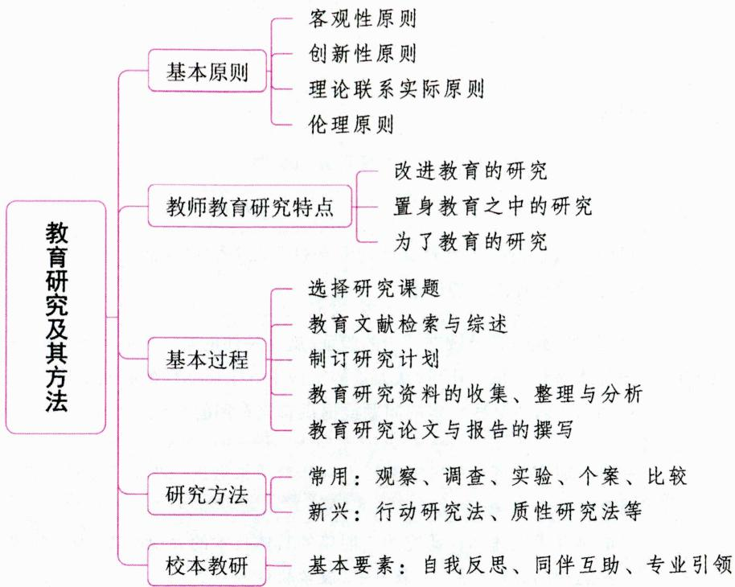

# 一、教育研究的内涵

教育研究是以教育问题为对象，运用科学的方法，遵循一定的研究程序，收集、整理和分析有关资料，以发现和总结教育规律的一种认识活动。

教育研究同所有的科学研究一样,由三个要素组成,即客观事实、科学理论和方法技术。教育研究的基本性质有:文化性、价值性、伦理性和主体性。

教育研究的对象是教育问题,它包括理论问题与实践问题。教育问题的特点包括:复杂性、两难性、开放性、整合性与扩散性。

# 二、教育研究的基本原则 ★【单选】

(1)客观性原则。研究者在研究过程中必须尊重事实，以事物的本来面目为依据，反对主观臆测、妄自论断。它是科研工作者应遵循的基本原则。  
(2)创新性原则。在教育研究过程中，研究者应该在继承和借鉴前人或他人的研究成果基础上，发现新的问题，提出新的观点或结论，产生新的认识，为人们提供新的知识。  
(3)理论联系实际原则。从教育的实践需要和实际情况出发，形成和发展教育科学理论，并努力运用教育科学理论来指导教育实践的研究，以推动教育科学和教育事业的向前发展。  
(4)伦理原则。为了保证教育研究的顺利开展,研究者必须遵循伦理原则,具体包括自愿原则、匿名原则、保密原则和无害原则。

真题1 [2023山东临沂, 单选]为探究教师评价方式对学生学业成绩的影响, 孙老师把学生分为受表扬组、受训斥组和无评价组, 开展了为期一年的实验研究。这种研究设计违背了教育研究的( )

A.客观性原则

B. 创新性原则

C.理论联系实际原则

D. 伦理原则

答案：D

# 三、教育研究的类型

表 1-16 教育研究的类型  

<table><tr><td>分类依据</td><td>研究类型</td><td>内涵</td></tr><tr><td rowspan="3">研究目的</td><td>基础研究</td><td>目的是揭示、描述、解释某些现象和过程以及它们的活动机制与内在规律。对研究领域具有直接增加知识的价值</td></tr><tr><td>应用研究</td><td>对基础研究的成果做进一步的验证,就所关注的某一实际问题,如某一课程设置问题、某一特殊的教师培训计划,从大量的案例中寻求概率性的必然结论。目的在于解决某些特定的问题或提供直接有用的知识</td></tr><tr><td>开发研究</td><td>在基础研究与应用研究的基础上对研究成果做进一步推广以扩大其影响,实现其价值的研究。目的是寻求上述两种研究的更明确的具体技术的表现形式,为实际教育工作者提供能够直接运用的教育产品,如教科书、教学软件等</td></tr><tr><td rowspan="2">方法论</td><td>定量研究(量化研究)</td><td>对事物的量的分析和研究。即通过解决“是多少”等的数量问题来对事物进行研究,主要侧重于用数字和量表来描述所研究的事物。主要方法:调查法、实验法等</td></tr><tr><td>定性研究(质化研究)</td><td>对事物的质的方面的分析和研究。即通过解决所研究事物“为什么”的问题,继而对所研究的事物做出语言文字的描述。主要方法:访问法、案例研究法等</td></tr></table>

此外，根据研究的功能，教育研究分为发展性研究、评价性研究和预测性研究；根据研究使用的方法，教育研究分为历史研究、描述研究、比较研究、实验研究和理论研究等；根据研究持续时间的不同，教育研究分为纵向研究和横向研究；根据研究领域的不同，教育研究分为价值研究和事实研究；根据是否对研究对象施加影响，教育研究分为描述性研究与干预性研究。

# 四、教师的教育研究 ★★ 【单选、多选、不定项、判断】

# 考点1 “教师即研究者”的提出

20世纪80年代以来，伴随着社会发展对教育教学要求的提高，对教师专业化的探讨达到了空前高度，“教师即研究者”也成为教育界乃至全社会普遍认同的理念和努力追求的目标。

# 考点2 教师教育研究的特点

教师所从事的“研究”应是什么样的？或者说教师的研究有什么特点呢？这可以通过比较专门研

究者的教育研究和教师的教育研究之间的区别来理解和认识。

表 1-17 教师的教育研究与专门研究者的教育研究的区别  

<table><tr><td>主体</td><td>教师的教育研究</td><td>专门研究者的教育研究</td></tr><tr><td rowspan="3">区别</td><td>改进教育的研究</td><td>描述和解释教育的研究</td></tr><tr><td>置身教育之中的研究</td><td>置身教育之外的研究</td></tr><tr><td>为了教育的研究</td><td>关于教育的研究</td></tr></table>

# 考点3 教师进行教育研究的优势

(1)教师工作于真实的教育教学情境之中，最了解教学的困难、问题与需求，能及时清晰地知觉到问题的存在。  
(2)教师与学生的共同交往构成了教师的教育教学生活，因此教师能准确地从学生的学习中了解到自己教学的成效，了解到师生互动需要改进的方面，尤其是能从教育教学现场中、从学生的各种资料（如考卷、作业等）中获得第一手资料，这为研究提供了良好的条件。  
(3)实践性是教育教学研究的重要品性，教师是教育教学实践的主体，针对具体的、真实的问题所采取的变革尝试，能够在实践中得到检验，进而产生自己的知识，建构实践性的教学理论。

# 考点4 教师参与教育研究的意义

(1)教师参与教育研究是教师自我反思、重新学习、不断调整和改善知识结构的过程。  
(2)教师参与教育研究是教师与他人沟通交流、扩大视野的过程。  
(3)教师参与教育研究是教师挑战自我、提高教育研究能力的过程。

真题2 [2023山东济南，多选]教师所从事的教育研究与专门研究者的教育研究是不相同的。与专门研究者的教育研究相比，教师所从事的教育研究的特点可以概括为（）

A. 改进教育的研究

B. 置身教育之中的研究

C. 为了教育的研究

D. 解释教育的研究

答案：ABC

# 五、教育研究的基本过程 ★【单选、多选、判断】

# 考点1 选择研究课题

选择和确定研究课题是进行教育研究的第一步，并且是关键性的一步。研究课题可以来源于教育实践，也可以来源于教育理论。

一个好的研究课题必须具备的特点：（1）选题必须有价值。作为研究课题，首先必须具有重要的理论和实践价值。不仅具有好的学术效益、理论价值，而且有高的社会效益、应用价值。一个好的课题，不仅具有好的内部价值，而且有好的外部价值。（2）选题必须有科学的现实性。（3）选题必须明确具体。选定的研究问题一定要具体、适度，研究范围要明确界定，宜小不宜大，所含的研究问题要明晰，不能太笼统。（4）选题必须新颖，有独创性。（5）选题必须有可行性。

# 考点2 教育文献检索与综述

# 1. 教育文献的类型

按文献的处理、加工程度，可将教育文献分为一次文献、二次文献和三次文献。

表 1-18 一次文献、二次文献和三次文献  

<table><tr><td>类型</td><td>含义</td><td>典例</td></tr><tr><td>一次文献</td><td>以作者本人的实践为依据而创作的原始文献,是直接记录事件经过、研究成果、新知识、新技术的文献</td><td>专著、论文、调查报告、档案材料等</td></tr><tr><td>二次文献</td><td>对原始文献加工、整理,使之系统化、条理化的检索性文献</td><td>题录、书目、索引、提要和文摘等</td></tr><tr><td>三次文献</td><td>在利用二次文献的基础上对某个范围内的一次文献进行广泛深入的分析研究之后,综合浓缩而成的参考性文献</td><td>动态综述、专题述评、数据手册、年度百科大全以及专题研究报告等</td></tr></table>

此外，按文献的社会属性来分，可分为政治文献、军事文献、经济文献、教育文献等；按文献的记录形态（载体）分，可分为印刷型、缩微型、视听型（也称为“视听资料”或“声像资料”）、机读型、网络型文献。

# 2.教育文献检索

在教育研究过程中, 文献检索是必不可少的步骤, 它贯穿研究的全过程。查阅文献资料的途径有很多, 既可利用目录、索引、文摘等检索工具进行, 也可利用联机检索、光盘检索、上网检索等计算机检索方法进行。其中, 网络检索是查阅资料最快捷的方法。

文献检索的基本方法包括顺查法、逆查法、引文查找法、综合查找法。

# 3. 教育文献综述

对于比较正规的教育科研或较大研究课题来说，完成文献资料的阅览之后，还要撰写文献资料综述，也就是在对文献进行整理、阅读、思考、分析、综合、概括的基础上，用自己的语言将与研究课题有关的文献内容叙述出来，在叙述的同时可以根据需要进行评论。

# 考点 3 制订研究计划

制订研究计划，需要做好几个方面的工作：(1)确定研究类型和方法；(2)选择研究对象；(3)分析研究变量；(4)形成研究方案。

# 考点4 教育研究资料的收集、整理与分析

(1)收集研究资料。收集研究资料是指研究者在实施研究计划过程中所得到的现实资料。收集资料是研究的主要任务和研究基础。  
(2)整理研究资料。资料整理是根据调查、研究的目的，对收集和调查研究所得的资料进行科学的审核、分类、汇总和再加工的过程。  
(3)分析研究资料。资料分析的基本步骤：阅读资料一筛选资料一解释资料。

# 考点5 教育研究论文与报告的撰写

研究论文是对某一问题进行探讨、研究后写出的具有自己独到见解的研究文章，是研究成果的书

面表达形式。人们通常把表达科学研究成果的学术性文章称为研究论文。研究论文可分为两大类：(1)实证性的研究报告，其主要形式有实验报告、调查报告、观察报告等；(2)理论性的学术论文，常见的形式有案例、综述、述评、理论性的论文等。一般学术论文的结构由题目、署名、摘要和关键词、正文、注释(或参考文献)五个部分组成。

# ·记忆有妙招·

为方便考生记忆，编者将教育研究的基本过程总结成以下口诀：

一选二检三制订，整理分析写报告。

真题3 [2024山东济南，单选]教师能够以研究的态度和行为来对待教育教学工作，其意义重大。教师教育研究的起始环节是（）

A. 教育研究设计

B. 选择研究课题

C. 文献资料检索

D.理论构思

真题4 [2023安徽蚌埠，多选]好的教育研究课题必须具有（ ）价值。

A.理论

B.实践

C. 内部

D. 外部

E. 个人

答案：3.B 4.ABCD

# 六、教育研究方法

教育研究方法就是人们在进行教育研究中所采取的步骤、手段和方法的总称。

# 考点1 常用的教育研究方法 ★★ 【单选、多选、判断】

# 1. 观察研究法

# （1）观察研究法的概念

观察研究法是指人们有目的、有计划地通过感官和辅助仪器，对处于自然状态下的客观事物进行系统考察，从而获取经验事实的一种科学研究方法。观察研究法是教育科学研究广泛使用的一种方法。

观察研究法不限于肉眼观察、耳听手记，还可以利用视听工具，如录音机、录像机、电影机等作为手段。

# （2）观察研究法的类型

表 1-19 观察研究法的类型  

<table><tr><td>分类依据</td><td>类型</td><td>特点</td></tr><tr><td rowspan="2">观察的情境条件</td><td>自然情境中的观察</td><td>能收集到客观真实的材料,但材料往往是观察对象的外部行为表现</td></tr><tr><td>实验室的观察</td><td>有严密的计划,有详细的观察指标体系,对观察情境有较严格的要求</td></tr><tr><td rowspan="2">观察的方式</td><td>直接观察</td><td>凭借人的感官,在现场直接对观察对象进行感知和描述</td></tr><tr><td>间接观察</td><td>利用一定的仪器或其他技术手段为中介对观察对象进行的观察</td></tr><tr><td rowspan="2">观察者是否直接参与被观察者所从事的活动</td><td>参与性观察</td><td>研究者直接参与到所观察者的群体和活动当中去,不暴露研究者的真正身份,在参与活动中进行隐蔽性的研究观察</td></tr><tr><td>非参与性观察</td><td>不要求研究人员站到与被观察者同一地位上,而是以“旁观者”的身份,采取公开或秘密的方式进行观察</td></tr><tr><td rowspan="2">观察实施的方法</td><td>结构式观察</td><td>有明确目标、问题和范围,有详细的观察计划、步骤和合理设计的可控性观察</td></tr><tr><td>非结构式观察</td><td>对研究问题的范围目标采取弹性的态度,观察内容项目与观察步骤不预先确定,也无具体记录要求的非控制性观察</td></tr></table>

# (3)观察研究法的优缺点

优点：①可以在自然状态下获取教育事实数据；②不干扰观察对象的自然表现，可以获得客观、真实的数据；③可以对同一观察对象进行较长时间的跟踪研究。

缺点：①取样小，观察研究法一般限于小样本的研究；②所获材料具有一定的表面性；③观察缺乏控制，不能说明所观察到现象的因果关系。

# 2. 调查研究法

# (1)调查研究法的概念

调查研究法是在教育理论指导下，通过运用观察、列表、问卷、访谈、个案研究及测验等方式，收集教育问题的资料，从而对教育的现状做出科学分析，并提出具体工作建议的一整套实践活动。

在教育调查研究中, 常用的调查方法有查阅资料、问卷法、开调查会、访谈法和调查表法, 其中最基本、使用最广泛的方法是问卷调查。

# (2)调查研究法的类型

①依据调查的目的，可分为历史调查、现状调查、发展调查、常规调查、相关调查和原因调查等；②依据调查的性质，可分为事实调查和意见调查；③依据调查的范围，可分为综合调查和专题调查；④依据调查的对象，可分为全面调查、重点调查、抽样调查和个案调查；⑤依据调查的内容，可分为科学性的典型调查、反馈性的普遍调查和预测性的抽样调查。需要注意的是，在进行抽样调查时，我们强调样本容量必须足够大，并不等于说样本容量越大越好。

# (3)调查研究法的优缺点

最突出的优点：可以深入了解教育现状，发现问题，弄清事实，为教育行政部门制定教育政策、教育规划以及为教育改革提供事实依据。

局限性：调查往往只是表面的，难以确定其因果关系；调查的成功往往取决于被调查者的合作态度，更多地受制于研究对象；调查的可靠性有一定限制，调查者的主观倾向、态度都有可能影响被调查者，使调查的客观性降低。

# 3. 实验研究法

# (1)实验研究法的概念

实验研究法是根据研究目的，运用一定的人为手段，主动干预或控制研究对象的发生、发展过程，通过观察、测量、比较等方式探索、验证所研究现象因果关系的研究方法。

实验研究的目的是发现事物间的因果关系，是各类研究中唯一能确定因果关系的研究。

# (2)实验研究法的性质

①教育实验必须要有一个理论假说；②实验的根本目的在于揭示变量之间的因果关系；③实验必须控制某些条件；④真正的科学的实验是可以重复验证实验结果的。

# (3)实验研究法的类型

① 按照实验研究的目的，可分为探索性实验、验证性实验和改造性实验；② 根据对实验的控制程度，可分为前实验、准实验和真实验；③ 根据实验环境的不同，可分为实验室实验和自然实验；④ 根据分配方法，可分为等组实验、单组实验和轮组实验；⑤ 根据自变量因素的多少，可分为单因素实验和多因素实验。

# (4)实验研究法的优缺点

优点：①能确立因果关系，认识事物的本质和规律；②研究结果客观、准确、可靠；③能对变量进行控制，提高研究的信度；④能为理论的构建提供佐证和说明；⑤能将实验变量和其他变量的影响分离开来；⑥严密的逻辑性是其他研究方法难以比拟的。

缺点：①应用范围有限，有些问题难以用实验的方法来解决；②可能会有人为造作的痕迹，实验的结果不一定就是现实的结果，缺乏生态效应等。

# 4. 个案研究法

# (1)个案研究法的概念

个案研究法是指对单一对象的某个或某些方面进行广泛深入研究的方法。它是当今教育研究中运用广泛的定性研究方法, 也是描述性研究和实地调查的一种具体方法。其任务是揭示研究对象形成、变化的特点和规律, 以及影响个案发展变化的各种因素, 并提出相应的对策。

# (2)个案研究法的优缺点

优点：能生动地描述过程、形象地展示个案，这是定量统计难以做到的。

缺点：①研究结论的主观性较强；②常常会遇到伦理道德问题；③个案研究成果的推广性有限；④对研究人员的语言技能、洞察力有较高要求。

# 5. 比较法

比较法是根据一定的标准，对不同国家的教育制度、教育理论或教育实践进行比较研究，找出各国教育的特殊规律和普遍规律的研究方法。

真题5 [2023湖北武汉, 单选]（ ）是指教育研究者以旁观者的身份进行观察, 这种观察易限于表面, 难以获得深层次的材料。

A.结构式观察

B. 参与性观察

C. 非结构式观察

D. 非参与性观察

真题6 [2023内蒙古巴彦淖尔，单选]对单一对象的某个或某些方面进行广泛深入研究的方法是（）

A. 个案法

B. 调查法

C. 测验法

D. 实验法

答案：5.D 6.A

考点2 新兴的教育研究方法 ★★ 【单选、多选、判断、简答】

# 1.行动研究法

一般认为，美国社会心理学家科特·勒温是行动研究的开创者，被人们称为“行动研究之父”。

# (1)行动研究法的概念

行动研究是指实际工作者(如教师)基于解决实际问题的需要,与专家、学者及本单位的成员共同

合作，将实际问题作为研究的主题，进行系统的研究，以解决实际问题的一种研究方法。

也有说法认为,行动研究是一种由实际工作者在现实情境中自主进行的反思性探索,并以解决工作情境中特定的实际问题为主要目的,强调研究与活动的一体化,使实际工作者在工作过程中学习、思考、尝试和解决问题。

# (2)行动研究法的特点

教育行动研究的特点可以概括为“为教育行动而研究”“在教育行动中研究”“由教育行动者研究”。

①“为教育行动而研究”指出了教育研究的目的，行动研究以提高行动质量、解决实际问题为首要目标；②“在教育行动中研究”指出了研究的情境和研究的方式，行动研究以行动过程与研究过程的结合为主要表现形式；③“由教育行动者研究”指出了教育行动研究的主体是实际工作者，主要是教师。

# (3)行动研究法的步骤

行动研究法的基本过程大致分为循序渐进的四个环节：计划、行动、考察和反思。

# (4)行动研究法的优缺点

优点：灵活，能适时做出反馈与调整；能将理论研究与实践问题结合起来；对解决实际问题有效。

缺点：研究过程松散、随意，缺乏系统性，影响研究的可靠性；研究样本受具体情境的限制，缺少控制，影响研究的代表性。

# 知识再拔高·

# 教师提高教学研究技能的途径

教师提高教学研究技能的途径有三种：阅读，即教师自己阅读有关教学理论和教学研究方法的论著；合作，即与大学或研究机构的教学研究专家合作进行实验研究；行动研究，即教师针对实际问题自己思考解决问题的办法。这三种方式之中，实际上以“研究”最有实效。教师通过自主的研究才能唤起阅读的需要和合作的兴趣。

# 2. 质性研究法

质性研究法也称为“实地研究法”或“参与观察法”，它是基于经验和直觉的研究方法，以研究者本人作为研究工具，凭借研究者自身的洞察力，在与研究对象的互动中理解和解释其行为和意义建构。质性研究实际上并不是一种方法，而是许多不同研究方法的统称。质性研究最早起源于人类学、社会学、民俗学等学科，近年来逐渐应用于教育领域，它的总体特征可以概括为一种归纳的、描述的、现场参与的研究方法。

# 3. 教育叙事研究

叙事研究是抓住人类经验的故事性特征进行研究并用故事的形式呈现研究结果的一种研究方式。它所关注的是在一定的场景和实践中所发生的故事，以及主人公是如何思考、筹划、应对、感受、理解这些故事的。即教育主体叙述教育教学中的真实情境的过程，是通过讲述教育故事，体悟教育真谛的一种研究方法。教育叙事研究并非为讲故事而讲故事，而是通过教育叙事展开对现象的思索，对问题的研究，是一个将客观的过程、真实的体验、主观的阐释有机融为一体的教育经验的发现和揭示过程。

# 4. 教育随笔

教育随笔就是谈教育思想观点的随笔，也可以说“教育心得”，主要是写教育过程中某一点体会的心得。教育随笔的主要特点是短小精悍、取材广泛、迅速及时。

真题7 [2022广东梅州, 单选]( )是指教师在现实教育教学情境中自主进行反思性探索, 并以解决工作情境中特定的实际问题为主要目的的教育研究方法。

A. 调查法

B. 实验法

C. 教育行动研究

D. 教育叙事研究

答案：C

# 七、校本教研 ★【单选】

# 考点1 校本教研的概念

校本教研（又称校本研究）是以校为本的教学研究的简称，指以学校自身条件为基础，以学校校长、教师为主力军，针对学校现实存在的问题而开展的有计划的研究活动。它与传统教育的最大区别是研究的重心下移到学校，是一种“从学校中来，到学校中去”的研究活动。

# 考点2 校本教研的特点

# 1. 校本教研是一种实践研究

教学研究可以分为理论研究与实践研究。理论研究的着眼点是揭示教学规律、深化教学认识；实践研究的着眼点是解决教学问题、改善教学实践。理论研究回答的是“是什么”“为什么”，实践研究回答的是“做什么”“怎么做”。显然，校本教研是一种教学实践研究。

# 2. 校本教研以校为基础和前提

以校为本的基本内涵是：

(1)为了学校。一切为了学校的发展，为了学校教育能力和教育精神的建设，为了学校文化的提升。  
(2)在学校中。学校的发展只能在学校中进行，只有植根于学校的生活、贯穿于教学的过程，并被所有教师所认同、所追求的改革才能沉淀为学校的血肉、传统和文化。  
(3)基于学校。学校发展的主体力量是校长和教师。要相信校长和教师的创造潜能，充分发挥他们的主观能动性，引导他们从学校实际出发，规划学校、发展学校。

# 考点3 校本教研的基本理念和基本要素

# 1. 校本教研的基本理念

(1)学校是校本教研的主阵地；(2)教师是校本教研的主体；(3)解决教学的实际问题是校本教研的核心。

# 2. 校本教研的基本要素

(1)自我反思。自我反思被认为是教师专业发展和自我成长的核心因素,是开展校本研究的基础和前提。  
(2)同伴互助。同伴互助的实质是教师作为专业人员之间的交往、互动与合作，其基本形式有三种：对话、协作、帮助。  
(3)专业引领。专业引领就其实质而言，是理论对实践的指导，是理论与实践之间的对话，是理论与实践关系的重建。

自我反思、同伴互助、专业引领三者具有相对独立性，同时又是相辅相成、相互补充、相互渗透、相互促进的关系。

真题8 [2022河南新乡, 单选]（ ）被认为是教师专业发展和自我成长的核心因素，是开展校本研究的基础和前提。

A. 自我批评

B. 自我反思

C. 终身学习

D. 自我认识

答案：B

# ★本节核心考点回顾 ★

# 1. 教育研究的基本原则

(1)客观性原则。它是科研工作者应遵循的基本原则。  
(2) 创新性原则。  
(3)理论联系实际原则。  
(4)伦理原则。具体包括自愿原则、匿名原则、保密原则和无害原则。

# 2. 教育研究的基本过程

(1)选择研究课题。选择和确定研究课题是进行教育研究的第一步，并且是关键性的一步。  
(2)教育文献检索与综述。文献检索贯穿研究的全过程。  
(3)制订研究计划。  
(4)教育研究资料的收集、整理与分析。  
(5)教育研究论文与报告的撰写。

扫一扫即可领取：

①精选历年考题及解析   
②获取当地考试资讯，从容准备   
③山香老师备考指导，不走弯路  
④备考交流群，互动答疑，督促学习

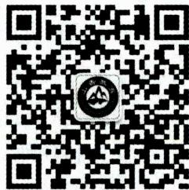

领取方式：

$①$ 扫一扫关注公告号  
②回复备考省份进行领取

# 第二章 教育的基本规律

# 本章学习指南

# 一、考情概况

本章属于教育学的基础章节，内容结构清晰，需要理解和掌握的知识较多，考生可带着以下学习目标进行备考：

1. 掌握并区分教育的社会制约性及教育的社会功能的表现。  
2. 理解教育的相对独立性的内涵及表现。  
3. 理解并区分内发论与外论的主要代表人物及其观点。  
4. 掌握影响个体身心发展的主要因素及其作用。  
5. 掌握个体身心发展的规律的概念及教育要求。

# 二、考点地图

<table><tr><td>考点</td><td>年份/地区/题型</td></tr><tr><td>社会政治经济制度对教育发展的影响和制约</td><td>2024广东单选;2024安徽单选;2024四川单选;2024福建多选;2022河南单选</td></tr><tr><td>生产力对教育发展的影响和制约</td><td>2024河南多选;2024安徽判断;2023山东单选;2023江苏判断;2023浙江辨析、简答</td></tr><tr><td>教育的政治功能</td><td>2024浙江判断;2023河北单选;2023河南单选;2023广东单选</td></tr><tr><td>教育的文化功能</td><td>2024江苏单选;2024四川单选;2024天津单选;2024安徽多选;2024广东判断;2024天津论述;2023河北单选;2022广西单选</td></tr><tr><td>教育的相对独立性</td><td>2024河北单选;2024安徽判断;2024江苏辨析</td></tr><tr><td>内发论与外铄论</td><td>2024天津单选;2024安徽判断;2023河南单选;2023黑龙江多选;2022安徽单选</td></tr><tr><td>影响个体身心发展的主要因素</td><td>2024贵州单选;2024河北单选;2024广东单选;2024四川单选、判断;2024浙江多选;2024江苏判断、简答;2024安徽判断、简答;2024福建辨析;2024天津辨析</td></tr><tr><td>个体身心发展的规律</td><td>2024河南单选;2024江苏单选;2024安徽单选;2024河北单选;2024天津单选;2024广东单选、判断;2023江苏填空;2022贵州简答</td></tr></table>

注：上述表格仅呈现重要考点的相关考情。

# 第一节 教育与社会发展

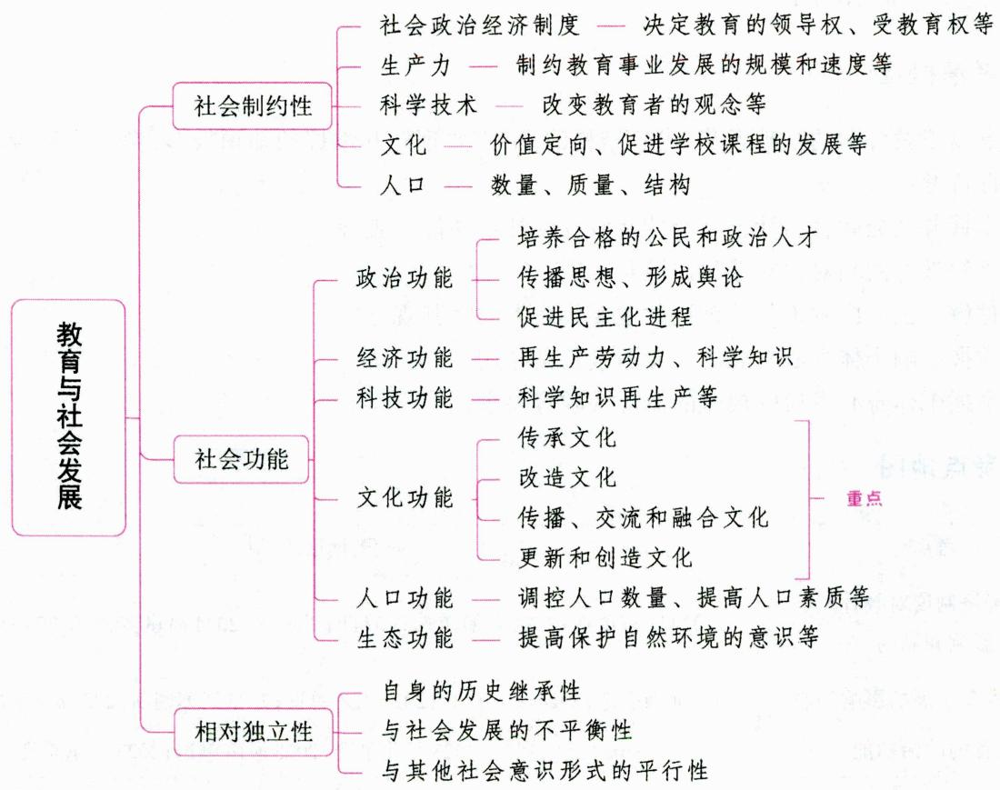

# 一、教育与社会关系的主要理论 ★【单选、判断】

# 考点1 教育万能论

教育万能论的代表人物有英国的洛克、德国的康德、美国的华生、法国的爱尔维修等。主要观点包括：(1)教育对人的成长起决定作用；(2)人的才智差别源于人所处的不同环境和受到的不同教育。常见的观点有“人受了什么样的教育，就成为什么样的人”“教育是包括自然环境和社会环境等一切生活条件的总和”等。这种观点认为人完全是教育的产物，片面地夸大了教育在人的发展中的作用。

# 考点2 教育独立论

教育独立论的主要代表人物是中国近代教育家蔡元培。这是主张教育超越于政党斗争和宗教教派斗争而处于独立地位的教育观点，发端于五四运动前，为解决教育经费而提出。

# 考点3 人力资本理论

人力资本理论的主要代表人物是美国的经济学家西奥多·舒尔茨。舒尔茨提出人力资本理论, 指出全面的资本概念应该包括物力资本和人力资本。所谓人力资本, 是指体现在人身上的资本, 是对生

产者进行教育、培训等支出及其接受教育的机会成本等的总和，以人的劳动能力的高低和可使用程度作为衡量依据。舒尔茨还提出了人力资本收益测算法，强调了教育及教育投资对国民经济增长的贡献率，将教育作为促进经济增长、发展社会经济的重要支撑点。

人力资本理论的主要观点包括：(1)经济增长的源泉是人力资本的积累；(2)教育使社会分配趋于平等。倡导该理论的学者尤其重视教育投资的作用，认为教育不仅是一种消费活动，也是一种投资活动，而且能够提高劳动生产率，促进经济发展，带来社会经济效益。

# 考点4 筛选假设理论（文凭理论）

筛选假设理论的代表人物有迈克尔·斯潘斯和思罗等。该理论视教育为一种筛选装置，以帮助雇主识别不同能力的求职者，并将他们安置到不同的职业岗位上。筛选假设理论强调教育的信号本质，强调筛选作用为教育的主要经济价值。筛选假设理论和人力资本理论都认为求职者的教育程度与工资水平呈正相关。

# 考点5 劳动力市场理论（劳动力市场划分理论）

劳动力市场理论的代表人物为皮奥里、多林格等。该理论认为劳动力市场可以划分为主要劳动力市场和次要劳动力市场。在主要劳动力市场的劳动力受教育水平是比较高的，受教育程度与工资水平的正比例关系基本上是成立的。相反，在次要劳动力市场，劳动力受教育水平是比较低的，受教育程度与工资水平的正比例关系是不成立的。

真题1 [2023河北唐山, 单选]教育兴则国家兴, 教育强则国家强, 当今世界各国的竞争主要是科技的竞争, 归根到底是教育的竞争, 许多国家推行“教育先行”改革政策, 以促进国民经济快速发展, 这种政策的理论基础是( )

A.人力资本理论

B. 劳动力市场理论

C. 教育万能理论

D. 筛选假设理论

真题2 [2023辽宁锦州, 单选]教育是帮助雇主识别不同能力的求职者, 将他们安置到不同职业岗位上的装置。这体现了( )的观点。

A.人力资本论

B. 教育万能论

C. 筛选假设理论

D. 人力资源市场理论

答案：1.A 2.C

# 二、教育的社会制约性 ★★★ 【单选、多选、判断、辨析、简答】

# 考点1 社会政治经济制度对教育发展的影响和制约

社会政治经济制度决定教育的性质。在同一政治经济制度下，各国的教育虽然也有差异，但其本质属性是相同的。

# 1. 社会政治经济制度决定教育的领导权

在人类社会中，谁掌握了生产资料的所有权，谁就掌握了国家政权，谁就能控制精神产品的生产，谁就能控制学校教育的领导权。社会中占统治地位的阶级，总是通过对教育方针政策的颁布、教育目的的制定、教育经费的分配、教育内容特别是意识形态教育内容的规定、教师和教育行政人员的任命聘用等，实现对教

育领导权的控制。

# 2. 社会政治经济制度决定受教育权

在阶级社会中，统治阶级总是要采取种种直接或间接的手段，决定和影响受教育权在社会中的分配，决定谁享有受学校教育的权利，谁无享受学校教育的权利，谁有受什么样学校教育的权利等问题。在阶级社会中，“超阶级”“超政治”的教育是不存在的。

# 3. 社会政治经济制度决定教育目的

政治经济制度尤其是政治制度是直接决定教育目的的因素。教育的根本任务是培养人,可以说,在一定社会中,培养具有什么政治方向和思想观念的人,是由政治经济制度决定的。

# 4. 社会政治经济制度决定着教育内容的取舍

不同政治经济制度的社会具有不同的政治方向、思想意识和主流文化，并且不同的政治经济制度要求培养具有不同政治立场和思想意识的人，这自然要求传递不同的教育内容，特别是思想道德方面的内容。

# 5. 社会政治经济制度决定着教育体制

教育体制是一个国家配合政治、经济、科技体制而确定下来的学校办学形式、层次结构、组织管理等相对稳定的运行模式和规定。任何一个国家的教育体制都不存在固定僵化的模式，要随着政治体制、经济体制的变革而变革。

# 6. 社会政治经济制度制约教育的改革与发展

在推动教育改革和发展的动力因素中，政治经济制度起着直接的推动作用。一方面，社会形态的更替、政体的变迁与社会革命，都将直接引发教育的巨大变革与发展。另一方面，在社会其他因素引发的教育改革与发展中，政治经济制度仍然发挥着特殊的作用。

# 7. 教育相对独立于政治经济制度

尽管政治经济制度对教育有着巨大的影响和制约作用，但教育也具有自身的规律，有自己的相对独立性。这就意味着学校不可以忽视自身的办学规律，不能放弃学校教育任务而直接为政治经济制度服务。

真题3 [2024广东佛山, 单选]在古代社会里, 能够享受学校教育的只能是一部分有特权的人, 其余的人都被排斥在学校体系之外, 接受一些粗浅的生活教育或师徒式的教育。这说明教育受到( )的制约。

A. 经济

B.政治

C. 文化

D. 生态

答案：B

# 考点2 生产力对教育发展的影响和制约

教育要为社会培养人才。社会生产力对教育的制约和促进,主要体现在对人的培养的制约和促进上。

# 1. 生产力的发展水平制约着教育事业发展的规模和速度

教育事业发展的规模和速度，一方面为一定阶级的利益和要求所制约，但同时也不可否认，生产力发展水平对教育事业发展的规模和速度具有直接的影响和最终的决定作用。因为办教育需要一定的人力、物力和财力，办多少学校，有多少人受教育，必须有一定的物质条件作保证。

# 2. 生产力的发展水平制约着人才培养的规格和教育结构

培养什么样的人,既受制于政治经济制度,也与生产力发展的水平有密切的联系。生产力发展的水平对培养人的规格,提出了一定的要求,要求受教育者必须具有某种程度的文化水平和生产所需要的知识技术。生产力的发展也必然引起教育结构的变化,设立什么样的学校,开设什么样的专业,各级各类学校之间的比例如何,各种专业之间的比例如何,都受生产力发展的水平和产业结构所制约。

# 3. 生产力发展水平制约着课程设置和教学内容的改革

学校课程的开设以及教学内容的选择，一方面为政治经济所决定，另一方面也被生产力所制约。生产力的发展，促进科学知识不断地积累、分化和发展，给课程的设置和教学内容的改革与充实提供了可能的条件，并要求教学内容做相应的改变。例如，在14世纪以前，学校教育的自然科学课程，一般只有算术、几何、天文等学科；14~16世纪，增加了地理和力学；17世纪以后，又增加了代数、三角、物理、化学、动物、植物等学科。随着现代科学技术的发展，量子物理、电子计算机、遗传工程、海底开发等新兴科学技术，逐渐纳入了学校的课程。

# 4. 生产力发展水平制约着教学的方法、手段和组织形式

从原始社会的口耳相传到现代多媒体技术的运用，从个别教学到班级授课制，教学方法、手段和组织形式的变革与社会生产力发展水平密切联系。

# 知识再拔高·

# 生产力对教育发展的影响的其他说法

(1)生产力发展水平影响教育发展的规模和速度。(2)生产力发展水平影响教育目的。教育必须依照生产力发展带来的劳动分工结构变化来确定教育目标,培养与生产力发展水平相适应的不同质量和规格的人才。(3)生产力发展影响课程设置及内容选择。(4)生产力发展影响教学方法、手段及组织形式。

真题4 [2024安徽合肥/淮北/铜陵，判断]一定社会的政治制度决定着教育目的的性质，生产力的发展水平决定着人才培养的质量规格。（）

答案：√

# 考点 3 科学技术对教育发展的影响和制约

现代教育发展的根本动因是科技进步。科学技术对教育的影响, 首先表现为对教育的动力作用。具体地说, 科学技术对教育的作用表现如下:

# 1.科学技术能够改变教育者的观念

科技发展水平决定了教育者的知识水平和知识结构，影响到他们对教育内容、方法的选择和运用，也会影响到他们对教育规律的认识和教育过程中教育机制的设定。

# 2.科学技术能够影响受教育者的数量和教育质量

一方面，科技的发展及其在教育上的广泛运用，使教育对象得以扩大；另一方面，科技的发展正日益揭示出教育对象的身心发展规律，从而使教育活动遵循这种规律，提高了教育质量。此外，科学技术的每次革新都极大地促进了受教育者数量的增长和教育质量的提高。

# 3.科学技术能够影响教育的内容、方法和手段

科学技术可以渗透到教育活动的所有环节中去，为教育技术的更新和发展提供各种必要的思想基础和技术条件。科技的发展促使教学内容不断更新、课程体系不断变化。同时，随着科学技术的迅猛发展，教育的方法和手段也得以改进。

# 知识再拔高·

传统学校教育和网络教育的区别  

<table><tr><td>类别</td><td>传统学校教育</td><td>网络教育</td></tr><tr><td>形式</td><td>“金字塔形”的等级制教育</td><td>“平等的”开放式教育</td></tr><tr><td>优劣标准</td><td>依据掌握在他人手中的“筛选制度”</td><td>依据掌握在自己手中的“兴趣选择”</td></tr><tr><td>年龄段</td><td>较严格意义上的“年龄段教育”</td><td>“跨年龄段教育”或“无年龄段教育”</td></tr><tr><td>时空限制</td><td>存在着时空限制</td><td>跨时空的教育</td></tr></table>

真题5 [2024安徽统考，单选]关于科学技术对教育的作用，以下表述不正确的是( )

A. 科学技术是制定教育战略和教育目的的理论基础  
B. 科学技术能改变教育者的观念  
C. 科学技术能够影响受教育者的数量和教育质量  
D. 科学技术为教育技术的更新和发展提供技术条件

答案：A

# 考点4 文化对教育发展的影响和制约

从广义上说, 教育是文化的一部分, 但教育又是一种非常特殊的文化, 因为教育既是文化的构成体, 又是文化的传递、深化与提升的手段。这就是教育的双重文化属性。

# 1.文化对教育具有价值定向作用

不同的教育在很大程度上是由不同的文化价值观支配和决定的。一个社会的教育是以保存或传承现有文化成果作为主要的、甚至是唯一的价值取向，还是在继承现有文化的同时致力于传统文化的转型并创造新文化，取决于社会总体的文化价值观。

# 2.文化发展促进学校课程的发展

文化对课程的影响主要体现在两个方面：（1)课程内容的丰富；(2)课程结构的更新。课程的发展不是随文化变迁而自发更新嬗变的过程，而是有意识地创造性转换的过程。

# 3.文化影响教育目的的确立

教育目的的确立,除了取决于社会政治经济制度和生产力发展水平以外,还受文化的影响。例如,我国古代社会的主流文化是以儒学为核心的伦理型文化,这种文化反映在人才培养上,就强调教育目的是“在明明德,在亲民,在止于至善”。

# 4.文化影响教育内容的选择

教育的内容就是人类的文化，不同时期的文化和不同国家与民族的文化，影响着教育内容的不同选择。

# 5.文化影响着教育教学方法的使用

不同的文化影响着人们对知识及其来源的认识，在教育上影响着人们对师生关系的认识，由此决

定了人们对教育教学方法的不同应用。

真题6 [2022广东广州, 单选]受我国传统儒家文化思想的影响, 在对待事物方面提倡不偏不倚的“中庸之道”; 在对待人才培养方面, 强调“在明明德, 在亲民, 在止于至善”的教育纲领。这说明文化主要影响着( )

A. 教育目的的确立

B. 价值取向的选择

C. 教学手段的使用

D. 教育思想的更新

答案：A

# 考点 5·人口对教育发展的影响和制约

# 1.人口数量对教育发展的影响和制约

(1)一定的人口数量及其增长率影响着教育事业发展的规模和速度；(2)人口增长还影响和制约着教育发展战略目标的实现和战略重点的选择。

# 2.人口质量对教育发展的影响和制约

人口质量对教育的影响和制约表现为直接和间接两方面：（1）直接影响是指入学者已有的水平对教育质量的总影响；（2）间接影响是指年长一代人口质量影响新生一代人口质量，从而影响以新生一代为对象的学校的教育质量。

# 3.人口结构对教育发展的影响和制约

(1)人口年龄结构制约着教育发展。一般来说，有什么样的人口年龄结构就会有什么样的教育结构。例如，在人口的年龄结构中，学龄人口的基数大、比重大，中小学等基础教育在教育体系中的比重就自然会提高。相反，如果成人人口比重大，教育的重心就会转移到成人教育上。  
(2)人口就业结构制约着教育发展。人口的就业状况取决于一定地区的生产力发展水平，特别是产业结构和技术结构，但它又必然会对教育发展产生影响。

# 三、教育的社会功能 ★★★ 【单选、多选、判断、简答、论述】

教育主要是通过培养人来实现其社会功能的，教育的这一根本性特征使教育的社会功能具有间接性、隐含性、潜在性、迟效性、超前性的特点。需要指出的是，教育对社会发展的促进功能是有限度的。教育的社会功能大小除了取决于教育自身，还受到社会各种条件的影响。换言之，教育只能在社会发展允许和需要的范围内发挥其社会功能。

# 考点1 教育的政治功能

教育受到政治经济制度的制约，同时又对政治经济制度有维护、巩固和加强的作用。

# 1. 教育通过培养合格的公民和政治人才为政治服务

教育通过人才的培养，服务于社会的政治，维护统治阶级的利益，这是教育发挥政治功能的一个最基本的途径。这主要有两个方面：一是对广大人民进行政治和意识形态教育，促使他们的政治社会化，并成为社会所需要的合格公民；二是培养政治人才，以补充社会管理层的需要，直接参与统治阶级的管理，执行统治阶级的意志，为统治阶级服务。

# 2. 教育通过传播思想、形成舆论作用于一定的政治经济制度

教育特别是学校教育，不仅向学生传播、灌输一定的政治思想意识，而且通过在校师生的言论行

动、学校的教材和刊物向社会宣传一定的思想意识,制造社会舆论,借以影响群众,影响社会的风俗习惯和道德面貌等,为一定的政治经济服务,起着巩固现有政治经济制度的作用。

# 3. 教育促进民主化进程，但对政治经济制度不起决定作用

首先，一个国家的民主程度直接取决于一个国家的政体，但又间接取决于这个国家人民的文化程度和教育事业发展的程度，一个国家普及教育的程度越高，人的知识越丰富，就越能增强人民的权利意识，认识民主的价值，推崇民主的政策，推动政治的改革和进步。

其次，教育对社会政治经济制度起着巨大的影响作用，但不是决定作用。社会政治经济制度发展的根本动力是生产力与生产关系的矛盾运动，教育在这种矛盾运动中只起加速或延缓作用，而不起决定作用。

# 知识再拔高·

# 教育的政治功能的其他说法

(1) 维系社会政治稳定。作为一种复杂的社会实践活动，教育的首要政治功能表现在它对维护社会政治稳定发挥着十分重要的作用。《礼记·学记》中就曾明确提出，“古之王者，建国君民，教学为先”，这就充分表明教育是“化民成俗”，是治国安邦的关键，而这正是教育的基本功能所在。教育维系社会政治稳定主要通过为社会培养各种政治人才、培养具有一定政治素质的社会公民、宣传统治阶级思想、制造一定社会舆论等方面来实现。(2) 提高社会政治文明水平。(3) 促进社会政治变革。(4) 培养社会政治人才。

真题7 [2023河北衡水, 单选]“五四运动”和“一二·九运动”都是发端于学校, 再扩展到社会, 进而形成全国性的政治活动。这体现了教育的( )功能。

A. 文化

B. 经济

C. 生态

D.政治

真题8 [2023河南信阳, 单选]《礼记·学记》中指出，“古之王者，建国君民，教学为先”，这体现了教育的（）功能。

A. 维系社会政治稳定

B. 促进社会政治变革

C. 促进经济增长

D. 提高劳动者素质

真题9 [2024浙江金华，判断]教育决定政治经济制度。（）

答案：7.D 8.A 9.X

# 考点2 教育的经济功能

这里论述的教育的经济功能，主要是体现在教育对社会生产力的促进作用中的，具体表现为以下几点：

# 1. 教育再生产劳动力

劳动力的质量和数量是生产力发展的重要条件，教育承担着再生产劳动力的重任。教育再生产劳动力具体体现在：

(1)教育使潜在的生产力转化为现实的生产力；  
(2)教育可以提高劳动力的质量和素质,使之获得一定劳动部门认可的技能和技巧,成为发达的和专门的劳动力;  
(3)教育可以改变劳动力的形态,把一个简单劳动力训练成一个复杂劳动力,把一个体力劳动者培养成一个脑力劳动者;

(4)教育可以使劳动力得到全面发展，提高劳动转换能力，摆脱现代分工对每个人造成的片面性。

# 2. 教育再生产科学知识

科学知识是第一生产力，但是科学知识在未用于生产前只是一种意识形态的或潜在的生产力。必须通过教育才能把前人积累的科学知识传递给年青一代，把潜在的生产力转化为现实的生产力。所以，教育是实现科学知识再生产的重要手段。教育再生产科学知识具体表现在：

(1)教育可以高效能地扩大科学知识的再生产，使原来为少数人所掌握的科学知识在较短的时间内为更多的人所掌握，从而提高劳动生产效率，促进生产力的发展；  
(2)教育担负着发展科学、再生产科学的任务，这在高校表现得尤为明显。

真题10 [2022湖南长沙,单选]教育能够通过培养各个层次、各个类型的劳动者和专门人才，强有力地推动社会生产力的发展，提高劳动生产率，进而产生巨大的经济效益。这主要体现了教育的( )功能。

A. 生态

B.政治

C. 文化

D. 经济

答案：D

# 考点3 教育的科技功能

# 1. 教育能完成科学知识的再生产

教育对科学创造的成果加以合理的加工和编排，传授给更多的人，尤其是传授给年青一代，使他们能够掌握前人创造的科学成果，为进行科学知识的再生产打下基础。

# 2. 教育推进科学的体制化

科学的体制化是指出现职业的科学家以及专门的科研机构去开展科学研究。只有在教育高度发达的情况下，才会出现科学的体制化。

# 3. 教育具有科学研究的功能

教育者在传播科学知识的同时，也直接从事科研工作，这在高校里尤为突出。

# 4. 教育促进科研技术成果的开发利用

科学技术在教育上的应用，丰富了科学技术的活动，能扩大科学技术的成果。

# 考点4 教育的文化功能

# 1.教育能够传承文化

教育是文化传承的主要手段。教育传承文化的功能有三种主要表现形式：传递、保存、活化。

(1)教育可以传递和保存文化

教育是文化传递和保存最为基本和最为有效的手段。随着社会的不断发展,文化的传递、保存方式不断发生变化。但不论发生何种变化,都离不开教育这一最基本的方式。

(2)教育可以活化文化

教育要实现真正意义上的文化传承，还必须把储存形态的文化转化为现实活跃形态的文化，即把附着于物体、文字和技术性载体上的文化符号转化到人这一载体上，为人所掌握与内化。这一转化的过程就是文化的活化。

# 2. 教育能够改造文化（选择和整理、提升文化）

改造文化是指在原有文化要素的基础上所进行的取舍、调整和再组合。教育对文化的改造主要是通过选择文化和整理文化来实现的。

教育是文化传递的手段,但教育又不等同于文化传递。并非所有的文化都能成为教育内容,教育

必须对文化进行选择和整理。文化选择是对某种、某部分文化的吸收或舍弃。

# 3. 教育能够传播、交流和融合文化

教育通过传播文化，使不同国家和民族的文化相互交流、交融，促进文化的优化和发展。教育应重视发展多元文化，促进各社会族群间的相互尊重与和谐发展。

# 4. 教育能够更新和创造文化

没有文化的更新和创造，就没有文化的真实发展。教育更新、创造文化的功能主要表现在两个方面：(1)教育通过培养具有创新精神和创造能力的人来发挥其文化创造的功能；(2)教育直接创造新的文化。

# 知识再拔高·

# 教育的文化功能的其他说法

说法一：(1)教育的文化传承功能。(2)教育的文化选择功能。(3)教育的文化融合功能。(4)教育的文化创造功能。教育的文化功能，最根本就是实现文化的创新与发展。

说法二：(1)教育的文化承递功能。文化承递是指文化在时间上的继承与传递。(2)教育的文化传播功能。文化传播是指文化在空间上的扩散与流动。(3)教育的文化选择功能。文化选择是指对某种文化主动撷取与扬弃。(4)教育的文化创新功能。

真题11 [2024江苏南京，单选]学期初，高老师开设了“南京白局表演艺术”校本课程。此举有助于发挥教育的（）

A. 文化传承功能

B. 文化选择功能

C. 文化交流功能

D. 文化创新功能

真题12 [2023河北邯郸，单选]教育的文化功能，最根本的就是实现文化的（）

A. 保存

B. 延续

C. 创新

D. 选择

真题13 [2024安徽统考，多选]下列关于“教育的文化功能”表述正确的是（）

A. 教育促进文化在时间上的传承和延续

B. 教育促进文化在空间上的扩散和流动

C. 教育无法对文化进行选择和净化

D. 教育创新文化并推动其发展

答案：11.A 12.C 13.ABD

# 考点5

# 教育的人口功能

# 1. 教育是调控人口数量的重要手段

一系列研究表明，受教育程度不同导致了不同的生育观：受教育程度较低的群体或个人倾向于不加节制的、高数量的生育；受教育程度较高的群体或个人倾向于有节制的、比较合理的生育。

# 2. 教育是提高人口素质的重要途径

人口素质由人口的身体素质、科学文化素质和思想品德素质等方面构成，它们都与教育息息相关。

(1)教育可以提高人口身体素质。受教育程度较高的人，一般都容易掌握优生学和遗传学的知识，懂得近亲结婚以及各类遗传病对新生一代的危害，能有意识地注意女性孕期的保健卫生，尽量减少因用药不慎、疲劳过度、神经紧张等对胎儿带来的不利影响，从而大大减少先天愚型儿和先天残疾儿的出生。  
(2)教育对人口科学文化素质的影响更为明显和直接。在一定意义上，人口科学文化素质的高低主要取决于教育水平和状况。世界上通常使用下列指标来衡量人口的科学文化素质：文盲率或识字率、义务教育普及程度和提高程度、就业人口的平均受教育年限、每万人口中科技人员数等。显然，这

些衡量指标的达成和实现程度，都与教育发展水平息息相关。

(3)人口思想品德素质的形成也依赖于教育。可以说，有什么样的教育环境，就会培养出什么品质的人。

# 3. 教育可使人口结构趋于合理

人口结构的合理化是指人口结构有利于社会生产和人口的自然平衡。(1)教育可使人口性别结构趋于合理；(2)教育可使人口的城乡结构趋于合理。

# 4. 教育有利于人口流动和迁移

教育有利于人口流动和迁移的主要表现是：（1）受过较好教育的人口更容易远距离流动和迁移；(2)教育本身具有人口流动和迁移功能。

真题14 [2024安徽统考，单选]受过较好教育的人口更容易远距离流动和迁移。这表明教育具有（）

A. 人口流动功能

B. 文化传递功能

C. 社会改造功能

D. 人口控制功能

真题15 [2023广西贵港，单选]以下关于教育的人口功能的说法不正确的是（）

A. 教育是调控人口数量的重要手段

B. 教育是提高人口素质的重要途径

C. 教育有利于人口流动和迁移

D. 教育可使人口结构趋向不合理

答案：14.A 15.D

# 考点6 教育的生态功能

教育的生态功能就是教育对保护自然环境、促进可持续发展和建设生态文明所起的积极作用。具体体现在：(1)通过环境教育提高人们保护自然环境的意识、责任感，培养绿色的生活习惯；(2)通过发展创造科学技术，提高人们解决环境问题的能力，有效地解决生态问题；(3)形成可持续发展的理念和生态文明的理念。

也有说法认为, 教育的生态功能具体体现在: (1) 树立建设生态文明的理念; (2) 普及生态文明知识, 提高民族素质; (3) 引导建设生态文明的社会活动。

# 知识再拔高·

# 教育的社会变迁功能和社会流动功能

教育的社会功能主要有两种：教育的社会变迁功能和教育的社会流动功能。

1. 教育的社会变迁功能

教育通过开发人的潜能，提高人的素质，引导人的社会化，影响人的社会实践，能够推动社会的发展与变革，这就是教育的社会变迁功能。教育的社会变迁功能表现在社会生活的各个领域，包括教育的经济功能、政治功能、生态功能、文化功能等。

2. 教育的社会流动功能

教育的社会流动功能是指社会成员通过教育的培养、筛选和提高，能够在不同的社会区域、社会层次、职业岗位、科层组织之间转换、调整和变动，以充分发挥其个人的智慧才能，实现其人生价值。教育的社会流动功能按其流向可分为横向流动功能与纵向流动功能。

(1)教育的横向流动功能，指社会成员因受到教育和训练而提高了能力，可以根据社会需要，

结合个人意愿与可能，更换其工作地点、单位等，做水平的流动，改变其环境而不提升其在社会阶层或科层结构中的地位，亦称水平流动。

(2)教育的纵向流动功能,指社会成员因受教育的培养与筛选,能够在社会阶层、科层结构中做纵向的提升,包括职称晋升、职务升迁、薪酬提级等,以提高其社会地位及作用,亦称垂直流动。

综上所述，教育的社会变迁功能与社会流动功能是有严格区别的。教育的社会变迁功能是就教育所培养的社会实践主体在生产、科技、经济、政治和文化等社会生活各个领域发挥的作用而言的，它指向的主要是社会整体的存在、延续、演变和发展。教育的社会流动功能则是就教育所培养的社会实践主体，通过教育的培养和提高以及在此基础上的个人能动性、创造性的发挥，以实现在职业岗位和社会层次之间的流动和转换而言的，它指向的主要是社会个体的生存与发展境遇的改善。但是，二者之间又有内在的联系，相互促进，相辅相成。

真题16 [2024河北石家庄，单选]学校组织师生到社区进行环保教育与宣传，体现了教育的（）

A. 生态功能

B. 经济功能

C. 文化功能

D.政治功能

真题17 [2023湖南长沙, 单选]教育的社会变迁功能是就教育所培养的社会实践主体在生产、科技、经济、政治和文化等社会生活的各个领域发挥的作用而言的。教育的社会流动功能则是就教育所培养的社会实践主体，通过教育的培养和提高以及在此基础上的个人能动性、创造性的发挥，以实现在职业岗位和社会层次之间的流动和转换而言的。以下属于社会流动功能的是（）

A. 推动社会进步

B. 促进社会平等

C. 推进社会变革

D. 提升社会地位

答案：16.A 17.D

# 四、教育的相对独立性 ★★ 【单选、多选、判断、辨析】

教育的相对独立性是指教育具有自身独特的发展规律和能动性。一般来说,教育为一定社会的生产力发展水平所制约,为一定社会的政治经济制度所决定,为一定社会的文化所影响。但是教育又常显示出其自身所特有的形式和发展轨迹。教育的相对独立性主要表现在以下几个方面:

# 1. 教育自身的历史继承性

教育和其他社会现象一样，在其历史的发展过程中必然从各个方面吸收和利用以往历史阶段的教育成果和经验。教育的思想、制度、内容和方法等各个方面不仅反映着一定社会的生产力发展水平和政治、经济制度的要求，而且与教育发展的历史沿革有着一定的渊源，都带有自己发展历程中的烙印。这就是教育自身的历史继承性。

# 2. 教育与社会发展的不平衡性

教育受一定社会的生产力发展水平和政治、经济制度制约、决定，但与社会生产力发展水平和政治经济制度的改变并非完全同步，具有与社会发展的不平衡性。

# 3. 教育与其他社会意识形式的平行性

教育作为社会意识形态中的一种意识形态，与社会意识形态中的其他意识形态，如政治思想、哲学观念、伦理道德、宗教、文学、艺术等，有着密切的联系，这种联系不是决定与被决定的关系，而是相互影响的平行性关系。

# 知识再拔高·

# 教育的相对独立性的其他说法

说法一：(1)教育对社会的作用具有能动性；(2)教育具有自身的质的规定性；(3)教育具有继承性；(4)教育与社会发展具有不平衡性。

说法二：(1)教育是培育人的活动，主要通过所培育的人作用于社会；(2)教育具有自身的活动特点、规律及原理；(3)教育具有自身发展的传统与连续性。

真题18 [2024安徽合肥/淮北/铜陵，判断]一方面，教育与社会其他因素的关系密切；另一方面，教育具有相对独立性。（）

答案：√

# 五、教育优先发展 ★★ 【单选、多选、判断】

# 考点1 教育优先发展的内涵

教育优先发展又称为“教育超前发展”“教育先行”，是指在一定的生产力发展条件下，为了发展经济必须注意首先发展教育。教育先行有两层含义：其一是社会用于发展教育的投资要适当超越于现有生产力和生产力发展水平而超前投入；其二是教育发展要先于或优于社会上其他行业和部门而先行发展。在这里，“优先”是指在全局中与其他非优先的事务相比较而言，是指在长远的多种事务不能齐头并进时，在排序上使某一事务先行而言。

# 考点2 教育优先发展的理论基础

“百年大计,教育为本。”教育在我国社会主义现代化建设中具有基础性、先导性、全局性意义。实现科教兴国和人才强国战略,就必须把教育摆在优先发展的战略地位。

教育优先发展是教育自身发展的客观规律所要求的，教育在整个社会大系统中的定位即教育的三性——基础性、先导性、全局性构成了教育优先发展的理论基础。其中，教育的先导性不仅表现在经济发展方面，还表现在对科学技术的引领与文化价值观念方面，尤其是对社会主义核心价值观念的引领等方面。

# 考点3 教育优先发展的实践策略

实践教育优先发展，需要全社会的支持和参与，需要采取多管齐下的方略和措施。我国教育优先发展的实践策略包括：(1)提高认识，转变观念——落实优先发展的启动点；(2)投入优厚，预算优先——落实优先发展的物质保障；(3)实现“两基”、保证“两全”——落实优先发展的核心内容；(4)依法治教，依法施教——落实优先发展的制约机制；(5)提高师资队伍素质——实践教育优先发展的关键。

真题19 [2022天津北辰，单选]教育对社会主义核心价值观能够起到引领作用，反映了教育的（）

A. 现代性

B. 先导性

C. 全局性

D. 基础性

真题20 [2022河南南阳，判断]一定总量的教育投资是发展教育事业的物质基础，提高认知、转变观念是实践教育优先发展的关键。（）

答案：19.B 20.×

1. 社会政治经济制度对教育发展的影响和制约

(1) 社会政治经济制度决定教育的领导权、受教育权、教育目的、教育内容的取舍、教育体制；(2) 社会政治经济制度制约教育的改革与发展；(3) 教育相对独立于政治经济制度。

2. 生产力对教育发展的影响和制约

(1)生产力的发展水平制约着教育事业发展的规模和速度；(2)生产力的发展水平制约着人才培养的规格和教育结构；(3)生产力发展水平制约着课程设置和教学内容的改革；(4)生产力发展水平制约着教学的方法、手段和组织形式。

3. 教育的政治功能

(1)教育通过培养合格的公民和政治人才为政治服务；(2)教育通过传播思想、形成舆论作用于一定的政治经济制度；(3)教育促进民主化进程，但对政治经济制度不起决定作用。

4. 教育的文化功能

(1)教育能够传承文化（传递、保存、活化文化）；(2)教育能够改造文化（选择和整理、提升文化）；(3)教育能够传播、交流和融合文化；(4)教育能够更新和创造文化。

5. 教育的相对独立性

教育的相对独立性是指教育具有自身独特的发展规律和能动性。它主要表现在：

(1)教育自身的历史继承性；(2)教育与社会发展的不平衡性；(3)教育与其他社会意识形态的平行性。

# 第二节 教育与人的发展

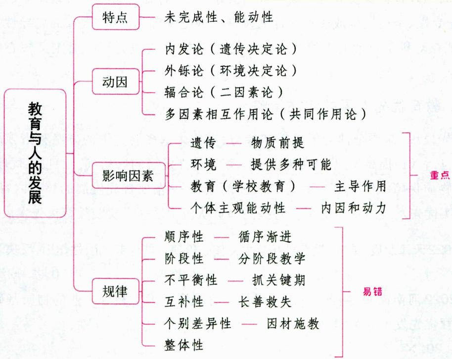

# 一、人的发展的含义 ★ 【单选、判断】

“人的发展”一般有两种释义。一种是将它看成是人类的发展或进化的过程。另一种则将它看成是人类个体的成长变化过程。

人的发展是整体性的发展,大体可以分为三个层面：一是生理发展,包括机体的正常发育,体质的不断增强,神经、运动、生殖等系统生理功能的逐步完善；二是心理发展,包括感觉、知觉、注意、记忆、思维、言语等认知的发展,需要、兴趣、情感、意志等意向的形成,能力、气质、性格等个性的完善；三是社会性发展,包括社会经验和文化知识的掌握,社会关系和行为规范的习得,发展成为具有社会意识、人生态度和实践能力的现实的社会个体,能够适应并促进社会发展。

真题1 [2022广东梅州，判断]人的发展是整体性的发展，大体可分为生理发展、学校发展和社会性发展等三个方面。（）

答案：×

# 二、人的发展的特点 ★★ 【单选、判断】

人的发展的特点有各种不同的说法，这里，我们着重对人的发展的未完成性和能动性这两个特点进行分析阐述。

# 1. 未完成性

(1)人的未完成性与人的非特定化密切相关。从生物进化的角度看，人的非特定化意味着人是一种具有发展潜能的、未完成的、可塑造的动物。  
(2) 儿童不仅处于未完成状态, 而且处于未成熟状态。杜威对儿童发展有深入的研究, 认为正是这种“未成熟状态”是人生长的条件。他指出: “未成熟状态这个词的前缀的‘未’却有某种积极的意义, 不仅仅是一无所有或缺乏的意思……我们说未成熟状态就是有生长的可能性。这句话的意思, 并不是指现在没有能力, 到了后来才会有; 我们表示现在就有一种确实存在的势力——发展的能力。”  
(3)人在生物进化上的不完善性还体现在人的孕育期、幼年期的延长方面。  
(4) 儿童发展的未成熟性、未完成性, 蕴含着人的发展的不确定性、可选择性、开放性和可塑性, 潜藏着巨大的生命活力和发展的可能性。动物的发展生来就基本完成了、定型了、确定了, 如兔子生下来已是兔子, 而且一辈子都是兔子。“人较动物而言, 在本质上是非决定性的, 此即人的生命并没有遵循事先决定的路线, 事实上自然只是使人走完了一半, 另外的一半尚待人自身去完成。”“人不是单方面地受到限定, 而是可能并必须塑造他自己。这正是人自我解释对人自身存在产生影响的基础。”教育人类学认为, 人的未完成性及其蕴含的发展潜质、潜能、潜在发展的可能性, 都充分说明了人的需教育性和人的可教育性。

# 2. 能动性

虽然人的未完成性已蕴含着人的生命发展潜能及其广泛发展的可能性, 但是, 人的发展是在与社会的相互作用下进行的, 是一个具有社会性的能动发展过程, 这是人的发展区别于动物发展的一个质的特性。

人在发展过程中表现出的主动、自主、自觉、自决和自我塑造等能动性，是人的生长发展与动物生长发展最重要的不同，它为教育活动提供了科学依据，指明了努力方向。

真题2 [2024安徽统考，单选]下列选项中，不属于儿童发展的未完成性特征的是（）

A. 确定性

B. 可选择性

C. 可塑性

D. 开放性

真题3 [2023辽宁营口，单选]“人较动物而言，在本质上是非决定性的，此即人的生命并没有遵循事先决定的路线，事实上自然只是使人走完了一半，另外一半尚待人自身去完成。”这句话强调的是人的发展具有（）

A. 主观能动性

B. 个别差异性

C. 未完成性

D. 不平衡性

答案：2.A 3.C

# 三、个体身心发展的动因 ★★★ 【单选、多选、判断】

# 考点1 内发论（遗传决定论）

内发论又称自然成熟论、预成论等。内发论强调内在因素，如“需要”“成熟”，强调人的身心发展的力量主要源于人自身的内在需要，身心发展的顺序也是由身心成熟机制决定的。即在人的身心发展过程中起决定作用的是遗传素质。

表 1-20 内发论的主要代表人物及其观点  

<table><tr><td>代表人物</td><td>主要观点</td></tr><tr><td>孟子</td><td>人的本性是善的,“万物皆备于我”</td></tr><tr><td>弗洛伊德</td><td>人的性本能是最基本的自然本能,它是推动人的发展的潜在的、无意识的、最根本的动因</td></tr><tr><td>威尔逊</td><td>“基因复制”是决定人的一切行为的本质力量</td></tr><tr><td>高尔顿</td><td>个体的发展及其个性品质早在基因中就决定了,发展只是这些内在因素的自然展开,环境只起引发作用</td></tr><tr><td>格塞尔</td><td>强调成熟机制对人的发展的决定作用</td></tr><tr><td>霍尔</td><td>“一两的遗传胜过一吨的教育”;“复演说”</td></tr></table>

注：高尔顿被称为遗传决定论的“鼻祖”。

总的来说，内发论认为心理发展与生理发展没有什么实质性区别，心理发展是先天因素成熟的结果，因而完全否定了后天学习、经验的作用。其关注重点是人的“生长”，以及人的成长规律和成熟机制是怎样的。我国历史上曾出现过的“生而知之”的“天才论”，以及“性也者，与生俱生也”“唯上智与下愚不移”等观点都属于遗传决定论的范畴。

# 考点2 外铄论（环境决定论）

外铄论又称外塑论或经验论等。外铄论认为人的发展主要依靠外在的力量，诸如环境的刺激和要求、他人的影响和学校的教育等。

表 1-21 外铄论的主要代表人物及其观点  

<table><tr><td>代表人物</td><td>主要观点</td></tr><tr><td>荀子</td><td>人的贵贱、愚智、贫富都取决于后天的教育和学习,教育在人的发展中起着“化性起伪”的作用;“人之性恶,其善者伪也”</td></tr><tr><td>洛克</td><td>提出“白板说”,认为人的心灵犹如一块白板,它本身没有内容,可以任意涂抹</td></tr><tr><td>华生</td><td>“给我一打健康的婴儿,不管他们祖先的状况如何,我可以任意把他们培养成从领袖到小偷等各种类型的人”</td></tr><tr><td>斯金纳</td><td>人的行为乃至复杂的人格都可以通过外在的强化或惩罚手段来加以塑造、改变、控制或矫正</td></tr></table>

总的来说，外铄论一般都注重教育的价值，对教育改造人的本性，形成社会所要求的知识、能力、态度等方面，都保持积极乐观的态度。他们关注的重点是人的“学习”：学习什么和怎样有效学习。

# 记忆有妙招·

为方便考生记忆，编者将内发论与外论的代表人物总结成以下口诀：

(1)内孟四尔弗。内：内发论。孟：孟子。四尔：威尔逊、高尔顿、格塞尔、霍尔。弗：弗洛伊德。   
(2)外出寻找金色落花生。外：外铄论。寻：荀子。金：斯金纳。落：洛克。花生：华生。

# 考点3 辐合论（二因素论）

辐合论，也称为二因素论。这种观点肯定先天遗传因素和后天环境对儿童发展的重要作用，而且二者的作用各不相同，且不能相互替代。辐合论认为，心理的发展不是单纯地靠天赋本能的逐渐显现，也不是单纯地对外界影响的接受或反映，而是其内在品质与外在环境合并发展的结果。

德国心理学家施泰伦提出，发展等于遗传与环境之和。

美国心理学家吴伟士(武德沃斯)认为，人的发展等于遗传与环境的乘积。

# 考点4 多因素相互作用论（共同作用论）

辩证唯物主义认为,人的发展是个体的内在因素(如先天遗传素质、机体成熟机制)与外部环境(如外在刺激的强度、社会发展的水平、个体文化背景等)在个体活动中相互作用的结果。人是能动的实践主体,没有个体的积极参与,个体的发展是不能实现的。在主客观条件大致相似的情况下,个体主观能动性发挥的程度,对人的发展有着决定性的意义。

真题4[2024天津和平，单选]“人的性本能是最基本的自然本能，它是推动人的发展的潜在的、无意识的、最根本的动因。”这一观点的代表人物是（）

A. 孟子

B.格塞尔

C. 弗洛伊德

D. 洛克

真题5[2023黑龙江哈尔滨，多选]强调人的发展主要依靠环境的刺激或要求，以及他人的影响和学校的教育等外在力量，是外铄论的观点。下列持该观点的有（）

A. 孟子

B.霍尔

C. 华生

D. 斯金纳

真题6 [2024安徽统考，判断]“人之性恶，其善者伪也。”这句话体现的是外铄论的观点。（）

答案：4.C 5.CD 6.√

# 四、影响个体身心发展的主要因素 ★★★ 【单选、多选、判断、辨析、简答、论述、案例分析】

总体看来，影响个体身心发展的因素主要有遗传、环境、教育(学校教育)和个体主观能动性等。

# 考点1 遗传

遗传, 也叫遗传素质, 是指从上一代继承下来的生理解剖上的特点, 如机体的形态、结构以及器官和神经系统的特征等。遗传素质是人的身心发展的前提, 具体体现在以下几个方面:

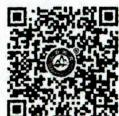

影响个体身心发展的主要因素——遗传

1. 遗传素质是人的身心发展的前提，为人的发展提供了可能性，但不能决定人的发展

人的身心发展必须有正常的遗传素质为基础，发展才有可能。没有这个前提，任何发展都不可能。

或者某些遗传素质有缺陷, 某种发展可能就永远不能实现。但遗传素质不决定人身心发展的现实性,遗传素质具有一定的可塑性, 它会随着环境、教育的改变和人类实践活动的深入等作用而逐渐发生变化。遗传因素对人的影响在整个发展过程中总体上呈减弱趋势。因此, 即使是某些低能或弱智儿童,在特殊教育的作用下, 也能获得一定发展。“遗传决定论”的观点夸大了遗传的作用, 把遗传看作是决定人的发展的唯一因素, 是不正确的。

# 2. 遗传素质的个别差异是人的身心发展的个别差异的原因之一

遗传素质存在着个别差异，表现在高级神经活动类型、感觉器官的结构和机能方面。这些差异是个性形成的生理基础，是人的个性差异的最初原因。

# 3. 遗传素质的成熟机制制约着人的身心发展的水平及阶段

个体的遗传素质是逐步发展成熟的。遗传素质的成熟程度,为一定年龄阶段的身心发展提供了限制与可能,制约着年青一代身心发展的过程及其阶段。教育必须按照遗传素质发展的水平进行,超越或落后于遗传素质成熟水平都不利于人的发展。格塞尔通过双生子爬梯实验证明了他的“成熟势力说”。他认为,胎儿的发育大部分是由基因制约的,这种由基因制约的发展过程的机制就是成熟。

# 考点2 环境

环境包括自然环境和社会环境两大部分, 教育学中所说的环境一般指社会环境。广义上来说, 教育也包括在环境这一概念之中。为了突出学校教育在人的身心发展中的自觉性、目的性和计划性的特点, 以区别于环境影响的某种程度的自发性, 我们把学校教育从环境中分离出来, 另做详细叙述。

# 1. 社会环境为个体的发展提供了多种可能，使遗传提供的发展可能变成现实

社会环境是人发展的外部条件，为个体的发展提供了多种可能，如机遇、条件和对象。离开社会环境这种外部条件，再好的遗传素质也难以发挥作用。遗传提供的可能只有在一定的社会环境下才能变为现实。“近朱者赤，近墨者黑”“染于苍则苍，染于黄则黄”“蓬生麻中，不扶而直；白沙在涅，与之俱黑”及“孟母三迁”的故事，都说明了社会环境对人的发展的影响。

# 2. 环境是推动人身心发展的动力

(1)环境是人身心发展不可缺少的外部条件。在人类社会中，每个社会成员之间都结成一定的社会关系，因而人具有社会性的特点，人的发展永远不能离开赖以生存的社会环境。  
(2)环境推动和制约着人身心发展的速度和水平。环境对个体发展的影响有积极和消极之分，一般来说，生产力发达地区或良好的社会生活条件，可以加速年青一代身心发展的进程；相反，不良的社会生活条件，可以阻碍年青一代身心发展的进程。

# 3. 环境不决定人的发展

环境对人的身心发展具有一定的影响, 但环境不决定人的发展, 因为环境的作用具有自发性、偶然性等特点, 对于环境的影响, 个体存在适应与对抗, “出淤泥而不染”讲的就是这个道理。这也说明虽然环境制约着人的身心发展, 但是人在一定程度上又可以发挥主观能动性, 超越环境的制约。因此, 夸大环境对人的发展的作用, 特别是“环境决定论”的观点是错误的。

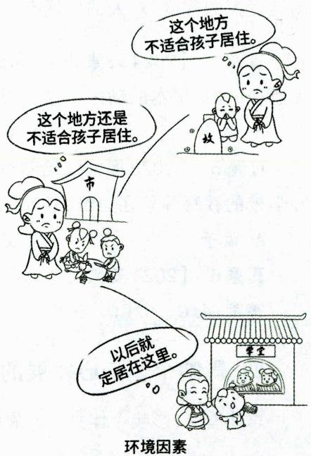

# 4. 人对环境的反应是能动的

社会环境是人发展的外部条件，但是个体受环境的影响不是消极被动的，而是积极能动的实践过程。环境对人的发展的影响要通过个体的主观努力和社会实践活动才能实现。有的人在良好的环境中却没有什么成就，甚至走向与环境要求相反的道路；有的人在恶劣的环境中却能“出淤泥而不染”，成为很有作为的人。因此，主观能动性是外部影响转化为内部发展要素的根据。

# 考点3 教育（学校教育）

教育是社会环境的一部分，但它是影响人的发展的自觉的、可控的因素。教育，既是特殊的实践，又是特殊的环境。由于这种特殊性，使得在影响人的发展的因素中，教育对人的发展特别是对年青一代的发展起着主导作用和促进作用。

# 1.学校教育在人身心发展中起主导作用的原因

(1)学校教育是有目的、有计划、有组织地培养人的活动；(2)学校有专门负责教育工作的教师，相对而言效果较好；(3)学校教育能有效地控制和协调影响学生发展的各种因素。

# 2. 学校教育在人身心发展中起主导作用的表现（学校教育在影响个体发展上的特殊功能）

(1)学校教育对于个体发展做出社会性规范；(2)学校教育具有开发个体特殊才能和发展个性的功能；(3)学校教育对个体发展的影响具有即时和延时的价值；(4)学校教育具有加速个体发展的特殊功能。

# 3. 实现学校教育在人身心发展中起主导作用和促进作用的条件

学校教育主导作用和促进作用的实现是相对的、有条件的。从外部环境方面来说，它要求社会的发展为个体的发展提供相应的前提。从教育系统内部来说，它依赖于教育自身的状况和学习者的主观能动性。

我们在肯定学校教育对个体发展所起的主导作用的同时，还应正确地看待“教育万能论”和“教育无用论”这两个在教育功能认识上的误区。其中，“教育无用论”的主要代表人物是英国的高尔顿，认为教育对人的发展无能为力，这是一种抹杀教育在人的发展中的作用的观点。

# 考点 4 个体主观能动性

# 1. 个体主观能动性的概念

个体主观能动性是指人的主观意识和活动对于客观世界的积极作用, 包括能动地认识客观世界和改造客观世界, 并统一于人们的社会实践活动中。从活动水平的角度看, 个体主观能动性由三个层次构成: 第一层次是人作为生命体进行的生理活动, 第二层次是个体的心理活动, 最高层次是社会实践活动。

# 2. 个体主观能动性的作用

个体的主观能动性是人的一种内在需要，是一种寻求发展的积极动机和渴望。所以，个体的主观能动性是人的身心发展的内在动力、根本动力，也是促进个体发展从潜在的可能状态转向现实状态的决定性因素。逆境可以成才，“同流而不合污”“出淤泥而不染”“威武不能屈”等典故反映出人的主观能动性在个体发展中的作用。

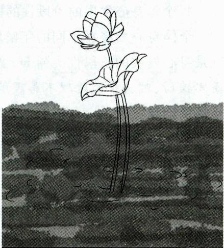  
个体主观能动性

总之，影响人的身心发展的因素是多方面的。遗传素质是人的身心发展的物质前提，环境为个体的发展提供了多种可能，而教育作为特殊的环境对人的身心发展起主导作用，个体主观能动性是人的身心发展的内因和动力。这些因素彼此关联、相互配合，共同发挥作用，促进人的身心发展。

真题7 [2024河北石家庄，单选]“居必择乡，游必就士”体现了（ ）对人身心发展的影响。

A. 遗传素质

B. 实践活动

C. 教育条件

D. 环境因素

真题8 [2024浙江金华,多选]影响人身心发展的因素主要有( )

A. 遗传

B. 环境

C. 教育

D. 个体主观能动性

真题9 [2024四川统考，判断]“出淤泥而不染”说明环境因素是影响人身心发展的主要因素。（）

真题10 [2024福建统考，辨析]学校教育在人的发展中发挥主导作用是必然的、无条件的。该观点是否正确？运用教育学知识加以分析。

真题11 [2024江苏苏州，简答]简述学校教育对个体发展的特殊功能。

答案：7.D 8.ABCD $9.\times$ 10.详见内文 11.详见内文

五、个体身心发展的规律 ★★★ 【单选、多选、填空、判断、简答、案例分析】

# 考点 1 个体身心发展的顺序性

# 1. 个体身心发展的顺序性的概念

个体身心发展的顺序性是指人的身心发展是一个由低级到高级、由简单到复杂、由量变到质变的连续不断的发展过程。例如，身体的发展遵循着从上到下、从中间到四肢、从骨骼到肌肉的顺序发展，心理的发展总是由机械记忆到意义记忆，由具体思维到抽象思维。

# 2. 个体身心发展的顺序性的教育要求

人的发展的顺序性是客观的、不以人的意志为转移的，教育工作要遵循这种顺序性，循序渐进地促进人的发展。所以，教育一般不可“陵节而施”，否则就会出现教育的异化，造成教育的负效应。

# 考点2 个体身心发展的阶段性

# 1. 个体身心发展的阶段性的概念

个体身心发展在不同的年龄阶段表现出不同的总体特征及主要矛盾，面临着不同的发展任务，这就是身心发展的阶段性。例如，童年期学生的思维特点是具有较大的具体性和形象性，抽象思维能力还比较弱，对抽象的道理不易理解；少年期的学生，抽象思维已经有了很大的发展，但经常需要具体的感性经验作支持。

# 2. 个体身心发展的阶段性的教育要求

个体身心发展的阶段性规律, 决定了教育工作必须根据不同年龄阶段的特点分阶段进行。如果不顾学生的年龄特征和接受能力, 在教育工作中搞“一刀切”“一锅煮”, 让孩子同成年人一样地听报告、搞活动、开批判会, 把对儿童和青少年的教育“成人化”, 就违反了个体身心发展的阶段性规律。教育工作必须从学生的实际出发, 针对不同年龄阶段的学生, 提出不同的具体任务, 采取不同的教育内容和方法, 既不能把小学生当中学生看待, 也不能把初中生和高中生混为一谈。

# 考点 3 个体身心发展的不平衡性（不均衡性）

# 1. 个体身心发展的不平衡性的表现

一方面是指身心发展的同一方面的发展速度，在不同的年龄阶段是不平衡的。例如，青少年的身高体重在其全部发展过程中会经历两个高峰：第一个高峰是在一岁左右，第二个高峰是在青春发育期。在这两个高峰期内，身高体重的发展较之其他阶段快得多。

另一方面是就个体身心发展的不同方面而言的。研究表明，青少年身心的不同方面所达到的某种发展水平或成熟的时期是不平衡的，有的方面可能在较早年龄就达到较高水平，而有的方面则晚些。例如，青春初期的孩子身高体重的增长已达到较高水平，而骨化过程远远没有完成。感知觉是认识的低级阶段，儿童的感知觉的发展比高级形式的判断、推理等逻辑思维能力的发展要早许多。

# 2. 个体身心发展的不平衡性的教育要求

人的身心发展的不同方面有不同的发展期的现象,引起了心理学家的重视,由此提出了发展关键期(也叫敏感期、最佳期)。所谓关键期,就是指人的某种身心潜能在人的某一年龄段有一个最好的发展时期。根据个体身心发展的不平衡性,教育教学要抓住关键期,以求在最短的时间内取得最佳的效果。

# 考点 4 个体身心发展的互补性

# 1. 个体身心发展的互补性的概念

互补性是指机体某一方面的机能受损甚至缺失后,可通过其他方面的超常发展得到部分补偿。机体各部分存在着互补的可能,为人在自身某方面缺失的情况下能与环境协调,从而继续生存与发展提供了条件。互补性也存在于心理机能与生理机能之间。人的精神力量、意志、情绪状态对整个机能起到调节作用,能帮助人战胜疾病和残缺,使身心依然得到发展。

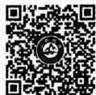  
个体身心发展的互补性

# 2. 个体身心发展的互补性的教育要求

教育工作者要树立信心，相信每一个学生，特别是暂时落后或某些方面有缺陷的学生，通过其他方面的补偿性发展，都可以达到与一般正常学生一样的发展水平；还要掌握科学的教育方法，发现学生的优势，扬长避短、长善救失，激发学生自我发展的信心和自觉。

# 考点 5 个体身心发展的个别差异性

# 1. 个体身心发展的个别差异性的概念

个体身心发展的个别差异性, 是指个体之间的身心发展以及个体身心发展的不同方面之间, 存在着发展程度和速度的不同。人的先天素质、环境和教育以及自身的主观能动性的不同, 决定了人的身心发展存在着个别差异。

# 2. 个体身心发展的个别差异性的表现

(1)不同儿童同一方面的发展速度和水平不同，如有些人“少年得志”，有些人则“大器晚成”。  
(2)不同儿童不同方面的发展存在差异，如有的儿童的数学能力较强，但绘画却很差，而有的儿童正好相反。  
(3)不同儿童所具有的个性心理不同，如同年龄的儿童具有不同的兴趣、爱好和性格等。  
(4)个别差异也表现在群体间，如男女性别的差异。

# 3. 个体身心发展的个别差异性的教育要求

个体身心发展的个别差异性要求教育必须因材施教，充分发挥每个学生的潜能和积极因素，有的放矢地选择适宜、有效的教育途径和方法手段，使每个学生都能得到最大的发展。如在教学中采取弹性教学制度、采取能力分组、组织兴趣小组等。

# 考点 6 个体身心发展的整体性

# 1. 个体身心发展的整体性的概念

学生是一个整体的人，以其整个身心投入教学生活，并以整个身心来感知、体验、享受和创造这种教学生活。教师所面对的是一个活生生的、整体的人，尽管这个整体不是“完美”的整体。

# 2. 个体身心发展的整体性的教育要求

(1)教学应该面对学生整个身心；(2)教学要着眼于学生的整体性，促进学生的一般发展，注意做到认知因素与非认知因素、意识与潜意识、科学与艺术的统一。

关于个体身心发展的规律，除了上述几个主要规律外，还有：稳定性和可变性。个体身心发展的稳定性，是指在一定社会和教育条件下，其身心发展阶段、发展顺序和每一阶段变化过程及速度大体上是相同的。但另一方面，个体身心发展又是可变的，它表现在不同社会或同一社会的不同发展阶段，同一年龄的学生，其发展水平是有差异的，同时又是可变的。

真题12 [2024广东广州，单选]学生的身体发展是按“从头到脚，从躯干到四肢”展开的，则身体发展顺序是（）

A. 从上到下, 从中间到四周, 从骨骼到肌肉  
B. 从下到上, 从四周到中间, 从肌肉到骨骼  
C. 从上到下, 从四周到中间, 从骨骼到肌肉  
D. 从下到上, 从中间到四周, 从肌肉到骨骼

真题13 [2024江苏南通，单选]时过然后学，则勤苦而难成。这说明教学工作应当遵循个体身心发展的（ ）规律。

A. 顺序性

B. 不均衡性

C. 互补性

D. 个别差异性

真题14 [2024河南事业单位，单选]同龄的中学生，女生的青春期比男生来得更早，发展速度更快。这说明（ ）

A. 身心发展具有顺序性  
B. 身心发展具有不平衡性  
C. 身心发展具有阶段性  
D. 身心发展具有个别差异性

真题15 [2022贵州贵阳，简答]简述学生身心发展的规律及教学启示。

答案：12.A 13.B 14.D 15.详见内文

# ★本节核心考点回顾 ★

# 1. 个体身心发展的动因

(1) 内发论（遗传决定论）：强调人的身心发展的力量主要源于人自身的内在需要，主要代表人物有孟子、弗洛伊德、威尔逊、高尔顿、格塞尔、霍尔。

(2)外铄论（环境决定论）：认为人的发展主要依靠外在的力量，主要代表人物有荀子、洛克、华生、斯金纳。

2. 影响个体身心发展的主要因素

(1) 遗传 (遗传素质): 物质前提, 不能决定人的发展;  
(2)环境：外部条件，提供多种可能；  
(3)教育（学校教育）：起主导作用和促进作用；  
(4)个体主观能动性：内因和动力，决定性因素。

3. 个体身心发展的规律

(1) 顺序性。顺序性强调人的身心发展是一个由低级到高级、由简单到复杂、由量变到质变的连续不断的发展过程, 要求教育必须循序渐进, 不可“陵节而施”。  
(2)阶段性。阶段性强调个体身心发展在不同年龄阶段的总体特征和发展任务不同,要求教育工作必须根据不同年龄阶段的特点分阶段进行,不能搞“一刀切”“一锅煮”。  
(3)不平衡性。不平衡性强调同一个体同一方面的发展不同速或不同方面的发展不同步，要求教育教学要抓住关键期。  
(4)互补性。互补性强调生理与生理之间的互补或生理与心理之间的互补，要求教育者要相信学生，做到扬长避短、长善救失。  
(5)个别差异性。个别差异性强调不同个体或群体之间的差异，要求教育教学要贯彻因材施教的原则。  
(6)整体性。

# 第三章 教育目的与教育制度

# 本章学习指南

# 一、考情概况

本章属于教育学的基础章节，内容较为琐碎，考生可带着以下学习目标进行备考：

1.理解教育目的的意义和作用（功能）。  
2. 识记教育目的的层次结构，掌握并区分教育目的的价值取向。  
3. 掌握我国教育目的的理论依据和基本构成。  
4. 理解素质教育的相关内容。  
5. 识记现代学校教育制度的类型。  
6. 识记并区分旧中国的几种学制的具体内容。

# 二、考点地图

<table><tr><td>考点</td><td>年份/地区/题型</td></tr><tr><td>教育目的的作用(功能)</td><td>2024天津简答;2023四川单选;2023河南单选;2022内蒙古单选</td></tr><tr><td>教育目的的层次结构</td><td>2024安徽单选;2024山东单选;2023广西单选;2023山东单选;2023河北多选</td></tr><tr><td>个人本位论与社会本位论</td><td>2024四川单选;2024河北单选;2024广东单选;2024山东单选、判断;2024天津判断、名词解释;2023广东单选;2023江苏单选;2023湖南单选;2023辽宁单选;2023四川判断</td></tr><tr><td>我国确立教育目的的理论依据</td><td>2024天津单选;2024安徽判断;2023江苏单选;2023河北单选;2023安徽单选;2023福建填空</td></tr><tr><td>我国教育目的的基本构成</td><td>2024广东单选;2024河南单选;2024天津单选;2024山东多选;2024贵州判断;2024安徽简答;2023安徽单选;2023辽宁单选;2023河北单选;2023山东单选;2022河南判断</td></tr><tr><td>素质教育的内涵</td><td>2024福建多选;2024浙江简答;2023河北单选;2022天津单选;2022河南多选</td></tr><tr><td>实施素质教育应避免的误区</td><td>2024天津判断;2024安徽判断;2023河北多选;2023安徽判断</td></tr><tr><td>现代学校教育制度的类型</td><td>2024浙江多选;2023河北单选;2022广东单选;2022辽宁判断</td></tr><tr><td>旧中国的学制沿革</td><td>2024河北单选;2024江苏填空、判断;2023黑龙江单选;2023河北单选、判断;2022浙江单选</td></tr></table>

注：上述表格仅呈现重要考点的相关考情。

# 核心考点

# 第一节 教育目的

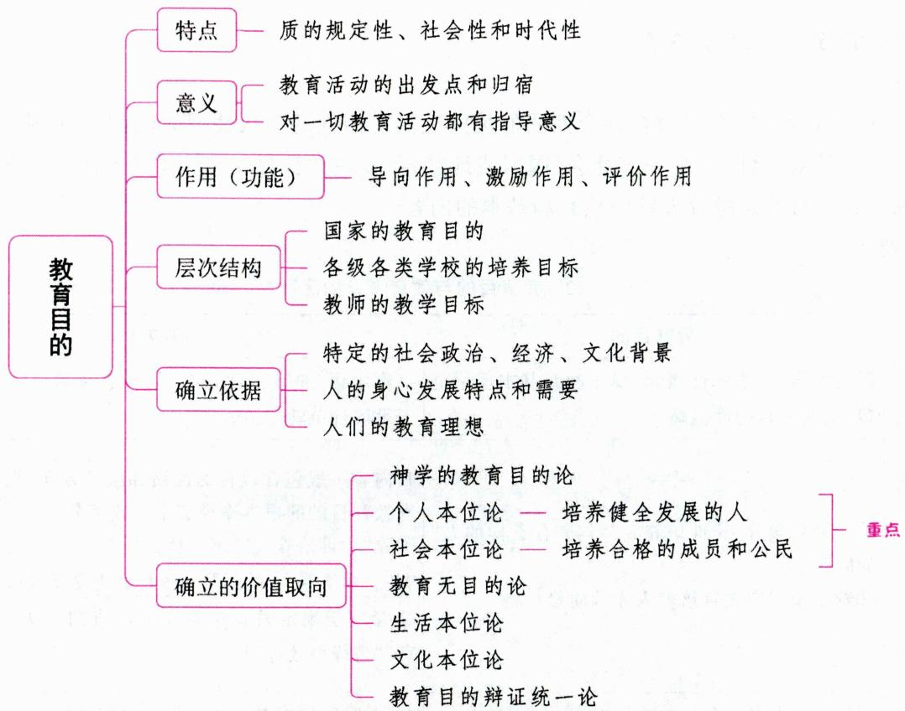

# 一、教育目的的内涵 ★【单选、判断】

# 考点1 教育目的的概念

教育目的指教育要达到的预期结果，是根据一定社会发展和受教育者自身发展需要及规律，对受教育者提出的总的要求，规定了把受教育者培养成什么样的人，是培养人的质量规格标准，同时也反映了教育在人的努力方向和社会倾向性等方面的要求。

广义的教育目的是指人们对受教育者的期望，即人们希望受教育者通过教育在身心诸方面发生什么样的变化。国家和社会教育机构、家长、教师等对新一代寄予的期望都可以理解为广义的教育目的。

狭义的教育目的是指由国家提出的教育总目的（国家对把受教育者培养成为什么样人才的总的要求）和各级各类学校必须遵循的总体要求，以及各级各类学校在课程或教学方面对所培养的人的特殊要求，即各级各类学校的具体培养目标和教学目标，它是广义的教育目的的具体化。

本章主要研究狭义的教育目的，特别是我国的教育总目的。

# 考点2 教育目的与教育方针

# 1. 教育方针的内涵

教育方针是最高国家权力机关根据政治、经济要求，明令颁布实行的一定历史阶段教育工作的总的

指导方针或总方向。它是指引教育工作前进的方向和指针,对于教育任务的确定、教育内容和方法的选择以及全部教育工作的组织和管理都起着指导和制约作用。

教育方针是教育政策的总概括，是全国各级各类教育的目的和必须遵循的准则，是指导整个教育事业发展的战略原则和行动纲领。它反映了一个国家教育的根本性质、总的指导思想和教育工作的总方向等要素。

# 2.教育目的与教育方针的关系

# (1)联系

教育目的与教育方针在对教育社会性质的规定上具有内在的一致性，都含有“为谁（哪个阶级、哪个社会）培养人”的规定性，都是一定社会（国家或地区）各级各类教育在其性质和方向上不得违背的根本指导原则。教育目的是教育方针中核心和基本的内容。

# (2)区别

表 1-22 教育目的与教育方针的区别  

<table><tr><td>对比项</td><td>教育目的</td><td>教育方针</td></tr><tr><td>归属范畴</td><td>理论术语,是学术性概念,属于教育基本理论范畴,也属于目的性范畴</td><td>工作术语,是政治性概念,属于教育政策学范畴,也属于手段性范畴</td></tr><tr><td>内容</td><td>①一般只包含“为谁培养人”“培养什么样的人”的问题。
②着重于规定教育培养人才的质量规格</td><td>其内容一般包含教育的性质和服务方向、教育目的、实现教育目的的根本途径三个组成部分。
①除“为谁培养人”“培养什么样的人”的问题之外,还含有“怎样培养人”的问题和教育事业发展的基本原则。
②着重于规定教育事业发展的方向(“办什么样的教育”“怎样办教育”)</td></tr><tr><td>提出者</td><td>国家、政党、团体或个人(对教育实践可以不具约束力)</td><td>政府或政党(对教育实践具有强制性)</td></tr><tr><td>影响力</td><td colspan="2">教育方针&gt;教育目的</td></tr></table>

真题1 [2024广东佛山, 单选]( )是指引教育工作前进的方向和指针, 它对于教育任务的确定、教育内容和方法的选择以及全部教育工作的组织和管理都起着指导和制约的作用。

A. 教育方针

B. 培养目标

C. 高等教育

D. 义务教育

答案：A

# 二、教育目的的特点 ★★ 【单选、多选、不定项、判断】

同人类社会生活和活动的目的一样，教育目的也带有意识性、意欲性、可能性和预期性的特点。除此之外，教育目的还有两个较为明显的特点：

(1)教育目的对教育活动具有质的规定性。即教育目的对教育活动的社会倾向和人的培养具有质的规定性。教育目的作为培养人的总体要求,总是内在地决定着教育的社会性质和教育对象发展的素质。  
(2)教育目的具有社会性和时代性。教育是培养人的社会活动，无不受到社会及各个时代的制约，这也就使得教育目的在历史的发展中常常带有社会不同时代的特点，体现不同时代的要求。

# 知识再拔高·

# 教育目的的特点的其他说法

说法一：教育目的具有强制性、宏观性、历史性、理想化等特点。

说法二：教育目的的特点包括：(1)主观性与客观性的统一。作为对所培养人才的质量和规格的规定，教育目的必然带有主观色彩，以反映教育者的教育期待。但是，无论教育目的的提出者是谁，他都不可能臆想，而是必须依据一定的社会历史条件、时代背景来形成和提出自己的教育目的。因此，教育目的必然会具有客观性。(2)抽象性与具体性的统一。(3)现实需要性与实现可能性的统一。(4)理性规定性与实践操作性的统一。(5)权威性与效仿性的统一。

真题2 [2023贵州贵阳, 判断]教育目的是由人确定的, 具有主观性, 不具有客观性。( )

答案：×

# 三、教育目的的分类 ★【单选、多选】

表 1-23 教育目的的分类  

<table><tr><td>分类依据</td><td>类型</td><td>含义</td></tr><tr><td rowspan="2">按作用特点</td><td>价值性教育目的</td><td>教育在人的价值倾向性发展上意欲达到的目的。根本是要解决培养具有怎样社会情感和个人情操的人(心有所属)</td></tr><tr><td>功用性教育目的</td><td>教育在发展人从事或作用于各种事物的活动性能方面所预期的结果。根本是要解决人在各类活动中的实际能力和作用效能的开发与提升,发展和增强人在各种活动中行为的有用性和功效性(身有所为)</td></tr><tr><td rowspan="2">按要求的特点</td><td>终极性教育目的(理想的教育目的)</td><td>具有终极结果的教育目的,蕴涵着对人发展的那种最为理想的要求</td></tr><tr><td>发展性教育目的(现实的教育目的)</td><td>具有连续性的教育目的,表示教育及其活动在发展的不同阶段所要实现的各种结果</td></tr><tr><td rowspan="2">按被实际所重视的程度</td><td>正式决策的教育目的</td><td>由社会一定权力机构确定并要求所属各级各类教育都必须遵循的教育目的。它一般是由国家(或一定地区)作为主体提出的,其决策过程要经过一定的组织程序,常常体现在国家或地区重要的教育文本或有关的法令之中</td></tr><tr><td>非正式决策的教育目的</td><td>蕴涵在教育思想、教育理论中的教育目的。借助一定的理论主张和社会根基而存在</td></tr><tr><td rowspan="2">按体现的范围</td><td>内在教育目的</td><td>具体教育过程(或某门课程建设)要实现的直接目的</td></tr><tr><td>外在教育目的</td><td>教育目的领域位次较高的教育目的</td></tr><tr><td rowspan="2">按存在的方式</td><td>应然的教育目的</td><td>教育目的的制定主体以成文的、合乎规范的形式所规定并表述的教育目的。特点:理论化、概念化、理想化、权威性、统一性等</td></tr><tr><td>实然的教育目的</td><td>教育过程的当事人理解、贯彻、执行的教育目的。特点:大众性、可操作性、具体化</td></tr></table>

另外，也有学者按照制定教育目的的主体、教育目的的价值取向、教育目的的存在方式这三个因素对教育目的进行分类。(1)以制定教育目的的主体为标准进行分类，教育目的可以分为：①外在的教育

目的和内在的教育目的; ②指令性教育目的和指导性教育目的。(2)以教育目的的价值取向为标准进行分类, 教育目的可以分为个人本位的教育目的和社会本位的教育目的。(3)以教育目的的存在方式为标准进行分类, 教育目的可以分为应然的教育目的和实然的教育目的。

真题3 [2023河北石家庄，单选]经过一定的组织程序，由国家或一定地区作为主体提出来的教育目的属于（）

A. 非正式决策的教育目的

B. 正式决策的教育目的

C. 内在的教育目的

D. 广义的教育目的

答案：B

# 四、教育目的的意义 ★★ 【单选、判断】

教育目的是整个教育工作的核心，是教育活动的依据和评判标准、出发点和归宿，在教育活动中居于主导地位。同时它也是全部教育活动的主题和灵魂，是教育的最高理想。它贯穿于教育活动的全过程，对一切教育活动都有指导意义，也是确定教育内容、选择教育方法和评价教育效果的根本依据。

真题4 [2023河北保定, 单选]( )是一切教育工作的出发点, 是实现教育活动的归宿。它贯穿于教育活动的全过程, 对一切教育工作都具有指导意义。

A. 教育原则

B. 教育目标

C. 教育目的

D. 教育理念

答案：C

# 五、教育目的的作用（功能） ★★★ 【单选、多选、判断、简答】

# 1. 导向作用

教育目的对教育工作具有导向作用。教育目的一经确立, 就成为人们行动的指南。它不仅为受教育者指明方向、预定发展结果, 也为教育工作者指明工作方向和奋斗目标。因此, 教育目的无论是对受教育者还是教育者都具有目标导向作用。

# 2.激励作用

教育目的对贯彻教育方针具有激励作用。它不仅能指导整个教育实践活动过程,而且能够激励人们为实现共同的目标而努力。教育目的本身就包含对学生成长的期望和要求,因此对学生的发展具有很大的激励作用。在教育活动中,只有当受教育者意识到教育目的对自身未来成长的要求或意义时,才能把它作为努力方向,不断按照教育目的的要求发展和提高自己。

# 3. 评价作用

教育目的是衡量、评价教育实施效果的根本依据和标准。评价学校的办学水平、办学效益，检查教育教学工作的质量，评价教师的教学质量和工作效果，检查学生的学习质量和发展程度等，都必须以教育目的为依据和标准来进行。

# 知识再拔高·

# 教育目的的作用（功能）的其他说法

说法一：定向、调控、评价作用。

(1)定向作用。教育目的规定了学校教育和学生发展的根本方向,是学校办学的根本指导思想,也是学生发展的总方向,是学校教育工作的起点和归宿,并制约其全过程。学校只能根据教育

目的办学，否则，就会偏离正确的办学方向。

(2)调控作用。教育目的规定了学校教育培养人才的基本质量规格，对学校教育的内容和活动方式起选择、协作、调节和控制作用。  
(3)评价作用。学校的办学质量以及学生的发展质量如何，可以有很多的标准来衡量，但根本标准乃是教育目的。一般来说，凡是遵循并实现了学校教育目的的学校，其教育质量就高。相反，偏离了教育目的，其教育质量就不可能高。

说法二：定向、调控、评价功能。

(1)定向功能。任何社会的教育活动, 都是通过教育目的才得以定向的。教育目的及其所具有的层次性, 不仅内含对整体教育活动努力方向的指向性和结果要求, 而且还含有对具体教育活动的具体规定性。具体体现为: ①对教育社会性质的定向作用, 对教育“为谁培养人”具有明确的规定; ②对人的培养的定向作用; ③对课程选择及其建设的定向作用; ④对教师教学的定向作用。  
(2)调控功能。教育目的对教育活动的调控主要借助以下方式来进行：①通过价值的方式来进行调控；②通过标准的方式来进行调控；③通过目标的方式来进行调控。  
(3)评价功能。教育目的不仅是教育活动应遵循的根本指导原则,而且也是检查评价教育活动的重要依据。因为一种能够实现的教育目的,总是含有多层次的系列目标,这使得它对教育活动不仅具有宏观的衡量标准,而且还具有微观的衡量标准。依据这些标准,教育目的能够对教育活动的方向和质量等做出判断,评价教育活动的得与失:①对价值变异情况的判断与评价;②对教育效果的评价。

说法三：导向、调控、激励、评价功能。

说法四：导向、选择、激励、评价、协调作用。

真题5 [2023四川统考，单选]根据教育目的，可以对教育活动的方向和质量做出判断，衡量教育活动的得与失。这体现了教育目的的（ ）功能。

A. 调控

B. 评价

C. 指导

D. 定向

真题6 [2022内蒙古赤峰, 单选]教育目的一经确立, 就成为人们行动的指南。它不仅为受教育者指明了发展方向, 预定了发展结果, 也为教育工作者指明了工作方向和奋斗目标。这体现了教育目的的（）

A. 导向作用

B. 激励作用

C. 评价作用

D. 调节作用

答案：5.B 6.A

# 六、教育目的的结构 【单选、多选、判断】

# 考点1 教育目的的层次结构

教育目的是各级各类学校遵循的工作总方针，但各级各类学校还有各自的具体工作方针，这便决定了教育目的的层次性。教育目的包括三个层次：国家的教育目的、各级各类学校的培养目标和教师的教学目标。

# 1.第一个层次——国家的教育目的

国家的教育目的是由国家提出来的，其决策要经过一定的组织程序，一般体现在国家的教育文本和教育法令中。教育目的是国家对教育所培养的人的质量和规格的总要求，是含有方向性的总体目标

和最高目标，是一个国家乃至一种社会人才培养的终极目标，也是一个国家教育的起点和终点。

# 2. 第二个层次——各级各类学校的培养目标

# (1)培养目标的概念

根据各级各类学校的任务确定的对所培养的人的特殊要求，习惯上称为培养目标。它是根据国家的教育目的制定的某一级或某一类学校、某一专业对人才培养的具体要求，是国家的教育目的在不同教育阶段、不同级别的学校、不同专业方向的具体化。在培养目标上，各级各类学校的培养目标既有共同要求，又有一定差异。因此，各级各类学校的培养目标必须同中有异、重点突出、特点鲜明。

# (2)教育目的与培养目标之间的关系

教育目的与培养目标之间是普遍与特殊的关系。教育目的是针对所有受教育者提出的，而培养目标是针对特定的教育对象提出的。

# 3. 第三个层次——教师的教学目标

# (1)教学目标的概念

教学目标是教育者在教育教学过程中，在完成某一阶段的工作时，希望受教育者达到的要求或产生的变化结果。教学目标是教育目的和培养目标在教学活动中的进一步具体化。

# (2)教学目标与教育目的、培养目标之间的关系

教学目标与教育目的、培养目标之间的关系是具体与抽象的关系。教育目的是最高层次的概念，它是培养各级各类人才的总的规定，各级各类学校的培养目标、教学目标都要依据教育目的制定。培养目标是指不同类型、不同层次的学校培养人的具体要求。教学目标是三者中最低层次的概念，更为具体，微观到每堂课甚至每个知识内容，教育目的和学校的培养目标是制定教学目标的依据。教育目的的各层次之间的关系是：从教育目的到教学目标是抽象到具体的关系，后者是前者的具体化，只有实现了具体的教学目标，才能达到实现教育的总目的的要求。

此外, 也有学者认为, 教育目的作为教育的总体目标, 它的实现需要不断具体化, 构成一个层级体系, 这一层级体系从抽象到具体依次为: 教育目的、培养目标、课程目标、教学目标。

真题7 [2024安徽统考, 单选]教育目的作为教育的总体目标, 它的实现需要不断具体化, 构成一个层级体系。这一层级体系从抽象到具体, 依次为（）

A. 教育目的、课程目标、培养目标、教学目标  
B. 教育目的、培养目标、课程目标、教学目标  
C. 教育目的、培养目标、教学目标、课程目标  
D. 教育目的、教学目标、培养目标、课程目标

真题8 [2023河北邯郸，多选]我国教育目的的基本层次包括（）

A. 国家的教育方针

B. 国家的教育目的

C. 学校的培养目标

D.教师的教学目标

答案：7.B 8.BCD

# 考点2 教育目的的内容结构

说法一：教育目的一般由两部分组成：（1）就教育所要培养的人的身心素质做出规定，即提出受教育者在知识、智力、品德、审美、体质等诸方面的发展要求，以期受教育者形成某种个性结构。（2）就教育所要培养的人的社会价值（社会性质和方向）做出规定，即指明这种人符合什么社会的需要或为什么阶

级的利益服务。其中，关于身心素质的规定是教育目的内容结构的核心部分。

说法二：教育目的有两个基本组成部分：（1）第一个组成部分是对培养何种社会成员（角色）的规定。这方面曾有过多种提法，如培养“劳动者”“建设者”“接班人”“公民”等。这是教育目的的核心部分。（2）第二个组成部分是对教育对象形成何种素质结构的规定。这也就是对受教育者思想、道德、心理、知识、能力、体质等方面素质的教育要求和规定。

# 小香课堂·

通过对目前各省份历年真题的分析，关于教育目的的内容结构主要考查以上两种说法。关于教育目的内容结构的组成部分，这两种说法在本质上是一致的，但在教育目的内容结构的核心部分的观点上却是对立的。该考点在考试中一般以单选题的形式进行考查，考生在作答时需要认真辨别具体考查的是哪一种说法。

# 七、确立教育目的的依据 ★★ 【单选、多选、判断】

确立教育目的的基本依据包括主观和客观两个方面，具体如下：

# 1.特定的社会政治、经济、文化背景

这是确立教育目的的客观依据，主要表现为：

(1)教育目的的确定受社会生产力和科学技术发展水平的制约。教育目的是对社会生产力和科学技术发展特点的反映，体现着这一发展的时代特征。  
(2)教育目的的确定受一定社会经济和政治制度的制约。教育目的的制定会体现一定社会经济、政治的要求，在阶级社会中具有鲜明的阶级性，不同的社会制度有着不同的教育目的。  
(3)教育目的的确定必须考虑历史发展的进程。在不同的社会发展阶段里,有不同的教育目的。  
(4)不同国家的文化背景也使教育培养的人各具特色。

# 2.人的身心发展特点和需要

教育目的的确定还要受到受教育者身心发展的规律这一客观依据的影响。

# 3. 人们的教育理想

人们在考虑教育目的时往往会受其哲学观念、人性假设和理想人格等观念和价值取向这些主观依据的影响。在社会主义国家，马克思主义经典作家关于全面发展的人格理想是教育目的确定的重要依据。

此外, 也有说法认为选择、确立教育目的的依据有: (1) 社会依据。① 社会关系现实和发展的需要;②社会生产和科学技术发展的需要。(2) 人的依据。①人的身心发展特点; ②人的需要。

# 知识再拔高·

# 教育目的的社会制约性

人们提出形形色色的教育目的，不管他们承认不承认，实际上都是社会对其成员质量规格的客观需求在他们意识中的反映，是他们所处时代的产物，这就是所谓教育目的的社会制约性。

教育目的的社会制约性包括：（1）教育目的受一定的生产力和生产关系及以此为基础的政治观点与制度的制约；（2）教育目的的制定要考虑受教育者身心特点，但它不影响教育的性质和方向。另外，还应当看到，制定教育目的时，考虑儿童的身心发展特点是从其可行性角度来认识问题的，真正决定教育目的的性质、方向和内涵的还是社会，是社会的生产力发展水平和政治经济制度的性质。

真题9 [2022广西桂林，单选]确定教育目的的客观依据是（）

A. 哲学观念

B. 人性假设

C. 理想人格

D. 生产力发展水平

真题10 [2023河北石家庄，多选]选择教育目的的依据有（）

A. 社会关系现实与发展需要

B. 社会生产和科学技术发展需要

C.人的需要

D.人的身心发展特点

真题11 [2023贵州贵阳，判断]真正决定教育目的的性质、方向和内涵的是儿童的身心发展特点。（）

答案：9.D 10.ABCD 11. $\times$

# 八、教育目的的价值取向

考点1·教育目的确立的价值取向 ★★★ 【单选、填空、判断、辨析、名词解释、简答】

# 1.神学的教育目的论

神学的教育目的论者认为人有肉体也有灵魂, 但灵魂才是人的本质。因此, 教育对人的肉体和精神都要关心, 但主要关心的应当是灵魂。教育应当建立在精神本质占优势的基础之上。其代表人物有夸美纽斯、雅克·马里坦、小原国芳等。

# 2. 个人本位论与社会本位论

在教育目的价值取向上，争论最多、影响最大、最具根本性的问题是：教育活动究竟是应当注重满足人的个性发展需要，还是应当注重满足社会发展需要？由此，构成了教育目的选择上的两种典型的价值取向，即个人本位论和社会本位论。

# (1)个人本位论

个人本位论的代表人物有孟子、卢梭、裴斯泰洛齐、福禄贝尔、赫钦斯、奈勒、马斯洛、萨特等。

个人本位论认为确立教育目的的根据是人的本性，教育的目的是培养健全发展的人，发展人的本性，挖掘人的潜能，增进受教育者的个人价值，个人价值高于社会价值，而不是为某个社会集团或阶级服务。简言之，教育的根本目的是人的本性和本能的高度发展。

个人本位论肯定人的价值，能够遵循人的身心发展规律进行教育，具有积极的作用。其不足在于忽视了社会的需要以及社会的发展，仅以个体发展需要作为制定教育目的的依据，割裂了个体和社会之间的关系。

# (2)社会本位论

社会本位的目的论主要反映的是古代社会的特征和要求。在近现代，教育史上也出现过社会本位的目的论思想。最具代表性的是教育社会学中的“社会功能学派”。社会本位论的代表人物有荀子、柏拉图、赫尔巴特、涂尔干（迪尔凯姆）、纳托普（那托尔普）、凯兴斯泰纳、孔德、巴格莱等。

社会本位论认为确立教育目的的根据是社会的要求，个人的发展必须服从社会的需要。教育的目的是为社会培养合格的成员和公民，使受教育者社会化，社会价值高于个人价值，教育质量和效果可以用社会发展的各种指标来评价。简言之，教育以社会的稳定和发展为最高宗旨。

社会本位论从国家和社会的发展角度来衡量教育成果，充分利用国家和社会资源发展教育事业，重视教育目的的社会制约性。其缺点在于忽视了个人的发展需要，无视个体的主观能动性，否定人的价值，扭曲了社会需要和个人发展之间的辩证关系。

# 知识再拔高·

# “个人本位论”和“社会本位论”的其他论述

王道俊、郭文安主编的《教育学》中对“个人本位论”和“社会本位论”的论述如下：

1. 个人本位论

个人本位论者认为，教育的根本目的就是充分发展个人的潜能与个性，至于社会的要求是无关紧要的。它有以下主要观点：

(1)教育目的是根据个人发展的需要制定的，而不是根据社会的需要制定的；  
(2)个人价值高于社会价值；  
(3)人生来就有健全的潜在本能，教育的基本职能就在于使这种潜能得到发展。

2. 社会本位论

社会本位论者认为，教育的根本目的是由社会发展的需要所决定的，至于人的潜能与个性的需要是无关紧要的。它有以下主要观点：

(1)个人的一切发展都有赖于社会。例如,涂尔干指出:“教育在于使年青一代系统地社会化” “其目的在于,使儿童的身体、智力和道德状况都得到某些激励与发展,以适应整个社会在总体上对儿童的要求,并适应儿童将来所处的特定环境的要求”。  
(2)教育除了满足社会需要以外并无其他目的。例如,那托尔普说:“在教育目的的决定方面,个人不具有任何价值,个人不过是教育的原料,个人不可能成为教育的目的。”  
(3)教育的结果或效果是以其社会功能发挥的程度来衡量的。例如,凯兴斯泰纳主张:“一切教育的目的是教育有用的国家公民”“国家的教育制度只有一个目标,就是造就公民”。

另外，在西方教育思想史上，杜威曾试图调和教育目的价值取向上的个人本位和社会本位的分歧，企图实现二者的兼顾和协调。他认为，教育过程有两个方面：一是心理学的，二是社会学的，教育过程和目的就应该“使个人特性与社会目的和价值协调起来”。

# 3. 教育无目的论

教育无目的论从根本上否定了教育是一种有目的地培养人的活动。这种理论认为教育就是社会生活本身,是个人经验的不断扩大和积累,教育过程就是教育目的,教育之外再没有什么教育目的。这种把教育与社会生活、教育过程与教育目的混在一起的主张,是实用主义教育理论的一种表现。其代表人物是杜威。

# 4.生活本位论

(1) 斯宾塞的“教育准备生活说”

斯宾塞是教育要为未来的生活作准备的倡导者。他在《什么知识最有价值》中明确提出,教育目的是为“完满的生活”作准备,教育的主要任务就是教会人们怎样生活,教会他们运用一切能力。

(2)杜威的“教育适应生活说”

杜威是“教育即生活本身”教育目的的倡导者。他反对将教育视为未来生活的准备，主张学校不能脱离眼前生活，学校教育应该利用现有的生活情境作为其主要内容，把儿童培养成能完全适应眼前社会生活的人。

# 5. 文化本位论

文化本位论的教育目的观强调教育目的应围绕文化这一范畴来进行，用“文化”来统筹教育、社会、人三者之间的关系，其最终的目的在于：唤醒人们的意识，使其具有自动追求理想价值的意志，并使文

化有所创造，形成与发展新的文化。其代表人物有早期的狄尔泰和后来的斯普兰格。

# 6. 教育目的辩证统一论（马克思主义教育目的论）

教育是培养人的活动，教育目的要考虑人的身心发展的各个要素，给予个体自由、充分的发展，并予以高度重视。但这并不是抽象地脱离社会和历史来谈人的发展，而是把两者辩证地统一起来。此观点准确地揭示了社会需要与个人发展的辩证关系及其对教育目的的意义，克服了个人本位论与社会本位论的片面性。

真题12 [2024安徽合肥/淮北/铜陵，单选]关于教育目的，实用主义教育流派的代表人物杜威所持有的观点是（）

A. 个人本位论

B. 社会本位论

C. 国家利益论

D. 教育无目的论

真题13 [2023广东阳江, 单选]为镇压被征服的奴隶的反抗和抵御外来入侵, 斯巴达形成了以培养体格强壮, 富有勇武精神、爱国精神, 善于战斗并有持久斗志的武士为目的的教育。这符合( )的主张。

A. 个人本位论

B. 社会本位论

C. 生活本位论

D. 教育无目的论

真题14 [2023四川统考，判断]社会本位论认为，教育只有在有助于个人发展时才有价值。（）

真题15 [2024天津东丽,名词解释]个人本位论

答案：12.D 13.B 14.× 15.详见内文

# 考点2 教育目的价值取向确立应注意的问题 ★【单选、多选】

一个社会(国家或民族)的整体教育，应把满足社会的需要和人的需要作为基本价值取向。

# 1. 社会价值取向确立中应注意的问题

(1)以可持续发展的理念为指导。(2)适应与超越问题。教育既要适应现实社会的当前要求和需要,同样也要讲究超越,因为没有超越就不会有发展。(3)功利价值与人文价值问题。在重视人文精神、重视教育的人文价值的同时,要避免把它与功利价值对立起来。(4)民族性与世界性的问题。

# 2. 人的价值取向确立中应注意的问题

(1)人的社会化与个性化问题。(2)人的理性与非理性问题。当代教育目的的选择与确立,在价值取向上要避免陷入理性和非理性二者对立的误区。(3)科技素质与人文素质问题。从历史的发展来看,近代以前的教育基本上是以人文素质培养作为主要的价值取向;而近代以来的教育,科技素质在教育目的价值取向上日显突出。

# 九、各教育哲学流派的教育目的观 ★ 【单选、判断】

不同的教育哲学流派对教育的许多问题有着各自不同的理解，对于教育目的问题，他们也有着各自不同的主张与选择。

进步主义是影响美国20世纪教育最重要的教育哲学流派之一。进步主义教育赖以生长、发展的理论基础,无论是达尔文的进化论还是实验主义哲学,都突出了一个“变化”的思想,世界上的一切都处于变化的历程之中。与此相对应,在教育目的观上,进步主义也反对任何普遍的、绝对的、永恒不变的教育目的。

要素主义认为教育目的有两个方面。第一，从宏观方面而言，教育就是传递人类文化遗产的要素

或核心, 只有掌握了文化, 人才能准确预见各种行为方式的后果, 从而达到他们期望达到的目的。第二, 从微观方面而言, 教育就是帮助个人实现理智和道德的训练, 因为这对于个人理智和人格的和谐发展是必不可少的。

以恢复西方历史悠久的人文主义传统为宗旨的永恒主义认为，教育的根本目的就是发展那些使人同动物区别开来的根本特征，即人之所以为人的特征，把人塑造成为真正的人。

改造主义是从进步主义中逐渐分化出来的当代西方的一个教育哲学流派。他们认为，教育的主要目的是推动社会的进步和变化，设计并实现理想的社会。

以斯金纳的新行为主义心理学为基础的新行为主义认为，教育目的就是改变和控制学生的行为，实现行为目标，使他们为承担个人和社会生活的责任做好准备，成为有益于社会的人。

存在主义注重人的存在、注重现实人生,并以此为出发点,认为人是被抛到这个世界上来的,所有的存在都是偶然的。因此,教育纯粹是个人的事。教育无论对公众、集体还是社会,都不承担任何责任。教育的目的就是使每一个人都认识到自己的存在,并形成一套不同于他人的独特的生活方式。因此,教育要维护个人的自由,帮助个人进行自我选择,并对自己的选择负责。

马克思主义关于人的全面发展的教育学说，是制定社会主义教育目的的指导思想，社会主义教育用辩证唯物主义和历史唯物主义来分析和制定教育目的，给教育目的问题以科学的理论基础。

真题16 [2023黑龙江哈尔滨，单选]“教育纯粹是个人的事。教育无论对公众、集体还是社会，都不承担责任”属于（ ）的主张。

A. 要素主义

B. 改造主义

C. 存在主义

D. 自由主义

答案：C

# ★本节核心考点回顾 ★

# 1. 教育目的的作用

(1)导向作用。教育目的不仅为受教育者指明方向、预定发展结果，也为教育工作者指明工作方向和奋斗目标。  
(2)激励作用。在教育活动中, 只有当受教育者意识到教育目的对自身未来成长的要求或意义时, 才能把它作为努力方向, 不断按照教育目的的要求发展和提高自己。  
(3)评价作用。教育目的是衡量、评价教育实施效果的根本依据和标准。

# 2. 教育目的的层次结构

说法一：教育目的包括国家的教育目的、各级各类学校的培养目标和教师的教学目标。

说法二：教育目的从抽象到具体依次为教育目的、培养目标、课程目标、教学目标。

# 3. 个人本位论

(1)代表人物：孟子、卢梭、裴斯泰洛齐、福禄贝尔、赫钦斯、奈勒、马斯洛、萨特等。  
(2)观点：教育的根本目的是人的本性和本能的高度发展。

# 4. 社会本位论

(1)代表人物：荀子、柏拉图、赫尔巴特、涂尔干（迪尔凯姆）、纳托普（那托尔普）、凯兴斯泰纳、孔德、巴格莱等。  
(2)观点：教育以社会的稳定和发展为最高宗旨。

# 第二节 我国的教育目的

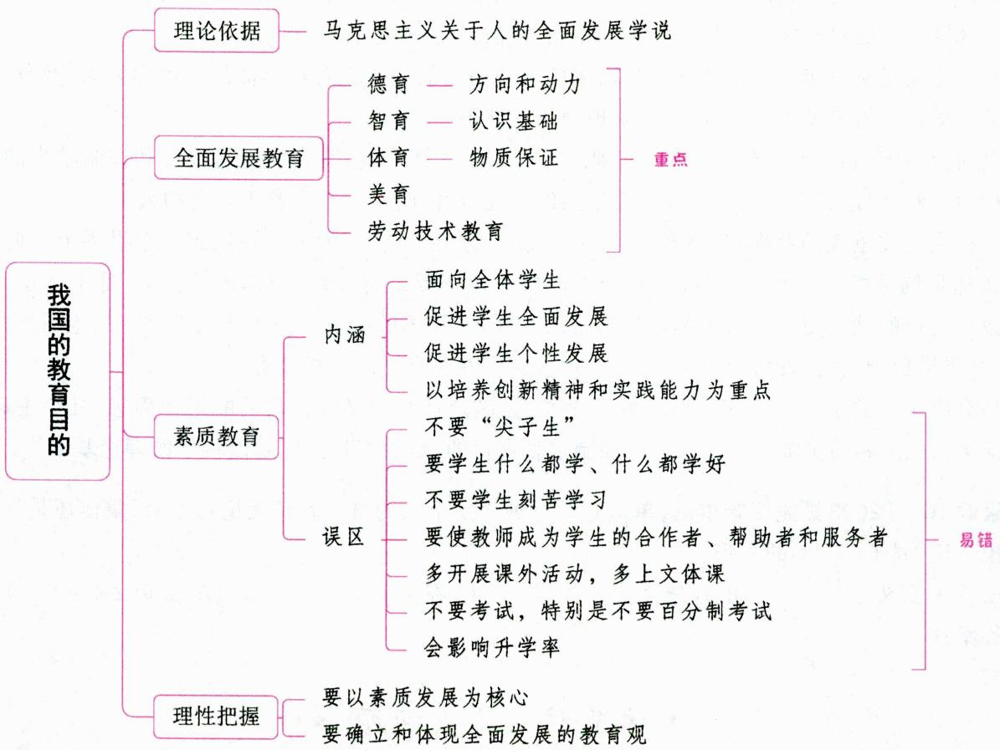

# 一、新中国成立以来教育目的的各种表述 ★ 【单选、多选、填空】

表 1-24 新中国成立以来教育目的的各种表述  

<table><tr><td>时间</td><td>文件或会议</td><td>关于教育目的的表述</td></tr><tr><td>1957年</td><td>《关于正确处理人民内部矛盾的问题》</td><td>我们的教育方针,应该使受教育者在德育、智育、体育几方面都得到发展,成为有社会主义觉悟的有文化的劳动者
注:这是新中国成立后颁布的第一个教育方针</td></tr><tr><td>1999年</td><td>《中共中央国务院关于深化教育改革全面推进素质教育的决定》</td><td>实施素质教育,就是全面贯彻党的教育方针,以提高国民素质为根本宗旨,以培养学生的创新精神和实践能力为重点,造就“有理想、有道德、有文化、有纪律”的、德智体美等全面发展的社会主义事业建设者和接班人</td></tr><tr><td>2001年</td><td>《国务院关于基础教育改革与发展的决定》</td><td>坚持教育必须为社会主义现代化建设服务,为人民服务,必须与生产劳动和社会实践相结合,培养德智体美等全面发展的社会主义事业建设者和接班人</td></tr><tr><td>2010年</td><td>《国家中长期教育改革和发展规划纲要(2010~2020年)》</td><td>全面贯彻党的教育方针,坚持教育为社会主义现代化建设服务,为人民服务,与生产劳动和社会实践相结合,培养德智体美全面发展的社会主义建设者和接班人</td></tr></table>

续表

<table><tr><td>时间</td><td>文件或会议</td><td>关于教育目的的表述</td></tr><tr><td>2012年</td><td>十八大报告</td><td>坚持教育为社会主义现代化建设服务、为人民服务,把立德树人作为教育的根本任务,培养德智体美全面发展的社会主义建设者和接班人</td></tr><tr><td>2017年</td><td>十九大报告</td><td>落实立德树人根本任务,发展素质教育,推进教育公平,培养德智体美全面发展的社会主义建设者和接班人</td></tr><tr><td>2018年</td><td>全国教育大会</td><td>坚持中国特色社会主义教育发展道路,培养德智体美劳全面发展的社会主义建设者和接班人,加快推进教育现代化、建设教育强国、办好人民满意的教育</td></tr><tr><td>2021年</td><td>《中华人民共和国教育法》(修正)</td><td>教育必须为社会主义现代化建设服务、为人民服务,必须与生产劳动和社会实践相结合,培养德智体美劳全面发展的社会主义建设者和接班人</td></tr><tr><td>2022年</td><td>二十大报告</td><td>全面贯彻党的教育方针,落实立德树人根本任务,培养德智体美劳全面发展的社会主义建设者和接班人</td></tr></table>

真题1 [2023福建统考，单选]我国教育目的的历史演变过程中，强调“培养学生的创新精神和实践能力”的方针出自（ ）

A.《中华人民共和国宪法》  
B.《国家中长期教育改革和发展规划纲要(2010～2020年)》  
C.《中共中央国务院关于深化教育改革全面推进素质教育的决定》  
D.《中共中央关于制定国民经济和社会发展十年规划和“八五”计划的建议》

答案：C

# 二、现阶段我国教育目的的基本精神 ★★【单选、多选、判断、简答】

新中国成立以来，党和国家制定的各种文件中有关教育方针及其规定的教育目的，提法虽然不尽相同，但基本内涵或基本精神是一致的，包含一个总的精神，就是培养学生成为未来国家、社会发展的主人。其基本点主要表现为：

(1)坚持社会主义方向性。要求培养的人是社会主义事业的建设者和接班人，因此要坚持政治思想道德素质与科学文化知识能力的统一。  
(2)坚持全面发展。要求学生在德、智、体等方面全面发展，要求坚持脑力与体力两方面的和谐发展。  
(3)培养独立个性。适应时代要求，强调学生个性的发展，重点是培养学生的创新精神和实践能力。  
(4)教育与生产劳动相结合，是实现我国教育目的的根本途径。  
(5)注重提高全民族素质。提高全民族素质是我国当今社会发展赋予教育的根本宗旨，也是我国当代教育的重要使命。

总的来说, 其体现的精神实质是: 第一, 培养劳动者 (为经济建设和社会的全面发展进步培养各级各类人才) 是社会主义教育目的的总要求; 第二, 要求德、智、体、美、劳等方面全面发展是社会主义的教育质量标准; 第三, 坚持社会主义方向, 是我国教育目的的根本性质和特点; 第四, 坚持教育与生产劳动相结合的根本途径。同时, 这也体现了我国教育目的的基本特征, 即: 第一, 以马克思主义关于人的全

面发展学说为指导思想；第二，具有鲜明的政治方向；第三，坚持全面发展与个性发展的统一。

真题2 [2024河北石家庄，单选]我国社会主义的教育质量标准是（）

A. 坚持社会主义方向

B. 坚持德、智、体、美、劳全面发展

C. 坚持提高全民族素质

D. 坚持教育与生产劳动相结合

答案：B

# 三、我国确立教育目的的理论依据 ★★★ 【单选、填空、判断】

马克思主义关于人的全面发展学说是我国确定教育目的的理论依据和基础。其基本内容包括：

(1)人的全面发展。所谓人的全面发展，是指人的劳动能力，即人的体力和智力的全面、和谐、充分的发展，还包括人的道德的发展和人的个性的充分发展。人的全面发展是马克思主义教育学说的核心内容，也是社会主义教育的终极追求。

(2)旧式分工造成了人的片面发展。

(3)机器大工业生产为人的全面发展提供了基础和可能。

(4)社会主义制度是实现人的全面发展的社会条件。

(5)教育与生产劳动相结合是“造就全面发展的人的唯一方法”。马克思说：“教育与生产劳动相结合，不仅是提高社会生产的一种方法，而且是造就全面发展的人的唯一方法。”也就是说，教育与生产劳动相结合是培养全面发展的人的根本途径，也是唯一途径。

真题3 [2024天津和平, 单选]马克思认为( )是导致人的片面发展的根本原因。

A. 社会分工

B. 经济基础

C. 先天遗传

D. 后天环境

真题4 [2023福建统考，填空]我国教育目的的理论基础是马克思主义关于人的学说。

真题5 [2024安徽统考，判断]马克思主义关于人的全面发展学说，是中国特色社会主义教育学的理论基础，也是我国教育目的的理论基础。（）

答案：3.A 4.全面发展 5.√

# 四、我国教育目的的基本构成 ★★★ 【单选、多选、判断、名词解释、简答】

要培养全面发展的人,就必须建构起全面发展的教育。一般认为,我国现在中小学的全面发展教育主要包括德育、智育、体育、美育、劳动技术教育。学校教育教人行善、求真、健体、审美,并最终使人成为社会事务的承担者。德育重在教人行善,智育重在教人求真,体育重在教人健体,美育重在教人审美,而劳动技术教育则重在通过使个体掌握劳动工具的使用,创造能够满足人的需要的生产和生活的物品。

# 考点1 全面发展教育的组成部分

# 1. 德育

德育是培养学生正确的人生观、世界观、价值观，使学生具有良好的道德品质和正确的政治观念，形成正确的思想方法的教育。

德育的基本任务包括：(1)培养学生良好的道德品质；(2)培养学生正确的政治方向；(3)培养学

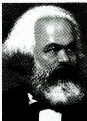  
马克思

生正确的价值观；(4)培养学生良好、健康的心理品质；(5)培养学生良好的思想品德能力等。

# 2. 智育

智育是传授给学生系统的科学文化知识、技能，发展他们的智力和与学习有关的非认知因素的教育。智育的主要内容和任务包括传授知识、发展技能、培养自主性和创造性。

智育的具体任务有：(1)向学生系统传授科学文化知识，为学生各方面发展奠定良好的知识基础；(2)培养训练学生，使其形成基本技能；(3)培养和发展学生的智力才能，增强学生各个方面的能力；(4)培养学生良好的学习品质和热爱科学的精神。

智育的根本任务是培育或发展学生的智慧，尤其是智力。

# 3. 体育

体育是授予学生关于健康的知识、技能，发展他们的体力，增强他们的自我保健意识和体质，培养他们参加体育活动的需要和习惯，增强其意志力的教育。

体育的基本任务包括：(1)指导学生锻炼身体，促进身体正常发育和技能的发展，增强学生体质，提高健康水平；(2)使学生掌握运动锻炼的科学知识和基本技能，掌握运动锻炼的方法，增强运动能力；(3)使学生掌握身心卫生保健知识，养成良好的身心卫生保健习惯；(4)发展学生良好品德，养成学生文明习惯。其中，增强学生体质是学校体育的根本任务，这是学校体育与学校其他活动最根本的区别。学校体育的功能包括健体功能、教育功能、娱乐功能。

学校体育的基本组织形式是体育课。

# 4.美育

美育，即审美教育，是培养学生健康的审美观，发展他们感受美、鉴赏美、创造美的能力，培养他们高尚的情操与文明素养的教育。

# (1)美育的主要特点

① 形象性。美育是通过美的事物的具体、可感知的形象来吸引受教育者，感染受教育者，使受教育者亲临其境，亲闻其声，亲见其行，得到审美的愉悦，从而达到教育的目的。  
②愉悦性。美育的愉悦性是指在美育活动中，受教育者常常处于一种喜悦的心理状态与精神状态，产生强烈的情感体验，获得极大的审美享受。这种愉悦是感染人、启发人、吸引人去参与审美、参与美育的重要因素。寓教于乐、以情动人是美育的显著特点之一。  
③自由性。美育的自由性主要表现为非强制性、自主性和超功利性。

# (2)美育的主要任务

①培养学生正确的审美观点，使他们具有感受美、理解美和鉴赏美的知识与技能；  
②培养学生艺术活动的技能，发展他们体现美和创造美的能力；  
③培养学生的心灵美和行为美，使他们在生活中体现内在美和外在美的统一。

其中，形成创造美的能力是美育的最高层次的任务。

# (3)美育的内容

说法一：学校美育的内容主要包括形式教育、理想教育和艺术教育。

说法二：学校美育主要应有艺术美育、自然美育、社会美育、教育美育等几个方面。

说法三：美育的内容可划分为艺术美、社会美、科学美和自然美四个方面。

# (4)美育的功能与作用

人们对美育功能的认识成果有三：一是对美育的直接功能（即“育美”）的认识；二是对美育的间接

功能（或附带功能、潜在功能，具体说就是美育的育德、促智、健体功能等）的认识；三是对美育的超美育功能（即美育的超越性功能）的探究。

美育对学生智、德、体、劳等各方面发展的促进作用表现在：

①美育可以扩大学生的知识视野，发展学生的智力和创造精神；  
②美育具有净化心灵、陶冶情操、完善品德的教育功能；  
③美育可以促进学生身体健美发展，具有提高形体美的健康性和艺术性的价值；  
④美育有助于学生劳动观点的树立、技能的形成，具有技术美学的价值。

总之，美育具有不可取代的特殊教育功能，它与其他各育互为条件，相辅相成，共同促进学生的全面发展。培养个性和才能全面和谐发展的完美的人，是美育的目的。

# (5)美育的实施

美育的实施主要涉及以下问题：美育过程、美育原则、美育途径和方法。

①美育过程

第一，通过审美感知活动，为鉴赏美和创造美奠定基础；

第二，通过审美鉴赏活动，发展审美判断力；

第三，通过审美创造活动，发展创造美的能力。

②美育原则

第一，形象性原则。对学生进行美育应当运用现实的或艺术的美的形象，使学生直接感知到美的清秀、艳丽、和谐、匀称、奇特、雄伟等形式，受到美的熏陶，养成高尚的情操。

第二,情感性原则。对学生进行美育要引导他们深入到现实的和艺术的美的意境中去,激起情感上的共鸣,达到入迷、陶醉的状态,使美融化于心灵。

第三, 活动性原则。对学生进行美育应该通过审美活动, 让学生在活动中去感受美、鉴赏美、创造美, 受到美的熏陶。这是审美教育区别于其他教育的主要标志。

第四，差异性原则。对学生进行美育应当根据学生的年龄特征、个性差异及审美情趣的不同，选择不同的内容和方式进行，使他们的审美兴趣、爱好与创造才能得到自由的发展。

第五，创造性原则。对学生进行美育不是让学生消极、被动、静观地接受美的形式，而是应当引导他们积极主动地富有想象力和创造性地感知、理解和创造美。自由创造是美育的灵魂。

③美育途径和方法

第一，通过课堂教学和课外文化艺术活动进行美育。课堂教学是学校美育的主要途径，学校美育只有渗入各科教学之中，才能有效地实施。

第二, 通过大自然进行美育。欣赏大自然的美可以增强学生的审美感知能力和理解能力; 欣赏自然美可以开阔视野, 增加知识, 陶冶情操, 砥砺品行; 利用大自然进行美育, 还要掌握自然美的特征和学生的审美特点; 要启发学生认识人与自然的审美关系, 理解欣赏自然美的“比德”“畅神”的审美观念。

第三，通过日常生活进行美育。

# 5. 劳动技术教育

劳动技术教育是引导学生掌握劳动技术知识和技能，形成劳动观点和习惯的教育。它包括劳动教育和技术教育两个方面。劳动技术教育的实质是培养学生的创造性实践能力，它是实现个体与社会协调统一、和谐发展的纽带和桥梁。

劳动技术教育的任务包括：(1)培养学生的劳动观点、劳动习惯和学习生产技术的兴趣；(2)使学生