初步掌握现代生产技术的基础知识和基本技能，学会使用一般的生产工具；(3)掌握组织生产和管理生产的初步知识和技能。

劳动技术教育的内容包括：(1)生产劳动与技术；(2)家政与家务劳动；(3)公益性劳动；(4)职业认知。

真题6 [2023安徽蚌埠，单选]智育的根本任务是（）

A. 发展学生的智力

B. 培养学生的自主性

C. 提高学生的竞争意识

D. 完善学生的人格

真题7 [2023辽宁营口，单选]( )是美育的灵魂。

A.审美互动

B. 触景生情

C. 生动可感

D. 自由创造

真题8 [2022河南濮阳，判断]体育课是学校体育的主要形式。（）

答案：6.A 7.D 8.√

# 考点2 全面发展教育各组成部分之间的关系

# 1.“五育”在全面发展中的地位存在不平衡性

全面发展不能理解为要求学生“样样都好”的平均发展，也不能理解为人人都要发展成为一样的人。全面发展的教育同“因材施教”“发挥学生的个性特长”并不是对立的、矛盾的。人的发展应是全面、和谐、具有鲜明个性的。在实际生活中，青少年德、智、体、美、劳诸方面的发展往往是不平衡的，有时需要针对某个带有倾向性的问题强调某一方面。学校教育也常会因某一时期任务的不同，在某一方面有所侧重。

# 2.“五育”各有其相对独立性

“五育”中的每一组成部分都有其相对独立性，有其特定的任务、内容和功能，对其他各育起着影响、促进的作用，各育不能相互代替。各育都具有特定的内涵、特定的任务，其各自的社会价值、教育价值、满足人发展的价值都是通过各自不同的作用体现出来的。

说法一：德育对其他各育起着保证方向和保持动力的作用，它体现了社会主义教育的方向，是“五育”的灵魂；智育为其他各育的实施提供了认识基础；体育是实施各育的物质保证；美育和劳动技术教育是德育、智育、体育的具体运用和实施。

说法二：德育则是各育实施的方向统帅和动力源泉；智育是各育实施的认识基础和智力支持；体育是各育实施的物质前提，是人的一切活动的基础；美育协调各育的发展；劳动技术教育是各育的实践基础。

# 3.“五育”之间具有内在联系

德育、智育、体育、美育、劳动技术教育紧密相连，它们互为条件，互相促进，相辅相成，构成一个统一的整体。它们的关系具有在活动中相互渗透的特征。

# 知识再拔高·

# 普通中小学教育的组成部分

普通中小学教育包括体育、智育、德育、美育和综合实践活动等组成部分。其中，德育集中体现了我国教育的价值取向和社会政治性质，在学生的全面发展中起着定向和动力的作用。

真题9 [2024广东佛山, 单选]教育的各个组成部分是统一的教育的不同方面, 有机地构成一个完整的教育, 对人的全面发展产生影响作用。全面发展教育的有机组成部分中, 对其他各育起着灵魂

和指导作用的是( )

A. 德育

B. 智育

C. 体育

D. 劳动技术教育

真题10 [2024贵州贵阳，判断]在“五育”中，为其他四育提供实践基础的是“智育”。( )

答案：9.A 10.×

# 五、素质教育 【单选、多选、不定项、判断、名词解释、简答、论述】

# 考点1 素质教育的概念 ★

1999年的《中共中央国务院关于深化教育改革全面推进素质教育的决定》，将素质教育确定为我国教育改革和发展的长远方针，素质教育随之成为我国各级各类教育追求的共同理想。

素质教育是依据人的发展和社会发展的实际需要,以全面提高全体学生的基本素质为根本目的,以尊重学生主体性和主动精神,注重开发人的智慧潜能,形成人的健全个性为根本特征的教育。

# 考点2 素质教育的特点 ★

说法一：素质教育的特点包括全体性、全面性、基础性、主体性、发展性、合作性和未来性。其中，全体性是素质教育最本质的规定、最根本的要求。

说法二：素质教育的特点包括方向性、发展性、全体性、全面性、整体性、层次性、开放性、多样性、时代性、超前性和主体性等。其中，发展性是教育的基本功能和本质特征，也是素质教育的本质特性。

说法三：素质教育的特点包括教育对象的全体性、教育内容的基础性、教育空间的开放性、教育目标的全面性和教育价值的多元化。其中，教育空间的开放性是指教育不再局限于课堂和书本知识，而是积极开拓获取知识的来源和获得发展的空间，重视利用课外的自然资源与社会资源，开展丰富多彩的活动。

真题11 [2022河北衡水，单选]素质教育的特点不包括（）

A. 全面性

B. 选拔性

C. 多元化

D. 开放性

答案：B

# 考点 素质教育的目的、任务、三要义

素质教育的根本目的，就是全面地提高学生的素质。它可以分为做人与成才两个层次：前者是后者的基础，偏重于共同要求；后者是前者的发展，偏重于区别对待。

素质教育的三任务包括：(1)培养学生的身体素质。身体素质处于素质整体结构的基础层。(2)培养学生的心理素质。心理素质处于素质整体结构的核心层。(3)培养学生的综合素质。社会素质处于素质整体结构的最高层。

素质教育的三要义包括：(1)面向全体；(2)全面提高；(3)主动发展。

真题12 [2023河南事业单位，单选]素质教育的发展任务中，处于素质整体结构中的核心层的是（）

A. 身体素质

B. 心理素质

C. 社会素质

D. 文化素质

真题13 [2022河北保定，多选]素质教育的三要义是指（）

A. 发展学生的创造性

B. 教育要面向全体学生

C. 教育要促进学生的全面提高

D. 让学生主动发展

答案：12.B 13.BCD

# 考点4 素质教育的内涵 ★★★

(1)素质教育是面向全体学生的教育。素质教育倡导人人有受教育的权利，强调在教育中每个人都得到发展，而不是只注重一部分人，更不是只注重少数人的发展。

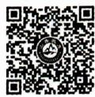  
素质教育的内涵

(2)素质教育是促进学生全面发展的教育。素质教育倡导的是在教育中使每个学生都得到充分的、全面的发展。素质教育的理论依据是全面发展教育，素质教育是对全面发展教育的具体落实和深化。实施素质教育必须坚持“五育”并举，促进学生生动活泼地发展。  
(3)素质教育是促进学生个性发展的教育。素质教育是全面发展的教育，是从教育对所有学生的共同要求的角度来看的。但每一个学生都有其个别性，如有不同的认知特征、不同的欲望需求、不同的兴趣爱好、不同的创造潜能，这些不同点铸造了一个个千差万别的、个性独特的学生。因此，教育还要尊重并充分发展学生的个性。  
(4)素质教育是以培养创新精神和实践能力为重点的教育。作为国力竞争基础工程的教育,必须培养具有创新精神和实践能力的新一代人才,这是素质教育的时代特征。对教育来说,培养创新精神和实践能力不是一般性的要求,更不是可有可无的事,而应成为教育活动的根本追求,成为素质教育的核心。能不能培养学生的创新精神和实践能力是应试教育和素质教育的本质区别。

真题14 [2024福建统考，多选]下列关于素质教育内涵的表述，正确的有（）

A. 面向全体学生的教育  
B. 促进学生个性发展的教育  
C. 开展课外活动的教育  
D. 以培养创新精神和实践能力为重点的教育

真题15 [2024浙江嘉兴，简答]简述素质教育的内涵。

答案：14.ABD 15.详见内文

# 考点5 创新教育及其在素质教育中的地位 ★★

创新教育是素质教育的核心,它是教育对知识经济向人才培养提出挑战的回应。它是旨在激发学生的创新意识,培养学生的创新能力的教育。

(1)创新能力不仅是一种智力特征,更是一种人格特征,是一种精神状态。  
(2)创新能力的培养是素质教育的核心，是素质教育区别于应试教育的根本所在。  
(3)重视创新能力的培养也是现代教育与传统教育的根本区别之所在。

# 知识再拔高·

# 教育创新与创新教育

教育创新不同于创新教育。教育创新是围绕着人的发展，对教育观念、教育模式和教育制度等进行全面的变革和创新。创新教育是关于创新素质的培养，尤其指人的创新意识、创新精神、创新能力和创新人格的培养。教育创新和创新教育的目的是一致的，都指向人的培养，但创新教育只指向人的创新素质的培养，教育创新则指向人的全面发展。创新教育是培养创新素质的教育，核心在“教育”；教育创新是围绕人的全面发展进行的教育观念创新、教育模式创新、教育制度创

新，核心在“创新”。

教育需要改革创新,改革创新是教育发展的强大动力。教育创新,应该源自教育内在变革的创新,来自教育自身发展的迫切需要。教育创新涉及观念、模式、制度等诸多层面的整体性变革: (1)教育观念创新。观念的创新是教育创新的先导。(2)教育模式创新。教育模式是教育创新的抓手和落脚点。(3)教育制度创新。教育观念和模式的创新,需要制度的创新作保证。创新模式使创新观念落地生根,创新制度为创新模式保驾护航。

真题16 [2024四川统考，单选]素质教育的核心是（）

A. 学习成绩的提升

B.各科知识的掌握

C.创新能力的培养

D.考试能力的提高

真题17 [2023河南事业单位，不定项]关于教育创新的描述，下列选项正确的有（）

A. 教育创新要以文化的传承、选择和交流为前提  
B. 教育创新应该源自教育内在变革的创新  
C. 教育模式是教育创新的抓手和落脚点  
D.观念的创新是教育创新的先导

答案：16.C 17.BCD

# 考点6 实施素质教育的措施

(1) 改变教育观念。提高民族素质，实施素质教育，关键是要转变教育观念。  
(2)转变学生观。   
(3)加大教育改革的力度。  
(4)建立素质教育的保障机制。包括：①充分发挥政府作用；②加大教育督导力度；③提高教育评价的科学性；④加强各级各类教育之间的沟通和衔接。  
(5)建立素质教育的运行机制。包括：①改革内部管理体制；②提高校长和教师的素质；③完善课程体系，优化教学过程。  
(6)营造良好的校园文化氛围。

# 考点7 实施素质教育应避免的误区 ★★★

(1)素质教育就是不要“尖子生”。这是对素质教育面向全体学生的误解。素质教育坚持面向全体学生，意味着素质教育要使每个学生都得到与其潜能相一致的发展。  
(2)素质教育就是要学生什么都学、什么都学好。这是对素质教育使学生全面发展的误解。素质教育强调为学生的发展奠定基础，同时又要发展学生的个性，因此素质教育对学生的要求是合格加特长。  
(3)素质教育就是不要学生刻苦学习，“减负”就是不给或少给学生留课后作业。这是对素质教育使学生生动、主动和愉快发展的误解。学生真正的愉快来自通过刻苦的努力而带来成功之后的快乐，学生真正的负担是不情愿的学习任务。  
(4)素质教育就是要使教师成为学生的合作者、帮助者和服务者。这是对素质教育所倡导的“学生的主动发展”和“民主平等的师生关系”的误解。这种观点忽略了教师的地位和作用，忽略了学生的特点。教师是教育实践的主体，在教育实践中起主导作用；学生是发展中的人，是教育实践活动的客体，是学习与

发展的主体。这决定了教师首先是知识的传播者、智慧的启迪者、个性的塑造者、人生的引路人、潜能的开发者，其次才是学生的合作者、帮助者和服务者。

(5)素质教育就是多开展课外活动,多上文体课。这是对素质教育形式化的误解。教育培养人的基本途径是教学,学生的基本任务是在接受人类文化精华的过程中获得发展。这就决定了素质教育的主渠道是教学,主阵地是课堂。  
(6)素质教育就是不要考试,特别是不要百分制考试。这是对考试的误解。考试包括百分制考试本身没有错,要说错的话,就是应试教育中使用者将其看作学习的目的。考试作为评价的手段,是衡量学生发展的尺度之一,也是激励学生发展的手段之一。  
(7)素质教育会影响升学率。这种观点的形成在于对素质教育内涵的误解。素质教育不排斥升学率，但这个升学率和应试教育片面追求的升学率不同。

真题18 [2023河北省直，多选]下列关于素质教育的叙述错误的有（）

A. 素质教育就是要多开展课外活动  
B. 面向全体学生是素质教育最根本的要求  
C. 素质教育的根本目标是促进学生全面发展  
D. 素质教育就是要取消考试

真题19 [2024天津西青,判断]素质教育就是要使教师成为学生的合作者、帮助者和服务者。（）

答案：18.AD 19.X

# 六、教育目的实现的理性把握 ★★ 【单选、多选、判断】

# 1. 要以素质发展为核心

教育目的的实现不能忽略对人的素质的培养。这主要是因为：素质既蕴含活动的潜能和底蕴，也表现为在现实应对中适当把握、灵活驾驭事物或问题的实际水平。如果说我国教育目的在于使人德智体美劳全面发展是一种内容上的强调的话，那么素质教育就是对人发展质量上的一种关注，是对人发展实际水平和程度的一种实质性的强调。

素质教育是以人的素质发展为核心的教育。它以注重人各方面的程度和水平的实际发展为主要特征，追求对人的发展的有效引领和促进。在这里，发展的内涵指：一是人的发展的全面性与和谐性；二是人的发展的差异性和多元性，不强求一律，不用固定的模式看待和要求人的发展，而是重视和鼓励人个性发展的多样性。

# 2. 要确立和体现全面发展的教育观

（1）确立全面发展教育观的必要性。  
(2)正确理解和把握全面发展。

①不能把西方传统上的人的“全面发展”与我国现在所讲的人的“全面发展”等同起来。二者的区别在于：一是西方传统上所说的人的“全面发展”，基本上局限于人的精神生活或文化生活领域，而忽视人在物质生活领域，特别是在生产劳动领域中人的能力的全面发展问题。二是西方传统上讲的人的“全面发展”，实质上只涉及极少数人，特别是极少数“精神贵族”的自我发展问题。而我们今天所讲的人的全面发展问题，既包括人在物质生活领域，特别是在生产劳动领域的全面发展问题，又包括人在精神生活和文化生活领域的全面发展问题，并强调前者是后者的基础；同时，我们所涉及的不仅仅是极少数人的发展问题，更多涉及的是大多数人的全面发展。  
②全面发展不是人的各方面平均发展。把全面发展看成是平均发展，这种认识是非常机械的。实质上，全面发展是指人的各方面素质的和谐发展。

③全面发展不是忽视人的个性发展。人的全面发展与个性发展是辩证统一的,人的个性发展总是和全面发展联系在一起的。第一,全面发展是个性发展的基础;第二,个性发展又是全面发展的动力;第三,人的素质全面发展的过程,也是人的素质个性化发展的过程。

④要坚持人的发展的全面性。不能只是为了眼前的需要（如升学应试的需要），而漠视其他素质的培养，因为这样的教育极易导致一些必要生活素质的欠缺或失衡，从而使人的发展单向度、单一化，或产生人格的分裂。

(3)正确认识和处理各育的关系。  
(4)要防止教育目的的实践性缺失。

真题20 [2023辽宁锦州，单选]下列关于全面发展与个性发展的关系，说法错误的是（）

A.人的全面发展与个性发展互有关联  
B.人的个性发展是全面发展的动力  
C.人的素质全面发展的过程也是人的素质个性化发展的过程  
D.人的个性发展是全面发展的基础

答案：D

# ★本节核心考点回顾 ★

# 1.我国确立教育目的的理论依据

马克思主义关于人的全面发展学说是我国确定教育目的的理论依据和基础。这一学说认为，教育与生产劳动相结合是培养全面发展的人的根本途径和唯一途径。

# 2. 我国教育目的的基本构成

(1)组成部分：德育、智育、体育、美育、劳动技术教育。  
(2)各组成部分之间的关系：①“五育”在全面发展中的地位存在不平衡性。②“五育”各有其相对独立性。德育对其他各育起着保证方向和保持动力的作用，它体现了社会主义教育的方向，是“五育”的灵魂；智育为其他各育的实施提供了认识基础；体育是实施各育的物质保证；美育和劳动技术教育是德育、智育、体育的具体运用和实施。③“五育”之间具有内在联系。

# 3. 素质教育的内涵

(1)素质教育是面向全体学生的教育；  
(2)素质教育是促进学生全面发展的教育；  
(3)素质教育是促进学生个性发展的教育；  
(4)素质教育是以培养创新精神和实践能力为重点的教育。

# 4. 实施素质教育应避免的一些误区

(1)素质教育就是不要学生刻苦学习，“减负”就是不给或少给学生留课后作业。  
(2)素质教育就是要使教师成为学生的合作者、帮助者和服务者。  
(3)素质教育就是多开展课外活动，多上文体课。  
(4)素质教育就是不要考试,特别是不要百分制考试。

# 第三节 学校与学校教育制度

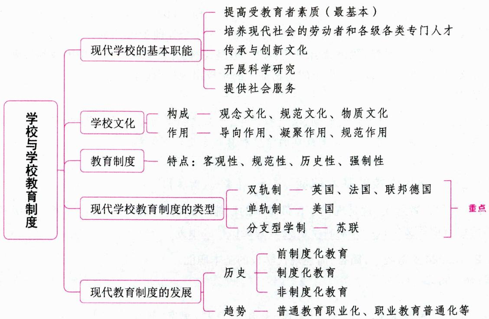

# 一、学校与学校文化

学校是一种古老的、广泛存在的社会组织。它始于人类知识及其传播的专门化要求，是有计划、有组织、有系统地进行教育教学活动的重要场所，是现代社会中最常见、最普遍的组织形式。

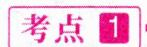

# 学校产生的条件

# 【多选、判断、简答】

通过对为数不多的人类最早学校的分析，我们认为学校的产生应该具备以下几个条件：

(1)生产力的发展以及社会生产水平的提高，为学校的产生提供了物质基础；  
(2)脑力劳动和体力劳动的分离，为学校的产生提供了专门从事教育活动的知识分子；  
(3)文字的创造与知识的积累，为学校教育活动的开展提供了有效的教育手段与充分的教育内容；  
(4)国家机器的产生，需要专门的机构培养官吏和知识分子来为统治阶级服务。

# 知识再拔高

# 学校产生的条件的其他说法

说法一：(1)学校教育产生的历史基础：生产力的发展和奴隶制国家的形成；(2)学校产生的客观条件：体脑分工和专职教师的出现；(3)学校产生的重要标志：文字的产生和应用。

说法二：(1)社会生产力的发展；(2)社会生活中间接经验的积累；(3)记载和传承文化工具的出现。

真题1 [2022山东济南，判断]学校产生的重要标志是文字的产生与应用。（）

答案：√

考点 2 最早的学校 ★【单选、判断】

公元前3000年左右，在世界上最早出现文字的地方，先后出现了学校的萌芽，并相继出现了最早的学校。

20世纪30年代，考古学家在幼发拉底河岸发掘了公元前3500年的马里城，发现了两间类似校舍的房子。但是美国学者克雷默认为世界上最早的学校是产生于公元前2500年的苏美尔学校。

一般认为,在夏朝的时候,我国就出现了学校。但是,我们并没有从考古发掘中找到可靠的实物来证实。而有文字记载同时又有考古出土的实物证实的学校出现在商朝。

# 小香课堂

关于我国最早的学校出现的时期，在选择题中，如果选项同时出现了夏朝和商朝，而题干中又没有严格的条件限制，一般认为我国最早的学校教育形态出现在夏朝。

考点 3 现代学校的基本职能 ★★ 【多选、简答】

(1)提高受教育者素质,这是现代学校最基本的职能;(2)培养现代社会的劳动者和各级各类专门人才;(3)传承与创新文化;(4)开展科学研究;(5)提供社会服务。

真题2 [2024安徽统考，简答]简述现代学校的基本职能。

答案：详见内文

考点4 学校文化 ★★ 【单选、多选、不定项、填空、判断、简答】

# 1. 学校文化的概念

最早提出“学校文化”这一概念的是美国学者华勒。

人们对于如何界说学校文化有着不同的见解。而在这些不同见解中，对学校文化的理解却又有着一些共同的基点：(1)学校文化不仅包括学校全体成员共同遵循的一些观念和行为，而且也包括部分成员共同遵循的观念和行为；(2)学校文化既能给学校预定教育目的的达成带来积极意义，也有可能阻碍教育目的的达成，这是由学校文化中蕴涵的丰富多样性和歧义性所决定的；(3)学校文化的核心是学校各群体所具有的思想观念和行为方式，其中最具决定作用的是思想观念，特别是价值观念。

我们认为，学校文化是一所学校在长期的教育实践过程中积淀、演化和创造出来的，并为其成员所认同和遵循的价值观念体系、行为规范准则和物化环境风貌的一种整合和结晶。

# 2. 学校文化的构成

学校文化由观念文化、规范文化和物质文化构成。

(1)观念文化,又叫精神文化。观念文化是学校文化的内核和灵魂,是学校组织发展的精神动力,包括办学指导思想、教育观、道德观、思维方式、校风、行为习惯等。观念文化可分解为认知成分、情感成分、价值成分和理想成分。其中,情感成分是学校这个文化体内的成员对教育、学校、班级、同事、同学、老师特有的依恋、认同、参与、热爱的感情,这种感情通常包含着很深的责任感、归属感、优越感和献身精神。  
(2) 规范文化, 又叫制度文化。这是一种确立组织机构、明确成员角色和职责, 规范成员行为的文化。规范文化有三种表达方式, 即组织形态、规章制度、角色规范。规范文化发挥着育人职能的制度保证作用。  
(3)物质文化。它是学校文化的空间物态形式，是学校精神文化的物质载体。物质文化包括环境文化和设施文化。物质文化是学校教育教学及其管理活动的物质基础。

# 3. 学校文化的特征

(1)学校文化是一种组织文化。

(2)学校文化是一种整合性较强的文化。文化从整体上来讲, 都是整合为一的, 有着整体性的特点。作为学校文化来说, 这一特点表现得尤为突出。这是因为学校有着明确的价值取向和目的要求, 它是以学校内部形成的内化了的观念为核心, 以预定的目标为动力, 通过一系列活动形成的多层面、多类型的文化。它明确地对违反预定价值规范的思想和行为进行拒斥, 对符合者予以接受、褒扬, 如此使得学校的文化及其成果大多是在一定价值取向的影响和支配下完成的。

(3)学校文化以传递文化传统为己任。

(4)校园文化是学校文化的缩影。校园文化是学校全体成员在学习、工作和生活的过程中所共同拥有的价值观、信仰、态度、作风和行为准则。校园文化包括校园物质文化、校园精神文化和校园组织与制度文化。具体如下：

①校园物质文化是看得见、摸得着的东西，如校园设施等。  
②校园精神文化是校园文化的核心内容，也是校园文化的最高层次，主要包括校风、学风、教风、班风和学校人际关系等。其中，校风是学校中物质文化、制度文化、精神文化的统一体，是经过长期实践形成的。校风建设中，学风和教风是中心。校风一旦形成往往代代相传，具有不易消散的特点，因为它已经成为学校所有成员特别是教师的自觉行为。良好的校风能对师生起到潜移默化的影响。  
③校园组织与制度文化作为校园文化的内在机制，包括学校的传统、仪式、规章制度等。

# 4.学校文化的作用（功能）

(1)导向作用。学校管理者通过各种文化活动，把师生的积极性引导到学校目标所确定的方向上来，使之在确定的目标下从事教育、教学和管理活动。  
(2)凝聚作用。学校文化的凝聚作用表现为，学校文化是联系和协调一所学校所有成员行为的纽带。  
(3)规范作用。学校文化中蕴含着道德因素，能调节人际关系，使之心理相容、和谐有序，产生对成员的规范约束作用。

# 知识再拔高·

# 学校文化的作用（功能）的其他说法

说法一:学校文化具有导向作用、凝聚作用、规范(约束)作用和激励作用。其中,激励作用表现在,好的学校文化氛围,往往能形成一种你追我赶的激励环境和激励机制,使学生化被动学习为自觉行为,化外部动力为内在动力;还能激励教职员工为实现自身价值和学校发展而勇于牺牲、乐于奉献。

说法二: 学校文化具有选择功能、浸润功能、凝聚功能、导向功能、融合和传播功能。其中, 选择功能注重的是在文化传递过程中进行整理和选择。浸润功能是指学校文化所烘托的氛围, 所创造的环境, 往往使置身其中的所有人, 都不可避免地受到影响。融合和传播功能表现在学校文化作为社会文化的亚文化, 要传播民族优秀传统文化、现代社会主流文化, 有选择地传播大众文化、世界其他国家民族的文化, 促进文化的了解、交流、融合与发展。

# 5. 学校文化的形成

(1)学校文化的形成过程，是对原有文化的传承与改造的过程。  
(2)学校文化的形成过程，是对文化构成要素进行整合的过程。  
(3)学校文化的形成过程,是学校文化主体积极创建的过程。学校领导、教职工、学生都是创造学

校文化的主体。学校文化建设的关键人物是校长；教职工是学校文化建设的主力军；学生是教育的对象，是学校文化作用的对象，反映着学校文化产品或成果的质量水平。

(4)学校文化的形成过程，是一个良好行为的改造和积累的过程。①良好的文化行为要与管理常规建设相结合。②良好的文化行为要与校园环境建设相结合。环境被称为“第二教师队伍”，是一种“隐性课程”。

真题3 [2022广东梅州,多选]学校精神文化的基本成分有( )

A. 认知成分

B. 情感成分

C. 价值成分

D. 理想成分

真题4 [2023辽宁锦州，判断]学校文化就是学校全体成员共同遵循的观念和行为，它对违反者进行拒斥，对符合者予以接受，总能给学校预定教育目的的达成带来积极意义。（）

A. 正确

B. 错误

真题5 [2023河北邯郸，判断]校风建设中，学风和教风是中心。（）

答案：3.ABCD 4.B 5.√

# 二、教育制度的内涵 ★【单选、多选、判断】

# 考点1 教育制度的定义

教育制度是指一个国家或地区各级各类教育机构与组织的体系及其各项规定的总称。

广义的教育制度指国民教育制度，是一个国家为实现其国民教育目的，从组织系统上建立起来的一切教育设施和有关规章制度的总和。

狭义的教育制度指学校教育制度,简称学制,是一个国家各级各类学校的总体系,具体规定各级各类学校的性质、任务、要求、入学条件、修业年限及它们之间的相互关系。学校教育制度是国民教育制度的核心与主体,体现了一个国家国民教育制度的实质。一般来说,它是由三个基本要素构成的,即学校的类型、学校的级别和学校的结构。

真题6 [2024安徽统考，单选]人们把规定一个国家各级各类学校的性质、任务、入学条件、修业年限以及它们之间关系的系统称为（）

A.学区

B. 学习机构

C.学制

D. 书院

答案：C

# 考点2 教育制度的特点

(1)客观性。教育制度的制定虽然反映着人们的一些主观愿望和特殊的价值需要,但是,人们并不是也不可能随心所欲地制定或废止教育制度,某种教育制度的制定或废止,有它的客观基础和发展的规律性。  
(2)规范性。任何教育制度都是其制定者根据自己的需要制定的，具有一定的规范性。这种规范性主要表现在入学条件（即受教育权的限定）和各级各类学校培养目标的确定上。  
(3)历史性。教育制度是随着时代和文化背景的变化而不断创新的。  
(4)强制性。教育制度独立于个体之外，对个体的行为具有一定的强制作用。例如，学校的考试制度规定任何学生和教师在考试过程中不能有舞弊行为，否则，一经查实，就要给予相应的处分。

真题7 [2023河南洛阳, 单选] 教育制度是指一个国家或地区各级各类教育机构与组织的体系及其各项规定的总称。人们不可能随心所欲地制定或废止教育制度，需要遵循一定的规律。这体现了教

育制度的哪一特点（

A.客观性

B. 规范性

C. 历史性

D. 强制性

答案：A

# 三、建立学制的依据 ★【单选】

(1)生产力发展水平和科学技术发展状况。(2)社会政治经济制度。(3)青少年儿童身心发展规律。正是由于学制受青少年儿童身心发展规律的制约,所以不同国家在学制的很多方面是一致的,如入学年龄,大、中、小学阶段的划分等。(4)人口发展状况。(5)文化传统。(6)本国学制的历史发展和国外学制的影响。

真题8 [2023山东济宁, 单选] 不同国家的学制类型虽然存在差异, 但不同学段的入学年龄在大多数国家是一致的。这说明( )是制定学制的重要依据。

A. 生产力发展水平

B. 人口发展状况

C. 本国学制的历史发展

D.学生的身心发展特点

答案：D

# 四、现代学校教育制度的类型 ★★★ 【单选、多选、判断】

现代学制最早出现在欧洲，主要有三种类型：一是双轨学制，二是单轨学制，三是分支型学制。

表 1-25 现代学校教育制度的类型  

<table><tr><td>学制类型</td><td>代表国家</td><td>特点</td></tr><tr><td>双轨制</td><td>英国、法国、联邦德国等欧洲国家</td><td>(1)其学校系统分为两轨：一轨是学术教育，为特权阶层子女所占有，学术性很强，学生可升到大学以上；另一轨是职业教育，为劳动人民的子弟所开设，属生产性的一轨。两轨之间互不相通，互不衔接。
(2)不利于教育的普及</td></tr><tr><td>单轨制</td><td>美国</td><td>(1)最早产生于美国，先后被世界许多国家采纳。
(2)从小学直至大学、形式上任何儿童都可以入学。
(3)最明显的特点是体现了教育的公平性，有利于教育的逐级普及。
(4)教育参差不齐、效益低下、发展失衡，同级学校之间教学质量相差较大</td></tr><tr><td>分支型学制（中间型学制或“Y”型学制）</td><td>苏联</td><td>(1)介于双轨学制和单轨学制之间，上通（高等学校）下达（初等学校）、左（中等专业学校）右（中等职业技术学校）互联，既有利于学术人才的培养，也有利于职业教育的发展。
(2)课时多、课程复杂，教学不够灵活，特别是地域性较强的课程得不到很好的发展</td></tr></table>

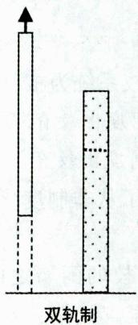

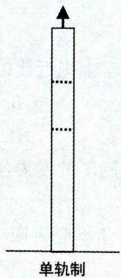

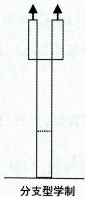  
图1-1 现代学校教育制度的类型

真题9 [2023河北石家庄，单选]现代学制有三种基本类型：双轨学制、单轨学制、分支型学制。分支型学制以（ ）为代表。

A. 美国

B. 苏联

C.韩国

D. 英国

真题10 [2024浙江金华，多选]双轨制的教育包含哪两种类型（）

A.学术教育

B. 职业教育

C. 品德教育

D. 绅士教育

答案：9.B 10.AB

# 五、现代教育制度的发展 ★ 【单选、多选、判断】

# 考点1 教育制度在形式上的发展（教育制度的发展历史）

正规教育的主要标志是近代以学校系统为核心的教育制度,又称制度化教育。以制度化教育为参照,之前的非正式、非正规教育都可归为前制度化教育,而之后的非正式、非正规化教育则都归为非制度化教育。因此,教育制度的发展经历了从前制度化教育到制度化教育,再到非制度化教育的过程。

# 1. 前制度化教育

前制度化教育是人类教育史上一个重要的发展阶段。一般认为，在奴隶社会初期出现的定型的教育组织形式，即实体化教育——学校是其重要的标志。定型的教育组织形式包括古代的前学校与前社会教育机构、近代的学校与社会教育机构。学校的产生，意味着教育活动的专门化，教育形态趋于定型。

教育实体的形成具有以下特点：(1)教育主体确定；(2)教育对象相对稳定；(3)形成系列的文化传播活动；(4)有相对稳定的活动场所和设施等；(5)由以上因素结合而形成的独立的社会活动形态。

# 2. 制度化教育

近代学校系统的出现，开启了制度化教育的新阶段。大致说来，严格意义上的学校教育系统在19世纪下半期已经基本形成。学校教育系统的形成，即意味着制度化教育的形成，学校教育制度的建立是制度化教育的典型表征。制度化教育主要指的是正规教育，也就是具有层次结构的、按年龄分级的教育制度，制度化的教育指向形成系统的各级各类学校。

我国近代制度化教育兴起的标志是清朝末年的“废科举，兴学校”，以及颁布了全国统一的教育宗旨和近代学制。

# 3. 非制度化教育

非制度化教育是相对于制度化教育而言的。它指出了制度化教育的弊端，但又不是对制度化教育的全盘否定。非制度化教育所推崇的理想是：“教育不应再限于学校的围墙之内。”一般认为，库姆斯等人的“非正规教育”概念、伊里奇的“非学校化”主张都是非制度化教育的核心思想。提出构建学习化社会的理想是非制度化教育的重要体现。

真题11 [2022河南信阳,单选]教育学上把近代以学校系统为核心的教育制度称为( )

A. 非正式教育

B. 前制度化教育

C. 制度化教育

D. 后制度化教育

真题12 [2024山东青岛，判断]教育制度的发展经历了从非制度化教育到制度化教育，再到前制度化教育的过程。（）

真题13 [2023广东梅州，判断]“教育不应再限于学校的围墙之内”体现的是前制度化教育的主张。（）

答案：11.C 12.× 13.×

# 考点2 现代教育制度的发展趋势

(1)加强学前教育并重视与小学教育的衔接。(2)强化普及义务教育,延长义务教育年限。(3)中等教育中普通教育与职业教育朝着相互渗透(综合统一)的方向发展。二战以前,世界各国普遍推行双轨制教育,两种教育相互隔离。二战后综合中学的比例逐渐增加,出现了普通教育职业化、职业教育普通化的趋势。(4)高等教育的大众化、普及化。(5)终身教育体系的建构。(6)教育社会化与社会教育化。(7)教育的国际交流加强。(8)学历教育与非学历教育的界限逐渐淡化。

真题14 [2024安徽统考，判断]普通教育和职业教育朝着综合统一的方向发展，这是现代学校教育制度改革的趋势之一。（）

真题15 [2024江苏苏州，判断]“普通教育职业化，职业教育普通化”是现代教育制度的发展趋势之一。（）

答案：14.√ 15.√

# ★本节核心考点回顾 ★

# 1.现代学校的基本职能

(1)提高受教育者素质，这是现代学校最基本的职能；(2)培养现代社会的劳动者和各级各类专门人才；(3)传承与创新文化；(4)开展科学研究；(5)提供社会服务。

# 2. 教育制度的特点

（1）客观性；(2)规范性；(3)历史性；(4)强制性。

# 3. 现代学校教育制度的类型

(1)双轨制：①代表国家有英国、法国、联邦德国等欧洲国家；②其学校系统分为两轨，一轨是学术教育，另一轨是职业教育。  
(2)单轨制：①代表国家是美国；②最明显的特点是体现了教育的公平性，有利于教育的逐级普及。  
(3)分支型学制：①代表国家是苏联；②上通下达、左右互联，既有利于学术人才的培养，也有利于职业教育的发展。

# 4. 教育制度的发展历史

教育制度的发展经历了从前制度化教育到制度化教育，再到非制度化教育的过程。

# 第四节 我国的学校教育制度

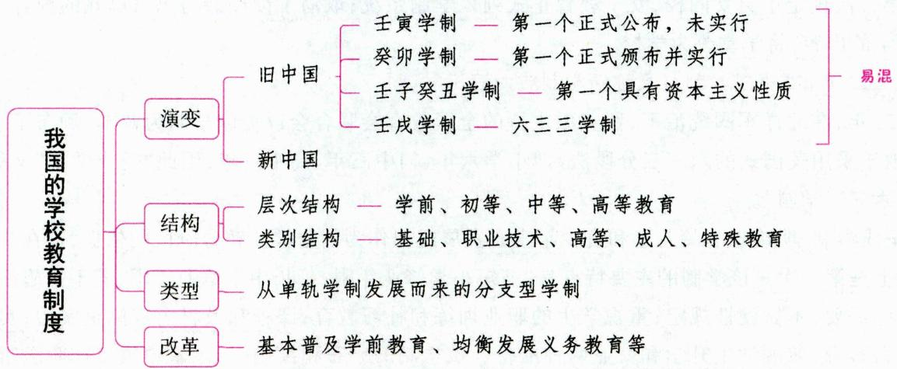

# 一、我国现代学校教育制度的演变

我国古代的学校分为官学、私学和书院，与之相对应，我国古代的学校教育制度主要由官学教育系统、私学教育系统和书院教育系统构成。我国现代学制的建立是从清末“废科举，兴学校”开始的。

# 考点1

# 旧中国的学制沿革

【单选、多选、填空、判断】

# 1. 1902年的“壬寅学制”（未实行）

中国近代教育史上最早制定的系统的学校教育制度，是1902年的《钦定学堂章程》，亦称“壬寅学制”。“壬寅学制”以日本的学制为蓝本，由当时的管学大臣张百熙起草，是中国近代教育史上最早由国家正式颁布的学制系统，虽然正式公布，但并未实行。

# 2. 1904年的“癸卯学制”（实行新学制的开端）

1903年，清政府任命张之洞、荣庆、张百熙三人重新修订拟定了《奏定学堂章程》，1904年1月颁布执行，又称“癸卯学制”。

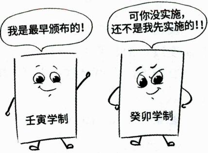

“癸卯学制”主要承袭了日本的学制，是中国近代教育史上第一部由国家颁布的并在全国实行的学制系统，成为中国近代教育走向制度化、法制化阶段的标志。该学制明文规定教育目的是“忠君、尊孔、尚公、尚武、尚实”，明显反映了“中学为体，西学为用”的思想。其宗旨是：“无论何等学堂，均以忠孝为本，以中国经史之学为基。俾学生心术壹归于纯正，而后以西学瀹其智识、练其艺能，务期他日成材，各适实用，以仰副国家造就通才、慎防流弊之意。”另外，该学制还规定不许男女同校，轻视女子教育，体现了半殖民地半封建的特点。该学制的最大特点是修业年限长，从小学堂至大学堂要21年，至通儒院要26年。

# 3. 1912～1913年的“壬子癸丑学制”

1912年1月，中华民国成立中央教育部，蔡元培被任命为民国第一任教育总长。教育部成立的重要工作之一就是草拟学制。1912年9月初，教育部颁布了《学校系统令》，称为“壬子学制”。1913年，教育部又陆续颁布了各级各类学校法令，使壬子学制得以充实和具体化。这些学制综合起来，形成了一个全面完整的学制系统，称为“壬子癸丑学制”，又称“1912～1913年学制”。

“壬子癸丑学制”明显反映了资产阶级在学制方面的要求，是我国教育史上第一个具有资本主义性质的学制。该学制在我国政府法令中第一次明确规定实施义务教育（规定“初等小学四年，为义务教育”）；第一次规定了男女同校，女子教育正式列入学制系统；取消了读经课与忠君尊孔的内容，充实了自然科学的内容；将学堂改为学校。

# 4. 1922年的“壬戌学制”（又称新学制或六三三学制）

1922年，在北洋军阀统治下，留美派主持的全国教育会联合会以美国学制为蓝本，颁布了“壬戌学制”。由于采用美国式的六三三分段法，即小学六年、初中三年、高中三年，因此“壬戌学制”又称“新学制”或“六三三学制”。

“壬戌学制”明确以学龄儿童和青少年身心发展规律作为划分学校教育阶段的依据,这在我国现代学制史上是第一次。该学制的主要特点是:缩短小学修业年限,延长中学修业年限;若干措施注意根据地方实际需要,不做硬性规定;重视学生的职业训练和补习教育;课程和教材内容侧重实用;实行选科制和分科教育,兼顾学生升学和就业两种准备。该学制的颁布和实施,标志着中国资产阶级新教育制

度的确立，标志着中国近代以来的学制体系建设的基本完成。

此后，国民党政府于1928年就该学制做了些修改，但基本上继承了“壬戌学制”，并一直沿用到全国解放初期，它是近代中国使用时间最长的学制。

# ·记忆有妙招·

为方便考生记忆，编者将旧中国的四个学制总结成以下口诀：

壬颁布，癸实施，壬子癸丑最小资，戊美国，六三三。

真题1[2023河北衡水，单选]我国学制沿革史上，借鉴美国教育体制，初次确立了“六三三”的学习阶段和年限的学制是（）

A. 壬寅学制

B. 壬戌学制

C. 壬子癸丑学制

D. 癸卵学制

真题2 [2024江苏苏州，填空]中国第一个真正实施的近代学制是

真题3 [2024江苏南通，判断]我国第一个规定了男女同校，废除了读经，充实了自然科学的内容，将学堂改为学校的学制是 $1912\sim 1913$ 年的“壬子癸丑学制”。（）

答案：1.B 2.癸卯学制（《奏定学堂章程》）3.√

# 考点2 新中国的学制沿革 ★【单选、多选】

表 1-26 新中国的学制沿革  

<table><tr><td>时间</td><td>文件</td><td>主要内容</td></tr><tr><td>1951年</td><td>《关于改革学制的决定》</td><td>规定我国学制包括幼儿教育、初等教育、中等教育和高等教育（标志着我国学制发展到了一个新阶段）</td></tr><tr><td>1958年</td><td>《关于教育工作的指示》</td><td>提出了“两条腿走路”的办学方针和“三个结合”“六个并举”的具体办学原则。其中，“三个结合”指统一性与多样性相结合、普及与提高相结合、全面规划与地方分权相结合</td></tr><tr><td>1985年</td><td>《中共中央关于教育体制改革的决定》</td><td>(1) 教育体制改革的根本目的就是提高民族素质，多出人才、出好人才；
(2) 地方承担九年义务教育的责任，有计划、有步骤地普及九年制义务教育；
(3) 调整中等教育结构，大力发展职业技术教育</td></tr><tr><td>1993年</td><td>《中国教育改革和发展纲要》</td><td>确定20世纪末教育发展的总目标：
“两基”（基本普及九年义务教育和基本扫除青壮年文盲）；
“两全”（全面贯彻党的教育方针，全面提高教育质量）；
“两重”（建设好一批重点学校和一批重点学科）</td></tr><tr><td>1999年</td><td>《中共中央国务院关于深化教育改革全面推进素质教育的决定》</td><td>提出形成社会化、开放式的教育网络，逐步完善终身学习体系，而且还要求在减轻学生课业负担、课程设置、教学内容、考试等方面进行改革</td></tr><tr><td>2001年</td><td>《国务院关于基础教育改革与发展的决定》</td><td>要求在基础教育阶段深化教育教学改革，扎实推进素质教育，进一步明确加快构建符合素质教育要求的新的基础教育课程体系的任务</td></tr><tr><td>2004年</td><td>《2003~2007年教育振兴行动计划》</td><td>(1)努力提高普及九年义务教育的水平和质量；
(2)以全面推进素质教育为目标，加快考试评价制度改革；(3)积极推进普通高中、学前教育和特殊教育的改革与发展；(4)健全教育督导与评估体系，保障教育发展与改革目标的实现</td></tr></table>

# 二、我国现行学校教育制度的结构及类型 ★★ 【单选、多选、判断】

# 考点1 我国现行学校教育制度的结构

学校教育结构是指学校教育的总体中各个部分的比例关系和组合方式，通常可以从层次结构和类别结构两个方面来分析。

从层次结构上来看，我国现行学校教育包括学前教育、初等教育、中等教育和高等教育四个层次。其中，初等教育是国民教育的基础，其发展直接关系到国民素质的提高，同时也已成为衡量一个国家全民教育水平的重要尺度。

从类别结构上来看,我国现行学校教育可划分为基础教育、职业技术教育、高等教育、成人教育和特殊教育五个大类。其中,基础教育是实施普通文化科学知识的教育,是提高民族素质的奠基工程,在教育中处于基础性地位。普通中小学教育的性质属于基础教育,它的任务是培养全体学生的基本素质,为他们学习做人和进一步接受专业(职业)教育打好基础,为提高民族素质打好基础。我国的基础教育通常包括学前教育、初等教育与中等教育(包括初中阶段和高中阶段)。

# 记忆有妙招

为方便考生记忆，编者将我国现行学制的类别结构总结成以下口诀：

高人特机智。高：高等教育。人：成人教育。特：特殊教育。机：基础教育。智：职业技术教育。

# 考点2 我国现行学校教育制度的类型

从类型（形态）上看，我国现行学制是从单轨学制发展而来的分支型学制。

真题4[2024浙江金华，单选]从层次结构上来看，我国现行学校教育包括学前教育、（ ）、中等教育和高等教育四个层次。

A.幼儿教育

B. 小学教育

C. 初等教育

D. 职业教育

真题5 [2024福建统考，多选]关于学校教育制度，下列说法正确的有（）

A.学制是国民教育制度的核心  
B.我国现行的学制类型是分支型  
C. 1922年北洋政府颁布了“壬戌学制”  
D. “癸卯学制”是我国正式实施的第一个学制

答案：4.C 5.ABCD

# 三、我国现行学校教育制度的改革 ★ 【单选】

(1)基本普及学前教育。(2)均衡发展义务教育。促进义务教育均衡发展已经成为我国现阶段教育改革和发展的重大任务。(3)努力普及高中阶段教育。在完全普及九年义务教育以后,普及高中阶段教育就成为教育发展的重要趋势。(4)大力发展高等教育。

# ★本节核心考点回顾 ★

1. 壬寅学制（《钦定学堂章程》）

(1)以日本的学制为蓝本。  
(2)中国近代教育史上最早由国家正式颁布的学制系统，虽然正式公布，但并未实行。

2. 癸卯学制（《奏定学堂章程》）

(1)主要承袭了日本的学制。  
(2)中国近代教育史上第一部由国家颁布的并在全国实行的学制系统。

3. 壬子癸丑学制（1912～1913年学制）

(1)我国教育史上第一个具有资本主义性质的学制。  
(2)第一次规定了男女同校，女子教育正式列入学制系统；取消了读经课与忠君尊孔的内容，充实了自然科学的内容；将学堂改为学校。

4. 壬戌学制（新学制或六三三学制）

(1)以美国学制为蓝本。  
(2)明确以学龄儿童和青少年身心发展规律作为划分学校教育阶段的依据。  
(3) 一直沿用到全国解放初期, 是近代中国使用时间最长的学制。

# 第四章 教师与学生

# 本章学习指南

# 一、考情概况

本章属于教育学的重点章节，识记、理解和运用的知识较多，考生可带着以下学习目标进行备考：

1. 掌握教师的职业形象、角色和素养。  
2. 理解并区分教师劳动的特点。  
3. 识记学生的特点、现代学生观的内容。  
4. 掌握良好师生关系建立的途径与方法、我国新型师生关系的四个特点。

# 二、考点地图

<table><tr><td>考点</td><td>年份/地区/题型</td></tr><tr><td>教师的职业形象</td><td>2024山东单选;2024河北单选;2023辽宁单选;2023四川单选;2023河北单选;2023广东判断;2022天津单选;2022河南多选</td></tr><tr><td>教师的职业角色</td><td>2024安徽单选;2024广东单选;2024河南单选;2023山西单选;2023河南单选;2023四川多选;2023江苏简答;2022浙江单选;2022福建单选;2022山东单选;2022天津单选;2022湖南单选;2022河北单选、多选</td></tr><tr><td>教师劳动的特点</td><td>2024浙江单选;2024江苏单选;2024福建单选;2024安徽单选;2024山东单选;2024天津单选;2024广东单选、多选、判断;2024河南不定项;2023安徽单选;2023黑龙江单选;2023贵州单选;2023辽宁判断</td></tr><tr><td>教师的职业素养</td><td>2024广东单选;2024安徽单选、判断;2023湖北单选;2023山西单选;2023广西单选;2022山东多选</td></tr><tr><td>学生的特点</td><td>2024安徽单选;2023江苏单选;2023河北单选;2023河南单选、判断;2023广东单选、判断;2023安徽判断</td></tr><tr><td>现代学生观</td><td>2024安徽多选;2024河北材料分析;2023河南单选;2023辽宁判断;2022内蒙古单选;2022广东单选</td></tr><tr><td>良好师生关系建立的途径与方法</td><td>2023河南多选、判断;2023江苏简答;2023安徽简答;2022天津多选;2022内蒙古多选;2022河南简答</td></tr><tr><td>我国新型师生关系的特点</td><td>2023河南单选、多选;2022山东单选;2022江苏单选;2022天津单选、多选;2022河北不定项</td></tr></table>

注：上述表格仅呈现重要考点的相关考情。

# 国核心考点

# 第一节 教师

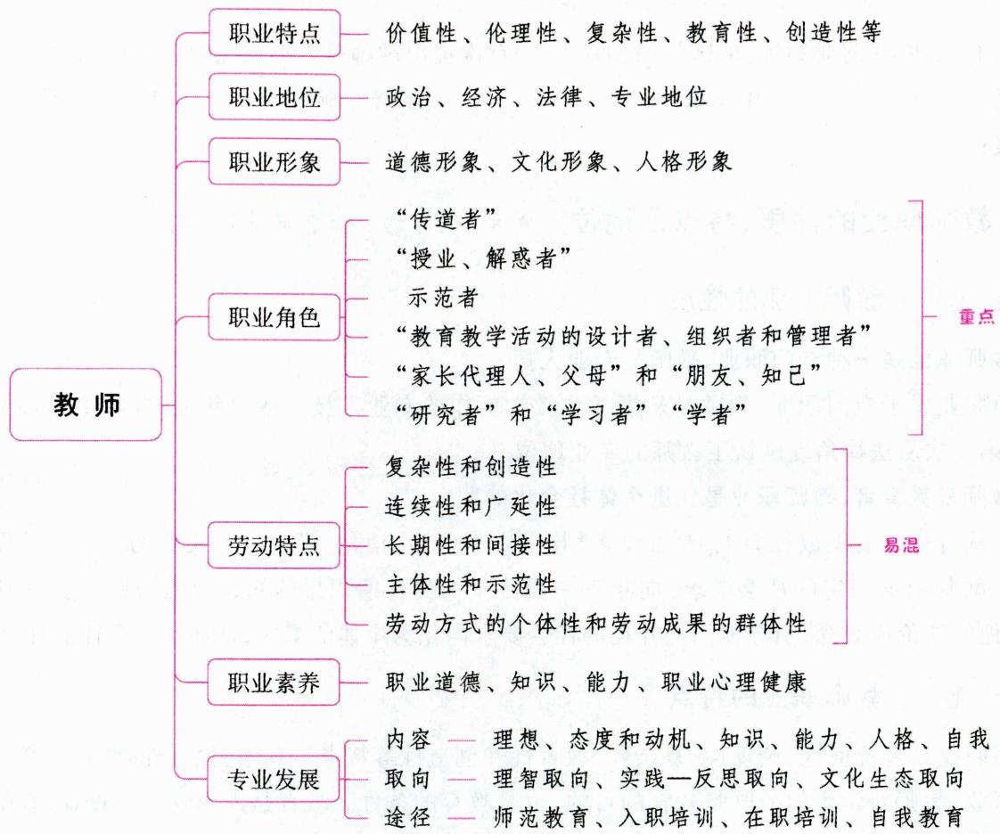

# 一、教师的概念与作用 ★ 【单选】

# 考点1 教师的概念

教师是传递和传播人类文明的专职人员，是学校教育职能的主要实施者。从广义上讲，凡是把知识、技能和技巧传授给别人的人，都可称为教师。从狭义上讲，教师指经过专门训练、在学校从事教育教学工作的专门人员。教师是学校教育工作的主要实施者，根本任务是教书育人。

《中华人民共和国教师法》第一章第三条对教师概念进行了全面的、科学的界定：教师是履行教育教学职责的专业人员，承担教书育人，培养社会主义事业建设者和接班人、提高民族素质的使命。

# 小香课堂·

不同学者对教师及教师职业的赞誉：

(1)加里宁——（首次提出）教师是“人类灵魂的工程师”。  
(2)夸美纽斯——教师是太阳底下最崇高、最优越的职业。

# 考点2 教师的作用

(1)教师是人类文化的传播者，在社会的发展和人类的延续中起桥梁与纽带作用。  
(2)教师是人类灵魂的工程师，在塑造年青一代的品格中起着关键性作用。  
(3)教师是人的潜能的开发者，对个体发展起促进作用。  
(4)教师是教育工作的组织者、领导者，在教育过程中起主导作用。

真题1 [2022河北邯郸，单选]苏联的( )首次提出教师是人类灵魂的工程师。

A. 马卡连柯

B. 加里宁

C. 苏霍姆林斯基

D. 克鲁普斯卡娅

答案：B

# 二、教师职业的性质、特点及地位 ★★ 【单选、多选、简答】

# 考点1 教师职业的性质

# 1.教师职业是一种专门职业，教师是专业人员

教师职业属于专门职业，教师是从事教育教学工作的专业人员。1993年通过的《中华人民共和国教师法》第一次从法律角度确认了教师的专业地位。

# 2.教师是教育者，教师职业是促进个体社会化的职业

学生从自然人发展成社会人，是在学习、接受人类经验，消化、吸收人类文化的社会化过程中逐步实现的。教师根据一定的社会要求，向年青一代传授人类长期积累的知识经验，规范他们的行为、品格，塑造他们的价值观念，引导他们把外在的社会要求内化为个体的素质，从而实现个体的社会化。

# 考点2 教师职业的特点

教师职业具有价值性、伦理性、复杂性、教育性和创造性等特点。其中，伦理性是指，教育是成就人生命的事业，教师对学生的爱既是教育的目的，也是教育的条件。教育是人影响人的过程，教师对教育的爱、对学生的爱是教育不可或缺的基础。恰如夏丐尊先生所说的：“爱对于教育，犹如池塘之于水，没有水，便不能成为池塘；没有爱，便不能称其为教育。”教师只有爱教育事业、爱学生，才能对教育有真诚的投入，主动钻研教学，促进学生发展。

真题2 [2022安徽统考，简答]简述教师职业的特点。

答案：详见内文

# 考点3 教师职业的地位

(1)政治地位。教师职业的政治地位是指教师职业在国家或民族的政治生活中所处的地位和所起的作用,表现为教师政治身份的获得、教师自治组织的建立、教师的政治参与度和政治影响力等。随着社会的发展、教育地位的提升,教师政治地位的提高成为提高教师职业社会地位的前提。  
(2)经济地位。教师职业的经济地位是指将教师职业与其他职业相比较，其劳动报酬（包括工资、奖金及医疗、保险、退休金等）的差异状况及其经济生活状态。它是教师社会地位的最直观表现。  
(3)法律地位。教师职业的法律地位是指法律赋予教师职业的权利、责任。教师享有的社会权利，

除一般公民权利（如生存权、选举权，享受各种待遇和荣誉等）外，还包括职业本身特点所赋予的专业方面的自主权：①教育的权利，即教师依法享有对学生实施教育、指导、评价的权利。②专业发展权，即教师依法享有发展自己、提高专业文化水平的权利。③参与管理权，即教师可以通过各种合法途径参与学校建设和管理。教师所享有的权利，尤其是专业权利的多少，不仅反映国家和社会对教师职业的重视与保护程度，而且直接影响到教师在社会民众及学生心目中的威望与地位。

(4) 专业地位。教师职业的专业地位是教师职业社会地位的内在标准。它主要通过其从业标准来体现, 有没有从业标准和有什么样的从业标准是教师职业专业地位高低的指示器。

真题3 [2023河北省直，多选]教师职业的地位包括（ ）

A.政治地位

B. 经济地位

C. 法律地位

D. 专业地位

答案：ABCD

# 三、教师的职业形象 ★★ 【单选、多选、判断】

教师的职业形象是教师群体或个体在其职业生活中的形象, 是其精神风貌和生存状态与行为方式的整体反映。教师的职业形象是通过其内在精神和外在事物显现出来的, 其内在精神包括职业的精神风貌、工作态度、敬业精神、创新精神等; 外在事物表现为教师节日、教师组织、教师着装等。

教师职业形象至少包括三个方面：

(1)教师的道德形象。教师的道德形象被视为教师的最基本形象。“为人师表”“身正为范,学高为师”等强调教师的榜样、示范作用,是教师道德形象的体现。  
(2)教师的文化形象。教师的文化形象是教师形象的核心。“才高八斗”“学富五车”皆是教师的典型文化特征。  
(3)教师的人格形象。教师的人格形象是学生亲近或疏远教师的首要因素。理想教师的人格包括善于理解学生、富有耐心、性格开朗、情绪乐观、意志力强、有幽默感等。

真题4[2024山东临沂，单选]“春蚕”“孺子牛”“为人师表”，这些词语勾画出教师的。“才高八斗”“学富五车”体现了教师的________。“温暖有爱”“诙谐幽默”表现了教师的________。（）

A.道德形象人格形象文化形象

B.道德形象文化形象人格形象

C. 人格形象 文化形象 道德形象

D.文化形象道德形象人格形象

真题5 [2023辽宁锦州, 单选]陈老师在上英语阅读课时, 为了让学生掌握内容, 他补充了许多背景知识, 包括一些地理、历史等材料, 学生纷纷赞叹陈老师学识渊博。这体现了现代教师职业形象中的（）

A.文化形象

B. 道德形象

C. 人格形象

D. 外貌形象

真题6 [2022河南鹤壁，多选]教师的职业形象是教师群体或个体在其职业生活中的形象，是其精神风貌和生存状态与行为方式的整体反映，是（ ）三者统一的整体。

A. 道德形象

B.文化形象

C. 价值形象

D. 人格形象

答案：4.B 5.A 6.ABD

# 四、教师职业的发展历史 ★ 【单选】

表 1-27 教师职业的发展历史  

<table><tr><td colspan="2">发展阶段</td><td rowspan="2">发展概况</td><td rowspan="2">特征</td></tr><tr><td>三阶段</td><td>四阶段</td></tr><tr><td rowspan="2">教师职业的非专门化阶段</td><td>非职业化阶段</td><td>原始社会末期:长者为师,能者为师;我国奴隶社会:官吏兼任,官师一体;西方社会:僧侣兼任</td><td>没有专门的教师职业</td></tr><tr><td>职业化阶段</td><td>私学出现,独立的教师职业由此而生,教师开始回归到专业教育工作者的角色上来,私学教师逐渐成为一种职业。如我国春秋战国时期的“士”、古希腊的智者</td><td>虽有专门的教师,但教师职业基本上还不具备专门化水平,私学教师没有形成从教的专业技能</td></tr><tr><td>教师职业专门化的初级阶段</td><td>专门化阶段</td><td>以专门培养教师的教育机构的出现为标志。世界上最早的师范教育机构诞生于法国(1681年,法国“基督教兄弟会”神甫拉萨儿在兰斯创立第一所师资训练学校,这是世界师范教育的开始)。我国最早的师范教育产生于清末(盛宣怀在上海创办的南洋公学师范院,即中国最早的师范教育机构)</td><td>师范教育产生,教师的培养走上专门化的道路</td></tr><tr><td>教师职业专门化的深入发展阶段</td><td>专业化阶段</td><td>1966年10月,国际劳工组织和联合国教科文组织在巴黎会议上通过的《关于教师地位的建议》中提出:教师工作应被视为一种专业。之后,“师范教育”的概念逐步被扩充为“教师教育”。在中国,教师的专业技术人员身份在1993年通过的《中华人民共和国教师法》中得到确认,规定“教师是履行教育教学职责的专业人员”</td><td>学校对教师的需求开始从“量”的急需向“质”的提高方面转变,独立设置的师范院校逐渐并入文理学院,教师的培养改由综合大学的教育学院或师范学院承担,这被称为“教师教育大学化”</td></tr></table>

总之, 现代意义上的 “教师” 与古代意义上的 “教师” 有着本质区别: (1) 多功能性; (2) 专门性, 作为教师, 必须经过培养和培训, 取得合格证书; (3) 高素质性, 现代教师的内涵更丰富, 是 “经师” 与 “人师” 的统一; (4) 发展性, 现代教师必须终身学习, 不断更新自己的知识结构、能力结构, 使自己成为会学习的人。

真题7 [2023山东济南, 单选]联合国教科文组织于1966年10月在法国巴黎召开特别会议, 在会议通过的文件中指出, 教师职业是一种专门职业。该文件是( )

A.《教师专业标准》

B.《教师专业准备》

C.《关于教师地位的建议》

D.《达喀尔行动纲领》

答案：C

# 五、教师的职业角色 ★★ 【单选、多选、简答】

教师职业的最大特点在于职业角色的多样化。一般来说，教师的职业角色主要有以下六个方面：

# 1.“传道者”角色（人类灵魂的工程师）

教师负有传递社会道德传统、价值观念的使命，“道之所存，师之所存也”。除了社会一般道德、价值观外，教师对学生的“做人之道”“为业之道”“治学之道”等也有引导和示范的责任。

# 2.“授业、解惑者”角色（知识传授者、人类文化的传递者）

教师是社会各行各业建设人才的培养者，他们在掌握了人类经过长期的社会实践活动所获得的知识经验、技能的基础上，对其精心加工整理，然后以特定的方式传授给年青一代，并帮助他们解除学习中的困惑。

# 3. 示范者角色（榜样）

(1)教师的言行是学生学习和模仿的榜样。夸美纽斯曾说过，教师的职务是以自己为榜样教育学生。学生具有可塑性和向师性的特点，教师的言谈举止、行为方式、为人处世的态度等都会对学生产生耳濡目染、潜移默化的影响，因此，教师是学生学习的最直接榜样。  
(2)优秀教师还是其他教师学习的模范，是社会各界学习的模范，这就构成师表维度的四个不同层次：规范、垂范、模范、世范。

# 4.“教育教学活动的设计者、组织者和管理者”角色

(1)教师是教育教学活动的设计者。好的教学设计可以使教学有序进行，给教学提供良好的环境，使学生养成循序渐进的习惯，全面地完成教学任务。精心地进行教学设计，需要教师全面把握教学的任务、教材的特点、学生的特点等要素。  
(2)教师是教育教学活动的组织者，即教师在教学资源分配（包括时间分配、内容安排、学生分组）和教学活动展开等方面是具体的实施者。通过科学地分配活动时间，采取合理的活动方式，教师可以启发学生的思维，协调学生的关系，激发集体学习的动力。  
(3)教师是教育教学活动的管理者。教师需要肩负起教育教学管理的职责，包括确定目标、建立班集体、制定和贯彻规章制度、维持班级纪律、组织班级活动、协调人际关系等，并对教育教学活动进行控制、检查和评价。

不同的教师进行教学管理的方式不同，主要存在四种教师管理类型：强硬专断型、仁慈专断型、放任自流型以及民主管理型。

表 1-28 教师的管理类型  

<table><tr><td>类型</td><td>教师的行为特点</td><td>学生的典型反应</td></tr><tr><td>强硬专断型</td><td>对学生严加监视;要求即刻无条件接受一切命令;很少表扬学生;认为没有教师的监督,学生不可能自觉学习</td><td>屈服,但一开始就不信服、厌恶这种领导;推卸责任;易激怒,不愿合作,可能会在背后伤人;教师一旦离开教室,学习明显松垮</td></tr><tr><td>仁慈专断型</td><td>不认为自己是一个专断独行的人;表扬学生并关心学生;他专断的症结在于他的自信,他的口头禅是:我喜欢这样做/你能给我这样做吗;这种教师以自我为班级一切工作的标准</td><td>大部分学生喜欢他,但看穿他的这套方法的学生可能恨他;学生在各方面都依赖教师,没有多大的创造性;屈从,缺乏个人的发展</td></tr><tr><td>放任自流型</td><td>认为学生爱怎样就怎样;很难做出决定;对学生管理没有明确目标;不鼓励学生,也不反对学生;不参加学生的活动,也不提供帮助或方法</td><td>道德差,学习也差;有许多“推卸责任”“寻找替罪羊”“容易激怒”的行为;没有合作,谁也不知道该做些什么</td></tr><tr><td>民主管理型</td><td>善于和集体共同制订计划和做出决定;在不损害集体的情况下,很乐意给个别学生以帮助、指导;尽可能鼓励集体的活动;给予客观的表扬和批评</td><td>喜欢学习,喜欢和别人尤其是教师一道工作;学习的质和量都很高;互相鼓励,且独自承担某些责任;不论教师在不在课堂,要改正的问题很少</td></tr></table>

# 5.“家长代理人、父母”和“朋友、知己”的角色

教师是儿童继父母之后所遇到的另一个社会权威，是家长的代理人。低年级的学生倾向于把教师看作父母的化身，对教师的态度类似于对父母的态度。而高年级学生则往往愿意把教师当作他们的朋友，也期望教师能把他们当作朋友看待，希望在学习、生活、人生等多方面得到教师的指导，希望教师能与他们一起分担痛苦与忧伤、分享欢乐与幸福。

# 6.“研究者”角色和“学习者”“学者”角色

(1)教师工作的对象是充满生命力和个性特点的青少年，传授的是不断变化的科学知识和人文知识。所以，教师不能千篇一律地、机械地进行教育，而是要不断反思、研究自己的工作，灵活机智、创造性地开展教书育人工作。教师应该积极地参与教学研究、教学实验与改革，不断地提高自身的教育理论水平和教育质量。  
(2)教师的研究，不仅是对科学知识的研究，更有对教育对象（即学生）的研究，对教师和学生交往的研究等，这都需要教师终身学习，更新自己的知识结构，以便使教育教学建立在更宽广的知识背景之上，适应学生的个性发展、自己的专业发展和教育教学改革的需要。  
(3)教师还被认为是智者的化身，必须拥有渊博的知识。

# 知识再拔高·

# 教师的职业角色的其他说法

说法一：(1)担当“学生的楷模”的角色。(2)担当学生“家长的代理人”的角色。(3)担当“知识的传授者”的角色。“知识的传授者”这一角色是教师职业最显著的标志。(4)担当“教育教学的研究者”的角色。(5)担当学生“严格的管理者”的角色。(6)担当学生“心理调节者”的角色。(7)担当“社会主义事业的开拓者、发展者”的角色。

说法二：(1)学习者和研究者。(2)知识的传授者。(3)学生心灵的培育者。教育的目的是使学生变得更聪明、更高尚、更成熟。只传授知识的教师是“经师”，只有那些使学生能生动活泼地、主动地得到较好发展的教师，才是最好的教师。(4)教学活动的设计者、组织者和管理者。(5)学生学习的榜样。(6)学生的朋友。(7)学校的管理者。

说法三：(1)学生发展的引导者。(2)知识体系的组织者。(3)共生关系的对话者。教师在学生发展中扮演民主管理者的角色，以平等对话者的身份，促进教师与学生、学生与学生之间的交往互动。(4)教育教学的研究者。(5)不断发展的学习者。教师要不断发展，通过学习持续不断地更新和充实自己，树立终身学习观念，完善知识结构，磨砺思想品格，积淀人文底蕴，提升整体素质，以满足社会发展和自身发展的需要。

说法四：(1)授业传道者；(2)研究者；(3)管理者；(4)意义建构者；(5)引导者和设计者；(6)课程的开发者；(7)心理医生；等等。

真题8 [2024安徽合肥/淮北/铜陵,单选]教师职业的最大特点在于职业角色的( )

A. 多样化

B. 专业化

C. 单一化

D. 崇高化

真题9 [2023河南郑州, 单选] 习近平总书记指出, 教师要努力做到“三个牢固树立”, 即“牢固树立中国特色社会主义理想信念, 牢固树立终身学习理念, 牢固树立改革创新意识”。关于怎样才能成为好老师, 习近平总书记提出了四条要求, 即“有理想信念、有道德情操、有扎实学识、有仁爱之心”。这要

求教师在教育过程中应扮演的角色是( )

A.不断发展的学习者

B. 教育教学的研究者

C. 共生关系的对话者

D. 学生发展的引导者

真题10 [2022浙江台州, 单选]温老师十分关心学生, 发现学生的进步会积极、及时地表扬学生, 鼓励他们。同时温老师对学生也很严格, 依照自己的主观标准规定了班级的行为规范, 大部分学生都很喜欢她, 也较为依赖温老师的管理。温老师对班级的领导方式是( )

A. 强硬专断型

B. 仁慈专断型

C. 放任型

D. 民主型

真题11 [2022河北衡水，多选]下列选项中属于教师的职业角色的有（）

A. 管理者

B. 引导者

C. 研究者

D. 传道者

答案：8.A 9.A 10.B 11.ABCD

# 六、教师劳动的特点 ★★★ 【单选、多选、不定项、判断】

# 考点1 教师劳动的复杂性和创造性

# 1.教师劳动的复杂性

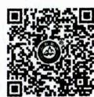  
教师劳动的复杂性

教师劳动的复杂性是由其工作性质、任务及过程的特殊性所决定的。关于教师劳动的复杂性的表现，有人总结为三个方面：第一，教育目的的全面性；第二，教育任务的多样性；第三，劳动对象的差异性。也有人认为，教师劳动的复杂性主要表现在：

(1)教师劳动性质的复杂性。教师的劳动属于专业行为，是一种高度复杂的心智劳动。  
(2)教师劳动对象的复杂性。教师的劳动对象是千差万别的人。教师不仅要经常在同一个时空条件下,面对全体学生,实施统一的课程计划、课程标准,还要根据每个学生的实际情况因材施教。此外,学生具有主观能动性,以其各自不同的反应方式有力地影响着教师劳动的效果。对于教师的教学活动,他们既有可能是积极的参与者,也有可能是中立的旁观者,甚至可能成为消极的排斥者。  
(3)教师劳动任务的复杂性。教师的任务是教书育人，包含多方面的要求和较为复杂的内容。教师不仅要传授科学文化知识，训练学生的技能，发展学生的智力，培养学生的能力，还要培养学生一定的思想品德，促进学生的身心健康发展。  
(4)教师劳动过程的复杂性。要使学生形成一种良好的思想品德，需要经过知识的传授、情感的体验、意志的锻炼、信念的建立以及行为习惯的培养这样一个长期的过程。  
(5)教师劳动手段的复杂性。教育要有效地促进学生的全面发展，必须保持教育影响的一致性，优化组合各种影响，使之发挥最佳的合力。然而，把这些复杂的影响有效地组织到教育过程中，使来自各方面的影响协调一致，是一项复杂的工作。

# 2.教师劳动的创造性

教师劳动的创造性主要是由劳动对象的特点决定的。教师劳动的创造性主要表现在：

(1)因材施教。教师劳动的创造性首先表现在因材施教上。教师要针对每个学生的不同特点，采取不同的教育措施，使他们都得到充分发展，这就是人们常说的“一把钥匙开一把锁”。  
(2)教学方法上的不断更新。“教学有法,教无定法”是对教师劳动创造性的最好注脚。  
(3)教师需要“教育机智”。教育机智是教师在教育教学过程中的一种特殊定向能力，是指教师能根据学生新的特别是意外的情况，迅速而正确地做出判断，随机应变地采取及时、恰当而有效的教育措

施解决问题的能力。教育机智是教师良好的综合素质和修养的外在表现，是教师娴熟运用综合教育手段的能力。教育机智可以用四个词语概括：因势利导、随机应变、掌握分寸、对症下药。

# 考点2 教师劳动的连续性和广延性

# 1.教师劳动的连续性

连续性是指时间的连续性。教师的劳动没有严格的交接班时间界限，这个特点是由教师劳动对象的相对稳定性决定的。教师要不断了解学生的过去与现状，预测学生的发展与未来，检验教育教学效果，获取教育教学反馈信息，准备新一轮的教育教学活动。

# 2.教师劳动的广延性

广延性是指空间的广延性。教师没有严格界定的劳动场所，课堂内外、学校内外都可能成为教师劳动的空间，这个特点是由影响学生发展因素的多样性决定的。学生的成长不仅受学校的影响，还受社会和家庭的影响。教师不能只在课内、校内发挥影响力，还要走出校门，协调学校、社会、家庭的教育影响，以便形成教育合力。

# 考点3 教师劳动的长期性和间接性

# 1.教师劳动的长期性

长期性指人才培养的周期比较长，教育的影响具有迟效性。教师劳动的成效并不是一时就可以检验出来的，而是需要教师付出长期的大量的劳动才能看到结果、得到验证，教师的某些影响对学生终身都会发生作用。因此，教师的劳动具有长期性。

(1)教师的劳动成果是人才，而人才培养的周期比较长。把一个人培养成为能够独立生活、能够服务社会、能够为人类做出贡献的合格人才，不是一朝一夕之功。“十年树木，百年树人”就是对这个道理的最佳阐释。  
(2)教师对学生所施加的影响，往往要经过很长的时间才能见效果。中小学教育处于打基础的阶段，教师的教育影响通常要反映在学生对高一级学校学习的适应中，甚至反映在学生走上工作岗位后的成就上。

# 2.教师劳动的间接性

间接性指教师的劳动不直接创造物质财富，而是以学生为中介实现教师劳动的价值。教师的劳动并没有直接服务于社会，或直接贡献于人类的物质产品和精神产品。教师劳动的结晶是学生的品德、学识和才能，待学生走上社会，由他们来为社会创造财富。

# 考点4 教师劳动的主体性和示范性

# 1.教师劳动的主体性

主体性指教师自身可以成为活生生的教育因素和具有影响力的榜样。对于教师来说，首先，教育教学过程就是教师直接用自身的知识、智慧、品德影响学生的过程。再者，教师劳动工具的主体化也是教师劳动主体性的表现。教师所使用的教具、教材，也必须为教师自己所掌握，成为教师自己的东西，才能向学生传授。

# 2.教师劳动的示范性

示范性指教师的言行举止，如人品、才能、治学态度等都会成为学生学习的对象。教师劳动的示范

性是由学生的可塑性、向师性和模仿性心理特征决定的。同时，教师劳动的主体性也要求教师的劳动具有示范性特点。德国著名教育家第斯多惠指出：“教师本人是学校里最重要的师表，是最直观的、最有教益的模范，是学生最活生生的榜样。”任何一个教师，不管他是否意识到这一点，不管他是自觉还是不自觉，他都在对学生进行示范。因此，教师必须以身作则、为人师表。

# 考点5 教师劳动方式的个体性和劳动成果的群体性

从劳动手段的角度来看，教师的劳动主要是以个体劳动的形式进行的。教师的劳动成果又是集体劳动和多方面影响的结果。教师的个体劳动最终都要融汇于教师的集体劳动之中，教育工作需要教师的群体劳动。

# 知识再拔高·

# 教师劳动的特点的其他说法

说法一：(1)劳动任务的综合性。(2)劳动对象的复杂性。(3)劳动手段的主体性。(4)劳动过程的创造性。主要表现在：①教师要有极强的创造意识和创造能力才能有效地完成培养学生全面发展的任务。②教师担负着完善学生个体的重任。学生个性各异，用一个模式来发展不同学生的个性既做不到，也是不必要的。这也需要教师创造性地运用教育的力量去影响学生。③教师劳动的创造性表现在帮助学生实现“内化”的过程中。④教师劳动的创造性表现在灵活地运用其智力水平。(5)教师劳动的长效性。

说法二：(1)长期性和复杂性；(2)延续性和艰苦性；(3)艺术性和创造性；(4)主体性和示范性；(5)个体性和群体性。

真题12 [2024浙江宁波，单选]数学老师秦老师不仅关注学生数学学科的学习情况，而且比较关心学生的生活起居以及身体锻炼情况。这主要体现了教师劳动的（）

A. 复杂性

B. 长期性

C. 间接性

D. 示范性

真题13 [2024江苏苏州，单选]根据学生的向师性特点可知，教师劳动具有（）的特点。

A. 示范性

B. 创造性

C. 长期性

D. 延续性

真题14 [2023安徽蚌埠，单选]“十年树木，百年树人”体现了教师劳动的（）特点。

A. 复杂性

B. 连续性

C. 示范性

D. 长期性

真题15 [2024广东佛山,判断]学生以其各自不同的反应方式有力地影响着教师劳动的效果。( )

答案：12.A 13.A 14.D 15.√

# 七、教师劳动的价值 ★ 【单选】

教师劳动的价值由社会价值和个人价值构成，是社会价值与个人价值的统一。

# 1.教师劳动的社会价值

教师劳动的社会价值是指教师在教育教学过程中耗费劳动力而产生的满足社会需要的意义和作用。它是教师劳动价值的主要属性，也是体现教师社会地位和教师个人价值的主要标志。教师劳动的社会价值主要体现在：(1)教师劳动与社会物质文明的发展；(2)教师劳动与社会精神文明的发展；(3)教师劳动与社会制度文明的发展；(4)教师劳动与人的素质的发展。

# 2. 教师劳动的个人价值

教师劳动的个人价值是作为客体的教师劳动对于教师主体需要的肯定或否定的某种状态，是满足教师自身物质和精神需要的程度。

真题16 [2022河北邯郸，单选]教师的劳动价值主要体现在教育劳动的（ ）上。

A. 个人价值和社会价值

B. 主体价值

C. 创造价值

D. 教育价值

答案：A

# 八、教师的职业素养 ★★★ 【单选、多选、判断】

教师的职业素养是教师做好教育工作的前提，也是衡量教师能否胜任本职工作的基本条件。

# 考点1 教师的职业道德素养

师德是教师素质的核心，若没有崇高的师德，教师素质就不够健全或不算完整。教师的职业道德素养是从教师对待事业、对待学生、对待集体和对待自己的态度上来体现的。

# 1. 对待事业：忠于人民的教育事业

热爱教育事业是教师做好教育工作的前提，是教师职业道德的基础，也是教师劳动积极性和创造性的源泉。

忠于人民的教育事业要求教师做到：(1)依法执教，严谨治教；(2)爱岗敬业，廉洁从教。

# 2. 对待学生：热爱学生

热爱学生是教师职业道德的核心，是教师高尚道德品质的表现，也是教师忠诚于人民教育事业的具体表现。

热爱学生的要求包括：（1）把对学生的爱与严格要求相结合；（2）把爱与尊重、信任相结合；（3）要全面关怀学生；（4）要关爱全体学生；（5）理解和宽容学生；（6）解放学生；（7）对学生要保持积极、稳定的情绪。

# 3. 对待集体：团结协作

人才的全面成长，是多方教育者集体劳动的结晶。这就要求教师必须与各方面协同合作，以便形成教育合力，共同完成培养人的工作。

团结协作要求教师做到：(1)相互支持、相互配合；(2)严于律己，宽以待人；(3)弘扬正气，摒弃陋习。

# 4. 对待自己：为人师表（良好的道德修养）

教师的言行举止、品德才能、治学态度等方面都会对学生产生潜移默化的影响，成为学生学习的对象。这是由教师劳动的“主体性和示范性”特点以及学生的“向师性、模仿性和可塑性”特点所决定的。

为人师表要求教师做到：(1)高度自觉，自我监控。(2)身教重于言教。要做到身教，最基本的要求是：凡是要求学生去做的，教师一定要身体力行，做到言行一致，发挥表率作用。

# 考点2 教师的知识素养

# 1.政治理论修养

马列主义、毛泽东思想和中国特色社会主义理论体系。

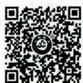  
教师的知识素养

# 2. 精深的学科专业知识（本体性知识）

这是教师知识结构的核心,也是教师向学生传授知识的必备基础。主要包括:(1)掌握该学科的基本知识和基本技能;(2)掌握该学科的基本理论和学科体系;(3)了解该学科的发展脉络;(4)了解该学科领域的思维方式和方法论。

# 3. 广博的科学文化知识

教师的知识不仅要“专”，而且要“博”，教师的专业知识应建立在广博的科学文化知识的基础之上。这是因为：(1)科学知识日益融合和渗透的要求；(2)青少年多方面发展的要求；(3)教师的任务是教书育人。

# 4.必备的教育科学知识（条件性知识）

人们通过数千年的教育实践, 积累了丰富的教育教学实践经验。在总结这些经验的基础上, 人们揭示了教育教学的规律, 提出了教育教学的原则、方法体系, 形成了系统的教育理论。教师要加强教育工作的科学性和有效性, 就必须掌握这些理论。其中, 教育学、心理学及学科教学法是教师需要掌握的最为基本的教育科学知识。此外, 教师还要掌握教育管理方面的知识。

教师的教育科学知识主要包括三个方面：(1)学生身心发展知识；(2)教与学的知识；(3)学生成绩评价的知识。

# 5. 丰富的实践知识

教师的实践性知识是基于教师个人的经验积累，在对待和处理教育问题时体现出的个人特质和教育智慧。

# 考点3 教师的能力素养

# 1. 语言表达能力

语言, 特别是口头语言, 是教师向学生传递教育信息的重要工具, 因此教师要具有较强的语言表达能力。对教师的语言表达要求包括: (1) 准确、简练, 具有科学性; (2) 清晰、流畅, 具有逻辑性; (3) 生动、形象, 具有启发性; (4) 口头语言和肢体语言的巧妙结合。

# 2. 组织管理能力

教师要进行教育活动，必须具备一定的组织管理能力。具体包括：(1)教师要有确定合理目标和计划的能力；(2)教师要有引导学生的能力。

# 3. 组织教育和教学的能力

教师是教育教学过程的组织者、领导者，因此要求教师具有驾驭教育和教学的能力。具体包括：

(1)教师要善于制订教育教学工作计划、编写教案、组织教材，以加强教学工作的预见性、有序性；  
(2)教师还要善于组织课堂教学，以保证教学过程的顺利进行和教学任务的完成；  
(3)教师还要善于组织学校、家庭及社会各方面的教育力量，使各方面相互配合，进行教育资源的整合。

# 4. 自我调控和自我反思能力（较高的教育机智）

教师的自我调控和自我反思能力主要表现为：（1）对自身的教育教学表现进行自我监督、自我反馈、自我反思、自我改进的能力；（2）根据新情况、新问题调整自己的预定计划以适应变化的能力。

此外，教师还应该具备教育科研能力、学习能力、观察学生的能力、创新能力以及运用现代教育技术手段的能力。

# 考点4 职业心理健康

教师心理健康的构成是指一个优秀教师所应有的心理素质，也就是教师对内外环境及人际关系有着良好适应的条件。这些条件包括高尚的职业道德、愉悦的情绪情感、良好的人际关系、健康的人格特征等。

# 知识再拔高·

# 教师的职业素养的其他说法

关于教师应具备的职业素养，除上文中常考的说法之外，还有以下比较常见的说法：

说法一：教师应具备的专业素养

我国实行教师资格制度，但一名教师是否真正具备从事教师的职业条件，能否正确履行教师角色的职责，根本上还在于教师的专业素养。教师的专业素养是当代教师质量的集中体现。

(1)教师的学科专业素养。即教师的学科知识素养。   
(2)教师的教育专业素养。教师的教育专业素养包括三个方面：

①具有先进的教育理念。②具有良好的教育能力。③具有一定的研究能力。  
(3)教师的人格特征。教师的人格特征是指教师的个性、情绪以及处理人际关系的品质等，主要包括积极乐观的情绪、豁达开朗的心胸、坚韧不拔的毅力和广泛的兴趣。  
(4)教师良好的职业道德素质。

说法二：教师的素养

(1)高尚的师德。   
(2)宽厚的文化素养。   
(3)专门的教育素养。主要包括:①教育理论素养。②教育能力素养,主要包括课程开发的能力、良好的语言表达能力、组织与引导教学的能力、机智应变与创新的能力。③教育研究素养。  
(4)健康的心理素质。

说法三：教师的职业素质要求

(1)文化素养与学科专业知识。包括：①具有所教学科的全面而扎实的专业知识和技能。②具有广博的文化科学知识与多方面的兴趣和才能。  
(2)教育理论知识与技能。教师作为教育教学的专业人员,必须具备如何教育学生的专业知识,才能把自己对教育内容的理解转化为学生自身的知识,有效地解决在教育教学中出现的问题。  
(3)职业道德素养。包括: ①忠于人民的教育事业, 甘于在教师岗位上无私奉献。对教育事业的无私奉献精神, 是教师崇高精神境界与高度政治觉悟的具体体现。教师崇高使命和高度责任感使他们在职业道德上表现出了无私奉献精神。正如陶行知先生所说的“捧着一颗心来, 不带半根草去”。②热爱学生, 是教师热爱教育事业的集中体现。③严于律己, 为人师表。

真题17 [2024广东佛山，单选]( )是衡量教师是否胜任本职工作的基本条件。

A. 教师的教龄  
B. 教师的年龄  
C.教师的职业素养  
D.教师的人际交往能力

题18 [2024安徽统考，单选]教师所具有的任教学科的专业知识（如语文知识、数学知识）

等）是（ ）

A. 本体性知识

B.条件性知识

C. 实践性知识

D. 通识性知识

真题19 [2023湖北武汉，单选]下列哪项属于教师忠诚于人民教育事业的具体表现（）

A. 监督学生

B. 宠溺学生

C. 热爱学生

D. 影响学生

真题20 [2023山西太原，单选]教师基于个人经验的积累，在对待和处理教育问题时表现出的个人特征属于教师专业知识中的（）

A. 通识性知识

B. 本体性知识

C. 实践性知识

D. 条件性知识

答案：17.C 18.A 19.C 20.C

# 九、教师专业发展

# 考点1 教师专业发展的概念

教师专业发展，又称教师专业成长，是指教师在整个职业生涯中，依托专业组织、专门的培养制度和管理制度，通过持续的专业教育，习得教育教学专业技能，形成专业理想、专业道德和专业能力，从而实现专业自主的过程。它包括教师群体的专业发展和教师个体的专业发展。

(1)教师群体的专业发展是指教师职业不断成熟、逐渐达到专业标准，并获得相应的专业地位的过程。它既是教师个体专业化的条件和保障，同时也最终代表着教师职业的专业化。  
(2)教师个体的专业发展是教师作为专业人员,从专业思想到专业知识、专业能力、专业心理品质等方面由不成熟到比较成熟的发展过程,即由一个专业新手发展成为专家型教师或教育家型教师的过程。从历史发展的总趋势来看,教师专业发展的核心以及最终体现就在于教师个体的专业发展。

# 考点2 教师专业发展的内容 ★【单选、多选】

(1)专业理想的建立。教师的专业理想是教师对成为一个成熟的教育专业工作者的向往与追求，它为教师提供了奋斗的目标，是推动教师发展的巨大动力。  
(2)专业态度和动机的完善。教师专业态度和动机是教师专业活动的动力基础。教师在这个方面的发展主要表现在教师的专业理想、对职业的态度、工作积极性高低以及职业满意度等。  
(3)专业知识的拓展与深化。教师的专业知识是教师立足职业的根本。教师专业知识（合理的知识结构）主要包括本体性知识、条件性知识、实践性知识和一般文化知识。其中，本体性知识，即特定学科及相关知识，是教学活动的基础；条件性知识，即认识教育对象、开展教育活动和研究所需的教育科学知识和技能，如教育原理、心理学、教学论、学习论、班级管理、现代教育技术等；实践性知识，即课堂情境知识，体现教师个人的教学技巧、教育智慧和教学风格，如导入、强化、发问、课堂管理、沟通与表达、结课等技巧。  
(4)专业能力的提高。教师的专业能力就是教师的教育教学能力,是教师在教育教学活动中所形成的顺利完成某项任务的能力和本领。它是教师综合素质最突出的外在表现,也是评价教师专业性的核心因素。  
(5)教师的专业人格。教师的专业人格是教师在教育教学工作中所必须具有的道德品质方面的自我修养，诚实正直、善良宽容、公正严格是教师专业人格的重要内容。  
(6)专业自我的形成。专业自我包括自我意象、自我尊重、工作动机、工作满意感、任务知觉和未来

前景。对教学工作来说，教师的专业自我是教师个体对自我从事教学工作的感受、接纳和肯定的心理倾向，这种倾向将显著地影响到教师的教学成效。

# 考点3 教师专业发展的阶段 ★【单选】

# 1.“自我更新”取向教师专业发展阶段论

叶澜等人从“自我更新”取向角度对教师专业发展阶段进行了深入研究，将它按照先后顺序划分为“非关注”阶段、“虚拟关注”阶段、“生存关注”阶段、“任务关注”阶段、“自我更新关注”阶段五个阶段。

表 1-29 “自我更新”取向教师专业发展阶段论  

<table><tr><td>阶段名称</td><td>时限</td><td>主要特征</td></tr><tr><td>“非关注”阶段</td><td>正式教师教育之前</td><td>无意识中以非教师职业定向的形式形成了较稳固的教育信念,具备了一些
 “直觉式”的“前科学”知识以及与教师专业能力密切相关的一般能力</td></tr><tr><td>“虚拟关注”阶段</td><td>师范学习阶段
(包括实习期)</td><td>对合格教师的要求开始思考,在虚拟的教学环境中获得某些经验,对教育理论及教师技能进行学习和训练,有了对自我专业发展反思的萌芽</td></tr><tr><td>“生存关注”阶段</td><td>新任教师阶段</td><td>在“现实的冲击”下,产生了强烈的自我专业发展的忧患意识,特别关注
 专业活动中的“生存”技能,专业发展集中在专业态度和动机方面</td></tr><tr><td>“任务关注”阶段</td><td>—</td><td>随着教学基本“生存”知识、技能的掌握,自信心日益增强,由关注自我的生存转到更多地关注教学,由关注“我能行吗”转到关注“我怎样才能行”</td></tr><tr><td>“自我更新关注”阶段</td><td>—</td><td>不再受外部评价或职业升迁的牵制,自觉依照教师发展的一般路线和自己目前的发展条件,有意识地自我规划,以谋求最大程度的自我发展,关注学生的整体发展,积累了比较科学的个人实践知识</td></tr></table>

# 2. 休伯曼的职业生涯周期论

美国教育家休伯曼等人依据教师的生命周期，将教师的职业生涯划分为入职期、稳定期、实验和歧变期（实验和重估期）、平静和保守期、退出教职期五个时期。

表 1-30 休伯曼的职业生涯周期论  

<table><tr><td>时期</td><td>从教年限</td><td>主要特征</td></tr><tr><td>入职期</td><td>1~3年</td><td>这一时期的教师表现出对自己所从事的新职业的复杂感情，一方面是初为人师的积极热情，另一方面是面对新工作的无所适从，却又很想尽快步入正轨而急切地希望获得教学的知识和技能。因此这一时期也可称之为“求生和发现期”</td></tr><tr><td>稳定期</td><td>4~6年</td><td>这一时期教师逐渐适应了自己的工作，并且能够比较自如地驾驭课堂教学，初步形成了自己的教学风格，入职时的压力和不适已经消失，教师此时已经能够比较轻松、自信地面对自己的工作，同时要求自己在教学技能等方面进行不断地改进与提高</td></tr><tr><td>实验和歧变期(实验和重估期)</td><td>7~25年</td><td>这一时期是教师职业生涯道路上的转变期。教师的转变有两个方向：一是随着知识和阅历的增加，教师开始对自己及学校的各项工作大胆地进行求新和力求改革，关注学校发展，对学校组织和管理中的漏洞进行批评和指正，不断地对职业和自我进行挑战；二是单调乏味的教学轮回使教师对自己的职业产生了倦怠感，对是否要继续执教产生动摇，因此开始对目前从事的工作进行新的评估</td></tr><tr><td>平静和保守期</td><td>26~33年</td><td>许多教师在经历了怀疑和危机之后逐渐开始平静下来,能够较为轻松地完成课堂教学,也更有自信心。随着职业预期目标的逐渐实现,教师的志向水平也开始下降,对专业投入也逐渐减少。该阶段的另一个主题是与学生的关系更加疏远,教师对学生行为和作业更加严格。同时,处于该阶段的教师在经历了平静期后变得较为保守,这可能是自我怀疑的进一步发展,也可能是改革失败的结果。多数教师会抱怨学生变得纪律性更差,缺少学习动机,抱怨公众对教育的消极态度,抱怨年轻教师不够认真和投入</td></tr><tr><td>退出教职期</td><td>34~40年</td><td>迫于社会压力,教师的专业行为没有太大改变,只是更加关注自己喜欢的班级、做喜欢做的工作</td></tr></table>

# 3. 骨干教师成长四阶段论

骨干教师的成长过程分为四个阶段，即准备期、适应期、发展期、创造期。在每个阶段结束时，他们可以分别称为新任教师、合格教师、骨干教师、专家教师。

表 1-31 骨干教师成长四阶段论  

<table><tr><td>阶段名称</td><td>时限</td><td>教师在素质上的特点</td><td>结束时教师的名称</td></tr><tr><td>准备期</td><td>教师从事教育工作以前的阶段,是接受教育和学习、为做教师进行准备的阶段</td><td>(1)以学习书本知识为主；
(2)知识和经验具有一般化和表面化的特点；
(3)形成了教师所需要的一部分独特的优势素质</td><td>新任教师：走上教师岗位时结束</td></tr><tr><td>适应期</td><td>教师走上工作岗位,由没有实践体验到初步适应教育教学工作,具备最基本、最起码的教育教学能力和其他素质的阶段</td><td>(1)在知识上,开始形成实际的、具体的、直接的知识和经验；
(2)在能力上，教育教学的实践能力开始初步形成；
(3)在素质上，水平还处于较低的层次，项目还不够全面和平衡</td><td>合格教师：教师能够适应和胜任教育教学工作，能够基本上完成教育教学任务，得到学生的认可（适应期结束的标志）</td></tr><tr><td>发展期</td><td>教师在初步适应教育教学工作后,继续在教育教学实践中锻炼自己的教育教学能力和素质,使之达到熟练程度的时期</td><td>(1)在素质的水平上,向熟练化、深广化发展,专业化水平提高；
(2)在素质的项目上,向全面化和整体化方向发展；
(3)在素质的倾向性上,由注重教的方面向注重学的方面转变</td><td>骨干教师：工作自动化、有效率,能够比较自如地处理各种各样的问题</td></tr><tr><td>创造期</td><td>教师开始由固定、常规、自动化的工作进入到开始探索和创新的时期,是形成自己独到见解和教学风格的时期</td><td>(1)在素质上,发展创新性素质；
(2)在活动上,具有探索性；
(3)在成果上,注意理论总结的工作,形成自己的教育思想</td><td>专家教师：形成自己的教学风格、教学模式,总结出自己的教育观点和某方面的理论,发表有一定分量的教育论文或教育著作</td></tr></table>

真题21 [2023河南郑州，单选]我国教育家叶澜从自我更新取向的角度，把教师专业化分成五个发展阶段，下列阶段按先后顺序排列正确的是（）

A.生存关注阶段 任务关注阶段 自我更新关注阶段

B.生存关注阶段 虚拟关注阶段 自我更新关注阶段

C. 自我更新关注阶段 虚拟关注阶段 生存关注阶段

D.生存关注阶段 虚拟关注阶段 非关注阶段

真题22 [2022四川统考，单选]“教师能够基本上完成教育教学任务，得到学生的认可。”这是教师职业（ ）结束的标志。

A. 准备期

B. 适应期

C. 发展期

D. 创造期

答案：21.A 22.B

# 考点4 教师专业发展的取向 ★ 【单选】

一般认为，教师专业发展的取向有理智取向、实践一反思取向、文化生态取向三种。

# 1. 理智取向

理智取向主张教师通过正规的培训，向专家学习先进的“学科知识”和“教育知识”，以提高教育理性认识水平和教学技能。

# 2.实践一反思取向

实践一反思取向主张教师通过实践反思，发现教育教学意义，获得实践智慧，其主要方法有写日志、传记、构想、文献分析、教育叙事、教师访谈、参与性观察等。

# 3.文化生态取向

文化生态取向认为教师专业发展不仅仅依靠个人努力，更大程度上依赖于“教学文化”或“教师文化”，正是这些文化为教师工作提供意义、支持和身份认同，其主要方式是通过学习团队建设进行协同教学、合作教研，实现共同发展。

真题23 [2023河南郑州，单选]主张让教师通过写日志、传记、文献分析、教育叙事以及参与性观察等方法实现专业发展的模式是（）

A. 知识取向模式

B. 实践—反思取向模式

C. 文化生态取向模式

D. 自我更新取向模式

答案：B

# 考点5 教师专业发展的途径 ★★ 【单选、多选、论述】

# 1. 师范教育

职前师范教育阶段是师范生进行专业准备与学习，初步形成教师职业所需要的知识与能力的关键时期，是教师专业化发展的起始和奠基阶段。

# 2. 入职培训

新教师都会面临一个角色适应问题。为了让新教师尽快进入角色，新教师的任职学校应当采取及时有效的支持性措施。在我国，各级师范院校还承担了短期的系统培训工作，培训的目的是向新教师提供系统而持续的帮助，使之尽快转变角色、适应环境。

# 3.在职培训

在职培训是为了适应教育改革与发展的需要，为在职教师提供的继续教育，主要采取“理论学习、尝试实践、反省探究”三结合的方式，培养教师研究教育对象、教育问题的意识和能力。教师在职培训

活动很广，可以是业余进修，也可以是校本培训（如集体观摩、相互评课、相互研讨等）。

# 4. 自我教育

教师的自我教育就是专业化的自我建构,它是教师个体专业化发展最直接、最普遍的途径。教师自我教育的方式主要有经常性的系统的自我反思、主动收集教改信息、研究教育教学中的各种关键事件、自学现代教育教学理论、积极感受教学的成功与失败等。教师自我教育是专业理想确立、专业情感积淀、专业技能提高、专业风格形成的关键。

此外，跨校合作（如教师专业发展学校），专家指导（如讲座、报告），政府教育部门和教研机构组织的各类专业培训和交流活动等也是教师专业发展的途径。

真题24 [2023辽宁锦州，多选]教师的自我教育是教师个体专业化发展的最直接、最普遍的途径。教师自我教育的方式主要有（）

A. 经常性的系统的自我反思

B.自学现代教育教学理论

C. 研究教育教学中的各种关键事件

D. 积极感受教学的成功与失败

答案：ABCD

# ★本节核心考点回顾 ★

# 1.教师的职业形象

(1)教师的道德形象。“为人师表”“身正为范，学高为师”。  
(2)教师的文化形象。“才高八斗”“学富五车”。  
(3)教师的人格形象。理想教师的人格包括善于理解学生、富有耐心、有幽默感等。

# 2.教师的职业角色

(1)“传道者”角色（人类灵魂的工程师）：  
(2)“授业、解惑者”角色（知识传授者、人类文化的传递者）：  
(3)示范者角色(榜样)：  
(4)“教育教学活动的设计者、组织者和管理者”角色：  
(5)“家长代理人、父母”和“朋友、知己”的角色：  
(6)“研究者”角色和“学习者”“学者”角色。

# 3.教师劳动的特点

(1)复杂性和创造性。①复杂性：教师劳动性质、对象、任务、过程、手段的复杂性；②创造性：因材施教、教学方法上的不断更新、教师需要“教育机智”。  
(2)连续性和广延性。  
(3) 长期性和间接性。①长期性: “十年树木, 百年树人”; ②间接性: 以学生为中介实现教师劳动的价值。  
(4) 主体性和示范性。①主体性: 教师自身可以成为活生生的教育因素和具有影响力的榜样; ②示范性: 由学生的可塑性、向师性和模仿性心理特征决定。  
(5)劳动方式的个体性和劳动成果的群体性。

# 4.教师的职业素养

(1)职业道德素养：①对待事业：忠于人民的教育事业；②对待学生：热爱学生；③对待集体：团结协

作；④对待自己：为人师表。

(2)知识素养：①政治理论修养；②精深的学科专业知识；③广博的科学文化知识；④必备的教育科学知识；⑤丰富的实践知识。  
(3)能力素养：①语言表达能力；②组织管理能力；③组织教育和教学的能力；④自我调控和自我反思能力。  
(4)职业心理健康。

# 第二节 学生

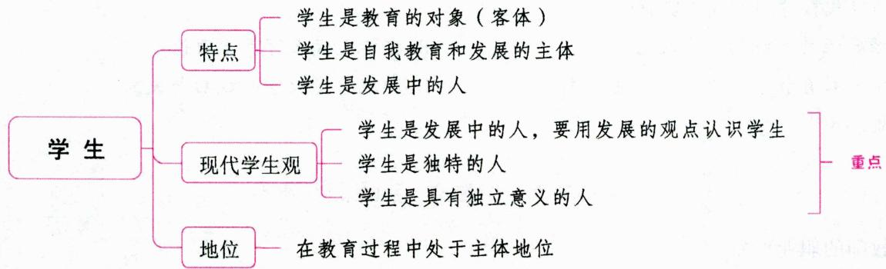

# 一、学生的特点（学生的本质属性） ★★ 【单选、判断】

# 考点1 学生是教育的对象（客体）

# 1.依据

从教师方面看，教师是教育过程的组织者、领导者，学生是教师教育实践活动的作用对象，是被教育者、被组织者和被领导者。

从学生自身特点看，学生具有可塑性、依赖性和向师性。

(1)学生具有可塑性。学生处于长知识、长身体的时期，也是他们的品德、人格正在形成的时期，各方面尚未成熟，具有很大的发展潜力，而且尚未定型，极容易受外部环境因素的影响，具有“染于苍则苍，染于黄则黄”的特点。  
(2)学生具有依赖性。学生多属未成年人，还不具备完全独立生活的能力。在家里，他们要依赖父母，入学后他们将对父母的依赖转为对教师的依赖。  
(3)学生具有向师性。学生入学后,会自然地亲近、信赖、尊敬甚至崇拜教师,把教师作为获取知识的智囊、解决问题的顾问、行为举止的楷模。

# 2. 表现

(1)学生明确自己的主要任务是学习，具有愿意接受教育的心理倾向。  
(2)学生服从教师的指导，接受教师的帮助，期待从教师那里汲取营养，促进自身的身心发展。  
(3)学生所参加的是一种规范化的学习，学生的学习是有目的、有计划、有组织地进行的，它是由一定的教育制度以及学校的各项规章制度所规定了的。

# 考点2 学生是自我教育和发展的主体

学生作为教师教育活动的对象或客体是相对的、暂时的，而作为自身生活、学习和发展的主体却是绝对的、长期的。

# 1. 依据

(1)学生是具有主观能动性的人。学生是有意识、有情感、有个性的社会人,他们不是盲目、机械、被动地接受作用于他们的影响,而是具有主观能动性的人。  
(2)学生在接受教育的过程中，也具有一定的素质，可以进行自我教育。

# 2. 表现

学生的主观能动性（主体性），主要表现在：

(1)自觉性, 也称主动性, 这是学生主观能动性最基本的表现。  
(2)独立性,也称自主性,这是自觉性进一步发展的表现。承认学生的独立性是发挥学生主体性的前提条件。  
(3)创造性, 这是学生主观能动性的最高表现。

此外，也有学者认为主体性具体包括独立性、选择性、调控性、创造性和自我意识性。

# 3. 学生主体性的培养

对于学生主体性的培养，一般学者认为主要从三个方面着手：

(1)建立民主而和谐的师生关系，重视学生自学能力的培养；  
(2)重视培养学生主体参与课堂,让学生获得主体参与的体验,尤其让学生体验成功;  
(3)尊重学生的个性差异，对学生进行具有针对性的教育。

主体性教育要求在班级管理中，突出学生自主管理，让每一位学生都有机会参与到班级管理中来；在课程上，重视研究性学习和探究性学习；在教学组织形式上，采取集体教学、小组教学和个别教学相结合的形式，尤其强调小组教学的作用。

# 考点3 学生是发展中的人

学生不是成人，他们正处于身心发展最迅速的时期，生理和心理两方面都不太成熟，具有很大的发展的可能性与可塑性。学生是发展中的人，包括四层含义：（1）学生具有和成人不同的身心发展特点；（2）学生具有发展的巨大潜在可能性；（3）学生具有发展的需要；（4）学生具有获得成人教育关怀的需要。

真题1[2024安徽合肥/淮北/铜陵，单选]学生既是教育的对象，又是教育过程中的主体。学生主体作用的最高表现形式为（）

A. 自觉性

B. 独立性

C. 创造性

D. 主动性

真题2 [2023江苏苏州，单选]在学生心目中，老师是高尚完美的，是最值得学习的榜样。这说明学生具有（ ）

A.依赖性

B. 向师性

C. 可塑性

D. 接受性

真题3 [2023广东梅州, 判断]承认学生的独立性是发挥学生主体性的前提条件。（）

答案：1.C 2.B 3.√

# 二、现代学生观(“以人为本”的学生观/新课程倡导的学生观) ★★★ 【单选、多选、判断、材料分析】

学生观就是教师对学生的基本看法，它影响教师对学生的认识及其态度与行为，进而影响学生的发展。“以人为本”的学生观遵从学生的本质属性，将学生视为发展中的人，尊重学生个体的独特性，并能够确保学生在教育教学过程中处于发展主体的地位。教师要树立“以人为本”的学生观，这也体现了新课程改革“为了每位学生的发展”的核心理念。

# 考点1 学生是发展中的人，要用发展的观点认识学生

(1)学生的身心发展是有规律的。教师应依据学生身心发展的规律和特点来开展教育活动。  
(2)学生具有巨大的发展潜能。在实际工作中,许多人往往从学生的现实表现推断学生没有出息、没有潜力。其实,学生具有巨大的发展潜能,智力水平可以明显提高,这已被科学研究所证实。  
(3)学生是处于发展过程中的人。作为发展中的人,意味着学生还是不成熟的人,是一个正在成长的人。把学生作为发展中的人来对待,就要理解学生身上存在的不足,就要允许学生犯错误。当然,更重要的是要帮助学生解决问题,改正错误,从而不断促进学生的进步和发展。  
(4)学生的发展是全面的发展。现代学生观强调，教师在教育教学实践中，不仅要重视“知识与技能”的传授，更要看到“过程与方法”“情感态度与价值观”的重要性，把学生培养成全面发展的人。

# 考点2 学生是独特的人

(1)学生是完整的人。学生并不是单纯的、抽象的学习者，而是有着丰富个性的完整的人。学习过程并不是单纯的知识接受或技能训练，而是伴随着交往、创造、追求、选择、意志努力、喜怒哀乐等的综合过程，需要学生整个内心世界的全面参与。  
(2)每个学生都有自身的独特性。独特性是个性的本质特征，珍视学生的独特性和培养具有独特个性的人，应成为我们对待学生的基本态度。独特性也意味着差异性，差异不仅是教育的基础，也是学生发展的前提，应视之为一种财富而珍惜开发，使每个学生在原有基础上都得到完全、自由的发展。  
(3)学生与成人之间存在着巨大的差异。学生和成人之间存在很大差别，学生的观察、思考、选择和体验，都和成人有明显不同。“应当把成人看作成人，把孩子看作孩子。”

# 考点 3 学生是具有独立意义的人

(1)每个学生都是独立于教师的头脑之外，不以教师的意志为转移的客观存在。教师不可以对学生随意支配，或任意捏塑，不可以随意强加给学生一些外在的知识，因为这样并没有尊重学生的主观能动性，只会挫伤学生的主动性、积极性，扼杀他们的学习兴趣，窒息他们的思想，引起他们自觉或不自觉的抵制或抗拒。  
(2)学生是学习的主体。教师对学生的教育与改造,只是学生发展的外部条件和外因,学生的主体活动才是学生获得发展的内在机制和内因。教师不可能代替学生读书,代替学生感知,代替学生观察、分析、思考,代替学生明白任何一个道理和掌握任何一条规律。教师只能让学生自己读书,自己感受事

物，自己观察、分析、思考，从而自己明白事理，自己掌握事物发展变化的规律。

(3)学生是责权主体。从法律角度看，在现代社会，学生在社会系统中享受各项基本权利，有些甚至是特定的。但同时，学生也要承担一定的责任和义务。把学生作为责权主体来对待，是现代教育区别于古代教育的重要特征，是教育民主的重要标志。

真题4 [2022内蒙古赤峰,单选]教师不可能代替学生读书,代替学生感知,代替学生观察、分析、思考,代替学生明白任何一个道理和掌握任何一条规律。这表明( )

A. 学生是独立的主体

B. 学生是学习的主体

C. 学生是责权主体

D. 学生是教育的主体

真题5 [2022广东江门, 单选]唐老师理解学生身上存在的不足, 允许学生犯错误, 当然, 更重要的是帮助学生解决问题, 改正错误, 从而不断促进学生的进步和发展。唐老师遵循的学生观是( )

A. 学生具有巨大的发展潜力

B. 学生的发展是全面的发展

C. 学生的身心发展是有规律的

D. 学生是处于发展过程中的人

真题6 [2023辽宁锦州，判断]“以人为本”的学生观强调学生是发展中的人，学生是独特的人，学生是具有独立意义的人。（）

A. 正确

B. 错误

答案：4.B 5.D 6.A

# 三、学生的地位 ★ 【单选、多选、判断】

# 考点1 学生的社会地位

学生的社会地位是指他们作为社会成员应具有的主体地位。青少年儿童是未来社会的主人，有着独立的社会地位，并依法享受各项社会权利。

1989年11月20日联合国大会通过了《儿童权利公约》，其核心精神是维护青少年儿童的社会权利主体地位。这一精神的基本原则有儿童利益最佳原则、尊重儿童尊严原则、尊重儿童观点与意见原则和无歧视原则。我国是《儿童权利公约》的缔约国之一，在履行《儿童权利公约》的同时，还在《中华人民共和国宪法》《中华人民共和国义务教育法》《中华人民共和国未成年人保护法》等一系列有关法律、法规和政策中对青少年享有的权利做了规定，概括起来讲，主要有：（1)生存的权利；（2）受教育的权利；（3）受尊重的权利；（4）安全的权利。

# 考点2 学生在教育过程中的地位

现代教育理论认为，在教育过程中，学生既是认识的客体，又是认识的主体。

学生作为认识的客体是指学生相对于社会的要求、新的教学内容和教师的认识来说处于一种被动状态，需要教师有目的、有计划、有组织地引导，将一定社会要求转化为学生内部需要，将新的教学内容转化为学生的素质。承认学生的客体性和客体地位，就是强调教育和教师的主导作用。然而，在教育过程中，外界的一切影响并不是简单地输送或移植给学生，必须经过学生主体的主动吸收、转化，学生是活生生的具有主观能动性的人，是学习的主人。教师的作用只是外因，任何知识技能的领会与掌握

都要依靠学生独立自主的学习，教师不可能包办代替；任何有效的教学必须以尊重学生身心发展规律，特别是学习规律为前提。因此，学生在教育过程中处于主体地位，是主体与客体的统一体。

真题7 [2022山东济南, 单选]第44届联合国大会第25号决议通过的《儿童权利公约》, 是第一部有关保障儿童权利且具有法律约束力的国际性约定。《儿童权利公约》的核心精神是维护青少年儿童的( )

A. 社会权利主体地位  
B. 社会权利主体非独立地位  
C. 社会权利客体独立地位  
D. 社会权利客体非独立地位

真题8 [2022江苏苏州，判断]在教育过程中，学生处于主导地位。（）

答案：7.A 8.×

# ★本节核心考点回顾 ★

# 1. 学生的特点

(1)学生是教育的对象。从学生自身特点看，学生具有可塑性、依赖性和向师性。  
(2)学生是自我教育和发展的主体。学生具有主观能动性，主要表现在：①自觉性，也称主动性，这是主观能动性最基本的表现；②独立性，也称自主性，承认学生的独立性是发挥学生主体性的前提条件；③创造性，这是主观能动性的最高表现。  
(3)学生是发展中的人。

# 2.现代学生观

(1)学生是发展中的人，要用发展的观点认识学生。①学生的身心发展是有规律的；②学生具有巨大的发展潜力；③学生是处于发展过程中的人；④学生的发展是全面的发展。  
(2)学生是独特的人。①学生是完整的人；②每个学生都有自身的独特性；③学生与成人之间存在着巨大的差异。  
(3)学生是具有独立意义的人。①每个学生都是独立于教师的头脑之外，不以教师的意志为转移的客观存在；②学生是学习的主体；③学生是责权主体。

# 第三节 师生关系

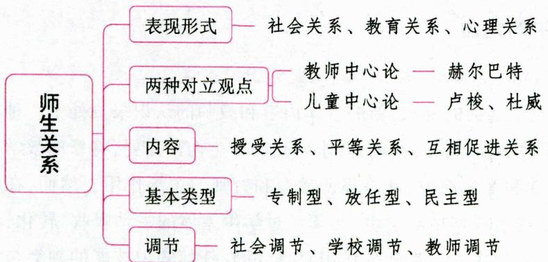

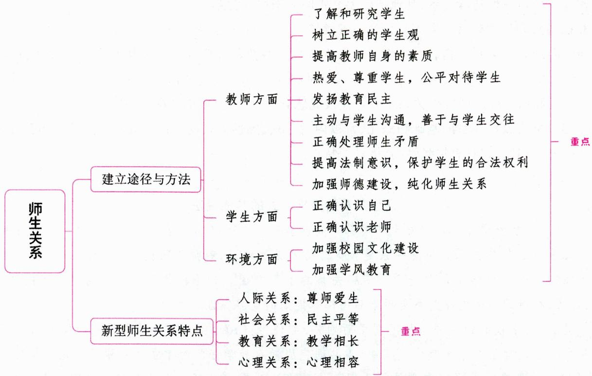

# 一、师生关系的内涵 ★★ 【单选、填空、简答】

# 考点1 师生关系的概念

师生关系是指教师和学生在教育教学活动中为完成一定的教育任务，以“教”和“学”为中介而形成的一种特殊的社会关系，包括彼此所处的地位、作用和态度等。师生关系是教育活动过程中人与人关系中最基本、最重要的关系。

# 考点2 师生关系的主要表现形式

从对师生关系的意义及稳定性等的综合分析，师生关系主要表现在以下三个方面：

# 1. 以年青一代成长为目标的社会关系

师生之间的社会关系是教师作为成人社会的代表与学生作为未成年的社会成员在教育教学过程中结成的代际关系、政治关系、文化关系、道德关系、法律关系等。师生的社会关系是规范性的，是人与人的各种社会关系在教育教学中的反映。

社会关系是一种背景关系，是教师和学生作为社会人的身份和角色在教育教学中的直接反映，具有规范性、稳定性的特点，常以比较强硬的方式投射到师生之间的教育关系和心理关系之中。

# 2. 以直接促进学生发展为目标的教育关系

师生的教育关系是指教师和学生在教育教学活动中为促进学生的整体发展和自主发展而结成的教育与被教育、组织与被组织、引导与被引导等主体间的关系。它是师生现实关系的体现，它是形成性的。教育关系是师生关系的主体。师生的教育关系也是多样的：(1)从教育过程的主体作用来说，教师和学生是教育和被教育的关系；(2)从教育作为一种组织来说，教师和学生共同生活在学校、班级等社群中，构成组织和被组织的关系；(3)从教育活动的展开来说，教师和学生是一种平等的交往关系和对话关系。

教育关系是一种基本关系，其他师生关系皆服务于这一关系。

# 3. 以维持和发展教育关系为目标的心理关系

师生间的心理关系是指教师和学生为了维持和发展教育关系而构成的内在联系，包括人际认知关系、情感关系、个性关系等。师生心理关系的实质是师生个体之间的情感是否融洽、个性是否冲突、人际关系是否和谐。理想的师生关系是一种使彼此感到愉悦、相互吸引的融洽、和睦关系。

心理关系是教育关系的基础和深化，常以内隐方式、感性方式反映社会关系并直接影响教育关系，与前两种关系相比，它具有情景性、弥散性等特点。

# 知识再拔高

# 师生关系的表现形式的其他说法

说法一：学校中师生之间发生的关系一般包括三个方面：(1)教学关系。师生之间是一种教与学的关系。(2)情感关系。情感关系是教育活动的必然结果，教师不断提升专业素养、关爱包括后进生在内的每一个学生是改进师生情感关系的主要途径。(3)伦理关系。努力构建现代民主、自由、正义、和谐的师生伦理关系是师生品德修养提高的重要保证。

说法二：学校的师生关系从不同层面划分，可分为：(1)为完成教育教学任务而发生的教育教学关系。这是师生在教育教学过程中，为共同完成教育教学任务而建立的一种工作关系和组织关系。(2)为满足交往需要而在学校师生间形成的人际关系。(3)师生主体及相互之间的心理关系。(4)为遵循社会秩序与道德规范而形成的社会道德关系。

说法三：现代师生关系的类型表现在许多方面，比如社会关系、教育关系、心理关系、伦理关系、法律关系等。其中，伦理关系是师生关系体系中最高层次的关系形式，对其他关系形式具有约束和规范作用。

真题1 [2022河北保定，单选]下列关于师生关系的主要表现形式说法错误的是（）

A. 伦理关系是师生关系的最高层次  
B. 社会关系以直接促进学生发展为目标  
C. 心理关系的目标在于维持和发展教育关系  
D. 社会关系和心理关系都是为教育关系服务的

答案：B

# 考点3 关于师生关系的两种对立观点

关于师生关系，有两种对立的观点，即教师中心论和儿童中心论。

# 1.教师中心论

教师中心论的典型代表是赫尔巴特，他认为教师在教育教学过程中起主宰作用，强调教师的权威作用。教师中心论仅看到了教师的主导作用，忽视了学生的主观能动性，在教育实践中使教育活动脱离学生的实际，难以达到预期的效果。

# 2. 儿童中心论（学生中心论）

儿童中心论的典型代表是卢梭和杜威。儿童中心论认为教育的目的在于促进儿童的成长,因此教育要从学生的兴趣和需要出发,整个教育过程要围绕儿童进行。儿童中心论过分夸大了学生的主观能

动性，忽视了学生是教育对象这一基本事实，会导致教育质量下降。

真题2 [2024江苏苏州,单选]德国教育学家赫尔巴特是( )的代表。

A. 儿童中心论

B.教师中心论

C. 劳动教育中心论

D. 活动中心论

真题3 [2022浙江金华,简答]你如何看待赫尔巴特的师生关系论，请简单评价。

答案：2.B 3.详见内文

# 二、师生关系的内容 ★★ 【单选、多选、判断】

(1)师生在教育内容的教学上结成授受关系。①从教师与学生的社会角色规定的意义上看，教师是传授者，学生是受授者；②学生在教学中主体性的实现，既是教育的目的，也是教育成功的条件；③对学生指导、引导的目的是促进学生的自主发展。  
(2)师生在人格上是平等的关系。①学生作为一个独立的社会个体，在人格上与教师是平等的；②教师和学生是一种朋友式的友好帮助关系。  
(3)师生在社会道德上是互相促进的关系。①师生关系从本质上是一种人一人关系；②教师对学生的影响不仅仅是知识上的、智力上的影响，更是思想上的、人格上的影响。

真题4 [2024河南事业单位，多选]关于师生关系的内容，下列选项中描述正确的有（）

A.师生在人格方面是平等关系

B.师生在道德方面是相互促进关系

C. 师生在教学方面是授受关系

D. 师生在心理方面是师道尊严关系

答案：ABC

# 三、师生关系的作用 ★【单选、判断】

说法一：(1)良好的师生关系是教育教学活动顺利进行的重要条件。(2)师生关系是衡量教师和学生学校生活质量的重要指标。(3)师生关系是一种重要的课程资源和校园文化。师生关系作为学校中最基本、最重要的人际关系，是一所学校的精神风貌、校风、教风、学风的整体反映和最直观反映。

说法二：(1)良好的师生关系是教育教学活动顺利进行的保障；(2)良好的师生关系是构建和谐校园的基础；(3)良好的师生关系是实现教学相长的催化剂；(4)良好的师生关系能够满足学生的多种需要。

真题5 [2022广东阳江, 判断]学生之间的关系作为学校中最基本、最重要的人际关系, 是一所学校的精神风貌、校风、教风、学风的整体反映和最直观反映。( )

答案：×

# 四、师生关系的基本类型 ★ 【单选、判断】

表 1-32 师生关系的基本类型  

<table><tr><td></td><td></td><td></td><td></td><td></td></tr><tr><td>教师</td><td>学生</td><td>师生交往</td><td>心态和行为特征</td><td></td></tr><tr><td>专制型</td><td>教学责任心强,不讲求方式方法,不注意听取学生意愿和与学生协作</td><td>唯命是从,不能发挥独立性、创造性,学习被动</td><td>缺乏情感因素,教师的专断粗暴、简单随意会引起学生的反感、憎恶甚至对抗,造成师生关系紧张</td><td>命令、权威、疏远</td></tr><tr><td rowspan="2">类型</td><td colspan="4">表现</td></tr><tr><td>教师</td><td>学生</td><td>师生交往</td><td>心态和行为特征</td></tr><tr><td>放任型</td><td>缺乏责任心和爱心,对学生的学习和发展任其自然</td><td>对教师的教学能力怀疑、失望;对教师的人格议论、轻视</td><td>师生关系冷漠,班级秩序失控,教学效果较差</td><td>无序、随意、放纵</td></tr><tr><td>民主型</td><td>能力强、威信高,善于和学生交流,不断调整教学进程和方法</td><td>学习积极性高,兴趣广泛、独立思考,和教师配合默契</td><td>理想的师生关系类型</td><td>开放、平等、互助</td></tr></table>

真题6 [2023湖北武汉, 判断]放任型师生关系以命令、权威、疏远为其主要心态和行为特征。（）

答案：×

# 五、师生关系的调节 ★【单选、判断】

(1)师生关系的社会调节。作为一种社会关系的调节方式，主要有法律调节、道德调节。凡是对学生权益产生重大影响的基本关系，如侵害学生人身自由、损害教育消费权等，都由法律来调节；凡是对学生的发展产生重大影响但又未触犯法律的基本关系，如对学生有偏见、不能一视同仁，歧视差生等，主要由道德，特别是教师职业道德来调节。  
(2)师生关系的学校调节。学校对师生关系有基本的规范，这些规范是在遵循国家法律的前提下，根据学校的具体情况确定的，如不准男教师与女学生单独谈话等。  
(3)师生关系的教师调节。教育教学中的师生关系本质上是教育工作关系,同时伴随着人际关系、心理关系。教师的调节主要有认知调节、组织和沟通调节、态度调节、情感调节、意志调节及行为调节等。

# 六、良好师生关系的建立与发展

# 考点1 影响师生关系的因素 ★【单选、多选】

良好的师生关系是教育教学活动取得成功的必要保证。影响师生关系的因素可归纳为教师、学生和环境三个方面，其中，教师的素质(或教师的素养)是影响师生关系的核心因素。

# 1.教师方面

(1)教师对学生的态度；(2)教师领导方式；(3)教师的智慧；(4)教师的人格因素。其中，教师的人格对于建立新型的师生关系起着十分关键的作用。

# 2.学生方面

学生对师生关系影响的主要因素是学生对教师的认识。许多调查表明，学生与教师关系好，就喜欢上这位教师的课，主动亲近教师；自认为教师瞧不起自己的，就会主动疏远教师。

# 3. 环境方面

影响师生关系的环境主要是学校的人际关系环境和课堂的组织环境。学校领导与教师的关系、教师之间的关系、教师与家长的关系，必然影响师生关系。课堂的组织环境主要包括教室的布置、座位的排列、学生的人数等。

真题7 [2022河南南阳, 单选] 影响师生关系的因素分为教师方面、学生方面和环境方面。其中，影响师生关系的环境主要是学校的人际关系环境和课堂组织环境。课堂组织环境不包括（）

A. 教室的布置

B. 教师的态度

C. 学生的人数

D. 座位的排列

答案：B

考点2 良好师生关系建立的途径与方法 ★★★ 【多选、判断、简答】

# 1. 教师方面

教师是教育过程的组织者，在全部教育活动中起主导作用。从根本上说，良好的师生关系首先取决于教师。为此，教师要从以下几个方面努力：

(1)了解和研究学生。教师要与学生取得共同语言，使教育影响深入学生的内心世界，就必须了解和研究学生。  
(2)树立正确的学生观。教师既要把学生当作教育的对象，又要把学生看作学习的主人；既要耐心细致地做好各项指导工作，又要充分调动学生的积极主动性。  
(3)提高教师自身的素质。教师的素质是影响师生关系的核心因素。教师的道德素养、知识素养和能力素养是学生尊重教师的重要条件，也是教师提高教育影响力的保证。  
(4) 热爱、尊重学生，公平对待学生。  
(5)发扬教育民主。民主平等是现代师生伦理关系的核心要求。  
(6)主动与学生沟通，善于与学生交往。  
(7)正确处理师生矛盾。教育教学过程中，师生之间发生矛盾是难免的。解决师生冲突的关键是教师。  
(8)提高法制意识，保护学生的合法权利。  
(9)加强师德建设，纯化师生关系。

# 2. 学生方面

(1)正确认识自己。学生如果能够正确认识自己的优缺点以及应该努力的目标，站在客观的角度思考和看待自己，那么他们就能更加认真地倾听和思考教师的指导，这对于形成良好师生关系有很大的促进作用。  
(2)正确认识老师。学生应该摒弃对教师的固有成见，学会客观地认识和理解老师的付出，积极主动地和老师沟通，这样互相理解的师生双方才是良好师生关系的形成基础。

# 3. 环境方面

(1)加强校园文化建设，确保校园文化的相对独立性、完整性和纯洁性；  
(2)加强学风教育，促进良好学风的养成，使学生在一个良好的氛围中健康地学习。

# 知识再拔高·

# 良好师生关系建立的途径与方法的其他说法

说法一：构建良好师生关系的基本策略

(1)了解和研究学生；(2)树立正确的学生观；(3)热爱、尊重学生，公平对待学生；(4)主动与学生沟通，善于与学生交往；(5)努力提高自我修养，健全人格。

说法二：如何建立新型的师生关系

(1)教师思想观念转变，是建立新型师生关系的突破口；(2)尊重与理解，是建立新型师生关系的前提；(3)教师的素养，是建立新型师生关系的关键；(4)教书育人，培养学生的求知欲，是建立新型师生关系的途径；(5)师生互评，改进评价机制，塑造学生健康人格，是建立新型师生关系的手段。

真题8 [2023河南信阳，判断]解决师生冲突的关键是学校的管理制度。（）

真题9 [2023安徽蚌埠，简答]简述构建良好师生关系的基本策略。

答案：8.× 9.详见内文

# 七、我国新型师生关系(理想师生关系)的特点 ★★ 【单选、多选、不定项、材料分析】

# 1.人际关系：尊师爱生

尊师与爱生是相互促进的两个方面：教师通过对学生的尊重和关爱换取学生发自内心的尊敬和信赖，而这种尊敬和信赖又可激发教师更加努力地工作，为学生营造良好的心理气氛和学习条件。爱生是尊师的重要前提，尊师是爱生的必然结果。

# 2. 社会关系：民主平等

民主平等不仅是现代社会民主化趋势的需要，也是教学生活人文性的直接要求和现代人格的具体体现。它要求教师理解学生，发挥非权力性影响，并一视同仁地与所有学生交往，善于倾听不同意见，同时也要求学生正确表达自己的思想和行为，学会合作和共同学习。

# 3.教育关系：教学相长

在教育过程中，教师的教促进学生的学，学生的学促进教师的教，教与学是相互促进的，“学然后知不足，教然后知困”。教学相长包括三层含义：（1）教师的教可以促进学生的学；（2）教师可以向学生学习；（3）学生可以超越教师。

# 4.心理关系：心理相容

心理相容指的是教师与学生之间在心理上协调一致，在教学实施过程中表现为师生关系密切、情感融洽、平等合作。新型的师生关系应该是教师和学生在人格上是平等的，在交互活动中是民主的，在相处的氛围上是和谐的。它的核心是师生的心理相容，心灵的互相接纳，形成师生间的真挚的情感关系。

此外，还有学者认为理想师生关系的基本特征包括：(1)尊师爱生，相互配合。(2)民主平等，和谐亲密。(3)共享共创，教学相长。共享共创体现了师生关系的动态性和创造性，是师生关系的最高层次。

真题10 [2022山东德州，单选]老师在日记中说希望自己能和孩子们共同成长，这是我国新型师生关系中所提倡的（）

A. 教学相长

B. 有教无类

C. 志同道合

D. 尊师重道

真题11 [2023河南郑州, 多选]新型的师生关系应该是教师和学生在人格上是平等的, 在交互活动中是民主的, 在相处的氛围上是和谐的。下列表述正确的是( )

A. 共享共创是师生关系的最高层次  
B.新型师生关系的核心是师生的心理相容

C. 尊重和理解是建立新型师生关系的前提  
D. 教师的素养是建立新型师生关系的关键

真题12 [2022河北邯郸，不定项]下列属于良好师生关系的特征的是（）

A.民主平等

B. 师道尊严

C. 心理相容

D. 教学相长

答案：10.A

12. ACD

# ★ 本节核心考点回顾 ★

1. 师生关系的内容

(1)在教育内容的教学上结成授受关系；  
(2)在人格上是平等的关系；  
(3)在社会道德上是互相促进的关系。

2. 良好师生关系建立的途径与方法

(1)教师方面：了解和研究学生、树立正确的学生观、提高教师自身的素质、发扬教育民主、正确处理师生矛盾等。  
(2)学生方面：正确认识自己和正确认识老师。  
(3)环境方面：加强校园文化建设和加强学风教育。

3.我国新型师生关系（理想师生关系）的特点

(1)人际关系：尊师爱生；(2)社会关系：民主平等；(3)教育关系：教学相长；(4)心理关系：心理相容。

# 第五章 课程

# 本章学习指南

# 一、考情概况

本章属于教育学的重点章节，识记和理解的知识较多，考生可带着以下学习目标进行备考：

1.理解主要课程理论流派的基本观点，识记其代表人物。  
2. 识记并区分课程类型的划分依据及各种课程的内涵。  
3. 理解课程目标取向的分类。  
4. 理解并区分课程内容的三种表现形式。  
5. 掌握课程实施的三种取向和课程评价的主要模式。  
6. 识记课程资源的类型。

# 二、考点地图

<table><tr><td>考点</td><td>年份/地区/题型</td></tr><tr><td>经验主义课程理论</td><td>2024四川单选;2023安徽单选;2023广东单选;2023山西单选;2023江苏填空;2022河北单选</td></tr><tr><td>必修课程与选修课程</td><td>2024河北多选;2024安徽判断;2024贵州判断;2022河南单选;2022天津单选</td></tr><tr><td>国家课程、地方课程与校本课程</td><td>2024四川单选;2024河北单选;2024山西单选、判断;2024安徽判断;2023江苏填空</td></tr><tr><td>显性课程与隐性课程</td><td>2024福建单选;2024河南单选;2024河北单选;2024四川单选;2024广东单选、判断;2024江苏判断;2023山西单选;2023河南单选;2023四川判断;2023浙江简答</td></tr><tr><td>课程目标取向的分类</td><td>2024天津单选;2024广东单选;2024山东单选;2024安徽判断;2023辽宁单选;2023黑龙江单选;2023四川单选;2023安徽判断;2022山西单选</td></tr><tr><td>课程内容的三种表现形式</td><td>2024浙江单选;2024山东单选;2024江苏单选;2024河北多选;2024广东判断;2024安徽判断;2023安徽单选;2023贵州判断;2023浙江辨析</td></tr><tr><td>课程实施的三种取向</td><td>2024安徽单选;2024山东单选;2023安徽单选;2022河南单选;2022天津单选;2022河北单选;2022山西单选;2022广东多选</td></tr><tr><td>课程评价的主要模式</td><td>2024江苏填空;2023黑龙江单选;2023广东单选;2022广西单选;2023天津单选;2022山东单选</td></tr><tr><td>课程资源的类型</td><td>2024天津单选;2022河南单选;2022广东单选</td></tr></table>

注：上述表格仅呈现重要考点的相关考情。

# 第一节 课程概述

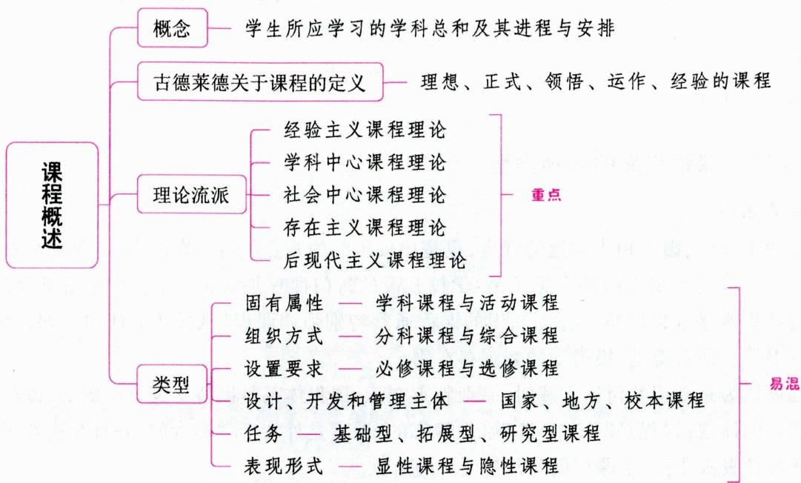

# 一、课程的内涵 ★【单选、多选、判断】

# 考点1 课程的概念

在我国，“课程”一词始见于唐宋期间。在唐代，孔颖达为《诗经·小雅·巧言》中“奕奕寝庙，君子作之”一句注疏：“维护课程，必君子监之，乃得依法制。”这是“课程”一词在汉语文献中的最早显露。宋代朱熹在《朱子全书·论学》中提出“宽着期限，紧着课程”“小立课程，大作功夫”等句，这里的“课程”是指功课及其进程，已与今天日常语言中“课程”的意义极为相近。

在西方, “课程”一词最早出现在英国教育家斯宾塞的《什么知识最有价值》一文中。它由拉丁语派生而来, 意为“跑道”。根据这个词源, 最常见的课程定义是“学习的进程”, 简称学程。(把课程用于教育科学的专门术语, 始于英国教育家斯宾塞)

一般认为，美国学者博比特在1918年出版的《课程》一书，标志着课程作为专门研究领域的诞生，这也是教育史上第一本课程理论专著。他提出了课程研究的“活动分析法”，即通过对人类社会活动的分析，发现社会所需要的知识、技能、能力和态度等，以此作为课程的基础。这种活动分析法为后来盛行的课程开发的目标模式提供了方法论依据。

课程是指学校学生所应学习的学科总和及其进程与安排。广义的课程是指学校为实现培养目标而选择的教育内容及其进程的总和，它包括学校所教的各门学科和有目的、有计划的教育活动。狭义的课程是指某一门学科。

课程涉及教师教什么和学生学什么的问题, 它是学校教育的核心, 是学校培养未来人才的蓝图。课程作为学校教育活动体系的重要方面, 它的核心问题是人的发展问题。课程的一个前提性假设是知识

的教育价值，因而课程理论和课程设计，常常围绕着知识及其获得方式的教育价值的估量、选择和组织而展开。

真题1 [2022河南新乡,单选]( )是学校教育的核心,是学校培养未来人才蓝图的具体表现。

A.课程

B. 教师

C. 学生

D. 学校

真题2 [2023辽宁营口，判断]课程作为学校教育活动体系的重要方面，它的核心问题是人的发展问题。（）

A. 正确

B. 错误

答案：1.A 2.A

# 考点2 课程定义的几种类型

# 1. 课程即知识

这是一种比较早、影响相当深远的观点，也是比较传统的观点。目前在国内，这种课程观仍然最具代表性和广泛性。这种观点的基本思想是：学校开设的每门课程是从相应学科中精心选择的，并且按照学习者的认识水平加以编排。作为知识的课程通常特别强调课程计划（教学计划）、课程标准（教学大纲）、教科书等所谓看得见、摸得到的客观存在物。

当课程被认为是知识并付诸实践时，一般特点在于：课程体系是以科学逻辑组织的，课程是社会选择和社会意志的体现，课程是既定的、先验的、静态的，课程是外在于学习者的，并且是凌驾于学习者之上的——学习者服从课程，在课程面前是接受者的角色。

# 2. 课程即学科（教学科目）

把课程等同于教学科目，在历史上由来已久。无论是中国古代的“六艺”、古希腊的“七艺”，还是近现代的百科全书式课程、功利主义课程等，无不把课程视为所传授的学科，强调课程知识的组织与累积、保存功能。

# 3. 课程即经验

这种观点主要是在对于前一观点的批评和反思基础上出现和形成的。人们提出，实际上，只有那些真正为学生经历、理解和接受了的东西，才称得上是课程，也就是说只有当学生与知识发生了相互作用，知识才可能真正转化为课程。

当课程被认为是经验时,一般特点在于:课程往往是从学习者角度出发和设计的,课程是与学习者个人经验相联系、相结合的,强调学习者作为学习主体的角色。

# 4. 课程即活动

这种观点认为其他关于课程本质的看法都有局限，如：“将课程理解为学科教材，教师容易把握，但也容易导致‘见物不见人’的倾向；把课程理解为学习经验，有利于解决‘教育中无儿童’的问题，但教师又感到迷茫，不知如何操作。走出这种两难困境的唯一办法是：改变传统的非此即彼——要么是主观学习经验，要么是客观学科教材的思维方式，将视角转向二者的交合处——活动，从活动的角度看待和解释课程”。

# 5. 课程即预期的学习结果/目标

一些学者认为，课程不应该指向活动，而应该直接关注预期的学习结果或目标，即要把重点从手段指向目的。这要求课程事先制定一套有结构、有序列的学习目标，所有教学活动都是为达到这些目标服务的。在西方课程理论中相当盛行的课程行为目标，便是一个典型的例子。

真题3 [2024天津河东，多选]当课程被认为是经验时，一般特点在于（）

A.课程体系是以科学逻辑组织的  
B. 课程往往是从学习者的角度出发和设计的  
C. 课程是与学习者的个人经验相联系、相结合的  
D. 强调学习者作为学习主体的角色

答案：BCD

# 考点3 古德莱德关于课程的定义

在古德莱德看来, 人们在谈论课程时, 往往谈的是不同意义上的课程。他认为, 存在着五种不同的课程:

(1)理想的课程,即由一些研究机构、学术团体和课程专家提出的应该开设的课程。  
(2)正式的课程，即由教育行政部门规定的课程计划、课程标准和教材。  
(3)领悟（理解）的课程，即任课教师所领会的课程。  
(4)运作(实行)的课程, 即在课堂上实际实施的课程。  
(5)经验的课程，即学生实际体验到的东西，称作“生定课程”。

真题4 [2023黑龙江哈尔滨，单选]有课程专家提出，应在中小学开设国学课程。按照古德莱德对课程层次的划分，这属于（ ）的课程。

A.领悟

B. 运作

C. 正式

D. 理想

答案：D

# 二、主要课程理论流派 ★★★ 【单选、多选、填空、判断】

# 考点1 经验主义课程理论

经验主义课程理论也可称为儿童中心课程理论、学生中心课程理论、活动课程理论, 以杜威为代表。这种理论认为以学科为中心的传统课程是不足取的, 应代之以儿童的活动为中心的课程。

杜威认为，课程必须与儿童的生活相沟通，应该以儿童为出发点、中心、目的。理想的课程应该促进儿童的生长和发展，这也是衡量课程价值的标准。对于教材的学习，杜威也一反传统的做法，使教材与儿童已经在生活中熟悉和喜欢的活动相互联系。此外，课程的组织应心理学化，应该考虑到儿童心理发展的次序，充分关注儿童现有的经验和能力。

# 考点2 学科中心课程理论

学科中心课程理论也可称为知识中心课程理论，以斯宾塞、赫尔巴特、布鲁纳等人为代表。这种理论主张课程要分科设置，分别从有关科学中选取一定的材料，组成不同学科，分科进行教学。每门学科的教材要根据科学的系统性、连贯性进行编制。这一理论流派的特点是：(1)重视成人生活的分析与准备；(2)重视教材的逻辑组织；(3)强调训练的价值。

表 1-33 学科中心课程理论  

<table><tr><td>具体理论</td><td>代表人物</td><td>主要观点</td></tr><tr><td>结构主义课程理论</td><td>布鲁纳</td><td>(1)该理论以学科结构为课程中心,认为人的学习是认知结构不断改进与完善的过程,因此,学科基本结构的学习对学习者的认知结构发展最有价值。(2)倡导采用螺旋上升的方式编制课程。(3)在课程实施上,倡导发现式学习法,重视培养学习者的直觉思维和独立思考能力</td></tr><tr><td>要素主义课程理论
(传统主义教育/
保守主义教育)</td><td>巴格莱</td><td>(1)课程的目的在于理智和道德训练，促进社会进步与民主，让公民在理智和道德训练中保存人类文化遗产。
(2)课程的内容应该是人类文化的“共同要素”，传授人类种族传递下来的共同经验和文化精神。
(3)关注学科课程和教材的逻辑组织，以学科课程为中心，认为学科课程是向学生提供经验的最佳方法。
(4)注重教师权威下的接受式学习，重视系统知识的传授。
(5)强调制定严格的学业成绩评价标准，让全体学生“按照预定时间表”升学，坚持以严格的学业成绩标准作为课程评价的核心</td></tr><tr><td>永恒主义课程理论</td><td>赫钦斯</td><td>该理论认为课程涉及的第一个根本问题就是为了实现教育目的，什么知识最有价值或如何选择学科。永恒主义对此的回答是：具有理智训练价值的传统的“永恒学科”的价值高于实用学科的价值。“永恒学科”是课程的核心。永恒学科首先是那些经历了许多世纪而达到古典著作水平的书籍</td></tr></table>

# 考点3 社会中心课程理论

社会中心课程理论亦称社会改造主义课程理论，是以适应社会需要为中心编制课程的理论，以布拉梅尔德为代表。

社会中心课程理论认为应该把课程重点放在当代社会的问题、社会的主要功能、学生关心的社会现象以及社会改造与社会活动计划等方面。这种理论认为设计课程要通过对社会问题的分析来确定教育目标,主张打破传统的学科课程界限,但不按学生的活动来组织课程;要兼顾儿童的年龄特征,但不主张以学生的兴趣和动机作为编制课程的基本出发点,而以社会现实问题作为课程设计的核心。其核心观点是:课程不应该帮助学生去适应社会,而是要建立一种新的社会秩序和社会文化。因此,该理论主张学生尽可能多地参与到社会中去,课程应以广泛的社会问题为中心。

# 考点4 存在主义课程理论

存在主义认为，在确定课程的时候，一个重要的前提就是要承认学生本人为他自己的存在负责。换言之，课程最终要由学生的需要来决定。

存在主义课程理论的主要代表人物之一美国学者奈勒认为,不能把教材看作为学生谋求职业做好准备的手段,也不能把它们看作对学生进行心智训练的材料,而应当把它们看作用来作为自我发展和自我实现的手段；不能使学生受教材的支配,而应该使学生成为教材的主宰。

存在主义课程理论重视发掘学生的人生价值,注重学生的情感反应,在反对学科中心主义课程设置的唯智、唯学方面,带来了新鲜空气。它注重以学生为中心,培养学生的自我责任意识,鼓励教师与学生进行精神交流,有利于建立和谐的师生关系。其弊端在于:这种课程理论指导下的课程缺乏系统知识的传授,课程结构破碎且难成体系。这种课程思想也没有制定出详细的客观标准来衡量学生的学业成就,衡量课程的有效性常常依赖于教师和学生的主观评价。

# 考点5 后现代主义课程理论

一些学者从后现代主义理论出发,借助后现代主义提出的新视角和新方法等来考察一系列的课程

问题。在这方面最为著名的是美国学者多尔。

多尔在分析和批判泰勒模式的基础上，把他设想的后现代课程标准概括为“4R”，即丰富性、循环性、关联性和严密性。其中，严密性是“4R”中最重要的。

后现代主义课程理论把知识看作是对动态、变化、开放的自我调节系统的解释，这极大丰富了知识的内涵。它把课程当作一个不断展开的动态过程，重视个体在课程实践中的体验，强调学习者通过理解和对话寻求意义、文化和社会问题。在此基础上，后现代主义课程理论强调教师与学生应通过不断的沟通与对话来探究未知领域，有利于建立平等的师生关系，从而将学生置于主动学习、主动创造的地位。总体来看，后现代主义课程理论是批判大于建设的理论，它本身也呈现出多元化发展的趋势，因此，其本身比较缺乏切实可行的建设性措施来实现它所呼吁和提倡的理念。

真题5 [2024广东广州, 单选]在教育经验交流会上, 王老师认为课程的设置要根据学生的需求来决定, 他认为应当把教材看作自我发展和自我实现的手段, 交由学生进行自由的支配。由此可见, 王老师最认同( )的主张。

A. 经验主义课程论

B.学科中心主义课程论

C. 社会改造主义课程论

D. 存在主义课程论

真题6 [2024四川统考, 单选]小学语文教材中的《小儿垂钓》《村居》《池上》《所见》都是以儿童生活为题材的诗作, 包含了钓鱼、放纸鸢、采莲、骑黄牛等内容。这体现的课程理论是( )

A.教材中心

B. 儿童中心

C. 教师中心

D. 知识中心

真题7 [2023山东济南, 多选]后现代主义课程理论的代表人物多尔在分析和批判泰勒模式的基础上, 提出的后现代课程标准为（）

A. 丰富性

B. 循环性

C. 关联性

D. 严密性

真题8 [2023河北石家庄，判断]学科中心课程论的代表人物有赫尔巴特和斯宾塞。（）

A. 正确

B. 错误

答案：5.D 6.B 7.ABCD 8.A

# 三、课程类型 ★★★ 【单选、多选、填空、判断、名词解释、简答】

# 考点1 学科课程与活动课程

从课程内容的固有属性来划分，课程可分为学科课程与活动课程。

# 1.学科课程

学科课程是指以文化知识(科学、道德、艺术)为基础，按照一定的价值标准，从不同的知识领域或学术领域选择一定的内容，根据知识的逻辑体系，将所选出的知识组织为学科的课程类型。它是最古老、使用范围最广泛的课程类型。其主导价值在于传承人类文明，强调使学生掌握、传递和发展人类积累下来的文化遗产。我国古代的“六艺”古希腊的“七艺”和“武士七艺”都可以说是最早的学科课程。此外，近代以来，夸美纽斯所倡导的“泛智课程”，赫尔巴特根据人的“六种兴趣”设置的课程，斯宾塞根据功利主义原则设置的课程，也都属于学科课程。

# (1)学科课程的基本特点

① 分科设置；② 课程内容按学科知识的逻辑结构来选择和安排，重视学科内容的内在联系；③ 强调教师的系统讲授。

# (2)学科课程的优点

①从社会发展角度讲,有助于文化遗产的系统传承; ②从学生角度讲,有助于学生全面、准确地了解该领域的发展状况, 实现智力的充分发展; ③从教学角度讲, 学科课程的教学活动容易组织, 也容易评价, 便于提高教学效率; ④从国家角度讲, 在保证尖端人才的培养和促进国家科学技术的发展方面具有不可替代的基础作用。

# (3)学科课程的缺点

①从学生发展角度讲，过多考虑知识的逻辑和体系，不能完全照顾学生的需要和兴趣；②从课程本身角度讲，与现实生活存在较远距离，缺乏活力，造成学习内容的凝固化；③从教师教学角度讲，容易导致偏重知识授受的倾向，不利于学生全面和富有个性的发展。

# 2. 活动课程

活动课程亦称经验课程，是指围绕着学生的需要和兴趣、以活动为组织方式的课程形态，即以学生的主体性活动经验为中心组织的课程。活动课程以开发与培育主体内在的、内发的价值为目标，旨在培养具有丰富个性的主体。学生的兴趣、动机、经验是活动课程的基本内容。其主导价值在于使学生获得关于现实世界的直接经验和真切体验。最早提出活动课程思想的是法国的卢梭，他主张儿童应在大自然中，通过身体锻炼、劳动、自我活动和观察事物来学习。杜威是活动课程的主要代表人物。

# (1)活动课程的特点

①重视儿童的兴趣、需要、能力和阅历,以及儿童在学习中的自我指导作用与内在动力;②注重引导儿童从做中学,通过探究、交往、合作等活动使学生的经验得到改组与改造,智能与品德得到养成与提高;③强调解决问题的动态活动的过程,注重教学活动过程的灵活性、综合性、形成性,因人而异的弹性,以及把课程资源作为解决问题的工具,反对预先确定目标的观念。

# (2)活动课程的局限性

① 活动课程以学习者的经验为中心来组织,容易导致学科知识的支离破碎,学生难以掌握完整系统的学科知识体系；

②活动课程以学习者的活动为中心，但学习者的活动具有多种性质，并非所有的活动都有教育价值，也并非所有的活动都能带来同样的教育价值，因此活动课程在实施中容易导致“活动主义”，为活动而活动，如果把握不当，会极大地影响教学效率和教育质量；

③ 活动课程在课程实施中对教师的教学组织能力以及相关教学设施提出了较高要求，它要求教师具有相当高的专业素养和教育艺术素养，在师资条件不具备的情况下，活动课程的实施具有一定的风险性。

活动课程与学科课程的关系,实际上反映的是人的直接经验与间接经验、个人知识与公共知识、儿童当下的心理经验与凝结在学科中的逻辑经验之间的关系,也从一个侧面反映了成人学习方式与儿童学习方式的分歧与差异。

# 考点2 分科课程与综合课程

从课程内容的组织方式来划分，课程可分为分科课程与综合课程。

# 1. 分科课程

分科课程是根据学校教育目标、教学规律和一定年龄阶段的学生发展水平，分别从各门科学中选择部分内容，组成各种不同的学科，彼此分立地安排它们的教学顺序、教学时数和期限。其主导价值在于使学生获得逻辑严密和条理清晰的文化知识，但是容易带来科目过多、分科过细的问题。

# 2. 综合课程

综合课程是指采用各种有机整合的形式，使学校教学系统中分化的各种要素及各成分之间形成有机联系的课程形态。简单来说，综合课程就是指打破传统的分科课程的知识领域，组合两门或两门以上学科领域而构成的一门学科。其主导价值在于通过相关学科的整合，促进学生认识的整体性发展并形成把握和解决问题的全面视野与方法。

# (1) 综合课程的形式

“相关课程”“融合课程”“广域课程”“核心课程”都是综合课程的形式，只不过综合的程度以及设计的思路略有差异。

表 1-34 综合课程的形式  

<table><tr><td>类型</td><td>内涵</td></tr><tr><td>相关课程</td><td>在保留原来学科的独立性基础上，寻找两个或多个学科之间的共同点，使这些学科的教学顺序能够相互照应、相互联系、穿插进行</td></tr><tr><td>融合课程</td><td>把有内在联系的学科的内容融合在一起而形成一门新的学科。例如，把动物学、植物学、微生物学、生理学、解剖学、遗传学融合为生物学</td></tr><tr><td>广域课程</td><td>合并数门相邻学科的内容形成的综合课程，在范围上比融合课程要大。例如，有的国家把地理、历史综合形成“社会研究”课程；把物理、化学、生物、生态、生理、实用技术综合成“综合自然科学”</td></tr><tr><td>核心课程</td><td>以问题为核心，将几门学科结合起来的课程。例如，以人类生存、环境保护、交通运输、社会组织与管理、娱乐和审美活动等人类的基本活动为主题设计的课程</td></tr></table>

# (2)综合课程的优缺点

优点：①打破学科界限，有利于培养学生对事物的整体认识能力；②减少了课程的门类，有利于减轻学生的负担；③从生活、社会的实际出发，具有较强的实践性，有利于培养学生分析解决问题的能力和动手能力。

缺点：①教科书的编写较为困难，只专不博的教师很难胜任综合课程的教学，教学具有一定的难度；②难以向学生提供系统完整的专业理论知识，不利于高级专业化人才的培养。

# 考点3 必修课程与选修课程

从课程设置的要求,或对学生学习的要求,或学生选课的自主性来划分,课程可分为必修课程与选修课程。

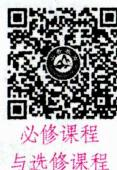

# 1.必修课程

必修课程是根据人的发展和社会发展需要制定的，所有学生都必须学习的科目。它是个体社会化的基础，其主导价值在于培养和发展学生的共性。就我国现阶段基础教育课程现状而言，必修课程一般包括国家课程和地方课程。

# 2. 选修课程

选修课程是针对必修课程的不足之处提出来的，是为发展学生的兴趣、爱好和个性特长而开设的课程。

# 3.必修课程与选修课程的关系

必修课程与选修课程是相辅相成、相互作用的有机统一体。选修课程是致力于“个性发展”的课程,所以选修课程的设立应突出基础性、新颖性、实用性和独创性的结合。选修课程与必修课程具有等价性,即二者拥有同等的价值,不存在主次关系,选修课程不是必修课程的附庸或陪衬,不是随意的、散

漫的、浅尝辄止的学习就可应付的课程,而是有共同标准的评估来保证其学习的有效性的课程。总的来说,必修课程与选修课程之间的关系实质上是共性发展(一般发展)与个性发展的关系。

# 考点4 国家课程、地方课程与校本课程

从课程设计、开发和管理主体来看，可将课程分为国家课程、地方课程与校本(学校)课程。

# 1.国家课程

国家课程，亦称“国家统一课程”，它是自上而下由中央政府负责编制、实施和评价的课程，具有权威性、多样性和强制性等特征。也可以说国家课程是国家专门为培养社会需要的合格公民而设计的，并依据公民的身心发展水平和接受教育之后所要达到的共同素质而开发的课程。

国家课程的主导价值在于通过课程体现国家的教育意志。

# 2. 地方课程

地方课程是地方教育行政部门以国家课程为基础，依据当地的政治、经济、文化、民族等发展的需要而开发设计的课程。它是一种为突出地方特色与地方文化，满足地方发展需要而设置的课程，具有区域性、本土性的特点。

地方课程的主导价值在于通过课程满足地方社会发展的现实需要。

# 3. 校本课程

校本课程即学校课程,是学校在确保国家课程和地方课程有效实施的前提下,针对学生的兴趣和需要,结合学校的传统和优势以及办学理念,充分利用学校和社区的课程资源,自主开发或选用的课程。它是以学校为课程编制主体,自主开发与实施的一种课程,是相对于国家课程和地方课程的一种课程。也可以说校本课程是指由学生所在学校的教师编制、实施和评价的课程。

校本课程的类型可以从两个维度划分：一是从校本课程的形式来看，包括筛选已有的课程、改编已有的课程和开发全新的校本课程；二是从学校教师参与校本课程的形式来看，包括个别教师参与的校本课程、部分教师参与的校本课程和全体教师参与的校本课程。

校本课程的主导价值在于通过课程展示学校的办学宗旨和特色，提升学校的办学水平，促进学生的个性发展。

# 考点5 基础型课程、拓展型课程与研究型课程

根据课程任务，可将课程分为基础型课程、拓展型课程与研究型课程。

# 1.基础型课程

基础型课程注重培养学生的基础学力，注重学生对科学文化基础知识和基本技能的掌握，同时获得智力的发展和能力的培养，即培养学生作为一个公民所必需的以“三基”（读、写、算）为中心的基础教养，是中小学课程的主要组成部分。基础型课程是必修的、共同的课程。

# 2. 拓展型课程

拓展型课程注重拓展学生的知识和能力，开阔学生的知识视野，发展学生各种不同的特殊能力，并迁移到其他方面的学习。拓展型课程常常以选修课的形式出现。

# 3. 研究型课程

研究型课程注重培养学生的探究态度和能力。

# 考点6 显性课程与隐性课程

从课程的表现形式或者说影响学生的方式来划分，课程可分为显性课程与隐性课程。

# 1. 显性课程

显性课程亦称公开课程，是指在学校情境中以直接的、明显的方式呈现的课程。

显性课程的特点是：(1)它是有目的、有计划、有组织的学习活动。计划性是显性课程的主要特征，也是区分显性课程与隐性课程的主要标志。(2)学生参与这类课程是有意识的。

# 2. 隐性课程

隐性课程亦称潜在课程、自发课程、隐蔽课程、无形课程、非正式课程、非官方课程，是学校情境中以间接的、内隐的方式呈现的课程。它不在课程计划中反映，不通过正式的教学进行，对学生的知识、情感、意志、行为和价值观等方面起潜移默化的作用，促进或干扰教育目标的实现。

(1)隐性课程的特点

① 隐蔽性。隐性课程不像显性课程那样通过正式的教学来进行, 而是潜伏在显性课程之后, 通过间接的、内隐的、潜移默化的方式对学生产生影响。  
②非预期性。隐性课程中并不是任何一个要素、一个细节的教育影响事先都能估计到。  
③两重性。隐性课程既能对学生施以积极的影响，又能对学生施以消极的影响。  
④弥散性。隐性课程无所不在，只要存在教育，就必然存在隐性课程的影响。  
⑤持久性。隐性课程的影响是潜移默化的，一经确立，就会持久地影响学生的心理与行为。

(2)隐性课程的产生与发展

在历史上,最早涉及隐性课程研究的学者,可能要推到杜威及其学生克伯屈。

早在20世纪初, 杜威就曾指出: “有一种意见认为, 一个人所学习的仅是他当时正在学习的特定的东西, 这也许是所有教育学中最大的错误了。”由此, 杜威将与具体知识内容的学习相伴随的, 对所学内容及学习本身养成的某种情感、态度的学习称为“附带学习(连带学习)”。例如, 一个儿童在学习数学时, 养成对待数学学习的某种态度 (如喜欢不喜欢) 即附带学习。杜威强调, 附带学习可能比正式学习来得更为根本、更为重要。

随后，克伯屈进一步发展了杜威的思想。他认为任何一种学习都包含三个部分：①“主学习”，指对事物的直接学习；②“副学习”，这是一种伴随“主学习”而来的关联学习；③“附学习”，指伴随“主学习”而来的有关情感、态度的学习。以儿童学做裙子为例：学习如何下料、裁剪、缝纫，这属于主学习；在做裙子时，考虑裙子耐洗不耐洗、褪色不褪色等问题，这属于副学习；通过学做裙子，懂得做事“仔细”的好处，这是附学习。

后人认为，杜威的“附带学习”与克伯屈的“附学习”已涉及隐性课程的问题。而“隐性课程”一词是由杰克逊在1968年出版的《班级生活》一书中首先提出来的。

(3)隐性课程的主要表现形式

①观念性隐性课程，包括隐藏于显性课程之中的意识形态，学校的校风、学风，有关领导与教师的教育理念、价值观、知识观、教学风格、教学指导思想等。  
② 物质性隐性课程，包括学校建筑、教室的设置、校园环境等。  
③ 制度性隐性课程，包括学校管理体制、学校组织机构、班级管理方式、班级运行方式。  
④心理性隐性课程，主要包括学校人际关系状况，师生特有的心态、行为方式等。

# 3. 显性课程与隐性课程的关系

显性课程与隐性课程不是二元对立的，二者互动互补、相互作用，在一定的条件下，二者可以相互转化。显性课程与隐性课程的区别在于：

(1)学习的计划性。显性课程是有计划、有组织的学习活动，学生有意参与活动的成分很大；隐性课程是无计划的、无组织的学习活动，学生在学习活动中主要获得的是隐含于课程中的经验。  
(2)学习的环境。显性课程主要通过课堂教学获得知识和技能；隐性课程主要通过学校环境（包括物质环境和文化环境等）得到知识、态度和价值观。  
(3)学生的学习结果。学生在显性课程中获得的主要是预期性的学术知识; 在隐性课程中, 学生获取的主要是非预期性的东西。

关于课程的分类，还有许多维度。例如：(1)从课程功能的角度，课程可分为工具性课程、知识性课程、技能性课程、实践性课程；(2)从课程的组织核心角度，课程可分为学科中心课程、学生中心课程、社会中心课程；(3)根据课程主要是传授科学知识还是操作技能，课程可分为理论型课程和实践型课程；等等。

真题9 [2024河北石家庄,单选]人们将课程分为分科课程与综合课程，是按照( )来划分的。

A.课程内容的固有属性

B. 课程对学生学习的要求

C. 课程内容的组织方式

D. 课程的表现形式

真题10 [2024四川统考, 单选]某小学紧邻省历史博物馆, 馆内有大量西周时期的青铜器。该校自主开发和实施了《青铜器上的汉字》这门课程。这属于( )

A. 地方课程

B. 校本课程

C. 学科课程

D. 隐性课程

真题11 [2024广东佛山, 单选]隐性课程不像显性课程那样通过正式的教学来进行, 而是潜伏在显性课程之后, 通过间接的、内隐的、潜移默化的方式对学生产生影响。这体现了隐性课程的特点。

A. 隐蔽性

B. 预期性

C. 弥散性

D. 短暂性

真题12 [2024安徽合肥/淮北/铜陵，判断]必修课程与选修课程的实质是学生“一般发展”与“个性发展”之间的关系。（）

答案：9.C 10.B 11.A 12.√

# 四、制约课程的主要因素

(1)一定历史时期社会发展的要求及提供的可能（社会需求）；  
(2)一定时代人类文化及科学技术发展水平(学科知识水平)；  
(3)学生的年龄特征、知识与技能的基础及其可接受性（学习者身心发展的需求）。

此外，课程理论也是制约课程的因素。

总的来说,社会、知识、儿童是制约学校课程的三大因素。

# ★本节核心考点回顾 ★

# 1. 经验主义课程理论

(1)别称：儿童中心课程理论、学生中心课程理论、活动课程理论。  
(2)代表人物：杜威。  
(3)观点：以学科为中心的传统课程是不足取的，应代之以儿童的活动为中心的课程。

# 2.必修课程与选修课程

从课程设置的要求，或对学生学习的要求，或学生选课的自主性来划分，课程可分为必修课程与选修课程。

(1)必修课程：主导价值在于培养和发展学生的共性。  
(2)选修课程：为发展学生的兴趣、爱好和个性特长而开设的课程。

# 3. 国家课程、地方课程与校本课程

从课程设计、开发和管理主体来看，可将课程分为国家课程、地方课程与校本(学校)课程。

(1)国家课程：具有权威性、多样性和强制性等特征。  
(2)地方课程：主导价值在于通过课程满足地方社会发展的现实需要。  
(3) 校本课程: 主导价值在于通过课程展示学校的办学宗旨和特色, 提升学校的办学水平, 促进学生的个性发展。

# 4. 显性课程与隐性课程

从课程的表现形式或者说影响学生的方式来划分，课程可分为显性课程与隐性课程。

(1)显性课程：在学校情境中以直接的、明显的方式呈现的课程。  
(2)隐性课程: 在学校情境中以间接的、内隐的方式呈现的课程。  
(3)显性课程与隐性课程的区别：①学习的计划性；②学习的环境；③学生的学习结果。

# 第二节 课程开发

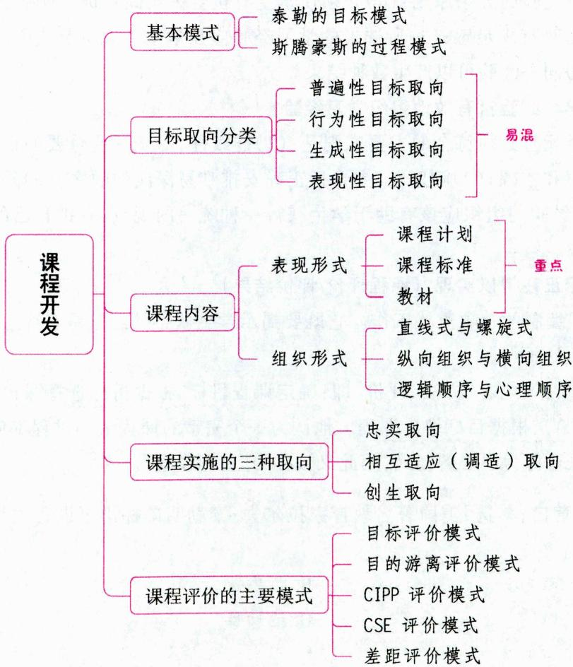

# 一、课程开发的概念

课程开发，也称为课程编制，是课程研究领域的一个重要概念。关于课程开发一词的含义目前仍然存在不同见解，这里我们采用我国课程论学者施良方先生的观点：课程开发是指完成一项课程计划的整个过程，它包括确定课程目标、选择和组织课程内容、实施课程和评价课程等阶段。

# 二、课程开发的基本模式 ★【单选、多选】

课程开发的基本模式包括目标模式、过程模式、情境模式等，这里主要介绍泰勒的目标模式与斯腾豪斯的过程模式。

# 考点 泰勒的目标模式

目标模式是伴随20世纪初的课程开发科学化运动而产生的，是课程开发的经典模式，其主要代表人物是泰勒。目标模式是以目标为课程开发的基础和核心，围绕课程目标的确定、实现和评价等环节进行课程开发的模式。

泰勒于1949年出版了被誉为“现代课程理论圣经”的《课程与教学的基本原理》，提出了关于课程编制的四个问题。

1. 学校应当追求哪些目标？（学校应当追求的目标）

泰勒认为应根据学习者本身的需要、当代校外生活的要求以及专家的建议三方面来提出目标。

2. 怎样选择和形成学习经验？（选择和形成学习经验）

泰勒提出了选择学习经验的五条原则：(1)必须使学生有机会去实践目标中所包含的行为；(2)必须使学生在实践上述行为时有满足感；(3)所选择的学习经验应在学生能力所及范围内；(4)多种经验可用来达到同一目标；(5)同一经验可以产生数种结果。

3. 怎样有效地组织学习经验？（有效地组织学习经验）

泰勒认为组织学习经验时必须符合的主要准则是：(1)连续性，对于一些重要的目标，要让学生有机会反复涉及以便于理解和掌握；(2)顺序性，主要指正确安排难易深浅的顺序；(3)整合性，指课程经验之间的横向联系，这些经验的组织应该有助于学生获得一种统一的观点，并把自己的行为与所学习的课程要素有机统一起来。

4. 如何确定这些目标正在得以实现？（课程评价/评价结果）

泰勒认为评价是课程编制的一项重要工作。它既要揭示学生获得的经验是否产生了满意的结果，又要发现各种计划的长处与弱点。

泰勒原理可概括为：目标、内容、方法、评价，即：确定课程目标、根据目标选择课程内容（经验）、根据目标组织课程内容（经验）、根据目标评价课程。他认为一个完整的课程编制过程都应包括这四项活动。泰勒原理的实质是以目标为中心的模式，因此又被称为“目标模式”。

真题1 [2022辽宁营口，多选]美国著名教育家拉尔夫·泰勒明确提出了课程内容组织的三条原则，包括（）

A. 连续性

B. 顺序性

C. 整合性

D. 适切性

答案：ABC

# 考点2 斯腾豪斯的过程模式

针对目标模式过分强调预期行为结果即“目标”而忽视“过程”的缺陷，英国课程论专家斯腾豪斯提出了“过程模式”。过程模式的思想渊源可以追溯到卢梭及以后兴起的进步主义教育运动。所谓过程模式是指，课程的开发不是为了生产出一套“计划”，然后予以实施和评价的过程，而是一个连续不断的研究过程，并贯穿着对整个过程的评价和修正。而所有这些都集中在课堂实践中，教师是整个过程的核心人物。

真题2 [2023黑龙江哈尔滨，单选]课程开发的过程模式的思想渊源可以追溯到（）

A. 卢梭

B. 斯腾豪斯

C. 皮亚杰

D. 布鲁纳

答案：A

# 三、课程目标

# 考点1 课程目标的内涵

课程目标是根据教育宗旨和教育规律而提出的具体价值和任务指标，是课程本身要实现的具体目标和意图。它是确定课程内容、教学目标和教学方法的基础，是整个课程编制过程中最为关键的准则。它直接受教育目的、培养目标的影响，是培养目标的分解，是师生行动的依据。

# 考点2 课程目标的体系 ★【单选、判断】

一般来说，完整的课程目标体系包括以下三类：

（1）结果性目标，即明确告诉人们学生的学习结果是什么，在设计时所采用的行为动词要求具体明确、可观测、可量化，主要应用于“知识”领域。  
(2)体验性目标,即描述学生自己的心理感受、情绪体验应达成的目标,它在设计中所采用的行为动词往往是历时性的、过程性的,主要应用于各种“过程”领域。  
(3)表现性目标,即明确安排学生各种各样的个性化的发展机会和发展程度,它在设计中所采用的行为动词通常是与学生表现内容有关,或者结果是开放性的,主要适用于各种“制作”领域。

真题3 [2023辽宁营口，单选]所谓体验性目标，即描述学生自己的心理感受、情绪体验应达成的标准。它在设计中所采用的行为动词往往是（）

A. 过程性的

B. 明确性的

C. 开放性的

D. 可量化的

答案：A

# 考点 3·课程目标的特征

(1)整体性。各级各类的课程目标是相互关联的，而不是彼此孤立的。  
(2)阶段性。课程目标是一个多层次和全方位的系统，如小学课程目标、初中课程目标、高中课程目标。  
(3)持续性。高年级课程目标是低年级课程目标的延续和深化。  
(4)层次性。课程目标可以逐步分解为总目标和从属目标。

(5) 递进性。低年级课程目标是高年级课程目标的基础, 没有低年级课程目标的实现, 就难以达到高年级的课程目标。

(6)时间性。随着时间的推移，课程目标会有相应的调整。

# 考点4 课程目标确定的环节 ★【多选】

(1)确定教育目的和培养目标；(2)确定课程目标的基本来源；(3)确定课程目标的基本取向；(4)确定课程目标。

真题4 [2024安徽统考,多选]课程目标的确定需要经历一系列环节,其主要环节包括( )

A. 确定教育目的和培养目标

B. 确定课程目标的基本来源

C. 确定课程目标的基本取向

D. 确定课程目标

答案：ABCD

# 考点5 课程目标取向的分类 ★★ 【单选、判断】

# 1. 普遍性目标取向

普遍性目标是根据一定的哲学或伦理观、意识形态、社会政治需要,对课程进行总括性和原则性规范与指导的目标,一般表现为对课程有较大影响的教育宗旨或教育目的。它对各门学科都有普遍的指导价值。《大学》提出的“格物、致知、诚意、正心、修身、齐家、治国、平天下”的教育宗旨,即为典型的普遍性目标。

# 2.行为性目标取向

行为性目标是期待的学生的学习结果,具有导向、控制、激励与评价功能。行为性目标具体、明确,便于操作、评价,有助于教师理解教学任务,有效控制教学过程,对学习以训练知识、技能为主的课程内容较为适合。但行为性目标只关注学习活动的外显结果,却忽视了学习过程以及隐性课程对学生的影响,因此不能全面、客观地描述和引导课程与教学活动,有可能导致学习过程与学习结果的分离甚至对立,以及形成机械训练的教学方式。

# 3.生成性目标取向

生成性目标的提出萌芽于杜威“教育即生长”的命题。生成性目标不是由外部事先规定的目标，而是在教育情境之中随着教育过程的展开而自然生成的目标。它关注的是学习活动的过程，强调目标的适应性、生成性。生成性目标的优点是强调在教育过程中学生通过与教育情境的交互作用产生了属于自己的目标，这并不是教育者代表社会所强加给学生的。学生有权利自己去选择要学的东西，同时，教师也从目标中被解放出来而成为研究者，师生的主动性都得到调动与发挥，学生的主体地位也得到实现。这种目标取向消解了行为性目标取向所存在的过程与结果、手段与目的之间的分离与对立，但对教师的素质要求较高，需要教师领悟课程甚至教育的不同含义，并需要进行专门的教育培训，也可能会导致课程教学过于开放，从而忽略一些基本课程目标的实现。

# 4. 表现性目标取向

表现性目标是美国学者艾斯纳提出的一种目标取向，是指在教育情境的种种遭遇中每一个学生个性化的创造性表现，也是生成性目标的进一步发展。它关注学生的创造精神、批判思维，适合以学生活动为主的课程安排。艾斯纳给出了表现性目标的例证：解释《失乐园》的意义；审视与欣赏《老人与海》

的重要意义;在一个星期里读完《红与黑》,讨论时列出你印象最深的五件事情;通过使用铁丝与木头发展三维形式;参观动物园并讨论那里有趣的事情。

真题5 [2024天津河东，单选]《大学》提出的“修身、齐家、治国、平天下”的教育宗旨，属于课程目标中的（）

A.生成性目标

B.行为性目标

C. 表现性目标

D. 普遍性目标

真题6 [2023辽宁锦州, 单选] 李老师要求班上所有学生在一个星期内读完《红与黑》, 然后进行讨论, 讨论时列出自己印象最深刻的五件事情。这种课程目标属于( )

A. 普遍性目标

B.行为性目标

C. 表现性目标

D. 生成性目标

真题7 [2023安徽统考，判断]由于行为目标具有精确性、具体性和可操作性的特点，因此在确定课程目标取向时，都应该选择行为目标。（）

答案：5.D 6.C 7.X

# 考点6 确定课程目标的依据 ★【单选】

# 1.学习者的需要（对学生的研究）

课程的价值在于促进学习者的身心发展，因此，学习者的需要是确定课程目标的基本依据。对学生的研究，就是要找出教育者期望在学生身上所要达到的预期结果。它通常包括三方面内容：(1)了解学生身心发展的现状，并把它与理想的常模加以比较，确认其中存在的差距；(2)了解学生个体的需要；(3)了解学生的兴趣和个性差异。

# 2. 当代社会生活的需求（对社会的研究）

学校课程要反映社会政治、经济、文化发展的需求。当代社会生活的需求是课程目标的基本来源之一。20世纪以来课程理论的研究表明，从当代社会生活的研究中确定课程目标，至少需要坚持三条原则。

(1)公平与民主的原则。在将社会生活的需求确定为课程目标的时候,需要考虑各阶层的需要,不能仅仅考虑社会优势阶层的需求,忽略社会不利阶层的需求。  
(2)共性与个性统整的原则。课程目标的确定要在本社区、本民族、本国家的需求与发展, 乃至整个人类社会的需求与发展之中寻求平衡与统一, 必须具有国际意识与国际视野。  
(3)适切与超越的原则。当今觉醒的教育不再只是社会的附庸,被动地适应着社会的需要,不再只是维持和复制现有的社会状态,而是蕴涵着对现存社会的批判和改造,正在为一个尚未存在的即将到来的社会培养新人,预示着某些新的社会状态。

因此，从当代社会生活的研究中确定课程目标，不仅仅是反映当下社会的需求与特点，更主要的是反映社会的未来发展趋势。

# 3.学科知识及其发展（对学科的研究）

课程内容来源于一些主要学科的知识，因而课程目标的实现必须要以学科为依托，即在确定课程目标的过程中首先要考虑学科本身的功能。学科知识及其发展是课程目标的基本来源之一。

真题8 [2022河南郑州, 单选] 当今教育不再只是被动地适应着社会的需要, 不再只是维持和复制现有的社会状态, 而是蕴涵着对现存社会的批判和改造, 正在为一个尚未存在的即将到来的社会培

养新人，预示着某些新的社会状态。这要求确定课程目标应坚持（）

A. 适切与超越原则

B. 公平与民主原则

C. 预测与发展原则

D. 共性与个性统整原则

答案：A

考点 三维课程目标 ★ 【单选、判断】

新课程背景下的课堂教学，要求根据各学科教学的任务和学生的需求，从知识与技能、过程与方法、情感态度与价值观三个维度出发设计课程目标。

(1)“知识与技能”目标是基础性目标，重在智能的提升，强调基础知识和基本技能的获得，相当于传统的“双基教学”。  
(2)“过程与方法”目标是关键性目标, 强调让学生“学会学习”, 使学生在获得知识的同时也获得学习方法和能力发展。它是知识与技能目标、情感态度与价值观目标达成的途径。  
(3)“情感态度与价值观”目标是终极性目标,重在人格塑造,强调在教学过程中激发学生的情感共鸣,引起积极的态度体验,形成正确的价值观。

# 小香课堂·

2022年，教育部印发了新修订的义务教育课程方案和语文等16个课程标准。此次课标修订，力求使课程目标自觉体现本课程在培育学生核心素养方面的基本贡献，结合本课程的性质、理念及课程的基本内容，从核心素养视角对课程总目标及学段目标进行表述。例如，《义务教育语文课程标准（2022年版）》中规定，“语文课程围绕核心素养，体现课程性质，反映课程理念，确立课程目标”“义务教育语文课程培养的核心素养，是学生在积极的语文实践活动中积累、建构并在真实的语言运用情境中表现出来的，是文化自信和语言运用、思维能力、审美创造的综合体现”。

随着《义务教育课程方案和课程标准（2022年版）》的实施，教师在进行教学目标设计时，除了要从知识与技能、过程与方法、情感态度与价值观三个维度出发外，还要关注各学科课程的核心素养目标。

# 四、课程内容

考点1 课程内容的含义 ★【名词解释】

课程内容是课程的核心要素，从总体上讲，课程内容是根据课程目标，有目的地选择的一系列直接经验和间接经验的总和，是从人类的经验体系中选择出来，并按照一定的逻辑序列组织编排而成的知识体系和经验体系。

课程内容的基本性质是知识，它具有直接经验和间接经验两种形态。任何形式的课程都必须包括一定的直接经验和间接经验。由于课程性质的不同，有的课程甚至以引导学生获取直接经验为主，如活动课程。间接经验即理论化、系统化的书本知识，它是人类认识的基本成果，间接经验具体包括在各种形式的科学中。

真题9 [2023河南郑州，名词解释]课程内容

答案：详见内文

# 考点2 课程内容的三种表现形式 ★★★【单选、多选、判断、辨析】

课程计划、课程标准、教材是课程文本的一般表现形式，也是我国中小学课程的主要组成部分。

1992年，原国家教委在制订九年义务教育的教学计划时，把“教学计划”更名为“课程计划”。指导我国这次课程改革的《基础教育课程改革纲要(试行)》采用“课程计划”这一术语，把原来用的“教学大纲”改称为“课程标准”。

# 1. 课程计划

# （1）课程计划的概念

课程计划是根据一定的教育目的和培养目标，由教育行政部门制定的有关学校教育和教学工作的指导性文件。课程计划主要由课程计划的指导思想、培养目标、课程设置及其说明、课时安排、课程开设顺序和时间分配、考试考查制度和实施要求几部分构成。在基本内容上，课程计划主要是指教学科目的设置（课程设置）、学科顺序（课程开设顺序）、课时分配（教学时数）、学年编制和学周安排。其中，开设哪些科目（课程设置）是课程计划的中心和首要问题。

# (2) 课程计划的设计原则

①整体性，即在制订课程计划时要整体安排，不能只抓某个或某几个方面。  
②基础性，即制订课程计划时，要保证学生在学校里学到最为基本的内容，能够为其以后的学习或就业奠定基础。  
③开放性，即制订课程计划时，应充分考虑社会、学校、学生等条件的复杂性，给课程计划的执行者一定的自主空间，保证他们能够开放地、灵活地落实具体的课程计划。

# (3) 义务教育阶段课程计划的特点

义务教育阶段的课程计划具有强制性、普遍性、基础性的特点。

# 2.课程标准

# (1)课程标准的概念

课程标准是课程计划中每门学科以纲要的形式编写的、有关学科教学内容的指导性文件，是课程计划的分学科展开。它规定了学科的教学目标、任务，知识的范围、深度和结构，教学进度以及有关教学方法的基本要求，是编写教科书和教师进行教学的直接依据，也是衡量各科教学质量的重要标准。也可以说，课程标准是国家课程计划的具体化，是国家对相应课程的基本规范和质量要求，是国家教育行政部门制定的某一学科或学习领域的课程纲领性文件。

教育部于2001年印发的《基础教育课程改革纲要(试行)》指出，国家课程标准是教材编写、教学、评估和考试命题的依据，是国家管理和评价课程的基础。应体现国家对不同阶段的学生在知识与技能、过程与方法、情感态度与价值观等方面的基本要求，规定各门课程的性质、目标、内容框架，提出教学和评价建议。

教育部先后于2001年和2011年颁布了义务教育课程方案和课程标准。从所颁布的各科课程标准来看，完整的课程标准一般由说明（或前言）、课程目标、课程内容标准、课程实施建议、附录（无法概括到课程标准中的内容，如术语解释）五部分组成。其中，说明部分是统率课程标准的指导思想，课程目标、内容标准和实施建议是课程标准的主体。

教育部于2022年印发的《义务教育课程方案》指出，国家课程标准规定课程性质、课程理念、课程目标、课程内容、学业质量和课程实施等，是教材编写、教学、考试评价以及课程实施管理的直接依据。

# (2)课程标准设计的原则

①课程标准关注的对象是学生，是对学生学习行为的要求；  
②课程标准涉及的范围是学生综合的发展领域，如指出是“知识与技能、过程与方法和态度的规定”；  
③课程标准的要求是所有学生基本要达到的要求，而非最高要求；  
(4)课程标准的目的是促进学生更好地发展,而不仅仅是应付某一事件;  
⑤教师是“用教科书教，而不是教教科书”，这句话隐含着教师不是教科书的执行者，而是教学方案（课程）的开发者。

# (3)课程标准的功能

由于课程标准规定的是国家对国民在某方面或某领域的基本素质要求，因此，它毫无疑问地对教材、教学和评价具有重要指导意义，是教材、教学和评价的出发点与归宿。课程标准中规定的基本素质要求是教材、教学和评价的灵魂，也是整个基础教育课程的灵魂。

但是，课程标准是教材、教学和评价的基本依据，并不等于课程标准是对教材、教学和评价方方面面的具体规定。课程标准对教材编制、教学设计和评价过程中的具体问题（如教材编写体系、教学顺序安排及课时分配、评价的具体方法等）不做硬性的规定。

# 小香课堂

随着时代的发展、国家教育改革的推进，课程标准也在不断地更新。考生在学习这部分内容时，不仅要掌握旧的课程标准的规定，也要了解新的课程标准的规定。

# 3.教材

# (1)教材的概念

教材是根据学科课程标准编制的、系统反映学科内容的教学用书,它是知识授受活动的主要信息媒介,是课程标准的进一步展开和具体化,也是课程标准最主要的载体。

表 1-35 教材的类型与主体  

<table><tr><td rowspan="2">类型</td><td>印刷品:教科书、教学指导用书、补充读物、图表等</td></tr><tr><td>音像制品:幻灯片、电影片、录音带、录像带、磁盘、光盘等</td></tr><tr><td>主体</td><td>说法一:教科书是教材的主体
说法二:教科书和讲义是教材的主体</td></tr></table>

新课程将教材视为“跳板”而非“圣经”，倡导教师“用教材教”，而不是简单地“教教材”。新的课程计划和课程标准为教学活动预留了充分的空间，视教材为案例，开放教材，鼓励教师充实并超越教材。教师完全可以而且应该根据学生的情况来处理教材。

# (2)教科书

教科书是依据课程标准编制的教学规范用书。教科书一般由目录、课文、习题、实验、图表、注释、附录等部分构成。课文是教科书的主体部分。

# ①教科书的作用

第一,教科书是学生在学校获得系统知识、进行学习的主要材料,它可以帮助学生掌握教师教授的内容;同时,也便于学生预习、复习和做作业。教科书是学生进一步扩大知识领域的基础。

第二，教科书是教师进行教学的主要依据，它为教师的备课、上课、布置作业、学生学习成绩的检查

评定提供了基本材料。熟练地掌握教科书内容是教师顺利完成教学任务的重要条件。

第三，根据教学计划对本学科的要求，分析本学科的教学目标、内容范围和教学任务。

第四，根据本学科在整个学校课程中的地位，研究本学科与其他学科的关系。

②教科书编写应遵循的基本原则与要求

科学性与思想性统一；强调内容的基础性与适用性；知识的内在逻辑与教学法要求的统一；理论与实践统一；教科书的编排形式要有利于学生的学习；注意与其他学科的纵向和横向联系。

(3)中小学教材设计的一般原则

①方向性原则。其含义包括：教材要遵循有中国特色的社会主义现代化发展方向；遵循当前我国的教育思想；遵循课程方案和课程标准的方向；遵守国家关于民族和宗教的政策方针；遵守国际关系准则；不侵犯知识产权。  
②完整性原则。其含义包括：各种教材从总体上要完整地反映课程的各个组成部分；教材应涵盖从功能来看的各种类型；在教材的表现形式上要完整。  
③适切性原则。其含义包括：适合于特定年龄阶段学生的年龄特征；尽可能地适合于特定学生的个性特征；适合于地方和学校的具体特点。

真题10 [2024浙江金华,单选]课程计划的中心和首要问题是( )

A. 课程设置

B. 教学时数

C. 课程开设顺序

D. 学年编制

真题11 [2024安徽合肥/淮北/铜陵，判断]课程标准是教材编写的依据，教材是课程标准最主要的载体。（）

真题12 [2023浙江金华，辨析]课程计划除规定教学科目的设置、学科顺序外，还规定了学科的课程性质和目标。

答案：10.A 11.√ 12.详见内文

# 考点 3 课程内容选择的准则

# 1.注意课程内容的基础性

所选择的课程内容应该包括使学生成为一名合格社会公民所必备的基础知识和基本技能，同时也要包括学生以后继续学习所必需的技能和能力。在选择课程内容时要注意到学科知识的广度与深度之间的平衡。

# 2.课程内容应贴近社会生活

课程内容应该考虑到让学生了解社会、接触社会，掌握一些解决社会问题的基本技能。同时，课程内容不仅要注意与现实社会的相关，而且还要注意与未来社会的相关。

# 3.课程内容要与学生和学校教育的特点相适应

选择课程内容时要能够注意到学生的兴趣、需要和能力，并尽可能与之相适应，这不仅有助于学生更好地掌握科学文化知识，还有助于他们对学校学习形成良好的态度。换言之，不仅使他们“好学”，而且使他们“乐学”，从而达到提高教学质量的目的。

# 考点4 课程内容的组织形式 ★【单选、多选、判断】

# 1. 直线式与螺旋式

(1)概念: ①直线式是指把课程内容组织成一条在逻辑上前后联系的“直线”, 前后内容基本不重复,即课程内容直线式前进, 前面安排过的内容在后面不再呈现。②螺旋式是指在不同单元或阶段乃至不同课程门类中, 使课程内容重复出现, 逐渐扩大知识面, 加深知识难度, 即同一课程内容前后重复出现,前面呈现的内容是后面内容的基础, 后面内容是对前面内容的不断扩展和加深, 层层递进。  
(2)适应学科：直线式与螺旋式是两种不同的课程组织形式，二者各有优缺点，彼此具有相对独立性。对不同性质的学科而言，这两种组织形式具有不同的适应性。对理论性较强、学生不易理解和掌握的内容，尤其对低年级的儿童来说，螺旋式较适合；对一些理论性相对较低的学科知识、操作性较强的内容，直线式较合适。  
(3)关系：①联系。直线式与螺旋式课程组织形式存在内在联系，彼此间具有互补性。螺旋式课程由直线式课程发展而来。在课程组织过程中，这两种组织形式很难截然分开，常常交替存在。②区别。与直线式相比，螺旋式是一种更高级的课程组织形式。直线式课程主要是根据学科知识的逻辑体系展开的，它对学生认知发展的特点关注不够。螺旋式课程则不仅反映学科的逻辑体系，而且还将学科逻辑与学习者的心理逻辑有机地结合起来，这更适合学生学习的特点。

# 2. 纵向组织与横向组织

纵向组织是指按照知识的逻辑序列，从已知到未知、从具体到抽象等先后顺序组织编排课程内容。

横向组织是指打破学科的知识界限和传统的知识体系，按照学生发展的阶段，以学生发展阶段需要探索的、社会和个人最关心的问题为依据，组织课程内容，构成一个一个相对独立的专题。

比较来看，纵向组织注重课程内容的独立体系和知识的深度，而横向组织强调课程内容的综合性和知识的广度。它们是适应于不同性质的知识经验的课程内容组织形式，都不可偏废。

# 3. 逻辑顺序与心理顺序

课程内容组织的逻辑顺序与心理顺序的问题，是“传统教育派”与“现代教育派”在课程内容组织方面的最大分歧所在。逻辑顺序是指根据学科本身的体系和知识的内在联系来组织课程内容。心理顺序是指按照学生心理发展的特点来组织课程内容。

在课程史上，“传统教育派”主张根据学科内在的逻辑顺序来组织课程内容，而“现代教育派”则强调要根据学生身心发展的规律，特别是学生思维的发展，学生的兴趣、需要和经验背景等来组织课程内容。现在人们一致认为，课程内容的组织要把逻辑顺序和心理顺序结合起来。逻辑顺序与心理顺序的统一，实质是在课程观上把学生与课程统一起来，在学生观方面，体现为把学生的“未来生活世界”与“现实生活世界”统一起来。

真题13 [2022河南信阳，单选]在小学科学教材中先呈现动植物的基本知识，接着是与动植物有关的生态系统知识，再是与人类相关的生态系统知识。这种课程内容组织形式属于（）

A. 直线式

B. 螺旋式

C. 并列式

D. 循环式

真题14 [2023辽宁营口，判断]相较而言，横向组织注重课程内容的学科理论体系和学术性，纵向组织则强调课程内容在社会生活中的实际运用和知识的综合性。（）

A. 正确

B. 错误

答案：13.B 14.B

# 五、课程实施

# 考点1 课程实施的概念

课程实施指将已经编定好的课程付诸实践的过程，它是达到预期的课程目标的基本途径。

课程实施作为一个动态的序列化的实践过程，具有一定的运行结构：(1)安排课程表；(2)分析教学任务；(3)研究学生的学习特点；(4)选择并确定教学模式；(5)规划教学单元和课；(6)组织教学活动；(7)评价教学活动的过程与结果。

其中，课程表的安排应遵循以下原则：

第一,整体性原则,在安排课程表的过程中,要从全局着眼,使每门课程都处在能发挥最佳效果的恰当位置；  
第二，迁移性原则，在安排课程表时要充分考虑各学科之间相互影响的性质和特点，利用心理学的迁移规律促使各门课程之间产生正迁移，促进教学质量的提高；  
第三，生理适宜原则，课程表的安排还要考虑到学生的生理特点，使学生的大脑功能和体能处于高度优化的状态。

# 考点2 课程实施的三种取向 ★★【单选、多选】

# 1. 忠实取向

这种课程实施取向认为，设计好的课程是不能改变的，课程实施的过程应该是忠实地执行课程计划的过程。教师角色的性质就是课程专家所制订的课程变革计划的忠实执行者，教师就是课程的“消费者”，他应当按照专家对课程的“使用说明”循规蹈矩地实施课程。该取向认为，衡量课程实施成功与否的基本标准是课程实施过程对预定的课程变革计划的实现程度。实现程度高，则课程实施成功；实现程度低，则课程实施失败。

# 2. 相互适应（调适）取向

这种课程实施取向认为,设计好的课程计划是可以变动的,课程实施过程是课程计划与班级或学校实际情况在课程目标、内容、方法、组织模式诸方面相互调整、改变与适应的过程。如果说忠实取向视野中的教师不过是预定课程变革方案的被动“消费者”的话,那么相互适应取向视野中的教师则是主动的、积极的“消费者”。教师对预定课程方案的积极的、理智的改变是课程实施成功的基本保证。

# 3. 创生取向

这种课程实施取向认为，设计好的课程并不是固定不变的，课程实施的过程也是课程的设计过程。课程创生取向还认为，教师的角色是课程开发者，教师连同学生成为建构积极的教育经验的主体。课程实施的过程是在具体教育情境中由师生共同创生新的教育经验的过程，原来设计好的课程只是这个“经验”创生过程中可供选择的材料之一。课程实施的创生取向强调教师与学生的实际教学活动，认为借助讨论、对话、沟通建构出的实际经验才是课程。

真题15 [2024安徽合肥/淮北/铜陵, 单选]在课程实施中, 使课程计划与班级实际情境在课程目标、内容、方法、组织模式诸方面互相调整、改变, 以促进双方协调。这种观点属于课程实施的( )

A. 忠实取向

B. 相互调适取向

C. 创生取向

D. 创新取向

真题16 [2024山东青岛，单选]王老师在教学中特别注重引导学生通过讨论、对话、分享等方式

达到对所学内容的新理解，这说明王老师的课程实施取向是（）

A. 忠实取向

B. 相互调适取向

C. 创生取向

D. 修正取向

答案：15.B 16.C

# 考点 3 有效实施课程的条件 ★【单选】

# 1. 课程计划本身的特点

(1)合理性(相对优越性); (2)和谐性; (3)明确性; (4)简约性; (5)可传播性; (6)可操作性。

# 2.学区的特征

学校所在的行政区域即“学区”，学区的特征对课程实施的影响主要表现为：(1)学区从事课程变革的传统；(2)学区对课程计划的采用过程；(3)学区对课程变革的行政支持；(4)课程变革人员的发展水平与对变革的参与程度；(5)课程变革的时间表和评价体系；(6)学区教育委员会与社区的特征。

# 3. 学校的特征

学校作为课程改革和实施的基本单位和核心，它对课程实施的影响主要包括校长和教师两方面。

(1)校长的作用。校长对课程改革和实施起着至关重要的作用，如果校长对新的课程改革缺乏必要的准备，就很难保证改革的理念和措施得到贯彻。  
(2)教师的影响。许多研究表明,教师是课程实施成功的决定性力量,特别是在课堂教学层面,教师成为课程实施的核心。教师对课程实施的影响主要体现在:①教师的参与;②教师的态度;③教师的能力;④教师与其他参与者之间的交流与合作。

# 4.校外环境

校外环境是影响课程实施的第四类因素，它包括政府部门的重视、外部机构的支持，以及社区与家长的协助等。

真题17 [2023山东菏泽，单选]有效实施课程的条件不包括（）

A.学生的特征

B.学区的特征

C. 学校的特征

D. 校外环境

答案：A

# 六、课程评价 ★★ 【单选、多选、判断、填空】

# 考点1 课程评价的概念

课程评价是以一定的方法、途径对课程的目标、实施和结果等有关问题的价值和特点做出判断的过程。它包括对课程本身的评价和对学生学业的评价。课程评价的目的主要是改进课程和改进教学。 课程评价在整个课程系统中占有十分重要的地位。因为它既是课程设计与实施的终点,又是课程设计与实施继续向前发展的起点。

# 考点2 课程评价的功能

课程评价具有多重功能，但从根本上来说，主要有促进发展、鉴定水平和选拔淘汰三大功能。

(1)促进发展的功能。这是当代课程评价非常强调的基本功能。这一功能具体来说主要体现在以下几个方面：①导向功能；②诊断功能；③调节功能；④激励功能；⑤反思功能；⑥记录功能。  
(2) 鉴定水平的功能。

(3)选拔淘汰的功能。

# 考点 3 课程评价的主要模式

# 1.目标评价模式

目标评价模式是美国课程评价专家,也是有着“课程评价之父”美誉的泰勒,针对20世纪初形成并流行的常模参照测验的不足而提出的。该模式在泰勒的“评价原理”和“课程原理”的基础上形成。这种模式以目标为中心展开。

该评价模式可概括为以下七个步骤或阶段：(1)确定教育计划的目标；(2)根据行为和内容来界定每一个目标；(3)确定使用目标的情境；(4)设计呈现情境的方式；(5)设计获取记录的方式；(6)确定评定时使用的计分单位；(7)设计获取代表性样本的手段。

其中，确定目标是最为关键的一步，因为其他所有步骤都是围绕目标展开的。目标评价模式强调要用明确的、具体的行为方式来陈述目标，并以预先规定和界说的目标为中心来设计、组织和实施评价，从而确定学生通过课程教学所取得的进步，即确定学生达到目标的程度，找出实际结果与课程目标之间的差距，并利用这种信息反馈作为修订课程计划或更新课程目标的依据。

# 2. 目的游离评价模式

目的游离评价模式是由美国学者斯克里文针对目标评价模式的弊病而提出来的。他主张把评价的重点从“课程计划预期的结果”转向“课程计划实际的结果”上来。评价者不应受预期的课程目标的影响，尽管这些目标在编制课程时可能是有用的，但不适宜作为评价的准则。

目的游离评价模式对目标评价模式的批判是击中要害的。评价除了要关注预期的结果之外，还应关注非预期的结果。评价的指向不应该只是课程计划满足目标的程度，而且更应该考虑课程计划满足实际需要的程度。

# 3.CIPP评价模式

CIPP评价模式是美国教育评价家斯塔弗尔比姆倡导的课程评价模式。他认为课程评价不应局限在评定目标达到的程度上,而应该是一种过程,旨在描述、取得及提供有用的资料,为判断各种课程计划、课程方案服务。该模式包括四个步骤:(1)背景评价;(2)输入评价;(3)过程评价;(4)成果评价。

CIPP课程评价模式考虑到了影响课程计划的种种因素，可以弥补其他评价模式的不足，相对来说比较全面，但由于它的操作过程比较复杂，难以被一般人所掌握。

# ·记忆有妙招·

为方便考生记忆，编者将CIPP评价模式的四个步骤总结成以下口诀：

背书过程。背：背景评价。书：输入评价。过：过程评价。程：成果评价。

# 4.CSE评价模式

CSE评价模式的实施步骤为：(1)需要评定；(2)方案计划；(3)形成性评价；(4)总结性评价。

CSE评价模式是为课程计划改革服务的，评价活动贯穿教育改革的全部过程，评价的形成性职能与总结性职能得到了较好的统一，因而在教育评价中得到了广泛的运用。

# 5. 差距评价模式

差距评价模式是由普罗佛斯提出的。它包括五个阶段：(1)设计阶段；(2)装置阶段；(3)过程阶段（过程评价）；(4)产出阶段（结果评价）；(5)成本效益分析阶段（计划比较阶段）。

差距模式旨在揭示计划的标准与实际的表现之间的差距，以此作为改进课程计划的依据。

真题18 [2023黑龙江哈尔滨，单选]从“课程计划预期的结果”转向“课程计划实际的结果”的评价模式是（）

A. 目的游离评价模式

B. 目标评价模式

C. 过程评价模式

D. 成果评价模式

真题19 [2023广东梅州，单选]背景评价、输入评价、过程评价、成果评价，这些属于（ ）的评价步骤。

A. 目标评价模式

B. 目的游离评价模式

C.CIPP评价模式

D.CSE评价模式

真题20 [2022广西桂林, 单选]被称为“课程评价之父”的教育家是( )

A. 裴斯泰洛齐

B. 杜威

C. 泰勒

D. 斯塔弗尔比姆

真题21 [2024江苏苏州，填空]目标评价模式是针对20世纪初形成并流行的常模参照测验的不足而提出的，是在泰勒的“评价原理”和“________”的基础上形成的。

答案：18.A 19.C 20.C 21.课程原理

# 考点4 课程评价的基本阶段

无论评价者采用何种评价模式和技术，课程评价的基本步骤主要有：（1）把焦点集中在所要研究的课程现象上；（2）收集信息；（3）组织材料；（4）分析材料；（5）报告结果。

# 考点5 当前课程评价发展的基本特征

课程评价对课程的实施起着重要的导向和质量监控作用。新课程评价改革的根本目的是更好地促进学生、教师、学校、课程的发展，改变评价过分强调甄别与选拔功能、忽视改进与激励功能的状况。当前课程评价发展的基本特征如下：

(1)重视发展,淡化甄别与选拔,实现评价功能的转变。评价不再是为了选拔和甄别,不是为了“选拔适合教育的儿童”,而是为了发挥评价的激励作用,关注学生成长与进步的状况,并通过分析指导,提出改进计划来促进学生的发展。从这个意义上来讲,评价是帮助我们“创造适合儿童的教育”。

(2)重综合评价，关注个体差异，实现评价指标的多元化。

(3) 强调质性评价, 定性与定量相结合, 实现评价方法的多样化。

(4) 强调参与与互动、自评与他评相结合，实现评价主体的多元化。

(5)注重过程，终结性评价与形成性评价相结合，实现评价重心的转移。

真题22 [2022河南信阳，多选]随着教学方法的改革，教学评价的理念也发生了深刻的变化。下列关于教学评价理念的说法正确的有（）

A. 重视综合评价, 关注个体差异  
B. 全面进行评价的目的是更好地选拔优秀学生  
C. 强调质性评价, 定性与定量相结合  
D. 强调参与与互动, 自评和他评相结合

答案：ACD

# ★本节核心考点回顾 ★

# 1.课程目标取向的分类

(1)普遍性目标取向。例子：《大学》提出的“格物、致知、诚意、正心、修身、齐家、治国、平天下”的教育宗旨。  
(2)行为性目标取向。行为性目标具体、明确，便于操作、评价，但是忽视了学习过程以及隐性课程对学生的影响。  
(3)生成性目标取向。生成性目标不是由外部事先规定的目标，而是在教育情境之中随着教育过程的展开而自然生成的目标。  
(4)表现性目标取向。例子：在一个星期里读完《红与黑》，讨论时列出你印象最深的五件事情。

# 2. 课程内容的三种表现形式

(1)课程计划。开设哪些科目(课程设置)是课程计划的中心和首要问题。  
(2)课程标准。课程标准是编写教科书和教师进行教学的直接依据。  
(3)教材。教材是课程标准的进一步展开和具体化，也是课程标准最主要的载体。

# 3. 课程实施的三种取向

(1) 忠实取向。该取向认为设计好的课程是不能改变的。  
(2)相互适应(调适)取向。该取向认为设计好的课程计划是可以变动的。  
(3)创生取向。该取向认为借助讨论、对话、沟通建构出的实际经验才是课程。

# 4. 课程评价的主要模式

(1) 目标评价模式。由“课程评价之父”泰勒提出, 该模式是在泰勒的“评价原理”和“课程原理”的基础上形成的。  
(2) 目的游离评价模式。由美国学者斯克里文提出, 该模式主张把评价的重点从“课程计划预期的结果”转向“课程计划实际的结果”上来。  
(3) CIPP 评价模式。由美国教育评价家斯塔弗尔比姆提出, 该模式包括背景评价、输入评价、过程评价、成果评价四个步骤。

# 第三节 课程管理

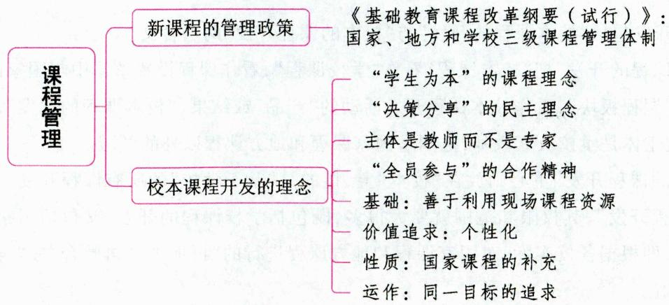

# 一、新课程的管理政策 ★【判断】

1985年，《中共中央关于教育体制改革的决定》首次提出“实行基础教育由地方负责、分级管理的原则”。

1999年，《中共中央国务院关于深化教育改革全面推进素质教育的决定》进一步指出“试行国家课程、地方课程和学校课程”，标志着我国长期以来实行的中央集中管理的课程政策体系开始向中央一地方一学校分散管理的课程体制过渡。

2001年颁布的《基础教育课程改革纲要(试行)》明确规定实行国家、地方和学校三级课程管理体制。这样做是为了改变我国原有课程管理过于集中的状况，通过确立地方和学校参与课程改革的权力主体地位，完善课程管理体系，进一步增强课程对地方、学校及学生的适应性。至此，我国的课程管理体制逐步完善和成熟起来。

# 1.国家对课程的管理

国家对课程的管理主要体现在：(1)教育部总体规划基础教育课程；(2)制定课程管理的各项政策；(3)制定基础教育课程标准；(4)积极试行新的课程评价制度。

# 2. 地方对课程的管理

地方对课程的管理体现在：(1)贯彻国家课程政策，制订课程实施计划；(2)组织课程的实施与评价；(3)加强课程资源的开发和管理。

# 3.学校对课程的管理

学校对课程的管理体现在：(1)制定课程实施方案；(2)重建教学管理制度；(3)管理和开发课程资源；(4)改进课程评价。

真题 [2023安徽蚌埠, 判断] 基础教育课程改革要求实行国家、地方、学校三级课程管理。（）

答案：√

# 二、校本课程开发 ★ 【多选】

校本课程由学校自行决定，目的是满足学生和社区的发展需要，强调多样性与差异性，学生有选修的权利。校本课程开发的主体是教师，通常以选修课的形式出现。

# 考点1 校本课程开发的内涵

校本课程开发包括“校本课程的开发”与“校本的课程开发”两层含义。

(1)“校本课程的开发”把“校本课程”看作“学校课程”，看作课程设置整体中与国家课程、地方课程相对应的一个“课程板块”，看作校本课程开发活动的“产品”或结果。“校本课程的开发”，其权限及范围是确定的，开发主体是学校及其教师，范围是国家课程和地方课程以外的领域。  
(2)“校本的课程开发”重心则放在“校本”上，指的是“基于学校”的所有课程开发。在这样的意义上，“校本的课程开发”，其权限和范围就要大得多，既包括学校课程的开发，又包括国家课程和地方课程的“校本化”，即根据各校实际，对国家课程和地方课程进行的“再加工”“再整合”或“再开发”，从而加以校本化的实施。

# 考点2 校本课程开发的理念

(1)“学生为本”的课程理念。  
(2)“决策分享”的民主理念。  
(3)校本课程开发的主体是教师而不是专家。  
(4)“全员参与”的合作精神。校本课程开发要以教师为主体，形成一个由校长、研究专家、学生及学生家长和社区人士共同开发课程的合作共同体。  
(5)校本课程开发的基础：善于利用现场课程资源。  
(6)个性化是校本课程开发的价值追求。  
(7)校本课程开发的性质：国家课程的补充。  
(8)校本课程开发的运作：同一目标的追求。

# 考点3 校本课程开发的途径

(1)合作开发；(2)课题研究与实验；(3)规范原有的选修课、活动课和兴趣小组。

# ★ 本节核心考点回顾 ★

1. 新课程的管理政策

2001年颁布的《基础教育课程改革纲要(试行)》明确规定实行国家、地方和学校三级课程管理体制。

2. 校本课程开发的一些理念

(1)“学生为本”的课程理念。  
(2) 校本课程开发的主体是教师而不是专家。  
(3)“全员参与”的合作精神。  
(4)校本课程开发的性质：国家课程的补充。

# 第四节 课程资源

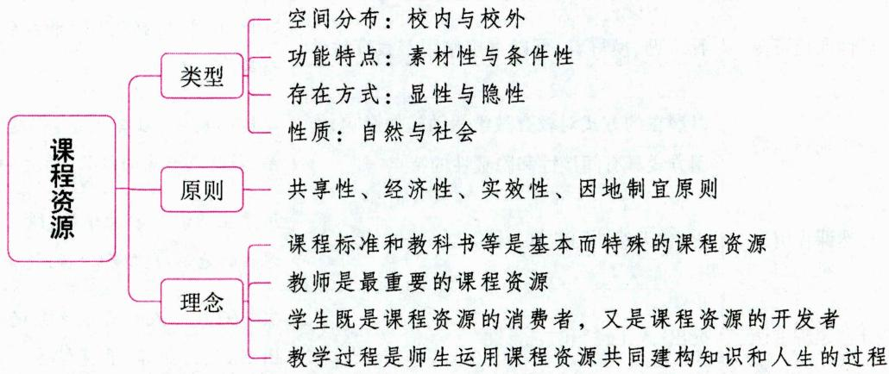

# 一、课程资源的内涵

# 考点1 课程资源的概念

课程资源是课程建设的基础，它包括教材以及学生家庭、学校和社会生活中一切有助于学生发展

的各种资源。教材是课程资源的核心和主要组成部分。

课程资源有狭义和广义之分。狭义的课程资源仅指形成课程的直接要素来源；广义的课程资源指有利于实现课程目标的各种因素，包括形成课程的直接要素来源（素材性课程资源）和实施课程的必要而直接的条件（条件性课程资源）。

综合这两种观点，课程资源是指课程设计、实施和评价等整个课程教学过程中可以利用的一切人力、物力以及自然资源的总和，包括教材、教师、学生、家长以及学校、家庭和社区中所有有利于实现课程目标，促进教师专业成长和学生个性的全面发展的各种资源。

# 考点2 课程资源的特点

(1)多样性；(2)潜在性；(3)多质性；(4)动态性。

# 二、课程资源的类型 ★★ 【单选】

表 1-36 课程资源的类型  

<table><tr><td>分类依据</td><td>类型</td><td>特点</td><td>举例</td></tr><tr><td rowspan="2">空间分布</td><td>校内课程资源</td><td>学校范围之内</td><td>教材、教师等</td></tr><tr><td>校外课程资源</td><td>超出学校范围</td><td>校外图书馆、科技馆、博物馆、网络资源、乡土资源等</td></tr><tr><td rowspan="2">功能特点</td><td>素材性课程资源</td><td>直接作用于课程成为课程的要素,并内化为学生身心发展的素质</td><td>知识、技能、经验、活动方式与方法、情感态度与价值观等</td></tr><tr><td>条件性课程资源</td><td>作用于课程却并不是形成课程本身的直接来源,但在很大程度上决定着课程的实施范围和实施水平,间接制约课程的实际效果和人的现实发展水平</td><td>与课程实施有关的人力、物力和财力,以及时间、场地、媒体、设备、设施和环境等</td></tr><tr><td rowspan="2">存在方式</td><td>显性课程资源</td><td>看得见、摸得着,可以直接作用于教育教学</td><td>教材、计算机网络、自然和社会中的事物、活动等</td></tr><tr><td>隐性课程资源</td><td>以潜在的方式对教育教学活动施加影响,作用方式具有间接性和隐蔽性的特点</td><td>学校的风气,社会风气,家庭氛围,师生关系,教师或学生的经验、感受、困惑、意见等</td></tr><tr><td rowspan="2">性质</td><td>自然课程资源</td><td>突出“天然性”和“自发性”</td><td>用于生物课程的动植物、微生物;用于地理课程的地形、地貌和地势;等等</td></tr><tr><td>社会课程资源</td><td>突出“人工性”和“自觉性”</td><td>保存和展示人类文明成果的公共设施,如图书馆、博物馆、展览馆等</td></tr></table>

此外，根据课程资源的物理特性和呈现方式，课程资源可分为文字课程资源、实物课程资源、活动课程资源和信息化课程资源。其中，活动课程资源内容广泛，包括教师的言语活动和体态语言、班级集体和学生社团的活动、各种集会和文艺演出、社会调查和实践活动，以及师生之间、学生之间的交往，等等。

真题1[2024天津滨海新区，单选]下列选项中属于隐性课程资源的是（）

A.教材

B. 因特网

C. 实验室

D. 师生关系

真题2 [2022河南周口，单选]在课程实施过程中，王老师充分利用图书馆、博物馆以及各种文化活动等资源。这些资源属于（）

A. 自然课程资源

B. 社会课程资源

C. 校内课程资源

D. 文化课程资源

答案：1.D 2.B

# 三、课程资源开发和利用的原则与理念 ★【单选、多选】

# 考点1 课程资源开发和利用的基本原则

(1)共享性原则。  
(2)经济性原则。课程资源的开发与利用要尽可能用最少的开支和精力，达到最理想的效果，具体包括开支的经济性、时间的经济性、空间的经济性和学习的经济性。  
(3)实效性原则。课程资源的开发与利用必须在可能的课程资源范围内和在充分考虑成本的前提下突出重点，针对不同的课程目标，精选那些对学生终身发展具有决定意义的课程资源。  
(4) 因地制宜原则。课程资源的开发与利用不应强求一律, 而应从实际出发, 发挥地域优势, 强化学校特色, 区分学科特性, 展示教师风格, 扬长避短, 扬长补短, 因地制宜、因人制宜地开发与利用课程资源。

# 考点2 课程资源开发和利用的理念

(1)课程标准和教科书等是基本而特殊的课程资源。  
(2)教师是最重要的课程资源。教师不仅是课程资源的开发者，而且其本身也是重要的课程资源。教师不仅决定课程资源的鉴别、开发、积累和利用，是素材性课程资源的重要载体，而且自身就是课程实施的首要的基本条件资源。  
(3)学生既是课程资源的消费者，又是课程资源的开发者。  
(4)教学过程是师生运用课程资源共同建构知识和人生的过程。教学过程是动态的课程资源。

真题3 [2023 内蒙古巴彦淖尔,单选]下列关于课程资源的描述正确的是( )

A.教师不是课程资源

B.课程资源越多越好

C.课程资源多样化

D.课程资源就是教科书

真题4 [2022河南信阳, 单选]张老师上生物课时经常带学生到校园观察不同的植物, 为学生讲解每种植物的生长过程, 并引导学生将有关植物分类的知识编成册子。这体现了张老师是( )

A. 教育教学的研究者  
B. 行为规范的示范者  
C. 专业发展的引领者  
D. 课程资源的开发者

答案：3.C 4.D

# 四、开发和利用课程资源的途径与方法

(1)进行社会调查；(2)审查学生活动，总结和反思教学经验；(3)开发实施条件；(4)研究学生情

况；(5)鉴别利用校外资源；(6)建立资源数据库。

# ★本节核心考点回顾 ★

# 1.课程资源的类型

(1) 根据空间分布分为：①校内课程资源，如教材、教师等；②校外课程资源，如校外图书馆、博物馆等。  
(2)根据功能特点分为：①素材性课程资源，如知识、技能等；②条件性课程资源。  
(3)根据存在方式分为：①显性课程资源，如计算机网络等；②隐性课程资源，如师生关系等。  
(4)根据性质分为：①自然课程资源；②社会课程资源。

# 2. 课程资源开发和利用的理念

(1)课程标准和教科书等是基本而特殊的课程资源；  
(2)教师是最重要的课程资源；  
(3)学生既是课程资源的消费者，又是课程资源的开发者；  
(4)教学过程是师生运用课程资源共同建构知识和人生的过程。

# 第六章 教学

# 本章学习指南

# 一、考情概况

本章属于教育学的重点章节，需要识记、理解和运用的知识较多，考生可带着以下学习目标进行备考：

1. 识记教学的意义。  
2. 识记并理解教学过程的基本规律和结构。  
3. 掌握并能运用我国中小学主要的教学原则与教学方法。  
4. 掌握主要的教学组织形式与教学工作的基本环节。  
5. 理解并区分教学评价的基本类型。

# 二、考点地图

<table><tr><td>考点</td><td>年份/地区/题型</td></tr><tr><td>教学的意义</td><td>2024山东单选;2024江苏判断;2024安徽判断;2023天津单选;2022河南判断;2022浙江辨析</td></tr><tr><td>教学过程的基本规律</td><td>2024江苏单选、辨析、简答;2024山东单选、多选;2024广东单选、判断、案例分析;2024安徽多选;2024天津判断、简答;2024福建辨析;2023河北单选;2023黑龙江单选;2023辽宁判断;2023安徽判断</td></tr><tr><td>教学过程的结构</td><td>2023安徽单选;2023广西单选;2023湖北单选;2023广东单选;2023天津单选、简答;2023湖南判断</td></tr><tr><td>我国中小学主要的教学原则</td><td>2024河南单选;2024山东单选;2024广东单选;2024江苏单选、判断;2024浙江单选、判断;2024天津单选、判断;2024河北单选、材料分析;2024安徽简答;2024贵州案例分析;2023湖南单选;2023内蒙古单选;2023广东简答</td></tr><tr><td>我国中小学常用的教学方法</td><td>2024安徽单选;2024浙江单选;2024江苏单选;2024河北单选;2024山东单选;2024广东单选、多选;2024天津多选;2024河南不定项;2023辽宁单选;2023河南单选;2023河北单选;2023安徽简答</td></tr><tr><td>班级授课制</td><td>2024浙江简答;2023安徽单选;2023辽宁单选;2023山东多选;2022山西判断</td></tr><tr><td>教学工作的基本环节</td><td>2024河北单选;2024天津单选;2024河南单选、多选;2024广东单选、多选;2024福建填空;2023山东单选;2023辽宁单选;2023安徽简答;2022河南判断</td></tr><tr><td>教学评价的基本类型</td><td>2024广东单选;2024安徽单选;2024浙江单选;2024福建单选;2024贵州单选;2024河北单选;2024山东单选;2024天津单选、填空;2024河南多选;2024江苏判断;2023辽宁单选;2023山西多选;2023江苏判断</td></tr></table>

注：上述表格仅呈现重要考点的相关考情。

# 第一节 教学概述

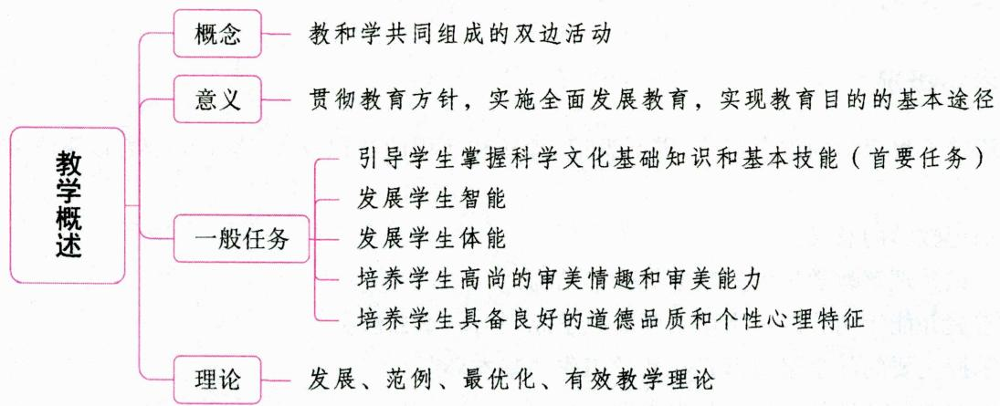

# 一、教学的内涵 ★【单选、不定项、判断】

# 考点 教学的概念

教学是在一定教育目的规范下，教师的教和学生的学共同组成的传递和掌握社会经验的双边活动。教师教和学生学是同一活动的两个方面，是辩证统一的。首先，教不同于学，在课堂教学情境中，教主要是教师的行为，学主要是学生的行为。教师与学生之间存在着差异，教与学之间也存在着差异。教主要是一种外化过程，而学主要是一种内化过程。其次，“教”和“学”相互依存，相辅相成。“教”离不开“学”，“学”也离不开“教”。杜威有句名言：“教之于学就如同卖之于买。”教学永远包括教与学，但不是简单地相加，而是有机地结合或辩证地统一。

# 考点2 教学的特点

教学，是学校进行素质教育的基本途径，是教师教、学生学的统一活动。其特点包括以下几个方面：(1)教学以培养全面发展的人为根本目的；(2)教学由教与学两方面组成，教学是师生双方的共同活动；(3)学生的认识活动是教学中的重要组成部分；(4)教学具有多种形态，是共性与多样性的统一。

# 考点 3 教学与教育、智育、上课、自学的关系

# 1.教学与教育

教学与教育是一种部分与整体的关系。教育包括教学，教学只是学校进行教育的一个基本途径。除教学外，学校还通过课外活动、生产劳动、社会活动等途径对学生进行教育。

# 2.教学与智育

教学与智育是一种复杂的交叉关系，两者既有联系又有区别。作为教育的一个组成部分的智育，即向学生传授系统的科学文化知识和发展学生的智力，主要是通过教学进行的，但不能把两者等同。一方面，教学是智育的主要途径，但不是唯一途径，智育也需要通过课外活动等途径才能全面实现；另一方面，教学要完成智育任务，但智育却不是教学的唯一任务，教学也要完成德育、体育、美育等任务。将教

学等同于智育，容易导致对智育的途径和教学的功能产生狭隘化甚至唯一化的片面认识，在实际工作中，这种认识所产生的危害是有目共睹的。

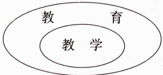  
图1-2 教学与教育的关系

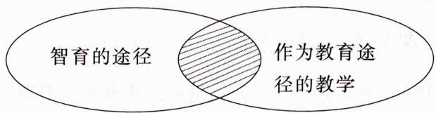  
图1-3，智育的途径和教学的关系

# 3.教学与上课

上课是实施教学的一种方式。就当前我国的情况来看，班级上课是教学的基本组织形式。教学工作以上课为中心环节。

# 4. 教学与自学

教学与自学这两个概念的关系比较复杂,因为学生的自学有两种,必须加以区分。一种是在教学过程内、在教师指导下的自学。它包括配合教学进行的预习、复习、自习和作业,是教学的组成部分。另一种是在教学过程以外、学生自主进行的自学,其内容广泛,教学不包括这种学生自主进行的自学。

真题1 [2023辽宁营口，单选]关于教学与其他相关概念的联系与区别，下列说法不正确的是（）

A. 教学是进行德育的基本途径  
B. 教学与智育是交叉关系  
C. 教学与教育是整体与部分的关系  
D. 在教师指导下的自学是教学的组成部分

真题2 [2022河北邯郸，不定项]关于教学的说法正确的是（）

A. 教学就是传授知识

B. 教学就是上课

C. 教学就是智育

D. 教学由教与学两方面组成

答案：1.C 2.D

# 二、教学的意义（作用） ★★ 【单选、判断、辨析】

教学是贯彻教育方针，实施全面发展教育，实现教育目的的基本途径。具体如下：

(1)教学是传播系统知识、促进学生发展的最有效的形式,是社会经验的再生产、适应并促进社会发展的有力手段。  
(2)教学是进行全面发展教育、实现培养目标的基本途径，为个人全面发展提供科学的基础和实践，是培养学生个性全面发展的重要环节。  
(3)教学是学校教育的中心工作，学校教育工作必须坚持以教学为主（教学的地位）。

学校工作以教学为主，既是由教学本身的性质决定的，也是多年来教育工作经验的总结。但这并不意味着可以轻视甚至忽略其他工作，应当坚持“教学为主，全面安排”的原则。

真题3 [2024山东临沂，单选]教学的主要作用不包括（）

A. 教学是促进学生全面发展的基本途径  
B. 教学是提高学校教育质量的有效途径  
C. 教学是推动社会发展的重要手段  
D. 教学是引导学生掌握基础知识和基本技能的主要途径

真题4 [2024江苏苏州，判断]教学是学校进行全面发展教育的基本途径。（）

答案：3.D 4.√

# 三、教学的一般任务 ★★ 【单选、多选、判断】

(1)引导学生掌握科学文化基础知识和基本技能。教学的首要任务是使学生掌握系统的科学文化基础知识，形成基本技能、技巧，其他任务的实现都是在完成这一任务的过程中和基础上进行的。  
(2)发展学生智能，特别是培养学生的创新精神和实践能力。  
(3)发展学生体能，提高学生身心健康水平。  
(4)培养学生高尚的审美情趣和审美能力。  
(5)培养学生具备良好的道德品质和个性心理特征，形成科学的世界观。

上述五项基本任务是相互联系、相互促进的，其中使学生掌握基础知识、形成基本技能是基础，发展智能是核心，发展体能是保证，培养思想品德是方向，良好的个性心理品质是理想目标。

真题5 [2022天津北辰，单选]在教学任务中处于基础地位的是( )

A. 提升学生的智力水平

B. 传授基础知识和基本技能

C. 培养学生的创新思维

D. 形成科学的世界观和人生观

真题6 [2022湖北武汉，判断]教学的首要任务是发展学生的体力，提高学生的身心健康水平。（）

答案：5.B 6.×

# 四、影响较大的几种教学理论 ★【单选】

# 考点1 发展教学论

发展教学论的主要代表人物是苏联的赞科夫和美国的布鲁纳。这种理论认为教学的最终目的是促进学生的发展。但两人对发展的见解有所不同。

# 1. 赞科夫的发展性教学理论

赞科夫的理论核心是“以最好的教学效果使学生达到最理想的发展水平”。他提出, 只有当教学走在学生发展前面的时候才是最好的教学。赞科夫强调的是一般发展, “一般发展”指的是个体以智力为核心的包括情感、意志、个性以及集体主义精神在内的一般发展。赞科夫的“发展性教学理论”包括教学原则、教学大纲、教学法等各个方面的观点, 其中以教学原则最为重要。他以学生的一般发展作为教学的出发点, 提出了发展性教学理论的五条教学原则:

(1)以高难度进行教学的原则（引导学生克服障碍和积极努力）；  
(2)以高速度进行教学的原则(克服多余的重复和繁琐的讲解以及机械的练习);  
(3)理论知识起主导作用的原则（让系统知识在小学教学内容结构中占主导地位）；  
(4)使学生理解学习过程的原则（教会学生怎样学）；  
(5)使全班学生包括“差生”都得到一般发展的原则（克服高难度、高速度对部分学习困难学生的忽视）。

# 2. 布鲁纳的结构教学论

布鲁纳提出了“结构教学论”，强调“无论我们选教何种学科，务必使学生理解该学科的基本结构”；

倡导发现法，提倡培养学生的科学探索精神、科学兴趣和创造能力。布鲁纳的发展是指智力发展。他主张通过改变教材的质量与运用发现教学法来促进学生的发展。

# 考点2 范例教学论

范例教学比较适合原理、规律性的知识，它是由德国教育心理学家瓦·根舍因提出来的。所谓范例，指好的、特别清楚的、典型的例子，范例教学就是用这种例子去教学。该教学理论遵循人的认知规律，从个别到一般，从具体到抽象。在教学中从一些范例分析入手，感知原理与规律，并逐步提炼，进行归纳总结，再进行迁移整合。

# 考点 3 最优化教学理论

苏联教育家巴班斯基把辩证的系统论观点作为教学论研究的方法论基础，以整体性观点、相互联系观点、最优化观点来指导教学论研究，提出了教学过程最优化理论，其代表著作是《教学过程最优化》。

巴班斯基的教学过程最优化理论是科学地指导教学、合理地组织教学过程的方法论原则。他的最优化理论中的“最优”是指一所学校、一个班级在具体条件制约下所能取得的最大成果，也是指学生和教师在一定场合下所具有的全部可能性。巴班斯基指出，要达到教学最优化，就要把教授（教师的活动）最优化和学习（学生的活动）最优化统一起来。他指出，教学过程的双边性决定了教授最优化方法与学习最优化方法有不可分割的联系。

# 考点4 有效教学理论

有效教学指教师遵循教学活动的客观规律，以尽可能少的时间、精力和物力投入，取得尽可能多的教学效果，从而实现特定的教学目标，满足社会和个人的教育价值需求。促进学生的学习和发展是有效教学的根本目的。

根据对有效教学的本质与标准的限定，结合我国的教学实践，我们认为有效教学应该遵循如下一些基本原则：(1)以学生发展为中心；(2)以学科内容为载体；(3)以融洽师生关系为基础；(4)以学生良好状态为保障。

真题7 [2022辽宁营口，单选]赞科夫提出的发展性教学原则中，“在学习时高速前进原则”强调（）

A. 让儿童在一节课上做尽可能多的例题和练习  
B.尽力使学生过紧张沸腾的精神生活  
C. 让系统知识在小学教学内容结构中占主导地位  
D. 教学要克服多余的重复和繁琐的讲解以及机械的练习

真题8 [2022湖南长沙，单选]“教学过程最优化”理论的提出者是（ ）

A. 维果斯基

B. 巴班斯基

C. 赞科夫

D. 凯洛夫

答案：7.D 8.B

# ★本节核心考点回顾 ★

# 1.教学的意义

教学是贯彻教育方针，实施全面发展教育，实现教育目的的基本途径。具体如下：

(1)教学是传播系统知识、促进学生发展最有效的形式；  
(2)教学是进行全面发展教育、实现培养目标的基本途径；  
(3)教学是学校教育的中心工作，学校教育工作必须坚持以教学为主。

# 2. 教学的一般任务

(1)引导学生掌握科学文化基础知识和基本技能（首要任务）；  
(2)发展学生智能；  
(3)发展学生体能；  
(4)培养学生高尚的审美情趣和审美能力；  
(5)培养学生具备良好的道德品质和个性心理特征，形成科学的世界观。

# 第二节 教学过程

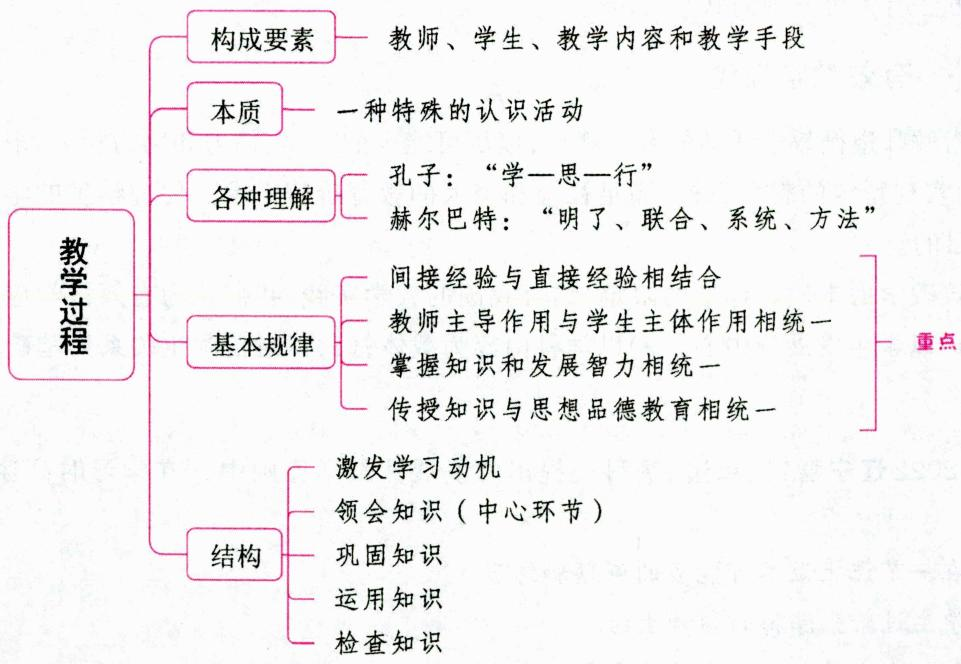

# 一、教学过程的内涵 ★ 【单选】

# 考点1 教学过程的概念

教学过程是教师根据一定社会的要求和学生身心发展的特点，有目的、有计划地指导学生掌握系统的科学文化知识和基本技能，发展学生的智力和体力，培养学生的良好品德和健康个性，使其形成科学世界观的过程。

# 考点2 教学过程的构成要素

构成教学过程的要素有许多方面，人们从不同的立场和视角进行分析，形成了不同的观点。例如：

(1)三要素说——教师、学生、教学内容；  
(2)四要素说——教师、学生、教学内容、教学手段；  
(3)五要素说——教师、学生、教学内容、教学手段、教学环境；  
(4)六要素说——教师、学生、内容、方法、媒体、目的；  
(5)七要素说——学生、目的、内容、方法、环境、反馈和教师。

一般认为，教师、学生、教学内容和教学手段是构成教学过程的基本要素。四者的关系如下：

$$
\begin{array}{c} \text {教 师} \\ (\text {主 导}) \end{array} \xleftarrow {\text {教 学 内 容 、 教 学 手 段}} \xrightarrow [ (\text {中 介}) ]{\text {学 生}} (\text {主 体})
$$

真题1 [2024浙江金华, 单选]下列不属于教学过程的构成要素的是( )

A.学校

B.教师

C. 学生

D. 教学内容

答案：A

# 二、教学过程的本质 ★★ 【单选】

教学活动, 是教师教、学生学的统一活动。活动是在过程中实现的, 而过程则是通过活动得以展开的。因此, 教学活动与教学过程在本质上的含义是相同的。教学活动就其本质而言, 是一种特殊的认识活动。

# 1. 教学过程主要是一种认识过程

教学过程中有两类不同性质的活动（教和学），但教学过程的主要矛盾是学生与其所学知识之间的矛盾（教师提出的教学任务同学生完成这些任务的需要、实际水平之间的矛盾），实际上也就是学生认识过程的矛盾，是认识主体与其客体之间的矛盾，因此学生的认识活动是教学中最主要的活动，教学过程是一种认识过程，它遵循的是感性认识和理性认识相统一、认识和实践相统一的普遍性规律。

# 2. 教学过程是一种特殊的认识过程

教学过程作为一种特殊的认识过程，其特殊性表现在：

(1)认识对象的间接性与概括性。即学习的内容是已知的、他人的，也是经过提炼的认识成果。  
(2)认识方式的简捷性与高效性。通过间接知识认识世界，可以减少探索的实践，避免探索的弯路，尽快地掌握人类文化的精华，因而是高效的。  
(3)教师的引导性、指导性与传授性(有领导的认识)。学生具有不成熟性,学生的认识始终是在教师的传授、指导下进行以达到认识目的的。  
(4)认识的交往性与实践性。教学活动是发生在师生之间及学生之间的一种特殊的交往活动,这种交往活动同时具有实践的性质。  
(5)认识的教育性与发展性。即教学中学生认识的形成既是目的,也是发展的手段,认识中追求并实现着学生的知、情、意、行等方面的发展与完全人格的养成。

# 3. 教学过程以认识活动为基础，是促进学生身心发展的过程

教学过程不等于发展过程，它是实现发展的途径和手段。教学的目的在于使学生理解与掌握知识、形成技能技巧、培养学生的能力。但学生的情感、意志等因素也同时参与学生的认识过程，并与学生的认识过程交织在一起。因此，学生在掌握知识的教学过程中，也在实现着其身心的全面发展。

# 教学过程本质的其他观点

# 1.认识一发展说

这种观点认为, 教学过程是教师有目的、有计划地引导学生掌握科学文化基础知识和基本技能, 逐步形成辩证唯物主义世界观和共产主义道德品质的过程。认识一发展说强调了学生的主观能动性, 但是削弱了教师的主导作用。在教学活动中, 离开了教师的主导作用, 学生的发展水平是难以得到保证的。

# 2. 认识—实践说

这种观点认为, 教学过程作为人类社会的一种特殊的认识过程, 是认识和实践统一的活动过程, 是学生在教师指导下, 对人类已有的知识经验的认识活动和改造主观世界、形成和谐发展个性的实践活动的统一过程。认识—实践说从教师的角度概括教学的实践本质, 容易导致重教轻学, 从学生的角度则容易导致重学轻教。

# 3. 交往说

这种观点认为,教学是教师教与学生学的统一,这种统一的实质是交往,教师与学生是“交互主体”的关系。因此,教学过程是教师与学生以课堂为主渠道的交往过程。

# 4.多重本质说

这种观点认为，教学过程既然是多层次、多类型的，那么教学过程的本质也应该是多级别、多类型的，从而提出教学过程有认识论、心理学、生理学、伦理学和经济学五个方面的本质。

真题2 [2023黑龙江哈尔滨，单选]教学活动的本质是（）

A. 认识活动

B. 实践活动

C. 交往活动

D. 课堂活动

真题3 [2023广东梅州, 单选]教学过程是一种特殊的认识过程, 下列不属于教学过程特点的是（）

A. 教学过程具有引导性

B. 教学过程具有教育性

C. 教学过程具有简捷性

D. 教学过程具有直接性

答案：2.A 3.D

# 三、历史上对教学过程的各种理解 ★【单选】

教学过程的理论是教学的基本理论，历代中外教育家曾以不同观点、从不同角度对教学过程做过种种探索，提出了各自的见解。

表 1-37 关于教学过程的各种理解  

<table><tr><td>人物(学派)</td><td>对教学过程的理解</td></tr><tr><td>孔子</td><td>“学一思一行”(也有说法认为是“学一思一习一行”)的统一过程</td></tr><tr><td>思孟学派</td><td>“博学之,审问之,慎思之,明辨之,笃行之”(《礼记·中庸》)</td></tr><tr><td>昆体良</td><td>“模仿、理论、练习”三个循序递进的学习过程</td></tr><tr><td>赫尔巴特</td><td>试图用心理学的“统觉理论”来解释教学过程,提出“明了、联合(联想)、系统、方法”的四阶段论,这一理论标志着教学过程理论的形成</td></tr><tr><td>杜威</td><td>将探究的反省思维活动过程分为了困难、问题、假设、验证、结论五个阶段</td></tr><tr><td>凯洛夫</td><td>把教学过程认定为特殊认识过程,提出了感知、理解、巩固、运用四个教学阶段(也有说法认为是知觉具体事物,理解事物的特点、关系或联系,形成概念,巩固知识,形成技能、技巧,实践运用六个环节)</td></tr></table>

当代的教学过程理论主要有加涅的信息加工理论，布鲁纳的结构教学理论，赞科夫的教学与发展理论，巴班斯基的教学过程最优化理论，斯金纳的程序教学论，我国教育心理学家提出的动机、感知、理解、巩固和应用五阶段论等。

真题4 [2022湖南长沙,单选]把教学过程分为明了、联想、系统、方法四个阶段的教育家是( )

A. 夸美纽斯

B. 杜威

C. 凯洛夫

D. 赫尔巴特

答案：D

# 四、教学过程的基本规律(基本特点) ★★★ 【单选、多选、判断、辨析、简答、案例分析】

教学过程是教师引导下的学生的特殊认识过程。在教学过程中,教师要高质量地完成教学任务,实现培养人的使命,必须处理好的关系包括:间接经验与直接经验的关系、教师主导作用与学生主体作用的关系、知识与能力的关系、知识教育与思想道德教育的关系、智力因素与非智力因素的关系。

# 考点 间接经验与直接经验相结合（间接性规律）

人们认识客观事物主要有两条途径：一是获取直接经验，即通过亲自探索、实践所获得的经验；二是获取间接经验，即他人的认识成果，主要是指人类在长期认识过程中积累并整理而成的书本知识。教学过程是学生认识客观世界的过程，要以间接经验为主、直接经验为辅，将二者有机结合起来。间接经验与直接经验相结合规律，反映了教学中传授系统的科学文化知识与丰富学生感性知识的关系、理论与实践的关系、知与行的关系。

# 1. 以间接经验为主是教学活动的主要特点

学习间接经验是学生认识客观世界的基本途径。这是因为：

(1)借助间接经验认识世界，是认识上的捷径。这也是教学过程中认识方式的简捷性与高效性的体现。  
(2)学习间接经验也是由学生特殊的认识任务决定的。这是教学过程中认识对象的间接性与概括性，教师的引导性、指导性与传授性的体现。

# 2. 学生学习间接经验要以直接经验为基础

书本知识，一般表现为概念、定理、原理等，这对学生来说是间接经验。学生要把这些知识转化为自己的知识，必须以个人以往积累的或现时获得的感性经验为基础。在教学中学生是借助于他已有的直接经验去认识书本上的间接经验的，陶行知先生做过一个精辟的比喻：“接知如接枝”。他说：“我们必须有从自己的经验里发出来的知识做根，然后别人的相类的经验才能接得上去。倘使自己对于某事毫无经验，我们决不能了解或运用别人关于此事之经验。”可见，学生个人的直接经验在其间接经验的学习中具有不可替代的特殊价值。

# 3. 贯彻间接经验与直接经验相结合的规律，要防止两种倾向

(1)过分强调书本知识的传授和学习，忽视引导学生通过实践活动、亲身参与、独立探索去积累经

验、获取知识的倾向。

(2)只强调学生通过自己探索去发现、积累知识，忽视书本知识的学习和教师的系统讲授。

遵循间接经验与直接经验相结合的规律，要求教师在教学中坚持理论联系实际。

# 考点2 教师主导作用与学生主体作用相统一（双边性规律）

在教学中,教师的教依赖于学生的学,学生的学离不开教师的教,教与学是辩证统一的。教学过程是教师和学生共同活动的过程,是“教师教”和“学生学”的矛盾统一过程。

# 1. 充分发挥教师的主导作用

教师主导作用是指教师负责组织、引导学生沿着正确的方向，采用科学的方法，获得良好的发展。教师的主导作用主要体现在三个方面：

(1)教师决定着学生学习的方向、内容、进程、结果和质量，并起着引导、规范、评价和纠正的作用；  
(2)对学生的学习方式以及学习态度发挥作用；  
(3)影响学生的个性以及人生观、世界观的形成。

# 2. 充分发挥学生主体参与教学的能动性

教学中，学生是学习的主人，具有主观能动性，学生学习的主观能动性主要体现在两个方面：

（1)学生对外部信息具有选择的能动性、自觉性，学生对信息的选择与否直接受学生本人的学习动机、兴趣、需要以及所接受的外部要求左右。  
(2)学生对外部信息进行内部加工时体现出独立性、创造性，因为学生对信息进行内部加工的过程受到个体原有的知识经验、思维方式、情感意志、价值观念等制约。

# 3.教师的主导作用和学生主体作用之间的辩证统一关系

(1)教师和学生的作用是不可分割的。发挥教师的主导作用并不意味着制约学生的主动性。相反，发挥教师的主导作用，就是要更好地发挥学生的主动精神。同样，发挥学生的主动性又离不开教师的主导作用。  
(2)教师的主导作用和学生的主体作用是相互促进的。教师的主导作用要依赖于学生主体作用的发挥。学生学习的主动性、积极性越高，说明教师的主导作用发挥得越好。反过来，学生主体作用要依赖于教师的主导作用来实现。只有教师、学生两方面互相配合，才能达到最佳的教学效果。

# 4. 贯彻教师主导作用与学生主体作用相统一的规律，要防止两种倾向

在教学过程中，不能只重视教师的作用，忽略学生学习的主动性和创造性，也不能只强调学生的作用，使学生陷入盲目探索状态，学不到系统的知识，要把二者有机地结合起来。

历史上，以赫尔巴特为代表主张的“教师中心”倾向和以杜威为代表主张的“学生中心”倾向，或者忽视学生主体作用，或者忽视教师主导作用，都是片面的、不正确的、行不通的。

# 考点 3 掌握知识和发展智力相统一（发展性规律）

# 1.知识和智力是两个不同的概念（区别）

知识是人们对客观世界的认识，智力是人们认识客观事物的基本能力。通过传授知识发展学生的智力是教学的一个重要任务。知识不等于智力，传授了知识不等于训练了智力。一个学生知识的多少并不一定能标志他的智力发展水平的高低。

# 2. 掌握知识与发展智力二者是相互统一和相互促进的（联系）

掌握知识和发展智力相互依存、相互促进，二者统一在教学活动中。现代教学观认为，教学过程既

是向学生传授知识的过程，又是发展学生智力和能力的过程。

(1) 掌握知识与发展智力这两个教学任务统一在同一个教学活动之中，统一在同一个认识主体的认识活动之中。  
(2) 掌握知识是发展智力的基础。知识为智力活动提供了广阔的领域, 只有有了某一方面的知识, 才有可能去从事某方面的思维活动。缺乏必要的知识, 就谈不上进行一定的判断、推理、分析、综合。所以离开了知识, 智力就是无源之水、无本之木。缺乏知识是智力发展最大的障碍。  
(3)发展智力又是掌握知识的重要条件。可以说智力既是接受人类已有知识的工具,同时又是开发新知识的工具。掌握知识的速度与质量,依赖于一定的智力。智力水平高,知识学得就快、就好,否则,就慢、就差。

# 3. 要使知识的掌握真正促进智力的发展是有条件的

(1)从传授知识的内容上看，传授给学生的知识应是规律性的知识；  
(2)从传授知识的量来看，一定时间范围内所学知识的量要适当，不能过多；  
(3)采用启发式教学；  
(4)培养学生良好的个性，重视学生的个别差异，注重因材施教。

# 4. 贯彻掌握知识和发展智力相统一的规律，要防止两种倾向

在整个教学过程中，我们要防止形式教育论和实质教育论两种倾向。在教学中，只有把掌握知识和发展智力有机地结合起来，才能提高教学质量。

表 1-38 形式教育论与实质教育论  

<table><tr><td></td><td>形式教育论</td><td>实质教育论</td></tr><tr><td>起源</td><td>古希腊</td><td>古希腊、古罗马</td></tr><tr><td>代表人物</td><td>洛克、裴斯泰洛齐</td><td>斯宾塞、赫尔巴特</td></tr><tr><td>主要观点</td><td>(1)教学的主要任务在于发展学生的智力,至于学科内容的实用意义则是无关紧要的;
(2)主张形式学科(如希腊文、拉丁文、数学、逻辑学等)或古典人文课程最有发展价值</td><td>(1)教学的主要任务在于传授给学生有用的知识,至于学生的智力则无需进行特别的培养和训练;
(2)主张与人类的世俗生活密切相关的实质学科(如物理、化学、天文、地理、法律)或实科课程最有发展价值</td></tr><tr><td>评价</td><td>只强调训练学生的思维形式,忽视知识的传授</td><td>只向学生传授对实际生活有用的知识,忽视了对学生认识能力的训练</td></tr></table>

# 考点4 传授知识与思想品德教育相统一（教育性规律）

在教学过程中，学生掌握科学文化知识和提高思想品德修养是相辅相成的，具体体现在以下三点：

# 1.知识是思想品德形成的基础

学生思想品德修养水平的提高有赖于其对科学文化知识的掌握。正如赫尔巴特说的“我不承认有任何无教育的教学”，教学永远具有教育性。

# 2. 思想品德修养水平的提高为学生积极地学习知识提供动力

学习活动是一项十分艰苦的脑力劳动，在学习过程中必然会遇到各种各样的困难，这就要求学习者必须有明确的学习目的、强烈的学习欲望和较高的思想觉悟。在教学中，教师要不断培养、提高学生的思想品德水平，引导他们将个人的学习与社会发展、祖国前途联系起来，充分调动他们学习的主动性、积极性，这是学生获取知识的重要保证。

# 3. 贯彻传授知识与思想品德教育相统一的规律时，必须注意的问题

(1) 脱离知识进行思想品德教育, 这会使思想品德教育成为无源之水、无本之木, 不仅不利于学生品德修养水平的提高, 而且还影响系统知识的教学。  
(2)只强调传授知识，忽视思想品德教育。不能认为学生学习了知识以后，思想品德修养水平自然会随之提高。因为教学的教育性必须经过教师给学生施加积极影响，必须通过启发、激励，使学生对所学知识产生积极的态度时，教学的教育性才能得以实现。

在教学过程中要注意把传授知识与思想品德教育有机结合起来。

上述四个是教学过程的主要规律, 此外, 在教学过程中还需要处理好智力因素与非智力因素的关系。智力是人的一种综合认识能力, 包括注意力、观察力、记忆力、想象力和思维力等因素。非智力因素则包含了除智力以外的其他所有的心理因素, 如兴趣、情感、意志和性格等。

真题5 [2023黑龙江哈尔滨，单选]（ ）倡导教学活动的主要任务在于训练学生的思维形式，知识的传授则是无关紧要的。

A. 实质教育论

B. 形式教育论

C. 现代教学论

D. 传统教学论

真题6 [2023河北石家庄, 单选]王老师在讲“镭”元素时, 向同学们介绍了“镭”元素的发现者居里夫人献身科学的事迹, 同学们深受教育。这体现了( )的教学规律。

A. 直接经验与间接经验相统一  
B. 掌握知识与发展能力相统一  
C. 教师的主导作用与学生的主体作用相统一  
D. 传授知识与思想教育相统一

真题7 [2024天津东丽，判断]掌握知识是发展智力的基础，发展智力又是掌握知识的重要条件。（）

真题8 [2023安徽统考，判断]教学过程是教师和学生共同活动的过程，是“教师教”和“学生学”的矛盾统一过程。（）

真题9 [2024福建统考, 辨析]“读万卷书, 行万里路”, 二者不可偏废。该观点是否正确? 运用教学过程的基本规律加以分析。

答案：5.B 6.D 7.√ 8.√ 9.(1)这种观点是正确的。(2)“读万卷书”强调的是间接经验，“行万里路”强调的是直接经验，“‘读万卷书，行万里路’，二者不可偏废”体现了间接经验与直接经验相结合的规律。人们认识客观事物主要有两条途径：一是获取直接经验，即通过亲自探索、实践所获得的经验；二是获取间接经验，即他人的认识成果，主要是指人类在长期认识过程中积累并整理而成的书本知识。教学活动是学生认识客观世界的过程，要以间接经验为主、直接经验为辅，将二者有机结合起来。

# 五、教学过程的结构 ★★★ 【单选、多选、判断、简答】

教学过程的结构即教学过程的基本阶段。教学过程是一个有规律的过程，在教师引导下学生掌握知识的活动是教学过程中最基本的活动。教学过程大致分为以下五个阶段：

# 1.激发学习动机

教学应从诱发和激起求知欲并把求知欲聚焦于当前学习的知识开始，从引导学生做好学习的心理准备开始。

# 2. 领会知识

领会知识是教学过程的中心环节。领会知识包括使学生感知和理解教材。学生在教学中的认知,往往是从感知教材入手的。感知教材是指教师要引导学生通过感知形成清晰的表象和鲜明的观点,为理解抽象概念提供感性知识的基础并发展学生相应的能力。理解教材的目的在于形成概念、原理,真正认识事物的本质和规律。

# 3. 巩固知识

巩固所学的知识是教学过程的一个必要环节。巩固知识的意义在于避免或减少对先前所学知识的遗忘，并为顺利学习新知识、新材料奠定基础。巩固知识往往渗透在教学的全过程，不一定是一个独立的环节。

# 4. 运用知识

在教学中, 运用知识、形成技能技巧主要是通过教学实践来实现的, 如完成各种书面或口头作业、实验等。此外, 运用知识不止局限于技能和技巧的掌握, 它还包括“知识迁移”能力和创造能力的发挥等。

# 5. 检查知识

检查知识是指教师通过作业、提问、测验等方式对学生的学习效果进行考查的过程。检查知识的目的在于使教师及时获得关于教学效果的反馈信息，以调整教学进程与要求，并帮助学生了解自己掌握知识技能的情况，以便及时改进。

# 知识再拔高·

# 学生掌握知识的基本阶段

教学过程实质上是教师引导下学生获取知识、认识世界的过程，因而学生掌握知识的基本阶段，是教学过程规律的一个重要方面的体现。近现代教育史上，提出过不同的学生掌握知识阶段的学说，主要有两种模式：

(1)以师生授受知识为特征的传授/接受教学。传授/接受教学中学生掌握知识的基本阶段包括：①引起学习动机；②感知教材；③理解教材（中心环节）；④巩固知识；⑤运用知识；⑥检查知识、技能和技巧。  
(2)以学生主动探究知识为特征的问题/探究教学。问题/探究教学中学生获取知识的基本阶段包括：①明确问题；②深入探究；③做出结论。

# 小香课堂·

教学过程的中心环节是领会知识，还是理解教材，这两种观点在本质上是一致的。理解教材需要引导学生在学习上爬坡，在认识上飞跃，从感性上升到理性。在教学过程中，只有学生理解了教材，形成了概念，才算是真正领会和掌握了知识。因此，也可以说“理解教材”是教学过程的中心环节。

真题10 [2023安徽蚌埠，单选]教学过程的中心环节是（）

A. 感知教材, 形成表象  
B. 理解教材, 形成概念  
C. 运用知识, 形成技巧  
D.知识的巩固与保持

真题11 [2023广西贵港，单选]学生在教学中的认知，往往是从（ ）入手的。

A. 感知教材

B. 学习动机

C. 理解教材

D. 复习旧知

真题12 [2023湖北武汉，单选]在教学过程的基本阶段中，（ ）不止局限于技能和技巧的掌握，它还包括“知识迁移”能力和创造能力的发挥等。

A. 领会知识

B. 巩固知识

C. 运用知识

D. 检查知识

答案：10.B 11.A 12.C

# ★本节核心考点回顾 ★

# 1. 教学过程的构成要素

一般认为，教师、学生、教学内容和教学手段是构成教学过程的基本要素。

# 2. 教学过程的基本规律

(1)间接经验与直接经验相结合（间接性规律）；  
(2)教师主导作用与学生主体作用相统一（双边性规律）；  
(3)掌握知识和发展智力相统一（发展性规律）；  
(4)传授知识与思想品德教育相统一（教育性规律）。

# 3. 直接经验与间接经验相结合的规律

教学过程是学生认识客观世界的过程，要以间接经验为主、直接经验为辅，将二者有机结合起来。

(1)以间接经验为主是教学活动的主要特点；  
(2)学生学习间接经验要以直接经验为基础。

# 4. 掌握知识与发展智力相统一的规律

教学过程既是向学生传授知识的过程，又是发展学生智力和能力的过程，二者相互依存、相互促进，统一在同一教学活动中。

(1) 掌握知识与发展智力这两个教学任务统一在同一个教学活动之中，统一在同一个认识主体的认识活动之中；  
(2) 掌握知识是发展智力的基础；  
(3)发展智力又是掌握知识的重要条件。

# 5. 教学过程的结构

(1)激发学习动机。  
(2)领会知识。领会知识是教学过程的中心环节，包括使学生感知和理解教材。学生在教学中的认知，往往是从感知教材入手的。  
(3) 巩固知识。  
(4)运用知识。运用知识不止局限于技能和技巧的掌握，它还包括“知识迁移”能力和创造能力的发挥等。  
(5)检查知识。检查方式包括作业、提问、测验等。

# 第三节 教学原则与教学方法

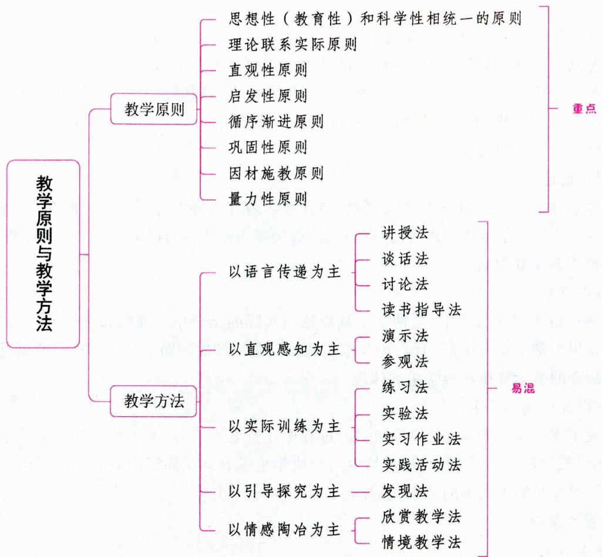

# 一、教学原则

# 考点1 教学原则的概念 ★【判断】

教学原则是根据一定的教学目的和教学过程规律而制定的指导教学工作的基本准则。它是有效进行教学必须遵循的基本要求和原理。

教学原则是人们在长期的教学实践中总结出来的。千百年来，人们在教学实践中创造了因材施教、启发诱导、循序渐进、学思行结合、温故知新等众多教学原则。这些传统教学原则都对后世产生了深远的影响，直至今天仍有巨大的价值。现代教学理论中所倡导的因材施教、启发诱导、循序渐进、理论联系实际、温故知新等教学原则就是对传统教学原则的继承和发展。

真题1 [2022河北石家庄，判断]现代教学所倡导的因材施教、启发诱导、循序渐进、理论联系实际、温故知新等教学原则都是对传统教学原则的继承和发展。（）

A. 正确

答案：A

B. 错误

# 1. 思想性（教育性）和科学性相统一的原则

# (1)基本含义

该原则是指教学要以马克思主义为指导，授予学生科学知识，并结合知识教学对学生进行社会主义品德和正确人生观、科学世界观教育。这是培养德智体美劳全面发展的人的要求，是建设社会主义物质文明和精神文明的要求，体现了我国教育的根本方向。同时这也是知识的思想性、教学的教育性规律的反映。这一原则的实质是要求在教学活动中把教书和育人有机地结合起来。教学的教育性与科学性是相辅相成、相互促进的。

# (2) 贯彻此原则的要求

①教师要保证教学的科学性；②教师要结合教学内容的特点进行思想品德教育；③教师要通过教学活动的各个环节对学生进行思想品德教育；④教师要不断提高自己的业务能力和思想水平。

# 2.理论联系实际原则

# (1)基本含义

该原则是指教师在教学中，应使学生从理论与实际的结合中来理解和掌握知识，并引导他们运用新获得的知识去解决各种实际问题，培养他们分析问题和解决问题的能力。这一原则是间接经验与直接经验相结合的教学规律在教学中的体现。

# （2）贯彻此原则的要求

①重视书本知识的教学，在传授知识的过程中注重联系实际；②重视引导和培养学生运用知识的能力；③加强教学的实践性环节，逐步培养与形成学生综合运用知识的能力，进行“第三次学习”；④正确处理知识教学与能力训练的关系；⑤补充必要的乡土教材。

# 3. 直观性原则

# (1)基本含义

该原则是指在教学活动中,教师应尽量利用学生的多种感官和已有的经验,通过各种形式的感知,使学生获得生动的表象,从而比较全面、深刻地掌握知识。直观手段种类繁多,一般分为三大类:实物直观、模像直观和言语直观。这一原则是根据人类的认识规律、直接经验和间接经验相统一的教学规律提出来的,也是由学生的年龄特征所决定的。

关于这一原则，中国古代教育家荀子说过，“不闻不若闻之，闻之不若见之”“闻之而不见，虽博必谬”，提出在学习中不仅要“闻之”更要“见之”，才能“博而不谬”。捷克教育家夸美纽斯在著作《大教学论》中指出，应该尽可能地把事物本身或代替它的图像放在面前，让学生去看看、摸摸、听听、闻闻等。乌申斯基指出，“一般来说，儿童是依靠形式、颜色、声音和感觉来进行思维的”“逻辑不是别的东西，而是自然界里的事物和现象的联系在我们头脑中的反映”。

# （2）贯彻此原则的要求

①正确选择直观教具和教学手段；②将直观教具的演示与语言讲解结合起来；③重视运用言语直观。

# 4.启发性原则

# (1)基本含义

该原则是指在教学活动中，教师要调动学生的主动性和积极性，引导他们通过独立思考、积极探索，生动活泼地学习，自觉地掌握科学知识，提高分析问题和解决问题的能力。这一原则是为了将教学活动中教师的主导作用和学生的主体地位统一起来而提出的。

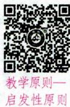

启发性原则是在吸取中外教育遗产经验的基础上提出的。苏格拉底的“产婆术”孔子提出的“不愤不启, 不悱不发”的教学要求以及《学记》中“道而弗牵, 强而弗抑, 开而弗达”的教学思想, 都是这一教学原则的体现。第斯多惠也曾说: “一个坏的教师奉送真理, 一个好的教师则教人发现真理。”

# （2）贯彻此原则的要求

说法一：①加强学习的目的性教育，调动学生学习的主动性；②设置问题情境，启发学生独立思考，培养学生良好的思维方法和思维能力；③让学生动手，培养学生独立解决问题的能力，鼓励学生将知识创造性地运用于实际；④发扬教学民主。

说法二：①激发学生的积极思维；②确立学生的主体地位；③建立民主平等的师生关系。

# 5. 循序渐进原则

# (1)基本含义

该原则在西方常称为系统性原则,是指教师要严格按照科学知识的内在逻辑和学生的认知发展规律进行教学,使学生掌握系统的科学文化知识,能力得到充分的发展。

《学记》要求“学不溅等”“不陵节而施”，提出“杂施而不孙，则坏乱而不修”，意思是：如果教学不按一定的顺序，杂乱无章地进行，学生就会陷入紊乱而没有收获。朱熹进一步提出“循序而渐进，熟读而精思”，明确提出了循序渐进的教育要求。

# (2)贯彻此原则的要求

①教师的教学要有系统性。②抓主要矛盾，解决好重点与难点。教学循序渐进并不意味着教学要面面俱到、平均使用力量，而是要求区别主次、分清难易、有详有略地教学。③教师要引导学生将知识体系化、系统化。④按照学生的认识顺序，由浅入深、由易到难、由简到繁地进行教学。

# 6. 巩固性原则

# (1)基本含义

该原则是指教师在教学中要引导学生在理解的基础上牢固地掌握基础知识和基本技能，而且在需要的时候，能够准确无误地呈现出来，以利于知识技能的利用。这一原则是为了处理好教学中获取新知识与保持旧知识之间的矛盾而提出的。

历代教育家都很重视知识的巩固问题,例如:孔子要求“学而时习之”“温故而知新”;夸美纽斯明确提出了“教与学的巩固性原则”;乌申斯基认为“复习是学习之母”。

# (2) 贯彻此原则的要求

①要在教学的全过程中加强知识的巩固；②组织好学生的复习工作，教会学生记忆的方法；③通过扩充、改组和运用知识的过程来巩固知识。

# 7. 因材施教原则

# (1)基本含义

该原则是指教师在教学中，要从课程计划、学科课程标准的统一要求出发，面向全体学生，同时又要根据学生的个别差异，有的放矢地进行有差别的教学，使每个学生都能扬长避短，获得最佳的发展。这一原则既由学生身心发展的客观规律所决定，也受我国教育目的的制约。

我国古代的孔子善于根据学生的不同特点，有针对性地进行教育，以发挥他们各自的专长。宋代朱熹把孔子这一经验概括为“孔子施教，各因其材”，这是“因材施教”的来源。美国心理学家加德纳提出并阐明的“多元智力理论”也有力地说明了应当针对学生的个性特征进行教育。

# (2) 贯彻此原则的要求

①要坚持课程计划和学科课程标准的统一要求；②教师要了解学生，从实际出发进行教学；③教师

要善于发现每个学生的兴趣、爱好，并创造条件，尽可能使每个学生的不同特长都得以发挥。

# 8. 量力性原则

# (1)基本含义

该原则也称可接受性原则、发展性原则，是指教学的内容、方法、分量和进度要适合学生的身心发展，使他们能够接受，但又要有一定的难度，需要他们经过努力才能掌握，以促进学生的身心发展。这一原则是为了防止发生教学难度低于或高于学生实际程度而提出的。

我国古代的墨子很重视学习上的量力而为。他提出：“夫智者必量其力所能至而从事焉。”经验证明，教学中传授的知识只有符合学生的接受能力才能被理解，顺利地转化为他们的精神财富，罗素、布鲁纳、赞科夫都持这种观点。

# (2) 贯彻此原则的要求

①了解学生的发展水平，从实际出发进行教学。第斯多惠指出：“学生的发展水平是教学的出发点。”教师在教学过程中，随时都要了解学生的发展水平、已有的知识与能力状况。这是教学的基点与起点，也是学生知识的生长点。②考虑学生认识发展的时代特点。

# 知识再拔高：

# 教学的方向性原则和伦理性原则

(1) 方向性原则。方向性原则是指教学要以马克思主义为指导，以马克思主义的立场、观点和方法来选择教学内容，分析和理解教学内容，结合科学知识教学对学生进行社会主义核心价值观、正确的人生观和科学的世界观的教育。贯彻这一原则要求做到以下两点：①坚持教学的马克思主义方向；②深入挖掘教材的思想性。

(2) 伦理性原则。伦理性原则是指教师在教学过程中处理师生关系时, 要遵循当代社会的伦理规范。教师要尊重学生, 爱护学生, 并通过以身垂范赢得学生的尊重。贯彻这一原则要求做到以下三点: ① 在教学中, 教师要尊重学生的基本权利; ② 在教学中, 教师要尊重学生的基本自由和权利; ③ 在教学中, 教师要正确对待学生的个性差异。

真题2 [2024江苏苏州, 单选] 孔子是我国古代著名的教育家, 其“不愤不启, 不悱不发”“学而时习之”的思想体现了下列哪些教学原则（）

A. 直观性原则、启发性原则

B. 循序渐进原则、因材施教原则

C. 因材施教原则、直观性原则

D.启发性原则、巩固性原则

真题3 [2023湖南长沙, 单选]生物课上, 老师先讲解叶子的形状, 再讲叶子秋天变色的原因。这体现了( )教学原则。

A.启发性

B. 因材施教

C. 循序渐进

D. 巩固性

真题4[2024浙江宁波，判断]直观性教学原则是指教师要积极调动学生的多种感官和已有的经验，进而帮助学生获得直接经验和感性认识。（）

真题5 [2024安徽统考，简答]简述教学的伦理性原则的内涵与贯彻要求。

答案：2.D 3.C 4.√ 5.详见内文

# 二、教学方法

# 考点1 教学方法的概念

教学方法是指教师和学生为了完成教学任务、实现教学目标而采取的共同活动方式，是教师引导

学生掌握知识技能、获得身心发展而共同活动的方法。

首先，教学方法具有合目的性。教学方法要在一定的教育目的和教学目标的指导下实施。其次，教学方法具有双向性。教学方法一定包含教师教的方法和学生学的方法，只不过不同的方法有所偏重。最后，教学方法具有可操作性。

# 考点 2 两种对立的教学方法指导思想 ★【辨析】

依据指导思想的不同，各种教学方法可归并为两大类：注入式和启发式，这是两种根本对立的教学方法指导思想。提倡启发式，反对注入式，是当代运用教学方法的指导思想。

注入式是一种“填鸭式”“灌输式”的教学方法，是指教师从主观出发，把学生看成单纯接受知识的容器，向学生灌注知识，无视学生在学习上的主观能动性。在这种思想的指导下，教师在教学中仅仅起了一个现成信息的载负者和传递者的作用，而学生则仅仅起着记忆器的作用。

启发式则是指教师从学生实际出发，采取各种有效的形式去调动学生学习的积极性，指导他们自己去学习的方法。

# 小香课堂·

在我国传统教学中，教师多使用灌输的方式进行教学，在此过程中运用最多的又是讲授法，因此，有人将讲授法等同于注入式教学，这是错误的。衡量一种教学方法是否具有启发性，关键是看教师能否促进学生积极主动地去学习，而不是单从形式上去加以判断。

真题6 [2023浙江金华，辨析]讲授法属于灌输式的教学方法。

答案：(1)这种说法是不正确的。(2)注入式是一种“填鸭式”“灌输式”的教学方法，是指教师从主观出发，把学生看成单纯接受知识的容器，向学生灌注知识，无视学生在学习上的主观能动性。启发式是指教师从学生实际出发，采取各种有效的形式去调动学生学习的积极性，指导他们自己去学习的方法。在我国传统教学中，教师多使用灌输的方式进行教学，在此过程中运用最多的又是讲授法，因此，有人将讲授法等同于注入式教学、灌输式教学，这是错误的。衡量讲授法是启发式还是灌输式，关键是看教师能否促进学生积极主动地去学习。

# 考点8 我国中小学常用的教学方法 ★★★ 【单选、多选、不定项、简答】

根据教学活动中学生的不同认识方式或师生活动方式的特点，可将我国中小学常用的教学方法分为五大类：

# 1. 以语言传递为主的教学方法

这类教学方法的特点是能较迅速、准确而大量地向学生传授间接经验。其效果主要取决于教师是否具有良好的语言表达能力和学生是否具有较强的阅读理解能力。这一类教学方法运用极为广泛,主要包括讲授法、谈话法、讨论法、读书指导法四种。

# (1) 讲授法

①讲授法的概念

讲授法是教师运用口头语言系统连贯地向学生传授知识、技能，发展学生智力的教学方法。讲授法是整个教学方法体系中运用最多、最广的一种方法。

②讲授法的形式

一般认为，讲授法可分为讲述、讲解、讲读和讲演四种形式。

讲述是教师运用生动形象的语言，叙述、描绘所要讲的知识内容的一种讲授方式。讲述有两种方式：一是叙述式，在文科课程中用于叙述学习要求、政治事件等；在理科课程中用于叙述数量之间的关系等。二是描述式，在文科课程中用于刻画人物、描绘环境等；在理科课程中用得较少。讲述的侧重点在于讲事而不是说理，其目的在于帮助学生形成鲜明的表象，并从情绪上受到感染。

讲解是教师对所要讲的知识内容进行解释、说明、分析、论证的一种讲授方式。讲解有三种方式：一是解说式，即引导学生从情境中接触概念，从感知到理解概念，或者把已知与未知联系起来，说明事物的本质属性和基本特征。例如，教学中有许多概念、术语、关键字词句、典故等，往往成为学生理解的要点和难点，这就要揭示它们的内涵、意蕴、语境以及其他相关因素。二是解析式，即解析和分析规律、原理和法则，有归纳和演绎两种途径。三是解答式，即先从事实材料中引出或直接提出问题，接着明确解决问题的标准，再提出解决问题的办法，进行比较、择优，进而提出论据开展论证，通过逻辑推理得出结果，最后进行总结。

讲读是教师把讲解和阅读材料内容有机结合起来的一种讲授方式，通常是边读边讲。讲读有五种方式：范读评点式、词句串讲式、讨论归纳式、比较对照式、辐射聚合式。

讲演又叫讲座，是指对某一事件或事物作深入广泛的叙述和论证，并得出科学结论的一种讲授方式。讲演目前主要用于高年级和高等学校的教学。

除上述分法之外，有学者将讲授法分为讲述、讲读、讲解三种形式。还有学者将讲授法分为讲述、讲解、讲读、讲演、讲评五种形式。

(3)讲授法的优缺点

优点：有助于充分发挥教师的主导作用；有助于在较短时间内使学生获得较多的间接知识；有助于结合知识传授进行思想品德教育。

缺点：以教师活动为主，不易发挥学生的积极主动性；讲授往往面向全体学生，不利于因材施教；教学单向输入信息，运用不当，容易造成“注入式”“填鸭式”“满堂灌”的结果。

④运用讲授法的基本要求

讲授内容要有科学性、系统性和思想性，要认真组织；要讲究讲授的策略和方式，要系统完整，层次分明，重点突出，符合知识的系统性和启发性教学原则的要求；教师要努力提高语言表达水平，讲究语言艺术；要组织学生听讲；要与其他教学方法配合使用。

# 知识再拔高·

# 讲授的时机

把握好讲授的时机，是有效讲授的一个重要方面。讲授的时机包括：（1）为学生学习定向时，必须讲；（2）学生分析理解难以到位时，必须讲；（3）学生出现误读时，必须讲。此外，在课堂外，带学生参观访问，指导学生实践时，也应该相机而讲。

# (2)谈话法

$①$ 谈话法的概念

谈话法也叫问答法, 它是教师按一定的教学要求向学生提出问题让学生回答, 通过问答、对话的形式来引导学生思考、探究, 获取或巩固知识, 促进学生智能发展的方法。

$②$ 谈话法的优点

能够照顾到每个学生的特点，充分激发学生的思维活动，有利于发展学生的语言表达能力，并使教

师通过谈话直接了解学生的学习程度，及时检验自己的教学效果，从而提出一些补救措施来弥补学生的知识缺陷，开拓学生的思路，使学生保持注意和兴趣。

③运用谈话法的基本要求

要做好计划，教师要对谈话的中心、提问的内容做充分准备，并拟定谈话提纲；要善问，提出的问题要明确、具体、难易适宜，符合学生已有的知识程度、经验，还要有启发性，形式要多样化；要善于启发诱导，谈话时教师要面向全体学生，给学生留有思考的余地，因势利导，让学生一步步地去获得新知；谈话结束后，应结合学生回答的情况进行归纳和小结，给出问题的正确答案，指出谈话过程中的优缺点。

(3) 讨论法

① 讨论法的概念

讨论法是全班或小组成员在教师的指导下，围绕某一中心问题发表自己的看法和见解，从而进行相互学习的一种方法。运用讨论法需要学生具备一定的基础知识、一定的理解能力和独立思考能力，因此，讨论法在高年级运用得比较多。

② 讨论法的优缺点

优点：通过对所学内容的讨论，学生之间可以集思广益，互相启发，加深理解，提高认识，同时还可以激发学生的学习热情，培养学生对问题的钻研精神并训练学生的语言表达能力。

缺点: 受到学生知识经验和能力发展水平的限制, 容易出现讨论流于形式或者脱离主题的情况, 这需要教师加以注意。

(3)运用讨论法的基本要求

讨论前，教师应提出有吸引力的讨论题目，并明确讨论的具体要求，指导学生收集有关资料；讨论时，教师要善于引导学生围绕中心，联系实际，自由发表意见，并让每个学生都有发言机会；讨论结束后，教师要进行小结，并提出需要进一步思考的问题。

# 小香课堂·

谈话法与讨论法易混淆，考生要注意两者的区别在于教师的作用不同：谈话法是教师和学生进行交流互动；讨论法是教师指导学生针对某一问题进行交流互动。

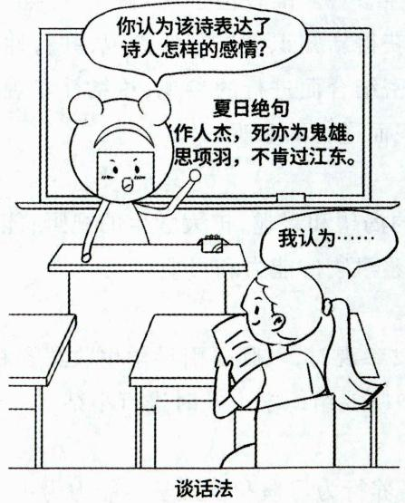

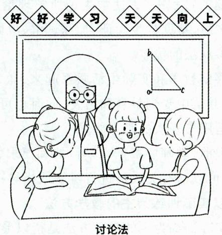