# (4) 读书指导法

① 读书指导法的概念

读书指导法是指教师指导学生通过阅读教科书和其他参考书,以获得知识、巩固知识、培养学生自学能力的一种方法。指导学生读书,包括指导学生阅读教科书和阅读课外书籍两个方面。

②运用读书指导法的基本要求

第一，提出明确的目的、要求和思考题。让学生自主掌握学习的方向、要求，主动去实现。

第二，教给学生读书的方法。让他们学会朗读、默读、浏览与精读等。

第三，善于在读书中发现问题和解决问题。读书要深入，关键在于对所学知识能否产生疑惑、提出问题进而解决问题。正如朱熹所言：“读书无疑者，须教有疑；有疑者，却要无疑，到这里方是长进。”

第四，适当组织学生交流读书心得。

# 2. 以直观感知为主的教学方法

这种教学方法具有形象性、具体性、直接性和真实性的特点，主要有演示法和参观法两种。

# (1)演示法

①演示法的概念

演示法是指教师通过展示实物、教具和示范性的实验来说明、印证某一事物和现象，使学生掌握新知识的一种教学方法。演示所使用的工具可分为四大类：实物、标本、模型、图片的演示；图表、示意图、地图的演示；实验演示；幻灯片、电影、录像的演示。演示法体现了直观性、理论联系实际的教学原则。

$②$ 运用演示法的基本要求

明确演示目的，做好演示准备；演示必须精确可靠、操作规范；演示时要引导学生集中注意力，运用多种感官去感知，以发展学生的思考力和观察力；演示结束后，教师要引导学生分析观察结果以及各种变化之间的关系，通过分析、对比、归纳、综合得出正确结论。

# (2) 参观法

①参观法的概念

参观法又称现场教学，是教师根据教学目的和要求，组织学生进行实地考察、研究，使学生获取新知识，巩固、验证旧知识的一种教学方法。

参观教学法主要有准备性参观、并行性参观和总结性参观。准备性参观是在学习某课题前，使学生为将要学习的新课题积累必要的感性经验，从而顺利获得新知识而进行的参观；并行性参观是在学习某课题的过程中，为使学生把所学理论知识与实际紧密结合而进行的参观；总结性参观是在完成某一课题之后，帮助学生验证、加深理解、巩固强化所学知识而进行的参观。

$②$ 参观法的优点

能够使教学和实际生活联系起来，激发学生对知识的渴望和兴趣，扩大学生的视野；能够使学生接触社会，并从中受到教育和启发，同时也可以培养学生观察事物的能力和习惯。

③运用参观法的基本要求

参观前，教师要根据教学目的和要求，做好准备工作；参观时，教师要引导学生收集资料，做好必要记录，也可以请有关人员进行讲解或指导；参观结束后，教师要组织学生及时进行小结。

# 3. 以实际训练为主的教学方法

以实际训练为主的教学方法是指以形成技能技巧、培养行为习惯和发展学生能力为主的教学方法。其特点是使学生通过实践活动动脑、动口、动手，提高学生分析问题和解决问题的能力，并养成良好的行

为习惯。以实际训练为主的教学方法主要有练习法、实验法、实习作业法、实践活动法四种。

# (1)练习法

①练习法的概念

练习法是指学生在教师的指导下巩固知识，培养各种技能和技巧的基本教学方法。练习法是中小学各科教学普遍采用的教学方法。

②运用练习法的基本要求

教师要使学生明确练习目的和要求；练习的题目要注意学生基础知识的积累、巩固以及基本技能的提高；教师要教给学生正确的练习方法，并对学生的练习进行及时的检查和反馈；在练习过程中要注意培养学生自我检查的能力和习惯；练习方式要多样化。

# (2)实验法

①实验法的概念

实验法是指教师引导学生使用一定的仪器和设备,进行独立操作,引起某些事物和现象产生变化,从而使学生获得直接经验,培养学生技能和技巧的教学方法。实验法常用于物理、化学、生物等自然学科的教学。

②实验法的优点

可以把理论与实践结合起来，有利于激发学生的求知欲望；有利于培养学生独立使用仪器进行科学实验的基本技能；有利于培养学生严谨的科学态度和扎实的作风。

③运用实验法的基本要求

认真编写实验计划，加强实验指导，做好实验总结。

# 小看课堂·

演示法中的实验演示与实验法易混淆，考生要注意两者的区别在于操作主体的不同：实验演示是教师做实验，学生看；实验法是学生做实验，教师指导。

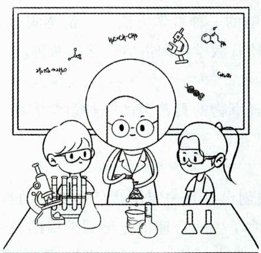  
演示法

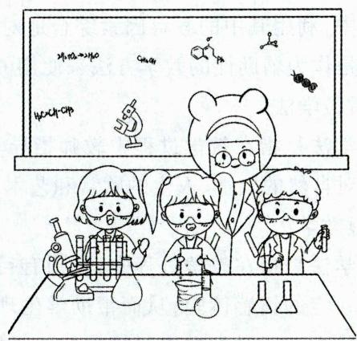  
实验法

# (3)实习作业法

①实习作业法的概念

实习作业法是指教师根据学科课程标准要求，指导学生运用所学知识在课上或课外进行实际操作，将知识运用于实践的教学方法。这种方法在自然学科的教学中占有重要的地位，如数学课的测量练习、生物课的植物栽培和动物饲养等。

②运用实习作业法的基本要求

实习作业法要在教师的指导下有目的、有计划、有组织地进行；实习中，教师要加强指导；实习结束

续表  

<table><tr><td>依据</td><td>类别</td><td>内容</td></tr><tr><td rowspan="3">学生信息获得的来源</td><td>通过语言</td><td>讲授法、谈话法、读书指导法、讨论法</td></tr><tr><td>通过直观</td><td>演示法、观察法</td></tr><tr><td>通过实际操作</td><td>练习法、实验法、实习作业法、研究法</td></tr></table>

真题7 [2024浙江宁波, 单选]在以语言传递为主的教学方法中, 要求教师进行一定的指导与监督, 不然学生容易脱离主题, 影响课堂教学进度的方法是( )

A. 讲授法

B. 讨论法

C. 参观法

D. 实践活动法

真题8 [2024安徽统考, 单选]在教师指导下, 学生利用一定的工具、仪器进行独立作业, 观察事物或现象的产生和变化, 以获得知识、培养技能的教学方法是( )

A. 练习法

B. 演示法

C. 实验法

D. 情境教学法

真题9 [2023河南郑州, 单选]航天员在中国空间站开讲“天宫课堂”第二课, 同时以“天地互动”的形式演示了太空“冰雪”实验、液桥演示实验、水油分离实验、太空抛物实验。这里运用的教学方法属于（）

A.实验法演示法  
B. 讨论法 演示法  
C. 讲授法 演示法  
D. 讲授法 讨论法

真题10 [2023辽宁营口,单选]以下教学方法中,均属于以学生的学习活动为主的一组方法是( )

A. 谈话法、演示法、读书指导法  
B. 讨论法、实验法、研究法  
C.演示法、讲授法、实习作业法  
D. 读书指导法、讲授法、谈话法

答案：7.B 8.C 9.C 10.B

# 考点4 国内外教学方法的改革与发展 ★【单选】

# 1.国内具有代表性的教学方法

(1)上海特级教师倪谷音首先倡导的愉快教学法。   
(2)江苏省特级教师李吉林首创的情境教学法。这种教学方法具有“形真”“情切”“意远”“理蕴其中”四个基本特征。  
(3)江苏常州特级教师邱学华首创的尝试教学法。教师采用“先练后讲”“先学后教”的方式，让学生先去尝试练习，依靠自己的努力初步解决问题，最后教师根据学生练习中的难点，有针对性地进行讲解。  
(4)以上海闸北八中校长刘京海为首的一批教改研究者首先提出的成功教学法。成功教学法的基本要素有三个：积极的期望、成功的机会和鼓励性评价。

# 2.国外具有代表性的教学方法

(1)美国心理学家布鲁纳倡导的发现法。与讲授法相比，发现法对于学习过程的关注超过对学习结果的关注。  
(2)依据美国教育学家布卢姆的“教育目标分类”和“掌握学习策略”所形成的目标教学法。  
(3)美国著名教育心理学家斯金纳倡导的程序教学法。  
(4)苏联教育家沙塔洛夫创造的“纲要信号图表”教学法。

(5)德国学者瓦·根舍因首创的范例教学法。  
(6)保加利亚医学和心理学博士洛扎诺夫首创的暗示教学法。暗示教学法在外语教学方面,被公认为创造了奇迹。  
(7)美国人本主义心理学家罗杰斯提出的非指导性教学法。  
(8)苏联心理学家和教育学家阿莫纳什维利等人提出的合作教学法。

# 3. 国外新涌现的有影响的教学方法

(1)案例教学法以案例为教学材料，围绕教学主题，通过讨论、问答等方式进行师生互动，从而让学生了解与教学主题相关的概念或理论，培养学生的高层次能力。  
(2)项目教学法将一个相对独立的学习任务作为一项研究课题交予学生独立完成,教师只起咨询、指导与解答疑难的作用。学生通过一个个具体项目的实施,就能了解和把握完成项目的每一具体环节及其基本要求,以及整个过程的重点和难点。  
(3)“行动导向”教学法以生活或职业情境为教学的参考，遵循“为行动而学习”的原则。  
(4) 模拟教学法是让学生在一种模拟真实情境的教学情境中, 学习课程所规定的知识从而锻炼自己能力的方法。  
(5)交际教学法强调在真实的生活情境中进行语言教学，改变传统上对词汇和语法规则的解释、理解和练习的教学方法。

真题11 [2023山东临沂, 单选]在对“沙尘暴”的探究活动中, 教师将共性问题“沙尘暴的发生”作为一项研究课题交予学生独立完成, 教师只起咨询、指导和答疑的作用。学生通过一个个具体项目的实施, 就能了解和把握完成项目的每一具体环节及其基本要求, 以及整个过程的重点和难点。这种教学方法是( )

A. 案例教学法

B. 项目教学法

C.“行动导向”教学法

D. 模拟教学法

答案：B

考点5 教学方法的选择和运用 ★★ 【单选、多选、判断、简答】

# 1. 选择与运用教学方法的基本依据

任何一种教学方法都是为促进学生学习和提高学生学习满意度服务的，其本身无所谓优劣、好坏，只有对特定教学目标、教学内容、教育对象以及教育情境适宜程度之别。选择与运用教学方法的基本依据包括：（1）教学目的和任务的要求；（2）课程性质和特点；（3）每节课的重点、难点；（4）学生年龄特征；（5）教学时间、设备、条件；（6）教师业务水平、实际经验及个性特点。

此外，教学方法的选择与运用还受教学手段、教学环境等因素的制约，这就要求我们要全面、具体、综合地考虑各种相关因素，进行权衡取舍。

真题12 [2023宁夏银川，简答]简述教学方法选择的依据。

答案：详见内文

# 2. 教学方法运用的综合性、灵活性、创造性

(1)教学方法运用的综合性是指根据教学任务和教学内容的需要，综合运用多种教学方法，而不要长期只使用一种教学方法。

(2)教学方法运用的灵活性是指在实际应用中，要从实际需要出发，随时对教学方法调整。  
(3)教学方法运用的创造性是指从教学实践出发，在把握现有教学方法的基础上有所创造。

# ★本节核心考点回顾 ★

# 1. 我国中小学主要的教学原则

我国中小学主要的教学原则包括：思想性（教育性）和科学性相统一的原则、理论联系实际原则、直观性原则、启发性原则、循序渐进原则、巩固性原则、因材施教原则、量力性原则等。

# 2. 思想性(教育性)和科学性相统一的原则

(1)实质：在教学活动中把教书和育人有机地结合起来。  
(2) 贯彻要求: ①教师要保证教学的科学性; ②教师要结合教学内容的特点进行思想品德教育; ③教师要通过教学活动的各个环节对学生进行思想品德教育; ④教师要不断提高自己的业务能力和思想水平。

# 3. 直观性原则

(1) 含义: 教师应尽量利用学生的多种感官和已有的经验, 通过各种形式的感知, 使学生获得生动的表象, 从而比较全面、深刻地掌握知识。  
(2)例子：荀子的“不闻不若闻之，闻之不若见之”。

# 4.启发性原则

(1) 含义: 教师要调动学生的主动性和积极性, 引导他们通过独立思考、积极探索, 生动活泼地学习, 自觉地掌握科学知识, 提高分析问题和解决问题的能力。  
(2)例子：孔子的“不惯不启，不悱不发”。

# 5. 循序渐进原则

(1) 含义: 教师要严格按照科学知识的内在逻辑和学生的认知发展规律进行教学, 使学生掌握系统的科学文化知识, 能力得到充分的发展。  
(2)例子：《学记》的“杂施而不孙，则坏乱而不修”。

# 6. 巩固性原则

(1) 含义: 教师在教学中要引导学生在理解的基础上牢固地掌握基础知识和基本技能, 而且在需要的时候, 能够准确无误地呈现出来, 以利于知识技能的利用。  
(2)例子：孔子的“学而时习之”。

# 7. 我国中小学常用的教学方法

(1)以语言传递为主的教学方法：讲授法、谈话法、讨论法、读书指导法。  
(2)以直观感知为主的教学方法：演示法、参观法。  
(3)以实际训练为主的教学方法：练习法、实验法、实习作业法、实践活动法。  
(4)以引导探究为主的教学方法：发现法。  
(5)以情感陶冶（体验）为主的教学方法：欣赏教学法、情境教学法。

# 8. 讨论法的优缺点

(1)优点：学生之间可以集思广益，互相启发，加深理解，提高认识，同时还可以激发学生的学习热情，培养学生对问题的钻研精神并训练学生的语言表达能力。  
(2)缺点：受到学生知识经验和能力发展水平的限制，容易出现讨论流于形式或者脱离主题的情

况，这需要教师加以注意。

# 9. 实验法

(1)含义：教师引导学生使用一定的仪器和设备，进行独立操作，引起某些事物和现象产生变化，从而使学生获得直接经验，培养学生技能和技巧。  
(2)基本要求：认真编写实验计划，加强实验指导，做好实验总结。

# 第四节 教学组织形式与教学工作的基本环节

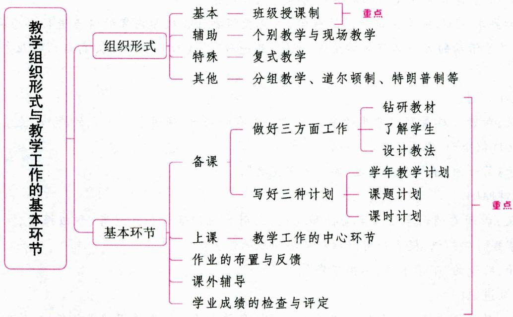

# 一、教学组织形式

# 考点1 教学组织形式的概念

学校教学工作是通过一定的组织形式进行的。教学组织形式是指教学活动中教师与学生为实现教学目标所采用的社会结合方式。个别教学制是古代学校的主要教学形式。

# 考点2 现代教学的基本组织形式——班级授课制 ★★★ 【单选、多选、判断、简答】

# 1. 班级授课制的概念

课堂教学的主要形式是班级授课制。班级授课制是把学生按年龄和文化程度分成固定人数的班级,教师根据课程计划和规定的时间表进行教学的一种组织形式。班级授课制是与现代化大生产相适应的集体教学形式。

# 2. 班级授课制的产生与发展

1632年，捷克教育家夸美纽斯出版的《大教学论》最早从理论上对班级授课制做了阐述，为班级授课制奠定了理论基础。后来，以赫尔巴特为代表的教育家提出教学过程的形式阶段论（即明了、联想/联合、系统、方法），班级授课制得以进一步完善而基本定型。最后，以苏联教育学家凯洛夫为代表，提出了课的类型和结构的概念，使班级授课制形成一个完整的体系。

在我国，最早采用班级授课制的是清政府于1862年设于北京的京师同文馆，并在癸卯学制中以法令形式确定下来，随之在全国范围内推广。

# 3. 班级授课制的基本特点

班级授课制的特征可用班、课、时三个字来概括，具体表现为：

（1）以班为单位集体授课，学生人数固定。  
(2)按课教学。“课”是教学活动的基本单元，一般分为单一课和综合课。  
(3)按时授课。把每一“课”规定在固定的单位时间内进行，这个单位时间称为“课时”，课与课之间有一定的间歇和休息。

# 4. 班级授课制的优点与不足

（1）班级授课制的优点

①有利于经济有效地大面积培养人才，提高教学效率。  
②它以“课”为教学活动单元，能保证学习活动循序渐进，有利于学生获得系统的科学知识。  
③有利于发挥教师的主导作用。各国的教学实践都反复证明，迄今为止，班级授课制最能充分发挥教师在教学中的主导作用。  
④有利于发挥学生集体的教育作用。  
⑤有利于学生德、智、体多方面的发展。  
⑥有利于进行教学管理和教学检查。

(2)班级授课制的不足

①不利于学生主体性的发挥。学生的独立性、自主性受到限制，不利于培养学生的志趣、特长。  
②不利于培养学生的探索精神、创造能力和实际操作能力。过于强调书本知识的学习,容易造成理论和实践的脱节。  
③不能很好地适应教学内容和教学方法的多样化。班级授课制中,无论用什么教学方法,都只能适应部分学生。  
④不利于因材施教，难以满足学生个性化的学习需要。  
⑤不利于学生之间真正的交流和启发。在班级授课制中,课堂成为学生生活的基本空间,课堂教学成为学生最主要的生活方式,学生的交往受到限制。  
⑥以“课”为基本的教学活动单位，某些情况下会割裂内容的整体性。

# 5. 班级授课制的改革趋势

新课程的实施必然要求革新传统的以“教”为本的班级授课制。历史上“道尔顿制”“文纳特卡制”等都曾风行一时，但未能长久，没有大面积地推广开。原因在于这些改革走过了头，摒弃了班级授课制的优点，甚至从根本上取消了班级授课制。在相当长的一段时间内，班级授课制仍将是我国中小学采用的主要教学组织形式。因此对班级授课制，不应简单地否定，应该贯彻“先立后破”和制度生成的渐进原则，在不取消班级组织的前提下做必要的改进，而不宜采取激进的态度和虚无主义的方式。

20世纪50年代以后，在继承以往改革成果的基础上，开始从全面、系统的角度，分析影响教学活动的各种因素，寻求最佳的教学组织形式，它们主要表现为分层教学、小组合作教学和小班教学。

真题1 [2023安徽统考，单选]当前我国学校教学的基本组织形式为（）

A.个别教学

B. 现场教学

C. 分组教学

D. 班级授课制

真题2 [2023辽宁营口，单选]各国教学实践反复证明，（ ）最能充分发挥教师在教学中的主导作用。

A.个别教学制  
B. 分组教学制  
C. 班级授课制  
D. 道尔顿制

真题3 [2023山东济南，多选]班级授课制作为一种教学基本组织形式，其优点主要有（）

A. 有助于提高教学效率  
B. 有利于学生的自主学习  
C. 有利于发挥班集体的教育作用  
D. 有利于合理安排各科教学的内容和进度并加强教学管理

真题4 [2024浙江金华,简答]“班级授课制”的局限性有哪些？

答案：1.D 2.C 3.ACD 4.详见内文

考点 8 现代教学的辅助形式——个别教学与现场教学 ★【单选、判断】

# 1.个别教学

# (1)个别教学的概念

个别教学是教师针对不同学生的情况进行个别辅导的教学组织形式。它是班级授课制的一种辅助形式。个别教学是历史上最早出现的教学组织形式,在奴隶社会和封建社会,个别教学一直是教学的主要形式。中国古代的私塾和欧洲中世纪前的教学采用的就是这种教学组织形式。

# (2)个别教学的优缺点

个别教学最显著的优点在于教师能根据学生的特点因材施教，使教学内容、进度适合于每一个学生的接受能力。但是这种教学形式下，教师只同个别学生产生联系，难以形成学生集体。

# (3)个别教学的要求

①发挥每个学生的潜力和积极因素，培养学生各自的优势，克服各自的缺点；  
(2)既要针对个体,又要使个体不脱离群体;   
③要制定详细的个案分析,综合运用各种教育组织形式,灵活运用各种教学方法,做好各项工作。

# 2. 现场教学

# (1)现场教学的概念

现场教学是指教师把学生带到事物发生、发展的现场进行教学活动的形式。它可以以班级为单位，也可以以小组或个人为单位，通常需要有关现场人员的参加。

# (2)现场教学的要求

① 目的明确；② 准备充分；③ 现场指导；④ 及时总结。

真题5 [2024山西太原，判断]个别教学和现场教学是现代教学的基本形式。（）

答案：×

考点4 现代教学的特殊组织形式——复式教学 ★【单选】

# 1. 复式教学的概念

复式教学是把两个或两个以上不同年级的学生编在一个教室里,由一位教师分别用不同的教材,在一节课里对不同年级的学生进行教学的一种特殊组织形式。复式教学中教师的教学与学生自学或做作业交替进行,动静结合是复式教学的重要特点,它适用于学生少、教师少、校舍和教学设备较差的

农村以及偏远地区。

# 2. 组织复式教学的要求

(1)合理编班，要根据学生人数、教室大小、师资质量等情况全面考虑，灵活掌握；(2)编制复式班课表；(3)培养小助手；(4)建立良好的课堂常规。

真题6 [2023广东深圳, 单选] 深圳某中学初中部赵老师即将被派往某山区中学支教, 该中学位于大山深处, 全校只有学生44人, 初一13人, 初二15人, 初三16人, 教师皆由全省各地学校支教人员轮流担任。为了充分利用这次机会, 赵老师必须选择最有实效的教学方式, 则下列做法最合适的是 ( )

A. 给一个年级上课时, 其他两个年级上自习  
B. 延长总的教学时间, 让各年级学生分时间段来学校上课  
C. 采用复式教学方式, 即在同一教室给三个不同年级的学生上课  
D. 把每个年级的课时缩短, 每天能够照顾到所有年级

答案：C

考点5 其他教学组织形式 ★【单选、多选、判断】

# 1. 分组教学

(1)分组教学的概念

分组教学是指在按年龄编班或取消按年龄编班的基础上，根据学生能力、成绩分组进行编班的教学组织形式。

(2)分组教学的类型

①外部分组，即取消按年龄编班，按学生的能力或某些测验成绩编班。

②内部分组，即在按年龄编班的班级内，再根据学生的成绩将他们分成若干个不同的小组。

③能力分组,即根据学生的能力发展水平进行分组教学,各组课程相同,学习年限则不同。

④作业分组,即根据学生的特点和意愿进行分组教学,各组学习年限相同,课程则不同。

(3)分组教学的优点和局限

①分组教学的优点

分组教学比班级上课更适应学生个人的水平和特点，便于因材施教，有利于人才的培养；便于学生的交流合作；有助于学生组织能力、管理能力、表达能力以及问题解决能力的培养；有利于学生在与小组成员的竞争与合作中，强化自己的学习动机。

②分组教学的局限

分组教学较难科学鉴别学生的能力和水平；在对待分组教学上，学生家长和教师的意愿常常与学校要求相矛盾；分组后有可能产生一定的副作用，使快班学生产生骄傲情绪，慢班、普通班学生的学习积极性降低。

(4)分组教学的要求

①充分了解学生；②制订个体教学计划；③保证教学井然有序；④深入钻研教材教法。

# 2. 道尔顿制

道尔顿制是由美国教育家柏克赫斯特创建的一种典型的自学辅导式的教学组织形式。1922年，《教育杂志》刊登《道尔顿实验室计划》一文，道尔顿制被介绍到中国。1923年，全国教育会联合会第九届年会通过了《新制中学及师范学校宜研究试行道尔顿制案》的决议，该案认为道尔顿制作为新教学

法，“其用意在适应个性，指导研究，打破学年制”，提议在中学和师范学校先行试验，若确有成效，再不断推广。

道尔顿制的主要措施是：(1)把教室一律改为作业室，作业室按学科分设，室内陈列各科的参考书、图表及实验仪器等，供学生学习使用；(2)废除班级授课制，把各科教学内容制成分学期、分月、分周的作业大纲，规定每学期、每月、每周应完成的各项作业及其进度，由学生根据各科作业大纲自行学习，自行记载成绩表，教师在作业室担任指导者；(3)实行学分制，年级递升具有一定的弹性和自由度。

道尔顿制的优点是有利于调动学生学习的主动性,培养他们的学习能力和创造才能;缺点是不利于系统知识的掌握,对教学设施和条件要求较高。

# 3. 特朗普制

特朗普制又称“灵活的课程表”“综合教学制”，是美国教育家劳伊德·特朗普于20世纪50年代提出的一种教学组织形式。这种教学组织形式把大班上课、小班讨论、个人自学结合起来，以灵活的时间单位代替固定统一的上课时间，以大约20分钟为计算课时的单位。首先，由优秀教师采用现代化教学手段给大班进行集体教学，然后在15~20人组成的小班里开展研究讨论，最后由学生个人独立自学、研习、作业。这种形式把教学时间进行了划分，大班上课占40%，小班讨论占20%，个人自学占40%。

特朗普制既有班级授课制的优点，也有个别教学的长处，但管理起来比较麻烦。

# 4. 设计教学法

1918年,美国教育家克伯屈发表了论文《设计教学法》,系统地归纳和阐述了设计教学法的理论,赢得了很大的声誉,被称为“设计教学法之父”。克伯屈强调“有目的的活动”是设计教学法的核心,儿童自动的、自发的、有目的学习是设计教学法的本质。他着重突出学生通过主动操作,掌握解决问题的能力,学习实际有用的知识,同时,通过学习内容与学生经验的相关性来调动学生的兴趣和学习动机。

设计教学法主张废除班级授课制和教科书，打破传统的学科界限，教师不直接向学生传授知识和技能，而是指导学生根据自己已有的知识和兴趣，自行组成以生活问题为中心的综合性学习单元。

设计教学法的重点是以活动课程代替学科课程，使学生在活动中获得对知识的整体认知。其主要缺陷是忽视系统知识，影响教学质量，而且在教学实施过程中困难很多，难以落实。

# 5. 贝尔一兰喀斯特制

贝尔一兰喀斯特制，也称为导生制，是由英国人贝尔和兰喀斯特于18世纪末19世纪初创建的，这种教学组织形式仍以班级为基础，但教师不直接面向班级全体学生，教师先把教学内容教给年龄较大的学生，而后由他们中间的佼佼者——导生去教年幼的或成绩较差的其他学生。

贝尔一兰喀斯特制是在英国工场手工业向大机器生产过渡的过程中，在需要大规模培养学生且师资比较缺乏的情况下出现的。导生“现买现卖”，很难保证基本的教学质量。

# 6. 文纳特卡制

这是美国人华虚朋于1919年在芝加哥市郊文纳特卡镇公立学校实行的教学组织形式。其指导思想和道尔顿制大致相同，做法则完全不一样。它把课程分成两部分：一部分按学科进行，由学生个人自学读、写、算和历史、地理方面的知识和技能；另一部分是通过音乐、艺术、运动、集会，以及开办商店、组织自治会来培养学生的“社会意识”。前者通过个别教学进行，后者通过团体活动进行。

文纳特卡制的特点是：(1)按单元进行学习，各单元都有明确的学习目标和具体的学习内容，并配以小步子的自学教材；(2)每个单元结束后，经测验诊断，接着学习新的单元；(3)教师随时对学生进行个别指导。

# 7. 葛雷制

葛雷制的创始人是美国教育家沃特，葛雷制亦称“双校制”“二部制”或“分团学制”。

沃特以杜威的基本思想如“教育即生活”“学校即社会”和“从做中学”为依据，以具有社会性质的作业为学校的课程。他把学校分为四个部分：体育运动场、教室、工厂和商店、礼堂。课程也分成四个方面：学术工作，科学、工艺和家政，团体活动以及体育和游戏。沃特把葛雷学校称作“工读游戏学校”。

葛雷学校以其独特的教学制度而闻名。为了减少学校经费开支,充分利用现有的设施以提高办学效率,沃特在教学中采用二重编制法,即将全校学生一分为二,一部分在教室上课,另一部分则在体育场、图书馆、工厂、商店以及其他场所活动,上下午对调,废除寒暑假和星期日,昼夜开放,从而为更多的学生提供了入学受教育的机会,解决了葛雷地区学校少、供不应求的矛盾。

真题7 [2024河北石家庄，单选]关于分组教学的叙述，正确的是（）

A.是一种典型的自学辅导式的教学组织形式  
B. 便于因材施教, 缩小学生之间的学习差距   
C. 主要特点是直接教学与学生做作业交替进行  
D. 主要是根据学生学习能力、成绩进行分组的

真题8 [2023黑龙江哈尔滨，单选]把大班上课、小班讨论和个别自学结合起来的教学组织形式叫作（）

A. 道尔顿制

B. 特朗普制

C. 分组教学制

D. 班级授课制

真题9 [2023河南郑州, 单选]设计教学法打破传统的班级授课制, 不受教科书和学科限制, 主张儿童根据自己的兴趣决定学习目的和知识内容, 在学生自己设计、自己负责的单元活动中获得有关知识和解决实际问题的能力。它的核心是（）

A. 有目的的活动

B.学生的积极思维

C. 学生的主动操作

D. 儿童自动学习

真题10 [2024浙江金华, 判断]道尔顿制有利于调动学生学习的主动性, 培养他们的学习能力和创造才能。（）

答案：7.D 8.B 9.A 10.√

# 考点6 当前教学组织形式改革的重点

(1)适当缩小班级规模，使教学单位趋向合理化。  
(2)改进班级授课制，实现多种教学组织形式的综合运用。  
(3)多样化的座位排列，加强课堂教学的交往互动。   
(4)探索个别化教学。

表 1-39 常见座位编排的比较  

<table><tr><td>座位类型</td><td>结构特征</td><td>主要功能</td><td>局限</td><td>适用范围</td></tr><tr><td>秧田形</td><td>学生纵横直排而坐，全部面向教师</td><td>便于全体学生集中听课和教师授课；有利于大班教学</td><td>学生活动空间小；除同桌学生以外，彼此不易互动</td><td>教师集中讲授、学生接受</td></tr><tr><td>马蹄形</td><td>学生环绕教师而坐，大部分学生能相互面对</td><td>教师能方便地走近每一个学生；两边的学生能彼此有视觉接触和非言语交流；公共活动空间大</td><td>不利于大班教学（若采用双马蹄形，则可容纳更多的学生）</td><td>便于教师组织全班性的讨论、动作示范；有利于多个学生的活动表演</td></tr><tr><td>圆形</td><td>学生环绕教师而坐，既可面向教师，也能彼此相对</td><td>全体学生彼此之间都能有视觉接触和非言语交流；学生之间互动方便；教师容易走近每个学生；公共活动空间大</td><td>不利于大班教学（若采用双环形，则可容纳更多的学生）</td><td>便于教师组织全班性的讨论、动作示范；有利于多个学生的活动表演</td></tr><tr><td>模块形</td><td>同桌学生之间环形而坐，不同桌学生相互独立</td><td>同桌学生之间互动方便、深入</td><td>不同桌学生之间难于互动</td><td>便于学生分组学习（小组讨论或合作学习）</td></tr></table>

# 二、教学工作的基本环节 ★★★ 【单选、多选、填空、判断、简答】

教师教学工作包括五个基本环节（基本程序）：备课、上课、作业的布置与反馈、课外辅导和学业成绩的检查与评定。

# 考点1 备课

备课就是教师根据学科课程标准的要求和本门课程的特点，结合学生的具体情况，选择最合适的表达方法和顺序，以保证学生有效地学习。

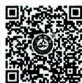  
教学工作的基本环节——备课

# 1.备课的意义

备课是教师教学的起始环节，是上好课的先决条件，备好课是教好课的前提。对教师而言，备好课可以加强教学的计划性，有利于教师充分发挥主导作用。教师要在平时的学习、生活中有意识地收集教学资料，为上课做准备。

# 2. 备课的类型

(1)根据备课主体，可将备课分为个人备课和集体备课

①个人备课是教师自己钻研学科课程标准和教材的活动。②集体备课是由相同学科和相同年级的教师共同钻研教材，解决教材的重点、难点和教学方法等问题的活动。集体备课可以最大限度地挖掘集体智慧，发挥团队效应，培养教师的团结协作精神，使每位具有不同智慧、知识结构、认知风格的教师相互启发、互相补充、共同提高。

(2)根据备课涉及内容的范围，可将备课分为学期备课、单元备课和课时备课

①学期备课指教师与教师群体（如教研组）对所教学科整个学期的全部教学内容与教学活动做出的通盘考虑、规划与设计，属于战略层面的备课。②单元备课指教师或教研组在学期备课的基础上，在每个单元进行之前，针对一个单元而进行的教学准备工作。③课时备课是教师备课最经常性的工作，具体落实到教案即课时教学方案的编写上。

(3)根据备课形式，可将备课分为显性备课和隐性备课

①显性备课就是平时强调的教师外化的备课行为，包括查阅资料、书写教案、制作教具等。②隐性备课强调教师将备课行为内在化、系统化、连续化，真正将自己平时的学习、科研等活动和教学结合起来，包括上课之前的思考、课后的审视与反思等。

# 3. 教师应如何备课（备课的要求）

(1)做好三个方面的工作

教师备课要做好三方面的工作，即钻研教材、了解学生、设计教法，也即备教材、备学生、备教法。

①钻研教材：教师备课首先要钻研教材，吃透教材。钻研教材包括钻研学科课程标准、钻研教科书和阅读有关参考资料。其中，钻研学科课程标准就是指教师应了解本学科的教学目的、任务，掌握教材体系、重点、难点和关键，明确教学中应注意的问题。钻研教科书是指教师要熟练掌握教科书的内容。教师掌握教材有一个深化的过程，一般要经过懂、透、化三个阶段。懂，就是对教材的基本思想、基本概念、每句话、每个字都要弄清楚，弄懂；透，即要透彻了解教材的结构、重点与难点，掌握知识的逻辑，能运用自如，知道应补充哪些资料，怎样才能教好；化，就是教师的思想感情和教材的思想性、科学性融合在一起了。达到化的境界，就完整地掌握了教材。

②了解学生：备学生的关键在于了解学生学习的需要。备学生需要从了解学生学习的需要出发，而非以了解教材为出发点。了解学生应当是全面的。首先要考虑学生总体的年龄特征，熟悉他们身心发展的特点；其次要了解学生个体的能力水平、学习态度和兴趣特点。此外，还要了解班级的一般状况，如班纪班风等。  
③设计教法：教师要在钻研教材、了解学生的基础上，考虑用什么方法使学生有效地掌握知识并促进他们能力、品德等方面的发展。教师应根据教学目的、教学内容、学生的特点等来选择最佳的教学方法。此外，还要相应地考虑学生的学法，包括预习、学生在课堂中的学习活动与课外作业等。

# (2)写好三种计划

教师备课还要写好三种计划，即学年(或学期)教学计划、课题(或单元)计划、课时计划（教案）。

①学年(或学期)教学计划：该计划包括学生情况的简要分析、本学期或学年的教学总要求、教科书的章节或课题、各课题的教学时数和时间的具体安排、各课题所需要运用的教学手段等。  
② 课题(或单元)计划：在制订好学年教学计划的基础上，教师还要制订出课题计划。课题计划一般包括：课题名称、课题教学目的、课时划分、各课时课的类型、主要教学方法、必要的教具。此外，教师还要考虑课题之间的联系，做好协调工作。  
③课时计划（教案）：它通常是指教师为某一节课而拟订的上课计划，一般包括班级、学科名称、授课时间、课题、教学目的、课的类型、教学进程等。教案编写的大致步骤为：钻研教材—分析学生—确定教学目标—确定教学重点、难点—选择教学方法、教学媒体—设计教学过程（教学进程）—教学反思。其中，设计教学过程（教学进程）是教案的主体部分，也是教师编写教案时花费时间、耗费精力最多的部分。上课前，教师必须写好课题计划与教案。但教案可以有详有略。一般来说，新教师应当写得详细些，有经验的教师可以写得简略些。

# 考点2 上课

# 1.上课的意义

上课是整个教学工作的中心环节，是教师教和学生学的最直接的体现，是提高教学质量的关键。教学的成败、教学质量的高低，主要取决于上课的成败与质量的高低。

# 2. 课的类型

(1)根据教学的任务，课可分为传授新知识的课（新授课）、巩固知识的复习课（巩固课）、培养技能技巧的课（技能课）、检查知识和技能技巧的课（检查课）、自学课。其中，检查知识和技能技巧的课（检查课）即用整节或连续两节课的时间检查学生对已学知识和技能技巧的掌握程度，其目的在于了解学生的学习情况，对每个学生的成绩给以评价，并针对存在的问题进行弥补。  
(2)根据一节课所完成任务的类型数，课可分为单一课和综合课。  
(3)根据使用的主要教学方法，课可分为讲授课、演示课（演示实验或放幻灯片、录像）、练习课、实

验课和复习课。

# 3. 课的结构

课的结构是指课的基本组成部分及各组成部分进行的顺序、时限和相互关系，不同类型的课有不同的结构。

(1)新授课的结构：组织教学，检查或复习，提出新课的目的、内容要点与学习要求，讲授新课（主要部分），小结，布置作业。  
(2)技能课的结构：组织教学，提出培养技能技巧的目的、要求，教师讲解原理、范例或做示范操作，在教师指导下学生独立进行练习（主要部分），小结，布置作业。  
(3)复习课的结构：组织教学，提出复习目的与要求，引导学生复习（主要部分），小结，布置作业。  
(4)综合课的结构：组织教学，检查与复习，提出教学目的并讲授新课，巩固新课，布置作业。

一般来说，构成课的基本组成部分有组织教学、检查复习、讲授新教材、巩固新教材、布置课外作业等。其中，组织教学并不只在上课开始时进行，而是贯穿教学过程的各个环节，直到下课。检查复习的目的在于对已学知识进行复习巩固，了解学生掌握的情况，加强新旧知识的联系，培养学生对学业的责任感和按时完成作业的习惯。

# 4. 一节好课的标准

(1)要使学生的注意力集中；(2)要使学生的思维活跃；(3)要使学生积极参与到课堂中来；(4)要使个别学生得到照顾。

# 5. 上好课的基本要求

(1)教学目标明确；(2)教学内容准确；(3)教学结构合理；(4)教学方法适当；(5)讲究教学艺术；(6)板书有序；(7)充分发挥学生的主体性，这是上好课的最根本的要求。

# 知识再拔高·

# 上好一堂课的基本要求的其他说法

说法一：(1)目标明确。(2)重点突出。(3)内容正确。(4)方法得当。(5)表达清晰。(6)组织严密；(7)气氛热烈。课应该自始至终在教师的指导下充分发挥学生学习的积极性。教师注意因材施教，使每个学生都能积极地动脑、动口、动手，课堂内充满民主的气氛，形成生动活泼的教学局面。

说法二：(1)目的明确。(2)内容正确。讲课时做到内容正确，这是一堂好课最基本的要求。内容正确有两方面的含义：首先，教师的讲授要保证教材内容的科学性和思想性。其次，教师在进行教学时，要注意教材的重点和难点，并以重点和难点为突破口，带动学生掌握整门学科的基本内容。(3)方法恰当。(4)组织严密。(5)语言清晰。(6)积极性高。

说法三：(1)明确教学目的。这是上好一节课的前提。(2)保证教学的科学性与思想性。这是上好一堂课的基本的质量要求。(3)调动学生学习的积极性。这是上好一堂课的内在动力。(4)注重解惑纠错。这是上好一堂课的关键。(5)组织好教学活动。这是上好一堂课的保障。(6)布置课外作业。

# 考点 3 作业的布置与反馈

# 1. 作业的意义

作业是学生利用所学知识进行实践的主要形式，是培养学生思维能力、分析能力、计算能力、独立

解决问题能力的重要途径，也是教学反馈的主要渠道，是整个教学工作中不可缺少的一部分，是课堂教学的延伸。无论是课内作业还是课外作业，作用都在于加深和加强学生对教材的理解和巩固，帮助学生掌握相关的技能、技巧。通过作业的布置、检查和批改，教师可以及时发现学生在知识或技能方面的缺陷并加以纠正，同时对学生的作业完成情况做出评价并提出进一步学习的建议。

# 2. 作业的形式

(1) 阅读作业, 如复习、预习教科书, 阅读人文和科学读物; (2) 口头作业, 如口头回答、朗读、复述、背诵; (3) 书面作业, 如演算习题、作文、绘图; (4) 实践作业, 如观察、实验、测量、社会调查等。

# 3. 布置作业的要求

(1)作业内容符合课程标准的要求；(2)考虑不同学生的能力需求；(3)分量适宜、难易适度；(4)作业形式多样，具有多选性；(5)要求明确，规定作业完成时间；(6)作业反馈清晰、及时；(7)作业要具有典型意义和举一反三的作用；(8)作业应有助于启发学生的思维，含有鼓励学生独立探索并进行创造性思维的因素；(9)尽量同现代生产和社会生活中的实际问题结合起来，力求理论联系实际。

# 4. 批改作业的基本要求

(1) 批改作业要及时；(2) 批改方式要灵活；(3) 要尊重学生；(4) 批改态度要认真；(5) 批改符号要统一；(6) 批改要与讲评紧密结合。

# 5. 批改作业的形式

教师批改作业的方式有全面批改、重点批改、轮流批改、当面批改等。有的教师还采取由学生自己批改或互相批改、教师检查及典型问题师生共同批改的办法，以培养学生发现问题、解决问题的能力。

# 考点4 课外辅导

# 1.课外辅导的内容

(1)帮学生解答疑难问题，指导学生做好作业；(2)为基础差和因事、因病缺课的学生补课；(3)为成绩特别优异的学生做个别辅导；(4)对学生进行学习方法上的辅导；(5)对学生进行学习目的和学习态度的教育。

# 2.课外辅导的意义

课外辅导是上课的必要补充, 是适应学生个别差异、贯彻因材施教的重要措施。

# 考点5 学业成绩的检查与评定

# 1. 学业成绩检查与评定的意义

学业成绩的检查与评定是教学工作的一个重要环节，它对教学工作的顺利进行和教学质量的提高具有十分重要的意义：(1)教师可以从中发现教学得失，进一步研究改进教学；(2)学校领导可以及时了解教学的情况，加强管理，采取相应的改进措施；(3)学生可以从中获得矫正性信息，调整自己的学习；(4)学生家长也可以了解子女的学习情况，配合学校指导和监督学生的学习。

# 2.学业成绩检查的方式

检查学生学业成绩的方法是多种多样的。常用的检查方式有两大类：平时考查和考试。

平时考查的方式主要有口头提问、检查书面作业和单元测验等。考试是对学生知识、技能等进行总结性检查时所采用的一种方式。它通常在学习告一段落后，为了系统地检查和衡量所学知识、技能等方面的情况，在期中、期末和毕业时进行。

真题11 [2024广东广州，单选]“化”“懂”“透”是教师对教材理解和掌握应达到的三个层次，下列有关说法正确的有（）个。

(1)“化”是要真正清楚教材中基本思想、基本概念、每句话、每个字  
②“懂”是在“化”的基础上对教材的重点和难点，做到透彻掌握，融会贯通  
③“透”是将教材蕴含的思想性、科学性和教师自身的思想感情相融，提升教学境界

A. 0

B. 1

C. 2

D. 3

真题12 [2024河北石家庄，单选]教师上好一节课的关键是（）

A.组织好教学活动

B. 明确教学目的

C. 调动学生积极性

D. 注重解惑纠错

真题13 [2023辽宁营口，单选]课的结构是被课的类型决定的，新授课的结构通常为（）

A.组织教学,检查与复习,提出教学目的并讲授新课,巩固新课,布置作业  
B. 组织教学, 提出复习目的与要求, 引导学生复习, 小结, 布置作业  
C. 组织教学, 提出培养技能技巧的目的、要求, 教师讲解原理、范例或做示范操作, 学生独立进行练习, 小结, 布置作业  
D. 组织教学, 检查或复习, 提出新课的目的、内容要点与学习要求, 讲授新课, 小结, 布置作业

真题14 [2022河南信阳，判断]课外辅导是课堂教学的必要补充，是适应学生个别差异、贯彻因材施教原则的重要措施。（）

真题15 [2023安徽统考，简答]简述备课的主要内容。

答案：11.A 12.D 13.D 14.√ 15.详见内文

# ★本节核心考点回顾 ★

# 1. 班级授课制

(1) 概念: 班级授课制是把学生按年龄和文化程度分成固定人数的班级, 教师根据课程计划和规定的时间表进行教学的一种组织形式。  
(2)基本特点：班、课、时。  
(3)优点: 有利于经济有效地大面积培养人才, 提高教学效率; 有利于学生获得系统的科学知识; 有利于发挥教师的主导作用; 等等。  
(4)局限性：不利于学生主体性的发挥；不利于培养学生的探索精神、创造能力和实际操作能力；不利于因材施教，难以满足学生个性化的学习需要；等等。

# 2. 教学工作的基本环节

教师教学工作包括五个基本环节（基本程序）：备课、上课、作业的布置与反馈、课外辅导和学业成绩的检查与评定。

# 3. 备课

(1)意义：教师教学的起始环节，上好课的先决条件与教好课的前提。  
(2)要求：①做好三方面的工作，即钻研教材、了解学生、设计教法，也即备教材、备学生、备教法。  
②写好三种计划，即学年(或学期)教学计划、课题(或单元)计划、课时计划（教案）。

# 4.上课

(1)意义：教学工作的中心环节，提高教学质量的关键。  
(2)课的类型：根据一节课所完成任务的类型数，课可分为单一课和综合课。  
(3)上好课最根本的要求：充分发挥学生的主体性。

# 第五节 教学评价

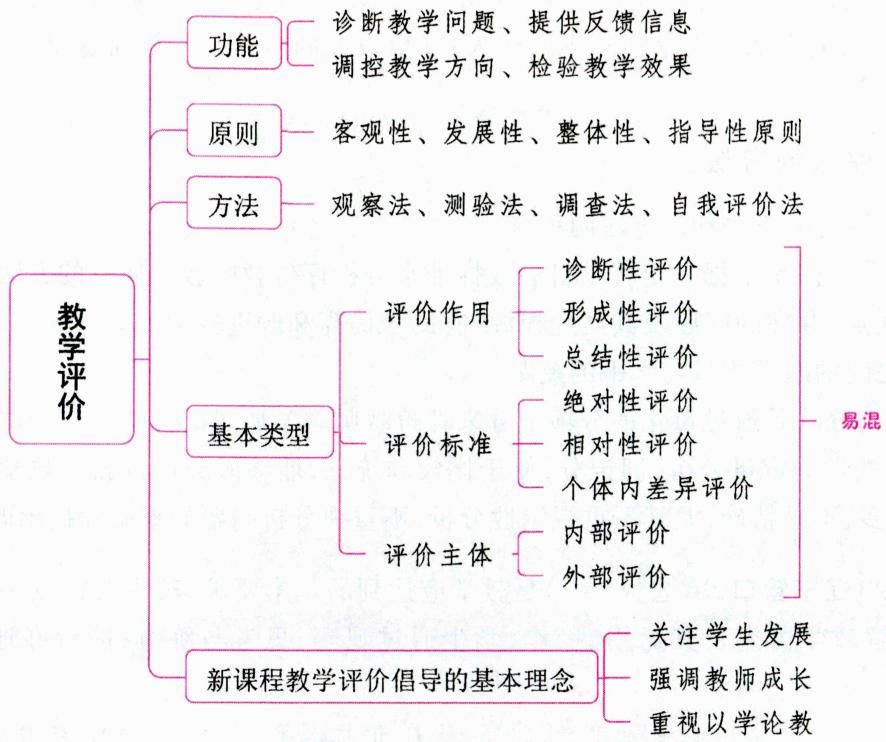

# 一、教学评价的内涵

教学评价是指以教学目标为依据，通过一定的标准和手段，对教学活动及其结果给予价值上的判断，即对教学活动及其结果进行测量、分析和评定的过程。它以参与教学活动的教师、学生、教学目标、内容、方法、教学设备、场地和时间等因素的有机组合的过程和结果为评价对象，是对教学工作的整体功能所做的评价。其目的是对课程、教学方法以及学生培养方案做出决策。

# 二、教学评价的内容 ★【单选】

教学评价主要包括对学生学习结果的评价和对教师教学工作的评价, 也可以划分为学生学业评价、课堂教学评价和教师评价。

这里重点介绍教师教学工作的评价。教师教学工作的评价，亦称“评教”，是对教师教学的质量分析和评价。

# 考点1 教学的几种水平

根据现代教学理论的研究，教学可分为三种水平。

(1) 记忆水平。这是一种低水平的教学。其主要特点是: 教师照本宣科、一味灌输, 不会引导、启发, 学生则停滞在机械掌握、一知半解上, 不能保证教学质量。主要原因是教师水平太低, 对教材未能很好地掌握, 教学又不得法。要改变这种状况, 必须提高教师的专业水平和运用教学方法的能力。  
(2)理解水平。这是教学应达到的基本要求。其主要特点是：教师能系统、明确地联系实际讲解教学内容及其运用、操作，学生通过观察、思考与练习，能较好地掌握所学知识、技能。但这种水平的教

学, 重教而不重学, 重教师主导作用而不重发挥学生主动性, 培养学生独立思考与探索能力不够。故只有注重更新教学观念, 加强教学研究与革新, 才能在教学水平上有新的突破。

(3)探索水平。这是教学的较高境界。其主要特点是：教师注重启发、诱导、激励，善于提出发人深思、能挑战学生智慧的问题；学生能主动质疑、辨析、独立思考、发表个人见解，进行探究与论争；师生协力，集思广益，推动探取真知的教学活动不断深入；师生双方的主动性都得到发挥，对教学都感到有收获、有乐趣、很眷恋。

# 考点2 评教的方法

评教的方法主要有分析法和记分法两种。

(1)分析法。分析法是根据一定教学目的或标准来分析评价教师教学质量的方法。分析法能帮助教师明确教学的优点、存在的问题及其产生根源，有助于提高和改进教学。但它缺乏定量的评定，难以比较和区分教师之间的教学质量与水平的差距。  
(2)记分法。记分法是通过量化的分项记分来评价教师教学质量的方法。记分法评价教学工作比较全面,特别重视教学的定量分析,即记分,便于比较和统计,能够区分每位教师教学得分的高低。但测评、记分费时甚多,不易精确,尤其不重视定性分析,不重视分析问题的根源和提出改进的建议。

真题1 [2023辽宁营口, 单选]( )是教学应达到的基本要求, 其主要特点是: 教师能系统、明确地联系实际讲解教学内容及其运用、操作, 学生通过观察、思考与练习, 能较好地掌握所学知识、技能。

A.理解水平

B.探索水平

C. 记忆水平

D. 标准水平

答案：A

# 三、教学评价的意义 ★ 【判断、简答】

(1)对学校来说，可以记载和积累学生学习情况的资料，定期向家长报告他们子女的成绩，并作为学生升级、留级和能否毕业的依据；  
(2)对教师来说，可以及时了解学生的学习情况和获得教学效果的反馈信息，明白自己教学的优缺点，以改进教学；  
(3)对学生来说，可以及时得到学习效果的反馈信息，明确自己学习中的长处与不足，以扬长补短；  
(4)对领导来说，可以了解每个教师、班的教学情况，便于发现问题与总结经验，以改进教学；  
(5)对家长来说，可以了解子女的学习情况及其变化，以便配合学校进行教育。

教学评价最重要的作用在于运用它来探明、改善和提高教学活动本身的功能。

真题2 [2023辽宁营口，判断]教学评价最重要的作用在于运用它来探明、改善和提高教学活动本身的功能。（）

A. 正确

B. 错误

答案：A

# 四、教学评价的功能 ★ 【单选、多选、简答】

教学评价是教学工作不可缺少的一个基本环节，从整体上调节、控制着教学活动的进行，保证着教学活动向预定的目标前进并最终达到该目标。具体来说，教学评价的功能主要表现在：（1）诊断教学问

题；(2)提供反馈信息；(3)调控教学方向；(4)检验教学效果。

关于教学评价的功能，除上述说法外，还有以下说法：

说法一：教学评价具有导向功能、诊断功能、激励功能、教学功能和管理功能。

说法二：教学评价具有导向功能、监督检查功能、激励功能、筛选优功能和诊断改进功能。

真题3 [2022湖南长沙，单选]教学评价的功能不包括（）

A. 导向功能

B. 反馈功能

C. 奖惩功能

D. 诊断功能

真题4 [2024安徽合肥/淮北/铜陵,简答]简述教学评价的功能和意义。

答案：3.C 4.详见内文

# 五、教学评价的原则 ★【单选】

# 1.客观性原则

(1)评价标准客观，不带随意性；(2)评价方法客观，不带偶然性；(3)评价态度客观，不带主观性。

# 2. 发展性原则

教学评价是鼓励师生、促进教学的手段，所以教学评价应着眼于学生的学习进步和动态发展，着眼于教师的教学改进和能力提高，以调动师生的积极性，提高教学质量。

# 3. 整体性原则

(1) 评价标准全面, 尽可能包括教学目标和任务的各项内容, 防止突出一点、不及其余; (2) 把握主次, 区分轻重; (3) 把分数评价、等级评价和语言评价结合起来, 以求全面、准确地接近客观实际。

# 4.指导性原则

(1) 明确教学评价的指导思想在于帮助师生改进教学和学习，提高教学质量；(2) 及时反馈信息；(3) 重视形成性评价的作用以便及时矫正；(4) 对学生或教师的分析指导要切合实际，注意发扬优势，克服不足。

# 知识再拔高·

# 教学评价的原则的其他说法

说法一：(1)客观性原则；(2)发展性原则；(3)指导性原则；(4)计划性原则。

说法二：(1)客观性原则。(2)科学性与可行性相统一原则。(3)主体性原则。在教学评价过程中，评价对象既是评价的客体，又是评价的主体，他们既要被他人评价，同时又要对自己进行价值判断。(4)一致性与灵活性相结合原则。(5)定期性评价与经常性评价相结合原则。(6)定量评价与定性评价相结合原则。

# 六、教学评价的方法 ★ 【单选】

# 1. 观察法

观察法是直接认知被评价者行为的最好方法。它适用于在教学中评价那些不易量化的行为表现（如兴趣、爱好、态度、习惯与性格）和技艺性的成绩（如唱歌、绘画、体育技巧和手工制成品）。但被观察者若知道他被人观察时，他的行为便会不同于平常，观察的结果就不完全可靠；再者，观察的精确化问题也较难解决。为了提高观察的可靠性与精确度，一方面应使观察经常化，并记录一些学生的行为日

志或轶事报告，使评价所依据的资料更全面；另一方面可采用等级量表，力求观察精确。

# 2.测验法

测验主要以笔试进行，是考核、测定学生成绩的基本方法。它适用于对学生学习文化科学知识的成绩评定。

# 3. 调查法

调查是收集有关学生成绩评定的资料以探明他们学习的真实情况及原因的方法。调查一般通过问卷、交谈(亦称访谈)进行。

# 4. 自我评价法

自我评价十分重要，可以帮助学生明确教学目标，自觉改进学习。它主要有下述方法：(1)运用标准答案；(2)运用核对表；(3)运用录音机、录像机。

真题5 [2023广东韶关,单选]教师想评价学生的美术作品,最适合的方法是( )

A. 观察法

B. 测验法

C. 自我评价法

D. 调查法

答案：A

# 七、教学评价的基本类型 ★★★ 【单选、多选、填空、判断】

# 考点1 诊断性评价、形成性评价和总结性评价

根据教学评价的作用，可以分为诊断性评价、形成性评价和总结性评价。

# 1. 诊断性评价

# （1）诊断性评价的概念

诊断性评价是在学期开始或一个单元教学开始时，为了了解学生的学习准备状况及影响学习的因素而进行的评价。也可以说，诊断性评价是在某项教学活动开始之前对学生的知识、技能以及情感等状况进行的预测。它包括各种通常所称的摸底考试。

# (2)诊断性评价的主要形式

①查阅被评价者在此之前的有关成绩记录；②摸底测验；③必要的学习要素调查表。

# (3) 诊断性评价的主要功能

①检查学生的学习准备程度；②决定对学生的适当安置；③辨别造成学生学习困难的原因。

# 2. 形成性评价

# （1）形成性评价的概念

形成性评价是在教学过程中为改进和完善教学活动而进行的对学生学习过程及结果的评价。也可以说，形成性评价是在教学进程中对学生的知识掌握和能力发展的比较经常而及时的测评与反馈。它包括在一节课或一个课题的教学中对学生的口头提问和书面测验。

# (2)形成性评价的主要功能

①改进学生的学习；②为学生的学习定步；③强化学生的学习；④给教师提供反馈。

# 3. 总结性评价

# (1) 总结性评价的概念

总结性评价也称为终结性评价,是在一个大的学习阶段、一个学期或一门课程结束时对学生学习结果的评价。总结性评价注重考查学生掌握某门学科的整体程度,概括水平较高,测验内容范围较广,

常在学期中或学期末进行。

# (2) 总结性评价的主要功能

①评定学生的学习成绩；②证明学生掌握知识、技能的程度和能力水平以及达到教学目标的程度；③确定学生在后继教学活动中的学习起点；④预言学生在后继教学活动中成功的可能性；⑤为制定新的教学目标提供依据。

# 考点2 绝对性评价、相对性评价和个体内差异评价

根据评价采用的标准，可以分为绝对性评价、相对性评价和个体内差异评价。

# 1. 绝对性评价

# (1) 绝对性评价的概念

绝对性评价又称为目标参照性评价(标准参照评价),是运用目标参照性测验对学生的学习成绩进行的评价。它主要依据教学目标和教材编制试题来测量学生的学业成绩,判断学生是否达到了教学目标的要求,而不以评定学生之间的差异为目的。进行评价时,每个

绝对性评价、相

对性评价和个

体内差异评价

人的成绩分数只与统一的、固定的客观标准进行比较，即这种评价并不照顾评价对象的整体水平状况而提高或降低评价标准。

# (2) 绝对性评价的优缺点

绝对性评价可以衡量学生的实际水平，了解学生对知识、技能的掌握情况，宜用于升级考试、毕业考试和合格考试。它的缺点是不适用于甄选人才。

# 2. 相对性评价

# (1)相对性评价的概念

相对性评价又称为常模参照性评价，是运用常模参照性测验对学生的学习成绩进行的评价，它主要依据学生个人的学习成绩在该班学生成绩序列或常模中所处的位置来评价和决定他的成绩的优劣，而不考虑是否达到教学目标的要求。智力测验就是一种常见的相对性评价。

# (2)相对性评价的优缺点

相对性评价具有甄选性强的特点，因而可以作为选拔人才、分类排队的依据。它的缺点是不能明确表示学生的真正水平，不能表明他在学业上是否达到了特定的标准，对于个人的努力状况和进步的程度也不够重视。

# 3. 个体内差异评价

# (1)个体内差异评价的概念

个体内差异评价是对被评价者的过去和现在进行比较，或将评价对象的不同方面进行比较。

# (2)个体内差异评价的优缺点

个体内差异评价的最大优点是充分体现了尊重个体差异的因材施教原则，适当减轻了评价对象的压力。但是，由于评价本身缺乏客观标准，因此，不易给评价对象提供明确目标，难以发挥评价的应有功能。

# 小香课堂·

绝对性评价、相对性评价和个体内差异评价是容易混淆的知识点。考生在理解这三个概念时，可把绝对性评价理解为“看标准”，把相对性评价理解为“看位置”，把个体内差异评价理解为“看自己”。

# 考点3 内部评价和外部评价

按照评价主体，可以分为内部评价和外部评价。

# 1. 内部评价

# (1) 内部评价的概念

内部评价也就是自我评价，指由课程设计者或使用者自己实施的评价。这种评价易于开展，可以经常进行。

# (2) 内部评价的优缺点

评价对象对自己的情况最了解，如果态度端正，会有较高的准确性，同时，也可为外部评价提供丰富的信息，便于评价工作的进行。此外，自我评价还能增强被评价者自我评价意识和评价能力，有利于及时自我反馈、调节。但是，自我评价不便进行横向比较，主观性大，容易出现评价偏高或偏低的趋向。

# 2. 外部评价

# (1)外部评价的概念

外部评价是被评价者之外的专业人员对评价对象进行明显的（看得见的、众所周知的）统计分析或文字描述。

# (2)外部评价的优缺点

与自我评价相比，他人评价更为客观真实，更容易看到成绩与问题所在。但是，他人评价的要求比较严格，组织工作也比较难，花费的人力、财力也比较多。

真题6 [2024浙江宁波, 单选]在学期初, 夏老师作为新的化学老师, 命制了一份测试题以检测学生们对于化学学科知识的了解、认识与掌握情况。夏老师的做法属于( )

A. 形成性评价

B. 诊断性评价

C. 终结性评价

D. 总结性评价

真题7 [2024河北石家庄，单选]关于相对性评价的叙述，错误的是（）

A. 适合于选拔人才时使用

B. 有助于减轻学生的压力

C. 不能表明学生学业是否达到了特定的标准

D. 能够确定学生在团体中所处的位置

真题8 [2023辽宁锦州，单选]教学评价是实现教学目的的一个重要手段，下列相关说法有误的是（）

A. 诊断性评价包括各种摸底考试  
B. 形成性评价是在教学进程中对学生的知识掌握和能力发展的比较经常而及时的测评与反馈  
C. 绝对性评价以评定学生之间的差别为目的  
D. 总结性评价又称终结性评价

真题9 [2023山西太原，多选]下列属于形成性评价的是（ ）

A.课堂上教师对学生的口头提问

B. 新学期开始时的摸底考试

C. 每学期的期末考试

D. 教师进行的随堂测验

真题10 [2023江苏徐州，判断]形成性评价是教师开展教学前进行的评价，目的是调控教学活动。（）

答案：6.B 7.B 8.C 9.AD 10.X

# 八、现代教育评价

考点1 现代教育评价的理念 ★【单选、多选、案例分析】

现代教育评价的理念是发展性评价与激励性评价。以被评价者的发展为本，重视被评价者的起点和发展过程中的各种问题。评价的根本目的是促进评价对象的发展，它基于评价对象的过去，重视评价对象的现在，更着眼于评价对象的未来。

# 1. 发展性评价的基本内涵

(1)评价目的。评价的根本目的在于促进发展。淡化原有的甄别与选拔功能，关注学生、教师、学校和课程发展中的需要，突出评价的激励与调控功能，激发学生、教师、学校和课程的内在发展动力，促进其不断进步，实现自身价值。  
(2)评价功能。与课程功能的转变相适应，发展性评价体现第八次基础教育课程改革的精神，有利于基础教育课程改革的顺利实施。  
(3)评价观念。发展性评价体现最新的教育观念和课程评价发展的趋势。关注全人的发展，强调评价的民主性和人性化的发展，重视被评价者的主体性与评价对个体发展的建构作用。  
(4)评价内容与评价标准。评价内容综合化，重视知识以外的综合素质的发展，尤其是创新、探究、合作与实践等能力的发展，以适应人才发展多样化的要求；评价标准分层化，关注被评价者之间的差异性和发展的不同需求，促进其在原有水平上的提高和发展的独特性。  
(5)评价方式。评价方式多样化，将量化评价方法与质性评价方法相结合，适应综合评价的需要，丰富评价与考试的方法，如成长记录袋、学习日记、情景测验、行为观察和开放性考试等，追求评价的科学性、实效性和可操作性。  
(6)评价主体。评价主体多元化，从单方转为多方，增强评价主体间的互动，强调被评价者成为评价主体中的一员，建立学生、教师、家长、管理者、社区和专家等共同参与、交互作用的评价制度，以多渠道的反馈信息促进被评价者的发展。  
(7) 评价过程。关注发展过程, 将形成性评价与终结性评价有机地结合起来, 使学生、教师、学校和课程的发展过程成为评价的组成部分, 而终结性的评价结果随着改进计划的确定亦成为下一次评价的起点, 进入被评价者发展的进程之中。

# 2. 发展性评价的特征

(1)以被评价者的素质全面发展为目标；(2)对被评价者的发展特征描述和发展水平的认定甚至到进行必要的选拔，都是为了更有利于被评价者的后续发展；(3)注重过程评价；(4)关注个体差异；(5)强调评价主体多元化。

# 考点2 现代教育评价的发展趋势

(1) 强调创设适合并促进学生发展的教育环境；(2) 由关注评价的总结性目的向关注评价的形成性目的发展；(3) 评价主体由一元向多元发展，评价对象由被动等待向主动参与发展；(4) 评价方法向综合、多层次、全方位方向发展。

# 考点 新课程教学评价倡导的基本理念 ★ 【单选、多选、判断】

新课程教学评价倡导的基本理念包括关注学生发展、强调教师成长和重视以学论教（以学定教）。这里重点介绍“以学论教”的评价理念。

新课程课堂教学要真正体现以学生为主体，以学生发展为本，就必须对传统的课堂教学评价进行改革，体现以学生的“学”来评价教师“教”的“以学论教”的评价理念，强调以学生在课堂教学中呈现的状态为参照来评价课堂教学质量。新课程课堂教学提倡“以学论教”，主要从学生的情绪状态、注意状态、参与状态、交往状态、思维状态、生成状态六个方面进行评价。

(1)情绪状态：学生是否具有浓厚的兴趣，对学习是否具有好奇心和求知欲；能否长时间保持兴趣，能否自我调节和控制学习情绪；学习过程是否愉悦，学习愿望是否不断得以增强。  
(2)注意状态：学生是否开始关注讨论的主要问题，并能保持较长的注意力；学生的目光是否始终追随发言者（教师或学生）的一举一动；学生的倾听是否全神贯注，回答是否具有针对性。  
(3)参与状态：学生是否全员参与学习活动；是否积极主动地投入思考并踊跃发言，兴致勃勃地参与讨论和发言，是否自觉地进行练习。  
(4)交往状态：整个课堂气氛是否民主、和谐、活跃；学生在学习过程中是否友好分工与合作；能否虚心地听取他人的意见，尊重他人的发言；遇到困难时，学生能否主动与他人交流、合作，共同解决问题。  
(5)思维状态：学生是否围绕讨论的问题积极思考、踊跃发言；学生回答问题的语言是否流畅、有条理，是否善于用自己的语言阐述自己的观点；学生是否敢于质疑，提出有价值的问题并展开讨论；学生的回答或见解是否有自己的思考或创意。  
(6)生成状态：学生是否全面完成了学习目标；学生的学习能力、实践能力和创新能力是否得到增强；学生是否有满足、成功和喜悦等积极的心理体验，是否对未来的学习充满了信心。

真题11 [2023浙江宁波，判断]新课程课堂教学提倡以学论教，主要从学生的情绪状态、注意状态、参与状态、交往状态、思维状态、生成状态六个方面进行评价。（）

答案：√

# ★本节核心考点回顾 ★

# 1. 教学评价的基本类型

(1)根据教学评价的作用，可以分为诊断性评价、形成性评价和总结性评价。  
(2)根据评价采用的标准，可以分为绝对性评价、相对性评价和个体内差异评价。  
(3)按照评价主体，可以分为内部评价和外部评价。

# 2. 诊断性评价

(1)概念：诊断性评价是在学期开始或一个单元教学开始时，为了了解学生的学习准备状况及影响学习的因素而进行的评价。  
(2)例子：摸底考试。  
(3)功能：①检查学生的学习准备程度；②决定对学生的适当安置；③辨别造成学生学习困难的原因。

# 3. 形成性评价

(1)概念：形成性评价是在教学过程中为改进和完善教学活动而进行的对学生学习过程及结果的评价。  
(2)例子：口头提问、书面测验。  
(3)功能：①改进学生的学习；②为学生的学习定步；③强化学生的学习；④给教师提供反馈。

# 4. 新课程教学评价倡导的基本理念

(1)关注学生发展。  
(2) 强调教师成长。  
(3)重视以学论教。“以学论教”，主要从学生的情绪状态、注意状态、参与状态、交往状态、思维状态、生成状态六个方面进行评价。

# 第六节 教学模式

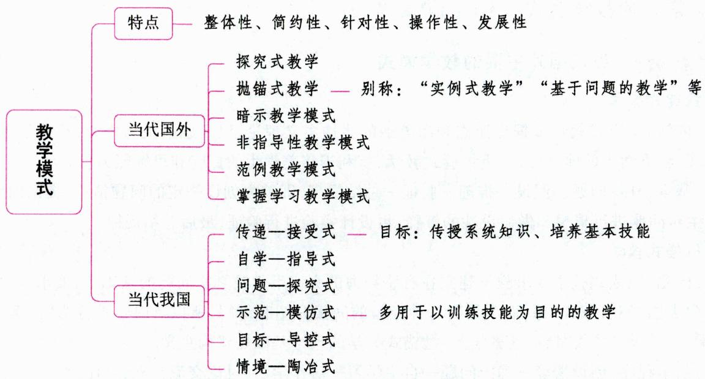

# 一、教学模式的概念

教学模式是指在一定教学思想或教学理论指导下建立起来的较为稳定的教学活动结构框架和活动程序。作为结构框架，突出了教学模式从宏观上把握教学活动整体及各要素之间内部的关系和功能；作为活动程序则突出了教学模式的有序性和可操作性。

# 二、教学模式的特点 ★ 【单选、辨析】

虽然教学模式千差万别、类型各异，但是它们有一些共同的特点，集中表现为如下几点：

(1)整体性。教学模式是由理论基础、教学目标、操作程序、实现条件和教学评价等要素构成的有机整体，反映了一个较为完整的教学过程。  
(2) 简约性。教学模式是一种简化了的教学结构和操作体系模型, 一般用比较精练的语言、象征性的图示、明确的符号把某种教学理论或活动方式中最核心的内容反映出来, 形成了一个具体的、简明的框架结构。  
(3)针对性。任何一种教学模式都有自己特定的目标、应用条件和适用范围，都是针对解决某个或某类教学问题而创设的，因而在选择和运用教学模式时必须注意不同教学模式的特点和功能，不存在对任何具体的教学过程都普遍有效的模式。  
(4)操作性。教学模式是教学理论或思想向教学实践转化的中介，是一种具体化、操作化了的教学

理论或思想，具有一套比较明确的操作要求和操作程序，便于人们理解、把握和运用。

(5)发展性。随着教学理论和教学实践的发展，教学模式在实际应用中也需要不断地加以修正、充实和完善，以使其针对性、操作性和实用性更强。

真题1 [2022河南平顶山, 单选]教学模式是一种简化了的教学结构和操作体系模型, 一般用精练的语言、象征性的图示把某种教学理论中最核心的内容反映出来。这表明教学模式具有( )

A. 整体性

B. 针对性

C. 简约性

D. 操作性

答案：C

# 三、常见的教学模式 ★★ 【单选、多选】

# 考点1 当代国外主要的教学模式

# 1.探究式教学

(1)内涵：探究式教学依据皮亚杰和布鲁纳的建构主义理论，以问题解决为中心，注重学生独立活动的开展，注重学生的前认知，注重体验式教学，有利于培养学生的探究和思维能力。  
(2)基本程序：问题一假设一推理一验证一总结提高，即首先创设一定的问题情境，提出问题，然后组织学生对问题进行猜想和做假设性的解释，再设计实验进行验证，最后总结规律。

# 2.抛锚式教学

(1)内涵：抛锚式教学要求教学建立在有感染力的真实事件或真实问题的基础上，要求学生到实际的环境中去感受和体验问题，而不是听这种经验的间接介绍和讲解，所以有时也被称为“实例式教学”或“基于问题的教学”或“情境性教学”。抛锚式教学的理论基础是建构主义。  
(2)基本程序：创设情境—确定问题—自主学习—协作学习(讨论交流)—效果评价。

# 3. 暗示教学模式

(1)内涵：暗示教学模式是指运用暗示手段激发个人心理潜力，提高学习效率的一种教学模式。它由保加利亚心理治疗医生洛扎诺夫提出。  
(2)指导思想：一是暗示学理论；二是现代心理学关于人脑功能的研究。暗示学理论认为，利用暗示手段可以使人的有意识心理活动和无意识心理活动达到高度协调，从而使人的潜能得到最大限度的发挥。  
(3)教学目标：充分调动学生的无意识心理活动，不断促进学生潜能的发展。  
(4)教学程序：创设情境—参与各类活动—总结转化。  
(5)基本原则：愉快而不紧张的原则、有意识和无意识相统一的原则、暗示手段相互作用的原则。

# 4.非指导性教学模式

(1)内涵：非指导性教学模式是一种以学生为中心，以情感为基础，通过建立民主平等的师生关系、创设适宜的学习环境来促进学生自我实现的个别化的教学模式。它由美国人本主义心理学家罗杰斯提出。  
(2)基本程序：创设情境一提出问题一进行开放性探索。

# 5. 范例教学模式

(1)内涵

范例教学模式为德国瓦·根舍因等教育学者所倡导，是通过典型的内容和方式，使学生从个别到一

般，掌握带规律性的知识和方法，发展独立学习、独立解决问题能力的一种教学模式。

(2)特点

①体现基本性，教学重视基本知识的学习；  
②体现基础性，教学重视学生实际和可接受性，难度适宜；  
③体现范例性，在学科知识中精选起示范作用的内容，便于学生学习时进行正向迁移；  
④体现四个统一,即知识教学与德育的统一、问题教学与系统学习相统一、掌握知识与发展能力相统一、主体与客体的统一。其中,主体和客体的统一,就是要求教师既要熟悉和掌握材料,又要了解学生和熟悉学生,熟悉学生的智力水平和个性特征,主体是指受教育者(即学生),客体是指教材。

(3)基本程序

范例性地阐明“个”案一范例性地阐明“类”案一范例性地掌握规律原理一掌握规律原理的方法论意义一规律原理的运用训练。在教学过程中，教师应注意选取不同的带有典型性的范例，从个别入手，归纳成类，再从类入手，提炼本质特征，最后上升到规律与原理。

# 6. 掌握学习教学模式

(1)内涵：掌握学习教学模式是指在“所有学生都能学好”的思想指导下，采取班级教学和个别辅导相结合的方式，以班级教学为基础，辅之以经常、及时的反馈和矫正，提供学生所需要的个别化帮助和额外学习时间，从而使绝大多数人达到学业规定要求的教学模式。它由美国教育心理学家布卢姆提出。  
(2)指导思想：掌握学习理论。它假设只要给予足够的学习时间和相应的教学，大多数学生都能够学会学校里的科目。学生在学习能力上的差异并不能决定他能否学会教学内容，而只能决定他将要花多少时间才能达到对该项内容的掌握程度。  
(3)基本程序：教学准备—确定课时教学目标—进行课堂教学—测验—矫正—再测验。

真题2 [2024安徽合肥/淮北/铜陵, 单选] 掌握学习理论认为, 学生能力上的差异并不能决定他们能否成功掌握教学内容, 而是在于他们( )

A. 学习积极性

B. 学习自觉性

C. 要花多少时间

D. 智力水平

真题3 [2023辽宁锦州，单选]（ ）又叫“实例式教学”“基于问题的教学”“情境性教学”，这种教学模式要求学生到实际的环境中去感受和体验问题。

A. 自上而下教学

B. 随机通达教学

C. 开放课堂教学

D. 抛锚式教学

答案：2.C 3.D

# 考点2 当代我国主要的教学模式

# 1. 传递一接受式

(1)内涵：传递一接受式教学模式以传授系统知识、培养基本技能为目标，其着眼点在于充分挖掘人的记忆力、推理能力以及间接经验在掌握知识方面的作用，使学生能够快速有效地掌握更多的信息量。该模式强调教师的指导作用，认为知识是从教师到学生的一种单向传递，非常注重教师的权威性。

(2)基本程序：复习旧课一激发学习动机一讲授新课一巩固练习一检查评价一间隔性复习。

# 2.自学一指导式

(1)理论依据：①“教为主导，学为主体”的辩证统一的教学观；②“独立性与依赖性相统一”的心理

发展观；③“学会学习”的学习观。

(2)基本程序：提出要求一开展自学一讨论启发一练习运用一及时评价一系统小结。

# 3. 问题一探究式（引导一发现式）

(1)内涵：这是一种以解决问题为中心，注重学生独立活动，着眼于创造性思维能力和意志力培养的教学模式。学生的认识能力必须通过实践才能逐步提高，所以必须让学生在学习过程中主动去探索、发现问题，并用所学知识去研究、解决问题。  
(2)理论依据：①杜威及其五步探究法；②布鲁纳及其发现法等教学理论；③我国的教学认识论。  
(3)基本程序：提出问题—建立假说—拟订计划—验证假说—总结提高。

# 4. 示范一模仿式

(1)内涵：示范一模仿式教学模式是教师有目的地把示范技能作为有效的刺激，以引起学生相应的行动，使他们通过模仿，有效地掌握必要的技能的一种教学模式。它是教学中最基本的教学模式之一，多用于以训练技能为目的的教学。  
(2)基本程序：定向（明确所学目的）一参与性练习一自主练习一迁移（熟练掌握）。

# 5. 目标一导控式

(1)理论依据：学习是按由低到高的不同水平逐步递进的。每一较高水平的学习植根于较低水平的学习上。因而要设计出由低到高的一个紧接一个的程序化目标，通过评价学生对学习目标所达到的水平，以调节教师给学生提供的学习条件和时间，发挥每个学生都能学好的潜能。  
(2)基本程序：前提诊断一明确目标一达标教学一达标评价一根据评价结果进行强化补救。

# 6. 情境一陶冶式

(1)内涵：情境一陶冶教学模式是从“人的认识是有意识心理活动和无意识心理活动的统一、理智活动和情感活动的统一”的观点出发，通过创设一种情感和认识相互促进的教学环境，引导学生在轻松愉快的教学氛围中有效地获取知识、陶冶情感的教学模式。  
(2)理论依据：吸取了洛扎诺夫的暗示教学理论，并参照我国教学实际工作者积累的有效经验加以概括而形成，如情境教学、愉快教学、成功教学等。

真题4 [2023安徽统考，单选]以传授系统知识和培养基本技能为主要目标的教学模式是（）

A. 情境—陶冶模式  
B.自学一辅导模式  
C. 引导—探究模式  
D. 传递一接受模式

真题5 [2023山东菏泽，单选]依据“学会学习”的学习观创制的教学模式是（）

A. 传递一接受式

B.自学一指导式

C. 问题一探究式

D. 情境一陶冶式

答案：4.D 5.B

# ★ 本节核心考点回顾 ★

# 1.抛锚式教学

（1）别称：实例式教学、基于问题的教学、情境性教学。  
(2)内涵：要求学生到实际的环境中去感受和体验问题，而不是听这种经验的间接介绍和讲解。

# 2. 传递一接受式

(1)以传授系统知识、培养基本技能为目标。  
(2) 强调教师的指导作用, 认为知识是从教师到学生的一种单向传递, 非常注重教师的权威性。

# 第七节 现代教育技术在教学中的应用

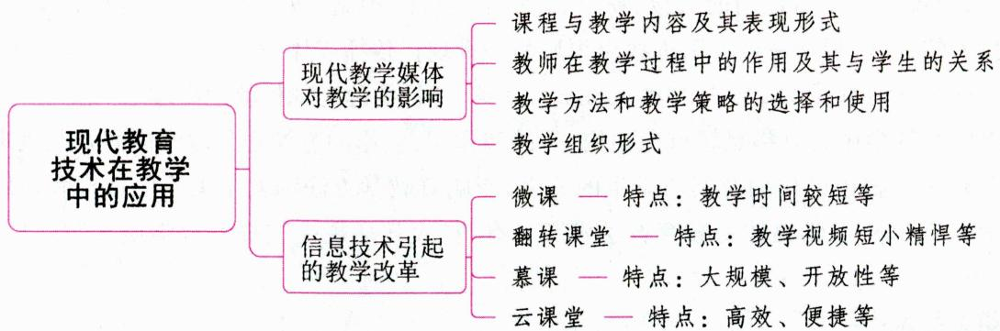

# 一、现代教育技术的概念

现代教育技术是以现代教育思想、理论和方法为基础，以系统论的观点为指导，以现代信息技术为手段的教育技术。现代信息技术，目前主要指计算机技术、数字音像技术、电子通讯技术、网络技术、卫星广播技术、远程通信技术、人工智能技术、虚拟现实仿真技术、多媒体技术和信息高速公路。

# 二、教学媒体

# 考点1 教学媒体的概念

教学媒体是教学内容的载体，是教学内容的表现形式，是师生之间传递信息的工具。

# 考点2 教学媒体的类型

根据媒体作用的感官和信息的流向，可将教学媒体分为视觉媒体、听觉媒体、视听觉媒体、交互媒体四类。

# 1. 视觉媒体

视觉媒体是指发出的信息主要作用于人的视觉器官的媒体。它包括投影视觉媒体和非投影视觉媒体。投影视觉媒体包括幻灯、投影、实物投影；非投影视觉媒体包括黑板、印刷材料、图片、图示与图解材料、实物与模型教具、展览。

# 2. 听觉媒体

听觉媒体是指发出的信息主要作用于人的听觉器官的媒体。听觉媒体包括录音机与录音磁带、唱机与唱片、激光唱机与激光唱片、传声器与扬声器、语言实验室等。常采用的方式有：课堂教学中穿插播放教学录音资料的辅助法；配合幻灯、投影画面提供声音的配合法；让学生课后自我练习、自我检查用的自学法。

# 3. 视听觉媒体

视听觉媒体是指发出的信息同时作用于人的视觉器官和听觉器官的媒体。视听觉媒体可分为电影、电视等。视听觉媒体在教学中应用的主要方式有：（1）主体式教学；（2）补充式教学；（3）示范式教学；（4）个别化教学。

# 4. 交互媒体

交互媒体是指能够在媒体与人之间构建起信息传递的双向通道，使双方能够相互作用、相互影响

的媒体。常见的交互媒体有程序教学媒体、计算机媒体等。

# 考点3 现代教学媒体 ★ 【多选】

在过去，传统教学中所使用的黑板、粉笔、教科书、挂图、模型、教具等统称为传统教学媒体。随着现代科学技术的发展，近年被开发引进教育领域的一批现代传播媒体，如幻灯、投影、广播、录音、电视、录像、光盘、电子计算机等软硬件及其相应的组合系统，都被统称为现代教学媒体。

教学媒体在教学中有着举足轻重的功用、效能和作用, 它影响着课程与教学内容及其表现形式, 影响着教师在教学过程中的作用及其与学生的关系, 影响着教学方法和教学策略的选择和使用, 影响着教学组织形式; 另外, 教学媒体对教育教学发展具有 “扩大教学规模” “提升教学质量” 和 “增进教学效率” 三大作用。

# 1. 多媒体技术

多媒体是一种以计算机为中心的多种媒体的有机结合，这些媒体包括文本、图形图像、动画、视频和音频等，并具有一定的主动性和交互性。多媒体技术是将计算机技术与通信传播技术融为一体，综合处理、传送和贮存多媒体信息的数字技术。

# 2. Internet

Internet（国际互联网络）是全球性的网络，实际也是一个无所不包的全球化教育系统，它可以支持各种类型的教学传播，作为威力巨大的教学媒体，它具有信息资源海量、不受时空限制、人机优势互补等优点。

真题1 [2022天津北辰，多选]现代教学媒体对教学的影响表现在（）

A. 教学方法

B. 教学内容

C. 教学组织形式

D. 教学目标

答案：ABC

# 三、信息技术引起的教学改革

21世纪是一个信息化时代。信息化影响人们生活的方方面面，就教育而言，信息技术与教育相结合已经成为时代发展的必然趋势。

# 考点1 微课

# 1. 微课的定义

国内率先提出“微课”这个概念的是胡铁生。微课是指按照新课程标准及教学实践要求，以视频为主要载体，记录教师在课堂内外教育教学过程中围绕某个知识点（重点、难点）或教学环节而开展的精彩的教与学活动的全过程。也可以说，微课是指运用信息技术，按照认知规律，呈现碎片化学习内容、过程及扩展素材的结构化数字资源。微课的核心组成内容是课堂教学视频（课例片段），同时还包含与该教学主题相关的教学设计、素材课件、教学反思、练习测试及学生反馈、教师点评等辅助性教学资源，它们以一定的组织关系和呈现方式共同“营造”了一个半结构化、主题式的资源单元应用“小环境”。

# 2. 微课的特点

(1)教学时间较短。“微课”的时长一般为5~8分钟左右，最长不宜超过10分钟。  
(2)教学内容较少。相对于较宽泛的传统课堂，“微课”的问题聚集，主题突出，更适合教师的需要。

(3)资源容量较小。从大小上来说，“微课”视频及配套辅助资源的总容量一般在几十兆左右。  
(4)资源组成、结构、构成的“情景化”。“微课”选取的教学内容一般要求主题突出、指向明确、相对完整。它以教学视频片段为主线“统整”教学设计（包括教案或学案）、课堂教学使用到的多媒体素材和课件、教师课后的教学反思、学生的反馈意见及学科专家的文字点评等相关教学资源，构成了一个主题鲜明、类型多样、结构紧凑的“主题单元资源包”，营造了一个真实的“微教学资源环境”。  
(5) 微评审。通过微课的观看，评审专家可以很快从微课中看出这个教师的教学设计、讲解技能等，效率更高，评审更客观准确。同时，微课在网络上的传播应用，改变传统评审方式，提供网络实时在线关注的机会，使评审更具公平性、透明性与互动性。

# 考点2 翻转课堂 ★【单选、多选】

“翻转课堂”也称“颠倒课堂”或“颠倒教室”,就是在信息化环境中,课程教师提供以教学视频为主要形式的学习资源,学生在上课前完成对教学视频等学习资源的观看和学习,师生在课堂上一起完成作业答疑、协作探究和互动交流等活动的一种新型的教学模式。翻转课堂通过对教学结构的颠倒安排,实现教学的个性化。

翻转课堂具有如下特点：（1）教学视频短小精悍；（2）教学信息清晰明确；（3）重新建构学习流程；（4）师生角色的重新定位；（5）对信息技术依赖程度的增强；（6）复习检测方便快捷。

翻转课堂的教学是一种先学后教的模式，是自主性、互动式、个性化的教学模式，有利于提升教学质量和学习质量。

真题2 [2023河南信阳，单选]翻转课堂通过对（ ）的颠倒安排，实现教学的个性化。

A. 教学目标

B. 教学大纲

C. 教学主客体

D. 教学结构

真题3 [2022广东广州，多选]翻转课堂是指重新调整课堂内外的时间，将学习的决定权从教师转移给学生。下列选项中属于翻转课堂的特点的有（）

A. 重新建构学习流程

B. 复习检测方便快捷

C. 教学信息清晰明确

D. 教学视频短小精悍

答案：2.D 3.ABCD

# 考点 3 慕课

斯蒂芬·唐斯和乔治·西蒙斯于2008年首次提出“大规模开放在线课程(MOOC)”这一术语，2012年该术语被广为传播。所谓“慕课(MOOC)，即Massive Open Online Course的英文首字母缩写的中文音译”，意为大规模开放在线课程。只有当课程是开放的，才可以称之为“慕课”，只有这些课程是大型的或者大规模的，它才是典型的“慕课”。

慕课主要有以下特点：(1)大规模。(2)开放性。开放性是说慕课的学习者可能来自全球各地，信息来源、评价过程、学习者使用的学习环境都是开放的。(3)非结构性。从内容上看，慕课大多数时候提供的只是碎片化的知识点，是一组可扩充的、形式多种多样的内容集合，这些内容由一些特定相关领域专家、教育家、学科教师提供，汇集成一个中央知识库，就像网站一样。(4)自主性。大多数学者认为，慕课的自主性主要意味着学生对自己的学习承担责任。根据教师提供的教学内容，学生可以自定学习的方式、步骤、时间，自主地讨论与研究，主动且积极地学习。(5)网络性。(6)交互性。慕课区别于网络课程教学的特征在于，教学活动具有多样性、灵活性的特征，表现出极强的互动性。

# 考点4 云课堂 ★【判断】

云课堂是基于云计算技术的一种远程教学形式,具有高效、便捷等特点。使用者通过互联网可以快速、高效地与他人分享语音、视频和数据资料。

我国已有一些地方教育行政部门开发了云课堂平台。通过这类平台，可以实现学习时间自主化、学习空间扩大化；同时，可以培养学生发现问题、分析问题和解决问题的能力。不过，云课堂还有许多有待完善的地方，如资源过于简单等。此外，学生缺乏自觉性、不会学习等也是云课堂平台实施过程中不得不考虑的重要问题。

真题4 [2023安徽统考，判断]云课堂是基于云计算技术的一种远程教学形式，具有高效、便捷等特点。（）

答案：√

# ★ 本节核心考点回顾 ★

# 1. 翻转课堂

翻转课堂通过对教学结构的颠倒安排，实现教学的个性化。其特点包括：(1)教学视频短小精悍；(2)教学信息清晰明确；(3)重新建构学习流程；(4)师生角色的重新定位；(5)对信息技术依赖程度的增强；(6)复习检测方便快捷。

# 2. 云课堂

云课堂是基于云计算技术的一种远程教学形式，具有高效、便捷等特点。

# 第七章 德育

# 本章学习指南

# 一、考情概况

本章属于教育学的重点章节，需要理解、掌握的知识较多，考生可带着以下学习目标进行备考：

1. 理解并区分德育的功能。  
2. 掌握德育过程的基本规律。  
3. 掌握并能运用我国中小学主要的德育原则。  
4. 识记并区分我国学校的德育途径。  
5. 理解并能运用我国中小学常用的德育方法。  
6.理解国内外知名的德育模式。

# 二、考点地图

<table><tr><td>考点</td><td>年份/地区/题型</td></tr><tr><td>德育的功能</td><td>2024安徽多选;2023广东单选;2023天津单选;2023河北单选;2023四川单选;2023河南单选、判断;2022天津单选;2022贵州单选;2022河南多选</td></tr><tr><td>德育过程的基本规律</td><td>2024天津单选;2024安徽单选、判断;2024河北判断;2023山西单选;2023山东单选;2023河北单选;2023河南单选;2023广东单选、判断;2023江苏判断;2022安徽判断;2022浙江论述</td></tr><tr><td>我国中小学主要的德育原则</td><td>2024江苏单选;2024广东单选、多选;2024山东单选、多选;2024天津单选、填空、判断、简答;2024河北材料分析;2023河南单选;2023广东单选;2023安徽单选;2022广西多选;2022浙江简答</td></tr><tr><td>德育途径</td><td>2024河南单选;2024天津单选;2024江苏判断;2023广东单选;2023辽宁单选;2023河南单选;2023天津单选、判断;2023河北多选;2023福建判断选择;2022广东判断;2022河北判断</td></tr><tr><td>我国中小学常用的德育方法</td><td>2024安徽单选;2024江苏单选;2024贵州单选;2024河北单选;2024广东单选、多选;2024天津判断;2023江苏单选;2023山西单选;2023广西单选;2023辽宁多选;2022四川判断</td></tr><tr><td>体谅模式</td><td>2024浙江单选;2023黑龙江单选;2023山东单选;2023河北单选、判断;2023河南多选、判断;2023四川判断</td></tr></table>

注：上述表格仅呈现重要考点的相关考情。

# 第一节 德育概述

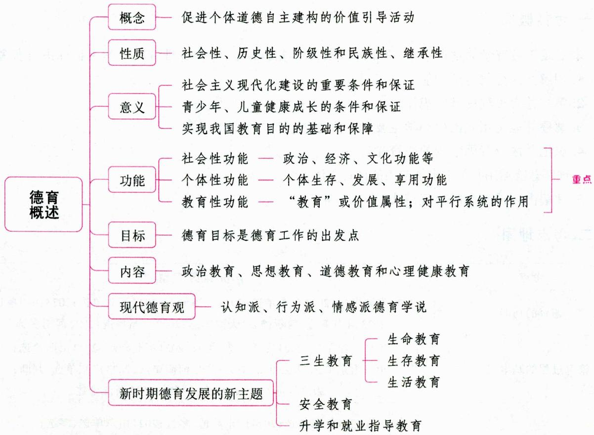

# 一、德育的内涵 ★★ 【单选、判断、名词解释、简答】

# 考点1 德育的概念

“德育”是近代以来才出现的名词。西方社会于18世纪后半叶形成了“德育”这一概念。我国古代学校教育的主要构成是德育，但并无“德育”之名。“德育”一词于20世纪初传入我国。在当代中国，学术界对德育是什么进行了多视角探究，其中较有代表性的观点包括：

观点一：德育是旨在形成受教育者一定思想品德的教育。在社会主义中国，包括思想教育、政治教育、道德教育。在西方，一般指伦理道德教育以及有关的价值观的教育。

观点二：“德育”是思想教育、政治教育、法纪教育和道德教育的总称，而不是“道德教育”的简称或“政治教育”的代名词。

观点三：德育是教育工作者组织适合德育对象品德成长的价值环境，促进他们在道德认知、情感和实践能力等方面不断建构和提升的教育活动。简言之，德育是促进个体道德自主建构的价值引导活动。

从学者们对德育概念的不同界定中我们可以看出，德育有广义与狭义之分。

广义的德育泛指所有有目的、有计划地对社会成员在政治、思想与道德等方面施加影响的活动，包括社会德育、社区德育、学校德育和家庭德育等方面。

狭义的德育则专指学校德育，是指教育者按照一定社会或阶级的要求和受教育者品德形成发展的规律与需要，有目的、有计划、有系统地对受教育者施加思想、政治和道德等方面的影响，并通过受教育者积极的认识、体验与践行，以使其形成一定社会与阶级所需要的品德的教育活动，即教育者有目的地培养受教育者品德的活动。

真题1 [2023安徽蚌埠，判断]德育是促进个体道德自主建构的价值引导活动。（）

答案：√

# 考点2 德育的性质

德育的性质是由特定的社会经济基础决定的。

(1)德育具有社会性,是各个社会共有的社会、教育现象,与人类社会共始终。  
(2)德育具有历史性，随社会发展变化而变化。  
(3)阶级和民族存在的社会，德育具有阶级性和民族性。  
(4)德育具有继承性，在其历史发展过程中，其原理、原则、内容和方法等存在一定的共同性。

# 考点3 德育的特点

(1)德育旨在培养学生的道德信念和人生观，形成学生的道德行为习惯，主要属于伦理领域。  
(2)德育要解决的矛盾主要不是求真、不是知与不知,以回答世界是什么的问题;而是求善、知善、行善,回答人应当怎样生活才有意义的问题。  
(3)品德是个体素质结构的重要因素，在个体素质结构中起着价值定向的作用。

# 考点4 德育的意义

(1)德育是社会主义现代化建设的重要条件和保证。我国现阶段的根本任务是进行社会主义现代化建设,德育是精神文明建设的重要组成部分,同时又贯穿于物质文明和民主政治建设之中。社会主义学校是培养社会主义建设者和接班人的必要场所,是进行社会主义精神文明建设的重要阵地。  
(2)德育是青少年、儿童健康成长的条件和保证。  
(3)德育是实现我国教育目的的基础和保障。

真题2 [2022河南平顶山，判断]我国现阶段的根本任务是进行社会主义现代化建设，德育是精神文明建设的重要组成部分，同时又贯穿于物质文明和民主政治建设中。（）

真题3 [2023宁夏银川，简答]简述德育的重要意义。

答案：2.√ 3.详见内文

# 二、德育的功能 ★★★ 【单选、多选、判断】

# 1. 德育的社会性功能

德育的社会性功能指的是学校德育能够在何种程度上对社会发挥何种性质的作用。具体来说，主

要指学校德育对社会政治、经济、文化等发生影响的政治功能、经济功能、文化功能等。在理解德育社会性功能时,要充分注意德育社会性功能实现的间接性。学校德育的政治、经济等功能决不意味着学校德育对学校发展要起完全、直接的参与作用。

# 2. 德育的个体性功能

德育的个体性功能是指德育对受教育者个体发展能够产生的实际影响。德育的个体性功能可以描述为德育对个体生存、发展、享用产生影响的三个方面。其中, 德育的个体生存功能是一种德育效果的评价, 仅仅或过分关注这一功能就会误入反道德、反德育的泥淖中。道德教育的本质乃是对个体社会人格的塑造或对个体道德人格发展的推动。因此, 德育的个体性功能的第二个方面是德育的个体发展功能。享用性功能是德育个体性功能的最高境界。所谓德育的享用功能, 就是说, 可使个体实现某种需要、愿望 (主要是精神方面的), 从中体验满足、快乐、幸福, 获得一种精神上的享受。

# 3. 德育的教育性功能

德育的教育性功能是指德育具有“教育性”,它有两大含义：一是指德育的“教育”或价值属性；二是指德育作为教育子系统对平行系统的作用。德育对智、体、美诸育的促进功能,就其共性来看主要有三点：(1)动机作用；(2)方向作用；(3)习惯和方法上的支持。

真题4 [2023广东深圳,单选]德育的价值属性和对平行教育系统的作用，属于德育的（）

A. 社会性功能  
B. 个体性功能  
C. 教育性功能  
D. 享用性功能

真题5 [2024安徽合肥/淮北/铜陵,多选]学校德育的社会功能表现在( )等方面。

A. 发展性功能

B.政治功能

C. 文化功能

D. 经济功能

真题6 [2023河南许昌，判断]学校德育具有政治、经济等功能意味着学校德育对学校发展起着完全、直接的参与作用。（）

答案：4.C 5.BCD 6.X

# 三、德育目标 ★ 【单选、多选】

# 考点1 德育目标的概念

德育目标是教育目标在受教育者思想品德方面要达到的总体规格要求，亦即德育活动所要达到的预期目的或结果的质量标准。德育目标是德育工作的出发点，它不仅决定了德育的内容、形式和方法，而且制约着德育工作的基本过程。

# 考点2 确立德育目标的依据

(1)青少年思想品德形成、发展的规律及心理特征；(2)国家的教育方针和教育目的；(3)民族文化及道德传统；(4)时代与社会发展需要。

真题7 [2022广西桂林，多选]制定我国学校德育目标的主要依据是（）

A.时代与社会发展需要

B. 国家的教育方针与教育目的

C. 民族文化及道德传统

D. 受教育者思想品德形成的规律

答案：ABCD

# 四、德育内容 ★★ 【单选、多选、判断】

# 考点1 德育内容的概念

学校德育内容是教育者依据学校德育目标所选择的，形成受教育者品德的社会思想政治准则和道德规范的总和。德育目标确定了培养人的总体规格和要求，但必须落实到德育内容上，才能进行有效的德育活动，达到预期目标。

# 考点2 德育内容的选择依据

(1)德育目标, 它决定德育内容;  
(2)受教育者的身心发展特征，它决定德育内容的深度和广度；  
(3)德育所面对的时代特征和学生思想实际，它决定德育工作的针对性和有效性。

此外，选择德育内容还应考虑文化传统的作用。

真题8 [2023广东潮州,多选]一般情况下,德育内容的选择依据包括( )

A. 受教育的身心发展特征

B. 德育目标

C. 文化传统

D. 时代特征和学生思想实际

答案：ABCD

# 考点3 我国学校的德育内容

根据1988年、1994年和1996年中共中央颁布的有关决定，我国学校德育内容主要有政治教育、思想教育、道德教育和心理健康教育。也有说法认为，我国学校德育内容主要有政治教育、思想教育、道德教育、法纪教育和心理健康教育。

政治教育是指教育者按照国家的政治观和一般社会要求对受教育者进行的系统教育。

思想教育是指有关人生观、世界观以及相应思想观念方面的教育。

道德教育是指注重受教育者良好个性的塑造和培养的教育。

法纪教育是指对受教育者进行有计划、有组织、有目的的法制教育和纪律规范教育的社会实践活动。

心理健康教育是指通过对受教育者进行心理健康知识的训练,培养良好的心理素质,预防心理疾病的发生,促进身心和谐发展的教育活动。我国学校心理健康教育的主要内容包括学习辅导、生活辅导和择业指导。

政治教育、思想教育和道德教育所包含的具体内容主要有：(1)爱国主义教育。爱国主义教育是德育的永恒主题，在社会发展的不同历史时期具有不同的内容，建设有中国特色的社会主义是新时期爱国主义的崭新含义。(2)理想教育。(3)集体主义教育。(4)劳动教育。(5)人道主义与社会公德教育。(6)自觉纪律教育。(7)民主与法制观念的教育。(8)科学世界观和人生观教育。

2017年教育部印发的《中小学德育工作指南》中提出的德育内容包括：理想信念教育、社会主义核心价值观教育、中华优秀传统文化教育、生态文明教育、心理健康教育。

# 考点4 我国中小学德育的重点

# 1. 基本道德和行为规范的教育

(1)基本道德是个体生活的基础性道德要求。德育的基础是要教学生学会做人。所以，诸如公平、

正直、诚实、勇敢、仁爱、热爱劳动、艰苦朴素等应当成为中小学德育的奠基性内容。

(2)对学生进行文明行为教育，培养学生文明行为习惯，也是学校德育经常性的重要内容之一。“学生守则”以及“学生日常行为规范”等是学生必须遵守的行为准则。小学阶段是学生行为习惯养成的关键期，小学生具有很强的可塑性。因此，小学德育的重点是培养学生良好的道德行为习惯。

# 2.公民道德与政治品质的教育

公民道德与政治品质的教育包括集体主义、爱国主义、民主与法制观念和其他政治常识的教育等。

# 3.世界观、人生观和理想的基础教育

世界观、人生观、理想是人的精神内核。对世界观、人生观和理想的培育是德育的最高目标，也是德育的基础性工作。

# 五、现代德育观的几种界说 ★【单选、多选】

# 1.认知派德育学说

认知派认为,人的品德取决于道德知识的掌握和信念、智慧以及动机等因素的形成。大部分的罪行和不道德的举动,都是由于愚昧无知、缺乏对各种事物的健全的概念造成的。他们主张,在道德教育中必须给予伦理谈话和系统知识的讲解。认知派的德育思想可以追溯到古希腊的苏格拉底。苏格拉底认为“美德即知识”,在他看来,任何行为只有受到知识的指导,才可能是善的。苏格拉底的道德教育基本上是一种主知主义德育。现代主知主义的代表人物是皮亚杰和科尔伯格。

认知派启示我们：德育不能背离受教育者的道德认知规律。在德育过程中应加强对受教育者讲清道理，进行正确道德认知的引导，让他们明辨是非。

# 2. 行为派德育学说

行为派认为，人的品德说到底是我们所有的道德行为方式的总和和各种行为习惯系统的最终产物。道德认知未必能导致道德行为，只有养成良好的道德行为习惯，才能指望出现良好的品德。因此，行为派主张重视行为方式的训练和行为习惯的培养。关于儿童的道德行为方式是怎样形成的，20世纪60年代美国行为派社会学习理论学家班杜拉提出了观察学习理论。

行为派启示我们：德育要重视良好行为习惯的训练。在德育过程中，特别要重视充分发挥榜样的力量，教育者本人要以身作则、为人师表，必须加强养成教育、榜样教育。

# 3.情感派德育学说

情感派认为,情感是德育的构成性要素,而且在德育中起着本源的作用。舍弃情感,仅靠理性推理而来的道德,在情感派看来简直就是毫无意义的。情感论者虽然并不是完全否认认知在德育中的作用,但他们认为理性的作用仅在于发现真伪,德育的根本应植根于情感的培养。法国哲学家居友强调德育的根本不在于认知,而在情感。指导人们行为的是习惯、本能和情感,德育应“服从最强烈的人性冲动”。

情感派启示我们：在德育过程中，培养良好的情感至关重要。当前德育工作中，德育效果不佳、德育活动缺乏吸引力的一个重要原因是德育不能寓于情感教育之中，教育者缺少爱心或缺乏触动学生心灵的德育艺术。因此，在德育过程中必须强调情感的力量。

# 六、新时期德育发展的新主题 ★ 【单选、多选】

(1)生命教育。即进行生命意识的培养、生命常识及体验生命活动的教育。生命教育主要包括自我保护教育、人际关系教育和敬畏自然教育。  
(2)生存教育。主要包括生存意识、生存知识、生存能力、生存价值等方面的教育。  
(3)生活教育。基本内容包括生活行为教育、生活规范教育和生活情感教育三个部分。  
(4)安全教育。即教育学生确立自主维护生命安全、财产安全的意识；远离毒品，严防危及生命安全的犯罪。  
(5) 升学和就业指导教育。即教师根据社会的需要指导学生树立正确的职业观, 帮助他们了解社会职业, 进而引导他们按照社会需要和自己的特点为升学选择专业、为就业选择职业, 在思想上、学习上和心理上做好准备。

其中,生命教育、生存教育和生活教育又被称为“三生教育”。

真题9 [2024广东佛山, 单选]三生教育的概念是学校德育范畴的概念, 其是指( )教育, 旨在培养学生的全面素质和综合能力, 使其成为适应社会发展的有用之才。

A.生命、生计和生活  
B. 生育、生存和生活  
C.生命、生存和生长  
D. 生命、生存和生活

真题10 [2023安徽蚌埠,单选]生命教育是当前教育中的重要内容，下列不属于生命教育的是( )

A. 法制教育  
B. 自我保护教育  
C.敬畏自然教育  
D. 人际关系教育

答案：9.D 10.A

# ★本节核心考点回顾 ★

# 1. 德育的功能

(1)社会性功能, 主要指学校德育的政治功能、经济功能、文化功能等。要充分注意德育社会性功能实现的间接性, 学校德育的政治、经济等功能决不意味着学校德育对学校发展要起完全、直接的参与作用。

(2)个体性功能,指德育对个体生存、发展、享用产生影响的三个方面。  
(3)教育性功能，德育具有“教育性”，一是指德育的“教育”或价值属性，二是指德育作为教育子系统对平行系统的作用。

# 2. 三生教育

(1) 生命教育, 主要包括自我保护教育、人际关系教育和敬畏自然教育。(2) 生存教育。(3) 生活教育。

# 第二节 德育过程

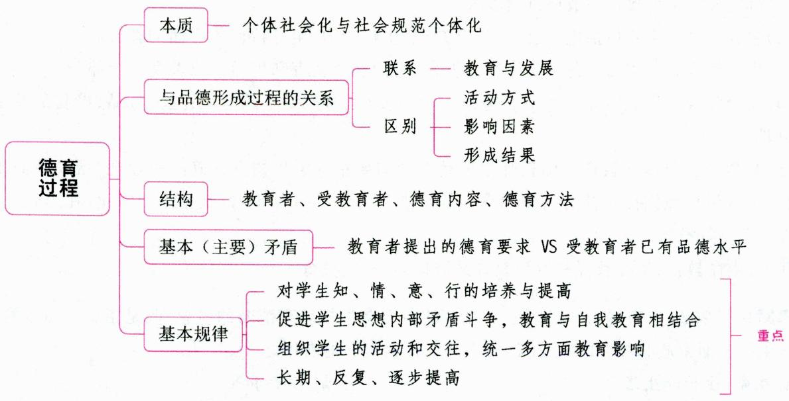

# 一、德育过程的内涵 ★【单选、判断】

# 考点1 德育过程的概念

德育过程是教育者按照一定的道德规范和受教育者思想品德形成的规律，对受教育者有目的、有计划地施加影响，以形成教育者所期望的思想品德的过程，是促使受教育者道德认识、道德情感、道德意志和道德行为发展的过程。德育过程的本质就是个体社会化与社会规范个体化的统一过程。

# 考点2 德育过程与品德形成过程的关系

# 1. 德育过程与品德形成过程的联系

德育过程与思想品德形成过程是教育与发展的关系。德育过程的最终目标是使受教育者形成一定的思想品德。品德形成属于人的发展过程，德育过程是对品德形成与发展过程的调节与控制。德育只有遵循人的品德形成发展规律，才能有效地促进人的品德形成与发展。

# 2. 德育过程与品德形成过程的区别

(1)从活动方式来看，德育过程主要是教育者与受教育者双边活动的过程，而品德形成过程是学生个体品德自我发展的过程。  
(2)从影响因素看，德育过程中学生主要接受有目的、有计划、有组织的教育影响，而品德形成过程中，学生受各种因素影响，有自觉的因素，也有自发的因素。  
(3)从形成的结果看，德育过程的结果是有意识地培养学生形成符合社会要求的思想品德，而品德形成过程的结果可能与社会要求相一致，也可能不一致。

真题1 [2024天津东丽区, 判断]德育过程就是学生品德形成和发展过程本身。（）

真题2 [2022河北邯郸，单选]德育过程与品德形成过程的关系是（）

A. 一致的, 可以等同

B. 教育与发展的关系

C. 相互促进的关系

D. 相互包容的关系

答案：1. $\times$ 2.B

# 考点3 德育过程的结构

德育过程通常由教育者、受教育者、德育内容和德育方法四个相互制约的要素构成。

(1)教育者是德育过程的组织者、领导者，在德育过程中起主导作用。  
(2)受教育者包括受教育者个体和群体,他们都是德育的对象。在德育过程中,受教育者既是德育的客体,又是德育的主体。  
(3)德育内容是用以形成受教育者品德的社会思想政治准则和法纪道德规范，是教育者进行德育工作的重要依据，是受教育者学习、修养和内在化的客体，是教育者与受教育者双边活动的中介。  
(4)德育方法是教育者施教传道和受教育者受教修养的相互作用的活动方式的总和。

真题3 [2022广西桂林，单选]在德育过程中起主导作用的是（）

A. 受教育者  
B. 教育者  
C. 德育内容  
D. 德育方法

答案：B

# 二、德育过程的基本(主要)矛盾 ★【单选、多选、填空、判断】

德育过程的矛盾是指德育过程中各要素、各部分之间和各要素、各部分内部各方面之间的对立统一关系，包括教育者与受教育者的矛盾，教育者与德育内容、方法的矛盾，受教育者与德育内容、方法的矛盾，受教育者自身思想品德内部诸要素之间的矛盾等。

德育过程的基本（主要）矛盾是教育者提出的德育要求（社会所要求的道德规范）与受教育者已有品德水平之间的矛盾。这是德育过程中最一般、最普遍的矛盾，也是决定德育过程本质的特殊矛盾。

# 三、德育过程的基本规律 ★★★ 【单选、填空、判断、简答、论述】

# 考点1 德育过程是对学生知、情、意、行的培养与提高过程

# 1. 知、情、意、行是构成思想品德的四个基本要素

学生的思想品德由知、情、意、行四个心理因素构成。其中, 知是基础, 行是关键。学生思想品德的形成与发展, 即这四个心理因素的形成与发展的过程, 学校德育过程也就是对这四个品德心理因素的培养过程。

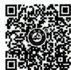  
德育过程是对学生知、情、意、行的培养与提高的过程

知，即品德认识，是人们对是非、善恶的认识和评价，以及在此基础上形成的品德观念，包括品德知识和品德判断两个方面。

情, 即品德情感, 是人们对客观事物做出是非、善恶判断时引起的内心体验, 表现为人们对客观事物的爱憎、好恶的态度。品德情感是学生产生品德行为的内部动力, 是实现转化的催化剂。

意，即品德意志，是人们为实现一定的品德行为所做出的努力。品德意志是调节学生品德行为的

精神力量。

行，即品德行为，它是通过实践或练习形成的，是实现品德认识、情感以及由品德需要产生的品德动机的行为定向及外部表现。品德行为是衡量品德水平的重要标志。

# 2. 知、情、意、行之间的关系及其发展

德育过程的一般顺序可以概括为：提高品德认识、陶冶品德情感、锻炼品德意志和培养品德行为习惯。德育过程一般以知为开端，以行为终结。但由于社会生活的复杂性、德育影响的多样性等因素，在德育具体实施过程中，又具有多种开端，可根据学生品德发展的具体情况，或从导之以行开始，或从动之以情开始，或从锻炼品德意志开始，最后达到使学生品德在知、情、意、行几方面和谐发展的目的。

# 考点2 德育过程是一个促进学生思想内部矛盾斗争的发展过程，是教育与自我教育相结合的过程

(1)学生思想品德的任何变化，都依赖于学生个体的心理活动。任何外界的教育和影响，都必须通过学生思想状态的变化，经过学生思想内部的矛盾斗争，才能发生作用，促使学生品德的真正形成。  
(2)在德育过程中，学生思想内部的矛盾斗争，实质上是对外界教育因素的分析、综合过程，斗争的过程也就是学生品德不断发展的过程。  
(3)学生的自我教育过程，实际上也是他们思想内部矛盾斗争的过程。根据这一规律，要求教育者在重视对学生进行思想品德教育的同时，高度重视培养学生的自我教育能力，发挥学生在德育过程中的主观能动性。

学生的自我教育能力是学生品德赖以形成的内部因素,也是学生品德发展程度的一个主要标志。自我教育能力主要由自我期望能力、自我评价能力、自我调控能力构成。其中,自我评价能力是个体对自我发展现状和趋势的评判能力。一个人只有能够正确认识和评价自己的思想与行为时,他才能明辨是非,正确认识自己的优点与缺点、进步与不足,才能有效地进行自我教育。

# 考点3 德育过程是组织学生的活动和交往，统一多方面教育影响的过程

(1) 活动和交往是学生思想品德形成和发展的基础和源泉（即组织学生活动和交往是德育过程的基础）。个体的思想品德是在活动和交往的过程中，接受外界教育影响，逐渐形成和发展，并通过活动和交往的过程表现出来的。有目的地根据德育目标和思想品德的形成规律设计实施活动，能加快个体品德发展的速度，对学生品德发展方向起规范和保证作用。这就要求教育者精心设计和组织教育活动和交往。  
(2)学生在活动中,必定受到多方面的影响,其中既有校内的正式影响,又有校外的非正式影响;既有积极正面的影响,也有消极负面的影响。学校德育应在多方面影响中发挥主导作用,将多方面教育影响统一到教育目的上来,形成学校与家庭、社会教育的合力,促使学生良好品德的形成和发展。  
(3)德育过程中活动和交往的主要特点：①具有引导性、目的性和组织性；②不脱离学生学习这一主导活动，主要交往对象是教师和同学；③具有科学性和有效性，是按照学生品德形成发展规律和教育学、心理学原理组织的，因而能更加有效地影响学生品德的形成。

# 考点4 德育过程是一个长期的、反复的、逐步提高的过程

(1)德育过程是一个长期的过程。一方面，随着人类社会的不断进步，德育要在内容、手段、方法等

方面不断加以调整和补充；另一方面，知、情、意、行等心理因素的培养提高也需要长期的训练和积累，这就决定了德育过程必然是一个长期的、坚持不懈的过程。

(2)德育过程是一个反复的、逐步提高的过程。学生正处于成长期，世界观尚未形成，思想很不稳定，品德发展容易出现反复，这就要求教育者要正确认识和对待这种现象，持之以恒、耐心细致地教育学生，引导学生在反复中逐步前进。

真题4 [2023山西太原，单选]小海能够明辨是非，正确认识自己的优点与缺点、进步与不足。这说明小海具有哪一自我教育能力（）

A. 自我评价能力

B. 自我期望能力

C. 自我调控能力

D. 自我防御能力

真题5 [2023山东济南，单选]“寓德育于教学之中，寓德育于活动之中，寓德育于教师榜样之中，寓德育于学生自我教育之中，寓德育于管理之中。”这主要体现了（）

A. 德育过程是培养学生知、情、意、行的过程  
B. 德育过程是促进学生思想内部矛盾斗争发展的过程  
C. 德育过程是长期的、反复的、逐步提高的过程  
D. 德育过程是组织学生的活动与交往, 统一多方面教育影响的过程

真题6 [2023河北唐山, 单选] 小军经常在课堂上做小动作, 班主任李老师在了解情况后对他进行耐心教育。一开始他有所改变, 但不久后又恢复原样, 李老师又多次跟他谈心, 久而久之, 小军就不再做小动作了。这主要体现了德育过程是( )

A. 促进学生思想内部矛盾斗争的过程  
B. 在活动和交往中接受多方面影响的过程  
C.对学生知、情、意、行进行培养的过程  
D. 长期的、反复的、不断前进的过程

真题7 [2024安徽合肥/淮北/铜陵，判断]德育过程是组织学生的活动与交往的过程。（）

真题8 [2023江苏苏州, 判断] 德育过程说到底是一个知情意行的发展过程, 先有知的基础, 然后按照情意行依次来发展。( )

答案：4.A 5.D 6.D 7.√ 8.X

# ★ 本节核心考点回顾 ★

1. 德育过程的基本规律

(1)德育过程是对学生知、情、意、行的培养与提高过程；  
(2)德育过程是一个促进学生思想内部矛盾斗争的发展过程,是教育与自我教育相结合的过程;  
(3)德育过程是组织学生的活动和交往, 统一多方面教育影响的过程;  
(4)德育过程是一个长期的、反复的、逐步提高的过程。

2. 德育过程是对学生知、情、意、行的培养与提高过程

(1)知、情、意、行是构成思想品德的四个基本要素。   
(2)德育过程一般以知为开端，以行为终结。但在德育具体实施过程中，又具有多种开端。

# 第三节 德育原则

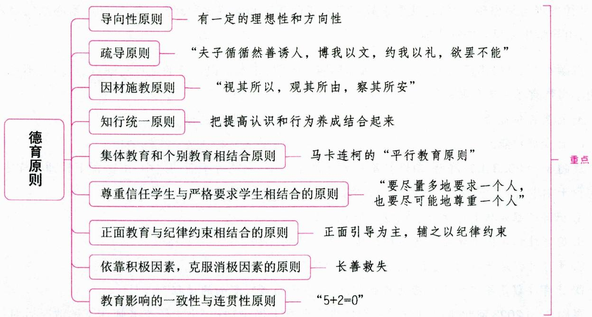

# 一、德育原则的概念 ★【填空】

德育原则是根据教育目的、德育目标和德育过程规律而提出的指导德育工作的基本要求。德育原则对制定德育大纲、确定德育内容、选择德育方法、运用德育组织形式等具有指导作用。

真题1[2023福建统考，填空]根据教育目的、德育目标和德育过程规律而提出的指导德育工作的基本要求是

答案：德育原则

二、我国中小学主要的德育原则 ★★★ 【单选、多选、填空、判断、辨析、简答、材料分析、案例分析】

# 考点1 导向性原则

# 1. 基本含义

导向性原则是指进行德育时要有一定的理想性和方向性，以指导学生向正确的方向发展。在我国，德育工作要把无产阶级的政治方向放在首位，对学生的德育要求要同共产主义目标相联系。

# 2. 贯彻这一原则的要求

(1)坚持正确的政治方向；(2)德育目标必须符合新时期的方针政策和总任务的要求；(3)要把德育的理想性和现实性结合起来。

# 考点2 疏导原则

# 1.基本含义

疏导原则是指进行德育时要循循善诱、以理服人，从提高学生认识入手，调动学生的主动性，使他

们积极向上。疏导原则也就是循循善诱原则。我国古代教育家孔子很善于诱导他的学生,其弟子颜回这样称赞道:“夫子循循然善诱人,博我以文,约我以礼,欲罢不能。”

# 2. 贯彻这一原则的要求

(1)讲明道理,疏通思想;(2)因势利导,循循善诱;(3)以表扬、激励为主,坚持正面教育。

# 考点 3 因材施教原则（从学生实际出发）

# 1.基本含义

因材施教原则是指教育者在德育过程中，应根据学生的年龄特征、个性差异以及品德发展现状，采取不同的方法和措施，加强德育的针对性和实效性。孔子很早就提出了“视其所以，观其所由，察其所安”的了解学生的有效方法，并根据学生的特点进行有区别的教育。

# 2. 贯彻这一原则的要求

(1)以发展的眼光客观、全面、深入地了解学生，正确认识和评价青少年学生的思想特点；(2)根据不同年龄阶段学生的特点，选择不同的内容和方法进行教育，防止一般化、成人化、模式化；(3)注意学生的个别差异，因材施教。

# 考点4 知行统一原则

# 1. 基本含义

知行统一原则是指教育者在进行德育时,既要重视对学生进行系统的思想道德的理论教育,又要重视组织学生参加实践锻炼,把提高认识和行为养成结合起来,使学生做到言行一致。

# 2. 贯彻这一原则的要求

(1)加强理论教育，提高学生的思想道德认识；(2)组织和引导学生参加社会实践，通过实践活动加深认识，增强情感体验，养成良好的行为习惯；(3)对学生的评价和要求要坚持知行统一的原则；(4)教育者要以身作则，严于律己，言行一致。

# 考点5 集体教育和个别教育相结合原则

# 1. 基本含义

在德育过程中，教育者要善于组织和教育学生热爱集体，并依靠集体教育每个学生，同时通过对个别学生的教育，来促进集体的形成和发展，从而把集体教育和个别教育有机地结合起来。

这一原则是苏联教育家马卡连柯成功教育经验的总结。马卡连柯指出：教师要影响个别学生，首先要去影响这个学生所在的集体，然后通过集体和教师一道去影响这个学生，便会产生良好的教育效果。这就是著名的“平行教育原则”。

# 小香课堂·

集体教育和个别教育相结合原则也称为集体教育原则、在集体中教育的原则。这三种说法的内涵是一致的，仅在具体表述上略有差异。

(1)集体教育原则是指在对学生实施德育过程中，要注意依靠学生集体，通过集体进行教育，以便充分发挥学生集体在教育中的巨大作用。  
(2)在集体中教育的原则是指学生的社会交往与活动通常处于一定的集体中，德育要培养和教育好学生集体，充分发挥学生集体在教育中的巨大作用。

# 2. 贯彻这一原则的要求

(1) 建立健全的学生集体；(2) 开展丰富多彩的集体活动，充分发挥学生集体的教育作用；(3) 加强个别教育，并通过个别教育影响集体，增强集体的生机和活力。

# 考点6 尊重信任学生与严格要求学生相结合的原则

# 1. 基本含义

在德育过程中,教育者既要尊重信任学生,又要对学生提出严格的要求,把严和爱有机地结合起来,使教育者的合理要求转化为学生的自觉行动。

这一原则是教育者正确对待受教育者的基本情感和态度。学生受到教师的尊重，内心会产生满意感和光荣感，这是促进学生积极向上的内在力量。我国明代教育家王阳明指出：“大抵童子之情，乐嬉游而惮拘检，如草木之始萌芽，舒畅之则条达，摧挠之则衰萎。今教童子，必使其趋向鼓舞，中心喜悦，则其进自不能已。”教师尊重学生并不意味着放松对学生的要求，更不代表教师可以放任学生。尊重学生，是对学生的信任，相信学生的能力，相信他们未来的发展。严格要求是指教师按照教育目的的要求，教育、培养学生。在德育工作中尊重信任与严格要求是辩证统一的，是制约德育效果的两个相辅相成的必要条件。尊重和信任是严格要求的前提，正如苏联教育家马卡连柯所说：“要尽量多地要求一个人，也要尽可能地尊重一个人。”爱是严的基础，严是爱的体现，只有把两者紧密结合在一起，才能取得最佳教育效果。

# 2. 贯彻这一原则的要求

(1)教育者要有强烈的事业心、责任感以及尊重热爱学生的态度；(2)教育者应根据教育目的和德育目标，对学生严格要求，认真管理；(3)教育者要从学生的年龄特征和品德发展状况出发，提出适度的要求，并坚定不移地贯彻到底。

# 考点7 正面教育与纪律约束相结合的原则

# 1. 基本含义

德育工作既要正面引导，说服教育，启发自觉，调动学生接受教育的内在动力，又要辅之以必要的纪律约束，并使两者有机结合起来。青少年学生缺乏一定的行为自控能力，这就决定了在正面引导的同时，必须加以必要的纪律约束。

# 2. 贯彻这一原则的要求

(1)坚持正面教育原则，以客观的事实、先进的榜样和表扬鼓励为主的方法教育和引导学生；(2)坚持摆事实，讲道理，以理服人，启发自觉；(3)建立健全学校规章制度和集体组织的公约、守则等，并且严格管理，认真执行。

# 考点8 依靠积极因素，克服消极因素的原则（长善救失原则）

# 1. 基本含义

在德育工作中，教育者要善于依靠、发扬学生自身的积极因素，调动学生自我教育的积极性，克服消极因素，以达到长善救失的目的。

# 2. 贯彻这一原则的要求

(1)教育者要用一分为二的观点，全面分析和了解学生，客观地评价学生的优点和不足；(2)教育者要有意识地创造条件，将学生思想中的消极因素转化为积极因素；(3)教育者要提高学生自我认识、自

我评价的能力，启发他们自觉思考，克服缺点，发扬优点。

考点9 教育影响的一致性与连贯性原则

# 1. 基本含义

在德育工作中，教育者应主动协调多方面教育力量，统一认识和步调，有计划、有系统、前后连贯地教育学生，发挥教育的整体功能，培养学生正确的思想品德。

# 2. 贯彻这一原则的要求

(1)充分发挥教师集体的作用，统一学校内部的多种教育力量，使之成为一个分工合作的优化群体；(2)争取家长和社会的配合，主动协调好与家庭、社会教育的关系，逐步形成以学校为中心的“三位一体”的德育网络；(3)保持德育工作的经常性和制度化，处理好衔接工作，保证对学生影响的连续性、系统性，使学生的思想品德得以循序渐进地持续发展。

# 知识再拔高·

# 德育的爱和民主原则及客观真实性原则

# 1. 爱和民主原则

爱和民主原则是指在进行德育活动时,教师要热爱、关心学生,同时尊重学生,发挥学生的主体性,建立平等、和谐、融洽的师生关系,促进学生身心的全面发展。对学生的爱和尊重是进行德育的前提、基础和动力。贯彻爱和民主原则,应该注意:(1)教师要热爱学生,尊重和信赖学生,善于从学生的视角来看问题;(2)注重德育过程的民主化,构建平等、和谐的师生关系。

# 2.客观真实性原则

客观真实性原则是指学校德育工作必须坚持客观公正的态度和方法, 也就是实事求是、尊重客观事实。由于培养人的品德是一个长期的、复杂的任务, 因此用客观的诚实态度和方法开展德育工作就显得格外重要。客观真实性原则也要求我们树立“注重实效, 力戒空谈”的德育规范, 如古人所说: “不说大话, 不务虚名, 不行驾空之事, 不谈过高之理。”品德教育的实质在于培养对待道德原则与道德规范的正确态度。

真题2 [2024江苏南京, 单选] 在家访活动中, 金老师注重发现学生的优点, 并创造条件让学生运用优点在班集体活动中崭露头角, “做更好的自己”。金老师的行为体现的德育原则主要是( )

A. 循循善诱原则

B. 长善救失原则

C. 平行教育原则

D. 知行统一原则

真题3 [2023河南郑州, 单选]某学校组织校内手工社团的学生到博物馆参与优秀传统文化教育活动，并体验中国传统工艺品——团扇的创作。这体现的德育原则是（）

A. 严惩相济原则

B. 正面教育原则

C. 知行统一原则

D. 长善救失原则

真题4 [2023广东深圳,单选]依靠学生集体,通过集体对学生进行德育,所指的德育原则是( )

A. 因材施教原则

B.疏导原则

C. 集体教育原则

D. 知行统一原则

真题5 [2024天津滨海新区，填空]颜回说：“夫子循循然善诱人，博我以文，约我以礼，欲罢不能。”颜回的话反映了德育的 _______ 原则。

真题6 [2022浙江台州, 简答]请简述德育原则中的教育影响的一致性与连贯性原则的基本含义和贯彻要求。

答案：2.B 3.C 4.C 5.疏导（循循善诱） 6.详见内文

# ★本节核心考点回顾 ★

# 1. 我国中小学主要的德育原则

我国中小学主要的德育原则包括：导向性原则；疏导原则；因材施教原则；知行统一原则；集体教育和个别教育相结合原则；尊重信任学生与严格要求学生相结合的原则；正面教育与纪律约束相结合的原则；依靠积极因素，克服消极因素的原则；教育影响的一致性与连贯性原则。

# 2.疏导原则

(1)基本含义：教育者进行德育时要循循善诱、以理服人，从提高学生认识入手，调动学生的主动性，使他们积极向上。  
(2)例子：“夫子循循然善诱人，博我以文，约我以礼，欲罢不能”。  
(3) 贯彻要求: ① 讲明道理, 疏通思想; ② 因势利导, 循循善诱; ③ 以表扬、激励为主, 坚持正面教育。

# 3. 集体教育和个别教育相结合原则

(1)基本含义：教育者要善于组织和教育学生热爱集体，并依靠集体教育每个学生，同时通过对个别学生的教育，来促进集体的形成和发展，从而把集体教育和个别教育有机地结合起来。  
(2)例子：马卡连柯的“平行教育原则”。  
(3) 贯彻要求: ① 建立健全的学生集体; ② 开展丰富多彩的集体活动, 充分发挥学生集体的教育作用; ③ 加强个别教育, 并通过个别教育影响集体, 增强集体的生机和活力。

# 4. 教育影响的一致性与连贯性原则

(1)基本含义：教育者应主动协调多方面教育力量，统一认识和步调，有计划、有系统、前后连贯地教育学生，发挥教育的整体功能，培养学生正确的思想品德。  
(2) 贯彻要求: ①充分发挥教师集体的作用, 统一学校内部的多种教育力量; ②争取家长和社会的配合, 主动协调好与家庭、社会教育的关系; ③保持德育工作的经常性和制度化, 处理好衔接工作。

# 第四节 德育的途径与方法

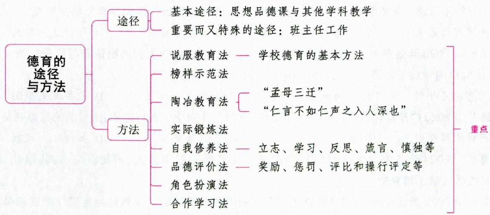

# 一、德育途径 ★★★ 【单选、多选、填空、判断、判断选择、简答】

德育途径是指学校教育者对学生实施德育时可供选择和利用的渠道，又称为德育组织形式。我国学校的德育途径是广泛多样的，具体如下：

(1)思想品德课(思想政治课)与其他学科教学。这是学校有目的、有计划、系统地对学生进行德育的基本途径。学校以教学为主,因此,思想品德课之外的其他各科教学是德育最经常、最基本、最有效的途径。当然,教学这个途径不是万能的,只通过思想品德课(思想政治课)和其他学科教学进行德育,容易使学生脱离社会生活实际。  
(2)社会实践活动。学生的思想品德是在活动和交往中形成，并通过活动和交往表现出来的。社会实践活动有助于培养学生各种良好的品德和风尚，因此，社会实践活动也是学校德育不可缺少的重要途径。  
(3)课外、校外活动。课外、校外活动有助于培养学生辨别是非、自我教育等的道德能力和互助友爱、团结合作、纪律性与责任感等良好品德。  
(4)共青团、少先队组织的活动。共青团、少先队是青少年学生自己的集体组织。通过自己的组织进行德育，有利于调动学生的积极性和创造性，培养他们的主人翁意识以及自我教育和管理的能力，自觉提高思想认识，形成优良品德。  
(5)校会、班会、周会、晨会、时事政策的学习。其中，晨会于每天早晨进行，时间为十分钟。可分为全校晨会活动和班级晨会活动两种形式。晨会活动的设计与实施需要注意：①不把晨会当成一堂正式的课；②不把晨会视为班主任的“一言堂”；③不把晨会视为学生的“自留田”；④不把晨会当作一堂机械重复的课。  
(6)班主任工作。班主任工作是学校对学生进行德育的一个重要而又特殊的途径。

此外，也有说法认为，德育途径包括：（1)寓德育于各科教学之中；(2)寓德育于学校管理工作之中；(3)寓德育于课外、校外活动之中；(4)寓德育于劳动之中；(5)寓德育于共青团、少先队及班级活动之中。

真题1[2024河南事业单位，单选]2016年，习近平总书记明确提出“使各类课程与思想政治理论课同向同行，形成协同效应”的要求。这说明对学生实施德育的基本途径是（）

A. 各科教学和品德课  
B. 各种课外活动和品德课  
C. 各种校外活动和品德课  
D. 各种少先队活动和品德课

真题2 [2023广东深圳,单选]只通过思政课与其他学科教学实施德育，其缺点在于（）

A.没有组织性，比较松散

B. 培养的品德零散而不稳定

C. 容易使学生脱离社会生活实际

D. 不能充分发挥教师的作用

真题3 [2023辽宁锦州，单选]某学校组织学生参加学雷锋小组，开展税务、交通、消防共建以及野游、参观等活动，使学生形成美好的心灵，在美好的思想品德激励中获得进步。这体现了中小学德育途径中的（）

A. 寓德育于政治课与其他学科教学之中

B. 寓德育于学校管理工作之中

C. 寓德育于课外、校外活动之中

D. 寓德育于劳动之中

真题4 [2024江苏苏州，判断]只有思政学科才有教育性，其他学科无教育性。（）

答案：1.A 2.C 3.C 4.×

# 二、德育方法

# 考点1 德育方法的概念

德育方法是为达到德育目的，在德育过程中采用的教育者和受教育者相互作用的活动方式的总和。它包括教育者的教学方式和受教育者的学习方式。

# 考点2 我国中小学常用的德育方法 ★★★ 【单选、多选、填空、判断、简答、案例分析】

# 1. 说服教育法

# (1) 说服教育法的概念

说服教育法又叫说理教育法、明理教育法，是通过语言说理，使学生明晓道理，分清是非，提高品德认识的德育方法。这是一种坚持正面理论教育和正面思想引导，增强辨别是非能力，促进道德发展的重要方法。说服教育法是学校德育的基本方法。

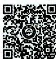  
说服教育法

# (2) 说服教育法的方式

第一类是运用语言文字进行说服教育的方式，如讲解、报告、谈话、讨论、辩论、读书指导等；第二类是运用事实进行说理教育的方式，主要包括参观、访问和调查。

# (3)运用说服教育法的要求

① 明确目的性和针对性；② 富有知识性、趣味性；③ 注意时机；④ 以诚待人（注重互尊互动）。

# 2. 榜样示范法

# (1) 榜样示范法的概念

榜样示范法是用榜样人物的优秀品德来影响学生的思想、情感和行为的德育方法。由于榜样能把社会真实的思想、政治和法纪、道德关系表现得更直接、更亲切、更典型，因而能给人以极大的影响、感染和激励，教育、带动和鼓舞人们前进。运用榜样示范法符合青少年学生爱好学习，善于模仿，崇拜英雄，追求上进的年龄特点，也符合人的认识由生动直观到抽象的发展规律。

榜样包括伟人的典范、教育者的示范、学生中的好榜样等。

# (2)运用榜样示范法的要求

①选好学习的榜样；②激起学生对榜样的敬慕之情；③狠抓落实，引导学生用榜样来调节行为，提高修养。

# 3. 陶冶教育法

# (1) 陶冶教育法的概念

陶冶教育法是教师利用环境和自身的教育因素，对学生进行潜移默化的熏陶和感染，使其在耳濡目染中受到感化的德育方法。

# 小香课堂·

陶冶教育法也称为情感陶冶法、陶冶法。这三种说法都重视情境的创设和陶冶的作用，其内涵是一致的，仅在具体表述上略有差异。

(1)情感陶冶法是指教育者自觉创设良好的教育情境，潜移默化地使受教育者在道德和思想

情操等方面受到感染、熏陶的方法。

(2)陶冶法是通过创设良好的情境，潜移默化地培养学生品德的方法。

# (2) 陶冶教育法的方式

陶冶教育法的方式主要有环境陶冶、情感陶冶、人格陶冶、艺术陶冶、科学知识陶冶、各种活动和交往情境陶冶等。这里，我们重点介绍环境陶冶、人格陶冶和艺术陶冶。

①环境陶冶，指学生所生活的环境对他思想品德的形成有重要陶冶作用。我国古代就已重视环境对人的陶冶作用，“孟母三迁”的故事至今传为佳话。  
②人格陶冶,也称人格感化,指教育者以自身的品德和情感为情境对学生进行的陶冶。在这种情况下,教师不是通过说理和要求来教育学生,而是以自己的高尚品德、人格魅力、对学生的深切期望和真诚的爱来触动、感化学生,促进学生思想转变,积极进取。  
③艺术陶冶, 指用艺术陶冶学生的思想感情。我国古代教育注意用音乐与诗歌陶冶学生, 孟子曾说过: “仁言不如仁声之入人深也”。我们应重视组织学生阅读文学诗歌, 聆听音乐, 欣赏画展, 观看影视, 或引导他们自己去创作、表现、演出, 从中获得启示, 受到陶冶。

# (3)运用陶冶教育法的要求

①创设良好的情境；②与启发引导相结合；③引导学生参与情境的创设。

# 4. 实际锻炼法

# (1) 实际锻炼法的概念

实际锻炼法是有目的地组织学生参加各种实际活动，使其在活动中锻炼思想，增长才干，培养优良的思想和行为习惯的德育方法。锻炼的方式主要是学习活动、社会活动、生产劳动和课外文体科技活动。

# (2)运用实际锻炼法的要求

① 目的明确，计划周密，加强指导，坚持严格要求；② 生动活泼，灵活多样，调动学生的主动性；③ 注意检查和持之以恒，随时总结。

# 5. 自我修养法

# (1) 自我修养法的概念

自我修养法是在教师引导下学生经过自觉学习、反思和自我改进，使自身品德不断完善的一种方法。

# (2) 自我修养法的方式

自我修养一般包括立志、学习、反思、箴言、慎独等。

①立志，指确立道德理想或期望自我。这既是修养的一种内容，也是修养的一个重要方法。  
②学习，指为提高思想认识而进行的学习。  
③反思，包括自我认识、自我反省、自我评价等，是学生进行自我修养常用的一种方法，对提高思想觉悟，防止不良习气和自我纠正过失有重要意义。  
④箴言, 引导学生确立奋斗目标, 选出有针对性的格言、箴言作座右铭, 用以自励、自警, 经常对照自己、长期坚持, 以提高修养水平。这是修养的一种好方法, 其效果取决于是否能够严于律己。  
⑤慎独，是自我修养的最高境界。

# (3)运用自我修养法的要求

①培养学生自我修养的兴趣与自觉性；②指导学生掌握修养的标准；③引导学生积极参加社会实践。

# 6. 品德评价法

# (1)品德评价法的概念

品德评价法是通过对学生品德进行肯定或否定的评价而予以激励或抑制，促使其品德健康形成和发展的德育方法。它包括奖励、惩罚、评比和操行评定等。

# (2)运用品德评价法的要求

①公平、正确、合情合理；②发扬民主，获得群众支持；③注重宣传与教育；④奖励为主，抑中带扬。

# 7.角色扮演法

角色扮演法是通过让儿童扮演处境特别的求助者或其他有异于自己的社会角色，使扮演者暂时置身于他人的位置，按照他人的处境或角色来行事、处世，以求在体验别人的态度、方式中，增进扮演者对他人及其社会角色的理解和认同。角色扮演法对于发展个体关爱他人、体谅他人的社会情感以及发展人际交往能力方面有着重要意义。

# 8. 合作学习法

# (1)合作学习法的概念

合作学习法是中小学重要的德育方法之一。合作学习有助于培养合作精神,建设学生集体,提高个体的群体意识、归属感、自尊心和成就感。合作学习法的具体策略包括双人式学习、小组学习、小队式学习、跨小组的协作式学习、小组之间的竞争式学习、全班协作学习等。

# (2)运用合作学习法的要求

①要让学生明白合作是一种重要的目标；②要根据学习内容选择恰当的合作学习策略，或者从合作策略出发，安排或设计恰当的学习内容；③要规定一些重要的合作原则；④要指导学生学习一些基本的合作技巧。

除上述常用的德育方法外，还有道德叙事法、交往实践法、道德讨论法等。

真题5 [2024安徽合肥/淮北/铜陵, 单选]某班在“每日一星”的活动中, 将表现好、进步大的学生的照片贴在明星墙上以示奖励。这运用的方法是( )

A. 说服教育法

B. 品德评价法

C.指导实践法

D. 陶冶情操法

真题6 [2024江苏苏州,单选]“让学校的每一面墙都开口说话。”这体现的德育方法是( )

A. 说服教育法

B. 榜样示范法

C. 实际锻炼法

D. 情感陶冶法

真题7 [2024河北石家庄，单选]班主任陈老师经常引导学生背诵一些古诗并以此作为格言自勉，在培养学生好品德、好习惯等方面收效良好。陈老师运用的德育方法是（）

A. 说服教育法

B. 榜样示范法

C. 角色扮演法

D. 自我修养法

真题8 [2023辽宁营口，多选]青少年渴求知识，期望更多地了解社会、人生。故运用明理教育法进行德育时，（）

A. 要注重互尊互动

B. 要有知识性和趣味性

C. 要有针对性

D. 要善抓时机

真题9 [2024天津东丽区，判断]对学生进行思想品德教育的最基本方法是榜样示范法。（）

答案：5.B 6.D 7.D 8.ABCD 9.X

# 考点 3 选择德育方法的依据 ★ 【多选】

(1)德育目标；(2)德育内容；(3)学生的年龄特点和个性差异。此外，选择德育方法还要考虑到所面对的时代特征、学生的思想实际、学校和教师的实际情况，以及文化传统的作用。

真题10 [2023广东深圳，多选]选择德育方法的依据有（）

A.德育目标

B. 德育内容

C. 学生的年龄特点

D. 学生的个性差异

E. 德育价值

答案：ABCD

# ★本节核心考点回顾 ★

1. 德育途径

(1)思想品德课(思想政治课)与其他学科教学。这是学校进行德育的基本途径。  
(2)社会实践活动。  
(3)课外、校外活动。  
(4)共青团、少先队组织的活动。  
(5)校会、班会、周会、晨会、时事政策的学习。  
(6)班主任工作。这是学校对学生进行德育的一个重要而又特殊的途径。

2. 我国中小学常用的德育方法

我国中小学常用的德育方法包括：说服教育法、榜样示范法、陶冶教育法、实际锻炼法、自我修养法、品德评价法、角色扮演法、合作学习法等。

3. 说服教育法

(1)别名：说理教育法、明理教育法。  
(2)地位：说服教育法是学校德育的基本方法。

4. 陶冶教育法

(1)别名：情感陶冶法、陶冶法。   
(2)概念：教师利用环境和自身的教育因素，对学生进行潜移默化的熏陶和感染，使其在耳濡目染中受到感化。

5. 自我修养法

(1)概念：在教师引导下学生经过自觉学习、反思和自我改进，使自身品德不断完善。  
(2)方式：立志、学习、反思、箴言、慎独等。

6. 品德评价法

(1)概念：通过对学生品德进行肯定或否定的评价而予以激励或抑制，促使其品德健康形成和发展。  
(2)方式：奖励、惩罚、评比和操行评定等。

# 第五节 德育模式

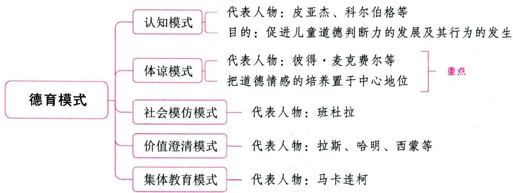

德育模式实际上是在德育实施过程中德育理念、德育内容、德育手段、德育方法、德育途径等的有机组合方式。当代影响较大的德育模式有认知模式、体谅模式、社会模仿模式、价值澄清模式、集体教育模式等。大体上说，认知模式重知，体谅模式重情，社会模仿模式重行。

# 一、认知模式 ★★ 【单选、判断】

# 1. 认知模式的主要观点

道德教育的认知模式是当代德育理论中流行最为广泛、占据主导地位的德育学说，它是由瑞士学者皮亚杰提出，而后由美国学者科尔伯格进一步深化的。该模式假定人的道德判断力按照一定的阶段和顺序从低到高不断发展，道德教育的目的就在于促进儿童道德判断力的发展及其行为的发生。

# 2. 认知模式的特征

(1)人的本质是理性的；(2)必须注重个体认知发展与社会客体的相互作用；(3)注重研究个体道德认知能力的发展过程。

# 3. 认知模式的特色

(1) 提出了以公正观发展为主线的德育发展阶段理论；(2) 建构了较为科学的道德发展观，提出了智力与道德判断力关系的一般观点；(3) 通过实验建立了崭新的学校德育模式。

# 4. 认知模式的缺陷

(1)太过于强调认知力的作用, 忽视了对道德行动的研究, 而后者对德育来说才是最重要的; (2)强调了道德判断的形式而忽视了内容的作用; (3)提出的阶段理论有缺陷; (4)在批评传统德育靠机械重复训练的做法时完全排斥了道德习惯的作用, 同时忽视了道德情感因素。

# 知识再拔高·

# 道德两难

科尔伯格采用道德两难故事法研究儿童的道德发展。所谓道德两难，指的是同时涉及两种道德规范且两者不可兼顾的情境或者问题。它除了可以用于测量儿童的道德判断的发展水平，还具有非常特别的教育意义：

（1）可用于促进儿童的道德判断力的发展；

(2)可用于提高学生的道德敏感性；  
(3)可用于提高学生在道德问题上的行动抉择能力；  
(4)可用于深化学生的道德理解，提高道德认识。

真题1 [2023河南南阳, 判断]认知模式太过于强调认知力的作用, 忽视了对道德行动的研究。( )

答案：√

# 二、体谅模式 ★★★ 【单选、多选、判断】

# 1. 体谅模式的主要观点

体谅模式(学会关心的道德教育模式)形成于20世纪70年代,由英国学校德育学家彼得·麦克费尔和他的同事所创。“体谅”即教师要对学生“多关心、少评价”。与认知性道德发展模式强调道德认知发展不同,体谅模式把道德情感的培养置于中心地位。关于体谅模式的观点,不同的学者有不同的说法。

说法一：(1)与人友好相处是人类的基本需要，帮助满足学生与人友好相处的需要是教育的重要职责；(2)道德教育重在提高学生的人际意识和社会意识，引导学生学会关心；(3)鼓励处于社会体验期的青少年体验不同的角色和身份；(4)教育即学会关心。

说法二：(1)要根据学生的需要来确定道德教育的课程；(2)道德教育应该促进发展成熟的社会判断和行为；(3)要注重道德感染力和榜样的作用；(4)反对用高度理性化的方式进行道德教育；(5)注重人与人之间的理解和关心，强调感情的沟通在道德培养过程中的作用；(6)以母爱式的关心为道德教育的途径。

# 2. 体谅模式的特征

(1)坚持性善论；(2)坚持人具有一种天赋的自我实现趋向；(3)把培养健全人格作为德育目标；(4)大力倡导民主的德育观。

# 3. 体谅模式的特色

(1)有助于教师较全面地认识学生在解决特定的人际一社会问题时的各种可能反应；(2)有助于教师较全面地认识学生在解决特定的人际一社会问题时可能遭到的种种困难，以便更好地帮助学生学会关心；(3)该模式提供了一系列可能的反应，教师能够根据它们指导学生围绕大家提出的行动方针进行讲座或角色扮演。

真题2 [2024浙江宁波, 单选]教师创设情境: 在下雨天, 你发现一个陌生的老奶奶, 没有带伞, 蹒跚地走在雨中……鼓励学生对故事的发展进行续写并交流。这采用的德育模式是（）

A. 价值澄清模式

B.传递一接受模式

C. 体谅模式

D. 社会模仿模式

真题3 [2023黑龙江哈尔滨，单选]认为人性本善，人具有自我实现的倾向，把培养健全人格作为德育目标的德育模式是（）

A. 认知模式

B. 体谅模式

C. 社会模仿模式

D. 价值澄清模式

真题4 [2023山东临沂,单选]杨老师在班会上问学生：马路上遇到老人摔倒了，该怎么办？学生

们自由发言，说出了各种可能的行动方案。杨老师把学生分成多个小组，每个小组表演其中一种方案，全班学生边看边思考，我们该有的价值取向是什么。杨老师的这一做法属于（）

A. 认知发展模式

B. 体谅模式

C. 价值澄清模式

D. 社会学习模式

答案：2.C 3.B 4.B

# 三、社会模仿模式 ★★ 【单选、判断】

# 1. 社会模仿模式的主要观点

社会模仿模式主要由美国的班杜拉创立，该模式认为人与环境是一个互动体，人既能对刺激做出反应，也能主动地解释并作用于情境。其基本观点有：（1）儿童的道德行为、道德判断是通过社会学习（观察学习）获得和改变的；（2）榜样示范是道德教育的主要手段；（3）提出环境、行为和人的交互作用论；（4）强调自我调节。

# 2. 社会模仿模式的特色

(1)在吸收其他学派的基础上，发展了行为主义，使之对人的道德行为做出更合理的阐释，对德育工作有很大意义；(2)在文化环境与人的道德发展相互作用方面有重要的成果，系统论述了示范榜样对道德发展的内在作用机制以及影响道德行为的各种形式和途径；(3)自我评价和自我效能的理论给学校德育研究开辟了新的领域，具体阐述培养学生自我评价能力，建立认知调节机制的基本过程，把环境的示范和个体的发展与认知调节机制的互动表达出来，从中可以看到学生是如何内化外部作用，从而逐渐发展起自我评价能力的；(4)注重理论与实践相结合。

真题5 [2024山东青岛, 单选] 裕禄中学在近些年的德育工作中, 一直坚持将焦裕禄作为榜样, 以焦裕禄精神涵养了一批又一批的焦裕禄式的好少年。裕禄中学的做法体现的德育模式是（）

A. 体谅模式

B. 价值澄清模式

C. 认知模式

D. 社会模仿模式

答案：D

# 四、价值澄清模式 ★★【单选】

价值澄清模式的代表人物是美国的拉斯、哈明、西蒙等人。这种模式着眼于价值观教育，试图帮助人们减少价值混乱并通过评价过程促进统一的价值观的形成。其目的是通过选择、赞扬和实践过程来增进富于理智的价值选择。

# 1. 价值澄清模式的理论观点

价值澄清的目标之一就是使人们获得一种价值观念，这种价值观念使他们能以一种令人满意与明智的方式适应他们所处的不断变化的世界。因此，价值观并不是一种固定的观点或永恒不变的真理，而是建立在个体亲身经历的社会经验基础上的一种指南。

# 2. 价值澄清模式的评价过程

要了解自己的价值观，必须经过选择、评价和按这些价值观行动的过程。全部的价值澄清过程包括了三个阶段和七个步骤：

表 1-40 价值澄清模式的步骤  

<table><tr><td colspan="2">阶段</td><td colspan="2">步骤</td></tr><tr><td rowspan="3">一</td><td rowspan="3">选择</td><td>1</td><td>自由地选择</td></tr><tr><td>2</td><td>从各种可供选择的项目中进行选择</td></tr><tr><td>3</td><td>在仔细考虑后果之后进行选择</td></tr><tr><td rowspan="2">二</td><td rowspan="2">评价</td><td>4</td><td>赞同与珍视所做的选择</td></tr><tr><td>5</td><td>确认自己的选择</td></tr><tr><td rowspan="2">三</td><td rowspan="2">行动</td><td>6</td><td>依据选择行动</td></tr><tr><td>7</td><td>重复</td></tr></table>

# 五、集体教育模式 ★★【单选】

# 1. 集体教育模式的基本观点

苏联教育家马卡连柯的核心教育思想是集体教育。其基本观点有：（1）教育工作的主要方式是集体教育，教育工作的基本对象是集体，教育的任务是培养集体主义者；（2）“在集体中，通过集体，为了集体”的教育体系。

马卡连柯还分析了儿童集体形成的阶段，提出了平行教育影响原则和前景教育原则。

平行教育影响原则也称集体教育原则，即教师应以集体为教育对象，通过集体并在集体中教育和影响个人。

前景教育原则也称“明日快乐论”，即给学生提出一个或几个需要经过一定努力才能完成的新任务，吸引集体中的每一个成员为完成新的任务，实现新的前景，由近及远、由易到难地开展活动，由简单的原始满足发展到最高的责任感，从而使整个集体朝气蓬勃，永葆青春。

# 2. 集体教育模式在学校中的实践

具体来说，集体教育模式对学校中的实践提出了几个原则：(1)平行教育影响原则；(2)前景教育原则；(3)尊重与要求相结合原则。

真题6 [2023河北邯郸，单选]下列选项中，不属于马卡连柯的主张的是（）

A. 培养集体主义者

B. 平行教育影响

C. 前景教育原则

D. 学校即社会

答案：D

# ★本节核心考点回顾 ★

1. 当代影响较大的德育模式

当代影响较大的德育模式包括：认知模式、体谅模式、社会模仿模式、价值澄清模式、集体教育模式等。

2. 体谅模式

(1)中心地位：道德情感的培养。

(2)特征：①坚持性善论；②坚持人具有一种天赋的自我实现趋向；③把培养健全人格作为德育目标；④大力倡导民主的德育观。

# 第六节 我国中小学德育改革

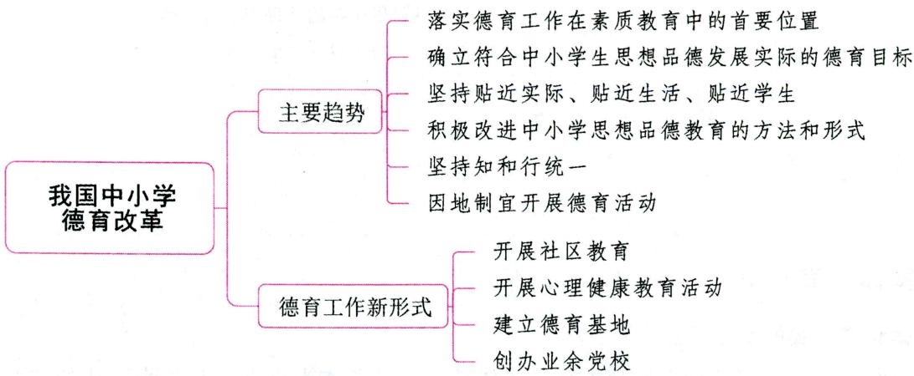

# 一、当前我国中小学德育存在的问题

(1)中小学教育中重智育、轻德育的现象依然存在，德育为先的办学思想未得到落实；  
(2)德育目标脱离实际且杂乱无序；  
(3)德育内容与学生的思想实际、生活实际和发展需要脱节；  
(4)知与行分离，重视德育知识的灌输，轻视实践教育和道德行为的养成；  
(5)形式主义和简单化盛行，缺乏吸引力和感染力。

# 二、我国中小学德育改革的主要趋势 ★★ 【多选】

(1) 落实德育工作在素质教育中的首要位置；  
(2)确立符合中小学生思想品德发展实际的德育目标；  
(3)坚持贴近实际、贴近生活、贴近学生的德育方式，改进德育内容；  
(4)积极改进中小学思想品德教育的方法和形式；  
(5)坚持知和行统一，积极探索实践教学和学生参加社会实践、社区服务的有效机制，建立科学的学生思想道德行为综合考评制度；  
(6)因地制宜开展德育活动。

真题 [2023山西太原,多选]下列关于我国中小学德育改革的主要趋势的表述,正确的有( )

A. 因地制宜开展德育活动  
B. 确立符合中小学生思想品德发展实际的德育目标  
C. 积极改进中小学思想品德教育的方法和形式  
D. 落实德育工作在素质教育中的首要位置

答案：ABCD

# 三、国内学校德育改革的思路

(1) 实现由约束性德育向发展性德育转变；

(2) 实现由单向灌输德育向双向互动德育转变；  
(3) 实现由单一德育模式向多样化和个性化德育模式转变；  
(4)实现由封闭式德育向开放式德育转变。

# 四、德育工作新形式

随着时代的发展，传统的德育工作形式受到了前所未有的冲击和挑战，德育工作自身也不断推陈出新，出现了一些新形式。(1)开展社区教育；(2)开展心理健康教育活动；(3)建立德育基地；(4)创办业余党校。

# ★本节核心考点回顾 ★

我国中小学德育改革的主要趋势

(1) 落实德育工作在素质教育中的首要位置；  
(2)确立符合中小学生思想品德发展实际的德育目标；  
(3)坚持贴近实际、贴近生活、贴近学生的德育方式，改进德育内容；  
(4)积极改进中小学思想品德教育的方法和形式；  
(5)坚持知和行统一,积极探索实践教学和学生参加社会实践、社区服务的有效机制,建立科学的学生思想道德行为综合考评制度;  
(6)因地制宜开展德育活动。

# 第八章 班级管理与班主任工作

# 本章学习指南

# 一、考情概况

本章属于教育学的基础章节，内容广泛，需要识记、理解的知识较多，考生可带着以下学习目标进行备考：

1. 理解并区分班级管理的内容与模式。  
2. 识记并区分班集体的发展阶段。  
3. 掌握班集体形成与培养的内容。  
4. 理解班主任的角色作用。  
5. 掌握班主任工作的内容与方法。

# 二、考点地图

<table><tr><td>考点</td><td>年份/地区/题型</td></tr><tr><td>班级管理的内容</td><td>2024天津单选;2024山东单选;2023广东多选;2023山东判断;2022河北单选;2022广东多选、判断;2022河南简答</td></tr><tr><td>班级管理的模式</td><td>2024江苏单选;2024安徽单选;2024天津填空;2024广东判断;2023浙江单选;2023河南多选、判断;2022河南单选;2022河北单选;2022天津单选</td></tr><tr><td>班集体的发展阶段</td><td>2024广东单选;2023河北单选;2023河南单选、多选;2023广东判断;2022湖南单选;2022四川单选;2022辽宁单选</td></tr><tr><td>班集体的形成与培养</td><td>2024安徽单选;2024江苏单选;2023广东单选;2023安徽单选;2023山东单选;2023河南单选、判断;2022山东单选;2022广东单选;2022河北单选;2022河南多选;2022天津简答</td></tr><tr><td>班主任的角色作用</td><td>2024山东单选;2024河北单选;2024安徽简答;2022河北多选</td></tr><tr><td>班主任工作的内容与方法</td><td>2024安徽单选;2023江苏单选;2023河南单选;2023安徽单选;2023广东多选;2023山东材料分析;2023福建材料分析;2022天津单选;2022河北单选;2022河南单选、判断;2022湖南多选;2022浙江简答</td></tr></table>

注：上述表格仅呈现重要考点的相关考情。

# 国核心考点

# 第一节 班级与班级管理

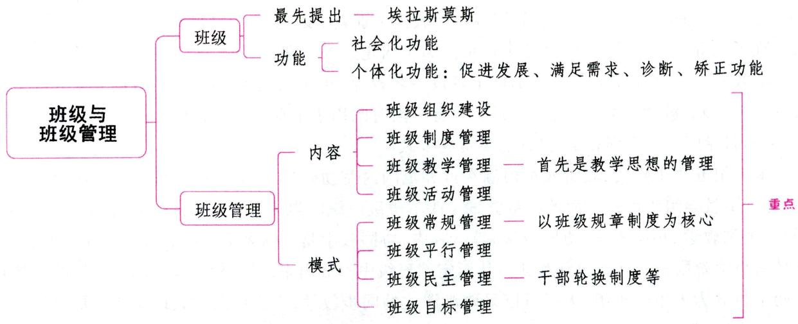

# 一、班级

# 考点1 班级的概念 ★【单选、判断】

班级是学校为实现一定的教育目的，将年龄和知识程度相近的学生编班分级而形成的有固定人数的基本教育单位，也是学校对学生进行日常管理、思想道德教育和组织教学活动的基本单位。

文艺复兴时期的著名教育家埃拉斯莫斯(又译伊拉斯谟)最先提出“班级”一词。

真题1 [2023河北邯郸，单选]最早正式提出“班级”一词的是( )

A.埃拉斯莫斯

B. 夸美纽斯

C. 马卡连柯

D. 杜威

真题2 [2024安徽统考，判断]班级是学校对学生进行日常管理、思想道德教育和组织教学活动的基本单位。（）

答案：1.A 2.√

# 考点2 班级组织的发展

班级组织是历史发展的产物。16世纪，随着资本主义工商业的发展和科学技术的进步、教育对象范围的扩大和教学内容的增加，一种新的适应大工业生产的教学组织形式——班级授课制应运而生。班级的概念基本上是随着班级教学或班级授课制概念的提出而出现的。

17世纪，教育家夸美纽斯在代表作《大教学论》中对班级组织进行了论证，从而奠定了班级组织的理论基础。后来，德国教育家赫尔巴特进一步设计和实施了班级教学。此后，班级组织在欧洲许多国家的学校中得到逐步推广和普及。19世纪，英国学校中出现的“导生制”极大地推动了班级组织的发展。班级的产生标志着人类的教育活动由个别指导为主的阶段进入到集体指导为主的阶段。

随着学校教育的不断发展，班级逐渐成为学校教育的基本单位，并对学生的发展产生越来越大的影响。

# 考点3 班级组织的改造 ★【判断】

最早提出对班级教学进行改造的是“道尔顿制”。哈利斯在圣路易创始的“圣路易编制法”，其特点是根据儿童的能力在短期内随时升级。这个方法的重点是将小学八个年级的学科内容分配在几个学期之间，一个学期以5周或10周计，学期结束时，编制新的班级，视儿童能力予以升级。而从教学法角度改造传统的班级教学组织的代表是1898年创始的“巴达维亚法”。它规定该市当时凡有一个班级招收60名以上儿童的学校，都应设立辅导教师，以收到个别教学之功效。传统的教学是同步的班级教学，结果牺牲了优等生和劣等生，教师负担过重。为了纠正这个弊端，把同步教学与个别教学结合起来以提高教学效率。一个班级儿童在50名以下者设一名教师；50名以上者，将一个班级的儿童分成两个团体，设两名教师。教师一名的场合，每日必须有一段时间用于个别教学，监督儿童学习；教师两名的场合，其中一名专门从事个别教学，另一名负责同步教学。

二十世纪五六十年代, 教育改革浪潮在世界范围内蓬勃兴起, 西方各国在重点进行课程改革的同时, 也进行了教学组织形式方面的改革尝试。改革班级组织的尝试主要包括特朗普制、活动课时制、开放课堂、个别教学、小队教学(协同教学)等。其中, 协同教学是哈佛大学倡导的教学管理组织形式, 其重点是从小学阶段开始就将教师和儿童从固定的班级中解放出来, 采取较有弹性的教学组织。将儿童按不同学科分为大组与小组, 大组可以采取讲课式的同步教学, 小组可以彻底地实施个别教学。这样既可以发挥教师的专长, 又可以唤起儿童的学习动机, 为充实和提高教学活动奠定基础。

真题3 [2023四川统考，判断]协同教学主张把大班上课、小班讨论、个人独立研究结合在一起。（）

答案：×

# 考点4 班级组织的特点 ★【单选】

(1)班级组织的目标是使所有学生获得发展；  
(2)班级组织中师生之间是一种直接的、面对面的互动；  
(3)情感是班级组织中师生之间、生生之间的纽带；  
(4)班级组织中的师与生交往是全面的和多层次的；  
(5)班主任和教师的人格力量使班级活动得以有效开展。

# 考点5 班级组织的功能 ★【单选、多选、填空】

班级组织的功能是由其结构和特点决定的。班级是一种社会组织，同时也是由不同个体组成的群体，这就决定了班级组织既具有社会化功能，又具有个体化功能。

# 1. 班级组织的社会化功能

(1)传递社会价值观，指导生活目标；  
(2) 传授科学文化知识, 形成社会生活的基本技能;  
(3)教导社会生活规范，训练社会行为方式；  
(4)提供角色学习条件，培养社会角色。

# 2. 班级组织的个体化功能

(1)促进发展的功能。学生是正在成长中的人，班级组织应该为每一个成员提供多元的、不同层次的发展机会。学生的发展涉及多个领域：①知识及认识的发展；②情感的发展；③兴趣和态度的发展；

④社会技能的发展。

(2)满足需求的功能。人处于一个团体中，会对团体产生各种需求，良好的班级组织应当能够满足学生的正当需求。班级组织既能提供满足归属的需求、亲和的需求和依存的需求等基本需求的机会，又能创造满足自我实现的需求与社会有用性的需求等高级需求的途径。  
(3)诊断功能。学生置身于班级组织中时,其人格及能力上的特点、差异以及不足就会显现出来。在班级开展的各项活动中,每一个成员都会通过自己和他人的表现以及所获得的评价,判断其表现的优势与不足。学生问题的暴露,为班主任或教师开展有针对性的教育、引导矫正学生的不良倾向创造了有利条件。  
(4)矫正功能。班级组织在发挥诊断功能的基础上，还可以通过各种活动和集体舆论，有针对性地让学生扮演一定的角色、承担一定的责任，以形成学生的能力、责任感、自信心及合作意识。

真题4 [2023江苏苏州，填空]班级组织的个体化功能包括：满足需求、促进发展、诊断、功能。

答案：矫正

# 二、班级管理

考点1 班级管理的概念 ★【单选、判断】

班级管理是一种有目的、有计划、有步骤的社会活动，这一活动的根本目的是实现教育目标，使学生得到充分的、全面的发展。班级管理的对象是班级中的各种管理资源，而主要对象是学生，班级管理主要是对学生的管理；班级管理的主要手段有计划、组织、协调和控制；班级管理是一种组织活动过程，它体现了教师与学生之间的双向活动，是一种互动的关系。

总之,班级管理是一个动态的过程,它是班主任和教师根据一定的目的和要求,采用一定的手段和措施,带领全班学生对班级中的各种资源进行计划、组织、协调、控制,以实现教育目标的组织活动过程。

真题5 [2024天津东丽，判断]班级管理是一种组织活动过程，教师是管理者，学生是被管理者。（）

答案：×

考点2 班级管理的功能 ★★ 【单选、多选、不定项、判断】

(1)有助于实现教学目标，提高学习效率——主要功能；  
(2)有助于维持班级秩序，形成良好的班风——基本功能；  
(3)有助于锻炼学生能力，学会自治自理——重要功能。

记忆有妙招·

为方便考生记忆，编者将班级管理的功能总结成以下口诀：

主要抓教学、基本是秩序、重要在学生。

考点 3 班级管理的特点 ★ 【多选】

(1)管理过程的教育性；(2)管理对象的特殊性；(3)管理方法的多样性；(4)管理工作的广泛性。

# 考点4 班级管理的过程 ★【多选】

说法一：班级管理过程包括制订计划、组织实施、评价反思(评价总结)三个环节。

说法二：班级管理过程由计划、实施、检查、总结四个环节组成。

# 考点5 班级管理的内容 ★★★ 【单选、多选、判断、简答】

# 1. 班级组织建设

# （1）班级组织的结构

班级组织机构是班级组织结构形成的基础与前提。班级组织机构微观建制的形式有直线式、职能式和直线职能式。直线式的结构图式是：班主任——班长——组长——学生。职能式的结构，在班长与组长中间横向的层次上又出现了许多新的职责分工，负责在班长与组长及学生之间的沟通和联系工作。直线职能式同时兼具上述两种形式的特点，在这种建制中既有明显的垂直水平的支配关系，又有明显的横向水平的责任分工的关系。我国中小学班级组织的建构多数属于直线职能式的建制形式。

班级组织的结构包括：班级的正式组织和非正式组织、班级组织的角色结构、班级组织的信息沟通结构、班级组织的规模（也有人认为，班级组织的结构包括职权结构、角色结构、师生关系结构和生生关系结构）。这里主要讲班级的正式组织和非正式组织。

我国中小学班级的正式组织一般分为三个层次：第一层是对全班工作负责的角色，即班干部；第二层是对小组工作负责的角色，即小组长；第三层是只对自身的任务负责的角色，即小组一般成员。

非正式组织是源于班级组织的个人属性层面的人际关系，是学生在共同的学习与活动中基于成员间的需求、能力、特点的不同，从个人的好感出发而自然形成的。学生的这种非正式组织有四种类型：①积极型。这种群体的价值目标与班级正式群体的价值目标是一致的，是班级正式群体的补充。例如，学生们自发组织的文艺活动小组、公益活动小组、体育活动小组等。②娱乐型。同学们由于情绪上的好感和消磨课余闲暇时间的需要而聚集在一起，他们的主要目的是好玩、有趣。③消极型。这种群体会自觉和不自觉地与班主任、班委会发生对立，如破坏纪律、发牢骚、不参加集体活动等。④破坏型。这类群体已经游离出正式组织，他们没有是非善恶标准，凭借一种所谓的江湖人的欲望、勇气和胆量而作为，常常对班级组织产生破坏甚至震慑作用。

# (2)班级组织建设的内容

①建立良好的班集体。②指导班级建设。班级建设改革的基本原则包括：第一，班级建设需要以学生和班级的发展状态为基础；第二，班级建设需要以实践活动为载体；第三，班级建设中需要以学生的成长需要为主线策划活动系列；第四，需要为班级建设提供组织制度的保障。

# (3)班级组织建构的原则

①有利于教育的原则。有利于教育的原则是班级组织建立的一条首要的原则。当其他的原则与其发生冲突的时候，其他原则都必须无条件地服从这一原则。②目标一致的原则。③有利于身心发展的原则。

# 2. 班级制度管理

制度是调节人与人之间关系的行为规范，按制度的形成可分为成文制度和非成文制度。

成文制度是指政府、学校、班级制定的规章制度，它反映了国家、社会的价值观和要求。

非成文制度是约定俗成的，主要包括班级的传统、舆论、风气、习惯等。

# 3.班级教学管理

教学是学校的中心工作，教学管理在学校各项管理工作中处于中心地位。教学管理首先是教学思

想的管理,常规管理是教学管理的基础,教学质量管理是班级教学管理的核心。对一个“教学班”的教学管理,是班主任最重要的管理职能之一。班级教学管理的内容包括：

(1) 明确教学管理的目标和任务。(2) 建立行之有效的班级教学秩序。(3) 建立班级管理指挥系统。① 以班主任为核心的班级任课教师群体；② 以班长或学习委员、课代表为骨干的教学沟通系统；③ 以学习小组长为中心的执行系统。(4) 指导学生学会学习。

# 4. 班级活动管理

活动是教育的重要形式，也是个体积累经验、自我教育的良好形式；活动是个体生命和意志的能动性的展现。班级活动是班级活力的表现，是增强班级凝聚力的重要途径，是实现班级管理目标的重要载体。

真题6 [2024天津东丽区，单选]班级组织机构的微观建制形式有很多种，其中的一种形式的结构图式如下：班主任——班长——组长——学生。这种班级组织机构属于（）

A. 直线式

B. 职能式

C. 直线职能式

D. 均不正确

真题7 [2024山东枣庄，单选]教学管理在学校各项管理工作中处于中心地位，教学管理首先是（ ）的管理。

A. 教学行政

B. 教学思想

C. 教学常规

D. 教学质量

真题8 [2022河北保定, 单选]在班级建设改革实践中, 需要形成一些基本的原则, 以促进将班级建设的当代价值具体化为改革实践。关于班级建设改革的基本原则, 下列说法错误的是( )

A. 班级建设需要以实践活动为载体  
B. 需要为班级建设提供组织制度的保障  
C. 班级建设需要以学生和班级的发展状态为基础  
D. 班级建设中需要以教师的发展需要为主线策划活动系列

真题9 [2022广东广州, 多选]班级组织是由学生组成的正式组织, 旨在实现班级组织的公共目标, 这是一种制度化的人际关系。我国中小学班级的正式组织一般分为三个层次, 即( )

A. 班干部

B.小组长

C. 小组一般成员

D. 学生自发组织的公益活动小组

答案：6.A 7.B 8.D 9.ABC

# 考点6 班级管理的模式 ★★★ 【单选、多选、填空、判断】

# 1. 班级常规管理

(1)班级常规管理的内涵

  
班级管理的模式

班级常规管理是指通过制定和执行规章制度来管理班级的经常性活动。遵守班级规章制度是对每个学生的基本要求，也是每个学生必须履行的基本义务和职责。

(2)班级常规管理的内容

开展以班级规章制度为核心的常规管理，是班主任工作的重要内容之一。一般来说，班级的规章制度主要由三部分组成：

①教育行政部门统一规定的有关班集体与学生管理的制度，如学生守则；  
②学校根据教育目标、上级有关指示制定的学校常规制度，如考勤制度、奖惩制度、作业要求等；  
③班集体根据学校要求和班级实际情况讨论制定的班级规范，如班规、值日生制度、考勤制度等。

# 班级常规管理的内容的其他说法

(1)班级工作程序常规，包括班级工作计划和班级工作总结等；(2)班级档案制度常规；(3)工作职责常规；(4)学习生活常规，包括班级学习、体育锻炼、卫生保健、劳动等方面的常规；(5)传统活动常规；(6)家长工作常规，与家长保持经常性联系，共同进行班级管理，共同促进学生成长。

# 2. 班级平行管理

# (1)班级平行管理的内涵

班级平行管理是指班主任既通过对集体的管理去间接影响个人，又通过对个人的直接管理去影响集体，从而把对集体和个人的管理结合起来的管理方式。

班级平行管理的理论源于马卡连柯的“平行影响”的教育思想。马卡连柯认为,教师要影响个别学生,首先要影响学生所在的班级,然后通过学生集体与教师一起去影响这个学生,这样就会产生巨大的教育力量。

# (2)实行班级平行管理的要求

班主任实施班级平行管理时，要实施对班集体与个别学生双管齐下、互相渗透的管理，既要充分发挥班集体的教育功能，使其真正成为教育的力量，又要通过转化个别学生来促进班集体的管理与发展。

# 3. 班级民主管理

# （1）班级民主管理的内涵

班级民主管理是指班级成员在服从班集体的正确决定和承担责任的前提下，参与班级全程管理的一种管理方式。班级民主管理的实质是在班级管理的全过程中，调动学生自我教育的力量，发挥每一个学生的主人翁精神，使人人都积极主动地参与班级事务，让每个学生都成为班级的主人。

# (2)实行班级民主管理的要求

①组织全体学生参与班级全程管理，即在班级管理的计划、实行、检查、总结的各个阶段，都让学生参与进来；②建立班级民主管理制度，如干部轮换制度、定期评议制度、值日生制度、值周生制度、民主教育活动制度等。

# 4. 班级目标管理

# (1)班级目标管理的内涵

班级目标管理是指班主任与学生共同确定班级总体目标，然后转化为小组目标和个人目标，使其与班级总体目标融为一体，形成目标体系，以此推动班级管理活动，实现班级目标的管理方法。目标管理是由美国管理学家德鲁克提出来的。

# (2)实行班级目标管理的要求

在班级中实施目标管理，就是要围绕全体成员共同确立的班级奋斗目标，将学生的个体发展与班级进步紧密地联系在一起，并在目标的引导下，实施学生的自我管理。

真题10[2024江苏苏州，单选]班主任既通过对集体的管理去间接影响个人，又通过对个人的直接管理去影响集体，从而把对集体和个人的管理有机结合起来的管理方式是（）

A. 平行管理

B. 常规管理

C.民主管理

D. 目标管理

真题11 [2024广东广州, 判断]班级民主管理是指为每个学生创造参与班级管理的机会, 使他们在管理的实践中学会自主管理, 在自主的活动中培养自我教育能力, 让每个学生都成为班级的主人。

班干部轮换制属于班级民主管理制度。（）

A. 正确

B. 错误

答案：10.A 11.A

考点7 班级管理的原则 ★【单选、不定项、判断】

(1) 方向性原则。指班级管理工作必须坚持正确的方向，用正确的思想引导学生。  
(2)教管结合原则。指把对班级的教育工作和对班级的管理工作辩证统一起来。  
(3)全员激励原则。指激励全班每个学生，充分发挥他们的智力、体力等各方面的潜能，实现个体目标和班级总目标。  
(4)全面管理原则。学生管理必须面向全体，从整体着眼。班级管理过程中要始终坚持使学生全面发展，并且要把所有学生作为管理对象，一视同仁，兼顾全局。这里的全面发展，不仅不排斥个性发展，而且是以每个人的自由发展为条件的。  
(5) 自主参与原则。指班级成员参与管理, 发挥其主体作用。班级的各种组织机构的干部成员都应该由学生民主选举产生, 并授予他们进行管理的权力, 不能随便干预。当他们遇到困难时, 要帮助解决, 但不要代替。这也就是我们通常所说的“班干部能做的班主任不做, 学生能做的班干部不做”。  
(6)平行管理原则。指管理者既通过对集体的管理去间接影响个人，又通过对个人的直接管理去影响集体，从而把对集体和个人的管理结合起来，以收到更好的管理效果。

# 知识再拔高·

# 班级管理的原则的其他说法

(1)符合学生身心发展特点。班级是中小学生学校生活的基本场域，班集体的建设目标、内容、规范与措施都要符合学生的年龄特征。  
(2)规范性要求与尊重个性相统一。班级管理一方面要能够体现教育目标对学生发展的要求，另一方面班级管理要能够充分地体现学生的个性特征，避免因规范性而扼杀学生的创造性。  
(3)引导学生的自主管理。班主任要善于运用民主型管理方式，注重加强引导，同时给学生充分的自主管理的权利与责任，让学生充分参与班集体建设。  
(4) 服务教学与学生的全面发展。班级管理在发挥维护教学秩序作用的同时，也要促进学生的全面发展，充分地发挥教育性的功能。

真题12 [2023河南郑州，不定项]班级管理是一个动态的过程，在班级管理过程中应遵循的原则有（）

A. 符合学生身心发展特点

B. 规范性要求与尊重个性相统一

C. 引导学生的自主管理

D. 服务教学与学生的全面发展

真题13 [2022辽宁营口，判断]“班干部能做的班主任不做，学生能做的班干部不做”所体现的班级管理原则是全员激励原则。（）

A. 正确

B. 错误

答案：12.ABCD 13.B

# 考点8 班级管理的方法 ★【单选】

(1)调查研究法。调查研究法是指班级管理者了解班级学生和班级集体情况，把握班级特点，解决

班级管理问题的一种方法。

(2)目标管理法。目标管理法是指班级管理者和班级学生根据社会发展要求、学校任务和班级实际情况, 共同规划班级或个体在一定时间内要达到的目标, 并将目标分解成一定的层次, 逐级落实, 通过采取一定的措施, 努力使目标实现的一种班级管理方法。  
(3)情境感染法。情境感染法是指班级管理者有意创设生动、形象的各种教育场景,以境育情,引发学生积极的情感体验,从而达到良好管理效果的一种方法。情境感染法具有形真、情切、意远、理蕴的特点,既注重认知,又重视情感,促进逻辑思维与形象思维协同发展,思想与行为协同发展。情境感染的关键点在于“情”。情能缩短管理者与被管理者之间的心理距离,创设一种亲切和睦的人际环境,从而使学生对班主任更加亲近。  
(4)规范制约法。规范制约法是指运用班级规范和班级制度约束学生的行为，促使学生逐步形成良好的行为习惯的一种管理方法。  
(5)舆论影响法。舆论影响法是指班级管理者通过健康向上的集体舆论的营造，形成积极浓厚的班级学习、生活的环境氛围，从而对身处其中的每一个学生产生潜移默化的影响的一种管理方法。  
(6)心理疏导法。心理疏导法是指班级管理者运用心理学原理和方法，对学生给予辅导、疏导或进行沟通交流，解决学生的心理问题和心理障碍，使学生保持心理平衡，促进其心理健康发展的一种方法。在中小学班级管理实践中，最常用的心理疏导法主要包括心理换位法、宣泄疏导法和认知疏导法等。  
(7)行为训练法。行为训练法是指学生在班级管理者有目的、有计划、有组织的指导下，通过模仿和反复练习，养成良好行为习惯的一种方法。  
(8)心理暗示法。心理暗示就是人们把一系列有关信息组成暗示序列，通过学习，下意识地吸收，从而激发内在潜力，加速和有效地实现人与外界信息的交流，促成个体的自我完善和自我发展。暗示作为一种心理影响力，具有间接性和含蓄性的特点。

真题14 [2022河南郑州，单选]班级教育管理者和班级学生根据社会发展要求、学校任务和班级实际情况，共同规划班级或个体在一定时间内要达到的目标，并将目标分解成一定的层次，逐级落实，通过采取一定的措施，努力使目标实现的一种管理方法是（）

A. 调查研究法

B. 目标管理法

C. 行为训练法

D. 规范制约法

真题15 [2022河北衡水，单选]“感人心者，莫先乎情”体现的班级管理方法是（）

A. 情境感染法

B. 心理暗示法

C. 心理疏导法

D. 舆论影响法

答案：14.B 15.A

# 考点9 当前我国学校班级管理中存在的问题及解决策略

# 1. 当前班级管理中存在的问题

(1)班主任的班级管理方式偏重于专断型；  
(2)班级管理制度缺乏活力，学生参与班级管理的程度较低。

# 2. 建立以学生为本的班级管理机制

(1)以满足学生的发展为目的。学生的发展是班级管理的核心。班级管理的实质就是让学生的潜能得到尽可能的开发。  
(2) 确立学生在班级中的主体地位。发展学生的主体性是学校管理的宗旨。现代班级管理强调以学生为核心，建立一套能够持久地激发学生主动性、积极性的管理机制，确保学生的持久发展。

(3)有目的地训练学生自我管理班级的能力。以训练学生自我管理能力为主的班级管理制度改革的重点是:适当增加“小干部”岗位,实行“小干部”轮换制度;按照民主程序选举干部;使“小干部”从“教师的助手”变成“学生的代表”;把学生的注意力从当干部引向当“合格的班级小主人”;注重实践教育、体验教育、养成教育,引导学生自觉实践、自主参与、形成良好习惯,把以教师为中心的班级教育活动转变为学生的自我教育活动,把班集体作为学生自我教育的主体。

# ★本节核心考点回顾 ★

# 1. 班级管理的内容

(1)班级组织建设；(2)班级制度管理；(3)班级教学管理；(4)班级活动管理。

# 2. 班级教学管理

教学管理在学校各项管理工作中处于中心地位。教学管理首先是教学思想的管理，常规管理是教学管理的基础，教学质量管理是班级教学管理的核心。

# 3. 班级管理的模式

(1) 班级常规管理，指通过制定和执行规章制度来管理班级的经常性活动。  
(2)班级平行管理，指班主任既通过对集体的管理去间接影响个人，又通过对个人的直接管理去影响集体，从而把对集体和个人的管理结合起来的管理方式。  
(3)班级民主管理,实质是在班级管理的全过程中,调动学生自我教育的力量,发挥每一个学生的主人翁精神,使人人都积极主动地参与班级事务,让每个学生都成为班级的主人。  
(4)班级目标管理。

# 第二节 良好班集体的培养

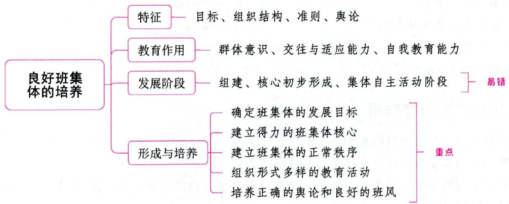

# 一、班集体的概念 ★ 【多选】

班集体是按照班级授课制的培养目标和教育规范组织起来的，以共同学习活动和直接性人际交往为特征的社会心理共同体。

班集体是班级群体的高级形式，班集体与班级并不等同。在本质上，班集体的内涵有多个层次：

(1)班集体是一个以学生亚文化为特征的社会群体,它传导和积淀着班级制度的社会文化基因(教育

育目标、规范和组织模式）；

(2)班集体是一个以教学为中介的共同活动体系，它以课堂教学为中介，整合学校、社会、家庭的教育影响，社会化的共同学习活动是班集体形成和发展的主要整合因素；  
(3)班集体还是一个以直接交往为特征的人际关系系统,正是交往和人际关系,动态地反映了集体与个体、个体与个体、集体与环境的相互作用,标志着集体形成的过程;  
(4)班集体是一个以集体主义价值为导向的社会心理共同体,集体心理的统一性和社会成熟度综合反映了集体主体性的水平。

# 二、班集体的特征 ★【单选、多选】

班级是学校中开展各类活动的最基本的组织形式，是按照一定的教育目的、教学计划和教育要求组织起来的学生群体。但一个班的学生群体还不能称为班集体，学生群体和班集体之间有着本质差别。关于班集体的特征，不同的学者理解有所差异。

说法一：(1)明确的共同目标。这是班集体形成的基础。(2)一定的组织结构，有力的领导集体。(3)共同生活的准则，健全的规章制度。(4)具有正确的集体舆论以及团结、和谐、向上的人际关系。

说法二：(1)明确的共同目标；(2)一定的组织结构；(3)一定的共同生活的准则；(4)集体成员之间平等、心理相容的氛围。

说法三：(1)有共同的奋斗目标和为达到共同目标而组织的共同活动；(2)有健全的组织机构和领导核心；(3)有严格的规章制度与纪律；(4)有正确的舆论和班风；(5)有和谐的人际关系。

真题1 [2023四川统考, 单选] 下列不属于健全的班集体应具备的要素的是( )

A. 凝聚力强的非正式群体

B. 正确的舆论和班风

C. 健全的组织机构和领导核心

D. 严格的规章制度与纪律

真题2 [2023山东威海，多选]班集体必须具备的基本特征有（）

A. 明确的共同目标

B. 一定的组织结构

C. 一定的共同生活的准则

D. 一定的共同舆论

E. 集体成员之间平等、心理相容的氛围

答案：1.A 2.ABCE

# 三、班集体的教育作用 ★【单选、多选】

(1)有利于形成学生的群体意识；  
(2)有利于培养学生的社会交往能力与适应能力；  
(3)有利于训练学生的自我教育能力。班集体是训练班级成员自己管理自己、自己教育自己、自主开展活动的最好载体。

# 四、班集体的发展阶段 ★★★ 【单选、多选、判断】

一个班的几十个学生，从刚组建的群体发展为坚强的集体，一般要经过如下阶段：

# 1. 组建阶段

这一阶段是班集体的雏形期, 班集体的基本特征已经出现。不过班级的核心和动力是班集体的组织者——班主任。他必须对学生提出明确的班集体的目的和应当遵守的制度与要求, 并引导学生积极

开展活动，促进班集体的发展。这时班集体对班主任有较大的依赖性，不能离开他的监督独立地执行他的要求。如果班主任不注意严格要求，班级就可能变得松弛、涣散。

# 2.核心初步形成阶段

这一阶段的特点是,师生之间、同学之间有了一定的了解,产生了一定的友谊与信赖,学生积极分子不断涌现并团结在班主任周围,班的组织与功能较健全,班的核心初步形成,班主任与集体机构一道履行集体的领导与教育职能。这时,班集体能够在班主任指导下积极组织和开展班的工作与活动,班主任开始从直接领导、指挥班的活动,逐步过渡到向他们提出建议,由班干部来组织开展集体的工作与活动。

# 3.集体自主活动阶段

这一阶段的特点是，积极分子队伍壮大，学生普遍关心、热爱班集体，能积极承担集体工作，参加集体的活动，维护集体的荣誉，形成正确的舆论与良好的班风。这时，班集体已形成，并成为教育的主体，能主动地根据学校和班主任的要求以及班上的情况，自觉地向集体成员提出任务与要求，自主地开展集体活动。

班集体的形成过程很复杂，实际上往往很难把这三个阶段截然分开。但是，了解班集体的发展阶段仍有助于我们认识班集体形成的规律，诊断出一个班的发展在现时所达到的阶段，以便采取措施，使其成为坚强的集体。

# 知识再拔高·

# 班集体的发展阶段的其他说法

说法一：一般来说，一个班集体从其初建到成熟，是一个连续的动态的过程，需要依次经过三个动态发展的阶段。(1)初建期的松散群体阶段。这一时期是班主任工作最繁忙的时期，也是班主任工作能力经受考验的关键期。(2)形成期的合作群体阶段。这一时期是班主任培养班级骨干的重要时期。(3)成熟期的集体阶段。班级已有明确的、共同认可的奋斗目标，班集体形成了良好的舆论氛围和民主团结的风气。

说法二：一个优秀班集体的形成，一般要经过如下阶段：(1)组建阶段；(2)形核阶段；(3)发展阶段；(4)成熟阶段。

真题3 [2024广东珠海, 单选]在新学期开始后, 班主任通过各式各样的班级活动帮助学生相互认识与熟悉, 并在班会课上投票选举了新一任的班干部, 以协助班主任开展工作。此时班集体处于( )

A. 组建阶段

B. 核心初步形成阶段

C. 发展阶段

D. 成熟阶段

真题4 [2023河北邢台, 单选]班集体的组建阶段是集体的雏形时期, 班级成员之间彼此不熟悉。对( )有较大依赖, 这一角色也是班级群体的核心和动力。

A.班主任

B. 班长

C. 课代表

D. 小组长

真题5 [2023广东梅州，判断]班集体发展阶段中，集体自主活动这一阶段还未形成正确的舆论与班风。（）

答案：3.A 4.A 5.×

# 五、班集体的形成与培养 ★★★ 【单选、多选、判断、简答】

关于建设班集体的方法,一种说法将其总结为:(1)调查了解学生,研究班级情况;(2)提出奋斗目标

标,组织共同活动;(3)培养集体舆论,形成优良班风;(4)培养和发现班级骨干,形成集体核心;(5)建立平等、团结、互助的新型人际关系。

此外，还有一种说法提出班集体的形成与培养主要包括以下几个方面：

# 1. 确定班集体的发展目标

目标是集体发展的方向和动力，一个班集体只有具有共同的目标，才能使班级成员在认识上和行动上保持统一，才能推动班集体的发展。班集体的发展目标一般可分为近期、中期、远期三种，目标的提出应由易到难、由近到远、逐步提高。确立班级目标要注意渐进、有恒和多样。

# 2. 建立得力的班集体核心

一个得力的班集体核心非常重要，它是维护和推动班级工作的有力助手，是带动全班同学实现集体发展目标的核心。因此，建立一支核心队伍是培养班集体的一项重要工作。

建立班集体的核心队伍，首先，教师要善于发现和培养积极分子。这就需要教师在了解学生的基础上，及时发现并选拔出热心为集体服务，团结同学且具有一定管理能力的学生干部。其次，教师应把对积极分子的使用与培养结合起来。

对于学生干部的培养，班主任要注意：（1)要有严格的要求。（2）要耐心引导。千万不要急躁，提出不切实际的要求，也不要事事包办代替，而要大胆放手，培养他们独立工作的能力，让他们在实践中学会独立地去做工作。(3)要注意学生集体领导机构的经常变动，使集体中每个成员轮流地置于领导与被领导的地位。

# 3. 建立班集体的正常秩序

班集体的正常秩序是维持和控制学生在校生活的基本条件, 是教师开展工作的重要保证。班集体的正常秩序包括必要的规章制度、共同的生活准则以及一定的生活规律。教师在班集体的组建阶段,就应着手正常秩序的建立工作, 特别是当接到一个教育基础较差的班级时, 首先就要做好这项工作。

# 4. 组织形式多样的教育活动

班集体是在全班同学参加各种教育活动的过程中逐步成长起来的，而各种教育活动又可以使每个人都有机会为集体出力并展示自己的才能。班级教育活动主要由日常性的教育活动与阶段性的教育活动两大部分组成，所涉及的内容有主题教育活动、文艺体育活动、社会公益活动等。

教师在组织各种教育活动时，要有明确的目的和要求，精心设计活动内容，注意形式的适龄化，力争把活动的开展过程变成教育过程。

# 5. 培养正确的舆论和良好的班风

班集体舆论是班集体生活与成员意愿的反映。正确的班集体舆论是一种巨大的教育力量, 对班集体每个成员都有约束、激励的作用, 是教育集体成员的重要手段。良好的班风是班集体大多数成员精神状态的共同倾向与表现。正确的舆论和良好的班风是班集体形成的重要标志。

真题6 [2024安徽合肥/淮北/铜陵，单选]优秀班集体形成的主要标志之一是（）

A. 成立了班委会

B. 开展了班级工作

C. 形成了正确的班级舆论

D. 确定了班级工作计划

真题7 [2024江苏南通, 单选]班主任接到了一个教育基础比较差的班级, 首先要做的是( )

A. 建立得力的班集体核心

B. 建立班集体的正常秩序

C. 组织形式多样的集体活动

D. 确定班集体的发展目标

答案：6.C 7.B

# ★本节核心考点回顾 ★

# 1. 班集体的发展阶段

(1)组建阶段。班级的核心和动力是班主任。(2)核心初步形成阶段。(3)集体自主活动阶段。这一阶段已经形成正确的舆论与良好的班风。

# 2. 班集体的形成与培养

(1)确定班集体的发展目标。(2)建立得力的班集体核心。(3)建立班集体的正常秩序。当教师接到一个教育基础较差的班级时，首先就要做好这项工作。(4)组织形式多样的教育活动。(5)培养正确的舆论和良好的班风。正确的舆论和良好的班风是班集体形成的重要标志。

# 第三节 班主任工作

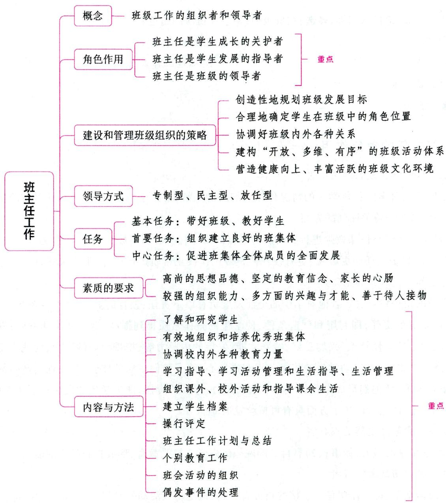

# 一、班主任的概念 ★ 【单选、填空】

班主任是全面负责一个教学班学生的思想、学习、健康与生活等工作的教师，是班级工作的组织者和领导者，是学校贯彻国家教育方针、促进学生全面健康成长的骨干力量。

教育部印发的《中小学班主任工作规定》指出：“班主任是中小学日常思想道德教育和学生管理工作的主要实施者，是中小学生健康成长的引领者，班主任要努力成为中小学生的人生导师。”

# 二、班主任的角色 ★ 【多选】

说法一：(1)班主任应是教育者、管理者、组织者；(2)班主任应是心理工作者；(3)班主任应是知识丰富的学者；(4)班主任要成为导演和演员；(5)班主任要成为社会活动家。

说法二：(1)学生思想道德的教育者；(2)学生日常生活的管理者；(3)学生健康成长的引导者；(4)学校文化的建设者。

真题1 [2023广东深圳,多选]在班级中,班主任扮演的角色有( )

A.管理者

B.组织者

C. 教育者

D. 心理工作者

E. 社会活动家

答案：ABCDE

# 三、班主任的角色作用 ★★★ 【单选、多选、判断、简答】

# 1. 班主任是学生成长的守护者

班主任可以对学生各科学习的情况作深入细致的了解，并给学生更细致、更有针对性的指导或辅导，关照集体教学未曾关照到的方面。

(1)班主任能够与任课教师进行有效的沟通；(2)班主任关心班级成员在品德、能力、身体和心理等方面的发展；(3)班主任能更敏锐、更有效地使班级工作按正常轨道运行，防患于未然；(4)班主任是学生在学习期间宝贵时光的见证人。

班主任的角色特点决定着他对学生的全面发展负有以下责任：教育的责任，即教育学生学会做人，学会做事；培养的责任，即利用和创造条件，使学生的整体素质得到提高，健康和谐地发展；发现的责任，即发现学生的个性特点、兴趣爱好、特殊才能、发展的内驱力等，挖掘他们的潜力，使他们得到充分的发展；激活的责任，即启动学生的积极意识和进取心，给予他们成功的体验，引发他们产生健康的积极的欲望和需求，使他们形成自我教育的要求和能力；夯实的责任，即为学生的发展打下坚实的基础，使学生在德、智、体、美、劳各个方面具有可持续发展的能力。

# 2. 班主任是学生发展的指导者

(1)教学生学习做人、做事；(2)靠自身的威望激发学生接受教育，形成自我教育的能力。

# 3. 班主任是班级的领导者

在班级活动中，班主任切忌做直接的指挥者，而应该是班级活动的参与者、指导者和鼓舞者。

# 知识再拔高·

# 班主任在班级管理中的地位和作用

班主任肩负着全面管理班级的职责，是学校教育的中坚力量。他在学校教育计划和其他各项管理的实施中，在协调本班任课教师的教育工作及沟通学校与家庭、社会教育之间的联系过程中起着重要作用。

1. 班主任是班级建设的设计者

班级建设的设计是指班主任根据学校的整体办学思想，在主客观条件许可的范围内所提出的相对理想的班级模式，包括班级建设的目标，实现目标的途径、具体方法和工作程序。其中，以班级建设目标的制定最为重要。班级目标的设计，主要依据两方面因素：（1）国家的教育方针、政策和学校的培养目标；（2）班级群体的现实发展水平。

2.班主任是班级组织的领导者

班主任在班级管理中的影响力主要表现在两个方面：

(1)班主任的权威、权力和地位，这些构成班主任的职权影响力；  
(2)班主任的个性特征与人格魅力，这些构成班主任的个性影响力。

3. 班主任是协调班级人际关系的主导者（艺术家）

交往是班级人际关系形成和发展的重要手段。班主任应细心研究班级的人际关系，指导学生的交往活动。这是班主任的重要使命之一。

真题2 [2024山东临沂，单选]以下不属于班主任的角色作用的是（）

A. 学生成长的守护者

B. 学生发展的指导者

C. 班级的领导者

D. 舆论的引导者

真题3 [2022河北邯郸，多选]班主任在班级管理中的地位和作用是（）

A. 班级组织的领导者

B. 班级建设的设计者

C. 班级活动的旁观者

D. 班级人际关系的协调者

真题4 [2024安徽合肥/淮北/铜陵,简答]简述班主任在班级管理中的地位与作用。

答案：2.D 3.ABD 4.详见内文

# 四、班主任建设和管理班级组织的策略 ★★ 【单选、多选、不定项、判断】

# 1. 创造性地规划班级发展目标

(1)以提高素质、发展个性为导向，制定适合班级组织实际水平的发展目标；(2)在班级组织的目标管理中，既要注重提高班级的整体发展水平，又要为班级中的每个成员精心规划其个性发展目标，并创造达成合理的个人发展目标的机会和条件，使班级中的每个成员在集体目标下树立自尊、自信、自强的自我形象。

# 2. 合理地确定学生在班级中的角色位置

(1)科学地诊断班级人际关系的现状；(2)实行班干部轮换制；(3)丰富班级管理角色；(4)正确对待班级中的非正式群体。

# 3. 协调好班级内外各种关系

（1)协调班级内的各组织和成员的关系；(2)协调与各任课教师及学校其他部门、其他班级的关系；(3)协调班级与社会、家庭的关系；(4)协调好班级内的各种活动和事务。

# 4.建构“开放、多维、有序”的班级活动体系

# (1)班级活动的内涵

班级活动是班主任指导学生依据一定的教育目标设计的、组织班级所有成员共同参与的教育活动。对班级活动教育价值的开发，可以分为日常性的活动与主题性的活动两大类。其中，班主任在班级日常性活动中，应注意唤醒学生的自主意识，主动地参加到班级的日常性活动中去。例如，每周的班会、晨会、班干部的选举、总结交流、少先队争章活动等，都可以放手让学生参与设计、实施。

(2)班级活动组织和设计的基本原则

① 班级活动的设计和组织应当具有系统性和目的性；  
②班级活动内容的多样性决定其形式的多样化；  
③组织班级活动过程中，要处理好教师主导作用和学生主体地位之间的辩证关系。

# 5. 营造健康向上、丰富活跃的班级文化环境

# (1)班级文化的内涵

所谓班级文化，是班级中教师和学生共同创造出来的联合的生活方式。它包括三种状态：最为显性的班级环境布置，最为隐性的班级人际关系和班风，以及处于中间状态的班级制度与规范等。

(2)班级文化的特点

①教育性。教育性是班级文化的首要特点，也是区别于其他组织文化的主要特征。②凝聚性。③制约性。④自主性。

(3)班级文化的类型

① 班级物质文化。包含教室内的环境布置（包括教室墙壁布置、桌椅的摆放、环境卫生的打扫与保持等）及师生的仪表等。

②班级行为文化。主要指班级开展的各种文化活动。它是班级文化中最活跃的因素，反映了班级的精神面貌、教学作风和管理水平，是班级精神和群体意识的动态反映。

③班级制度文化。指班级文化中的制度部分，是班级全体成员共同认可并自觉遵循的行为准则。

④ 班级精神文化。指班级长期形成的一种班级理念、哲学以及价值观，它是一种以意识为形态的班级核心文化。班风是班级精神文化的主体。树立良好的班风建设策略包括：A. 把握时机，早抓早管。B. 全员参与，形成共识。C. 发挥榜样力量。D. 充分利用舆论阵地。班级的墙报、黑板报、班级标语、班会、少先队活动或团队活动等是班级舆论形成的重要阵地。其中，黑板报和墙报是教室布置的主要内容，既属于班级物质文化建设，又属于班级精神文化建设。

(4)创建班级文化的方法

$①$ 营造文化性物质环境； $②$ 营造社会化环境； $③$ 营造良好的人际环境； $④$ 营造正确的舆论和班风； $⑤$ 营造健康的心理环境。

真题5 [2023广东深圳，单选]“没有规矩，不成方圆”，这句话主要适用于班级文化中的（）

A. 班级制度文化

B. 班级物质文化

C. 班级精神文化

D. 班级环境文化

真题6 [2023安徽蚌埠，多选]班级活动设计的基本原则有（）

A. 系统性

B.政治性

C. 目的性

D. 形式多样化

E. 处理好教师主导与学生主体的辩证关系

答案：5.A 6.ACDE

# 五、班主任的领导方式 ★★ 【单选、多选、判断】

表 1-41 班主任的领导方式  

<table><tr><td>领导方式</td><td>特点</td><td>学生的反应</td></tr><tr><td>专制型</td><td>属于支配性指导。无视学生的个别差异,以僵硬的对策为基础,只给予统一强制的指导,或一味地斥责、威胁(不愿了解学生对班级建设的想法,习惯自己做出决定,忽视学生的自我管理,总认为学生小,就应该事事听从教师,班级建设忽视学生的主动参与)</td><td>学生的自主性、能动性行为显著减少,消极性、依存性行为增多</td></tr><tr><td>民主型</td><td>属于综合性的指导。比较善于倾听学生的意见,能够灵活地适应学生的个别差异,以此为基础引出学生的自发行为,促进学生在合作中进行思想交流</td><td>学生的行为较稳定,自主积极的行为较多</td></tr><tr><td>放任型</td><td>属于不干预性指导。容忍班级生活的种种冲突,更无意组织班级活动,回避学生的主动精神</td><td>学生有目的的活动水平低下,违背团体原则的自发行为增多</td></tr></table>

上述三种领导方式是班主任常用的比较典型的领导管理方式，但在当前班级管理实践中，班主任在具体操作过程中有两种领导方式运用得比较多，即“教学中心”和“集体中心”的领导方式。“教学中心”是目前用得较多的领导方式，这与现行的班主任工作评价机制不无关系，它最大的弊端是忽视人的因素，班级工作只见教学不见学生，只看学生分数不看学生发展。

真题7 [2024福建统考, 单选]下列班主任管理风格中, 利于学生自主发展的是 ( )

A. 专制型

B. 放任型

C. 民主型

D. 溺爱型

真题8 [2023安徽统考，单选]在班级管理中，某小学六年级班主任总习惯于自己做决定，不愿了解学生的想法，忽视学生的自我管理，认为学生年龄小，就应该听教师的话。该班主任的管理风格类型属于（）

A. 民主型

B. 专制型

C. 放任型

D. 科学型

答案：7.C 8.B

# 六、班主任工作的任务与意义 ★★ 【单选、多选、不定项、判断、简答】

# 考点1 班主任工作的任务

班主任工作的基本任务是带好班级、教好学生。对学生进行思想品德教育，这是班主任的工作重点和经常性的工作。

班主任工作的首要任务是组织建立良好的班集体。

班主任工作的中心任务是促进班集体全体成员的全面发展。协调各方面力量，促进全班学生全面健康发展是班主任工作的最终目的，也是其工作的中心任务。

# 考点2 班主任工作的意义

说法一：(1)有助于实现学校的教育目标；(2)有助于促进学生身心健康成长；(3)有利于学校工作的组织与管理；(4)有利于教师的专业发展。

说法二：(1)班主任是班级的组织者、领导者；(2)班主任是学生成长的教育者；(3)班主任是联系各任课教师的纽带；(4)班主任是沟通学校与家长、社区的桥梁。

真题9 [2022河北邯郸, 不定项]关于班主任工作的意义, 下列说法不正确的是( )

A.班主任是班级的组织者、领导者  
B.班主任是学生成长的教育者  
C.班主任是联系各任课教师的纽带   
D.班主任是学生未来的创造者

答案：D

# 七、班主任素质的要求 ★★ 【单选、多选】

班主任不仅应具有教师的一般素养，而且应有做一个班主任的特殊品质。

(1)高尚的思想品德。班主任应有崇高的品德,饱满的工作热情,坚持不懈的进取精神,言行一致、表里如一,能为人师表。这样他才能在学生中树立崇高的威信,给学生以强有力的教育影响。

(2)坚定的教育信念。确信教育的力量，确信每个学生都有优点和才干，都有自己的前途，即使有某些缺点和错误的学生，只要对他做深入细致的思想教育工作，也能把他转变好。

(3)家长的心肠。班主任对待学生要像家长对待孩子一样, 兼严父与慈母二任于一身。既要无微不至地关怀学生, 真诚地爱护学生, 与学生彼此信赖、有深厚的情感; 又要严格要求学生, 对他们的缺点和错误毫不放过。

(4)较强的组织能力。一个称职的班主任必须善于计划和组织学生的各种活动,善于根据情况的变化迅速做出决定、采取措施、进行调整,在工作中表现出魄力,能令行禁止,坚定地引导学生积极开展活动,不断前进。

(5)多方面的兴趣与才能。一般来说,性格活泼开朗、兴趣广泛、多才多艺的班主任,与学生有较多的共同语言,易于打成一片,便于开展工作。

(6)善于待人接物。班主任为了教好学生，要与家长、任课教师、校外辅导员和有关社会人士联系

和协作，因而要善于待人接物。

另外，还有研究结果表明，班主任区别于一般教师的核心素养，主要体现在班集体建设能力、学生发展指导能力和教育沟通协调能力三个方面。

真题10 [2023辽宁锦州, 单选]中国教育学会班主任专业委员会会议指出, 将促进全国班主任队伍的整体发展和班主任专业素养的全面提升。以下不属于班主任区别于一般教师的核心素养能力的是( )

A. 班集体建设能力

B. 学生发展指导能力

C. 教育教学能力

D. 教育沟通协调能力

真题11 [2023广东深圳，多选]班主任余老师进取心强，言行一致，表里如一；对学生严慈相济，既严格要求学生，又无微不至地关心学生；性格开朗，多才多艺。上述品质体现出的班主任素质要求有（）

A. 坚定的教育信念

B. 高尚的思想品德

C. 家长的心肠

D. 多方面的兴趣与才能

E.较强的组织能力

答案：10.C 11.BCD

八、班主任工作的内容与方法 ★★★ 【单选、多选、填空、判断、名词解释、简答、材料分析】

# 考点 1 了解和研究学生

# 1. 了解和研究学生的意义

了解和研究学生是班主任工作的前提和基础，是做好班级工作的先决条件，也是班级教育过程中有效开展各项工作必不可少的基本环节。

# 2. 了解和研究学生的主要内容

(1)了解和研究学生个人。内容包括:思想品德状况、集体观念、劳动态度、人际关系、日常行为习惯;学习态度、学习成绩、学习方法、思维特点、智力水平;身体健康状况、个人卫生习惯;课外与校外活动情况;兴趣、爱好、性格等。  
(2)了解学生的群体关系。内容包括：班级风气、舆论倾向、不同层次学生的结构、同学之间的关系、学生干部情况等。  
(3)了解和研究学生的学习与生活环境。内容包括: 了解学生的家庭类型、家庭物质生活与精神生活条件、家长的职业及思想品德和文化修养、学生在家庭中的地位、家长对学生的态度等。

# 3. 班主任了解学生的方法

(1)观察法,即在自然条件下,有目的、有计划地对学生的各种行为表现进行观察。这是班主任了解、研究学生的最基本方法,也是最简单、最常用的方法。  
(2)谈话法，指班主任通过与学生面对面谈话来深入了解学生情况的基本方法。具有灵活、方便、容易了解事情细节、有利于感情沟通等特点。  
(3)调查法，即通过对学生本人或知情者的调查访问，从侧面间接地了解学生，包括问卷、座谈等。通过这种方法可获得大量的第一手材料，反映的问题比较深刻全面。

(4) 书面材料分析法, 即借助学生的成绩表、作业、日记等书面材料对学生进行了解的方法。这是了解学生基本情况最简易的方法。

# 考点2 有效地组织和培养优秀班集体

组织和培养班集体是班主任工作的中心环节。班主任应有计划、有组织地在短时间内有效地组建班集体，具体内容参见本章第二节中的“班集体的形成与培养”。

# 考点 3 协调校内外各种教育力量

班主任要对班级实施有效的教育与管理，必须要争取校内外各种教育力量的配合，调动各种积极因素。具体内容如下：

(1)协调本班各任课教师的工作，充分发挥本班任课教师的作用。

(2)协助和指导班级团队活动。

(3)争取运用家庭和社会教育力量。班主任要与学生家庭和社会有关方面取得联系,加强学生的思想政治工作。具体如下:①借助社会力量到学校来影响学生;②把学生有组织、有目的地放到社会上去接受积极影响;③学校与社会合作,形成有组织的来往,使其成为班级活动的一部分。

# 考点4 学习指导、学习活动管理和生活指导、生活管理

# 1.学习指导、学习活动管理

学习指导包括指导学生掌握科学的学习方法、养成良好的学习习惯、制订学习计划。

学习活动管理包括上课、课外作业、考试、学生的集体自修等。

# 2.生活指导、生活管理

生活指导包括：(1)对学生进行礼仪常规教育；(2)指导学生的日常交往；(3)指导学生搞好生理卫生；(4)指导学生遵纪守法；(5)对学生进行劳动教育。

生活管理包括考勤、日常作息安排、维持各种活动纪律、清洁卫生、执行守则、维持学生正常秩序等。

# 考点5 组织课外、校外活动和指导课余生活

课外活动和校外活动一般都以班为单位来组织与安排，所以，组织与指导这些活动也是班主任的一项经常性的重要工作。班主任还应经常关心和了解学生的课余生活，并给予必要的指导。

# 考点6 建立学生档案

班主任在全面了解学生的基础上，对掌握的材料进行分析处理，并将整理结果分类存放起来，即建立学生的档案。建立学生档案一般分四个环节：收集一整理一鉴定一保管。学生档案一般分为两类：

(1)集体档案。集体档案是指班主任将全班学生在各个时期各方面的表现，班级的历史、现状、趋势分析等记录下来作为今后教育集体的依据或参照的档案。  
(2)个体档案。个体档案是指将学生德、智、体、美、劳诸方面的表现和发展动态收集起来作为个体教育依据的档案。学生档案中最常见的是学生个体档案（即俗称的“个人档案”）。

# 考点 操行评定

# 1. 操行评定的概念

操行评定是以教育目的为指导思想，以“学生守则”为基本依据，对学生一个学期内的学习、劳动、生活、品行等方面进行的小结与评价。操行评定的主要内容有道德品行、学习、身心健康三个方面。

# 2. 操行评定的一般步骤

(1)学生自评；(2)小组评议；(3)班主任评价；(4)信息反馈。

# 3. 班主任写操行评语应遵循的原则

(1)客观性原则。班主任要实事求是，真实地评价每一个学生。  
(2)激励性原则。操行评语重在激励，使学生感到鼓舞、振奋，调动学生的积极性，增强前进的信心。  
(3)个性化原则。操行评语要避免千篇一律、千人一面的套话或俗话，评语要反映每个学生鲜活的生命个性。  
(4)全面性原则。操行评语应从德、智、体、美、劳各个角度全面评价学生，既要注重对学生行为的评价，也不能忽视对学生个性的评价。教师对学生的评价切不可以偏概全，要用全面的、发展的眼光看待每一个学生。

# 4. 学生操行评语的基本写法

(1)谈心式。例如：“工作上，你踏实肯干；墙报，你是主编；节目，你是主演。多少次，天黑了你还忙碌在校园；多少次，天一亮你就到教室打扫……”  
(2)描述性。例如：“你的歌唱得真棒，大家都在为你喝彩！”  
(3) 过程性。评语反映学生的成长过程, 既看过去和现在, 还要预示未来。例如: “本学期你积极参加数学兴趣小组活动, 成绩明显提高, 下学期你的数学学习一定会有更大的进步。”  
(4)情感性。评语要“有情”，言辞恳切，体现对学生的“尊重”。例如：“自然课上你的发言那么有新意，老师欣赏你！”

# 5. 班主任做好操行评定应注意的几个方面

(1)操行评语，要实事求是，抓主要问题，有针对性，能反映学生思想品德发展的全貌、特点和趋向；  
(2)要充分肯定学生的进步，指明其主要缺点和努力的方向，不可罗列现象、主次不分；  
(3)文字要简明、贴切,使人一看就明白,切忌空洞、抽象、一般化,严防用词不当,伤害学生的情感,造成家长的误解。

# 考点8 班主任工作计划与总结

班主任工作计划一般分为学期计划、月或周计划以及具体的活动计划（也有人认为，班主任工作计划一般可分为学期计划和具体的活动计划）。其中，学期计划比较完整，一般包括三大部分：(1)基本情况；(2)班级工作的内容、要求和措施；(3)本学期的主要活动与安排。

班主任工作总结一般分为两类：全面总结和专题总结，一般在学期学年末进行。做好总结应注意两点：(1)平时注意对班主任工作资料的积累；(2)注意做阶段小结。

# 考点 9 个别教育工作

班主任必须根据学生的个别差异，做好学生的个别教育工作。只有使每个学生都得到发展，班集

体才能健康地发展。班主任做好个别教育工作，包括做好先进生的教育工作、中等生的教育工作和后进生的教育工作。

# 1. 班级个别教育的方法

# (1) 谈话法

常见的个别教育的谈话有以下几种方式：

①商讨式谈话。教师以尊重、平等、亲切的态度与学生谈话，商讨问题的解决方式。这种谈话方式适用于自尊心强，有逆反心理，性格倔强，脾气暴躁，感情容易冲动的学生。  
②点拨式谈话。教师用暗示的手段,或借他人他事旁敲侧击,或用名言、警句、格言、成语等简明语言加以提示,帮助学生明白某些道理。这种谈话方式适用于自我意识强、独立感受力强、心理敏感的学生。  
③触动式谈话。教师以严肃的态度、激烈的语调、尖锐的语言给学生以较大的触动，促使其思考和改变。这种谈话方式适用于具有惰性心理、依赖心理和试探心理的学生。但要注意适度，火药味不宜太浓，不能伤害学生。  
④ 突击式谈话。教师因时、因事、因地、因人进行个别谈话的方式，主要用于自我防卫心理强的学生。这类学生一般不肯轻易认错，事后矢口否认，或搪塞掩盖，或转嫁他人。  
⑤渐进式谈话。教师有目的、有步骤、有层次地安排谈话的方式。这种谈话方式适用于性格内向、孤僻、有自卑心理的学生。  
⑥循异式谈话。教师根据谈话的不同对象、事件性质、影响程度，采取不同的时间、地点、态度的方式。对低年级、年龄小的学生着重形象教育、榜样教育；对高年级、年龄大的学生着重理性教育、道义教育。  
⑦谈心式谈话。教师以诚恳的态度、亲切的语言与学生在良好的气氛中交流内心的真实思想。这种谈话方式很普遍,课后随时随地都可以采用。但教师要讲究谈话艺术,巧妙而自然地加以引导。

# (2)锻炼法

锻炼是班主任布置一定任务，组织学生按照一定要求，参与各种实际活动，以形成良好的思想品质和行为习惯为主的方法。

# 2. 班级个别教育的要求

# (1)班级个别教育的一般要求

①摸清情况，分析原因，区别对待；②热爱和尊重学生，促其转化；③发现“闪光点”，及时表扬，逐步提高；④自我剖析，制定措施，接受监督；⑤常抓不懈，持之以恒。

# (2)先进生、中等生和后进生的教育工作

先进生的心理特征主要表现为：自尊心强，充满自信；强烈的荣誉感；较强的超群愿望与竞争意识。对于先进生的教育，班主任应注意：①严格要求，防止自满；②不断激励，弥补挫折；③消除嫉妒，公平竞争；④发挥优势，全班进步。

中等生，也叫“一般生”或“中间生”，是指那些在班级中各方面都表现平平的学生。中等生一般具有信心不足、表现欲不强等特点。对于中等生的教育，班主任应注意：①要重视中等生的教育，既要抓两头，也要抓中间，努力使中间因素向积极的方面转化，实现班级工作的良性循环；②根据中等生的不同特点有的放矢地进行个别教育。

后进生通常指那些学习积极性不高、学习成绩暂时落后、不太守纪律的学生。后进生的心理特征

主要表现为：不适度的自尊心；学习动机不强；意志力薄弱。对于后进生的教育，班主任应注意：①关心爱护后进生，尊重他们的人格；②培养和激发学习动机。

# 考点10 班会活动的组织

# 1. 班会的概念

班会是以班级为单位,在班主任的指导下,一般由学生干部主持进行的全班性会务活动。班会的特征是集体性、自主性和针对性。

# 2. 班会的类型

班会一般有三类，即常规班会、生活班会和主题班会。这里主要讲解主题班会。

主题班会是班级活动的主要形式，它是班主任依据教育目标，指导学生围绕一定主题，由学生自己主持、组织进行的班会活动。

(1)主题班会的形式

①主题报告会；②主题汇报会；③主题讨论会；④科技小制作成果展评会；⑤主题竞赛；⑥主题晚会。

(2)组织主题班会的阶段

①确定主题；②精心准备；③具体实施；④总结深化。

(3)组织主题班会应注意的问题

①主题不能过杂；②要有的放矢；③班主任要做好“导演”而不是“演员”。

# 考点 偶发事件的处理

偶发事件是指在教育过程中发生的事先难以预料、出现频率较低，但必须迅速做出反应、加以特殊处理的事件。具有突发性、紧迫性、冲击性和多样性的特点。

(1) 偶发事件处理的原则：①教育性原则；②客观性原则；③有效性原则；④可接受性原则；⑤冷处理原则。  
(2)偶发事件处理的办法：①沉着冷静面对；②机智果断应对；③公平民主处理；④善于总结引导。

# 记忆有妙招·

为方便考生记忆，编者将班主任工作的内容与方法总结成以下口诀：

了解组织多协调，指导课外建档案，操行评定需总结，个别班会偶处理。

真题12 [2024安徽合肥/淮北/铜陵，单选]班主任的工作从( )开始。

A.评定学生操行

B. 教育个别学生

C. 了解和研究学生

D. 组建班集体

真题13 [2022河北衡水，单选]教师用暗示的手段，或借他人他事旁敲侧击，或用名言、警句、格言、成语等简明语言加以提示，来帮助学生明白某些道理，这种方法适用于自我意识强、独立感受力强、心理敏感的学生，这种谈话方式是（）

A. 谈心式

B. 点拨式

C. 触动式

D. 突击式

真题14 [2023广东清远,多选]下列选项中不符合班主任写操行评语的要求的有( )

A. 罗列现象, 主次不分

B. 空洞、抽象、一般化

C. 用词不当

D. 有针对性

答案：12.C 13.B 14.ABC

# ★本节核心考点回顾 ★

# 1. 班主任的角色作用

(1)班主任是学生成长的守护者；(2)班主任是学生发展的指导者；(3)班主任是班级的领导者。

# 2. 班主任素质的要求

(1)高尚的思想品德；(2)坚定的教育信念；(3)家长的心肠；(4)较强的组织能力；(5)多方面的兴趣与才能；(6)善于待人接物。

# 3. 班主任工作的内容与方法

(1)了解和研究学生。了解和研究学生是班主任工作的前提和基础。  
(2) 有效地组织和培养优秀班集体。组织和培养班集体是班主任工作的中心环节。  
(3)协调校内外各种教育力量。  
(4)学习指导、学习活动管理和生活指导、生活管理。  
(5)组织课外、校外活动和指导课余生活。  
(6)建立学生档案。建立学生档案一般分四个环节：收集一整理一鉴定一保管。  
(7)操行评定。操行评语要有针对性, 不可罗列现象、主次不分, 切忌空洞、抽象、一般化, 严防用词不当。  
(8)班主任工作计划与总结。  
(9)个别教育工作。班主任做好个别教育工作，包括做好先进生的教育工作、中等生的教育工作和后进生的教育工作。  
(10)班会活动的组织。  
(11)偶发事件的处理。

# 第九章 课外、校外教育与三结合教育

# 本章学习指南

# 一、考情概况

本章属于教育学的基础章节，内容较为琐碎，考生可带着以下学习目标进行备考：

1. 识记课外、校外教育的主要内容和组织形式。  
2. 理解课外、校外教育的主要特点。  
3. 理解学校、家庭、社会三结合教育的内容。

# 二、考点地图

<table><tr><td>考点</td><td>年份/地区/题型</td></tr><tr><td>课外、校外教育的主要内容</td><td>2023河南多选;2022辽宁单选</td></tr><tr><td>课外、校外教育的组织形式</td><td>2024河北单选;2023广东多选</td></tr><tr><td>课外、校外教育的主要特点</td><td>2023广东判断;2023河南判断</td></tr><tr><td>教育合力</td><td>2024贵州判断;2023广东单选、多选;2022辽宁单选;2022浙江填空</td></tr></table>

注：上述表格仅呈现重要考点的相关考情。

# 国核心考点

# 第一节 课外、校外教育

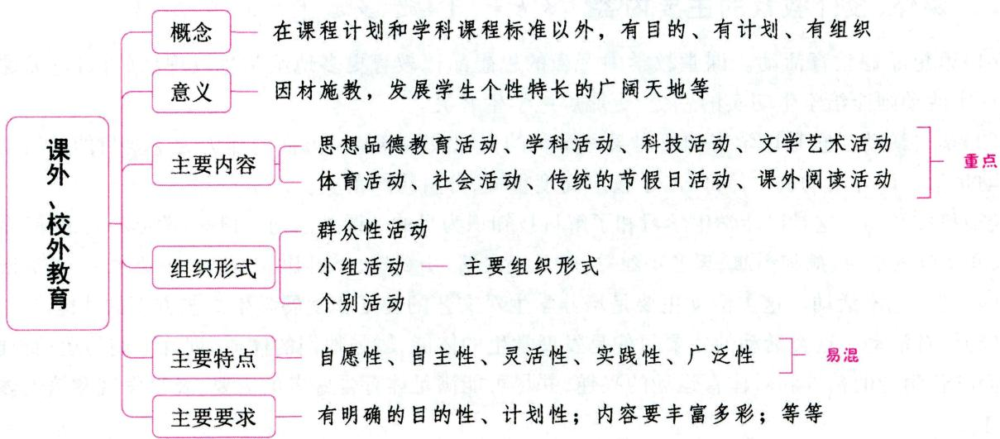

# 一、课外、校外教育概述

考点1 课外、校外教育的概念 ★ 【单选、多选、判断】

课外、校外教育是指在课程计划和学科课程标准以外，利用课余时间，对学生施行的各种有目的、有计划、有组织的教育活动。

课外教育指学校在课堂教学任务以外有目的、有计划、有组织地对学生进行的多种多样的教育活动，是学生课余生活的良好形式。这里的课堂教学包括课程计划中计入总课时的必修课和选修课。因此，选修课、自习课不属于课外教育。

校外教育是利用课余时间和社会力量对学生进行的灵活多样、富有教育意义的教育形式，是引导学生接触社会、理解社会的重要途径，是促进学生全面发展的必要的教育组织形式。

考点2 课外、校外教育与课堂教学的关系 ★★ 【单选、多选、判断】

课外、校外教育与课堂教学既有联系，又有区别。

(1)从两者的联系看，它们的目的是一致的，都是为了实现全面发展的教育目的。课堂教学使学生掌握系统的科学文化知识，又为课外、校外教育提供条件；课外、校外教育使学生运用所学知识，锻炼活动能力，使教学效果得到发展和提高。  
(2)课外、校外教育又区别于课堂教学，有着不可替代的教育作用。它对课堂学习有一定的促进作用，但又不局限于课堂教学的内容和教学大纲的范围。

课外、校外教育不是课堂教学活动的延伸,不是为完成作业而开辟的领域,它主要是通过活动的形式促进学生的全面发展。课外、校外教育在学生的发展中有其本体性的功能,也就是说,课外、校外教育在学生的发展中有其独特的价值。

考点 课外、校外教育的意义 ★ 【单选、多选】

(1)课外、校外教育有利于学生开阔眼界，获得知识；  
(2)课外、校外教育有利于发展学生智力，培养学生的各种能力；  
(3)课外、校外教育是进行德育的重要途径；  
(4)课外、校外教育是因材施教，发展学生个性特长的广阔天地。

# 二、课外、校外教育的主要内容 ★★★ 【单选、多选、判断、材料分析】

(1)思想品德教育活动。课堂教学中严谨的思想品德教育更多地给学生以理性的认识，而课外鲜活的现实活动则能给学生切实的感受，更能震撼学生心灵。  
(2)学科活动。它是以学习和研讨某一学科的知识或培养某一方面的能力为主要目的的活动。这类活动是学校课外活动的主体部分，学校应高度重视，分科组织落实。  
(3)科技活动。这是以让学生学习和了解科技知识为目的的课外活动。例如：举办科技讲座，参观游览，成立无线电小组、航模小组、园艺小组等，开展小发明、小创造、小制作、小实验、小论文等“五小活动”。  
(4)文学艺术活动。这类活动主要是培养学生对文艺的爱好和发展学生文艺方面的才能。  
(5)体育活动。这类活动的主要目的是发展学生的体能，增强他们的体质，训练他们的运动技能，培养他们吃苦耐劳的精神和对体育运动的兴趣，并尽可能满足体育爱好者的需要，及早发现和培养体育专业人才。

(6)社会活动。社会活动是让学生走出学校,接触社会,了解科学技术的发展,了解社会生活、经济建设实际状况的教育活动。包括社会调查、参观、考察、访问以及各种无偿的社会服务和公益劳动。  
(7)传统的节假日活动。中小学的课外活动要充分利用传统节假日适时对学生进行教育，让学生更好地了解这些节假日所承载的文化内涵，形成民族意识，养成优良品行。  
(8)课外阅读活动。课外阅读活动的目的在于使学生及时接触和吸收新知识，扩大学生的知识视野，培养他们的自学能力和思维能力。

真题1 [2022辽宁营口，单选]下列属于课外科学技术活动的是（）

A. 甲校根据学生的爱好, 在校庆日当天举办的音乐节  
B. 乙校组织的学生围棋比赛和相关集训  
C. 丙校举办的关于“双星伴月”天文奇观的知识普及讲座  
D. 丁校开展的“致敬袁隆平”主题日系列活动

答案：C

# 三、课外、校外教育的组织形式 ★★★ 【单选、多选、判断】

# 1. 群众性活动

群众性活动是一种面向多数或全体学生的带有普及性质的活动。群众性活动的具体活动方式有：(1)集会活动；(2)竞赛活动；(3)参观、访问、游览和调查；(4)文体活动；(5)墙报和黑板报；(6)社会公益劳动；(7)主题系列活动。

# 2.小组活动

小组活动是课外、校外教育活动的主要组织形式。小组活动以自愿组合为主,根据学生的兴趣爱好和学校的具体条件,进行有目的、有计划的经常性活动。小组活动的特点是自愿组合、小型分散、灵活机动。

# 3.个别活动

个别活动(也称个人活动)是学生在教师的指导和帮助下,根据个人的特长、能力水平和兴趣爱好独立进行的各种学习和实践活动。个别活动是课外活动的基础,充分体现了因材施教的特点。它往往与小组或群众性活动相结合,由小组或集体分配任务,根据个人的兴趣和才能单独进行。个别活动能充分发展学生自己的兴趣爱好,丰富和充实学生的精神生活,培养学生独立完成作业的能力。

真题2 [2023广东潮州,多选]课外活动的组织形式多种多样,按活动人数和规模,可分为( )

A.群众性活动

B. 小组活动

C. 个别活动

D. 社区活动

答案：ABC

# 四、课外、校外教育的主要特点 ★★★ 【单选、多选、判断】

# 1.自愿性

课外、校外教育活动是在课堂教学计划之外，学生自由选择、自愿参加的一种活动，强调学生可以按照自己的兴趣爱好和特长自愿选择，他们可以根据自己的条件、能力和状态，选择、控制、调节活动内容和方式等。这就能够比较充分地照顾到每个学生的兴趣和爱好，有利于发展学生的特殊才能。教师

可以向学生介绍各种课外活动，诱发学生的动机，给予指导，但参加与否，决定权在学生，不具有强制性。

# 2.自主性

课外、校外教育可以由学生自己组织、设计和动手。可以说，课外、校外教育活动是学生自己的活动，学生是课外活动的主体。同时，这也突出了学生的独立性。教师是活动的指导者、辅导者，对学生活动的组织起辅助作用。

# 3. 灵活性

课外、校外教育活动，无论是活动的内容，还是活动的形式都体现了灵活性。

# 4.实践性

课外、校外教育活动注重学生的实践环节。在活动中，学生的知识和技能主要通过自己设计、动手获得；那些经由教师辅导获得的知识和技能，学生可运用到实践当中来验证它的科学性，这样也就培养了学生的实践能力。

# 5.广泛性

课外、校外教育活动的内容不受课程计划、课程标准的限制，可以根据参加活动者的愿望和要求，以及学校、校外教育机关的具体条件而确定。只要围绕学校的教育目的，课外、校外教育活动的内容可非常广泛。课外、校外教育活动内容的广泛性，能拓宽学生的学习空间，丰富学生的生活，充实学生的精神世界，满足学生发展多方面才能的需要。

真题3 [2023河南平顶山，判断]课外、校外活动的“自愿性”是指教育活动是在学生独立自主的实践活动中进行的。（）

答案：×

# 五、课外、校外教育的主要要求 ★【简答】

(1)要有明确的目的性、计划性；(2)活动内容要丰富多彩，形式要多样化，要富有吸引力；(3)注意发挥学生集体和个人的主动性、独立性和创造性，并与教师指导相结合；(4)要考虑学生的兴趣爱好和特长，符合学生的年龄特征；(5)课堂教学与课外活动互相配合、互相促进；(6)因地、因校制宜。

真题4 [2024安徽合肥/淮北/铜陵，简答]简述学校课外活动的实施要求。

答案：详见内文

# ★本节核心考点回顾 ★

1.课外、校外教育的主要内容

(1)思想品德教育活动；(2)学科活动；(3)科技活动；(4)文学艺术活动；(5)体育活动；(6)社会活动；(7)传统的节假日活动；(8)课外阅读活动。

2.课外、校外教育的组织形式

(1)群众性活动。  
(2)小组活动。小组活动是课外、校外教育活动的主要组织形式。  
(3)个别活动。

3.课外、校外教育的主要特点

课外、校外教育的主要特点包括：自愿性、自主性、灵活性、实践性、广泛性。

# 第二节 学校、家庭、社会三结合教育

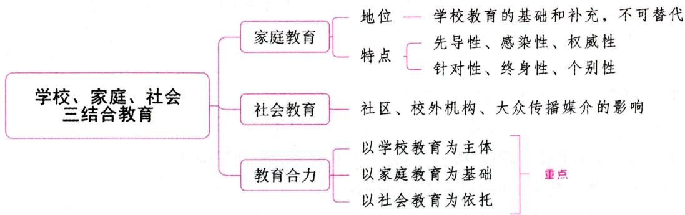

# 一、家庭教育 ★★ 【单选、多选、不定项、判断】

家庭是人们生活和消费的最基本单位，承担着生养和教育子女的基本社会职能。家庭对儿童和青少年的发育、知识的获得、能力的培养、品德的陶冶、个性的形成都是至关重要的。

狭义的家庭教育是指在家庭生活中,由父母或其他年长者对其子女与年幼者实施的教育和影响。广义的家庭教育应当是家庭成员之间的一种影响。我们一般所说的家庭教育,是狭义的家庭教育。家庭教育是学校教育的基础和补充,有不可替代的教育作用。

# 考点1 家庭教育的特点

(1)先导性。一个人最早接受的教育是家庭教育，第一批教育者是家长。家长的政治态度、对问题的看法，甚至思想作风、爱好特长，都直接或间接地影响着学生。家庭这种先入为主的教育对他们以后的德、智、体等方面的发展影响极大，甚至影响他们的未来。  
(2)感染性。所谓感染性，就是人的喜、怒、哀、乐等情感能够引起别人产生同样的或与之相联系的情感。情感的感染性像无声的语言，对人起着感动和感化的作用，是一种潜移默化的力量。  
(3)权威性。家庭教育与其他教育相比，具有更大的权威性。家长的权威是家庭教育成功的保障和前提。  
(4)针对性。所谓针对性,是指教育工作能从实际出发,有的放矢,而不是想当然,不是一般化的说教。相对来说,家庭教育的针对性更强。人们常说:“知子莫如父,知女莫若母。”子女自幼随父母生活,长期相处,父母能够全面细致地了解、熟知子女。  
(5)终身性。家庭教育的终身性是家庭教育的一个显著特点。  
(6)个别性。与学校教育中教师要面对几十名学生相比，子女在家庭里有可能得到更多的个别教育。

# 知识再拔高·

# 家庭教育的特点的其他说法

(1)教育内容的生活化。家庭教育与家庭生活在各个方面交叉渗透。随着家庭生活的变化和受教育者身心的发展,家庭教育也不断地变换着内容和形式,从各个方面影响着青少年的发展。  
(2)教育方式的情感化。家庭的血缘关系使任何教育动机和措施都带上浓厚的情感色彩，这

种情感性可以加强家长的责任心和影响力,但也容易让情感蒙蔽家长和子女的理智,导致家长的溺爱、子女的任性。

(3)教育方法的多样化。家庭教育的方法不是固定不变的, 它随家庭教育内容的不同以及子女年龄的不同而发生变化。在家庭教育中经常采用如下方法: ①解答疑难; ②指导读书; ③树立榜样; ④游戏。

真题1 [2023广东中山，多选]家庭教育有哪些特点（ ）

A. 先导性

B. 感染性

C. 终身性

D. 权威性

真题2 [2023湖北武汉，不定项]下列关于家庭教育的说法正确的有（）

A. 家庭情感必然导致家长的溺爱、子女的任性  
B. 家庭教育与家庭生活在各个方面交叉渗透  
C. 家庭教育的方法是固定不变的  
D. 家庭教育是学校教育的基础和补充

答案：1.ABCD 2.BD

# 考点2 家庭教育的基本要求

(1)环境和谐——创造和谐的家庭环境；  
(2)方法科学——家长教育子女需要科学的态度和方法；  
(3)以身作则——树立良好的榜样；  
(4)爱严相济——家长要把对孩子的关心爱护与严格要求紧密结合；  
(5)要求一致——家长对孩子的要求应统一，前后一贯；  
(6)全面关心——要对孩子的物质生活与精神生活、身体健康与心理健康、智力开发与非智力因素培养等多方面给予全面关心，把孩子培养成全面发展的合格公民。

# 二、社会教育

社会教育主要是指学校、家庭环境以外的社区、文化团体和组织等给予儿童和青少年的影响。

社会教育主要通过以下途径和形式来影响儿童和青少年的身心发展。

# 考点1 社区对学生的影响

社区环境对儿童的价值观念和生活习惯的养成有着直接的影响。一方面要鼓励和支持他们走出家门，同更多的同龄人交往，参加群体的活动，以使他们更快地认识自己，了解社会，并注意克服自己的不良行为；另一方面也要帮助他们选择交往的伙伴。

# 考点2 各种校外机构的影响

各种校外教育机构主要是指少年宫、少年科技站、各种业余学校等。这些机构在一定程度上弥补了学校教育的不足，在培养儿童和青少年不同兴趣爱好和特长方面发挥着重要的作用。

# 考点3 报刊、广播、电影、电视、戏剧等大众传播媒介的影响

由于报刊、广播、电影等大众传播媒介具有灵活性、生动形象、趣味性强等特点，它们深受儿童和青

少年的喜爱，并对他们产生了巨大吸引力和影响力。教师和家长在指导青少年、儿童接受宣传教育时要注意培养他们的辨别能力和批判能力，自觉抵制不良影响。

# 三、学校、家庭、社会三结合，形成教育合力 ★★★ 【单选、多选、填空、判断、材料分析】

教育合力是指学校、家庭、社会三种教育力量相互联系、相互协调、相互沟通，统一教育方向，形成以学校教育为主体，以家庭教育为基础，以社会教育为依托的共同育人的力量，使学校、家庭、社会教育一体化，以提高教育活动实效。

# 考点1 学校教育占主导地位

学校作为专职教育机构，有着明确的目的、周密的计划、科学的组织，有经验丰富、掌握青少年学生身心发展规律的专门教育工作者。同时，学校具有青少年学生集中、学习环境好、规章制度健全、育人周期长等明显的教育优势，并在社会上具有广泛的凝聚力、号召力，容易得到包括党政机关在内的社会各界的支持协助。

# 考点2 家庭、社会和学校三者协调一致，互相配合

家庭、社会和学校三者协调一致有利于保证整个教育在方向上的高度一致，实现各种教育间的互补，从而加强整体教育效果。

# 考点3 加强学校与家庭之间的相互联系

学校可以通过与家庭相互访问、建立通讯联系、定时举行家长会、组织家长委员会、举办家长学校等途径加强与家庭之间的联系。其中, 家长委员会是由家长代表成立的组织, 作为与学校沟通的桥梁,关注学生的教育。家长委员会是学校的参谋、咨询机构, 又是促进学校、家庭、社会联系, 加强学校、家庭、社会三结合教育的一种组织形式。

由于学生的家庭情况各不相同, 不同家庭的孩子所受教育也就有很大的不同。学校在指导和协调家庭教育方面承担着繁重的任务。学校对家庭教育的指导大致有几类: (1) 一般性指导, 指的是向家长宣传国家教育政策法规, 普及教育学和心理学知识, 提出家庭教育的一般要求和建议。(2) 针对性指导, 针对当前学校教育或家庭教育中存在的问题进行分析, 找出原因, 分别提出学校教育或家庭教育应采取的教育措施, 以及实施的途径和方法。(3) 分类指导, 针对不同年龄、不同类型的学生以及不同类型的家庭进行分别要求、分类指导。(4) 个别指导, 针对每个学生的家庭情况进行个别深入细致的指导, 帮助分析学生情况, 制定教育措施, 总结经验教训。

# 考点4 加强学校与社会教育机构之间的相互联系

# 1. 建立学校、家庭和社会三结合的校外教育组织

校外教育组织的任务包括：(1)相互交换情况，研究学生在学校、家庭和社会上的各种表现；(2)宣传好人好事；(3)制订转变后进生的计划和具体措施；(4)协商一些主要问题，如学生勤工俭学、校外文体活动所需要的器材、指导教师和场地等问题。

# 2. 学校与校外教育机构建立经常性的联系

学校应与宣传部门、社会公共文化机构及专门性的社会教育机构建立联系，通过开展各种活动丰富学生的课余生活，提高学生对社会的关注度及实践能力。

# 3. 采取走出去、请进来的方法与社会各界保持密切联系

社会各界指有关工矿、企业和部队等单位。学校可以请这些单位的优秀同志到学校作报告或聘请

他们为校外辅导员，也可以组织学生到这些单位参观、访问和劳动。

在我国,家庭、学校和社会的根本利益是一致的。为了使受教育者身心得以健康发展,学校应成为这三者相互联系、相互配合的最积极的倡导者和组织者,而家庭和社会应大力支持学校工作。

真题3 [2023广东深圳, 单选]有人说: “学生在学校进一步, 回到家里退一步, 走入社会退两步。”对此现象, 下列说法错误的是 ( )

A. 该现象是学校教育与家庭教育、社会教育脱节造成的  
B.学校教育必须和家庭、社会机构密切配合  
C. 家庭教育和社会环境影响大于学校教育作用  
D.课外、校外教育非常重要

真题4 [2022辽宁营口，单选]星火学校开展家庭教育讲座，向家长宣传国家教育政策法规，普及教育学和心理学知识。这属于学校对家庭教育的（）

A. 一般性指导

B. 针对性指导

C. 分类指导

D. 个别指导

真题5 [2022浙江嘉兴，填空]教育合力是指以学校教育为主体、以________为基础、以________为依托的共同育人的力量。

答案：3.C 4.A 5. 家庭教育 社会教育

# ★ 本节核心考点回顾 ★

# 1. 家庭教育的特点

(1)先导性；(2)感染性；(3)权威性；(4)针对性；(5)终身性；(6)个别性。

# 2. 教育合力

教育合力是指学校、家庭、社会三种教育力量相互联系、相互协调、相互沟通，统一教育方向，形成以学校教育为主体，以家庭教育为基础，以社会教育为依托的共同育人的力量，使学校、家庭、社会教育一体化，以提高教育活动实效。

# 02

# 第二部分

# 心理学

# 内容导学

教师招聘考试心理学部分共分为四章。  
- 第一章主要介绍心理学学科的基本内容,考查题型一般是客观题。  
• 第二章至第四章主要是对心理学的具体研究内容进行阐述, 涉及认知过程、情绪情感过程、意志过程和个性心理, 考查题型一般是客观题, 也会涉及简答或论述等主观题。  
考生要重点掌握第二章至第四章的内容。在备考时应结合历年真题和自身实际，有针对性地复习。  
为了方便考生梳理知识脉络，我们在各节设置思维导图和核心考点回顾。

# 第一章 心理学概述

# 本章学习指南

# 一、考情概况

本章属于心理学的基础章节，内容较为琐碎，考生可带着以下学习目标进行备考：

1. 掌握心理现象的结构。  
2. 了解神经元与神经系统的结构。  
3. 理解神经系统的活动方式。  
4. 理解心理学产生的历史背景。  
5. 掌握西方主要的心理学流派。

# 二、考点地图

<table><tr><td>考点</td><td>年份/地区/题型</td></tr><tr><td>心理现象的结构</td><td>2024江苏单选、判断;2024浙江填空;2023河南单选、多选、判断</td></tr><tr><td>神经系统的活动方式</td><td>2023湖北单选;2023河北单选;2023河南判断;2023广东判断;2022山东单选</td></tr><tr><td>西方主要的心理学流派</td><td>2023内蒙古单选;2023河北单选;2023河南单选、多选;2022浙江单选;2022福建单选;2022山西单选</td></tr></table>

注：上述表格仅呈现重要考点的相关考情。

# 国核心考点

# 第一节 心理学的研究对象与任务

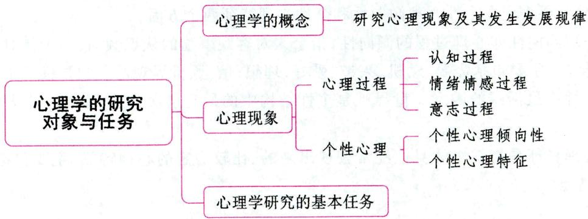

# 一、心理学的概念 ★ 【单选】

心理学是研究心理现象及其发生发展规律的科学, 心理现象又称心理活动。心理学既研究动物的心理, 也研究人的心理, 而以人的心理现象为主要研究对象。心理学兼有自然科学和社会科学的性质, 是一门中间 (边缘) 科学。

# 二、心理现象及其结构 ★★ 【单选、多选、填空、判断】

心理现象非常复杂，但从形式上可以归纳为心理过程和个性心理两个方面。

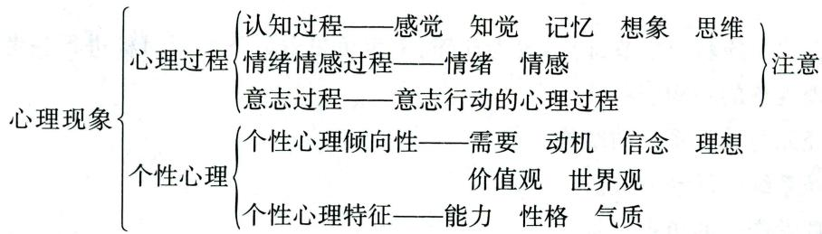  
图2-1 心理现象结构图

# 考点1 心理过程

心理过程是心理活动的一种动态过程，是人脑对客观现实的反映过程。它可以分为认知过程（认识过程），包括感觉、知觉、记忆、想象、思维等；情绪情感过程和意志过程三个方面。

# 小香课堂·

考生应牢记：注意不是一种独立的心理过程，也不属于某一种心理过程，而是伴随各种心理过程存在的特殊心理状态。

真题1 [2024浙江嘉兴，填空]心理过程包括认知过程、________、________。

真题2 [2024江苏南通，判断]注意不是一个独立的心理过程，而是伴随着各种心理过程存在的一种特殊心理状态。（）

答案：1.情绪情感过程意志过程 2.√

# 考点2 个性心理

个性心理是指表现在一个人身上比较稳定的心理特性的综合，是一个人总的精神面貌，反映了人与人之间稳定的差异特征。由于每个人的遗传素质、所处社会环境不同，形成了人的个性心理的差异。个性心理的差异主要表现在个性心理倾向性和个性心理特征两个方面。

(1)个性心理倾向性即心理过程的倾向性，指个人对客观事物的认识倾向，是个体对环境的态度和行为的积极性特征，主要包括需要、动机、兴趣、爱好、理想、信念、世界观等。它是推动个人进行活动的动力系统，是个性中最活跃的因素。世界观是个性结构中的最高层次，它决定着一个人的总的个性倾向和态度。  
(2)个性心理特征是指在个体身上经常表现出来的、比较稳定的心理特征，主要包括气质、性格和能力等方面的特点。

真题3 [2024江苏苏州，单选]个性心理特征包括（

A. 认知过程、情感过程、注意过程

B. 能力、气质、性格

C. 感知觉、记忆、想象、思维

D. 心理过程、心理状态、能力倾向

答案：B

# 考点 3 心理过程和个性心理的关系

心理过程和个性心理是心理学研究的两大方面，二者相互联系、相互渗透、相互制约。

(1) 个性心理是在心理过程中形成的, 如果没有对主观和客观世界的认识, 没有情绪情感的体验,没有积极地与困难做斗争的意志活动, 心理的个性差异就无从形成和表现。  
(2)已经形成的个性心理倾向性和个性心理特征又制约着心理过程的进行。既没有不带人格的心理过程，也没有不表现在心理过程之中的人格。

# 三、心理学研究的基本任务 ★ 【多选】

人类认识世界和改造世界的一切实践活动都是在人的心理活动的参与下进行的，也都是在人的心理调节指导下完成的。为此，心理学的基本任务主要有：(1)描述和测量人的心理；(2)理解和说明人的心理；(3)预测和控制人的心理。

# ★本节核心考点回顾 ★

1. 心理学的概念

心理学是研究心理现象及其发生发展规律的科学。

2. 心理过程

(1)认知过程，包括感觉、知觉、记忆、思维、想象等。  
(2)情绪情感过程。  
(3)意志过程。

3. 个性心理

(1)个性心理倾向性，包括需要、动机、兴趣、爱好、理想、信念、世界观等。  
(2)个性心理特征，包括气质、性格、能力等。

# 第二节 心理的实质

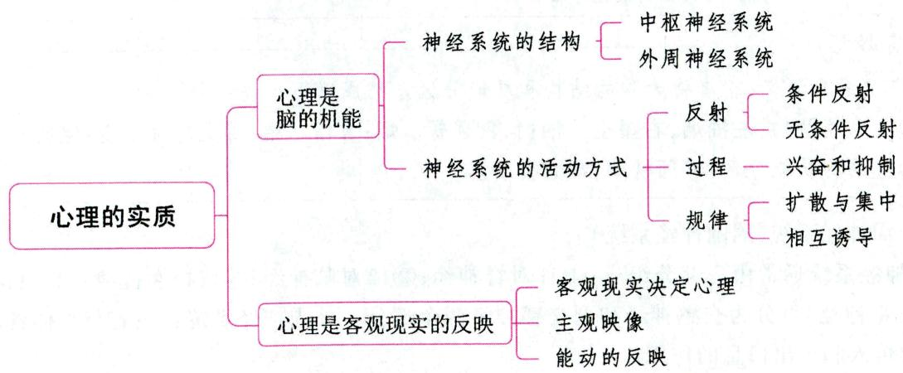

# 一、心理是脑的机能

心理是脑的机能, 脑是心理的器官。1861年, 法国外科医生布洛卡解剖了一位失语症病人的脑, 发现他大脑皮层的一个部位的神经细胞严重损坏, 由此证明了脑的这个部位 (后称“布洛卡区”) 与人的语言活动有关, 以后的大量实验论证了心理是脑的机能。

# 考点1 神经元与神经系统的结构 ★ 【单选、多选】

# 1. 神经元

神经元(又称神经细胞)是神经系统结构和机能的单位。神经元一般分为细胞体(或称胞体)、树突(短而多)和轴突(长且只有一个)三部分。神经元通过树突接受外来的刺激(信息),经胞体整合后再通过轴突将信息传出去。

# 2. 神经系统的结构

神经系统是心理活动的主要物质基础，由中枢神经系统和周围神经系统组成。人的心理活动，都要通过它的活动来实现。

# (1) 中枢神经系统

中枢神经系统包括脑和脊髓，是整个神经系统的主干。

脊髓是中枢神经系统的最低级部位，也是脑和周围神经系统的桥梁，同时脊髓可以完成一些简单的反射活动，如膝跳反射等。

脑又分为延髓、桥脑、中脑、间脑、小脑和大脑两半球等部分。大脑两半球是中枢神经系统的最高部位，是整个神经系统的“最高司令部”。其中，大脑的结构和主要功能分区如下表所示。

表 2-1 大脑的结构和功能分区  

<table><tr><td rowspan="2">结构</td><td>大脑左半球</td><td>负责身体的右边,是抽象逻辑思维和言语中枢的优势半球,它主要负责言语、阅读、书写、运算和推理等</td></tr><tr><td>大脑右半球</td><td>负责身体的左边,是形象思维和高度空间知觉的优势半球,它主要处理的信息是知觉物体的空间关系、情绪情感、欣赏音乐和艺术等。大脑两半球的单侧化研究发现右半球与创造性有关</td></tr><tr><td rowspan="4">功能分区</td><td>额叶</td><td>在组织有目的、有方向的活动中,有使活动服从于坚定意图和动机的作用</td></tr><tr><td>顶叶</td><td>主要调节机体的触压觉、温度觉、痛觉和内脏感觉等</td></tr><tr><td>枕叶</td><td>视觉中枢</td></tr><tr><td>颞叶</td><td>主要对听觉刺激进行加工</td></tr></table>

# 记忆有妙招·

为方便考生记忆，编者将大脑的结构和功能分区总结成以下口诀：

(1)大脑的结构：左抽烟，右星空。抽：抽象逻辑。烟：言语。星：形象思维。空：空间知觉。  
(2)大脑的功能分区：额顶枕颞；动感视听。

# (2)外周神经系统（周围神经系统）

外周神经系统通常由三部分组成：①31对脊神经；②12对脑神经；③植物性神经。其中，植物性神经（又称自主神经）可分为交感神经和副交感神经两个部分。外周神经系统担负着与身体各部分的联络工作，起传入和传出信息的作用。

考点2 神经系统的活动方式 ★★ 【单选、多选、判断】

# 1. 反射与反射弧

脑的反射活动是人的心理活动的基础，人的行为是由反射组成的。

反射是神经系统活动的基本形式, 是有机体通过神经系统对体内外刺激产生的有规律的应答活动。例如, 手碰到强烈刺激就立即缩回, 食物到口中会引起唾液分泌和胃蠕动等。实现反射活动的生理结构是反射弧, 它由感受器、传入神经、神经中枢、传出神经、效应器五个部分组成。

反射分为无条件反射和条件反射。无条件反射是先天的,即所谓无意识的本能行为。无条件反射主要有三种类型：食物性反射、防御性反射和性反射。例如，婴儿生下来就会吃奶， 就有唾液分泌，这是食物反射。条件反射又称信号反射，是后天经过学习才能得到的反射，即

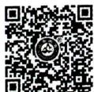  
反射的分类

所谓有意识学习得来的知识、技能、经验等。例如, 婴儿见到常用的奶瓶就欢喜, 并有唾液分泌。根据条件刺激的特点, 巴甫洛夫把大脑皮层的功能分为第一信号系统活动和第二信号系统活动, 具体内容见下表。

表 2-2 第一信号系统和第二信号系统  

<table><tr><td>种类</td><td>含义</td><td>特点</td><td>典例</td></tr><tr><td>第一信号系统</td><td>用具体事物作为条件刺激而建立的条件反射系统</td><td>人和动物共有的</td><td>望梅生津</td></tr><tr><td>第二信号系统</td><td>用语词作为条件刺激而建立的条件反射系统</td><td>人类特有的,是人类和动物的条件反射活动的根本区别</td><td>谈虎色变</td></tr></table>

  
无条件反射

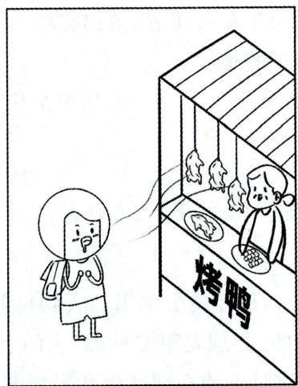  
第一信号系统

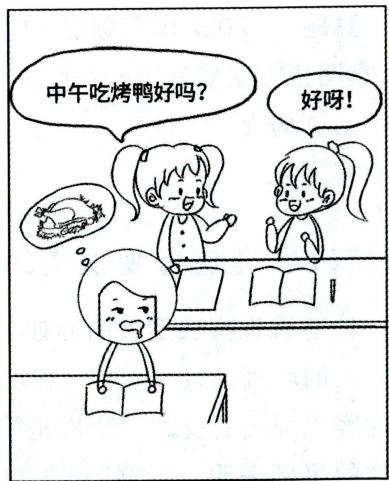  
第二信号系统

# 2. 神经活动的基本过程与规律

神经活动主要是指大脑皮层活动，它的基本过程是兴奋和抑制：前者是指神经细胞的活动状态；后者是指神经细胞处于暂时性的减弱或停止的状态。例如，学习时大脑神经细胞就处于兴奋状态，而睡眠时大脑神经细胞则处于抑制状态。机体的活动是神经系统兴奋和抑制互相对立、互相转化的结果。

神经活动的基本规律包括以下两点：

(1) 兴奋和抑制的扩散与集中。扩散是兴奋或抑制从原发点向四周扩散开来；集中是兴奋或抑制从四周向原发点集中（集合）过来。  
(2) 兴奋和抑制的相互诱导。相互诱导在效果上可分为负诱导和正诱导。