表 2-3 正诱导和负诱导  

<table><tr><td>相互诱导</td><td>含义</td><td>典例</td></tr><tr><td>正诱导</td><td>由抑制过程引起或加强邻近区域的兴奋过程</td><td>孩子临睡前的“闹觉”</td></tr><tr><td>负诱导</td><td>由兴奋过程引起或加强邻近区域的抑制过程</td><td>当专注阅读书本时,对周围环境的人或事往往“视而不见,听而不闻”</td></tr></table>

相互诱导在时空上具有不同特点，中枢神经过程同时在大脑皮层区域之间发生的相互诱导是同时性诱导；中枢神经过程相继在大脑皮层区域之间发生的相互诱导是继时性诱导。同时性诱导分为同时性正诱导和同时性负诱导；相继性诱导分为相继性正诱导和相继性负诱导。

表 2-4 同时性正诱导、同时性负诱导、相继性正诱导、相继性负诱导  

<table><tr><td>相互诱导</td><td>含义</td><td>典例</td></tr><tr><td>同时性正诱导</td><td>当皮层某一点发生抑制时,同时在其周围皮 层出现兴奋增强的现象</td><td>闭上眼睛听声音,听得更清楚</td></tr><tr><td>同时性负诱导</td><td>一个兴奋灶的周围出现抑制增强的现象</td><td>我们专心致志地学习,大脑皮层某些神经元的兴奋加强了相邻脑区的抑制,产生了良好的学习效果</td></tr><tr><td>相继性正诱导</td><td>当皮层某一点抑制消除后,其本身又表现出 兴奋增强的现象</td><td>由睡眠到醒来,就是大脑皮层上先抑制而后诱导为兴奋</td></tr><tr><td>相继性负诱导</td><td>兴奋灶兴奋过后,该区出现抑制增强的现象</td><td>由于晚上“开夜车”学习,大脑皮层上的兴奋导致第二天无精打采、昏昏欲睡的大脑抑制</td></tr></table>

真题 [2022山东临沂, 单选] 小明正在写作业, 弟弟突然打开了电视。听到电视里播放的是动画片, 小明也没法安静下来写作业, 这体现的是 ( )

A. 正诱导

B.相继负诱导

C. 同时负诱导

D. 继续诱导

答案：C

# 二、心理是客观现实的反映 ★ 【单选、判断】

# 1. 客观现实决定人的心理

人的心理活动, 就其产生方式来说, 是客观事物引起人脑反射的活动; 就其内容来说, 是作用于人脑的客观现实的反映。物质是第一性的, 心理是第二性的, 人的心理是客观现实的反映。“印度狼孩”卡玛拉的事例表明, 人类的社会实践活动对人的心理产生和发展起着决定性的作用, 是人的心理产生和发展的基础。

# 2. 心理是人脑对客观现实的主观映像

人的心理既是客观的又是主观的，它是由具体的个体在头脑中进行的。由于人的知识经验、需要、愿望以及个性特征的不同，因而对客观现实的反映也不同。所以，人的心理是客观现实的主观映像。

# 3. 心理是人脑对客观现实的能动的反映

人的心理不是消极被动地、录像式地对客观现实进行反映，而是能动地去反映客观世界。人们不仅反映客观事物具体的表面现象，而且还会通过脑的分析、综合，把握客观事物的本质和规律，预测客观事物发展变化的过程，从而有效地认识和改造客观世界。这些都是在实践过程中通过主客观的相互作用而实现的。

# ★本节核心考点回顾 ★

# 1. 大脑的结构

(1)左半球：抽象逻辑思维和言语中枢的优势半球；  
(2)右半球：形象思维和高度空间知觉的优势半球。

# 2. 反射的种类

(1)无条件反射：与生俱来，无意识的本能行为。  
(2)条件反射：后天学习。

# 3. 条件反射的类型

(1)第一信号系统：人和动物共有，用具体事物作为条件刺激。  
(2)第二信号系统：人类特有的，用语词作为条件刺激。

# 4. 兴奋与抑制的相互诱导

(1)同时性正诱导：抑制过程引起或加强兴奋过程，同时发生。  
(2)同时性负诱导：兴奋过程引起或加强抑制过程，同时发生。  
(3)相继性正诱导: 抑制过程引起或加强兴奋过程, 有先后顺序。  
(4)相继性负诱导: 兴奋过程引起或加强抑制过程, 有先后顺序。

# 第三节 心理学的产生与发展

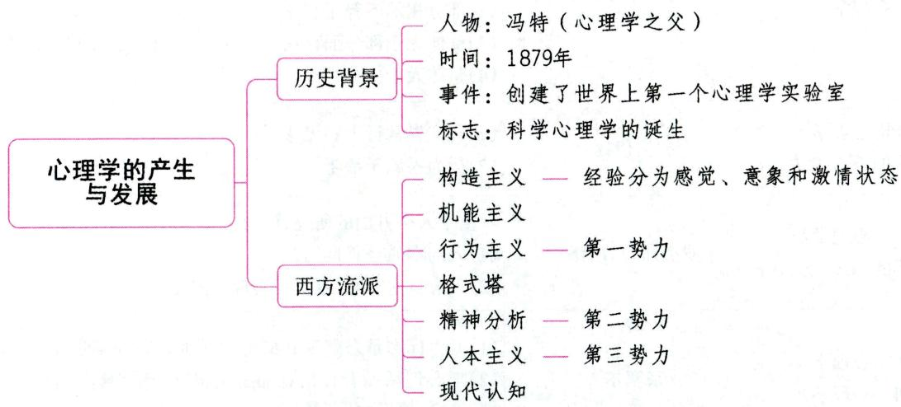

# 一、心理学产生的历史背景 ★ 【单选】

心理学是一门古老而又年轻的科学。在欧洲, 心理学的历史可以追溯到古希腊柏拉图、亚里士多德的时代。亚里士多德的《论灵魂》是历史上第一部论述各种心理现象的著作。

现代心理学的诞生和发展有两个重要的历史渊源：一是受到近代哲学思潮的影响，特别是唯理论和经验论的影响。近代哲学为西方现代心理学的诞生提供了理论基础。二是受到实验生理学的影响。现代心理学的实验方法直接来源于实验生理学。

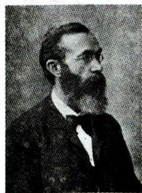  
冯特

1879年，德国著名心理学家冯特在德国莱比锡大学创建了世界上第一个心理学实验室，开始对心

理现象进行系统的实验研究。在心理学史上, 人们把这一事件看作心理学脱离哲学, 走上独立发展道路的标志, 也意味着科学心理学的诞生, 冯特因此被称为“心理学之父”。他的代表作有《生理心理学原理》《民族心理学》《心理学大纲》等。

# 二、西方主要的心理学流派 ★★ 【单选、多选、判断】

表 2-5 西方主要的心理学流派  

<table><tr><td>心理学流派</td><td>代表人物</td><td>主要观点</td></tr><tr><td>构造主义心理学</td><td>冯特、铁钦纳</td><td>(1)主张心理学研究人们的直接经验即意识,并把人的经验分为感觉、意象和激情状态(情感)三种元素;(2)主张采用实验内省法</td></tr><tr><td>机能主义心理学</td><td>詹姆士、杜威和安吉尔</td><td>(1)主张研究意识,但是他们不把意识看成是个别心理元素的集合,而是看成一种持续不断、川流不息的过程,提出了“意识流”;(2)强调对意识作用与功能的研究,不赞成构造主义对心理结构进行分析</td></tr><tr><td>行为主义心理学(西方心理学的“第一势力”)</td><td>华生</td><td>(1)诞生标志是1913年华生发表了《在行为主义者看来的心理学》;(2)反对意识,主张以可观察与可测量的行为为研究对象;(3)反对内省,采用实验方法</td></tr><tr><td>格式塔心理学(完形心理学)</td><td>韦特海默、苛勒和考夫卡</td><td>反对把意识分析为元素,而强调心理作为一个整体、一个组织的意义,认为:(1)整体不能还原为各个部分、各种元素的总和;(2)部分相加不等于整体;(3)整体先于部分而存在,并且制约着部分的性质和意义;(4)整体大于部分之和</td></tr><tr><td>精神分析心理学(西方心理学的“第二势力”)</td><td>弗洛伊德</td><td>(1)研究异常行为和无意识;(2)行为根源于欲望</td></tr><tr><td>人本主义心理学(西方心理学的“第三势力”)</td><td>罗杰斯、马斯洛</td><td>着重于人格方面的研究,认为:(1)人的本质是善良的;(2)人有自由意志,有自我实现的需要</td></tr><tr><td>现代认知心理学(信息加工心理学)</td><td>奈塞尔</td><td>(1)诞生标志是奈塞尔1967年出版的《认知心理学》;(2)把心理活动看作信息加工系统,由感官搜集信息,经过分析、存储、转换,然后加以利用</td></tr></table>

# ·记忆有妙招·

为方便考生记忆，编者将西方主要的心理学流派的代表人物及其观点总结成以下口诀：

铁粉内省造元素；危机适应意识流；华生行为双第一；完形整体为科考；弗洛伊德无意识；罗马人格居第三；信息加工奈塞尔。

真题 [2023 内蒙古巴彦淖尔, 单选]认为所有复杂的心理活动都是由感觉、意象和情感这些基本元素构成的心理学理论学派是（）

A. 机能主义心理学

B.构造主义心理学

C. 格式塔心理学

D. 认知主义心理学

答案：B

# ★本节核心考点回顾 ★

1. 科学心理学的诞生

1879年，德国著名心理学家冯特在德国莱比锡大学创建了世界上第一个心理学实验室。这一事件标志着科学心理学的诞生。冯特因此被称为“心理学之父”。

2.构造主义心理学

(1)代表人物：冯特、铁钦纳。  
(2)主要观点：把人的经验分为感觉、意象和激情状态三种元素。

3. 机能主义心理学

(1)代表人物：詹姆士、杜威和安吉尔。  
(2)主要观点：把意识看成一种持续不断、川流不息的过程，提出了“意识流”。

4. 行为主义心理学

(1)代表人物：华生。  
(2)地位：西方心理学的“第一势力”。  
(3)主要观点：主张研究行为，主张用实验方法。

5.人本主义心理学

(1)代表人物：罗杰斯、马斯洛。  
(2)地位：西方心理学的“第三势力”。  
(3)主要观点: 认为人的本质是善良的, 人有自由意志, 有自我实现的需要。

6. 现代认知心理学

(1)代表人物：奈塞尔。  
(2)主要观点：把心理活动看作信息加工系统。

# 第二章 认知过程

# 本章学习指南

# 一、考情概况

本章属于心理学的重点章节，也是考试中重点考查的章节，考生可带着以下学习目标进行备考：

1. 掌握感知觉的种类、规律和常见的社会知觉偏差。  
2. 理解记忆的分类，掌握记忆过程及其规律。  
3. 能够运用记忆规律有效地组织复习。  
4. 掌握并区分想象的种类。  
5. 理解思维的特点，掌握思维的品质和种类。  
6. 掌握创造性思维能力的培养。  
7. 掌握注意的种类、品质及其规律的应用。

# 二、考点地图

<table><tr><td>考点</td><td>年份/地区/题型</td></tr><tr><td>知觉的种类</td><td>2024广东单选;2024安徽单选;2024河南单选;2023天津单选;2023内蒙古单选;2023广东单选;2023河南单选、多选;2022贵州单选;2022江苏单选;2022河南单选</td></tr><tr><td>感觉的相互作用规律</td><td>2024江苏单选;2024河南不定项;2024浙江判断;2023河南单选;2023江苏单选;2022浙江单选</td></tr><tr><td>知觉的规律</td><td>2024天津单选;2024江苏单选;2024山东单选;2023江苏单选;2022安徽单选;2022贵州多选</td></tr><tr><td>记忆的分类</td><td>2023江苏单选;2023安徽单选;2023河南单选;2023贵州单选、多选</td></tr><tr><td>艾宾浩斯遗忘规律</td><td>2024江苏单选;2024江苏判断;2023山西单选;2023广东判断;2023河南判断;2022江苏单选</td></tr><tr><td>影响遗忘进程的因素</td><td>2024山西单选;2024江苏判断;2023辽宁单选;2023江苏单选;2023广西判断;2023安徽简答</td></tr><tr><td>根据记忆规律有效组织复习</td><td>2024安徽简答;2024江苏简答;2024天津简答;2023天津单选;2023广东单选;2023河南判断;2022河南多选</td></tr><tr><td>想象的种类</td><td>2024安徽单选;2024浙江单选;2024江苏单选;2024广东多选;2024福建多选;2024广东判断;2023河南单选、多选</td></tr><tr><td>思维的特点</td><td>2024江苏单选;2023广东单选;2023河南单选;2023安徽单选;2022山东单选;2022江苏单选</td></tr><tr><td>思维的品质</td><td>2024山东单选;2024安徽判断;2023山东单选;2022河南判断</td></tr><tr><td>思维的种类</td><td>2024安徽单选;2023江苏单选;2023天津单选;2023贵州单选;2023广东单选、多选;2022河北单选;2022山东单选</td></tr><tr><td>创造性思维能力的培养</td><td>2023广西单选;2023河南单选;2023广东判断;2023浙江简答;2022内蒙古多选</td></tr><tr><td>注意的分类</td><td>2024江苏单选;2024河北判断;2023江苏单选;2023广东单选;2022天津单选;2022江苏单选</td></tr><tr><td>注意的品质</td><td>2024浙江单选;2024安徽单选;2024广东多选;2023山西单选;2023江苏单选;2022河北单选;2022广东单选</td></tr><tr><td>注意规律在教学中的应用</td><td>2024浙江简答;2023福建材料分析;2022山东单选;2022广东单选、判断;2022四川多选</td></tr></table>

注：上述表格仅呈现重要考点的相关考情。

# 核心考点

# 第一节 感觉和知觉

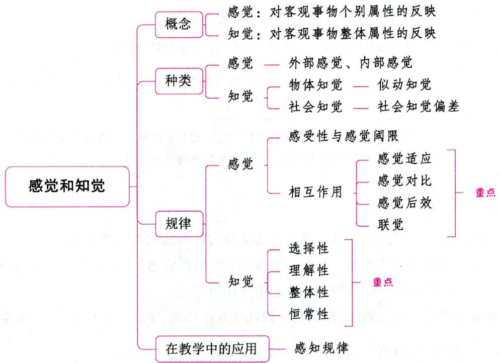

# 一、感知觉概述

# 考点1 感知党的概念与关系 ★【单选、判断】

# 1. 感觉的概念

感觉是人脑对直接作用于感觉器官的客观事物的个别属性的反映。感觉是一种最简单的心理现象, 是认识的起点。离开了对客观世界的感觉, 一切高级的心理活动都难以实现, 有机体将失去和周围

世界的平衡,生命也难以维持。从这个意义上讲,可以说感觉是一切知识和经验的基础,是人正常心理活动的必要条件。

# 2. 知觉的概念

知觉是在感觉的基础上产生的，它是人脑对直接作用于感觉器官的客观事物的整体属性的反映。例如：某物体用眼看，有一定大小，呈椭圆状，绿中透红；用手摸，表皮光滑，有一定硬度；用鼻子嗅，有清香的水果气味；用舌头尝，有酸甜味。人脑把这些属性综合起来，便形成对该物体的整体印象，并知道它是“苹果”。这就是对苹果的知觉过程。

真题1 [2024天津实验小学，单选]当我们看到鲜艳的紫红色的车厘子时，下列所说的话中最能体现“知觉”活动的是（）

A.“颜色好漂亮”

B.“我好想吃”

C.“看起来很甜哇”

D.“哇，是车厘子呀”

答案：D

# 3. 感觉与知觉的关系

表 2-6 感觉与知觉的关系  

<table><tr><td>关系</td><td>感觉</td><td>知觉</td></tr><tr><td rowspan="3">区别</td><td>反映事物的个别属性</td><td>反映事物的整体属性</td></tr><tr><td>仅依赖于个别感觉器官的活动</td><td>依赖于多种感觉器官的联合活动</td></tr><tr><td>受感觉系统的生理因素影响</td><td>受感觉系统的生理因素、人的过去经验、心理特点的制约,与词联系在一起</td></tr><tr><td>联系</td><td colspan="2">(1)二者都是刺激物直接作用于感觉器官而产生的,都是我们对现实的感性反映形式;(2)二者都是人类认识世界的初级形式,反映的都是事物的外部特征和外部联系</td></tr></table>

# 考点2 感觉的种类

根据刺激信息的来源和感觉的性质，可以把感觉分为外部感觉和内部感觉。

(1)外部感觉是指感受外部刺激，反映外部事物个别属性的感觉，主要分为视觉、听觉、嗅觉、味觉和肤觉五大类。其中，视觉在人的各种感觉中起主导作用。

(2) 内部感觉是指感受内部刺激，反映机体内部变化的感觉，主要分为机体觉、平衡觉和运动觉。

# 考点3 知觉的种类 ★★★ 【单选、多选、判断】

根据知觉过程中起主导作用的分析器可将知觉分为：视知觉、听知觉、嗅知觉、触知觉等。根据人脑反映的对象的不同，可以把知觉分为物体知觉和社会知觉。根据知觉对象是否符合客观实际和反映现实的精确程度，可以把知觉分为精细知觉、模糊知觉、错觉和幻觉。这里主要讲述物体知觉、社会知觉和错觉。

# 1. 物体知觉

物体知觉可分为空间知觉、时间知觉、运动知觉等。

# (1)空间知觉

空间知觉是指物体的空间特性在人脑中的反映，包括形状知觉、大小知觉、深度知觉、方位知觉等。这里我们重点介绍深度知觉。深度知觉是指对物体的远近等空间特性的知觉，也称为距离知觉或立体知觉。例如，看见一棵树被一幢房屋挡住，只露出一部分树枝和树叶，那么房屋肯定离我们更近。吉布森和沃克通过“视崖实验”，发现六个月的婴儿就已经具有了深度知觉。

# (2)时间知觉

时间知觉是对客观事物时间关系(即事物运动的速度、延续性和顺序性)的反映。在时间知觉中，听、视、触等感官都参加，并起不同的作用。

影响时间知觉的因素包括：①感觉通道的性质。在判断时间的精确性方面，听觉最好，触觉其次，视觉较差。②一定时间内事件发生的数量和性质。在一定时间内，事件发生的数量越多，性质越复杂，人倾向于把时间估计得较短；而事件发生的数量少，性质简单，人倾向于把时间估计得较长。例如，一节课或一个报告，如果内容丰富，引人入胜，听众会觉得时间过得很快；相反，如果内容贫乏、枯燥，听众就会把时间估计得较长。在回忆往事时，情况相反。同样一段时间，经历越丰富，就觉得时间长；经历越简单，就觉得时间短。③人的兴趣和情绪。人们对自己感兴趣的东西，会觉得时间过得快，出现对时间的估计不足。相反，对厌恶的、无所谓的事情，会觉得时间过得慢，出现时间的高估。在期待某种事物时，会觉得时间过得很慢；相反，对不愿出现的事物，会觉得时间过得快等。

# (3)运动知觉

运动知觉是对物体在空间位置移动的知觉，直接依赖于对象运动的速度。运动知觉分为真正运动的知觉和似动知觉。物体按特定速度或加速度，从一处向另一处做连续位移，由此引发的知觉就是真正运动的知觉。似动知觉是指在一定的时间和空间条件下，人们在静止的物体间看到了运动，或者在没有连续位移的地方看到了连续的运动。似动知觉的主要形式有：

表 2-7 似动知觉的主要形式  

<table><tr><td>形式</td><td>定义</td><td>典例</td></tr><tr><td>动景运动</td><td>当两个刺激(如光点、直线、图形等)按一定空间间隔和时距相继呈现时,我们就会看到从一个刺激物向另一个刺激物的连续运动</td><td>我们看到的电影、电视、霓虹灯活动广告都是按照动景运动发生的原理制成的</td></tr><tr><td>诱导运动(诱发运动)</td><td>由于一个物体的运动使其相邻的静止的物体产生运动的现象</td><td>夜空中的月亮是相对静止的,而浮云是运动的。可是,由于浮云的运动,人们看到月亮在动,而云是静止的</td></tr><tr><td>自主运动(游动效应)</td><td>人在注视暗环境中一个微弱的、静止的光点,片刻后感觉到光点在来回移动的现象</td><td>在暗室里,如果你点燃一支熏香或烟头,并注视着这个光点,你会看到这个光点似乎在运动</td></tr><tr><td>运动后效</td><td>在注视向一个方向运动的物体之后,如果将注注视点转向静止的物体,那么会看到静止的物体似乎向相反的方向运动</td><td>如果你注视瀑布的某一处,然后看周围静止的田野,会觉得田野上的一切在向上飞升</td></tr></table>

真题2 [2024安徽统考,单选]人脑对物体形状、大小、方位、距离等特征的反映属于( )

A. 运动知觉

B.时间知觉

C. 空间知觉

D. 平衡知觉

真题3 [2022贵州贵阳，单选]当两个刺激按一定的空间间隔和时距相继呈现时，我们就会看到从一个刺激物向另一个刺激物的连续运动，这就是（）

A. 运动后效

B. 自主运动

C. 诱导运动

D. 动景运动

真题4 [2023河南事业单位，多选]影响时间知觉的因素有很多，一定时间内事件发生的数量和性质就是其中一种。关于后者对前者的影响，下列叙述正确的有（）

A.一节课，如果内容贫乏枯燥，听众就会觉得时间较长  
B. 一定时间内, 事件发生的数量越多, 性质越复杂, 人们就会把时间估计得较长  
C. 一定时间内, 事件发生的数量越少, 性质越简单, 人们就会把时间估计得较短  
D. 回忆往事时, 同样一段时间, 经历越丰富, 就觉得时间长; 经历越简单, 就觉得时间短

答案：2.C 3.D 4.AD

# 2. 社会知觉

# (1)社会知觉的概念

社会知觉是个体在生活实践中，对别人、对群体以及对自己的知觉，也叫社会认知。它包括对别人的知觉、自我知觉和人际知觉三部分。

# （2）常见的社会知觉偏差

在现实生活中，人们往往由于受到主客观条件的限制而不能全面地看待问题。社会知觉的主体和对象都是人，因此更容易出现偏差。常见的社会知觉偏差有：

表 2-8 常见的社会知觉偏差  

<table><tr><td>类别</td><td>定义</td><td>典例</td></tr><tr><td>社会刻板效应(社会刻板印象)</td><td>对一群人的特征或动机加以概括,把概括得出的群体的特征归属于团体中的每一个人,认为他们每个人都具有这种特征,而无视团体成员中的个体差异</td><td>山东人性格豪爽,江南人性格细腻;胖人心胸开阔,瘦人多愁善感</td></tr><tr><td>晕轮效应(光环效应)</td><td>当我们认为某人具有某种特征时,就会对他的其他特征做相似判断。或者说人们对他人的认知判断首先是根据个人的好恶得出的,然后再从这个判断推论出认知对象的其他品质</td><td>学生认为外表有魅力的老师教学能力强</td></tr><tr><td>首因效应(最初效应)</td><td>在总体印象形成上,最初获得的信息比后来获得的信息影响更大的现象</td><td>人们交往时很注重第一印象</td></tr><tr><td>近因效应(最近效应)</td><td>在总体印象形成上,新近获得的信息比原来获得的信息影响更大的现象</td><td>多年不见的朋友,在自己脑海中的印象最深的其实就是临别时的情景</td></tr><tr><td>投射效应</td><td>由于个体具有某种特性,而推断他人也有与自己相同特性的心理现象</td><td>“以小人之心,度君子之腹”</td></tr></table>

# 小香课堂·

考生应注意对社会刻板效应和晕轮效应进行区分：

社会刻板效应是把群体特征推及个体，认为每个个体都具有这种特征。

晕轮效应即“一好百好”“一坏百坏”“爱屋及鸟”，从个体的某种特征推及个体的其他特征，并往往带有夸大的成分。

真题5 [2024广东佛山, 单选]小张学习成绩总是名列前茅, 老师对其十分喜爱, 即使班级分配的大扫除任务小张总是不参与, 老师也认为小张品学兼优。这体现了( )

A. 首因效应

B. 晕轮效应

C. 近因效应

D. 投射效应

真题6 [2022河南南阳, 单选]因个体具有某种特性而推断他人也具有与自己相同特性的社会心理现象是（）

A. 近因效应

B. 首因效应

C. 投射效应

D. 晕轮效应

答案：5.B 6.C

# 3. 错觉

错觉是指在特定条件下对事物必然会产生的某种固有倾向的歪曲知觉，是对客观事物不正确的知觉，是知觉的一种特殊情况。错觉的种类有大小错觉、形状和方向错觉、时间错觉、倾斜错觉等。产生错觉的原因是多种多样的：既有客观的原因，也有主观的原因；既有生理的原因，也有心理的原因。研究错觉的成因有助于揭示人们正常知觉客观世界的规律。

# 二、感知觉的一般规律

# 考点1

# 感觉的规律

# 【单选、多选、不定项、填空、判断】

# 1. 感受性与感觉阈限的关系（感觉强度与刺激强度的依从性）

# (1)感受性与感觉阈限

感觉器官对适宜刺激的感觉能力叫感受性。感觉阈限是指刚刚能引起感觉或差别感觉的刺激量。感受性的高低是用感觉阈限的大小来度量的。感受性与感觉阈限在数值上成反比关系，感受性高，则感觉阈限低；感受性低，则感觉阈限高。每种感觉都有两种感受性和感觉阈限：绝对感受性与绝对感觉阈限、差别感受性与差别阈限。

刚刚能引起感觉的最小刺激强度叫绝对感觉阈限；而人的感官觉察这一最小刺激强度的能力叫绝对感受性。

对两个同类的刺激物, 只有达到一定的差异强度才能引起人们的差异感觉。刚刚能引起差别感觉的刺激物间的最小差异量叫差别感觉阈限, 又称最小可觉差; 能够感受刺激之间这一最小差异量的能力叫差别感受性。

真题7 [2023辽宁锦州，单选]有的人能敏锐地察觉到细微的气味，而有的人仅仅在气味更强烈时才能察觉到，这最有可能是因为后者的（ ）更高。

A. 绝对感受性

B. 差别感受性

C. 绝对感觉阈限

D. 差别感觉阈限

答案：C

# (2)感受性的发展

人的感受性不是固定不变的。感受性的发展依赖于人们的生活条件与实践活动。由于社会实践

活动的要求和熏陶，人们的某种感觉的感受性会变得特别灵敏，如茶博士的品茶功夫、熟练炼钢工的“火眼金睛”等。此外，有计划的训练可以提高感受性。

# 2. 感觉的相互作用规律

# （1）同一感觉中的相互作用

# ① 感觉适应

由于刺激对感受器的持续作用而使感受性发生变化的现象叫感觉适应。感觉适应可以引起感受性的提高,也可以引起感受性的降低。适应现象表现在所有感觉中,但是,在各种感觉中的表现和速度是不同的。

视觉适应。视觉的适应可分为两种：暗适应是指照明停止或由亮处转入暗处时视觉感受性提高的过程。明适应是指照明开始或由暗处转入亮处时视觉感受性下降的过程。在暗适应的最初7～10分钟内，感觉阈限骤降，而感受性骤升。整个暗适应持续大约30～40分钟，以后感受性就不再继续提高了。暗适应时间较长，而明适应的时间很短暂。在1秒钟的时间内，由明适应引起的阈限值的上升就已很明显。在5分钟左右，明适应就全部完成了。

听觉适应。例如，去参加一个舞会，刚到舞会现场时会觉得音乐声很强，过了一会儿后，会觉得音乐声没有刚开始听起来那么大。

嗅觉适应。例如，“入芝兰之室，久而不闻其香；入鲍鱼之肆，久而不闻其臭”。

痛觉适应。痛觉的适应很难发生，因此，痛觉才成为伤害性刺激的信号而具有生物学意义。

# ②感觉对比

感觉对比是同一感受器接受不同的刺激，而使感受性发生变化的现象。感觉对比分为两种：同时对比和继时对比。几个刺激物同时作用于同一感受器会产生同时对比现象。例如：把一个灰色的小方块放在白色的背景上，小方块看起来就显得暗些；把相同的小方块放在黑色的背景上，小方块看起来就显得亮些。刺激物先后作用于同一感受器会产生继时对比。例如：吃过糖之后吃橘子，会觉得橘子特别酸；手放进热水之后，再放到温水中，会觉得温水很凉。

# ③感觉后效

在刺激作用停止后，感觉暂时保留的现象称为感觉后效，即感觉后像。在各种感觉中，视觉的后效很显著，又称视觉后像。视觉后像有两种：正后像和负后像。注视发光的灯泡几秒钟，再闭上眼睛，就会感到眼前有一个同灯泡差不多的光源出现在黑暗的背景里，这时出现的就是正后像。正后像出现以后，如果我们把视线转向白色的背景，就会感到在明亮的背景上有黑色的斑点，因为此时出现的后像和刺激在品质上是相反的，所以是负后像。彩色视觉也有后像，但一般都是负后像。彩色的负后像在颜色上与原颜色互补，而在明度上则与原颜色相反。视觉后像残留的时间与刺激的强度和作用的时间有关。一般来讲，刺激强度越大，作用时间越长，后像的持续时间就越长。

# (2)不同感觉的相互作用

# ① 不同感觉的相互影响

任何一种感受器的感受性，都会因同时或继时发生作用的其他感受器的影响而有所变化。对某一感受器的微弱刺激能提高其他感受器的感受性，而强烈刺激则降低其他感受器的感受性。例如：微光刺激能提高听觉感受性，强光刺激则降低听觉感受性。

②感觉的补偿

感觉的补偿是指某种感觉系统的机能丧失后,由其他感觉系统的机能来弥补。例如:盲人失去视觉,通过实践活动使听觉更加敏锐;聋哑人能“以目代耳”等。

③联觉

一种感觉兼有另一种感觉的心理现象叫联觉。在日常生活中各种感觉现象经常联系在一起，由此产生了联觉，如红色给人以热烈、紫色给人以高贵、蓝色给人以安静、黑色给人以沉重的感觉等。不同的声音也会产生不同的联觉，如欢快的歌曲、沉重的乐曲等。

真题8 [2022浙江台州，单选]夏日炎炎时，学生在操场跑完步回来会觉得教室里格外凉快，这种感觉现象属于（）

A. 感觉适应

B. 感觉后效

C. 感觉对比

D. 感觉错位

答案：C

考点2

知觉的规律（知觉的特征或基本特性）

★★★

【单选、多选、判断】

# 1. 知觉的选择性

知觉的选择性是指当面对众多的客体时，知觉系统会自动地将刺激分为对象和背景，并把知觉对象优先地从背景中区分出来。被清晰反映的刺激物叫知觉的对象，被模糊反映的刺激物叫知觉的背景。例如：学生听教师讲课，教师的语言就成为学生知觉的对象，听得很清楚；而其余事物，如室外的声音、室内同学的私语，就成为知觉的背景，听不清楚。

知觉的对象与背景是相对的，可以互相转换（如图2-2）。在一种情况下，某一事物是对象，其余事物是背景；在另一种情况下，原背景中的事物转换成对象，而原来是对象的事物则转换成背景。对象和背景的转换是有条件的。知觉的选择性受主客观两方面因素的影响。

  
图2-2 花瓶与人脸侧影

（1）客观方面：①刺激物的绝对强度。②对象和背景的差别性，也即差异律。③对象的活动性，也即活动律。④刺激物的新颖性、奇特性，也容易引起学生优先知觉。此外，还有组合律，即知觉对图形的组织原则。  
(2)主观方面：①知觉有无目的和任务；②个体已有知识经验的丰富程度；③个人的需要、动机、兴趣、爱好、定势与情绪状态等。

# 2. 知觉的理解性

知觉的理解性是指人以知识经验为基础，对感知的事物加工处理，并用语词加以概括、赋予说明的加工过程。例如，一张新产品的设计图纸，专业人员既能知觉到图纸的每一个细节，又能理解整张图纸的内容和意义；而没有这方面专业知识的人，则只能说出图纸的构成部分，不能理解图纸的内容和意义。因此，知觉与记忆和经验有深刻的联系。

  
知觉理解性和  
知觉整体性

当知觉事物时，对事物的理解是通过知觉过程中的思维活动达到的，而思维与语言有密切关系，因此语言的指导能使人对知觉对象的理解更迅速、更完整。

人在知觉的过程中,不是被动地把知觉对象的特点登记下来,而是以过去的知识经验为依据,力求对知觉对象做出某种解释,使它具有一定的意义。因此,知觉的理解性与人已有的知识经验有密切关系。知识经验越丰富,理解就越深刻,知觉也就越完整、精确。

# 3. 知觉的整体性

知觉的整体性是指人根据自己的知识经验,把直接作用于感官的客观事物的多种属性整合为统一整体的过程。知觉是在知识经验的基础上对感觉信息的整合过程,知觉的整体性就是人把事物各部分属性综合起来,从而能够整体地把握该事物。知觉的整体性既有助于人的知觉能力与速度的提高,也可能妨碍和干扰对部分与细节特征的反映。

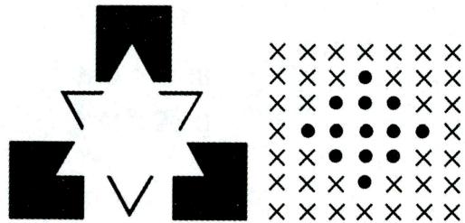  
图2-3 主观轮廓

知觉的整体性往往取决于下面四种因素：

(1)知觉对象的特点，如接近、相似、闭合、连续等。  
(2)对象各组成部分的强度关系。  
(3)知觉对象各部分之间的结构关系也影响知觉的整体性。同样一些部分，处于不同的结构关系中就会成为不同的知觉整体。例如，把相同的音符置于不同的排列顺序、不同的节拍和旋律之中就构成不同的曲调；如果曲调的各成分关系不变，只是个别刺激成分发生变化，或用不同的乐器演奏或不同人来演唱，就不会改变我们对歌曲整体性的知觉。  
(4)知觉的整体性主要依赖于知觉者本身的主观状态，其中最主要的是知识与经验。

# 4.知觉的恒常性

知觉的恒常性是指客观事物本身不变, 但知觉条件在一定范围内发生变化时, 人的知觉映像仍相对不变。知觉恒常性包括颜色恒常性、明度恒常性、形状恒常性、大小恒常性和声音恒常性。

(1) 颜色恒常性。一个有颜色的物体在色光照明下, 它的表面颜色并不受色光照明的严重影响, 而是保持相对不变。例如, 不论在黄光照射下还是在蓝光照射下, 人们总是把红旗知觉为红色。  
(2)明度恒常性(亮度恒常性)。在照明条件改变时, 物体的相对明度保持不变, 叫明度恒常性。例如, 白墙在阳光下和月光下看, 它都是白色的; 而煤块在阳光和月色下, 看上去都是黑的。  
(3) 形状恒常性。当我们从不同角度观察同一物体时, 物体在视网膜上投射的形状是不断变化的。但是, 我们知觉到的物体形状并没有显出很大变化, 这就是形状的恒常性。例如: 平视桌面上的一本书与斜视桌面上同一位置的同一本书, 在视网膜上成像的形状虽有不同, 但人对书的形状知觉却仍然保持不变。  
(4)大小恒常性。当我们从不同距离观看同一物体时，物体在视网膜上成像的大小是有变化的。距离大，它在视网膜上成像较小；距离小，它在视网膜上成像较大。但是，在实际生活中，人们看到的对象大小变化，并不和视网膜映像大小的变化相吻合，而是趋向于原物的实际大小。例如，一个人从我面前走向教室后门，尽管他在我的视网膜上的投射大小有很大变化，可是我看到的大小并没有明显改变。

(5)声音恒常性。尽管物体离我们的距离发生了变化，声音听起来减弱了，但我们仍然把它感知为原来的声音。例如，我们觉得飞机在高空发出的声音要大于蚊子在耳边的叫声。

# 小香课堂·

知觉的规律是常考点，常结合具体事例进行考查，一般来说，对其进行区分的关键在于：选择性，对象与背景；理解性，知识经验；整体性，整体把握；恒常性，不变性。

真题9 [2024江苏南通,单选]学生听课时在重难点内容下面画线，这运用了知觉的（）

A. 理解性

B. 选择性

C. 恒常性

D. 整体性

答案：B

# 三、感知觉规律在教学中的应用

# 考点1 遵循感知规律，开展直观教学

感知规律的内容主要包括强度律、差异律、活动律和组合律。

(1)强度律,指作为知识的物质载体的直观对象(实物、模像或言语)必须达到一定强度,才能被学习者清晰地感知,过强、过弱的刺激强度都会影响学生感知的效果。因此,在直观过程中,教师应突出那些强度低但较重要的要素,使它们充分地展示在学生面前。  
(2)差异律, 指对象和背景的差异越大, 对象从背景中区分开来就越容易。在物质载体层次上, 应通过合理的板书设计、教材编排等方面恰当地加大对象和背景的差异。比如: 题目、标题、重要定律、结论等, 应用粗体字, 使它特别醒目, 容易被学生感知; 教师应该用红笔批改学生的作业, 使学生能够迅速、清楚地感知到自己的作业正确与否; 教师讲到重要的地方, 声音要放大一些, 这也会提高感知的效果。  
(3)活动律,指活动的对象较之静止的对象容易感知。为此,应注意在活动中进行直观、在变化中呈现对象,要善于利用现代科学技术作为知识的物质载体,使知识以活动的形象呈现在学生面前。  
(4) 组合律, 指空间上接近、时间上连续、形状上相同、颜色上一致的事物, 易于构成一个被人们清晰地感知的整体。因此, 教材编排应分段分节, 教师讲课应有间隔和停顿。

# 考点2 学生观察力的发展与培养 ★ 【单选、判断、简答】

# 1. 观察和观察力的概念

观察是人的一种有目的、有计划、持久的知觉活动，是知觉的高级形式。观察力是指人迅速、敏锐地发现事物细节和特征等方面的知觉能力。观察力是智力结构的重要组成部分，是学生学习活动中不可缺少的能力。

# 2. 观察的品质

(1)观察的目的性。观察的目的性表现为个体在观察前能否清楚地意识到观察的目的与任务，在观察过程中能否排除干扰、有始有终地完成观察任务。  
(2)观察的精确性。观察精确性强的人能细致全面地观察客体，能发现事物间的细微差别；观察精

确性弱的人则观察粗疏、笼统，容易遗漏对象的特征，对有细微差别的事物常常做出泛化的反应。

(3) 观察的全面性。观察是否全面取决于观察是否有序以及是否使用了多种感官。观察有序的人观察系统, 能捕捉到事物的全部信息, 表达也有条理; 观察无序的人观察凌乱, 容易遗漏事物的重要细节, 表达也很混乱。  
(4)观察的深刻性。观察肤浅的人往往只注意到事物外在的联系和表面特征。观察深刻的人却能透过现象看本质，发现事物内在的联系。

# 记忆有妙招·

为方便考生记忆，编者将观察的品质总结成以下口诀：

目精面刻。目：目的性。精：精确性。面：全面性。刻：深刻性。

# 3. 学生观察力的发展特点

(1)小学生观察力的发展特点

① 观察的目的性较差。② 观察缺乏精确性。例如，小学生在刚学写字时常常是多一点、少一横，对于“已”“已”和“析”“折”等字形相近的字经常混淆不清。三年级学生观察的精确性有明显提高，五年级学生略高于三年级学生。③ 观察缺乏顺序性。低年级小学生观察事物凌乱、不系统。中、高年级小学生观察的顺序性有较大发展，一般能系统地观察，能从头到尾边看边说，而且在表述前往往能先想一想再表述，即把观察到的材料进行加工，使观察到的内容更加系统化。④ 观察缺乏深刻性。

(2)中学生观察力的发展特点

①具有明确的目的性；②持久性明显发展；③精确性提高；④概括性增强。

# 4. 学生观察力的培养

在学校教育教学中，培养学生的观察力可以从以下几个方面入手：

(1)引导学生明确观察的目的与任务，是良好观察的重要条件；  
(2)充分的准备、周密的计划、提出观察的具体方法，是引导学生完成观察的重要条件；  
(3)在实际观察中应加强对学生的个别指导，有针对性地培养学生良好的观察习惯；  
(4)引导学生学会记录整理观察结果，在分析研究的基础上，写出观察报告、日记或作文；  
(5)引导学生开展讨论、交流并汇报观察成果，不断提高学生的观察能力，培养良好的观察品质。此外，教师还应努力培养学生的观察兴趣与优良的性格特征，如学习的坚韧性、独立性等。

# ·记忆有妙招·

为方便考生记忆，编者将培养学生观察力的措施总结成以下口诀：

明确目的与任务，做好准备与计划，个别指导要跟上，引导记录与汇报。

真题10 [2024河北石家庄，判断]小学生在刚学习写字时常常是多一点或少一横，也容易将一些字形相近的字混淆不清，其原因在于此时小朋友的记忆能力较差。（）

A. 正确

B. 错误

答案：B

# ★本节核心考点回顾 ★

# 1. 感知觉的概念

(1) 感觉: 人脑对直接作用于感觉器官的客观事物的个别属性的反映;  
(2)知觉：人脑对直接作用于感觉器官的客观事物的整体属性的反映。

# 2. 似动知觉的主要形式

(1) 动景运动: 当两个刺激按一定空间间隔和时距相继呈现时, 会看到从一个刺激物向另一个刺激物的连续运动。  
(2) 诱导运动: 由于一个物体的运动使其相邻的静止的物体产生运动。  
(3)自主运动：人在注视暗环境中一个微弱的、静止的光点，片刻后感觉到光点在来回移动。  
(4)运动后效: 在注视向一个方向运动的物体之后, 如果将注视点转向静止的物体, 那么会看到静止的物体似乎向相反的方向运动。

# 3. 常见的社会知觉偏差

(1) 社会刻板效应: 对一群人的特征或动机加以概括, 把概括得出的群体的特征归属于团体中的每一个人, 无视个体差异。  
(2)晕轮效应：认为某人具有某种特征时，会对他的其他特征做相似判断。  
(3)首因效应：在总体印象形成上，最初获得的信息比后来获得的信息影响更大。  
(4)近因效应：在总体印象形成上，新近获得的信息比原来获得的信息影响更大。  
(5)投射效应:个体具有某种特性,推断他人也有与自己相同的特性。

# 4. 感受性与感觉阈限

感受性与感觉阈限在数值上成反比关系，感受性高，则感觉阈限低；感受性低，则感觉阈限高。

(1)绝对感觉阈限：刚刚能引起感觉的最小刺激强度；  
(2)绝对感受性：人的感官觉察最小刺激强度的能力；  
(3)差别感觉阈限：刚刚能引起差别感觉的刺激物间的最小差异量；  
(4)差别感受性:能够感受刺激之间最小差异量的能力。

# 5. 感觉的相互作用规律

(1)感觉适应：刺激对感受器的持续作用而使感受性发生变化。  
(2)感觉对比：同一感受器接受不同的刺激，而使感受性发生变化，可分为同时对比和继时对比。  
(3)感觉后效：刺激作用停止后，感觉暂时保留的现象。  
(4)不同感觉的相互补偿：某种感觉系统的机能丧失后，由其他感觉系统的机能来弥补。  
(5)联觉：一种感觉兼有另一种感觉。

# 6. 知觉的规律

(1)选择性：知觉系统将刺激分为对象和背景，并把知觉对象优先从背景中区分出来。  
(2)理解性：以知识经验为基础对感知的事物加工处理，并用语词加以概括、赋予说明。  
(3)整体性：根据自己的知识经验把直接作用于感官的客观事物的多种属性整合为统一整体。  
(4)恒常性：客观事物本身不变，当知觉条件在一定范围内发生变化时，人的知觉映像仍相对不变。

# 第二节 记忆

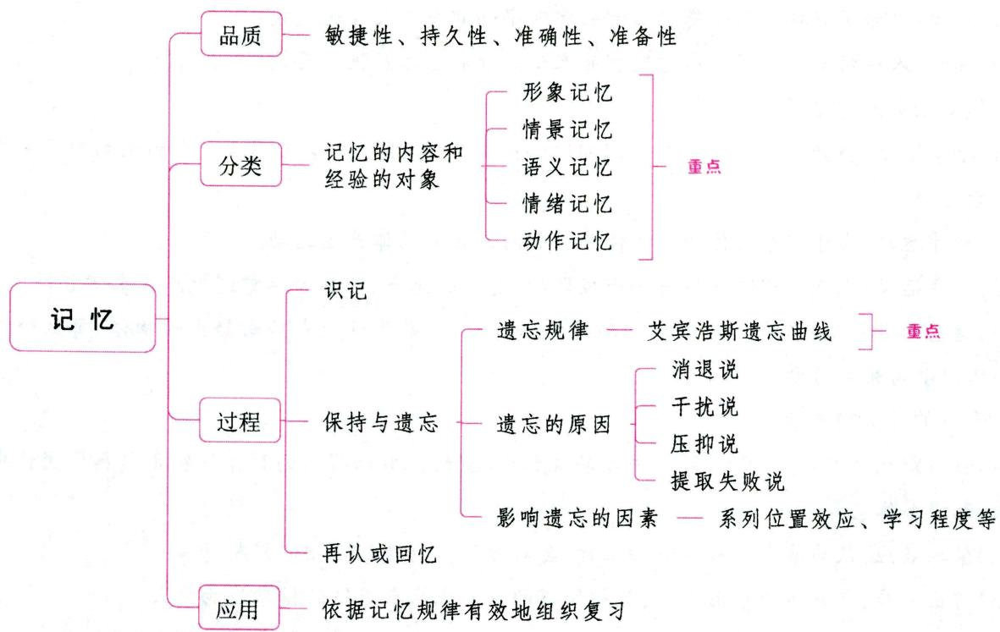

# 一、记忆概述

考点 记忆的概念及品质 【单选、多选、判断】

# 1. 记忆的概念

记忆是人脑对过去经验的保持和再现。它是比感知觉更为复杂的心理现象。人脑感知过的事物、思考过的问题和理论、体验过的情感和情绪、练习过的动作等，都可以成为记忆的内容。

记忆是人的心理过程在时间上的持续。因为记忆的存在, 人们的先后反映才能联系起来, 人的心理活动的过去和现在才得以联结, 人的心理活动才可能成为一个延续的、发展的、统一的整体。记忆是一种积极、能动的活动。

# 2. 记忆的品质

表 2-9 记忆的品质  

<table><tr><td>品质</td><td>含义与良好表现</td><td>培养注意事项</td></tr><tr><td>敏捷性</td><td>记忆的速度和效率特征。能够在较短的时间内记住较多的东西,就是记忆敏捷性良好的表现</td><td>(1)要明确识记的目的; (2)要集中注意力</td></tr><tr><td>持久性</td><td>记忆的保持特征。能够把知识经验长时间地保留在头脑中,甚至终生不忘,就是记忆持久性良好的表现</td><td>(1)要善于把识记的材料纳入已有的知识体系中; (2)进行及时和经常性的复习</td></tr><tr><td>准确性</td><td>记忆的正确和精确特征。对于所识记的材料,在再认和回忆时,没有歪曲、遗漏、增补和臆测,就是记忆精确性良好的表现</td><td>(1)必须进行认真的识记,在大脑皮层上建立精确的暂时神经联系;
(2)在复习时要把相似的材料经常加以比较,防止混淆;
(3)要把正确识记的事物同仿佛记住的东西区别开,把所见所闻的真实材料与主观的增补、臆测区别开来</td></tr><tr><td>准备性</td><td>记忆的提取和应用特征。能及时、迅速、灵活地从记忆信息的储存库中提取所需要的知识经验,以解决当前的实际问题。具体表现为出口成章、对答如流、一挥而就等。</td><td>要使掌握的知识系统化,这样才能做到有条不紊地从记忆仓库中,随时迅速地提取所需要的材料</td></tr></table>

# 记忆有妙招·

为方便考生记忆，编者将记忆的品质总结成以下口诀：

准备劫持。准：准确性。备：准备性。劫：敏捷性。持：持久性。

真题1 [2023湖北武汉，单选]小明记忆速度快，十分钟就能记住一篇新学的文言文，这体现了记忆的（）

A. 准备性

B. 准确性

C. 持久性

D. 敏捷性

真题2 [2023山东枣庄, 多选]人与人之间在记忆方面存在很大差异, 主要是因为其记忆品质的不同, 以下属于记忆准备性品质的有 ( )

A. 有人读书一目十行, 却转瞬即忘  
B. 有人学富五车, 却难于解决生活中的具体问题  
C. 有人读书破万卷, 却下笔难成文  
D. 有人满腹经纶, 关键时候却有话说不出

答案：1.D 2.BCD

# 考点2

# 记忆的分类

# 【单选、多选、填空、判断】

表 2-10 记忆的分类  

<table><tr><td>分类依据</td><td>类别</td><td>定义</td></tr><tr><td rowspan="5">记忆的内容和经验的对象</td><td>形象记忆</td><td>个体以感知过的事物形象为内容的记忆,包括视觉、听觉、嗅觉或味觉等方面的记忆</td></tr><tr><td>情景记忆</td><td>以亲身经历的、发生在一定时间和地点的事件(情景)为内容的记忆</td></tr><tr><td>语义记忆(语词逻辑记忆)</td><td>个体以语词所概括的事物的关系以及事物本身的意义和性质为内容的记忆</td></tr><tr><td>情绪记忆</td><td>个体以曾经体验过的情绪或情感为内容的记忆</td></tr><tr><td>动作记忆(运动记忆)</td><td>以做过的运动或动作为内容的记忆</td></tr><tr><td rowspan="2">信息加工与存储的内容不同</td><td>陈述性记忆</td><td>对有关事实和事件的记忆</td></tr><tr><td>程序性记忆</td><td>对如何做事情的记忆，包括对知觉技能、认知技能和运动技能的记忆。这类记忆往往需要通过多次尝试才能逐渐获得；在利用这类记忆时往往不需要意识的参与</td></tr><tr><td rowspan="2">记忆时意识参与的程度</td><td>外显记忆</td><td>个体有意识地或主动地收集某些经验用以完成当前任务时表现出来的记忆</td></tr><tr><td>内隐记忆</td><td>在不需要意识参与或不需要有意回忆的情况下，个体的已有经验自动对当前任务产生影响而表现出来的记忆</td></tr></table>

注：根据信息从输入到提取所经过的时间、信息编码方式和记忆阶段的不同，可将记忆分为瞬时记忆、短时记忆和长时记忆。

真题3 [2023江苏徐州，单选]“余音绕梁，三日不绝于耳”属于（）

A. 运动记忆

B. 形象记忆

C. 情绪记忆

D. 语义记忆

真题4 [2023安徽蚌埠,单选]对语法规则、公式符号、法律条文等知识的记忆属于( )

A. 情景记忆

B. 语义记忆

C. 形象记忆

D. 运动记忆

答案：3.B 4.B

# 二、记忆过程及其规律

记忆过程包括识记、保持、再现(再认或回忆)三个环节。从信息加工的角度来看,记忆过程是对输入信息的编码、储存和提取的过程,其中编码是最关键的加工。

编码是对外界信息进行形式转换，以便更好储存和提取的过程。储存是把感知过的事物、体验过的情感、做过的动作、思考过的问题等，以一定的形式保持在人们的头脑中。提取是指从记忆中查找已有信息的过程，是记忆过程的最后一个阶段。信息的编码相当于识记过程，信息的储存相当于保持过程，信息的提取相当于再现(再认或回忆)过程。记忆过程中的三个基本环节是相互依存，密切联系的。识记和保持是再认或回忆的前提，再认和回忆是识记和保持的结果，并能进一步巩固和加强识记和保持的内容。

# 考点 识记 【单选】

# 1. 识记的概念与分类

识记是记忆过程的第一个基本环节，是个体获得知识经验的过程。它具有选择性的特点。关于识记的分类具体内容见下表。

表 2-11 识记的分类  

<table><tr><td>分类依据</td><td>类别</td><td>定义</td></tr><tr><td rowspan="2">根据识记有无目的性</td><td>无意识记</td><td>事先没有预定目的，也不需要运用任何有助于识记的方法和意志努力，自然而然地识记</td></tr><tr><td>有意识记</td><td>有明确的识记目的，并运用一定方法的识记，在识记过程中还需要一定的意志努力</td></tr><tr><td rowspan="2">根据识记材料的性质和 识记方法的不同</td><td>机械识记</td><td>根据材料的外在联系,采取多次重复的方式所进行的识记,即平时所说的死记硬背</td></tr><tr><td>意义识记</td><td>在理解的基础上,依据材料的内在联系(也可以人为地赋予某种意义),并运用已有的知识经验而进行的识记。意义识记的先决条件是理解</td></tr></table>

# 2. 意义识记的优越性和机械识记的必要性

# (1)意义识记的优越性

大量实验研究和日常生活实践证明，意义识记的效果不论是在全面性、准确性、巩固性方面还是在速度方面都优于机械识记，其主要原因是意义识记依靠了人在过去经验中已形成的暂时的联系系统。

# (2)机械识记的必要性

可能进行机械识记的情况有两种：一种情况是识记者面对的就是本身没有意义或者没有内在联系的材料。比如对无意义音节、地名、人名、历史年代等的识记。这种识记具有被动性，但对学生而言也是必要的，因为它能够防止对记忆材料的歪曲。另一种情况是面对的材料虽然有可能有意义，而识记者对其缺乏应有的理解，只能先机械识记，随着知识经验的积累再逐步加以理解。如幼儿学习古诗，一、二年级的学生背诵乘法口诀等。

# 3. 识记的规律（影响识记效果的因素）

(1) 识记的目的与任务；(2) 识记的态度和情绪状态；(3) 活动任务的性质；(4) 材料的数量和性质；(5) 识记的方法。

真题5 [2023湖北武汉,单选]意义识记是利用学习材料的意义进行的识记，其先决条件是（）

A. 重复

B. 状态

C. 态度

D. 理解

答案：D

考点2 保持与遗忘 ★★★ 【单选、多选、判断、简答、论述】

# 1. 保持及其规律

# (1)保持的概念

保持是指已获得的知识经验在人脑中的巩固过程，是对识记内容的一种强化的过程，使它更好地成为人们的经验，是记忆过程的第二个环节。

# (2)保持的规律

保持并非原封不动地保存头脑中识记过的材料的静态过程，而是一个富于变化的动态过程。这种变化表现在量和质两个方面。

①保持在数量上的变化，一般表现为识记的内容随着时间的进程呈减少的趋势，甚至遗忘。保持在数量上的变化还表现为记忆恢复。记忆恢复(记忆回涨)是指识记某种材料，经过一段时间后测得的保持量大于识记后即时测得的保持量。记忆恢复现象常常在下列情况中出现：儿童比成人更普遍；学习难度大的材料比学习容易的材料更容易出现；学习得不够熟练的材料比熟练的材料更易发生。

②保持在质量上的变化表现在两个方面：一方面，记忆内容中不重要的细节部分趋于消失，而主要内容及显著特征能较好地保持，从而使记忆内容简略、概括和合理。另一方面，记忆内容中的某些特点和线索有选择地被保留下来，同时增添某些特征，使记忆内容成为较易理解的“事物”。

# 2. 遗忘及其规律

# (1) 遗忘的概念

遗忘是与保持相反的心理过程, 是指对识记过的材料不能回忆或再认, 或者表现为错误的回忆或再认。遗忘并不是所记忆的信息完全丧失, 而是所保持的信息不能在使用时顺利地提取出来。遗忘是一种自然的正常合理的心理现象。按照信息加工的观点, 遗忘是信息提取不出或提取错误。

# (2) 遗忘的种类

表 2-12 遗忘的种类  

<table><tr><td>依据</td><td>分类</td><td>含义</td><td>原因</td></tr><tr><td rowspan="2">遗忘的时间</td><td>暂时性遗忘(假性遗忘)</td><td>已经转入长时记忆的内容暂时不能被提取,但在适宜的条件下还可能恢复。这是一种与线索有关的遗忘</td><td>干扰造成的提取信息障碍</td></tr><tr><td>永久性遗忘(真性遗忘)</td><td>发生在瞬时记忆与短时记忆阶段的记忆材料未经复习而消失产生的遗忘</td><td>衰退造成的“存储性障碍”</td></tr><tr><td rowspan="2">是否主动</td><td>主动性遗忘(有意遗忘)</td><td>人们为了减轻心理不安,有意识地逼迫自己不去回忆那些引起特别痛苦的体验与感受的事件,或者以某种方式有意歪曲它们,使其不再出现,如弗洛伊德提出的“压抑性遗忘”及巴特莱特提出的“创见性遗忘”</td><td>为减轻心理不安</td></tr><tr><td>被动性遗忘</td><td>人们因为消退、干扰、腐蚀、衰减等原因引起的遗忘</td><td>消退、干扰、腐蚀、衰减</td></tr></table>

# (3)艾宾浩斯遗忘规律

最早对遗忘进行实验研究的是德国心理学家艾宾浩斯, 他以自己作为实验的测试对象, 采用节省法, 选用无意义音节作为记忆材料, 并在一段时间后进行回忆, 记录回忆量,并据此绘制了艾宾浩斯遗忘曲线。

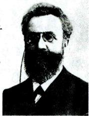  
艾宾浩斯

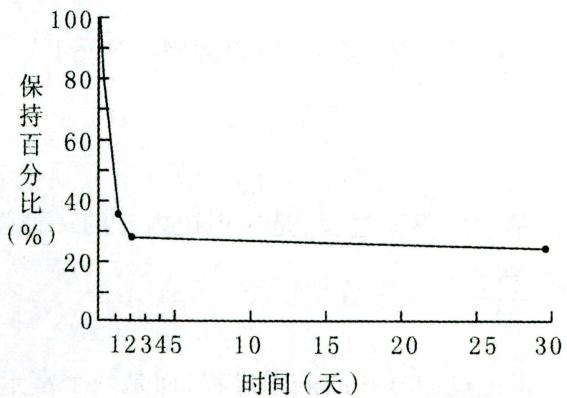  
图2-4 艾宾浩斯遗忘曲线

这条曲线表明, 遗忘在学习之后立即开始, 而且在最初的时间里遗忘速度很快, 随着时间的推移, 遗忘的速度逐渐缓慢下来, 过了相当长的时间后, 几乎不再发生遗忘。由此可以看出, 遗忘是有规律的, 即遗忘的进程是不均衡的, 其趋势是先快后慢、先多后少, 呈负加速, 且到一定的程度就几乎不再遗忘了。

继艾宾浩斯之后的许多研究进一步揭示了有关遗忘过程的规律，例如：①有意义材料比无意义材

料遗忘得慢；②数量多的材料遗忘较快；③两种相似的材料，前后间隔时间短，则容易相互干扰而造成遗忘；④学习程度不够的材料容易遗忘等。

# (4) 遗忘的原因

关于遗忘的原因，主要有以下几种理论学说：

# ①消退说

消退说认为，遗忘是记忆痕迹得不到强化而逐渐衰弱，以致最后消退的结果。它适用于解释感觉记忆和短时记忆，但很难用实验证实，因为识记后一段时间内保持量的下降，既可能是记忆痕迹消退的结果，也可能是受到其他材料的干扰。消退说是一种对遗忘原因的最古老的解释，起源于亚里士多德，由桑代克进一步发展。

# ② 干扰说

干扰说认为, 遗忘是因为在学习和回忆之间受到其他刺激的干扰。一旦干扰被排除, 记忆就能恢复, 而记忆痕迹并未消退。干扰说的代表人物是詹金斯和达伦巴希。干扰说可用前摄抑制和倒摄抑制来说明。前摄抑制是先学习的材料对识记和回忆后学习的材料的干扰作用。倒摄抑制是后学习的材料对

保持和回忆先学习的材料的干扰作用。

# ③ 压抑说（动机说）

压抑说认为，遗忘是由情绪或动机的压抑作用引起的，如果压抑被解除，记忆就能恢复。该理论是弗洛伊德在给病人催眠时发现的。他认为个体之所以无法回忆，是因为该记忆使病人感到痛苦而被人为地压抑到潜意识中。由于情绪紧张而引起的遗忘（考试时常常于这种类型。

  
压抑（动机）说和提取失败说

# ④ 提取失败说

我们都有这样的经验：不能回忆起某件事，但又知道这件事是知道的。这种明明知道某件事，但就是不能回忆出来的现象称为“舌尖现象”或“话到嘴边现象”。从信息加工的观点看，遗忘是一时难以提取出需要的信息，遗忘之所以发生是因为编码不准确，失去了检索线索或线索错误。一旦有了正确的线索，经过搜寻，所需要的信息就能提取出来，这就是遗忘的提取失败理论。这种理论的代表人物是图尔文。

# ⑤同化说（认知结构说）

奥苏贝尔认为，遗忘是知识的组织和认知结构简化的过程。当人们学到了更高级的概念与规律之后，就可以以此来代替低级的观念，使低级观念简化，从而减轻记忆负担。这是一种积极的遗忘。当然，在有意义学习中，或者由于原有知识结构不巩固，或者由于新旧知识辨析不清楚，也有可能以原有的观念来代替表面相同而实质不同的新观念，从而出现记忆错误。这是一种消极的遗忘，教学中必须努力避免。

# (5)影响遗忘进程的因素

①学习材料的性质。学习材料的性质指材料的种类、长度、难度以及意义性。有意义的材料比无意义的材料遗忘得慢；形象、直观的材料比抽象的材料遗忘得慢；比较长的、难度较大的材料的遗忘进程更符合艾宾浩斯遗忘曲线，长度、难度适中的材料保持效果最好；能引起主体兴趣，符合主体需要、动机，激起主体强烈情绪体验，在主体的工作、学习、生活上具有重要意义的材料，一般不容易遗忘。

②系列位置效应。所谓系列位置,是指在系列学习中,学习材料处于系列记忆的不同位置。位置不同,回忆效果也不同。系列位置效应就是指接近开头和末尾的记忆材料的记忆效果好于中间部分的记忆效果的趋势。开头部分和结尾部分的记忆效果较好,分别称为首因效应和近因效应,而效果较差的中间部分被称为渐近部分。例如,学习一篇课文,一般总是开头和结尾部分容易记住,而中间部分则容易忘记。其原因是:课文的开始部分只受倒摄抑制的影响,不受前摄抑制的影响;结尾部分只受前摄抑制的影响,不受倒摄抑制的影响;中间部分则受两种抑制的影响,因而最容易遗忘。

③识记材料的数量和学习程度。一般来说，材料过多、学习程度太小或太大，都不利于对知识的记忆。过度学习是指学习达到恰能背诵之后再继续学习。实验证明：过度学习达到 $50\%$ ，即学习的熟练程度达到 $150\%$ 时，学习的效果最好；超过 $150\%$ 时，效果并不递增，很可能引起厌倦、疲劳而成为无效劳动。例如，读一篇外语课文，学习30分钟就刚好能背诵并正确回忆，为了巩固记忆，又增加了15分钟的学习时间，这就是过度学习，其过度量为 $50\%$ 。过度学习对那些必须能长期地准确回忆而且又没什么意义的操练信息最为有用，如乘法口诀表。

④ 记忆任务的长久性与重要性。一般来说，长久的识记任务有利于材料在头脑中保持时间的延长，不重要和未经复习的内容则容易遗忘。

⑤ 识记的方法。研究表明，以理解为基础的意义识记比机械识记的效果好得多。

⑥时间因素。根据遗忘规律，记忆的最初阶段遗忘的速度快，随后逐渐变慢。学习内容的保存量随着时间的变化而减少。

⑦情绪和动机。学习者的情绪和动机等也影响遗忘进程。

真题6 [2024山西太原, 单选] 有些学生认为背诵意义不大, 因为很快就会忘记。事实上许多时候遗忘与学习程度有关。研究表明, 为防止遗忘应适当过度学习, 即学习达到恰能背诵之后再继续学习。当学习的熟练程度达到( )时, 学习效果最好。

A. $50\%$

B. $100\%$

C. $150\%$

D. $200\%$

真题7 [2023黑龙江哈尔滨，单选]回忆高尔基的《海燕》时，头脑中浮现课文的第一段和结尾，中间部分模糊不清，这种现象可以用遗忘的（）来解释。

A.干扰说

B. 衰退说

C. 压抑说

D. 提取失败说

真题8 [2023广东韶关, 判断]根据艾宾浩斯遗忘规律, 遗忘过程是不均衡的, 是先快后慢的。( )

真题9 [2023广西贵港，判断]在早上起床后或学习开始时学习重要内容可以克服倒摄抑制的影响。（）

真题10 [2023安徽统考，简答]简述影响遗忘进程的主要因素。

答案：6.C 7.A 8.√ 9.× 10.详见内文

# 考点3 再认或回忆 ★【单选、不定项、判断】

# 1. 再认

再认是指人们对感知过、思考过或体验过的事物，当它再度呈现时，仍能认识的心理过程。例如：

好友重逢，一眼就认出了对方；旧地重游，处处有熟悉之感。再认是记忆的初级表现形式，是比回忆更为容易和简单的一种恢复经验的形式。

真题11 [2024河南事业单位，不定项]在实验中，电脑屏幕上先相继呈现10个单词，要求被试进行学习。短暂休息后，电脑屏幕上随机呈现一个单词（从10个学习过的单词和10个未学习的单词组成的材料库中进行选择），要求被试判断该单词是否学习过。该实验中被试采用的信息提取方式是（）

A. 回忆

B. 再认

C. 随机

D. 想象

答案：B

# 2. 回忆（重现）

# (1) 回忆的概念

回忆又被称为“重现”，是过去经历过的事物不在面前，人们在头脑中把它重新呈现出来的过程。回忆是记忆的最高表现，是比再认更为复杂的一种恢复经验的形式。再认与回忆二者之间没有本质的区别，只有保持程度上的不同。

# 小香课堂·

再认和回忆（即再现）是记忆过程的最后一个环节。二者没有本质上的区别，只有保持程度上的不同。一般来说，再认比回忆要容易、简单。

再认：经历过的事物再度出现时能够识别出来，如考试时回答选择题、判断题等。

回忆：经历过的事物不在面前，能在头脑中自行重现，如考试时回答填空题、简答题、论述题等。

# (2) 回忆的种类

表 2-13 回忆的种类  

<table><tr><td>分类依据</td><td>类别</td><td>概念</td><td>典例</td></tr><tr><td rowspan="2">是否有预定的目的、任务和意志努力的程度</td><td>无意回忆</td><td>没有预定目的,也不需要任何意志努力的回忆</td><td>触景生情或偶然想起了一件往事;自由联想</td></tr><tr><td>有意回忆</td><td>有回忆任务、并做一定的意志努力、自觉追忆以往经验的回忆</td><td>课堂上学生回答老师的提问等</td></tr><tr><td rowspan="2">回忆时的条件和方式的不同</td><td>直接回忆</td><td>由当前事物直接唤起旧经验的重现</td><td>对熟记的外语单词的回忆</td></tr><tr><td>间接回忆</td><td>通过一系列中间环节或中介性的联想才能达到要回忆的旧经验</td><td>根据一些提示和推断回想起钥匙所遗落的地方</td></tr></table>

# (3)追忆

在有意回忆特别是间接回忆遇到困难时，就必须做出一定的努力，克服一定的困难，才有可能回忆起旧经验。这种需要一定努力，克服一定困难的有意回忆称为追忆。

# 三、记忆规律在教学中的应用 ★★ 【单选、多选、判断、简答、论述】

# 考点1 依据记忆规律合理安排和组织教学

(1)合理安排教学。①学校在排课时应尽可能地避免把性质相近的课程排在一起，这样能减少材料相似性引起的前摄抑制、倒摄抑制对记忆的干扰；②教师要保证学生的课间休息；③教师应控制每堂课的信息投入量。  
(2)向学生提出具体的识记任务。  
(3)使学生处于良好的情绪和注意状态。  
(4)充分利用无意识记的规律组织教学。  
(5)使学生理解所学内容并把它系统化。  
(6)培养学生良好的记忆品质，提高其记忆能力。

# 考点2 依据记忆规律有效地组织复习

学过的知识，如果不经过复习，是不可能长久、完全地保持在记忆中的。克服遗忘最好的方法是加强复习。有效组织复习的方法有：

# 1. 复习时机要得当

(1)及时复习。遗忘发展的规律表明, 识记后遗忘很快就会发生。因此, 对于新学习的材料, 为了防止遗忘, 必须“趁热打铁”, 及时进行复习。所谓及时复习就是在初期大量遗忘开始之前就进行复习。  
(2)合理安排复习时间。要制订复习计划，合理安排复习内容和时间，提高复习效率。每天复习的内容要适当，不要过于紧张和疲劳，以免产生干扰。有效的复习时间最好做如下安排：第一次复习，学习结束后的5~10分钟；第二次复习，学习当天的晚些时候或学习结束后的第二天；第三次复习，一星期后；第四次复习，一个月后；第五次复习，半年后。  
(3)间隔复习。由于遗忘存在着“先快后慢”的趋势，因此，在教学上还必须遵守“间隔复习”的原则。一般来说，刚学过的新知识应该多复习，每次复习所用的时间应长些，而间隔的时间要短些；随着记忆巩固程度的提高，每次复习的时间可以短些，而间隔的时间可以长些。  
(4) 循环复习。教学上应该遵守“循环复习”的原则，对于所学的重要的、基本的材料应经常进行复习，做到“温故而知新”。

# 2. 复习方法要合理

(1)分散复习与集中复习相结合。根据复习在时间分配上的不同，复习方式有两种：①集中复习，把要复习的材料集中在一段时间内进行复习；②分散复习，即把要复习的材料分配到几段相隔的时间内进行复习。复习难度小的材料可适当集中复习，难度大的材料可采取分散复习的方式，做到分散复习与集中复习相结合。对于大多数学习而言，分散复习的效果优于集中复习，因为分散复习可以降低疲劳感，可以减少前摄抑制和倒摄抑制的影响。  
(2)复习方法多样化。单调的复习方法容易使人产生疲劳和厌倦情绪，会降低复习效果。因此，教师在组织学生复习时，方法要灵活多样。  
(3)运用多种感官参与复习。多种感官参与复习可以更好地提高记忆效果。因此，在复习时应尽

量运用多种感官，要眼看、耳听、口读、手写相互配合，在头脑中构成它们之间的神经联系，形成记忆痕迹，以后遇到其中的一种刺激信息，就可以激活多种相关的记忆痕迹，提高记忆效果。有心理学家证明，人的学习 $83\%$ 通过视觉， $11\%$ 通过听觉， $3.5\%$ 通过嗅觉， $1.5\%$ 通过触觉， $1\%$ 通过味觉。

(4)尝试回忆与反复阅读相结合。尝试回忆与反复阅读相结合的方法，能使学习者及时了解到识记的成绩，从而提高学习的兴趣，激起进一步学习的动机。同时，在每次回忆后，学习者可以及时检查记忆效果，在重新阅读时就会有针对性地集中精力攻克难点，纠正错误，不至于平均用力。

# 3. 复习次数要适宜

要掌握复习的量。(1)复习内容的数量要适当，就是说一次复习内容的数量不宜过多，因为，学习内容的数量与复习的次数及所用的时间是成正比增长的；(2)提倡适当的过度学习，即熟练程度达到 $150\%$ 的学习（适当过度学习的材料能避免遗忘），从而提高记忆效果。

# 4. 重视对记忆品质的培养

具体内容参见本节中“记忆的品质”。

# 5. 注意用脑卫生

脑的健康状况是影响记忆好坏的重要生理条件，它与学习和记忆有密切的关系。因此，在学习过程中，要特别重视脑的营养与适当的休息。严重营养不良，缺乏蛋白质，以及吸毒、酒精中毒、脑外伤等都会给记忆带来不良影响，使记忆力下降。

# 记忆有妙招·

为方便考生记忆，编者将有效组织复习的方法总结成以下口诀：

十次方知味。十：时机。次：次数。方：方法。知：记忆品质。味：用脑卫生。

真题12 [2022河南郑州,多选]组织识记后的复习是与遗忘斗争的首要条件。复习时应注意( )

A. 阅读与重现交替进行

B. 加强对系列位置效应中间部分的复习

C. 及时复习

D. 正确分配复习时间, 集中复习优于分散复习

真题13 [2024江苏南通，简答]依据记忆规律，如何有效组织复习？

答案：12.ABC 13.详见内文

# 四、中小学生记忆的发展

# 考点1 小学生记忆的发展 ★【单选】

(1)小学生的有意记忆明显增强

从无意记忆为主转变为有意记忆为主。从小学三年级开始,小学生的有意识记逐渐取代无意识记并占主导地位。

(2)小学生的意义记忆迅速发展

从机械记忆为主向意义记忆为主过渡。小学低年级学生以机械识记为主，到了三、四年级，从机械识记占主导地位向意义识记占主导地位发展。在小学阶段，机械识记和意义识记的效果均随着年龄的增长而提高。在小学生学习过程中，由于学习材料的性质不同，机械识记和意义识记都是必需的。

(3)小学生的抽象逻辑记忆水平逐步提高

从具体形象记忆向抽象逻辑记忆的方向发展。学前儿童的具体形象记忆优于词的抽象记忆。小学生记忆的主要方式是形象记忆。对低年级儿童而言，直观形象记忆仍占主导地位。随着年龄的增长，小学生从以具体形象记忆为主过渡到以抽象逻辑记忆为主。但小学生在记忆抽象的材料时，主要还是以事物的具体形象为基础，即形象记忆仍起着重要作用。

# 考点2 中学生记忆的发展

(1)中学生记忆发展的总体趋势是随着年龄的增长记忆力不断提高，到16岁趋于成熟，高中生处于记忆发展的“黄金”时代。  
(2)同一年龄的中学生，受所记材料性质的影响，记忆效果不一样。  
(3)中学生短时记忆广度随着年级的增长而不断增大。  
(4)随着年龄的增长，中学生的有意记忆和无意记忆效果都不断提高，但有意记忆逐渐占主导地位。  
(5)中学生以理解记忆为主要记忆手段。  
(6)抽象记忆在中学阶段占据主导地位。

# ★本节核心考点回顾 ★

# 1. 记忆的品质

(1) 敏捷性: 在较短的时间内记住较多的东西。  
(2)持久性：把知识经验长时间地保留在头脑中，甚至终身不忘。  
(3)准确性：对于所识记的材料，在再认和回忆时，没有歪曲、遗漏、增补和臆测。  
(4)准备性:使人能及时、迅速、灵活地从记忆信息的储存库中提取所需要的知识经验以解决实际问题。

# 2. 记忆的分类（根据记忆的内容和经验的对象进行划分）

(1)形象记忆：以感知过的事物形象为内容的记忆；  
(2)情景记忆：以亲身经历的、发生在一定时间和地点的事件（情景）为内容的记忆；  
(3)语义记忆：以语词所概括的事物的关系以及事物本身的意义和性质为内容的记忆；  
(4)情绪记忆：个体以曾经体验过的情绪或情感为内容的记忆；  
(5)动作记忆：以做过的运动或动作为内容的记忆。

# 3. 记忆过程

(1)识记：是个体获得知识经验的过程。  
(2)保持：指已获得的知识经验在人脑中的巩固过程。  
(3)再现(再认或回忆): 再认指感知过、思考过或体验过的事物再度呈现, 仍能认识的过程; 回忆指过去经历过的事物不在面前, 在头脑中把它重新呈现出来的过程。

# 4. 艾宾浩斯遗忘规律

遗忘在学习之后立即开始。遗忘的进程是不均衡的，其趋势是先快后慢、先多后少，呈负加速，且到一定的程度几乎就不再遗忘。

# 5. 遗忘的原因

(1)消退说：遗忘是记忆痕迹得不到强化而逐渐衰弱，以致最后消退的结果。  
(2)干扰说：遗忘是因为在学习和回忆之间受到其他刺激的干扰。  
(3)压抑说：遗忘是由情绪或动机的压抑作用引起的，如果压抑被解除，记忆就能恢复。  
(4) 提取失败说: 遗忘是一时难以提取出需要的信息, 遗忘之所以发生是因为编码不准确, 失去了检索线索或线索错误。

# 6. 影响遗忘进程的因素

(1)学习材料的性质；(2)系列位置效应；(3)识记材料的数量和学习程度；(4)记忆任务的长久性与重要性；(5)识记的方法；(6)时间因素；(7)情绪和动机。

# 7. 依据记忆规律有效地组织复习

(1)复习时机要得当：及时复习、合理安排复习时间、间隔复习、循环复习等；  
(2)复习方法要合理：分散复习与集中复习结合、尝试回忆与反复阅读相结合等；  
(3)复习次数要适宜：复习内容数量适当、适当过度学习等；  
(4)重视对记忆品质的培养；  
(5)注意用脑卫生：重视脑的营养与适当的休息等。

# 第三节 表象与想象

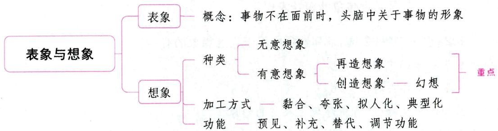

# 一、表象 ★【单选】

# 1. 表象的概念与特征

表象是事物不在面前时，人们在头脑中出现的关于事物的形象。

表象具有三个主要特征：(1)直观性。(2)概括性。(3)可操作性。心理学家谢帕德等人通过“心理旋转实验”证明了表象的可操作性。

# 2. 表象的分类

# (1) 视觉表象、听觉表象和运动表象

从表象产生的主要感觉通道来划分，表象可以分为视觉表象（如想起母亲的笑脸）、听觉表象（如想起吉他的声音）和运动表象（如想起舞蹈动作）等。

# (2)记忆表象和想象表象

根据表象创造程度的不同，表象可分为记忆表象和想象表象。记忆表象是在记忆中保持的客观事物的形象，如想起朋友的容貌。记忆表象是在感知的基础上形成的，是保持在人脑中的过去感知的形

象, 具有直观形象性特点, 但和知觉相比, 形象的鲜明性、完整性和稳定性都有差异。表象的形象具有较模糊、暗淡、片断、不稳定等特点。想象表象是在头脑中对记忆形象进行加工改组后形成的新形象,也即想象。这些形象可能从未经历过, 或者世界上还不存在。

# (3)个别表象和一般表象

根据表象的感知范围，可以把表象划分为个别表象和一般表象。个别表象是指对某一特定对象多次感知后产生的表象。它反映了个别事物的特征。例如，对某一件物品感知后在头脑中留下的具体形象。一般表象是指对某一类事物多次感知后产生的表象，它去掉了感知对象的个别特点，集中了一类事物共有的特征。

# 二、想象

想象是人脑对已储存的表象进行加工改造，形成新形象的心理过程。想象的内容来源于客观现实。想象具有主动性、丰富性、生动性、现实性、新颖性、深刻性等品质。

# 考点1 想象的种类 ★★ 【单选、多选、判断】

根据想象的目的和计划性，可将想象分为无意想象和有意想象。

# 1. 无意想象

无意想象又称不随意想象,是没有预定目的,不由自主产生的想象。例如,学生常常出现的“白日梦”现象,我们看见天上的白云想象它像某种动物或人,人睡眠时做的梦,精神病患者在头脑中产生的幻觉等都是无意想象。梦是无意想象的极端表现。

真题1 [2024广东广州，多选]下列选项中属于无意想象的有（）

A. 精神病患者在头脑中产生幻觉  
B. 明明梦到跟小伙伴去游乐场玩   
C. 星星听老师讲故事时, 脑海中浮现主人翁的形象  
D. 兰兰看到天上的白云, 就会想到棉花糖

答案：ABD

# 2. 有意想象

有意想象又称随意想象,是指有预定目的、自觉进行的想象,是意识活动的一种形式。这种想象活动具有一定的预见性、方向性,人们在想象过程中一直控制着想象的方向和内容。

根据创造程度的不同,有意想象又可以分为再造想象和创造想象。幻想是创造想象的一种特殊形式。

# (1)再造想象

再造想象是依据词语或符号的描述、示意在头脑中形成与之相应的新形象的过程。人在阅读文艺作品、历史文献时，工人看建筑或机械图纸时，学生听教师对课文生动形象的描述时，头脑中出现的有关事物的形象，都属于再造想象。

再造想象产生的条件：①必须具有丰富的表象储备；②为再造想象提供的词语及实物标志要准确、鲜明、生动；③正确理解词语与实物标志的意义。

# (2) 创造想象

创造想象是按照一定目的、任务,使用自己以往积累的表象,在头脑中独立地创造出新形象的过程。例如,科学家对于科学研究的设计和研究成果的预见,革新家对生产工具和产品的改革与发明等。 它是一切创造性活动的重要组成部分。

创造想象产生的条件：①强烈的创造愿望。②丰富的表象储备。③积累必要的知识经验。④原型启发。⑤积极的思维活动。⑥灵感的作用。在创造想象的过程中，新形象的产生往往带有突然性，这种突然出现新形象的状态，称为灵感。灵感是想象者在长期生活实践中勤于积累经验的结果。

此外，创造性思维能力、高水平的表象改造能力、丰富的情绪生活、正确的理想和世界观也是创造想象产生的条件。

# (3)幻想

幻想是一种与生活愿望相结合并指向于未来的想象。幻想与一般的创造想象相比具有下述两个特征: ① 幻想体现了个人的愿望, 是向往的形象; ② 幻想常是创造性活动的准备阶段。

幻想可分为科学幻想、理想、空想三种形式，具体内容见下表。

表 2-14 幻想的形式  

<table><tr><td>分类</td><td>概念</td><td>典例</td></tr><tr><td>科学幻想</td><td>是科学预见的一种形式,是创造想象的准备阶段和发展的推动力,是具有进步意义和有实现可能的积极幻想</td><td>太空移民</td></tr><tr><td>理想</td><td>符合事物发展规律、有实现可能的积极幻想</td><td>想成为科学家</td></tr><tr><td>空想</td><td>是与客观现实相违背的消极幻想,根本不可能实现。空想往往使人脱离现实,长期陷入空想的人往往碌碌无为,一事无成</td><td>黄梁一梦</td></tr></table>

真题2 [2024江苏苏州，单选]看到诗句“天苍苍，野茫茫，风吹草低见牛羊”，学生脑海中出现的画面属于（）

A.幻想

B. 创造想象

C. 再造想象

D. 空想

真题3 [2024福建统考，多选]关于想象，下列说法正确的有（）

A.梦是一种不随意想象

B. 再造想象也有一定的创造性

C. 想象的内容来源于客观的现实

D. 鲁迅创作孔乙己形象是一种创造想象

真题4 [2023河南郑州，多选]再造想象产生的条件有（）

A. 必须具有丰富的表象储备  
B. 为再造想象提供的词语及实物标志要准确、鲜明、生动  
C. 正确理解词语与实物标志的意义  
D. 原型启发和灵感

答案：2.C 3.ABCD 4.ABC

表 2-15 想象的加工方式  

<table><tr><td>种类</td><td>概念</td><td>典例</td></tr><tr><td>黏合</td><td>把两种或两种以上客观事物的属性、元素、特征或部分结合在一起而形成新形象的过程</td><td>“孙悟空”的形象</td></tr><tr><td>夸张(强调)</td><td>改变客观事物的正常特点,对某些特点加以夸大和强调,使其增大、缩小、数量加多、色彩加浓等</td><td>“千手观音”“九头鸟”的形象</td></tr><tr><td>拟人化</td><td>把人类的特性、特点加在外界事物上,使之人格化的过程</td><td>“雷公”“电母”等形象</td></tr><tr><td>典型化</td><td>根据一类事物共同的、典型的特征创造新形象的过程</td><td>鲁迅小说中的人物模特儿,往往嘴在浙江,脸在北京,衣服在山西,是一个拼凑起来的角色</td></tr></table>

真题5 [2022辽宁营口, 单选]九头鸟是中国神话传说中的怪鸟, 其形象运用的想象加工方式是( )

A. 黏合

B. 拟人化

C. 夸张

D. 典型化

真题6 [2022天津北辰，单选]在《西游记》这部著作中，塑造了类似于“雷公”“电母”“风神”等人物形象，这属于想象中的（ ）加工方式。

A. 黏合

B. 夸张

C. 拟人化

D. 典型化

答案：5.C 6.C

# 考点3 想象的功能 ★【单选】

(1)预见功能。想象的预见功能是指它能预见活动的结果，指导活动进行的方向。  
(2)补充功能。借助想象可以弥补人们认识活动的时空局限，超越个体狭隘的经验范围，获得更多的知识。  
(3)替代功能。在现实生活中, 当人们的某种需要不能得到满足时, 可以借助想象从心理上得到一定的补偿和满足。  
(4)调节功能。想象对机体的生理活动过程有调节作用，它能改变人体外周部分的机能活动过程。

真题7 [2024浙江宁波, 单选] 小红拿到不及格的数学试卷后, 担心爸爸发现后会严厉批评自己, 就把试卷藏起来了。这体现了想象的 ( ) 功能。

A. 预见

B. 补充

C. 替代

D. 调节

答案：A

# 考点4 中小学生想象的发展

# 1.小学生想象的发展

儿童入学后，想象的有意性、现实性、创造性和概括性都在不断发展着。

(1)小学生想象有意性的发展。小学生想象的有意性，随年级升高不断提高。  
(2)小学生想象现实性的发展。儿童入学以后，想象的现实性逐渐提高，主要表现在：①想象所反

映的形象,越发接近现实事物。想象形象的特征数由少到多,结构配置由不合理到合理。②从热衷于完全脱离现实的神话虚构,逐渐转向对现实生活的幻想。正因为小学儿童想象发展的这一特点,在小学语文教材的安排上,低年级多选用如《乌鸦喝水》《小马过河》等以童话故事的形式表达一定思想内容的教材对孩子进行智力教育;高年级则多选用对社会、自然的现实的记叙和说明的文章,对孩子进行智力教育。

(3)小学生想象创造性的发展。从再造想象中有创造性的成分，扩展到独立地进行创造想象。小学低年级儿童想象的形象往往具有复制性和模仿性，创造加工的成分不多。到了中、高年级，他们不仅在再造想象中创造性成分越来越多，而且能对已有表象做出真正的创造性加工，能独立地进行创造想象。  
(4)小学生想象概括性的发展。小学生的想象从有很大的具体性、直观性，向有一定的概括性、逻辑性发展，表现为想象所凭借的依托物由实物向词语演变。

# 2. 中学生想象的发展

(1)初中生想象的发展。①初中生想象的有意性迅速增长。初中二年级和初中三年级是学生空间想象力发展的加速期或关键期。②初中生想象的创造性成分在不断增加。他们不仅能将看到的或听到的具体事物说出来、写出来，还能运用这些材料“编出”尚未看到或听到的事情来。他们的想象不像小学生那样多是模仿和再现，而能够显示出一种创造性。不过这种创造性成分还是有限的，不能估计得过高。③初中学生想象的现实性在不断发展。初中生想象的内容比较符合现实，富有逻辑性。初中生的幻想具有现实性、兴趣性，有时也带有虚构的特点，而要达到理性的想象一般要到高中阶段。  
(2)高中生想象的发展。高中学生想象的特点主要表现在他们的创造性成分的增加和理想的形成、发展方面。高中生更重视现实，他们的理想不仅考虑自己的兴趣，而且还要考虑到有无实现的可能和条件，一旦有可能如愿，他们就会为之而奋斗，争取实现自己的理想。

# 考点5 学生想象力的培养（想象规律在教学中的应用）

# 1. 在教学中发展学生的再造想象

(1)要扩大学生头脑中的表象储备；(2)教师要帮助学生真正弄懂描述中的关键性词句和实物标志的含义；(3)教师要唤起学生对教材的想象，以加深对知识的理解和巩固。

# 2. 在教学中培养学生的创造想象

(1)要引导学生学会观察，丰富学生的表象储备；(2)引导学生积极思考，有利于打开想象力的大门；(3)引导学生努力学习科学文化知识，扩大学生的知识经验以发展学生的空间想象能力；(4)注意发展学生的语言能力；(5)结合学科教学，有目的地训练学生的想象力；(6)引导学生进行积极的幻想。

# ★本节核心考点回顾 ★

# 1. 想象的种类

根据想象的目的和计划性，可将想象分为无意想象和有意想象。

(1)无意想象：又称不随意想象，是没有预定目的，不由自主产生的想象。

(2)有意想象：有预定目的、自觉进行的想象。根据创造程度的不同，有意想象可分为再造想象和创造想象。

(1)再造想象:依据词语或符号的描述、示意在头脑中形成与之相应的新形象。

②创造想象：按照一定目的、任务，使用自己积累的表象，在头脑中独立地创造出新形象。

# 2. 想象的加工方式

(1) 夸张：改变客观事物的正常特点，对某些特点加以夸大和强调，使其增大、缩小、数量加多、色彩加浓等。  
(2)拟人化：把人类的特性、特点加在外界事物上，使之人格化的过程。

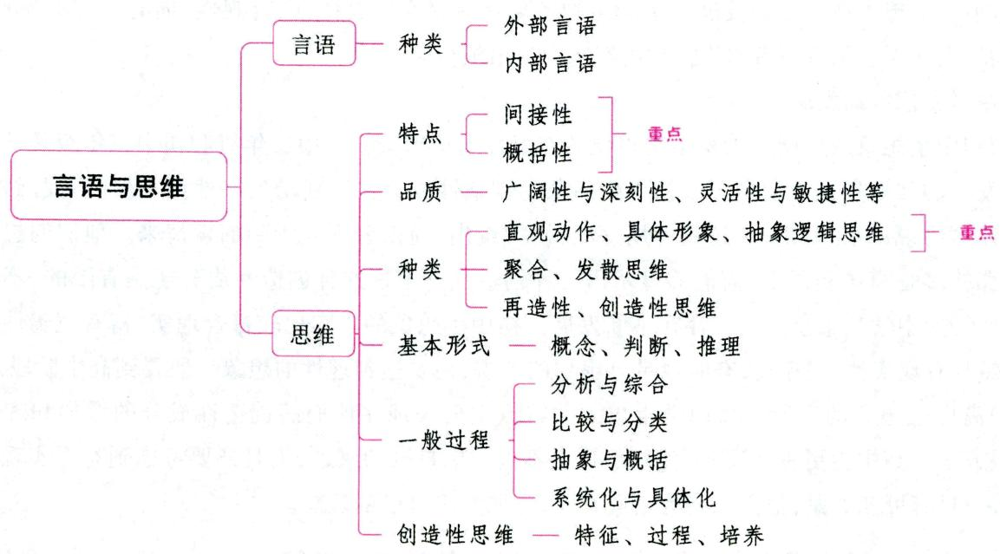  
第四节 言语与思维

# 一、言语 ★【单选、多选、判断】

# 考点1 言语的概念与特点

言语是指人们运用语言材料和语言规则进行交际的过程。

言语的特点包括：目的性、开放性、规则性、离散性、社会性和个体性。

# 考点2 言语的种类

表 2-16 言语的种类  

<table><tr><td colspan="3">种类</td><td>概念</td><td>特点</td><td>典例</td></tr><tr><td rowspan="3">外部言语</td><td rowspan="2">口头言语</td><td>对话语</td><td>两个人或几个人直接交际时的言语活动</td><td>一种直接交际言语,具有情境性、反应性和简略性等特点</td><td>聊天、座谈</td></tr><tr><td>独白言语</td><td>个人独自进行的,与叙述思想、情感相联系的,较长而连贯的言语</td><td>说话者独自进行的一种展开性的、有准备的、有计划的言语活动</td><td>报告、演讲</td></tr><tr><td colspan="2">书面言语</td><td>一个人借助文字来表达自己的思想或借助阅读来接受别人言语的影响的言语</td><td>具有言语的随意性、展开性和计划性等特点</td><td>写文章</td></tr><tr><td colspan="2">种类</td><td>概念</td><td>特点</td><td>典例</td></tr><tr><td colspan="2">内部言语</td><td>一种自问自答或不出声的言语活动</td><td>在外部言语的基础上产生,其主要特点
是隐蔽性、与思维的相关性和简约性</td><td>默读</td></tr></table>

真题1 [2024安徽统考，判断]言语就是运用语言材料和语言规则进行交际的过程，分为口头言语和书面言语。（）

答案：×

# 考点3 言语的感知和理解

# 1.言语的感知

(1) 口头言语的感知。口头言语的感知涉及语言的清晰度与可懂度。清晰度与可懂度是指听者了解讲话者说话的百分率，或指听者听对的百分率。  
(2)书面言语的感知。人们通过视觉系统接受文字材料提供的信息，对字词做出正确判断与分辨，这就是书面言语的感知。书面言语的感知包括单词再认和阅读。

# 2. 言语的理解

(1)概念。言语的理解是指人们借助于听觉或视觉的语言材料，在头脑中建构意义的一种主动、积极的过程。  
(2)过程。言语的理解可分为三级水平：①词汇理解或词汇识别是言语理解的第一级水平；②句子的理解是言语理解的第二级水平；③篇章理解（课文或话语的理解）是言语理解的第三级水平。篇章理解是言语理解的最高水平。

真题2 [2024浙江金华，单选]言语理解的最高水平是（ ）

A.符号理解

B. 词汇理解

C. 句子理解

D. 篇章理解

答案：D

# 二、思维及其品质 ★★ 【单选、多选、判断】

# 考点1 思维的概念和特点

# 1. 思维的概念

思维是人脑对客观事物的本质属性与内在联系的概括的、间接的反映。它是借助语言实现的，能揭示事物本质特征及内部规律的理性认知过程。

# 2. 思维的特点

(1)间接性

间接性是指思维能对感官所不能直接把握的或不在眼前的事物,借助于某些媒介物与头脑加工来进行反映。知识与经验是思维间接性反映的中介因素,没有这个中介因素,思维的思维的特点间接性就无法产生。例如:内科医生不能直接看到病人内脏的病变,却能以听诊、化验、切脉、试体温、量血

压、B超、CT等检验手段为中介，经过思维加工间接判断出病人的病情；地震工作者可以根据动物的反常现象或其他仪表的数据来分析与预报震情；等等。

# (2)概括性

概括性包含两层意思：①把同一类事物的共同特征和本质特征抽取出来加以概括（形成概念）。例如，人们把形状、大小各不相同而能结出枣的树木称为“枣树”，把枣树、苹果树、梨树等依据其根、茎、叶、果的共性称为“果树”等。②将多次感知到的事物之间的联系和关系加以概括，得出有关事物之间的内在联系的结论（得出关系）。例如，每次看到“月晕”就要“刮风”，“础石潮湿”就要“下雨”，就能得出“月晕而风，础润而雨”的结论。

# 小香课堂·

如何区分思维的间接性和概括性：

(1)在做题的时候，把握题干中的关键词。间接性的关键词是：“根据”“推断”；概括性的关键词是：“对……的认识”“得出……结论”。  
(2)遇到谚语时不能一概而论，要具体分析题目强调哪方面的意思。题目强调“间接地推测事物”，选间接性；题目强调人们通过自身多年劳动经验，总结归纳出一套生活的规律，选概括性。

真题3 [2024安徽统考，单选]小乐早晨路过某地，发现很多树都折断了，他由此推断此地昨夜刮了大风。这体现的认知过程是（）

A. 感觉

B. 想象

C. 思维

D. 记忆

真题4 [2023广东深圳, 单选]在课堂上, 教师见某一学生紧锁双眉, 一筹莫展, 由此推断该学生对授课内容的理解不是很顺利, 教师的这种思考说明( )

A. 知识和经验是思维间接性反映的中介因素

B.知识和经验是思维概括性反映的中介因素

C. 观察和注意是思维间接性反映的中介因素

D. 观察和注意是思维概括性反映的中介因素

真题5 [2022山东枣庄，单选]谚语“一场秋雨一场寒，十场秋雨穿上棉”体现了思维的（ ）特征。

A. 间接性

B. 组织性

C. 概括性

D. 抽象性

答案：3.C 4.A 5.C

# 考点2 思维的品质

# 1.思维的广阔性与深刻性

思维的广阔性是指思路开阔, 能从各个角度、多个方面揭露事物的联系, 全面地思考问题。具有思维广阔性品质的学生, 在学习中能进行周密的思考, 善于进行分析与综合, 既考虑整体, 又考虑部分。

思维的深刻性是指能深入地思考问题，善于透过事物的表面现象，抓住事物的实质，揭露事物之间的内在联系。

# 2. 思维的独立性（独创性）与批判性

思维的独立性（独创性）是指既能不受他人暗示，不人云亦云，不盲从别人的见解，不依赖现成的方法和结论，又能不武断、不一意孤行、不固执己见、不唯我是从，充分地发挥个人的主观能动性，独立地发现、思考、处理和解决问题。

思维的批判性是指既善于批判地评价他人的思想和成果，汲取别人的长处、优点和思想的精华，摒弃别人的短处、缺点和思想的糟粕；又善于严格而精细地思考问题，冷静而客观地评价和自觉地控制自己的思维活动，不易受自己的情绪和偏爱的影响。

# 3. 思维的灵活性与敏捷性

思维的灵活性是指能灵活地思考问题。它表现为能从不同角度、运用不同方法思考问题，在条件发生变化时，能随机应变，及时地改变原有计划、方案，寻找新的解决问题的途径。具有思维灵活性的学生，能灵活自如地运用各种规则、原理和规律，将书本中的知识与自己的见解进行比较和融合，而不把书本当教条；同时还能举一反三，由此及彼，善于迁移。

思维的敏捷性是指思维活动迅速正确，能当机立断。思维的敏捷性与轻率迥然不同，它不仅要求思维速度快，而且要求思维的正确性高。古人所谓“眉头一皱，计上心来”，便是思维敏捷的一种表现。思维敏捷性强的学生能迅速准确地认识事物的本质和规律。

# 4. 思维的逻辑性和严谨性

思维的逻辑性和严谨性是指考虑和解决问题时思路鲜明,条理清楚,严格遵循逻辑规律,即提问明确,推理严密,主次分明,论证充分,有的放矢,有说服力,结论证据确凿。思维的逻辑性和严谨性是思维品质的中心环节,是所有思维品质的集中体现。

# 记忆有妙招·

为方便考生记忆，编者将思维的品质总结成以下口诀：

横向广，纵向深；于人独，对己批；灵则变，敏则快；逻辑严谨是中心。广：广阔性。深：深刻性。独：独立性。批：批判性。灵：灵活性。敏：敏捷性。逻辑：逻辑性。严谨：严谨性。

真题6 [2024山东青岛，单选]小娜做事果断、不犹豫，这体现了思维的（）

A. 灵活性

B. 敏捷性

C. 独立性

D. 深刻性

真题7 [2022河南信阳，判断]从事物的各个方面、各个角度去看待问题是思维的广阔性。（）答案：6.B 7.√

# 考点3 良好思维品质的培养

教师在教育教学过程中培养学生良好的思维品质可以从以下几个方面着手：（1)加强科学思维方法的训练；(2)运用启发式方法调动学生思维的积极性、主动性；(3)加强言语交流训练；(4)发挥定势的积极作用；(5)培养学生解决实际问题的思维品质。

# 三、思维的种类 ★★ 【单选、多选、填空、判断】

# 1. 直观动作思维、具体形象思维和抽象逻辑思维

根据思维的内容凭借物、任务的性质、发展水平以及解决问题的方式，可将思维分为直观动作思维、具体形象思维和抽象逻辑思维。

直观动作思维是以实际动作为支柱的思维过程。例如，3岁前的幼儿的思维就属于直观动作思维，他们的思维活动离不开触摸、摆弄物体的活动。

具体形象思维是以直观形象和表象为支柱的思维过程。具体形象思维具有形象性、整体性、可操作性等特点。

抽象逻辑思维是以词为中介来反映现实的思维过程，也叫词的思维、抽象思维或逻辑思维。抽象逻辑思维是人类思维的典型形式，是人类思维区别于动物思维的最本质特征。例如，学生证明某一命题、定理时，要运用数字符号和概念来进行推导和求证。

一个正常的成年人，在实际工作和生活中，常将以上三种思维方式结合起来解决问题。例如，司机用实际操作检查马达出故障的原因时，必然与马达正常运转时的形象对照。同时，还要运用已有的知识经验进行推理判断，只有这样才能找出马达发生故障的原因。

从个体思维发展的经历来看，儿童总是先发展直观动作思维和具体形象思维，在此基础上才能逐步发展抽象逻辑思维。就这个发展顺序而言是固定的、不可逆的，但这不意味着这三种思维方式之间是彼此对立的、相互排斥的。事实上，它们在一定条件下往往相互联系，相互配合，相互补充。人到了成年以后，哪种思维形式占优势，并不表明个人思维水平的高低。

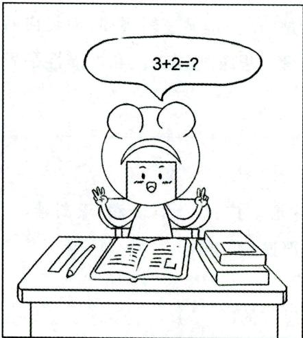  
直观动作思维

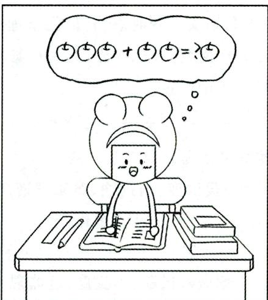  
具体形象思维

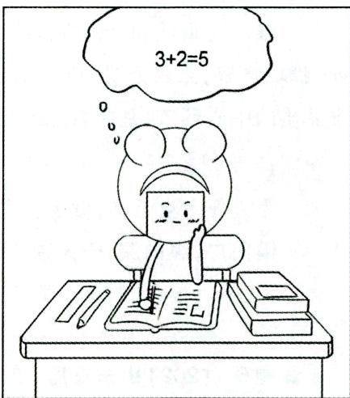  
抽象逻辑思维

# 2. 经验思维和理论思维

根据思维过程中是以日常经验还是以理论为指导来划分，可将思维分为经验思维和理论思维。

经验思维是以日常经验为依据，判断生产、生活中的问题的思维。例如，学前儿童根据自己的经验，认为“鸟是会飞的动物”，这就属于经验思维。由于知识经验的不足，这种思维容易产生片面性，甚至得出曲解或错误的结论。

理论思维是以科学的原理、定理、定律等理论为依据，对问题进行分析、判断的思维。例如，人们说“心理是客观现实在人脑中的主观映像”，就是理论思维的结果。这种思维往往能抓住事物的本质，使问题得到正确的解决。教师利用理论思维传授科学理论，学生运用理论思维学习理性知识。

# 3. 分析思维和直觉思维

根据结论是否有明确的思考步骤和思维过程中意识的清晰程度和逻辑性，可将思维分为分析思维和直觉思维。

分析思维是遵循严密的逻辑程序和规律，逐步推导，然后得出合乎逻辑的正确答案或做出合理结论的思维。分析思维是以概念、判断、推理的形式来反映客观世界的思维。例如，学生在解数学题时，通过多步的推理和论证得出答案的过程。分析思维具有程序性的特点。

直觉思维是未经逐步分析就迅速对问题答案做出合理的猜测、设想或突然领悟的思维。直觉思维具有敏捷性、直接性、简缩性、突然性(突发性)、猜测性的特点。例如，足球运动员在一瞬间把握球场上对方球员的布局漏洞，不失时机地把球踢进球门，就是直觉思维的表现。灵感现象就是直觉思维的结果。

# 4. 聚合思维和发散思维

根据思维的指向性，可将思维分为聚合思维和发散思维。

聚合思维，也叫求同思维、集中思维、辐合思维、会聚思维，是指人们解决问题时，思路集中到一个方向，从而形成唯一的、确定的答案。聚合思维的过程是人们根据已知的信息和利用熟悉的规则，产生逻辑的结论从而解决问题的过程。这是一种有方向、有条理、有范围的思维方式。

发散思维, 也叫求异思维、分散思维、辐射思维, 是指人们解决问题时, 思路朝着各种可能的方向扩散, 从而求得多种答案。发散思维的过程是从给予的信息中产生多种信息的过程。

# 5. 再造性思维和创造性思维

根据思维的创造程度，可将思维分为再造性思维和创造性思维。

再造性思维也称常规性思维或习惯性思维，是指人们运用已获得的知识经验，按现成的方案和程序，用惯常的方法、固定的模式来解决问题的思维方式。例如，学生运用已学会的公式解决同一类型的问题。这种思维创造性水平较低。

创造性思维是指以新颖、独特的方式来解决问题的思维方式。是一种重新组织已有的知识经验，提出新的方案或程序，并创造出新的思维成果的思维活动。例如，新的大型工具软件的开发、新的科学理论的提出都需要创造性思维。创造性思维是人类思维的高级形态，是智力的高级表现。

真题8 [2023江苏常州,单选]教师采用的一题多解的教学方法主要用来训练学生的（）

A. 直觉思维

B. 发散思维

C. 集中思维

D. 常规思维

真题9 [2022河北保定, 单选]教一年级数学的王老师为了让学生更好地理解知识, 经常借用丰富的教具来向学生展示如何解决实际问题, 使教学符合该年龄阶段学生的思维形式。由此可知, 该年龄段学生的主要思维形式是（）

A. 具体形象思维

B. 直观动作思维

C. 抽象逻辑思维

D. 常规思维

真题10 [2022山东德州，单选]在设计游客参观野生动物园的方法时，想到的不是把动物关在笼子里，而是把人关在笼子里，运用的思维是（）

A. 集中性思维

B. 聚合思维

C. 创造性思维

D. 发散思维

答案：8.B 9.A 10.C

# 四、思维的基本形式

思维的基本形式有：概念、判断、推理。

其中，判断是指认识概念与概念之间的联系，它是事物之间的联系和关系在人脑中的反映。判断大都是借助语言、词汇并用句子形式来实现的，有肯定判断和否定判断之分。

推理是由一个或几个相互联系的已知判断推出合乎逻辑的新判断的思维形式，是根据已有的知识

推出新的结论的思维活动。推理可分为归纳推理和演绎推理两种。归纳推理是由具体事物归纳出一般规律的推理过程，即从特殊到一般的推理过程。例如，由铁能导电，铜能导电，铝能导电等，推理出“金属能够导电”的结论。演绎推理是从一般到特殊或具体的推理过程。例如，所有的哺乳类动物都是胎生的，虎是哺乳类动物，因此得出的结论是：虎也是胎生的。

下面我们将深入地探讨概念的相关内容。

# 考点 概念的含义

概念是人脑对客观事物本质特征的认识。事物的本质特征是决定事物的性质，并使该事物区别于其他事物的特征；非本质特征则是对事物不具有决定意义的特征。

每一个概念都包括内涵和外延两个方面。其中，内涵代表概念能够反映的事物的本质特征。例如，“鸟”这个概念的内涵就是“有羽毛、有喙”，鸟的内涵使得鸟可以区分于其他物种。外延代表的是概念所能囊括的所有个体或样例。例如，在鸟这个内涵下所能包括的一切有羽毛且有喙的动物，包括金丝雀、麻雀、布谷、鸵鸟等。所以，内涵和外延是相互关联的。一个概念的内涵越丰富，信息量越大，反而所能包含的外延就越少。反之，一个概念的内涵越抽象越概括，其所拥有的外延也就越丰富。

# 考点2 概念的类型 ★【单选、多选、判断】

根据概念所反映的事物属性的数量及其相互关系，可将概念分为合取概念、析取概念和关系概念。

# 1. 合取概念

合取概念指根据一类事物中单个或多个相同属性形成的概念。这些属性在概念中必须同时存在。例如，“毛笔”这个概念必须有两个属性，即“用毛制作的”和“写字的工具”。如果只有前一属性，可认为是毛刷；只有后一属性，可认为是钢笔或圆珠笔等。

# 2. 析取概念

析取概念指根据不同的标准,由单个或多个属性的结合形成的概念。例如,“好孩子”这个概念,可以结合各种属性,如“热爱集体、拾金不昧”是好孩子,“热爱劳动、肯为大家做事”也可称为好孩子。

# 3. 关系概念

关系概念指不是根据事物的特征和属性，而是根据事物之间的相互关系形成的概念。例如，高低、上下、左右、大小等都是根据事物之间的相对关系形成的概念。

真题11 [2024河北石家庄，判断]“热爱学习，上课认真听讲”是好学生，“热爱班集体，主动帮助其他同学”也是好学生。“好学生”这个概念属于析取概念。（）

A. 正确

B. 错误

答案：A

# 考点3 概念学习的过程 ★【单选、多选】

概念学习的过程包括概念的获得和概念的运用两个环节。

# 1. 概念的获得

获得概念的方式主要有概念形成和概念同化。

# (1) 概念形成

概念形成是指个体通过反复接触大量同一类事物或现象的共同特征或共同属性, 并通过肯定的例子 (正例) 或否定的例子 (反例) 加以证实的过程。概念形成的标志是把握概念的本质特征, 并能在实际中运用。概念形成的操作定义是个体学会了按照一定规则对客观事物进行正确分类的过程。例如, 向小学生呈现各种各样的两条直线间的相互关系, 告诉他们哪些垂直, 哪些不垂直, 当他们能够正确区分垂直 (正例) 和非垂直 (反例) 的直线时, 就形成了关于“垂直”的概念。发现学习是概念形成的主要方式。

概念形成一般经历三个阶段：

① 抽象化。概念形成首先是要了解客观事物的属性或特征，因此，必须对具体事物的各种特征与属性进行抽象。  
②类化。概念的形成，除了要在具体事物中抽取共同属性或特征，还需将类似的属性或特征加以归类。在进行类化时，必须归纳客观事物某些属性或特征的相似性或共同性，而忽略事物之间非本质特征或属性的差异性。  
③辨别。对客观事物进行分辨是概念形成的重要一步。辨别渗透于概念形成的全过程，从发觉客观事物的属性或特征（抽象化），到对这些属性或特征的认同（类化），然后过渡到对客观事物的属性或特征之间差异的认识（辨别）。

# (2)概念同化

学生获得概念的主要形式是概念同化。所谓概念同化，就是利用学习者认知结构中原有的概念，以定义的方式直接给学习者提示概念的关键特征，从而使学习者获得概念的方式。接受学习是概念同化的典型方式。

# 2. 概念的运用

概念一旦获得之后，就能在认知活动中发挥作用，从而对认知活动产生影响，这就是概念的运用。它一般反映在两个水平上：(1)在知觉水平上的运用。这是指运用已经获得的概念，帮助识别具体的同类事物并将其归入这一类型。(2)在思维水平上的运用。这是指运用概念对事物进行判断、推理或将概念进行重新改组，以满足解决问题的需要。

# 考点4 科学概念的掌握

概念的掌握是指个人借助词语,在人脑中把人类现有的概念转化为个体的概念的过程。能否正确应用概念是衡量学生是否真正掌握概念的最可靠的标志。

教师在教学过程中帮助学生掌握概念时应注意以下几个方面：

(1)以感性材料作为概念掌握的基础；(2)合理利用过去的知识经验；(3)提供概念范例，配合运用正例和反例，适当运用比较；(4)突出有关特征，控制好无关特征的数量和强度，正确而充分地利用“变式”；(5)正确运用语言表达，明确提示概念的本质特征；(6)形成正确的概念体系，并运用于实践中。

# 考点5 概念转变及其影响因素 ★【多选】

概念转变就是认知冲突的引发和解决的过程，是个体原有的某种知识经验受到与此不一致的新经验的影响而发生的重大改变。影响概念转变的因素主要有：(1)先前知识经验背景；(2)学生的动机与

态度；(3)学生的形式推理能力；(4)课堂情境；(5)新概念的特征。

为了促进错误概念的转变，教学一般要包括三个环节：（1)揭示、洞察学生原有的概念；（2)引发认知冲突；(3)通过讨论分析，使学生调整原来的看法或形成新观念。

同时在教学中应该注意：(1)创设开放的、相互接纳的课堂气氛；(2)倾听、洞察学生的经验世界；(3)引发认知冲突；(4)鼓励学生交流讨论。

真题12 [2022广东广州，多选]某物理老师在教授《重力》一课时，不仅对《重力》的内容进行了清晰的讲解，还促进了同学们错误观念的转变。这位物理老师在促进同学们错误观念改变时，做法正确的有（）

A. 威逼利诱使学生得出唯一结论  
B.洞察学生原有的观念   
C. 引发持有错误观念的学生的认知冲突感  
D. 进一步组织学生进行交流讨论

答案：BCD

# 五、思维的一般过程 ★【单选、多选、填空、判断】

思维的一般过程包括分析与综合、比较与分类、抽象与概括、系统化与具体化。其中，分析与综合是思维的基本过程，其他过程都是由此派生出来的。

# 1. 分析与综合

分析与综合是思维活动最基本的认知加工方式。

分析是指在人脑中把事物或对象分解成各个部分或各个属性。例如，把一棵树分解为根、茎、叶、花等。

  
分析与综合、抽象与概括

综合是在人脑中把事物或对象的个别部分或属性联合为一体。例如：把一个人过去与现在的经历联系起来编成一个短剧；儿童把几个积木块搭成一个小房子等。

# 2. 比较与分类

比较是指在人脑中把各种事物或现象加以对比，来确定它们之间的异同点和关系的思维过程。没有比较就没有鉴别。只有通过比较，人们才能区分事物间的异同点、鉴别事物的优劣，才能识别事物，把它归到一定的类别中去。

分类是在人脑中按照事物的异同，把它们区分为不同种类的思维过程。比较是分类的基础。根据事物的共同点可以把事物归并为较大的类；根据差异可以把事物划分为较小的类。

# 3. 抽象与概括

抽象是在人脑中提炼各种事物或现象的共同的、本质的特征，舍弃其个别的、非本质的特征的过程。例如，总结鸽子、老鹰、鸡、鸭等共同的、本质的特征，即“有羽毛”“是动物”；舍弃那些“会不会飞”“颜色”“大小”等非本质特征，这就是抽象的过程。

概括是在人脑中把事物间共同的、本质的特征抽象出来加以综合的过程。例如，人们把那些“有羽毛的动物”统称为鸟类，就是概括的过程。概括有不同的等级或水平，经验概括是初级水平的概括，科学概括是高级水平的概括。

# 4. 系统化与具体化

系统化是指人脑把具有相同本质特征的事物归纳到一定类别系统中去的思维过程。例如, 生物包括动物和植物两大类, 动物包括脊椎动物和无脊椎动物两种, 脊椎动物又包括鱼类、鸟类、哺乳类等, 这样就把有关生物的知识系统化了。

具体化是指人脑把经过抽象概括后的一般特征和规律推广到同类的具体事物中去的思维过程。如用某数学公式解一道应用题的过程。

真题13 [2023湖北武汉, 单选]在对学生进行评价时, 不仅要考虑学生的学业成绩, 还要和学生的思想品德等方面联系起来加以评价。这体现的思维过程属于( )

A. 综合

B. 比较

C. 抽象

D. 系统化

答案：A

# 六、创造性思维

创造性思维是指用独特、新颖的方法解决问题的思维过程。它是人类思维的高级形态, 是智力的高级表现。

考点1 创造性思维的特征 ★★【单选、多选、判断、简答】

# 1. 新颖独特性

创造性思维不同于一般的思维活动，它要求打破惯常的解决问题的方法，将已有的知识经验进行改组或重建，创造出个体所未知的或社会前所未有的思维成果。因此，新颖独特性是创造性思维最本质的特征。

# 2. 创造性思维是多种思维的结晶（创造性思维的结构）

创造性思维是发散思维和聚合思维的统一, 是形象思维和抽象思维的统一, 是直觉思维与分析思维的统一。创造性思维以发散思维为核心。发散思维具有流畅性、灵活性 (变通性) 和独创性 (独特性) 等特点。当然, 创造性思维者还要对新颖独特的观念具有高度的敏感性, 具有及时把握它们的能力。因此, 目前也有人以发散思维的特点来代表创造性思维的特点。

# 3. 创造性想象的积极参与

创造性想象的积极参与是创造性思维的重要环节。因为创造性想象提供的是事物的新形象，并使创造性思维成果具体化。所以文艺作品中新形象的创造，科学研究中新假说的提出，新机器的发明等，都离不开创造性想象。

# 4.灵感状态

灵感状态是创造性思维活动的典型特征之一。所谓灵感，是指人在创造性思维过程中，某种新形象、新概念和新思想突然产生的心理状态。它是人在以全部精力集中去解决思考中的问题时，由于偶然因素的触发而突然出现的顿悟现象。任何创造性思维，都离不开灵感。

真题14 [2023山东枣庄，单选]“踏破铁鞋无觅处，得来全不费工夫”指的是我们在解决问题的过程中感受到了（ ）的影响。

A. 定势

B. 同化

C. 顺应

D. 灵感

答案：D

# 考点2 创造性思维的过程 ★ 【单选、多选】

瓦拉斯(华莱士)于1926年提出了创造性思维的四阶段，即准备期、酝酿期、豁朗期(启发期)和验证期。

(1)准备期。在这一阶段，创造者收集、整理资料，即收集创造活动所必需的各种信息，组织已有的旧经验，掌握必要的技能。  
(2)酝酿期。在准备期收集到的信息并未消极地存储在头脑中，而是按照一种我们目前尚不清楚的方式被加工和重新组织。  
(3)豁朗期(启发期)。这是指创造者经过长期酝酿，产生新假设或对考虑的问题豁然开朗。豁朗期是创造活动极为重要的阶段。  
(4)验证期。在这个阶段，创造者要把头脑中产生的新假设或新观点通过实践加以检验。验证可以对新假设加以确定、修正、补充或完善。

# 考点 3 创造性思维能力的培养 ★★ 【单选、多选、判断、简答、论述】

1. 运用启发式教学，保护学生的好奇心，激发学生的求知欲，培养创造性动机，调动学生学习的积极性和主动性

好奇心是人对新异事物产生好奇并进行探究的一种心理倾向。求知欲又称认识兴趣，它是好奇心的升华，是人渴望获得知识的一种心理状态。好奇心和求知欲是学生主动观察事物、进行创造性思维的内部动因。教师在教学过程中要创造条件，积极促进学生的好奇心、求知欲的发展。学习动机等非智力因素对创造性思维能力的培养起着重要作用。发展学生的创造性思维首先要调动学生的积极性和主动性。

2. 培养学生的发散思维，并将发散思维和集中思维相结合

创造性活动的全过程要经过从发散思维到集中思维，从集中思维到发散思维再到集中思维，多次循环才能完成。

3. 发展学生的创造性想象能力

思维的基础是表象和想象。想象与创造性思维有着密切的联系，它是人类创造活动所不可缺少的心理因素。具有丰富的创造性想象是产生创造性成果的必要条件。因此，教师要注意发展学生的想象力。培养学生想象力的方法的具体内容参见本章第三节中“学生想象力的培养”。

4. 组织创造性活动，正确评价学生的创造性

创造性思维的培养依托于创造性活动的开展。教师应多组织合作教学、情境教学等有利于创造性思维发展的教学形式。

5.开设具体创造性课程，教授学生创造性思维策略和创造技法

（1）常见的创造性课程

①创造发明课。②直觉思维训练课。③推测与假设训练课。这类训练的主要目的是发展学生的想象力和对事物的敏感性，并促使学生深入思考，灵活应对。比如，假设你当校长，你如何管理这个学校。④侧向思维训练课。⑤自我设计训练课。这是一种灵活性较强的训练课程。教师为学生提供必要的材料与工具，让学生利用这些材料，实际动手去制作某种物品。⑥发散思维训练课，这是训练创造性思维

最常见的方式，其训练方法有多种，如用途扩散、结构扩散、方法扩散、形态扩散等。

(2)促进创造性思维发展的创造技法

①头脑风暴法（脑力激励法）。头脑风暴法由心理学家奥斯本提出，通常以集体讨论的方式进行，鼓励参加者尽可能快地提出各种各样异想天开的设想或观点，相互启迪，激发灵感，从而引发创造性思维的连锁反应，形成解决问题的新思路。具体应用此方法时，应遵循四条基本原则：一是让参与者畅所欲言，对提出的所有方案禁止批评，延迟评价。评价必须在所有的想法出来之后再进行。二是鼓励标新立异、与众不同的观点，提倡自由奔放的思考，充分发表自己的看法。三是以获得方案的数量而非质量为目的，即鼓励多种想法，多多益善。四是鼓励提出改进意见或补充意见，提倡对他人的设想进行组合和重建以求改善。②系统探求法。为打破传统思维束缚，对问题的解决进行系统设问、特性列举等来培养和提高学生的创造性思维。③联想类比法。④组合创新法。⑤对立思考法。⑥转换思考法。⑦检查单法。⑧分合法。

6. 结合各学科特点进行创造性思维训练

虽然各种直接的、专门的创造性训练是有效、可行的，但不应取代或脱离课堂教学。许多研究证明，结合各个学科特点进行创造性思维训练，既可以发挥教师的创造性，也可以有效地提高学生的创造力。排斥或脱离学科而孤立地训练创造力，实际上是舍本逐末的做法，也不可能真正提高学生的创造力。

真题15 [2023广西百色，单选]让学生思考“如果自己当校长，会如何管理这个学校”，这种训练创造性的方法属于（）

A.头脑风暴训练

B. 自我设计训练

C. 发散性思维训练

D. 推测与假设训练

答案：D

# 七、中小学生思维的发展 ★★ 【单选、多选、判断、简答】

# 考点1 小学生思维的发展

小学生思维发展的基本特征——从具体形象思维为主逐步向抽象逻辑思维为主过渡。主要表现在：

(1)小学生的抽象思维逐步发展，但仍带有较大的具体性。  
(2)小学生的抽象思维开始发展，但仍带有很大的不自觉性。  
(3)在从具体形象性向抽象逻辑性的过渡中，存在着不平衡性（不平衡性既表现为个体发展的差异，也表现为思维对象的差异，比如不同学科或不同教材）。  
(4)在从具体形象思维为主逐渐向抽象逻辑思维为主的过渡中出现“飞跃”或“质变”。一般认为, 这个关键年龄出现在小学四年级 (约 10~11 岁)。如果教育条件适当, 这个关键年龄可以提前到三年级。

真题16 [2023黑龙江哈尔滨，单选]一般认为，小学儿童思维的主要形式从具体形象思维到抽象逻辑思维过渡的关键阶段是（）

A. $8\sim 9$ 岁

B. $9\sim 10$ 岁

C. $10 \sim 11$ 岁

D. $11 \sim 12$ 岁

答案：C

# 考点2 中学生思维的发展

# 1. 抽象逻辑思维逐渐占据主导地位，并随着年龄的增长日益成熟

在一定程度上，初中生的抽象逻辑思维还需要具体形象的支持。从初中二年级开始，进入中学生思维发展的关键期。学生的抽象逻辑思维开始由经验型水平向理论型水平转化，到高中二年级，这种转化初步完成，他们的抽象逻辑思维趋向成熟。

# 2. 形式逻辑思维逐渐发展，在高中阶段处于优势

整个中学阶段，形式逻辑思维已获得了相当完善的发展，在中学生的思维活动中占据主导地位，主要表现在：(1)经过整个中学阶段的发展，中学生已经逐步掌握了系统的、完整的概念体系。(2)中学生的推理能力基本达到成熟。特别是高中二年级以后，学生的各项推理能力基本发展完善。(3)中学生能够较好地运用逻辑法则。

# 3. 辩证逻辑思维迅速发展

形式逻辑思维和辩证逻辑思维是抽象逻辑思维的两个不同的发展阶段, 它们的发展和成熟, 是中学生思维发展和成熟的重要标志。

# ★本节核心考点回顾 ★

# 1.思维的特点

(1)间接性：对感官所不能直接把握的或不在眼前的事物，借助于某些媒介物与头脑加工来进行反映。  
(2)概括性：①把同一类事物的共同特征和本质特征抽取出来加以概括；②将多次感知到的事物之间的联系和关系加以概括，得出结论。

# 2. 思维的种类

(1)根据思维的内容凭借物等划分

①直观动作思维：以实际动作为支柱；  
(2)具体形象思维：以直观形象和表象为支柱；  
③ 抽象逻辑思维：以词为中介来反映现实。

(2)根据思维的指向性划分

① 聚合思维：根据已知的信息和利用熟悉的规则，产生逻辑的结论从而解决问题。  
②发散思维:解决问题时,思路朝着各种可能的方向扩散,从而求得多种答案。

(3)根据思维的创造程度划分

① 再造性思维：运用已获得的知识经验，按现成的方案和程序，用惯常的方法、固定的模式来解决问题。  
②创造性思维：以新颖、独特的方式来解决问题。

# 3. 概念的分类

(1) 合取概念: 根据一类事物中单个或多个相同属性形成的概念。  
(2) 析取概念: 根据不同的标准, 结合单个或多个属性形成的概念。  
(3)关系概念：根据事物之间的相互关系形成的概念。

# 4. 创造性思维能力的培养

(1)运用启发式教学，保护学生的好奇心，激发学生的求知欲，培养创造性动机，调动学生学习的积极性和主动性。  
(2)培养学生的发散思维，并将发散思维和集中思维相结合。  
(3)发展学生的创造性想象能力。  
(4)组织创造性活动，正确评价学生的创造性。  
(5)开设具体的创造性课程，教授学生创造性思维策略和创造技法。  
(6)结合各学科特点进行创造性思维训练。

# 第五节 注意

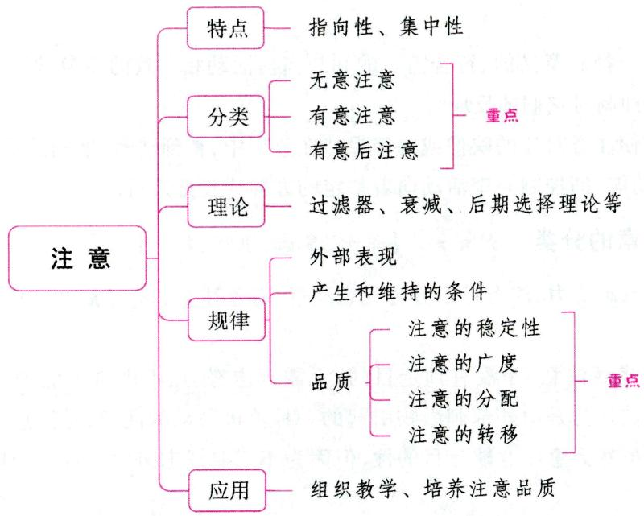

# 一、注意概述

# 考点1 注意及其功能 ★★ 【单选、多选、判断、简答】

# 1. 注意的概念和特点

# (1) 注意的概念

注意是心理活动或意识对一定对象的指向和集中，是心理过程的动力特征之一。它与认知过程、情绪情感过程、意志过程难以分开，是一切心理活动的共同特征。注意是人们清晰地认识事物和做出准确反应的保证，是人们获得知识、掌握技能、完成各种智力活动和实际操作的重要心理条件。

# (2) 注意的特点

①指向性。注意的指向性是指心理活动有选择地反映一定的对象, 而离开其余的对象。注意的指向性表现为人的心理活动具有选择性。例如, 学生在听课时, 心理活动不是指向教室里的一切事物, 而是把教师的讲述从许多事物中挑选出来, 并且比较长久地把心理活动保持在教师的讲述上。

②集中性。注意的集中性是指心理活动停留在被选择的对象上的强度或紧张度，它使心理活动离开一切无关的事物，并且抑制多余的活动，以保证注意的对象能得到比较鲜明和清晰的反映。人在注意力高度集中时，对目标物之外的其他事物就会“视而不见、听而不闻”了。

# 小香课堂·

考生在区分注意的指向性和集中性时，可以从以下方面入手：注意的指向性是在接收信息时，只选择一定的对象加以反映；注意的集中性是心理活动只关注所指向的事物，抑制了与当前注意对象无关的活动。

真题1[2024广东广州，判断]小明在剧院里看戏，对于戏剧演员的台词、动作、表情等印象非常深刻，而对剧场里其他观众的印象则非常模糊，这体现了注意具有指向性。（）

答案：√

# 2. 注意的功能

(1) 选择功能, 即选择有意义的、符合需要的和与当前活动相一致的刺激, 避开与之无关的、干扰当前活动的各种刺激并抑制对它们的反应。  
(2)保持功能，即使注意对象的映像或内容保持在意识中，得到清晰、准确的反映。  
(3)调节和监督功能，即控制心理活动向着一定的方向或目标进行。

# 考点2 注意的分类 ★★★ 【单选、多选、填空、判断】

根据有无目的和意志努力，注意可以分为无意注意、有意注意和有意后注意三种。

# 1. 无意注意

无意注意也称不随意注意，是没有预定目的、无需意志努力、不由自主地对一定事物所发生的注意。无意注意更多地被认为是由外部刺激物引起的一种消极被动的注意，是注意的初级形式。人和动物都存在无意注意。虽然无意注意缺乏目的性，但因为不需要意志努力，所以，个体在注意过程中不易产生疲劳。

# 2. 有意注意

有意注意也称随意注意，是有预定目的、需要意志努力、主动地对一定事物所发生的注意。有意注意是一种积极主动、服从于当前活动任务需要的注意，属于注意的高级形式。它受人的意识的调节和控制，是人类所特有的一种注意。有意注意虽然目的性明确，但在实现过程中需要有持久的意志努力，这容易使个体产生疲劳。

# 3. 有意后注意

有意后注意也叫随意后注意, 是指有预定目的, 但不需要意志努力的注意。它是在有意注意的基础上, 经过学习、训练或培养个人对事物的直接兴趣达到的。在有意注意阶段, 主体从事一项活动需要意志努力, 但随着活动的深入, 个体由于兴趣的提高或操作的熟练, 不用意志努力就能够在这项活动上保持注意。

有意后注意是一种更高级的注意，在活动进行中不容易感到疲倦，这对完成长期性和连续性的工作有重要意义。但有意后注意的形成需要付出一定的时间和精力。培养学生的有意后注意关键在于发展其对活动的兴趣。有意后注意形成的条件有两个：（1）对活动浓厚的兴趣；（2）活动的自动化。

真题2[2024江苏南京，单选]金老师关注到气象台发布的“大雾”天气预警，提醒全班学生上下学时注意交通安全，遇到特殊情况及时联系老师。金老师这一做法有利于引起学生的（）

A. 无意注意

B. 有意注意

C. 同化性迁移

D. 顺应性迁移

真题3 [2022天津北辰, 单选]学生正在听讲, 教室的门突然被人打开, 传来一声门响, 大家都看了一眼。这时的注意属于( )

A. 无意注意

B. 有意注意

C. 有意后注意

D.随意注意

真题4 [2024河北石家庄，判断]有意后注意不需要意志努力。（）

A. 正确

B. 错误

答案：2.B 3.A 4.A

# 考点 注意的理论 ★ 【单选】

# 1. 过滤器理论

过滤器理论认为，人的神经系统在加工信息的容量方面是有限度的，不可能对所有的感觉刺激进行加工。当信息通过各种感觉通道进入神经系统时，要先经过一个过滤机制。只有部分信息可以通过这个机制，接受进一步的加工，而其他的信息就被阻断在它的外面，完全丧失了。

# 2. 衰减理论

衰减理论主张，当信息通过过滤装置时，不被注意或非追随的信息只是在强度上减弱了，而不是完全消失。不同刺激的激活阈限是不同的。有些刺激对人有重要意义，如自己的名字，它们的激活阈限低，容易激活。

# 3. 后期选择理论

后期选择理论又称主动加工模型或者晚期选择模型理论。这一理论认为,所有输入的信息在进入过滤或衰减装置之前已受到充分的分析,然后才进入过滤或衰减的装置,对信息的选择发生在加工后期的反应阶段,且对信息的选择依赖于刺激的知觉强度和意义。该理论假定,多条通道的信息全部能够进入意识领域,得到知觉加工和识别。人对输入的信息进行意义分析后,根据外界信息的重要性来选择反应。人们做出反应的事物,即为受到注意的对象。其余未被注意的对象,虽然进入意识领域,但由于存在着更为重要的刺激,而未能得到进一步的加工,也就未能对此做出反应。

# 4. 资源限制理论

资源限制理论又称认知资源理论。这一理论把注意看成是一组对刺激进行归类和识别的认知资源或认知能力, 认为不同的认知活动对注意提出的要求是不相同的。对刺激的识别需要占用认知资源, 当刺激越复杂或加工任务越复杂时, 占用的认知资源就越多。认知资源是有限的, 当认知资源完全被占用时, 新的刺激将得不到加工 (未被注意)。该理论还假设, 在认知系统内有一个机制负责资源的分配, 这一机制可以受我们的控制, 把认知资源分配到重要的刺激上。

# 5. 双加工理论

双加工理论认为，人类的认知加工有两类：自动化加工和受意识控制的加工。其中，自动化加工不受认知资源的限制，不需要注意，是自动化进行的。这些加工过程由适当的刺激引发，发生比较快，也不影响其他的加工过程。在习得或形成之后，其加工过程比较难改变。而受意识控制的加工受认知资源的限制，需要注意的参与，可以随环境的变化而不断进行调整。

真题5 [2022山东德州, 单选]多条通道的信息能够全部进入意识领域, 得到知觉加工和识别, 而信息的选择依赖于刺激的知觉强度和意义。以上是( )对注意的机制解释。

A. 双重加工理论

B. 资源限制理论

C. 过滤器模型

D. 晚期选择模型

答案：D

# 二、注意的规律

# 考点1 注意的外部表现 ★【单选】

人在注意某个对象时，常常伴随特定的生理变化和表情动作。注意时最显著的外部表现有下列几种：

# 1. 适应性运动

人在注意状态下, 感觉器官一般是朝向注意对象的。例如, 人在观察某个物体时, 把视线集中在该物体上, 即所谓“举目凝视”; 注意听一个声音时, 把耳朵转向声音的方向, 即所谓“侧耳倾听”; 当沉浸于思考或想象时, 眼睛常常是“呆视着”, 好像看着远方一样, 对周围对象的感知就变得模糊起来。

# 2. 无关运动的停止

人在高度集中注意时, 无关运动会暂时停止。例如, 当儿童听讲精彩故事时, 会一动不动地看着老师。

# 3.呼吸运动的变化

人在集中注意时，呼吸变得轻微而缓慢，呼与吸的时间比例也会发生变化，一般是吸短呼长；当注意高度集中时，甚至会出现呼吸暂时停止的状态，即所谓“屏息”现象。

此外，注意紧张时还会出现心跳加速、牙关紧闭、握紧拳头等现象。我们可以根据一个人的外部表现来推断他的注意情况。但是，有时注意的外部表现和注意的真实情况不相符合。例如，貌似注意一件事，实际上心理活动却指向和集中在另一件事上。

# 考点2 注意产生和维持的条件 ★【单选、判断、简答】

# 1. 引起无意注意的条件

(1)客观条件,即刺激物本身的特点。包括:①刺激物的强度,刺激物的强度是引起无意注意的重要原因。强烈的刺激物,如一道强光、一声巨响、一种浓烈的气味,都会不由自主地引起人们的注意。在无意注意中,起决定作用的往往不是刺激的绝对强度,而是刺激的相对强度,即刺激强度与周围物体强度的对比。例如,在喧闹的大街上,大声说话不大会引起人们的注意,但在寂静的夜晚,轻微的耳语声,也可能引起人们的注意。②刺激物之间显著的对比关系,如万绿丛中一点红。③刺激物的活动和变化,如活动变化的霓虹灯、演讲者抑扬顿挫的声调。④刺激物的新异性,如走廊中新张贴的广告等。

# 记忆有妙招·

为方便考生记忆，编者将引起无意注意的客观条件总结成以下口诀：

强行壁咚。强：强度。行：新异性。壁：对比关系。咚：活动和变化。

(2)主观条件，即人本身的状态。包括：①当时的需要，如食物易引起饥饿者的注意；②当时的特殊

情绪状态；③当时的直接兴趣；④个体的知识经验等。

# 2. 维持有意注意的条件

（1）加深对目的任务的理解。  
(2)合理组织活动。  
(3)对兴趣的依从性。间接兴趣是一种对活动结果的兴趣。间接兴趣，特别是稳定的间接兴趣，是引起和保持有意注意的重要条件。间接兴趣越稳定，就越能对活动的对象保持有意注意。例如，人们开始学习外语时，常常觉得记单词、学语法很单调、很枯燥，但一旦认识到掌握外语的重要意义后，就能够克服困难，刻苦攻读，专心致志地学习外语。  
(4)排除内外因素的干扰。

真题6 [2023广东中山, 判断]鹤立鸡群, 万绿丛中一点红, 是运用了刺激物的对比性来引起人的无意注意。（）

答案：√

考点 3

注意的品质（基本特征） ★★★ 【单选、多选、填空、判断】

# 1. 注意的稳定性

（1）注意的稳定性的概念

注意的稳定性，是指注意保持在某一对象或某一活动上的时间长短特性。持续时间愈长，注意就愈稳定。注意的稳定性是衡量注意品质的一项重要指标。

  
注意的稳定性与注意的分配

在注意的稳定性中可以区分出狭义的注意稳定性和广义的注意稳定性。狭义的注意稳定性是指注意保持在同一对象上的时间。广义的注意稳定性是指注意保持在同一活动上的时间。广义的注意稳定性并不意味着注意总是指向同一对象，而是指当注意的对象和行动有所变化时，注意的总方向和总任务不变。例如，上课时学生既要听教师讲课，又要记笔记，还要看实验演示或幻灯片等。但所有这些行为都服从于听课这一总任务，因此，他们的注意是稳定的。

(2)注意的起伏和注意的分散

短时间内注意周期性地不随意跳跃现象称为注意的起伏（或注意的动摇），它是由人的感受性不能长时间地保持固定的状态，而是间歇性地加强和减弱造成的。这种现象在复杂的认知活动中是经常发生的，但只要我们的注意没有离开当前的对象，注意的起伏就不会产生消极的作用。

注意不稳定表现为注意的分散,也叫分心。注意的分散是指注意离开了当前应当完成的任务而被无关的事物所吸引。它使我们不能清晰地认识事物,所以我们必须和它做斗争。

(3)影响注意稳定性的条件

①是否有明确的任务；②是否进行积极的思维活动；③注意的对象是否内容丰富；④活动的方式是否多样化；⑤个体的情绪和身体状况等。

# 2. 注意的广度

(1)注意的广度的概念

注意的广度也称注意的范围，是指在同一时间内，人们能够清楚地知觉出的对象的数目。“一目十行”指的就是注意的范围。

注意的紧张度与注意的范围有着密切的联系：注意的紧张度越高，注意的范围越小；注意的范围越大，要保持高紧张度的注意就越困难。已有研究表明，在简单的任务下，注意的广度大约是 $7 \pm 2$ 个组块，即5~9个项目；而互不关联的外文字母的注意的广度则约为4~6个。

(2)影响注意的广度的条件

①知觉对象的特点。知觉对象愈相似,排列愈集中或有规则,注意范围也就愈大;反之,注意范围则愈小。  
②当时的知觉任务。活动任务越复杂，越需要关注细节的注意过程，注意的广度会越小。  
③已有的知识经验和水平。经验越多，知识越广，就越善于组织所感知的对象，将其联系成一个整体来感知。要想扩大注意的范围，其根本途径是增加知识和丰富经验。

# 3. 注意的分配

（1）注意的分配的概念

注意的分配是指人在进行两种或多种活动时能把注意指向不同对象的现象。生活中大量的“一心二用”现象，如学生在课堂上边听课边记笔记，都属于注意的分配。

(2)影响注意的分配的条件

①在同时进行的两种活动中，必须有一种活动是已经熟练的；②同时进行的几种活动都已熟练；③几种不同的活动已成为一套统一的组织。

# 4. 注意的转移

(1)注意的转移的概念

注意的转移是根据新的任务, 主动地把注意从一个对象转移到另一个对象或由一种活动转移到另一种活动的现象。

(2)影响注意的转移的条件

注意的转移是主动进行的，转移的快慢和难易程度取决于以下几个条件：

①原有注意的紧张度。原有注意的紧张度越小,转移就越容易、越迅速;反之,就越困难、越缓慢。  
②新的注意对象的特点。新的注意对象越符合人的需要和兴趣，注意转移就越容易、越迅速；反之，就越困难、越缓慢。  
③大脑皮层神经兴奋过程和抑制过程相互转换的灵活性。灵活性强的人，注意转移比较容易；灵活性差的人，注意转移较难。  
④各项活动的目的性或第二信号系统的调节作用。目的性不明确，语言的调节能力太弱，既不能很快地抑制那些不该兴奋的区域，也不能很快地解除大脑皮层上应该解除的抑制，这样就使注意的转移表现得不灵活。

注意转移的速度和质量取决于前后两种活动的性质和个体对这两种活动的态度，同时也受个性特点的影响。

# 小香课堂·

考生区分注意的起伏、分散与转移，必须先理解三者的内涵，抓住三者的关键特征：(1)注意的起伏中注意没有离开当前事物；(2)注意的分散中注意离开了当前事物，被无关事物吸引；(3)注意的转移中，根据任务要求，注意离开当前任务，转移到另一个任务。注意的转移不同于注意的分散，注意的转移是主动、积极的。

真题7 [2023江苏徐州，单选]课堂上某同学正在低头记笔记，这时老师让他看黑板，于是该同学就把目光转向黑板，这种现象属于（）

A. 注意的转移

B. 注意的分散

C. 注意的分配

D. 注意的稳定

真题8 [2022河北邯郸，单选]熟练的教师能一边讲课，一边观察学生的反应，而新老师则很容易顾此失彼，这说明对活动的熟悉程度影响了（）

A. 注意的范围

B. 注意的分配

C. 注意的稳定性

D. 注意的转移

真题9 [2024广东广州，多选]下列选项中，体现了注意的分配的有（）

A.教师授课时，不断关注学生的听讲情况，并时刻注意自己的板书是否有误  
B. 司机在驾驶车辆时, 关注道路状况、交通信号以及其他相关信息  
C. 课上, 随着教师一声“请看黑板”, 同学们纷纷抬头将目光集中在黑板上  
D. 学生李文在学习时, 可以边跟他人讨论习题边进行运算

答案：7.A 8.B 9.ABD

# 三、注意规律在教学中的应用 ★★ 【单选、多选、判断、简答、论述、材料分析】

# 考点1 运用注意规律组织教学

# 1. 根据注意的外部表现了解学生的听课状态

在课堂教学中，学生如果是认真听讲，注意教师的教学活动，就会有相应的外部表现。教师通过观察学生的外部表现，既能够判断学生是否在专心听讲，又能够了解自己的教学效果，从而保证课堂教学的最优化。

# 2. 运用无意注意的规律组织教学

无意注意可以由刺激物本身的特点引起，刺激物本身的特点既可以成为顺利完成教学任务的因素，又可以成为造成学生学习分心的因素。因此，在教学过程中，教师要善于利用有关刺激物的特点组织学生的无意注意。

# (1)创造良好的教学环境

为了使学生在学习过程中不受外部无关刺激的干扰，应该创造一个安静、整洁的教学环境。①教师应该注意教室外环境对课堂的干扰。例如：冬天风雪大的时候应关紧门窗；夏天日晒的时候要拉上窗帘；如果有噪声、视觉干扰或不良气体侵入，应该尽快排除。②教师还应注意教室内的环境，如地面是否干净；桌椅排列是否整齐；教室的布置和装饰是否简洁朴素等。过于华丽、繁杂的室内布置，有时会成为课堂教学的“污染源”，使学生注意力分散。

# (2)注重讲演、板书技巧和教具的使用

客观刺激物的强度、对比、新颖性和活动性是引起无意注意的重要因素，教师要发挥无意注意的积极作用，就应努力在讲演、板书和教具使用中施加这些影响。

①在讲课过程中，教师应该音量适中，语音、语调做到抑扬顿挫，遇到重点、难点还要加强语气，伴以适当的手势和表情。声音太大、语调平淡，容易使学生产生疲劳；声音过小，学生听不到或听不清，就很容

易分心。

②板书是课堂教学的重要辅助手段。因此,板书应该做到运用有度、重点突出、清晰醒目,必要时还要用彩色粉笔和图、表格加以强调。  
③许多学科的教学还需要借助教具作为辅助手段，尤其在低幼儿童的教学中，合理使用教具可以激发学生的直接兴趣，吸引学生的无意注意。教具应该新颖直观，能够很好地说明问题。教师使用教具时还要给予言语讲解，引导学生正确观察，避免学生只关注表面现象，忽略实际问题。

(3)注重教学内容的组织和教学形式的多样化

①个体的知识经验是影响无意注意产生的因素，学生更愿意关注与自己知识经验有联系的事物。这就需要教师找出教学内容与学生知识结构的结合点，提供具体的实例，引起学生的直接兴趣，维持学生的注意。  
②教师应该运用多种教学方法和灵活、多样的教学手段，调动学生饱满的情绪状态和学习积极性，如教师在讲解和板书之外，还应穿插使用教具演示、个别提问、角色扮演、集体讨论以及动手操作等教学形式。

# 3.运用有意注意的规律组织教学

学习是经验获得和行为改变的过程，是一种复杂的活动。学习过程中会遇到很多困难和干扰，如果学生只凭借无意注意是难以完成学习任务的，必须培养学生的有意注意。具体措施如下：

(1) 明确学习的目的和任务。(2) 培养间接兴趣。(3) 合理组织课堂教学，防止学生分心。避免学生分心的措施有：① 预先控制；② 信号控制；③ 提问控制；④ 表扬控制。(4) 运用多种教学手段。

# 4. 运用两种注意相互转换的规律组织教学

在教学过程中如果过分地要求学生使用有意注意, 则容易引起疲劳; 而如果只让学生凭借无意注意来学习, 则不利于他们克服学习过程中的困难。所以, 无论是在一堂课上, 还是在整个教学活动过程中, 教师都应充分利用两种注意转换的规律来组织教学。

# 考点2 在教学过程中培养学生良好的注意品质

(1)要增强注意的稳定性,就要防止注意的分散。①要保证整洁、安静的教学环境,防止外部无关刺激的干扰。②要注重学生良好学习习惯的形成和意志力的锻炼,克服内部干扰。此外,加强学习目的性教育,端正学习态度,组织内容丰富、形式多样的教学活动,也是提高注意稳定性的重要手段。  
(2)要扩大注意的广度，需要学生积累本学科相应的知识经验和具备一定的素养。  
(3)注意的分配在教学中有实践意义。为了提高课堂效率,教师需要学生边听课边记笔记,有时需要学生一边动手操作,一边观察教师的演示。根据注意分配的条件,需要增强学生的听讲、书写、表达等基本学习能力的训练,当它们达到高度熟练的程度时,就可以在课堂上做到“一心二用”。另外,对于一些特殊技能的分配,需要特别的训练,增强技能间的协调性。  
(4)注意的转移同人的先天的神经活动类型有关，但也可以通过对外在因素的控制和后天训练加以改善和提高。

真题10 [2024浙江嘉兴，简答]如何培养学生良好的注意品质？

答案：详见内文

# 四、中小学生注意力的发展与培养 ★【多选】

# 考点1 小学生注意力的发展与培养

# 1.小学生注意力的发展

(1)小学生无意注意的发展先于有意注意,从无意注意向有意注意过渡。主要表现在：①小学低年级学生的无意注意占主导地位；②注意的有意性由被动到主动。  
(2)具体生动、直观形象的事物更容易引起小学生的注意。这是因为小学生（尤其是低年级小学生）的言语水平和知识水平很有限，具体形象思维仍占重要地位。  
(3)注意有明显的情绪色彩。  
(4)小学生注意的品质逐渐提高。小学生注意的范围有所扩大,但与成人的水平还有较大差距。小学生的注意广度存在着性别差异,无论低年级或高年级,女生的注意广度都高于男生。小学生注意的稳定性逐渐增加,与小学儿童心理活动的有意性迅速发展有关。注意稳定性在小学生中也具有性别差异,女生的稳定性高于男生。小学生注意分配与转移的能力明显提高,但是,小学低年级学生不善于分配自己的注意力,在注意一件事时,要求他们同时注意另一件事是比较困难的。此外,小学生注意的转移也不够灵活。小学二年级是儿童注意分配能力发展的转折期。

# 2.小学生注意力的培养

(1)小学生良好的注意力既可以进行专门训练，也可以在课堂教学中培养；  
(2)可将培养注意力和培养意志力结合起来，使学生随时随地与来自主客观的各种干扰因素做斗争，以便顺利地完成学习任务。

# 考点2 中学生注意力的发展与培养

# 1. 中学生注意力的发展

(1)有意注意发展明显, 最终取代无意注意的主导地位

中学生的有意注意也得到了迅速发展。他们学习、活动的目的性、计划性和自觉性日趋提高。在注意发展的整个过程中,小学阶段是有意注意发展的重要阶段,而有意注意最终取代无意注意的主导地位是在初中阶段。

(2)不论何种注意，都在逐步深化

中学生的无意注意还起着至关重要的作用。年龄越小, 无意注意所占的成分越大。在小学二年级以前无意注意就已出现, 到初中二年级达到发展巅峰, 而后又缓慢下降。无意注意虽然在中学时期逐渐居于次要地位, 但还是有了进一步的深化, 并达到成人的水平。在无意注意得到深化的同时, 有意注意也在逐渐发展并得到深化。有意注意是随着儿童在社会交往中对言语的掌握和使用逐渐发展起来的, 并在初中阶段才开始显露其优势。

(3)注意特征存在个体差异

中学生注意的发展明显地存在着几种不同的类型：以无意注意占优势的情绪型；以有意注意占优势的意志型；以有意后注意占优势的自觉意志型，即智力型。

# 2. 中学生注意力的培养

(1)培养间接兴趣。  
(2)养成良好的学习习惯。要做到：①要使学生养成力图把握重点的学习习惯；②要使学生养成劳

逸结合的学习习惯。

(3)保持良好的心理状态。①能不能使注意集中，自信心是关键；②心情愉快有利于注意集中；③心情平静有益于注意集中。  
(4)重视集中注意的自我训练。①在进行集中注意的自我训练时，要注意培养学生对不良刺激的容忍力；②在注意力的训练中，加强锻炼自我调节控制和自我管理的能力是非常重要的。

# ★本节核心考点回顾 ★

# 1. 注意的分类

(1)无意注意(不随意注意):没有预定目的、无需意志努力、不由自主地对一定事物所发生的注意;  
(2)有意注意（随意注意）：有预定目的、需要意志努力、主动地对一定事物所发生的注意；  
(3)有意后注意（随意后注意）：有预定目的，但不需要意志努力的注意。

# 2. 引起无意注意的条件

(1)客观条件：包括：①刺激物的强度；②刺激物之间显著的对比关系；③刺激物的活动和变化；④刺激物的新异性。  
(2)主观条件：①当时的需要；②当时的特殊情绪状态；③当时的直接兴趣；④个体的知识经验等。

# 3. 注意的品质

(1)注意的稳定性：注意保持在某一对象或某一活动上的时间长短特性。  
(2)注意的广度：在同一时间内，人们能够清楚地知觉出的对象的数目。  
(3)注意的分配：人在进行两种或多种活动时能把注意指向不同对象的现象。  
(4)注意的转移：主动地把注意从一个对象转移到另一个对象或由一种活动转移到另一种活动的现象。

# 4. 运用无意注意的规律组织教学

(1)创造良好的教学环境；  
(2)注重讲演、板书技巧和教具的使用；  
(3)注重教学内容的组织和教学形式的多样化。

# 第三章 情绪情感和意志过程

# 本章学习指南

# 一、考情概况

本章属于心理学的基础章节，内容较为琐碎，考生可带着以下学习目标进行备考：

1. 掌握情绪和情感的种类。  
2. 理解情绪和情感的功能  
3. 理解并掌握常见的自我防御机制。  
4. 掌握意志的品质。  
5.区分动机冲突的类型。

# 二、考点地图

<table><tr><td>考点</td><td>年份/地区/题型</td></tr><tr><td>情绪的分类</td><td>2023安徽单选;2023河南单选;2023天津单选;2023山东单选;2023贵州单选、判断;2022湖南单选</td></tr><tr><td>情感的分类</td><td>2024浙江填空;2024河北判断;2024安徽判断;2023山东单选;2023山西单选;2023天津单选;2023广东单选</td></tr><tr><td>情绪和情感的功能</td><td>2024河南单选;2023河南单选;2023山东单选;2023天津单选;2023山西单选;2023吉林判断;2022湖南单选</td></tr><tr><td>常见的自我防御机制</td><td>2024河北判断;2023内蒙古单选;2023河南单选;2023贵州判断;2023四川判断</td></tr><tr><td>意志的品质</td><td>2024天津单选;2024江苏单选;2024福建单选;2024安徽判断;2023江苏单选;2023山西单选;2023贵州单选;2022天津单选</td></tr><tr><td>动机冲突</td><td>2024河北单选;2024广东单选;2023广东单选;2023广西单选;2023江苏单选;2023河北单选;2022内蒙古判断</td></tr></table>

注：上述表格仅呈现重要考点的相关考情。

# 第一节 情绪情感过程

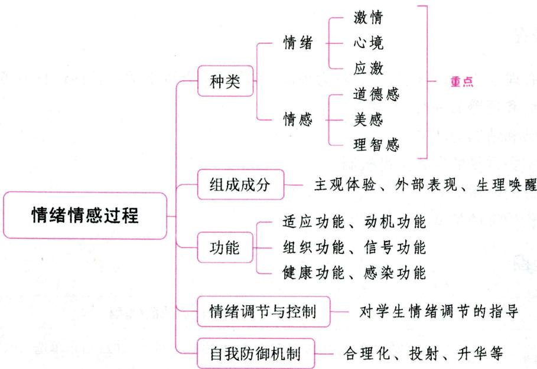

# 一、情绪与情感

# 考点 情绪和情感的概念及关系

# 1.情绪、情感的概念

情绪和情感是人对客观事物的态度体验及相应的行为反应。认知是情绪和情感产生的基础，需要是引发情绪和情感的中介。那些满足人们需要的事物和对象，能引起各种肯定的态度，使人产生满意、愉快的情绪体验。不同的态度体验反映着客观事物与人的需要之间的不同关系，体验是情绪和情感的基本特征。

# 2.情绪和情感的关系

表 2-17 情绪和情感的关系  

<table><tr><td>关系</td><td>情绪</td><td>情感</td></tr><tr><td rowspan="3">区别</td><td>原始的、低级的，与生理需要是否满足相联系</td><td>后继的、高级的，与社会需要是否满足相联系</td></tr><tr><td>具有情境性和易变性</td><td>具有稳定性和持久性</td></tr><tr><td>带有冲动性，伴随明显的外部表现</td><td>比较内隐，较为深沉</td></tr><tr><td>联系</td><td colspan="2">(1)情绪是情感的基础，情感离不开情绪。人的情感是在大量情绪体验的基础上形成和发展起来的，也是通过情 绪表达出来的。(2)对人类而言，情绪离不开情感。情绪是情感的外在表现，情感是情绪的本质内容</td></tr></table>

考点2 情绪和情感的种类 ★★ 【单选、多选、填空、判断】

# 1. 情绪的分类

从生物进化的角度来看, 人的情绪可分为基本情绪和复合情绪; 根据主体与客体之间关系的不同, 心理学家把人的基本情绪分为快乐、悲哀、愤怒、恐惧四种类型; 依据情绪发生的强度、持续性和紧张度的不同, 可以把情绪状态划分为激情、心境、应激三种。接下来主要讲一下激情、心境和应激。

(1)激情

激情是一种爆发式的、猛烈而持续时间短暂的情绪状态。例如,狂喜、暴怒、恐惧、绝望等,都是激情的表现。它往往带有特定的指向性和较明显的外部行为表现,如暴跳如雷、浑身战栗、手舞足蹈等。

激情发生时，意识范围缩小，意识对行为的控制作用明显降低，理解力降低，判断力减弱，易感情用事，不考虑后果。有人用激情爆发来原谅自己的错误，认为“激情时完全失去理智，自己无法控制”，这种说法是不对的，人能够意识到自己的激情状态，也能够有意识地调节和控制它。

(2)心境

心境是一种微弱的、持续时间较长的，带有弥漫性的情绪状态。心境一经产生就不只表现在某一特定对象上，而是在相当长的一段时间内，使人的整个心理活动都染上某种情绪色彩，影响人的整个行为表现，成为情绪生活的背景。“忧者见之则忧，喜者见之则喜”说的就是心境。

良好的心境有助于积极性的发挥，提高工作与学习的效率，促进坚强意志品质的培养；不良的心境会妨碍工作和学习，影响身心健康。因此，培养良好的心境是人的个性修养的重要组成部分。

(3)应激

应激是出乎意料的紧迫情况所引起的急速而高度紧张的情绪状态。当人们遇到突然出现的事件或意外发生危险时,为了应付瞬息万变的紧急情况,就得果断地采取决定,迅速地做出反应。应激正是在这种情境中产生的内心体验。

应激状态既有积极的作用,也有消极的作用。一般的应激状态是一种行为保护机制,能使机体具有特殊防御、排险机能,使人更加机智勇敢,集中全身精力以应付危急局面,急中生智,摆脱困境。应激状态持续的时间也不可过长,否则,会有害健康。

  
激情

  
心境

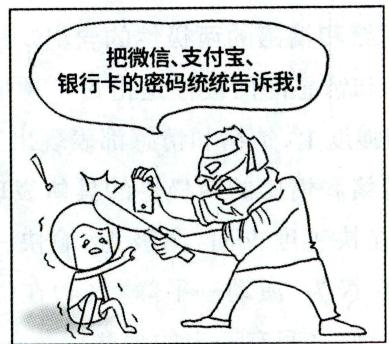  
应激

真题1 [2023安徽蚌埠，单选]取得重大成功后的狂喜，惨遭失败后的绝望，这都体现了情绪状态中的（ ）

A. 心境

B. 激情

C. 应激

D. 热情

答案：B

# 2.情感的分类

情感是同人的社会性需要相联系的态度体验，是人类所特有的心理活动，具有一定的社会历史性。从情感的社会内容角度来看，人类的社会性情感有道德感、美感和理智感三种形式。

# (1)道德感

道德感是根据一定的道德标准评价人的思想、意图和言行时所产生的主观体验。它表现在对待国家、集体、工作、事业、学习以及人与人之间的关系等各个方面，如爱国主义情感、集体主义情感、责任感、义务感、事业心、荣誉感、自尊心等。

# (2)美感

美感是人们根据一定的审美标准对自然或社会现象及其在艺术上的表现予以评价时所产生的情感体验。美感能使人产生愉悦的体验，增加人的生活情趣，帮助人们以审美标准去赞美、宣扬美好的事物与心灵，蔑视、鞭挞丑陋与粗野的言语和行为，从而促进人类文明的发展。道德感和美感都具有社会历史制约性。

# (3)理智感

理智感是人认识事物和探求真理的需要是否得到满足而产生的主观体验。例如, 人们在探求未知的事物时所表现出的求知欲、兴趣和好奇心; 发现问题的惊奇感; 问题解决的喜悦感; 为真理献身的自豪感; 问题不解的苦闷感; 对判断证据不足时的不安感; 对偏见、迷信、谬误的憎恨; 对错失良机的惋惜等。

真题2 [2023广东深圳，单选]初中生的爱国主义情感属于（）

A. 道德感

B. 理智感

C. 美感

D. 心境

真题3 [2024浙江嘉兴，填空]情感是一种主观体验，可分为 和美感。

真题4 [2024河北石家庄，判断]许多高中学生在成功解答物理难题后，产生的愉悦感属于理智感。（）

A. 正确

B. 错误

答案：2.A 3.道德感理智感4.A

# 考点 3 情绪和情感的两极性

# 1. 情绪和情感的两极性的含义

情绪和情感的两极性是指每一种情绪和情感都能找到与之对立的情绪和情感。在快感度、紧张度、激动度和强度上，情绪和情感都表现出互相对立的两极。这种两极性是情绪和情感的主要特征之一。

# 2. 情绪和情感的两极性的具体表现

(1)在快感度方面，两极为“愉快一不愉快”；(2)在紧张度方面，两极为“紧张一轻松”；(3)在激动度方面，两极为“激动一平静”；(4)在强度方面，两极为“强一弱”。情绪和情感的两极并不是绝对相互排斥的，它们之间有一定的关联。每一方面的两极也不是绝对不可相互转化的，如“乐极生悲”“破涕为笑”“喜极而泣”等成语，都反映了这种变化。

# 考点4 情绪和情感的组成成分 ★【填空】

情绪和情感是由独特的主观体验、外部表现和生理唤醒三种成分组成的。

(1)主观体验是个体对不同情绪状态的自我感受。每种情绪和情感都有不同的主观体验,代表不

同的感受。例如：在考试前，人会感到焦虑不安；在成功时，人会感到兴奋愉悦。

(2)情绪和情感的外部表现，通常称为表情。它是情绪和情感状态发生时身体各部分的动作量化形式，包括面部表情、姿态表情和语调表情，其中面部表情是鉴别情绪的主要标志。人的表情多是后天获得的，并受一定社会文化、风俗习惯的影响。

(3)一定的情绪状态总伴有内脏器官、内分泌腺或神经系统的生理变化，情绪状态产生时的生理反应称为生理唤醒。不同的情绪、情感的生理唤醒模式不同，如满意、愉快时心跳节律正常；恐惧、害怕时会心跳加速、血压升高、脸色发白等。

真题5 [2024福建统考，填空]情绪是由独特的主观体验、________和外部表现三种成分组成。

答案：生理唤醒

考点5 情绪和情感的功能 ★★ 【单选、判断】

# 1. 适应功能

情绪和情感是有机体适应生存和发展的一种重要方式，如动物遇到危险时，产生惧怕的呼救，就是动物求生的一种手段。

# 2. 动机功能

情绪和情感是动机的源泉之一，是动机系统的一个基本成分。它能够激励人的活动，提高人的活动效率。适度的情绪兴奋，可以使身心处于活动的最佳状态，推动人们有效地完成任务。研究表明，适度的紧张和焦虑能促使人积极地思考和解决问题。同时，情绪对于生理内驱力也具有放大信号的作用，成为驱使人们行为的强大动力。

# 3. 组织功能

情绪和情感这种特殊的心理活动，对其他心理过程而言是一种监测系统，是心理活动的组织者。积极的情绪和情感具有调节和组织作用；消极的情绪和情感则具有干扰、破坏作用。情绪和情感的组织作用表现在促成知觉选择，监视信息的移动，影响工作记忆，影响思维活动和人的行为表现等方面。

# 4. 信号功能

情绪和情感在人际间具有传递信息, 沟通思想的功能。情绪和情感的信号功能体现在个体将自己的愿望、要求、观点、态度通过一定的情感表达方式传递给别人并加以影响。这种功能是通过表情实现的。它是非言语沟通的重要组成部分, 在人与人之间的信息交流中具有信号意义。例如: 点头微笑表示赞赏; 摇头皱眉表示否定。这些信号常常起激励或抑制作用, 使人们对事物的认识或态度更加鲜明、生动、外显, 更容易被感知和接受。在社会交往方面, 情感的这种功能也常常得到应用和体现。

# 5. 健康功能

人对社会的适应是通过调节情绪来进行的，情绪调控的好坏会直接影响到身心健康。情绪和情感的健康功能表现为积极的情绪有助于身心健康，消极的情绪会引起人的各种疾病。积极而正常的情绪体验是保持心理平衡与身体健康的条件。曾有人说过：“一个小丑进城胜过一打医生。”这就非常形象地说明了情绪对人身体健康的影响。

# 6.感染功能

人类的情绪和情感可以互相传递和感受，具有感染性。人们之间的感情沟通正是通过情绪和情感的易感性功能才得以实现的。这种易感性，具体体现为“共鸣”和“移情”作用。共鸣是指某人已经发生

的情绪和情感引起他人相同或相似的情绪和情感，是指情绪和情感的互通现象，如所谓“掬一把同情泪”。移情是个人将自己的内心感受赋予他人或物，如“爱屋及鸟”。个体对各种信息意义的鉴别与认定，通常通过共鸣和移情来进行。

此外，情绪和情感还具有强化功能、迁移功能、疏导功能和协调功能。

# 小香课堂

考生容易混淆情绪的组织功能和动机功能。二者有共同之处，都能起到激励促进作用，但在表现形式上存在差异。组织功能针对现有的情绪状态，强调良好的情绪起推动作用，不良的情绪起阻碍作用。动机功能的激励作用体现在动力方面，可以从无到有地引发人们的行动。

真题6 [2023山东枣庄，单选]所谓“热爱是最好的老师”，是因为热爱会让人主动、自觉地进行探索和学习，这体现了情绪的（）

A. 动机功能

B. 迁移功能

C. 适应功能

D. 感染功能

答案：A

# 二、情绪的调节与控制

# 考点1

# 情绪与身心健康的关系 ★ 【判断】

积极的情绪状态可以使学生的大脑处于最佳活动状态，保证体内各器官系统的活动协调一致，使得学生食欲旺盛，睡眠安稳，精力充沛，充分发挥有机体的潜能，从而提高其脑力劳动的效率；积极的情绪能使整个机体的免疫系统和体内化学物质处于平衡状态，从而增强对疾病的抵抗力；积极的情绪状态还能帮助学生建立良好的人际关系。

相反，消极情绪则对人的身心健康产生不良的影响。当有机体处于消极情绪状态时，会缩小意识范围，不能正确评价自己行动的意义及后果，自制力降低；消极的情绪状态能使人失去心理上的平衡，致使身体虚弱，感情脆弱；如果人经常处于极度消极的情绪状态中，可能会导致身心疾病，经常性的情绪障碍还会使人出现焦虑、抑郁、躁狂等心理疾患。

真题7 [2024江苏南通, 判断]“人逢喜事精神爽”, 说明情绪对人的言行总是起着积极的作用。( )

答案：×

# 考点2

# 对学生情绪调节的指导

# 1. 教会学生形成适宜的情绪状态

教会学生调节情绪的紧张度，就要使他们学会按自己的意愿形成适宜的情绪状态。比如：有人用座右铭“忍”字来时刻告诫自己不要感情用事，以防止或缓和激动的情绪；沮丧时，想一想过去愉快的情境，消极的情绪也能得到一些缓解。

# 2. 丰富学生的情绪体验

学生的不适宜情绪，往往是由缺乏一定的情绪体验引起的。学生考试、公开发言都容易引起情绪波动，这是临场经验不足造成的。教师应给学生创造一种过渡性情境，即从不紧张到较为紧张，最后再到更高一级的紧张环境，使学生积累各种情境下的情绪体验。

# 3. 引导学生正确看待问题（调整认知）

由于学生分析问题的能力还不完善，对一个问题往往只从一个角度解释，所以容易遭受挫折。有很多不良情绪是由对客观事物和主观自我不正确的认知评价引起的，如一次考试失败，就认为自己一无是处，还觉得周围的人都用异样的眼光看自己，结果就痛苦、失望、自暴自弃。教师应该指导学生从多个角度看待问题，以发现问题的积极意义，从而产生健康的情绪。多角度、多侧面地帮助学生提高认识，有助于学生的情绪情感向正确的方向发展。

# 4. 教会学生情绪调节的方法

(1)认知调节法。学生不良情绪的产生主要是因为自我意识的发展不够成熟。当学生发现自己有负性情绪时，可以通过两种方式来认识自己：①思考自己的感觉是怎么产生的；②分析这种感觉是否是由自己的想法或解释造成的，和自己的个性、习惯又有哪些联系。  
(2)合理宣泄法（自我排解）。当人受到不良刺激而产生消极情绪时，应让不良情绪充分得以宣泄，通过合理的宣泄来减轻心理负担，恢复心理平静。宣泄可以采用适当的方式，如找亲朋好友倾吐不愉快的事；大哭一场或自言自语，以发泄心中的委屈和不满等。宣泄必须合理、适当，否则，可能导致消极后果。  
(3)意志调节法。意志调节法也称升华作用。具体内容参见本节中“自我防御机制”。   
(4)转移注意法。当人受到刺激产生不良情绪时，应尽可能离开不良刺激的环境，把注意力转移到新环境和新事物上去，避免不良情绪的蔓延和加重。  
(5)幽默法。具体内容参见本节中“自我防御机制”。

# 5. 通过实际锻炼提高学生的情绪调节能力

在日常生活学习中，教师要不断鼓励学生克服不良情绪状态，养成积极乐观的心理品质。同时注意创设情境，让学生体验不良情绪的困扰，而找到合理宣泄的渠道，这也有助于增强其心理抗压力。

# 三、自我防御机制 ★★ 【单选、判断、简答】

自我防御机制为弗洛伊德创立的精神分析学派中的专业用语，它是指个人在精神受干扰时用以避开干扰、保持心理平衡的心理机制。自我防御机制常在无意识状态下使用，常见的自我防御机制有：

表 2-18 常见的自我防御机制  

<table><tr><td>常见类别</td><td>定义</td><td colspan="2">典例</td></tr><tr><td>否认</td><td>对某种痛苦的现实无意识地加以否定</td><td colspan="2">“掩耳盗铃”“眼不见为净”</td></tr><tr><td>压抑</td><td>把意识所不能接受的观念、情感或冲动抑制到无意识中去</td><td colspan="2">对痛苦体验或创伤性事件的选择性遗忘</td></tr><tr><td>合理化(文饰作用)</td><td>通过无意识地用一种似乎有理的解释或实际上站不住脚的理由来为其难以接受的情感、行为或动机辩护以使其可以接受</td><td>酸葡萄心理、甜柠檬心理</td><td rowspan="3">合理化、移置、投射</td></tr><tr><td>移置(转移)</td><td>无意识地将指向某一对象的情绪、意图或幻想转移到另一个对象或替代的象征物上,以减轻精神负担,取得心理安宁</td><td>踢猫效应</td></tr><tr><td>投射</td><td>自我将不能接受的冲动、欲望或观念归因(投射)于客观或别人</td><td>“以小人之心,度君子之腹”</td></tr><tr><td>常见类别</td><td>定义</td><td>典例</td></tr><tr><td>反向形成</td><td>对内心的一种难以接受的观念或情感以相反的态度与行为表现出来</td><td>一个有强烈的性冲动压抑的人可能积极参与检查淫秽读物或影片的活动</td></tr><tr><td>退行</td><td>一个人遇到困难的时候放弃已学到的比较成熟的应对技巧和方式,而使用原先比较幼稚的方式去应付困难和满足自己的欲望</td><td>老人做出幼稚的表现,童心未泯,像个“老小孩”或“老顽童”,很可能是内心孤独,渴望得到子女的关爱</td></tr><tr><td>过度代偿(过度补偿)</td><td>一个真正的或幻想的躯体或心理缺陷可通过代偿而得到超乎寻常的纠正</td><td>有些残疾人可通过惊人的努力而变成世界著名的运动员;有些口吃者可成功地变成一位说话流利的演说家</td></tr><tr><td>补偿</td><td>通过新的满足来弥补原有欲望达不到的痛苦</td><td>学习成绩平平,但体育成绩突出,或因有其他特长,而使自己能够得到满足</td></tr><tr><td>抵消</td><td>对一个不能接受的行为象征性地、反复地用相反的行为加以显示,以图解除焦虑</td><td>除夕打碎了碗,习俗上说句“岁岁平安”</td></tr><tr><td>升华</td><td>把社会所不能接受的性欲或攻击性冲动所伴有的力比多能量转向更高级的、社会所能接受的目标或渠道,进行各种创造性的活动</td><td>一个在感情上受到挫折的人,把全部精力转移到事业上,并取得了很大的成功</td></tr><tr><td>幽默</td><td>对于困境以幽默的方式处理,它没有个人的不适,也没有不快地影响别人情感的公开显露</td><td>被嘲笑个子矮,一句“浓缩就是精华”就化解了尴尬</td></tr></table>

在一般情况下，自我防御机制如果使用得当，可以免除内心的痛苦以适应现实。但在特殊情况下，自我防御机制使用不当时，虽然感觉不到冲突和挫折引起的内心焦虑，但这些冲突和挫折却能以症状的形式表现出来，从而形成各种障碍。

真题8 [2023内蒙古巴彦淖尔，单选]有些人把自己的不当行为、失误转嫁到他人身上，或把自己不能接受的欲望归结他人，这种心理防御机制被称为（）

A.否认

B. 幻想

C. 压抑

D. 投射

真题9 [2024河北石家庄，判断]有的家长经常打骂孩子，却宣称“玉不琢不成器，树不伐不成材”。家长的这种心理防御机制是抵消。（）

A. 正确

B. 错误

答案：8.D 9.B

# 四、中小学生情绪、情感的发展 ★【单选】

# 考点1 小学生情绪、情感的发展

(1)情感体验的内容日益丰富。主要表现在：①多样化的活动丰富了小学儿童的情绪、情感。②小学儿童的情感进一步分化。由于知识经验的积累，小学儿童的情感分化逐渐精细。以笑为例，小学儿

童除了会微笑、大笑外，还会羞涩地笑、嘲笑、冷笑、苦笑、狂笑等。③小学儿童情感的表现手段更为丰富。

(2)情感表现的深刻性逐步增加。  
(3)友谊感逐渐发展。  
(4)情感的动力特征明显。  
(5)高级情感得到进一步发展。直到入学以后，儿童的各种高级情感才真正发展起来，逐渐形成比较稳定而深刻的道德感、理智感和美感。这是小学生情感发展的最重要的特征。  
(6)情绪、情感的稳定性明显增强。小学生的情绪、情感逐步从冲动性、易变性向平衡性、稳定性方向发展。一般来讲,小学三年级是这种转变的转折点。  
(7)情绪、情感的自控力不断增强。

# 考点2 中学生情绪、情感的发展

# 1. 中学生情绪的发展

# (1) 初生情绪的发展

在初中生的情绪表现中，充分体现出半成熟、半幼稚的矛盾性特点。随着初中生心理能力的发展和生活经验的扩大，其情绪的感受和表现形式不再像以往那么单一，但还远不如成人的情绪体验那么稳定，表现出明确的两面性。主要表现在三个方面：①强烈、狂暴性与温和、细腻性共存；②可变性和固执性共存；③内向性和表现性共存。

# (2)高中生情绪的发展

由于高中生认知能力、意识水平的提高，其情绪体验呈现如下特点：

①情绪的延续性。在初中阶段，学生的情绪具有易感性、易表现性，情绪活动延续的时间较短。但到了高中阶段，学生情绪爆发的频率降低，心境的延续时间加长，情绪的自控能力提高，并且情绪体验的时限延长、稳定度提高。  
②情绪的丰富性。高中生正处于情绪多变的年龄阶段，几乎人类所具有的情绪种类都可以在高中生身上找到。另外，在情绪体验的内容上比较丰富，各类情绪的强度不一，有不同的层次。  
③情绪的特异性。高中生自我意识的迅速发展，为他们的情绪体验增添了不同感知的能力，这里面包含个性的差异、自我感知的差异、性别的差异等。  
④情绪体验的深刻性。相同的情绪，发生在高中生身上时，他们对这种情绪体验的深刻性要显著地大于初中生和小学生。  
⑤情绪体验的细腻性。高中生能够觉察到他人非常细小的情绪变化，能够对差别很小的情绪产生不同的体验。这种情绪体验的细腻性，女生要强于男生。

# 2. 中学生情感的发展

(1)情感丰富多彩、富有朝气。(2)情感两极性明显。(3)情感不断深刻。(4)情感逐渐稳定。中学生的情感尽管两极性明显，但还是逐渐趋于稳定，主要表现在三个方面：①对情感的自我调节和控制能力逐渐提高；②逐步带有文饰性、内隐性、曲折性的性质；③情感的倾向性正在定型化。(5)情感的外露和表达已趋于理性化。

# ★本节核心考点回顾 ★

# 1.情绪的分类

(1)激情：爆发式的、猛烈而持续时间短暂的情绪状态。  
(2)心境：微弱的、持续时间较长的，带有弥漫性的情绪状态。  
(3)应激：出乎意料的紧迫情况所引起的急速而高度紧张的情绪状态。

# 2.情感的分类

(1)道德感：根据一定的道德标准评价人的思想、意图和言行时所产生的主观体验。  
(2)美感：人们根据一定的审美标准对自然或社会现象及其在艺术上的表现予以评价时所产生的情感体验。  
(3)理智感：人认识事物和探求真理的需要是否得到满足而产生的主观体验。

# 3.情绪和情感的功能

(1) 动机功能：激励人的活动，提高人的活动效率。  
(2)组织功能：积极的情绪和情感具有调节和组织作用；消极的情绪和情感则具有干扰、破坏作用。  
(3)信号功能：传递信息，沟通思想。这种功能通过表情实现

# 4. 常见的自我防御机制

(1)合理化：通过无意识地用一种似乎有理的解释或实际上站不住脚的理由来为其难以接受的情感、行为或动机辩护以使其可以接受。  
(2)投射：自我将不能接受的冲动、欲望或观念归因（投射）于客观或别人。  
(3)退行: 一个人遇到困难的时候放弃已学到的比较成熟的应对技巧和方式, 而使用原先比较幼稚的方式去应付困难和满足自己的欲望。

# 第二节 意志过程

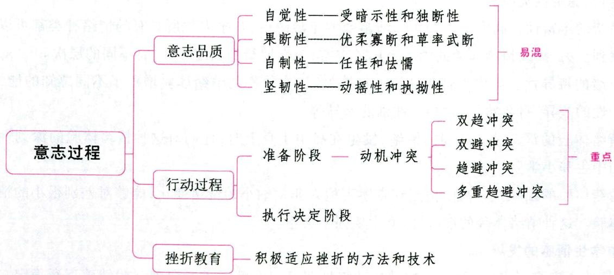

# 一、意志概述

# 考点1 意志的概念和意志行动的特征 ★【单选】

意志是指人自觉地确定目的,有意识地根据目的、动机调节支配行动,努力克服困难,实现目标的

心理过程。意志是意识的能动作用，只有人才有意志活动。它是人的心理的主观能动性、积极性的集中体现。由意志支配的行动称为意志行动。

意志行动的特征表现为：(1)意志行动是人特有的自觉确定目的的行动。(2)意志对活动有调节支配作用，使人的行动能按设定好的目的去改造世界。(3)克服内部和外部的困难是意志行动最重要的特征。(4)意志行动以随意动作为基础。

真题1 [2022贵州贵阳，单选]人对客观事物不仅要感受它，认识它，同时还要处理它并改造它，（）过程体现的是个体自觉地确定目的，并根据目的调节支配自身的行动，克服困难去实现预定目标的心理过程。

A. 意志

B. 情绪

C. 情感

D. 思维

答案：A

考点2 意志的品质 ★★★ 【单选、多选、判断、简答】

表 2-19 意志的品质  

<table><tr><td>品质</td><td>含义</td><td>相反的意志品质及其表现</td></tr><tr><td rowspan="2">自觉性</td><td rowspan="2">一个人清晰地意识到自己行动的目的和意义,并且能够主动地支配自己的行动,使之符合既定目的的意志品质</td><td>受暗示性(盲从):不了解自己行动的意义,极易在别人的怂恿下从事不符合个人意愿或社会需要的行动</td></tr><tr><td>独断性:对自己的决定自信不疑,一概拒绝他人的意见或建议</td></tr><tr><td rowspan="2">果断性</td><td rowspan="2">一种善于辨明是非、抓住时机、迅速而合理地采取决定并执行决定的意志品质</td><td>优柔寡断:犹豫不决,疑虑重重,该断不断,其结果常常是错失良机</td></tr><tr><td>草率武断:懒于思考,妄下结论,行动鲁莽,轻举妄动</td></tr><tr><td rowspan="2">自制性</td><td rowspan="2">一个人善于控制和支配自己的情绪,约束自己言行的品质</td><td>任性:更多以自我为中心,易冲动,意气用事,自我约束能力较差,不能有效地调节自己的言论和行动,行为更多地由情绪所控制,更不容易控制自己的情绪</td></tr><tr><td>怯懦:胆小怕事,缺乏自制力,不能有效调节自己的行为,特别是在遇到困难或情况突变时惊慌失措、畏缩不前,不能有效实施意志行为</td></tr><tr><td rowspan="2">坚韧性(坚持性)</td><td rowspan="2">一个人在行动中坚持决定,百折不挠地克服重重困难去达到行动目的的品质。坚持是对行动目的的坚持</td><td>动摇性:或缺乏坚定的行动目的,对既定目的持怀疑态度,或对实现目的缺乏信心和决心</td></tr><tr><td>执拗性:不能根据形势的变化而灵活调整自己的思想行为;他们常常在明知自己的主张和观点错误时,仍然固执己见,违背客观规律而一意孤行</td></tr></table>

注：(1)具有果断性品质的人善于审时度势，对问题情境做出正确的分析和判断，洞察问题的是非真伪。(2)具有良好自制性品质的人，一方面善于控制自己去执行所采取的决定，具有较强的组织性和纪律性；另一方面又善于控制自己的困惑、恐惧、慌张、厌倦和懒惰等消极情绪，表现出较强的忍耐性。

# 记忆有妙招·

为方便考生记忆，编者将意志品质的辨析总结成以下口诀：

强调主动选自觉，约束自己是自制，犹豫不决缺果断，坚持不懈是坚韧。

真题2 [2024福建统考，单选]个体行动中具有明确的目的，能认识行动的社会意义，并能主动支配和调节自己的行动以服从社会要求的意志品质是（）

A. 自觉性

B. 果断性

C. 坚韧性

D. 自制性

真题3 [2022天津北辰，单选]张同学爱冲动，意气用事，喜欢由着自己的性子来，这表明他缺乏意志的（）

A. 自觉性

B. 果断性

C. 坚韧性

D. 自制性

真题4 [2024安徽统考，判断]“百折不挠”体现了意志品质的自制性。（）

答案：2.A 3.D 4.X

# 二、意志行动的过程

# 考点1 准备阶段（采取决定阶段/确定决定阶段）

准备阶段包括动机冲突、确定目标、选择行动方法和制订行动计划等环节。

# 1. 动机冲突 ★★★ 【单选、多选、判断】

人的行动是由一定的动机所引起的，并指向一定的对象。人的行为动机往往以愿望的形式表现出来，由于人的需要多种多样并且是不断发展的，所以在同一时间内往往存在多种动机。几种动机相互矛盾，就形成了动机冲突。从形式上看，可将动机冲突分为四类：

  
动机冲突

表 2-20 动机冲突  

<table><tr><td>分类</td><td>定义</td><td>典例</td></tr><tr><td>双趋冲突</td><td>从自己同时都很喜爱的两个事物中仅择其一的心理状态</td><td>鱼和熊掌不可兼得</td></tr><tr><td>双避冲突</td><td>从希望回避的两种事物中必取其一的心理状态</td><td>既不想学习,也不想考试不及格</td></tr><tr><td>趋避冲突</td><td>对同一目的兼具好恶的矛盾心理</td><td>既想当班干部又怕耽误时间影响学习</td></tr><tr><td>多重趋避冲突</td><td>对含有吸引与排斥两种力量的多种目标予以选择时所发生的冲突</td><td>大学毕业生就业中的选择困难</td></tr></table>

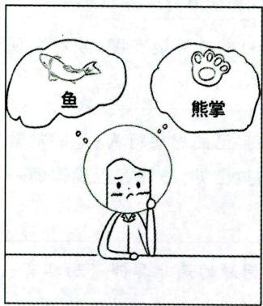  
双趋冲突

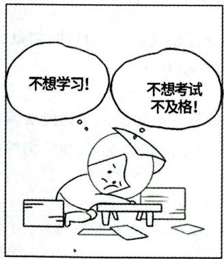  
双避冲突

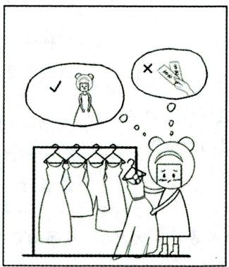  
趋避冲突

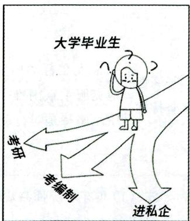  
多重趋避冲突

# 小香课堂·

动机冲突常结合实例进行考查，通常可以根据题意，运用以下关键词组进行理解。

双趋冲突：表述中含有“既想……又想……（不可兼得）”的含义；

双避冲突：表述中含有“既怕……又怕……”的含义；

趋避冲突：表述中含有“既想……又怕……”的含义；

多重趋避冲突：表述中的冲突因素为两个以上。

真题5 [2023广东深圳,单选]大学毕业生择业时面临许多复杂的选择，这属于（）

A. 双避冲突

B. 双趋冲突

C. 趋避冲突

D. 多重趋避冲突

真题6 [2023江苏徐州，单选]美食节到了，可是刘女士很纠结，她很想品尝美食，但又担心身体发胖，这种心理属于（）

A. 双趋冲突

B. 趋避冲突

C. 双避冲突

D. 多重趋避冲突

真题7 [2023广西贵港，单选]某学生平时放学回家后，吃晚饭前既想看电视又想做作业，这种心态属于（）

A. 双趋冲突

B. 双避冲突

C. 趋避冲突

D. 单趋冲突

答案：5.D 6.B 7.A

# 2. 确定目标

目标的确定与动机的取舍是相随而行的。目标越明确，人的行动越自觉；目标越远大，它对行动的动力作用越大；目标越深刻，由此目标所唤起的意志力也越大。

# 3. 选择行动方法和制订行动计划

目标确定之后，必须考虑如何实现目标。为了实现目标，必须选择适宜的行动方法和制订合理的行动计划。

# 考点2 执行决定阶段

行动计划制订后，执行计划，采取有效的行动，是达到目的的关键步骤。执行决定阶段是意志行动的中心环节，是意志努力的集中表现。在执行决定的过程中，必然会碰到许多困难。因此，执行决定，克服困难与障碍，需要更多的意志努力。克服困难必须依赖以下心理条件：

(1)坚定的信念和崇高的世界观是动机的基础，是克服困难最基本的条件。  
(2)行动目的的性质对克服困难有重要意义。  
(3)对行动胜利的美好前景的憧憬，对行动失败可能招致严重后果的认识也会激励人们去战胜困难。  
(4)执行计划的坚定性。

# 三、学生意志品质的发展与培养

# 考点1 中小学生意志品质的发展

# 1.小学生意志品质的发展

(1)自觉性的发展。①小学生意志的自觉性较差。②小学生意志的受暗示性和独断性比自觉性特征明显。  
(2) 果断性的发展。①小学生意志的果断性随着年级的升高而不断发展, 但小学生意志的果断性还是比较差的。②相当一部分小学生表现出优柔寡断和草率武断的特征, 但随着年级的升高, 这两种特征都有下降的趋势。③小学生的果断性品质还很不稳定, 到三年级后达到一个高峰, 随后又迅速呈

下降趋势，直到六年级时才得以改变。

(3) 自制性的发展。①小学生意志的自制性品质随着年级的升高而稳步发展，但总体水平不高。②小学生的行为明显受内外诱因的干扰。  
(4) 坚韧性的发展。小学生意志的坚韧性品质随着年级的升高而迅速发展的。但是，与青少年相比，小学生的坚韧性品质还是比较差的，往往表现出一种冲动性和不稳定性。

# 2. 初中生意志品质的发展

初中生处于身心发展的半幼稚、半成熟期，其意志品质有以下几个特点：

(1)初中生的自觉性品质虽有所提高，但由于认识的局限性，初中生的自觉性和幼稚性仍处在错综矛盾的状态，还不善于正确鉴别意志品质的良莠优劣。  
(2)初中生的果断性品质有所发展,反应快,行动快,他们不喜欢把时间花费在怀疑和犹豫不决上,但又常常把不假思索看成果断行为。他们的意志行动中,轻率和优柔寡断都有表现,但轻率比优柔寡断更为突出。  
(3)初中生的自制能力也有所增强，他们愿意承担艰巨的任务，忍受一定的疼痛和困苦，控制一定的恐慌、惧怕情绪。但他们的自制能力还有限，抗拒诱惑的能力和控制情绪冲动的能力还欠缺，较容易沾染不良习气，行为带有固执的特点。  
(4)初中生意志品质的坚持性、恒心、毅力还很不成熟，容易虎头蛇尾、见异思迁。对短近目标能够在行动中坚持到底，完成任务；对较长目标则不能在行动中善始善终，往往半途而废。

# 3. 高中生意志品质的发展

高中生的意志品质有如下特征：

(1)高中生意志品质的自觉性更加增强，他们对动机、行动目的及其后果的认识更自觉，开始能自觉考虑未来的职业，能自觉遵守纪律，自觉地约束行动。在行动之前能用头脑冷静思考。  
(2)意志行动的独立性更加增强，高中生已经不依靠父母和师长独立地完成各种活动任务。为了培养高中生独立工作的能力，成人对他们应给予指导，但不要包办代替。  
(3)在高中生身上，稳定性的意志品质特征逐渐形成，忍耐性、坚持性、刚毅性、自制力和坚定性都有了巨大发展，开始形成一个人的独特风格。高中生有恒心和毅力，能善始善终完成既定的任务。

总的来说，高中生的意志品质中的自我完善、自我实现、独立自主、自尊的意向已非常强烈，但不完全成熟。在不利的环境影响下，他们可能出现一些易激动、发火、不冷静、缺乏自制的行为；在挫折和失败面前，还易产生动摇、畏难和悲观的情绪。因此，培养高中生的坚强意志品质，不应忽视教育的作用。

# 考点2 意志品质的培养 ★【论述】

(1)加强生活目的性教育，树立科学的世界观、远大的理想和信念，培养学生行为的目的性，减少其行动的盲目性；  
(2)加强养成教育，培养学生的自制能力；  
(3)组织实践活动，在困难环境中锻炼学生的意志，让学生取得意志锻炼的直接经验；  
(4)教育学生正确地对待挫折；  
(5)根据学生意志品质上的差异，采取不同的锻炼措施；  
(6)发挥教师、班集体和榜样的模范作用，给予必要的纪律约束；

(7)加强自我锻炼，从点滴小事做起。

# 四、挫折教育

# 考点1 挫折、挫折感与挫折承受力

挫折是个体在从事有目的的活动的过程中,遇到障碍或干扰,致使个人动机不能实现、需要不能满足时的情绪状态。

挫折感指人对挫折的感觉能力。在现实生活中，人们面对同一挫折情境所产生的挫折感并不完全相同，挫折感的强弱与每个人的动机水平的强弱以及挫折承受力的大小有关。

挫折承受力是指人在遭受挫折时，控制自己、使自己免于行为失常的能力。挫折承受力的大小与挫折感成反向关系。

# 考点2 挫折适应与辅导 ★【单选、多选】

学校心理辅导在对学生进行挫折教育时重点可放在两方面：

# 1. 提高学生挫折承受力的方法

(1)帮助学生树立正确的挫折观。  
(2)帮助学生确定适当的抱负水平。  
(3)适度感受挫折，锻炼挫折承受力。教师和家长可以有意识地提供或利用一些挫折情景，鼓励学生主动地在学习、生活实践中克服困难，战胜挫折，积累经验，不断成熟。

真题8 [2024河北石家庄，多选]为提高学生的挫折承受力，学校心理辅导的重点工作主要有（）

A. 引导学生树立正确的挫折观

B. 让学生体验适度的挫折经历

C. 帮助学生确定适当的抱负水平

D. 鼓励学生积累战胜挫折的经验

答案：ABCD

# 2. 教会学生积极适应挫折的方法和技术

通过训练和有意识的辅导，帮助学生掌握积极适应挫折的方法和技术，使他们学会如何对挫折做出积极主动的适应也是挫折教育不可忽视的内容。常见的积极适应方式有：

(1)理智的压抑。这是一种成熟的适应方式，指当一个人的欲望、冲动或本能因不符合社会规范或要求而无法达到、满足或表现时，有意识地去压抑、控制、想办法延缓其满足需要。比如，一个学生在家做作业，听到电视里正在播放自己最爱看的节目就特别想看电视，可是一想，作业还没有做完，于是，强迫自己集中注意做完作业，然后再看电视，得到满足。  
(2)升华。升华泛指心理欲望从社会不可接受的方向转向社会可接受的方向的过程。当一个人意识到自己的某种欲望无法为自己接受、且与社会规范、伦理道德相悖时，为求得心理平衡，将其净化、提高，成为一种高尚的追求。  
(3) 补偿。补偿指因主、客观原因致使目标不能达到时, 以其他成功的活动来加以弥补。所谓“堤外损失堤内补” “失之东隅, 收之桑榆”便是这种现象。补偿可以消除个人的不适感或自卑感, 降低挫折引起的消极心态, 甚至抵消挫折感。  
(4)幽默。幽默是指个体遇到挫折、处境困难或尴尬时，用一种机智、双关、讽喻、诙谐、自嘲等语

言、动作的良性刺激，来化解困难，以摆脱内心的失衡状态。

(5)合理宣泄。合理宣泄是指通过创设一种情景，使受挫者能自由抒发受压抑的情绪。  
(6)认知重组。主体对挫折情境的认识评价如何,直接影响到挫折感的产生。比如高考落榜是考生产生挫折的情境,如果考生改变对高考落榜严重性的认识,看到上大学并非唯一的成才之路,通过自修下一年再考也不迟,这样就可以减轻挫折感。这种对挫折情境的重新认识与评价,称为认知重组。

# ★ 本节核心考点回顾 ★

# 1.意志的品质

(1) 自觉性: 清晰地意识到行动的目的和意义, 主动支配行动, 相反的意志品质为受暗示性 (盲从) 和独断性。  
(2)果断性：善于辨明是非、抓住时机、迅速而合理地采取决定并执行，相反的意志品质为优柔寡断和草率武断。  
(3)自制性：善于控制和支配情绪，约束言行，相反的意志品质为任性和怯懦。   
(4) 坚韧性: 在行动中坚持决定, 百折不挠地克服重重困难去达到行动目的, 相反的意志品质为动摇性和执拗性。

# 2. 动机冲突的分类

(1)双趋冲突：从同时喜爱的两种事物中仅择其一；  
(2)双避冲突：从希望回避的两种事物中必取其一；  
(3) 趋避冲突: 对同一目的兼具好恶;  
(4)多重趋避冲突：对含有吸引与排斥两种力量的多种目标予以选择时所发生的冲突。

# 第四章 个性心理

# 本章学习指南

# 一、考情概况

本章属于心理学的重点章节，也是考试中重点考查的章节，考生可带着以下学习目标进行备考：

1. 理解动机的种类和功能。  
2. 掌握马斯洛需要层次理论。  
3. 识记并理解不同的智力结构理论及智力测验的标准。  
4. 掌握气质的类型。  
5. 了解性格的结构和影响性格形成与发展的因素。  
6. 理解气质与性格的关系。

# 二、考点地图

<table><tr><td>考点</td><td>年份/地区/题型</td></tr><tr><td>需要层次理论</td><td>2024福建填空;2024浙江判断;2024安徽简答;2024江苏案例分析;2023湖南单选;2023天津单选;2023河南单选、多选;2023河北多选</td></tr><tr><td>卡特尔的智力形态论</td><td>2023辽宁单选;2023天津单选;2023河南单选;2023广东多选;2023浙江判断;2023吉林判断;2022山东单选</td></tr><tr><td>加德纳多元智力理论</td><td>2024广东单选;2024安徽简答;2023山西单选;2023河南多选;2023内蒙古多选;2022辽宁单选</td></tr><tr><td>智力测验的标准</td><td>2024山东单选;2024江苏单选;2024广东判断;2023天津单选;2023山西单选、判断;2022广东单选;2022贵州判断</td></tr><tr><td>气质类型</td><td>2024广东单选;2024山东单选;2024河北判断;2023安徽单选;2023黑龙江单选;2023河南多选;2022天津单选</td></tr><tr><td>性格的结构</td><td>2024福建填空;2023湖北单选;2023河南单选;2023贵州单选;2023安徽单选;2023江苏单选;2023山西单选</td></tr></table>

注：上述表格仅呈现重要考点的相关考情。

# 第一节 需要、动机与兴趣

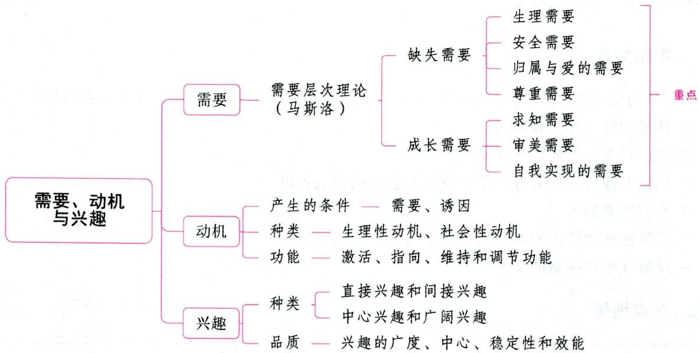

# 一、需要

# 考点1 需要的概念及种类 ★【单选】

# 1.需要的概念

需要是有机体感到某种缺乏或不平衡状态而力求获得满足的心理倾向, 是有机体自身和外部生活条件的要求在头脑中的反映。需要具有对象性、紧张性、层次性等特点, 是活动的原动力, 是个体活动积极性的源泉。

# 2. 需要的种类

表 2-21 需要的种类  

<table><tr><td>分类依据</td><td>类别</td><td>定义</td><td>典例</td></tr><tr><td rowspan="2">需要的起源</td><td>生理性需要
(原发性需要)</td><td>与保持个体的生命安全和种族延续相联系的一些需要</td><td>对饮食、睡眠、性、运动、排泄的需要</td></tr><tr><td>社会性需要</td><td>在生理性需要基础上，在社会实践和教育的影响下发展起来的需要</td><td>对劳动、交往、成就、友谊、尊严、求知、审美、道德等的需要</td></tr><tr><td rowspan="2">需要的对象</td><td>物质需要</td><td>对生存和发展所必需的物质生活的需要</td><td>对与衣、食、住、行有关的物品的需要，以及对劳动工具、生产资料、文化用品、科研用品等的需要</td></tr><tr><td>精神需要</td><td>对社会精神生活及其产品的需求</td><td>对知识、文化艺术的需要</td></tr></table>

# 考点2 马斯洛的需要层次理论 ★★★【单选、多选、填空、判断、简答、案例分析】

马斯洛是美国当代人本主义心理学家。他的需要层次理论是最富有影响力的需要理论。早期，他根据需要出现的先后及强弱顺序，把需要分成了五个层次，即生理需要、安全需要、归属与爱的需要、尊重需

要和自我实现的需要。后来他又补充了求知需要和审美需要，即需要由五个层次扩充为七个层次。

# 1.生理需要

生理需要是人对食物、水分、空气、睡眠、性等的需要。它是人的所有需要中最基本、最原始，也是最强有力的需要，是其他一切需要产生的基础。当一个人为生理需要所控制时，其他一切需要均退居次要地位。

# 2. 安全需要

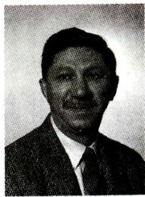  
马斯洛

安全需要是指希求受到保护与免遭威胁从而获得安全感的需要。人在生理需要相对满足的情况下，就会出现安全需要。婴幼儿由于无力应付环境中不安全因素的威胁，他们的安全需要就显得尤为强烈。在成人中，人们希望得到较安全的职位，愿意参加各种保险，都表现了他们的安全需要。

# 3. 归属与爱的需要

归属与爱的需要，也称社交需要，是指每个人都有被他人或群体接纳、爱护、关注、鼓励及支持的需要。它是生理需要和安全需要得到满足之后出现的更高一级的需要，包括被人爱与爱他人、希望交友融洽、保持友谊、和谐人际关系、被团体接纳、成为团体一员、具有归属感等。

# 4. 尊重需要

尊重需要是在生理、安全、归属与爱的需要得到基本满足后产生的对自己社会价值追求的需要，包括自尊和他尊两个方面。自尊是指个人渴求力量、成就、自强、自信和自主等。他尊是指个人希望别人尊重自己，希望自己的工作和才能得到别人的承认、赏识、重视和高度评价，也即希望获得威信、实力、地位等。尊重需要得到满足，就会感受到自信、价值和能力，否则，就会产生自卑或保护性反抗。

# 5. 求知需要

求知需要，又称认知与理解的需要，是指个人对自身和周围世界的探索、理解及解决疑难问题的需要。马斯洛将其看成克服障碍的工具，当认知需要受挫时，其他需要的满足也会受到威胁。

# 6. 审美需要

审美需要是指对对称、秩序、完整结构以及对行为完美的需要。审美需要是与其他需要相互关联，不可截然分开的。如对秩序的需要既是审美需要，也是安全需要、求知需要（如数学、数量方面）。

# 7. 自我实现的需要

自我实现的需要是最高层次的需要,是在上述几种需要得到满足后产生的。所谓“自我实现”,即追求自我理想的实现,是充分发挥个人潜能、才能的心理需要,也是一种创造和自我价值得到体现的需要。

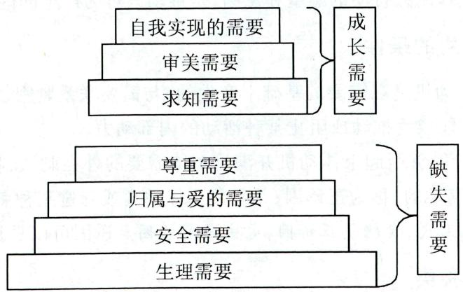  
图2-5 马斯洛需要层次理论

马斯洛对以上七种需要进行了进一步的区分: 位于需要层次底部的四种需要被称为缺失需要, 它们是个体生存所必需的, 必须得到一定程度的满足。但是, 这些需要一旦得到满足, 由此产生的动机就会趋于消失。后三种需要是成长需要, 它们虽不是我们生存所必需的, 但对于我们适应社会来说却有重要的积极意义。也就是说, 缺失需要使我们得以生存, 成长需要使我们能够更好地生活。较低级的需要至少必须部分满足之后才会出现对较高级需要的追求。最占优势的需要将支配一个人的意识和行为, 高级需要出现之后, 低级需要仍然存在, 但对行为的影响减弱了。例如, 在一个非常饥饿的孩子面前同时摆上一堆书和一堆食物, 让其选择其一, 孩子肯定先选食物, 吃饱以后再去选书读。与缺失需要相反, 成长需要是永远得不到完全满足的需要, 因为无论是求知, 还是审美, 都是永无止境的。

# ·记忆有妙招·

为方便考生记忆，编者将马斯洛的需要层次理论总结成以下口诀：

李安蜀中求美食。李：生理需要。安：安全需要。蜀：归属与爱的需要。中：尊重需要。求：求知需要。美：审美需要。食：自我实现的需要。

真题1 [2023湖南长沙, 单选]某学生一直以来在班上受到冷漠对待, 同学们经常孤立他, 导致该生无心学习, 成绩下降。班主任了解情况后, 对班上其他同学进行了教育。其他同学开始转变态度, 主动关心该同学, 该同学感受到班上同学的态度转变后, 学习成绩也逐步提高。推动该学生学习成绩进步的原因是( )的获取。

A. 认知需要

B. 尊重需要

C. 安全需要

D. 归属与爱的需要

真题2 [2024浙江宁波, 判断]根据马斯洛的需要层次理论, 一旦基本生理需要得到满足, 个体就会追求最高层次的自我实现的需要。( )

真题3 [2024安徽统考，简答]简述马斯洛的需要层次理论。

答案：1.D 2. $\times$ 3.详见内文

# 二、动机 ★【单选、填空、判断】

# 考点 1 动机的概念

动机是激发和维持有机体的行动,并使该行动朝向一定目标的心理倾向或内部驱力。动机在需要的基础上产生,可以激起或抑制人行动的愿望和意图,是推动人行为产生的内在原因。

# 考点2 动机产生的条件

(1) 内在条件是需要。动机是在需要的基础上产生的，与需要联系紧密，但它又不同于需要。只有当需要达到一定程度时，才能成为推动或阻止某种活动的内部动力。  
(2)外在条件是诱因。能够引起个体动机并满足个体需要的外在刺激,称为诱因。凡是使个体趋向或接受某种刺激而获得满足的,称为正诱因;凡是使个体逃离或躲避某种刺激而获得满足的,称为负诱因。例如,对于饥饿的人来说,食物是正诱因,电击是负诱因。诱因可以是物质的,也可以是精神的。

# 考点 3 动机的种类

人的动机复杂多样，可以从不同的角度、标准进行分类。根据起源的需要的不同，可将动机分为生

理性动机与社会性动机。

# 1. 生理性动机

生理性动机是与人的生理需要有关的初级的、原发性动机，也称内驱力。

# 2. 社会性动机

社会性动机是与人的心理、社会需要有关的、后天习得的动机，包括两个层次：

(1)比较原始的三种驱动力，即好奇心、探索与操作；  
(2)人类特有的成就动机、学习动机、权力动机和社会交往动机等。其中，权力动机是指人们具有的某种支配和影响他人以及周围环境的内在驱力。交往动机是在交往需要的基础上产生的社会性动机。

# 考点4 动机的功能

# 1. 激活功能

动机是个体能动性的一个主要方面,它具有发动行为的作用,能推动个体产生某种活动,使个体由静止状态转向活动状态。

# 2. 指向功能

动机的指向功能是指在动机的作用下，人的行为将指向某一目标。例如，在学习动机的支配下，人们可能去图书馆或教室。

# 3. 维持和调节功能（强化功能）

动机具有维持功能，它表现为行为的坚持性。动机激发个体的某种活动后，这种活动能否坚持下去，同样要受动机的调节和支配。

# 小香课堂

动机的激活功能和指向功能两者存在不同。(1) 激活: 行为从无到有; (2) 指向: 行为指向具体对象。

真题4 [2022河南安阳, 单选]为了获得优秀的成绩而努力, 为了取得他人的赞扬而勤奋工作, 为了摆脱孤独而结交朋友。这体现了动机的（）

A. 激活功能

B. 指向功能

C. 维持功能

D. 调节功能

答案：A

# 三、兴趣 ★【单选】

# 考点1 兴趣及其种类

# 1. 兴趣的概念

兴趣是人对事物的一种认识倾向，伴随着积极的情绪体验，对个体活动，特别是对个体的认知活动有巨大的推动作用。兴趣具有定向和动力功能。

# 2. 兴趣的种类

(1) 直接兴趣和间接兴趣

兴趣可以分为直接兴趣和间接兴趣两种。直接兴趣是由认识事物本身的需要引起的，如对看电视

视、小说的兴趣；间接兴趣是由认识事物的目的和结果所引起的。例如，科学家可能对繁杂的数据处理没有兴趣，只对研究结果有兴趣，这种兴趣就是间接兴趣。

# (2)中心兴趣和广阔兴趣

从兴趣的广度来看，兴趣可以分为中心兴趣和广阔兴趣两种。中心兴趣是对某一方面的事物或活动有极浓厚而稳定的兴趣；广阔兴趣是对多方面的事物或活动表现出兴趣。中心兴趣和广阔兴趣是相互联系、相互促进的。

# (3)个体兴趣和情境兴趣

兴趣还可以分为个体兴趣和情境兴趣。个体兴趣是指个体长期指向一定客体、活动和知识领域的一种相对稳定的兴趣，如美术是某人一生的爱好。情境兴趣是指由环境中的某一事物突然激发的兴趣，持续时间较短，是一种唤醒状态的兴趣，如某人最近突然对游泳感兴趣。

# 考点2 兴趣的品质

(1)兴趣的广度，是指兴趣的范围大小，即兴趣广泛与否；  
(2)兴趣的中心（兴趣的倾向性或兴趣的针对性），指对某个特定领域的事物形成更浓厚、更强烈的兴趣；  
(3)兴趣的稳定性，指对事物具有持续、稳定的兴趣；  
(4)兴趣的效能，指兴趣能积极推动人的活动，提高活动的效能，即兴趣对认知的推动作用。

# 考点 3 学习兴趣的培养和激发

(1) 通过各种活动发展学生的兴趣；  
(2)通过提高教学水平，引发学生兴趣；  
(3)引导学生将广阔兴趣与中心兴趣结合起来；  
(4)要根据学生的年龄特征来提高学生的学习兴趣；  
(5)根据学生的知识基础培养学生的学习兴趣；  
(6)通过积极的评价使学生的兴趣得以强化；  
(7)充分利用原有兴趣的迁移。

# 本节核心考点回顾

# 1. 马斯洛的需要层次理论

(1)生理需要：人对食物、水分、空气等的需要，是最基本、最原始、最强有力、最低层次的需要。  
(2)安全需要：希求受到保护与免遭威胁。  
(3)归属与爱的需要：被他人或群体接纳、爱护、关注、鼓励及支持的需要。  
(4) 尊重需要: 自尊和受到别人的尊重 (他尊) 的需要。  
(5)求知需要：对自身和周围世界的探索、理解及解决疑难问题的需要。  
(6)审美需要：对对称、秩序、完整结构以及对行为完美的需要。  
(7)自我实现的需要: 充分发挥个人潜能、才能, 创造和自我价值得到体现的需要, 是最高层次的需要。

在这七种需要中，前四种需要被称为缺失需要，后三种需要是成长需要。

# 2. 动机的功能

(1) 激活功能：推动个体产生某种活动，使个体由静止状态转向活动状态。  
(2)指向功能：将行为指向一定的目标。  
(3)维持和调整功能：维持功能表现为行动的坚持性，活动能否坚持要受到动机的调节和支配。

# 第二节 能力

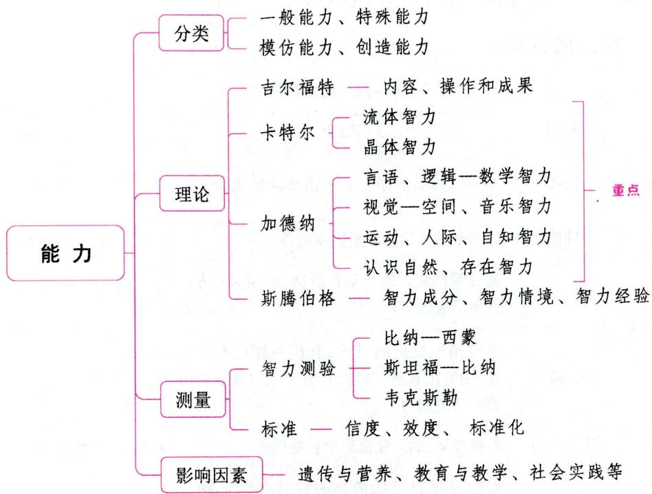

# 一、能力及其类型 ★【单选、多选、填空、辨析】

# 考点1 能力、才能与天才

能力是直接影响人的活动效率，促使活动顺利完成的个性心理特征。它是人顺利完成某项活动的必要的心理条件和直接有效的可能性心理特征，但不是全部心理条件。能力的发展随年龄增长而变化，具有一定的规律性。

从事某种活动必须以一定的能力为前提。几种相关的、结合在一起的能力统称为才能。人的活动比较复杂，不是单独一种能力所能胜任的，常常需要几种相关能力相互配合，才能保证活动顺利地进行。才能的高度发展是天才。

# 考点2 能力与知识、技能的关系

# 1.能力与知识、技能的联系

(1)能力是掌握知识与技能的前提。能力的高低会影响到知识掌握的深浅、难易和技能水平的高低。  
(2)能力是在掌握知识和技能的过程中形成和发展起来的，掌握系统的知识和技能有利于能力的增长和发挥。

(3)从一个人掌握知识和技能的速度和质量上可以看出个人能力的高低。

# 2.能力与知识、技能的区别

(1)能力与知识、技能具有不同的概括水平。知识是对人类社会历史经验的概括和总结，技能是对一系列活动方式的概括，能力是对人在从事某种活动时表现出来的多种心理品质的概括。  
(2)在一个人身上，知识和技能的发展是无止境的，它随着学习进程的不断增多而不断丰富；而能力的发展则有一定的限度。  
(3)知识、技能的掌握和能力的发展是不同步的。知识多了,能力并不一定就高。教师在教学中不仅要向学生传授知识,更要注重培养和发展学生的能力。

# 考点3 能力的分类

表 2-22 能力的分类  

<table><tr><td>分类依据</td><td>类别</td><td>概念</td><td>典例</td></tr><tr><td rowspan="2">能力适应活动范围的大小</td><td>一般能力</td><td>在不同种类活动中表现出来的能力</td><td>观察力、记忆力、抽象概括能力、创造力等</td></tr><tr><td>特殊能力</td><td>从事某种专门活动所需要的能力</td><td>音乐能力、绘画能力等</td></tr><tr><td rowspan="2">从事活动时创造性程度的高低</td><td>模仿能力</td><td>通过观察别人的行动和活动,以相同的方式做出反应的能力</td><td>观察学习</td></tr><tr><td>创造能力</td><td>按照预先设定的目标,利用一切已有的信息,创造出新颖、独特、具有个人或社会价值的产品的能力</td><td>发明、创造</td></tr><tr><td rowspan="3">能力的功能不同</td><td>认知能力</td><td>人脑存储、加工和提取信息的能力</td><td>观察力、记忆力、想象力等</td></tr><tr><td>操作能力</td><td>人们操纵自己的肢体去完成各项活动的能力</td><td>劳动能力、实验操作的能力等</td></tr><tr><td>社交能力</td><td>人们在社会交往活动中所表现出来的能力</td><td>沟通能力、解决纠纷的能力等</td></tr></table>

此外，还有一种分类把能力分为认知能力与元认知能力。

# 二、智力结构理论 ★★★ 【单选、多选、不定项、判断、简答】

目前大家一致认可的智力定义是：智力也即智能，是使人能顺利完成某种活动所必需的各种认知能力的有机结合，它包括观察力、记忆力、注意力、想象力和思维力等成分，以思维力为核心，以创造力为最高表现。智力结构是指智力包含的因素以及各因素之间是怎样结合起来的。关于智力结构问题，心理学家们提出了各自不同的理论观点。

真题1 [2022广西桂林，判断]智力指人们的认知能力，其核心是记忆力。（）

答案：×

# 考点1 斯皮尔曼的二因素论

英国心理学家斯皮尔曼首先提出了智力的二因素论。他认为, 智力包括两种因素: 一般因素 (即 G 因素) 和特殊因素 (即 S 因素)。G 因素代表一个人普遍而概括化的能力, 参与所有的智力活动。每个人

拥有的G因素只有数量高低的差别。一个人智力水平的高低取决于G因素的数量。G因素数量高的人被视为聪明,否则为愚笨。S因素代表一个人的特殊能力,只在某些特殊方面(如绘画、唱歌等)表现出来。S因素参与不同的智力活动,但每种智力活动中主要有一种特定的S因素存在。人在从事任何一项智力活动时都需要有G因素和S因素的共同参与。

# 考点2 吉尔福特的智力三维结构论

美国心理学家吉尔福特提出了智力的三维结构论。他认为，智力是一个由不同方式对不同信息进行加工的各种能力的综合系统，是一个包括内容、操作和成果(产物)的三维结构。内容是指思维的对象，包括视觉、听觉、符号、语义和行为五种。操作是指智力活动的反应方式，包括认知、记忆、发散思维、辐合思维和评价五种。成果是指智力活动的产物，包括单元、类别、关系、系统、转换、寓意六种。每个维度中的任何一项，都可以与其他两个维度中的一项结合构成一种智力因素。因此，形成的智力因素总共有150种 $(5\times 5\times 6)$ ，其中每一种智力因素都是一种特殊的能力。

该理论中，操作代表智力的高低。个人针对引起思考的情境，在行为上表现出思考结果之前，所经过的内在操作历程，即代表个人的智力。操作中的发散思维和辐合思维这两个概念已引起了心理学家们的广泛注意。

真题2 [2022贵州贵阳，单选]美国心理学家吉尔福特创立的智力三维结构模型理论认为，智力结构应从（ ）三个维度去考虑。

A. 记忆、思维、观察

B. 操作、内容、产物

C. 编码、存储、提取

D. 瞬时材料、短时材料、长时材料

答案：B

# 考点 3 卡特尔的智力形态论

美国心理学家卡特尔根据因素分析结果，按心智功能上的差异，将人的智力分为流体智力和晶体智力两种不同的形态。

表 2-23 流体智力与晶体智力  

<table><tr><td>对比角度</td><td>流体智力</td><td>晶体智力</td></tr><tr><td>影响因素</td><td>以生理为基础,受先天遗传因素的影响较大</td><td>以学得的经验为基础,受后天经验的影响较大</td></tr><tr><td>主要表现</td><td>(1)主要表现为对新奇事物的快速辨认、记忆、理解等;(2)需要较少的专业知识,包括理解复杂关系和解决问题的能力,如在处理数字系列、空间视觉感和图形矩阵项目时所需的能力以及推理能力等</td><td>主要表现为运用已有知识和技能去吸收新知识和解决新问题的能力</td></tr><tr><td>与年龄的关系</td><td>与年龄有密切的关系:一般人在20岁以后,流体智力的发展达到顶峰,30岁以后随着年龄的增长而降低</td><td>与年龄没有密切的关系,但个别人可能会因知识经验的累积,晶体智力随着年龄的增长而升高</td></tr><tr><td>与教育文化的关系</td><td>受教育文化的影响较少,可用于文化公平测验</td><td>与教育、文化有关</td></tr></table>

# 小香课堂

考生容易混淆流体智力和晶体智力随年龄变化的特点，可借助以下内容进行理解：

流体智力——“河流”，随着下雨，河流的水量会逐渐增多，到达洪峰后，水量会逐渐消退，即流体智力在20岁后达到顶峰，30岁以后会逐渐降低。

晶体智力——“结晶”，随着时间的推移，越来越大，即晶体智力会随着年龄的增长而升高。

真题3 [2023辽宁锦州, 单选]在生活中, 我们经常会遇到这样的情况, 人上了年纪之后虽说感知觉、记忆、思维能力大不如从前, 但经验多了, 解决问题的能力还是比年轻人要好得多。根据卡特尔对智力的分类, 这种解决问题的能力属于( )

A. 流体智力

B. 抽象智力

C. 晶体智力

D. 多元智力

答案：C

# 考点4 加德纳的多元智力理论

# 1.多元智力理论的主要内容

多元智力理论是由美国心理学家加德纳提出来的。这一新兴的智力理论，在理论取向上，既不采取因素分析法以决定智力的构成因素，也不采用智力测验来鉴别智力的高低。按他的解释，智力是在某种文化环境的价值标准之下，个体用以解决问题与生产创造所需的能力。

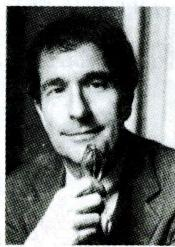  
加德纳

加德纳认为，人的智力结构中存在着七种相对独立的智力（后发展为九种），这几种智力在每个人身上的组合方式是多种多样的，每个人在不同领域的智力发展水平是不同步的。有人可能在某一两个方面是天才，而在其余方面却是蠢材；有人可能每种智力都很一般，但如果他所拥有的各种智力被巧妙地结合在一起，则可能在解决某些问题时会显得很出色。

表 2-24 加德纳的多元智力理论  

<table><tr><td>智力维度</td><td>界定</td><td>典型人群</td></tr><tr><td>言语智力</td><td>说话、阅读、书写的能力。表现为个人能够顺利而高效地利用语言描述事件、表达思想并与人交流的能力，以及对声音、韵律、单词的意义和语言不同功用的敏感能力</td><td>作家、演说家</td></tr><tr><td>逻辑一数学智力</td><td>数学运算与逻辑思考的能力以及科学分析的能力</td><td>数学家</td></tr><tr><td>视觉一空间智力</td><td>认识环境、辨别方向的能力</td><td>画家、雕塑家、建筑师</td></tr><tr><td>音乐智力</td><td>对声音的辨识与韵律表达的能力</td><td>作曲家、乐师、乐评人、歌手及善于感知的观众</td></tr><tr><td>运动智力</td><td>支配肢体以完成精密作业的能力</td><td>出色的舞蹈家、运动员、外科医生</td></tr><tr><td>人际智力(社交智力)</td><td>与人交往并和睦相处的能力。人际智力高者善于处理人际关系,善于与人交往</td><td>推销员、教师、政治家</td></tr><tr><td>自知智力(内省智力)</td><td>认识自己并选择自己生活方向的能力</td><td>神学家、哲学家和心理学家</td></tr><tr><td>认识自然智力(自然观察智能)</td><td>认识自然,并对我们周围环境中的各种事物进行分类的能力</td><td>考古学家、收藏家、农夫及宝石鉴赏家</td></tr><tr><td>存在智力</td><td>陈述、思考有关生与死、身体与心理等问题的倾向性</td><td>可能存在于哲学家和宗教人士身上</td></tr></table>

# 记忆有妙招·

为方便考生记忆，编者将加德纳的多元智力理论类比小学课程表总结成以下口诀：

语文数学体音美，社会自然，思想品德加存在。语文：言语智力。数学：数学智力。体：运动智力。音：音乐智力。美：空间智力。社会：人际智力。自然：认识自然智力。思想品德：自知智力。存在：存在智力。

# 2.多元智力理论与新课程改革

加德纳的多元智力理论对传统的智力观念提出了新的诠释，为我国新课程改革“建立促进学生全面发展的评价体系”提供了有力的理论依据与支持。多元智力理论对我国当前教学改革的启示如下：

(1)积极乐观的学生观。  
(2)科学的智力观。长期以来，学校教育偏重于培养学生的言语智力和逻辑一数学智力，根据多元智力理论，应当把培养学生的多种能力放在同等重要的地位。  
(3)因材施教的教学观。  
(4)多样化人才观和成才观。

真题4 [2022辽宁营口,单选]对声音、节奏、单词的意思较为敏感的学习者,其哪项智力占优势( )

A. 人际智力  
B. 言语智力  
C. 空间智力  
D. 内省智力

真题5 [2024安徽统考，简答]简述加德纳多元智力模型所包含的智力类型。

答案：4.B 5.详见内文

# 考点5 斯腾伯格的智力理论

美国耶鲁大学的心理学家斯腾伯格提出了智力的三元理论。该理论包括智力成分亚理论、智力情境亚理论和智力经验亚理论。

(1) 智力成分亚理论认为, 智力包括三种成分及相应的三种过程, 即元成分、操作成分和知识获得成分。元成分是用于计划、控制和决策的高级执行过程, 如确定问题的性质, 选择解题步骤等; 操作成分表现在任务的执行过程中, 是指接收刺激, 将信息保持在短时记忆中, 并进行比较, 它负责执行元成分的决策; 知识获得成分是指获取和保存新信息的过程, 负责接收新刺激, 做出判断与反应, 以及对新信息的编码与存储。在智力成分中, 元成分起着核心作用, 它决定人们解决问题时所使用的策略。  
(2)智力情境亚理论认为，智力是指获得与情境拟合的心理活动。在日常生活中，智力表现为有目的地适应环境、塑造环境和选择新环境的能力，这些能力统称为情境智力。

(3)智力经验亚理论认为，智力包括两种能力：①处理新任务和新环境时所要求的能力；②信息加工过程自动化的能力。

继提出上述理论之后, 斯腾伯格又提出了成功智力理论。他认为成功智力是为了达到个人、群体的文化目标而去适应、选择和塑造环境的能力, 包括分析性智力、创造性智力和实践性智力三个方面。

(1) 分析性智力是有意识地规定心理活动的方向, 通过分析性思维, 个体试图利用策略来操作问题的要素和要素之间的关系。个体的分析性智力主要体现在知觉、记忆、比较、分析、解释、评价和判断等能力上。  
(2) 创造性智力是一种能超越已知给定的内容，产生新颖有趣结果的能力。个体的创造性智力主要包括想象、假设、构思、创造和发明等能力。  
(3)实践性智力是指在日常生活中将思想及其分析的结果以一种行之有效的方法来加以使用，将理论转化为实践、将抽象思想转化为实际成果的能力。实践性智力体现在个体所表现出来的示范、展现、操作、使用和应用等能力上。

真题6 [2023湖北武汉, 不定项]智力情境亚理论认为, 日常生活中, 智力表现为有目的地( )的能力, 这些能力统称作情境能力。

A. 适应环境  
B.塑造环境  
C. 选择新环境  
D. 终结新环境

答案：ABC

# 三、能力的测量

# 考点1 一般能力测验 ★【单选、填空】

一般能力测验即智力测验。智力测验目前在世界上较为普遍，它能比较系统地测量人的智力水平。主要的智力测验见下表：

表 2-25 智力测验  

<table><tr><td>量表名称</td><td>编制者</td><td>相关概念</td><td>智商计算公式</td></tr><tr><td>比纳—西蒙智力量表(最早:1905)</td><td>比纳、西蒙(法国)</td><td>智龄是以被试能通过哪一年龄组的测验项目来计算的,即通过测验确定儿童的实际智力达到的年龄水平</td><td>用智力年龄来表示智力水平</td></tr><tr><td>斯坦福—比纳量表(最著名)</td><td>推孟(美国)</td><td>用智龄和实际年龄的比率代表的智商,称作比率智商,1960年修订时,改用离差智商</td><td>智商(IQ)=智龄(MA)÷实龄(CA)×100</td></tr><tr><td>韦克斯勒智力量表</td><td>韦克斯勒(美国)</td><td>离差智商:代表一个人的智力水平偏离本年龄组平均水平的方向和程度</td><td>IQ=100+15Z
Z=(X-√X)/SD
Z代表个体的标准分,X表示个体测验得分(原始分数),√X代表相应年龄群体的平均分,SD是群体得分的标准差</td></tr></table>

# 考点2 特殊能力测验和创造力测验

(1)特殊能力测验，是指针对某一种特殊能力所包含的各个方面进行的测量。测量的目的在于了解个体在专业领域的既有水平，并预测个体今后在此专业领域成功的可能性。常见的特殊能力测验主要有音乐能力测验、美术能力测验和机械能力测验等。  
(2)创造力测验。创造力测验发展较晚，从20世纪50年代末期开始编制，主要包括南加利福尼亚大学发散思维测验、托兰斯创造性思维测验和芝加哥大学创造力测验等。其中，托兰斯创造性思维测验主要包括言语的创造性思维测验、图画的创造性思维测验以及声音和词的创造性思维测验三套；芝加哥大学创造力测验共有五项内容：语词联想、用途测验、隐蔽图形、完成寓言、组成问题。目前，创造力测验还主要在实验的形式阶段，主要用于科学研究。

# 考点3 智力测验的标准 ★★ 【单选、多选、填空、判断】

智力测验是标准化的测验，智力测验量表是标准化的测验工具。评定测验质量优劣的主要技术指标如下：

# 1. 信度

信度是指一个测验量表的可靠程度(或可信程度)。它以反复测验时能否提供相同的结果来说明。如果一个人初测时分数很高, 而在复测时分数很低, 说明测验的信度差。信度用信度系数表示, 智力测验的信度一般为0.90。影响信度的因素主要有被试的样本、测验的长度、测验的难度等。

  
信度与效度

# 2. 效度

效度是指一个测验工具希望测到某种行为特征的有效性与准确程度。表示效度的一种方法，是将测量的结果与随后的行为进行对照。如果一种测验能够预测后来的行为，这种测验的效度就高。

测验效度有三个种类，即内容效度、效标效度和结构效度。（1）内容效度，指的是测验题目对有关内容或行为取样的适用性，从而确定测验是否是所欲测量的行为领域的代表性取样。由于这种测验的效度主要与测验内容有关，所以称内容效度。（2）效标效度又称实证效度，反映的是测验预测个体在某种情境下行为表现的有效性程度。被预测的行为是检验效度的标准，简称效标。由于这种效度是看测验对效标预测得如何，所以叫效标效度。这种效度需在实践中检验，所以又称实证效度。（3）结构效度又称构思效度，是指测验能够测量到理论上的构想或特质的程度，即测验的结果是否能证实或解释某一理论的假设、术语或构想，解释的程度如何。三种效度说明的都是测验的正确性，不过是从三个不同的方面来说明而已。

就一个高质量的测验而言, 效度的重要性大于信度。因为一个低效度的测验, 即使具有很好的信度,也不能获得有用的资料。效度通常用效度系数来表示, 智力测验的效度系数多在 $0.3 \sim 0.6$ 之间。

# 小香课堂·

智力测验的几个标准指标常以客观题的形式进行考查，考生需要抓住各自关键词，进行学习。

信度：一致性；效度：有效性、准确性；难度：难易程度；区分度：鉴别力。

# 3. 标准化

标准化是心理测验最基本的要求。标准化的要求表现在多个方面，但主要有四个方面的含义：(1)按

照测验的性质选择具有代表性的测验题目。选择题目时需要考虑项目的难度和区分度。难度指题目的难易程度, 区分度是指该项题目对不同水平的答题者反应的区分程度和鉴别能力。难度适中, 区分度较高。(2) 选择具有代表性的被试, 确定标准化样本。(3) 施测程序标准化。(4) 统计结果, 建立常模。

# 知识再拔高：

# 信度与效度的关系

信度是效度的必要条件,但不是充分条件。一个测量工具要有效度必须有信度,没有信度就没有效度;但是有了信度不一定有效度。信度低,效度不可能高;信度高,效度未必高。例如,如果我们准确地测量出某人的经济收入,也未必能够说明他的消费水平。效度低,信度很可能高。例如,即使一项研究未能说明人口流动的原因,但它很有可能很精确很可靠地调查了各个时期各种类型的人口流动数量。效度高,信度也必然高。

真题7 [2022广东广州, 单选]测验可以定量地评价学生个人的能力, 检查学习效果和教学的完成情况, 要想通过一次测验真实地测出学生的个人能力, 则该测验要具备 ( )

A. 高效度  
B. 低信度  
C. 低难度  
D. 高区分度

真题8 [2022贵州贵阳，判断]当测验信度低时，效度一定低。（）

答案：7.A 8.√

# 四、影响能力（智力）形成与发展的因素 ★【单选、简答】

# 1. 遗传与营养

遗传素质既是智力发展的生物前提, 同时遗传素质也是智力发展的基础和自然条件。有研究发现: 遗传关系越密切, 个体之间的智力越相似。但是, 遗传只为智力发展提供了可能性, 要使智力发展的可能性变成现实性, 还需要社会、家庭与学校教育许多方面的共同作用。

胎儿及婴幼儿的营养状况也会影响智力的发展，这已被许多研究证实。所以，加强孕期及婴儿期营养供给是智力开发不可忽略的因素之一。

# 2. 早期经验

人的智力发展的速度是不均衡的。研究表明，早期阶段获得的经验越多，智力发展得就越迅速，不少人把学龄前称为智力发展的一个关键期。

# 3. 教育与教学

智力不是天生的，教育和教学对智力的发展起着主导作用。教育和教学不仅使儿童获得前人的知识经验，而且促进儿童心理能力的发展。

# 4. 社会实践

人的智力是人在认识和改造客观世界的实践中逐渐发展起来的。社会实践不仅是学习知识的重要途径，也是智力发展的重要基础。

# 5. 主观努力

环境和教育的作用，只能机械、被动地影响智力的发展。如果没有主观努力和个人的勤奋，要想获得事业的成功和智力的发展是根本不可能的。

# 五、学生能力的培养

(1)注重对学生早期能力的培养。

(2)教学中要加强知识与技能的学习与训练。

(3)教学中要针对学生的能力差异因材施教。

(4)在教学中要积极培养学生的元认知能力和创造能力。元认知的训练方法主要有以下三种： $①$ 自我提问法； $②$ 相互提问法； $③$ 知识传授法。

(5)社会实践活动是培养学生能力的基本途径。

(6)要注意培养学生的非智力因素。

# 记忆有妙招

为方便考生记忆，编者将学生能力的培养措施总结成以下口诀：

早期能力要注重；后期教育要加强：三教学，一实践；非智力因素要注意。

# ★本节核心考点回顾 ★

# 1. 卡特尔的智力形态论

(1)流体智力：以生理为基础；20岁以后达到顶峰，30岁以后逐渐降低。  
(2)晶体智力：以学得的经验为基础；个别人可能会因知识经验的累积，随着年龄的增长而升高。

# 2. 加德纳的多元智力理论

(1) 言语智力: 说话、阅读、书写的能力;   
(2)逻辑—数学智力：数字运算、逻辑思考、科学分析的能力；  
(3)视觉—空间智力：认识环境、辨别方向的能力；  
(4)音乐智力：辨识声音、表达韵律的能力；  
(5)运动智力：支配肢体以完成精密作业的能力。

# 3. 智力测验的标准

(1)信度：一个测验量表的可靠程度（或可信程度）；  
(2) 效度: 一个测验工具希望测到某种行为特征的有效性与准确程度;  
(3) 难度: 题目的难易程度;   
(4)区分度：该项题目对不同水平的答题者反应的区分程度和鉴别能力。

# 第三节 气质与性格

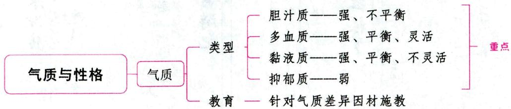

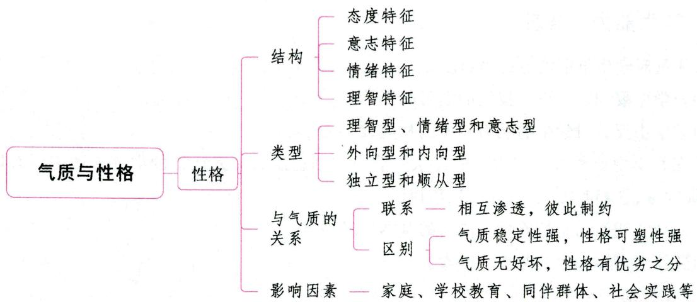

# 一、气质

# 考点1 气质及其类型 ★★★ 【单选、多选、填空、判断、简答】

# 1. 气质的概念

气质是依赖于人的生理素质或身体特点的人格特征。气质是表现在心理活动的强度、速度、灵活性与指向性等方面的一种稳定的心理特征,即我们平时说的脾气、禀性。现代心理学一般认为,气质是不以活动目的和内容为转移的典型的、稳定的心理活动的动力特征。气质有稳定性、可塑性、动力性等特点。

# 2. 气质的类型

气质类型是指在一类人身上共有或相似的心理活动特征的有规律的结合。

# (1) 气质的体液说

古希腊著名医生希波克拉底提出，人体内有四种性质不同的体液：血液、黄胆汁、黑胆汁和黏液。他认为，正是这四种体液“形成了人的性质”。罗马医生盖伦从希波克拉底的体液说出发，加进了人的道德品行，组成了13种气质类型，后来简化为4种气质类型，即多血质、胆汁质、黏液质和抑郁质。每一种气质类型的特点都是某种体液占优势的结果，并有特定的心理表现。

表 2-26 气质类型及其特征  

<table><tr><td>气质类型</td><td>特征</td><td>代表人物</td></tr><tr><td>胆汁质</td><td>精力旺盛、粗枝大叶、表里如一、刚强、易感情用事</td><td>张飞、李逵</td></tr><tr><td>多血质</td><td>反应迅速、有朝气、活泼好动、动作敏捷、情绪不稳定</td><td>王熙凤</td></tr><tr><td>黏液质</td><td>稳重,但灵活性不足;踏实,但有些死板;沉着冷静,但缺乏生气</td><td>沙僧、林冲</td></tr><tr><td>抑郁质</td><td>敏锐、稳重、体验深刻、外表温柔、怯懦、孤独、行动缓慢</td><td>林黛玉</td></tr></table>

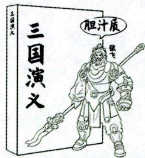

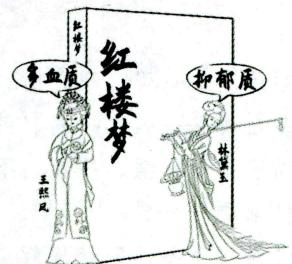

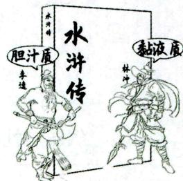

# (2) 气质的神经活动类型说

巴甫洛夫在研究高等动物的条件反射时发现，动物高级神经系统活动的兴奋和抑制有强度、平衡性、灵活性三种特性。根据这三种特性的结合，巴甫洛夫将动物的高级神经活动分为四种类型：强、不平衡（不可遏制型）；强、平衡、灵活（活泼型）；强、平衡、不灵活（安静型）；弱（弱型）。

表 2-27 高级神经活动类型与气质类型对照表  

<table><tr><td>高级神经活动类型</td><td>高级神经活动过程</td><td>气质类型</td></tr><tr><td>不可遏制型(兴奋型)</td><td>强、不平衡</td><td>胆汁质</td></tr><tr><td>活泼型(灵活型)</td><td>强、平衡、灵活</td><td>多血质</td></tr><tr><td>安静型(不灵活型)</td><td>强、平衡、不灵活</td><td>黏液质</td></tr><tr><td>弱型(抑制型)</td><td>弱</td><td>抑郁质</td></tr></table>

巴甫洛夫用高级神经活动类型学说解释气质的生理基础，但是从现在生理学的发展来看，这四种气质类型的生理依据是不科学的。

真题1[2024广东佛山，单选]学生小丽安静、稳重，反应缓慢，沉默寡言，情感不易外露，注意稳定但难于转移，善于忍耐。由此可见，小丽的气质类型最可能属于（）

A. 多血质

B. 胆汁质

C. 黏液质

D. 抑郁质

真题2 [2023黑龙江哈尔滨，单选]覃明同学热情直率、精力充沛、反应迅速、思维敏捷，但脾气暴躁冲动，易感情用事、自控能力差，该同学的气质属于（）

A. 多血质

B. 黏液质

C. 抑郁质

D. 胆汁质

真题3 [2024河北石家庄，判断]气质类型为多血质的人，其高级神经活动过程具有强、平衡、不灵活等特征。（）

A. 正确

B. 错误

答案：1.C 2.D 3.B

考点2 气质与教育 ★★ 【单选、多选、简答、案例分析】

在教育教学中，根据学生的不同气质类型，可以从以下几方面做好教育工作：

# 1. 对待学生应克服气质偏见

气质仅使人的行为带有某种动力特征，无所谓好坏；同时，每一种气质类型都有其积极的方面，也都有其消极的方面，无法比较好坏。

# 2.针对学生气质差异因材施教

针对学生的气质差异，在教育过程中对不同气质类型的学生采取的方法应尽可能地因人而异，做到“一把钥匙开一把锁”。

(1)对胆汁质的学生，教师应采取直截了当的方式，但这些学生不宜轻易激怒，对其严厉批评要有说服力，培养其自制力、坚持到底的精神，豪放、勇于进取的人格品质。  
(2)对多血质的学生，可以采取多种教育方式，但要定期提醒，对其缺点严厉批评。教师应鼓励他们勇于克服困难，培养扎实专一的精神，防止其见异思迁；创造条件，多给他们活动的机会，培养他们朝

气蓬勃、足智多谋的优点。

(3)对黏液质的学生，教师要采取耐心教育的方式，让他们有考虑和做出反应的足够时间，培养其生气勃勃的精神、热情开朗的个性和以诚待人、工作踏实、顽强的优点。  
(4)对抑郁质的学生, 则应采取委婉暗示的方式, 对其多关心、爱护, 不宜在公开场合下指责, 不宜过于严厉地批评, 培养他们亲切、友好、善于交往、富有自信的精神, 培养其敏感、机智、认真、细致、高自尊的优点。

# 3. 帮助学生进行气质的自我分析、自我教育，培养良好的气质品质

随着学生年龄的增长，他们对自身气质特征的认识能力和控制能力将大大提高。因此，教师应帮助学生对自己的气质特点进行分析，让他们主动用自己坚强的意志力去克服气质的消极面，或以气质的积极面去掩盖其消极面。

# 4. 特别重视胆汁质和抑郁质学生

胆汁质和抑郁质的学生由于兴奋性太强或太弱而容易影响其心理健康。因此，在教育中，对这两种极端类型的学生应该给予特别的照顾，采取一些特殊的措施，尽量避免强烈的刺激和大起大落的情绪变化。

# 5. 组建学生干部队伍时，应考虑学生的气质类型

在任命班干部时应考虑学生的气质类型，使班干部的气质类型与每种职务的工作要求相符合，充分发挥学生干部的潜力和优势。

# 二、性格

# 考点性格的概念 ★【单选、判断】

性格是指人的较稳定的态度与习惯化了的行为方式相结合而形成的人格特征。它是一个人的心理面貌的本质属性的独特结合，是人与人相互区别的主要方面，是个性心理特征中最具核心意义的心理特征。

性格的概念可从三方面进行理解：（1)性格是人对现实的态度和行为方式概括化与定型化的结果。(2)性格是指一个人独特的、稳定的个性心理。性格的稳定性不是绝对的，性格有可塑的一面，除了重大事件的影响外，性格的改变一般都要经过较长时间的环境影响和主体实践。（3）性格是个性特征中最具核心意义的心理特征。

# 考点2 性格的结构 ★★ 【单选、多选、填空】

(1)性格的态度特征。它是指个体对自己、他人、集体、社会以及对工作、劳动、学习的态度特征。 例如,谦虚或自负、利他或利己、粗心或细心、创造或墨守成规等。性格的态度特征在性格结构中具有核心意义。  
(2)性格的意志特征。它是指个体自觉地确定目标，调节支配行为，从而达到目标的性格特征。例如，顽强拼搏、当机立断。  
(3)性格的情绪特征。它是指个体稳定而独特的情绪活动方式。例如,情绪活动的强度、稳定性、 持久性和主导心境等方面的特征。  
(4)性格的理智特征。它是指个体在感知、记忆、想象、思维等认知过程中表现出来的认知特点和风格。例如，主动感知或被动感知，习惯于看到细节还是看到轮廓等。

性格的各种特征并不是一成不变的机械组合，在不同的场合下会显露出一个人性格的不同侧面。

真题4 [2023湖北武汉, 单选]小青每天都精神饱满, 富有朝气, 这属于小青性格的( )

A. 态度特征

B.意志特征

C. 情绪特征

D. 理智特征

真题5 [2024福建统考，填空]性格结构包括性格的 特征、理智特征、情绪特征和意志特征。

答案：4.C 5. 态度

考点 3 性格的类型 ★【单选、判断】

性格的类型是指在某一类人身上所共有的性格特征的独特结合。下面介绍几种常见的性格分类：

# 1. 理智型、情绪型和意志型

根据理智、情绪、意志三者在心理机能方面哪一个占优势，性格可分为理智型、情绪型和意志型。

理智型的人通常用理智衡量一切，并支配自己的行动。他们观察事物认真仔细，思维活动占优势，很少受情绪波动的影响。情绪型的人内心体验深刻，外部表露明显，情绪不稳定。言行举止受情绪的影响，缺乏理智感，处理问题常感情用事。意志型的人行动目标明确，积极主动，勇敢、坚定、果断，自制力强，不容易受外界因素干扰，但有的人会表现出固执、任性或轻率、鲁莽。

除了上述三种典型的类型外，还有中间类型，如理智一意志型、情绪一意志型等。

# 2.外向型和内向型

按照心理活动的指向，性格可分为外向型和内向型。

外向型的人心理活动指向于外部世界，表现为活泼开朗，热情大方，不拘小节，情绪外露，善于交际，反应迅速，容易适应环境的变化。内向型的人心理活动指向于内部世界，感情比较深沉，办事小心，谨慎多思，不善交往，适应环境的能力较差，很注重别人对自己的评价。

内外向的概念是由荣格提出来的，他认为，多数人并非典型的内向型或外向型性格，而是介于两者之间的中间型。

# 3. 独立型和顺从型

按照个体活动的独立性程度，性格可分为独立型和顺从型。

独立型的人具有坚定的个人信念，善于独立思考，能够独立地发现、分析和解决问题；自信心强，不容易受他人的暗示和其他因素的干扰；在遇到紧急情况和困难时，显得沉着冷静。顺从型的人做事缺乏主见，容易受他人意见的干扰，常常不加分析地接受别人的观点或屈从于他人的权势；在突发事件面前，常表现为束手无策或惊慌失措。

考点 4 性格与能力的关系 ★【判断】

# 1. 联系

性格与能力是在一个人统一实践的过程中发展起来的，二者之间相互影响、相互联系。

(1)性格制约着能力的形成与发展。①性格影响能力的发展水平；②优良的性格特征往往能够补偿能力的某种缺陷，“笨鸟先飞早入林”“勤能补拙”就是说性格对能力的补偿作用；③不良的性格特征，也会阻碍能力的发展，甚至使能力衰退。

(2)能力的形成与发展也会促使相应的性格特征随之发展。

(3)性格与能力的结合是获得成功的必要条件。一个人的成功，必须有智力因素和非智力因素的结合，性格是非智力因素的重要组成部分。

# 2.区别

性格与能力是个性心理特征的两个不同侧面。(1)性格与能力不同,能力是决定心理活动的基本因素,活动能否进行,与能力有关;(2)性格则表现为人的活动指向什么,采取什么态度,怎样进行。

真题6 [2024江苏南通, 判断]“勤能补拙”“笨鸟先飞”体现了非智力因素对智力发展的补偿作用（）

答案：√

考点5 性格与气质的关系 ★★ 【单选、多选、判断、辨析、简答】

# 1. 联系

(1)性格与气质都属于稳定的人格特征。

(2)性格与气质相互渗透, 彼此制约, 二者相互影响。这表现在: ①气质影响到一个人对事物的态度和行为方式, 因而使性格带上某种气质的色彩和具有某种特殊的形式; ②气质影响性格的形成和发展, 以及形成的速度; ③性格可以掩蔽和改造气质, 指导气质的发展, 使它服从于生活实践的要求。

# 2.区别

(1)气质受生理影响大，性格受社会影响大。气质是由人的神经系统的某些生物学特点，特别是脑的特点决定的。性格是人对现实的态度和他的行为方式所表现出来的个性心理特征。在不同的社会生活条件下，人们的性格有明显的区别。

(2)气质的稳定性强,性格的可塑性强。由于气质较多地受生物因素的制约,因此,气质变化较难、较慢。性格是后天形成的,由生活实践决定,它虽然也具有一定的稳定性,但在社会生活条件的影响下,比气质的变化要快得多,它的可塑性更强。

(3)气质特征表现较早,性格特征表现较晚。人的气质差异是先天形成的,受神经系统活动过程的特性所制约,因此,气质形成得早,表现在先。性格是后天形成的,受社会影响大,因此,性格特征出现得比较晚。

(4)气质无所谓好坏,性格有优劣之分。气质是人的天性,无好坏之分。气质不能决定人的社会价值与成就的高低,也不直接具有社会道德评价含义,但气质对人在不同性质的活动中的适应性,甚至活动的效率却有一定的影响。也就是说,气质特征是职业选择的依据之一。气质与职业活动的关系表现在两个方面:①要使个人的气质特征适应于职业活动的客观要求;②在选拔人才和安排工作时应考虑个人的气质特点。性格表现了一个人的品德,受人的世界观、人生观、价值观的影响,具有道德评价含义。性格是在后天社会环境中逐渐形成的,有好坏、优劣之分,能最直接地反映出一个人的道德风貌。

真题7 [2024江苏南通，判断]气质无好坏之分，但有优劣之别。（）

答案：×

考点6 影响性格形成与发展的因素 ★【简答】

(1)家庭。在家庭环境中，亲子关系、家庭气氛、父母的教养方式、家庭结构以及孩子的出生顺序、儿童在家庭中扮演的角色和所处的地位等都对儿童的性格发展有着重要的影响。

(2)学校教育。学校通过各种有组织的活动使儿童和教师、同学发生相互作用，从而促进儿童的性格发展。  
(3)同伴群体。与同伴群体的交往使儿童能够进行人际关系和交流的探索,并发展人际敏感性,奠定儿童今后社会交往的基础,促进儿童的社会化和性格的发展。  
(4)社会实践。学生接触社会的各种工作岗位后，各职业的要求对性格发展也有重要作用。他们必须进行与其职业相应的活动，扮演相应的社会角色，体验自身性格特征与职业的相宜性，从而影响性格的自我教育。  
(5)社会文化因素。例如，文化背景、社会制度、社会传媒和经济地位等都对儿童的性格产生深刻的影响。  
(6)自我教育。任何外部条件的影响都必须通过个体的心理活动的自我调节才能发生作用。许多研究结果都表明，良好性格的形成，是将接受与领会的外部要求逐渐转变为对自己内部要求的过程。理解与接受了外部的社会要求，并不是立刻就能调节自身的行为。如果外部的要求与个人的世界观、需要与动机相冲突，不符合原来形成的比较稳定的态度，那么，就难以理解外部社会的要求，自然也就不能形成人这方面的性格。

# 考点7 学生优良性格的培养

(1)加强人生观、世界观和价值观的教育；(2)及时强化学生的积极行为；(3)充分利用榜样人物的示范作用；(4)利用集体的教育力量；(5)提供实际锻炼的机会；(6)及时进行个别指导；(7)提高学生的自我教育能力。

# ·记忆有妙招·

为方便考生记忆，编者将学生优良性格的培养措施总结成以下口诀：

强三观、强良行，利用榜样和集体，自我教育要提高，个别指导要及时，实际锻炼少不了。三观：人生观、世界观和价值观。强良行：强化积极行为。

# ★ 本节核心考点回顾 ★

# 1.气质的类型

(1)胆汁质：精力旺盛、易感情用事；其高级神经活动过程为强、不平衡。  
(2)多血质：活泼好动、情绪不稳定；其高级神经活动过程为强、平衡、灵活。  
(3)黏液质：稳重、踏实、死板；其高级神经活动过程为强、平衡、不灵活。  
(4)抑郁质：敏锐、体验深刻、怯懦；其高级神经活动过程为弱。

# 2.针对学生气质差异因材施教

(1)对胆汁质的学生：直截了当，不宜轻易激怒，对其严厉批评要有说服力；培养其自制力、坚持到底的精神，豪放、勇于进取的人格品质。  
(2)对多血质的学生：采取多种教育方式；培养扎实专一的精神，防止其见异思迁；培养他们朝气蓬勃、足智多谋的优点。  
(3)对黏液质的学生：采取耐心教育的方式；培养其生气勃勃的精神、热情开朗的个性和以诚待人、工作踏实、顽强的优点。

(4)对抑郁质的学生:采取委婉暗示的方式;不宜在公开场合下指责;培养他们亲切、友好、善于交往、富有自信的精神,培养其敏感、机智、认真、细致、高自尊的优点。

# 3. 性格的结构

(1) 态度特征：对自己、他人、集体、社会以及对工作、劳动、学习的态度特征。  
(2)意志特征：个体自觉地确定目标，调节支配行为，从而达到目标的性格特征。  
(3)情绪特征：个体稳定而独特的情绪活动方式。  
(4)理智特征：个体在感知、记忆、想象、思维等认知过程中表现出来的认知特点和风格。

# 4. 性格与气质的区别

(1)气质受生理影响大，性格受社会影响大。  
(2)气质的稳定性强，性格的可塑性强。  
(3)气质特征表现较早，性格特征表现较晚。  
(4)气质无所谓好坏,性格有优劣之分。气质不能决定人的社会价值与成就的高低,也不直接具有社会道德评价含义。

# 03

# 第三部分教育心理学

# 内容导学

本部分内容共分为六章。  
- 第一章主要介绍教育心理学的研究内容、发展历程、研究方法等,考查题型一般为客观题,偶尔也会涉及简答等主观题。  
- 第二章至第五章主要介绍学生心理发展、学习理论、学习心理和教学心理，考查题型主、客观均会涉及。  
• 第六章主要是对心理健康知识的阐述,考查题型一般为客观题,偶尔也会涉及简答、论述等主观题。  
考生在复习备考时不仅要针对各理论知识进行理解和识记，还应能运用所学的知识去解决教学中遇到的问题，注意理论知识与实际教学情境的结合。  
为了方便考生梳理知识脉络，我们在各节设置思维导图和核心考点回顾。

# 第一章 教育心理学概述

# 本章学习指南

# 一、考情概况

本章属于教育心理学的基础章节，内容较为琐碎，考生可带着以下学习目标进行备考：

1.理解教育心理学的概念。  
2. 掌握教育心理学的研究内容及发展历程。  
3. 理解教育心理学的研究方法与研究原则。

# 二、考点地图

<table><tr><td>考点</td><td>年份/地区/题型</td></tr><tr><td>教育心理学的研究内容</td><td>2024广东判断;2023广西单选;2023福建判断;2022山东单选;2022浙江判断</td></tr><tr><td>教育心理学的发展历程</td><td>2024江苏判断;2023安徽单选;2023黑龙江单选;2023广西单选</td></tr><tr><td>教育心理学的研究方法</td><td>2024河北单选;2024河南单选;2022辽宁单选</td></tr></table>

注：上述表格仅呈现重要考点的相关考情。

# 核心考点

# 第一节 教育心理学的基本内涵

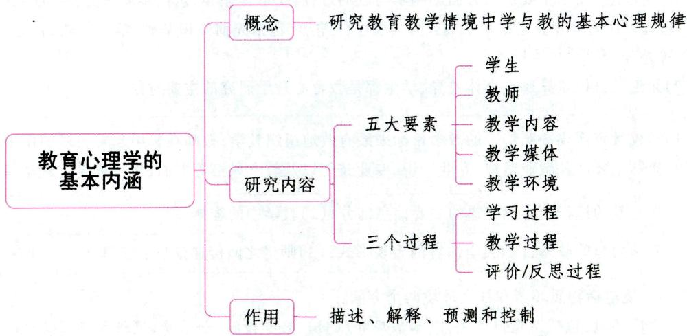

# 一、教育心理学的概念与学科性质

# 考点1 教育心理学的概念 ★ 【单选】

教育心理学是一门研究教育教学情境中学与教的基本心理规律的科学。它拥有自身独特的研究课题，即如何学、如何教以及学与教之间的相互作用。教育心理学可以从广义与狭义两个方面理解。广义的教育心理学是指研究教育实践中各种心理与行为规律的科学。它既包括学校教育心理学，也包括家庭和社会教育心理学。狭义的教育心理学专指学校教育心理学。

真题1 [2024天津实验小学，单选]研究学校情境中学与教的基本心理规律的科学是( )

A. 学习心理学

B.人格心理学

C. 教育心理学

D. 动机心理学

答案：C

# 考点2 教育心理学的学科性质

教育心理学的学科特点可以从不同方面加以剖析。从学科范畴来看，它既是心理学的一个分支学科，又是教育学与心理学相结合而产生的交叉学科；从学科作用来看，它既是一门理论性学科（具有基础性），又是一门应用性较强的学科（具有实践指导性），并以应用为主。

# 二、教育心理学的研究内容 ★★ 【单选、多选、判断】

教育心理学的具体研究范畴是围绕学与教相互作用的过程展开的。学与教的相互作用过程是一个系统过程, 该系统包含学生、教师、教学内容、教学媒体和教学环境五种要素, 由学习过程、教学过程和评价/反思过程这三种活动过程交织在一起组成。

# 1. 学习与教学的要素

表 3-1 学习与教学的要素  

<table><tr><td>五要素</td><td>内涵</td></tr><tr><td>学生</td><td>(1)学生这一要素主要从两方面影响学与教的过程:①群体差异,包括年龄、性别和社会文化差异等。如年龄差异主要体现在思维水平的差异。②个体差异,包括先前知识基础、学习方式、智力水平、兴趣和需要等差异。
(2)无论是群体差异还是个体差异,学生都是教育心理学研究的主要对象</td></tr><tr><td>教师</td><td>(1)学校教育需要按照特定的教学目标来最有效地组织教学,教师在其中起着关键的作用;
(2)教师主要涉及敬业精神、专业知识、专业技能以及教学风格等方面,也是教育心理学研究的内容之一</td></tr><tr><td>教学内容</td><td>(1)学与教的过程中有意传递的主要信息部分;(2)教学中的客体</td></tr><tr><td>教学媒体</td><td>(1)教学内容的载体;(2)教学内容的表现形式;(3)师生之间传递信息的工具</td></tr><tr><td>教学环境</td><td>教学环境包括物质环境和社会环境两个方面:
(1)物质环境,包括课堂自然条件(如温度和照明)、教学设施(如桌椅、黑板和投影仪)以及空间布置(如座位的排列)等;
(2)社会环境,包括课堂纪律、课堂气氛、师生关系、同学关系、校风以及社会文化背景等</td></tr></table>

# 2. 学习与教学的过程

表 3-2 学习与教学的过程  

<table><tr><td>三过程</td><td>内涵</td></tr><tr><td>学习过程</td><td>(1)学生在教学情境中通过与教师、同学以及教学信息的相互作用获得知识、技能和态度的过程；
(2)学习过程是教育心理学研究的核心内容，如学习的实质、条件、动机、迁移以及不同种类学习的特点等</td></tr><tr><td>教学过程</td><td>教师把知识技能以有效的方法传授给学生并引导学生建构自己的知识的过程</td></tr><tr><td>评价/反思过程</td><td>(1)包括教学前对教学设计效果的预测和评判，教学过程中对教学的监视和分析，以及教学后对教学效果的检验、反思；
(2)始终贯穿在整个教学过程当中</td></tr></table>

注：从学习过程与教学过程的相互关系来看，学与教实际上是对同一过程的不同理解。学习过程侧重于学生的学，而教学过程侧重于教师的教。要知道教师该如何教，首先就要理解学生该怎样学。因此，学习心理是教育心理学的核心。

真题2 [2022山东临沂，单选]（）是教学内容的载体、是教学内容的表现形式、是师生之间传递信息的工具。

A. 教学内容

B. 教学媒体

C. 教学环境

D. 教学过程

真题3 [2024广东佛山, 判断]教育心理学中的学习与教学的过程由学习、教学、评价/反思三种过程交织在一起。（）

答案：2.B 3.√

# 三、教育心理学的作用 ★【多选、简答】

教育心理学对教育实践具有描述、解释、预测和控制的作用。具体来说包括以下几个方面：

（1）帮助教师准确地了解问题；  
(2)为实际教学提供科学的理论指导；  
(3)帮助教师预测并干预学生；  
(4)帮助教师结合实际教学进行教育研究。

# ★本节核心考点回顾 ★

# 1.教育心理学的概念

教育心理学是一门研究教育教学情境中学与教的基本心理规律的科学。

# 2. 教育心理学的研究内容

(1)学习与教学的要素：学生、教师、教学内容、教学媒体（教学内容的载体、表现形式和师生之间传递信息的工具）、教学环境；  
(2)学习与教学的过程：学习、教学、评价/反思过程。

# 3. 教育心理学的作用

描述、解释、预测、控制。

# 第二节 教育心理学的发展

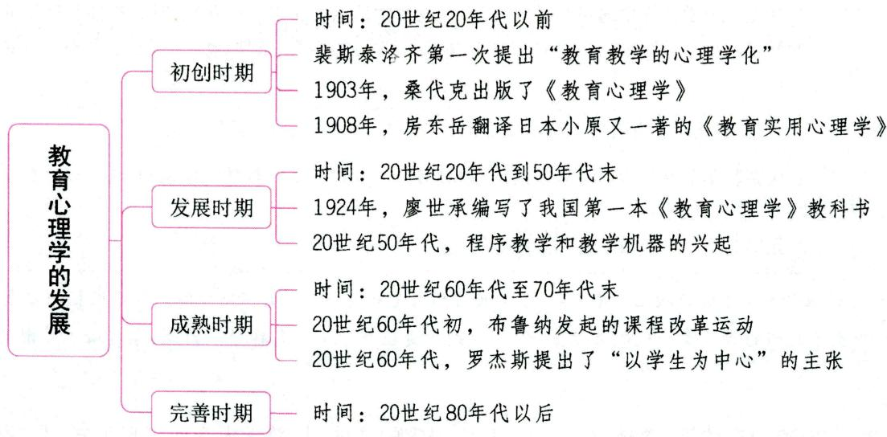

# 一、初创时期（20世纪20年代以前） ★★ 【单选、填空、判断】

瑞士教育家裴斯泰洛齐第一次提出“教育教学的心理学化”的思想。

德国教育家与心理学家赫尔巴特首次提出把教学理论的研究建立在心理学这个科学基础之上。

1868年俄国教育家乌申斯基出版了《人是教育的对象》一书，对当时的心理学发展成果进行了总结，他因此被誉为“俄罗斯教育心理学的奠基人”。

1877年，俄国教育家和心理学家卡普捷列夫发表了《教育心理学》一书，这是最早正式以“教育心理学”命名的著作。

1903年,美国心理学家桑代克出版了《教育心理学》,这是西方第一本以“教育心理学”命名的著作。1913~1914年,该书又扩充为三卷本的《教育心理大纲》。桑代克从“人是一个生物的存在”这个角度建立自己的教育心理学体系。他的教育心理学分为三部分:第一部分讲人类的本性,第二部分讲学习心理,第三部分讲个别差异及其原因。这构成了桑代克教育心理学的内容体系,奠定了教育心理学发展的基础,西方教育心理学的名称和体系由此确立,桑代克也因此被称为“教育心理学之父”。

1908年，房东岳翻译日本小原又一著的《教育实用心理学》，这是我国出版的第一本教育心理学著作。

真题1 [2023黑龙江哈尔滨，单选]桑代克建立教育心理学体系的基本出发点是把人作为一个（）

A. 动物的存在

B. 生物的存在

C. 物的存在

D.意识的存在

真题2 [2023广西贵港，单选]一般认为，教育心理学成为独立的学科是以1903年《教育心理学》的出版为标志，该书的作者是（）

A.布鲁纳

B. 詹姆士

C. 桑代克

D. 华生

答案：1.B 2.C