# 二、发展时期（20世纪20年代到50年代末） ★ 【单选、判断】

20世纪20年代至30年代，西方教育心理学吸取了儿童心理学和心理测验方面的成果，并将学科心理学纳入自己的内容中。1924年，廖世承编写了我国第一本《教育心理学》教科书。  
20世纪40年代，弗洛伊德的理论广为流传，有关儿童的个性和社会适应以及生理卫生问题也进入教育心理学的研究领域。  
20世纪50年代，程序教学和教学机器的兴起，也相应影响和改变了教育心理学的内容。

# 记忆有妙招·

为方便考生记忆，编者将教育心理学初创时期与发展时期的人物及事件总结成以下口诀：

裴赫首提出，乌申俄奠基，房东岳翻译，廖世承主编。中国第一廖和房，西方第一桑代克，世界第一卡普捷。裴：裴斯泰洛齐。赫：赫尔巴特。乌申：乌申斯基。俄：俄国。卡普捷：卡普捷列夫。

真题3 [2024江苏苏州, 判断]1924年，廖世承编写了我国第一本《教育心理学》教科书。（）

答案：√

# 三、成熟时期（20世纪60年代至70年代末）

20世纪60年代初，教育心理学的研究由行为主义转向认知范畴。布鲁纳发起的课程改革运动促使美国教育心理学转向对教育过程、学生心理、教材、教法和教学手段改进的探讨。同时，美国教育心理学开始重视研究教学中的社会心理因素。  
20世纪60年代掀起了一股人本主义思潮,罗杰斯提出了“以学生为中心”的主张,认为教师只是一个“方便学习的人”。不少教育心理学家开始把学校和课堂看作社会情境。  
20世纪70年代，奥苏贝尔以认知心理学的观点系统阐述了有意义学习的条件，而加涅则对人类的学习进行了系统分类，这两种学习理论为教育心理学的成熟奠定了基础。随着计算机的普及，计算机辅助教学(CAI)也越来越受到人们的重视。

这一时期，西方教育心理学内容和体系出现了一些变化。教育心理学的内容日趋集中，教育心理学学科体系基本形成。行为、认知和人本主义学派的分歧日趋缩小，学科研究越来越注重对学校教育实践的指导。

# 四、完善时期（20世纪80年代以后）

20世纪80年代以后，教育心理学越来越注重与教学实践相结合，各个理论派别相互吸收，体系愈加完善。

1994年，美国心理学家布鲁纳总结了教育心理学20世纪80年代以来的成果：(1)主动性研究；(2)反思性研究；(3)合作性研究；(4)社会文化研究。

此外，信息技术的飞速发展，使得信息技术教育应用的研究达到了一个新的水平。

# ★本节核心考点回顾 ★

# 1. 教育心理学的初创时期

(1) 1903年, 美国心理学家桑代克出版的《教育心理学》是西方第一本以“教育心理学”命名的著作。桑代克从“人是一个生物的存在”的角度建立自己的教育心理学体系, 被称为“教育心理学之父”;

(2)1908年房东岳翻译的日本小原又一著的《教育实用心理学》是我国出版的第一本教育心理学著作。

2. 教育心理学的发展时期

1924年，廖世承编写了我国第一本《教育心理学》教科书。

# 第三节 教育心理学的研究方法与研究原则

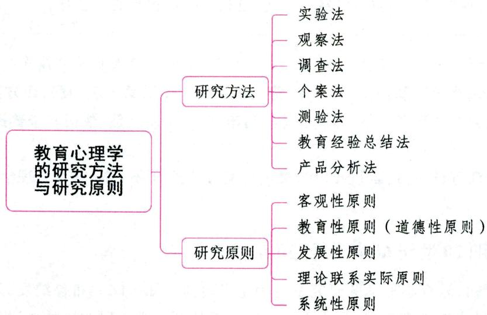

# 一、教育心理学的研究方法 ★★ 【单选、填空】

# 1. 实验法

实验法是指创设一定的情境, 对某些变量进行操纵或控制, 以揭示教育、心理现象的原因和发展规律的研究方法, 这种研究的基本目的是揭示变量之间的因果关系。

实验法主要包括实验室实验和现场实验。实验室实验是在实验室内借助于各种专门仪器设备进行教育心理实验的方法。现场实验又叫自然实验，是在自然情境下，由实验者创设或改变一些条件，以引起学生某些心理活动的变化从而进行研究的方法。现场实验的不足之处是实验情境不易控制，因而难以得到精密的实验结果。实验法是心理学研究中应用最广、成就最大的一种方法。

# 2. 观察法

观察法是指在教育过程中，研究者通过感官或借助于一定的科学仪器，有目的、有计划地考察和描述个体某种心理活动的表现或行为变化，从而收集相关的研究资料的方法。当所研究的对象无法加以控制，或者在控制的条件下会使行为不出现或失真，或者由于道德和伦理的原因不能对某种现象进行控制时，一般可采用观察法。

观察法是教育心理学研究中采用的最基本、最普遍的方法。它的主要优点是保持了人的心理活动的自然性和客观性，获得的资料比较真实。不足之处就是观察法得到的结果有时可能只是一种表面现象，不能据此很好地确定心理活动产生和变化的原因。但它仍是掌握原始资料的必要方法，通过观察发现问题，可以为进一步的研究开路，因此，有人把观察法比喻为“科学研究的前门”。

# 3.调查法

调查法是通过各种途径间接了解被试心理活动的一种研究方法。调查法总体上易于进行，但在调

查的过程中往往会因为被调查者记忆不够准确等原因使调查结果的可靠性受到影响。在教育心理学研究中，常用的调查方法有问卷法、访谈法等。问卷法是采用书面问答的方式，要求被试回答研究者提出的问题，以获得被试心理和行为表现资料的方法。访谈法是通过与研究对象或与研究对象有关的人进行口头交谈的方式来收集研究资料的一种方法。

# 4. 个案法

个案法是指要求对某个人进行深入而详尽的观察与研究，收集其相关资料，分析其心理特征，以便发现影响其某种行为和心理现象的原因。收集的个案资料通常包括个人的背景资料、生活史、家庭关系、生活环境、人际关系以及心理特征等。个案法能够加深对特定个体的了解，但所收集的资料往往缺乏可靠性。

# 5.测验法

测验法是指用一套预先经过标准化的问题(量表)来测量某种心理品质的研究方法。心理测验按内容可分为智力测验、成就测验、态度测验和人格测验；按形式可分为文字测验和非文字测验；按测验规模可分为个别测验和团体测验等。

# 6. 教育经验总结法

教育经验总结法是教育心理学一个重要的研究方法，它是依据教育实践所提供的事实，按照科学研究的程序，分析和概括教育现象，揭示其内在联系和规律，使之上升为教育理论的一种教育科研方法。

# 7. 产品分析法

产品分析法也是教育心理学的研究方法之一，又称活动产品分析或作品分析法，是指通过分析学生的活动产品，以了解学生的能力、倾向、技能、熟练程度、情感状态和知识范围。

真题1 [2024河北石家庄, 单选]吴老师想要研究深度学习与中学生数学成绩之间的因果关系，宜采用的研究方法是（）

A. 比较法

B. 实验研究法

C. 调查研究法

D. 个案研究法

答案：B

# 二、教育心理学的研究原则 ★【单选、多选】

# 1.客观性原则

客观性原则是指教育心理学研究要贯彻实事求是的精神，即根据教育心理学现象的本来面貌来研究其本质、规律与机制，采取实事求是的态度。遵循客观性原则是进行科学研究的前提条件。

# 2.教育性原则（道德性原则）

教育性原则是指在教育心理学的研究过程中，所采用的研究手段与方法应能促进被试心理的良性发展，这是所有关于人的心理学研究中都应遵从的一个基本伦理道德原则。

# 3. 发展性原则

发展性原则是指教育心理学研究要求研究者牢记被试的心理是不断发展变化的，应该采用动态的、变化的指标进行衡量。它还要求研究者在发挥其主导作用的同时，充分考虑被试已有的知识经验和态度对其心理发展的影响。

# 4.理论联系实际原则

理论联系实际原则是由教育心理学的应用科学性质决定的。这一原则要求教育心理学的研究应从教育情境，尤其是主体的实际需要出发，解决教育教学中的实际心理问题。

# 5. 系统性原则

系统性原则要求在教育心理学的研究中，坚持以全面的、发展的和整体的观点去观察、分析和解决问题。

# 记忆有妙招·

为方便考生记忆，编者将教育心理学的研究原则总结为以下口诀：

教官喜理发。教：教育性原则。官：客观性原则。喜：系统性原则。理：理论联系实际原则。发：发展性原则。

真题2 [2024河南事业单位，单选]小张同学为了顺利毕业，把不太理想的实验数据按照预期结果进行修改。他的这种做法违反了教育心理学研究的（ ）

A. 发展性原则

B. 客观性原则

C. 系统性原则

D. 教育性原则

答案：B

# ★本节核心考点回顾 ★

# 1. 教育心理学的研究方法

(1)实验法：创设一定的情境，对某些变量进行操纵或控制，以揭示教育、心理现象的原因和发展规律；其研究的基本目的是揭示变量之间的因果关系。  
(2)观察法：在教育过程中，研究者通过感官或借助于一定的科学仪器，有目的、有计划地考察和描述个体某种心理活动的表现或行为变化，从而收集相关的研究资料。

# 2. 教育心理学的研究原则

(1)客观性原则（实事求是）；  
(2)教育性原则（促进被试心理良性发展）；  
(3)发展性原则（动态、变化的指标）；  
(4)理论联系实际原则（从实际需要出发）；  
(5)系统性原则（全面、发展和整体的观点）。

# 第二章 心理发展及个别差异

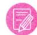

# 本章学习指南

# 一、考情概况

本章属于教育心理学的重点章节，内容较为琐碎，考生可带着以下学习目标进行备考：

1. 了解心理发展的阶段特征及影响因素。  
2. 掌握心理发展的一般规律和关键期。  
3. 掌握皮亚杰的认知发展阶段理论和维果斯基的心理发展观。  
4.区分人格的特征，掌握影响人格形成与发展的因素。  
5. 掌握弗洛伊德和埃里克森的人格理论。  
6. 了解自我意识的概念和发展阶段。  
7. 掌握学生的认知差异，了解学生的性格差异及教育意义。

# 二、考点地图

<table><tr><td>考点</td><td>年份/地区/题型</td></tr><tr><td>个体心理发展的一般规律</td><td>2023浙江判断;2022内蒙古单选;2022江苏简答</td></tr><tr><td>关键期</td><td>2024河北单选;2024浙江单选;2024天津判断;2023内蒙古单选</td></tr><tr><td>皮亚杰的认知发展阶段理论</td><td>2024天津单选;2024广东单选;2023吉林单选;2023黑龙江单选、多选;2023河南多选;2022广西单选;2022江苏判断</td></tr><tr><td>维果斯基的心理发展观</td><td>2024江苏单选、判断;2023广西单选、判断;2023山西单选;2023河北多选;2023福建填空</td></tr><tr><td>影响人格形成与发展的因素</td><td>2024河北多选;2023辽宁单选;2023浙江多选;2022江苏多选</td></tr><tr><td>弗洛伊德的人格发展理论</td><td>2024福建单选;2023辽宁单选;2023广东单选;2023广西多选;2022浙江单选;2022江苏填空</td></tr><tr><td>埃里克森的人格发展阶段论</td><td>2024天津单选;2024山东单选;2024江苏填空;2024安徽判断;2023黑龙江单选;2023广西单选</td></tr><tr><td>自我意识的发展阶段</td><td>2024河北单选;2023浙江单选;2023湖北判断</td></tr><tr><td>认知方式差异</td><td>2024江苏单选;2024福建辨析;2023湖北单选;2023河南单选;2023安徽单选;2022河北判断</td></tr></table>

注：上述表格仅呈现重要考点的相关考情。

# 第一节 心理发展

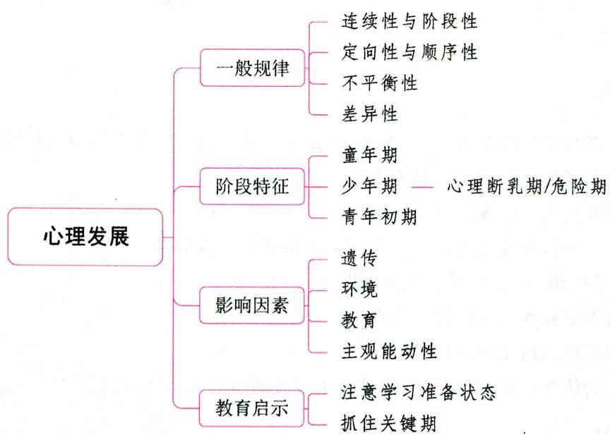

# 一、心理发展的概念和阶段 ★ 【单选】

心理发展是指个体从出生、成熟、衰老直至死亡的整个生命进程中所发生的一系列心理变化。

在人的一生中，个体心理的发展既是一个连续的过程，也可以分为不同的阶段。个体发展到一定的年龄阶段，应该表现出与个体年龄相符合的行为特征，这种社会期待的行为标准，称为发展任务。心理学家将个体的心理发展划分为八个阶段：乳儿期（0~1岁）、婴儿期（1~3岁）、幼儿期或学龄前期（3~6、7岁）、童年期或学龄初期（6、7~11、12岁）、少年期或学龄中期（11、12~14、15岁）、青年期（14、15~25岁）、成年期（25~65岁）和老年期（65岁以后）。

# 二、个体心理发展的一般规律（基本特征） ★★ 【单选、多选、判断、辨析、简答】

# 1. 连续性与阶段性

在心理发展过程中，当某些代表新特征的量累积到一定程度时，就会取代旧特征而处于优势的主导地位，表现为阶段性的间断现象。但后一阶段的发展总是在前一阶段的基础上发生的，而且又萌发着下一阶段的新特征，表现出心理发展的连续性。

# 2. 定向性与顺序性

在正常条件下, 心理的发展总是具有一定的方向性和先后顺序。例如, 在各种心理机能中, 感知觉的发展最早, 然后是运动机能、情绪、动机和社会交往能力的发展, 而抽象思维的出现和发展最迟。尽管发展的速度有个体差异, 会加速或延缓, 但发展是不可逆的, 也不可逾越。

# 3. 不平衡性

心理的发展可以因进行的速度、到达的时间和最终达到的高度而表现出多样化的发展模式。一方面表现在个体不同系统在发展的速度、发展的起止时间与到达成熟时期的进程不同；另一方面表现在同一机能特性在发展的不同时期有不同的发展速率。

# 4. 差异性

任何一个正常学生的心理发展总要经历一些共同的基本阶段，但发展的速度、最终达到的水平，以及发展的优势领域等方面往往又千差万别。学生心理发展的个体差异是教师要面对的一个重要问题，只有了解学生的个体差异，才能通过因材施教满足具有不同智力结构和学习风格的学生的不同需求，促使每个学生得到全面的和个性的发展。

真题1 [2022内蒙古赤峰，单选]在心理机能形成的过程中，最先发展的是感觉、知觉，然后是情绪、情感，最后发展抽象思维，这体现了心理发展的什么特点（）

A. 连续性和阶段性

B. 定向性和顺序性

C. 不平衡性

D. 差异性

真题2 [2022江苏苏州，简答]简述学生心理发展的基本特征。

答案：1.B 2.详见内文

# 三、中小学生心理发展的阶段特征 ★【单选、多选】

# 考点 童年期

童年期又称学龄初期，是个体一生发展的基础时期，也是生长发育最旺盛、变化最快、可塑性最强、接受教育最佳的时期。童年期儿童的心理发展特征主要表现在以下几个方面：

(1)学习开始成为儿童的主导活动，通过识字、阅读和写作，小学生的口头言语逐步过渡到书面言语。  
(2)四年级（10~11岁）儿童的思维开始从以具体形象思维为主过渡到以抽象逻辑思维为主，但其抽象逻辑思维仍需以具体形象为支柱。  
(3)小学生的自我意识增强，对自我有了一定评价。  
(4)小学生的道德概念也已从直观具体的、比较肤浅的认识逐步过渡到比较抽象的、本质的认识,并开始从动机与效果的统一来评价道德行为。  
(5)小学生与父母在总体上仍保持着亲密关系，小学低年级学生对教师绝对崇拜和服从，高年级学生的独立性和评价能力不断增长，开始对教师做出评价。

真题3 [2023浙江台州，单选]（ ）是人一生发展的基础时期，也是生长发育最旺盛、变化最快、可塑性最强、接受教育最佳的时期。

A. 婴儿期

B.幼儿期

C. 童年期

D.少年期

答案：C

# 考点2 少年期

少年期又称学龄中期,大致相当于初中阶段,是个体从童年期向青年期过渡的时期,具有半成熟、 半幼稚的特点。在这一时期,学生处于生理发育的第二个高峰期。整个少年期充满独立性和依赖性、 自觉性和幼稚性错综的矛盾。这一时期也被称为“心理断乳期”或“危险期”。在这一时期,学生主要表现出如下特征：

(1) 抽象思维已占主导地位，并出现反省思维，但抽象思维在一定程度上仍要以具体形象为支柱。  
(2)思维的独立性和批判性有所发展，但仍带有不少片面性和主观性。

(3)初中生心理活动的随意性显著增长，可长时间集中精力学习，能随意调节自己的行动。  
(4)他们开始关心自己和别人的内心世界,同龄人间的交往和认同大大增强,社会高级情感迅速发展。  
(5)初中生的道德行为更加自觉，能通过具体的事实概括出一般伦理性原则，并以此来指导自己的行动，但因自我控制力不强，常出现前后矛盾的行为。  
(6)进入少年期,学生个性结构的主要变化在于自我意识有了质的飞跃。这个时期突出地表现为一种强烈的独立倾向,他们极力想争得在社会生活中独立自主的地位。青少年男女身体的迅速发育与成熟所引起的自我感觉及社会对他们的评价,使他们感到自己是个大人了,与儿时的“我”不同了,产生了“成人感”,并努力以“成人式”的义务感与责任心去学习知识技能,去与别人交往,因而出现了前所未有的独立性。他们对自己往往估计过高,事事想自己做主,把自己的见解看成是评价客观事物的标准,对周围成人的话都不轻易相信。

身体状态的剧变、内心世界的发现、自我意识的觉醒、独立精神的加强是少年期表现出的总体性的阶段特征。

# 考点3 青年初期

青年期可划分为青年初期（14、15～17、18岁）和青年晚期（18～25岁）。

青年初期又称学龄晚期，相当于高中时期，是个体在生理上、心理上和社会性上向成人接近的时期。这一时期的青年，心理发展主要表现在：

(1)智力接近成熟，抽象逻辑思维由“经验型”向“理论型”转化，开始出现辩证思维，与人生观相联系的情感占主要地位，道德感、理智感和美感有了深刻的发展。  
(2)不仅能比较客观地看待自我，而且能明确地表达自我，敏感地防卫自我并珍重自我，形成了理智的自我意识。然而，理想自我与现实自我仍面临分裂的危机，自我肯定与自我否定常发生冲突。  
(3)对未来充满理想，意志的坚强性与行动的自觉性有了较大发展，但有时也会出现与生活相脱节的幻想。  
(4)经过青年初期自我的觉醒以及对自我的重新认知之后，进入成年初期的青年开始摆脱那种肤浅的、表面的对外界及对自我的认识，从而促进了自我意识的形成。

# 四、影响个体心理发展的因素 ★【单选】

# 1. 遗传

遗传素质在个体心理发展中的作用是不可忽视的，它是个体心理发展的生物前提和物质基础，没有这一前提条件就谈不上心理的发生与发展。

# 2. 环境

环境对个体的心理发展有着巨大的影响。人所处的环境和一般动物有着本质的区别，离开了社会环境与社会实践，人的心理就不可能向人的方向发展。

# 3.教育

教育制约着学生心理发展的过程、方向、趋势、速度和程度。因此，教育在儿童心理发展上比一般的环境影响起着更为主要的作用。但是，这种作用只有当教育工作符合儿童心理发展的规律时才能发生。

# 4. 主观能动性

个体的主观能动性，是指人的主观意识和活动对于客观世界的积极作用，包括能动地认识客观世界和能动地改造客观世界，并统一于人们的社会实践活动中。个体的主观能动性是个体心理发展的内在动力。

# 五、中小学生心理发展的教育启示

# 考点1 教育必须以一定的心理发展特点为依据

# 1. 结合学生的心理发展特点，注意学生心理发展的个体差异

教育要结合学生的心理发展特点进行，不能脱离学生的发展实际。另外，虽然学生在心理发展上有共同的特点，但学生与学生之间也存在着诸如认知、个性等方面的差异。因此，教师在教育中除了以心理发展的共性为依据外，还要考虑学生的个体差异，因材施教。

# 2. 注意学生的学习准备状态 ★ 【单选】

学习准备, 又称学习的“准备状态”或“准备性”, 指的是学习者在从事新的学习时, 其身心发展水平对新的学习的适应性, 即学生在学习新知识时, 那些促进或妨碍学习的个人生理、心理发展的水平和特点。学习准备是使新的学习成为可能的学生的身心发展条件, 是学习的内部条件, 是教学的起点。

学习准备不仅会影响新学习的成功，而且会影响学习的效率。同时，学习也会促进学生的心理发展，新的发展又为进一步的学习做好准备。为此，要遵循学习的准备性原则（又称为“量力性原则”或“可接受性原则”），指要根据学生原有的准备状态进行新的教学。

# 3.抓住关键期 ★★ 【单选、判断】

关键期的概念源于奥地利动物习性学家劳伦兹在研究动物习性时发现的“印刻现象”。心理学家所讲的关键期，是指人或动物的某些行为与能力的发展有一定的时间，如果在此时给予适当的良性刺激，会促使其行为与能力得到更好的发展；反之，则会阻碍发展甚至导致行为与能力的缺失。

有研究者认为，如果缺失关键期内的有效刺激，会导致认知、语言、社会交往等方面的能力低下，且难以通过教育与训练得到改进；也有研究者提倡用敏感期这样的概念更为合适，即对于大部分心理功能而言，错过敏感期，经过补偿性学习仍有可能得到发展，只是难度要大些。

# 小香课堂·

对于关键期，除了对概念的直接考查外，还会对以下几个特定的关键期进行考查，考生应注意分辨：(1)2岁是口头言语发展的关键期；(2)4岁是形状知觉形成的关键期；(3)4～5岁是学习书面语言的关键期；(4)5岁以前是音乐学习的关键期；(5)5岁左右是掌握数概念的关键期；(6)从以具体形象思维为主逐渐向以抽象逻辑思维为主过渡的关键年龄出现在小学四年级（约 $10\sim 11$ 岁）；(7)初中二年级是品德发展的关键期。

真题4 [2024安徽合肥/淮北/铜陵,单选]学习准备是学习的内部条件,是( )的起点。

A. 学习

B. 教学

C. 讲课

D. 教育

真题5 [2024河北石家庄，单选]一般而言，一个人在2岁左右时是（）

A. 口语学习的关键期

B. 形状知觉形成的关键期

C. 音乐学习的关键期

D. 掌握数的概念的关键期

答案：4.B 5.A

# 考点2 教育对心理发展起主导作用

有研究者指出，教育对发展具有主导作用，具体表现在：(1)学生心理的发展依赖于教育提出的要求和方向；(2)教育能够促进学生的心理发展；(3)教育可以加速或延缓学生心理发展的进程；(4)教育能够使心理发展的可能性转化为现实性。

# ★本节核心考点回顾 ★

1. 个体心理发展的一般规律（基本特征）

(1)连续性与阶段性：当某些代表新特征的量累积到一定程度时，就会取代旧特征而处于优势的主导地位，表现为阶段性的间断现象；后一阶段的发展总是在前一阶段的基础上发生的，而且又萌发着下一阶段的新特征，表现出心理发展的连续性。  
(2)定向性与顺序性: 心理的发展总是具有一定的方向性和先后顺序。  
(3) 不平衡性: ①个体不同系统在发展的速度、发展的起止时间与到达成熟时期的进程不同; ②同一机能特性在发展的不同时期有不同的发展速率。  
(4)差异性：发展的速度、最终达到的水平、发展的优势领域等方面存在差异。

2. 童年期(6、7~11、12岁)

是个体一生发展的基础时期，也是生长发育最旺盛、变化最快、可塑性最强、接受教育最佳的时期。

3. 学习准备状态

学习准备是使新的学习成为可能的学生的身心发展条件，是学习的内部条件，是教学的起点。

4.关键期

(1)概念：人或动物的某些行为与能力的发展有一定的时间，如果在此时给予适当的良性刺激，会促使其行为与能力得到更好的发展；反之，则会阻碍发展甚至导致行为的缺失。  
(2)几个常见的关键期：①2岁是口头言语发展的关键期；②4岁是形状知觉形成的关键期；③5岁左右是掌握数概念的关键期；④5岁以前是音乐学习的关键期。

# 第二节 中小学生的认知发展

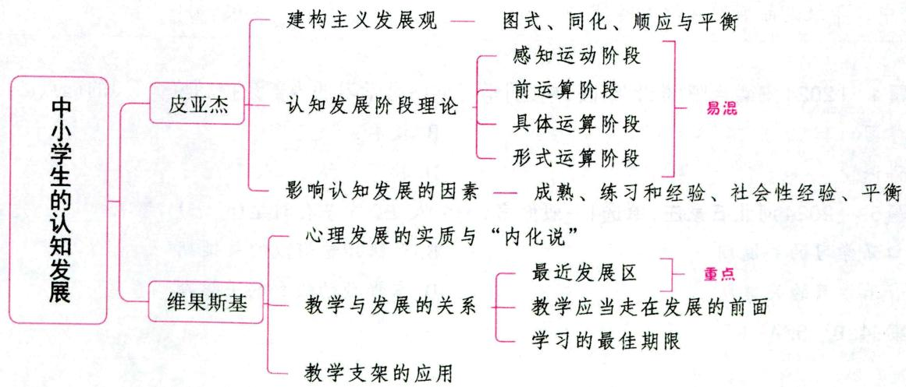

# 一、皮亚杰的认知发展观 ★★★ 【单选、多选、填空、判断、简答】

# 考点1 建构主义的发展观

# 1. 心理发展的实质

皮亚杰的理论核心是“发生认识论”。皮亚杰认为, 发展就是个体在与环境的不断相互作用中的一种建构过程, 其内部的心理结构是在不断变化的。这种变化不是简单地在原有的信息的基础上加上新的事实和思想, 而是涉及思维过程的质的变化。皮亚杰认

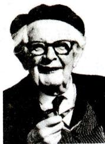  
皮亚杰

为,人的知识来源于动作,动作是感知的源泉和思维的基础。儿童心理发展的实质和原因就是主体通过动作完成对客体的适应。适应的本质在于取得机体与环境的平衡。适应分为两种不同的类型:同化和顺应。儿童对环境做出的适应性变化并不是消极被动的过程,而是一种内部结构的积极建构过程,即儿童的认知是在已有图式的基础上,通过同化、顺应和平衡,不断从低级向高级发展。

# 2.图式、同化、顺应与平衡

(1)图式。图式是指人在认识周围世界的过程中，形成自己独特的认知结构。从发展的角度来看，儿童最初的图式是遗传所带来的一些本能反射行为，如吸吮反射、定向反射等。  
(2)同化。同化是指有机体在面对一个新的刺激情境时，把刺激整合到已有的图式或认知结构中。通过这一过程，主体才能对新刺激做出反应，动作也得以加强和丰富。同化是图式发生量变的过程，它不能引起图式的质变，但影响图式的生长。  
(3)顺应。顺应是指当有机体不能利用原有图式接受和解释新刺激时，其认知结构发生改变来适应新刺激的影响。顺应是图式发生质变的过程。通过顺应，儿童的认知能力达到一个新的水平。  
(4)平衡。平衡是指同化和顺应之间的“均衡”。皮亚杰认为，同化和顺应过程对于认知能力的发展变化是非常重要的。儿童通过同化和顺应达到机体与环境的平衡，如果失去平衡，就需要改变行为以重建平衡。但平衡是相对的，不是绝对的。儿童在平衡与不平衡的交替中不断建构和完善认知结构，实现认知发展。

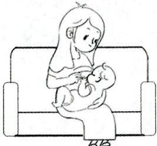  
① 小孩天生有吸吮的图式。

  
② 原有的图式“吸吮”接纳新的刺激“奶瓶”，认知结构没有发生根本变化，这是同化。

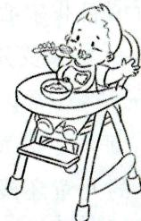  
③ 小孩改变原有的图式“吸吮”，学会用“咀嚼”的动作来接纳新的刺激，比如米饭、菜等，认知结构发生了根本变化，这是顺应。

  
$④$ 我们时而需要同化，时而需要顺应，以达到身体与环境的平衡，这就是平衡。

# 小香课堂

考生在区分同化和顺应时应注意理解两个词：整合、改变。“整合”在同化时发生，即补充、完善认知结构（认知结构量变）。“改变”在顺应时发生，即改变认知结构（认知结构质变）。

真题1[2022广西桂林，单选]“发展就是个体在与环境的不断相互作用中的一种建构过程，其内部的心理结构是在不断变化的”，提出这一观点的是（）

A. 陶行知

B. 洛克

C. 皮亚杰

D.科尔伯格

答案：C

# 考点2 皮亚杰的认知发展阶段理论

皮亚杰认为思维或智慧的发展是整个心理发展的核心，其发展阶段最主要的特点是：阶段出现的先后顺序固定不变，每一阶段都有其独特的图式或认知结构，图式或认知结构的发展是一个连续建构的过程。他提出了认知发展的阶段理论，将个体的认知发展分为以下四个阶段：

# 1. 感知运动阶段（0~2岁）

感知运动阶段的婴儿主要有以下几个方面的特征：

(1)感觉和动作的分化。儿童只能依靠自己的肌肉动作和感觉应付环境中的刺激。  
(2)“客体永久性”（即知道某人或某物虽然现在看不见但仍然是存在的）的形成。在感知运动阶段的后期，完整清晰的客体永久性已经形成。此时，尽管儿童并没有看见这些物体放在某个特定的地方，但也能积极地寻找他们认为被藏起来的东西。  
(3)问题解决能力开始得到发展。起初,个体的行为更多是以尝试一错误为基础,后期则能够计划解决问题的方法。例如,想要东西的婴儿可能会伸手够几次但最终放弃。几个月之后,他们可能会用其他物体来帮助自己得到想要的物体。到2岁时,他们可能会非常善于利用工具来帮助自己获得所向往的东西。  
(4)延迟模仿的产生。皮亚杰研究发现，12~18个月的婴儿能够比较精确地进行模仿，到18个月左右就出现了延迟模仿，即儿童观看了他人的某一动作，过了一段时间以后，仍能将此动作再现出来的能力。

# 2. 前运算阶段（2~7岁）

这一阶段，儿童的思维特征主要表现在以下八个方面：

(1)早期的信号功能。皮亚杰认为，儿童内在表征系统发展的最早表现是延迟模仿。延迟模仿使得儿童能将各种信息以心理符号的形式贮存下来，从而促进儿童表象性思维的发展。随着年龄的增长，儿童越来越多地使用符号来表示外部世界，如用“牛”“羊”来代表真正的牛和羊等。  
(2)自我中心性（中心化）。所谓自我中心就是指儿童往往只注意主观的观点，不能向客观事物集中，只能考虑自己的观点，无法接受别人的观点，也不能将自己的观点与别人的观点协调。儿童还不能设想他人所处的情境，常以自己的经验为中心，从自己的角度出发来观察和理解世界。皮亚杰的“三山实验”证明了儿童“自我中心”的思维特征。  
(3)不可逆运算。前运算阶段的儿童还没有“守恒”能力或没有形成“守恒”的概念，思维缺乏观念的传递性。儿童观察事物时往往只能注意表面的、显著的特征，倾向于注意事物的静止状态。思维活动表现的关系单一，不能进行可逆运算。例如，问一名4岁儿童：“你有兄弟吗？”他回答：“有。”“兄弟叫什么名字？”他回答：“吉姆。”但反过来问：“吉姆有兄弟吗？”他回答：“没有。”  
(4)不能够推断事实。前运算阶段的儿童往往是根据知觉到的表面现象做出反应，不能够推断事实。例如，给3岁的幼儿一辆红色的玩具小汽车，当着他的面盖上一块罩子，小汽车看起来是黑色的，问他小汽车是什么颜色的，他会说是黑色的。  
(5)泛灵论。前运算阶段儿童的思维具有泛灵论的特点,即将人类的特征赋予无生命的物体。前运算阶段的儿童会认为任何物体都是有生命的。例如,如果让前运算阶段的儿童把洋娃娃扔到地上去,他会说不能扔到地上,会摔疼洋娃娃的。  
(6) 不合逻辑的推理。前运算阶段儿童思维的另一个局限是不合逻辑的推理，这种推理既不是演

绎推理也不是归纳推理。根据皮亚杰的观点，前运算阶段儿童的思维是在这两者之间，即从特殊到特殊而不涉及一般。

(7)不能理顺整体和部分的关系。皮亚杰称之为缺乏层级类概念(类包含关系)。  
(8)认知活动具有具体性，还不能进行抽象的思维运算。

# 3. 具体运算阶段（7～11岁）

具体运算是一种与真实、具体的物体相关的可逆的心理活动。与前运算阶段相比, 具体运算阶段的儿童能够运用逻辑思维解决具体问题, 但必须依赖于实物和直观形象的支持才能进行逻辑推理和运用逻辑思维解决问题, 不能够进行纯符号运算。他们虽然能理解原则和规则, 但在实际生活中只能刻板地遵守规则, 不敢改变。这一阶段儿童的思维具有以下特征:

(1)去自我中心性（去中心化）。具体运算阶段的儿童不能想象独立于他们直接经验之外的事物，但能够考虑多个感知特征，即去自我中心，得出具体问题的解决方法。在皮亚杰的“三山实验”任务中， $7\sim 9$ 岁的儿童就能够注意到一种情境的多个方面，从他人的角度理解问题。在这一时期，儿童区别现实与想象的能力得到提高。  
(2)可逆性。皮亚杰提出，在儿童思维发展的所有特征中最重要的是可逆性。一个具体运算阶段的儿童能理解先前曾是一团泥土的飞机模型能够再变成一团泥土；他同样明白8个珠子加6个珠子等于14个珠子，而从14个珠子中拿走6个珠子还剩8个珠子。  
(3)守恒（即儿童认识到客体在外形上发生了变化，但特有的属性不变）。处于具体运算阶段的儿童能够去中心化并能逆向运算，因此守恒能力迅速发展。6岁左右的儿童可以解决数字守恒问题，7或8岁的儿童则能解决面积或容积守恒问题，9~10岁的儿童能够解决重量守恒问题，到11或12岁时儿童能解决体积守恒问题。另外，儿童开始进行一些运用符号的逻辑思考活动，可以形成一系列的行动心理表象。比如，8岁左右的儿童去过几次小朋友的家，就能够画出具体的路线图来，而5、6岁的儿童则无法做到。  
(4)分类。具体运算阶段的儿童，他们在对物体进行分类时，不再像前运算阶段的儿童，只能进行单维度的分类，而是能根据物体的多个维度进行分类。例如，前运算阶段的儿童，常根据物体的颜色或形状分类，不能根据主题（即事物的逻辑关系）进行分类。而具体运算阶段的儿童，既能按颜色、形状分类，又能按主题进行分类。  
(5)序列化。序列化是指儿童能够根据大小、体积、重量或其他的一些特性对一系列要素进行心理上的排序。排序的能力在4岁或更小的儿童中就已经出现，但他们的排序比较粗糙，并且要经过尝试错误。具体运算阶段的儿童能够顺利完成排列大小的任务。例如，给他们长短不等的小木棒，他们能够按照从长到短或从短到长的顺序进行排序。

# 4. 形式运算阶段（11岁～成人）

形式运算阶段，是儿童思维发展趋于成熟的阶段。本阶段儿童思维的特征如下：

(1)命题之间的关系。本阶段儿童的思维是以命题形式进行的。他们不仅能考虑命题与经验之间的真实性关系，而且能看到命题与现实之间的关系，并能推论两个或多个命题之间的逻辑关系。  
(2)假设一演绎推理。本阶段的儿童不仅能够运用经验一归纳的方式进行逻辑推理, 而且能够运用假设一演绎推理的方式来解决问题。  
(3)类比推理。形式运算阶段的儿童能够很好地进行类比推理，能够理解类比关系。例如，“皮毛

对狗就像羽毛对鸟一样”，这个类比的核心是“狗一皮毛”与“鸟一羽毛”之间的关系。只有通过反省性思维，而不是观察，才可能理解这种关系。

(4)抽象逻辑思维。本阶段的儿童能理解符号的意义、隐喻和直喻，能对事物做一定的概括，其思维发展水平已接近成人的水平。  
(5)可逆与补偿。本阶段的儿童不仅具备了逆向性的可逆思维，而且具备了补偿性的可逆思维。例如，对于“在天平的一边加一点东西，天平就失去平衡，怎样使天平重新平衡”的问题，他们不仅能考虑把所加的重量拿走（逆向性），而且能考虑移动较重的盘子使它靠近支点，即使力臂缩短（补偿性）。  
(6)反思能力。形式运算阶段的儿童具备了反思能力，即系统地检验假设的能力，能够系统地概括出解决某一问题的所有可能方法或能进行组合推理。  
(7)思维的灵活性。本阶段的儿童不再刻板地恪守规则，反而常常由于规则与事实的不符而违反规则。对这一年龄阶段的儿童，教师和家长不宜采用过多的命令和强制性的教育，而应鼓励和指导他们自己做决定，同时对他们考虑不全面的地方提出建议和改进的办法。  
(8)形式运算思维的逐渐发展。形式运算思维是逐渐出现的，而不是一次全部出现。

真题2 [2024天津滨海新区，单选]皮亚杰认为，儿童内在表征系统发展的最早表现是（）

A. 象征

B. 符号

C. 平衡

D. 延迟模仿

真题3 [2024广东东莞, 单选]小明知道能量守恒, 会结合具体事物进行思考和运算。他处在皮亚杰认知发展的哪个阶段（）

A. 感知运动阶段

B. 前运算阶段

C. 具体运算阶段

D. 形式运算阶段

真题4 [2023黑龙江哈尔滨，多选]根据皮亚杰的认知发展阶段理论，处于形式运算阶段儿童思维的典型特征有（）

A.进行假设—演绎推理

B. 进行抽象逻辑思维

C. 进行具体逻辑推理

D. 认识命题之间的关系

答案：2.D 3.C 4.ABD

# 考点3 影响认知发展的因素

# 1. 成熟

皮亚杰认为，成熟在于揭开新的可能性，它是某些行为模式出现的必要条件，而如何使可能性变为现实性，这有赖于个体的练习和经验。

# 2.练习和经验（自然经验）

练习和经验指个体在对物体施加动作的过程中的练习和习得的经验(不同于社会经验)。皮亚杰把经验区分为物理经验和逻辑数理经验两种。

# 3. 社会性经验（社会环境）

社会性经验指社会环境中人与人之间的相互作用和社会文化的传递。社会环境因素对个体的发展具有重要影响，但不是影响个体发展的充分因素。与物理的经验一样，它们对主体发展发挥作用必须建立在它们能被主体同化的基础上。

# 4.平衡

平衡是心理发展的决定因素。平衡具有自我调节的作用，通过调节同化和顺应的关系，使个体的

认知不断发展。

真题5 [2023河南信阳,多选]皮亚杰认为推动儿童心理发展的因素有( )

A.平衡

B. 社会环境

C. 成熟

D. 经验

答案：ABCD

# 二、维果斯基的心理发展观 ★★★ 【单选、多选、填空、判断、案例分析】

# 考点1 “文化一历史”发展理论的基本观点

维果斯基强调社会文化在认知发展中的作用。为此，维果斯基创立了“文化一历史”发展理论。维果斯基根据恩格斯关于劳动在人类适应自然和在生产过程中借助于工具改造自然的作用的思想，详细地阐述了高级心理机能的社会起源的观点。

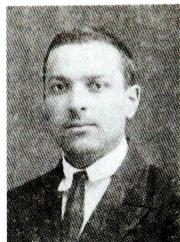  
维果斯基

# 1. 两种工具的理论

维果斯基认为，人有两种工具：一种是物质工具，如原始人所使用的石刀、石斧，现代人所使用的机器；另一种是精神工具，主要指人类所特有的语言、符号等。人因使用精神工具，从而使人类的心理发生质的变化，上升到高级阶段。精神工具与物质工具一样，受人类文化历史发展的影响，是不断发展变化的。

# 2. 两种心理机能

维果斯基认为，必须区分两种心理机能：（1）作为动物进化结果的低级心理机能，如简单的感觉和无意注意等。（2）作为历史发展结果的高级心理机能，即以符号系统为中介的心理机能，如抽象逻辑思维。高级心理机能是人类所特有的，它使得人类心理在本质上区别于动物。维果斯基指出，儿童在与成人交往的过程中，通过掌握高级心理机能的工具——语言符号这一中介环节，使其在低级的心理机能基础上形成了各种新的心理机能。

# 考点 2 心理发展的实质与“内化说”

维果斯基强调环境和社会因素在儿童发展中的重要作用。他提出心理发展的实质是在环境和教育的影响下，个体在低级心理机能的基础上逐渐向高级心理机能转化的过程。他认为，发展大部分得益于由外向内，即个体通过内化，从情境中汲取知识，获得发展。儿童的许多学习发生在与环境的相互作用中，这个环境决定了大部分儿童内化的内容。在儿童环境中的父母和其他人，可以通过与儿童的相互作用来扩大儿童的知识视野，促进儿童的学习。内化说是维果斯基心理发展观的核心思想。

# 考点3 教学与发展的关系

在维果斯基看来，社会文化历史对儿童心理发展的影响，集中体现在学校教学上，学校教学是儿童发展的源泉。在教学与发展的关系上，维果斯基提出了三个重要的问题：一个是最近发展区思想；一个是教学应当走在发展的前面；一个是关于学习的最佳期限问题。

# 1.最近发展区的概念

维果斯基认为，儿童有两种发展水平：一是儿童的现有水平，即由一定的已经完成的发展系统所形成的儿童心理机能的发展水平；二是可能（即将）达到的发展水平。这两种水平之间的差异，就是最近发展区。也就是说，最近发展区是儿童在有指导的情况下，借助成人的帮助所能达到的解决问题的水

平与独自解决问题所达到的水平之间的差异,实际上是两个邻近发展阶段间的过渡状态。由于两个水平之间的差异是不断变化发展的,因此,需要在一个动态评估环境中测查最近发展区。

# 2.教学应当走在发展的前面

在维果斯基看来，教学的可能性由学生的最近发展区决定，“教学应该走在发展的前面”。这里有两层含义：(1)教学在发展中起主导作用。它决定着儿童的发展，决定着发展的内容、水平、速度及智力活动的特点。(2)教学创造着最近发展区。教学应适应学生的现有水平，但更重要的是要发挥教学对发展的主导作用。

它的提出说明了儿童发展的可能性, 其意义在于: 指导教育者不应只看到儿童今天已达到的发展水平, 还应看到仍处于形成的状态, 正在发展的过程。所以, 维果斯基强调教学不能只适应发展的现有水平, 还应适应最近发展区, 从而走在发展的前面, 最终跨越“最近发展区”而达到新的发展水平。因此, 教学的最佳效果产生于“最近发展区”。

# 3. 学习的最佳期限

怎样发挥教学的最大作用？维果斯基强调学习的最佳期限。如果脱离了学习某一技能的最佳年龄，从发展的观点来看是不利的，它会造成儿童智力发展的障碍。因此，开始某一种教学，必须以成熟与发育为前提，但更重要的是教学必须首先建立在正在开始形成的心理机能的基础上，走在心理机能形成的前面。

# 考点 4 适时辅导学生是教学的必由之路——教学支架的应用

为促进教学发展, 维果斯基认为教师可采用教学支架, 进行支架式教学, 即在学生试图解决超出当前知识水平的问题时给予支持和指导, 帮助其顺利通过最近发展区, 使之最终能够独立完成任务。

支架式教学可采用的方式有：(1)把学生要学习的内容分割成许多便于掌握的片段；(2)向学生示范要掌握的技能；(3)提供有提示的练习等。需要注意的是，教师提供的支持和帮助要合适。帮助过多，学生独立解决问题的能力就不能充分发展；帮助不够，学生亦可能因失败而泄气，久而久之，可能会形成习得性无助感。

真题6 [2023山西太原，单选]邓老师认为，在教学中要注意把握好学生的现有水平和在教师的帮助下可能达到的水平之间的差异，邓老师的教学观点符合（）

A. 掌握学习理论  
B. 最近发展区理论  
C. 观察学习理论  
D. 先行组织者理论

真题7 [2023河北衡水，多选]下列关于儿童“最近发展区”的观点，正确的是（）

A. 发展要先于教学, 以更好地进行教学  
B. 教学内容应略高于儿童的现有发展水平  
C. 教学要走在发展的前面, 以更好地促进发展  
D. 教学应同时考虑儿童现有发展水平和所能达到的水平

答案：6.B 7.BCD

# ★本节核心考点回顾 ★

1. 建构主义的发展观

皮亚杰认为，发展是个体在与环境的不断相互作用中的一种建构过程，其内部的心理结构是在不

断变化的。

# 2. 皮亚杰的认知发展阶段理论

(1)感知运动阶段：①感觉和动作的分化；②客体永久性；等等。  
(2)前运算阶段：①早期的信号功能：儿童内在表征系统发展的最早表现是延迟模仿；②自我中心性；③不可逆运算；④泛灵论；等等。  
(3)具体运算阶段：①去自我中心性；②可逆性；③守恒；等等。  
(4)形式运算阶段：①命题之间的关系；②假设—演绎推理；③抽象逻辑思维；等等。

# 3. 影响认知发展的因素

(1) 成熟；(2) 练习和经验；(3) 社会性经验（社会环境）；(4) 平衡。

# 4. 维果斯基的心理发展观

(1) 最近发展区: 儿童有两种发展水平, 一是儿童的现有水平, 即由一定的已经完成的发展系统所形成的儿童心理机能的发展水平; 二是可能 (即将) 达到的发展水平。这两种水平之间的差异, 就是最近发展区。

(2)教学应当走在发展的前面。

# 第三节 中小学生人格、社会化发展

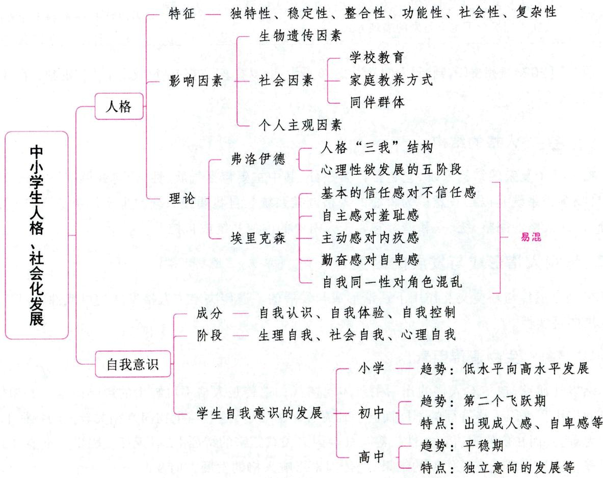

# 一、人格 ★★ 【单选、多选、判断】

# 考点 人格的概念

人格是构成一个人思想、情感及行为的特有模式，这个独特模式包含了一个人区别于他人的稳定而统一的心理品质，即人格是决定个体的外显行为和内隐行为，并使其与他人行为有稳定区别的综合心理特征。

# 考点2 人格的特征

表 3-3 人格的特征  

<table><tr><td>特征</td><td>含义</td><td>典例</td></tr><tr><td>独特性</td><td>不同的遗传、生存及教育环境,形成了各自独特的心理特点</td><td>人心不同,各如其面</td></tr><tr><td>稳定性</td><td>一个人的某种人格特征一旦形成,就相对稳定下来了,要想改变它是比较困难的事情</td><td>江山易改,禀性难移;三岁看大,七岁看老</td></tr><tr><td>整合性</td><td>人格是由多种成分构成的有机体,具有内在的一致性,受自我意识的调控</td><td>健康的人格特征或“分裂人格”</td></tr><tr><td>功能性</td><td>人格决定一个人的生活方式,有时甚至会决定一个人的命运</td><td>一个人的性格就是他的命运</td></tr><tr><td>社会性</td><td>社会化把人这样的动物变成社会的成员。人格是社会的人所特有的</td><td>人满足食物需要的内容和方式是受具体的社会历史条件制约的</td></tr><tr><td>复杂性</td><td>几种人格特征表现在活动中的具体结合方式因人而异。同一人格特征在不同场合下也有不同的表现方式</td><td>横眉冷对千夫指,俯首甘为孺子牛</td></tr></table>

真题1 [2023贵州贵阳, 判断]人们常说“三岁看大, 七岁看老”, 这句话反映出了人格的独特性。（）

答案：×

# 考点 3 人格的结构

人格是一个复杂的结构系统，它包括许多成分，其中主要包括气质、性格、自我调控系统三个方面。其中，自我调控系统是以自我意识为核心的人格调控系统。自我调控系统的主要作用是调控人格的各个成分，保证人格的完整、统一、和谐。它属于人格中的内控系统或自控系统。

# 二、影响人格形成与发展的因素 ★★ 【单选、多选、简答】

人格是在遗传与环境交互作用下逐渐形成与发展的。遗传决定了人格发展的可能性，环境决定了人格发展的现实性。

# 考点1 生物遗传因素

总结以往研究，遗传对人格的作用主要体现在：(1)遗传是人格不可缺少的影响因素。(2)遗传因素对人格的作用程度因人格特征的不同而异。通常在智力、气质这些与生物因素相关较大的特征上，遗传因素较为重要；而在价值观、信念、性格等与社会因素关系紧密的特征上，后天环境因素更重要。(3)人格发展过程是遗传与环境交互作用的结果，遗传因素影响人格的发展方向及改变。

# 考点2 社会因素

人格的发展是个体社会化的结果。不管什么社会，影响个体人格发展的社会因素基本上都是家庭、学校、同伴以及电视、电影、文艺作品等社会宣传媒体。

# 1. 家庭教养方式

# (1)专制型、放纵型、民主型

鲍姆宁(鲍姆林德)曾根据控制、成熟的要求、父母与儿童的交往、父母的教养水平等四个指标，将父母的教养行为分成专制型、放纵型和民主型三种方式，具体内容见下表：

表 3-4 家庭教养方式 (四个指标)  

<table><tr><td>类型</td><td>父母表现</td><td>孩子表现</td></tr><tr><td>专制型</td><td>过于支配</td><td>消极、被动、依赖、服从、懦弱，做事缺乏主见，甚至会形成不诚实的性格特征</td></tr><tr><td>放纵型</td><td>溺爱、任孩子随心所欲，对孩子的教育有时会处于失控状态</td><td>任性、幼稚、自私、野蛮、无礼、独立性差、蛮横无理、胡闹，表现最不成熟</td></tr><tr><td>民主型</td><td>平等和谐，尊重孩子</td><td>活泼、自立、彬彬有礼、善于交往、富于合作精神、思想活跃等，表现最成熟</td></tr></table>

# (2)权威型、专制型、溺爱型、忽视型

后来, 鲍姆宁根据新的研究, 提出了教养方式的两个维度: 要求和反应性。要求指的是父母是否对孩子的行为建立适当的标准, 并坚持要求孩子去达到这些标准。反应性指的是对孩子接受和爱的程度及对孩子需求的敏感程度。根据这两个维度, 可以将父母的教养方式分为权威型、专制型、溺爱型(放纵型)、忽视型四类。

表 3-5 家庭教养方式 (两个维度)  

<table><tr><td>类型</td><td>父母表现</td><td>孩子的人格特点</td></tr><tr><td>权威型</td><td>对孩子提出合理的要求，对孩子的行为做适当的限制，设立恰当的目标，并坚持要求孩子服从和达到这些目标；表现出对孩子成长的关爱，会耐心地倾听孩子的观点</td><td>自信、自控能力强、心境乐观积极、勤奋努力</td></tr><tr><td>专制型</td><td>对孩子的要求很严厉，提出很高的行为标准，这些标准和要求有时不近情理，没有孩子说话的权利</td><td>焦虑、退缩、敌视他人、适应环境困难</td></tr><tr><td>溺爱型（放纵型）</td><td>对孩子充满了爱和期望，却忘记了孩子社会化的任务，因此很少给孩子提出什么要求或进行任何控制</td><td>自我控制能力差、好冲动、依赖性强、没有恒心和毅力</td></tr><tr><td>忽视型</td><td>对孩子的成长漠不关心</td><td>适应新环境困难、兴趣少、自我控制能力差、对他人不信任</td></tr></table>

# 2.学校教育

学校教育按一定的社会教育目标，有计划、有步骤地对学生施加影响，因而直接制约着学生人格发展的方向和基本质量。学校教育在学生社会化中的作用主要是通过教师与学生的相互影响来实现的。教师对学生人格的发展具有指导定向的作用。教师的品德修养、知识经验、教育和教学技巧、对学生的态度等，对于学生社会化与人格的发展都有举足轻重的意义。

# 3.同伴群体

同与父母的关系相比，中学生与同龄伙伴的交往更加自由和平等。与同伴群体的交往使儿童能够进行对人际关系和交流的探索，并发展人际敏感性，奠定儿童今后社会交往的基础，促进儿童的社会化和人格的发展。一方面，同伴群体是儿童学习社会行为的强化物。另一方面，同伴群体又为儿童的社会化和人格发展提供社会模式或榜样。

随着年龄的增长,同伴的影响越来越强,在某种程度上甚至超过父母的影响。但应该注意的是,不良同伴群体对中学生人格发展的影响极坏。教师要让学生远离这种不良同伴群体,防止其对学生成长带来危害,同时,对于已存在的不良群体,应采取一些教育手段,对其成员进行分化和引导。

真题2 [2023辽宁营口，单选]在（ ）教养模式下长大的孩子，人格特点是难以适应新环境、兴趣少、自控能力差且不信任他人。

A. 权威型

B. 专制型

C.溺爱型

D. 忽视型

真题3 [2024河北石家庄，多选]在放纵型家庭教养方式下长大的孩子，其表现主要有（）

A.蛮横无理

B. 任性幼稚

C. 缺乏主见

D. 善于交往

答案：2.D 3.AB

# 考点 3 个人主观因素

社会上各种影响因素，首先要为个人理解和接受，才能转化为个体的需要、动机和兴趣，才能推动个体去思考与行动。另外，个体已有的心理发展水平对人格特征形成的作用会随着年龄的增加而日益增强。

# 三、人格理论

# 考点1 弗洛伊德的人格发展理论 ★ 【单选、多选、填空】

# 1.弗洛伊德的人格“三我”结构

弗洛伊德认为，人格由本我、自我和超我三部分构成。

(1)本我。本我位于人格结构的最底层，是最原始的、与生俱来的潜意识的结构部分。它是由先天的本能、欲望组成的能量系统，包括各种生理需要。本我是无意识、非理性、非社会化和混乱无序的。它遵循快乐原则。  
(2)自我。自我是从本我中逐渐分化出来的，位于人格结构的中间层。自我的作用主要是调节本我与超我之间的矛盾，它一方面调节着本我，一方面又受制于超我。自我是人与外部世界的媒介，它适应环境中的一些条件和限制，代表人的学习、训练和经验，遵循现实原则。  
(3)超我。超我位于人格结构的最高层,是道德化了的自我,由社会规范、伦理道德、价值观念内化而来,其形成是社会化的结果。超我遵循道德原则,它的机能主要是监控、批判和管束自己的行为,其特点是追求完美。

本我是生物本能我，自我是心理社会我，超我是道德理想我。当三者处于协调状态时，人格就表现出一种健康状况；当三者互不相让，产生敌对关系时，就会产生心理疾病。

# 2. 心理性欲发展的五阶段

弗洛伊德认为，人格发展的基本动力是人的本能，尤其是性本能。性本能表现为一种力量，这种力量被称为“力比多”。力比多集中的某些身体部位就是个体获得快感的重要区域，弗洛伊德称之为“性感区”。在儿童时期，三个重要的性感区是口腔、肛门和生殖器。这三个区域以特有的阶段次序成为儿童的兴奋中心，也形成了相应的五个人格发展阶段。

(1)口唇期(0~1岁)。在这一阶段，嘴和唇是性感区，婴儿的吸吮活动显示了最初的性欲冲动。如果婴儿口唇活动没有受到限制，成年后性格倾向于乐观、慷慨、开放和活跃等积极的人格特征；如果婴儿的口唇活动受到了限制，成年后性格倾向于依赖、悲观、被动、猜疑和退缩等消极的人格特征，甚至在行为上表现出咬指甲、烟瘾、酗酒、贪吃等。  
(2)肛门期（1~3岁）。在这一阶段，肛门成为性感区，儿童通过排泄消除紧张而获得快感。在这一时期，儿童会受到排便训练，这是儿童与外部纪律、权威的第一次接触，代表了本能冲动与外部社会规范之间的冲突。所以，排便训练的好坏会对儿童的心理发展产生重大影响。如果排便训练过于严格，可能使儿童形成各种过度控制的人格特征与行为习惯，如洁癖、吝啬、强迫性、渴求秩序等。但是，如果对排便训练不加限制，则个体在成年后容易形成邋遢、浪费、无条理、无秩序等心理行为特征。  
(3)性器期(3~6岁)。在这一阶段，性器官成为性感区。儿童在这一时期能够认识到两性之间在生理学上的差异和自己的性别，性器官成为儿童获得性满足的重要刺激来源，表现为喜欢抚摸和显露生殖器以及产生性幻想。这时的儿童以异性父母作为性欲对象，男孩产生恋母情结（俄狄浦斯情结），女孩产生恋父情结（厄勒克特拉情结）。  
(4)潜伏期(6~12岁)。在这一阶段，力比多处于休眠状态。儿童将性器期以异性父母为对象的性冲动转移到环境中的其他事情上去，如学习、游戏、体育、歌舞、艺术等。  
(5) 生殖期（12~20岁）。生殖期，又称为青春期或两性期。随着性器官的成熟，性快感或力比多投射的主要区域是生殖器。这一时期是个体走向社会化的时期，个体开始摆脱对父母的依赖，成为社会中的一个独立成员。

真题4 [2023辽宁锦州，单选]根据弗洛伊德的相关理论，人格结构中，（ ）的机能主要是监督、批判和管束自己的行为。

A. 本我

B. 他我

C. 自我

D. 超我

真题5 [2023广东深圳，单选]把儿童的心理发展分为五个阶段（口唇期、肛门期、性器期、潜伏期、两性期）的心理学家是（ ）

A. 华生

B. 弗洛伊德

C. 格塞尔

D. 斯金纳

答案：4.D 5.B

考点2 埃里克森的人格（心理社会）发展阶段论 ★★★【单选、填空、判断】

美国精神分析学家埃里克森认为，人格发展是一个逐渐形成的过程，必须经历八个顺序不变的阶段，其中前五个阶段属于儿童成长和接受教育的时期。每一个阶段都有一个由生物学的成熟与社会文化环境、社会期望之间的冲突和矛盾所决定的发展危机。成功而合理地解决每个阶段的危机或冲突将使个体形成积极的人格特征和健全的人格。

# 1. 基本的信任感对不信任感（0~1.5岁）

本阶段的发展任务是发展对周围世界，尤其是对社会环境的基本态度，培养信任感。如果父母或照料者给予婴儿适当的、稳定的与不间断的关切、照顾、哺育和抚摸，婴儿就会对父母产生一种信任感，认为这个世界是安全而可信赖的地方。这种对人、对环境的基本信任感是形成健康个性品质的基础，是以后各个时期发展的基础，尤其是青年时期发展起来的同一性的基础。信任在人格中形成了“希望”这一品质，它起着增强自我的作用。

# 2. 自主感对羞耻感（1.5~3岁）

本阶段的发展任务是培养自主性。儿童初步尝试独立处理事情，如果父母允许幼儿去做他们力所能及的事，鼓励幼儿独立探索的欲望，幼儿就会逐渐认识到自己的能力，养成主动、自主的性格；反之，如果父母溺爱和过分保护或过分批评指责，就可能使儿童怀疑自己对自我和环境的控制能力，产生羞耻感。因此，把握住“度”，才有利于在儿童人格内部形成“意志”品质。

# 3.主动感对内疚感（3～6岁）

本阶段的发展任务是培养主动性。由于身体活动能力和语言的发展，儿童有可能把活动范围扩展到家庭之外。儿童喜欢尝试探索环境，承担并学习掌握新的任务。此时，如果父母或教师对儿童的建议给予适当鼓励或妥善处理，则儿童不仅发展了主动性，还能培养明辨是非的道德感；反之，如果父母对儿童的问题感到不耐烦或嘲笑儿童的活动，儿童就会产生内疚感。当儿童的主动感超过内疚感时，他们就有了“目的”的品质。

# 4. 勤奋感对自卑感（6~12岁）

本阶段的发展任务是培养勤奋感。在这个时期,多数儿童已进入学校,第一次接受社会赋予他们并期望他们完成的任务。他们追求任务完成时获得的成就感及由此带来的长辈的认可和赞许。如果儿童在学习、游戏等活动中不断取得成就并受到成人的奖励,儿童将以成功、嘉奖为荣,养成乐观、进取和勤奋的性格;反之,如果由于学习方法不当或努力不够而多次遭受挫折或其成就受到漠视,儿童容易形成自卑感。本阶段影响儿童活动的主要因素已由父母转向同伴、学校和其他社会机构,教师在培养儿童勤奋感方面具有特殊作用。敏感、耐心、富于指导经验的教师有可能使具有自卑感的学生重新获得勤奋感。当儿童的勤奋感大于自卑感时,他们就会获得“能力”的品质。

# 5. 自我同一性对角色混乱（12～18岁）

本阶段的发展任务是培养自我同一性。自我同一性是指个体组织自己的动机、能力、信仰及活动经验而形成的有关自我的一致性形象。自我同一性的形成要求谨慎的选择和决策，尤其体现在职业定向、性别角色分化等方面。如果青少年不能整合这些方面和各种选择，或者根本无法在其中进行选择，就会导致角色混乱。角色混乱指个体不能正确选择适应社会环境的生活角色。这类青年无法“发现自己”，不能回答“我是谁”的问题，也不知道自己究竟是什么样的人，想要成为什么样的人。随着自我同一性的形成，个体就获得了“忠诚”的品质。埃里克森把忠诚定义为：“不顾价值系统的必然矛盾，而坚持自己确认的同一性的能力。”

其他三个阶段分别为：亲密感对孤独感（成年早期）、繁殖感对停滞感（成年中期）、自我整合对绝望感（成年晚期）。

# 知识再拔高·

# 马西娅对同一性状态的划分

马西娅根据探索(或危机)和承诺的程度的高低划分出四种同一性状态，以此描述四种同一性结果。四种同一性状态的表现特点描述如下：

<table><tr><td>维度</td><td>类型</td><td>表现特点</td></tr><tr><td>高探索、高承诺</td><td>同一性获得/同一性达成</td><td>这类个体已经经历了各种探索,仔细考虑过各种选择,做出了确定的选择,并对特定的目标、信仰和价值观做出了坚定、积极的承诺</td></tr><tr><td>高探索、低承诺</td><td>同一性延缓</td><td>这类个体正处于探索的过程,收集信息、尝试各种活动,希望发现引导他们生活的目标和价值观,积极地探索各种选择,但还没有对特定的目标、价值观和意识形态等做出有意识的投入</td></tr><tr><td>低探索、高承诺</td><td>同一性早闭</td><td>这类个体没有体验过明确的探索,但却对一定的目标和价值观做出了承诺,这种投入往往是基于父母或权威人物等重要他人的期望或建议,他们不加思考地接受了别人预先为他们准备好的同一性</td></tr><tr><td>低探索、低承诺</td><td>同一性弥散/同一性扩散/同一性混淆/同一性迷乱</td><td>这类个体没有仔细思考或探索过各种同一性问题,从来不去探索各种选择,也不去尝试做出努力,缺乏对自己的了解,没有方向感,没有确定自己的目标和价值观,也未对特定意识形态、价值观或社会角色做出清晰的承诺</td></tr></table>

真题6 [2024天津和平/西青，单选]青年人既有“少年心事当拿云”的壮志，也不可避免地会有“成长的烦恼”，在理想和现实、小我和大我等方面遇到一些困惑。根据埃里克森的心理社会发展理论，上述表达主要发生在（ ）阶段。

A.主动感对内疚感

B. 勤奋感对自卑感

C. 自我同一性对角色混乱

D. 亲密对孤独

真题7 [2024江苏苏州, 填空]埃里克森的儿童人格发展八阶段理论认为, 儿童的每一个阶段都有一个由生物学的成熟与社会文化环境、________之间的冲突和矛盾所决定的发展危机。

答案：6.C 7.社会期望

# 四、自我意识

# 考点1 自我意识的概念 ★【单选、多选、填空、判断】

自我意识是个体对自己以及自己与周围事物的关系的意识。自我意识是人格的重要组成部分，也是使人格各部分整合和统一起来的核心力量。

一般认为，自我意识包括三种成分：

（1）自我认识是对自己的洞察和理解，包括自我观察和自我评价。自我观察是指对自己的感知、思维和意向等方面的觉察；自我评价是指对自己的想法、期望、行为及人格特征的判断与评估，是自我调节的重要条件。

(2)自我体验是自我意识在情感上的表现，是伴随自我认识而产生的内心体验。自尊心、自信心是

自我体验的具体内容。自尊心是指个体在社会比较过程中所获得的有关自我价值的积极的评价与体验。教育心理学家古柏史密斯在其所著《自尊心的养成》一书中,提出培养学生自尊心的三个先决条件:①重要感;②成就感;③力量感。自信心是对自己的能力是否适合所承担的任务而产生的自我体验。自信心与自尊心都是和自我评价紧密联系在一起的。例如,当一个人对自己做正向的评价时就会产生自尊感,做负向评价时就会产生自卑感。

(3)自我控制是自我意识在行为上的表现，是实现自我意识调节的最终环节。当个体认识到某种社会要求后，会力求使自己的行为符合社会准则，从而激发自我控制的动机，并付诸行动。

真题8 [2022辽宁营口，多选]培养学生自尊心的三个先决条件包括( )

A. 成就感

B. 满足感

C. 重要感

D. 力量感

答案：ACD

考点2 自我意识的发展阶段 ★★ 【单选、填空、判断】

个体自我意识的发展经历了从生理自我到社会自我,再到心理自我的过程。

# 1.生理自我（自我中心期）

生理自我是自我意识最原始的形态。通常儿童1周岁末开始将自己的动作和动作的对象区分开来，把自己和自己的动作区分开来，并在与成人的交往中，按照自己的姓名、身体特征、行动和活动能力来看待自己，并做出一定的评价。生理自我在3岁左右基本成熟。

# 2.社会自我（客观化时期）

儿童在3岁以后，自我意识的发展进入社会自我阶段。他们从轻信成人的评价逐渐过渡到自我独立评价。这时，自我评价的独立性、原则性、批判性正在迅速发展，对道德行为的判断能力，也逐渐达到了前所未有的水平，从对具体行为的评价到有一定概括程度的评价。但他们的自我评价通常不涉及个人的内心世界和人格特征，自我的调节控制能力也较差，常出现言行不一的现象。社会自我到少年期基本成熟。

# 3. 心理自我（主观自我时期）

心理自我是在青春期开始发展和形成的。这时，青年开始形成自觉地按照一定的行动目标和社会准则来评价自己的心理品质和能力。他们的自我评价越来越客观、公正和全面，且具有社会道德性，并在此基础上形成自我理想，追求最有意义和最有价值的目标。

# 记忆有妙招·

为方便考生记忆，编者将自我意识的发展阶段总结成以下口诀：

3岁重生理，少年进社会，青春在心理。

真题9[2024河北石家庄，单选]个体自我意识的发展过程主要经历了三个阶段，依次是（）

A. 生理自我、社会自我、心理自我

B.生理自我、心理自我、社会自我

C. 心理自我、生理自我、社会自我

D. 心理自我、社会自我、生理自我

真题10 [2023湖北武汉，判断]生理自我是自我意识最原始的形态。（）

答案：9.A 10.√

# 考点 3 学生自我意识的发展 ★ 【单选、判断】

# 1.小学生自我意识的发展

# (1) 自我意识发展的趋势

小学阶段，儿童的自我意识处于客观化时期，是获得社会自我的时期。小学生的自我意识随着年龄的增长从低水平向高水平发展，但发展不是匀速的，而是既有快速上升期，又有平衡发展的时期。具体表现为：小学一、二年级是主要发展期；小学三年级至五年级期间，自我意识发展相对平稳；小学五年级至六年级是自我意识发展的第二个上升期。

# (2)自我意识发展的特点

从自我意识的各成分来看，发展并不同步。

①在自我概念方面。小学生自我概念的发展表现出以下特点：第一，自我描述从比较具体的、外部的特征向比较抽象的、内部的特征发展。第二，开始用心理词汇描述自己，但仍以具体形式看待自己，把自己的特征视为绝对的。例如，8～11岁的儿童会认为自己是善良的，因为自己将东西分给了同学或帮助了同学。但他们还不太理解自己的个性特征在不同的场合下会有不同的表现。第三，自我概念内容中的社会性随年级的升高而增多。  
②在自我评价方面。自我评价能力是自我意识发展的主要成分和主要标志。小学生自我评价发展的特点：第一，自我评价的独立性日益增长。第二，自我评价的批判性有一定程度的提高。低年级儿童的自我评价能力落后于评价他人的能力；低年级评价标准具有片面性；高年级的评价具有较为明显的批判性，并能对自己“一分为二”。第三，自我评价的内容逐渐扩大和深化。第四，自我评价的稳定性越来越高。  
③在自我体验和自我调控方面。小学生的自我体验逐步加深，自我调控能力还不高。

# 2. 初中生自我意识的发展

# (1) 自我意识发展的趋势

从初中开始，学生已经能够比较自觉地认识和评价自己的心理品质，独立地支配、调节自己的行动。青少年时期是自我意识发展的第二个飞跃期。其总的发展趋势是：从小学六年级开始到初中三年级，学生的自我意识发展总体上处于平稳期；从初三到高一年级为显著上升时期。

# (2) 自我意识发展的特点

① 初中生的自我体验随着年龄的增长而不断发展。主要表现在：第一，出现成人感。所谓成人感是指初中生感到自己已经长大成人，渴望参与成人的活动，要求独立，希望得到自尊的体验。第二，自尊感增强。所谓自尊感是指对社会评价与个人的自尊需要之间相互关系的反映。第三，出现自卑感。所谓自卑感是指一种轻视自己、不相信自己、对自己持否定态度的一种自我体验。  
②自我开始分化。开始分成“主我”和“客我”或“理想的自我”和“现实的自我”。初中生对自己的内心品质产生兴趣，开始要求自己了解自己的个性特点，关心自己的形象，想按自己的意愿塑造自己。当“主我”与“客我”、“理想的自我”与“现实的自我”产生矛盾时，他们会自责，对自己不满意。  
③能够更自觉地评价别人的和自己的个性品质，但评价别人和自己的个性品质的能力与高中生相比，水平还不高，而且也不稳定。

# 3. 高中生自我意识的发展

# (1) 自我意识发展的趋势

高中生的自我意识从总的发展情况来看，处于显著上升期之后的平稳期。但自我意识在某些成分的发展上又有缓慢上升的趋势，呈现“稳中有升”的特点。①高中生的自我评价水平随着年级的升高而不断提高；②自我体验在高一、高二比较平稳之后，又呈现缓慢上升的趋势；③自我控制方面，从高二开始，出现了缓慢上升的趋势。不难看出，高中二年级是学生自我意识各成分普遍提高的发展阶段。

# （2）自我意识发展的特点

高中生自我意识发展的特点有这几个方面：①自我意识中独立意向的发展；②自我意识的组成成分分化；③强烈地关心着自己的个性成长；④自我形象受到了空前的关注；⑤自我评价逐渐成熟；⑥自尊心强；⑦道德意识的高度发展。高中生在自我观察、自我评价、自我体验、自我监督、自我控制等自我意识的诸成分上都获得了高度的发展，并趋于成熟。

# ★本节核心考点回顾 ★

# 1.人格的特征

(1)独特性：不同的遗传、生存及教育环境，形成了各自独特的心理特点；  
(2)稳定性：一个人的某种人格特征一旦形成，就相对稳定下来了，要想改变它是比较困难的事情。

# 2.家庭教养方式

(1) 四个指标分类: ①专制型; ②放纵型; ③民主型。  
(2)两个维度分类：①权威型；②专制型；③溺爱型；④忽视型。

# 3. 弗洛伊德的人格发展理论

(1)弗洛伊德的人格“三我”结构：①本我（快乐原则）；②自我（现实原则）；③超我（道德原则）。  
(2) 心理性欲发展的五阶段: ① 口唇期; ② 肛门期; ③ 性器期; ④ 潜伏期; ⑤ 生殖期。

# 4.埃里克森的人格（心理社会）发展阶段论

(1)主动感对内疚感（4~5岁）：该阶段的发展任务是培养主动性。当儿童的主动感超过内疚感时，他们就有了“目的”的品质。  
(2) 勤奋感对自卑感（6~11岁）：该阶段的发展任务是培养勤奋感。当儿童的勤奋感大于自卑感时，他们就会获得“能力”的品质。  
(3) 自我同一性对角色混乱（12~18岁）：该阶段的发展任务是培养自我同一性。自我同一性是指个体组织自己的动机、能力、信仰及活动经验而形成的有关自我的一致性形象。

# 5. 自我意识的发展阶段

(1)生理自我：自我意识最原始的形态；(2)社会自我；(3)心理自我。

# 第四节 学生的个别差异

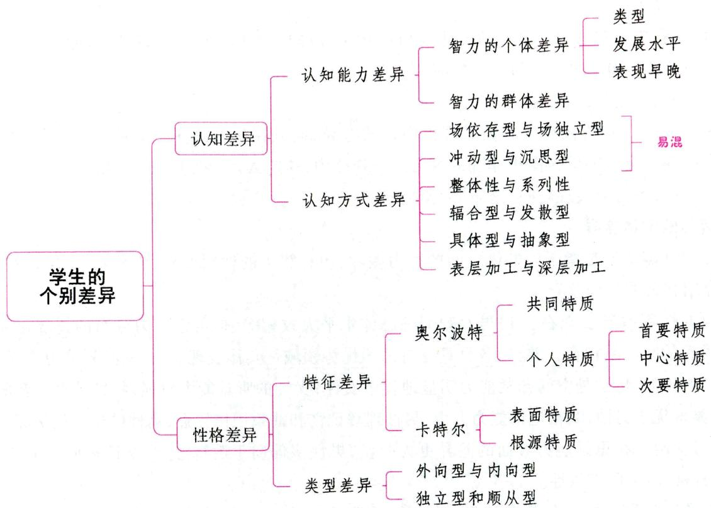

学生的个别差异，从心理角度来看，包括认知差异与性格差异。其中认知差异包括认知能力差异和认知方式差异。

# 一、学生的认知差异及教育意义

# 考点1 学生的认知能力差异 ★ 【单选、判断】

研究表明，个体的智力在13岁以前是直线上升发展的，以后缓慢发展，到25岁时达到最高峰， $26\sim 35$ 岁保持高原水平，35岁开始有下降趋势。学生的智力发展也存在一定的差异，主要表现在：

# 1. 智力的个体差异

# (1)智力类型差异

智力类型差异是指构成智力的各种因素存在质的差异，主要表现在知觉、记忆、想象、思维的类型和品质方面。例如，有的人长于想象，有的人长于记忆，有的人长于思维等。智力类型差异一般不代表智力水平的高低，只影响人们学习的过程和获取知识经验的方式。

# (2)智力发展水平的差异

智力发展水平的差异（即一般能力的差异），指的是个体之间或个体内部智力水平高低的不同程度。它表明人的智力发展有高有低。研究表明，人们的智力水平呈正态分布，又称常态分布，大多数人的智力属于中等水平。正态分布函数曲线呈钟形，因此，人们又经常称之为钟形曲线。

心理学家根据智力发展水平把儿童分成三个等级，即超常儿童、常态儿童、低常儿童。超常儿童是

指智力发展或某种才能显著超过同龄儿童平均水平的儿童。一般认为，IQ超过140的人属于天才，他们在人口中大约占 $1.3\%$ ；IQ超过130为智力超常，他们在人口中大约占 $4.4\%$ 。低常儿童是指智力发展明显低于同龄儿童平均水平并有适应性行为障碍的儿童，又称智力落后儿童。IQ低于70为智力落后，他们在人口中大约占 $2.7\%$ 。

另外，根据推孟对智力百分比的统计，IQ在 $110\sim 119$ 的人为优秀(中上或聪明)，IQ在 $90\sim 109$ 的人为中等智商，IQ在 $80\sim 89$ 的人为中下智商(迟钝)。

# (3)智力表现早晚的差异

各种智力不仅在质或量的方面表现出明显的差异，而且在智力表现的早晚上也存在着明显的差异。有的人在儿童时期就显露出非凡的智力或特殊能力，这叫人才“早慧”或“早熟”。在人的智力发展中，也有不少人的能力表现较晚，这叫“大器晚成”。

# 2. 智力的群体差异

智力的群体差异是指不同群体之间的智力差异，包括智力的性别差异、年龄差异、种族差异等，这里主要介绍智力的性别差异。

智力的性别差异表现在：（1）男女智力的总体水平大致相等，但男性智力分布的离散程度比女性大。（2）男女的智力结构存在差异，各自具有自己的优势领域。具体表现在：①在感知能力方面，男性的视知觉能力较强，特别是空间知觉能力明显地优于女性；女性的听觉能力较强，特别是对声音的辨别和定位，明显地优于男性；②在记忆能力方面，男性理解记忆和抽象记忆较强，女性的机械记忆和形象记忆较强；③男女两性在思维能力方面的差异更为明显，男性多偏向于逻辑思维，女性多偏向于形象思维；④女性的言语能力胜于男性。

智力是影响学习的一个重要因素。在传统教学条件下，智力是学习成绩的一个可靠的预测指标。然而，智力并不影响学习能否发生，它主要影响学习的速度、数量、巩固程度和学习迁移。

真题1[2024四川统考，判断]男性智力分布的离散程度比女性大，所以男性智力发展总体水平高于女性。（）

答案：×

考点2 学生的认知方式差异 ★★★ 【单选、判断、辨析】

认知方式,也称认知风格,是指人们在认知活动中所偏爱的信息加工方式。它是一种比较稳定的心理特征,存在着很大的个体差异。认知方式无优劣之分,只是表现为学生对某种信息加工方式的偏爱,主要影响学生的学习方式。

# 1.场依存型与场独立型

心理学家把外界环境描述为一个场。美国心理学家赫尔曼·威特金将认知方式分为两种：场依存型与场独立型。场依存型的学生对客观事物的判断常以外部线索为依据，其态度和自我认知易受周围环境或背景（尤其是权威人士）的影响，往往不易独立地对事物做出判断，而是人云亦云，从他人处获得标准；行为常以社会为定向，社会敏感性强，爱好社交活动。

场依存型和

场独立型

场独立型的学生对客观事物的判断常以自己的内部线索(经验、价值观)为依据，不易受到周围环境因素的影响和干扰，倾向于对事物独立判断；行为常是非社会定向的，社会敏感性差，不善于社交，关心抽象的概念和理论，喜欢独处。场依存型者与场独立型者在学习上的不同特点见表3-6。

表 3-6 场依存型者与场独立型者的学习特点  

<table><tr><td>比较范畴</td><td>场依存型者</td><td>场独立型者</td></tr><tr><td>学习兴趣偏好</td><td>人文、社会科学</td><td>理科、自然科学</td></tr><tr><td>学习成绩倾向</td><td>理科、自然科学成绩差,人文、社会科学成绩好</td><td>理科、自然科学成绩好,人文、社会科学成绩差</td></tr><tr><td>学习策略特点</td><td>易受暗示,学习欠主动,由外在动机支配</td><td>独立自觉学习,由内在动机支配</td></tr><tr><td>教学方式偏爱</td><td>结构严密的教学</td><td>结构不严密的教学</td></tr></table>

场依存型和场独立型可以通过“镶嵌图形测验”来测量。镶嵌图形测验也叫隐蔽图形测验，即令被试在较复杂的图形中用铅笔勾画出镶嵌或隐蔽在其中的简单图形。在测验中，能排除背景因素的干扰从复杂图形中迅速地知觉到指定的简单图形者为场独立型，而完成该项任务较为困难者为场依存型。

# 2. 冲动型与沉思型

杰罗姆·卡根将认知方式分为两种：冲动型与沉思型。

冲动型的学生在解决认知任务时，总是急于给出问题的答案，而不习惯对解决问题的各种可能性进行全面思考，有时问题还未弄清楚就开始解答。这种类型的学生认知问题的速度虽然很快，但错误率高，在运用低层次事实性信息的问题解决中占优势。他们更多的是使用整体加工方式。

沉思型的学生在解决认知任务时，总是谨慎、全面地检查各种假设，在确认没有问题的情况下才会给出答案。这种类型的学生解答认知问题的速度虽然慢，但错误率很低，在解决高层次问题时占优势。他们多采用细节性加工方式。

区分冲动型与沉思型的标准是反应时间和精确性。

# 3. 整体性与系列性

英国心理学家戈登·帕斯克将认知方式分为整体性与系列性。采取整体性策略的学生往往在开始阶段就对学习任务形成一个整体的看法，对学习过程中可能产生的问题与其将涉及的子问题以及自己将使用的方式、方法有一个初步的估计和预测。采取系列性策略的学生常常将重点放在一系列的子问题上，一般使用循序渐进的方法解决问题。

# 4.辐合型与发散型

辐合型认知方式是指在解决问题的过程中常表现出辐合思维的特征，表现为收集或综合信息与知识，运用逻辑规律缩小解答范围，直到找到最合适的唯一正确解答。发散型认知方式是指在解决问题的过程中常表现出发散思维的特征，表现为个人的思维沿着许多不同的方向发展，使观念发散到各个有关的方面，最终产生多种可能的答案而不是唯一正确的答案，因而容易产生有创见的新颖观念。

# 5.具体型与抽象型

具体型的学生在进行信息加工时，善于比较深入地分析某一具体观点或情境，但必须把尽可能多的信息提供给他们，否则很容易使他们产生偏见。抽象型的学生在对事物进行认知时，能够看到某个问题或论点的众多方面，可以避免刻板印象，能够容忍情境的模糊性并能进行抽象程度较高的思考。

# 6. 表层加工与深层加工

学习者在学习情境中加工信息时会表现出两种明显不同的方式：深层加工与表层加工。

深层加工指深刻理解所学内容,将所学内容与更大的概念框架联结起来,以获取内容的深层意义,

深层加工有利于侧重理解的考试。

表层加工指记忆学习内容的表面信息，不将它们与更大的概念框架联结起来，表层加工有利于侧重事实学习和记忆的考试。

# 知识再拔高·

# 学习风格的概念及其差异

# 1. 学习风格的概念

学习风格是学习者在探究、解决其学习任务时所表现出来的典型的、一贯的、独具个人特色的学习策略和学习倾向。学习风格的认知要素实质上是一个人的认知风格在学习中的体现。学习风格一经形成，就具有持久性和稳定性，并且无高低、好坏之分。

# 2. 学习风格差异——感觉通道的差异

感觉通道的差异是指学习者对于视觉、听觉和动觉刺激的偏好程度。学习者在感觉通道偏好上存在三种典型类型。

(1) 视觉型学习者。这类学习者对于视觉刺激较为敏感，习惯于通过视觉接受学习材料，如景色、相貌、书籍、图片等。他们适合于通过自己看书和做笔记进行学习，而不适合于教师的讲授和灌输。  
(2)听觉型学习者。这类学习者较为偏重听觉刺激，他们对于语言、声响和音乐的接受力和理解力较强，甚至喜欢一边学习，一边戴着耳机听音乐。当学习外语时，他们喜欢多听多说，而不太关心具体单词的拼写或者句型结构。  
(3)动觉型学习者。这类学习者喜欢接触和操作物体，对于自己能够动手参与的认知活动更感兴趣。因此，教师用手轻拍他们的头表示赞赏要比口头表扬产生的效果更好。

真题2 [2023广西百色，单选]( )对于自己能够动手参与的认知活动更感兴趣。

A. 视觉型学习者

B. 感觉型学习者

C. 听觉型学习者

D. 动觉型学习者

真题3 [2023河南信阳，单选]有学生在做镶嵌图形测验时，很难从整个图形中找出嵌入其中的简单图形。这种认知方式属于（）

A. 沉思型

B. 冲动型

C. 场独立型

D. 场依存型

真题4 [2024福建统考，辨析]俗话说：“三思而后行”，因而沉思型的认知方式优于冲动型。该观点是否正确？运用心理学知识加以分析。

答案：2.D 3.D 4.（1）这种观点是不正确的。（2）冲动型的学生认知问题的速度虽然很快，但错误率高，在运用低层次事实性信息的问题解决中占优势；沉思型的学生解答认知问题的速度虽然慢，但错误率很低，在解决高层次问题时占优势。认知方式没有优劣、好坏之分，只是表现为学生对信息加工方式的某种偏爱，主要影响学生的学习方式。

# 考点 3

# 学生认知差异的教育意义

# ★ 【判断】

教师必须根据学生认知差异的特点，不断改革教学，因材施教。这要求教师做到：

(1)创设适应学生认知差异的教学组织形式。为了适应学生的智力差异，常采用的教学组织形式包括：分校、分班、班内分组（同质分组）、复式教学、升留级、跳级、开设特长班和课外兴趣班等。

(2)采用适应认知差异的教学方式，努力使教学方式个别化。掌握学习、个别指导教学法和个人化教学系统就是其中的三种教学方式。  
(3)运用适应认知差异的教学手段。当前直接应用于教学的现代技术设备主要有计算机辅助教学、多媒体计算机辅助教学（电视及录像设备、电声设备、光学投影设备、教学机器）等。

# 二、学生的性格差异及教育意义

# 考点1 学生的性格差异 ★【单选、多选、判断】

# 1. 性格的特征差异

(1)奥尔波特将性格特征分为共同特质和个人特质。特质是决定个体行为的基本特性，是人格的有效组成元素，也是测评人格常用的基本单位。共同特质是在同一文化形态下的群体所共同具有的特质，它是在共同的生活方式下形成的。个人特质是个人所独有的、代表个人行为倾向的特质，它包括首要特质、中心特质和次要特质。首要特质是一个人最典型、最具有概括性的特质，它影响一个人各方面的行为，如多愁善感是林黛玉的首要特质。中心特质是构成个体独特性的几个重要特质，在每个人身上大约有5~10个，如清高、率直、聪慧、孤僻都属于林黛玉的中心特质。次要特质也是人格的组成因素，是个体的一些不太重要的特质，往往只有在特殊的情况下才会表现出来。  
(2)卡特尔将性格特征分为表面特质和根源特质。表面特质指从外部行为能直接观察到的特质。表面上看起来相似的特征或行为，却可能有大相径庭的原因。根源特质是决定外显行为的潜在变量，是人格的本质。卡特尔用因素分析的方法，找出了16种相互独立的根源特质。

# 2. 性格的类型差异

性格类型是指在一类人身上所共有的性格特征的独特结合。常见的分类学说有向性说和独立顺从说。依据个人心理活动的倾向性，可把人的性格分为外向型与内向型；依据一个人独立或顺从的程度，可把人的性格分为独立型和顺从型。

# 小香课堂·

个人特质的类型容易混淆，考生在区分时可从以下方面入手：“最典型、最具有概括性”对应首要特质；“几个、重要”对应中心特质；“不太重要”对应次要特质。

真题5 [2023河北邢台, 单选]在评价星星同学时, 所有任课老师最先想到的就是文静。“文静”是星星的（）

A. 首要特质

B. 中心特质

C. 共同特质

D. 体质特质

答案：A

# 考点2 学生性格差异的教育意义

(1)性格虽然不会决定学习是否发生，但它却会影响学生的学习方式。性格也可作为动力因素影响学习的速度和质量。性格的个别差异又会影响学生对学习内容的选择，而且还会影响学生的社会性学习和个体社会化。  
(2)为了促进学生的全面发展，学校教育应更重视性格因素的作用，使教育内容的选择和组织更好地适应学生的性格差异。

# ★本节核心考点回顾 ★

1. 智力的性别差异

(1) 男女智力的总体水平大致相等, 但男性智力分布的离散程度比女性大;  
(2)男女的智力结构存在差异，各自具有自己的优势领域。

2.学生的认知方式差异

认知方式无优劣之分，只是表现为学生对某种信息加工方式的偏爱，主要影响学生的学习方式。

(1)场依存型与场独立型

①场依存型：以外部线索为依据，易受周围环境影响，完成镶嵌图形测验较为困难；  
②场独立型：以内部线索为依据，不易受周围环境因素影响，进行镶嵌图形测验时能迅速知觉到指定的简单图形。

(2) 冲动型与沉思型

① 冲动型：解决问题强调速度而非精确性，运用低层次事实性信息的问题解决中占优势；  
②沉思型：看重解决问题的质量而非速度，解决高层次问题时占优势。

3.性格的特征差异——个人特质

(1)首要特质：一个人最典型、最具有概括性的特质；  
(2)中心特质：构成个体独特性的几个重要特质；  
(3)次要特质：个体的一些不太重要的特质。

# 第三章 学习理论

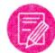

# 本章学习指南

# 一、考情概况

本章属于教育心理学的重点章节，也是考试中重点考查的章节，特点为体系庞大、理解性知识较多，考生可带着以下学习目标进行备考：

1.理解学习的概念。  
2. 识记并区分不同的学习分类。  
3. 掌握行为主义不同代表人物的学习理论。  
4. 识记并理解不同认知派心理学家的观点。  
5. 了解人本主义学习理论的内容。  
6. 识记并理解建构主义学习理论的主要内容。

# 二、考点地图

<table><tr><td>考点</td><td>年份/地区/题型</td></tr><tr><td>学习的概念</td><td>2024江苏单选;2024福建单选、判断选择;2024安徽判断;2023吉林多选;2022贵州单选;2022河南多选</td></tr><tr><td>加涅关于学习的划分</td><td>2024浙江单选;2024河北单选;2023吉林单选;2023广西单选;2023辽宁多选;2022辽宁单选</td></tr><tr><td>奥苏贝尔关于学习的划分</td><td>2024河北判断;2023湖南单选;2023山西单选;2022天津单选;2022河北单选;2022内蒙古单选;2022河南判断</td></tr><tr><td>巴甫洛夫的经典性条件反射学说</td><td>2023浙江单选;2023江苏单选;2023河北单选;2023天津单选;2023山西单选;2023河南多选</td></tr><tr><td>桑代克的联结—试误学习理论</td><td>2024安徽单选;2023河北单选;2023辽宁单选;2023山西单选;2023湖南判断;2022河南单选;2022河北判断</td></tr><tr><td>斯金纳的操作性条件作用理论</td><td>2024河南单选;2024广东单选;2024浙江判断;2024安徽判断;2023河南单选、判断;2023湖北单选;2023辽宁单选;2022辽宁单选;2022河南多选;2022广西判断</td></tr><tr><td>班杜拉的社会学习理论</td><td>2024山东单选;2024安徽单选;2024浙江单选;2024天津单选;2024广东判断;2023黑龙江单选;2023河南单选;2022浙江单选;2022福建填空</td></tr><tr><td>布鲁纳的认知—发现学习理论</td><td>2024河北单选;2023江苏单选;2023河南判断;2023浙江简答;2022广西单选</td></tr><tr><td>奥苏贝尔的有意义接受学习理论</td><td>2023黑龙江单选;2023河南单选;2022湖北单选;2022内蒙古判断</td></tr><tr><td>人本主义学习理论</td><td>2023山东单选;2023吉林单选;2023浙江单选;2022天津多选</td></tr><tr><td>建构主义学习理论</td><td>2024浙江单选、判断;2024贵州单选;2024河北判断;2023湖南单选;2023河南多选;2023辽宁判断;2022河南多选</td></tr></table>

注：上述表格仅呈现重要考点的相关考情。

# 第一节 学习概述

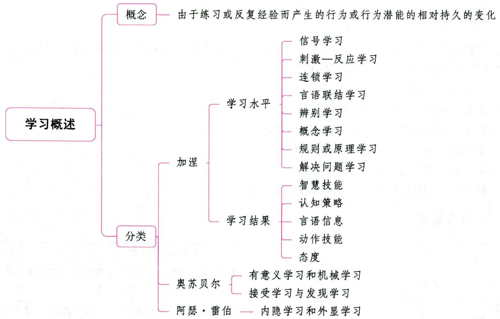

# 一、学习的概念 ★★ 【单选、多选、判断、判断选择】

学习是个体在特定情境下由于练习或反复经验而产生的行为或行为潜能的相对持久的变化。

  
学习的概念

一般认为，学习的概念有广义和狭义之分。广义的学习是指人类的学习和动物的学习。

狭义的学习是指人类的学习。然而，人类学习和动物学习存在着本质的区别：(1)人的学习除了要获得个体的行为经验外，还要掌握人类世世代代积累起来的社会历史经验和科学文化知识；(2)人的学习是在改造客观世界的生活实践及与他人交往的过程中，通过语言的中介作用而进行的；(3)人的学习是一种有目的、自觉的、积极主动的过程。本书采用广义的学习的概念。

学习的概念可以从以下几个方面去理解：(1)学习实质上是一种适应活动；(2)学习是人和动物共有的普遍现象；(3)学习是由反复经验引起的；(4)学习是有机体后天习得经验的过程；(5)学习的过程可以是有意的，也可以是无意的；(6)学习引起的是相对持久的行为或行为潜能的变化。

然而值得注意的是,并非所有的行为变化都是由学习产生的,如生理成熟、疲劳、药物等因素亦可引起行为的变化。

# 小香课堂·

考生在判断一项活动是否为学习时，可以从以下两个方面考虑：(1)学习的定义；(2)学习的“五非原则”，即非本能、非成熟、非疲劳、非药物、非病。

真题1 [2024安徽统考，判断]人类所有的行为变化都是由学习引起的。（）

答案：×

# 二、学习的分类

# 考点1

# 加涅关于学习的划分

# 【单选、多选、不定项、简答】

# 1. 学习水平分类

根据学习情境由简单到复杂、学习水平由低到高的顺序，加涅把学习分为八类，建构了一个完整的学习层级结构。

表 3-7 学习水平分类  

<table><tr><td>分类</td><td>内涵</td><td>典例</td></tr><tr><td>信号学习</td><td>学习对某种信号做出某种反应,其过程为:刺激-强化-反应</td><td>巴甫洛夫的经典性条件反射</td></tr><tr><td>刺激-反应学习</td><td>学会对某一情境中的刺激做出某种反应,以获得某种结果,其过程是:情境-反应-强化</td><td>斯金纳的操作性条件反射</td></tr><tr><td>连锁学习</td><td>学习联合两个或两个以上的刺激-反应动作,以形成一系列刺激-反应的动作联结</td><td>儿童学习打篮球,学会了一系列的接球躲闪动作</td></tr><tr><td>言语联结学习</td><td>形成一系列的言语单位的联结,即言语连锁化</td><td>将单词组成合乎语法规则的句子</td></tr><tr><td>辨别学习</td><td>学会识别多种刺激的异同并对之做出不同的反应</td><td>对相似的、易混淆的单词分别做出正确的反应</td></tr><tr><td>概念学习</td><td>对刺激进行分类时,学会对一类刺激做出同样的反应,也就是对事物的抽象特征的反应</td><td>学生将“狗”“猪”“牛”等概括为“动物”</td></tr><tr><td>规则或原理学习</td><td>学习两个或两个以上概念之间的关系</td><td>各种规律、定理的学习</td></tr><tr><td>解决问题学习(高级规则的学习)</td><td>在各种情况下,使用所学原理或规则去解决问题</td><td>根据已知条件证明三角形的度数</td></tr></table>

加涅的这一分类是由简单到复杂、由低级到高级的层次分类。前三类学习都是简单反应，许多动物也能完成。而且，事实上这几类学习大多是从动物实验中概括出来的。

1971年，加涅对学习水平分类做了修正，把前四类学习合并为一类，把概念学习扩展为具体概念学习和定义概念学习两类，即分类成为：(1)连锁学习；(2)辨别学习；(3)具体概念学习；(4)定义概念学习；(5)规则学习；(6)解决问题的学习。

# 记忆有妙招·

为方便考生记忆，编者将加涅关于学习水平的八类划分总结成以下口诀：

信刺反锁，言别概念，原理解决。信：信号学习。刺反：刺激一反应学习。锁：连锁学习。言：言语联结学习。别：辨别学习。

真题2 [2024浙江宁波, 单选]贝贝多次试图用手抠电源插座, 爸爸告诉他这样很危险, 久而久之, 一说到电源插座, 贝贝就会想到危险。根据加涅的学习层次分类, 这种学习属于( )

A. 信号学习

B. 连锁学习

C. 辨别学习

D. 案例学习

真题3 [2024河北石家庄, 单选]某班体育课上, 石老师教学生“打篮球”, 学生在反复练习的过程中, 不但学会了上篮、运球等基本动作, 还学会了接球、躲闪等动作。按照加涅的学习水平分类, 该班学生的学习属于( )

A. 规则学习

B. 连锁学习

C. 信号学习

D. 辨别学习

真题4 [2023辽宁锦州，多选]加涅早期根据学习情境由简单到复杂、学习水平由低级到高级的顺序，把学习分成八类。下列学习类别与例子对应正确的有（）

A. 信号学习——看到红灯知道停止前进, 看到绿灯知道可以通行  
B. 刺激—反应学习——学习打篮球, 学会了一系列的接球躲闪动作  
C. 言语联结学习——将一个个单词组成符合逻辑的句子  
D. 辨别学习——对不同形状、颜色的物体, 对相似的、易混淆的单词分别做出正确的反应

答案：2.A 3.B 4.ACD

# 2. 学习结果分类

按学习结果，心理学家加涅将学习分为五种类型。

(1) 智慧技能。智慧技能指运用符号或概念与环境交互作用的能力。智慧技能最典型的形式是规则, 当学习者已经习得一条规则时, 就会表现出受规则支配的行为。智慧技能又可分为五个小类:

① 辨别。区分事物差异的能力，如区分两张不同的面孔，区分b与d两个不同字母的音和形。  
②具体概念。识别同类事物的能力，如从大量餐具中识别“碗”和“杯子”，从大量动物中识别“马”。具体概念一般不能下定义，其本质特征是人们在日常生活中逐渐发现并归纳出来的。  
③定义性概念。指运用概念定义对事物分类的能力，如“舅舅”这样的概念不能直接通过观察习得，必须通过下定义即“舅舅是妈妈的兄弟”才能把握这一概念的关键属性。学生如果能按该定义，参照人际关系的描述，正确识别某个人的“舅舅”，则他习得了定义性概念。  
④规则。当原理或定律指导人的行为，而人又按原理或定律办事时，原理或定律变成了规则。如圆的面积(s)等于圆的半径(r)的平方乘以π，即 $s = \pi r^2$ 。当学生运用这个定律(公式)做事时，则该定律变成了指导人行为的规则。  
⑤高级规则。由若干简单规则组合而成的新规则。

(2)认知策略。认知策略指调控自己的注意、学习、记忆和思维等内部心理过程的技能。  
(3)言语信息。言语信息指有关事物的名称、时间、地点、定义以及特征等方面的事实性信息。  
(4)动作技能。动作技能指通过身体动作的质量的不断改善而形成整体动作模式。  
(5)态度。态度指影响个人对人、事、物采取行动的内部状态。加涅提出三类态度: ①儿童对家庭和其他社会关系的认识; ②对某种活动 (如听音乐、阅读、体育锻炼等) 所伴随的积极的、喜爱的情感; ③有关个人品德的某些方面。

这五项内容分别属于三个领域：前三项内容属于认知领域；第四项内容属于动作技能领域；第五项内容属于情感领域。加涅认为，上述五类学习不存在等级关系，其顺序是随意排列的，它们是范畴各不相同的学习。它充分体现了人类学习的特点，尤其符合学校学习的性质。

# 记忆有妙招·

为方便考生记忆，编者将加涅关于学习结果的划分总结成以下口诀：

知情动，三领域。认知领域有三宝，言语智慧有策略，情态动作皆结果。

真题5 [2023广西贵港, 单选]小球刚上小学的时候十分内向, 很少和同学交流, 上课也从来不举手回答问题。后来, 小球参加了暑假夏令营活动, 性格得到了很大转变, 人也变得开朗许多。根据加涅的学习结果分类, 在小球身上发生的现象属于( )的学习。

A. 认知策略

B. 动作技能

C. 态度

D. 言语信息

真题6 [2022辽宁营口，单选]当学生已经习得一条规则时，就会表现出受规则支配的行为。根据加涅的学习结果分类，这属于（）的学习。

A.智慧技能

B. 言语信息

C. 认知策略

D. 态度

答案：5.C 6.A

# 考点2 奥苏贝尔关于学习的划分 ★★ 【单选、填空、判断】

奥苏贝尔从两个维度对学习做了区分: 从学习者学习的方式上, 将学习分为接受学习与发现学习; 从学习内容与学习者认知结构的关系上, 又将学习分为有意义学习和机械学习。接受学习和发现学习是学生学习的最基本的类型, 也是最主要的学习方式。

奥苏贝尔的学习分类

表 3-8 奥苏贝尔的学习分类  

<table><tr><td>分类依据</td><td>学习类型</td><td>含义</td></tr><tr><td rowspan="2">学习内容与学习者认知结构的关系</td><td>机械学习</td><td>学习者并未理解符号所代表的知识,只是依据字面上的联系,记住某些符号的词句或组合,死记硬背</td></tr><tr><td>有意义学习</td><td>符号所代表的新知识与学习者认知结构中已有的适当观念建立起非人为的和实质性的联系</td></tr><tr><td rowspan="2">学习者学习的方式</td><td>接受学习(掌握学习)</td><td>人类个体经验的获得是源于学习活动中主体对他人经验的接受,把别人发现的经验经过掌握、占有或吸收,转化为自己的经验</td></tr><tr><td>发现学习(创造学习)</td><td>人类个体经验的获得是源于学习活动中主体对经验的直接发现或创造,并非由他人的传授而得</td></tr></table>

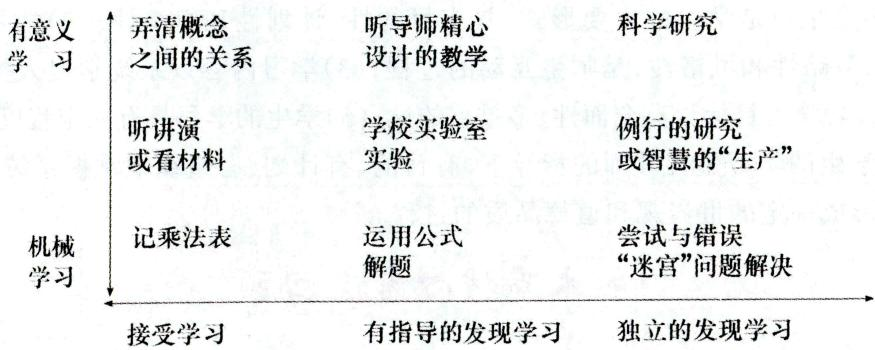  
图3-1 奥苏贝尔的学习分类

真题7 [2023湖南长沙,单选]关于学习的类型,下列判断不正确的一项是( )

A. 听讲座, 是发现学习, 也是机械学习

B. 背数学公式, 是接受学习, 也是机械学习  
C.科学研究，是发现学习，也是有意义学习  
D. 听老师讲解, 理清了矩形和正方形的概念, 是接受学习, 也是有意义学习

真题8 [2024河北石家庄，判断]按照奥苏贝尔的观点，幼儿能够背诵很多唐诗，但并不理解其中的意义，这种学习属于机械学习。（）

A. 正确

B. 错误

答案：7.A 8.A

考点3 学习的意识水平分类 ★【单选、判断】

按学习时的意识水平，可以将学习分为内隐学习和外显学习。

内隐学习这一概念最早是由美国心理学家阿瑟·雷伯提出的，它是指有机体在与环境接触的过程中不知不觉地获得了一些经验，并因此改变其事后某些行为的学习。例如，人们能够辨别哪些语句符合语法，却不一定能够说出这些语法规则是什么。外显学习则类似于有意识的问题解决，是有意识的和清晰的、需要付出心理努力并需按照规则做出反应的学习，包括一个试图形成任务的心理表象，搜寻同功能系统的知识的记忆以及试图建立和检验任务操作的心理模型。例如，学习物理中的牛顿运动定律。

真题9 [2023江苏苏州,单选]王琳不知不觉就会唱许多流行歌曲。她的这种学习属于( )

A. 发现学习

B. 替代学习

C. 内隐学习

D. 外显学习

答案：C

# 三、学生的学习 ★【多选、判断】

# 考点1 学生的学习内容

学生的学习不但要掌握知识经验和技能，还要发展智能，培养行为习惯，以及修养道德品质和促进人格发展。因此，其学习内容大致可分为三个方面：一是知识、技能和学习策略的掌握；二是问题解决能力和创造性的发展；三是道德品质和健康心理的培养。

# 考点2 学生学习的特点

人类学习与学生学习之间是一般与特殊的关系, 学生的学习既与人类的学习有共同之处, 又有其自身的特点: (1) 接受学习是学习的主要形式, 具有目的性、计划性和组织性; (2) 学习过程是主动构建过程, 具有自主性、策略性和风格性, 是师生互动的过程; (3) 学习内容以系统学习人类的间接知识经验为主, 具有间接性; (4) 学习目标具有全面性、多重目的性; (5) 学生的学习具有一定程度的被动性。

综上所述, 学生的学习是在教师的指导下, 有目的、有计划、有组织地掌握系统的科学知识和技能, 发展各种能力, 形成一定的世界观和道德品质的过程。

# ★本节核心考点回顾 ★

1. 学习的概念

学习是个体在特定情境下由于练习或反复经验而产生的行为或行为潜能的相对持久的变化。

2. 加涅关于学习水平的分类

(1)信号学习：刺激—强化—反应。

(2)刺激—反应学习：情境—反应—强化。  
(3)连锁学习：一系列刺激—反应的动作联结。  
(4)言语联结学习：一系列言语单位的联结。  
(5) 辨别学习: 识别多种刺激的异同。  
(6)概念学习：对一类刺激做出同样的反应。  
(7)规则或原理学习：学习两个或两个以上概念之间的关系。  
(8)解决问题学习：使用所学原理或规则去解决问题。

# 3. 加涅关于学习结果的分类

(1)智慧技能：运用符号或概念与环境交互作用的能力。  
(2)认知策略：调控内部心理过程的技能。  
(3) 言语信息：有关事物的名称、时间、地点、定义以及特征等方面的事实性信息。  
(4)动作技能：通过身体动作的质量的不断改善而形成整体动作模式。  
(5)态度：影响个人对人、事、物采取行动的内部状态。

# 4. 奥苏贝尔关于学习的划分

(1)从学习者学习的方式上，将学习分为接受学习与发现学习。  
(2)从学习内容与学习者认知结构的关系上，将学习分为有意义学习和机械学习。

# 第二节 行为主义学习理论

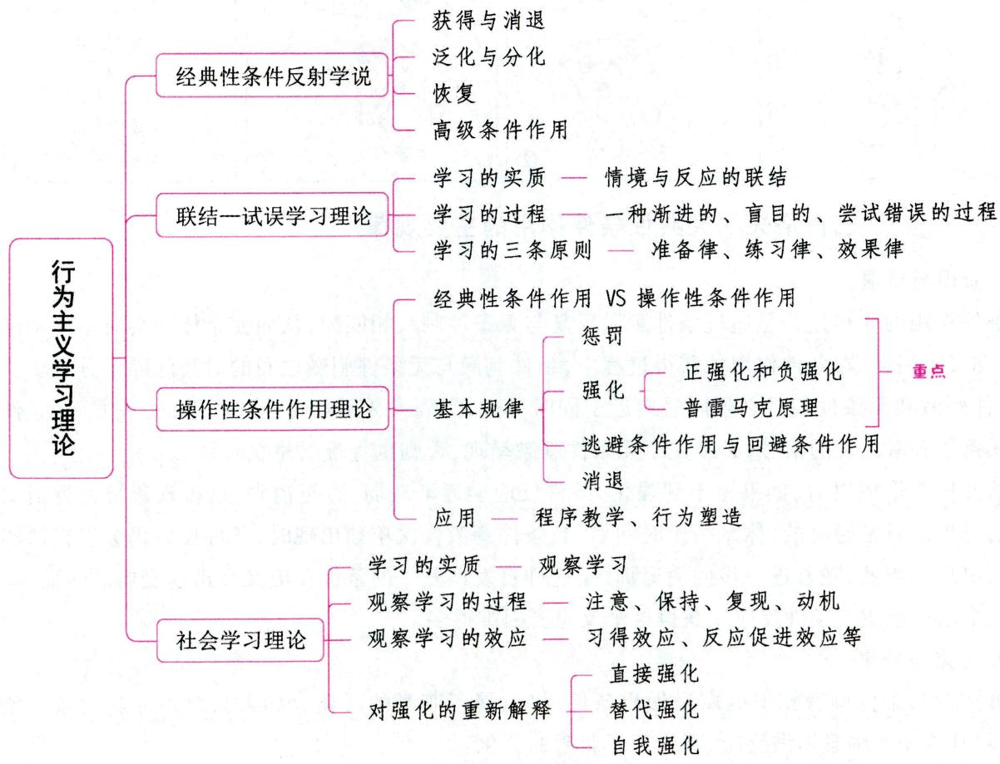

行为主义学习理论的核心观点认为，学习过程是有机体在一定条件下形成刺激与反应的联系，从而获得新经验的过程。由于行为主义强调刺激一反应的联结，因此，也属于联结派学习理论。

联结学习理论认为，一切学习都是通过条件作用，在刺激和反应之间建立直接联结的过程。强化在刺激一反应联结的建立中起着重要作用。在刺激一反应联结中，个体学到的是习惯，而习惯是反复练习和强化的结果。习惯一旦形成，只要原来的或类似的刺激情境出现，习得的习惯性反应就会自动出现。

# 一、巴甫洛夫的经典性条件反射学说 ★★ 【单选、多选、判断、案例分析】

# 考点1 巴甫洛夫的经典性条件作用

俄国生理学家巴甫洛夫在研究狗的进食行为时发现: 狗吃到食物时, 会分泌唾液。这是自然的生理反应, 不需要学习, 这种反应叫无条件反射, 引起这种反应的刺激是食物, 称为无条件刺激。如果在狗每次进食时发出铃声, 一段时间后, 狗只要听到铃声就会

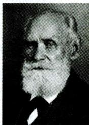  
巴甫洛夫

分泌唾液, 这时作为中性刺激的铃声由于与无条件刺激联结而成了条件刺激, 由此引起的唾液分泌就是条件反射。这种单独呈现条件刺激即能引起唾液分泌的反应叫作条件反应, 后人称为“经典性条件作用”。

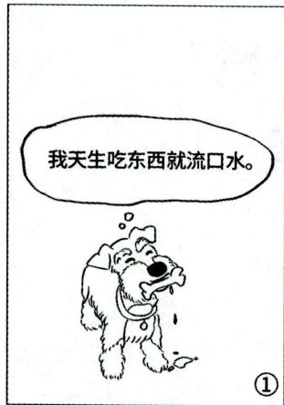

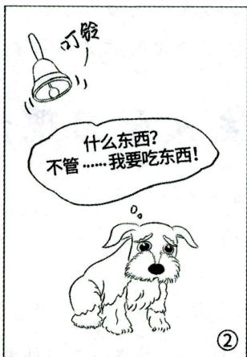

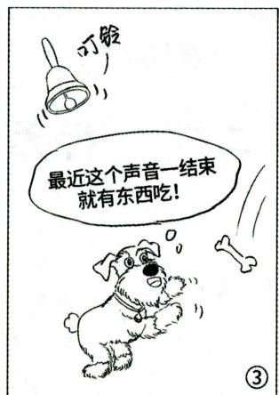

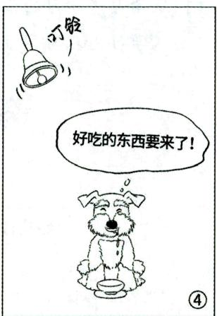

# 考点2 巴甫洛夫的经典性条件作用的主要规律

# 1.获得与消退

条件作用的获得过程是通过条件刺激反复与无条件刺激相匹配,从而使个体学会对条件刺激做出条件反应的过程。在条件作用的获得过程中,条件刺激与无条件刺激之间的时间间隔十分重要。一方面,条件刺激和无条件刺激必须同时或近于同时呈现,间隔太久则难于建立联系;另一方面,条件刺激作为无条件刺激出现的信号,必须先于无条件刺激呈现,否则也将难以建立联系。

条件反射形成以后，如果得不到强化，条件反应会逐渐减弱，直至消失，这种现象被称为消退。但这种消退现象只是暂时的，休息一段时间后，当条件刺激再次单独出现时，条件反应仍会以很微弱的形式重新出现。当然，随着进一步的消退训练，这种自发恢复了的条件反应又会迅速变弱。然而，要完全消除一个已经形成的条件反应比获得这个反应要困难得多。

# 2. 泛化与分化

机体对与条件刺激相似的刺激做出条件反应，属于刺激的泛化。如果只对条件刺激做出条件反应，而对其他相似刺激不做反应，则出现了刺激的分化。

刺激泛化和刺激分化是互补的过程。泛化是对事物的相似性的反应，分化则是对事物的差异性的反应。泛化能使我们的学习从一种情境迁移到另一种情境；而分化则能使我们对不同的情境做出不同的恰当反应，从而避免盲目行动。

# 3. 恢复

消退现象发生后，如果个体得到一段时间的休息，条件刺激再度出现，这时条件反射可能又会自动恢复。这种未经强化而条件反射自动重现的现象被称为恢复。

# 4. 高级条件作用

中性刺激一旦成为条件刺激，可以作为无条件刺激。另一个中性刺激与其反复结合，可形成新的条件作用，这一过程被称为高级条件作用。在一级条件作用基础上建立二级条件作用，在二级条件作用的基础上建立三级条件作用。测验失败引起学生条件性的紧张或焦虑等情绪反应，就经历了一个高级条件作用的形成过程。测验失败一开始也许只是一个中性事件，但逐渐与家长或老师的批评联系起来，而批评本身是引起学生焦虑的条件刺激，久而久之，测验失败引起焦虑。再进一步，与测验情境有关的线索也可能成为条件刺激，例如，当学生走进考场时，或者当老师宣布即将举行考试时，学生感到非常焦虑。

# 小香课堂·

刺激的泛化和刺激的分化属于易混点，考生可根据以下关键点进行区分和理解：泛化强调对事物相似性的反应（分不清）；分化强调对事物差异性的反应（分得清）。

# 考点 经典性条件作用对教学的启示

(1)要尽量借助于直观手段讲授新知识，而且尽可能组织各种有趣的活动，让学生形成尽量多的理性观念与感性经验，掌握新知识与旧知识以及认知与情绪等多方面的联系，有助于学生对所学知识的重视。  
(2)组织练习, 使学生学过的知识得到强化, 尤其是似是而非、容易混淆的知识, 要加强对比练习, 促进学习的分化。  
(3)针对学生学习活动上的不适当行为，不要采用过于强烈的惩罚、刁难、讽刺等刺激手段，以免使学生形成学习活动与恐惧、紧张、惊慌的“联结”而导致学习障碍的产生。

真题1 [2023河南郑州,多选]根据巴甫洛夫的经典性条件反射理论,日常教学活动中应做到( )

A.讲授新概念、新知识时，要尽量借助直观手段，帮助学生形成尽量多的理性观念和感性经验  
B. 经常组织多种多样的练习, 使学生所学到的知识能够有机会得到不断的强化  
C. 对于学生学习活动中的不适当行为, 不要采取过于强烈的惩罚、刁难、讽刺等刺激手段  
D. 任何学习都应该在学生有准备的情况下进行, 而不能经常搞突然袭击

答案：ABC

# 二、桑代克的联结一试误学习理论 ★★★ 【单选、多选、判断、简答】

桑代克是美国著名心理学家, 西方教育心理学奠基人之一, 联结主义学习理论的创始人。桑代克的联结说是教育心理学史上第一个较为完整的学习理论。它系统地回答了有关学习的一些最基本的问题, 这为教育心理学成为一门独立的学科起到了奠基作用。

桑代克的联结理论是根据其对动物的实验结果提出的，其中最著名的是“饿猫打开迷笼”的实验。在该实验中，将饿猫放在一个迷笼里，将小鱼放在笼外猫看得见的地方。猫只有用前爪踏到开门的机关，才能出笼获食。在经过一系列盲目尝试之后，猫终于踏到机关，逃了出来。把猫多次放回笼中，猫几经尝试，逃出笼子的速度越来越快，犯错次数越来越少。经过反复尝试，猫学会了做出成功的反应，而抛弃不成功的反应，自动形成了迷笼刺激情境与踏动机关反应之间的联结。

# 考点1 学习的实质——形成情境与反应的联结

学习的实质在于形成情境与反应之间的联结，联结公式是S-R。他认为刺激与反应之间的联结是直接的，并不需要中介作用。

# 考点2 学习的过程——一种渐进的、盲目的、尝试错误的过程

学习的过程就是形成刺激与反应之间的联结的过程, 而联结是通过尝试错误的过程建立的。学习的过程是一种渐进的、盲目的、尝试错误的过程。在此过程中随着错误反应的逐渐减少和正确反应的逐渐增加, 而最终在刺激与反应之间形成牢固的联结。这种理论又被称为尝试一错误论, 简称试误论。

# 考点3 学习要遵循三条原则

(1)准备律是指联结的加强或削弱取决于学习者的心理准备和心理调节状态。准备不是指学习前的知识准备或成熟方面的准备，而是指学习者在学习开始时的预备定势。学习者有准备而给以活动就感到满意，有准备而不给以活动则感到烦恼，学习者无准备而强制给以活动也感到烦恼。  
(2)练习律是指刺激与反应之间的联结会由于重复或练习而加强，不重复不练习，联结的力量就会减弱。练习律又分为应用律和失用律两个次律。  
(3) 效果律是指刺激和反应之间的联结可因导致满意的结果而加强, 也可因导致烦恼的结果而减弱。效果律是最重要的学习定律。

学习的副律有五条：多重反应原则、倾向和态度原则、选择性原则、同化或类化的原则和联想交替原则。

真题2 [2024安徽合肥/淮北/铜陵, 单选]当小军考试取得好成绩后, 他的老师和家长便给予他奖状和表扬, 这符合桑代克学习规律中的 ( )

A. 准备律

B. 练习律

C. 效果律

D. 动机律

答案：C

# 考点4 联结一试误说的教育意义

桑代克的联结一试误理论虽然是从动物实验中推导出来的，但对于人类学习仍有很大的借鉴意义。根据学生的学习特点，这一理论特别强调“从做中学”，即在实际的操作过程中学习有关的概念、原理、技能和策略等。具体而言，对教育有以下指导意义：

(1)在学习过程中，教师应该允许学生犯错误，并鼓励学生多尝试，从错误中学习，这样获得的知识才会更牢固。  
(2)任何学习都应该在学生有准备的状态下进行，不能经常搞“突然袭击”。（准备律）  
(3)在学习过程中，应加强合理的练习，并注意学习结束后及时地进行练习。(练习律)

(4)在实际教育过程中，教师应努力使学生的学习能得到自我满足的积极结果，防止一无所获或得到消极的后果。(效果律)

# 三、斯金纳的操作性条件作用理论 ★★★ 【单选、多选、判断】

桑代克为操作性条件作用理论奠定了基础，斯金纳则系统地发展了这一理论，并使之对教育实践产生了巨大作用。

斯金纳把人和动物的行为分为两类: 应答性行为和操作性行为。应答性行为是由特定刺激引起的, 是不随意的反射性反应; 而操作性行为则不与任何特定刺激相联系, 是有机体自发做出的随意反应。在日常生活中, 人的大部分行为都是操作性行为。经典性条件反射理论可以解释应答性行为的产生, 而操作性条件作用理论可以解释操作性行为的产生。

  
斯金纳

# 考点 经典性条件作用与操作性条件作用的比较

表 3-9 两种条件作用的比较  

<table><tr><td>比较范畴</td><td>经典性条件作用</td><td>操作性条件作用</td></tr><tr><td>主要代表人物</td><td>巴甫洛夫</td><td>斯金纳</td></tr><tr><td>行为</td><td>无意的、情绪的、生理的</td><td>有意的</td></tr><tr><td>顺序</td><td>行为发生在刺激之后</td><td>行为发生在刺激之前</td></tr><tr><td>学习的发生</td><td>中性刺激与无条件刺激的匹配</td><td>行为后果影响随后的行为</td></tr><tr><td>例子</td><td>学生将课堂(开始是中性的)与教师的热情联结在一起,课堂引发出积极情绪</td><td>学生回答问题后受到表扬,学生回答问题的次数增加</td></tr></table>

真题3 [2022河南南阳，多选]行为主义心理学家斯金纳被誉为“操作性条件反射理论的奠基者”。他将行为分为（ ）

A. 刺激行为

B. 反应行为

C. 应答性行为

D. 操作性行为

答案：CD

# 考点2 操作性条件作用的基本规律

操作性条件作用的基本规律有：惩罚、强化、逃避条件作用与回避条件作用、消退。

# 1. 惩罚

惩罚是指当有机体做出某种反应以后，呈现一个厌恶刺激或取消一个愉快刺激，以期消除或抑制此类反应的过程。惩罚与负强化有所不同，负强化是通过厌恶刺激的排除来增加反应在将来发生的概率，而惩罚则是通过厌恶刺激的呈现或愉快刺激的取消来降低反应在将来发生的概率。依据刺激是呈现还是移除，惩罚也可以分为呈现性惩罚和移除性惩罚。

# 2. 强化

# (1) 强化的概念及分类

强化是采用适当的强化物而使机体反应频率、强度和速度增加的过程。凡是能增强行为频率的刺激或事件叫作强化物。斯金纳认为, 强化是塑造行为的有效而重要的条件, 塑造行为的过程, 就是学习的过程。强化有正强化和负强化之分。正强化也称积极强化, 是通过呈现想要的愉快刺激来增强反应

频率, 正强化的方法包括奖学金、对成绩的认可、表扬、给予学习和成长的机会等; 负强化也称消极强化, 是通过消除或中止厌恶、不愉快刺激来增强反应频率。

表 3-10 强化和惩罚的区别  

<table><tr><td></td><td colspan="2">强化</td><td colspan="2">惩罚</td></tr><tr><td>分类</td><td>正强化</td><td>负强化</td><td>呈现性惩罚(正惩罚)</td><td>移除性惩罚(负惩罚)</td></tr><tr><td>特点</td><td>呈现愉快刺激</td><td>取消厌恶刺激</td><td>呈现厌恶刺激</td><td>取消愉快刺激</td></tr><tr><td>目的</td><td colspan="2">增加反应频率</td><td colspan="2">降低反应频率</td></tr><tr><td>典例</td><td>给予表扬</td><td>完成作业,老师不再批评学生</td><td>孩子乱跑,打孩子屁股</td><td>不写完作业不能出去玩</td></tr></table>

# (2) 强化物

除了对正强化和负强化做出区分外, 斯金纳还区分了强化的两个来源: 一级强化物和二级强化物。一级强化物包括所有在没有任何学习发生的情况下也起强化作用的刺激, 如食物和水等满足生理基本需要的东西。二级强化物包括那些在开始时不起强化作用, 但后来作为与一级强化物或其他强化物配对的结果而起强化作用的刺激。斯金纳认为, 对于人类来说, 二级强化物包括对大量行为起强化作用的许多刺激 (诸如社会地位、权力、财富、名声等), 这些大多是由社会文化决定的, 它们构成了决定人类行为的极有力的二级强化物。二级强化也称为条件强化、习得强化。老师有时可以用一级强化物, 如糖果等, 强化学生的正确行为, 但是教师更多地应该使用二级强化物强化学生的正确行为, 如好的分数、赞赏、鼓励、表扬等。

在选择强化物时，可以遵循普雷马克原理，又称为“祖母法则”，即用高频活动作为低频活动的有效强化物。简单地说，每个人都有一个强化等级，在这个强化等级中，处于较高一级的强化物比处于较低一级的强化物更容易引发操作行为，所以，处于较高一级的活动可以强化较低一级的活动。例如，教师在课堂中经常使用的“只要写完作业，就可以出去玩”“学完这个难点，我们就休息一下”等，如果有一件愉快的事等着学生去做，他们会很快完成另一件不喜欢的事。在应用普雷马克原理时应注意：行为和强化的关系不能颠倒，必须先有行为，再有强化；要让学生明确感觉到这种行为和强化的依随关系；不能过度使用强化物，否则，可能使强化物失去原有的效力。

# (3)强化程序

斯金纳认为强化的程序不止一种。所谓强化程序，是按合乎要求的反应次数以及各次强化之间的时距的适当组合而做出的各种强化安排。它包括连续强化和间隔强化，间隔强化又分为固定比例强化和变化比例强化、固定时间强化和变化时间强化等。

表 3-11 强化程序的分类  

<table><tr><td colspan="2">分类</td><td>内涵</td><td>典例</td></tr><tr><td colspan="2">连续强化</td><td>每次行为之后都给予强化</td><td>一开开关灯就亮</td></tr><tr><td rowspan="4">间隔
强化</td><td>固定比例强化</td><td>间隔一定的次数给予强化</td><td>每隔5次给予1次强化、计件工资、每举三次手给一次发言的机会</td></tr><tr><td>变化比例强化</td><td>每两次强化之间间隔的反应次数是变化不定的</td><td>老虎机、钓鱼、买彩票</td></tr><tr><td>固定时间强化</td><td>间隔一定的时间给予强化</td><td>每隔5分钟给予1次强化、计时工资、每周五测验</td></tr><tr><td>变化时间强化</td><td>强化之间间隔的时间是变化的</td><td>冲浪运动、随时小测验</td></tr></table>

强化的安排可以有很多种，不同的强化安排可以起到不同的强化效果。一般来说，间隔强化的效果比连续强化的效果好；可变时间和可变比例强化的效果好于固定时间和固定比例强化的效果。

# 3. 逃避条件作用与回避条件作用

逃避条件作用是指当厌恶刺激出现时，有机体做出某种反应，从而逃避了厌恶刺激，则该反应在以后的类似情境中发生的概率便增加的一类条件作用。在日常生活中，逃避条件作用不乏其例，如看见路上的垃圾后绕道走开；感觉屋内人声嘈杂时暂时离屋等。

回避条件作用是指当预示厌恶刺激即将出现的刺激信号呈现时，有机体也可以自发地做出某种反应，从而避免了厌恶刺激的出现，则该反应在以后的类似情境中发生的概率便增加的一类条件作用。它是在逃避条件作用的基础上建立的，是个体在经历过厌恶刺激的痛苦之后，学会了对预示厌恶刺激的信号做出反应，从而免受痛苦等。

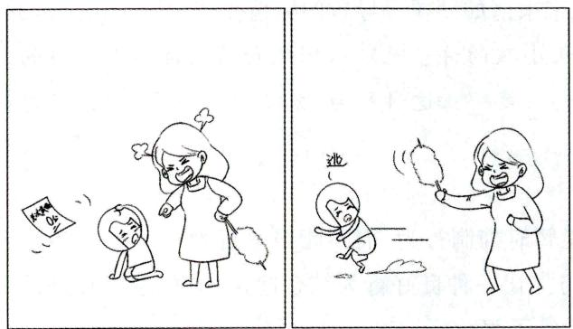  
逃避条件作用

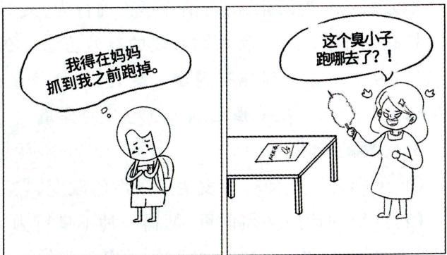  
回避条件作用

# 4. 消退

消退是指条件反射形成以后，如果得不到强化，条件反应会逐渐减弱，直至消失的现象。

真题4 [2024广东东莞, 单选]大白每次去超市都会为了买玩具又哭又闹, 针对这种行为, 专家建议大白妈妈不理睬、不回应。专家建议的这种行为属于( )

A. 正强化

B. 负强化

C. 惩罚

D. 消退

真题5 [2023辽宁营口，单选]小彤的妈妈想要纠正小彤的驼背，所以一旦发现小彤驼背，就会让小彤贴着墙站立半个小时。这种方式属于（）

A. 正强化

B. 负强化

C. 正惩罚

D. 负惩罚

真题6 [2023河南郑州, 单选]学生小阳认为如果父母平时能减少一些对他的严格管束, 他会更乐意学习。这一现象的心理实质是（）

A. 惩罚

B. 消退

C. 负强化

D. 替代强化

真题7 [2022辽宁沈阳,单选]“看见路上有垃圾后就绕道走开”,这描述的是( )

A. 正强化

B. 负强化

C. 逃避条件作用

D. 回避条件作用

真题8 [2023河南信阳, 判断]负强化就是惩罚。( )

答案：4.D 5.C 6.C 7.C 8.X

# 考点3 操作性条件作用理论对学习的意义

# 1. 强化的应用

在学习过程中，强化物有很多种，如表扬、奖励、自我强化等。表扬或奖励可以根据具体的情况采用不同的形式：关注、特权、拥抱、活动、实物和金钱等。没有一种强化形式适合于所有的人，当采用的表扬或奖励方式对学生无效时，并不是强化无效，而是没有选择正确的强化方式。在对学生的行为进行奖励时，应注意避免外部奖励对内部兴趣的破坏。奖励虽然是塑造行为的有效手段，但是奖励的运用必须得当，否则便会强化不良行为。

# 2. 消退的应用

消退是一种无强化过程, 其作用在于降低某种反应在将来发生的概率, 以达到消除某种行为的目的。不去强化而去淡化, 既可消除不正确行为, 又不会带来诸如惩罚等导致的感情受挫的副作用。因此, 消退是减少不良行为、消除坏习惯的有效方法。例如, 小孩的许多无理取闹的行为实际上是学习的结果, 因为他们通过哭闹能得到诸如玩具、冷饮等强化物。要矫正这种行为, 就不应再给予强化, 父母的无端让步实际上正起着强化不正确行为的作用。

# 3. 惩罚的应用

(1) 惩罚并不能使行为发生永久性的改变，它只能暂时抑制行为，而不能根除行为。  
(2)惩罚的运用必须慎重，惩罚一种不良行为应与强化一种良好行为结合起来，方能取得预期的效果，即指出正确的行为方式，在孩子做出正确的行为后给予强化。  
(3)一般来说，要尽可能地少用惩罚，在必要的时候才使用。一个经常惩罚孩子的家长或教师，本身就给孩子树立了一个不好的榜样。惩罚的目的可能没有达到，反而使孩子学会了粗暴的不顾别人自尊的处事方式。  
(4)惩罚的运用应该及时，即在学生做出某种错误行为之后，立即给予惩罚。惩罚紧紧跟在错误行为之后，与错误的行为之间建立联结。

总之，根据操作性条件作用理论，在教育过程中，教师应多用正强化的手段来塑造学生的良性行为，用不予强化的方法来消除消极行为，同时应慎重地运用惩罚。

# 考点4 操作性条件作用理论在教育上的应用

# 1. 程序教学

(1)程序教学的内涵及基本原理

程序教学是基于操作性条件反射和积极强化的原理而设计的教学模式，并以此设计了教学机器。程序教学是一种个别化的教学形式。斯金纳将要学习的大问题分解为一系列小问题，并将其按一定的程序编排和呈现给学生，要求学生学习并回答问题，学生回答问题后及时得到反馈信息。程序教学的基本原理是采用连续接近法，通过设计好的程序不断强化，使学生形成教育者希望的行为模式。

(2)程序教学的原则

① 小步子原则。学生所用的教材或程序教学机器要将学习的内容分为许多小单元，小单元之间相互联系，层层深入，相邻小单元之间的难度差距小，学习者容易成功。  
②积极反应原则。保证学生在学习过程中一直处于积极的状态，学生产生学习行为，就要及时给

予强化，以保证学习活动的持续进行。

③自定步调原则。学生可以按照自己的接受程度选择最适宜的学习进度,这样学生容易成功,学习动机强。  
④及时反馈原则。及时反馈，也就是说让学生立刻知道自己的答案是否正确，正确的回答可以让学生树立信心，保持学习行为，进行下一阶段的学习。  
⑤低错误率原则。保证学习者在学习中将错误率降至最低，以达到强化效果。

# 记忆有妙招·

为方便考生记忆，编者将程序教学的原则总结成如下口诀：

小鸡自己滴。小：小步子原则。鸡：积极反应原则。自：自定步调原则。己：及时反馈原则。滴：低错误率原则。

# 2. 行为塑造

所谓塑造, 就是通过小步强化帮助学生达到目标。斯金纳认为“教育就是塑造行为”, 他采用连续接近的方法, 对趋向于所要塑造的反应的方向不断地给予强化, 直到引出所需要的新行为。例如, 训练鸽子或老鼠的头抬到一定的高度, 只有当其头朝着实验所需的方向抬起头来时才强化, 下一次要求再多一点, 直到完全达到所需的方向和高度。这时, 新的行为就塑造成功了。行为塑造技术包括顺向连锁塑造和逆向连锁塑造两种。

真题9 [2023辽宁锦州, 单选]斯金纳精心设计了程序化的教学机器, 并提出了程序教学的基本原则, 其中 ( ) 就是让学生按照自己的速度和潜力进行学习, 强调个体化的学习方式。

A. 自定步调原则

B. 小步子原则

C. 及时强化原则

D. 低错误率原则

真题10 [2022广西桂林，判断]程序教学是基于操作性条件反射和积极强化的原理而设计的教学模式。（）

答案：9.A 10.√

# 四、班杜拉的社会学习理论 ★★★ 【单选、多选、填空、判断】

班杜拉总结了影响学习的三类因素：环境（资源、行动结果、他人与物理条件）、个体（信念、期望、态度与知识）和行为（个体行动、选择和言语表述）。他认为这三类因素互为因果，每两者之间都具有双向的互动和决定关系，因此，这一理论又被称为三元交互作用论。

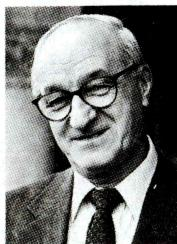  
班杜拉

# 考点1 学习的实质——观察学习

班杜拉以儿童的社会行为习得为研究对象，形成了其关于学习的基本思路，即观察学习是人类学习最重要的形式。班杜拉认为，学习是个体通过对他人的行为及其强化结果的观察，从而获得某些新的行为反应或已有的行为反应得到修正的过程。

观察学习有其明显的特点：(1) 观察学习并不依赖于直接强化；(2) 观察学习不一定具有外显的行为反应，人们可以通过观察他人的示范行为，在自己尚未表现行为时就已经学到了如何去做，这样就可以避免许多不必要的错误和危险的结果；(3) 观察学习具有认知性。

真题11 [2024安徽统考，单选]能够有效解释“身教重于言教”现象的学习理论是（）

A. 认知学习理论

B. 社会学习理论

C. 联结学习理论

D.人本主义理论

真题12 [2024浙江宁波，单选]小华通过在滑冰场观察并模仿他人的滑冰动作和技巧来提升自己的滑冰技术，小华的做法更符合下列哪种理论（）

A.尝试一错误学习理论

B.经典性条件作用理论

C. 操作性条件作用理论

D. 社会学习理论

答案：11.B 12.D

# 考点2 观察学习的对象——榜样

班杜拉认为凡是能够成为学习者观察学习的对象，就可以称之为榜样或示范者。榜样不一定是活生生的人，他也可以是以符号形式存在的人（如影视中的人）或事物、动物等，班杜拉认为榜样有三种形式：(1)活的榜样，即具体的活生生的人；(2)符号榜样，指通过语言或影视图像而呈现的榜样；(3)诫例性榜样，即以语言描绘或形象化方式表现某个带有典型特点的榜样，以告诫儿童学习或借鉴某个榜样的行为方式。

# 考点 3 观察学习的过程

班杜拉把观察学习的过程分为注意、保持、复现和动机四个子过程。

(1)在注意过程中，观察者注意并知觉榜样情境的各个方面。  
(2)在保持过程中，观察者记住从榜样情境中了解的行为，以表象和语言的形式将它们在记忆中进行表征、编码以及存储。即先将榜样行为转换成记忆表象，然后记忆表象再转换为言语编码，表象和言语编码同时贮存在头脑中，对学习者以后的行为起指导作用。  
(3)在复现过程中，观察者将头脑中有关榜样情境的表象和符号概念转为外显的行为。  
(4)在动机过程中，观察者因表现所观察到的行为而受到激励。班杜拉还认为习得的行为不一定都表现出来，学习者是否会表现出已习得的行为，会受强化的影响。

# 记忆有妙招·

为方便考生记忆，编者将观察学习的过程总结成以下口诀：

珠宝浮动。珠：注意。宝：保持。浮：复现。动：动机。

# 考点4 观察学习的效应

# 1. 习得效应

习得效应指通过观察习得新的技能和行为模式。例如，儿童的语言在很大程度上就是一种通过模仿习得的技能。观察学习的习得效应可以解释大部分与态度和品德有关的新行为方式的学习。

# 2. 抑制效应与去抑制效应

抑制效应指观察者看到他人的不良(或良好)行为受到社会谴责, 观察者会暂时抑制受到谴责的不良(或良好)行为。去抑制效应指观察者看到他人的不良行为未受到应有的惩处, 其原本受到抑制的不良行为重新发作。例如, 一名有不良行为习惯的学生进入一个班风很好, 纪律严明的班集体, 在周围同学良好表现的耳濡目染之下, 该生的不良行为方式很可能暂时受到抑制。由于他的恶习一时难以完全

消除，他一离开班集体，进入他自己原先的小圈子，不良习气又重新发作。这就是不良行为的抑制与去抑制效应。观察学习的抑制与去抑制效应可以解释不良态度与品德转变的部分心理机制。

# 小香课堂

抑制效应与去抑制效应属于易混点，考生可根据以下关键点进行区分和理解：抑制效应强调不良（或良好）行为暂时受到抑制；去抑制效应强调原本受到抑制的不良行为重新发作。

# 3. 反应促进效应

反应促进效应指通过观察促进新的学习。例如,在体育课上有些学生胆小,不敢做一些危险性的动作。这时教师让某个胆大的学生先做示范。胆小的学生看到该动作他人能做,胆子也大起来,认为自己也能做,从而促进新的行为的学习。反应促进也指原先习得行为的加强。例如,“见人打招呼”原本是某儿童已习得的行为,但有时却不能表现出来。若看到其他儿童和成人都能表现这样的行为并受到赞扬,该儿童见人打招呼的礼貌行为方式会得到加强并重新表现出来。

# 4. 刺激指向效应（环境加强效应）

刺激指向效应，指通过观察榜样行为，观察者将自己的注意指向特定的刺激。在班杜拉的实验中，看到榜样用木槌击打布娃娃的儿童同未看到这种行为的儿童相比，不但模仿这种攻击行为，而且更多地将木槌用到其他情境。

# 5.情绪唤醒功能

情绪唤醒功能指看到榜样表达的情感，在观察者身上容易唤起类似的情感。例如，在语文课上教师通过表情朗读表达对英雄人物的崇敬情感，在学生身上可以唤起类似的情感。所以，观察学习是情感教育的最重要手段。

真题13 [2024天津实验小学，单选]一名学生在公交车上看到了别人给老人让座位受到了他人的赞许，自己也起身给旁边老人让座。这体现了榜样示范学习的（）

A. 去抑制效应

B. 环境加强效应

C. 反应促进效应

D. 情绪唤起效应

答案：C

# 考点5 对强化的重新解释

(1)直接强化。直接强化是指观察者因表现出观察行为而受到强化。  
(2)替代强化。替代强化是指观察者因看到榜样的行为被强化而受到强化。  
(3)自我强化。自我强化是指对自己表现出的符合或超出标准的行为进行自我奖励。

真题14 [2024山东济南，单选]小志看到小颖帮助同学倒垃圾受到教师表扬后，也积极帮助其他有需要的同学。根据班杜拉的社会认知理论，小志在该过程中受到的强化属于（）

A. 替代性强化  
B. 自我强化  
C. 直接强化  
D. 参与性强化

真题15 [2022福建统考，填空]班杜拉把行为强化分为直接强化、替代强化和

答案：14.A 15.自我强化

# ★本节核心考点回顾 ★

1. 巴甫洛夫的经典性条件作用的主要规律

(1) 泛化: 机体对与条件刺激相似的刺激做出条件反应。  
(2) 分化: 只对条件刺激做出条件反应, 而对其他相似刺激不做反应。

2. 桑代克的联结—试误学习理论

(1)学习的实质：形成情境与反应的联结。  
(2)学习的过程：一种渐进的、盲目的、尝试错误的过程。   
(3)学习的原则

(1)准备律:联结的加强或削弱取决于学习者的心理准备和心理调节状态。  
②练习律：重复或练习会加强刺激与反应之间的联结。  
③ 效果律：导致满意的结果加强联结，导致烦恼的结果减弱联结。

3. 斯金纳的操作性条件作用的基本规律

(1)正强化：通过呈现想要的愉快刺激来增强反应频率。  
(2)负强化：通过消除或终止厌恶、不愉快刺激来增强反应频率。  
(3)正惩罚：通过呈现厌恶刺激来降低反应频率。  
(4)负惩罚：通过取消愉快刺激来降低反应频率。  
(5)普雷马克原理：先有行为，再有强化；用高频活动作为低频活动的有效强化物。

4. 班杜拉的社会学习理论

(1)学习的实质——观察学习。学习是个体通过对他人的行为及其强化结果的观察，从而获得某些新的行为反应或已有的行为反应得到修正的过程。  
(2)观察学习的效应

①习得效应指通过观察习得新的技能和行为模式。  
② 反应促进效应指通过观察促进新的学习。  
③抑制效应指观察者会暂时抑制受到社会谴责的不良(或良好)行为。

(3)对强化的重新解释

(1)直接强化:表现出观察行为,受到强化。  
②替代强化：看到榜样的行为被强化，受到强化。  
③自我强化：对自己表现出的符合或超出标准的行为进行自我奖励。

# 第三节 认知派学习理论

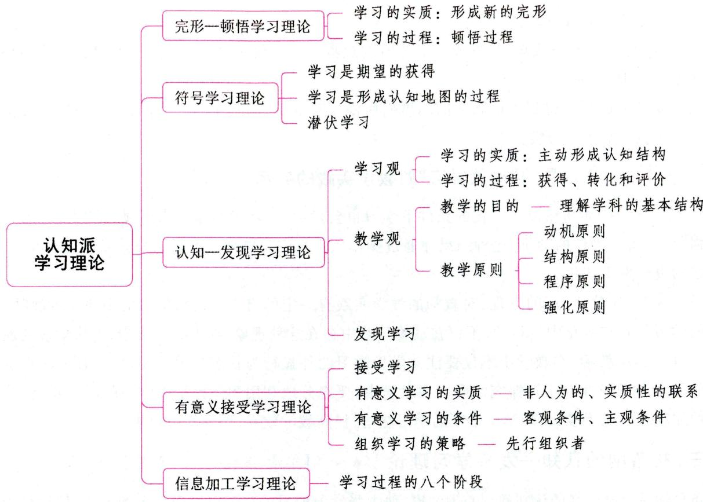

认知派学习理论认为,有机体获得经验的过程是通过积极主动的内部信息加工活动形成新的认知结构的过程。

# 一、格式塔学派的完形一顿悟学习理论

苛勒等人通过著名的黑猩猩实验,对学习的实质及原因做出了解释。他们关于学习本质的观点是:

# 1. 学习的实质——形成新的完形

从学习的结果来看，学习并不是形成刺激一反应的联结，而是形成了新的格式塔（完形）。

# 2. 学习的过程——顿悟过程

苛勒认为,学习是个体利用本身的智慧与理解力对情境及情境与自身关系的顿悟,而不是动作的积累或盲目的尝试。从学习的过程来看,学习是通过顿悟过程实现的。所谓顿悟,就是领会到自己的动作和情境,特别是和目的物之间的关系。

# 二、托尔曼的符号学习理论 ★【单选、多选、判断】

托尔曼是一位受格式塔学派影响的行为主体者，他提出的认知学习理论和内部强化理论对现代认知学习理论的发展有一定的贡献。

# 考点1 基本观点

(1)学习是有目的的，是期望的获得。学习的目的性是人类学习区别于动物学习的主要标志。期望是个体依据已有经验建立的一种内部准备状态，是通过学习而形成的关于目标的认识和期待。期望是托尔曼学习理论的核心概念。  
(2)学习是对完形的认知,是形成认知地图的过程。托尔曼主张将行为主义S-R公式改为S-O-R公式,O代表机体的内部变化。

托尔曼的上述观点得到了他和他的同事们所做实验的支持, 其中, 最有说服力的动物学习实验是位置学习实验和潜伏学习实验等。

# 考点2 托尔曼的“潜伏学习”对教学实践的启示

潜伏学习是指动物在没有强化的条件下学习也会发生,只不过结果不太明显,是“潜伏”的。一旦受到强化,具备了操作的动机,这种结果才通过操作而明显表现出来。也就是未受奖励的学习期间,其认知结构也会发生变化。

托尔曼对“潜伏学习”的发现，对教师的教学实践有一定的启示。潜伏学习的现象告诉教师，不是所有的学习都是在强化中进行的，不仅在动物学习中存在这种现象，在人类学习中，潜伏学习的现象更普遍。这就提示教师，在教学中不仅要注意学生学习的外显行为状态和表面现象，而且要注意了解学生潜伏的学习积极性和认知探究倾向。在教学中，要充分地利用和发挥学生学习的潜在积极性，配合适当的鼓励和强化手段，调动学生最大的学习热情，提高教学效率，增强学习效果。

# 三、布鲁纳的认知一发现学习理论 ★★ 【单选、多选、判断、简答】

布鲁纳是美国著名的认知教育心理学家,他主张学习的目的在于以发现学习的方式,使学科的基本结构转变为学生头脑中的认知结构。因此,他的理论常被称为认知一结构教学论或认知一发现学习说。

# 考点1 学习观

# 1. 学习的实质在于主动形成认知结构

认知结构是指一种反映事物之间稳定联系或关系的内部认识系统,或者说,是某一学习者的观念的全部内容与组织。布鲁纳认为,人不是一个知识的被动接受者。个人的学习都是通过把新得到的信息和原有的认知结构联系起来,去积极地建构新的认知结构。

# 2. 学习包括获得、转化和评价三个过程

在学生能动地获取知识的过程上，布鲁纳认为学习包括三个差不多同时发生的过程。分别是：（1）新知识的获得。由于新知识往往同一个人以前的模糊或清晰的知识相违背，或是它的一种代替，故新知识的获得是先前知识的重新提炼。(2)转化(转换)，即将所获得的知识，整理成另一种形式以适合新任务。转换包含着处理知识的各种方式，目的在于学得更多知识。(3)评价，即检核与估计知识的正确性。学习任何一门学科常有一连串的情节，每个情节都涉及获得、转化(转换）、评价三个过程。

# 记忆有妙招

为方便考生记忆，编者将布鲁纳关于学习的三个过程总结成以下口诀：

布鲁纳得花甲。得：获得。花：转化。甲：评价。

真题1 [2022广西贵港，单选]布鲁纳认为，学习任何一门学科常有一连串的情节，每个情节都涉及的三个过程是（）

A. 获得、转化、评价

B. 考查、考试、评分

C. 模仿、偏差、行动

D. 前运算、具体运算、形式运算

答案：A

# 考点2 教学观

# 1. 教学的目的在于理解学科的基本结构

由于布鲁纳强调学习的主动性和认知结构的重要性,所以他主张教学的最终目标是促进学生对学科结构的一般理解。所谓学科的基本结构,是指学科的基本概念、基本原理及其基本态度和方法。学生理解了学科的基本结构,就容易掌握整个学科的具体内容,就容易记忆学科知识,就能促进学习迁移,促进智力和创造性的发展,并且可以提高学习兴趣。

# 2. 掌握学科的基本结构的教学原则

(1)动机原则。所有学生都具有内在的学习愿望，内在动机是维持学习的基本动力。学生具有三种最基本的内在动机，即好奇内驱力（即求知欲）、胜任内驱力（即成功的欲望）和互惠内驱力（即人与人之间和睦共处的需要）。教师如果能善于促进并调节学生的探究活动，便可激发他们的这些内在动机，有效地达到预定的学习目标。  
(2)结构原则。任何知识结构都可以用动作、图像（形象）和符号三种表征形式来呈现。动作表征是借助动作进行学习，无需语言的帮助；图像表征是借助表象进行学习，以感知材料为基础；符号表征是借助语言进行学习，经验一旦转化为语言，逻辑推导便能进行。至于究竟选用哪一种呈现方法更好，则视学生的知识背景和课题性质而定。  
(3)程序原则（序列原则）。教学就是引导学习者通过一系列有条不紊地陈述一个问题或大量知识的结构，以提高他们对所学知识的掌握、转化和迁移的能力。通常每门学科都存在着各种不同的程序，它们对学习者来说，有难有易，不存在对所有的学习者都适用的唯一的程序。  
(4) 强化原则。教学规定适合的强化时间和步调是学习成功的重要一环。知道结果的时机应恰好出现在学生评估自己作业的那个时刻。知道结果过早，易使学生慌乱，从而阻挠其探究活动的进行；知道结果太晚，易使学生失去受帮助的机会，甚至有可能接受不了正确的信息。

# 记忆有妙招·

为方便考生记忆，编者将掌握学科的基本结构的教学原则总结成以下口诀：

冻结城墙。冻：动机原则。结：结构原则。城：程序原则。墙：强化原则。

真题2 [2024河北石家庄, 单选]教学就是引导学生通过一系列有条不紊地陈述一个问题或大量知识的结构, 以提高学生对所学知识的掌握、转化和迁移能力, 这是布鲁纳提出的（）

A. 序列原则

B. 结构原则

C. 强化原则

D. 动机原则

答案：A

# 3. 提倡发现学习

布鲁纳认为, 发现是教育儿童的主要手段, 学生掌握学科的基本结构的最好方法是发现学习。发

现学习是指给学生提供有关的学习材料, 让学生通过探索、操作和思考, 自行发现知识、理解概念和原理的教学方法。布鲁纳认为, 教学不仅应当尽可能使学生牢固地掌握科学知识, 还应当尽可能使学生成为自主、自动的思想家。这样的学生在结束正规的学校教育后, 才能独立地向前迈进。

研究发现，发现学习具有四个方面的作用：(1)能提高智慧的潜力；(2)有助于外在动机向内在动机的转化；(3)有利于学生学会发现探索的方法；(4)有利于所学材料的保持。但它也受到学生的先前知识水平、学生的智力水平、学习材料的性质、教师的指导及教学时间等因素的制约。

# 四、奥苏贝尔的有意义接受学习理论 ★★ 【单选、多选、判断】

# 考点1 接受学习

与布鲁纳的发现学习观相反, 奥苏贝尔认为, 学生的学习主要是接受学习。接受学习不同于发现学习。接受学习的特征是把要学习的全部内容或多或少地以定论的形式呈现给学习者, 不需要学习者任何形式的独立发现, 只需要学习者把学习材料加以内化, 把新旧材料的内容有机地结合, 即新学习的内容与认知结构中的有关内容融为一体, 并存储下来。

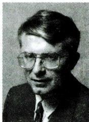  
奥苏贝尔

奥苏贝尔强调，必须消除对接受学习的误解。接受学习未必都是机械学习，它可以而且也应该是有意义的学习。同样，发现学习未必都是有意义的学习，它也可能是机械学习。学校应主要采用有意义的接受学习。同时，必须把接受学习与被动学习区分开来。被动学习是与主动学习相对的。接受学习可能是主动的，也可能是被动的，它与被动学习、主动学习没有必然联系。有不少人将接受学习与被动学习相等同，这是错误的。

# 考点 2 有意义学习的本质

奥苏贝尔认为学生在学校学习语言符号所代表的系统知识，主要是有意义学习而不是机械学习。学生在学校中的有意义学习应该是有意义的接受学习和有意义的发现学习，但他更强调有意义的接受学习，因为有意义的接受学习可以在短时期内使学生获得大量的系统知识。

有意义学习的本质就是以符号为代表的新观念与学习者认知结构中原有的适当观念建立起非人为的和实质性的联系的过程,是原有观念对新观念加以同化的过程。所谓非人为的联系,是指有内在联系而不是任意的联想或联系,指新知识与原有认知结构中有关的观念建立在某种合理的逻辑基础上的联系。所谓实质性的联系,是指表达的语词虽然不同,但却是等值的,也就是说这种联系是非字面的联系。

真题3 [2022湖北武汉，单选]奥苏贝尔认为学校教育主要采用（）

A. 机械的接受学习

B. 机械的发现学习

C.有意义的接受学习

D.有意义的发现学习

答案：C

# 考点 3 有意义学习的条件

(1)客观条件,是指受学习材料本身性质的影响。有意义学习的材料本身必须合乎这种非人为的和实质性的标准,即具有逻辑意义。教材一般符合此要求。

(2)主观条件，是指受学习者自身因素的影响。主要表现在：①学习者必须具有有意义学习的心向；②学习者认知结构中必须具有适当的知识，以便与新知识进行联系；③学习者必须积极主动地使这种具有潜在意义的新知识与认知结构中有关的旧知识发生相互作用。

# 考点4 组织学习的原则与策略

# 1. 组织学习的原则

(1)逐渐分化原则。逐渐分化原则即首先应该传授最一般、包容性最广的观念，然后根据具体细节对它们逐渐加以分化，这样可以为每个知识单元的教学都提供理想的固定点，即对新知识起固定作用的先前知识。  
(2)整合协调原则。整合协调原则，是指如何对学生认知结构中现有要素重新加以组合。

# 2. 组织学习的策略——先行组织者

# (1) 先行组织者的概念

奥苏贝尔提出“先行组织者”的概念, 即先于某个学习任务本身呈现的引导性学习材料。先行组织者的抽象、概括和综合水平高于学习任务, 并与认知结构中的原有观念及新的学习任务相关联。其目的是为新的学习任务提供观念上的固着点, 增加新旧知识之间的可辨别性, 以促进学习的迁移。

# (2) 先行组织者的种类

先行组织者可以分为两类：陈述性组织者(说明性组织者)和比较性组织者。

①陈述性组织者（说明性组织者），旨在为新的知识提供最适当的类属者，与新的知识产生一种上位关系。例如，学生在学习“山脉”“高原”和“平原”等知识之前，先学习“地形”的概念——“地形是由各种各样特殊形状的大小陆地构成的总和”。其中，“陆地”是学生过去已经掌握的上位概念，抽象和概括性高于“地形”，而“地形”又普遍高于即将学习的“山脉”“高原”和“平原”等。  
② 比较性组织者，用于比较熟悉的学习材料，旨在比较新材料与已有认知结构中相类似的材料，从而增强新旧知识之间的可辨别性。例如，教师在教授智慧技能的知识之前，先比较智慧技能与先前学习的动作技能的异同。

# (3)先行组织者的作用

奥苏贝尔认为，先行组织者不仅能够帮助学习者学习新知识，而且可以帮助其保持知识。具体表现在：

①能够将学生的注意力集中在将要学习的新知识中的重点部分；  
(2)突出强调新知识与已有知识的关系,为新知识提供一种框架;  
③能够帮助学生回忆起与新知识相关的已有知识，以便更好地建立联系。

真题4 [2023黑龙江哈尔滨，单选]吴老师在教学中，先教“地形”的概念，再教“山脉”“高原”“平原”等知识。从教学的角度来看，“地形”可看作是“山脉”“高原”“平原”的（ ）

A. 认知结构

B. 符号表征

C. 先行组织者

D. 编码

真题5 [2022 内蒙古赤峰, 判断]“先行组织者”是与学习任务本身同时呈现出来的一种引导性材料,它的抽象、概括和综合水平高于学习任务, 并且与认知结构中的原有观念和新的学习任务相关联。( )

答案：4.C 5.×

# 五、加涅的信息加工学习理论 ★【单选】

# 考点1 学习结构模式

加涅将学习过程看作是信息加工流程。他描绘出一个典型的学习结构模式图：

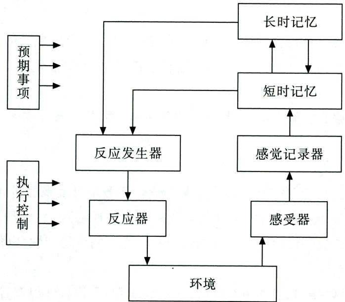  
图3-2 学习结构模式图

加涅的学习结构模式分两个部分：第一部分是右边的结构，叫操作记忆，是一个信息流。

第二部分是左边的结构，包括预期事项(期望)和执行控制两个环节。

# 考点2 学习过程的阶段性

加涅认为学习的外部条件和内部条件应加以区别，发生在学习者头脑里的内部活动是学习过程，它是在外界影响下发生的。教学是有目的、有计划地发动、激发、维持和提高学习者学习的一整套外部条件。在此基础上，加涅提出了他的学习过程的八个阶段和相应心理过程的假设：

(1) 动机阶段——激发学习者的学习动机。  
(2)了解（领会）阶段——注意和选择性知觉。  
(3)获得(习得)阶段——所学的信息进入短时记忆，并编码和储存。  
(4)保持阶段——已编码的信息进入长时记忆储存。  
(5) 回忆阶段——进行信息的检索。  
(6)概括阶段——实现学习的迁移。  
(7) 操作阶段——反应发生阶段。学生通过作业表现其操作活动。  
（8）反馈阶段——证实预期，获得强化。

# 记忆有妙招·

为方便考生记忆，编者将加涅提出的学习过程的八个阶段总结成以下口诀：

东街活宝会盖作坊。东：动机。街：了解。活：获得。宝：保持。会：回忆。盖：概括。作：操作。坊：反馈。

真题6 [2024河北石家庄，单选]加涅根据学习的信息加工模式将学习过程分为若干个阶段，其中实现学习迁移的是（）

A. 反馈阶段

B. 操作阶段

C. 概括阶段

D. 回忆阶段

答案：C

# ★本节核心考点回顾 ★

1.布鲁纳的认知一发现学习理论

(1)学习观

学习的实质在于主动形成认知结构；学习包括获得、转化和评价三个过程。

(2)教学观

①教学的目的在于理解学科的基本结构。  
② 掌握学科的基本结构的教学原则：动机原则、结构原则、程序原则、强化原则。  
③提倡发现学习：学生掌握学科的基本结构的最好方法是发现学习。

2. 奥苏贝尔的有意义接受学习理论

(1)有意义学习：新观念与原有观念建立非人为的实质性的联系。   
(2)先行组织者：先于某个学习任务本身呈现的引导性学习材料。

3. 加涅的信息加工学习理论——学习过程的阶段

（1）动机阶段——激发学习者的学习动机。（2）了解阶段。（3）获得阶段——所学的信息进入短时记忆，并编码和储存。（4）保持阶段。（5）回忆阶段。（6）概括阶段。（7）操作阶段——反应发生阶段。学生通过作业表现其操作活动。（8）反馈阶段。

# 第四节 人本主义学习理论

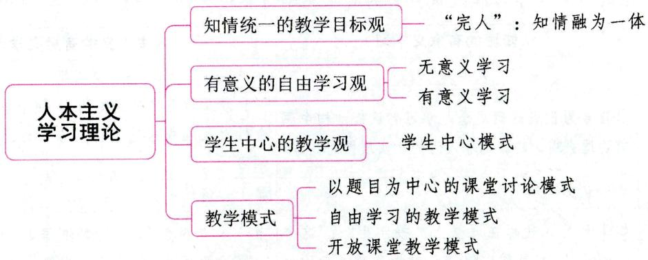

人本主义心理学是20世纪60年代在美国兴起的一个心理学流派。它一方面反对行为主义把人看作是动物或机器；另一方面也批评认知心理学虽然重视人类的认知结构，但却忽视人类的情感、态度、价值观等对学习的影响，认为心理学应该探讨完整的人，强调人的价值，强调人有发展的潜能，而且有发挥潜能的内在倾向，即自我实现倾向。人本主义学习理论以人本主义心理学的基本理论框架为基础，其代表人物罗杰斯对学习问题进行了专门的论述。

# 一、知情统一的教学目标观

罗杰斯认为, 情感和认知是人类精神世界中两个不可分割的有机组成部分, 彼此是融为一体的。因此, 罗杰斯的教育理想就是要培养“躯体、心智、情感、精神、心力融汇一体”的人, 也就是既用情感的方式也用认知的方式行事的知情合一的人。这种知情融为一体的人, 他称之为“完人”或“功能完善者”。当然, “完人”或“功能完善者”只是一种理想化的人的模式, 而要想最终实现这一教育理想, 应该有一个现实的教学目标, 这就是“促进变化和学习, 培养能够适应变化和知道如何学习的人”。人本主义重视的是教学的过程而不是教学的内容, 重视的是教学的方法而不是教学的结果。

# 二、有意义的自由学习观 ★ 【单选、多选】

根据学习对学习者的个人意义, 人本主义将学习分为无意义学习和有意义学习两类。(1)无意义学习是指学习没有个人意义的材料, 类似于心理学上的无意义音节, 不涉及感情或个人意义, 仅仅涉及经验累积与知识增长, 与完整的人(具有情感和理智的人)无关, 学得吃力, 而且容易遗忘。(2)有意义学习, 是指一种涉及学习者是完整的人, 使个体的行为、态度、个性以及在未来选择行动方针时发生重大变化的学习, 是一种与学习者各种经验融合在一起的、使个体全身心地投入其中的学习。例如, 让一个学生取一杯冰水, 他就可以学到“冷”这个词的意义, 并知道冰加热能融化, 而在夏天, 装冰水的杯子外面会有水滴等。

人本主义者倡导有意义的自由学习观，有意义学习关注学习内容与个人之间的关系。它不仅是理解记忆的学习，而且是学习者所做出的一种自主、自觉的学习，要求学习者能够在相当大的范围内自行选择学习材料，自己安排适合于自己的学习情境。有意义学习包含四个要素：(1)学习是学习者自我参与的过程，整个人都要参与到学习之中，既包括认知参与，也包括情感参与；(2)学习是学习者自我发起的，内在动力在学习中起主要作用；(3)学习是渗透性的，它会使学生的行为、态度以及个性等都发生变化；(4)学习的结果由学习者自我评价，他们知道自己想学什么和学到了什么。

# 小香课堂·

编者将认知派的有意义学习和人本主义的有意义学习整理为以下表格，供考生对比学习：

<table><tr><td>比较范畴</td><td>认知派的有意义学习</td><td>人本主义的有意义学习</td></tr><tr><td>代表人物</td><td>奥苏贝尔</td><td>罗杰斯</td></tr><tr><td>概念</td><td>以符号为代表的新观念与学习者认知结构中原 有的适当观念建立起非人为的和实质性的联系</td><td>一种涉及学习者是完整的人,使个体的行为、态度、 个性以及在未来选择行动方针时发生重大变化的 学习</td></tr><tr><td>概念范畴</td><td>属于认知范畴</td><td>属于知情统一</td></tr><tr><td>举例说明</td><td>如果只是让教师在课堂上教授学生“烫”这个词的意义,在教学中使用只对教师有意义的材料,学生学习的速度将会很慢,而且不容易在学生的记忆中长期保存</td><td>当一个儿童触到一个取暖器时,他就可以学到 “烫”这个词的意义,同时也学会了以后对所有的取暖器都要当心,迅速学到的这些内容和意义都会长期保留在儿童的记忆中</td></tr></table>

# 三、学生中心的教学观 ★★ 【单选、多选】

教育与教学过程就是要促进学生的个性发展，发挥学生的潜能，培养学生学习的积极性与主动性。

而学习是人固有潜能的自我实现过程，强调人的尊严和价值，强调无条件积极关注在个体成长过程中的重要作用。教育的目标、学习的结果应该是使学生成为具有高度适应性和内在自由性的人。教师的任务是要为学生提供学习的手段和条件，促进个体自由地成长。

学生中心模式又称为非指导性教学模式。在这个模式中，教师最富有意义的角色不是权威，而是“助产士”和“催化剂”。教师只是一个“为学习提供便利条件的人”“学习的促进者”。在这个模式中，罗杰斯强调：（1）以学生为本；（2）让学生自发地学习；（3）排除对学习者自身的威胁；（4）给学生安全感。人本主义理论提倡自我激励、自我调节的学习、情感教育、真实性评定、合作学习以及开放课堂和开放学校。

非指导性教学过程包括五个阶段：(1)确定帮助的情境，即教师要鼓励学生自由地表达自己的情感；(2)探索问题，即鼓励学生自己来界定问题，教师要接受学生的感情，必要时加以澄清；(3)形成见识，即让学生讨论问题，自由地发表看法，教师给学生提供帮助；(4)计划和抉择，即由学生计划初步的决定，教师帮助学生澄清这些决定；(5)整合，即学生获得较深刻的见识，并做出较为积极的行动，教师对此要予以支持。

罗杰斯认为, 促进学生学习的关键不在于教师的教学技巧, 而在于特定的心理氛围。它包括: (1) 真实或真诚; (2) 尊重、关注和接纳; (3) 移情性理解。

真题 [2023浙江台州,单选]在非指导性教学模式中，教师的角色是（）

A. 塑化剂

B.管理者

C. 权威者

D. 助产士

答案：D

# 四、人本主义教学模式 ★【单选】

# 1. 以题目为中心的课堂讨论模式

这是人本主义心理学家将精神分析心理学家、群体心理治疗专家科恩创建的“以题目为中心的相互作用心理疗法”应用于学校教育而形成的一种教育模式。其主要做法是围绕一个题目进行群体讨论，让师生之间、学生之间相互作用，相互促进。

# 2. 自由学习的教学模式

罗杰斯认为，教师应最大限度地给予学生选择与追求有意义的学习目标的自由，这种模式比较适合大学的教学。其主要做法为：(1)学生参与决定学习的内容与授课方式；(2)学生选择信息源；(3)师生共同制定契约；(4)课堂结构安排的变通性；(5)由学生进行学习的评定。

# 3. 开放课堂教学模式

开放课堂的典型特点是无拘无束、不拘形式。在实施开放课堂的学校里，学生并不需要把自己限制在某个课堂或中心区域，他走进学校以后可以做他想做的事，学他想学的科目。在开放的课堂内，学生自由地从事能激发他们兴趣的活动。教师的作用是鼓励和引导学生的活动。

# 五、人本主义学习理论对教育的影响

罗杰斯等人本主义心理学家在教育实际中倡导的以学生经验为中心的“有意义的自由学习”,对传统的教育理论造成了冲击,推动了教育改革运动的发展。这种冲击和促进主要表现在:(1)突出情感在教学活动中的地位和作用,形成了一种以知情协调活动为主线、以情感作为教学活动的基本动力的新

的教学模式；(2)以学生的“自我”完善为核心，强调人际关系在教学过程中的重要性，认为课程内容、教学方法、教学手段等都维系于课堂人际关系的形成和发展；(3)把教学活动的重心从教师引向学生，把学生的思想、情感、体验和行为看作教学的主体，从而促进了个别化教学运动的发展。

# ★ 本节核心考点回顾 ★

# 1. 知情统一的教学目标观

(1)无意义学习：学习没有个人意义的材料，不涉及感情或个人意义。  
(2)有意义学习：涉及学习者是完整的人，一种与学习者各种经验融合在一起的、使个体全身心地投入其中的学习。

# 2. 学生中心的教学观

(1)学生中心模式(非指导性教学模式):教师只是一个“为学习提供便利条件的人”“学习的促进者”。  
(2)促进学生学习的关键在于特定的心理氛围：真实或真诚；尊重、关注和接纳；移情性理解。

# 第五节 建构主义学习理论

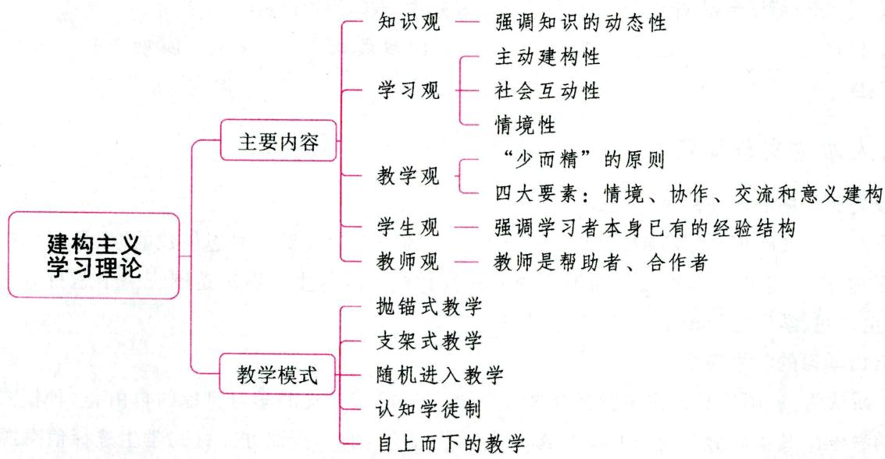

建构主义是认知学习理论的新发展，对当前的教学改革产生了深远的影响。它不是一个特定的学习理论，而是许多理论观点的统称。

# 一、建构主义学习理论的主要内容 ★★ 【单选、多选、判断、辨析、简答、论述】

# 考点1 建构主义知识观

建构主义在一定程度上质疑知识的客观性和确定性，强调知识的动态性。具体体现在以下三个方面：

(1)建构主义认为知识并不是问题的最终答案,而是随着人类进步而不断改正并随之出现的新的假设和解释;

(2)知识并不能精确地概括世界的法则，而是需要针对具体情境进行再创造；

(3)知识不可能以实体的形式存在于具体个体之外，尽管我们通过语言符号赋予了知识一定的外在形式，但学习者仍然会基于自己的经验背景进行理解并建构属于自己的知识。

# 考点2 建构主义学习观

建构主义在学习观上强调学习的主动建构性、社会互动性和情境性三方面。

(1)学习的主动建构性是指学生能够主动地对已有知识经验进行综合、重组和改造，从而用以解释新信息，并最终建构属于个人意义的知识内容。  
(2)社会互动性主要表现为：学习是通过对某种社会文化的参与而内化相关的知识和技能、掌握有关工具的过程，这一过程常常需要通过一个学习共同体的合作互动来完成。建构主义者认为，学习不是每个学生单独在头脑中进行的活动，学习者也不是一个孤独的探索者，而是一个社会的人。学习总是学习者在一定社会文化环境下进行的，即使表现上学习者是一个人在学习，但是他在学习中采用的学习材料、学习用具以及学习环境等都是属于社会的，是集体经验的累积。  
(3)学习的情境性主要指学习、知识和智慧的情境性，建构主义者认为知识是不可能脱离活动情境而孤立存在的，只有通过实际应用活动，知识才能真正被理解。因此，人的学习应该与情境化的社会实践活动相联系，通过对某种社会实践的参与而逐渐掌握有关的社会规则并形成相应的知识。

真题1 [2023河南事业单位，多选]建构主义学习观认为，学习不是由教师向学生传递知识的过程，而是学生建构自己知识的过程。下列属于知识建构过程重要特征的有（）

A. 社会互动性

B. 情境性

C. 主动建构性

D. 理解性

答案：ABC

# 考点3 建构主义教学观

在教学上，建构主义者提出要尊重学生的观点和经验，并重视与学生相关的问题，而且这些问题应当是学生所关注的，可引起他们的兴趣。针对学生的观点进行教学，主张教师在教学中应坚持“少而精”的原则。所谓“少”是指主要讲授基本的科学概念、规则、理论、模式，但和认知心理学的不同之处在于不是重在学习抽象的、理论化的、脱离情境的知识。“精”则指要求学得深入、细致，理解科学的本质，进而使得学生终身受益。在课程内容的呈现上，传统课堂对于课程内容的传递是从部分到整体的，而且强调基本技能的掌握；建构主义课堂对于课堂内容的呈现是从整体到部分的，而且强调核心概念的掌握。

如果说强调学生主体是建构主义教学观的核心，那么设计“学习环境”是建构主义教学的关键。建构主义学习环境的四大要素为情境、协作、交流（会话）和意义建构。

# 考点4 建构主义学生观

建构主义非常强调学习者本身已有的经验结构, 认为学生不是空着脑袋走进教室的, 学习者在学习新信息、解决新问题时往往可以基于相关的经验, 依靠其认知能力形成对问题的解释。通过对儿童早期认知发展的研究也发现, 即使是年龄非常小的孩子也已经形成了远比我们所想象的要丰富得多的

知识经验。因此, 教学不能无视儿童的已有经验, 而是要把儿童现有的知识经验作为新知识的生长点,引导儿童从原有的知识经验中发展出新的知识经验。

真题2 [2024贵州贵阳，单选]张老师常常告诫他的徒弟小张老师：“一定要记住，学生并不是空着脑袋进教室的。”张老师这一观点源于（）

A. 联结主义学习理论

B. 认知结构学习理论

C.建构主义学习理论

D. 有意义接受学习理论

答案：C

# 考点5 建构主义教师观

信息加工的认知主义更多地把教师看成是学生学习的指导者、设计者, 而建构主义更愿意把教师看成是学生学习的帮助者、合作者。建构主义认为教学不是由教师到学生的简单的转移和传递, 而是在师生的共同活动中, 教师通过提供帮助和支持, 引导学生从原有的知识经验中“生长”出新的知识经验, 使学生对知识的理解能逐步深入; 帮助学生形成思考、分析问题的思路, 启发他们对自己的学习进行反思, 逐渐让学生对自己的学习能自我管理、自我负责; 创设良好的、情境性的、富有挑战性的、真实的、复杂多样的学习情境, 鼓励并协助学生在其中通过实验、独立探究、讨论、合作等方式学习; 组织学生与不同领域的专家或实际工作者进行广泛的交流, 为学生的探索提供有力的社会性支持。

# 二、建构主义的教学模式 ★【单选、多选、判断】

# 1.抛锚式教学

# (1) 概念

抛锚式教学指以问题为中心，将知识抛锚在一定的问题情境中，以激发学生的好奇心和创造力的教学模式。这里所谓的“锚”指的是课程与教学实施的支撑物，它通常是一个故事、一段历险或者是学生感兴趣的一系列问题情境。

# (2)教学操作阶段

①教师介绍学习目的，呈现学习内容；②将不同类型的“锚”呈现给学生；③教师引导学生识别问题、分解问题并制订问题解决计划；④将学生分组，进行问题解决；⑤教师进行整体评价。

# (3)基本程序

创设情境—确定问题—自主学习—协作学习—效果评价。

# 2. 支架式教学

(1)基本观点：支架式教学应当为学习者建构对知识的理解提供一种概念框架。这种框架中的概念是为发展学习者对问题的进一步理解所需要的。  
(2)基本环节：进入情境一搭建支架，引导探索一学生独立探索一协作学习一效果评价。

# 3. 随机进入教学（随机通达教学）

斯皮诺的认知弹性理论把学习分为两种：初级学习和高级学习。他在探讨高级学习的基础上提出了适合高级学习阶段的教学模式——“随机进入教学”。

随机进入教学，也叫随机通达教学，是指学习者可以随机通过不同途径、不同方式进入同样教学内容的学习，从而获得对同一事物或同一问题的多方面认识和理解。其基本原理是：对于同一教学内容，

要在不同时间、在重新安排的情境下、带着不同的目的、从不同的角度多次进行学习，以此来达到获得高级知识的目标。建构主义者认为，学习的关键在于建构起围绕关键概念组成的网络结构，包括事实、概念、策略以及概括化的知识，从而形成随机通达的状态。

随机进入教学的具体操作如下：呈现情境一随机进入学习一思维发展训练一协作学习一效果评价。

# 4. 认知学徒制

认知学徒制是指通过允许学生获取、开发和利用真实领域的活动工具的方法，来支持学生在某一领域学习的模式。该模式强调经验活动在学习中的重要性，强调要把学习和实践联系起来。

# 5. 自上而下的教学

建构主义者主张自上而下地展开教学进程，即在教学过程中，首先选择一些与学生生活经验有关的整体性任务并呈现有关的问题，让学生尝试进行解决，然后让学生独自或在小组中通过探索，自己发现要完成整体任务需首先完成的子任务，以及完成各级子任务所需的基本知识技能，在掌握这些知识技能的基础上，最终使问题得以解决。

真题3 [2024浙江宁波, 单选] 数学课上, 张老师在教面积的概念前, 先问了学生一个问题: 教室的面积有多少平方米? 张老师使用的教学模式是( )

A. 支架式教学

B.抛锚式教学

C. 随机进入教学

D. 自上而下的教学

真题4 [2024河北石家庄，判断]抛锚式教学模式的基本程序是：呈现情境一随机进入学习一思维发展训练一小组协作学习一学习效果评价。（）

A. 正确

B. 错误

答案：3.B 4.B

# 三、建构主义学习理论对当前教育实践的启示

作为新课程改革背景下的教师，在课堂教学中要尊重学生已有的知识与经验，不断强化学生的能动意识，使学生认识到，学习的过程不是消极的“等、靠、听、记”，不单是信息的累积过程，而是一个新旧经验之间双向的相互作用的过程，是主动进步与发展的过程。

(1)从建构主义的知识观出发，建构主义强调知识是个体对于现实的理解和假设，其受到特定经验和文化等的影响，因此每个人对知识所建构的理解都是不同的。教师在教育教学过程中应当要更加重视学生的个性化特点，因材施教，并不是要对所有的学生传授完全相同的原理知识，而是要让每个学生能够按照他的知识经验建构出新的知识内容。  
(2)从教学的角度来看，建构主义认为学习就是主体对客体的主动探索、不断变革，从而建构对客体意义理解的过程。因此，在教学中应当注意学生的有意义建构，通过适当的教学策略启发学生能够自主地建构认知结构。  
(3)从学习者的角度出发，建构主义认为学生是意义的主动建构者，而不是外部刺激的被动接受者和被灌输的对象，因此，在教学过程中除了传统知识的传授，还应当充分发挥学生的主体地位，强调学生的自主性和能动性，在学习过程中能够主动发现、分析、解决问题。学生由被动的知识接受者变为主动的信息搜集者，教师由知识的灌输者变为引导学生建构知识意义的领路人，教师在学生心目中的地位也不再是不可

褒渎的权威，而是学生学习的辅助者，师生成为共同的学习伙伴和合作者。

# ★本节核心考点回顾 ★

# 1.建构主义知识观

(1)知识是随着人类进步而不断改正并随之出现的新的假设和解释。  
(2)知识并不能精确地概括世界的法则，而是需要针对具体情境进行再创造。  
(3)知识不可能以实体的形式存在于具体个体之外，学习者会基于自己的经验背景进行理解并建构属于自己的知识。

# 2.建构主义学习观

(1)主动建构性：主动地对已有知识经验进行综合、重组和改造。  
(2)社会互动性：学习需要通过一个学习共同体的合作互动来完成。  
(3)情境性：知识不可能脱离活动情境而抽象存在。

# 3.建构主义学生观

(1)学生不是空着脑袋走进教室的。  
(2)教学不能无视儿童的已有经验，要把儿童现有的知识经验作为新知识的生长点，引导儿童从原有的知识经验中发展出新的知识经验。

# 4.建构主义教师观

教师是学生学习的帮助者、合作者。

# 5. 建构主义的教学模式

(1)抛锚式教学：将知识抛锚在一定的问题情境中。  
(2) 支架式教学：为学习者建构对知识的理解提供一种概念框架。  
(3)随机进入教学：随机通过不同途径、不同方式进入同样教学内容的学习。

# 第四章 学习心理

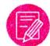

# 本章学习指南

# 一、考情概况

本章属于教育心理学的重点章节，也是考试中重点考查的章节，内容广泛、理解性知识多，考生可带着以下学习目标进行备考：

1. 掌握学习动机的概念、种类、理论以及对学习效果的影响。  
2. 掌握如何激发与培养学生的学习动机。  
3. 掌握学习策略和学习迁移的种类以及相关内容。  
4.区分和掌握知识学习的类型以及知识学习的过程。  
5. 掌握操作技能和心智技能的概念、特点及其形成。  
6. 识记问题解决的过程、策略及影响因素。  
7. 掌握品德发展的阶段理论及其培养方法。

# 二、考点地图

<table><tr><td>考点</td><td>年份/地区/题型</td></tr><tr><td>学习动机的种类</td><td>2024广东单选;2023内蒙古单选;2023广东单选;2023甘肃单选;2023浙江单选;2023江苏单选;2023浙江判断</td></tr><tr><td>耶克斯-多德森定律</td><td>2024天津单选;2023天津单选;2023江西单选;2023内蒙古多选;2023辽宁多选;2023河南判断;2022河北单选;2022江苏判断</td></tr><tr><td>成败归因理论</td><td>2024广东单选;2024山东单选;2023黑龙江单选;2023广西单选;2023辽宁单选;2023浙江论述;2023福建材料分析</td></tr><tr><td>自我效能感理论</td><td>2024江苏单选;2024浙江判断;2023河北单选;2022浙江单选;2022河南多选</td></tr><tr><td>学习动机的激发与培养</td><td>2024广东多选;2023河南单选;2023内蒙古多选;2023浙江论述;2022四川单选;2022河北简答</td></tr><tr><td>学习策略的种类</td><td>2024安徽单选;2024山东单选;2024江苏单选;2024四川单选;2024福建单选、填空;2023广西单选;2023黑龙江单选;2023广东单选;2023山东单选;2023江苏单选;2023福建多选</td></tr><tr><td>学习迁移的种类</td><td>2024福建多选;2024安徽多选;2024浙江判断;2023广西单选;2023黑龙江单选;2023河南单选;2023甘肃单选;2023辽宁单选</td></tr><tr><td>学习迁移的理论</td><td>2024河北单选;2024广东多选;2023河北单选;2023吉林单选;2023河南单选</td></tr><tr><td>知识学习的类型</td><td>2024广东单选;2024江苏单选;2023广西单选;2023贵州单选;2023山西多选;2022河南判断</td></tr><tr><td>知识学习的过程</td><td>2024广东单选;2024江苏单选;2023河北单选;2023辽宁单选;2023广东多选;2022山东单选、多选</td></tr><tr><td>操作技能的形成</td><td>2024河北单选;2024江苏单选;2024福建多选;2024浙江简答;2023吉林单选;2023河北单选;2022天津单选;2022安徽多选</td></tr><tr><td>心智技能的形成</td><td>2023广东单选;2023河南单选;2023河北多选;2022四川单选;2022浙江单选;2022福建填空</td></tr><tr><td>问题解决的策略</td><td>2024天津单选;2024江苏单选;2023河北单选;2023广东单选;2023四川单选;2023浙江单选;2023广西单选</td></tr><tr><td>影响问题解决的因素</td><td>2024河北单选;2024广东单选;2024江苏简答;2023贵州单选;2023山东单选;2022天津单选;2022广东多选</td></tr><tr><td>品德发展的阶段理论</td><td>2024江苏单选;2024浙江单选;2024福建单选、判断选择;2023河北单选;2023黑龙江单选;2023广西多选;2023辽宁判断</td></tr></table>

注：上述表格仅呈现重要考点的相关考情。

# 核心考点

# 第一节 学习动机

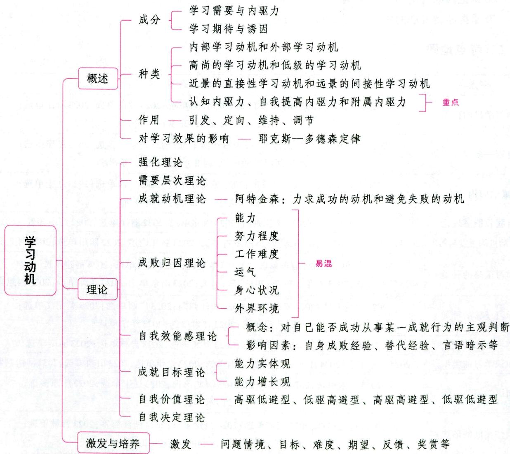

# 一、学习动机概述

# 考点1 学习动机的概念及其成分 ★【单选】

# 1. 学习动机的概念

学习动机是指激发个体进行学习活动, 维持已引起的学习活动, 并使行为朝向一定学习目标的一种心理倾向或内部动力。学习动机是直接推动学习行为的原因和内部动力。一个学生是否想要学习、学习的努力程度、积极性、主动性等都与学习动机有关。

# 2. 学习动机的成分

学习动机的两个基本成分是学习需要与学习期待,两者相互作用形成学习的动机系统。关于学习需要和学习期待可以从以下几个方面来理解：

# (1)学习需要与内驱力

学习需要是指个体在学习活动中感到有某种欠缺而力求获得满足的心理状态。它的主观体验形式是学习者的学习愿望或学习意向。这种愿望或意向是驱使个体进行学习的根本动力, 它包括学习的兴趣、爱好和学习的信念等。从需要的作用上来看, 学习需要即为学习的内驱力。所以, 学习需要对学习的作用, 就称为学习内驱力。

# (2)学习期待与诱因

学习期待是个体对学习活动所要达到目标的主观估计。诱因是指能够激起有机体的定向行为，并能满足某种需要的外部条件或刺激物。诱因可以是简单的物体（如食物、水等），也可以是复杂的事情（如名誉、地位等）。学习期待就其作用来说就是学习的诱因。

# (3)学习需要与学习期待的关系

学习需要与学习期待密切相关。学习需要是个体从事学习活动的最根本动力,如果没有这种自身产生的动力,个体的学习活动就不可能发生。所以说,学习需要在学习动机结构中占主导地位。另外,学习需要是产生学习期待的前提之一,因为正是那些能够满足个体的学习需要与那些使个体感到可以达到的目标的相互作用而形成了学习期待。学习期待则指向学习需要的满足,促使主体去达到学习目标。因此,学习期待也是学习动机结构的必不可少的成分。

真题1 [2023湖南长沙, 单选]( )是直接推动学习行为的原因和内部动力。

A. 学习资源

B. 学习方法

C. 学习动机

D. 学习态度

答案：C

# 考点2 学习动机的种类 ★★ 【单选、多选、判断】

# 1. 内部学习动机和外部学习动机

按学习动机产生的诱因来源, 可将学习动机分为内部学习动机和外部学习动机。内部学习动机是指诱因来自学习者本身的内在因素, 即学生因对活动本身发生兴趣而产生的动机。外部学习动机是指诱因来自学习者外部的某种因素, 即在学习活动以外由外部的诱因激发出来的学习动机。外在诱因可分为三种: (1) 理智诱因, 如目标与反馈; (2) 情绪诱因, 如表扬与批评; (3) 社会诱因, 如竞赛等。

# 2. 高尚的学习动机和低级的学习动机

按学习动机的社会意义, 可将学习动机分为高尚的学习动机和低级的学习动机。判断学习动机高

尚与低级的标准是看它是否有利于社会和集体。如果把学习看成是对社会多做贡献和尽义务,则是高尚的学习动机;而把学习看成是猎取个人名利的手段,则是低级的学习动机。

# 3. 近景的直接性学习动机和远景的间接性学习动机

按学习动机的作用与学习活动的关系，可将学习动机分为近景的直接性学习动机和远景的间接性学习动机。

近景的直接性学习动机是与学习活动直接相连的,来源于对学习内容或学习结果的兴趣。例如,学生的求知欲、成功的愿望、对某门学科的浓厚兴趣以及教师生动形象的讲解、教学内容的新颖等都直接影响到学生的学习动机。这种动机很具体,效果很明显,但不够稳定,容易随着环境的变化而变化。

远景的间接性学习动机是与学习的社会意义和个人的前途相连的。例如,大学生意识到自己的历史使命,为不辜负父母的期望,为争取自己在班集体中的地位和荣誉等都属于间接性的动机。

# 4. 主导性学习动机和辅助性学习动机

按学习动机在活动中所起作用的大小，可将学习动机分为主导性学习动机和辅助性学习动机。主导性学习动机是指在一定时期或某个特定活动上起支配作用，发挥主导作用的动机。辅助性学习动机是指在一定时期或某个活动上从属于主导性动机，发挥辅助作用的动机。

# 5. 认知内驱力、自我提高内驱力和附属内驱力

根据学校情境中的学业成就动机的不同，奥苏贝尔等人把动机分为认知内驱力、自我提高内驱力和附属内驱力三个方面。

表 3-12 奥苏贝尔的学业成就动机分类  

<table><tr><td>类型</td><td>含义</td><td>动机来源</td><td>性质</td></tr><tr><td>认知内驱力</td><td>要求了解、理解和掌握知识以及解决问题的需要</td><td>这种动机指向学习任务本身(为了获得知识),满足这种动机的奖励(知识的实际获得)是由学习本身提供的</td><td>内部动机</td></tr><tr><td>自我提高内驱力</td><td>个体因自己的胜任或工作能力而赢得相应地位的需要</td><td>自我提高内驱力并非直接指向学习任务本身,而是把成就看作赢得地位与自尊心的根源</td><td>外部动机</td></tr><tr><td>附属内驱力</td><td>个体为了获得长者(如家长、教师)的赞许或认可而表现出把工作、学习做好的一种需要,是一种间接的学习需要</td><td>它既不直接指向学习任务本身,也不把学业成就看作赢得地位的手段,而是为了从长者或同伴那里获得赞许和接纳</td><td>外部动机</td></tr></table>

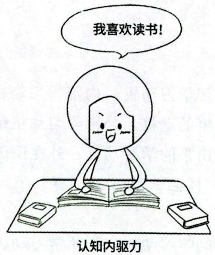

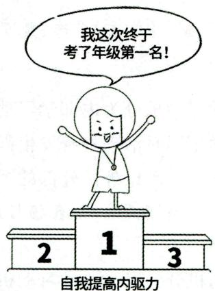

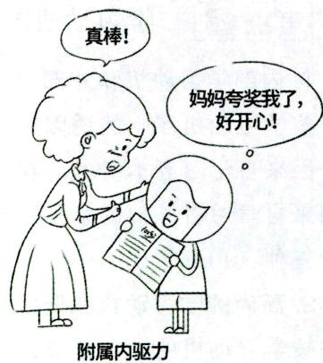

认知内驱力、自我提高内驱力和附属内驱力在动机结构中所占的比重并不是一成不变的, 通常是随着年龄、性别、个性特征、社会地位和文化背景等因素的变化而变化。在儿童早期, 附属内驱力最为突出, 他们努力学习获得学业成就, 主要是为了实现家长的期待, 并得到家长的赞许。到了儿童后期和少年期, 附属内驱力的强度有所减弱, 来自同伴、集体的赞许和认可逐渐替代了对长者的依附。在这期间, 赢得同伴的赞许就成为一个强有力的动机因素。而到了青年期, 认知内驱力和自我提高内驱力成为学生学习的主要动机, 学生学习的主要目的在于满足自己的求知需要, 并从中获得相应的地位和威望。

真题2 [2024广东广州, 单选]小华对历史非常感兴趣, 一方面, 他不断地学习不同时期、不同国家的历史事件; 另一方面, 在历史课上, 他总是非常积极, 课后也会认真完成历史作业, 努力提升自己。小华的学习动机属于( )

A.生理内驱力  
B. 认知内驱力  
C. 附属内驱力  
D. 自我提高内驱力

真题3 [2023广东梅州,单选]学习动机分为内部动机和外部动机，其中( )属于外部动机。

A. 小明对数学有强烈的求知欲而认真学数学  
B. 小东对物理有强烈的好奇心而认真研究物理  
C. 小红对古诗词有浓厚的兴趣而认真学语文  
D. 小颖为得到英语教师的表扬而认真学英语

真题4 [2023浙江宁波，判断]小王非常崇拜外交部发言人毛宁，立志成为一名优秀的外交部发言人，并发奋学习，这属于远景的直接性动机。（）

答案：2.B 3.D 4.×

# 考点 3 学习动机的作用 ★ 【多选】

一般来说，学习动机并不是通过直接卷入认知建构过程而对学习产生作用的，而是以学习情绪状态的唤醒、学习准备状态的增强、学习注意力的集中和学习意志努力的提高为中介来影响认知建构过程的。这些中介因素综合起来使学习动机对学习产生以下四个方面的作用：

# 1. 引发作用

当学生对于某些知识或技能产生迫切的学习需要时，就会引发学习内驱力，唤起内部的激动状态，产生焦急、渴求等心理体验，并最终激起一定的学习行为。

# 2.定向作用

学习动机以学习需要和学习期待为出发点，使学生的学习行为在初始状态时就指向一定的学习目标，并推动学生为达到这一目标而努力学习。有的学生可能面临多种学习目标或诱因，这就需要在其中做出选择。这种目标选择既取决于学生对不同目标或诱因的期望强度，又取决于学生已有的知识和经验。

# 3. 维持作用

在学习过程中, 学生的学习是认真还是马虎, 是勤奋还是懒惰, 是持之以恒还是半途而废, 在很大程度上取决于学习动机的水平。美国心理学家阿特金森在全面探讨了有关动机研究的文献后, 发现了

一个较为普遍的规律, 即完成某项具体学习任务所需要的时间与对该项任务的动机水平成正相关。由此可见, 学习动机水平高的学生能在长时间的学习活动中保持认真的态度和坚持把学习任务胜利完成的毅力, 而学习动机水平低的学生则缺乏学习行为的稳定性和持久性。

# 4. 调节作用

学习动机调节学习行为的强度、时间和方向。如果行为活动未达到既定目标，动机还将驱使学生转换行为活动方向以达到既定目标。

真题5 [2023河北石家庄，多选]学习动机对学生学习产生作用具体表现在（）

A. 引发作用

B. 定向作用

C. 维持作用

D. 调节作用

答案：ABCD

考点4 学习动机对学习效果的影响 ★★★ 【单选、多选、判断】

学习动机对学习效果的影响可分为两个方面：一方面是总体上整个动机水平对整个学习活动的影响；另一方面是具体的学习活动中学习动机对学习效果的影响。

(1) 总体而言, 在一般情况下, 学习动机与学习效果的关系是一致的, 表现为学习动机可以促进学习, 提高成绩。学习动机越强, 有机体对学习活动的积极性就越高, 学习效果就越佳。学习动机对学习效果的影响并不是直接发生的, 它必须通过学习者的学习行为这一中间环节才能作用于学习结果。学习动机只是影响学习效果的因素之一, 而不是充分条件。

(2)对一项具体的学习活动而言，学习动机对学习效果的影响并不是那么简单。只有当学习动机的强度处于最佳水平时，才能产生最好的学习效果。

“耶克斯一多德森定律”表明, 动机不足或过分强烈都会影响学习效果。①动机的最佳水平随着任务性质的不同而不同。在比较容易的任务中, 行为效果(工作效率)随着动机的提高而上升, 即在难度较小的任务中, 较高动机水平有利于任务的完成; 随着任务难度的增加, 动机的最佳水平有逐渐下降的趋势, 即在难度较大的任务中, 较低动机水平有利于任务的完成。②一般来讲, 动机的最佳水平为中等强度。③动机水平与行为效果呈倒U形曲线。

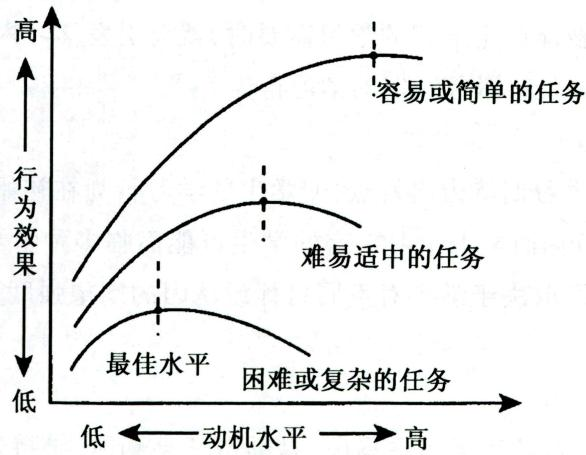  
图3-3 耶克斯一多德森定律

# 知识再拔高·

# 学习效果对学习动机的影响

学习效果反作用于学习动机。因此，教师在强调动机对学习的重要作用的同时，也应该看到所学的知识反过来又可以增强学习的动机。对于那些尚无学习动机或者学习动机不高的学生，尤其是年龄较小的学生，教师没有必要推迟学习活动。教学的最好办法是，把重点放在学习的认知方面而不是动机方面，致力于有效地教他们掌握有关知识，让他们获得成功的体验。学生尝到了学习的乐趣，就有可能产生或者增强其学习的动机。

真题6 [2024天津西青，单选]根据耶克斯一多德森定律，当学生完成较容易的作业时，教师应使其心理动机程度控制在（）

A. 较低的水平

B. 较高的水平

C. 非常低的水平

D. 中等水平

答案：B

# 考点5 影响学习动机形成的因素 ★【单选】

# 1.主观因素

(1)需要与目标结构。每个学生认知需要的强度不同，反映在学习动机上也有强度差异。此外，学生的学习目标可分为两类，即掌握目标和成绩目标。  
(2)成熟与年龄特点。年幼儿童的动机主要是生理性动机，随着年龄的增长，社会性动机及其作用也日益增长。  
(3)性格特征与个别差异。学生的兴趣、好奇心、意志品质等都影响着学习动机的形成。  
(4)志向水平与价值观。学生的理想与志向水平影响着其学习动机和目标结构的形成。一般来说,理想、志向水平越高,学习动机就越强,且越具有持久性。如果某一学生认为上学读书没有多大价值,那他就很难有强烈的学习动机。  
(5)焦虑程度。焦虑指学生担心不能完成任务时产生的不舒适、紧张和担忧的感觉，焦虑程度影响着学习动机和学业成绩。大量研究表明，中等程度的焦虑对学习是有益的，焦虑程度过低或过高都会对学习产生不良影响。

# 2.客观因素

(1)家庭环境与社会环境。学习动机是社会要求在学生头脑中的反映，个体学习动机的形成和结构受社会生活条件的制约和影响。社会要求首先通过家庭对学生产生影响，年级越低的学生，其学习动机受家庭的影响越大。与家庭的影响相比，随着学生年龄增长和逐渐成熟，社会影响越来越大。社会环境不仅直接影响学生的学习动机，而且通过家庭环境间接地影响学生的学习动机。  
(2)学校教育。学校教育对学生学习动机的形成和发展起主导作用，它可以强化学生在家庭、社会影响下初步形成的正确学习动机，也可以纠正学生在家庭、社会影响下形成的错误的学习动机。

真题7 [2022湖南长沙, 单选]( )会影响学习动机和目标结构的形成。例如, 某学生认为上学读书没有太大价值, 他就很难有强烈的学习动机。

A. 志向水平与价值观

B. 成熟与年龄特点

C. 焦虑程度

D. 好奇心的强弱

答案：A

# 二、学习动机理论

# 考点1 强化理论

学习动机的强化理论是由联结主义心理学家提出来的,他们不仅用强化来解释学习的发生,而且用它来解释动机的产生。在他们看来,人的某种学习行为倾向完全取决于先前的这种学习行为与刺激因强化而建立起来的稳固联系,强化可以使人在学习过程中增强某种反应发生的可能性。按照这种观点,任何学习行为都是为了获得某种报偿。因此,在学习活动中,采取各种外部手段(如奖赏、赞扬、评分、竞赛等)可以激发学生的学习动机,引起其相应的学习行为。

一般来说，正强化和负强化都起着增强学习动机的作用，如适当的表扬与奖励、获得优秀成绩、取消讨厌的频繁考试等便是正强化或负强化的手段。惩罚则一般起着削弱学习动机的作用，但有时也可使一个人在失败中重新振作起来，如频繁的惩罚、考试不及格等便是惩罚的手段。在学习中如能合理地增强正强化，利用负强化，减少惩罚，将有助于提高学生的学习动机水平，改善他们的学习行为及其结果。

# 考点2 需要层次理论

人本主义心理学家马斯洛认为,要揭示动机的本质,必须关注人的需要。他把需要区分为一些基本的层次,对这些需要层次进行研究,从整体上把握动机的实质。需要层次理论说明,在某种程度上学生缺乏学习动机可能是由于某种缺失需要没有得到充分满足而引起的。一般来说,学生在学校里最重要的缺失需要是爱和尊重的需要。

# 考点3 成就动机理论 ★★ 【单选、多选、判断】

# 1. 基本观点

成就动机理论的主要代表人物是美国心理学家阿特金森。成就动机是由心理学家默里提出的概念, 它是指个体努力克服障碍, 施展才能, 力求又快又好地解决某一问题的愿望或趋势。它是人类所独有的, 是后天获得的具有社会意义的动机, 能促使个体产生成就行为, 并追求在某一社会条件下人们认为重要的社会目标。在学习活动中, 成就动机是一种主要的学习动机。

阿特金森把个体的成就动机分为两类: 力求成功的动机和避免失败的动机。成就动机高的人追求成功的倾向大于回避失败的倾向, 成就动机低的人追求成功的倾向小于回避失败的倾向。成就动机水平不同的人在选择目标和完成任务上也不同。力求成功者 的 目的是获取成就, 即通过各种活动努力提高自尊心和获得心理上的满足, 成功概率为 $50\%$ 的任务是他们最有可能选择的。避免失败者 则往往通过各种活动防止自尊心受伤害和产生心理烦恼, 倾向于选择非常容易或非常困难的任务。如果成功的概率大约是 $50\%$ 时, 他们会回避这项任务。

# 2. 成就动机理论的教育启示

(1)在教育实践中对力求成功者，应通过给予新颖且有一定难度的任务，安排竞争的情境，严格评定分数等方式来激发其学习动机；

(2)对于避免失败者,则要安排少竞争或竞争性不强的情境,如果取得成功则要及时表扬给予强

化，评定分数时要求稍稍放宽些，并尽量避免在公共场合下指责其错误；

(3)由于力求成功的动机比避免失败的动机具有更大的主动性，因此，对学生还应增加他们力求成功的成分，使他们不以避免失败为满足，而以获取成功为快乐，这样才能真正调动一个人的积极性。

真题8 [2023山西太原, 单选]根据阿特金森的成就动机理论, 在教育实践中, 教师要根据不同成就动机类型的学生, 给予其有针对性的教育。对于避免失败者, 教师的下列做法不恰当的是( )

A.避免在公众场合指责其错误

B.取得成功时及时给予表扬

C. 评定分数时放宽要求

D. 安排竞争的情境

真题9 [2023辽宁营口，判断]根据成就动机理论，成就动机高的人追求成功的倾向大于回避失败的倾向，成就动机低的人追求成功的倾向小于回避失败的倾向。（）

A. 正确

B. 错误

答案：8.D 9.A

考点4 成败归因理论 ★★★ 【单选、多选、论述、材料分析】

# 1. 基本观点

归因是人们对自己或他人活动及其结果的原因所做的解释和评价。在学习和工作当中，人人都会体验到成功与失败，同时还会去寻找成功与失败的原因，这就是对行为进行归因的过程。人们会把成败归结为不同的原因，并产生相应的心理变化，从而影响今后的行为。归因理论是由社会心理学家海德首先提出来的。

罗特发展了归因理论，提出了控制点的概念，并依据控制点把个体分为“内控型”和“外控型”。内控型的人认为自己可以控制周围的环境，无论成功还是失败，都是由自己的能力或努力等内部因素造成的，他们乐于对自己的行为负责；外控型的人则感到自己无法控制周围的环境，无论成败都归因为他人的影响或运气等外在因素，他们往往对自己的行为不愿承担责任。

在海德和罗特研究的基础上,美国心理学家韦纳对行为结果的归因进行了系统的研究,他把人经历过事情的成败归结为六项因素,即能力、努力程度、工作难度、运气、身心状况、外界环境。他又把上述六项因素按各自的性质,分别归入三个维度:内部归因和外部归因、稳定性归因和非稳定性归因、可控制归因和不可控制归因。

表 3-13 韦纳成败归因理论中的六因素与三维度  

<table><tr><td rowspan="2">因素\维度</td><td colspan="2">稳定性</td><td colspan="2">因素来源(控制点)</td><td colspan="2">可控性</td></tr><tr><td>稳定</td><td>不稳定</td><td>内在</td><td>外在</td><td>可控制</td><td>不可控制</td></tr><tr><td>能力</td><td>✓</td><td></td><td>✓</td><td></td><td></td><td>✓</td></tr><tr><td>努力程度</td><td></td><td>✓</td><td>✓</td><td></td><td>✓</td><td></td></tr><tr><td>工作难度</td><td>✓</td><td></td><td></td><td>✓</td><td></td><td>✓</td></tr><tr><td>运气</td><td></td><td>✓</td><td></td><td>✓</td><td></td><td>✓</td></tr><tr><td>身心状况</td><td></td><td>✓</td><td>✓</td><td></td><td></td><td>✓</td></tr><tr><td>外界环境</td><td></td><td>✓</td><td></td><td>✓</td><td></td><td>✓</td></tr></table>

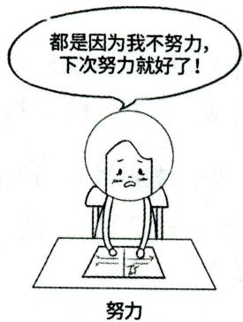

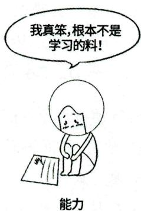

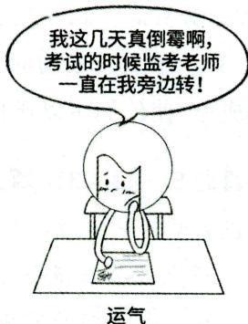

韦纳认为，每一维度对动机都有重要的影响。控制点维度与个体成败的情绪体验有关。稳定性维度与个体对未来成败的期望有关。可控性维度既与情绪体验有关，又与对未来成败的预期有关。

一个总是失败并把失败归于内部的、稳定的和不可控的因素（即能力低）的学生会形成一种习得性无助的自我感觉。

# 知识再拔高·

# 习得性无力（助）感理论

习得性无力感简称无力感,又称习得性无助,指由于连续的失败体验而导致个体产生的对行为结果感到无力控制、无能为力的心理状态。

根据塞利格曼的理论，无力感的产生过程可以分为四个阶段：(1)获得体验；(2)在体验的基础上进行认知；(3)形成“将来结果也不可控”的期待；(4)表现出动机、认知和情绪上的损害，影响后来的学习。

塞利格曼等人指出，人对失败的归因在无力感的形成过程中起着重要的作用。归因方式不同，人们所产生的认知和期待就不一样，无力感也会呈现多种形式。

# 2.韦纳的成败归因理论在教育上的意义

(1)教师根据学生的自我归因可预测其此后的学习动机。根据韦纳的三维度归因方式，教师既可以了解每个学生对自己学习结果成败的归因倾向，也可以预测他以后对此学科的学习动机。  
(2)长期消极的归因不利于学生的人格成长，这就需要教师利用反馈的作用，并在反馈中给予鼓励和支持，帮助学生正确归因，重塑自信。  
(3)通过归因训练改变学生消极的自我认识，提高学习动机。根据归因理论，学生将成败归因于努力比归因于能力会产生更强烈的情绪体验。努力而成功，体验到愉快；不努力而失败，体验到羞愧；努力而失败，也应受到鼓励。因此，教师在给予奖励时，不仅要考虑学生的学习结果，而且要联系学生学习进步与努力程度的状况来看，强调内部、不稳定和可控制的因素。在学生付出同样努力时，对能力低的学生应给予更多的奖励；对能力低而努力的人给予最高评价；对能力高而不努力的人则给予最低评价，以此引导学生进行正确归因。

# 知识再拔高

# 归因偏差

人们的归因行为并非总是纯粹理性活动的产物，也并不是逻辑严密的，这就会使人们对行为的归因出现错误和偏差。常见的归因偏差有以下几种：

(1)基本归因错误

人们对他人的行为进行归因时，往往将行为归因于内部稳定的性格因素，而忽视引起行为的外部客观因素。这一归因现象被社会心理学家称为“基本的归因错误”。

(2)行动者与观察者偏差

这一归因偏差指的是，我们常常将他人的行为归因于较稳定的人格因素，却倾向于将自己的行为归因于外部因素，即随情境而变，这在行为本身无所谓好坏或优劣时更是如此。

(3)自我服务归因偏差

这一归因偏差是指人们把功劳归于自己，把失败归于外因的倾向。在日常生活中，人们常把失败归于运气不好、他人拆台等，以摆脱责任、免受责备。这种做法有利于个体的心理平衡。

真题10 [2024广东东莞, 单选]小芳这次期中考试成绩明显下滑, 她觉得是自己最近不够努力导致的。其归因是( )

A. 内部、稳定归因

B. 内部、不稳定归因

C. 外部、稳定归因

D.外部、不稳定归因

真题11 [2024山东临沂，单选]物理出成绩后，小军兴奋地说：“太棒了，我都蒙对了。”结合韦纳的归因理论，这属于（ ）归因。

A. 能力

B.努力

C. 运气

D. 任务难度

真题12 [2023广西百色，单选]小薇花了很多时间和精力学习数学，但每次数学考试都不及格，渐渐地她对学习数学失去信心甚至在数学课上打瞌睡。小薇的这种心理属于（）

A. 自尊

B. 害羞

C. 躁狂

D. 习得性无助

答案：10.B 11.C 12.D

考点5 自我效能感理论 ★★ 【单选、多选、填空、判断、辨析、简答】

# 1. 自我效能感的内涵

自我效能感由班杜拉首次提出,是指人对自己能否成功从事某一成就行为的主观判断。班杜拉指出,人的行为受行为的结果因素与先行因素的影响。行为的结果因素是人们通常所说的强化。行为的先行因素就是人在认识到行为与强化之间的依随关系之后产生的对下一步强化的期待。

期待包括结果期待和效能期待。结果期待是指人对自己的某一行为会导致某一结果的推测。效能期待是指人对自己能够进行某一行为的能力的推测或判断,它意味着人是否确信自己能够成功地进行带来某一结果的行为。当个体确信自己有能力进行某一活动时,他就会产生高度的“自我效能感”,并努力实施该活动。

小香课堂·

结果期待和效能期待是易混的知识点，考生要注意区分。结果期待强调对结果的预测；效能期待强调对自己进行某一行为的能力的判断。

# 2. 自我效能感的作用

(1)决定人们对活动的选择,以及对活动的坚持性。自我效能感水平高者倾向于选择富有挑战性的任务,在困难面前能坚持自己的行为;而自我效能感水平低者则相反。

(2)影响人们在困难面前的态度。自我效能感水平高者敢于面对困难,富有自信心,相信通过坚持不懈的努力可以克服困难;而自我效能感水平低者在困难面前则缺乏自信,畏首畏尾,不敢尝试。

(3) 自我效能感不仅影响新行为的习得, 而且影响已习得行为的表现。

(4) 自我效能感还会影响活动时的情绪。自我效能感高者活动时信心十足，情绪饱满；而自我效能感低者则充满恐惧和焦虑。

# 3. 自我效能感的影响因素

(1)个人自身行为的成败经验(直接经验)。这一效能信息源对自我效能感的影响最大。一般来说，成功经验会增强自我效能感，反复的失败会降低自我效能感。当然，成败经验对自我效能感的影响还要取决于个体对成败的归因方式。如果把成功归于外部、不可控的因素就不会增强自我效能感；把失败归于外部、不可控的因素也不一定就降低自我效能感。  
(2)替代经验。个体的许多效能期望是来源于对他人的观察，如果看到一个与自己一样或不如自己的人成功，自己的效能感就会提高。  
(3)言语暗示(言语劝说)。他人的言语暗示能提高自己的效能感,但缺乏经验基础的言语暗示效果是不牢固的。  
(4)情绪唤醒。班杜拉发现，高水平的情绪唤醒使成绩降低而影响自我效能感。

值得指出的是，上述四种因素对效能期望的作用依赖于个体的认知和评价，人要对与能力有关的因素和非能力因素对成败的作用加以权衡。

真题13 [2024江苏常州，单选]小黄同学相信上课认真听讲、下课认真做作业就会取得好成绩。根据班杜拉的理论，这属于（）

A. 过程期待

B. 社会期待

C. 结果期待

D. 效能期待

真题14 [2022河南信阳，多选]自我效能感指个人对自己是否有能力完成某一行为所进行的推测与判断，班杜拉认为个人自我效能感的影响因素有（）

A. 言语劝说

B. 情绪唤醒

C. 替代经验

D. 个人直接经验

真题15 [2024浙江宁波，判断]自我效能感水平高的人倾向于选择富有挑战性的任务，在困难面前坚持自己的行为。（）

答案：13.C 14.ABCD 15.√

# 考点6 成就目标理论 ★【单选】

# 1. 主要观点

20世纪80年代初，德维克等人在社会认知框架的最新研究成果基础上，综合以前成就动机的研究成果，提出了较为完善的成就目标理论。

德维克认为，人们对能力持有不同的内隐观念。一种为能力实体观，持这种观点的人认为能力是固定的，是不可改变的特质。另一种是能力增长观，持这种观点的人认为能力是不稳定的，是可以控制的，是可以随着知识的学习、技能的培养而加强的。

表 3-14 能力实体观与能力增长观  

<table><tr><td>能力观</td><td>目标取向</td><td>特征/表现</td></tr><tr><td>能力实体观</td><td>表现目标</td><td>持表现目标取向的学生被称为自我卷入的学习者,其具有以下特征:
(1)避免被别人看不起,选择适宜(不需花费太多精力而且成功可能性很大)的工作;
(2)关心的是能否向其他人证明自己的能力</td></tr><tr><td>能力增长观</td><td>掌握目标</td><td>持掌握目标取向的学生被称为任务卷入的学习者,其具有以下特征:
(1)学习是为了个人的成长,寻求那些能真正锻炼自己的能力、提高自己的技能的任务,选择中等难度的任务;
(2)关心的是自己是否能掌握任务,而不是和他人相比</td></tr></table>

# 2. 不同成就目标定向对个体行为的影响

不同成就目标定向的个体在行为方面是有差别的，主要表现在：

(1) 任务的选择上。掌握目标定向的个体倾向于选择具有挑战性的任务。而成绩目标定向的个体对任务的选择受到了能力自我认知的影响，低能力自我认知的个体倾向于选择容易的任务，高能力自我认知的个体虽然选择具有挑战性的任务，但当具有失败的危险时，他们就会逃避挑战。  
(2)在困难面前的坚持性上。掌握目标定向的个体受努力归因的影响会表现出较高的坚持性, 而且他们在失败时的积极情感反应也会成为继续努力的动力。成绩目标定向的个体受能力归因的影响, 在面临困难时会变得泄气或防御性地放弃任务, 而且其羞愧、焦虑等消极情感反应也会妨碍任务的顺利进行。

真题16 [2022山东滨州, 单选]持（ ）的学生认为能力是固定的，不可改变的，他们会将学习成绩看成是对自身能力的一种检验。

A. 能力实体观

B. 能力增长观

C. 能力可控观

D. 能力变化观

答案：A

# 考点7 自我价值理论 ★【单选】

自我价值理论是美国教育心理学家卡文顿提出的。该理论以成就动机理论和成败归因理论为基础，从学习动机的负面着眼，企图探讨“有些学生为什么不肯努力学习”的问题。

自我价值理论关注人们如何评估自身的价值，其基本假设是当个体的自我价值受到威胁时，个体将会竭力维护。对在校的学生而言，其价值通常来自他们在竞争中取得成功的能力。自我价值理论将动机类型划分为：高驱低避型、低驱高避型、高驱高避型和低驱低避型。

表 3-15 自我价值理论的动机类型  

<table><tr><td>动机类型</td><td>学生类型</td><td>内涵</td><td>举例</td></tr><tr><td>高驱低避型</td><td>成功定向者</td><td>这种动机类型的学生拥有无穷的好奇心,表现得自信、机智,对学习有极高的自我卷入水平</td><td>贤哉,回也!一簞食,一瓢饮,在陋巷,人不堪其忧,回也不改其乐</td></tr><tr><td>低驱高避型</td><td>逃避失败者</td><td>对于这类学生,逃避失败要比对成功的期望更重要</td><td>给可能的失败找借口,不想承担责任,经常是往外部找原因(比如怪考试难,怪老师,怪自己没睡好等)</td></tr><tr><td>高驱高避型</td><td>过度努力者</td><td>具有这种动机形式的人同时受到成功的诱惑和失败的恐惧</td><td>隐讳努力:在私下里努力读书,但是在同学或者朋友面前又表现得贪玩不在乎成绩</td></tr><tr><td>低驱低避型</td><td>失败接受者</td><td>这类学生没有对成功的期望,也没有对羞耻感的恐惧</td><td>对学习漠不关心,不因成功而自豪,也不因失败而羞愧</td></tr></table>

真题17 [2024四川统考, 单选]包老师发现班上肖成同学在学校比较贪玩, 对考试也表现出满不在乎的态度, 课堂上也不怎么努力, 但学习成绩还不错。她觉得肖成如果改变学习态度就会有更大的进步, 于是跟肖成母亲进行了一次深入的沟通, 结果大出所料——肖成在家里总是特别努力, 每天都会对所学知识进行复习, 对第二天的功课进行预习, 遇到不懂的问题总是积极寻求各种帮助, 并额外完成一些有挑战性的学习任务。根据自我价值动机理论, 肖成的动机类型属于( )

A. 高驱高避型  
B. 低驱低避型  
C. 高驱低避型  
D. 低驱高避型

真题18 [2024河北石家庄，单选]根据自我价值理论，“低驱高避型”的学生被称为（）

A.“失败接受者”  
B.“过度努力者”   
C.“成功定向者”  
D.“逃避失败者”

答案：17.A 18.D

# 考点8 自我决定理论 ★【材料分析】

20世纪80年代，美国心理学家德西和瑞安等人提出了自我决定理论。自我决定是一种关于经验选择的潜能，是在充分认识个人需要和环境信息的基础上，个体对行动所做出的自由选择。这种潜能引导人们从事感兴趣的、有益于能力发展的行为以及形成对社会环境的灵活适应力。

自我决定理论将动机划分为内在动机、内化动机和外在动机三种，强调学习动机激发的重点在于外在动机的内化。同时，自我决定理论认为外在动机使用不当会导致内在动机的抵消。德西的一项研究充分证明了这一点，即在进行一项对于被试而言感兴趣、自发性的活动时，如果同时提供外部的物质奖励，反而会减少这项活动对参与者的吸引力。

# 三、学习动机的激发与培养 ★★ 【单选、多选、简答、论述、案例分析】

# 考点1 学习动机的激发

# 1.创设问题情境，激发兴趣，维持好奇心

兴趣和好奇心是内部动机为核心的成分，是培养和激发学生内部学习动机的基础。问题情境是指有一定的难度，需要学生努力克服，而又是其力所能及的学习情境，也就是一种难度适宜的疑难情境。启发式教学与传统的“填鸭式”教学相比，具有极大的优越性。而要想实施启发式教学，关键在于创设问题情境。要想创设问题情境，首先要求教师熟悉教材，掌握教材的结构，了解新旧知识之间的内在联系；此外要求教师充分了解学生已有的认知结构状态，使新的学习内容与学生已有水平构成一个适当的跨度。这样，才能创设问题情境。

创设问题情境时应注意：(1)问题要小而具体、新颖有趣、有适当的难度；(2)有启发性，善于将要解决的课题寓于学生实际掌握的知识基础中，造成心理上的悬念；(3)为了让学生认识到所学知识与自身的关联，问题情境还要尽可能贴近学生的现实生活。

# 2. 设置合适的目标

当目标是由个体自己设定，而不是由他人设定时，个体通常会付出更多的努力。在设定一个目标时，教师可以与学生讨论过去设定的目标的实现情况，哪些成功了，哪些失败了，原因何在，并以此作为设置新目标的参考。教师要帮助学生设定一个既具有挑战性，但是又现实的目标，并表扬学生对目标的设定及实现。

# 3. 根据作业难度，恰当控制动机水平

根据“耶克斯一多德森定律”，教师在教学时，要根据学习任务的不同难度，恰当控制学生学习动机的激起程度。所谓“平时如战时，战时如平时”，就是要求在学习较容易、较简单的课题时，应尽量使学生集中注意力，使学生尽量紧张一点，动机激起水平达到中等偏高的最佳状态；而在学习较复杂、较困难的课题时，则应尽量创造轻松自由的课堂气氛，让动机激起水平处于中等稍低的最佳状态；在学生遇到困难或出现问题时，要尽量心平气和地慢慢引导，以免学生过度紧张和焦虑。从这个角度来看，平日在学生中流传的“大考大耍，小考小耍，不考不要”的俏皮话，在一定程度上是有积极意义的。

# 4. 表达明确的期望

学生需要清楚地了解自己应该做什么，如何被评价，以及成功之后会有什么收获，教师把期望明确地传达给学生就显得十分重要。

# 5. 提供明确的、及时的、经常性的反馈

通过反馈, 使学生及时了解学习的结果, 包括运用所学知识解决问题的成效、作业的正误、考试成绩的优劣等, 这会产生相当大的激励作用。教师在运用反馈时, 需注意: (1) 反馈必须明确、具体, 特别是对年幼的学生; (2) 反馈必须及时, 紧随个体的学习结果, 以免学生延续类似的错误; (3) 反馈必须是经常性的, 使学生能够付出最大的努力, 频繁给予小的奖励比偶尔地给予大的奖励更能够促进学生的学习。

# 6. 合理运用外部奖赏

外部奖赏在此是指物质上的奖励。对学生的学习行为和学习结果给予奖励能有效地促进其学习。但外部奖励运用不当，也很可能会引起意想不到的负面效果。有许多研究表明，如果滥用外部奖励，不仅不能促进学习，而且可能破坏学生的内在动机。只有当内部动机缺乏时，物质奖励才能起到很好的激励作用。教师要根据学生的具体情况进行奖励，把奖励看成某种隐含着成功的信息，其本身并无价值，只是用它来吸引学生的注意力，促使学生由外部动机向内部动机转换，对信息任务本身产生兴趣。

# 7. 有效地运用表扬

表扬在课堂教学中的作用主要是强化学生适当的行为，对他们所表现出的期望行为提供反馈。教师对学生的肯定性评价具有积极的强化作用，能鼓励学生产生再接再厉、积极向上的心态，赞扬、奖励一般比批评、惩罚更具激励作用。

表扬的有效性取决于它的具体性、可靠性以及行为结果的依随性，教师在运用表扬与批评时，要根据学生的年龄特征与个别差异，做到客观、公正、全面、恰到好处，既要赏罚分明，又要以理服人，这样才能达到预期的教学效果。

# 8.对学生进行竞争教育，适当开展学习竞争

竞争是激发学习动机的重要手段。因为竞争可以极大地激发学生的好胜心和求成需要，增强学生的学习兴趣和克服困难的毅力，所以多数人在竞争情况下学习和工作的效率会有很大的提高。而且，通过竞争还可获得对自己能力比较实际的估计，较好地发现自己的不足和尚未显示出来的潜力，这也可以起到促进动机、提高成绩的作用。然而，竞争也有消极作用。过多的竞争不仅会失去激励作用，还会造成紧张气氛，加重学生负担，有损学生身心健康。有些人在竞争情况下反而学得更差，这或是因为他们被刺激得过分而超出承受力，或是因为失败而丧失信心和兴趣。

教师在运用竞争时需要注意以下几点：(1)教师要教育学生认识竞争的利弊，教给学生公平竞争的手段；(2)按学生的能力等级进行竞争；(3)进行多指标竞争，让每个人都获得成就感；(4)提倡团体竞争；(5)鼓励个人的自我竞争和团体的竞争。

真题19 [2022河北保定,简答]简述激发学生学习动机的方法。

答案：详见内文

# 考点2 学习动机的培养

(1)了解和满足学生的需要，促进学习动机的产生；(2)重视立志教育，对学生进行成就动机训练；(3)帮助学生确立正确的自我概念，获得自我效能感；(4)培养学生努力导致成功的归因观；(5)培养学生对学习的兴趣；(6)利用原有动机的迁移，使学生产生学习的需要。

# 考点 3 内部学习动机的激发与培养

内部学习动机的激发与培养的方法主要有以下四种：（1）激发兴趣，维持好奇心；（2）设置合适的目标；（3）培养恰当的自我效能感；（4）训练归因。前两种方法与“学习动机的激发”这一部分中的前两种方法相同，在此不再赘述。下面重点讲述第三种和第四种方法。

# 1. 培养恰当的自我效能感

在个体拥有了相应的知识技能后，自我效能感就成为个体行为的决定性因素。许多学生尤其是学业成绩不佳的学生，受其低自我效能感水平的影响，在学习中容易放弃尝试和应有的努力，进而影响其学习成绩。对此，教师可以：（1)通过为他们选择难易合适的任务，让他们不断地获得成功体验，进而提高自我效能感水平；(2)让他们观看和想象那些与自己差不多的学生的成功操作，通过获得替代性经验和强化来提高他们的自我效能感，使他们确信自己也有能力完成相应的学习行为，从而推动学习的进行；(3)通过归因训练改变学生对自己学习能力的错误判断，形成正确的自我效能感判断。

# 2. 训练归因

改变学生不正确的归因，提高学习动机可以从两方面入手：

(1)“努力归因”,无论成功或失败都归因于努力与否的结果。因为学生将自己的成败归因于努力与否会提高学生学习的积极性,当学习困难或成绩不佳时,一般不会因一时的失败而降低将来会取得成功的期望。  
(2)“现实归因”,针对一些具体问题引导学生进行现实归因,以帮助学生分析除努力这个因素外,影响学习成绩的因素还有哪些,是智力、学习方法,还是家庭环境、教师等因素?这些因素在多大程度

上影响其学习成绩,并尽力指出解决这些问题的方法,以提高学生克服困难的勇气,增强自信心。这种归因训练的好处在于,在学生做“努力归因”时联系现实,在做“现实归因”时又强调努力。

# 考点4 外部学习动机的激发与培养

外部学习动机的激发与培养的方法有：(1)表达明确的期望；(2)提供明确的、及时的、经常性的反馈；(3)合理运用外部奖赏；(4)有效地运用表扬。

# ★本节核心考点回顾 ★

# 1. 学习动机的种类

(1)根据学习动机产生的诱因来源划分

① 内部学习动机：因对活动本身发生兴趣而产生的动机。

②外部学习动机：在学习活动以外由外部的诱因激发出来的学习动机。

(2)根据学习动机的作用与学习活动的关系划分

①近景的直接性学习动机：与学习活动直接相连，来源于对学习内容或学习结果的兴趣。

②远景的间接性学习动机：与学习的社会意义和个人的前途相连。

(3)根据学校情境中的学业成就动机的不同划分

①认知内驱力：要求了解、理解和掌握知识以及解决问题的需要，属于内部动机。

② 自我提高内驱力：个体因自己的胜任或工作能力而赢得相应地位的需要，属于外部动机。

③附属内驱力：个体为了获得长者（如家长、教师）的赞许或认可而表现出把工作、学习做好的一种需要，属于外部动机。

# 2. 耶克斯一多德森定律

(1)在比较容易的任务中，行为效果随着动机的提高而上升；随着任务难度的增加，动机的最佳水平有逐渐下降的趋势。  
(2)一般来讲，动机的最佳水平为中等强度。  
(3) 动机水平与行为效果呈倒U形曲线。

# 3. 成就动机理论（阿特金森）

(1)力求成功者的目的是获取成就，成功概率为 $50\%$ 的任务是他们最有可能选择的。  
(2)避免失败者倾向于选择非常容易或非常困难的任务。

# 4. 成败归因理论（韦纳）

(1)能力属于稳定、内部、不可控因素；  
(2)努力程度属于不稳定、内部、可控因素；  
(3)工作难度属于稳定、外部、不可控因素；  
(4)运气属于不稳定、外部、不可控因素；  
(5)身心状况属于不稳定、内部、不可控因素；  
(6)外界环境属于不稳定、外部、不可控因素。

# 5. 自我效能感理论（班杜拉）

(1) 自我效能感指人对自己能否成功从事某一成就行为的主观判断。  
(2)期待包括结果期待和效能期待。结果期待指人对自己的某一行为会导致某一结果的推测；效

能期待指人对自己能够进行某一行为的能力的推测或判断。

(3) 自我效能感的影响因素: 个人自身行为的成败经验 (直接经验)、替代经验、言语暗示、情绪唤醒。

6. 成就目标理论

(1)能力实体观：能力是固定的，是不可改变的；建立表现目标，选择适宜的工作，避免被别人看不起。  
(2)能力增长观：能力是不稳定的，可以随着知识的学习、技能的培养而加强；设置掌握目标，寻求那些能真正锻炼自己的能力、提高自己的技能的任务。

7. 自我价值理论

(1)高驱低避型（成功定向者）：对学习有极高的自我卷入水平。  
(2)低驱高避型（逃避失败者）：逃避失败要比对成功的期望更重要。  
(3)高驱高避型（过度努力者）：隐性努力。  
(4)低驱低避型（失败接受者）：对学习漠不关心。

# 第二节 学习策略

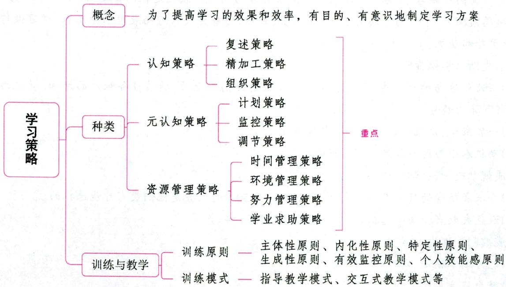

# 一、学习策略的概念及其特征

# 考点1 学习策略的概念

学习策略是指学习者为了提高学习的效果和效率,有目的、有意识地制定有关学习过程的复杂的方案。学习方法是学习策略的知识和技能基础,是学习策略的一个重要组成部分,但不是学习策略的全部,因此,不能把二者完全等同。

# 考点2 学习策略的特征 ★【单选、判断、简答】

说法一：(1)主动性。一般学习者采用学习策略都是有意识的心理过程。学习时，学习者先要分析学习任务和自己的特点，然后根据这些条件，制订适当的学习计划。对于较新的学习任务，学习者总是在有意识、有目的地思考着学习过程的计划。只有对于反复使用的策略才能达到自动化的水平。

(2) 有效性。所谓策略, 实际上是相对效果和效率而言的。一个人在做某件事时, 使用最原始的方法, 最终也可能达到目的, 但效果不会好, 效率也不会高。比如, 记忆一组英语单词, 如果一遍又一遍地朗读, 只要有足够的时间, 最终也能记住, 但是, 保持时间不会太长, 记忆也不会很牢靠; 如果采用分散复习或尝试背诵的方法, 记忆的效果和效率一下子会得到很大的提高。  
(3)过程性。学习策略是有关学习过程的策略。它规定学习时做什么不做什么、先做什么后做什么、用什么方式做、做到什么程度等诸方面的问题。  
(4)程序性。学习策略是学习者制订的学习计划，由规则和技能构成。每一次学习都有相应的计划，每一次学习的学习策略也不同。但是，相对而言，对于同一种类型的学习，存在着基本相同的计划，这些基本相同的计划就是我们常见的一些学习策略，如PQ4R阅读法。

说法二：(1)操作性和监控性的有机统一。操作性和监控性是学习策略最基本的特性。(2)外显性和内隐性的有机统一。(3)主动性和迁移性的有机统一。(4)生成性和指向性的有机统一。

真题1 [2023辽宁营口，判断]操作性和监控性是学习策略最基本的特性。（）

A. 正确

B. 错误

真题2 [2023宁夏银川，简答]简述学习策略的特征。

答案：1.A 2.详见内文

# 二、学习策略的种类 ★★★【单选、多选、填空、判断】

迈克卡等人将学习策略区分为三种，并对它们之间的层次关系进行了分析。他们认为，学习策略可分为认知策略、元认知策略和资源管理策略三种。

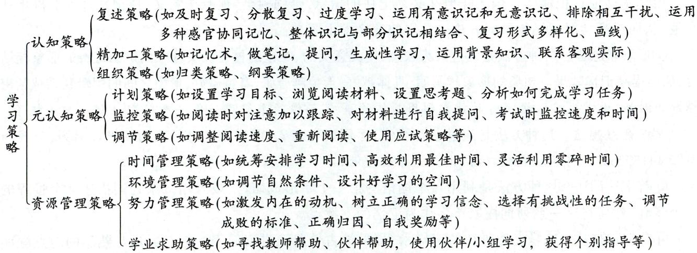  
图3-4 学习策略的分类

# 皮连生的学习策略分类

皮连生将学习策略分类如下：(1)促进选择性注意的策略，如自我提问、做读书笔记、记听课笔记等；(2)促进短时记忆的策略，如复述、记笔记、将输入的信息形成组块等；(3)促进新信息内在联系的策略，如分析学习材料的内在逻辑结构和组织结构、多问几个为什么等；(4)促进新旧知识联系的策略，如列表比较新旧知识的异同、把新知识应用于解释新的例子等；(5)促进新知识长期保存的策略，如运用记忆术、双重编码、提高加工水平等。

# 考点1 认知策略

认知策略是学习者对信息进行加工的方法和技术。认知策略的基本功能有两个方面：一是对信息进行有效的加工与整理，二是对信息进行分门别类的系统储存。

# 1. 复述策略

复述策略是指在工作记忆中为了保持信息,运用内部语言在大脑中重现学习材料或刺激,以便将注意力维持在学习材料上的方法。

常用的复述策略有：(1)在复述的时间上，采用及时复习、分散复习；(2)在复述的次数上，强调过度学习；(3)在复述的方法上，包括运用有意识记和无意识记、排除相互干扰、运用多种感官协同记忆、整体识记与分段识记相结合、复习形式多样化、画线等。同时，要注意保持积极的心向、态度和兴趣。如果我们对某事感兴趣，或者对它持积极态度，就会记得牢固；反之，则容易遗忘。

# 2. 精加工策略

精加工策略（精细加工策略）是指把新信息与头脑中的旧信息联系起来从而增加新信息意义的深层加工策略。它常被描述成一种理解记忆的策略，其要旨在于建立信息间的联系。联系越多，能回忆出信息原貌的途径就越多，即提取的线索就越多。精加工越深入越细致，回忆就越容易。对于比较复杂的课文学习，精加工策略有说出大意、总结、建立类比、用自己的话做笔记、解释、提问以及回答问题等。

# (1) 记忆术

记忆术即通过把那些枯燥无味但又必须记住的信息“牵强附会”地赋予意义，使记忆过程变得生动有趣，从而提高学习记忆效果的方法。常用的记忆术主要有：

① 形象联想法。这种方法是通过人为联想，使无意义的、难记的材料和头脑中的鲜明奇特的形象相结合，从而提高记忆效果。想象的形象越鲜明、具体越好，形象越夸张、奇特越好，形象之间的逻辑联系越紧密越好。例如，小学生记汉语拼音时就常利用具体的事物，m像两个门洞，n像一个门洞，h像一把小椅子。

② 谐音联想法。这种方法是通过谐音线索, 运用视觉表象, 假借意义进行人为联想。例如, 把圆周率“3.1415926535……”编成顺口溜“山巅一寺一壶酒, 尔乐苦煞吾……”等。

③首字连词法。这种方法是利用每个词语的第一个字形成缩写，或者用一系列词描述某个过程的每个步骤，然后将这一系列词提取首字作为记忆的支撑点。

④位置记忆法。这是一种传统的记忆术，最早被古希腊演讲家使用。它是通过与熟悉的地点顺序相联系来记忆一些名称或者客体顺序的方法。位置记忆法对记忆有顺序的系列项目特别有用。

(5)缩简和编歌诀。缩简就是将识记材料的每条内容简化成一个关键性的字,然后变成自己所熟悉

的事物, 从而将材料与过去经验联系起来。编歌诀法就是利用编制歌谣口诀的方式来帮助记忆的方法。例如, 教师为了让学生能够区分“烧、浇、晓、绕、翘、饶”, 可以用这样的顺口溜: “用火烧, 用水浇, 东方日出是拂晓, 左边绞丝弯弯绕, 右边加羽尾巴翘, 丰衣足食才富饶。”

⑥关键词法。关键词法就是将新词或概念与相似的声音线索词, 通过视觉表象联系起来。例如,英文的“gas”(煤气)一词, 可以用汉语“该死”作关键词。两者读音相似, 可以产生“人因煤气中毒而死”的联想, 这样“gas”一词就很容易记住了。

# (2)做笔记

做笔记策略是使用较为普遍的精加工策略。俗话说，“好记性不如烂笔头”。做笔记不仅可以有效地控制自己的认知加工过程，还有助于概括新的知识和建立新旧知识之间的联系。做笔记有利于保持学习者的注意和兴趣，以及有效地组织材料。

# 小香课堂·

考生容易混淆画线与做笔记策略，需注意：画线属于复述策略，做笔记属于精加工策略，二者不能等同。

# (3) 提问

无论阅读还是听讲,学生要经常评估自己的理解状态,思考这样一些问题:这些新信息意味着什么,与课文中的其他信息以及以前所学的信息有什么联系。如果教师在给学生上阅读课时,向学生提一些“谁”“什么”“哪儿”和“如何”的问题并要求学生回答,他们可能对阅读的内容领会得更好。

# (4)生成性学习

生成性学习就是要训练学生对所阅读的东西产生一个类比或表象, 如图形、表格和图解等, 以加强其深层理解。这种方法最重要的一点, 就是需要积极地加工, 不是简单地记录和记忆信息, 也不是从书中寻章摘句或稍加改动, 而是要改变对这些信息的知觉。在教学中, 教师要指导学生拟写课文中没有的、与课文中某些重要信息相关的或用自己的话组成的句子, 从而把所学的信息与自身的知识经验联系起来。

# (5)运用背景知识，联系客观实际

对于意义性较强的学习材料则可以通过新知识与旧知识之间的联结，用头脑中已有的图式使新信息合理化。要充分利用背景知识，应注意在对新材料理解的基础上进行学习，而不是机械记忆式地学习，适时建立类比。也可以利用先行组织者策略，在新材料学习之前，温习与新材料有关的已有的背景知识，以理解和记忆新知识。

# 3. 组织策略

组织策略是指将经过精加工提炼出来的知识点加以构造,形成更高水平的知识结构的信息加工策略。组织策略主要有两种：一种是归类策略,用于概念、语词、规则等知识的归类整理；另一种是纲要策略, 主要用于对学习材料结构的把握。

(1)归类策略。归类,也叫群集,是把材料分成小单元,再把这些单元归到适当的类别里。归类策略的应用能使人理清头绪,各知识点与概念之间不致混淆,方便知识的理解、记忆以及提取。  
(2)纲要策略。纲要策略也称提纲挈领，是掌握学习材料纲目的方法。纲要可以是用语词或句子表达的主题纲要，如以写小标题的形式概括重点，也可以是用符号、图等形式表达的符号纲要。

①主题纲要法。主题通常是学习材料的各级标题，有时也需要自己进行提炼。列提纲时要先对材料进行系统分析、归纳和总结，然后按材料的逻辑关系，以简要的词语写下主要与次要的观点，也就是以金字塔的形式呈现教材的要点，每一具体的细节都包含在高一级的类别中。

②符号纲要法。符号纲要法是采用图解的方式体现知识的结构，即作关系图。它比主题纲要法更直观形象，但要求学习者对符号相当熟悉。在作关系图时，应先识别主要知识点，然后识别这些知识点之间的关系，再用适当的图解来标明这些知识点之间的内在联系。符号纲要法主要包括系统结构图、流程图、模式或模型图和网络关系图。

真题3 [2024安徽统考，单选]小聪喜欢用谐音法背诵英语单词。他运用的是( )

A. 精细加工策略

B. 复述策略

C.归类策略

D. 纲要策略

真题4 [2024山东临沂, 单选]在讲完细胞后, 老师让同学们画出细胞的亚显微结构图, 并标出重要信息以及各组成成分之间的关系。这种学习策略属于( )

A. 精细加工策略

B. 注意策略

C. 组织策略

D. 元认知策略

真题5 [2023福建统考，多选]下列属于复述策略的有（）

A. 画线

B. 分段识记

C. 多种感官参与

D. 复习形式多样化

答案：3.A 4.C 5.ABCD

# 考点2 元认知策略

# 1.元认知

元认知的实质是人对认知活动的自我认识和自我调节。美国心理学家弗拉维尔于1976年在《认知发展》一书中首次提出了元认知的概念。他认为，元认知就是对认知的认知，具体地说，是个人关于自己认知过程的知识和调节这些过程的能力。另外，董奇认为，元认知由元认知知识、元认知体验和元认知监控三部分构成。元认知知识是个体关于自己或他人的认识活动、过程、结果以及与之有关的知识，即知道做什么。它包括三个方面的内容：关于人的知识、关于任务的知识和关于策略的知识。元认知体验是伴随个体认知活动而产生的认知体验或情感体验。元认知监控是指个体在认知活动中，对自己的认知活动进行积极监控和相应的调节，以达到预定目标，即知道何时做、如何做。

# 2. 元认知策略的类型

学习的元认知策略是指个体为实现最佳的认知效果而对自己的认知活动所进行的调节和控制。它大致可分为以下三种：

(1)计划策略。计划策略是指根据认知活动的特定目标，在认知活动开始之前计划完成任务所涉及的各种活动、预计结果、选择策略，设想解决问题的方法，并预估其有效性等。元认知计划策略包括设置学习目标、浏览阅读材料、设置思考题以及分析如何完成学习任务等。  
(2)监控策略。监控策略是指在认知过程中，根据认知目标及时检测认知过程，寻找两者之间的差异，并对学习过程及时进行调整，以期顺利实现有效学习的策略。监控策略包括阅读时对注意加以跟踪、对材料进行自我提问、考试时监视自己的速度和时间等。监控策略具体包括领会监控、策略监控和

注意监控。其中, 领会监控是指学习者在阅读过程中将自己的阅读领会过程作为监控对象, 不断对其进行积极的监视和调整。SQ3R是最常见的帮助学生学习教材内容的阅读领会策略。S指浏览, Q指提问, 3R分别指阅读、陈述和复习。

(3)调节策略。调节策略是指在学习过程中根据对认知活动监视的结果,找出认知偏差,及时调整策略或修正目标;在学习活动结束时,评价认知结果,采取相应的补救措施,修正错误,总结经验教训等。元认知调节策略与监控策略有关。例如:当学习者意识到他不理解课文的某一部分时,他就会退回去读困难的段落;在阅读困难或不熟的材料时放慢速度;复习自己不懂的课程材料;测验时跳过某个难题先做简单的题目等。调节策略能帮助学生矫正自己的学习行为,补救理解上的不足。

真题6 [2024江苏常州，单选]小红在学习中能主动制定学习目标，监控学习进度，调整学习方法。这种学习策略通常被称为（）

A. 动机策略

B. 认知策略

C. 元认知策略

D. 精加工策略

真题7 [2023广东清远, 单选]小张同学在解答数学题时习惯进行自我提问。这种学习策略属于（）

A. 计划策略

B. 监控策略

C. 调节策略

D. 精细加工策略

答案：6.C 7.B

# 考点3 资源管理策略

资源管理策略是辅助学生管理可用环境和资源的策略，包括时间管理策略、环境管理策略、努力管理策略、学业求助策略。

# 1. 时间管理策略

在时间管理上，应做到：（1)统筹安排学习时间。（2)高效利用最佳时间。不同学习时间的效果是很不一样的。首先，要根据自己的生物钟安排学习活动。其次，要根据一周内学习效率的变化安排学习活动。再次，要根据一天内学习效率的变化安排学习活动。此外，要根据自己的工作曲线安排学习活动。因为随着学习的进行，人的精神状态和注意力会发生变化。一般来说，存在三种变化模式：先高后低；中间高两头低；先低后高。（3)灵活利用零碎时间。

# 2. 环境管理策略

(1)注意调节自然条件，如流通的空气、适宜的温度、明亮的光线等；(2)要设计好学习的空间，如空间范围、室内布置、用具摆放等。良好的学习环境对于学生保持良好的心态具有重要作用。

# 3.努力管理策略

为了使学生维持自己的意志努力，需要不断鼓励学生进行自我激励。这包括：(1)激发内在的动机；(2)树立正确的学习信念；(3)选择有挑战性的任务；(4)调节成败的标准；(5)正确归因；(6)自我奖励等。

# 4.学业求助策略

学业求助策略指当学生在学习上遇到困难时，向他人请求帮助的行为。学业求助策略可分为两类：(1)学习工具的利用，如善于利用参考资料、工具书、图书馆、电脑等；(2)社会性人力资源的利用，如

善于利用老师的帮助以及同学间的合作与讨论来加深对学习内容的理解。

真题8 [2024江苏南京, 单选]为了让教室更温馨, 金老师经常从家里带来绿植, 此举体现的学习策略是( )

A. 精加工策略

B. 计划策略

C. 监控策略

D. 环境管理策略

真题9 [2023山东济南, 单选]某学生遇到学习困难时, 能够主动寻求老师、同学的帮助。从学习策略的角度看, 该学生运用的学习策略属于( )

A. 认知策略

B. 元认知策略

C. 方法策略

D. 资源管理策略

答案：8.D 9.D

# 三、学习策略的训练与教学

考点1

# 学习策略发展的基本过程

【单选】

# 1. 无意识地运用策略阶段

小学低年级学生在学习过程中常常不能有意识地运用学习策略。在认知策略方面，他们常常只是无意识地运用复述策略；在精加工策略方面，他们对学习材料的理解基本上停留在对原文的复述上；在组织策略方面，他们不能概括知识，也不能将较分散的知识聚合成一个整体；在资源管理策略方面，他们不善于管理自己的时间。

# 2. 有指导地运用策略阶段

小学中高年级学生在教师的指导下能够主动地运用学习策略进行学习。第一，在认知策略方面，他们能掌握一定的学习方法；第二，元认知水平也有一定的发展；第三，他们能够开始利用各种资源帮助自己提高学习效率，积极利用资源管理策略。

# 3. 独立地运用策略阶段

到初中阶段时，学生已经基本能够独立安排自己的学习，逐步使用各种学习策略。

真题10 [2022辽宁营口，单选]学习策略发展的基本过程依次是（）

A.有指导地运用策略阶段一独立地运用策略阶段一无意识地运用策略阶段  
B. 无意识地运用策略阶段—有指导地运用策略阶段—独立地运用策略阶段  
C. 独立地运用策略阶段—有指导地运用策略阶段—无意识地运用策略阶段  
D. 有指导地运用策略阶段—无意识地运用策略阶段—独立地运用策略阶段

答案：B

考点2

# 学习策略训练的原则

【单选、多选】

# 1. 主体性原则

主体性原则是指学习策略教学中应该发挥和促进学生的主体作用。它既是学习策略训练的目的，又是必要的方法和途径，任何学习策略的使用都依赖于学生主动性和能动性的充分发挥。

# 2. 内化性原则

内化性原则是指在学习策略的学习过程中，学生能够不断实践各种学习策略，逐步将其内化成自己的学习能力，熟练掌握并达到自动化的水平，从而能够在新的情境中灵活应用。

# 3. 特定性原则

特定性原则是指学习策略一定要与学习目标及学生的特点相适应。同样的策略，不同的学生使用起来的效果是不一样的。教师要针对学生的年龄、已有的知识水平以及学习动机类型，帮助学生选择适合的学习策略。

# 4.生成性原则

生成性原则是指在学习过程中要利用学习策略对学习的材料重新进行加工,产生某种新的东西。也就是说,学习者不是简单地利用别人已有的知识和经验。

# 5. 有效监控原则

有效监控原则是指学生应该把注意力集中在学习结果和学习过程之间的关系上，监控自己使用每种学习策略所导致的学习结果，以便确定所选策略是否有效。经过这样的监控实践，学生就能够灵活把握何时、何地以及如何使用某种策略，甚至在这些策略运作时能将它描述出来。

# 6. 个人效能感原则

个人效能感原则是指学生在执行某一任务时对自己胜任能力的判断和自信程度，它是影响学习策略选择的一个重要的动机因素。

# ·记忆有妙招·

为方便考生记忆，编者将学习策略训练的原则总结成以下口诀：

煮花生特有效。煮：主体性。花：内化性。生：生成性。特：特定性。有：有效监控。效：个人效能感。

真题11 [2023辽宁营口，单选]在学习策略的训练指导中，教师应当遵循（ ），即学习策略一定要与学习目标、学生的特点相适应。

A. 特定性原则

B. 内化性原则

C. 生成性原则

D. 主体性原则

答案：A

# 考点3 训练学习策略的教学模式 ★【单选】

# 1.指导教学模式

指导教学模式的基本思想是学生在教师的引领下学习有关的学习策略，由激发、讲演、练习、反馈和迁移等环节构成。在教学中，教师先向学生解释所选定学习策略的具体步骤和条件。在具体应用中不断给予提示，让其口头叙述和明确解释所操作的每一个步骤以及报告自己应用学习策略时的思维。同时，教师在教学中依据每种策略来选择许多恰当的事例来说明其应用的多种可能性。提供的事例应从学生的认知水平出发，由简到繁。

# 2. 程序化训练模式

程序化训练就是将活动的基本技能分解成若干有条理的小步骤，在其适宜的范围内作为固定程序。学习者要按程序进行活动，经过反复练习使之达到自动化程度。程序化训练的基本步骤是：(1)将

某一活动技能按有关原理分解成可执行、易操作的小步骤，而且使用简练的词语来标志每个步骤的含义；(2)通过活动实例示范各个步骤，并要求学生按步骤活动；(3)学生记忆各步骤并坚持练习，直至使其达到自动化程度。

# 3. 完形训练模式

完形训练模式就是在直接讲解策略之后，提供不同程度的完整性材料，促使学生练习策略的某一个成分或步骤，然后逐步降低完整性程度，直至完全由学生自己完成所有成分或步骤。这种教学模式能够使学生有意注意每一个成分或步骤，而且每一步训练所需的心理努力都是学生能够胜任的。更为重要的是，每一步训练都给学生以策略应用的整体印象。

# 4. 交互式教学模式

交互式教学模式是美国教育心理学家布朗和帕林萨提出的一种旨在改善学生阅读理解和自我监控技能的教学方法。交互式教学模式，是由教师和一组学生（大约6人）一起进行的，主要是为了把擅长阅读的人的心智模型，通过策略外化成不擅长阅读的学生能操作的程序，以帮助成绩差的学生阅读领会。此外，交互式学习还是一种很好的改善人际关系的学习方式，学生在互帮互学的过程中增加交往活动。

# 5.合作学习模式

在这种学习活动中, 两个学生一组, 一节一节地彼此轮流向对方总结材料, 当一个学生主讲时, 另一个学生听着, 纠正错误和遗漏。然后, 两个学生彼此变换角色, 直到学完所学材料为止。合作性讲解的两个参与者都能从这种学习活动中受益, 而主讲者比听者获益更大。

真题12 [2023黑龙江哈尔滨，单选]美国教育心理学家布朗和帕林萨提出的一种旨在改善学生的阅读理解和自我监控技能的教学方法是（）

A. 支架式教学

B. 合作学习

C. 交互式教学

D. 情境性教学

答案：C

# ★ 本节核心考点回顾 ★

# 1.认知策略

# (1)复述策略

① 复述策略指在工作记忆中为了保持信息，运用内部语言在大脑中重现学习材料或刺激，以便将注意力维持在学习材料上的方法。  
②复述策略具体包括及时复习、分散复习、过度学习、运用多种感官协同记忆、画线等。

# (2)精加工策略

①精加工策略指把新信息与头脑中的旧信息联系起来从而增加新信息意义的深层加工策略。  
②精加工策略具体包括记忆术、做笔记、提问、生成性学习等。

# (3)组织策略

①组织策略指将经过精加工提炼出来的知识点加以构造，形成更高水平的知识结构的信息加工策略。

②组织策略具体包括归类策略和纲要策略。其中，纲要策略包括主题纲要法和符号纲要法。

# 2. 元认知策略

# (1)计划策略

① 计划策略是指根据认知活动的特定目标，在认知活动开始之前计划完成任务所涉及的各种活动、预计结果、选择策略，设想解决问题的方法，并预估其有效性等。  
②计划策略包括设置学习目标、浏览阅读材料、设置思考题以及分析如何完成学习任务等。

# (2) 监控策略

① 监控策略是指在认知过程中, 根据认知目标及时检测认知过程, 寻找两者之间的差异, 并对学习过程及时进行调整, 以期顺利实现有效学习的策略。  
② 监控策略包括阅读时对注意加以跟踪、对材料进行自我提问、考试时监视自己的速度和时间等。

# (3)调节策略

①调节策略是指在学习过程中根据对认知活动监视的结果,找出认知偏差,及时调整策略或修正目标;在学习活动结束时,评价认知结果,采取相应的补救措施,修正错误,总结经验教训等。  
②调节策略包括重读困难的段落；在阅读困难或不熟的材料时放慢速度；测验时跳过某个难题先做简单的题目等。

# 3. 资源管理策略

# (1)时间管理策略

①统筹安排学习时间；②高效利用最佳时间；③灵活利用零碎时间。

# (2)环境管理策略

①注意调节自然条件；②设计好学习的空间。

# (3)努力管理策略

①激发内在的动机；②树立正确的学习信念；③选择有挑战性的任务；④调节成败的标准；⑤正确归因；⑥自我奖励等。

# (4)学业求助策略

①学习工具的利用；②社会性人力资源的利用。

# 第三节 学习迁移

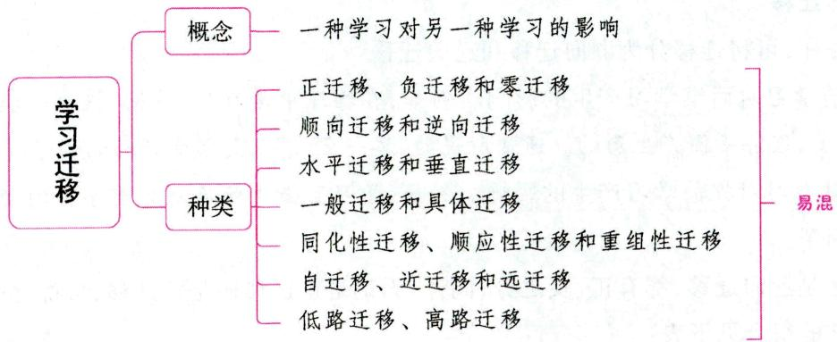

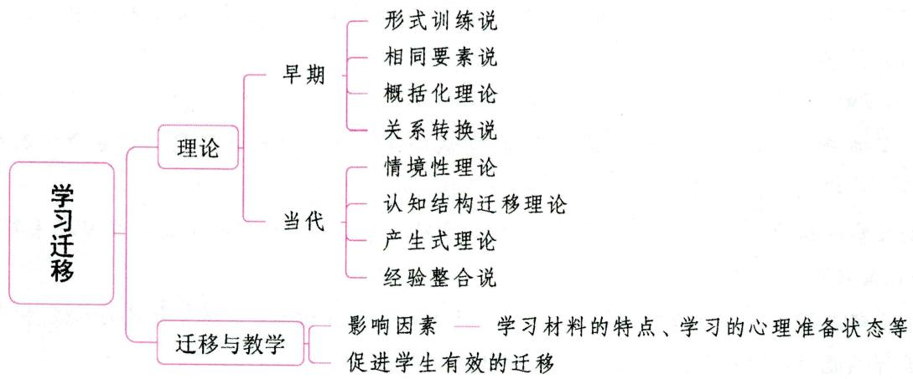

# 一、学习迁移的概念及其种类

# 考点1 学习迁移的概念 ★【单选、多选】

学习迁移也称训练迁移, 是指一种学习对另一种学习的影响, 或习得的经验对完成其他活动的影响。迁移是学习的一种普遍现象, 广泛存在于各种知识、技能、行为规范与态度的学习中, 平时所说的 “举一反三”“触类旁通”等即典型的迁移形式。通过迁移, 各种经验得以沟通, 经验结构得以整合。

# 考点2 学习迁移的种类 ★★★ 【单选、多选、判断】

# 1. 正迁移、负迁移和零迁移

根据迁移的性质和结果，可将迁移分为正迁移、负迁移和零迁移。

正迁移也叫“助长性迁移”,是指一种学习对另一种学习的促进作用。例如:学习数学有利于学习物理;学习珠算有利于学习心算;懂得英语的人很容易掌握法语等。

负迁移也叫“抑制性迁移”，是指一种学习对另一种学习产生阻碍作用。例如，在掌握了汉语语法的情况下，在初学英语语法时，总是出现用汉语语法去套英语语法的情况，从而影响了英语语法的掌握。

在实际教学工作中, 有时一种学习可能对另一种学习同时产生正迁移和负迁移的双重影响。如汉语拼音的学习对英文字母发音的学习产生干扰作用, 但同时对英文字母的书写却能产生积极的影响。

两种学习也可能不发生影响，这种状态称为零迁移，它是迁移的一种特殊形式。

# 2. 顺向迁移和逆向迁移

根据迁移的时间顺序，可将迁移分为顺向迁移和逆向迁移。

顺向迁移是指先前学习对后继学习产生的影响。例如,在物理中学习了“平衡”概念,就会对以后学习化学平衡、生态平衡、经济平衡产生影响。通常所说的“举一反三”就是顺向迁移的例子。

逆向迁移是指后继学习对先前学习产生的影响。例如，学习了微生物后对先前学习的动物、植物概念的理解会产生影响等。

无论是顺向迁移还是逆向迁移，都有正、负之分；同样，无论是正迁移还是负迁移，也都有顺向和逆向之分。四种学习迁移的组合见下表：

表 3-16 四种学习迁移的组合  

<table><tr><td></td><td>顺向迁移</td><td>逆向迁移</td></tr><tr><td>正迁移</td><td>已掌握的知识、技能对新学习的知识、技能的积极影响。例如,掌握加法的学生,容易学好乘法运算</td><td>新学习的知识、技能对已掌握的知识、技能的积极影响。例如,掌握乘法运算有助于更加熟练地掌握加法运算</td></tr><tr><td>负迁移</td><td>已掌握的知识、技能对新学习的知识、技能的消极影响。例如,掌握汉语拼音发音的学生,学英语字母发音时容易受干扰</td><td>新学习的知识、技能对已掌握的知识、技能的消极影响。例如,学生学习英语语法之后,又可能反过来对已掌握的汉语语法起干扰作用</td></tr></table>

# 3.水平迁移和垂直迁移

根据迁移内容的抽象和概括水平不同，可将迁移分为水平迁移和垂直迁移。

水平迁移也叫横向迁移，是指先行学习内容与后继学习内容在难度、复杂程度和概括层次上属于同一水平的学习活动之间产生的影响。

垂直迁移也称纵向迁移，是指先行学习内容与后续学习内容是不同水平的学习活动之间产生的影响。垂直迁移表现在两个方面：

(1)自下而上的迁移，即下位的较低层次的经验影响上位的较高层次的经验的学习。例如，对“植物”“动物”等具体概念的理解影响着对“生物”这一概念的掌握。这类迁移类似奥苏贝尔所称的上位学习。  
(2)自上而下的迁移,即上位的较高层次的经验影响下位的较低层次的经验的学习。例如,“角”这一概念的掌握对“直角”“锐角”等概念的学习有一定的影响。这类迁移类似奥苏贝尔说的下位学习。

# 4. 一般迁移和具体迁移

根据迁移内容的不同，可将迁移分为一般迁移和具体迁移。

一般迁移也称非特殊迁移、普遍迁移，是指一种学习中所习得的一般原理、原则和态度对另一种具体内容学习的影响，即原理、原则和态度的具体应用。例如，获得基本的运算技能、阅读技能后运用到各种具体的学科学习中。

具体迁移也称特殊迁移，是指学习迁移发生时，学习者原有的经验组成要素及其结构没有变化，只是将一种学习中习得的经验要素重新组合并移用到另一种学习之中。例如：学习了“日”“月”对学习“明”的影响；掌握了加减法对做四则运算题的影响等。

# 5. 同化性迁移、顺应性迁移和重组性迁移

根据迁移过程中所需的内在心理机制的不同，可将迁移分为同化性迁移、顺应性迁移和重组性迁移。

同化性迁移是指不改变原有的认知结构，直接将原有的认知经验应用到本质特征相同的一类事物中去。原有认知结构在迁移过程中不发生实质性的改变，只是得到某种充实。平时我们所讲的“闻一知十”就属于同化性迁移。

顺应性迁移指将原有认知经验应用于新情境中时,需调整原有的经验或对新旧经验加以概括,形成一种能包容新旧经验的更高一级的认知结构,以适应外界的变化。

重组性迁移指重新组合原有认知系统中某些构成要素或成分，调整各成分间的关系或建立新的联系，从而应用于新情境。在重组过程中，基本经验成分不变，但各成分间的结合关系发生了变化，即进行了调整或重新组合。

# 6. 自迁移、近迁移和远迁移

根据迁移范围的不同，可将迁移分为自迁移、近迁移和远迁移。

如果个体所学的经验影响着相同情境中任务的操作, 则属于自迁移。

近迁移主要指已习得的知识或技能在与原先学习情境相似的情境中加以运用。例如, 学生在考试中解某道题时, 如果以前进行过相关的题型训练, 那么即使这道题变换了数字和结构, 解答起来依然会相当顺手。

远迁移是指已习得的知识或技能在新的不相似情境中的运用。例如，将校内学习的知识经验迁移到校外的实际生活中去。远迁移从形成过程和心理机制上比近迁移要复杂得多。

# 7. 低路迁移和高路迁移

根据迁移的路径，可将迁移分为低路迁移和高路迁移。

低路迁移是指以一种自发的或自动的方式所形成的技能的迁移。这种迁移是通过在各种情境中的练习获得的，其发生几乎是不需要或很少需要意识、思维的参与。如驾驶不同类型的汽车。

高路迁移则是有意识地将某种情境中学到的抽象知识应用于另一种情境中的迁移。学生在一种学习情境中抽取出了一种规则、原理、范例、图式，然后运用于新的情境，这便是高路迁移。如利用做笔记策略来阅读文章。

真题1 [2023广西贵港，单选]根据学习迁移中的垂直迁移的定义，下列选项中，能体现垂直迁移的案例是（）

A.在学校形成爱护公物的习惯影响在校外的行为表现  
B.“角”概念的掌握影响“直角”“平角”等概念的学习   
C.汉语拼音的学习影响英语字母的发音  
D. “石”字的学习影响“磊”字的学习

真题2 [2023黑龙江哈尔滨，单选]学生把对狮子、老虎等哺乳动物的认知应用到海豚、鲸鱼等海洋哺乳动物时，就会对哺乳动物有更高概括水平的认知，这属于（）

A. 同化性迁移

B. 重组性迁移

C. 顺向迁移

D. 顺应性迁移

真题3 [2023河南郑州，单选]小丽把记语文笔记的方法迁移到记化学笔记中，小丽运用的迁移方式是（）

A. 具体迁移

B.一般迁移

C. 垂直迁移

D. 近迁移

真题4 [2024安徽统考，多选]下列选项属于正迁移的有( )

A. 举一反三

B. 入乡随俗

C. 触类旁通

D. 温故知新

答案：1.B 2.D 3.B 4.ACD

# 二、学习迁移理论 ★★★ 【单选、多选、判断】

# 考点 1 早期的迁移理论

# 1. 形式训练说

形式训练说是最早的关于迁移的理论，以官能心理学为基础，代表人物主要有德国的沃尔夫。形式

训练说认为心理官能只有通过训练才能得以发展，迁移就是心理官能得到训练而发展的结果，迁移是无条件的、自发的。形式训练说还认为，训练和改进心理官能是教学的重要目标，教育的任务就是要改善学生的各种官能，而改善以后的官能就能够自动地迁移到其他学习中去，一种官能的改进也能增强其他的官能。形式训练说重视能力的培养和学习的迁移，强调对有效的记忆方法、工作和学习的习惯以及一般的有效工作技术加以特殊训练，这些都是有积极意义的。但它缺乏科学的依据，因此，也引起了一些研究者的怀疑和反对。

# 2. 相同要素说（共同要素说）

桑代克等人认为，迁移是非常具体的、有条件的，需要有共同的要素。只有当两个机能的因素中有相同要素时，一个机能的变化才会改变另一个机能的习得。两种情境中的刺激相似而且反应也相似时，迁移才会发生。两种情境中相同要素越多，迁移的量也就越大。

几乎与此同时,另一位心理学家武德沃斯通过研究也得出了与桑代克相同的结论。他把相同要素说改为共同要素说。根据共同要素说,如果两种学习活动含有共同成分,无论学习者是否意识到这种成分的共同性,都会有迁移现象的产生。

桑代克的理论对学习迁移的研究和实际教学起到了积极的作用，即便在今天对有些迁移的研究也有直接的启发作用，如迁移的产生式理论。但桑代克的理论只看到学习情境对学习迁移的影响，完全忽略了主体因素对学习迁移的影响，只从一种维度讨论学习之间的影响问题，并试图从中发现影响迁移的原因，把学习迁移引导到一种狭义的圈子里；并且在看到情境中相同要素的积极迁移的同时，忽略了也可能产生消极的作用，即一种学习也可能对另一种学习产生干扰作用。桑代克在1901年所做的“形状知觉”实验是相同要素说的经典实验。

# 3. 概括化理论

概括化理论也称经验类化说, 由美国心理学家贾德提出, 其主要观点是, 一个人只要对自己的经验进行了概括, 就可以完成从一个情境到另一个情境的迁移。他认为先前的学习之所以能迁移到后来的学习中, 是因为在先前学习中获得了一般原理, 这种一般原理可以部分或全部地运用于后续的学习中。对原理了解、概括得越好, 迁移效果也越好。贾德在1908年所做的“水下击靶”实验, 是概括化理论的经典实验。

# 小香课堂·

概括化理论和共同要素说强调的迁移条件不同：

概括化理论：强调对原理、经验的概括；共同要素说：强调相同或相似要素的数量。

# 4. 关系转换说（关系理论）

格式塔心理学家提出关系转换说，认为迁移是学习者突然发现两个学习经验之间关系的结果，是对情境中各种关系的理解和顿悟，而非由于具有共同成分或原理而自动产生。学习迁移的重点不在于掌握原理，而在于觉察到手段与目的之间的关系。他们认为学生“顿悟”情境中原理、原则之间的关系，特别是手段一目的之间的关系，是实现迁移的根本条件。苛勒所做的“小鸡觅食”实验是支持关系转换说的经典实验。

# 小鸡觅食实验

苛勒让小鸡在深、浅不同的两种灰色的纸下面寻找食物。通过条件反射学习, 小鸡学会了只有从深灰色纸下才能获得食物奖赏。然后, 变换实验情境, 保留原来的深灰色纸, 用黑色纸取代浅灰色纸。

问题是：如果小鸡仍然到深灰色纸下面寻找食物，那就证明迁移是由于相同要素的作用；如果小鸡是到两张纸中颜色更深的那张（即黑色纸）下面寻找食物，那就证明迁移是对关系做出的反应。

实验表明：小鸡对新刺激（黑色纸）的反应为 $70\%$ ，对原来的阳性刺激（深灰色纸）的反应是 $30\%$ ；而幼儿在做同样的实验时始终对黑色纸的刺激做出反应。

苛勒认为这结果证明是情境中的关系对迁移起了作用，而不是其中的相同要素，被试选择的不是刺激的绝对性质而是比较其相对关系（把在前一种情境中学会的关系即“食物总是在颜色较深的纸下面”迁移到后一种情境中，从而做出了正确的反应）。

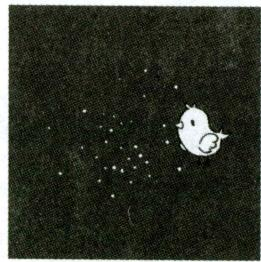  
深灰色（有食物）

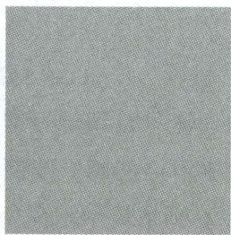  
浅灰色（无食物）

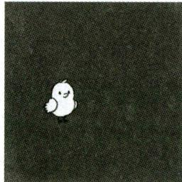  
30%   
深灰色（无食物）

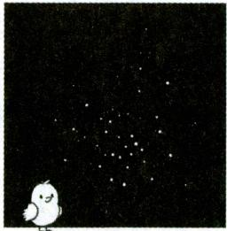  
70%   
黑色（有食物）

# 小鸡觅食实验

真题5 [2024河北石家庄，单选]赵老师认为，学生只要将所学的概念、观点进行归纳总结，就可以用这些概念、观点解决新的问题。赵老师的观点主要受（ ）的影响。

A. 共同要素说

B. 情境性理论

C. 形式训练说

D. 概括化理论

真题6 [2023河北邢台，单选]最早的迁移理论是（）

A.概括化理论

B. 关系转换说

C. 相同要素说

D. 形式训练说

答案：5.D 6.D

# 考点 2 当代的迁移理论

# 1. 情境性理论

格林诺等人提出了迁移的情境性理论。他们认为迁移问题主要是说明在一种情境中学习去参与某种活动，将如何影响在不同情境中参与另一种活动的能力。迁移就在于如何以不变的活动结构或动作图式来适应不同的情境。这种活动结构的建立既取决于最初的学习情境，又取决于后来的迁移情境。

# 2. 认知结构迁移理论

奥苏贝尔在有意义接受学习理论的基础上提出了认知结构迁移理论，认为一切有意义的学习都是在原有认知结构的基础上产生的，不受原有认知结构影响的有意义学习是不存在的。一切有意义的学习必然包括迁移。学习不是简单的刺激一反应之间的联结形成，不是简单的一种情境与另一情境的相互影

响,而是一个利用认知结构中的适当观念不断获得新知识的过程,所以学生原有的认知结构就是实现学习迁移的“最关键的因素”。

每一个学生的认知结构各有特点，个人认知结构在内容和组织方面的特征称为认知结构变量。可利用性、可辨别性和稳定性（包括清晰性）是影响迁移的三个关键认知结构变量。认知结构迁移理论指出，学生学习新知识时，认知结构可利用性高、可辨别性大、稳定性强，就能促进对新知识学习的迁移。“为迁移而教”实际上是塑造学生良好认知结构的问题。在教学中，可以通过改革教材内容和教材呈现方式改进学生的原有认知结构变量以达到迁移的目的。

# 3.产生式理论

产生式迁移理论是由安德森提出的, 这一理论适用于解释基本技能的形成和程序性知识的迁移。该理论的基本思想是: 前后两项学习任务产生迁移的原因是两项任务之间产生式的重叠, 重叠越多, 迁移量越大。两项任务之间的迁移, 是随其共有的产生式的多少而变化的。所谓产生式就是有关条件和行动的规则, 简称 C-A 规则。安德森认为, 这一迁移理论是桑代克相同要素说的现代化。

# 4. 经验整合说

经验整合说是我国心理学家冯忠良教授在吸收前人研究成果的基础上，创造性地提出的一种学习迁移理论。他认为，学习迁移的实质就是新旧经验的整合。整合是通过概括，使新旧经验相互作用，从而形成在结构上一体化、系统化，在功能上能稳定调节活动的一个完整的心理系统。整合通过同化、顺应和重组三种基本途径实现。

真题7 [2023河南郑州,单选]奥苏贝尔认为,实现学习迁移的最关键因素是( )

A. 学生原有的认知结构

B. 训练官能

C.概括化的原理、经验

D. 情境中有共同成分

真题8 [2024广东广州, 多选]奥苏贝尔认为, 原有认知结构的清晰性、稳定性、概括性、包容性、连贯性和可辨别性等特性都始终影响着新的学习的获得与保持。为促进新的学习与迁移, 认知结构中的关键变量包括( )

A. 可利用性

B. 可辨别性

C. 稳定性

D. 清晰性

答案：7.A 8.ABCD

# 三、迁移与教学 ★★ 【单选、多选、简答、论述】

# 考点1 影响学习迁移的因素（条件）

研究表明，学习迁移并不是在任何情况下都能发生的，它会受到一系列主客观条件的制约。

# 1. 学习材料的特点

学习材料作为学生学习的对象和知识的主要来源，对学习迁移有着重要影响。很多迁移理论都在其理论假说中提及材料对迁移的重要作用，如桑代克的相同要素说。例如，英语和法语在字形、读音和语法结构上有相同或相似的地方，学习这两门外语，在听、说、读、写能力以及记忆、思维等心理过程方面有共同要求，所以学习时就易产生正迁移。相反，学习对象没有或缺少共同因素，或虽有共同因素，但要求学习者做出不同的反应时，则可能在学习时产生负迁移。共同因素是学习迁移产生的客观必要条件，但不是唯一的条件。

# 2. 原有的认知结构

奥苏贝尔的认知结构迁移理论认为原有认知结构的特征直接决定了迁移的可能性及迁移的程度。原有认知结构对迁移的影响表现在三个方面：(1)学习者是否拥有相应的背景知识，这是迁移产生的基本前提条件；(2)原有的认知结构的概括水平对迁移起到至关重要的作用；(3)学习者是否具有相应的认知技能或策略以及对认知活动进行调节、控制的元认知策略对迁移的产生有重要影响。

# 3. 对学习情境的理解

大多数心理学理论都强调情境在迁移中具有重要作用。从学习迁移角度讲，知识经验获得的情境与知识应用的情境在许多方面都密切相关，如情境中事物之间的关系、问题呈现的方式与空间位置、两种情境的类似情况等。注意对情境中各种关系的理解，创设对知识应用有利的情境，引导学生运用所学的知识原理去解决各式各样的问题等，在促进迁移过程中应该受到重视。

# 4. 学习的心理准备状态（心向）

心理准备状态是在过去学习或活动过程中形成的，又对未来的学习或活动产生影响，这种影响既可能是积极的，也可能是消极的。学习定势在迁移研究中是较多讨论的一种心理准备状态。

所谓定势就是指由先前影响所形成的往往不被意识到的心理准备状态，它将支配人以同样的方式去对待同类后继活动。定势的作用有两重性：一是积极的促进作用；二是消极的阻碍作用。

# 5. 学习策略的水平

学习策略对迁移的影响主要表现在发展水平、学习策略的丰富程度以及依据情境的变化灵活运用等方面。

# 6. 智力与能力

个体智力的高低对学习迁移的质量有一定的影响，智力较高的人能较容易地发现学习情境之间的相同要素和关联，能更好地概括总结出一般原理原则，能较好地将习得的学习策略与方法运用于新的学习情境之中。

# 7.教师的指导

教师有意识的指导能令学习者发生正迁移。教师要启发学生注意对学习材料进行必要的概括总结，还可以直接教给学生一般性的原则，有效地指导学生的实践。“授人以鱼，不如授人以渔。”教师还应该关注学习方法和策略的传授，让学生学会学习。

# 记忆有妙招·

为方便考生记忆，编者将影响学习迁移的因素总结成以下口诀：

知情心，策智能，学点教导。知：原有的认知结构。情：对学习情境的理解。心：心向。策：学习策略的水平。智能：智力与能力。学点：学习材料的特点。教导：教师的指导。

真题9 [2022江苏苏州,单选]学习迁移产生的客观必要条件是( )

A.学生的智力水平

B. 学习的理解和巩固程度

C. 学习对象之间的共同要素

D. 学习的方法

答案：C

# 考点2 促进学生有效的迁移

# 1.改革教材内容，促进迁移

根据认知结构迁移理论，认知结构中是否有适当的起固定作用的观念可以利用，是决定新的学习

与保持的重要因素。为了促进迁移, 教材中必须有那种具有较高概括性、包容性和强有力的解释效应的基本概念和原理。要做到: (1) 精选教材, 提高对概念和原理的理解水平。(2) 合理编排教学内容, 突出知识的组织特点。教材内容还要保持结构化、一体化与网络化的统一, 才能更好地促进迁移的发生。

# 2. 合理编排教学方式，促进迁移

优良的教材只有通过合理的教学进行呈现和传达，才能充分发挥其迁移的效能，否则迁移效果并不显著，甚至会阻碍迁移的产生。教师在组织教学时，一方面要抓住教材内容的核心；另一方面要合理安排教学程序，使得学生顺利地将所学习的内容融会贯通，提高迁移的效果。

(1)教学过程中应当按照从一般到个别，从整体到细节的顺序，渐进分化。   
(2)应当注意将各个内容综合贯通，促进知识的横向联系。  
(3)依据学生学习的特点，教学过程应由浅入深、由易到难、由已知到未知。  
(4)在具体操作上，可以将知识分成若干单元，每个单元还可分成若干小步子，让后一步的学习建立在前一步的基础之上，前一步的学习为后一步提供固定点。

# 3. 教授学习策略，提高学生的迁移意识

“授人以鱼供一饭之需，授人以渔则终生受用无穷。”这句话给予教育者的启示是，学习不只是要让学生掌握一门或几门学科的具体知识与技能，而且还要让学生学会如何去学习，即掌握学习方法的知识与技能。实际上学生只有掌握了良好的学习方法，才能把所学知识、技能顺利地进行应用，促进更广泛、更一般的迁移，也就是说学会了如何学习就可以实现最普遍的迁移。

教师在教学中要重视引导学生对各种问题进行深入分析、综合、比较、抽象、概括，帮助学生认识问题之间的关系，寻找新旧知识或课题的共同特点，归纳知识经验的原理、法则、定理、规律的一般方法，发展学生分析问题和概括问题的能力，必须重视对学习方法的学习，以促进更有效的迁移。

# 4. 改进对学生的评价

教学条件下的评价作为教学活动的组成部分，同样具有教育性，有效运用评价手段对学生形成积极的学习态度，对学习迁移都具有积极的作用。

# ★本节核心考点回顾 ★

# 1. 学习迁移的种类

(1)根据迁移的性质和结果划分

①正迁移（助长性迁移）：一种学习对另一种学习的促进作用。  
② 负迁移（抑制性迁移）：一种学习对另一种学习产生阻碍作用。  
③ 零迁移：两种学习不发生影响，是迁移的一种特殊形式。

(2)根据迁移的时间顺序划分

① 顺向迁移：先前学习对后继学习产生的影响。  
② 逆向迁移：后继学习对先前学习产生的影响。

(3)根据迁移内容的抽象和概括水平划分

① 水平迁移：同一水平的学习活动之间产生的影响。  
②垂直迁移：包括自下而上的迁移和自上而下的迁移。

(4)根据迁移内容的不同划分

$①$ 一般迁移：原理、原则和态度的具体应用。  
②具体迁移：将一种学习中习得的经验要素重新组合并移用到另一种学习之中。

(5)根据迁移过程中所需的内在心理机制的不同划分

①同化性迁移：不改变原有的认知结构。  
② 顺应性迁移：形成一种能包容新旧经验的更高一级的认知结构。  
③ 重组性迁移：重新组合原有认知系统中某些构成要素或成分。

# 2. 早期的迁移理论

(1) 形式训练说：迁移是心理官能得到训练而发展的结果，是无条件的、自发的。  
(2)相同要素说：迁移是非常具体的、有条件的，需要有共同的要素。  
(3)概括化理论：对原理了解、概括得越好，迁移效果也越好。   
(4)关系转换说：迁移是对情境中各种关系的理解和顿悟。

# 3. 当代的迁移理论

(1)认知结构迁移理论：学生原有的认知结构就是实现学习迁移的“最关键的因素”。  
(2)产生式理论：两项任务之间产生式重叠越多，迁移量越大。

# 4. 影响学习迁移的因素

(1)学习材料的特点；(2)原有的认知结构；(3)对学习情境的理解；(4)学习的心理准备状态；(5)学习策略的水平；(6)智力与能力；(7)教师的指导。

# 第四节 知识的学习

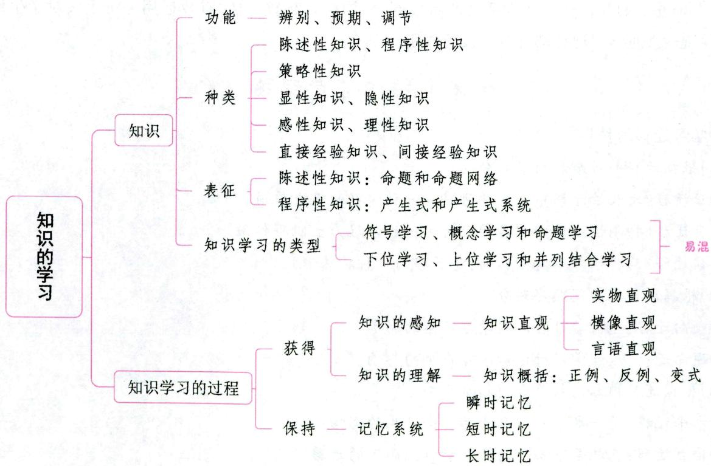