# 一、知识概述

考点1 知识的内涵及功能 ★【单选】

知识是指主体通过与环境相互作用而获得的信息及其组织，其实质是人脑对客观事物的特征与联系的反映，是客观事物的主观表征。

知识是人对行为进行定向和调节的基础，是个体适应环境的重要因素。知识具有三方面的功能：(1) 辨别功能，人可以根据有关知识对感受到的事物进行辨认和归类，从而对它们不再陌生。(2) 预期功能，在具备了相应的知识后，人就可以通过推论对事物形成一定的预期，推知事物会怎样发展变化。(3) 调节功能，个体总在以自己的知识为基础来确定活动的程序，并对活动的实施过程进行监控和调节。

真题1 [2023辽宁锦州，单选]在学习了“浮力”的知识后，张燕便能够推论出油和泡沫不会沉于水底。这体现了知识具有（ ）功能。

A. 辨别

B. 预期

C. 调节

D. 选择

答案：B

考点2 知识的种类 ★★【单选、多选、判断、简答】

# 1. 陈述性知识和程序性知识

安德森根据知识的不同表征形式，将知识分为陈述性知识和程序性知识。

# (1) 陈述性知识

陈述性知识也叫描述性知识，是个人能用言语进行直接陈述的知识，主要用于区别和辨别事物。陈述性知识是关于事物及其关系的知识，或者说是关于“是什么”的知识，它包括事实、规则、发生的事件、个人的态度等。

当代认知心理学认为，陈述性知识学习的过程包括获得、保持和提取三个阶段。知识获得阶段，新信息进入短时记忆，与长时记忆中的相关信息联系，出现新的意义构建；知识保持阶段，新构建的意义储存于长时记忆中，如果没有复习或新的学习，这些意义将随着时间的延长而遗忘；知识提取阶段，个体运用所获得的知识回答“是什么”和“为什么”的问题，并应用这些知识解决实际问题，使所学的知识产生广泛迁移。

# (2)程序性知识

程序性知识即操作性知识，是一种经过学习后自动化了的关于行为步骤的知识，表现为在信息转换活动中进行具体操作。程序性知识是有关“怎么办”的知识，是关于方法和应用的知识。按程序性知识的性质和特点，可以把程序性知识分为智慧技能、动作技能和认知策略三类。

程序性知识学习的一般过程是从陈述性知识转化为自动化的技能的过程，它主要由陈述性阶段、程序化阶段、自动化阶段三个阶段构成。程序性知识学习包括两种类型：模式识别学习和动作步骤学习。

(3)陈述性知识与程序性知识的关系

(1) 陈述性知识和程序性知识的区别

表 3-17 陈述性知识和程序性知识的区别  

<table><tr><td>比较范畴</td><td>陈述性知识</td><td>程序性知识</td></tr><tr><td>基本结构</td><td>陈述性知识是符号所代表的概念、命题与原理的意义,掌握陈述性知识的关键是理解符号所表征的意义</td><td>程序性知识是对陈述性知识的应用,基本结构是动作或产生式,形成程序性知识的关键是对操作方法的熟练掌握</td></tr><tr><td>输入输出</td><td>陈述性知识是相对静态的,容易用言语表达清楚</td><td>程序性知识是相对动态的,不太容易用言语表达清楚</td></tr><tr><td>意识控制程度</td><td>意识控制程度较高,激活速度较慢,往往是有意识的搜寻过程</td><td>意识控制程度较低,激活速度较快</td></tr><tr><td>学习速度</td><td>学习速度较快,能在短时期内突飞猛进或积累,但遗忘较快</td><td>学习速度较慢,需要大量练习才会达到熟能生巧的程度,保持比陈述性知识牢固</td></tr><tr><td>记忆储存</td><td>由于陈述性知识具有结构化、层次化的特点,因而陈述性知识的储存呈现非独立的网络性,具有叠加扩充的特性</td><td>程序性知识的储存呈现独立的模块性,具有序列转移的特性</td></tr><tr><td>测量角度</td><td>通过口头或书面“陈述”或“告诉”的方式测量</td><td>通过观察行为,是否能做、会做什么的方式测量</td></tr></table>

②陈述性知识和程序性知识的联系

一方面, 程序性知识的形成以掌握陈述性知识为必要条件。人们掌握的陈述性知识越牢固, 越有助于程序性知识的形成。另一方面, 程序性知识一经形成又会促进对新的陈述性知识的掌握。

# 2. 策略性知识

美国心理学家梅耶提出了一种策略性知识。它是与程序性知识相似但又存在区别的知识。策略性知识是关于如何学习和如何思维的知识，即个体运用陈述性知识和程序性知识去学习、记忆、解决问题的一般方法和技巧。策略性知识是回答“怎么办”的知识，它与程序性知识的主要区别在于，它所处理的对象是个人自身的认知活动。

# 3. 显性知识和隐性知识

1958年英国科学家、哲学家波兰尼提出了“显性知识”（明确知识）和“隐性知识”（缄默知识）的知识形态分类。所谓显性知识是指用书面文字、图表和数学公式表述的知识，通常是用言语等人为方式，通过表述来实现的，所以又称为“言明的知识”。隐性知识是指尚未被言语或其他形式表述的知识，是“尚未言明的”或者“难以言传的”知识。例如，我们能够从成千上万甚至上百万张脸中认出某一个人的脸，但是在通常情况下，我们却说不出是怎样认出这张脸的。这便是波兰尼的著名命题：“我们知晓的比我们能说出的多。”缄默知识远远多于明确知识，且有不同于明确知识的显著特征：(1)不能通过语言、文字或符号进行逻辑说明；(2)不能以正规形式加以传递；(3)不能加以批判性反思。

# 4.感性知识和理性知识

由于反映活动的深度不同，知识可分为感性知识和理性知识。所谓感性知识是对活动的外表特征和外部联系的反映，可分为感知和表象两种水平。所谓理性知识，反映的是活动的本质特征与内在联系，包括概念和命题两种形式。

# 5. 直接经验知识和间接经验知识

根据知识的来源，知识可分为直接经验知识和间接经验知识。直接经验知识是个体通过亲身实践活动而获得的知识，如学生通过参观访问、调查或者实验所获得的知识。间接经验知识是个体通过书

本和大众传播媒介等途径而获得的知识。

真题2 [2024广东广州, 单选]地理课上, 学生学习了关于地球公转与自转的相关知识, 知道了地球公转一圈是一年, 自转一圈是一天。根据知识的分类, 这属于( )

A.结构不良领域的知识

B. 程序性知识

C. 隐性知识

D. 陈述性知识

真题3 [2023四川统考, 单选]在学习开车时, 小文可以很好地对不同弯道打方向盘, 但是很难用语言描述具体怎样操作, 这属于( )

A. 显性知识

B. 隐性知识

C. 具体知识

D. 条件性知识

真题4 [2023辽宁营口，判断]程序性知识的形成以掌握陈述性知识为必要条件。（）

A. 正确

B. 错误

真题5 [2024安徽合肥/淮北/铜陵,简答]简述陈述性知识和程序性知识的区别。

答案：2.D 3.B 4.A 5.详见内文

# 考点 3 知识的表征 ★【多选】

知识的表征是指信息在人脑中的存储和呈现方式，它是个体知识学习的关键。不同的知识类型在头脑中具有不同的表征方式。陈述性知识主要以命题和命题网络的形式进行表征，表象和图式也是其重要形式；程序性知识则主要以产生式和产生式系统进行表征。一个大的知识单元中既有陈述性知识，也有程序性知识，二者相互交织在一起，许多心理学家用图式来描述这种大块知识的表征。

# 考点4 知识学习的类型 ★★★ 【单选、多选、判断】

# 1.符号学习、概念学习和命题学习

根据知识本身的存在形式和复杂程度，知识学习可分为符号学习、概念学习和命题学习。

# (1)符号学习

符号学习又称表征学习,是指学习单个符号或一组符号的意义。符号学习的心理机制是符号和它们所代表的事物或观念在学习者认知结构中建立相应的等值关系。符号学习是一种最简单的学习,是各种复杂学习的基础。

符号学习的主要内容是词汇学习。例如，汉字、英语单词的学习，就属于词汇学习。但是符号不限于语言符号(词)，也包括非语言符号(如实物、图像、图表等)。对数学图表的认识、对瓜果树木的认识、对各种机床的认识等，也属于符号学习。符号学习还包括事实性知识的学习，即学习一组符号(语言或非语言)所表示的某一具体事实。例如，历史课中历史事件和历史人物的学习，地理课中地形地貌和地理位置的学习，均属于事实性知识的学习。

# (2)概念学习

概念学习是指掌握概念的一般意义, 其实质是掌握一类事物的共同的本质属性和关键特征。同类事物的关键特征既可由学习者从大量同类事物的不同例证中独立发现, 也可由指导者用下定义的方式直接呈现给学习者, 让其利用已掌握的概念来理解。概念学习以表征学习为前提, 又为命题学习奠定基础, 因此, 它是有意义学习的核心。

# (3)命题学习

命题学习是指获得由几个概念构成的命题的复合意义, 实际上是学习表示若干概念之间关系的判断。命题学习旨在反映事物之间的关系, 是一种更加复杂的学习。命题用句子表达, 但命题不等于句子, 命题只涉及句子表达的意义。命题是我们能够评价是非对错的最小的意义单元。命题是知识的最小单元, 它既可以陈述简单的事实, 也可以陈述一般规则、原理、定律、公式等, 因此, 它被看成是陈述性知识掌握的高级形式。

# 小香课堂

有意义学习的核心还存在另一种说法：命题学习包括事实学习和规律、定理或原理学习，其中规律、定理或原理学习是掌握概念之间的关系，是有意义学习的核心成分。

# 2. 下位学习、上位学习和并列结合学习

奥苏贝尔根据新知识与原有认知结构的关系, 将知识学习分为下位学习、上位学习和并列结合学习。

# (1)下位学习

下位学习又称类属学习，是一种把新的观念归属于认知结构中原有观念的某一部分，并使之相互联系的过程。原有观念在包容和概括水平上高于新学习的知识。下位学习包括派生类属学习和相关类属学习。

派生类属学习指新观念是认知结构中原有观念的特例或例证, 新知识只是旧知识的派生物。这种学习比较简单, 只需要经过具体化过程即可完成。例如, 掌握了轴对称图形的概念后, 再学习圆时, 将“圆也是轴对称图形”这一命题纳入原有概念中, 新命题就能很快获得意义。当新知识扩展、修饰或限定学生已有的旧知识, 并使其精确化时, 便产生了相关类属学习。例如, 学生在认知结构中已有“挂国旗是爱国行动”这一命题, 现在要学习“保护能源是爱国行动”这个新命题, 新命题因类属于旧命题而获得意义, 原有概念的内涵被加深或扩展。

派生类属学习和相关类属学习的主要区别在于学习之后原有观念是否发生本质属性的改变。

# (2) 上位学习

上位学习又称总括学习，是在学生掌握一个比认知结构中原有概念的概括和包容程度更高的概念或命题时产生的。上位学习遵循从具体到一般的归纳概括过程。例如，为了让学生掌握“面积”的概念，教师以桌面、地面、墙面、操场为例证，并比较其大小，最后得出“面积就是平面图形或物体表面的大小”的定义，就属于上位学习。

# (3)并列结合学习

并列结合学习又称组合学习，是在新命题与认知结构中特有的命题既非下位关系又非上位关系，而是一种并列的关系时产生的。例如，学习质量与能量、遗传与变异、需求与价格等概念之间的关系就属于并列结合学习。一般而言，并列结合学习比较困难，必须认真比较新旧知识之间的联系与区别才能掌握。

# 小香课堂·

理解相关类属学习和派生类属学习时，可以根据新知识与旧认知结构的包含程度来判断。如果新知识能完全被旧认知结构包含，则属于派生类属学习；如果新知识的概括程度小于旧认知结构，但是无法被旧认知结构直接解释，需要对旧认知结构进行扩充，这属于相关类属学习。

真题6 [2024广东佛山, 单选]学生在学习了鸡、鸭、鹅等概念后, 再学习“家禽”这一概念的学习行为属于( )

A. 上位学习

B. 并列学习

C. 下位学习

D. 组合学习

真题7 [2023广西贵港, 单选]学习“直角三角形是一种特殊的三角形”, 这种学习属于( )

A. 符号学习

B. 词汇学习

C. 概念学习

D. 命题学习

真题8 [2022河南濮阳，判断]学完长方形的周长公式后，再学正方形的周长公式，这种学习是组合学习。（）

答案：6.A 7.D 8.×

# 二、知识学习的过程 ★★ 【单选、多选、判断、简答】

知识学习主要是学生对知识的内在加工过程。现代认知心理学认为，这一过程一般分为三个阶段：(1)知识的获得；(2)知识的保持；(3)知识的应用。知识的应用是指把学到的知识应用于作业和解决有关问题的过程，是抽象知识具体化的过程。知识的应用是知识掌握的最后一个环节，它与知识的获得、知识的保持紧密相连，共同构成知识学习的过程。它既以前两者为前提，又是检验知识掌握与否以及掌握程度的手段。接下来我们将深入地探讨知识的获得与保持。

# 考点 知识的获得

知识的获得是知识学习的第一个阶段，包括对知识的感知与理解。在这个阶段，新信息进入短时记忆，与来自长时记忆系统的原有知识建立一定的联系，并纳入原有的认知结构，从而获得对新信息意义的理解。要理解新信息的意义，首先必须获得充分的感性经验；其次，必须对所获得的感性经验进行充分的思维加工。

# 1.知识的感知

# (1)知识直观

直观是主体通过对直接感知到的教学材料的表层意义、表面特征进行加工, 从而形成对有关事物具体的、特殊的、感性的认识的加工过程。直观是理解科学知识的起点, 是学生由不知到知的开端, 是知识获得的首要环节。在实际的教学过程中, 主要有三种直观方式, 即实物直观、模像直观和言语直观。

# (1) 实物直观

实物直观指在感知实际事物的基础上提供感性材料的直观教学方式。例如,实物、标本、实验、教学性参观等。

优点：由于通过实物直观获得的感性知识富于真实性，可以使教材内容同实际事物间发生最为直接、真切的联系，因而有利于提高学生对教材内容的正确理解，也有助于激发学生的学习兴趣。

局限：第一，它往往不易突出事物的本质因素；第二，由于受时间、空间的限制，它无法提供某些重要的感性材料，如动植物的生长过程、化学的反应过程、原子的结构等都难于通过实物直接观察。所以，实物直观不是教学中唯一的直观方式，还必须采用其他直观手段来弥补实物直观的不足。

# (2)模像直观

模像直观指观察与教材相关的模型与图像（如图片、表格、幻灯片、电影、录像、电视等），形成感知表象。模型、图像都是对客观事物的简化、抽象或夸张。它通过这些人为的手段消除或减弱实物直观的

缺点，扩大直观的范围，提高直观的效果。

优点：第一，它可以人为地排除一些无关因素，突出本质要素。第二，可以根据观察需要，通过大小变化、动静结合、虚实互换、色彩对比等方式扩大直观范围。例如，用动画形式表现植物生长、原子与电子结构等。

局限：由于模像只是事物的模拟形象，而非实际事物本身，因此，模像与实际事物之间有一定距离。

为了使通过模像直观而获得的知识在学生的生活实践中发挥更好的定向作用，一方面应注意将模像与学生熟悉的事物相比较；另一方面，在可能的情况下，应使模像直观与实物直观结合进行。

③言语直观

言语直观指在生动形象的言语作用下唤起学生头脑中的表象,以提供感性材料的直观方式。

优点：第一，言语直观不受时间、空间和设备的限制，感性材料来源更丰富，是教学中大量采用的直观方式；第二，由于表象具有概括性，这就有利于向抽象概括过渡；第三，它对培养学生的想象力也有独特的作用。

局限：一般情况下，由言语唤起的表象不如通过观察实物和模型所获得的映像完整、稳定、鲜明和准确，故应将三者结合使用。

(2)知识直观效果的提高

$①$ 灵活选用实物直观和模像直观。一般而言，模像直观的教学效果优于实物直观。但是，这一结论只限于知识的初级学习阶段。 $②$ 加强词和形象的配合。 $③$ 运用感知规律，突出直观对象的特点。 $④$ 培养学生的观察能力。 $⑤$ 让学生充分参与直观过程。

真题9 [2024广东广州, 单选] 生物老师王老师在讲《蚯蚓的选择》一课时, 带领班级学生在校园中捕捉蚯蚓, 并让班级学生观察并记录蚯蚓的生活习性、外观特点等情况。王老师的这种教学方式属于( )

A. 模像直观

B. 实物直观

C. 言语直观

D. 想象直观

真题10 [2022山东济南，单选]张老师通过在课堂中播放视频，让学生身临其境地感受到了真实的情景。这是使用了（ ）方式进行知识直观。

A. 实物教学

B. 模像直观

C. 言语直观

D. 虚拟直观

答案：9.B 10.B

# 2.知识的理解

在教学条件下，学生对知识的理解是通过思维活动对感性知识进行复杂的加工而完成的。因此，知识理解的过程也就是思维过程。下面主要论述知识的概括过程。

（1）知识概括

知识概括是指主体通过对感性材料的分析、综合、比较、抽象、概括等深度加工改造,从而获得对一类事物的本质特征与内在联系的抽象的、一般的、理性的认识的活动过程。

按照学生对知识概括的抽象程度不同，将知识概括分为感性概括和理性概括。感性概括即直觉概括，它是在直观的基础上自发进行的一种低级的概括形式。例如，有的学生看到锐角、直角、钝角等图形中都有两条交叉的线，就认为角是由两条交叉的线组成。理性概括是在前人认识的指导下，通过对感性知识经验进行自觉的加工改造，揭示事物的一般的、本质的特征与联系的过程。

# (2) 有效地进行知识概括

(1) 配合运用正例和反例

概括的目的在于区分事物的本质和非本质特征，抽取事物的本质要素，抛弃事物的非本质要素。因此，教师在指导学生概括时，不仅要注意抽取本质的一面，也要注意抛弃非本质的一面。为此，必须配合使用概念或规则的正例和反例。正例又称肯定例证，指包含着概念或规则的本质特征和内在联系的例证；反例又称否定例证，指不包含或只包含了一小部分概念或规则的主要属性和关键特征的例证。一般而言，概念或规则的正例传递了最有利于概括的信息，反例则传递了最有利于辨别的信息。因此，呈现正例可以防止“欠概括化”现象，呈现反例可以避免“过度概括化”现象。例如，在教“鸟”的概念时，可用麻雀、燕子作为正例，说明“有羽毛”“前肢为翼”“无齿有喙”是鸟的概念的本质特征；用蝙蝠作为反例，说明“会飞”是鸟的概念的无关特征。

②正确运用变式

理性概括是通过对感性知识的加工改造而完成的，感性知识的获得是把握事物本质的基础和前提。因此，在教学实际中，要提高概括的成效，必须给学生提供丰富而全面的感性知识，必须注意变式的正确运用。所谓变式，就是变换使用不同形式的直观材料或事例说明事物的属性，使本质属性保持不变而非本质属性或有或无，以便突出本质属性。例如，画图讲解直角三角形的概念时，应保持“一个角是直角”的本质属性，同时变换不同直角三角形直角的位置、边的长短、角的大小等非本质特征，避免出现不准确的概括；在讲惯性时，不仅要列举固体的惯性现象，也要列举液体和气体的惯性现象，这样学生才会形成“一切物体均有惯性”的正确观念，而不至于认为只有固体才有惯性。变式的有效性并不在于运用变式的数量，而取决于材料呈现方式的典型性和代表性。

在运用变式时，如果变式不充分，学生在对教材进行概括时，往往会发生下列两类错误，必须注意预防。一类常见的错误就是把一类或一些事物所共有的特征看作本质特征。例如，在动物分类中，由于鲸和鱼类一样，都有生活在水里的共同特征，于是就把鲸列入鱼类。另一类常见错误是在概括中人为地增加或减少事物的本质特征，不合理地缩小或扩大概念。例如，有的学生把直线看成是处于垂直或水平位置的线，而认为处于倾斜位置的线不是直线。

③科学地进行比较

比较主要有两种方式：同类比较和异类比较。同类比较是关于同类事物之间的比较。通过同类比较，便于区分对象的一般与特殊、本质与非本质特征，从而找出一类事物所共有的本质特征。异类比较即不同类但相似、相近、相关的事物之间的比较，通过异类比较，不仅能使相比客体的本质更清楚，而且有利于确切地了解彼此间的联系与区别，防止知识间的混淆与割裂，有助于知识的系统化。

④启发学生进行自觉概括

为了促进知识的获得,在实际的教学情境中,教师应该启发学生去进行自觉的概括,鼓励学生自己去总结原理、原则,尽量避免一开始就要求学生记忆或背诵。教师启发学生进行自觉概括,最常用的方法是鼓励学生主动参与问题的讨论。在概括过程中,教师应充分调动学生的思维,让学生自己去归纳和总结,从根本上改变“教师做总结,学生背总结”的被动方式。

真题11[2024江苏南通，单选]教师从不同的角度和方面组织感性材料，使非本质要素改变，突出事物本质特征。这种方法是利用（）

A. 展示

B.列举

C. 练习

D. 变式

答案：D

# 考点2 知识的保持

知识的保持，又称知识的巩固，其实质就是记忆。这里主要介绍记忆系统和如何促进知识的保持。

# 1. 记忆系统及其特点

按照现代信息加工的观点，记忆是一个结构性的信息加工系统。记忆结构由三个不同的子系统构成：瞬时记忆、短时记忆和长时记忆。

# (1)瞬时记忆（又称感觉记忆或感觉登记）

当客观刺激停止作用后，感觉信息会在一个极短的时间内保存下来，这种记忆叫瞬时记忆，是记忆系统的开始阶段。例如，当人们在观看电影时，虽然呈现在屏幕上的是一幅幅静止的图像，但是人们却可以将这些图像看成是连续运动的，这就是感觉记忆存在的结果。

# (2)短时记忆（又称工作记忆）

短时记忆是信息从感觉记忆到长时记忆的过渡阶段。短时记忆是服从当前工作需要的，正在操作着的记忆，如我们看一遍电话号码后拨打出去。短时记忆的信息如果经过复述、运用或进一步加工，就被转入到长时记忆中去，否则，就容易遗忘，一旦遗忘，则不易恢复。

# (3)长时记忆（又称永久性记忆）

长时记忆是信息经过充分加工,在头脑中长久保持的记忆。它是指信息在头脑中储存的时间在1分钟以上,直至保持终生的记忆。图尔文将长时记忆分为两类:情景记忆和语义记忆。情景记忆是指人们根据时空关系对某个事件的记忆;语义记忆是指人们对一般知识和规律的记忆,与特殊的时间和地点无关。

表 3-18 记忆系统  

<table><tr><td>子系统</td><td>特点</td><td>编码</td><td>存储</td></tr><tr><td>瞬时记忆</td><td>(1)时间极短,大约为0.25~4秒。(2)容量较大。(3)形象鲜明。(4)信息原始,记忆痕迹容易衰退</td><td>有图像记忆和声像记忆两种。图像记忆是瞬时记忆的主要编码形式</td><td>只有能够引起个体注意并被及时识别的信息,才有机会被转入短时记忆</td></tr><tr><td>短时记忆</td><td>(1)时间很短,不超过1分钟或5秒~2分钟。(2)容量有限,一般是7±2个组块。(3)意识清晰。(4)操作性强。(5)易受干扰</td><td>有听觉编码和视觉编码两种,主要是听觉编码</td><td>复述是短时记忆中的信息存储的有效方法。复述分为机械复述、精细复述两种。精细复述是短时记忆保持的重要条件</td></tr><tr><td>长时记忆</td><td>(1)容量无限;(2)信息保持时间长久,在理论上认为长时记忆是永久存在的</td><td>以意义编码为主,它包括表象编码和语义编码,主要是语义编码</td><td>长时记忆中贮存的信息原则上是分类处理的,其信息的来源大部分是对短时记忆内容的加工,也有由于印象深刻而一次获得的</td></tr></table>

# 记忆有妙招·

为方便考生记忆，编者将瞬时记忆、短时记忆和长时记忆的主要编码方式总结成以下口诀：瞬时看图像，短时听声音，长时说词语。

真题12 [2024广东东莞, 单选]记忆是一种很复杂的过程, 比如说别人报了一串电话号码, 你拿

起电话拨打过去，但是过了一段时间后，你再次回想这个电话号码却怎么也想不起来，这属于（）

A. 瞬时记忆

B. 短时记忆

C. 长时记忆

D. 感觉记忆

真题13 [2022山东日照，多选]长时记忆的编码形式主要是（）

A. 语义编码

B. 听觉编码

C. 视觉编码

D. 表象编码

答案：12.B 13.AD

2. 运用记忆规律，促进知识保持（运用记忆规律，提高记忆的效果）

(1)理解学习材料的意义。在学习中要以意义记忆为主，机械记忆为辅，发挥两种记忆各自的长处，从而提高整个记忆的效果。  
(2)对材料进行深度加工,促进对知识的理解。认知心理学研究表明,如果人们在获取信息时对它进行深度加工,那么这些信息的保持效果就可以得到提高,并有利于信息的提取和回忆。所谓深度加工,是指通过对要学习的新材料增加相关的信息来达到对新材料的理解和记忆的方法,如对材料补充细节、举出例子、做出推论,或使之与其他观念形成联想。  
(3)运用组块化学习策略，合理组织学习材料。对记忆材料可以用多种方式组织加工，常见的组织加工方式是类别群集，即把一系列项目按一定的类别来记忆。  
(4)运用多重信息编码方式，提高信息加工处理的质量。  
(5)有效运用记忆术。  
(6)适当过度学习。  
(7)重视复习方法，防止知识遗忘。

# ★本节核心考点回顾 ★

# 1.知识的种类

(1)陈述性知识：能用言语进行直接陈述的知识；关于“是什么”的知识。  
(2)程序性知识：一种经过学习后自动化了的关于行为步骤的知识；有关“怎么办”的知识。  
(3)策略性知识：关于如何学习和如何思维的知识；处理的对象是个人自身的认知活动。  
(4)显性知识（言明的知识）：用书面文字、图表和数学公式表述的知识。  
(5)隐性知识（难以言传的知识）：尚未被言语或其他形式表述的知识。

# 2.知识学习的类型

(1)根据知识本身的存在形式和复杂程度划分

①符号学习：学习单个符号或一组符号的意义。   
②概念学习：掌握一类事物的共同的本质属性和关键特征。  
③命题学习：获得由几个概念构成的命题的复合意义。

(2)根据新知识与原有认知结构的关系划分（奥苏贝尔）

①下位学习：把新的观念归属于认知结构中原有观念的某一部分，并使之相互联系的过程。包括派生类属学习和相关类属学习（原有观念发生本质属性的改变）。  
②上位学习：是在学生掌握一个比认知结构中原有概念的概括和包容程度更高的概念或命题时产生的。  
③并列结合学习：新命题与认知结构中特有的命题是一种并列的关系。

# 3.知识直观的类型

(1)实物直观：在感知实际事物的基础上提供感性材料的直观教学方式。  
(2) 模像直观: 观察与教材相关的模型与图像 (如图片、表格、幻灯片、电影、录像、电视等), 形成感知表象。  
(3)言语直观：在生动形象的言语作用下唤起学生头脑中的表象，以提供感性材料的直观方式。

# 4.知识概括的方式

(1) 正例：包含着概念或规则的本质特征和内在联系的例证。  
(2)反例：不包含或只包含了一小部分概念或规则的主要属性和关键特征的例证。  
(3)变式：变换使用不同形式的直观材料或事例说明事物的属性，使本质属性保持不变而非本质属性或有或无，以便突出本质属性。

# 5. 记忆系统及其特点

(1)瞬时记忆：时间极短、容量较大。  
(2) 短时记忆（工作记忆）：时间很短，不超过1分钟或5秒~2分钟；容量一般是7±2个组块；意识清晰；操作性强；易受干扰。  
(3)长时记忆：容量无限；信息保持时间长久；编码方式为表象编码和语义编码。

# 第五节 技能的形成

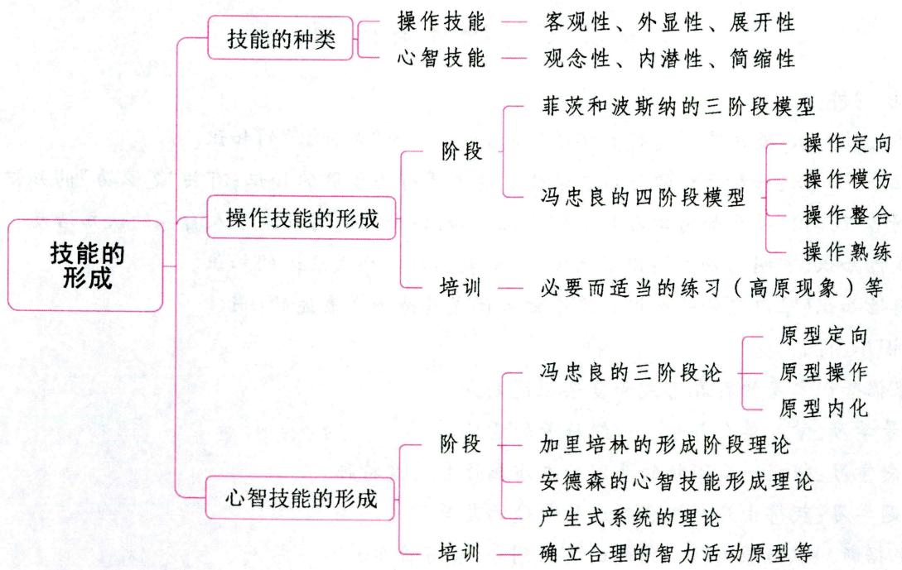

# 一、技能概述

# 考点技能的概念与特点

在《心理学大辞典》中，技能被定义为个体运用已有的知识经验，通过练习而形成的智力动作方式。

和肢体动作方式的复杂系统。皮连生认为,技能是在练习的基础上形成的按某种规则或操作程序顺利完成某种智慧任务或身体协调任务的能力。概括起来说,技能是指经过练习而获得的合乎法则的认知活动或身体活动的动作方式。

技能包括通常所说的狭义的技能和广义的熟练技巧。前者是指技能的初级阶段或初级水平，后者是指技能的高级阶段或高级水平。技能的初级阶段，是指在一定的知识基础上，按一定的方式通过反复练习或由于模仿而达到“会做”某件事或“能够”完成某种工作的水平。例如，刚学会打字的人，可以说他有了打字的技能；刚学会骑自行车的人，可以说他有了骑自行车的技能；会解各类应用题的学生，可以说他初步掌握了解应用题的技能。当初级技能反复练习，使活动方式的基本成分达到自动化程度时，则称为熟练技巧。

技能的特点包括：(1)技能是学习得来的，不是本能行为；(2)技能是一种活动方式，不同于知识；(3)技能是合乎法则的活动方式，不同于一般的随意运动。

# 考点2 技能与习惯 ★【多选】

习惯是个体在一定情境下自动化地进行某种动作的需要或特殊倾向。技能与习惯的区别见下表：

表 3-19 技能与习惯的区别  

<table><tr><td>技能</td><td>习惯</td></tr><tr><td>向一定的标准动作体系提高</td><td>保持原来的动作组织情况</td></tr><tr><td>有高级、低级之分,但没有好坏之别</td><td>有好坏之分</td></tr><tr><td>与一定的情境、任务都有联系;主动的</td><td>只和一定的情境相联系;被动的</td></tr><tr><td>与一定的客观标准做对照</td><td>与上一次动作做对照</td></tr></table>

# 考点技能的种类 【单选、多选、判断】

技能按其本身的性质和特点，可分为操作技能和心智技能。

# 1. 操作技能

# (1)操作技能的含义

操作技能又叫运动技能、动作技能，是通过学习而形成的合乎法则的操作活动方式。日常生活中的写字、打字、绘画，音乐方面的吹、拉、弹、唱，体育方面的田径、球类、体操，生产劳动方面的车、刨、磨等活动方式，都属于操作技能的范畴。

# (2) 操作技能的种类

表 3-20 操作技能的种类  

<table><tr><td>划分依据</td><td>类型</td><td>概念</td><td>举例</td></tr><tr><td rowspan="2">动作的精细程度与肌肉运动强度不同</td><td>细微型操作技能(精细技能)</td><td>靠小肌肉群的运动来实现</td><td>打字、弹钢琴、摆动耳朵等</td></tr><tr><td>粗放型操作技能(粗大技能)</td><td>靠大肌肉群的运动来实现</td><td>体育运动中的举重、掷铁饼、掷标枪等活动</td></tr><tr><td rowspan="2">动作连贯与否</td><td>连续型操作技能</td><td>由一系列连续动作组成</td><td>开汽车、骑自行车、滑冰等活动</td></tr><tr><td>断续型操作技能</td><td>由一系列不连续的动作组成</td><td>射击、投篮等活动</td></tr><tr><td rowspan="2">动作对环境的依赖程度的不同</td><td>闭合型操作技能</td><td>对外界的帮助依赖程度较低,在大多数情况下靠内部反馈信息控制</td><td>自由体操、游泳、跳水等运动</td></tr><tr><td>开放型操作技能</td><td>要求对外界变化的情况有处理能力,并对由此所发生的事情有预见能力</td><td>驾驶汽车以及球类运动中控制球的技能等</td></tr><tr><td rowspan="2">操作对象的不同</td><td>徒手型操作技能</td><td>靠操作自身的身体来实现</td><td>自由体操、跑步等活动</td></tr><tr><td>器械型操作技能</td><td>靠操作一定的器械来实现</td><td>打字、玩单杠等活动</td></tr></table>

# 2. 心智技能

# (1)心智技能的含义

心智技能也称为智力技能、认知技能，是通过学习而形成的合乎法则的心智活动方式。阅读技能、写作技能、运算技能、解题技能等都是常见的心智技能。

# (2) 心智技能的种类

①根据心智技能适用范围不同，可将心智技能分为专门心智技能和一般心智技能。专门心智技能是为某种专门的认知活动所必需的，也是在相应的专门智力活动中形成发展和体现出来的，如默读、心算、打腹稿等。一般心智技能是指可以广泛应用于许多领域的心智技能，它是在多种专门心智技能的基础上经过概括化而形成发展起来的，如观察技能、分析技能、综合技能和比较技能等。  
②加涅根据学生学习的结果, 将心智技能分为智慧技能与认知策略两种。智慧技能指运用规则对外办事的能力, 如运用相应的语法规则, 将主动句“风吹倒了大树”改为被动句“大树被风吹倒了”。认知策略指学生内部组织起来的、用以支配自己心智加工过程的技能, 也称为认知技能。例如, 针对自己学习时常犯粗心的毛病, 采用专门的自我提醒方法来应对。

表 3-21 操作技能和心智技能的特点  

<table><tr><td>特点</td><td>操作技能</td><td>心智技能</td></tr><tr><td>动作的对象</td><td>物质性客体或肌肉,具有客观性</td><td>客观事物在人脑中的主观映像,具有观念性</td></tr><tr><td>动作的进行</td><td>通过外部显现的肌肉运动实现的,具有外显性</td><td>对观念性对象进行的加工改造,具有内潜性</td></tr><tr><td>动作的结构</td><td>每个动作必须切实执行,不能合并、省略,具有 展开性</td><td>不像操作活动那样必须将每一个动作实际做出, 也不像外部言语那样必须把每一个字一一说出, 而是不完全的、片断的,是高度省略和简化的,具 有简缩性</td></tr></table>

真题1 [2024河北石家庄, 单选]一天, 高中学生小龙正在辅导上小学二年级的妹妹做数学作业。小龙看到妹妹作业中的应用题时, 他没有经过列式、运算和检验, 直接就说出了答案。这体现了小龙的智力活动具有( )特征。

A.观念性  
B. 内潜性  
C. 简缩性  
D. 客观性

真题2 [2024广东广州,单选]下列情况体现了心智技能的是( )

A. 在舞蹈教室跳舞

B. 在游泳馆里游泳

C. 在黑板上画圆

D. 将小数转化为分数

真题3 [2023广东韶关，单选]打乒乓球属于( )

A. 智慧技能

B. 操作技能

C. 阅读技能

D. 运算技能

答案：1.C 2.D 3.B

# 二、操作技能的形成 ★★ 【单选、多选、填空、简答】

# 考点1 操作技能的形成阶段

操作技能往往是由一套复杂的动作系统构成的。操作技能形成的过程是个体通过练习逐步掌握某种动作方式的过程。为了更好地理解操作技能的形成，研究者们提出了各种阶段模型，这里主要介绍两种阶段模型。

# 1. 菲茨和波斯纳的三阶段模型

菲茨和波斯纳将操作技能学习的过程分为认知、联系形成和自动化三个阶段。

# (1)认知阶段

操作技能形成的认知阶段是指学习者通过指导者的言语讲解或观察他人示范的动作模式, 或自己按照操作说明或使用手册的要求, 试图对所学技能的任务、性质、要点进行分析、了解和领会。这个阶段的主要任务是领会技能的基本要求、重点, 掌握组成技能的局部动作。因此, 学习者的注意范围小, 只集中于个别动作, 不能控制动作的细节与局部, 在学习中难以发现错误和缺点, 常表现出全身肌肉紧张, 动作忙乱、僵硬, 动作速度缓慢、不协调、呆板, 多余动作突显, 动作连贯性差等特点, 需要较多的意识控制。

# (2)联系形成阶段

在该阶段, 练习者把组成新操作技能的动作整体逐一进行分解, 并试图发现它们是如何构成的, 最后尝试性地完成所学新技能中的各个动作。经过练习, 逐步掌握了一系列的局部动作, 并逐渐从个别动作转向整体动作的组织与协调。但此阶段各动作之间依然结合得不够紧密, 因此在动作转换和交替之际, 经常会出现短暂的停顿现象。此外, 练习者对操作技能的视觉控制逐渐减少、肌肉运动感觉的控制作用逐渐增强。随着练习时间和次数的增加, 动作间的相互干扰逐渐减少, 紧张程度有所下降, 多余动作趋于消失。

# (3)自动化阶段

操作技能形成的最后阶段是一长串的动作系列联合成为一个有机的整体并巩固下来。此阶段,各个动作相互协调似乎是自动流出来的,无需特殊的注意和纠正。这时,练习者的多余动作和紧张状态已经消失,能根据情况灵活变化、迅速而准确地完成动作,并且这种动作已经达到自动化程度,几乎不需要有意识的控制,这就是操作技能进入自动化阶段的熟练操作特征。在该阶段,只要有一个启动信号,练习者就能迅速准确地按照程序连贯完成整个动作系列。

# 2. 冯忠良的四阶段模型

# (1) 操作定向

操作技能表现为一系列的操作活动,在形成之初,学习者必须了解做什么、怎么做的有关信息与要求,形成对动作的初步认识。操作定向就是了解操作活动的结构与要求,在头脑中建立起操作活动的定向映像的过程。

# (2) 操作模仿

个体在定向阶段了解了一些基本的动作机制之后，就会尝试做出某种动作。模仿的实质是将头脑中

形成的定向映像以外显的实际动作表现出来。模仿是在定向的基础上进行的, 缺乏定向映像的模仿是机械的模仿。只有通过模仿, 才能使这一映像得到检验、巩固与充实。操作模仿是掌握操作技能的开端,需要以认知为基础。

# (3)操作整合

操作整合是把构成整体的各动作要素,依据其内在联系联结成整体,形成操作活动的序列,获得有关操作活动的完整的动觉映像的过程。即把模仿阶段习得的动作固定下来,并使各动作成分相互结合,成为定型的、一体化的动作。只有通过整合,各动作成分之间才能协调联系,动作结构才趋于合理,动作的初步概括化才得以实现。

# (4) 操作熟练

操作熟练是操作技能掌握的高级阶段。这一阶段，通过动作练习形成的活动方式对各种变化的条件具有高度的适应性，动作的执行达到高度的程序化、自动化和完善化。自动化并非无意识，而是指它的执行过程不需要意识的高度控制，可以将注意力分配给其他活动。

表 3-22 操作模仿、操作整合和操作熟练阶段的特点  

<table><tr><td>特点</td><td>操作模仿</td><td>操作整合</td><td>操作熟练</td></tr><tr><td>动作品质</td><td>动作的稳定性、准确性、灵活性较差</td><td>动作可以表现出一定的灵活性、稳定性
和精确性,但当外界条件发生变化时,动
作的这些特点都有所降低</td><td>动作具有高度的灵活性、稳定性
和准确性,在各种变化的条件下
都能顺利完成动作</td></tr><tr><td>动作结构</td><td>各个动作要素之间的协调性较差,互相干扰,常有多余动作产生</td><td>各个动作成分趋于分化、精确,整体动作趋于协调、连贯,各动作成分间的相互干扰减少,多余动作也有所减少</td><td>各个动作之间的干扰消失,衔接连贯、流畅,高度协调,多余动作消失</td></tr><tr><td>动作控制</td><td>主要靠视觉控制,动觉控制水平较低,不能主动发现错误与纠正错误</td><td>视觉控制不起主导作用,逐步让位于动觉控制,肌肉运动的感觉变得较清晰、准确,并成为动作执行的主要调节器</td><td>动觉控制增强,不需要视觉的专门控制和有意识的活动,视觉注意范围扩大,能准确地觉察到外界环境的变化并调整动作方式</td></tr><tr><td>动作效能</td><td>完成一个动作往往比标准速度要慢,个体经常感到疲劳、紧张</td><td>疲劳感、紧张感降低,心理能量不必要的消耗减少,但没有完全消除</td><td>心理消耗和体力消耗降至最低,表现为紧张感、疲劳感减少,动作具有轻快感</td></tr></table>

# ·记忆有妙招·

为方便考生记忆，编者将不同操作技能形成阶段的动作控制特点总结成以下口诀：

模仿靠视觉，整合让动觉，熟练主动觉。

真题4 [2024河北石家庄，单选]化学课上，肖老师在做“氧化还原反应”实验时，她首先对每一步操作进行示范和讲解，然后指导学生仔细观察实验步骤和操作细节，并思考如何动手做实验。肖老师的做法属于操作技能形成中的（）

A. 定向阶段

B. 模仿阶段

C. 整合阶段

D. 熟练阶段

真题5 [2022天津北辰,单选]在操作技能形成中,把模仿阶段习得的动作固定下来,并形成一体

化的动作称为（ ）

A. 操作模仿

B. 操作内化

C. 操作整合

D. 原型定向

答案：4.A 5.C

# 考点2 操作技能的培训要求

# 1. 准确的示范与讲解

示范、讲解在操作技能形成过程中是不可缺少的，准确的示范与讲解有利于学习者不断地调整头脑中的动作表象，形成准确的定向映像，进而在实际操作活动中可以调节动作的执行。

示范可以促进操作技能的形成，但示范的有效性取决于许多因素，如示范者的身份、示范的准确性、示范的时机等。

言语讲解在技能形成过程中也起到重要的作用。进行讲解与指导时，要注意言语的简洁、概括与形象化。不仅要讲解动作的结构与具体要求，也要讲解动作所包含的基本原理；不仅要讲解动作的物理特性，也要指导学生注意体验执行动作时的肌肉运动知觉。

# 2.必要而适当的练习

练习是形成各种操作技能所不可缺少的关键环节，通过应用不同形式的练习，可以使个体掌握某种技能。一般来说，随着练习次数的增多，动作的精确性、速度、协调性等会逐步提高。从练习曲线（下图）中可以看出技能随着练习量的增加而提高的一般趋势。

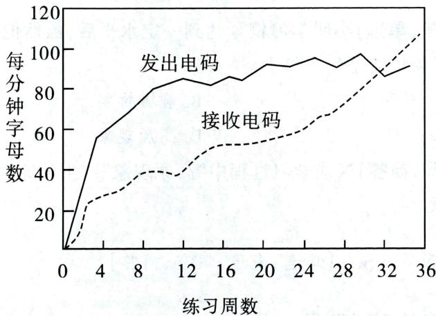  
图3-5 常见的练习曲线（学习电码的练习曲线）

虽然不同的学习者的练习曲线存在差异, 但也具有共同点, 表现在: (1) 开始进步快. (2) 中间有一个明显的、暂时的停顿期, 即高原期。通常把学生在学习过程中出现一段时间的学习成绩和学习效率停滞不前, 甚至学过的知识感觉模糊的现象, 称为“高原现象”, 其产生的原因在于: ① 学习方法的固定化; ② 学习任务的复杂化; ③ 学习动机减弱; ④ 兴趣降低; ⑤ 心理和生理上的疲劳; ⑥ 意志不够顽强. (3) 后期进步较慢. (4) 总趋势是进步的, 但有时出现暂时的退步。整个练习过程中, 成绩往往会有一些波动起伏现象。练习成绩的起伏现象是指在操作技能的形成过程中, 练习的成绩时而上升, 时而下降, 有峰有谷, 呈现明显的波浪式。多数情况下, 练习曲线反映出来的技能的进步是先快后慢; 也有少数情况可能出现先慢后快的趋势。

教师在教学中组织练习时，应明确练习的目的和要求，增强学习动机。另外，还需要帮助学生掌握正确的练习方法，并且及时进行反馈。具体表现在：(1)练习需要循序渐进，由易到难、先简后繁；(2)正

确掌握练习速度，保证练习质量；(3)适当安排练习的次数和时间；(4)练习方式多样化。采取何种练习方式也直接影响着操作技能的学习。练习方式有多种，根据练习时间分配的不同有集中练习与分散练习；根据练习内容的完整性的不同有整体练习与部分练习；根据练习途径的不同有模拟练习、实际练习与心理练习；等等。

# 3. 充分而有效的反馈

反馈指在学习与练习过程中信息的返回传递。一般来讲，反馈来自两个方面：(1)内部反馈，即操作者自身的感觉系统提供的感觉反馈。这是个体通过自身的视觉、听觉、触觉、动觉等获取的反馈信息，尤其是动觉反馈信息最有代表性。(2)外部反馈，即操作者自身以外的人和事给予的反馈，有时也称结果知识。这是教师、教练、示范者、录像、计算机等外部信息源对学习者的操作结果及其操作过程的反馈。

反馈在操作技能学习过程中的作用是非常关键的，只有通过反馈，学习者才知道自己的动作是否合乎要求。其中准确的结果反馈可以引导学生矫正错误动作、强化正确动作，并鼓励学生努力改善其操作，作用尤为明显。影响反馈效果的因素有：（1)反馈的内容；(2)反馈的频率；(3)反馈的方式。

# 4. 建立稳定清晰的动觉

动觉是复杂的内部运动知觉，它反映的主要是身体运动时的各种肌肉活动的特性，如紧张、放松等，而不是外界事物的特性。由于运动知觉的模糊性，经常会发生学习者对自己的错误动作不能意识到的现象，当然也就很难对动作进行有意识的调节或控制。因此，有必要进行专门的动觉训练，以提高其稳定性和清晰性，充分发挥动觉在技能学习中的作用。

真题6 [2024江苏常州, 单选]小明学习钢琴达到一定水平后, 虽然他持续练琴, 但是他的琴技在短时间内并未提升。这种现象可能是( )

A. 思维定势

B. 前摄抑制

C. 倒摄抑制

D. 高原现象

真题7 [2024浙江金华,简答]谈谈学习过程中“高原现象”产生的原因。

答案：6.D 7.详见内文

# 三、心智技能的形成 ★★【单选、多选、填空、简答】

# 考点1 心智技能的形成阶段

# 1. 冯忠良的三阶段论

# (1) 原型定向

原型指那些被模拟的自然现象或过程。智力活动的原型是对一些最典型的智力活动样例的设想。原型定向就是了解原型的活动结构，从而使主体明确活动的方向，知道该做哪些动作和怎样去完成这些动作。这一阶段是主体掌握操作性知识的阶段，也是心智技能形成的准备阶段。

# (2) 原型操作

原型操作是依据心智技能的实践模式，把学生在头脑中已建立起来的活动程序计划以外显的操作方式付诸实施，获得完备的动觉映像的过程。

# (3) 原型内化

原型内化, 即智力活动的实践模式 (原型) 向头脑内部转化, 由物质的、外显的、展开的形式变成观

念的、内潜的、简缩的形式的过程。原型内化最后达到活动方式的定型化、简缩化和自动化。该阶段开始借助言语来对观念性对象进行加工，是原型在学习者头脑中转化为心理结构内容的过程，是心智技能的完成阶段。

# 2. 加里培林的心智技能形成阶段理论

# (1) 活动的定向阶段

这是活动的准备阶段，所谓定向，是使学生了解、熟悉活动对象，使他们知道做什么和怎样做，从而使学生在头脑中构成关于心智活动和活动结果的表象，以便对活动本身及其结果进行定向。这就不仅需要向学生呈现活动的原样（模型），而且还要说明活动的目的、对象和方式。

# (2)物质活动或物质化活动阶段

物质活动是指运用实物进行心智活动, 物质化活动是指运用实物的模型、图片、言语、示意图等进行活动。此阶段的作用在于使学生通过自己从事物质或物质化活动, 理解活动的真实内容, 为以后的智力活动打下基础。活动的形式可以是物质的, 也可以是物质化的, 它们之间的区别主要在于动作的客体不同。

# (3)出声的外部言语阶段

这个阶段的特点是活动离开了它的物质或物质化的客体，以出声的外部言语形式来完成实在的活动。例如，学生进行加法运算，不再借助于小棍、手指，而是用言语表现“数位对齐，个位对个位”的运算过程（即口算）。

# (4)无声的外部言语阶段

这个阶段是从出声言语向内部转化开始，到以内部不出声的言语自由叙述为止。它是以词的声音表象、动觉表象为支柱而进行智力活动的阶段。

# (5)内部言语活动阶段

这是心智技能形成的最后阶段。本阶段的主要特点是智力活动简缩、自动化，很少发生错误。只有碰到困难问题时，智力活动才展开地进行。

# 3. 安德森的心智技能形成理论

著名认知心理学家安德森认为，心智技能的形成需经过三个阶段，即认知阶段、联结阶段和自动化阶段。

（1）认知阶段的任务是要了解问题的结构，即起始状态、要达到的目标状态、从起始状态到目标状态所需要的步骤。  
(2)在联结阶段，学习者应用具体的方法来解决问题，主要表现在把某一领域的描述性知识转化为程序性知识。在此阶段，个体逐渐产生一些新的产生式法则，以解决具体的问题。  
(3)在自动化阶段，个体对特定的程序化的知识进一步深入加工和协调。此时，个体操作某一技能所需的认知投入较小，且不易受到干扰。

# 4. 产生式系统的理论

认知心理学家根据知识的不同表征和作用, 将知识分为陈述性知识和程序性知识。心智技能实质上是个体习得的一套程序性知识并按这套程序去解决问题的能力。心智技能的学习本质上是掌握一套程序, 亦即在长时记忆中形成一个解决问题的产生式系统。所谓产生式系统, 即由一系列以“如果……那么……”的形式表示的规则。

皮连生采用加涅的心智技能学习的层级论和信息加工心理学的产生式理论来解释心智技能习得

的过程和条件,他认为心智技能的学习一般分为三个阶段:第一阶段,新信息进入短时记忆,与长时记忆中被激活的相关知识建立联系,从而出现新的意义建构。第二阶段,通过应用规则的变式练习,使规则的陈述性知识向程序性知识转化。第三阶段,程序性知识发展至最高阶段,规则完全支配人的行为,智力技能达到相对自动化。

真题8 [2023广东潮州, 单选]欣欣在演算进位加法时, 已经不再需要默念公式和法则, 而是在头脑中出现几个关键词, 随之而来的就是自动化的操作, 这说明该学生的心智技能处于( )

A. 活动定向阶段

B. 物质活动或物质化活动阶段

C. 无声的外部言语活动阶段

D. 内部言语活动阶段

真题9 [2023河南周口, 单选]数学课上, 为了更好地形成智力技能, 教师常在黑板上清楚细致地演算例题, 帮学生掌握解题技巧, 这是给学生提供( )

A. 原型定向

B. 原型模仿

C. 原型操作

D. 原型内化

答案：8.D 9.A

# 考点2 心智技能的培养要求

# 1. 确立合理的智力活动原型

由于形成的心智技能一般存在于有着丰富经验的专家的头脑中，因此，模拟确立模型的过程实际上是把专家头脑中的观念的、内潜的、简缩的经验“外化”为物质的、展开的、外显的活动模式的过程。

# 2. 有效进行分阶段练习

由于心智技能是按一定的阶段逐步形成的，因此，在培训方面只有分阶段进行练习，才能获得良好的教学效果。为提高分阶段练习的成效，在培养工作方面，必须充分依据心智技能的形成规律，采取有效的措施，包括：（1）激发学习的积极性和主动性。（2）注意原型的完备性、独立性和概括性。（3）适应培养的阶段特征，正确使用言语。（4）注意学生的个别差异。（5）科学地进行练习。教师在指导学生练习时，应该注意以下几点：①教师要做到精讲、使学生多练；②注意练习形式的多样化，举一反三；③练习要适量适度，循序渐进。

# 3.知识影响技能的形成

了解学生的知识基础，并为学生提供相关知识。

# 4. 注重培养学生认真思考的习惯和独立思考的能力

要注意形成学生的概括性联想，培养学生的概括力和灵活的思维品质。

# ★本节核心考点回顾 ★

# 1.技能的种类

(1) 操作技能 (运动技能/动作技能): 日常生活中的写字、打字、绘画, 音乐方面的吹、拉、弹、唱, 体育方面的田径、球类、体操运动, 生产劳动方面的车、刨、磨等活动方式, 都属于操作技能的范畴。  
(2)心智技能（智力技能/认知技能）：阅读技能、写作技能、运算技能、解题技能等都是常见的心智技能。

# 2. 冯忠良的操作技能形成的四阶段模型

(1) 操作定向: 学习者了解操作活动的结构与要求, 在头脑中建立起操作活动的定向映像的过程。

(2) 操作模仿: 个体将操作定向阶段在头脑中形成的定向映像以外显的实际动作表现出来。  
(3) 操作整合: 把操作模仿阶段习得的动作固定下来, 并使各动作成分相互结合, 成为定型的、一体化的动作。  
(4) 操作熟练：操作技能形成的高级阶段，动作的执行达到高度的程序化、自动化和完善化。

# 3. 高原现象

(1) 通常把学生在学习过程中出现一段时间的学习成绩和学习效率停滞不前, 甚至学过的知识感觉模糊的现象, 称为“高原现象”。  
(2)高原现象产生的原因：①学习方法的固定化；②学习任务的复杂化；③学习动机减弱；④兴趣降低；⑤心理和生理上的疲劳；⑥意志不够顽强。

# 4. 冯忠良的心智技能形成的三阶段论

(1) 原型定向: 主体掌握操作性知识的阶段, 也是心智技能形成的准备阶段。  
(2) 原型操作: 把学生在头脑中已建立起来的活动程序计划以外显的操作方式付诸实施。  
(3)原型内化：智力活动的实践模式（原型）向头脑内部转化。

# 5. 加里培林的心智技能形成阶段理论

(1) 活动的定向阶段。(2) 物质活动或物质化活动阶段。(3) 出声的外部言语阶段。(4) 无声的外部言语阶段。(5) 内部言语活动阶段。

# 第六节 问题解决与创造性

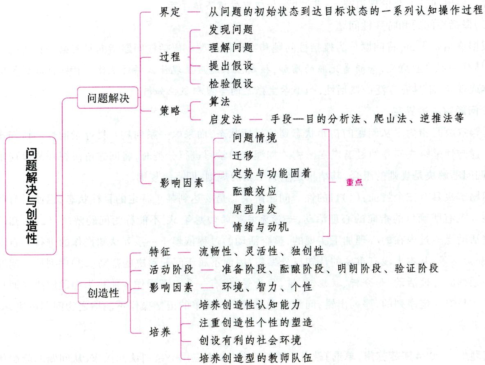

# 一、问题解决

# 考点 1 问题与问题解决 ★【单选】

# 1. 问题的界定

问题就是给定信息与要实现的目标之间有某些障碍需要加以克服的情境。每一个问题都必然包含三种成分：(1)给定信息，指有关问题初始状态的一系列描述；(2)目标，指有关问题结果状态的描述；(3)障碍，指在解决问题的过程中会遇到的种种亟待解决的因素。

# 2. 问题的分类

# (1)有结构的问题和无结构的问题

按照问题的组织程度，问题可分为有结构的问题（结构良好问题）和无结构的问题（结构不良问题）。有结构的问题是指已知条件和要达到的目标都非常明确，个体按照一定的思维方式即可获得答案的问题，比如“ $349 + 1890 = ?$ ”即为有结构的问题，教科书上的练习题多属于有结构的问题。无结构的问题是指已知条件与要达到的目标都比较含糊，问题情境不明确，各种影响因素不确定，不易找出解答线索的问题。如怎样造就天才儿童？怎样培养学生的创新意识？这些都是重要但又无确切的、唯一正确的答案的问题。

# (2)概念性问题、经验性问题和价值问题

根据内容特性，可将问题分为概念性问题、经验性问题和价值问题。概念性问题内容涉及学术性概念，如长方体的表面积与体积之间存在什么关系。经验性问题涉及生活经验，如在冰面上行走时如何防滑。价值问题涉及伦理道德、是非判断，如初中生该不该早恋。

# (3)概括性问题和特殊性问题

根据概括水平，可将问题分为概括性问题和特殊性问题。概括性问题指向具有某一特征的一群人或物，具有一定普遍意义，如随着光照的增加，植物生长速度呈现什么样的规律。特殊性问题指向特殊的个体或现象，不具有广泛的概括性，如小学生张某的学习积极性如何。

# 3. 问题解决的界定

问题解决是指为了从问题的初始状态到达目标状态，而采取一系列具有目标指向性的认知操作的过程。创造性是解决问题的最高表现形式。加涅在对学习进行分类时，将问题解决视作高级规则的学习，强调问题解决是规则的组合，其结果是生成了新的规则，即高级规则。

问题解决具有三个特征：(1) 目的性。问题解决总是要达到某个特定的目标状态，因而具有明确的目的性。没有明确目的指向的心理活动，如漫无目的的幻想等，则不能称为问题解决。(2) 认知性。问题解决活动是通过内在的心理加工实现的，整个活动的过程依赖于一系列认知操作的进行。自动化的操作，如走路等，基本上没有重要的认知成分参与，因而不属于问题解决的范畴。(3) 序列性。问题解决包含一系列的心理活动，如分析、联想、比较、推论等，仅有一个心理操作不能称为问题解决。而且这些心理操作是有一定序列的，序列出错，问题也无法解决。简单的记忆操作不能称之为问题解决，如回忆某人的名字等。

真题1 [2024江苏苏州, 单选]教育心理学中将“个人应用一系列认知操作, 从问题的起始状态到

达目标状态”的过程称为（）

A. 合作学习  
B. 功能固着   
C.检验假设   
D. 问题解决

真题2 [2023河北石家庄，单选]下列活动属于“问题解决”的是（）

A. 回忆朋友的电话号码  
B.观看电影  
C. 写论文  
D. 游泳

答案：1.D 2.C

考点2 问题解决的过程 ★【单选、多选】

问题解决的过程一般可分为发现问题、理解问题、提出假设和检验假设四个阶段。

(1)发现问题。从完整的问题解决过程来看, 发现问题是其首要环节。能否发现问题, 与主体活动的积极性、求知欲、已有知识经验等有关。  
(2)理解问题。理解问题即明确问题, 就是把握问题的性质和关键信息, 摒弃无关因素, 并在头脑中形成有关问题的初步印象, 即形成问题的表征。  
(3)提出假设。提出假设就是提出解决问题的可能途径与方案, 选择恰当的解决问题的操作步骤。能否有效地提出假设, 受到个体思维的灵活性与已有知识经验的影响。提出假设是问题解决的关键阶段。提出假设的数量和质量取决于两个条件: 一是个体思维的灵活性。思维越灵活, 越能多角度地分析问题, 就越能提出众多的合理的假设。二是已有的知识经验。与问题解决相关的知识经验越丰富,就越有利于扩大假设的数量并提高其质量。  
(4)检验假设。检验假设就是通过一定的方法来确定假设是否合乎实际、是否符合科学原理。检验假设的方法有两种：①直接检验，即通过实践来检验，通过问题解决的结果来检验；②间接检验，即通过推论来淘汰错误的假设，保留并选择合理的、最佳的假设。当然，间接检验的结果是否正确，最终还要由直接检验来证明。

真题3 [2023广东梅州, 单选] 某一问题解决过程主要包括四个阶段, 其中“对问题形成表征”是( )

A. 提出假设

B.检验假设

C. 发现问题

D. 理解问题

答案：D

考点 3 问题解决的策略 ★★ 【单选、填空】

虽然解决问题的方法多样化，但是总结起来基本上可以归纳为以下几种策略与方法：

# 1.算法

算法策略是将所有可能的针对问题解决的方法都一一列举出来并进行尝试，直到最终从根本上解决问题。很明显，算法策略需要在解决问题时进行大量的准备工作，需要花费较大的精力和较多的时间，但是优点就是能够确保找到问题解决的途径。例如，解锁密码箱时每一位密码都有“0～9”十个数字，那么把所有数字组合一个一个进行尝试，直到找到打开密码箱的正确密码，这一过程就是在使用算法策略。

# 2.启发法

与算法的思维过程不同，启发法是基于一定的经验，根据现有问题状态与目标状态之间的内在联系，采用较少搜索而找到解决问题途径的一种策略。启发法不需要像算法策略那样费时费力，往往是一种比较快捷的方法，但并不能保证一定可以成功地解决问题。以下是几种常用的启发法策略：

# (1)手段一目的分析法

所谓手段一目的分析法, 就是将需要达到的问题的目标状态分成若干个子目标, 通过实现一系列的子目标而最终达到总目标。它的基本步骤是: ①比较初始状态和目标状态, 提出第一个子目标; ②找出完成第一个子目标的方法或操作, 实现子目标; ③提出新的子目标, 如此循环往复, 直至问题解决。手段一目的分析法是一种不断减少当前状态与目标状态之间的差别而逐步前进的策略, 是一种常用的解题策略, 对解决复杂问题有重要的应用价值。

# (2)爬山法

爬山法是采用一定的方法逐步降低初始状态和目标状态的距离，以达到问题解决的一种方法，与手段一目的分析法类似。其不同之处在于，手段一目的分析法包括这样一种情况，即有时人们为了达到目的，不得不暂时扩大目标状态与初始状态的差距，以便最终达到目标。

# (3)逆推法（逆向反推法）

逆推法就是从问题的目标状态开始搜索直至找到通往初始状态的方法。逆向搜索更适合于解决那些从初始状态到目标状态只有少数解决方法的问题, 数学中的推理运算有时采用这一策略。

# (4)类比思维

当面对某种问题情境时，个体可以运用类比思维，先寻求与此有些相似的情境的解答。当人们第一次发明潜艇后，工程师们要思考如何让战舰确定潜艇隐藏在海下的方位。于是，通过研究蝙蝠导航机制发明了声呐，将其运用于潜艇的定位。

真题4[2024天津河东，单选]小明在做数学习题时，能够把各种解法逐一列出并加以尝试，最终找到一个最佳解法，这种解题的方法属于（）

A. 归纳式

B. 罗列式

C. 推理式

D. 算法式

真题5 [2023四川统考，单选]小红在完成作文的过程中，制定了分析题目、确定中心思想、编写提纲、写文章、修改文章等小目标，她采用的策略是（）

A. 爬山法

B.算法式

C.手段一目的分析法

D. 逆向思维法

答案：4.D 5.C

考点4 影响问题解决的因素 ★★ 【单选、多选、判断、简答】

# 1. 问题情境（问题表征）

问题情境就是指问题呈现的知觉方式。问题呈现的知觉方式与人们已有的知识经验越接近，问题就越容易解决；反之，如果与人们已有的知识经验相差甚远，问题解决起来就很困难。

  
影响问题解决的因素

# 2.迁移（已有知识经验、认知结构）

迁移是指已有的知识经验对解决新课题的影响。任何问题解决都离不开一定的知识作为基础，必

要的知识经验、完善的知识结构有利于问题顺利地解决。

# 3. 定势与功能固着

定势（即心向）是指重复先前的操作所引起的一种心理准备状态。在定势的影响下，人们会以某种习惯的方式对刺激情境做出反应。定势对解决问题有积极作用，也有消极作用。人们把某种功能赋予某物体的倾向称为功能固着。在功能固着的影响下，人们不易摆脱事物用途的固有观念，从而直接影响问题解决的灵活性。

# 4. 酝酿效应

当一个人长期致力于某一问题解决而又百思不得其解的时候，如果他暂时停下对这个问题的思考去做别的事情，几小时、几天或几周之后，他可能会忽然想到解决的办法，这就是酝酿效应。酝酿效应实际上是产生了顿悟，使人们打破了以往不恰当的思路，从一个新的角度思考问题，从而使问题得以解决。

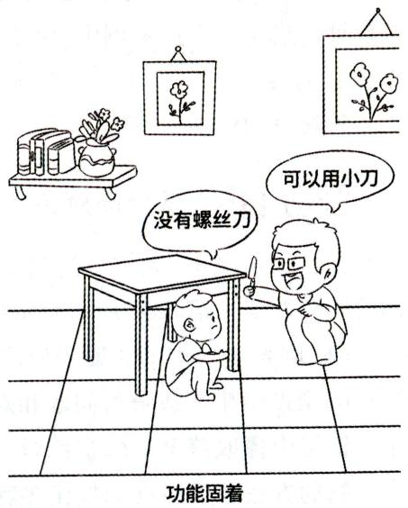

# 5. 原型启发

对问题解决起启发作用的事物叫原型。原型启发是指从其他事物上发现解决问题的途径和方法。任何一个人对某一项目的发明创造或革新，都不是凭空想象出来的，在开始时总要受到某种类似的事物或模型的启发。例如，鲁班从丝茅草割破手得到启发，发明了锯。原型启发在创造性地解决问题时的作用十分明显。通过联想，人们可以从原型中找到解决问题的新方法。原型之所以有启发作用，是因为事物本身的特点与所创造的事物之间有相似之处。某事物能否起启发作用，不仅取决于该事物的特点，还取决于问题解决者的心理状态。在问题解决者的思维活动处于积极但又不过于紧张的状态时，才最容易产生原型启发。

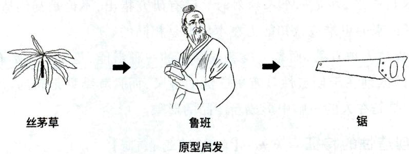

# 6. 情绪与动机

情绪对问题解决有一定影响，肯定、积极的情绪状态有利于问题的解决，否定、消极的情绪状态则会阻碍问题的解决。人们对活动的态度、责任感等都可以成为发现问题的动机，影响问题解决的效果。动机的强度不同，影响的大小也不一样。动机与问题解决的关系遵循“耶克斯一多德森定律”。

此外，个体的认知特征、个性特征以及问题的特点等也会影响问题解决。

真题6 [2024河北石家庄，单选]李凯在总结学习经验时写道：“在完成作业的过程中，如果遇到难题一时没有解题思路，可以先放一放，做一些其他事情，也许会突然产生灵感，这道难题可能就迎刃而解了。”李凯解决难题的办法属于（）

A. 高原现象

B. 功能固着

C. 原型启发

D. 酝酿效应

真题7 [2024广东佛山, 单选]科学家和工程师通过观察鸟类的飞行行为和结构, 获得了有关飞机设计的启示。在此案例中, 属于“原型”的事物是( )

A.鸟类

B. 飞机

C. 科学家

D. 工程师

答案：6.D 7.A

# 考点5 学生问题解决能力的培养 ★【简答】

在学校情境中，大部分问题解决是通过解决各个学科中的具体问题来体现的，这就意味着结合具体的学科教学来培养解决问题的能力是必要的，也是可行的。具体可从以下几方面入手：

(1)培养学生主动质疑和解决问题的内在动机；(2)问题的难度要适当；(3)帮助学生正确表征问题；(4)帮助学生养成分析问题和对问题归类的习惯；(5)提高学生知识储备的数量和质量，指导学生善于从记忆中提取信息；(6)训练学生陈述自己的假设及其步骤，鼓励自我评价和反思；(7)教授与训练解决问题的方法和策略；(8)提供多种练习机会；(9)训练逻辑思维能力，提高思维水平。

# 二、创造性及其培养

# 考点1 创造性的概念 ★【单选、判断】

在心理学上,创造性是一个复杂而颇有争议的概念。一般把创造性看成是根据一定目的,运用已知信息,产生出某种新颖、独特、有社会价值的产品的能力或特性,也称为创造力。

根据创造产品的价值意义不同，创造可以分为真创造和类创造。真创造指产生了具有人类历史首创性产品的活动。类创造是指创造产生的产品并非社会首创，只是对个体而言具有独创性。例如，曾经有农民自己花费很长的时间发明创造了木制飞机。对于社会而言，飞机早已不再是什么新奇的事物，但是对于这位农民而言，却是他个人独创的。已有研究指出，不论是真创造还是类创造，它们的心理加工过程、所表现出来的思维或认知能力在本质上是相同的。

创造性并不是少数人独有的, 而是人类普遍存在的一种潜能, 是每个人都有的一种心理品质。创造性和创造性思维的区别在于创造性具有更广泛的含义, 而且其结果是新的产品, 而创造性思维只是一种思维形式, 其结果是在人的头脑中形成新产品的形象。

# 考点2 创造性的特征 ★★ 【单选、多选、判断】

尽管不同的研究及其相关测验强调创造性的不同特征，但目前比较公认的是以发散思维的基本特征来代表创造性的特征。

(1) 流畅性。流畅性是指在限定时间内产生观念数量的多少。在短时间内产生的观念越多，流畅性越好。该特征能反映个体的心智灵活、思路通达的程度。  
(2)灵活性。灵活性是指摒弃以往的习惯思维方法而开创不同方向的能力，也叫思维的变通性。例如，让学生“举出报纸的用途”，如果回答“阅读”“学习”“获取信息”，就只是把报纸的用途局限在了“阅读材料”上；而如果回答“包东西”“折玩具”等，则范围更加广泛，变通性也就比较好。  
(3)独创性(独特性)。独创性是指产生不寻常的反应和不落俗套的能力，以及重新定义或按新的方式对所见所闻加以组织的能力，如在“曹冲称象”故事中，曹冲把“石头”作为称象的工具就显得十分独特。

# 小香课堂

对创造性（发散思维）的特征进行判断时，应抓住各个特征的关键词：流畅性强调单位时间内数量多（种类单一），即时间短、速度快；灵活性强调范围广（种类多），即打破旧的思维观念，从新角度考虑问题；独创性强调观念新（与众不同），即超乎寻常，新奇独特。

真题8 [2024广东广州, 单选] 老师让学生说出“牙刷有哪些用途”, 学生可能回答“刷牙、除锈、画画等”, 在不限时间的情形下, 学生提供的不同类型的答案比较多, 能说出的不同用途也多。这说明其思维的( )好。

A. 独创性  
B. 流畅性  
C. 变通性  
D. 深刻性

答案：C

# 考点 3 创造活动的阶段 ★ 【单选、多选】

人的创造性表现在相应的创造活动过程的各阶段中，关于创造活动的阶段有不同观点，其中有代表性的观点当属沃拉斯(沃勒斯)提出的四阶段论。该观点认为创造性活动主要由准备、酝酿、明朗和验证四个阶段构成。

(1)准备阶段。在这一阶段，创造者收集、整理资料，即收集创造活动所必需的各种信息，组织已有的旧经验，掌握必要的技能。  
(2)酝酿阶段。在准备阶段收集到的信息并未消极地存储在头脑中，而是按照一种我们目前尚不清楚的方式被加工和重新组织。在这个阶段，各种观点、想法和意见在潜意识中活动，各种主意和观点有可能产生不同寻常的组合。  
(3) 明朗阶段。这是指创造者经过长期酝酿, 产生新假设或对考虑的问题豁然开朗, 这种现象也叫灵感。明朗阶段是创造活动极为重要的阶段。  
(4)验证阶段。在这个阶段，创造者要把头脑中产生的新假设或新观点通过实践加以检验。验证可以对新假设加以确定、修正、补充或完善。

# 考点4 影响创造性的因素 ★【不定项】

# 1. 环境

家庭与学校的教育环境以及社会文化是影响个体创造性的重要因素。

(1)父母的受教育程度、管教方式以及家庭气氛等都在不同程度上影响孩子的创造性。研究发现，父母受教育程度较高者、对子女的要求不过分严格者、对子女的教育采取适当辅导策略者以及家庭气氛比较民主者，都比较有利于孩子的创造性的培养。  
(2)在学校教育方面，如果学校气氛较为民主，教师不以权威方式管理学生；教师鼓励学生的自主性，允许学生表达不同意见；学习活动有较多自由，教师允许学生在自行探索中去发现知识，这样的教育就有利于创造性的培养。  
(3)社会文化也会影响学生创造性的发展。创设具有一定开放性和自由空间的成长环境，尊重学生的独立性、尊重他们的差异，是创造性培养的另一重要方面。

# 2. 智力

创造性的研究表明, 创造性与智力并非简单的线性关系, 二者既有独立性, 又在某种条件下具有相关性, 在整体上呈正相关趋势。高智商是高创造性的必要条件, 但不是充分条件。创造性与智力的关系表现为: (1) 低智商不可能具有高创造性; (2) 高智商可能有高创造性, 也可能有低创造性; (3) 低创造性者的智商水平可能高, 也可能低; (4) 高创造性者必须有高于一般水平的智商。

# 3. 个性

一般而言，创造性与个性二者之间具有互为因果的关系。综合有关研究，高创造性者一般具有以下个性特征：(1)具有幽默感；(2)有抱负和强烈的动机；(3)能够容忍模糊与错误；(4)喜欢幻想；(5)具有强烈的好奇心；(6)具有独立性。

真题9 [2022河北邯郸，不定项]下列关于创造性与智力之间关系的叙述，正确的是（）

A. 低智商也可能有高的创造性  
B. 高智商必然有高的创造性  
C. 高创造性必须有高于一般水平的智商  
D. 创造性与智力并非简单的线性关系

答案：CD

考点5 创造性的培养 ★★ 【简答、论述】

创造性是由人的认知能力、个性倾向和社会环境相互作用产生的行为结果。因此，可以从以下四个方面来探索创造性的培养途径。

# 1. 培养创造性认知能力

(1)培养创造性的知识基础。知识是提高创造性的基础。(2)创造性思维的培养。具体内容参见心理学部分第二章第四节中“创造性思维能力的培养”。

# 2. 注重创造性个性的塑造

由于创造性与个性之间具有互为因果的关系，因此，从个性入手来培养创造性，这也是促进创造性产生的一条有效途径。研究者提出的各种建议，可概括如下：

(1)保护好奇心。应接纳学生任何奇特的问题，并赞许其好奇心，不应忽视或讥讽。  
(2)解除个体对答错问题的恐惧心理。对学生所提的问题，无论是否合理，均以肯定态度接纳他所提出的问题。对出现的错误不应全盘否定，更不应指责，应鼓励学生正视并反思错误，引导学生尝试新的探索，而不循规蹈矩。  
(3)鼓励独立性和创新精神。应重视学生与众不同的见解、观点，并尽量采取多种形式支持学生以不同的方式来理解事物。对平常的问题的处理能提出超常见解者，教师应给予鼓励。  
(4)重视非逻辑思维能力。教师应鼓励学生大胆猜测，进行丰富的想象，不必拘泥于常规的答案。给学生机会进行猜测，并尽量让他们有猜测的成功体验。在丰富学生的想象力方面，可以应用多种教学手段和形式，使学生头脑中的表象更为鲜明、完整。  
(5)给学生提供具有创造性的榜样。通过给学生介绍或引导阅读文学家、艺术家或科学家传记，或带领其参观各类创造性展览、与有创造性的人直接交流等，使学生领略到创造者对人类的贡献，受到创

造者优良品质的潜移默化的影响，从而启发他们见贤思齐的心理需求。

# 3.创设有利的社会环境

(1)创设宽松的心理环境。教师应给学生创造一个能支持或容忍标新立异者或偏离常规思维者的环境，让学生感受到“心理安全”和“心理自由”，即给学生创造较为宽松的学习的心理环境。  
(2)给学生留有充分选择的余地。在可能的条件下，应给学生一定的权利和机会，让有创造性的学生有时间、有机会干自己想干的事，为创造性行为的产生提供机会。  
(3)改革考试制度与考试内容。应使考试真正成为选拔有能力、有创造性人才的有效工具，在考试的形式、内容等方面都应考虑如何测评创造性的问题。

# 4. 培养创造型的教师队伍

要培养学生的创造性，必须对教师进行有关创造性的相应培训和专门指导。具体表现在：(1)要转变教师的教育教学观念，使教师形成理解并鼓励学生的创造，把培养创造性作为一种教学目标的现代教育理念。(2)要教给教师必要的创造技法和思维策略，提高他们自身的创造意识和创造能力。(3)要为教师提供比较明晰的具有实际应用价值的关于创造性的操作定义、相应的评价标准和程序、有效的教学策略和技能。(4)要鼓励教师使用创造性的教学范例和模式。

真题10 [2023山西太原，论述]如何培养学生的创造力？

答案：详见内文

# ★ 本节核心考点回顾 ★

# 1. 问题解决的界定

(1)问题解决是指为了从问题的初始状态到达目标状态，而采取一系列具有目标指向性的认知操作的过程。  
(2)问题解决具有三个特征：目的性、认知性和序列性。

# 2. 问题解决的过程

发现问题(首要环节)——理解问题——提出假设(关键)——检验假设。

# 3. 问题解决的策略

(1)算法：将问题解决的方法都一一列举出来并进行尝试。  
(2)启发法

①手段一目的分析法：将需要达到的问题的目标状态分成若干个子目标，通过实现一系列的子目标而最终达到总目标。  
②爬山法：采用一定的方法逐步降低初始状态和目标状态的距离，以达到问题解决。  
③逆推法：从问题的目标状态开始搜索直至找到通往初始状态的方法。

# 4. 影响问题解决的因素

(1)问题情境（问题表征）；(2)迁移（已有知识经验、认知结构）；(3)定势与功能固着；(4)酝酿效应；(5)原型启发；(6)情绪与动机。

# 5. 创造性的特征

(1) 流畅性：在限定时间内产生观念数量的多少。  
(2)灵活性（变通性）：摒弃以往的习惯思维方法而开创不同方向的能力。  
(3)独创性（独特性）：产生不寻常的反应和不落俗套的能力，以及重新定义或按新的方式对所见所闻加以组织的能力。

# 6. 创造活动的阶段

(1)准备阶段；(2)酝酿阶段；(3)明朗阶段；(4)验证阶段。

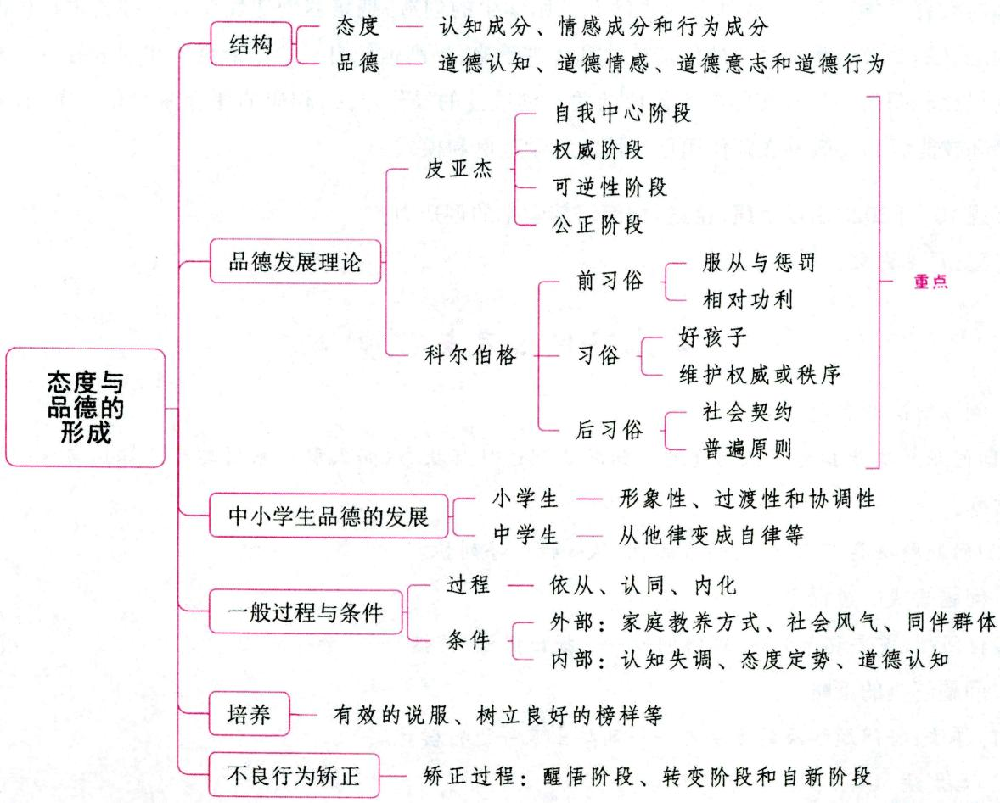  
第七节 态度与品德的形成

# 一、态度与品德概述

考点1 态度概述 ★【单选、判断】

# 1. 态度的实质

态度是通过学习而形成的、影响个人行为选择的内部准备状态或反应的倾向性。对于该概念,可以从几个方面来理解:(1)态度是一种内部准备状态,而不是实际反应本身。(2)态度不同于能力,虽然

二者都是内部倾向。能力决定个体能否顺利完成任务，态度则决定个体是否愿意完成任务。(3)态度是通过学习形成的，不是天生的。(4)态度总有一定的对象，它是包罗万象的，其对象可以是人，也可以是事。(5)态度具有价值判断的成分和感情色彩。(6)态度具有一定的稳定性与持续性，它一旦形成，就将持续一段时间，不轻易改变，这是态度的抗变性。

# 2. 态度的结构

态度的结构包括认知成分、情感成分和行为成分。(1)态度的认知成分是指个体对态度对象所具有的带有评价意义的观念和信念；(2)态度的情感成分是指伴随着态度的认知成分而产生的情绪或情感体验，是态度的核心成分；(3)态度的行为成分是指准备对某对象做出某种反应的意向或意图。例如，一个学生对数学的积极态度。其中的认知成分可能是在同学当中，数学成绩总是第一，这可以带来荣誉；情感成分可能是得第一名时获得的尊重需要的满足感，或者是解题顺畅时的兴奋感；行为成分意指这个学生偏爱数学的行动的预备倾向。一般情况下，这三种成分是一致的，但也有不一致的情况，如知行脱节等。

# 3. 态度的功能

# (1)卡茨和奥斯卡姆普的观点

卡茨和奥斯卡姆普等人认为，态度有四种基本功能。①适应功能。指人的态度都是在适应环境中形成的，形成后起着更好地适应环境的作用。②自我防御功能。态度作为一种自卫机制，能让人在受到贬抑时用来保护自己。③价值表现功能。在很多情况下，特有的态度常表示一个人的主要价值观和自我概念。④认识或理解功能。一种态度能给人一种建构事物的参照框架，因此它能引起意义感。

# (2) 张大均等人的观点

张大均等人认为态度具有四个功能：①过滤功能。态度不但影响个体行为的方向性，也会影响个体对信息的选择。②调节功能。人的某些态度具有直接满足情感需要的作用，态度会调节个体的语言行为和非语言行为。③价值表现功能。态度是学生价值观的一种反映。④适应功能。人的态度是在对外部环境的适应过程中逐渐形成的，反过来又起着适应外部环境的作用。如儿童在交往活动中学会了什么样的态度是会被同伴集体所接受的，那么反过来，这种态度又会让儿童去适应不同类型的集体的交往活动。

真题1 [2023辽宁营口，单选]学生小杰经常嘲讽同学，当他发现自己因此被同学们孤立时，他改掉了这种坏习惯。此处体现了态度的哪种功能（）

A. 过滤   
B. 调节   
C. 价值表现   
D. 适应

真题2 [2024江苏苏州, 判断]态度的核心成分是认知成分, 改变态度必须从改变认知入手。( )

答案：1.D 2.X

考点2 品德概述 ★★ 【单选、多选、判断】

# 1. 品德的实质

品德又称道德品质, 是个体依据一定的社会道德准则规范自己行动时所表现出来的稳定的心理倾向和特征。它是社会道德准则在个人思想与行动中的体现, 是个性中具有道德评价意义的核心部分。

品德具有以下特征：(1)以道德意识或道德观念的指导为基础；(2)与道德行为密切联系，离开了道德行为就无法表现和判断个人的道德；(3)具有稳定的倾向性。

# 2.品德的心理结构

品德的心理结构包括四种相辅相成的基本心理成分：道德认知、道德情感、道德意志和道德行为，简称知、情、意、行。

# (1) 道德认知

道德认知是指对于行为规范及其意义的认识,是人的认识过程在道德上的表现。道德认知是个体道德的基础,是道德情感、道德意志产生的依据,对道德行为具有定向的意义,是行为的调节机制。品德的核心是道德认知。

道德观念、道德信念的形成有赖于道德认知。当个体对某一道德准则有了系统的认识,感到确实是这样时,就形成了有关的道德观念。当认识继续深入,达到坚信不疑的程度,并能指导自己的行动时,就形成了道德信念。道德信念是推动个人产生道德行动的强大动力,可以使人的道德行动表现出坚定性,因此它是道德品质形成中的关键因素。道德信念对行为具有稳定的调节与支配作用,只有道德观念而无道德信念时,就会经常发生诸如明知故犯之类的错误行为。

# (2)道德情感

道德情感是人的道德需要是否得到实现所引起的一种内心体验，也就是人在心理上所产生的对某种道德义务的爱憎、喜恶等情感体验。道德情感渗透在人的道德观念和道德行为中。道德情感的内容主要包括爱国主义情感、集体主义情感、义务感、责任感、事业感、自尊感和羞耻感，其中，义务感、责任感和羞耻感对于儿童和青少年尤为重要。

道德情感从表现形式上看，主要包括三种：①直觉的道德情感，即由于对某种具体的道德情境的直接感知而迅速发生的情感体验；②想象的道德情感，即通过对某种道德形象的想象而发生的情感体验；③伦理的道德情感，即以清楚地意识到道德概念、原理和原则为中介的情感体验。伦理的道德情感具有清晰的意识性和明确的自觉性，具有较大的概括性和较强的伦理性，具有稳定性和深刻性。比如，爱国主义情感和集体主义情感属于伦理的道德情感。

# (3)道德意志

道德意志是个体自觉地调节道德行为,克服困难,以实现预定道德目标的心理过程。道德意志实际上是道德观念的能动作用,是个体通过自己理智的权衡作用去解决道德生活中的内心矛盾与支配行为的力量,这种力量表现为能够排除内部障碍和外部困难,坚决执行道德动机所引起的行为决定。

# (4)道德行为

道德行为是品德形成的最终环节,是指个体在一定的道德意识支配下表现出来的对他人和社会的有道德意义的活动。它是个体道德认知的外在表现,是实现道德动机的手段。道德行为是衡量道德品质的重要标志。道德行为包括道德行为技能和道德行为习惯,它们与一般的技能和习惯并无区别,只是在用来完成一定的道德任务时,便具有了道德的性质。实践证明,有的学生由于没有掌握恰当的道德行为技能,导致出现动机与效果不一致的现象,甚至会“好心办坏事”。持续不断的、稳定的道德行为才是一个人的道德品质。

# 3.道德与品德的关系

表 3-23 道德与品德的关系  

<table><tr><td></td><td>道德</td><td>品德</td></tr><tr><td rowspan="4">区别</td><td>依赖于整个社会的存在而存在的一种社会现象</td><td>依赖于某一个体的存在而存在的心理现象</td></tr><tr><td>发生和发展受社会发展规律的制约,具有明显的阶级性和历史性</td><td>不仅受社会环境的影响,还受个体生理、心理等内部因素的影响</td></tr><tr><td>社会道德内容是一定社会或阶级伦理行为规范的完整体系</td><td>个体品德内容只是社会道德准则或规范的部分表现</td></tr><tr><td>伦理学和社会学研究的对象</td><td>心理学和教育学研究的对象</td></tr><tr><td>联系</td><td colspan="2">(1)社会道德制约着个人品德,离开了道德也就谈不上个人品德,个人品德的内容是社会道德在个体身上的具体表现,即品德是道德的具体化;(2)品德是个人在社会生活中,主要在社会道德舆论、家庭成员与学校教育的影响下,通过自己的道德实践活动而形成、发展的;(3)个人品德对社会道德风气能产生一定的反作用,特别是优秀人物的品德,作为一种道德品质的典范,往往会对整个社会良好道德风气产生深远的影响</td></tr></table>

注：在考试中，除题目中明确要求区分品德与道德外，二者可以视作同一概念。

真题3 [2023广东清远, 单选]雷雷是家中的独子, 家人很宠溺他。这致使雷雷变得很任性, 面对困难的时候经常知难而退, 不能勇往直前。家长和教师应该首先培养雷雷的( )

A. 道德认识

B. 道德情感

C. 道德意志

D. 道德行为

真题4[2023广西贵港，单选]小学生常常出现“好心办坏事”的情况，其主要原因是（）

A. 缺乏合理行为技能

B. 道德情感不深

C. 道德认识不足

D. 道德意志不够

真题5 [2023安徽蚌埠，多选]品德的心理结构一般包括（）

A. 道德认知

B. 道德情感

C. 道德意志

D. 道德判断

E. 道德行为

真题6 [2024广东佛山, 判断]道德情感是衡量道德品质的重要标志。（）

答案：3.C 4.A 5.ABCE 6. $\times$

# 二、品德发展的阶段理论 ★★★ 【单选、多选、判断、判断选择、简答】

# 考点 1 皮亚杰的道德认知发展理论

瑞士著名心理学家皮亚杰早在20世纪30年代就采用“对偶故事法”对儿童道德判断的发展进行了系统的研究。

# 1. 儿童道德认知的发展：从他律到自律

皮亚杰通过大量研究,发现并总结出了儿童道德认知发展的总规律,即儿童道德的发展经历从他律到自律的转化发展过程。他律是指早期儿童的道德判断只注意行为的客观效果,不关心主观动机,是受自身以外的价值标准所支配的道德判断,具有客体性;自律则是指儿童自己的主观价值和主观标准所支配的道德判断,具有主体性。他律水平和自律水平是儿童道德判断的两级水平。儿童只有达到

自律的水平，才可能具有真正的道德品质。

在此基础上皮亚杰还提出了儿童道德发展的年龄阶段。他认为, 10 岁是儿童从他律道德向自律道德转化的分水岭, 10 岁前儿童对道德行为的思维判断主要依据他人设定的外在标准, 也就是他律道德; 10 岁以后儿童对道德行为的思维判断大多依据自己的内在标准, 也就是自律道德。在他看来, 一个人道德的成熟, 主要表现在尊重准则和社会公正感两方面。

# 2. 儿童道德认知的发展阶段

(1)自我中心阶段(前道德阶段)(2~5岁)

自我中心阶段是从儿童能够接受外界的准则开始的。这时期的儿童还不能把自己同外在环境区别开来，而把外在环境看作他自身的延伸。规则对于他来说，还不具有约束力。

(2)权威阶段（他律道德阶段或道德实在论阶段） $(5 \sim 8$ 岁）

① 该时期的儿童服从外部规则，接受权威指定的规范，把人们规定的准则看作固定的、不可变更的，而且只根据行为后果来判断对错。② 看待行为有绝对化的倾向；赞成严厉的惩罚，并认为受惩罚的行为本身就说明是坏的；还把道德法则与自然规律相混淆，认为不端的行为会受到自然力量的惩罚。

(3)可逆性阶段（自律或合作道德阶段）（8~10岁）

这一阶段的儿童已不把准则看成是不可改变的，而把它看作同伴间共同约定的。该阶段的特征是：儿童一般都形成了这样的概念，如果所有的人都同意的话，规则是可以改变的。儿童已经意识到一种同伴间的社会关系，应相互尊重。准则对他们来说已具有一种保证他们相互行动、互惠的可逆特征。同伴间的可逆关系的出现，标志着品德开始由他律进入自律阶段。儿童开始以动机作为道德判断的依据，认为公平的行为都是好的。关于惩罚，认为只有回报的惩罚才是合理的。

(4) 公正阶段（10~12岁）

这一阶段的公正观念是从可逆的道德认识中脱胎而来的。他们开始倾向于主持公正、公平等。公正的奖惩不能是千篇一律的，应根据个人的具体情况进行。也就是说，儿童不再刻板地按固定的规则去判断，在依据规则判断时应该考虑到同伴的一些具体情况，从关心和同情的角度出发去判断。

真题7 [2023河北石家庄，单选]小丽根据他人的具体情况，以平等的标准，在同情、关心的基础上对学习和生活中的道德事件进行判断，小丽的道德发展处于（）

A. 自我中心阶段

B. 权威阶段

C. 可逆性阶段

D. 公正阶段

真题8 [2024福建统考，判断选择]皮亚杰品德发展理论中，前道德阶段的儿童认为道德规则是绝对的、不可改变的。（）

A. 正确

B. 错误

答案：7.D 8.B

# 考点2 科尔伯格的道德发展阶段理论

科尔伯格系统地扩展了皮亚杰的理论和方法, 提出了人类道德发展的顺序原则。他认为道德发展与认识发展关系密切。道德发展是认识发展的一部分, 而道德判断能力与逻辑判断能力的发展有关, 后者为前者的必要条件。而且, 他认为社会环境对道德发展有巨大的刺激作用。他采用“道德两难故事法”进行研究, 最典型的就是用“海因茨偷

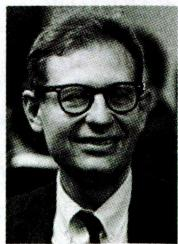  
科尔伯格

药”的故事让儿童对道德两难问题做出判断。科尔伯格将道德判断分为三个水平，每一水平包含两个阶段，这六个阶段依照由低到高的层次发展。

# 知识再拔高·

# 道德两难故事——海因茨偷药

欧洲有一位妇女患了癌症，生命危在旦夕。医生告诉她的丈夫海因茨，只有本城一个药剂师最近发明的一种药可以救他的妻子。但该药价钱十分昂贵，要卖到成本价的十倍。海因茨四处求人，尽全力也只借到了购药所需钱数的一半。万般无奈之下，海因茨只得请求药剂师便宜一点儿卖给他，或允许他赊账。但药剂师坚决不答应他的请求，并说他发明这种药就是为了赚钱。海因茨在走投无路的情况下，为了挽救妻子的生命，在夜间闯入药店偷了药，治好了妻子的病。但海因茨因此被警察抓了起来。

科尔伯格围绕这个故事提出了一系列问题，让被试参与讨论，如：海因茨该不该偷药？为什么该？为什么不该？海因茨犯了法，从道义上看，这种行为好不好？为什么？

# 1. 前习俗水平

前习俗水平大约出现在幼儿园及小学中低年级。该时期的特征是：个体着眼于人物行为的具体结果及其与自身的利害关系，认为道德的价值不决定于人及准则，而是决定于外在的要求。前习俗水平包括两个阶段：

(1) 服从与惩罚的道德定向阶段。这一阶段儿童的道德价值来自对外力的屈从或对惩罚的逃避。他们衡量是非的标准是由成年人来决定的，对成人或准则采取服从的态度，缺乏是非善恶的观念。他们会认为，海因茨不能去偷药，因为如果被人抓住的话会坐牢的。  
(2)相对功利的道德定向阶段 (相对功利取向阶段、朴素的利己主义的定向阶段)。这一阶段儿童的道德价值来自对自己要求的满足, 偶尔也来自对他人需要的满足。在进行道德评价时, 他们开始从不同角度将行为与需要联系起来, 但具有较强的自我中心性, 认为符合自己需要的行为就是正确的。他们会认为, 海因茨应该去偷药, 谁让那个药剂师那么坏, 便宜一点就不行吗。

# 2. 习俗水平

习俗水平是在小学中年级出现的，一直到青年、成年。这一阶段的特征是：个体着眼于社会的希望和要求，能够从社会成员的角度去思考道德问题；开始意识到人的行为必须符合群体或社会的准则；能够了解、认识社会行为规范，并遵守、执行这些规范。这一水平包括以下两个阶段：

(1)好孩子的道德定向阶段（寻求认可取向阶段、社会习俗的定向阶段、人际关系与补同的定向阶段）。这一阶段儿童的价值是以人际关系的和谐为导向，顺从传统的要求，符合大众的意见，谋求大家的称赞。他们认为行为的正确与否要看是否为别人喜爱或赞扬，舆论认可的和社会赞许的都是好行为，好的行为就是帮助别人、使别人愉快、受他人赞许的行为。在进行道德评价时，总是考虑到社会对一个“好孩子”的期望和要求，并总是按照这种要求去展开思维。他们会认为，海因茨应该去偷药，因为一个好丈夫就应该照顾好自己的妻子。如果他不这样做，结果妻子死了，别人都会骂他见死不救，没有良心。  
(2) 维护权威或秩序的道德定向阶段（遵守法规取向阶段、秩序和法规定向阶段）。这一阶段儿童的道德价值是以服从权威为导向，包括服从社会规范，遵守公共秩序，尊重法律的权威，以法制观念判断是非、知法守法。他们认为准则和法律是维护社会秩序的，因此，应当遵循权威和有关规范去行动。

儿童会认为，海因茨不应该去偷药，因为如果人人都违法去偷东西的话，社会就会变得很混乱。

# 3.后习俗水平

该时期的特点是：个体不只是自觉遵守某些行为规则，还认识到法律的人为性，并在考虑全人类的正义和个人尊严的基础上形成某些超越法律的普遍原则。这一水平包括以下两个阶段：

(1) 社会契约的道德定向阶段（社会法制取向阶段、社会契约取向阶段）。这一阶段仍以法制观念为导向，有强烈的责任心和义务感，但不再把社会规则和法律看成是死板的、一成不变的条文，而认识到了它们的人为性和灵活性，他们尊重法制但不拘泥于法律条文，认为法律是人制定的，不合时宜的条文可以修改。也就是说，他们认识到法律或习俗的道德规范仅仅是一种社会契约，它由大家商定，可以改变，而不是固定僵死的。他们会认为，海因茨应该去偷药，因为一个人生命的价值远远大于药剂师对个人财产的所有权。

(2)普遍原则的道德定向阶段（原则或良心定向阶段、良心或普遍原则定向阶段、普遍伦理取向阶段）。这一阶段以价值观念为导向，有自己的人生哲学，对是非善恶的判断有独立的价值标准，思想超越了现实道德规范的约束，行为完全自律。由于认识到了社会秩序的重要性与维持这种共同秩序所带来的弊病，看到了社会准则与法律的界限性，所以在进行道德评价时，能超越以前的社会契约所规定的责任，而且是以正义、公平、平等、尊严等这些最高的原则为标准进行思考，以普遍的标准来判断人们的行为。他们认为，海因茨应该去偷药，因为和种种可考虑的事情相比，没有什么比人类的生命更有价值。

表 3-24 科尔伯格的道德发展阶段理论  

<table><tr><td>水平</td><td>阶段</td><td>特点</td></tr><tr><td rowspan="2">前习俗水平</td><td>服从与惩罚的道德定向</td><td>道德价值来自对外力的屈从或对惩罚的逃避</td></tr><tr><td>相对功利的道德定向</td><td>道德价值来自对自己要求的满足，偶尔也来自对他人需要的满足</td></tr><tr><td rowspan="2">习俗水平</td><td>好孩子的道德定向</td><td>以人际关系的和谐为导向</td></tr><tr><td>维护权威或秩序的道德定向</td><td>以服从权威为导向</td></tr><tr><td rowspan="2">后习俗水平</td><td>社会契约的道德定向</td><td>不再把社会规则和法律看成是死板的、一成不变的条文</td></tr><tr><td>普遍原则的道德定向</td><td>以正义、公平、平等、尊严等这些最高的原则为标准进行思考</td></tr></table>

真题9 [2024江苏南通, 单选]一个司机为了救人, 送人去医院, 然后闯了红灯。事后, 交警对他追加罚款, 学生张涛认为救人而闯红灯不应该开罚单, 根据科尔伯格的道德发展理论, 张涛同学的道德发展可能处于( )

A. 前习俗水平  
B. 习俗水平  
C. 超习俗水平   
D. 后习俗水平

真题10 [2024浙江宁波，单选]根据科尔伯格的道德发展理论，下列说法错误的是（）

A.科尔伯格根据儿童对道德两难问题的判断，把道德认知发展分为三个水平和六个阶段   
B. 处于前习俗水平的儿童的主要特征是避免惩罚, 判断好坏的标准是是否符合自身利益  
C. 处于习俗水平的儿童会谋求别人的赞赏和认可  
D. 处于后习俗水平的儿童认为法律是不可改变的

答案：9.D 10.D

# 三、中小学生品德的发展

# 考点1 小学生品德的发展

小学阶段是品德发展的奠基阶段,是良好行为习惯养成的最佳时期。小学生品德的发展具有明显的形象性、过渡性和协调性。

(1)良好行为习惯（自觉纪律）的养成

良好行为习惯(自觉纪律)的养成在小学生品德的发展中占据显著地位。在小学生品德的发展中，形成良好的行为习惯，既是小学德育的重要目标，也是小学德育最有效的手段和方法，小学阶段是良好行为习惯养成的关键期。

(2)小学生品德发展的形象性

小学生的品德尽管在原则性、抽象概括性上有了一定程度的发展，但在很大程度上带有生活经验的特点，容易受到行为情境的制约，离不开直观的感性形象的支持，带有明显的形象性，处于由具体形象性到抽象逻辑性发展的过程中。

(3)小学生品德发展的过渡性

小学生品德发展的过渡性主要体现在：由简单、低级向复杂、高级过渡，由具体形象向抽象概括过渡，由生活适应性水平向伦理性水平过渡，由依附性向独立性过渡，由他律向自律过渡，由服从向习惯过渡。过渡性是小学生品德发展的基本特征之一，它表现在品德心理各要素的发展中。

小学阶段的品德过渡性特点，是品德发展过程中的质变的具体表现，在这个过程中，存在着一个转折期，即儿童品德发展的“关键年龄”。研究结果认为这个关键期大致在小学三年级下学期前后，但是由于教育工作上的差异，前后有一定的出入。

(4)小学生品德发展的协调性

小学生品德发展的协调性表现为密切相关的两个方面：

①品德心理各种成分之间的协调。就整个小学阶段而言，道德认知与道德行为、道德认知与道德情感的发展等是协调的、一致的。年龄越小，各成分之间越一致，随着年龄的增长，言与行之间、行为与动机之间逐渐出现矛盾和不一致。这种不一致反映了过渡期小学生品德心理发展的幼稚性、不成熟性，也反映了小学生品德结构发展的不稳定性。

②主观愿望与外部要求、约束的协调。

# 考点2 中学生品德的发展

(1)逐渐从他律变成自律, 伦理道德发展具有自律性, 言行一致

①能独立、自觉地按道德准则来调节自身行为；②形成道德信念和道德理想，道德信念、理想在道德动机中占据相当地位；③道德情感发展，理性的道德情感占据主导地位，道德情感的社会性水平随着年龄的增长而日益提高；④品德心理中自我意识明显化；⑤中学生主导性道德动机明确，道德意志力有显著增长；⑥道德行为习惯逐步巩固；⑦品德发展与世界观形成的一致性；⑧品德结构的组织形式完善化。

(2)品德发展由动荡向成熟过渡

①初中阶段品德发展具有动荡性。从总体上看, 初中即少年期的品德虽然具有伦理道德的特性,但仍不成熟, 起伏不定。这一时期既是人生观开始形成的时期, 又是容易发生品德两极分化的时期。

品德不良、违法犯罪多发生在这个时期。根据研究，初中二年级是品德发展的关键期。

②高中阶段品德发展趋向成熟。高中阶段或青年初期的品德发展进入以自律为主要形式、应用道德信念来调节道德行为的成熟时期，表现在能自觉地运用一定的道德观点、信念来调节行为，并初步形成人生观和世界观。

总体来看，初中生的伦理道德已经开始形成，但具有两极分化的特点。高中生的伦理道德的发展具有成熟性，可以比较自觉地运用一定的道德观念、原则、信念来调节自己的行为。

# 四、态度与品德学习的一般过程与条件 ★★ 【单选、多选、填空】

亲历学习与观察学习是品德学习的两种方式。亲历学习指个体通过直接体验其行为后果而进行的学习。相比较而言, 观察学习是学习态度的最有效的方式。

# 考点1 态度与品德学习的一般过程

态度与品德的形成是一个从外到内的转化过程，是社会规范的接受和内化，大致经历三个阶段：

(1) 社会规范的依从。依从, 即表面上接受规范, 按照规范的要求来行动, 但对规范的必要性或根据缺乏认识, 甚至有抵触情绪。它是规范内化的初级阶段, 是态度与品德建立的开端。依从包括从众和服从两种。依从阶段的行为具有盲目性、被动性、不稳定性, 随情境的变化而变化。  
(2) 社会规范的认同。认同是在思想、情感、态度和行为上主动接受他人的影响，使自己的态度和行为与他人相接近。认同实质上就是对榜样的模仿，其出发点就是试图与榜样一致，包括偶像认同和价值认同。与依从相比，认同更深入一层，它不受外界压力的控制，行为具有一定的自觉性、主动性和稳定性等特点。  
(3)内化（社会规范的信奉）。信奉是内化的最高阶段，是学习者对社会规范及其价值原则有了深刻的理解，并持有积极的情感体验，使之成为自己的一种信念，与原有的价值观念一体化。内化是指在思想观点上与社会规范及其价值一致，将自己所认同的思想和自己原有的观点、信念融为一体，构成一个完整的价值体系。在内化阶段，个体的行为具有高度的自觉性和主动性，并具有坚定性，表现为“富贵不能淫，贫贱不能移，威武不能屈”。此时，稳定的态度和品德便形成了。

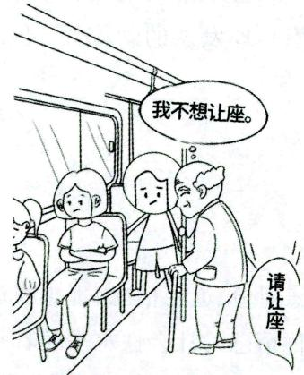  
依从阶段

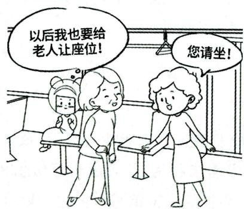  
认同阶段

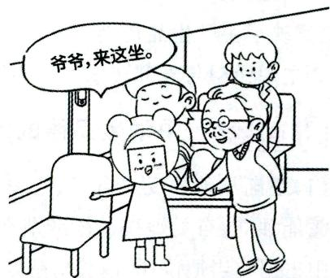  
内化阶段

# 小香课堂·

区分态度与品德的形成阶段时，应注意：依从阶段强调表面遵守，即阳奉阴违；认同阶段强调与他人(榜样)保持一致；内化阶段强调价值体系已完善。

真题11 [2024河南事业单位，单选]“一盔一带”交通安全是指骑摩托车或电动自行车时必须佩戴安全头盔，驾驶机动车时驾驶员及乘坐人员必须全程系好安全带。小王同学每次骑电动自行车上下学经过路口看到交警检查时才会佩戴头盔，只要没有交警检查，从不主动戴头盔。小王对“一盔一带”交通安全知识的内化水平处于（）

A.认同阶段

B. 依从阶段

C. 信奉阶段

D. 抵触阶段

真题12 [2024河北石家庄, 单选]在公交车上, 小华看到一位大哥哥给老人让座, 她默默地想: 长大后, 我要向这位大哥哥学习, 尊老爱幼, 主动为老人让座。此时, 小华处于社会规范学习中的( )阶段。

A. 依从

B. 认同

C. 信奉

D. 内化

答案：11.B 12.B

# 考点2 影响态度与品德学习的一般条件

# 1.外部条件

# (1)家庭教养方式

研究表明，学生的态度与品德特征和家庭的教养方式有密切关系。若家庭教养方式是民主、信任、容忍，则有助于儿童的优良态度与品德的形成与发展。若家长对待子女过分严格或放任，则孩子更容易产生不良的、敌对的行为。

# (2)社会风气

社会风气由社会舆论、大众媒介传播的信息、各种榜样的作用等构成。社会上的良好与不良的风气都有可能影响学生道德信念与道德价值观的形成，这也使得德育工作难度加大。

# (3)同伴群体

学生的态度与道德行为在很大程度上受到他们所归属的同伴群体的行为准则和风气的影响。

# 2. 内部条件

# (1)认知失调

勒温、皮亚杰、费斯廷格和海德等人的研究都表明，人类具有一种维持平衡和一致性的需要，即力求维持自己的观点、信念的一致，以保持心理平衡。当认知不平衡或不协调时，如新出现的事物与自己原有的经验不一致，或者自己的观点与他人的、社会的观点或风气不一致等，这时内心就会有不愉快或紧张的感受，个体就试图通过改变自己的观点或信念，以达到新的平衡。可以说，认知失调是态度改变的先决条件。

# (2) 态度定势

个体由于过去的经验，对所面临的人或事可能会具有某种肯定或否定、趋向或回避、喜好或厌恶等内心倾向性，这种事先的心理准备或态度定势常常支配着人对事物的预料与评价，进而影响着是否接受有关的信息和接受的量。假如学生对教师有消极的态度定势，则教师的教诲与要求可能会成为耳旁风，甚至引发冲突。帮助学生形成对教师、对集体的积极的态度定势或心理准备是使学生接受道德教育的前提。

# (3)道德认知

态度与品德的形成与改变取决于个体头脑中已有的道德准则、规范的理解水平和掌握程度，取决于

于已有的道德判断水平。

此外，个体的智力水平、受教育程度、年龄等因素也对态度与品德的形成与改变有不同程度的影响。

# 记忆有妙招·

为方便考生记忆，编者将影响态度和品德学习的一般条件总结成以下口诀：

外家社群，内认定德。外：外部条件。家：家庭教养方式。社：社会风气。群：同伴群体。内：内部条件。认：认知失调。定：态度定势。德：道德认知。

真题13 [2024河北石家庄，多选]影响态度与品德学习的外部条件有（ ）

A. 社会风气

B.同伴群体

C. 态度定势

D. 家庭教养方式

答案：ABD

# 五、态度与品德的培养 ★【单选、多选、论述】

教师可以综合应用一些方法来帮助学生形成或改变态度与品德。常用的方法有言语说服、榜样示范、群体约定、价值辨析、奖惩等。具体来讲，有以下几种方法：

# 1.有效的说服

有效的说服是提高道德认知的途径。用言语说服学生需要一些技巧，主要有以下几种：

(1) 有效地利用正反论据。对于理解能力有限的低年级学生, 教师最好只提供正面论据, 以免学生产生困惑、无所适从。对于理解能力较强的高年级学生, 教师可以考虑提供正反两方面的论据, 使学生产生客观、公正的感觉, 从而相信教师所言, 改变态度。当学生没有相反的观点时, 教师应只呈现正面观点, 不宜提出反面观点, 以免转移学生的注意, 误导学生怀疑正面观点。当学生原本就有反面观点时, 教师应主动呈现两方面观点, 以增强学生对错误观点的免疫力。当说服的任务是解决当务之急的问题时, 应只提出正面观点, 以免延误时间; 当说服的任务是培养学生长期稳定的态度时, 应提出正反两方面的材料。

(2)发挥情感的作用，不仅要以理服人，更要以情动人。  
(3)考虑原有态度的特点。

# 2. 树立良好的榜样

这是加强道德行为的途径。根据班杜拉的社会学习理论，榜样在观察学习过程中起着非常重要的作用，榜样的特点、示范的形式及榜样所示范的行为的性质和后果都会影响到观察学习的效果。

# 3. 利用群体约定

教师可以利用集体讨论后做出的集体约定，来改变学生的态度。

# 4. 价值辨析

价值辨析是指引导个体利用理性思维和情绪体验来检查自己的行为模式，鼓励他们努力去发现自身的价值观并指导自己的道德行为。

# 5. 给予适当的奖励和惩罚

奖励和惩罚作为外部调控手段,不仅影响着认知、技能和策略的学习,而且对个体道德的形成也起

到一定的作用。奖励有物质的,也有精神的;有内部的,也有外部的。给予奖励时,应注意:(1)要选择确定可以得到奖励的道德行为。一般来讲,应奖励诸如爱护公物、拾金不昧、尊老爱幼等一些具体的道德行为,而不是奖励一些概括性的行为。(2)应选择恰当的奖励物。同一奖励物,其效用可能因人而异,应考虑个体的实际情况,选用最有效的奖励物。(3)应强调内部奖励。外部的物质奖励只是权宜之计,不可过多使用,应引导学生进行自我强化,让学生亲身体验做出道德行为后的愉快感、自豪感、欣慰感,以此转化为产生道德行为的持久的内部动力。

虽然对惩罚的教育效果有不同的看法, 但从抑制不良行为的角度来看, 惩罚还是有必要的, 也是有助于良好的道德形成的。当不良行为出现时, 可以用两种惩罚方式: 一是给予某种厌恶刺激, 如批评、处分、舆论谴责等; 二是取消个体喜爱的刺激或剥夺某种特权等, 如不许参加某种娱乐性活动。应严格避免体罚或变相体罚, 否则, 将损害学生的自尊, 或导致更严重的不良行为, 如攻击性行为。惩罚不是最终目的, 给予惩罚时, 教师应让学生认识到惩罚与错误行为的关系, 使学生从心理上能接受, 口服心服。同时, 还要给学生指明改正的方向, 或提供正确的、可替代的行为。

除上述所介绍的各种方法外，角色扮演、小组道德讨论等方法对于态度与品德的形成和改变都是非常有效的。

# ·记忆有妙招·

为方便考生记忆，编者将态度与品德的培养方式总结成以下口诀：

嫁给有理数。嫁：价值辨析。给：给予适当的奖励和惩罚。有：有效的说服。理：利用群体约定。数：树立良好的榜样。

# 知识再拔高·

# 态度形成与改变及品德培育的方法

(1) 态度形成与改变的方法。教师可以综合运用一些方法来帮助学生形成或改变某种态度。通常可应用的方法有提供榜样法、说服性沟通法、角色扮演法等。  
(2)品德培育的基本方法。学生的优良品德不是自发形成的，而是在人与人、人与群体、人与社会错综复杂的相互作用中形成和发展的。这一过程也经历了由简单到复杂、由低级到高级的矛盾运动。许多因素在此过程中发挥了作用，而品德培育就是对各种影响进行选择与调控，力求创设一种良好的环境和条件，使学生向社会所期望的方向发展。常用的品德培育的方法主要有以下几种：条件反应法、自我强化法、价值辨析法、群体讨论法、移情训练法和习惯养成法等。

真题14 [2023广西百色，单选]谭老师与学生一起讨论“校园霸凌的危害”，随后全班同学形成了“拒绝校园霸凌”的认识并共同提出了相应的要求。这种品德培养方法是（）

A. 言语说服

B. 树立榜样

C. 群体约定

D. 价值辨析

真题15 [2024广东佛山，多选]下列选项中，属于态度改变的方法的有（）

A. 提供榜样法

B. 条件反应法

C. 说服法

D.角色扮演法

答案：14.C 15.ACD

# 六、学生不良行为的矫正 ★【论述】

# 1. 过错行为与不良品德行为的概念

学生的不良行为可分为过错行为与不良品德行为两种。学生的过错行为是指那些不符合道德要求的问题行为，如调皮捣蛋、恶作剧、起哄、无理取闹等。学生的不良品德行为则是指那些由错误道德意识支配的，经常违反道德准则，损害他人或集体利益的问题行为。国内外一些统计数据表明，13～15岁是初犯品德不良或初犯劣迹行为的高峰年龄，15～18岁是青少年犯罪的高峰年龄。

# 2. 学生不良行为的原因分析

客观方面，学生不良行为产生的原因来自家庭、学校和社会环境三个方面：(1)家庭教育失误；(2)学校教育不当；(3)社会文化的不良影响。

主观方面，学生的不良行为主要受以下因素的影响：(1)缺乏正确的道德观念和道德信念；(2)消极的情绪体验；(3)道德意志薄弱；(4)不良行为习惯的支配；(5)性格上的缺陷等。

# 3. 学生不良行为矫正的基本过程及策略

学生不良行为的矫正是一项复杂的工作,其效果取决于教育时机的选择和对众多教育因素的控制。分析和理解其矫正的心理过程,有利于选择矫正措施,提高矫正的效果。一般认为,学生不良行为的矫正要经历醒悟阶段、转变阶段和自新阶段三个过程。

对学生的不良行为要及早矫正，在矫正时要以正面教育和疏导为主，工作要有诚心、细心和耐心。下面介绍一些矫正的心理学策略：(1)改善人际关系，消除疑惧心理和对立情绪；(2)保护自尊心，培养集体荣誉感；(3)讲究谈话艺术，提高道德认知；(4)锻炼与诱因做斗争的毅力，巩固新的行为习惯；(5)注重个别差异，运用教育机智。

# 小香课堂·

过错行为和不良品德行为本质不同，考生可以根据下面的关键词进行区分：

过错行为强调不符合道德要求；不良品德行为强调损害他人或集体利益。

真题16 [2022湖北武汉，论述]试论述学生不良行为纠正的基本过程及策略。

答案：详见内文

# ★ 本节核心考点回顾 ★

# 1.品德的心理结构

(1)道德认知（知）：个体对于行为规范及其意义的认识，是人的认识过程在道德上的表现，是品德的核心。  
(2)道德情感（情）：人的道德需要是否得到实现所引起的一种内心体验，也就是人在心理上所产生的对某种道德义务的爱憎、喜恶等情感体验。  
(3)道德意志(意):个体自觉地调节道德行为,克服困难,以实现预定道德目标的心理过程。  
(4)道德行为（行）：个体在一定的道德意识支配下表现出来的对他人和社会的有道德意义的活动，是衡量道德品质的重要标志。

2. 皮亚杰的道德发展阶段理论

(1) 自我中心阶段（2~5岁）：规则对其还不具有约束力。  
(2) 权威阶段 $(5 \sim 8$ 岁): 服从外部规则, 认为规则不可变更并以行为后果来判断对错。  
(3)可逆性阶段 $(8\sim 10$ 岁）：规则是可变的，并把它看作同伴间共同约定的。  
(4)公正阶段（ $10\sim 12$ 岁）：倾向于主持公正、公平等。

3.科尔伯格的道德发展阶段理论

(1)前习俗水平

①服从与惩罚的道德定向阶段——逃避惩罚；  
②相对功利的道德定向阶段——满足自身需求。

(2)习俗水平

①好孩子的道德定向阶段——谋求大家的称赞；  
②维护权威或秩序的道德定向阶段——服从权威、服从规范、遵守秩序。

(3)后习俗水平

(1) 社会契约的道德定向阶段——以法制观念为导向, 但认为法律可以修改;  
②普遍原则的道德定向阶段——以价值观念为导向。

4. 态度与品德学习的一般过程

(1)依从：表面上接受规范。  
(2)认同：使自己的态度和行为与他人相接近；试图与榜样一致。  
(3)内化：将自己所认同的思想和自己原有的观点、信念融为一体，构成一个完整的价值体系。

5. 影响态度与品德学习的一般条件

(1)外部条件: 家庭教养方式、社会风气、同伴群体。  
(2)内部条件：认知失调、态度定势、道德认知。

6. 态度与品德的培养方式

(1)有效的说服；(2)树立良好的榜样；(3)利用群体约定；(4)价值辨析；(5)给予适当的奖励和惩罚。

# 第五章 教学心理

# 本章学习指南

# 一、考情概况

本章属于教育心理学的基础章节，知识点内容琐碎、考查范围广泛，考生可带着以下学习目标进行备考：

1. 掌握并区分教学目标的分类，了解教学目标的特点。  
2. 区分可供选择的教学策略。  
3. 识记教学策略设计和教学评价设计的内容。  
4. 了解课堂管理的基本内容。  
5. 理解课堂管理的影响因素及基本模式。  
6. 掌握课堂群体管理及课堂纪律管理的相关内容。

# 二、考点地图

<table><tr><td>考点</td><td>年份/地区/题型</td></tr><tr><td>教学目标的分类</td><td>2024河北单选;2023广西单选;2023黑龙江单选;2023吉林多选;2022天津单选;2022山西单选;2022江苏单选</td></tr><tr><td>可供选择的教学策略</td><td>2024江苏单选、填空;2023河北单选;2023黑龙江单选;2023天津单选;2022山西判断</td></tr><tr><td>教学评价设计</td><td>2023广东单选;2023天津多选、判断;2023江苏判断;2022广东判断;2022浙江判断</td></tr><tr><td>影响课堂管理的因素</td><td>2024江苏简答;2023内蒙古单选;2022天津判断;2022江苏简答</td></tr><tr><td>课堂群体管理</td><td>2024河北单选;2024福建多选;2024浙江判断;2023江苏单选;2023广东多选、判断;2023河北判断</td></tr><tr><td>课堂纪律管理</td><td>2024广东单选;2024河北单选、判断;2023河北单选;2023辽宁单选;2023广东多选;2022湖南单选;2022广东论述</td></tr></table>

注：上述表格仅呈现重要考点的相关考情。

# 国核心考点

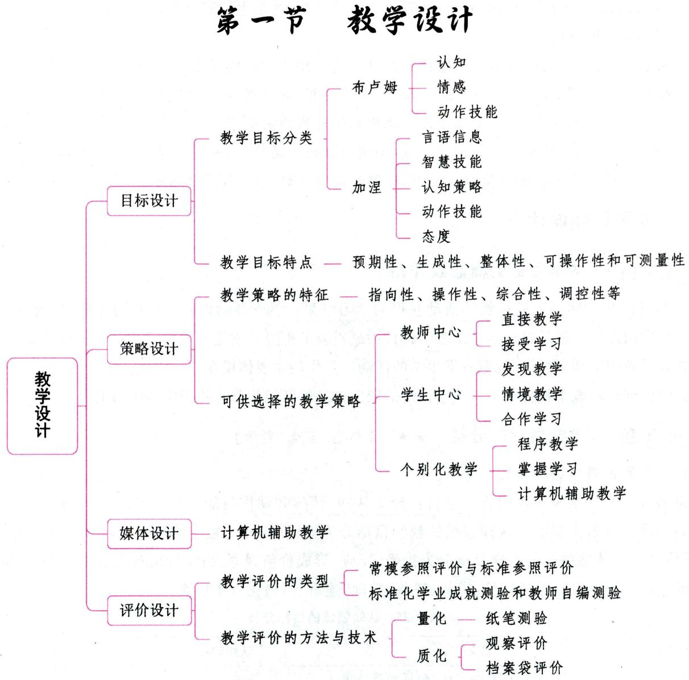

# 一、教学设计的含义、依据及分类

# 1. 教学设计的含义

教学设计是指在实施教学之前由教师对教学目标、教学方法、教学评价等进行规划和组织并形成设计方案的过程。

教学设计综合了教学过程的基本要素，如教学目标、教学内容、教学对象、教学策略、教学评价等，对教学过程用系统论的观点加以模式化和程序化。教学设计既是每位教师都要完成的一项教学的基本环节，又是教育心理学研究的基本内容之一。教学设计意图是规定最佳的教学方案，旨在达到预期教学成果的最优化。

教学设计的主要功能是导教和促学。教师通过科学可行的教学设计，可减少教学的盲目性和失控性，避免教学的低效性，提高教学的稳定性和效率。

# 2. 教学设计的依据

(1)理论依据：①现代教学理论、学习理论与传播理论；②系统科学的原理和方法。  
(2)现实依据：①教学的实际需要；②教师的教学经验；③学生的需要和特点等。

# 3. 教学设计的分类

依据教学设计的内容，可将教学设计分为：（1）以策略为中心的教学设计。这类教学设计主要指向教学策略或学习策略，如创新教育、愉快教育、合作教育、和谐教育等。（2）以媒体为中心的教学设计。例如，课件的设计、教具的制作、多媒体组合优化教学过程的实验等。（3）以系统为中心的教学设计。例如，一个地区心理健康教育系统的设计、中心小学的教研活动计划、一所新型学校或一门新专业的课程设置等。（4）以课堂为中心的教学设计。例如，课时教学计划、单元教学计划等。

# 二、教学目标设计

# 考点1 教学目标的概念及作用

教学目标是预期学生通过教学活动获得的学习结果。教学活动以教学目标为导向，且始终围绕实现教学目标而进行。教学目标是整个教学设计中最重要的部分。它是对教学活动提出的具体要求，不仅规范着教师教的活动，而且也规范着学生学的活动。其作用主要体现在三个方面：(1)教学目标是选择教学方法的依据；(2)教学目标是进行教学评价的依据；(3)教学目标具有指引学生学习的作用。

# 考点2 教学目标的分类 ★★ 【单选、多选、判断】

# 1.布卢姆的教学目标分类

美国教育心理学家布卢姆将教学目标分为认知、情感和动作技能三个领域, 每一领域的目标又从低级到高级分成若干层次。认知领域的教学目标分为知识 (知道)、领会 (理解)、应用 (运用)、分析、综合、评价六级。情感领域的教学目标分为接受、反应、形成价值观念、组织价值观念系统、价值体系个性化五级。动作技能目标包括知觉、模仿、操作、准确、连贯、习惯化六个层次。

表 3-25 认知领域的目标分类  

<table><tr><td>学习水平</td><td>定义</td><td>认知动词</td><td>举例</td></tr><tr><td>知识
(知道)</td><td>对先前学习过的材料的记忆,包括对具体事
实、方法、过程、概念和原理的回忆,是最低
水平的认知学习结果</td><td>记住、背出、说出、再认、列举、复述等</td><td>回忆杜甫的诗“烽火
连三月”</td></tr><tr><td>领会
(理解)</td><td>把握所学材料的意义,代表最低水平的理解</td><td>转换、改写、举例、说明、解释、归
纳、摘要、推断等</td><td>用自己的话表述“烽火
连三月”;对文章大意
的概括</td></tr><tr><td>应用
(运用)</td><td>将所学材料应用于新的情境之中,包括概
念、规则、方法、规律和理论的应用,代表较
高水平的理解</td><td>解答、解决、证明、操作等</td><td>学习了加减法之后,
学生能到模拟商店自由购物</td></tr><tr><td>分析</td><td>将整体材料分解成其构成成分,并理解其组
织结构,包括要素的分析、关系的分析和组
织原理的分析,代表了一种较高层次的认知
学习</td><td>指出、找出、识别、区别、分类、分
析等</td><td>区分新闻报道中的
事实、观点</td></tr><tr><td>综合</td><td>将所学的零碎知识整合为知识系统</td><td>归类、总结、创作、拟定、设计、编制等</td><td>写作或发表演说;给定一些事实材料,写出一篇报道</td></tr><tr><td>评价</td><td>对所学材料做价值判断的能力,包括按材料内在的标准或外在的标准进行价值判断。代表最高水平的认知学习结果</td><td>评定、评判、评价、鉴别、欣赏、比较、选择、反驳等</td><td>评定两篇有关某一事件的报道中的哪一篇较为真实可信</td></tr></table>

# 2. 加涅的分类

加涅将学生的学习结果或教学目标分为五类：言语信息、智慧技能、认知策略、动作技能和态度。加涅的教学目标分类被公认为具有处方性，因为这种分类不仅是条目的说明，还进一步告诉教师怎样设置情境去达成预定的教学目标。加涅还特别强调了与实现学生的学习结果密切相关的学习的内在条件。

真题1[2024河北石家庄，单选]课堂上，韩老师组织学生对课前所搜集的众多新闻报道中的事实和观点进行识别和区分。按照布卢姆的教学目标分类理论，韩老师的做法属于（）

A. 领会层次

B. 应用层次

C. 分析层次

D. 综合层次

真题2 [2022天津北辰, 单选]认知领域的教学目标可以分为从低到高的六个层次: 知道一领会一应用一分析一综合一评价。据此, 教学目标“简要概括一段文字的大意”所涉及的层次是 ( )

A. 领会

B. 应用

C. 分析

D. 评价

答案：1.C 2.A

# 考点3 教学目标的特点 ★【单选】

(1)教学目标的预期性。教学目标是在当下基础上指向于未来时空的一种结果，因此教学目标的预期性是内在于该概念当中的，它使师生能够很好地把握教学过程，从而在动态的教学过程当中实现教学目标。  
(2)教学目标的生成性。教学目标虽然是对教学结果的一种预测，但是，这种预测并不是一成不变、固定僵死的，而是在对教学结果有个大概的预测框架内保留一定的生成空间。  
(3)教学目标的整体性。不管是国外还是国内，诸多学者在进行教学目标研究的时候无不把教学目标作为一个整体进行分析。  
(4)教学目标的可操作性和可测量性。教学目标是符合具体的班级、学生、教师的实际情况的，是可以通过教学活动的展开而得以实现的，具有相当程度的可操作性。通常在表述教学目标的时候，人们往往喜欢借助于行为动词来表达，并且在有些情况下教学目标的实现与否是可以通过一些可测量的行为来观察的。但是，并不是所有的教学目标都必须通过可操作、可测量的方式来检测，外显的可测量的行为未必是教师和学生内在真实的所思所想。

真题3 [2023黑龙江哈尔滨，单选]对教学结果的预测必须预留一定的空间，这表明教学目标具有（）

A. 准确性

B. 个体性

C. 整体性

D. 生成性

答案：D

# 考点4 教学目标的陈述

教学目标设计的前提是教学目标的明确化。教学目标的明确化是陈述教学目标的基本要求，需要做到：(1)教学目标要用可观察的行为来陈述，使教学目标具有可操作性；(2)教学目标的陈述要反映学生行为的变化，陈述学生的学习结果。依据这两点，下面具体介绍两种教学目标的陈述方法。

# 1.行为目标陈述法

行为目标也称操作目标，是指用可观察和可测量的学生行为来陈述的目标。它描述的是学生的行为，而不是教师的行为。马杰认为，陈述良好的教学目标应该具备三个要素：(1)具体目标。即用可观测的行为术语说明通过教学后学生能做什么或说什么。(2)产生条件。指规定学生产生行为的条件。即说明学生要在什么情况下表现行为，又该在什么情况下来评定学习结果。(3)行为标准。即规定符合要求的作业标准，通常也是衡量学习结果的最低要求。

# 2. 心理与行为相结合的目标陈述法

行为目标强调行为结果而未注意内在的心理过程。为了弥补行为目标的不足，可用心理与行为相结合的方式来陈述教学目标，即先陈述内部心理过程的目标，然后列出表明这种内部心理变化的可观察的行为样例，使目标具体化。

# 考点5 教学任务的分析 ★【单选】

任务分析与目标陈述是教学设计中两个彼此关联的环节。任务分析指在教学活动开始之前，预先将教学目标逐级细分成彼此相联的各种子目标的过程。

教学目标的陈述只规定完成一定的教学活动之后，学生应获得的学习结果及其类型，并没有说明这些学习结果是怎样得来的。任务分析则要进一步揭示最终教学目标得以实现的条件。

# 三、教学策略设计

# 考点1 教学策略的概念

教学策略指教师采取的有效达到教学目标的一切活动计划，包括教学事项的顺序安排、教学方法的选用、教学媒体的选择、教学环境的设置以及师生相互作用设计等。在教学中，由于教学目标、课题特点以及所持学习理论取向不同，教师将会以不同方式来组织教学事项的程序结构，并采取相应的教学方法、媒体以及环境来实现这一程序。

教学策略不同于教学方法。教学方法是为了完成教学任务，教师的教和学生的学的相互作用所采取的方式、手段和途径。教学方法是更为详细具体的方式、手段和途径，它是教学策略的具体化，介于教学策略与教学实践之间，教学方法受制于教学策略。教学展开过程中选择和采用什么方法，受教学策略支配。教学策略在层次上高于教学方法。教学方法是具体的、可操作的。教学策略则包含监控、反馈等内容，在外延上要大于教学方法。

# 考点2 教学策略的特征 ★【单选】

(1)指向性。任何教学策略都指向特定的问题情境、特定的教学内容、特定的教学目标，规定着师生的教学行为。  
(2)操作性。任何教学策略都是针对教学目标的每个具体要求而制定的，具有与之相对应的方法、

技术和实施程序，它要转化为教师与学生的具体行动。这就要求教学策略必须是可操作的。

(3)综合性。教学策略包括教学活动的元认知过程、教学活动的调控过程和教学方法的执行过程。这三个过程并不是彼此割裂的，而是相互关联的一个整体，彼此之间相互作用，每一个过程依据其他两个过程而做出相应的规定和变化。  
(4)调控性。由于教学活动元认知过程的参与，教学策略具有调控的特性。  
(5)灵活性。教学策略不是“万金油”式的“教学处方”，不存在一个能包揽一切的大而全的教学策略。同一策略可以解决不同的问题，不同的策略也可以解决相同的问题。这就说明了教学策略具有灵活性。  
(6)层次性。教学具有不同的层次，不同的教学层次就有不同的达到教学目的的手段和方法，也就有不同的教学策略。不同层次的教学策略具有不同的适用条件和范围，具有不同的功能，不能相互代替。

# 考点3 教学策略的主要类型

分析目前国内外的教学策略研究现状可以发现，教学策略的制定一般是以教学过程的某个主要构成因素为中心建立框架的，然后将其他相关要素有机地依附于这个中心，形成一类相对完整的教学策略。据此，可按教学策略的构成因素区分出内容型、形式型、方法型和综合型四种主要类型。

# 1. 内容型策略

在教学过程中，如何有效地提供学习内容是教学策略的核心内容。具体来说，内容型策略有强调知识结构和追求知识发生过程两个类别，也就是说有两条途径：结构化策略和问题化策略。结构化策略强调知识结构，主张抓住知识的主干部分，削枝强干，构建简明的知识体系。问题化策略颇受关注。关心未来教育的学者在20世纪80年代初就认为，未来的学习应着重于考虑、发掘问题，及时培养问题求解能力。近年来，美国、英国、日本有不少人提出了“问题解决作为学校教育的中心”这一观点。

# 2. 形式型策略

形式型策略就是以教学组织形式为中心的策略。美国教学设计专家肯普提出了三种形式：集体教学的形式、个别学习的形式和小组教学的形式。英国教育技术学家波西瓦尔则提出两种基本策略：以教师、学校为中心的策略和以学生为中心的策略。

# 3. 方法型策略

方法型策略是以教学方法和技术为中心的策略，这是一个包含着各种各样的方法、技术、程序和模式的领域。

# 4. 综合型策略

综合型策略与前面所述的三种策略不同，它不是以教学过程的某个构成因素为中心，而是直接从教学目标、任务出发，以教学经验为基础，多方面综合展开的教学策略。

# 考点4 可供选择的教学策略 ★★ 【单选、多选、填空、判断、简答】

# 1. 以教师为中心的教学策略

# (1)直接教学（指导教学）

直接教学是以学习成绩为中心，在教师指导下使用结构化的有序材料的课堂教学策略。直接教学尤其适用于教授那些学生必须掌握的、有良好结构的信息或技能。当教学的主要目标是深层次的概念转变、探究、发现，或者是开放的教学目标时，直接教学就不太适用了。

# (2) 接受学习

接受学习是奥苏贝尔所倡导的，是在他提出的认知结构同化理论的基础上提出来的，也是我们通常所提到的讲授式教学策略。与直接教学不同的是，直接教学可能更适合于教授程序性的知识与技能，如算术、体育等；而对于陈述性知识，如历史、文学等，接受学习则更加合适。

# 2. 以学生为中心的教学策略

# (1)发现教学

发现教学,又称启发式教学,指让学生通过自身的学习活动而发现有关概念或抽象原理的一种教学策略。

一般来说，发现教学要经过四个阶段：①创设问题情境，使学生在这种情境中发现其中的矛盾，提出问题；②促使学生利用教师所提供的某些材料，针对所提出的问题，提出要解答的假设；③从理论上或实践上检验自己的假设；④根据实验获得的一些材料或结果，在仔细评价的基础上引出结论。

# (2)情境教学

情境教学指在应用知识的具体情境中进行知识的教学的一种教学策略。在情境教学中，教学的环境是与现实情境相类似的问题情境；教学的目标是解决现实生活中遇到的问题；学习的材料是真实性的任务，这些任务未被做人为的简化处理，隐含于现实问题情境之中，并且，由于现实问题往往同时涉及多方面的原理和概念，因此，这些任务最好能体现学科交叉性；教学的过程要与实际的解决问题的过程相似，教师不是直接将事先准备好的概念和原理告诉学生，而是提出现实问题，然后引导学生进行与现实中专家解决问题的过程相类似的探索过程。

# (3)合作学习

合作学习指学生们以主动合作学习的方式代替教师主导教学的一种教学策略。它是一种由能力各异的多名学生组成小组，一起互相帮助共同完成一定的学习任务的教学方法。合作学习的目的不仅是培养学生主动求知的能力，而且是发展学生合作过程中的人际交往能力。

合作学习分组的原则：①组内异质，组间同质；②小组成员人数以5人左右为宜。

合作学习在设计与实施上必须具备五个特征：①分工合作；②密切配合；③各自尽力；④社会互动；⑤团体历程。

# 3. 个别化教学

个别化教学指让学生以自己的水平和速度进行学习的一种教学模式。下面简单介绍几种经典的个别化教学模式：

# (1)程序教学

程序教学是一种能让学生以自己的速度和水平自学，以特定顺序和小步子安排材料的个别化教学方法。程序教学的创始者通常被认为是教学机器的发明人普莱西，但对程序教学贡献最大的是斯金纳。程序教学以精心设计的顺序呈现主题，要求学习者通过填空、选择答案或解决问题，对问题或表述做出反应，在每一个反应出现之后及时反馈，学生能以自己的速度进行学习。学生对问题的回答相当于“反应”，反馈信息相当于“强化”。程序学习的关键是编制出好的程序。为此，斯金纳提出了编制程序的五条基本原则：小步子、积极反应、及时强化（反馈）、自定步调、低错误率。

# (2) 掌握学习

掌握学习是由美国心理学家布卢姆提出来的一种适应学习者个别差异的教学方法。该方法将学习内容分成小的单元，学生每次学习一个小的单元并参加单元考试，直到学生以 $80\% \sim 100\%$ 的掌握水

平通过考试,才能进入下一个单元的学习。它代表着一种非常乐观的教学方法,它假设只要给予足够的学习时间和相应的教学,大多数学生都能够学会学校里的科目。学生在学习能力上的差异并不能决定他能否学会教学内容,而只能决定他将要花多少时间才能达到对该项内容的掌握程度。

当我们运用掌握学习方法进行教学时，也要考虑其适用范围：①掌握学习更适合基础知识和基本技能的教学；②掌握学习更适合学习能力较低的学生以及有各种特殊需要的学生。

# (3)计算机辅助教学

计算机辅助教学会在“教学媒体设计”中具体介绍。

真题4 [2024江苏苏州,单选]提出掌握学习概念的教育心理学家是( )

A.罗森塔尔

B. 布卢姆

C.科尔伯格

D. 弗洛伊德

答案：B

# 四、教学媒体设计 ★【单选】

教学媒体是指在教学过程中传递信息的工具。按感官来分主要包括听觉型媒体、视觉型媒体、视听型媒体和交互型媒体；按媒体的表达手段可分为口语媒体、印刷媒体和电子媒体。

# 考点1 教学媒体的选择

选择教学媒体时，教师要综合权衡教学情境、学生的学习特点、教学目标的性质以及教学媒体的特性等因素。使用教学媒体是为了使教学遵循这样一个顺序进行：从经验的直接动作表征、经验的图像表征到经验的符号表征。因此，教师要确定学生当前的经验水平，利用教学媒体融入一定程度的具体经验，帮助学生整合新旧经验，促进学生对抽象概念的理解。

# 考点2 教学多媒体的呈现

当信息呈现包括两种或两种以上的方式时，该信息就是多媒体信息。学生在处理多媒体信息时的记忆容量有限，所以，教师在呈现多媒体时要遵循以下原则：（1）文字以言语叙述的方式呈现；(2)课程以学生可控的片断呈现，在信息组块之间留出时间；(3)预先训练学生对内容的命名和特征；(4)清除有趣但无关的材料；(5)提供线索引导学生怎样处理材料以减少对无关材料的处理；(6)当文字以言语叙述的方式呈现后，避免以完全一致的书面文字重复呈现；(7)在播放动画的同时呈现相应的叙述，以便学生在记忆中保持表象。

# 考点 信息技术与教学

# 1.计算机辅助教学

计算机辅助教学,简称CAI,是指将计算机作为一个辅导者呈现信息,给学生提供练习机会,评价学生的成绩以及提供额外的教学。

与传统的教学相比，CAI具有这样几个优越性：(1)交互性，即人机对话；(2)即时反馈；(3)以生动形象的手段呈现信息；(4)自定步调等。CAI在教学中具有6种模式。(1)操作与练习，这种模式的教学目的不是向学生传授新知识，而在于使学生通过做大量的习题，达到巩固知识和形成技能的目的；(2)个别辅导；(3)对话，这种教学情境与苏格拉底倡导的“谈话法”相似，因此又称为“苏格拉底教学模式”；(4)模拟；(5)游戏；(6)问题求解。

# 2. 专门的学习系统、多媒体网络学习环境

专门的学习系统通过一个中央服务器连成网络并统一提供课程、资源和进行其他核心控制，系统直接根据学生的需要面向学生提供内容演示、过程模拟，并支持学生的实验和探究。学习系统的课件和管理软件保存在服务器中，学生可以登录网络访问这些课件。登录后，文件服务器会将学生的作业和相关课件传送到学生所用的工作站中并开始追踪记录学习过程。教师的职责是向学生发送课程或布置任务，通过系统监控学生的学习过程等。

多媒体网络学习环境则为学生营造一个虚拟的教学环境和平台，学生可以通过利用其中的问题情境、学习资源、学习工具、交流平台以及评价工具，进行有效的学习和交流。

# 五、教学评价设计 ★★ 【单选、多选、判断】

# 考点1 教学评价的类型

关于教学评价的分类，诊断性评价、形成性评价和总结性评价等在本书教育学部分已做具体论述，这里我们再介绍几种重要的评价类型。

# 1. 常模参照评价与标准参照评价

根据对教学评价资料的不同处理方式，可以将教学评价分为常模参照评价与标准参照评价。

常模参照评价以学生团体测验的平均成绩即常模为参照点，比较分析某一学生的学业成绩在团体中的相对位置。它采用相对的观点解释学生的学业成就，着重于学生之间的比较，主要用于选拔、编组等。

标准参照评价则以教学目标所确定的作业标准为依据，根据学生在试卷上答对题目的多少来评定学生的学业成就。学校教学评价一般都采用标准参照评价。

# 知识再拔高·

# 标准参照测验与常模参照测验的比较

下表对标准参照测验与常模参照测验的主要特征和目的进行了比较：

<table><tr><td>比较范畴</td><td>标准参照测验</td><td>常模参照测验</td></tr><tr><td>适用的范围</td><td>掌握性测验</td><td>调查性测验</td></tr><tr><td>侧重点</td><td>描述学生能够完成的任务</td><td>测量个体之间的成绩差异</td></tr><tr><td>结果的解释</td><td>将学生的成绩与明确、具体的成绩标准进行比较</td><td>与其他个体的结果相比较</td></tr><tr><td>内容覆盖面</td><td>一般集中在一些有限的学习任务上</td><td>一般包括较广泛的内容</td></tr><tr><td>题目设计的特性</td><td>经常使用详细的内容说明</td><td>经常使用细目表</td></tr><tr><td>选择题目的程序</td><td>需要有足够的题量来覆盖所测成就的全部方面。不需要为了增加测验的效度而改变题目的难度或者删去简单的题目</td><td>所选题目具有较大的区分度,能拉开学生分数的差距。简单的题目应从测验中删去</td></tr><tr><td>最终成绩的评定</td><td>由绝对标准决定</td><td>由特定团体的相对标准决定</td></tr></table>

# 2. 标准化学业成就测验和教师自编测验

按教学评价中使用测验的来源，分为标准化学业成就测验和教师自编测验。

标准化学业成就测验是指由学科专家和测验编制专家按照一定标准和程序编制的测验，适用于大

规模范围内评定个体学业成就水平。标准化测验的优点：(1)客观性。标准化测验最大的优势在于它的客观性。(2)计划性。(3)可比性。标准化测验由于具有统一的参照标准，使得不同考试的分数具有可比性。

教师自编测验是教师根据教学需要自行设计与编制的，通常没有统一、具体的规定，内容及取样全部由任课教师决定，操作过程容易，适用于测量教师设定的特殊教学目标，作为班内比较的依据。它在学校教学评价中应用最多，也是教师最愿意用的测验。

# 考点2 教学评价的方法与技术

# 1. 量化教学评价的方法

学校教学评价中使用最多的是教师自编测验。传统的课堂测验通常采用纸笔测验的形式来测量学生对课程内容的掌握情况。典型的纸笔测验题包括选择题、匹配题、是非题、填空题、论文题和问题解决题等。其中，选择题评分客观、可靠，但编写困难，难以排除学生猜测的成分，且不易测量学生的综合能力。论文题能评价学生对所学知识的组织、分析、综合等较高级的认知能力，但评分困难，且主观性强，涵盖的教学内容较少。有效自编测验的特征有：信度、效度、区分度。

# 2. 质化教学评价的方法

# (1) 观察评价

观察评价是指教师在教学过程中对学生的学习表现和学习行为进行自然观察，并对所观察到的现象做客观、详细的记录，然后根据这些观察和记录对教学效果做出评价。观察评价设计常采用行为检查单、轶事记录和等级评价量表等方式进行。

# (2) 档案袋评价

档案袋评价,又称文件夹评价、学生成长记录袋评价、档案评价等,是20世纪80年代在美国教育实践中出现的一种学业成就评定方法。它是为了取代传统的标准化考试、以体现学生实际发展水平而产生的评价方法。档案袋评价法是有目的地汇集学生的作业和作品,以展示学生在一个或几个领域学习中的进步与成就的方法。档案袋评价的实施过程分为组织计划、资料收集和成果展示三个阶段。

真题5 [2023江苏苏州，判断]档案袋评定法是20世纪80年代在美国教育实践中兴起的评定方法，是量化评定的典范之一。（）

答案：×

# 考点3 教学评价结果的处理

# 1.评分

学校教育中衡量学生学业成就一般采用评分这种方式。评分有相对评分和绝对评分两种。

# 2. 合格与不合格

有些课程采用合格和不合格来评价学生的成就，教师可根据学生是否完成每次作业或其作业情况，甚至其出勤情况来评分。

# 3. 其他报告方式

除了常用的评分方法外，教师还可以使用其他方式来报告评价结果。教师通过写学生的个人鉴定或定期的综合评价，提供给家长和学生，以此来评价学生的学业情况。观察报告也是一种报告评价结

果的形式。此外，与家长面谈也是交流关于学生学习、行为和态度等信息的一种方法。

# ★本节核心考点回顾 ★

1.布卢姆认知领域的教学目标分类

(1)知识——对先前学习过的材料的记忆；  
(2)领会——把握所学材料的意义，代表最低水平的理解；  
(3)应用(运用)——将所学材料应用于新的情境之中；  
(4) 分析——将整体材料分解成其构成成分，并理解其组织结构；  
(5)综合——将所学的零碎知识整合为知识系统；  
(6)评价——对所学材料做价值判断的能力。

2.可供选择的教学策略

(1)以教师为中心

①直接教学：以学习成绩为中心，在教师指导下使用结构化的有序材料的课堂教学策略，尤其适用于教授那些学生必须掌握的、有良好结构的信息或技能。

②接受学习（奥苏贝尔）：讲授式教学策略。

(2)以学生为中心

①发现教学：让学生通过自身的学习活动而发现有关概念或抽象原理的一种教学策略。  
②情境教学：在应用知识的具体情境中进行知识的教学的一种教学策略。  
③合作学习：学生们以主动合作学习的方式代替教师主导教学的一种教学策略。

(3) 个别化教学

①程序教学(斯金纳)：能让学生以自己的速度和水平自学，以特定顺序和小步子安排材料的个别化教学方法。  
② 掌握学习（布卢姆）：适应学习者个别差异的教学方法；假设只要给以足够的学习时间和相应的教学，大多数学生都能够学会学校里的科目。

3. 教学评价的类型

(1)常模参照评价与标准参照评价

①常模参照评价：以学生团体测验的平均成绩即常模为参照点，比较分析某一学生的学业成绩在团体中的相对位置；  
②标准参照评价：以教学目标所确定的作业标准为依据，根据学生在试卷上答对题目的多少来评定学生的学业成就。

(2) 标准化学业成就测验和教师自编测验

① 标准化学业成就测验：由学科专家和测验编制专家按照一定标准和程序编制的测验；  
②教师自编测验：教师根据教学需要自行设计与编制。

4. 档案袋评价

档案袋评价（学生成长记录袋评价）是20世纪80年代在美国教育实践中出现的一种学业成就评定方法。它是有目的地汇集学生的作业和作品，以展示学生在一个或几个领域学习中的进步与成就的方法。

# 第二节 课堂管理

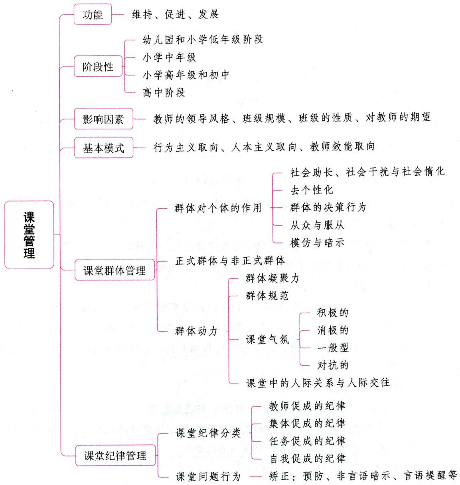

# 一、课堂管理概述

# 考点1 课堂管理的概念及功能 ★【单选】

课堂管理是指教师为有效利用时间、创造愉快的和富有建设性的学习环境以及减少问题行为而采取的组织教学、设计学习环境、处理课堂行为等一系列活动与措施。课堂管理过程的实质就是师生在课堂中相互作用的过程。课堂教学效率的高低，取决于教师、学生和课堂情境三大要素的相互协调。其功能主要体现在：

# 1. 维持功能

所谓维持功能，是指课堂管理能够在课堂教学中，持久地维持良好的学习环境，有效地排除各种干

扰因素, 使学生充分地参与到学习活动中。维持功能是课堂管理的基本功能。

# 2. 促进功能

课堂管理的促进功能是指良好的课堂管理能够增强、提升课堂教学的效果，促进学生的学习。

# 3. 发展功能

课堂管理本身可以教给学生一些行为准则, 促进学生从他律走向自律, 帮助学生获得自我管理能力, 使学生逐步走向成熟。

真题1 [2022广东梅州, 单选]良好的课堂管理能够帮助学生养成良好的行为习惯，帮助学生获得自我管理能力。这体现了课堂管理的哪一功能（）

A. 发展功能

B. 维持功能

C. 促进功能

D. 调节功能

答案：A

考点2 课堂管理的阶段性 ★ 【单选、判断】

不同年龄阶段的学生需要不同的课堂管理方式，布罗菲和伊伏特逊将课堂管理划分为4个阶段。

# 1. 幼儿园和小学低年级阶段的管理

这个阶段的儿童正在学习如何上学,他们将要被社会化成一个新的角色。教师在这一阶段要直接教授课堂规则和程序,儿童只有掌握了基本的规则和程序,才可能进行学习活动。

# 2.小学中年级阶段的管理

这一阶段的儿童一般都已熟悉了学生这一角色，已经掌握了很多学校和课堂常规。但是，某个特别活动中的具体的、新的规则和程序还必须直接教授给他们。有时，活动规则发生了变化，学生就会抵抗：“去年那个老师不是这么做的。”因此，在这一阶段，教师要花较多的时间监控和维持管理系统，而不是直接教授规则和程序。

# 3.小学高年级和初中阶段的管理

在这一阶段,友谊以及在伙伴团体中的地位对学生来说更重要,他们不再取悦教师而是取悦伙伴,有些学生甚至开始检验和否定权威。这一阶段管理的关键是如何建设性地处理这些混乱,如何激励那些不再关心教师观点的学生以及对社会生活更感兴趣的学生。

# 4. 高中阶段的管理

许多学生又重新开始关注学业。这一阶段的主要任务是管理课程，使学业材料适合学生的兴趣和能力，帮助学生主动管理自己的学习。每一学期开始的几节课都要教给学生一些特别的程序，如使用材料和设备、做记录、做作业等。

真题2 [2023广西百色，单选]在（ ）阶段的课堂管理中，教师应将较多的时间用于监控和维持管理系统，而不是直接教授规则和程序。

A.小学低年级

B.小学中年级

C. 小学高年级

D. 初中阶段

真题3 [2023山东济南，判断]低龄儿童课堂管理的主要任务是教师直接教授其课堂规则和程序。（）

答案：2.B 3.√

# 考点 课堂管理的目标

课堂管理的目的是建立一个积极的、有建设性的课堂环境，而不是让学生安静、驯服地遵守课堂纪律。科学有效的课堂管理，不仅能维持课堂秩序，而且能增进教学效果；不仅能提高课堂教学质量，而且能促进学生健康地发展。一般来说，课堂管理具有三个重要目标：(1)为学生争取更多的学习时间；(2)增加学生参与学习活动的机会；(3)帮助学生形成自我管理的能力。

# 考点4 影响课堂管理的因素 ★★ 【单选、判断、简答】

# 1.教师的领导风格

教师的领导风格对课堂管理有直接的影响。参与式领导注意创造课堂自由气氛，鼓励自由发表意见，不把自己的意见强加于人；而监督式领导则待人冷淡，只注重集体讨论的进程，经常监督学生有无越轨行为。

# 2. 班级规模

班级的大小是影响课堂管理的一个重要因素。这主要基于以下几个原因：（1）班级的大小会影响成员间的情感联系。班级越大，情感纽带的力量就越弱。（2）班内的学生越多，学生间的个别差异就越大，课堂管理所遇到的阻力也可能越大。（3）班级的大小也会影响交往模式。班级越大，成员间相互交往的频率就越低，对课堂管理技能的要求也就越高。（4）班级越大，内部越容易形成各种非正式小群体，而这些小群体又会影响课堂教学目标的实现。

# 3. 班级的性质

不同的班级往往有不同的群体规范和不同的凝聚力，教师不能用固定不变的课堂管理模式对待不同性质的班级，而应该在深入了解的基础上，掌握班集体的特点。

# 4. 对教师的期望

学生对教师的课堂行为会形成一定的期望，期望教师以某种方式进行教学和课堂管理，这种期望必然会影响教师的课堂管理。如果教师的实际行为与学生的期望不一致，学生就会不满。

# ·记忆有妙招·

为方便考生记忆，编者将影响课堂管理的因素总结成以下口诀：

望教导，质班规。望：对教师的期望。教导：教师的领导风格。质：班级的性质。班规：班级规模。

真题4 [2022江苏苏州，简答]简述影响课堂管理的因素。

答案：详见内文

# 考点 5·课堂管理的基本模式 ★ 【单选】

# 1. 行为主义取向的课堂管理模式

课堂管理中的行为主义模式是以教师为核心来实施的。这种模式的基本理念是学生的成长和发展是由外部环境决定的，他们在课堂中所表现出来的不良行为，或者是通过学习获得的，或者是因为没有学会正确的行为。在课堂管理中，教师的责任是强化适宜的行为并根除不适宜的行为。典型的行为主义取向的课堂管理模式有斯金纳模式和坎特模式。

# 2. 人本主义取向的课堂管理模式

与行为主义不同,人本主义取向的课堂管理者认为,学生有自己的决策能力,他们可以对控制自己的行为负主要责任。在课堂管理中,教师不应该要求学生百依百顺,而是应该关注学生的需要、情感和主动精神,向学生提供最好的机会去发掘归属感、成就感和积极的自我认同,以此来维持一种积极的课堂环境;出现问题行为时,教师应更多地运用沟通技能,引导学生分析问题的性质和后果,自己把问题解决。典型的人本主义取向的课堂管理模式有格拉塞模式和基诺特模式。

# 3. 教师效能取向的课堂管理模式

与行为主义和人本主义取向的课堂管理观不同，教师效能取向的课堂管理模式关注的是教师课堂管理技能的提高。持这一取向的研究者认为，课堂管理得好与不好，主要取决于教师的管理技能；通过培训，提高教师的课堂管理技能，可以达到改善课堂管理质量的效果。典型的教师效能取向的课堂管理模式有戈登模式和库宁模式。

真题5 [2023广西百色，单选]面对课堂上违反纪律的学生，李老师倾向于通过课后沟通，引导学生分析问题的性质和后果，并自觉改正。李老师的课堂管理模式取向是（）

A. 行为主义取向

B. 人本主义取向

C. 建构主义取向

D. 教师效能取向

真题6 [2022广东广州, 单选] 班主任张老师建议新教师, 第一堂课首先建立积极、有效的课堂规则, 之后通过转移注意、消除媒介、正确批评等方法, 对课堂上出现的小声说话、小动作等消极行为及时制止, 从而根除学生的课堂不良行为。这一观点体现了课堂管理取向中的( )

A. 建构主义取向

B. 行为主义取向

C. 认知主义取向

D. 人本主义取向

答案：5.B 6.B

# 二、课堂群体管理

# 考点1 群体的概念和特征

# 1. 群体的概念

群体是指人们为了实现共同的目标，以一定方式的共同活动为基础而结合起来的联合体（人群）。

# 2. 群体的特征

作为群体而结合在一起的人群，与由于时间和空间关系偶然聚集在一起的人群是不同的。作为群体而存在的人群必须体现出三个特征：(1)群体成员有共同的活动目标；(2)群体具有一定的结构；(3)成员在心理上有依存关系和共同感。

作为群体，必须由两个以上的个体组成；群体成员根据共同的目标承担任务，相互交往，协同活动；群体内有共同的社会规范制约着成员。

# 考点2 群体对个体的作用 ★★ 【单选、判断】

群体是由个体组成的，但群体中的个体不是孤立存在的。群体会对其中的个体产生影响，而个体在群体情境下会出现心理和行为上的变化。表现为以下几个方面：

# 1. 社会助长、社会干扰与社会惰化

表 3-26 社会助长、社会干扰与社会惰化  

<table><tr><td>类别</td><td>含义</td><td>典例</td></tr><tr><td>社会助长</td><td>个体与别人在一起活动或有别人在场时,个体的行为效率提高的现象</td><td>个体在独自骑单车的情况下时速是每小时15公里,如果与别人骑单车竞赛,时速会更快</td></tr><tr><td>社会干扰(社会抑制)</td><td>当他人在场或与他人一起从事某项工作时而使个体行为效率下降的现象</td><td>考试时,有些考生会因为老师站在旁边,一个字都写不出来</td></tr><tr><td>社会惰化</td><td>当群体一起完成一件工作时,群体中的成员每人所付出的努力会比个体在单独情况下完成任务时偏少的现象</td><td>滥竽充数</td></tr></table>

真题7 [2024河北石家庄, 单选]小黎擅长短跑, 他经常说: “我更愿意跟全年级短跑‘高手’一起竞争, 因为这可以快速提高我的速度。”小黎的说法体现了群体具有( )的作用。

A. 社会惰化

B. 社会干扰

C. 社会助长

D. 去个性化

答案：C

# 2. 去个性化（个体意识消退）

去个性化是由费斯廷格等人提出来的。他们认为，在群体中，人们有时会感到自己被湮没在群体之中，于是个人意识和理解评价感丧失，个体的自我认同被群体的行动与目标认同所取代，个体难以意识到自己的价值与行为，自制力变得极低，结果导致人们加入重复的、冲动的、情绪化的，有时甚至是破坏性的行动中去，这种现象叫作去个性化。去个性化形成的原因主要包括：(1)成员的匿名性；(2)责任分散；(3)相互感染。

# 3. 群体的决策行为

# (1)群体极化

所谓群体极化，是指群体成员中原已存在的倾向性，通过群体的作用而得到加强，使一种观点或态度从原来的群体平均水平加强到具有支配性水平的现象。当群体成员最初的意见倾向于保守时，群体讨论的结果将导致意见更加保守；当最初的意见倾向于冒险时，群体讨论将导致意见更倾向于冒险。

# (2)群体思维

高凝聚力的群体在进行决策时，成员的思维会高度倾向于一致，以至于使其他变通行动路线的现实性评估受到压抑。这种群体决策时的一致倾向性思维方式叫作群体思维。

# 4. 从众与服从

# (1)从众

从众是个体在群体的压力下，放弃自己的意见而采取与大多数人一致的行为的社会现象。

根据外显行为与内在的自我判断是否一致，可将从众行为分为以下三类：①真从众；②权宜从众；③不从众。

从众的影响因素主要有三个方面：①群体方面。群体的规模；群体凝聚力；群体意见的一致性；群体的权威性。②情境方面。刺激的模糊性；反应的匿名性；承诺感(责任感、约束力)。③个人方面。性别；年龄；地位。

从众现象的产生大致有两个原因：第一，人们往往相信大多数人的意见是正确的，觉得别人的看法

和意见将有助于他。如果学生越相信集体的正确性,自信心越差,从众的可能性就越大。第二,一个人往往不愿意被群体视为越轨者或不合群者,为了避免他人的非议或排斥,避免受孤立,从而产生从众。

# (2) 服从

服从是指在权威命令、社会舆论或群体气氛的压力下,放弃自己的意见而采取与大多数人一致的行为。服从可能是出于自愿,也可能是被迫的。被迫的服从也叫顺从,即表面接受他人的意见或观点,在外显行为方面与他人相一致,而在认识与情感上与他人并不一致。

# 小香课堂·

从众的原因是群体的压力；服从的原因是权威命令、社会舆论。考生可以这样记忆：“众”代表的是群体；“服”一般指对权威、舆论等的服从。

# 5. 模仿与暗示

# (1)模仿

模仿是指个体有意或无意仿效他人的言行而引起的与之相类似的行为活动。在班集体教学中，模仿主要用于对榜样的学习上。引起模仿的方法可以通过号召、动员、示范等形式来实现，但要注意既要树立校外或社会的榜样，更要树立校内、班内榜样，如学习校内或班内的好人好事。在班集体教学中，教师本身的榜样作用有特殊意义。认同是模仿的深化结果。

# (2) 暗示

暗示是指用含蓄或间接的方法，使某种信息在他人的心理与行为方面产生影响，从而使他按照一定的方式行动或接受某种信念与意见。

# 6. 流行

群体中有相当数量的人在短时间内争相模仿、追求某种行为方式，从而使人们相互之间发生了连锁性感染，这就是流行。

# 考点3 正式群体与非正式群体 ★【单选、多选、判断】

# 1. 正式群体

正式群体是指在学校行政部门、班主任或社会团体的领导下，按一定章程组成的学生群体。班级、小组、少先队等都属于正式群体。正式群体的目标与任务明确，成员稳定，有一定的组织纪律和工作计划，这对增强集体凝聚力起到非常重要的作用。

正式群体的发展要经历松散群体、联合群体和集体三个阶段。松散群体是指学生在空间和时间上结成群体, 但成员间尚无共同活动的目的和内容; 联合群体的成员已有共同的活动目的和内容, 但活动还只具有个人意义; 集体是群体发展的最高阶段, 是为实现有公益价值的社会目标而严密组织起来的有纪律、有心理凝聚力的群体。成员的共同活动不仅对每个成员有个人意义, 而且还有重要的社会意义。

# 2.非正式群体

在同伴交往过程中,一些学生自由结合、自发形成的小群体,称为非正式群体。它是同伴关系的一种重要形式。非正式群体对学生个体和正式群体既有积极影响,也有消极影响。

非正式群体具有这样一些特点：(1)成员之间相互满足心理需要；(2)成员之间具有强烈的情感联系和较强的凝聚力，但有可能存在排他性；(3)受共同的行为规范和行动目标的支配，行为上具有一致

性；(4)成员的角色和数量不固定。

# 3. 正式群体与非正式群体的协调

课堂管理必须注意协调正式群体和非正式群体的关系，要注意：

(1)要不断巩固和发展正式群体，使班内学生之间形成共同的目标和利益关系，产生共同遵守的群体规范，并以此协调大家的行动，满足成员的归属需要和彼此之间的相互认同，从而使班级成为团结的集体。  
(2)要正确对待非正式群体。①对于积极型的非正式群体,应支持和保护;②对于中间型的非正式群体,要持慎重态度,积极引导,联络感情,加强班级目标导向;③对于消极型的非正式群体,要教育、争取、引导和改造,帮助他们树立正确的人生观和价值观;④对于破坏型的非正式群体,则要在教育、改造的基础上,密切注视其活动,及时采取措施,防止他们继续恶化和变质,必要时依据校规和法律给予制裁。

真题8 [2024浙江金华, 判断] 正式群体都是积极的, 非正式群体都是消极的。( )

真题9 [2023广东广州，判断]共青团、少先队、班上的学科小组和文艺小组都属于正式群体。（）

答案：8.× 9.√

考点4 群体动力 ★★ 【单选、多选、判断、论述】

不管是正式群体还是非正式群体，都有群体凝聚力、群体规范、群体气氛以及群体成员在相互交往的基础上形成的人际关系。所有这些影响群体与个人行为发展变化的力量的总和就是群体动力。关于群体动力的研究，最早起源于德国心理学家勒温。

# 1. 群体凝聚力

群体凝聚力是指群体对成员的吸引力和成员之间的相互吸引力。它可以通过群体成员对群体的忠诚、责任感、荣誉感、成员间的友谊和志趣等来表明。关系融洽、凝聚力强的班级,会使学生产生强烈的自豪感和认同感,从而可以顺利完成课堂教学任务。所以,凝聚力常常成为衡量一个班集体成功与否的重要标志。

# 2. 群体规范

群体规范是约束群体内成员的行为准则，包括成文的正式规范和不成文的非正式规范。正式规范是有目的、有计划的教育的结果。非正式规范的形成则是成员们约定俗成的结果，受模仿、暗示和顺从等心理因素的制约。群体规范会形成群体压力，对学生的心理和行为产生极大的影响，还可能导致从众现象的发生。群体规范使学生保持认知、情感和行为上的一致，并为学生的课堂行为划定方向和范围，成为引导学生行为的指南。

# 3.课堂气氛

# (1)课堂气氛的概念

课堂气氛是指在课堂上占优势地位的态度和情感的综合状态。它具有独特性，不同的课堂往往有不同的气氛，即使是同一个课堂，也会形成不同教师的气氛区。一种课堂气氛形成后，往往能维持相当长的一段时间，而且不同的课堂活动也可能会被同样的课堂气氛所笼罩。

# (2)课堂气氛的类型及特征

根据师生相互作用的方式不同，可以将课堂气氛划分为：

①积极的课堂气氛。特征是：课堂纪律良好，师生关系融洽；学生精神饱满，注意力集中，专心听

讲，积极思维，反应敏捷，发言踊跃；教师善于点拨和积极引导；课堂气氛热烈、活跃、祥和。

②消极的课堂气氛。特征是: 课堂纪律问题较多, 师生关系疏远; 学生无精打采, 注意力分散, 反应迟钝; 多数学生处于被动应付教师的状态; 不少学生做小动作, 情绪压抑等。  
③一般型课堂气氛。教学中大量的课堂气氛属于一般型课堂气氛，它介于积极型和消极型之间，即课堂教学能正常进行，但教学效果一般。  
④对抗的课堂气氛。特征是: 课堂纪律问题严重, 师生关系紧张; 学生随心所欲, 各行其是, 注意力指向无关对象; 教师无法正常上课, 时常被学生打断或不得不停下来维持课堂纪律, 基本上是一种失控的课堂状态。

# （3）影响课堂气氛的因素

课堂气氛是师生在课堂活动中相互作用而产生的，主要受教师、学生、课堂内物环境等三方面因素的影响。

①教师因素。教师是课堂教学中的主导者，教师的领导方式、教师的移情、教师对学生的期望、教师的情绪状态、教师的教学能力是影响课堂气氛的决定因素。  
②学生因素。课堂气氛是师生共同营造的，学生是课堂活动的主体。因此，学生的一些特点也是影响课堂气氛的重要因素。  
③课堂内物环境因素。课堂内物环境又称作教学的时空环境，主要指教学时间和空间因素构成的特定的教学环境，包括教学时间的安排、班级规模、教室内的设备、教具、乐音或噪音、光线充足与否、空气清新或浑浊、高温或低温、座位编排方式等。这些因素虽然不是决定课堂气氛的主要原因，但是它们的优劣会对课堂气氛的形成起着促进或阻碍作用。

# （4）创设积极的课堂气氛的方法

# (1)发挥教师的主导作用

教师在营造良好的课堂氛围的过程中起着主导作用。如果教师能精心组织课堂教学，巧妙把握语言艺术，善于用良好的情绪情感感染学生，并善于处理课堂问题，就更容易创造出良好的课堂氛围。

# ②尊重学生的主体地位

创造良好的课堂氛围，关键在于教师能否切实调动学生学习的主观能动性，使学生真正成为教学的主体、学习的主人。因此，教师必须调动学生参与的积极性和主动性，让学生保持最佳的学习心态。

# (3)构建和谐的师生关系

课堂中的师生关系，直接影响课堂气氛。建立和谐的课堂人际关系，这是创设积极课堂气氛的基础。可以采取以下措施来使师生关系更加和谐：第一，师生民主平等；第二，树立一定的教师威信；第三，教师要关心爱护学生。

# 小香课堂

课堂气氛的类型中消极型和对抗型都属于破坏型课堂气氛，但二者存在区别：

消极型：被动、消沉；对抗型：主动破坏。

真题10 [2023江苏常州，单选]有些教师不善于组织教学，不能有效引导学生思维，多数学生被动回答教师提问，学生注意力分散，课堂纪律较差，师生关系疏远。这种课堂气氛属于（）

A.积极型

B. 消极型

C. 对抗型

D. 紧张型

答案：B

# 4. 课堂中的人际关系与人际交往

# (1)人际关系

(1)人际关系的概念

人际关系是指人与人在相互交往过程中所形成的社会心理关系。它反映了个人或群体寻求满足其社会需要的心理状态,其发展变化取决于交往双方社会需要满足的程度。人际关系包含认知、情感和行为三种成分。其中,人际关系的核心成分是情感,即对人的好恶喜厌,集中表现为人际吸引和人际排斥。

②人际关系需要

美国心理学家舒茨提出了人际需要的理论，最基本的人际关系需要有三类：第一，包容需要，这种需要表现为希望与别人发生相互作用，建立联系并维持和谐关系的愿望；第二，控制需要，这种需要表现为在权力或权威基础上与别人建立和维持良好关系的愿望；第三，感情需要，这种需要表现为在情感上与他人建立和维持良好关系的愿望。

③学生人际关系发展的特点

中小学生主要的人际关系包括亲子关系、师生关系和同伴关系。

中学生人际关系发展的特点主要表现在：第一，友谊占据十分重要和特殊的地位；第二，小团体现象突出；第三，师生关系有所削弱；第四，易与父母产生隔阂；第五，网络虚拟人际关系的建立。

# (2) 人际交往

人际交往是指人与人之间传递信息、沟通思想和交流情感等方面的联系过程。在课堂里，师生之间、学生之间不断地进行人际交往，在此基础上形成师生之间和学生之间的各种人际关系。

①学生间的人际交往与人际关系

学生之间主要的人际交往与人际关系表现为吸引与排斥、合作与竞争。

第一，吸引与排斥。人际吸引是指交往双方出现相互亲近的现象，它以认知协调、情感和谐及行为一致为特征。人际排斥是指交往双方出现关系极不和谐、相互疏远的现象，以认知失调、情感冲突及行为对抗为特征。

现有的研究表明，距离的远近、交往的频率、态度的相似性、个性的互补以及外貌等因素是影响人际吸引和人际排斥的主要因素。而通过人际吸引表现出的彼此间的喜欢便是人们“互择”行为的一种体现，这种“互择”现象的形成是有规律可循的。第一，人际吸引的邻近律；第二，人际吸引的一致律；第三，人际吸引的互补律；第四，人际吸引的对等律。

人际吸引和人际排斥使学生在课堂里处于不同的地位，出现人缘好的学生、被人嫌弃的学生和遭受孤立的学生。因此，课堂管理中必须重视课堂里被嫌弃者和被孤立者，教师应该帮助他们回归群体。

第二，合作与竞争。合作是指学生为了共同目的在一起学习、工作或者完成某项任务的过程。合作是实现课堂管理促进功能的必要条件。合作性学习方式的好处在于能促进集体的学习成功，增强群体凝聚力；有利于学习中的集思广益、优势互补，进而提高学生的学业成绩；有利于学生习得团体规范，发展形成社会交往技能；有助于学生个体减少失败体验，改善他们的自尊和学习的自我效能感，增强学习积极性。但是合作性学习方式也有不足之处，因为学生的个体发展水平存在差异，合作性学习可能会限制不同学生的学习进程。

竞争是指个体或群体充分实现自身的潜能, 力争按优胜标准使自己的成绩超过对手的过程。适量和适度的竞争不但不会影响学生间的人际关系, 而且还会提高学习和工作的效率。但是, 竞争并不是

对所有学生都有激励作用, 频繁的竞争会使学生间产生对立, 使班级出现不安、不团结等消极的气氛。竞争有可能使一部分学生过度紧张和焦虑, 容易忽视活动的内在价值和创造性, 使学生的注意力过多地集中在赢得他人的赞许方面, 从而忽视学习活动本身所带来的认知乐趣。

不少心理学家提倡开展群体间的竞争。一般来说，群体间竞争的效果取决于群体内的合作。竞争与合作是对立统一的，它们都以是否满足各自的利益为转移。在课堂的人际交往中，有时可能同时发生合作与竞争，有时则交替地引起合作与竞争。有效的课堂管理应该协调合作与竞争的关系，使两者相辅相成，成为实现促进功能的有益手段。

②师生之间的人际交往与人际关系

师生之间的人际交往与人际关系有四种：第一，单向交往；第二，双向交往；第三，师生保持双向交往，但也允许学生之间交往；第四，以教师为中心的师生之间的双向交往。

单向交往，教学效果差；双向交往比单向教学效果好；师生保持双向交往，也允许学生之间的交往，教学效果很好；教师成为互相交往的中心，并且促使所有学生与教师形成双向交往，教学效果最佳。

真题11 [2023广东深圳,多选]人际关系是多种心理因素的复合体,其基本成分包括( )

A. 认知

B. 语言

C. 情感

D. 行为

E. 良知

真题12 [2023河北邢台, 判断]竞争指个体或群体充分实现自身的潜能, 力争按优胜标准使自己的成绩超过对手的过程。适度的竞争不但不会影响学生间的人际关系, 而且还会提高学习质量。（）

A. 正确

B. 错误

答案：11.ACD 12.A

# 三、课堂纪律管理

# 考点1 课堂纪律的概念和分类 ★★ 【单选、判断】

# 1.课堂纪律的概念

课堂纪律是指为保障或促进学生的学习而设置的行为标准及施加的控制。良好的课堂纪律是课堂教学得以顺利进行的重要保障条件，有助于维持课堂秩序，减少学习干扰，也有助于学生获得情绪上的安全感。

# 2.课堂纪律的分类

根据形成途径，课堂纪律一般可分为以下四类：

（1）教师促成的纪律

即在教师的指导帮助下形成的班级行为规范。刚入学的儿童往往需要较多的监督和指导，课堂纪律主要是由教师制定的。随着年龄的增长和自我意识的增强，学生开始反对教师的过多限制，对教师促成的纪律的要求降低，但它始终是课堂纪律中的一种重要类型。

(2)集体促成的纪律

即在集体舆论和集体压力的作用下形成的群体行为规范。从儿童入学开始,同辈人的集体在促进儿童社会化方面就开始发挥重要的作用。随着年龄的增长,学生受同伴群体的影响会越来越大,开始以同辈群体的集体要求和价值判断作为自己的行为准则,以“别人也都这么干”为理由而做某件事情。

# (3)任务促成的纪律

即某一具体任务对学生行为提出的具体要求。在日常学习过程中,每项学习任务都有它特定的要求,或者说特定的纪律。例如,课堂讨论、野外观察、制作标本等任务都有各自的纪律要求。

# (4) 自我促成的纪律

简单说就是自律, 即在个体自觉努力下由外部纪律内化而成的个体内部约束力。形成自我促成的纪律是课堂纪律管理的最终目标。当一个学生能够自律并客观注重他自己和集体的行为标准时, 便意味着能够为新的更好的集体标准的发展做出贡献, 同时也标志着学生的成熟水平向前迈进了一步。

真题13 [2022湖南长沙，单选]( )指的是在集体舆论和集体压力的作用下形成的群体行为规范。

A.教师促成的纪律

B. 集体促成的纪律

C. 自我促成的纪律

D. 任务促成的纪律

真题14 [2024河北石家庄，判断]形成自我促成的纪律是课堂纪律管理的最终目标，也是学生成熟水平提高的标志。（）

A. 正确

B. 错误

答案：13.B 14.A

考点2 课堂纪律的发展 ★【单选】

课堂纪律的形成不是一蹴而就的，它往往要经历一个发展过程，国外学者参照科尔伯格道德发展的阶段理论，将不同年龄阶段儿童的纪律发展水平划分为如下几个阶段。

# 1. 反抗行为阶段

4~5岁之前的儿童, 多处于这一阶段。这一阶段的儿童, 他们的行为中经常表现出对抗性, 拒绝遵循指示、要求, 需要给予大量的注意; 他们很少具有自己的规则, 但是畏于斥责, 可能遵循他人的要求。在学校教育阶段, 也有一些学生处于这一水平。表现为当教师盯住他们时, 他们会表现得中规中矩, 但是稍微不注意, 他们就会失去控制。

# 2. 自我服务行为阶段

5~7岁的儿童，多处于这一阶段。这一阶段的学生是以自我为中心的，但是在课堂上比较容易管理，因为他们所关心的是行为后果“对我意味着什么”，是奖励还是惩罚。从道德发展来讲，他们处于奖励和惩罚阶段。

处于这一阶段的学生很少具有自我纪律感。他们可能在这节课上表现很好, 而在另一节课上失去自我控制。与处于反抗行为阶段的儿童一样, 为了避免出现纪律问题, 教师需要对他们进行不断的监督。

# 3. 人际纪律阶段

大多数中学生处于这一阶段。处于这一阶段的学生，其行为取向是要建立一种相互的人际关系，他们做出的行为往往与“我怎样才能取悦你”联系在一起，他们这样做是因为你要求他们这样做；他们关心自己在别人心目中的形象，希望别人喜欢自己。

# 4. 自我约束阶段

处于这一阶段的学生很少陷入什么麻烦，因为他们能够明辨是非，理解遵守纪律的意义，也能够做

到自我约束。教师可以离开教室 $20\sim 30$ 分钟，回来后发现他们依然很安静地在学习。他们这样做，是因为他们知道这样做是对的，就应该这样做。尽管许多中学生能够达到这一水平，但是只有一部分学生能够稳定地保持在这一水平上。

真题15 [2024河北石家庄，单选]课堂纪律处于自我服务行为阶段时具有的主要特点是（）

A. 学生能够理解遵守纪律的重要意义, 做到自我约束  
B. 学生这节课表现很好, 可能在下一节课就失去控制  
C. 学生很少有自己的规则, 但畏于斥责, 需要得到关注  
D. 学生关注自己在别人心目中的形象, 希望被别人喜欢

答案：B

考点 3·课堂结构与课堂纪律 ★【单选】

学生学习过程和学习情境是课堂的三大要素，这三大要素相对稳定的组合模式就是课堂结构。课堂结构包括课堂情境结构和课堂教学结构。

# 1.课堂情境结构

(1)班级规模的控制。班级过大容易限制师生交往和学生参加课堂活动的机会,阻碍课堂教学的个别化,有可能导致课堂出现较多的纪律问题。  
(2)课堂常规的建立。课堂常规是每个学生必须遵守的最基本的日常课堂行为准则。它赋予学生的课堂行为一定的意义,使学生明白行为所依据的价值标准,具有约束和指导学生课堂行为的功能。  
(3)学生座位的分配。研究发现,分配学生座位时教师主要关心的是减少课堂混乱。其实,分配学生座位时,最值得教师关注的应该是对人际关系的影响。所以,学生座位的分配,要考虑:①课堂行为的有效控制,预防纪律问题的发生;②促进学生间的正常交往,形成和谐的师生关系,并有助于学生形成良好的人格特征。

# 2. 课堂教学结构

(1)教学时间的合理利用。学生在课堂里的活动可以分为学业活动、非学业活动和非教学活动三种类型。在通常情况下，用于学业活动的时间越多，学业成绩越好。  
(2)课程表的编制。课程表是使课堂教学有条不紊地进行的重要条件。课程表的编制需注意：①应尽量将语文、数学和外语等核心课程安排在学生精力最充沛的上午第一、二、三节课，将音乐、美术、体育和习字等技能课安排在下午；②将文科与理科、形象性的学科与抽象性的学科交错安排，避免同类刺激长时间地作用于大脑皮层的同一部位而导致疲劳和厌烦。  
(3)教学过程的规划。教学过程的合理规划是维持课堂纪律的又一个重要条件，不少纪律问题就是由教学过程的规划不合理造成的。

真题16 [2023河北邢台,单选]课堂情境结构包括班级规模的控制、课堂常规的建立和( )

A. 教室的布置

B.教师的行为表现

C. 学生的学习方式

D. 学生座位的分配

答案：D

# 考点4 维持课堂纪律的策略 ★【多选】

# 1. 建立有效的课堂规则

课堂规则是课堂成员应遵守的课堂基本行为规范和要求。制定课堂规则有以下原则和要求：（1）课堂规则应符合四个条件，即明确、合理、必要和可行；（2）课堂规则应通过教师与学生的充分讨论，共同制定；（3）课堂规则应少而精，内容表述以正向引导为主；（4）课堂规则应及时制定与调整。

# 2. 合理组织课堂教学，维持学生的注意和学习兴趣

教师应做到：(1)增加学生参与课堂的机会；(2)保持紧凑的教学节奏，合理布置学业任务；(3)处理好教学活动之间的过渡。

# 3. 做好课堂监控

教师应能及时预防或发现课堂中出现的一些纪律问题，并采取言语提示、目光接触等方式提醒学生注意自己的行为。

# 4. 培养学生的自律品质

促进学生形成和发展自律品质，是维持课堂纪律的最佳策略之一。教师应做到：(1)要对学生提出明确的要求，加强课堂纪律的目的性教育；(2)引导学生对学习纪律持有正确、积极的态度，产生积极的纪律情感体验，进行自我监控；(3)集体舆论和集体规范是促使学生自律品质形成和发展的有效手段，教师应对其加以有效利用。

真题17 [2023广东深圳，多选]制定课堂规则的原则和要求有（）

A. 符合明确、合理、必要和可行的条件

B. 通过教师与学生的充分讨论, 共同制定

C.少而精，内容表述以正向引导为主

D.应及时制定与调整

E. 由班主任制定，不能随意修改

答案：ABCD

# 考点5 预防不良行为 ★【单选】

维持管理体系的最佳方法是防患于未然。课堂规则和程序一旦建立，就要仔细监督学生的行为，要求学生严格遵守，防微杜渐。对于课堂不良行为要以预防为主，处理为辅。科宁等人在一个课堂管理研究中观察、比较了有效管理者和无效管理者的行为。他发现，当问题出现以后，两者的处理没什么不同，不同的是成功的管理者能较好地预防问题。他总结了可以很好地预防问题的四个方面：明察秋毫、一心多用、关注整体和转换管理。

# 1. 明察秋毫

明察秋毫是指教师要让学生知道，他注意到了课堂里发生的每一件事，甚至没漏下任何一件。“明察”的教师尽量避免被少数几个学生吸引或只与他们交流，他们经常扫视教室，与学生保持目光接触，有些老师甚至在黑板上进行板书时都知道谁在搞小动作，脑后仿佛长有一双眼睛似的。

# 2. 一心多用

一心多用是指同时跟踪和监督几个活动。这同样需要教师不断地监控全班。例如，教师在检查个别学生的作业的同时，还要对其他学生说“好，继续！”让他们继续学习。

# 3. 关注整体

关注整体是指使尽量多的学生投入到班级活动中，而避免把注意力集中在一两个学生身上。在课上，所有的学生都应当有事可做。

# 4.转换管理

转换是从一个活动向另一个活动的变化，如从讲演到课堂自习，从一门课到另一门课，或从上课到午休。转换是课堂管理的“缝隙”，课堂秩序最容易打乱。转换管理是指使课和全班学生能够顺利地完成过渡、有适当而灵活的进度、能够多样化地变换活动。

真题18 [2024广东佛山, 单选] 课堂教学对老师的要求较高, 老师除了上好自己的课以外, 还要关注学生上课的情况, 激发学生上课的积极性。这种维持管理体系的方法属于( )。

A. 明察秋毫

B. 一心多用

C. 关注个体

D. 转换管理

答案：B

考点 课堂问题行为及其应对 ★★ 【单选、判断、简答、论述、案例分析】

# 1.课堂问题行为的概念与性质

# (1)课堂问题行为的概念

课堂问题行为是指学生在课堂中发生的，违反课堂规则，妨碍及干扰课堂教学活动正常进行的行为。

# （2）课堂问题行为的性质

①课堂问题行为是一种普遍行为；②课堂问题行为是一种消极行为；③课堂问题行为是一个教育性概念。

课堂问题行为的基本特征为：消极性；普遍性；其程度以轻度为主。

# 2.课堂问题行为的类型

(1)品行方面的问题行为和人格方面的问题行为

品行方面的问题行为, 是指那些直接指向环境和他人的不良行为, 如攻击性行为、破坏性行为、不服从行为等。人格方面的问题行为, 是与学生的个性关联在一起的不良行为, 如孤僻退缩、焦虑抑郁等。品行方面的问题行为较为外显, 容易被教师发现, 容易引起教师的关注; 而人格方面的问题行为则较为内隐, 不易觉察、辨认和确定。

# (2)人格型、行为型和情绪型

奎伊等人将课堂问题行为分为人格型、行为型和情绪型三种类型。

①人格型问题行为带有神经质特征，常常表现为退缩行为，如不能开玩笑、扭捏、缺乏信心、容易慌乱、做白日梦、缺乏兴趣、神经过敏等；  
②行为型问题行为主要具有对抗性、攻击性或破坏性等特征，如交头接耳、注意分散、不服从、不合作、过度活动、无耐心、吵嚷起哄等；  
③情绪型问题行为主要是由于学生过度焦虑、紧张和情绪多变而导致社会障碍的问题行为，如心事重重、情绪紧张、容易慌乱、胆小怕事、不敢举手发言等。

# 3.课堂问题行为的原因

课堂问题行为具有普遍性，是教师经常遇到而又非常敏感的问题，如果处理不好，就会损害师生关系，破坏课堂气氛，影响教学效果。导致学生问题行为的原因概括起来有三点：(1)学生的人格特点、生理因素、挫折经历；(2)教师的教学技能、管理方式、威信；(3)校内外的环境，如大众传播媒介、

家庭环境、课堂座位编排。

# 4.课堂问题行为的矫正

(1)预防。这是处理一般问题行为的最好方式。在教学中，教师可以通过呈现生动有趣的课程，确定清晰的课堂规则和程序，使学生进行有意义的活动等来预防问题行为的发生。此外，变化课程内容，运用不同的材料和方法进行教学，教师显示出幽默和热情，以及让学生进行合作学习等也都能够减少学生因疲劳而引发问题行为的可能性。

(2)非言语暗示。由于一般问题行为大都是一些暂时性的干扰,教师在处理这些行为时,通常只需要运用简单的非言语线索进行暗示,就可以得到既制止问题行为又不影响课堂教学进程的双重效果。

(3)表扬。对许多学生来说,表扬是一种强有力的激励。减少一般课堂问题行为的一个重要策略就是表扬学生做出的与想要消除的问题行为相反的正确行为。也就是说,通过表扬正确行为来减少问题行为。

(4)言语提醒。当非言语暗示不能制止学生的问题行为时，教师采用适当的言语提醒也有助于让学生回到学习活动中来。

(5)有意忽视。个别学生有时为了引起教师和其他同学的注意,会做出一些问题行为。这时,如果教师直接干预,正好迎合了学生的目的,从而对其问题行为起到强化作用。在这种情况下,教师采取有意忽视的态度,视而不见,是比较合适的处理方式。

(6)转移注意。对于一些自尊心比较强的学生所表现出来的问题行为，如果教师当众直接制止，可能会产生适得其反的效果。这时，教师可以采用比喻、声东击西等方法加以暗示，并转移其注意力，从而终止其问题行为。

有时，对于个别学生来说，教师也可以采用暂时隔离的办法，即让出现问题行为的学生暂时离开座位，到教室的某一角落，远离其他同学。由于这种方法很可能引起学生对教师的不满甚至对抗，教师在使用时应当特别慎重，不宜滥用。

总之，无论采取什么方法处理学生的问题行为，教师首先一定要认清真正的问题行为所在，找出行为发生的原因，然后针对症结做出有效处理。

真题19 [2024广东佛山, 单选]王老师上课时, 会对课上交头接耳的同学进行简单提醒, 如: “张某某、王某某, 请你们安静, 抬头看黑板。”这种处理纪律问题的方式属于( )。

A.非言语线索

B. 言语提醒

C. 反复提示

D. 应用后果

真题20 [2023河北石家庄, 单选]小凯为引起王老师的注意, 故意在课堂上弄出怪声, 对此王老师最适宜采取的处理方法是 ( )

A.非言语暗示

B. 言语提醒

C. 有意忽视

D. 暂时隔离

答案：19.B 20.C

# ★本节核心考点回顾 ★

# 1.课堂管理的阶段性

(1)幼儿园和小学低年级阶段：直接教授课堂规则和程序；

(2)小学中年级阶段：教师要花较多的时间监控和维持管理系统；

(3)小学高年级和初中阶段：管理的关键是如何建设性地处理这些混乱，如何激励那些不再关心教师观点的学生等。

2. 影响课堂管理的因素

(1)教师的领导风格；(2)班级规模；(3)班级的性质；(4)对教师的期望。

3.课堂管理的基本模式

(1) 行为主义取向：教师的责任是强化适宜的行为并根除不适宜的行为。  
(2)人本主义取向：出现问题行为时，教师应更多地运用沟通技能，引导学生分析问题的性质和后果，自己把问题解决。  
(3)教师效能取向：课堂管理得好不好，主要取决于教师的管理技能。

4. 群体对个体的作用

(1) 社会助长：他人在场行为效率提高。  
(2)社会干扰：当他人在场行为效率下降。  
(3)社会情化：群体中的成员每人所付出的努力会比个体在单独情况下完成任务时偏少的现象。  
(4)从众：个体在群体的压力下，放弃自己的意见而采取与大多数人一致的行为的社会现象。  
(5)服从: 在权威命令、社会舆论或群体气氛的压力下, 放弃自己的意见而采取与大多数人一致的行为。

5. 正式群体与非正式群体

(1)正式群体：在学校行政部门、班主任或社会团体的领导下，按一定章程组成的学生群体。  
(2)非正式群体:在同伴交往过程中,一些学生自由结合、自发形成的小群体。非正式群体既有积极影响,也有消极影响。

6. 课堂纪律的类型

(1)教师促成的纪律：在教师的指导帮助下形成的班级行为规范。  
(2)集体促成的纪律：在集体舆论和集体压力的作用下形成的群体行为规范。  
(3)任务促成的纪律：某一具体任务对学生行为提出的具体要求。  
(4)自我促成的纪律：自律，课堂纪律管理的最终目标。

7.课堂问题行为的矫正

(1)预防；(2)非言语暗示；(3)表扬；(4)言语提醒；(5)有意忽视；(6)转移注意。

# 第六章 心理健康教育与教师职业心理

# 本章学习指南

# 一、考情概况

本章属于教育心理学的基础章节，知识点较为琐碎、实用性强，考生可带着以下学习目标进行备考：

1.理解心理健康的内涵。  
2. 识记中小学生心理辅导的方法。  
3.区分中小学生常见的心理问题  
4.理解并识记教师成长的阶段和途径。  
5. 了解教师的职业心理健康。

# 二、考点地图

<table><tr><td>考点</td><td>年份/地区/题型</td></tr><tr><td>中小学生心理辅导的方法</td><td>2024山东单选;2024安徽判断;2023江苏单选;2023吉林单选;2023甘肃多选;2023广西多选</td></tr><tr><td>中小学生常见的心理问题</td><td>2024河北判断;2023河南单选;2023江苏单选;2023广西单选;2023福建填空;2022江苏判断</td></tr><tr><td>教师的职业心理特征</td><td>2024福建单选;2023广东单选;2023吉林单选;2023黑龙江多选</td></tr><tr><td>专家型教师和新手型教师的区别</td><td>2023辽宁判断;2023广东判断;2022辽宁单选;2022湖南多选</td></tr><tr><td>教师的成长阶段</td><td>2024广东单选;2023广西单选、判断;2023江苏单选;2023黑龙江单选;2022浙江单选;2022江苏判断</td></tr><tr><td>教师成长的途径</td><td>2023吉林单选;2023河北单选;2023福建判断选择;2022河北判断;2022山西判断</td></tr><tr><td>职业压力与职业倦怠</td><td>2023吉林单选;2023河北单选;2023广西多选;2023浙江论述;2022广东单选;2022辽宁单选</td></tr></table>

注：上述表格仅呈现重要考点的相关考情。

# 第一节 心理健康概述

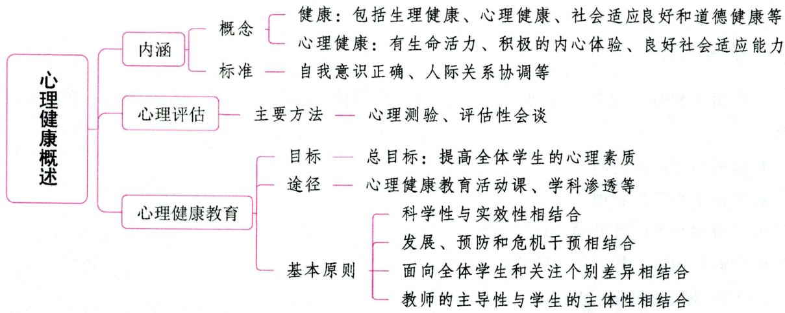

# 一、心理健康的内涵 ★ 【单选、多选、判断】

# 考点1 心理健康的概念及其理解

健康指的是有机体的一种机能状态，一般指机能正常，没有缺陷和疾病。世界卫生组织指出，健康应包括生理健康、心理健康、社会适应良好和道德健康等。

世界卫生组织认为，心理健康是一种良好的、持续的心理状态与过程，表现为个体具有生命的活力、积极的内心体验、良好的社会适应能力，能够有效地发挥个人的身心潜力以及作为社会一员的积极的社会功能。

心理健康是个体心理活动在自身及环境条件许可范围内所能达到的最佳功能状态。心理健康的个体能够充分发挥自己的最大潜能，妥善处理和适应人与人之间、人与社会环境之间的相互关系。它至少包括两层含义：一是无心理疾病；二是有一种积极发展的心理状态。

真题1 [2024安徽合肥/淮北/铜陵，单选]心理健康表现为个人具有生命的活力、积极的内心体验和良好的（）

A. 社会适应能力

B. 社会化人格

C. 精神面貌

D. 精神状态

答案：A

# 考点2 心理健康的标准

# 1. 一般标准

(1)自我意识正确。能正确评价、接纳自己。  
(2)人际关系协调。乐于交往，能和多数人建立良好的人际关系，具有处理矛盾的能力。

(3)性别角色分化。能够获得相应的性别角色，行为方式和相应的性别角色规范一致。  
(4)社会适应良好。能够面对、接受、适应现实，能够妥善处理生活、学习和工作中的各种挑战。  
(5)情绪积极稳定。情绪乐观稳定，热爱生活，积极向上，对未来充满希望，有烦恼能自行解脱。  
(6)人格结构完整。具有较高的能力、完善的性格、良好的气质、正确的动机、广泛的兴趣和坚定的信念等。

# 2.我国青少年心理健康标准

根据我国青少年的实际情况，青少年心理健康标准可以概括为：(1)正常的智力；(2)健康的情绪；(3)优良的意志品质；(4)和谐的人际关系；(5)健全的人格；(6)适应社会生活；(7)心理特点符合年龄特征。

# 考点3 正确理解心理健康的标准

(1)判断一个人的心理健康状况时，应兼顾个体内部协调与对外良好适应两个方面。  
(2)心理健康概念具有相对性，即心理健康有高低层次之分。高层次（积极）的心理健康不仅是没有心理疾病，而且能充分发挥个人潜能，发展建设性人际关系，从事具有社会价值的活动，追求高层次需要的满足，追求生活的意义。而低层次的心理健康主要指没有心理疾病。  
(3) 心理不健康与有不健康的心理和行为不能等同。心理不健康是指一种持续的不良状态。偶尔出现一些不健康的心理和行为并不等于心理不健康, 更不等于已患心理疾病。因此, 不能仅从一时一事而简单地给自己或他人下心理不健康的结论。  
(4)心理健康与不健康不是泾渭分明的对立面，而是一种连续状态。  
(5)心理健康的状态不是固定不变的，而是动态变化的过程。  
(6)心理健康标准是一种理想尺度，它不仅为我们提供了衡量是否健康的标准，而且为我们指明了提高心理健康水平的努力方向。  
(7)心理健康与否，在相当程度上可以说是一个社会评价问题。

# 二、心理评估 ★【单选】

# 考点1 心理评估的概念

心理评估, 指用心理学方法和技术搜集得来的资料, 对学生的心理特征与行为表现进行评鉴, 以确定其性质和水平并进行分类诊断的过程。心理评估是有针对性地进行心理健康教育的依据, 是检验心理健康教育效果的手段, 也是增强学生自我认识的途径。心理评估既可以采用标准化的方法, 如各种心理测验; 也可以采用非标准化的方法, 如评估性会谈、观察法、自述法等。

# 考点2 心理评估的两种参考架构

现有的评估手段是在两种参考架构的基础上制订的，即疾病模式与健康模式。疾病模式的心理评估旨在对当事人心理疾病的有无以及心理疾病的类别进行诊断。健康模式的心理评估旨在了解个体健康状态下的心智能力及自我实现的倾向，关注的是人的潜能和价值实现的程度、心理素质改善的程度，这在学校心理健康教育中应受到高度重视。

# 考点3 主要的心理评估方法

# 1.心理测验

心理测验是一种特殊的测量，是测量一个行为样本的系统的程序。测验通过测量人的行为，去推

测受测者个体的智力、人格、态度等方面的特征与水平。按照所要测量的特征大体上可把心理测验分成认知测验、人格测验和神经心理测验。

# 2. 评估性会谈

评估性会谈是心理咨询与辅导的基本方法。教师通过评估性会谈既可以了解学生的心理与行为，也可以对学生的认知、情绪、态度施加影响。这种会谈法的优点有：在会谈中可以当面澄清问题，以提高所获得资料的准确性；通过观察会谈过程中双方的关系及学生的非言语行为，可以获得许多重要的附加信息。

此外，观察法、自述法等也是心理评估常用的方法。其中自述法是指通过学生书面形式的自我描述来了解学生的生活经历及内心世界的一种方法。

# 三、心理健康教育

# 考点1 心理健康教育的意义

(1)心理健康教育是预防精神疾病，保障学生心理健康的需要。学校是学生心理健康教育的主要场所。  
(2)心理健康教育是提高学生心理素质，促进其人格健全发展的需要。  
(3)心理健康教育是学校日常教育教学工作的配合与补充。

# 考点2 心理健康教育的目标、任务、途径和原则 ★【单选、多选、简答】

# 1.心理健康教育的目标

心理健康教育的总目标是：提高全体学生的心理素质，培养他们积极乐观、健康向上的心理品质，充分开发他们的心理潜能，促进学生身心和谐可持续发展，为他们健康成长和幸福生活奠定基础。

心理健康教育的具体目标是：

(1)使学生学会学习和生活，正确认识自我，提高自主自助和自我教育能力，增强调控情绪、承受挫折、适应环境的能力，培养学生健全的人格和良好的个性心理品质；  
(2)对有心理困扰或心理问题的学生，进行科学有效的心理辅导，及时给予必要的危机干预，提高其心理健康水平。

# 2. 心理健康教育的任务

心理健康教育的主要任务是：全面推进素质教育，增强学校德育工作的针对性、实效性和吸引力，开发学生的心理潜能，提高学生的心理健康水平，促进学生形成健康的心理素质，减少和避免各种不利因素对学生心理健康的影响，培养身心健康、具有社会责任感、创新精神和实践能力的德智体美全面发展的社会主义建设者和接班人。

# 3. 心理健康教育的途径

(1)心理健康教育活动课；(2)学科渗透；(3)班主任工作；(4)学校心理咨询与心理辅导；(5)家庭教育；(6)环境教育；(7)社会磨砺；(8)其他途径（少先队、板报、校报、广播等）。

# 4. 心理健康教育的基本原则

(1)坚持科学性与实效性相结合。要根据学生身心发展的规律和特点及心理健康教育的规律,科学开展心理健康教育,注重心理健康教育的实践性与实效性,切实提高学生心理素质和心理健康水平。  
(2)坚持发展、预防和危机干预相结合。要立足教育和发展，培养学生积极的心理品质，挖掘他们

的心理潜能，注重预防和解决发展过程中的心理行为问题，在应急和突发事件中及时进行危机干预。

(3)坚持面向全体学生和关注个别差异相结合。全体教师都要树立心理健康教育意识，尊重学生，平等对待学生，注重教育方式方法，关注个别差异，根据不同学生的特点和需要开展心理健康教育和辅导。  
(4)坚持教师的主导性与学生的主体性相结合。要在教师的教育指导下,充分发挥和调动学生的主体性,引导学生积极主动关注自身心理健康,培养学生自主自助维护自身心理健康的意识和能力。

真题2 [2023安徽蚌埠，简答]简述开展心理健康教育的基本原则。

答案：详见内文

# 考点 3 学校心理健康教育的内容

学校心理健康教育的内容应充分考虑学生的年龄特征和心理发展水平及学生心理健康成长，一般应包括以下四个方面：

(1)学习方面，主要包括对学生的学习动机、学习态度、学习策略、学习习惯、自我监控及考试心理的咨询与辅导等；  
(2)人格方面，主要包括对学生的人格、自我意识、情绪情感、人际关系、意志品质、性心理的辅导等；  
(3)生活方面，包括对生活适应、人际交往、挫折适应、休闲消费及危机心理的辅导等；  
(4)生涯方面，具体包括升学辅导、职业辅导、生涯发展与规划辅导等。

# 考点4 学校心理健康教育的途径

心理健康教育不能像知识教育那样主要通过教师的传授来完成。它需要渗透到学生日常生活的各个方面，通过多种方式进行。随着中小学生心理问题的日益严重，心理健康教育越发显得迫切而重要，学校心理辅导也日益成为学校实施心理健康教育的主要渠道。在学校开展心理健康教育有以下几种途径：(1)开设心理健康教育的有关课程和心理辅导的活动课；(2)在学科教学中渗透心理健康教育的内容；(3)结合班级、团队活动开展心理健康教育；(4)个别心理辅导或咨询；(5)小组辅导。

# ★本节核心考点回顾 ★

# 1. 心理健康的内涵

心理健康是一种良好的、持续的心理状态与过程，表现为个体具有生命的活力、积极的内心体验、良好的社会适应能力，能够有效地发挥个人的身心潜力以及作为社会一员的积极的社会功能。

# 2. 心理健康教育的基本原则

(1)坚持科学性与实效性相结合；(2)坚持发展、预防和危机干预相结合；(3)坚持面向全体学生和关注个别差异相结合；(4)坚持教师的主导性与学生的主体性相结合。

# 第二节 学生心理辅导

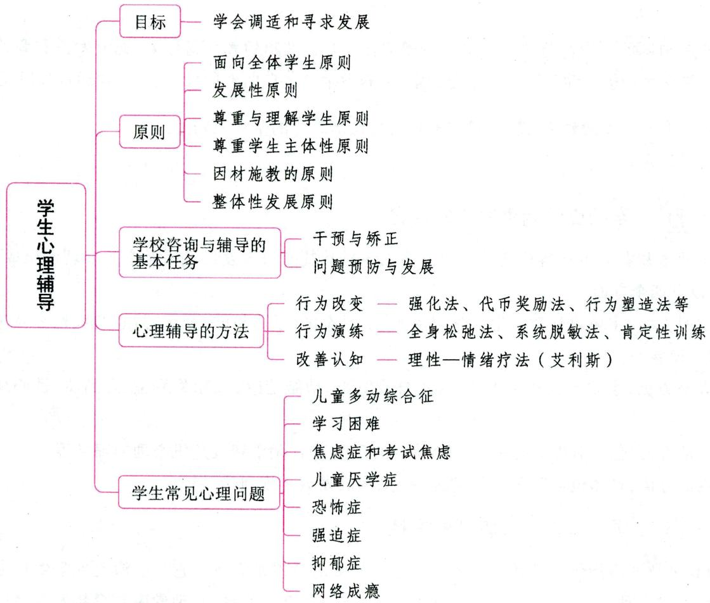

# 一、心理辅导及其目标、原则

# 考点1 心理辅导的内涵

心理辅导是指学校教育者根据学生心理发展的特征与规律，在一种新型的、建设性的人际关系中，运用心理学等专业知识技能，设计与组织各种教育性活动，以帮助学生形成良好的心理素质，充分发挥个人潜能，进一步提高心理健康水平的过程。

理解心理辅导的概念，要特别注意以下几点：(1)学校心理辅导强调面向全体学生；(2)辅导以正常学生为主要对象，以发展辅导为主要内容；(3)心理辅导是一种专业活动，是专业知识和技能的运用。

# 考点2 心理辅导的目标 ★【单选、判断】

学校心理辅导的一般目标与学校教育目标是一致的。但心理辅导毕竟只是学校教育的一个方面，其目标应有自己的独特之处。学校心理辅导的一般目标可归纳为两个方面：学会调适和寻求发展。

学会调适是基本目标, 以此为主要目标的心理辅导可称为调适性辅导; 寻求发展是高级目标, 以此为主要目标的心理辅导可称为发展性辅导。简言之, 这两个目标分别是要引导学生达到基础层次的心理健康和高层次的心理健康。

真题1 [2022广西桂林，单选]心理辅导的目标有两个：一是学会调适，二是（）

A. 行为矫正

B. 学会适应

C. 克服障碍

D. 寻求发展

答案：D

考点 3 学校心理辅导的原则 ★ 【单选】

(1)面向全体学生原则。学校心理辅导不像心理咨询和心理治疗，以少数有心理问题的个别学生为服务对象，而是以正常学生为主的全体学生为辅导对象；它是以提高全体学生的心理健康水平、促进每一个学生潜能的发展为终极目标的。  
(2)发展性原则。贯彻这一原则,要求教师必须用发展的、变化的眼光来看待学生,要相信学生具有成长和发展的潜力,对学生的未来持乐观的态度,对学生身上出现的各种心理问题不必大惊小怪,更不必打上“变态、有病”的标签来怨天尤人。  
(3) 尊重与理解学生原则。尊重, 就是尊重学生的人格与尊严, 尊重每个学生的个人价值, 承认他是不同于其他人的独立的个体, 承认他与教师、与其他人在人格上具有平等的地位, 它是理解的基石。理解, 则要求教师以平等态度, 按学生的所作所为、思考、感受的本来面目去了解学生, 即站在学生的角度看问题, 达到“感同身受”的理解。  
(4)尊重学生主体性原则。学生主体性原则要求我们在心理辅导中以学生为主体，充分发挥学生作为辅导活动主体的作用。  
(5)因材施教的原则。每一个学生都是一个独特的个体，学校教育和心理辅导的目的不是要消除学生个人身上的这种独特性以及学生之间的差异性，而是要使每个学生的独特性、独创性在积极的方向上得到最充分、最完美的体现。  
(6)整体性发展原则。在心理辅导中，必须树立系统观、整体观，考察学生成长的各种相关因素，分析学生成长中出现的各类问题。

真题2 [2024河北石家庄, 单选]刘老师是某学校的心理老师, 她总是用积极乐观的态度看待每名学生的未来, 从来不以学生现在的表现给学生“贴标签”。刘老师这样做体现了学校心理辅导工作中的（）

A. 预防性原则

B. 整体性原则

C. 主体性原则

D. 发展性原则

答案：D

# 二、学校咨询与辅导的基本任务 ★★ 【单选、判断】

从根本上看，学校咨询的目标在于为全体学生心理的健康发展提供帮助。具体而言，不同处境的学生所需要的帮助可能是不同层次的，这就决定了学校咨询与辅导的任务是多层次的。学校咨询与辅导一般可分为缺陷矫正、早期干预、问题预防与发展指导。

# 1. 干预与矫正

(1)缺陷矫正。对于极少数长期处于恶劣环境下并已经产生、积累了严重的心理和行为障碍的学生，需要进行系统的矫正。但对于一般的学校咨询工作者而言，在专业技术上的要求过高，而学生本人接受咨询帮助的动机往往又很弱，在过于困难的情况下，应当考虑将被矫正者转送更专门的治疗机构。  
(2)早期干预。面向少数学生进行,他们可能已经出现某种程度的心理和行为问题,如果得不到及时的帮助,就可能发展成严重的障碍。早期干预就是指在问题出现初期给予学生帮助。例如,学生出

现破坏纪律的行为，暴露出的问题可能是行为缺乏自制力，而如果持续发展下去，可能会引起同学的排斥和家长的责罚，而产生自暴自弃的心态。

# 2. 问题预防与发展

(1)问题预防。对于部分学生群体来说，目前并没有出现明显的问题，但是某些学生心理素质比较薄弱，有可能在一定环境条件下出现问题。问题预防就是指在可能的问题发生之前，主动开展各种形式的工作，提高学生应对将来问题的能力。  
(2)发展指导。面向全体学生进行。学生随着年龄的增长，生理和心理要经历一系列的发展阶段，社会对他们的要求与期望也逐渐增加，他们在成长过程中可能会出现一些普遍性的问题。在此之前，我们就应该主动开展必要的指导活动，帮助学生成功完成心理—社会发展任务。

真题3 [2023天津河东，判断]学生出现破坏纪律的行为，如果长期得不到改善，可能导致他在学生和老师当中背上坏名声，从而产生自暴自弃的心态。学校咨询人员应当采取早期干预策略。（）

答案：√

# 三、中小学生心理辅导的方法 ★★ 【单选、多选、判断】

# 考点1 行为改变的基本方法

# 1. 强化法

强化法用来培养新的适应行为。根据学习原理,一个行为发生后,如果紧跟着一个强化刺激,这个行为就会再一次发生。例如,一个学生不敢同老师说话,学习上遇到了疑难问题也没有勇气向老师求教,当他一旦敢于主动向老师请教,老师就给予表扬,并耐心解答问题时,这个学生就能学会主动向老师请教的行为方式。

# 2. 代币奖励法

代币是一种象征性强化物，筹码、小红星、盖章的卡片、特制的塑料币等都可作为代币。当学生做出教师所期待的良好行为后，就发给他们数量相当的代币作为强化物。学生用代币可以兑换有实际价值的奖励物或活动。代币奖励的优点是可使奖励的数量与学生良好行为的数量、质量相适应，代币不会像原始强化物那样产生“饱和”现象而使强化失效。

# 3.行为契约法

行为契约法是双方通过达成协议来建立一定程度的目标行为的方法。在该法的实施中，行为契约是十分关键的内容，它由五个方面构成：(1)确定希望建立的目标行为；(2)规定衡量目标行为的方法；(3)规定该行为必须执行的时间；(4)规定强化与行为执行状况的联系；(5)确认由谁来实施强化。教师可以通过与学生签订行为契约来帮助学生建立某种行为，也可以让学生自己制定行为契约。

# 4.行为塑造法

行为塑造法是指通过不断强化逐渐趋近目标的反应，来形成某种较复杂的行为。有时候我们所期望的行为在某学生身上很少出现或很少完整地出现，此时，我们可以依次强化那些渐趋目标的行为，直到合意行为的出现。

# 5. 示范法

观察、模仿教师呈现的范例(榜样)，是学生学习社会行为的重要方式。模仿学习的机制是替代强化。由于范例的不同，示范法有以下几种情况：（1)辅导教师的示范；（2）他人提供的示范；（3）电视、录像、有关读物提供的示范；（4）角色的示范。

# 6. 处罚法

处罚的作用是消除不良行为。处罚有两种：(1)在不良行为出现后，呈现一个厌恶刺激（如否定评价、给予处分）。（2）在不良行为出现后，撤销一个愉快刺激。

# 7. 自我控制法

自我控制法是让当事人自己运用学习原理，进行自我分析、自我监督、自我强化、自我惩罚，以改善自身行为。

真题4 [2024安徽合肥/淮北/铜陵, 判断] 处罚法能消除不良行为, 强化法能培养新的适应行为, 因此两者结合使用会更有效。( )

答案：√

考点2 行为演练的基本方法

# 1. 全身松弛法

全身松弛法，或称全身松弛训练，是通过改变肌肉紧张，减轻肌肉紧张引起的酸痛，以应对情绪上的紧张、不安、焦虑和气愤。

# 2. 系统脱敏法

系统脱敏是指当某些人对某事物、某环境产生敏感反应(害怕、焦虑、不安)时，我们可以在他们身上发展起一种不相容的反应，使其对本来可引起敏感反应的事物，不再发生敏感反应。例如，一个学生过分害怕猫，我们可以让他先看猫的照片，谈论猫；再让他远远观看关在笼中的猫，让他靠近笼中的猫；最后让他摸猫、抱起猫，消除对猫的惧怕反应。这就是“脱敏”。系统脱敏法由沃尔帕首创，它包括以下几个步骤：（1）进行全身放松训练；（2）建立焦虑刺激等级表；（3）焦虑刺激与松弛活动相配合。

# 3. 肯定性训练

肯定性训练, 也叫自信训练、果敢训练, 是通过角色扮演以增强自信心, 然后再将学得的应对方式应用到实际生活情境中。其目的是促进个人在人际关系中公开表达自己真实的情感和观点, 维护自己的权益也尊重别人的权益, 发展人的自我肯定行为。自我肯定行为主要表现在三个方面: (1) 请求他人为自己做某事, 以满足自己合理的需要; (2) 拒绝他人的无理要求而又不伤害对方; (3) 真实地表达自己的意见和情感。

真题5 [2024山东临沂, 单选]某学生很怕狗, 老师先让他看狗的照片, 与他谈论狗, 再让他看关在笼子里的狗, 最后让他摸狗。这种帮助求助者逐步消除恐惧的方法是( )

A. 行为塑造法

B. 系统脱敏法

C. 认知疗法

D. 松弛训练法

真题6 [2023吉林长春,单选]对不敢表达自己真实意见和情感的学生,有效的行为改变方法是( )

A.放松训练法

B. 肯定性训练法

C. 系统脱敏法

D. 改变认知法

答案：5.B 6.B

考点3 改善学生认知的方法

理性一情绪疗法(RET)，又称合理情绪疗法，是20世纪50年代由艾利斯在美国创立的。

艾利斯认为，人的情绪是由他的思想决定的，合理的观念导致健康的情绪，不合理的观念导致负向的、不稳定的情绪。人有许多非理性的观念，如我“必须”成功，并得到他人赞同；别人“必须”对我关怀

和体贴;事情“应该”做得尽善尽美;课堂上回答问题有错误是很糟糕的事等。人们持有的不合理信念总结起来有三个特征:绝对化要求、过分概括化和糟糕至极。通过改变不合理信念调整自己的认知,是维护心理健康的重要途径。他提出了一个解释人的行为的ABC理论。

A: 个体遇到的主要事实、行为、事件。  
B：个体对A的信念、观点。  
C: 事件造成的情绪结果。

我们的情绪反应C是由B(我们的信念)直接决定的。可是许多人只注意A与C的关系，而忽略了C是由B造成的。B如果是一个非理性的观念，就会造成负向情绪。若要改善情绪状态，必须驳斥(D)非理性信念B，建立新观念并获得正向的情绪效果(E)。这就是艾利斯理性情绪治疗的ABCDE步骤。

# 知识再拔高·

# 来访者中心疗法

来访者中心疗法又称患者中心疗法，是著名的人本主义心理学家罗杰斯创立的一种独特的理论方法体系。

罗杰斯认为，心理治疗的目的就在于帮助病人或患者创造一种有关他自己的更好的概念，使他能自由地实现他的自我，即实现他自己的潜能，成为功能完善者。因此，不必采用什么治疗技术，更不应采取直接指导的态度对待求助者。

# 四、中小学生常见的心理问题 ★★ 【单选、多选、填空、判断、论述】

# 考点1 儿童多动综合征

# 1. 概念

儿童多动综合征, 又称注意力缺陷与多动障碍 (简称多动症) 是小学生中最为常见的一种以注意力缺陷和活动过度为主要特征的行为障碍综合征。高峰发病年龄为 $8 \sim 10$ 岁。

# 2. 特征

(1)活动过度。小动作多，在课堂上坐不住，总是在椅子上来回挪动，甚至离开座位到处走动。(2)注意力不集中。注意时间短暂，易分心，做事有始无终，丢三落四。(3)任性冲动。自控力不足，经常未经考虑就行动，做事冲动，不顾后果，在做集体游戏时不能耐心等待。

# 3. 原因

(1)先天体质上的原因。例如，产前、产中和产后缺血、缺氧引起的轻微脑损伤和遗传因素的作用。(2)社会因素。不安的环境可能引起他们的精神高度紧张，如父母的经常性批评等。

# 4.治疗方法

(1)多动症可以在医生指导下采用药物治疗；(2)行为疗法，采用各种行为疗法的重点在于培养和发展其自制力、注意力，可用强化奖励法、代币法等；(3)自我指导训练的方法，即发展儿童的自我对话，加强内部言语对自身行为的引导和控制作用。

真题7[2024河北石家庄，判断]儿童多动综合征是一种以注意力缺陷和活动过度为主要特征的行为障碍综合征，其高峰发病年龄是3~6岁。（）

A. 正确

B. 错误

答案：B

# 考点2 学习困难

# 1. 概念

学习困难又称学习障碍，即学习技能缺乏，指在知识的获取、巩固和应用的过程中缺乏策略和技巧，也就是我们常说的没有掌握学习方法。学习困难的学生往往在学习上非常努力和勤奋，投入了大量的时间和精力，可是学习成绩不理想。由于学生在主观上搞好学习的良好愿望与客观上获得的学习效果之间存在着极大的反差，对他们心理的打击特别大，如果得不到正确的引导，很容易引发一系列的心理问题。

学习困难综合征是指某些智力正常或接近正常的儿童，因神经系统的某种或某些功能性失调，使其在听、读、写、算方面能力降低或发展较慢，以致陷入学习困难。学习困难综合征在小学生中比较多见。

# 2. 表现

(1) 学习困难的学生在知识水平方面的差异主要表现在: ①知识背景贫乏; ②概念水平差; ③基本知识技能的熟练程度差; ④知识结构水平差。  
(2)学习困难的学生在认知方面的差异主要表现在：①注意力差。②感知觉能力差。观察力差、感觉受损、感知觉统合困难。③记忆不良。逻辑记忆发展较差，偏向于动作记忆，“学困生”在记忆广度、记忆速度、记忆精准度、短时记忆、长时记忆等方面都低于“学优生”，短时记忆差是学习困难的学生的一大特点。④阅读困难。朗读、默读困难，阅读理解水平低，阅读速度慢。⑤言语落后。⑥思维水平低。推理、概括、想象能力差，思维品质不良，思维缺乏监控。⑦学习策略与学习方式差。

# 小香课堂·

患有多动症的学生的学习困难主要是由好动、冲动、注意力缺陷造成的。而患有学习困难综合征的学生在个体发展上是健康的，不存在多动症儿童表现的情绪和行为问题。

# 3. 应对策略

(1)多赞扬鼓励学生，培养学生的自信心理；(2)学法指导，即教会他们怎样找到自己所需要的信息，提高学生主动学习的热情；(3)注重培养学生的学习动机、学习兴趣、学习的情感、意志和态度。

# 考点3 焦虑症和考试焦虑

# 1. 概念

焦虑症是以与客观威胁不相适应的焦虑反应为特征的神经症。正常人在面临各种压力情境，特别是在个人自尊心受到威胁时，也会出现焦虑反应，但他们的焦虑与客观情境的威胁程度是相适应的。

# 2. 表现

(1)情绪方面：紧张不安，忧心忡忡；(2)注意和行为方面：注意力集中困难，极端敏感，对轻微刺激做过度反应，难以做出决定；(3)躯体症状方面：心跳加快，过度出汗等。

学生中常见的焦虑反应是考试焦虑。考试焦虑是一种复杂的情绪现象，是在一定的应试情境下，受个体认知评价能力、人格倾向与其他身心因素制约，以担忧为基本特征，以防御或逃避为行为方式，通过一定程度的情绪反应所表现出来的心理状态。其表现是：随着考试临近，心情极度紧张；考试时注意力不集中，知觉范围变窄，思维刻板，表现慌乱，无法发挥正常水平。

# 3. 原因

学生考试焦虑的原因主要包括：(1)学校的统考，升学的持久的、过度的压力，使学生缺乏内在的自尊

心和价值感；(2)家长对子女过高的期望；(3)学生个人过分地争强好胜；(4)学业上多次失败的体验等。

# 4.治疗方法

(1)采用肌肉放松、系统脱敏等方法；(2)采用认知矫正程序，指导学生在考试中使用正向的自我对话，如“我能应付这个考试”；(3)锻炼学生的性格，提高挫折应对能力等。

# 考点 4 儿童厌学症

# 1. 概念

厌学症又称学习抑郁症，是由于人为因素造成的儿童厌恶学习的一系列症状。

# 2. 表现

儿童厌学症的主要表现是对学习不感兴趣，讨厌学习。厌学的儿童对学习有一种说不出的苦闷感，一提到学习就心烦意乱，焦躁不安。他们对教师或家长有抵触情绪，学习成绩不好，有的还兼有品德问题。儿童厌学情绪严重或受到一定的诱因影响时，往往会发生旷课、逃学或辍学现象。

# 3. 原因

(1)学校教育的失误，如填鸭式教育；(2)家庭教育的不当；(3)社会不良风气的影响，如一切向“钱”看，读书无用论等。

# 4.治疗方法

(1)教师通过灵活多样的课堂教学活动和丰富多彩的第二课堂活动来调动学生的学习积极性；(2)家长需要改变自己的教养态度，采用民主式教养方式，建立和谐的家庭气氛；(3)纠正一些不良的社会风气，尽量避免这些风气对儿童的不良影响；(4)作为学生自身来说，要调整好心态，要有自信心，以坚毅的性格、乐观的态度为人处世，坚信付出必有收获；(5)要彻底遏制厌学的根源，还必须从根本上改造目前的应试教育体制，必须将素质教育的推广落到实处，要让教育成为大众的、快乐的科学教育。

# 考点5 恐怖症

# 1. 概念

恐怖症是对特定的无实际危害的事物与场景的非理性的惧怕。恐怖症可分为单纯恐怖症、广场恐怖症和社交恐怖症。学校恐怖症是指学生一进入学校就不由自主地产生一种严重的焦虑和恐惧感，在小学生中较为常见。

# 2. 表现

学校恐怖症主要表现为儿童害怕上学，严重者还会害怕与学校有关的东西，如怕老师、害怕去教室等。也有些儿童会产生上学前身体不舒服等保护性行为。学校恐怖症会导致儿童不能正常学习，成绩落后。

学生中社交恐怖也较为常见，主要表现为：害怕在社交场合讲话，担心自己因双手发抖、脸红、声音颤抖、口吃而暴露自己的焦虑，觉得自己说话不自然，因而不敢抬头，不敢正视对方的眼睛。

# 3. 原因

(1)直接经验刺激；(2)观察学习；(3)对某些事物或情境的危险做出了不切实际的评估。

学校恐怖症产生的原因与儿童过分恋家、还没有适应学校生活、害怕学业失败、教师严厉的管教和处理问题不当以及家长过高的期望有关。

# 4.治疗方法

(1)系统脱敏法是治疗恐怖症最常用的方法；(2)改善人际关系，营造宽松、自由的氛围，适当减轻当事人的压力。

# 考点6 强迫症

# 1. 概念

强迫症是一组以强迫症状（主要包括强迫观念和强迫行为）为主要临床表现的神经症。研究发现， $7\sim 8$ 岁是继2岁之后正常儿童出现强迫现象的又一高峰年龄。

# 2. 表现

强迫观念指当事人身不由己地思考他不想考虑的事情，强迫行为指当事人反复去做他不希望执行的动作，如果不这样想、不这样做，他就会感到极端焦虑。强迫洗手、强迫计数、反复检查（门是否上锁）、强迫性仪式动作是生活中常见的强迫症状。

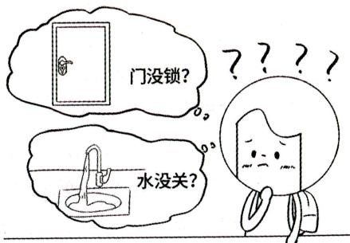  
强迫症

# 3. 原因

(1)社会心理原因，包括学习过度紧张、家庭要求过于严格、学习困难、人际关系不良；(2)个人原因，如胆小怕事、优柔寡断、偏执刻板。

# 4.治疗方法

(1)药物治疗。(2)行为治疗。例如，暴露与阻止反应，主要用于控制当事人的刻板行为。(3)建立支持性环境。(4)森田疗法。强调放弃对强迫行为做无用控制的意图，而采取“忍受痛苦，顺其自然”的态度。

真题8 [2023河南周口，单选]初中中考学生抑制不住地想自己考不上高中，影响了正常学习，这属于（ ）的心理问题。

A. 理想观念

B. 强迫观念

C. 恐惧效应

D. 强迫效应

答案：B

# 考点7 抑郁症

# 1. 概念

抑郁症是以持久的心境低落为特征的神经症。个体有过度的抑郁反应，通常伴随有严重的焦虑感。

# 2. 表现

(1)情绪消极、悲观、颓废、淡漠、失去满足感和对生活的乐趣；(2)消极的认知倾向，低自尊、无能感，对未来期望较低；(3)动机缺乏、被动、缺乏热情；(4)肢体疲劳、失眠、食欲不振。

# 3. 原因

抑郁症产生的原因有各种不同理论的解释。(1)行为主义者认为抑郁症是由于多次不愉快的经历、生活中缺乏强化鼓励造成的；(2)精神分析学派认为抑郁来源于各种丧失和失落（失去爱、失去地位）；(3)认知学派认为抑郁源于个人自我贬低式的思维方式或者不适当的归因方式。

# 4.治疗方法

(1)要给当事人以情感支持与鼓励；(2)采用合理情绪疗法，调整当事人消极的认知状态；(3)积极行动起来，从活动中体验成功与愉快；(4)服用抗抑郁药物。

# 考点8 网络成瘾

# 1. 概念

网络成瘾又称网络成瘾综合征，临床上是指由于患者对互联网过度依赖而导致的一种心理异常症

状以及伴随的一种生理性不适。

# 2. 原因

网络成瘾的原因很复杂，是成瘾个体、网络环境和外部环境多方面相互作用的结果。网络成瘾既取决于青少年自身成瘾的易感性特征，又取决于网络自身能够提供什么及网络对现实社会生活环境的影响。前者是成瘾的内部原因，后者是成瘾的外部原因。

# 3. 矫正方法

(1) 当事人本身可采用行为疗法, 通过控制上网时间和次数, 形成良好的上网习惯; (2) 教师对网络成瘾的学生可以采用认知疗法, 针对网络成瘾问题本身及背后的问题, 如学业不良、自卑心理、人际交往障碍等, 与当事人进行谈话沟通, 探讨如何正确使用互联网, 以及网络成瘾的危害; (3) 由于家庭功能失调造成的网络成瘾, 还可以通过调整家庭成员间的关系, 营造良好的家庭氛围, 为矫正网络成瘾提供条件。

# 五、学生心理健康的维护

# 1.学生个体进行积极的自我调适

自我调适的方法主要有放松训练、认知压力管理、时间管理、社交训练和态度改变、归因训练、加强身体锻炼等。这里主要谈三点：(1)观念改变。学生要学会正确看待学习，培养乐观的人生态度，树立信心；正确认识自己，勇于接纳自己。(2)采取积极的应对策略和归因方式。努力使自己成为更加内控的人，把原因归结为个体可以控制的因素；积极认知，理智、客观地看待压力对自身的影响，形成面对压力的良好心态。(3)合理的饮食和锻炼，保持身体健康。

# 2.学校通过多种方式进行心理健康教育，维护学生心理健康

(1)学校积极开设专门的心理健康教育课和心理卫生教育课，教给学生心理健康的知识和调适心理的方法；(2)学校组织专门的心理老师对学生进行个别心理辅导；(3)平时的课堂教学中注意穿插心理健康教育知识，培养学生积极的心理品质；(4)改变传统应试教育的教学方式和教育理念，提高教师的素质，培养学生对学习的兴趣，杜绝教师伤害事件的发生。

# 3.与家长合作构建社会支持网络

学生心理健康在于家长和学校以及社会的共同作用，主要表现在：(1)学校积极与家长配合，通过班会等形式，共同关注学生的心理健康问题，并且针对问题进行积极交流；(2)学校专门的心理健康教育机构应该为家长提供支持，对家庭教育中存在的问题及其解决提出建议；(3)国家采取切实措施，重视优化学校周边环境，打击不良媒体对学生心理健康的侵蚀，创造有利于学生心理健康发展的社会环境。

# ★本节核心考点回顾 ★

# 1. 心理辅导的目标

学校心理辅导的一般目标可归纳为两个方面：学会调适和寻求发展。

# 2.学校咨询与辅导的基本任务

(1)缺陷矫正：对于极少数长期处于恶劣环境下并已经产生、积累了严重的心理和行为障碍的学生，需要进行系统的矫正。  
(2)早期干预：面向少数学生进行，他们可能已经出现某种程度的心理和行为问题，如果得不到及时的帮助，就可能发展成严重的障碍。  
(3)问题预防：在可能的问题发生之前，主动开展各种形式的工作，提高学生应对将来问题的能力。  
(4)发展指导：面向全体学生进行；主动开展必要的指导活动，帮助学生成功完成心理—社会发展任务。

# 3. 中小学生心理辅导的方法

# (1)行为改变的方法

① 强化法：根据学习原理，一个行为发生后，如果紧跟着一个强化刺激，这个行为就会再一次发生，这种方法用来培养新的适应行为。  
②代币奖励法：代币是一种象征性强化物。当学生做出教师所期待的良好行为后，就发给他们数量相当的代币作为强化物。用代币可以兑换有实际价值的奖励物或活动。  
③行为塑造法：通过不断强化逐渐趋近目标的反应，来形成某种较复杂的行为。

# (2)行为演练的方法

①系统脱敏法：当某些人对某事物、某环境产生敏感反应（害怕、焦虑、不安）时，我们可以在当事人身上发展起一种不相容的反应，使其对本来可引起敏感反应的事物，不再发生敏感反应。  
②肯定性训练：目的是促进个人在人际关系中公开表达自己真实的情感和观点，维护自己的权益也尊重别人的权益，发展人的自我肯定行为。

# 4. 中小学生常见的心理问题

(1)儿童多动综合征：活动过度、注意力不集中、任性冲动。  
(2)学习困难：指在知识的获取、巩固和应用的过程中缺乏策略和技巧，也就是我们常说的没有掌握学习方法。  
(3)考试焦虑：随着考试临近，心情极度紧张等。  
(4)儿童厌学症：对学习不感兴趣，讨厌学习。  
(5)强迫症：强迫观念指当事人身不由己地思考他不想考虑的事情；强迫行为指当事人反复去做他不希望执行的动作。  
(6)抑郁症：以持久的心境低落为特征的神经症。

# 第三节 教师职业心理

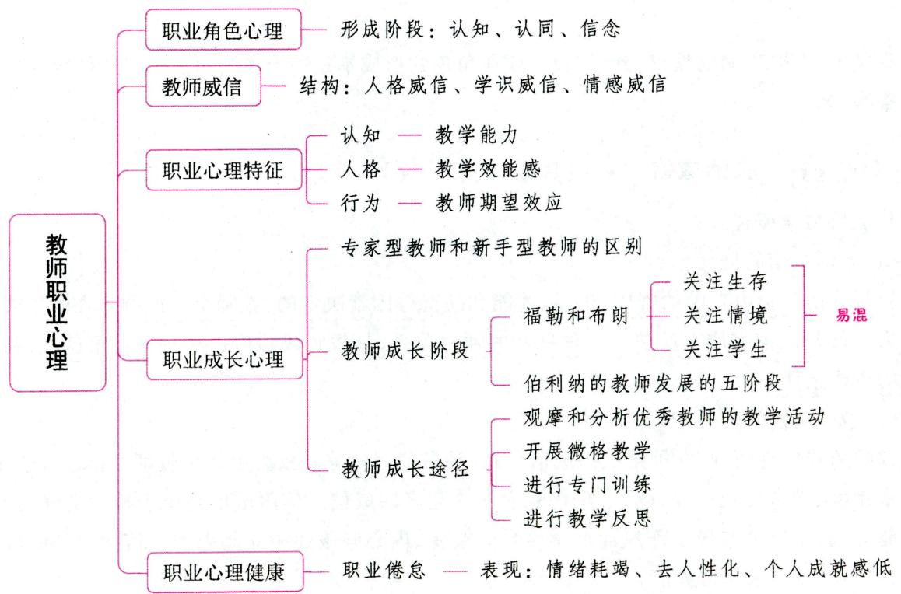

# 一、教师职业角色心理与教师威信

# 考点1 教师的职业角色心理

# 1.教师角色的概念

教师角色是指由教师的社会地位决定的，并为社会所期望的行为模式。也即教师角色代表教师个体在社会团体中的地位和身份，同时包含着许多社会期望教师个体应表现的行为模式，包括社会对教师个人行为模式的期望和教师对自己应有行为的认识两方面。

# 2. 现代教师角色观

社会对每一种社会角色所规定的行为规范和要求，称为角色期待。现代教师角色观主要体现在以下几个方面：(1)学习的引导者和促进者；(2)行为规范的示范者；(3)班集体的管理者；(4)心理健康的维护者；(5)学生成长的合作者；(6)教学的研究者。

# 3.教师职业角色的形成阶段 ★【单选、判断】

教师职业角色的形成是一个连续的过程。通过教学实践，从新手型教师逐渐成长为一个胜任教学工作的熟手型教师，其职业角色的形成主要经历以下三个阶段：

(1)教师角色的认知。角色认知是指角色扮演者对某一角色行为规范的认识和了解，知道哪些行为是合适的，哪些行为是不合适的。角色认知是角色扮演的先决条件。一个人能否成功地扮演某种角色，取决于他对这一角色的认知程度。  
(2)教师角色的认同。教师角色的认同指个体亲身体验并接受教师角色所承担的社会职责，用以控制和衡量自己的行为。  
(3)教师角色的信念。教师角色的信念是指教师在角色扮演中，将职业角色的社会要求转化为个体需要，坚信自己对教师职业的正确认识，并将其作为规范自己行为的指南，形成职业的自尊心和自豪感。

真题1 [2023湖北武汉, 判断]教师职业角色的形成不是一个连续的过程, 是阶段性的。( )

答案：×

# 考点2 教师威信 ★【单选、多选、论述】

# 1.教师威信概述

# (1)教师威信的概念

教师威信是指由教师的资历、声望、才能和品德等因素决定的，教师个人或群体在学生或社会中的影响力。教师威信实质上反映了一种良好的师生关系，是教师成功地扮演教育者角色、顺利完成教育使命的重要条件。

# （2）教师威信的分类

教师的威信有两种：一种是权力威信，另一种是信服威信。权力威信是教师根据教育法律法规、学校规章制度、教育传统以及社会心理优势而建立起来的威信。信服威信是由于教师良好的思想品德、教学能力、教学态度与民主作风而使学生自愿接受、内心佩服而树立起来的威信。教师应该树立信服威信，而不应该追求权力威信。

# (3)教师威信的结构

教师威信主要包括人格威信、学识威信和情感威信三个方面的内容。

# 2. 影响教师威信形成的因素

# (1)教师威信形成的客观条件

①教师在全社会的政治和经济地位、全民族的道德文化素养和尊师重教的良好社会风气是教师威信形成的重要条件；  
②教育行政机关和学校领导对教师工作的信任、关心和支持是提高教师威信的重要条件；  
③家长对教师的态度也是影响教师威信的重要因素。

# (2)教师威信形成的主观条件

①教师的专业素质——教师高尚的思想道德品质、渊博的知识和高超的教育教学艺术是教师获得威信的基本条件。  
②教师的人格魅力——教师的仪表、作风和习惯，是教师获得威信的必要条件。  
③师生关系——师生平等交往是教师获得威信的重要条件。另外，在师生交往过程中，教师给学生的第一印象对教师获得威信有较大影响。  
④教师的评价手段。

# 3. 教师威信的形成与发展

# （1）教师威信形成的过程

教师威信形成的过程,一般来说是由“不自觉威信”向“自觉威信”发展。新教师在学生心目中是有一定吸引力的,是有一定威信的,但这种威信是短暂的“不自觉威信”。随着学生对教师德才方面逐渐了解,师生之间情感的日益加深和融洽,教师的威信就由“不自觉威信”发展成为“自觉威信”,这才算是真正的威信。当然,教师必须经过不断地努力,“不自觉威信”才有可能发展为“自觉威信”,否则“不自觉威信”也可能逐渐消失。

# (2) 建立教师威信的途径

①培养自身良好的道德品质。良好的道德品质是教师获得威信的基本条件。②培养良好的认知能力和性格特征。良好的认知能力和性格特征是教师获得威信所必需的心理品质。③注重良好仪表、风度和行为习惯的养成。④给学生以良好的第一印象。⑤做学生的朋友与知己。

# (3)教师威信的维护

①教师要有坦荡的胸怀、实事求是的态度；②教师要正确认识和合理运用自己的威信；③教师要有不断进取的敬业精神；④教师要言行一致，做学生的楷模。

# 二、教师的职业心理特征

# 考点1 教师的认知特征 ★★ 【单选、多选】

# 1.教师的知识结构

一般认为，教师的知识结构主要包括：（1）专业学科内容知识；（2）教育教学知识；（3）心理学的知识；（4）实践性知识。

# 2. 教师的教学能力

教师的教学能力包括：(1)组织和运用教材的能力；(2)言语表达能力；(3)组织教学的能力；(4)对

学生学习困难的诊治能力；(5)教学媒体的使用能力；(6)教育机智等。

一般认为，教师的教学能力分成以下几个方面：

# (1)教学认知能力

教学认知能力是指教师对所教学科的定理、法则和概念等的概括化程度，以及对所教学生的心理特点和自己所使用的教学策略的理解程度。

教师的认知特征主要包括以下三个方面：

① 观察力特征。教师的观察力是了解学生个性特征、发挥教育机智、因材施教的前提，因此，善于观察学生是教师教育能力结构的基本要素。  
②思维特征。教师从观察中获得的材料，必须经过思维的加工才能形成教育决策，因此，思维能力是教师职业素养的重要标志。  
③注意力特征。注意力对于教师的教育教学活动具有增强清晰度和调控的功能，可以使教师在教育教学活动中进行细致的观察，提高感受性，记忆准确，思维敏锐，从而提高教育教学效果。教师注意力的特点集中表现在注意分配能力上。

# (2)教学操作能力

教学操作能力是指教师在教学中使用策略的水平,其水平高低主要看他们是如何引导学生掌握知识、积极思考、运用多种策略解决问题的,它是教师课堂教学能力的集中体现。

# (3)教学监控能力

教学监控能力是指教师在教学过程中，对正在进行的教学活动进行不断的自我认识和反思，而不是机械地推进教学计划和步骤。教师的教学监控能力是其教学能力中最重要的成分，是教学能力的核心。

在这个教学能力结构中，教学认知能力是基础，教学操作能力是教学能力的集中体现，而教学监控能力是关键。

真题2 [2023黑龙江哈尔滨，多选]教师的教学能力包括（）

A. 教学计划能力

B. 教学操作能力

C. 教学认知能力

D. 教学监控能力

答案：BCD

# 考点2 教师的人格特征 ★【单选】

# 1. 职业信念

有关职业信念的心理学研究主要集中在以下两个方面：

# （1）教学效能感

①教学效能感的概念和种类

教学效能感一般指教师对自己影响学生行为和学习结果的能力的一种主观判断。这种判断会影响教师对学生的期待和指导，从而影响教师的工作效率。阿西顿曾认为，优秀教师具有较强的自我效能感，表现在优秀教师有个人成就感，认为从事的教学活动很有价值，对学生有正向的期望，并认为教师对学生的学习应负有责任。

教学效能感又分两个部分：一般教学效能感和个人教学效能感。前者指教师对教与学的关系、教育在学生身心发展中的作用等问题的一般看法和判断；后者指教师认为自己能够有效地影响学生，相

信自己具有教好学生的能力。

② 提高教师的教学效能感的方法

提高教师的教学效能感需要从教师自身和外部环境两方面入手。

从教师的自身方面来说：第一，要形成科学的教育观；第二，向他人学习；第三，教师要注意对自己的教学进行总结和反思，不断改进自己的教学。

从教师所处的外部环境来说：第一，在社会上，必须树立尊师重教的良好风气；第二，在学校内，必须建立一套完整、合理的管理制度和规则并严格加以执行，以及努力创立进修、培训等有利于教师发展和实现其自身价值的条件。另外，良好的校风建设、提高福利待遇等措施也会对教师的教学效能感产生积极的影响。

# (2)教学归因

教学归因是指教师对学生学习结果的原因的解释和推测，这种解释和推测所获得的观念必然会影响其自身的教学行为。例如，倾向于将原因归于外部因素的教师，往往会更多地将学生的学习结果归结于学生的能力、教学条件等因素，因而，在其面对挫折时，就比较倾向于采取职业逃避策略，做出听之任之或者怨天尤人的消极反应。

# 2.职业性格

有研究认为, 优秀教师的性格品质的基本内核是“促进”, 即对别人的行为有所帮助。教师的“促进”主要表现在三个方面: (1)理解学生; (2)与学生相处; (3)了解自己。

真题3 [2024福建统考，单选]“教师对自己影响学生行为和学习成绩能力的主观判断”是（）

A. 教学归因

B. 教学认知能力

C. 教学监控能力

D. 教学效能感

答案：D

考点3 教师的行为特征 ★★ 【单选、判断、辨析】

# 1.教师的教学行为

教师的教学行为可以从以下六个方面来衡量：(1)教学行为的明确性，即教师的教学行为是否明确；(2)教学方法的多样性，即教师的教学方法是否灵活、多样，调动学生学习的积极性的手段是否有效；(3)任务取向，即教师在课堂上的所有活动是否围绕教学任务而进行；(4)富有启发性，即教师的课堂教学对学生是否启发得当；(5)参与性，即在课堂教学过程中，班上的学生是否都积极地参与到教学活动中去；(6)及时评估教学效果，即教师能否及时掌握学生的学习状况和课堂中出现的问题，并据此调整自己的教学节奏和教学行为。如果一个教师在教学中能做到这六个方面，那么其教学行为应是非常恰当的，教学效果也必然会好。

# 2.教师的期望行为

# (1)教师期望效应

教师期望效应也叫罗森塔尔效应或皮格马利翁效应，即教师的期望或明或暗地传递给学生，会使学生按照教师所期望的方向来塑造自己的行为。教师期望效应的发生，既取决于教师自身的因素，也取决于学生的人格特征、原有认知水平、归因风格和自我意识等心理因素。在实际教育过程中，教师期望效应不一定经常被引起，因为还需要其他因素的影响。但是不管怎样，教师对所有的对象都抱有较

高的期望，热情对待，肯定会提高教育效果的。

# 知识再拔高·

# 教师期望效应实验

罗森塔尔和雅各布森最早对教师期望进行了研究。他们在开学初对小学生进行了一个非言语智力测验，并告诉教师这个测验能预测学生的智力发展。研究者随机选取 $20\%$ 的学生，然后将学生名单告诉教师，并称这些学生是有发展潜力的。当然，教师并不知道该测验并不能够预测智力的发展潜力，也不知道所选取的学生与测验分数无关。然后，教师进行正常教学。一年后，被指定为有发展潜力的学生和控制组的学生（没有指定为有发展潜力者）之间出现了智力上的显著差异，这种差异在一年级和二年级的学生身上表现得最为突出。罗森塔尔等人将这一实验中的现象称为教师期望效应。

教师期望效应有两类：第一类为自我应验效应，即由原先错误的期望引起并把这个错误的期望变成现实的行为。如果某同学的父亲是著名的文学家，那他的老师很自然地认为他具有成为出色的作家的潜力，假设该学生文学天赋平平，但这个老师对其满腔热情，表达对其能力的十足信心，鼓励他经常练习，常常对其作业进行额外的批改。结果这种对待使他果真成为优秀的小作家。但如果老师不特别对待这位学生，结果就不会是这样，这就可看作是自我应验效应。第二类是维持性期望效应。即老师认为学生将维持以前的发展模式。其问题在于，如果老师认可这种模式，将很难注意和利用学生潜在能力的发展。例如，老师对后进生和优等生的不同期望，使得他很难关注后进生的进步，甚至对其进步持怀疑态度，认定他是在别人的帮助下甚至是作弊得到的。这种期望维持甚至增大了优等生和后进生的差距。

# (2)教师期望对学生的影响

多数心理学家认为，教师期待的自我实现预言效应确实是存在的。在日常教育中，经常可以发现，如果教师喜欢某些学生，对他们抱有较高期待，一段时间后，教师会将自己暗含期待的感情微妙地传递给学生，使这些学生更加自尊、自信、自爱、自强，诱发出一种积极向上的激情，这些学生常常像老师所期待的那样有所进步。相反，如果教师厌恶某些学生，对学生期待较低，一段时间后，学生也会感受到教师的“偏心”，也常常像老师所期待的那样一天天变差。教师的这种期待产生了相互交流的反馈，出现了教师期待的效果。

真题4 [2024福建统考，单选]提出教师期望效应（即皮格马利翁效应）的心理学家是（ ）

A.班杜拉

B.托尔曼

C. 考夫卡

D. 罗森塔尔

真题5 [2023广东深圳，单选]皮格马利翁效应体现了教师的（ ）对学生的影响。

A. 人格

B. 能力

C. 期望

D. 知识

答案：4.D 5.C

# 三、教师特征与职业成就的关系 ★【单选、判断】

教师的认知能力(认知特征)和人格特征与教学效果有着尤其密切的关系。

# 1.教师的认知特征与职业成就之间的关系

许多研究表明，在智力与知识达到一定水平之后，教师的表达能力、组织能力、诊断学生学习困难

的能力以及他们思维的条理性、系统性、合理性与教学效果有较高的相关。研究表明，学生的知识学习同教师表达的清晰度有显著的正相关，教师讲解的含糊不清与学生的学习成绩存在负相关；教师思维的流畅性与他们的教学效果有显著的正相关；如果教师在这些方面能力较强，则学生的成绩好。教师的这些特点对小学生的影响更大。

# 2. 教师的人格特征与职业成就之间的关系

在教师的人格特征中,有两个重要特征对教学效果有显著影响:一是教师的热心和同情心;二是教师富于激励和想象的倾向性。研究表明,善于激励、生动活泼、富于想象并热心于自己学科的教师,他们的教学工作较为成功。在教师的激励下,学生的行为更富有建设性。还有的研究发现,教师对学生思想的认可与学生成绩有正相关的趋势,尽管教师的表扬次数与学生的成绩之间未发现明确的关系,但教师的批评或不赞成,与学生的成绩之间却存在着负相关。

真题6 [2024江苏苏州, 单选]教育心理学研究认为, 教师的表达能力、组织能力与教学效果存在着（）

A. 较高的相关   
B. 比较低的相关  
C. 无相关  
D. 无法确定其关系

答案：A

# 四、教师的职业成长心理

# 考点1 专家型教师和新手型教师的区别 ★★ 【单选、多选、判断】

研究者认为，教师的成长过程是一个由新手到熟手再向专家型教师发展的过程。专家型教师是有教学专长的教师。专家型教师和新手型教师有如下差异：

# 1.课时计划的差异

表 3-27 专家型教师与新手型教师的课时计划差异  

<table><tr><td>比较范畴</td><td>专家型教师</td><td>新手型教师</td></tr><tr><td>课时计划的内容</td><td>突出了课程的主要步骤和教学内容,并未涉及一些细节;修改与演练所需大部分时间都是在正式计划的时间之外,自然地在一天中的某个时候发生</td><td>把大量的时间用在课时计划的一些细节上;要在临上课之前针对课时计划做一下演练</td></tr><tr><td>教学的细节</td><td>教学的细节方面是由课堂教学活动中学生的行 为决定。他们可以从学生那里获得一些有关教学细节的问题</td><td>课时计划往往依赖于课程的目标,仅限于课堂中的一些活动或一些已知的课程知识,而不能够把课堂教学计划与课堂情境中的学生行为联系起来</td></tr><tr><td>制订课时计划</td><td>根据学生的先前知识来安排教学进度。他们认为实施计划是要靠自己去发挥的。因此,他们的课时计划就有很大的灵活性</td><td>仅仅按照课时计划去做,并想办法去完成它,却不会随着课堂情境的变化来修正他们的计划</td></tr><tr><td>备课</td><td>表现出一定的预见性。他们会在头脑中形成包括教学目标在内的课堂教学表象和心理表征,并且能预测执行计划时的情况</td><td>认为自己不能预测计划执行时的情况,因为他们往往更多地想到自己做什么,而不知道学生将要做些什么</td></tr></table>

# 2. 课堂教学过程的差异

表 3-28 专家型教师与新手型教师的课堂教学过程差异  

<table><tr><td>比较范畴</td><td>专家型教师</td><td>新手型教师</td></tr><tr><td>课堂规则的制订与执行</td><td>课堂规则明确,并能坚持执行</td><td>课堂规则较为含糊,难以坚持执行</td></tr><tr><td>维持学生注意</td><td>有一套完善的维持学生注意的方法</td><td>相对缺乏完善的维持学生注意的方法</td></tr><tr><td>教材内容的呈现</td><td>注重回顾先前的知识,并能根据教学内容选择适当的教学方法</td><td>不能很好地呈现教材内容</td></tr><tr><td>课堂练习</td><td>看作检查学生学习的手段</td><td>仅仅把练习当作必经的步骤</td></tr><tr><td>家庭作业的检查</td><td>具有一套检查学生家庭作业的规范化、自动化的常规程序</td><td>缺乏相应的检查学生家庭作业的规范</td></tr><tr><td>教学策略的运用</td><td>具有丰富的教学策略,并能灵活运用</td><td>或缺乏或不会运用教学策略</td></tr></table>

# 3.课后评价差异

在课后评价时，专家型教师和新手型教师关注的焦点不同。新手型教师的课后评价要比专家型教师更多地关注课堂中发生的细节。而专家型教师则更多地谈论学生对新材料的理解情况和他认为课堂中值得注意的活动，很少谈论课堂管理问题和自己的教学是否成功。

# 4. 其他差异

(1)在师生关系方面，专家型教师能热情、平等地对待学生，师生关系融洽，具有强烈的成就体验；  
(2)在人格魅力方面，专家型教师具有注重实际和自信心强的人格特点，能更好地控制和调节情绪，理智地处理面临的教育教学问题，并在课后进行评估和反思；  
(3)在职业道德方面，专家型教师对职业的情感投入程度高，职业义务感和责任感强。

真题7 [2023辽宁锦州，判断]与新教师相比，专家型教师的课后教学评价会更多地关注课堂中发生的细节，会评估自己的教学是否成功。（）

A. 正确

B. 错误

答案：B

# 教师的成长阶段

# 【单选、填空、判断】

# 1. 福勒和布朗的教师成长的三阶段

福勒和布朗根据教师的需要和不同时期所关注的焦点问题，把教师的成长划分为关注生存、关注情境和关注学生三个阶段。

# (1) 关注生存阶段

处于关注生存阶段的一般是新教师，他们非常关注自己的生存适应性，最担心的问题是“学生喜欢我吗”“同事们如何看我”“领导是否觉得我干得不错”等。因而，他们可能会把大量的时间花在如何与学生搞好个人关系上，想方设法控制学生，而不是更多地考虑如何让学生获得学习上的进步。

# (2) 关注情境阶段

处于关注情境阶段的教师关心的是如何教好每一堂课，以及班级大小、时间压力和备课材料是否充分等与教学情境有关的问题，如“内容是否充分得当”“如何呈现教学信息”“如何掌握教学时间”等。

传统教学评价集中关注这一阶段，一般来说，老教师比新教师更关注此阶段。

# (3)关注学生阶段

当教师顺利地适应了前两个阶段后, 成长的下一个目标便是关注学生。教师将考虑学生的个别差异, 认识到不同发展水平的学生有不同的需要, 根据学生的差异采取适当的教学, 促进学生发展。能否自觉关注学生是衡量一个教师是否成熟的重要标志之一。

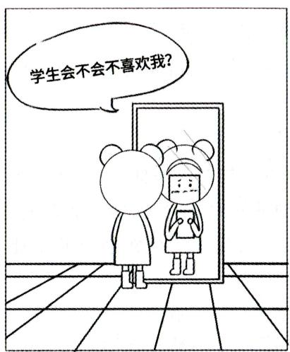  
关注生存阶段

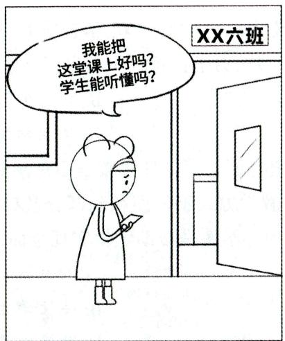  
关注情境阶段

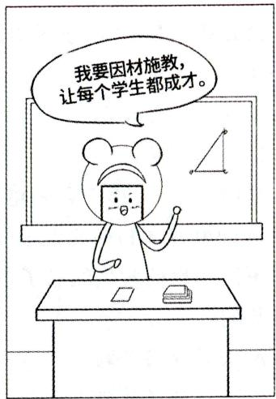  
关注学生阶段

# 2. 伯利纳的教师发展的五阶段

伯利纳在职业专长发展五阶段理论的基础上，提出了教师成长与发展的五阶段理论，即新手教师、熟练新手教师、胜任型教师、业务精干型教师和专家型教师五个阶段。

# (1)新手教师阶段

新手教师是经过系统的师范教育与专业学习,刚刚从事教学工作的教师。新手教师的特征主要表现为:①新手教师通常是理性的,在分析和思考的基础上处理问题;②新手教师处理问题缺乏灵活性;③新手教师处理问题时,刻板地依赖特定的原则、规范和计划。在这个阶段,教师的主要需求是了解与教学有关的实际情况,熟悉具体的教学情境,积累教学经验。

# (2)熟练新手教师阶段

随着知识和经验的积累，经过2~3年，新手教师逐渐发展成为熟练新手教师。熟练新手教师的特征主要表现在：①实践经验与书本知识逐渐整合，并逐步掌握了教学过程中的内在联系；②教学方法和策略方面的知识与经验有所提高，处理问题时表现出一定的灵活性；③经验对教学行为的指导作用提高，但还不能够很好地区分教学情境中的重要信息和无关信息；④对自己的教学行为还缺乏一定的责任感。

# (3)胜任型教师阶段

大部分熟练新手教师经过教学实践和职业培训，经过3~4年成为胜任型教师，这是教师发展的基本目标。胜任型教师的特征主要表现在：①教学行为有明确的目的性；②能够区分出教学情境中的重要信息，并选择有效的方法或手段达到教学目标；③对自己的行为结果表现出更多的责任心，对于成功和失败表现出强烈的情绪情感反应；④教学行为还没有达到足够快捷、流畅和灵活的程度。

# (4)业务精干型教师阶段

在成为胜任型教师后，经过5年左右的知识和经验积累，有相当部分的教师成为业务精干型教师。业务精干型教师的特征主要表现在：①具有较强的直觉判断能力；②教学技能方面接近认知自动化水

平；③教学行为已经达到了快捷、流畅和灵活的程度。

# (5)专家型教师阶段

专家型教师阶段是教师发展的最终阶段，只有部分业务精干型教师在以后的职业发展中成为专家型教师。专家型教师的特征主要表现在：①处理问题的非理性倾向；②对教学情境的观察与判断的直觉性；③教学技能达到了完全自动化水平。

真题8 [2024广东佛山, 单选]小何老师从师范学校毕业一年后, 对讲课积累了一定的经验, 同时她还花费了大量时间与学生打成一片, 力求让每一个学生都喜欢她。她目前的情况属于( )

A. 关注教学阶段

B. 关注生存阶段

C. 关注情境阶段

D. 关注学生阶段

真题9 [2023广西贵港, 单选]钟老师在日常教学中总感觉现行教材的灵活性不足, 学校所大力倡导的分组教学和探究性学习的教学方式不能照顾到部分基础薄弱的学生。因此, 她花费大量时间, 针对不同层次的学生编制了不同的导学案来帮助学生实现全面发展。由此可以推测, 钟老师正处于教师成长的( )

A. 关注生存阶段

B. 关注学生阶段

C. 关注情境阶段

D. 关注发展阶段

真题10 [2022江苏苏州，判断]衡量教师是否成熟的主要标志是能否更多地考虑课堂管理。（）

答案：8.B 9.B 10.×

考点3 教师成长的途径 ★★ 【单选、判断、判断选择】

教师成长与发展的基本途径主要有两个方面：（1)通过师范教育培养新教师作为教师队伍的补充；(2)通过实践训练提高在职教师的素质。具体来说，促进教师成长有以下几种方法：

# 1. 观摩和分析优秀教师的教学活动

课堂教学观摩可分为组织化观摩和非组织化观摩。组织化观摩是有计划、有目的的观摩，非组织化观摩则没有这些特征。一般来说，为培养和提高新教师与教学经验欠缺的年轻教师宜进行组织化观摩，这种观摩可以是现场观摩，如组织听课，也可以是观看优秀教师的教学录像。非组织化观摩要求观摩者有相当完备的理论知识和洞察力，否则，难以达到观摩学习的目的。

# 2. 开展微格教学

微格教学是指以少数的学生为对象, 在较短的时间内 (5~20 分钟), 尝试做小型的课堂教学, 并把这种教学过程摄制成录像, 课后再进行分析。这是训练新教师、提高其教学水平的一条重要途径。微格教学有许多特点, 但最能体现其特点的是训练单元小。

# 3. 进行专门训练

教师的成长与发展也可以通过专门的教学能力训练来实现，如训练新教师掌握教学过程中有效的教学策略等。研究表明，专家型教师所具有的教学技能和教学策略是可以教给新教师的，新教师在掌握这些知识后，会在一定程度上促进其教学。但同时也要明白，仅仅通过学习专家型教师的经验是远远不够的，新教师还应注重对自身教学经验的反思，使两者有效结合，才能真正提高自己的教学水平。

# 4. 进行教学反思（反思教学经验）

教学反思是指教师以自己的教学活动为意识对象，对自己的教育理念、教学行为、决策以及由此所

产生的结果进行认真的自我审视、评价、反馈、控制、调节、分析的过程。教学反思一直以来是教师提高个人业务水平的一种有效手段。教学反思的过程一般为：具体体验 $\rightarrow$ 观察分析 $\rightarrow$ 抽象地重新概括 $\rightarrow$ 积极地验证。教学反思的成分有：(1)认知成分；(2)批判成分；(3)教师的陈述。

布鲁巴奇等人认为教学反思的方法主要有：(1)反思日记。在每一天教学工作结束后，要求教师写下自己的经验，并与指导教师共同分析。(2)详细描述。教师相互观摩彼此的教学，详细描述看到的情境，并对此进行讨论分析。(3)交流讨论。来自不同学校的教师聚集在一起，主要的工作是：第一，提出课堂上发生的问题；第二，共同讨论解决问题的办法；第三，得到的方案为所有教师共享。(4)行动研究。为弄清课堂上遇到的问题的实质，探索用以改进教学的行动方案，教师以及研究者可以进行调查和实验研究，这不同于研究者由外部进行的旨在探索普遍法则的研究，而是直接着眼于教学实践的改进。

另外，教学反思的方法还有教学案例和教师成长档案袋。教师成长档案袋是一种教师成长的历史记录，是一种实质性的文档，是一种学习工具。教师成长档案袋包括以下内容：(1)教师个人基本信息及分析；(2)教师不同领域的工作进展情况。

美国教育心理学家波斯纳提出了教师成长公式：经验 $+$ 反思 $=$ 成长。

真题11 [2022河北衡水，判断]开展微格教学是训练新教师、提高其教学水平的一条重要途径。（）

答案：√

# 五、教师的职业心理健康

# 考点1 教师心理健康的标准

(1)能积极地悦纳自我；(2)有良好的教育认知水平；(3)热爱教师职业，积极地爱学生；(4)具有稳定而积极的教育心境；(5)能控制各种情绪与情感；(6)和谐的教育人际关系；(7)能适应和改造教育环境；(8)具有教育独创性。

# 考点2 影响教师心理健康的主要因素

(1)主观方面：教师的心理健康受其人格特征、心理素质等自身因素的制约。  
(2)客观方面：①家庭、学校、社会环境的影响不容忽视，如教学工作量繁重而复杂，节奏紧张，教师不堪重负；②工资待遇和社会地位与劳动强度不成正比，挫伤积极性，使教师缺乏成就感和前途感；③学校组织中人际关系复杂；④家庭关系不和谐等。

# 考点3 职业压力与职业倦怠 ★★ 【单选、多选、论述、案例分析】

# 1. 职业压力

(1) 概念

教师的职业压力主要是由工作引起的，是教师对来自教学情境的刺激产生的情绪反应。

(2)职业压力的来源

了解教师职业压力的来源，帮助教师有效地应对，是维护和促进教师心理健康的重要途径。伍尔若和梅将教师职业压力按性质的不同分为五类：①中心压力——较小的压力及日常的麻烦；②外围的压力——教师经历的重大生活事件或压力情节；③预期性压力——教师预先考虑到的令人不愉快的事件；④情境压力——教师现在的心境；⑤回顾压力——教师对自己过去的压力事件及相关经历进行的评价。

# 2.职业倦怠

# (1) 概念

长期的职业压力会导致教师的职业倦怠。职业倦怠是个体在长期的职业压力下,缺乏应对资源和应对能力而产生的身心耗竭状态。教师的职业倦怠是在长期工作压力和自身心理素质的互动下形成的,并带来生理、情绪、认知和行为等方面的问题,导致教师出现严重的身心疾病。

# (2)职业倦怠的表现

玛勒斯等人认为职业倦怠主要表现为三个方面：①情绪耗竭，指个体情绪情感处于极度的疲劳状态，工作热情完全丧失；②去人性化（去人格化），即刻意在自身和工作对象间保持距离，对工作对象和环境采取冷漠和忽视的态度；③个人成就感低，表现为消极地评价自己，贬低工作的意义和价值。

美国心理学家法贝将职业倦怠分为三种表现形式：

① 精疲力竭型。这类教师在高压力下的表现是放弃努力,以减少对工作的投入来求得心理平衡。这类教师的职业倦怠一旦出现,要想恢复就很困难,因为这些症状会得到自我强化。  
②狂热型。这类教师有着极强的成功信念，能狂热地投入工作，但理想与现实之间的巨大反差，使他们的这种热情通常坚持不了太长时间，整个信念系统突然塌陷，最终屈服于精力耗竭。  
③低挑战型。对于这类教师而言,工作本身缺乏刺激,他们觉得以自己的能力来做当前的工作是大材小用,因而厌倦工作。他们在工作一段时间后,就开始对工作敷衍塞责,并考虑更换其他工作。

# (3)职业倦怠的原因

教师职业倦怠产生的心理紧张源有：①社会因素，即教师职业的声望压力；②职业因素，即教师担当的多种角色所产生的角色职责压力、角色冲突、学生问题、升学考试压力等；③工作环境，即教师与学生、家长、领导、同事之间的人际关系压力，学校的考评、聘任制度所带来的压力；④个人因素，即教师个人的认知方式和应对紧张的策略与心理压力的产生密切相关。

# (4)职业倦怠的干预

合理的预防、积极的应对以减少和消除职业倦怠的方法主要有以下三点：

①个体的自我干预。个体干预的目的是通过改变个体自身的某些特点来增强其适应工作环境的能力。个体干预的主要方法有：放松训练、时间管理、社交训练、压力管理和态度改变等。以下是个体干预职业倦怠的几种有效建议：首先，观念的改变。其次，积极的应对策略和归因方式。最后，合理的饮食和开展锻炼。  
②组织的有效干预。组织干预的思路是通过削减过度的工作时间、降低工作负荷、明确工作任务、积极沟通与反馈来防止和缓解职业倦怠。学校对教学的评价机制是影响教师工作的积极性和创造性的重要因素，改善学校领导方式是缓解教师职业压力的有效途径。  
③构建社会支持网络。减少和消除职业倦怠，需要建立一个和谐的社会支持网络。首先，对教师的角色期待进行合理定位；其次，国家应切实采取措施提高教师的经济待遇和社会地位，维护教师的合法权利，使教师切实感受到社会的尊重；最后，教育部门应探索出有效的教师教育培训体系，将职前与职后培训有机结合起来，提高教师智力方面与非智力方面的水平，重视教师承受压力和自我缓解压力的训练。

真题12 [2023广西贵港，多选]下列属于职业倦怠的表现的有（）

A. 新的职位渴求

B. 去人格化

C. 个体成就感低

D. 情绪耗竭

答案：BCD

# 考点4 教师心理健康的维护

教师心理健康的维护主要体现在学校、社会及教师自身三个方面。其中，学校和社会的关心与重视是维护教师心理健康的必要外部因素和前提条件，而教师自身积极、主动和科学的自我维护则是保障教师心理健康状态的内部动因和根本途径。

# 1. 社会支持策略

教师的心理健康问题往往是各种社会问题在教育领域中的反映，因此，维护教师的心理健康仅靠一所学校和教师个体的努力是远远不够的，启动教师心理健康教育的社会工程，建立教师心理健康发展的社会支持系统势在必行。

# 2.学校发展策略

学校管理者对教师工作与生活的关心和激励，是维护教师心理健康的主要外部因素，同时也是调动教师工作积极性、优化学校管理工作效能的核心内容。

# 3. 自我维护策略

在社会高度重视教师心理健康、学校全力促进教师心理健康的前提下，要想真正提高教师的心理健康水平，教师个人加强自我维护才是根本途径。(1)教师应该树立科学理性的自我概念。(2)教师要保持一种开放的心态，勤于学习。(3)教师要掌握一些应对压力的策略和方法，进行积极的自我调适，避免消极情绪的影响。

# ★本节核心考点回顾 ★

# 1.教师职业角色的形成阶段

教师职业角色的形成是一个连续的过程，主要经历以下三个阶段：(1)教师角色的认知；(2)教师角色的认同；(3)教师角色的信念。

# 2.教师的教学能力

(1)教学认知能力：教师对所教学科的定理、法则和概念等的概括化程度。  
(2)教学操作能力：教师在教学中使用策略的水平。  
(3)教学监控能力：教师在教学过程中，对正在进行的教学活动进行不断的自我认识和反思，这是教学能力的核心。

# 3. 教学效能感

教学效能感一般指教师对自己影响学生行为和学习结果的能力的一种主观判断。

# 4.教师期望效应

教师期望效应又叫罗森塔尔效应、皮格马利翁效应，即教师的期望或明或暗地传递给学生，会使学生按照教师所期望的方向来塑造自己的行为。

# 5. 专家型教师和新手型教师的区别

(1) 制订课时计划方面: 新手型教师仅仅按照课时计划去做, 并想办法去完成它, 却不会随着课堂情境的变化来修正他们的计划。  
(2)课后评价差异方面：新手型教师的课后评价要比专家型教师更多地关注课堂中发生的细节，而专家型教师则更多地谈论学生对新材料的理解情况和他认为课堂中值得注意的活动，很少谈论课堂管理问题和自己的教学是否成功。

# 6. 教师成长的阶段（福勒、布朗）

(1) 关注生存阶段：一般是新教师，他们非常关注自己的生存适应性。  
(2) 关注情境阶段：关注如何教好每一堂课，以及与教学情境有关的问题。  
(3)关注学生阶段：考虑学生的个别差异，根据学生的差异采取适当的教学，促进学生发展。能否自觉关注学生是衡量一个教师是否成熟的重要标志之一。

# 7.教师职业倦怠的表现

(1)玛勒斯等人认为职业倦怠主要表现为三个方面：

①情绪耗竭：个体情绪情感处于极度的疲劳状态，工作热情完全丧失；  
②去人性化：刻意在自身和工作对象间保持距离，对工作对象和环境采取冷漠和忽视的态度；  
③个人成就感低：消极地评价自己，贬低工作的意义和价值。

(2)法贝将职业倦怠分为三种表现形式：

① 精疲力竭型：放弃努力，以减少对工作的投入来求得心理平衡。  
②狂热型：有着极强的成功信念，能狂热地投入工作，但理想与现实之间的巨大反差，使他们的这种热情通常坚持不了太长时间，整个信念系统突然塌陷，最终屈服于精力耗竭。  
③低挑战型：觉得以自己的能力来做当前的工作是大材小用，因而厌倦工作。在工作一段时间后，就开始对工作敷衍塞责，并考虑更换其他工作。

# 04

# 第四部分

# 教育法律法规

# 内容导学

本部分内容共分为三章。  
- 第一章主要介绍教育法律基础知识，考查题型一般为选择、判断等客观题。  
- 第二章主要介绍现行主要的教育法律法规,是教育法律法规部分的考查重点,考查题型主、客观均会涉及。  
• 第三章主要介绍依法执教与教师违法(侵权)行为,考查题型主、客观均会涉及,常结合教学实例进行考查。  
考生应重点掌握第二章的内容，并结合历年真题和每章的栏目有重点地复习。对于以客观题为主要考查形式的知识点，应注重识记和理解；对于以主观题为主要考查形式的知识点，不仅要做到识记和理解，更要能灵活运用。  
为了方便考生梳理知识脉络，我们在各章设置思维导图和核心考点回顾。

# 本部分学习指南

# 一、考情概况

本部分属于考试中重点考查的内容，分布较为广泛，需要识记的内容较多。考生可带着以下学习目标进行备考：

1. 了解我国教育法规的体系结构和教育法学基础知识。  
2. 掌握我国现行主要的教育法律法规。  
3. 理解依法执教的含义。  
4. 掌握教师违法(侵权)行为的主要类型及其表现形式。

# 二、考点地图

<table><tr><td>考点</td><td>年份/地区/题型</td></tr><tr><td>《中华人民共和国教育法》</td><td>2024山东单选;2024安徽单选;2024广东多选;2023辽宁单选、判断;2023湖南单选;2023广东单选;2023湖北判断;2022安徽单选;2022浙江单选;2022福建填空</td></tr><tr><td>《中华人民共和国义务教育法》</td><td>2024安徽单选;2024福建填空;2024江苏判断;2023山西单选;2023广东多选;2023贵州判断</td></tr><tr><td>《中华人民共和国教师法》</td><td>2024贵州单选;2024河北单选;2024江苏单选;2024广东判断;2024安徽简答;2023广东单选;2023山东多选;2023河北多选</td></tr><tr><td>《中华人民共和国未成年人保护法》</td><td>2024福建单选;2024安徽单选;2024山东单选;2024浙江判断;2023山西单选;2023辽宁多选;2023广东判断;2022河南单选;2022安徽判断</td></tr><tr><td>《学生伤害事故处理办法》</td><td>2024安徽单选;2024河北单选;2023辽宁单选</td></tr><tr><td>教师违法(侵权)行为的主要类型及其表现形式</td><td>2024安徽单选;2024广东单选;2023山西单选;2023河北单选、判断;2023湖北判断;2022内蒙古单选;2022河南多选</td></tr></table>

注：上述表格仅呈现重要考点的相关考情。