# 第一章 教育法律基础

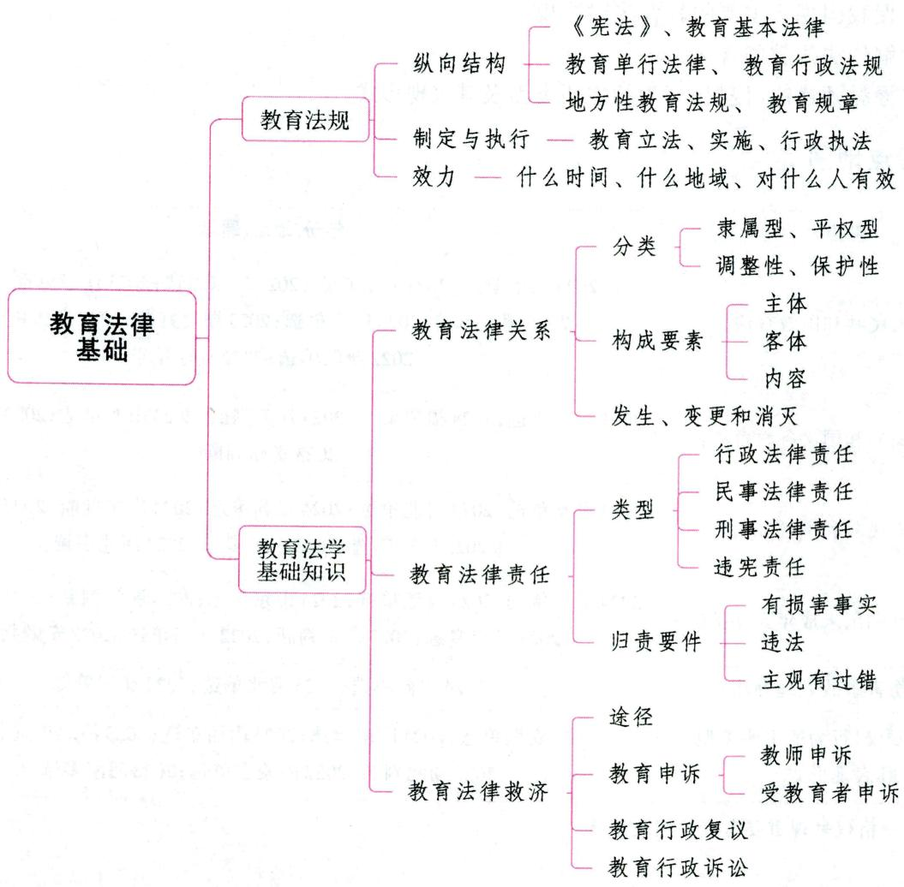

# 第一节 教育法规概述

# 一、教育法规与教育政策 ★【单选、判断】

# 考点1 教育法规

# 1. 教育法规的内涵

教育法规，是指国家权力机关和国家行政机关为调整教育与经济、社会、政治的关系，调整教育内部各个环节的关系而制定和发布的教育法律、法令、条例、规程、制度等规范文件的总称。它是兴办教

育事业所必须遵循的准则、依据和规范，是国家领导、组织、管理教育，促进教育事业健康发展的重要工具，是国家法制建设的重要组成部分。教育法律是由国家权力机关(或称立法机关)制定或认可的关于教育的规范性文件。在我国，由全国人大制定的法律称为基本法律；由全国人大常委会通过的法律称为一般法律。

# 2. 教育法的特点

(1)教育法作为一般社会规范和法律所具有的特点：①教育法具有国家意志性。②教育法具有强制性。③教育法具有规范性。④教育法具有普遍性。一是在国家权力所及的范围内，教育法律具有普遍的约束力；二是教育法律面前人人平等，不存在适用对象的例外。  
(2)教育法区别于其他社会规范和法律的特点：①教育法律关系成立的单向性；②教育相对主体调整的民主性；③教育强制措施施行的柔软性；④教育行政管理方式的指导性；⑤教育法规具体内容的广泛性。

# 考点2 教育政策

# 1. 教育政策的概念

教育政策是一种有目的、有组织的动态发展过程，是政党、政府等政治实体为实现一定历史时期的教育目的和任务而规定的行动依据和准则。

# 2. 教育政策的功能

(1)导向功能。教育政策的导向功能，是指教育政策对教育教学活动和人们的行为具有指导作用。通常从两个方面表现出来：一是为教育事业的发展提出明确的目标，二是推出一整套旨在促进教育发展的重大措施。  
(2)协调功能。教育政策的协调功能,是指教育政策在社会发展过程中具有协调和平衡各种教育关系的作用。  
(3)控制功能。任何教育政策都是为了解决一定的教育问题或者预防某一教育问题的出现而制定的，它具有约束和规范人们行为的作用，这就是教育政策的控制功能。教育政策的控制功能有两个特点：一是强制性，二是惩罚性。

# 考点3 教育法规与教育政策的关系

# 1. 教育法规与教育政策的联系

(1) 教育法规与教育政策都决定于上层建筑, 具有共同的目的; (2) 教育政策是制定教育法规的依据, 教育法规是教育政策的具体化、条文化和定型化; (3) 教育政策决定教育法规的性质, 教育法规的内容体现教育政策; (4) 教育政策是实施教育法规的指导, 教育法规是实现教育政策的保证。

# 2. 教育法规与教育政策的区别

(1) 教育法规和教育政策的制定主体不同；(2) 教育法规和教育政策的执行方式不同；(3) 教育法规和教育政策的规范效力不同；(4) 教育法规和教育政策调整和适用的范围不同；(5) 教育法规和教育政策所要解决问题的性质不同。

真题1 [2022广西桂林，判断]教育政策的协调功能是指教育政策在社会发展过程中具有协调和平衡各种教育关系的作用。（）

答案：√

# 二、教育法规的体系结构 ★★ 【单选、判断】

# 考点1 纵向结构

教育法规体系的纵向结构，是指由不同层级的教育法律文件组成的等级、效力有序的纵向体系。由于制定机关的性质和法律地位不同，上下层次的教育法规之间具有从属关系。我国教育法律体系的纵向结构为：

# 1.我国《宪法》中有关教育的条款

《中华人民共和国宪法》由最高国家权力机关(全国人民代表大会)制定,具有最高的法律地位和法律效力,是国家的根本大法,是其他一切法律法规制定的依据。《中华人民共和国宪法》中有关教育的条款是我国教育立法的根本依据,是教育法规的最高层次,其他形式的教育法律、法规都不得与之相违背。

# 2. 教育基本法律

教育基本法律是由全国人民代表大会制定,调整教育内部、外部相互关系的基本法律准则。它对整个教育全局起宏观调控作用,或称为“教育宪法”“教育母法”。我国的教育基本法律为1995年第八届全国人民代表大会第三次会议通过的《中华人民共和国教育法》。

# 3. 教育单行法律

教育单行法律一般是由全国人民代表大会常务委员会制定的,规定教育领域某一方面具体问题的规范性文件,其效力低于《中华人民共和国宪法》和教育基本法,如《中华人民共和国教师法》《中华人民共和国职业教育法》《中华人民共和国高等教育法》等。

# 4. 教育行政法规

教育行政法规是行政法规的形式之一，是由最高国家行政机关(国务院)依据《中华人民共和国宪法》和教育法律制定的关于教育行政管理的规范性文件，其效力低于《中华人民共和国宪法》和教育法律，高于地方性教育法规和教育规章。它们内容广泛、数量众多，在实际工作中起主要作用。教育行政法规的名称一般有三种：条例、规定、办法或细则，如《征收教育费附加的暂行规定》《教师资格条例》等。

# 5. 地方性教育法规

地方性教育法规是地方国家权力机关制定的规范性文件的专称，由省、自治区、直辖市和设区的市、自治州的人民代表大会及其常务委员会制定。地方性教育法规只在该行政区域内有效，不得同宪法、法律、行政法规相抵触，其名称通常有条例、办法、规定、规则、实施细则等，如《上海市中小学校学生伤害事故处理条例》《河南省实施<中华人民共和国义务教育法>办法》《山东省职业教育条例》等。

# 6.教育规章

教育规章是中央和地方有关国家行政机关依照法定权限和程序制定颁布的有关教育的规范性文件，有的称为教育行政规章，包括部门教育规章和地方政府教育规章。

(1)部门教育规章是国务院所属各部、各委员会发布的有关教育的规范性文件。这类文件主要是就国家有关教育的法律、行政法规的实施问题制定出相应的实施办法、条例、大纲、标准等，以保证相关法律、法规的实施，如《中小学幼儿园安全管理办法》。  
(2)地方政府教育规章是省、自治区、直辖市和设区的市、自治州的人民政府所制定的有关教育的规范性文件。地方政府教育规章只在本行政区域内有效，其效力低于《中华人民共和国宪法》、教育法律、教育行政法规和地方性教育法规。地方政府教育规章是整个教育法规体系的重要组成部分。

真题2 [2022四川统考，判断]《中华人民共和国义务教育法》和《中华人民共和国教师法》处于同一法律效力等级。（）

答案：√

# 考点2 横向结构

教育法规体系的横向结构是指依据教育法规所调整的教育社会关系的特点或教育关系构成要素的不同，划分出若干处于同一层级的部门教育法，形成法规调整的横向体系。我国教育法规体系的横向结构主要包含以下几个部类：(1)教育基本法；(2)基础教育法；(3)高等教育法；(4)职业教育法；(5)成人教育或社会教育法；(6)学位法；(7)教师法；(8)教育投入法或教育财政法。

# 三、教育法规的制定与执行

# 考点1 教育立法

# 1. 教育立法的概念

教育立法即教育法的制定，是指国家立法机关依照法律程序制定规范性教育法律文件的活动。立法有广义和狭义两种理解。广义的教育立法是指一切国家机关依照法定职权和程序，制定、修改和废止教育法规的活动。狭义的教育立法是指最高国家权力机关及其常设机关，依据法定权限和程序制定、修改和废止教育专门法律的活动，在我国指全国人大及其常委会制定、修改和废止教育法律的专门活动。教育立法是实现依法治教的前提和基础。

# 2. 教育立法的基本程序

法律制定的程序又称立法程序，立法的程序一般分为四个步骤：草案的提出、草案的审议、草案的表决和通过、法律的公布。

# 3. 教育立法的原则与要求

(1) 必须坚持子法从属于母法的原则；(2) 必须反映法律规范的基本特征；(3) 必须同党的教育方针、政策保持一致；(4) 教育法规的制定，需要参照其他相关法规的精神与原则，以协调好教育法规与其他法规的关系；(5) 必须从我国的国情出发，从实际出发，实事求是，遵循民主化与科学化的原则；(6) 借鉴外国教育立法的有益经验。

# 考点2 教育法规实施

# 1. 教育法规实施的含义

教育法规实施，是教育法制运行的中心环节。教育法规的实施，是指教育法律规范在教育实践过程中的具体运用和实行。

# 2. 教育法规实施的原则

教育法规实施的原则，是指在教育法规实施的过程中应该遵循的基本准则。教育法规的实施作为实现依法治教的重要手段，必须遵循教育性、效力性、民主性、平等性原则。

# 3. 教育法规实施的方式

教育法规的实施可以有两种方式，即教育法规的遵守和适用。

(1)教育法规的遵守

教育守法亦称教育法规的遵守，是教育法规实施的一种基本方式，它是指国家机关及其工作人员、社会团体和公民自觉按照教育法规的规范要求去行为。无论是依法作为，还是依法不作为，都属于守法的范畴。教育法规的遵守是法的自律性实施，是教育法律关系主体自觉地运用教育法律规范去规范自己的行为，因此，它对教育法规的实施具有更为现实的意义。社会各方面自觉地遵守教育法规是教育法规实施的主要方式。

(2)教育法规的适用

①教育法规适用的概念

教育法规的适用有广义和狭义之分。广义的教育法规适用，包括国家权力机关、行政机关和国家司法机关及其公职人员依照法定权限与程序，将教育法规运用于具体的人或组织的专门活动。狭义的教育法规适用，则专指国家司法机关依照法定的职权和程序，运用教育法处理各种案件的专门活动，即教育司法。教育法规的适用是法的他律性实施，是指当教育法律关系主体自己不去实施相应法律规范时，由国家专门机关强制实施的方式。教育法律纠纷的存在是教育司法的前提，即只有当存在教育法律纠纷需要解决时，教育司法才成为必要。

②教育法规适用的要求

首先，公正准确是教育司法活动的灵魂和生命。其次，合法合理是教育司法活动的准则。最后，及时高效是教育司法工作的必备条件。

③教育法规适用的基本原则

第一，尊重事实，依法办案原则；第二，司法平等原则；第三，司法独立原则。

# 考点3

# 教育行政执法

# 1. 教育行政执法的含义

教育行政执法是指国家教育行政机关及其所属工作人员依照法定职权和程序所采取的对公民、社会组织或其他社会力量产生直接影响的有关教育的权利和义务，或者对其教育权利与义务的行使和履行进行监督的行政管理活动。

# 2. 教育行政执法的特征

教育行政执法的基本特征：（1)国家意志性；(2)法律性；(3)强制性；(4)单方权威性；(5)主动性。

教育行政执法行为区别于一般行政执法行为的特殊特征：(1)主体多元性和内容丰富性；(2)公益性；(3)执法对象的内部性和外部性。

# 3.教育行政执法的原则 ★【单选】

(1)合法性原则。教育行政执法必须在法定职权范围内进行；教育行政执法必须符合法定的执法程序；教育行政执法的内容与手段必须符合有关法律规定；教育行政执法主体既然拥有某种职权，就必须使用才合法，否则也构成违法。  
(2)越权无效原则。这一原则是由合法性原则引申而出的，并对合法性原则进行反证。其含义是指超越法定职权范围内的教育行政执法行为属于无效行为。  
(3)应急性原则。应急性原则是指根据公共利益的需要，在紧急情况下，采取的非法行为可以有效。应急性原则是合法性原则的一种特殊情况。  
(4)合理性原则。合理性原则是指在进行教育行政执法时，所采取的措施、手段等在内容上要客

观、适度、符合理性。这一原则是针对教育行政执法中存在自由裁量权而提出的。

(5)公开、公正原则。教育行政执法还应遵循公开、公正原则。只有做到公开、公正，才便于监督，并能使执法过程成为法制教育过程。

# 4. 教育行政执法的形式

常见的教育行政执法有教育行政许可、教育行政处罚、教育行政强制措施、教育行政强制执行和教育行政奖励等形式，下面主要介绍教育行政处罚。

教育行政处罚是指国家教育行政机关依法对违反教育行政管理秩序的相对人进行惩戒、制裁的行为。它以相对人的行为违反了教育法律、法规为前提，通过教育行政处罚，惩治个人或实体的违法行为，恢复教育法律秩序。

# 四、教育法规的效力

教育法规的效力问题，是指法律在什么时间、什么地域、对什么人有效的问题，即法律规范在时间、地域、对象等方面的效力问题。明确教育法规的效力，是正确执行教育法规的必要条件。

判断和确定教育法律的效力等级通常应遵循以下原则：(1)下位法服从上位法；(2)特殊法优于一般法；(3)后定法优于前定法；(4)特定程序法律优于一般程序法律；(5)被授权机关的立法等同于授权机关自己的立法。

# 第二节 教育法学基础知识

# 一、教育法律关系

# 考点1 教育法律关系的概念及特征 ★【多选、判断】

# 1. 教育法律关系的概念

教育法律关系是教育法律规范在调整人们有关教育活动的行为过程中形成的权利和义务关系，是一种特殊的社会关系。在教育领域内，学校与政府、学校与社会、学校与教师、学校与学生的关系因为有相应的法律规定，故皆属于法律关系。

# 2. 教育法律关系的特征

教育法律关系的特征有：(1)教育法律关系的发生以教育法律规范的存在为前提；(2)教育法律关系必须是在教育教学活动过程之中发生的；(3)教育法律关系是以权利和义务为内容的社会关系。

# 考点2 教育法律关系的分类 ★【单选】

表 4-1 教育法律关系的分类  

<table><tr><td>分类依据</td><td>类别</td><td>概念</td></tr><tr><td rowspan="2">教育法律关系主体的社会角色</td><td>教育内部的法律关系</td><td>适用教育法律规范调整的教育系统内部各类教育机构、教育工作人员、教育对象之间的关系</td></tr><tr><td>教育外部的法律关系</td><td>适用教育法律规范调整的教育系统与其外部社会各方面之间发生的法律关系</td></tr><tr><td rowspan="2">主体之间关系的类型</td><td>隶属型教育法律关系</td><td>以教育管理部门为核心,向外辐射,与其他主体之间形成的教育法
律关系</td></tr><tr><td>平权型教育法律关系(教育民事法律关系)</td><td>两个具有平等法律地位的教育关系主体之间产生的教育法律关系</td></tr><tr><td rowspan="2">教育法律规范的职能</td><td>调整性教育法律关系</td><td>按照调整性教育法律规范所设定的教育关系模式,主体的教育权利
能够正常实现的教育法律关系</td></tr><tr><td>保护性教育法律关系</td><td>在教育主体的权利和义务不能正常实现的情况下,通过保护性教育
法律规范,采取法律制裁手段而形成的教育法律关系</td></tr></table>

# 考点8 教育法律关系的构成要素 ★【单选、多选、判断】

教育法律关系的构成要素有主体、客体和内容，三者相互制约、缺一不可，其中任何一个要素的改变，都会导致原有法律关系的变更。

# 1. 教育法律关系的主体

教育法律关系的主体是指教育法律关系的参加者，也就是在具体的教育法律关系中享有权利并承担义务的人和组织。我国教育法律关系的主体可分为三类：公民（自然人）、机构和组织（法人）、国家。

教育法律关系中最重要的法律主体是教师与学生，教师的教育教学和学生的学习是教育活动的主要内容和基本形式。教师与学生之间的法律关系是产生教师与学生权利、义务的基础。教师与学生之间的法律关系包括：(1)教育和被教育的关系；(2)管理和被管理的关系；(3)保护和被保护的关系；(4)互相尊重的平等关系。

# 2. 教育法律关系的客体

教育法律关系的客体是教育法律关系主体的权利与义务所指向的对象。教育法律关系的客体一般包括物质财富、非物质财富、行为三个大的方面。教育领域中存在的法律纠纷，往往都是因之而引起的。

# (1)物质财富

物质财富简称物。它既可以表现为自然物，如森林、土地、自然资源等，也可以表现为人的劳动创造物，如建筑、机器、各种产品等；既可以是国家和集体的财产，也可以是公民个人的财产。物一般可分为动产与不动产两类，动产包括资金和教学仪器设备等，不动产包括土地、房屋和其他建筑设施等。

# (2) 非物质财富

非物质财富包括创作活动的产品和其他与人身相联系的非财产性的财富。前者也被称作智力成果，在教育领域中主要包括各种教材、著作在内的成果，各种有独创性的教案、教法、教具、课件、专利、发明等。其他与人身相联系的非物质财富，包括公民的姓名或组织的名称，公民的肖像、名誉、身体健康、生命等。

# (3)行为

行为是指教育法律关系主体实现权利义务的作为与不作为。一定的行为可以满足权利人的利益和需要，也可以成为教育法律关系的客体。在教育领域中，教育行政机关的行政行为、学校的管理行为

和教育教学行为都是教育法律关系赖以存在的最基本的行为。

# 3. 教育法律关系的内容

# (1)教育法律关系内容的含义

教育法律关系的内容是教育法律关系的主体依据法律规定而享有的权利与承担的义务。教育法律关系一旦产生,其主体间就在法律上形成了一种权利与义务关系。

# (2)教育法律权利和教育法律义务

教育法律权利指的是教育法律关系的主体依据教育法律规范享有的某种权能或利益，表现为教育法律关系的主体可以做出一定的作为或不作为，也可以要求他人做出一定的作为或不作为。教育法律义务是指教育法律关系的主体依据教育法律规范的规定必须承担的某种责任，表现为教育法律关系的主体必须做出一定的作为或不作为。

# 考点4 教育法律关系的发生、变更和消灭

# 1. 教育法律关系发生、变更和消灭的概念

(1)教育法律关系的发生,是指教育法律关系主体之间形成了一定的权利义务关系。例如,某个适龄儿童进入某校学习,即和该校发生了一定的权利义务关系。  
(2)教育法律关系的变更，是指教育法律关系构成要素的改变，包括主体、客体或内容等要素的改变。例如，甲乙两校签订了联合办学合同，在履行合同的过程中，由于遇到了新情况，甲乙两校经过协商修改了合同中的某些条款，从而引起了原合同关系内容的部分改变。  
(3)教育法律关系的消灭，是指教育法律关系主体间权利义务的终止。例如，学校向某一企业借款而形成了民事法律关系（债权关系），学校为债务人，企业为债权人。届时学校依照合同返还了借款，则与该企业的债权关系归于消灭。

# 2. 法律事实是教育法律关系发生、变更和消灭的根据

教育法律关系的发生、变更和消灭是由一定的客观情况的出现而引起的。通常把能够引起法律关系发生、变更和消灭的客观情况称为法律事实。法律事实依据它是否以教育法律关系主体的意志为转移，可以分为行为和事件。事件是不以主体的意志为转移的法律事实，如某教师的死亡，会导致一系列法律关系的变化。行为是以主体的意志为转移的法律事实，包括作为和不作为，如挪用教育经费、体罚学生、校舍失修倒塌伤人等。

# 二、教育法律责任

# 考点1 教育法律责任的概念与特征

# 1. 教育法律责任的概念

教育法律责任是教育法律关系主体因实施了违反教育法的行为，依法应承担的带有强制性的法律后果。这一概念主要包含以下几层含义：

(1)存在违法行为是承担教育法律责任的前提。(2)教育法律责任的承担者是具有遵守法定义务的教育法律关系主体。(3)法律责任与法律制裁紧密相连。法律制裁是特定国家机关对违法者依法追究法律责任而采取的惩罚措施。法律责任作为一种否定性的法律后果，体现在国家对违反教育法律、法规的行为的制裁方面。

# 2. 教育法律责任的特征 ★ 【判断】

(1)法律规定性。法律责任由法律规范事先明确规定，具有法律规定性。它使行为人在实施行为之前能够预测自己的行为所应承担的责任，从而对行为人履行法定义务起到督促和警示作用，保证正常稳定的社会关系。  
(2)国家强制性。法律责任由国家强制力保证实施，具有国家强制性。法律责任具有普遍的约束力，是维护社会正常秩序的有力手段，人人必须遵守，任何违法者不得逃避或拒不承担。  
(3)法律责任的专权追究性。法律责任的追究，是由国家司法机关或国家授权的行政机关来执行的，即法律责任的专权追究性，任何个人或其他组织都无权行使这一职权。  
(4) 归责的特定性。法律责任由违法的教育法律关系主体所承担，即负责的特定性。

# 考点2 教育法律责任的类型 ★【单选、多选、判断】

根据违法主体的法律地位、违法行为的性质和危害程度的不同，教育法律责任主要可分为行政法律责任、民事法律责任和刑事法律责任三种。在特定情况下还可以追究违宪责任。

# 1.行政法律责任

行政法律责任是指行为人因实施行政违法行为而应承担的法律责任，简称行政责任。

行政法律责任主要包括行政处罚和行政处分。

# (1)行政处罚

行政处罚是指行政机关依法对违反行政管理秩序的公民、法人或者其他组织，以减损权益或者增加义务的方式予以惩戒的行为。

《中华人民共和国行政处罚法》中规定的行政处罚的种类有：①警告、通报批评；②罚款、没收违法所得、没收非法财物；③暂扣许可证件、降低资质等级、吊销许可证件；④限制开展生产经营活动、责令停产停业、责令关闭、限制从业；⑤行政拘留；⑥法律、行政法规规定的其他行政处罚。

# (2)行政处分

行政处分是由国家机关或企事业单位对其所属人员予以的惩戒措施，包括警告、记过、记大过、降级、撤职、开除。行政处分有时也称纪律处分。

# 2.民事法律责任

民事法律责任是指由于实施民事违法行为所导致的赔偿或补偿的法律责任，简称民事责任。

# 3.刑事法律责任

刑事法律责任是指由于实施刑事违法行为所导致的受刑罚处罚的法律责任，简称刑事责任。刑事责任是一种惩罚最为严厉的法律责任。

# 4.违宪责任

教育作为宪法确定的公民基本权利之一，与宪法所规定的教育基本制度密切相关。同时，依据宪法和有关教育法的规定，公民对义务教育以外的其他教育具有选择的自由，参与平等竞争的自由，以及教育者具有学术自由等。这些权利的获得，均以宪法为根本来源。因此，在一定情况下，产生违宪责任也是可能的。

此外，涉及共同违法的教育案例处置中，行政法律责任、民事法律责任和刑事法律责任可能会综合

出现，即对案例中各违法主体所处的不同地位、所做出的不同行为及其主观过错的不同程度等，分别予以不同的制裁。

真题1 [2023广东深圳, 判断]学校教职员工对未成年人实施体罚、变相体罚或者其他侮辱人格行为的, 应由相关部门责令改正; 情节严重的, 依法给予处分。这里的责令改正属于行政处罚。( )

答案：×

# 考点3 教育法律责任的归责要件 ★【单选、多选】

所谓归责，是指法律责任的归结。它要解决的是法律责任应该由谁来承担的问题。教育法律关系主体只有具备以下四个教育法律责任的归责要件，才被认定为教育法律责任主体，承担相应的法律后果。

# 1. 有损害事实

有损害事实是指行为人有侵害教育管理、教学秩序及从事教育教学活动的公民、法人和其他组织合法权益的客观事实存在。这是构成教育法律责任的前提条件。

违法对社会所造成的损害有两种情况：(1)违法行为造成了实际的损害，如体罚学生致使学生身体受到伤害；(2)违法行为虽未实际造成损害，但已存在这种可能性，如有关部门明知学校房屋有倒塌的危险，却拒不拨款维修。

违法行为造成的损害后果，表现为物质性的后果和非物质性的后果。物质性的后果具体、有形、能够计量，如挪用学校建设经费，其数额可以计算。非物质性的后果抽象、无形、难以计量，如教师侮辱学生，造成学生精神上、心理上长期的伤害，则无法计量。

# 2. 损害行为必须违法

行为违法即行为人实施了违反法律、法规的行为，这也是构成教育法律责任的前提条件。这个条件包括两个方面的含义：(1)行为的违法性，只有行为违反了现行法律的规定才是违法行为；(2)违法必须是一种行为。如果内在的思想不表现为外在的行为，则并不构成违法。社会主义法制原则不承认思想违法。

# 3. 行为人主观有过错

所谓过错，是指行为人在实施行为时，具有主观上的故意或过失的心理状态。

所谓故意的心理状态，是指行为人明知自己的行为会发生危害社会的结果，并且希望或者放任这种结果发生。例如，招生办公室主任收受贿赂后，有意招收分数低的学生，不招收分数高的学生，致使分数高的学生落榜。

所谓过失的心理状态，是指行为人应当预见自己的行为可能发生危害社会的结果，因为疏忽大意而没有预见，或者已经预见而轻信能够避免，以致发生危害结果。例如，教师教育方式不当，对学生进行人格侮辱后，学生因不堪忍受而自杀，该教师的行为即有过失的因素。

# 4. 违法行为与损害事实之间具有因果关系

违法行为是导致损害事实发生的原因，损害事实是违法行为造成的必然结果，二者之间存在着内在的必然的联系。因果关系是承担法律责任的重要条件之一。

# 三、教育法律救济

# 考点1 教育法律救济概述

# 1. 教育法律救济的概念及特征

教育法律救济是指教育法律关系主体的合法权益受到侵犯并造成损害时，获得恢复和补救的法律制度。在教育领域中主要运用的法律救济方式包括教师申诉制度、受教育者申诉制度、行政复议、行政诉讼、行政赔偿和民事诉讼。

教育法律救济的特征体现在：(1)是宪法公平、正义的立法精神的体现；(2)纠纷的存在是教育法律救济的基础；(3)损害的发生是教育法律救济的前提；(4)补救受害者的合法权益是教育法律救济的根本目的；(5)法律救济具有权利性；(6)具有补救与监督双重作用。

# 2. 教育法律救济的作用

(1)保护教育法律关系主体。(2)维护教育法律的权威。(3)促进教育行政部门依法行政。(4)有利于推进教育法制建设。

# 3.教育法律救济的途径 ★ 【单选、多选】

法律救济的途径是指相对人的合法权益受到损害时,请求救济的渠道和方式。法律救济的渠道有四种:行政渠道、司法渠道、仲裁渠道和调解渠道。其中,行政渠道、仲裁渠道和调解渠道统称为非诉讼渠道。

(1)行政渠道。行政救济渠道主要有行政申诉和行政复议两种方式。行政救济是教育法律救济的主要方式。  
(2)司法渠道。司法渠道又称诉讼渠道，是指相对人就特定的侵权行为向人民法院提起诉讼，请求救济。  
(3) 仲裁渠道。仲裁渠道与行政、司法渠道不同。仲裁是建立在纠纷双方自愿平等的基础上，由非国家机关的仲裁机构以平等的第三者身份进行的活动。  
(4)调解渠道。调解有司法调解、行政调解、民间调解三种形式。

# 4. 教育法律救济的基本原则

(1)事后救济；(2)主管职权专属；(3)正当程序。

# 考点2 教育申诉制度

教育申诉制度是指作为教育法律关系主体的公民，在其合法权益受到侵害时，向国家机关申诉理由，请求处理的制度。我国的教育申诉制度主要有教师申诉制度和受教育者申诉制度。

# 1.教师申诉制度 ★★ 【单选、判断】

（1）教师申诉制度的概念及特征

所谓教师申诉制度，是指教师在其合法权益受到侵犯时，依照法律、法规的规定，向主管的行政机关申诉理由，请求处理的制度。教师申诉制度具有如下特征：①法律性；②特定性；③非诉讼性。

(2)教师申诉的范围

根据《中华人民共和国教师法》的规定，教师申诉的范围包括：

①教师认为学校或其他教育机构侵犯其《中华人民共和国教师法》规定的合法权益的，可以提起申诉。

②教师对学校或其他教育机构作出的处理决定不服的，可以提出申诉。  
③教师认为当地人民政府的有关行政部门侵犯其根据《中华人民共和国教师法》规定享有的合法权益的，可以提出申诉。需特别指出的是，这里的被诉对象只能是当地人民政府隶属的行政机关，而不能是当地人民政府。其他企业、事业单位或个人侵犯教师合法权益的，不列入教师申诉制度的范围。

# (3)教师申诉的程序

教师申诉程序包括提出申诉、申诉受理和申诉处理三个环节，并依次进行。教师的申诉应当以书面形式提出。

教育行政部门应当在接到申诉的30日内，作出处理。逾期未作处理或者久拖不决的，若申诉内容涉及人身权、财产权及其他属于行政复议、行政诉讼受案范围的，申诉人可依法提起行政复议或行政诉讼。

真题2 [2024江苏常州，单选]王老师因擅自在校外从事影响教育教学本职工作的兼职兼薪行为，被学校解聘。他对学校的处理决定不服，向当地教育行政部门提出申诉，教育行政部门应当（）

A. 在接到申诉的十日内作出处理

B. 在接到申诉的十五日内作出处理

C. 在接到申诉的二十日内作出处理

D. 在接到申诉的三十日内作出处理

答案：D

# 2. 受教育者申诉制度 ★ 【判断】

(1)受教育者申诉制度的概念和特征

受教育者申诉制度即学生申诉制度，是指受教育者在其合法权益受到侵害时，依法向主管的行政机关申诉理由，请求处理的制度。受教育者申诉制度具有与教师申诉制度相同的法律性、特定性和非诉讼性。

(2)受教育者申诉的范围

根据《中华人民共和国教育法》的规定，学生申诉的范围包括：

①对学校作出的各种处分不服，如警告、严重警告、记过、留校察看、勒令退学、开除学籍等，可以提出申诉；  
②对学校或教师侵犯其人身权，如在教育活动中对其进行体罚或变相体罚，限制其人身自由权等，可以提出申诉；  
③对学校或教师侵犯其财产权，如非法乱收费、乱摊派、乱罚款，非法没收其财物，强迫其购买非必需教学物品等，可以提出申诉；  
④对学校或教师侵犯其知识产权可以提出申诉，如教师剽窃学生的著作权、发明权或其他科技成果权，学校强行将学生的知识产权收归学校等。

(3)受教育者申诉制度的程序

和教师申诉制度一样，受教育者申诉制度也有提出申诉、申诉受理和申诉处理等环节。学生可以以口头或书面形式提出申诉。

# 考点3 教育行政复议

# 1. 教育行政复议的概念

教育行政复议是指教育行政相对人(如学校、教师)认为教育行政机关作出的行政行为侵犯其合法权

益，依法向作出该行为的机关的上一级教育行政机关或该机关所属的本级人民政府提出申请，受理申请的行政机关对发生争议的具体行政行为进行复查并作出决定的活动。

# 2. 教育行政复议的范围

根据我国《行政复议法》关于行政复议范围的规定，并结合我国教育行政管理的实际，我国教育行政复议的范围主要包括：（1）对教育行政机关作出的教育行政处罚决定不服的；（2）对教育行政机关作出的教育行政强制措施、教育行政强制执行决定不服的；（3）认为符合法定条件申请教育行政许可，教育行政机关拒绝或者在法定期限内不予答复，或者对教育行政机关作出的有关行政许可的其他决定不服的；（4）认为教育行政机关侵犯其经营自主权的；（5）认为教育行政机关违法集资、摊派费用或者违法要求履行其他义务的；（6）申请教育行政机关履行保护人身权利、财产权利、受教育权利等合法权益的法定职责，教育行政机关拒绝履行、未依法履行或者不予答复；（7）认为教育行政机关的其他具体行政行为侵犯其合法权益的。

# 3. 教育行政复议的程序

(1)申请。教育行政复议申请可以自知道或者应当知道该行政行为之日起60日内提出行政复议申请。申请人申请行政复议，可以书面申请；书面申请有困难的，也可以口头申请。  
(2)受理。它是指教育行政复议机关基于相对人的申请，经审查认为符合法律规定的申请条件，决定立案并准备审理的行为。  
(3)审理。它是教育行政复议的中心阶段。  
(4)决定。它是指对案件进行审理后，在判明具体行政行为的合法性、正当性的基础上，有关机关作出相应的裁断。复议机关应在复议期限内（自受理申请之日起60日或30日内）作出决定。  
(5)执行。复议决定生效后就具有国家强制力，复议双方应自觉履行，否则，将强制执行。

# 考点4 教育行政诉讼

# 1. 教育行政诉讼的概念

教育行政诉讼，是指教育行政相对人认为教育行政机关的具体行政行为侵犯其合法权益，依法向人民法院起诉，请求给予法律救济，并由人民法院对该行政行为进行审查和裁判的诉讼救济活动。

# 2. 教育行政诉讼的范围

关于我国教育行政诉讼的具体受案范围，《中华人民共和国行政诉讼法》第十二条和第十三条分别做出了明确的规定。在教育行政诉讼中，教育行政案件的涉案范围主要集中在：(1)对教育行政处罚不服的；(2)认为符合法定条件申请行政许可，教育行政机关拒绝或者在法定期限内不予答复，或者对教育行政机关作出的有关行政许可的其他决定不服的；(3)申请教育行政机关履行保护人身权、财产权的法定职责，而教育行政机关拒绝履行或者不予答复的；(4)认为教育行政机关违法要求其履行义务的；(5)认为教育行政机关侵犯其人身权、财产权等合法权益的。

# 3. 教育行政诉讼的程序

(1)起诉和受理。起诉是公民、法人或其他组织依法向人民法院提出诉讼请求的诉讼行为，将产生一定的法律后果。人民法院在接到起诉状时对符合《中华人民共和国行政诉讼法》规定的起诉条件的，应当登记立案。对当场不能判定是否符合《中华人民共和国行政诉讼法》规定的起诉条件的，应当接收起诉状，出具注明收到日期的书面凭证，并在七日内决定是否立案。不符合起诉条件的，作出不予立案的裁定。裁定书应当载明不予立案的理由。原告对裁定不服的，可以提起上诉。

(2) 审理和判决。我国行政诉讼实行两审终审制，二审作出的判决和裁定为终审的判决裁定，案件到此为止，即最后审结，如果发现确有错误，可以再经审判监督程序予以纠正。  
(3)执行。执行程序是诉讼活动的最后阶段。公民、法人或者其他组织拒绝履行判决、裁定、调解书的，行政机关或者第三人可以向第一审人民法院申请强制执行，或者由行政机关依法强制执行。

# ★ 本章核心考点回顾 ★

# 1. 教育法规的纵向结构

(1)我国《宪法》中有关教育的条款；(2)教育基本法律；(3)教育单行法律；(4)教育行政法规；(5)地方性教育法规；(6)教育规章。

# 2. 教育法律关系的主体

(1)范围：公民（自然人）、机构和组织（法人）、国家；  
(2)教育法律关系中最重要的法律主体：教师与学生。

# 3. 教育法律责任的类型

(1)行政法律责任；(2)民事法律责任；(3)刑事法律责任；(4)违宪责任。

# 4. 教育法律责任的归责要件

(1)有损害事实；(2)损害行为必须违法；(3)行为人主观有过错；(4)违法行为与损害事实之间具有因果关系。

# 5. 教育法律救济的途径

(1)行政渠道；(2)司法渠道；(3)仲裁渠道；(4)调解渠道。

# 6.教师申诉制度

(1)概念：教师在其合法权益受到侵犯时，依照法律、法规的规定，向主管的行政机关申诉理由，请求处理的制度；  
(2)申诉程序：提出申诉、申诉受理和申诉处理；  
(3)处理时间：教育行政部门应当在接到申诉的30日内，作出处理。

# 第二章 现行主要的教育法律法规

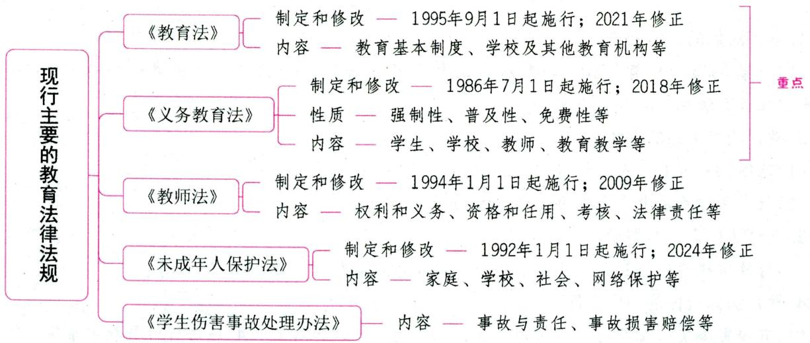

# 第一节 《中华人民共和国教育法》

# 一、《中华人民共和国教育法》的制定和修改 ★ 【单选】

《中华人民共和国教育法》于1995年3月18日第八届全国人民代表大会第三次会议通过，并由中华人民共和国主席令第45号公布，自1995年9月1日起施行。这是新中国成立以来我国制定的第一部教育基本法，这是我国教育史上具有里程碑意义的大事。它的颁行，标志着我国开始进入全面依法治教的新时期。

《中华人民共和国教育法》进行过三次修改：（1）根据2009年8月27日第十一届全国人民代表大会常务委员会第十次会议《关于修改部分法律的决定》进行第一次修正；（2）根据2015年12月27日第十二届全国人民代表大会常务委员会第十八次会议《关于修改<中华人民共和国教育法>的决定》进行第二次修正；（3）根据2021年4月29日第十三届全国人民代表大会常务委员会第二十八次会议《关于修改<中华人民共和国教育法>的决定》进行第三次修正。

真题1 [2024安徽合肥/淮北/铜陵, 单选]2021年4月29日第十三届全国人民代表大会常务委员会第二十八次会议通过的《关于修改<中华人民共和国教育法>的决定》是我国《教育法》的（）

A.第一次修正

B. 第二次修正

C. 第三次修正

D. 第四次修正

答案：C

# 二、《中华人民共和国教育法》的节选内容 ★★★ 【单选、多选、填空、判断】

# 第一章 总 则

第一条 为了发展教育事业，提高全民族的素质，促进社会主义物质文明和精神文明建设，根据宪法，制定本法。

第四条 教育是社会主义现代化建设的基础，对提高人民综合素质、促进人的全面发展、增强中华民族创新创造活力、实现中华民族伟大复兴具有决定性意义，国家保障教育事业优先发展。

全社会应当关心和支持教育事业的发展。

全社会应当尊重教师。

第五条 教育必须为社会主义现代化建设服务、为人民服务，必须与生产劳动和社会实践相结合，培养德智体美劳全面发展的社会主义建设者和接班人。

第六条 教育应当坚持立德树人，对受教育者加强社会主义核心价值观教育，增强受教育者的社会责任感、创新精神和实践能力。

国家在受教育者中进行爱国主义、集体主义、中国特色社会主义的教育，进行理想、道德、纪律、法治、国防和民族团结的教育。

第八条 教育活动必须符合国家和社会公共利益。

国家实行教育与宗教相分离。任何组织和个人不得利用宗教进行妨碍国家教育制度的活动。

第九条 中华人民共和国公民有受教育的权利和义务。

公民不分民族、种族、性别、职业、财产状况、宗教信仰等，依法享有平等的受教育机会。

第十二条 国家通用语言文字为学校及其他教育机构的基本教育教学语言文字，学校及其他教育机构应当使用国家通用语言文字进行教育教学。

民族自治地方以少数民族学生为主的学校及其他教育机构，从实际出发，使用国家通用语言文字和本民族或者当地民族通用的语言文字实施双语教育。

国家采取措施，为少数民族学生为主的学校及其他教育机构实施双语教育提供条件和支持。

第十四条 国务院和地方各级人民政府根据分级管理、分工负责的原则，领导和管理教育工作。

中等及中等以下教育在国务院领导下，由地方人民政府管理。

高等教育由国务院和省、自治区、直辖市人民政府管理。

第十五条 国务院教育行政部门主管全国教育工作，统筹规划、协调管理全国的教育事业。

县级以上地方各级人民政府教育行政部门主管本行政区域内的教育工作。

县级以上各级人民政府其他有关部门在各自的职责范围内，负责有关的教育工作。

真题2 [2023广东深圳,单选]《中华人民共和国教育法》规定，教育必须为（ ）服务、为人民服务，必须与生产劳动和社会实践相结合，培养德智体美劳全面发展的社会主义建设者和接班人。

A.社会主义市场经济

B.社会主义现代化建设

C. 社会主义初级阶段

D. 中华民族繁荣昌盛

真题3 [2023湖北武汉,判断]《中华人民共和国教育法》明确提出：教育活动必须符合国家和社会

会公共利益。（）

答案：2.B 3.√

# 第二章 教育基本制度

第十七条 国家实行学前教育、初等教育、中等教育、高等教育的学校教育制度。

国家建立科学的学制系统。学制系统内的学校和其他教育机构的设置、教育形式、修业年限、招生对象、培养目标等，由国务院或者由国务院授权教育行政部门规定。

第十九条 国家实行九年制义务教育制度。

各级人民政府采取各种措施保障适龄儿童、少年就学。

适龄儿童、少年的父母或者其他监护人以及有关社会组织和个人有义务使适龄儿童、少年接受并完成规定年限的义务教育。

第二十条 国家实行职业教育制度和继续教育制度。

各级人民政府、有关行政部门和行业组织以及企业事业组织应当采取措施，发展并保障公民接受职业学校教育或者各种形式的职业培训。

国家鼓励发展多种形式的继续教育,使公民接受适当形式的政治、经济、文化、科学、技术、业务等方面的教育,促进不同类型学习成果的互认和衔接,推动全民终身学习。

第二十一条 国家实行国家教育考试制度。

国家教育考试由国务院教育行政部门确定种类，并由国家批准的实施教育考试的机构承办。

第二十二条 国家实行学业证书制度。

经国家批准设立或者认可的学校及其他教育机构按照国家有关规定，颁发学历证书或者其他学业证书。

第二十四条 各级人民政府、基层群众性自治组织和企业事业组织应当采取各种措施，开展扫除文盲的教育工作。

按照国家规定具有接受扫除文盲教育能力的公民，应当接受扫除文盲的教育。

真题4 [2024山东临沂，单选]根据《中华人民共和国教育法》的规定，不属于我国教育基本制度的是（）

A. 继续教育制度

B. 高等教育制度

C. 社会教育制度

D. 职业教育制度

真题5 [2023辽宁锦州，单选]根据《中华人民共和国教育法》的相关内容，国家鼓励发展多种形式的（），使公民接受适当形式的政治、经济、文化、科学、技术、业务等方面的教育，促进不同类型学习成果的互认和衔接，推动全民终身学习。

A.校外教育

B. 远程教育

C. 继续教育

D. 高等教育

答案：4.C 5.C

# 第三章 学校及其他教育机构

第二十六条 国家制定教育发展规划，并举办学校及其他教育机构。

国家鼓励企业事业组织、社会团体、其他社会组织及公民个人依法举办学校及其他教育机构。

国家举办学校及其他教育机构，应当坚持勤俭节约的原则。

以财政性经费、捐赠资产举办或者参与举办的学校及其他教育机构不得设立为营利性组织。

第二十七条 设立学校及其他教育机构，必须具备下列基本条件：

（一）有组织机构和章程；  
（二）有合格的教师；  
（三）有符合规定标准的教学场所及设施、设备等；  
（四）有必备的办学资金和稳定的经费来源。

第二十九条 学校及其他教育机构行使下列权利：

（一）按照章程自主管理；  
（二）组织实施教育教学活动；  
（三）招收学生或者其他受教育者；  
（四）对受教育者进行学籍管理，实施奖励或者处分；  
（五）对受教育者颁发相应的学业证书；  
（六）聘任教师及其他职工，实施奖励或者处分；  
（七）管理、使用本单位的设施和经费；  
（八）拒绝任何组织和个人对教育教学活动的非法干涉；  
（九）法律、法规规定的其他权利。

第三十条 学校及其他教育机构应当履行下列义务：

(一)遵守法律、法规；  
（二）贯彻国家的教育方针，执行国家教育教学标准，保证教育教学质量；  
（三）维护受教育者、教师及其他职工的合法权益；  
（四）以适当方式为受教育者及其监护人了解受教育者的学业成绩及其他有关情况提供便利；  
（五）遵照国家有关规定收取费用并公开收费项目；  
（六）依法接受监督。

第三十一条 学校及其他教育机构的举办者按照国家有关规定，确定其所举办的学校或者其他教育机构的管理体制。

学校及其他教育机构的校长或者主要行政负责人必须由具有中华人民共和国国籍、在中国境内定居、并具备国家规定任职条件的公民担任，其任免按照国家有关规定办理。学校的教学及其他行政管理，由校长负责。

学校及其他教育机构应当按照国家有关规定，通过以教师为主体的教职工代表大会等组织形式，保障教职工参与民主管理和监督。

真题6 [2024山东临沂，单选]下列符合设立学校及其他教育机构基本条件的是（）

(1)有组织机构和章程  
②有合格的教师  
(3)有符合规定标准的教学场所及设施、设备

④有必备的办学资金和稳定的经费来源

A. ①②③④

B. ①③④

C. ①②④

D. ①②③

真题7 [2024广东佛山, 多选]学校是教育者有计划、有组织地对受教育者进行系统的教育活动的组织机构, 学校可行使的权利有 ( )

A. 对受教育者进行学籍管理, 实施奖励或处分  
B.聘任教师及其他职工，实施奖励或处分  
C. 管理、使用本单位的设施和经费  
D.拒绝任何组织和个人对教育教学活动的非法干涉

真题8 [2022福建统考，填空]《中华人民共和国教育法》第三十一条规定，学校及其他教育机构应当按照国家有关规定，通过以教师为主体的________等组织形式，保障教职工参与民主管理和监督。

答案：6.A 7.ABCD 8.教职工代表大会

# 第四章 教师和其他教育工作者

第三十四条 国家保护教师的合法权益，改善教师的工作条件和生活条件，提高教师的社会地位。教师的工资报酬、福利待遇，依照法律、法规的规定办理。

第三十五条 国家实行教师资格、职务、聘任制度，通过考核、奖励、培养和培训，提高教师素质，加强教师队伍建设。

第三十六条 学校及其他教育机构中的管理人员，实行教育职员制度。

学校及其他教育机构中的教学辅助人员和其他专业技术人员,实行专业技术职务聘任制度。

真题9 [2023湖南长沙, 单选]教师被聘任后, 国家可以通过( ), 提高教师素质, 加强教师队伍建设。

①考核；②奖励；③培养；④培训；⑤筛选；⑥惩处

A. ①②③④

B. ①②③④⑤

C. ①②③④⑤⑥

D. ②③④⑤⑥

答案：A

# 第五章 受教育者

第三十七条 受教育者在入学、升学、就业等方面依法享有平等权利。

学校和有关行政部门应当按照国家有关规定，保障女子在入学、升学、就业、授予学位、派出留学等方面享有同男子平等的权利。

第四十条 国家、社会、家庭、学校及其他教育机构应当为有违法犯罪行为的未成年人接受教育创造条件。

第四十一条 从业人员有依法接受职业培训和继续教育的权利和义务。国家机关、企业事业组织和其他社会组织，应当为本单位职工的学习和培训提供条件和便利。

第四十二条 国家鼓励学校及其他教育机构、社会组织采取措施，为公民接受终身教育创造条件。

第四十三条 受教育者享有下列权利：

(一)参加教育教学计划安排的各种活动，使用教育教学设施、设备、图书资料；  
（二）按照国家有关规定获得奖学金、贷学金、助学金；  
(三)在学业成绩和品行上获得公正评价，完成规定的学业证书、学位证书；  
（四）对学校给予的处分不服向有关部门提出申诉，对学校、教师侵犯其人身权、财产权等合法权益，提出申诉或者依法提起诉讼；  
（五）法律、法规规定的其他权利。

第四十四条 受教育者应当履行下列义务：

(一)遵守法律、法规；  
(二)遵守学生行为规范,尊敬师长,养成良好的思想品德和行为习惯;  
（三）努力学习，完成规定的学习任务；  
（四）遵守所在学校或者其他教育机构的管理制度。

真题10 [2022安徽统考，单选]“在学业成绩和品行上获得公正评价”属于《中华人民共和国教育法》规定的（ ）

A. 受教育者的权利  
B.受教育者的义务  
C. 既是受教育者的权利, 也是受教育者的义务  
D. 既不是受教育者的权利, 也不是受教育者的义务

答案：A

# 第六章 教育与社会

第四十九条 学校及其他教育机构在不影响正常教育教学活动的前提下，应当积极参加当地的社会公益活动。

第五十条 未成年人的父母或者其他监护人应当为其未成年子女或者其他被监护人受教育提供必要条件。

未成年人的父母或者其他监护人应当配合学校及其他教育机构，对其未成年子女或者其他被监护人进行教育。

学校、教师可以对学生家长提供家庭教育指导。

第五十一条 图书馆、博物馆、科技馆、文化馆、美术馆、体育馆(场)等社会公共文化体育设施，以及历史文化古迹和革命纪念馆(地)，应当对教师、学生实行优待，为受教育者接受教育提供便利。

广播、电视台(站)应当开设教育节目，促进受教育者思想品德、文化和科学技术素质的提高。

# 第七章 教育投入与条件保障

第五十四条 国家建立以财政拨款为主、其他多种渠道筹措教育经费为辅的体制,逐步增加对教育的投入,保证国家举办的学生教育经费的稳定来源。

企业事业组织、社会团体及其他社会组织和个人依法举办的学校及其他教育机构，办学经费由举办者负责筹措，各级人民政府可以给予适当支持。

第五十五条 国家财政性教育经费支出占国民生产总值的比例应当随着国民经济的发展和财政收入的增长逐步提高。具体比例和实施步骤由国务院规定。

全国各级财政支出总额中教育经费所占比例应当随着国民经济的发展逐步提高。

第五十九条 国家采取优惠措施，鼓励和扶持学校在不影响正常教育教学的前提下开展勤工俭学和社会服务，兴办校办产业。

第六十二条 国家鼓励运用金融、信贷手段，支持教育事业的发展。

第六十三条 各级人民政府及其教育行政部门应当加强对学校及其他教育机构教育经费的监督管理，提高教育投资效益。

第六十六条 国家推进教育信息化，加快教育信息基础设施建设，利用信息技术促进优质教育资源普及共享，提高教育教学水平和教育管理水平。

县级以上人民政府及其有关部门应当发展教育信息技术和其他现代化教学方式，有关行政部门应当优先安排，给予扶持。

国家鼓励学校及其他教育机构推广运用现代化教学方式。

真题11 [2022浙江台州，单选]根据《中华人民共和国教育法》，下列说法错误的是（）

A. 尊敬师长是受教育者应当履行的义务  
B. 教育活动必须符合国家和社会公共利益  
C. 设立学校必须有必备的办学资金和稳定的经费来源  
D.我国禁止运用信贷手段发展教育事业

答案：D

# 第九章 法律责任

第七十二条 结伙斗殴、寻衅滋事，扰乱学校及其他教育机构教育教学秩序或者破坏校舍、场地及其他财产的，由公安机关给予治安管理处罚；构成犯罪的，依法追究刑事责任。

侵占学校及其他教育机构的校舍、场地及其他财产的，依法承担民事责任。

第七十三条 明知校舍或者教育教学设施有危险，而不采取措施，造成人员伤亡或者重大财产损失的，对直接负责的主管人员和其他直接责任人员，依法追究刑事责任。

第七十五条 违反国家有关规定，举办学校或者其他教育机构的，由教育行政部门或者其他有关行政部门予以撤销；有违法所得的，没收违法所得；对直接负责的主管人员和其他直接责任人员，依法给予处分。

第七十六条 学校或者其他教育机构违反国家有关规定招收学生的，由教育行政部门或者其他有关行政部门责令退回招收的学生，退还所收费用；对学校、其他教育机构给予警告，可以处违法所得五倍以下罚款；情节严重的，责令停止相关招生资格一年以上三年以下，直至撤销招生资格、吊销办学许可证；对直接负责的主管人员和其他直接责任人员，依法给予处分；构成犯罪的，依法追究刑事责任。

第七十七条 在招收学生工作中滥用职权、玩忽职守、徇私舞弊的，由教育行政部门或者其他有关行政部门责令退回招收的不符合入学条件的人员；对直接负责的主管人员和其他直接责任人员，依法给予处分；构成犯罪的，依法追究刑事责任。

盗用、冒用他人身份，顶替他人取得的入学资格的，由教育行政部门或者其他有关行政部门责令撤销入

学资格，并责令停止参加相关国家教育考试二年以上五年以下；已经取得学位证书、学历证书或者其他学业证书的，由颁发机构撤销相关证书；已经成为公职人员的，依法给予开除处分；构成违反治安管理行为的，由公安机关依法给予治安管理处罚；构成犯罪的，依法追究刑事责任。

与他人串通，允许他人冒用本人身份，顶替本人取得的入学资格的，由教育行政部门或者其他有关行政部门责令停止参加相关国家教育考试一年以上三年以下；有违法所得的，没收违法所得；已经成为公职人员的，依法给予处分；构成违反治安管理行为的，由公安机关依法给予治安管理处罚；构成犯罪的，依法追究刑事责任。

组织、指使盗用或者冒用他人身份，顶替他人取得的入学资格的，有违法所得的，没收违法所得；属于公职人员的，依法给予处分；构成违反治安管理行为的，由公安机关依法给予治安管理处罚；构成犯罪的，依法追究刑事责任。

入学资格被顶替权利受到侵害的，可以请求恢复其入学资格。

第七十八条 学校及其他教育机构违反国家有关规定向受教育者收取费用的，由教育行政部门或者其他有关行政部门责令退还所收费用；对直接负责的主管人员和其他直接责任人员，依法给予处分。

第八十三条 违反本法规定，侵犯教师、受教育者、学校或者其他教育机构的合法权益，造成损失、损害的，应当依法承担民事责任。

真题12 [2023辽宁锦州，判断]某学校违反国家有关规定招收的学生，应由地方人民政府责令退回招收的学生，并依法追究刑事责任。（）

A. 正确

B. 错误

答案：B

# 第二节 《中华人民共和国义务教育法》

# 一、《中华人民共和国义务教育法》的制定和修改 ★ 【单选】

《中华人民共和国义务教育法》于1986年4月12日第六届全国人民代表大会第四次会议通过，并于1986年7月1日起施行，是新中国成立以来颁布的第一部基础教育方面的法律。它的颁布与实施有力地推动了我国基础教育的普及和全民素质的提高，标志着我国义务教育制度的正式确立。

《中华人民共和国义务教育法》进行过三次修改：(1)根据2006年6月29日第十届全国人民代表大会常务委员会第二十二次会议进行修订；(2)根据2015年4月24日第十二届全国人民代表大会常务委员会第十四次会议《关于修改<中华人民共和国义务教育法>等五部法律的决定》进行第一次修正；(3)根据2018年12月29日第十三届全国人民代表大会常务委员会第七次会议《关于修改<中华人民共和国产品质量法>等五部法律的决定》进行第二次修正。

真题1 [2024安徽合肥/淮北/铜陵,单选]《中华人民共和国义务教育法》颁布于( )

A. 1985年

B. 1986年

C. 1987年

D. 1988年

答案：B

# 二、义务教育的性质和特征 ★ 【单选、判断】

义务教育作为一项教育制度和法律制度，具有不同于其他教育制度和教育工作的属性。就其性质而言，义务教育具有强制性（义务性）、普及性（普遍性、统一性）、免费性（公益性）、公共性（国民性）和基础性。其中，强制性是义务教育的最本质特征；普及性是义务教育的基本性质。

真题2 [2024江苏苏州，判断]义务教育的本质特征是免费性。（）

答案：×

# 三、《中华人民共和国义务教育法》的节选内容 ★★★ 【单选、多选、填空、判断】

# 第一章 总 则

第一条 为了保障适龄儿童、少年接受义务教育的权利，保证义务教育的实施，提高全民族素质，根据宪法和教育法，制定本法。

第二条 国家实行九年义务教育制度。

义务教育是国家统一实施的所有适龄儿童、少年必须接受的教育，是国家必须予以保障的公益性事业。

实施义务教育，不收学费、杂费。

国家建立义务教育经费保障机制，保证义务教育制度实施。

第三条 义务教育必须贯彻国家的教育方针，实施素质教育，提高教育质量，使适龄儿童、少年在品德、智力、体质等方面全面发展，为培养有理想、有道德、有文化、有纪律的社会主义建设者和接班人奠定基础。

第四条 凡具有中华人民共和国国籍的适龄儿童、少年，不分性别、民族、种族、家庭财产状况、宗教信仰等，依法享有平等接受义务教育的权利，并履行接受义务教育的义务。

第五条 各级人民政府及其有关部门应当履行本法规定的各项职责，保障适龄儿童、少年接受义务教育的权利。

适龄儿童、少年的父母或者其他法定监护人应当依法保证其按时入学接受并完成义务教育。

依法实施义务教育的学校应当按照规定标准完成教育教学任务，保证教育教学质量。

社会组织和个人应当为适龄儿童、少年接受义务教育创造良好的环境。

第七条 义务教育实行国务院领导，省、自治区、直辖市人民政府统筹规划实施，县级人民政府为主管理的体制。

县级以上人民政府教育行政部门具体负责义务教育实施工作；县级以上人民政府其他有关部门在各自的职责范围内负责义务教育实施工作。

真题3 [2023广东深圳，多选]关于义务教育制度，下列说法不正确的有（）

A.国家实行九年义务教育制度  
B. 义务教育是国家统一实施的所有适龄儿童、少年必须接受的教育  
C. 是国家必须予以保障的生产性事业

D. 实施义务教育, 不收学费, 收取杂费  
E.国家建立义务教育经费保障机制，保证义务教育制度实施

真题4 [2024福建统考,填空]《中华人民共和国义务教育法》第二条规定,义务教育是国家统一实施的所有适龄儿童、少年必须接受的教育,是国家必须予以保障的________事业。

答案：3.CD 4. 公益性

# 第二章 学生

第十一条 凡年满六周岁的儿童，其父母或者其他法定监护人应当送其入学接受并完成义务教育；条件不具备的地区的儿童，可以推迟到七周岁。

适龄儿童、少年因身体状况需要延缓入学或者休学的，其父母或者其他法定监护人应当提出申请，由当地乡镇人民政府或者县级人民政府教育行政部门批准。

第十二条 适龄儿童、少年免试入学。地方各级人民政府应当保障适龄儿童、少年在户籍所在地学校就近入学。

父母或者其他法定监护人在非户籍所在地工作或者居住的适龄儿童、少年，在其父母或者其他法定监护人工作或者居住地接受义务教育的，当地人民政府应当为其提供平等接受义务教育的条件。具体办法由省、自治区、直辖市规定。

县级人民政府教育行政部门对本行政区域内的军人子女接受义务教育予以保障。

真题5[2023贵州贵阳，判断]地方各级人民政府应当保障适龄儿童、少年在户籍所在地学校就近入学。（）

答案：√

# 第三章 学校

第十七条 县级人民政府根据需要设置寄宿制学校，保障居住分散的适龄儿童、少年入学接受义务教育。

第十九条县级以上地方人民政府根据需要设置相应的实施特殊教育的学校（班），对视力残疾、听力语言残疾和智力残疾的适龄儿童、少年实施义务教育。特殊教育学校（班）应当具备适应残疾儿童、少年学习、康复、生活特点的场所和设施。

普通学校应当接收具有接受普通教育能力的残疾适龄儿童、少年随班就读，并为其学习、康复提供帮助。

第二十条县级以上地方人民政府根据需要，为具有预防未成年人犯罪法规定的严重不良行为的适龄少年设置专门的学校实施义务教育。

第二十一条 对未完成义务教育的未成年犯和被采取强制性教育措施的未成年人应当进行义务教育，所需经费由人民政府予以保障。

第二十二条县级以上人民政府及其教育行政部门应当促进学校均衡发展，缩小学校之间办学条件的差距，不得将学校分为重点学校和非重点学校。

学校不得分设重点班和非重点班。县级以上人民政府及其教育行政部门不得以任何名义改变或

者变相改变公办学校的性质。

第二十五条 学校不得违反国家规定收取费用，不得以向学生推销或者变相推销商品、服务等方式谋取利益。

第二十六条 学校实行校长负责制。校长应当符合国家规定的任职条件。校长由县级人民政府教育行政部门依法聘任。

第二十七条 对违反学校管理制度的学生，学校应当予以批评教育，不得开除。

# 第四章 教师

第二十九条 教师在教育教学中应当平等对待学生，关注学生的个体差异，因材施教，促进学生的充分发展。

教师应当尊重学生的人格, 不得歧视学生, 不得对学生实施体罚、变相体罚或者其他侮辱人格尊严的行为, 不得侵犯学生合法权益。

第三十一条 各级人民政府保障教师工资福利和社会保险待遇，改善教师工作和生活条件；完善农村教师工资经费保障机制。

教师的平均工资水平应当不低于当地公务员的平均工资水平。

特殊教育教师享有特殊岗位补助津贴。在民族地区和边远贫困地区工作的教师享有艰苦贫困地区补助津贴。

第三十二条县级以上人民政府应当加强教师培养工作，采取措施发展教师教育。县级人民政府教育行政部门应当均衡配置本行政区域内学校师资力量，组织校长、教师的培训和流动，加强对薄弱学校的建设。

第三十三条 国务院和地方各级人民政府鼓励和支持城市学校教师和高等学校毕业生到农村地区、民族地区从事义务教育工作。

国家鼓励高等学校毕业生以志愿者的方式到农村地区、民族地区缺乏教师的学校任教。县级人民政府教育行政部门依法认定其教师资格，其任教时间计入工龄。

真题6 [2023山西太原，单选]我国《义务教育法》规定，在（ ）工作的教师享有艰苦贫困地区补助津贴。

A. 东部和边疆地区

B. 革命地区和边远贫困地区

C. 民族和边远贫困地区

D. 民族和边疆地区

答案：C

# 第五章 教育教学

第三十六条 学校应当把德育放在首位，寓德育于教育教学之中，开展与学生年龄相适应的社会实践活动，形成学校、家庭、社会相互配合的思想道德教育体系，促进学生养成良好的思想品德和行为习惯。

第三十八条 教科书根据国家教育方针和课程标准编写，内容力求精简，精选必备的基础知识、基本技能，经济实用，保证质量。

国家机关工作人员和教科书审查人员，不得参与或者变相参与教科书的编写工作。

第三十九条 国家实行教科书审定制度。教科书的审定办法由国务院教育行政部门规定。

未经审定的教科书，不得出版、选用。

第四十条 教科书价格由省、自治区、直辖市人民政府价格行政部门会同同级出版主管部门按照微利原则确定。

第四十一条 国家鼓励教科书循环使用。

# 第三节 《中华人民共和国教师法》

# 一、《中华人民共和国教师法》的制定和修改

《中华人民共和国教师法》从1986年开始起草，后经过八年酝酿、修改，于1993年10月31日第八届全国人民代表大会常务委员会第四次会议通过，自1994年1月1日起施行。《中华人民共和国教师法》的制定和颁布，对于提高教师的地位，保障教师的合法权益，造就一支具有良好的思想品德和业务素质的教师队伍，促进我国社会主义教育事业的发展，有着重要的意义。

《中华人民共和国教师法》根据2009年8月27日第十一届全国人民代表大会常务委员会第十次会议《关于修改部分法律的决定》进行修正。

# 二、《中华人民共和国教师法》的节选内容 ★★ 【单选、多选、判断、辨析、简答】

# 第一章 总 则

第一条 为了保障教师的合法权益，建设具有良好思想品德修养和业务素质的教师队伍，促进社会主义教育事业的发展，制定本法。

第二条 本法适用于在各级各类学校和其他教育机构中专门从事教育教学工作的教师。

第三条 教师是履行教育教学职责的专业人员，承担教书育人，培养社会主义事业建设者和接班人、提高民族素质的使命。教师应当忠诚于人民的教育事业。

第四条 各级人民政府应当采取措施，加强教师的思想政治教育和业务培训，改善教师的工作条件和生活条件，保障教师的合法权益，提高教师的社会地位。

全社会都应当尊重教师。

第五条 国务院教育行政部门主管全国的教师工作。

国务院有关部门在各自职权范围内负责有关的教师工作。

学校和其他教育机构根据国家规定，自主进行教师管理工作。

第六条 每年九月十日为教师节。

# 第二章 权利和义务

第七条 教师享有下列权利：

（一）进行教育教学活动，开展教育教学改革和实验；  
(二)从事科学研究、学术交流, 参加专业的学术团体, 在学术活动中充分发表意见;  
（三）指导学生的学习和发展，评定学生的品行和学业成绩；

（四）按时获取工资报酬，享受国家规定的福利待遇以及寒暑假期的带薪休假；

（五）对学校教育教学、管理工作和教育行政部门的工作提出意见和建议，通过教职工代表大会或者其他形式，参与学校的民主管理；

（六）参加进修或者其他方式的培训。

第八条 教师应当履行下列义务：

（一)遵守宪法、法律和职业道德，为人师表；

（二）贯彻国家的教育方针，遵守规章制度，执行学校的教学计划，履行教师聘约，完成教育教学工作任务；

（三）对学生进行宪法所确定的基本原则的教育和爱国主义、民族团结的教育，法制教育以及思想品德、文化、科学技术教育，组织、带领学生开展有益的社会活动；

（四)关心、爱护全体学生，尊重学生人格，促进学生在品德、智力、体质等方面全面发展；

（五）制止有害于学生的行为或者其他侵犯学生合法权益的行为，批评和抵制有害于学生健康成长的现象；

（六）不断提高思想政治觉悟和教育教学业务水平。

真题1 [2023广东深圳，单选]以下行为严重侵犯了教师权利的是( )

A.学校禁止资历丰富的老教师参加进修  
B.学生对考试成绩不满，撕烂教材   
C. 社会团体邀请教师参加学术论坛活动  
D.学校允许教师在教师节休假

真题2 [2024安徽统考，简答]简述《中华人民共和国教师法》规定教师应当履行的义务。

答案：1.A 2.详见内文

# 第三章 资格和任用

第十条 国家实行教师资格制度。

中国公民凡遵守宪法和法律，热爱教育事业，具有良好的思想品德，具备本法规定的学历或者经国家教师资格考试合格，有教育教学能力，经认定合格的，可以取得教师资格。

第十一条 取得教师资格应当具备的相应学历是：

（一）取得幼儿园教师资格，应当具备幼儿师范学校毕业及其以上学历；  
（二）取得小学教师资格，应当具备中等师范学校毕业及其以上学历；  
（三）取得初级中学教师、初级职业学校文化、专业课教师资格，应当具备高等师范专科学校或者其他大学专科毕业及其以上学历；  
（四）取得高级中学教师资格和中等专业学校、技工学校、职业高中文化课、专业课教师资格，应当具备高等师范院校本科或者其他大学本科毕业及其以上学历；取得中等专业学校、技工学校和职业高中学生实习指导教师资格应当具备的学历，由国务院教育行政部门规定；  
（五）取得高等学校教师资格，应当具备研究生或者大学本科毕业学历；  
(六)取得成人教育教师资格, 应当按照成人教育的层次、类别, 分别具备高等、中等学校毕业及其

以上学历。

不具备本法规定的教师资格学历的公民，申请获取教师资格，必须通过国家教师资格考试。国家教师资格考试制度由国务院规定。

第十三条 中小学教师资格由县级以上地方人民政府教育行政部门认定。中等专业学校、技工学校的教师资格由县级以上地方人民政府教育行政部门组织有关主管部门认定。普通高等学校的教师资格由国务院或者省、自治区、直辖市教育行政部门或者由其委托的学校认定。

具备本法规定的学历或者经国家教师资格考试合格的公民，要求有关部门认定其教师资格的，有关部门应当依照本法规定的条件予以认定。

取得教师资格的人员首次任教时，应当有试用期。

第十四条 受到剥夺政治权利或者故意犯罪受到有期徒刑以上刑事处罚的，不能取得教师资格；已经取得教师资格的，丧失教师资格。

第十五条 各级师范学校毕业生，应当按照国家有关规定从事教育教学工作。

国家鼓励非师范高等学校毕业生到中小学或者职业学校任教。

第十六条 国家实行教师职务制度，具体办法由国务院规定。

第十七条 学校和其他教育机构应当逐步实行教师聘任制。教师的聘任应当遵循双方地位平等的原则，由学校和教师签订聘任合同，明确规定双方的权利、义务和责任。

实施教师聘任制的步骤、办法由国务院教育行政部门规定。

真题3 [2024河北石家庄，单选]《中华人民共和国教师法》规定，我国实行教师职务制度，其具体办法由（ ）规定。

A. 国务院

B.省级教育行政部门

C. 教育部

D.县级教育行政部门

真题4[2024广东佛山，判断]受到剥夺政治权利或者因故意犯罪受到有期徒刑以上刑事处罚的，不能取得教师资格，已经取得教师资格的，丧失教师资格。（）

答案：3.A 4.√

# 第五章 考核

第二十二条 学校或者其他教育机构应当对教师的政治思想、业务水平、工作态度和工作成绩进行考核。

教育行政部门对教师的考核工作进行指导、监督。

第二十三条 考核应当客观、公正、准确，充分听取教师本人、其他教师以及学生的意见。

第二十四条 教师考核结果是受聘任教、晋升工资、实施奖惩的依据。

# 第六章 待遇

第二十五条 教师的平均工资水平应当不低于或者高于国家公务员的平均工资水平，并逐步提高。建立正常晋级增薪制度，具体办法由国务院规定。

第二十七条 地方各级人民政府对教师以及具有中专以上学历的毕业生到少数民族地区和边远贫困地区从事教育教学工作的，应当予以补贴。

# 第八章 法律责任

第三十五条 侮辱、殴打教师的，根据不同情况，分别给予行政处分或者行政处罚；造成损害的，责令赔偿损失；情节严重，构成犯罪的，依法追究刑事责任。

第三十六条 对依法提出申诉、控告、检举的教师进行打击报复的，由其所在单位或者上级机关责令改正；情节严重的，可以根据具体情况给予行政处分。

国家工作人员对教师打击报复构成犯罪的，依照刑法有关规定追究刑事责任。

第三十七条 教师有下列情形之一的，由所在学校、其他教育机构或者教育行政部门给予行政处分或者解聘：

（一）故意不完成教育教学任务给教育教学工作造成损失的；  
（二）体罚学生，经教育不改的；  
（三）品行不良、侮辱学生，影响恶劣的。

教师有前款第(二)项、第(三)项所列情形之一，情节严重，构成犯罪的，依法追究刑事责任。

第三十八条 地方人民政府对违反本法规定，拖欠教师工资或者侵犯教师其他合法权益的，应当责令其限期改正。

违反国家财政制度、财务制度，挪用国家财政用于教育的经费，严重妨碍教育教学工作，拖欠教师工资，损害教师合法权益的，由上级机关责令限期归还被挪用的经费，并对直接责任人员给予行政处分；情节严重，构成犯罪的，依法追究刑事责任。

第三十九条 教师对学校或者其他教育机构侵犯其合法权益的，或者对学校或者其他教育机构作出的处理不服的，可以向教育行政部门提出申诉，教育行政部门应当在接到申诉的三十日内，作出处理。

教师认为当地人民政府有关行政部门侵犯其根据本法规定享有的权利的，可以向同级人民政府或者上一级人民政府有关部门提出申诉，同级人民政府或者上一级人民政府有关部门应当作出处理。

真题5 [2024河北石家庄，单选]《中华人民共和国教师法》规定，教师体罚学生，经教育不改的，由所在学校或者教育行政部门给予（）

A. 行政处分或者警告

B. 行政处罚或者劝退

C. 行政处分或者解聘

D. 行政处罚或者辞退

答案：C

# 第四节 《中华人民共和国未成年人保护法》

# 一、《中华人民共和国未成年人保护法》的制定和修改

《中华人民共和国未成年人保护法》于1991年9月4日第七届全国人民代表大会常务委员会第二十一次会议通过，自1992年1月1日起施行。《中华人民共和国未成年人保护法》的颁布填补了我国法制建设的一项空白，为保护青少年的健康成长提供了重要的法律依据。

《中华人民共和国未成年人保护法》进行过四次修改：(1)根据2006年12月29日第十届全国人民代

表大会常务委员会第二十五次会议进行第一次修订；(2)根据2012年10月26日第十一届全国人民代表大会常务委员会第二十九次会议《关于修改<中华人民共和国未成年人保护法>的决定》进行修正；(3)根据2020年10月17日第十三届全国人民代表大会常务委员会第二十二次会议进行第二次修订；(4)根据2024年4月26日第十四届全国人民代表大会常务委员会第九次会议《关于修改<中华人民共和国未成年人保护法>的决定》进行修正。

# 二、《中华人民共和国未成年人保护法》的节选内容 ★★ 【单选、多选、判断】

# 第一章 总则

第一条 为了保护未成年人身心健康，保障未成年人合法权益，促进未成年人德智体美劳全面发展，培养有理想、有道德、有文化、有纪律的社会主义建设者和接班人，培养担当民族复兴大任的时代新人，根据宪法，制定本法。

第二条 本法所称未成年人是指未满十八周岁的公民。

第三条 国家保障未成年人的生存权、发展权、受保护权、参与权等权利。

未成年人依法平等地享有各项权利，不因本人及其父母或者其他监护人的民族、种族、性别、户籍、职业、宗教信仰、教育程度、家庭状况、身心健康状况等受到歧视。

第四条 保护未成年人，应当坚持最有利于未成年人的原则。处理涉及未成年人事项，应当符合下列要求：

（一）给予未成年人特殊、优先保护；  
（二）尊重未成年人人格尊严；  
（三）保护未成年人隐私权和个人信息；  
（四）适应未成年人身心健康发展的规律和特点；  
（五）听取未成年人的意见；  
(六)保护与教育相结合。

真题1 [2023辽宁营口，多选]保护未成年人，应当坚持最有利于未成年人的原则。处理涉及未成年人事项，应当符合下列要求（）

A. 保护未成年人隐私权和个人信息

B. 家庭、学校和社会要密切配合

C.给予未成年人特殊、优先保护

D. 听取未成年人的意见

答案：ACD

# 第二章 家庭保护

第十六条 未成年人的父母或者其他监护人应当履行下列监护职责：

（一）为未成年人提供生活、健康、安全等方面的保障；  
（二）关注未成年人的生理、心理状况和情感需求；  
(三)教育和引导未成年人遵纪守法、勤俭节约，养成良好的思想品德和行为习惯；  
（四）对未成年人进行安全教育，提高未成年人的自我保护意识和能力；  
（五）尊重未成年人受教育的权利，保障适龄未成年人依法接受并完成义务教育；

（六）保障未成年人休息、娱乐和体育锻炼的时间，引导未成年人进行有益身心健康的活动；  
（七）妥善管理和保护未成年人的财产；  
（八）依法代理未成年人实施民事法律行为；  
（九）预防和制止未成年人的不良行为和违法犯罪行为，并进行合理管教；  
（十）其他应当履行的监护职责。

第十七条 未成年人的父母或者其他监护人不得实施下列行为：

（一）虐待、遗弃、非法送养未成年人或者对未成年人实施家庭暴力；  
（二）放任、教唆或者利用未成年人实施违法犯罪行为；  
（三)放任、唆使未成年人参与邪教、迷信活动或者接受恐怖主义、分裂主义、极端主义等侵害；  
（四)放任、唆使未成年人吸烟(含电子烟，下同)、饮酒、赌博、流浪乞讨或者欺凌他人；  
（五）放任或者迫使应当接受义务教育的未成年人失学、辍学；

（六）放任未成年人沉迷网络，接触危害或者可能影响其身心健康的图书、报刊、电影、广播电视节目、音像制品、电子出版物和网络信息等；  
（七）放任未成年人进入营业性娱乐场所、酒吧、互联网上网服务营业场所等不适宜未成年人活动的场所；  
（八）允许或者迫使未成年人从事国家规定以外的劳动；  
（九）允许、迫使未成年人结婚或者为未成年人订立婚约；  
（十）违法处分、侵吞未成年人的财产或者利用未成年人牟取不正当利益；  
（十一）其他侵犯未成年人身心健康、财产权益或者不依法履行未成年人保护义务的行为。

第二十一条 未成年人的父母或者其他监护人不得使未满八周岁或者由于身体、心理原因需要特别照顾的未成年人处于无人看护状态，或者将其交由无民事行为能力、限制民事行为能力、患有严重传染性疾病或者其他不适宜的人员临时照护。

未成年人的父母或者其他监护人不得使未满十六周岁的未成年人脱离监护单独生活。

真题2 [2024福建统考，单选]《中华人民共和国未成年人保护法》第二十一条规定，未成年人的父母或者其他监护人不得使未满（ ）周岁的未成年人脱离监护单独生活。

A. 8

B. 14

C. 16

D. 18

真题3 [2023山西太原，单选]“父母或其他监护人员不得允许或者迫使未成年人结婚，不得为未成年人订立婚约”属于我国《未成年人保护法》当中的（ ）内容。

A. 社会保护

B. 学校保护

C. 家庭保护

D. 司法保护

答案：2.C 3.C

# 第三章 学校保护

第二十七条 学校、幼儿园的教职员工应当尊重未成年人人格尊严,不得对未成年人实施体罚、变相体罚或者其他侮辱人格尊严的行为。

第二十八条 学校应当保障未成年学生受教育的权利，不得违反国家规定开除、变相开除未成年学生。

学校应当对尚未完成义务教育的辍学未成年学生进行登记并劝返复学；劝返无效的，应当及时向教育行政部门书面报告。

第三十条 学校应当根据未成年学生身心发展特点，进行社会生活指导、心理健康辅导、青春期教育和生命教育。

第三十一条 学校应当组织未成年学生参加与其年龄相适应的日常生活劳动、生产劳动和服务性劳动，帮助未成年学生掌握必要的劳动知识和技能，养成良好的劳动习惯。

第三十三条 学校应当与未成年学生的父母或者其他监护人互相配合，合理安排未成年学生的学习时间，保障其休息、娱乐和体育锻炼的时间。

学校不得占用国家法定节假日、休息日及寒暑假期，组织义务教育阶段的未成年学生集体补课，加重其学习负担。

幼儿园、校外培训机构不得对学龄前未成年人进行小学课程教育。

第三十八条 学校、幼儿园不得安排未成年人参加商业性活动，不得向未成年人及其父母或者其他监护人推销或者要求其购买指定的商品和服务。

学校、幼儿园不得与校外培训机构合作为未成年人提供有偿课程辅导。

真题4 [2024安徽统考，单选]根据《中华人民共和国未成年人保护法》，学校应当对尚未完成义务教育的辍学未成年学生进行登记并劝返复学；劝返无效的，应当及时向（）

A. 本校教师口头通报

B. 教育行政部门口头报告

C. 本校教师书面通报

D. 教育行政部门书面报告

真题5 [2024山东临沂，单选]根据《中华人民共和国未成年人保护法》，学校应当根据未成年学生身心发展的特点进行（）

①社会生活指导

②网络安全教育

③青春期教育

④生命教育

⑤心理健康辅导

A. ①②③

B. ①②③④⑤

C. ②③④⑤

D. ①③④⑤

真题6 [2023广东潮州, 判断]根据我国《未成年人保护法》, 幼儿园、校外培训机构可以根据需要对学龄前未成年人进行小学课程教育。（）

答案：4.D 5.D 6.X

# 第四章 社会保护

第四十四条 爱国主义教育基地、图书馆、青少年宫、儿童活动中心、儿童之家应当对未成年人免费开放；博物馆、纪念馆、科技馆、展览馆、美术馆、文化馆、社区公益性互联网上网服务场所以及影剧院、体育场馆、动物园、植物园、公园等场所，应当按照有关规定对未成年人免费或者优惠开放。

国家鼓励爱国主义教育基地、博物馆、科技馆、美术馆等公共场所开设未成年人专场，为未成年人提供有针对性的服务。

国家鼓励国家机关、企业事业单位、部队等开发自身教育资源，设立未成年人开放日，为未成年人主题教育、社会实践、职业体验等提供支持。

国家鼓励科研机构和科技类社会组织对未成年人开展科学普及活动。

第五十八条 学校、幼儿园周边不得设置营业性娱乐场所、酒吧、互联网上网服务营业场所等不适宜未成年人活动的场所。营业性歌舞娱乐场所、酒吧、互联网上网服务营业场所等不适宜未成年人活

动场所的经营者，不得允许未成年人进入；游艺娱乐场所设置的电子游戏设备，除国家法定节假日外，不得向未成年人提供。经营者应当在显著位置设置未成年人禁入、限入标志；对难以判明是否是未成年人的，应当要求其出示身份证件。

第五十九条 学校、幼儿园周边不得设置烟、酒、彩票销售网点。禁止向未成年人销售烟、酒、彩票或者兑付彩票奖金。烟、酒和彩票经营者应当在显著位置设置不向未成年人销售烟、酒或者彩票的标志；对难以判明是否是未成年人的，应当要求其出示身份证件。

任何人不得在学校、幼儿园和其他未成年人集中活动的公共场所吸烟、饮酒。

第六十条 禁止向未成年人提供、销售管制刀具或者其他可能致人严重伤害的器具等物品。经营者难以判明购买者是否是未成年人的，应当要求其出示身份证件。

第六十一条 任何组织或者个人不得招用未满十六周岁未成年人，国家另有规定的除外。

营业性娱乐场所、酒吧、互联网上网服务营业场所等不适宜未成年人活动的场所不得招用已满十六周岁的未成年人。

招用已满十六周岁未成年人的单位和个人应当执行国家在工种、劳动时间、劳动强度和保护措施等方面的规定，不得安排其从事过重、有毒、有害等危害未成年人身心健康的劳动或者危险作业。

任何组织或者个人不得组织未成年人进行危害其身心健康的表演等活动。经未成年人的父母或者其他监护人同意，未成年人参与演出、节目制作等活动，活动组织方应当根据国家有关规定，保障未成年人合法权益。

第六十三条 任何组织或者个人不得隐匿、毁弃、非法删除未成年人的信件、日记、电子邮件或者其他网络通讯内容。

除下列情形外，任何组织或者个人不得开拆、查阅未成年人的信件、日记、电子邮件或者其他网络通讯内容：

（一)无民事行为能力未成年人的父母或者其他监护人代未成年人开拆、查阅；  
（二）因国家安全或者追查刑事犯罪依法进行检查；  
（三）紧急情况下为了保护未成年人本人的人身安全。

真题7 [2024浙江宁波, 判断]《中华人民共和国未成年人保护法》规定, 博物馆、美术馆、动物园等场所应该遵守有关规定向未成年人免费或优惠开放。（）

真题8 [2022安徽统考，判断]《中华人民共和国未成年人保护法》规定，对未成年人的信件、日记、电子邮件，任何组织或者个人不得隐匿、毁弃。（）

答案：7.√ 8.√

# 第五章 网络保护

第七十条 学校应当合理使用网络开展教学活动。未经学校允许，未成年学生不得将手机等智能终端产品带入课堂，带入学校的应当统一管理。

学校发现未成年学生沉迷网络的，应当及时告知其父母或者其他监护人，共同对未成年学生进行教育和引导，帮助其恢复正常的学习生活。

第七十五条 网络游戏经依法审批后方可运营。

国家建立统一的未成年人网络游戏电子身份认证系统。网络游戏服务提供者应当要求未成年人

以真实身份信息注册并登录网络游戏。

网络游戏服务提供者应当按照国家有关规定和标准，对游戏产品进行分类，作出适龄提示，并采取技术措施，不得让未成年人接触不适宜的游戏或者游戏功能。

网络游戏服务提供者不得在每日二十二时至次日八时向未成年人提供网络游戏服务。

第七十六条 网络直播服务提供者不得为未满十六周岁的未成年人提供网络直播发布者账号注册服务；为年满十六周岁的未成年人提供网络直播发布者账号注册服务时，应当对其身份信息进行认证，并征得其父母或者其他监护人同意。

真题9 [2022河南洛阳, 单选]学校应当合理使用网络开展教学活动, 未经学校允许, 未成年学生不得将手机等智能终端产品带入课堂, 带入学校的( )

A. 一律销毁

B. 由学生自行保管

C. 应当统一管理

D. 应当归学校所有

答案：C

# 第六章 政府保护

第九十二条 具有下列情形之一的，民政部门应当依法对未成年人进行临时监护：

(一)未成年人流浪乞讨或者身份不明，暂时查找不到父母或者其他监护人；  
（二）监护人下落不明且无其他人可以担任监护人；  
（三）监护人因自身客观原因或者因发生自然灾害、事故灾难、公共卫生事件等突发事件不能履行监护职责，导致未成年人监护缺失；  
（四）监护人拒绝或者怠于履行监护职责，导致未成年人处于无人照料的状态；  
（五）监护人教唆、利用未成年人实施违法犯罪行为，未成年人需要被带离安置；  
（六）未成年人遭受监护人严重伤害或者面临人身安全威胁，需要被紧急安置；  
（七）法律规定的其他情形。

# 第七章 司法保护

第一百一十三条 对违法犯罪的未成年人，实行教育、感化、挽救的方针，坚持教育为主、惩罚为辅的原则。

对违法犯罪的未成年人依法处罚后，在升学、就业等方面不得歧视。

# 第八章 法律责任

第一百一十八条 未成年人的父母或者其他监护人不依法履行监护职责或者侵犯未成年人合法权益的，由其居住地的居民委员会、村民委员会予以劝诫、制止；情节严重的，居民委员会、村民委员会应当及时向公安机关报告。

公安机关接到报告或者公安机关、人民检察院、人民法院在办理案件过程中发现未成年人的父母或者其他监护人存在上述情形的，应当予以训诫，并可以责令其接受家庭教育指导。

第一百二十三条 相关经营者违反本法第五十八条、第五十九条第一款、第六十条规定的，由文化和旅游、市场监督管理、烟草专卖、公安等部门按照职责分工责令限期改正，给予警告，没收违法所得，

可以并处五万元以下罚款；拒不改正或者情节严重的，责令停业整顿或者吊销营业执照、吊销相关许可证，可以并处五万元以上五十万元以下罚款。

# 第五节 《学生伤害事故处理办法》

# 一、《学生伤害事故处理办法》的制定和修改

《学生伤害事故处理办法》是教育部2002年6月25日发布的部门规章，明确了学生伤害事故与责任、事故处理程序、事故损害的赔偿、事故责任者的处理等事项。根据2010年12月13日《教育部关于修改和废止部分规章的决定》进行修正。

# 二、《学生伤害事故处理办法》的节选内容 ★★ 【单选、多选、判断】

# 第一章 总 则

第二条 在学校实施的教育教学活动或者学校组织的校外活动中，以及在学校负有管理责任的校舍、场地、其他教育教学设施、生活设施内发生的，造成在校学生人身损害后果的事故的处理，适用本办法。

第三条 学生伤害事故应当遵循依法、客观公正、合理适当的原则，及时、妥善地处理。

第五条 学校应当对在校学生进行必要的安全教育和自护自救教育；应当按照规定，建立健全安全制度，采取相应的管理措施，预防和消除教育教学环境中存在的安全隐患；当发生伤害事故时，应当及时采取措施救助受伤害学生。

学校对学生进行安全教育、管理和保护，应当针对学生年龄、认知能力和法律行为能力的不同，采用相应的内容和预防措施。

第七条 未成年学生的父母或者其他监护人（以下称为监护人）应当依法履行监护职责，配合学校对学生进行安全教育、管理和保护工作。

学校对未成年学生不承担监护职责,但法律有规定的或者学校依法接受委托承担相应监护职责的情形除外。

# 第二章 事故与责任

第九条 因下列情形之一造成的学生伤害事故，学校应当依法承担相应的责任：

（一）学校的校舍、场地、其他公共设施，以及学校提供给学生使用的学具、教育教学和生活设施、设备不符合国家规定的标准，或者有明显不安全因素的；  
（二）学校的安全保卫、消防、设施设备管理等安全管理制度有明显疏漏，或者管理混乱，存在重大安全隐患，而未及时采取措施的；  
（三）学校向学生提供的药品、食品、饮用水等不符合国家或者行业的有关标准、要求的；  
（四）学校组织学生参加教育教学活动或者校外活动，未对学生进行相应的安全教育，并未在可预见的范围内采取必要的安全措施的；  
（五）学校知道教师或者其他工作人员患有不适宜担任教育教学工作的疾病，但未采取必要措施的；

（六）学校违反有关规定，组织或者安排未成年学生从事不宜未成年人参加的劳动、体育运动或者其他活动的；  
（七）学生有特异体质或者特定疾病，不宜参加某种教育教学活动，学校知道或者应当知道，但未予以必要的注意的；  
（八）学生在校期间突发疾病或者受到伤害，学校发现，但未根据实际情况及时采取相应措施，导致不良后果加重的；  
(九)学校教师或者其他工作人员体罚或者变相体罚学生, 或者在履行职责过程中违反工作要求、操作规程、职业道德或者其他有关规定的;  
（十）学校教师或者其他工作人员在负有组织、管理未成年学生的职责期间，发现学生行为具有危险性，但未进行必要的管理、告诫或者制止的；  
（十一）对未成年学生擅自离校等与学生人身安全直接相关的信息，学校发现或者知道，但未及时告知未成年学生的监护人，导致未成年学生因脱离监护人的保护而发生伤害的；  
（十二）学校有未依法履行职责的其他情形的。

第十条 学生或者未成年学生监护人由于过错，有下列情形之一，造成学生伤害事故，应当依法承担相应的责任：

（一）学生违反法律法规的规定，违反社会公共行为准则、学校的规章制度或者纪律，实施按其年龄和认知能力应当知道具有危险或者可能危及他人的行为的；  
（二）学生行为具有危险性，学校、教师已经告诫、纠正，但学生不听劝阻、拒不改正的；  
（三）学生或者其监护人知道学生有特异体质，或者患有特定疾病，但未告知学校的；  
（四）未成年学生的身体状况、行为、情绪等有异常情况，监护人知道或者已被学校告知，但未履行相应监护职责的；  
（五）学生或者未成年学生监护人有其他过错的。

第十一条 学校安排学生参加活动，因提供场地、设备、交通工具、食品及其他消费与服务的经营者，或者学校以外的活动组织者的过错造成的学生伤害事故，有过错的当事人应当依法承担相应的责任。

第十二条 因下列情形之一造成的学生伤害事故，学校已履行了相应职责，行为并无不当的，无法法律责任：

(一)地震、雷击、台风、洪水等不可抗的自然因素造成的；  
（二）来自学校外部的突发性、偶发性侵害造成的；  
(三)学生有特异体质、特定疾病或者异常心理状态,学校不知道或者难于知道的;  
（四）学生自杀、自伤的；  
（五）在对抗性或者具有风险性的体育竞赛活动中发生意外伤害的；

（六）其他意外因素造成的。

第十三条 下列情形下发生的造成学生人身损害后果的事故，学校行为并无不当的，不承担事故责任；事故责任应当按有关法律法规或者其他有关规定认定：

（一）在学生自行上学、放学、返校、离校途中发生的；  
（二）在学生自行外出或者擅自离校期间发生的；  
(三)在放学后、节假日或者假期等学校工作时间以外，学生自行滞留学校或者自行到校发生的；

（四）其他在学校管理职责范围外发生的。

第十四条 因学校教师或者其他工作人员与其职务无关的个人行为，或者因学生、教师及其他个人故意实施的违法犯罪行为，造成学生人身损害的，由致害人依法承担相应的责任。

真题1 [2024安徽统考, 单选]因自来水管道破裂, 学校临时向学生提供未经有关部门检测的地下水作为饮用水, 造成学生饮用后腹泻。事后检测表明该校提供的地下水不符合饮用水标准。依据《学生伤害事故处理办法》, 需要承担此次学生伤害事故责任的是( )

A.学生本人

B.教师

C. 学生家长

D. 学校

真题2 [2024河北石家庄，单选]小雷在放学回家路上，到一家小卖店买了两包辣条吃。晚上，他便上吐下泻，得了急性肠胃炎，在医院输液。对于小雷生病，（）

A. 学校没有过错, 无需承担赔偿责任  
B.学校没有过错，但应承担赔偿责任  
C. 学校存在过错, 应当承担赔偿责任  
D. 学校存在过错, 但可免除赔偿责任

真题3 [2023辽宁营口，单选]下列情形中，若发生学生伤害事故，学校不承担法律责任的是( )

A.学校教师或其他工作人员体罚或变相体罚学生  
B. 学校的校舍、场地等不符合国家规定的标准  
C. 学校组织学生参加校外活动, 未对学生进行相应的安全教育  
D. 学生自杀、自伤,学校已履行了相应责任,行为并无不当的

答案：1.D 2.A 3.D

# 第四章 事故损害的赔偿

第二十三条 对发生学生伤害事故负有责任的组织或者个人，应当按照法律法规的有关规定，承担相应的损害赔偿责任。

第二十七条 因学校教师或者其他工作人员在履行职务中的故意或者重大过失造成的学生伤害事故，学校予以赔偿后，可以向有关责任人员追偿。

第二十八条 未成年学生对学生伤害事故负有责任的，由其监护人依法承担相应的赔偿责任。

学生的行为侵害学校教师及其他工作人员以及其他组织、个人的合法权益，造成损失的，成年学生或者未成年学生的监护人应当依法予以赔偿。

# ★ 本章核心考点回顾 ★

1.《中华人民共和国教育法》

(1)我国教育基本制度：国家实行学前教育、初等教育、中等教育、高等教育的学校教育制度；实行九年制义务教育制度；实行职业教育制度和继续教育制度；实行国家教育考试制度；实行学业证书制度等。  
(2)教育活动必须符合国家和社会公共利益。(第八条)  
(3)设立学校及其他教育机构必须具备的基本条件：①有组织机构和章程；②有合格的教师；③有符合规定标准的教学场所及设施、设备等；④有必备的办学资金和稳定的经费来源。（第二十七条）  
(4)受教育者的权利:参加教育教学计划安排的各种活动、在学业成绩和品行上获得公正评价、提出申诉或者依法提起诉讼等。(第四十三条)

(5)受教育者的义务：遵守法律、法规；遵守学生行为规范；完成规定的学习任务；遵守所在学校或者其他教育机构的管理制度。（第四十四条）

2.《中华人民共和国义务教育法》

(1)义务教育的性质和特征：强制性（义务性）、普及性（普遍性、统一性）、免费性（公益性）、公共性（国民性）和基础性。其中，强制性是义务教育的最本质特征；普及性是义务教育的基本性质。  
(2)国家实行九年义务教育制度。义务教育是国家统一实施的所有适龄儿童、少年必须接受的教育，是国家必须予以保障的公益性事业。实施义务教育，不收学费、杂费。国家建立义务教育经费保障机制，保证义务教育制度实施。(第二条)  
(3)学校不得分设重点班和非重点班。（第二十二条）  
(4)学校不得违反国家规定收取费用，不得以向学生推销或者变相推销商品、服务等方式谋取利益。（第二十五条）  
(5)对违反学校管理制度的学生，学校应当予以批评教育，不得开除。(第二十七条)

3.《中华人民共和国教师法》

(1)教师的权利: 教育教学权、科学研究权、管理学生权、获得报酬权、民主管理权、进修培训权。(第七条)  
(2)教师的义务：遵守宪法、法律和职业道德；完成教育教学工作任务；关心、爱护全体学生；制止对学生有害的行为等。（第八条）  
(3)给予教师行政处分或者解聘的情形：故意不完成教育教学任务给教育教学工作造成损失的；体罚学生，经教育不改的；品行不良、侮辱学生，影响恶劣的。（第三十七条）

4.《中华人民共和国未成年人保护法》

(1)保护未成年人的原则：给予未成年人特殊、优先保护；保护未成年人隐私权和个人信息；听取未成年人的意见；保护与教育相结合等。（第四条）  
(2)学校应当保障未成年学生受教育的权利，不得违反国家规定开除、变相开除未成年学生。（第二十八条）。  
(3)学校应当根据未成年学生身心发展特点，进行社会生活指导、心理健康辅导、青春期教育和生命教育。（第三十条）  
(4)爱国主义教育基地、图书馆等应当对未成年人免费开放；博物馆、美术馆、动物园等场所，应当按照有关规定对未成年人免费或者优惠开放。（第四十四条）

5.《学生伤害事故处理办法》

(1)学校应当依法承担事故责任的情形

① 学校的公共设施，学校提供的学具、设施、设备不符合国家规定的标准，或有明显不安全因素；② 学校教师或其他工作人员体罚或变相体罚学生，或在履行职责过程中违反工作要求等有关规定；等等。（第九条）

(2)学校不承担事故责任的情形

①学校已履行职责，行为并无不当：不可抗的自然因素；学生有特异体质、特定疾病或者异常心理状态，学校不知道或者难于知道等。（第十二条）  
②学校行为并无不当：在学生自行上学、放学、返校、离校途中发生；在学生自行外出或擅自离校期间发生；在学校工作时间以外，学生自行滞留学校或自行到校发生等。（第十三条）

# 第三章 依法执教与教师违法(侵权)行为

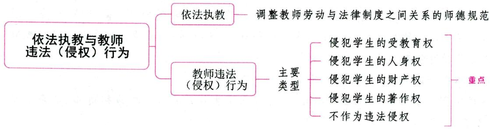

# 第一节 依法执教

# 一、依法执教的含义 ★ 【单选、判断】

依法执教就是要求教师在教育教学活动中，按照教育法律、法规使自己的教育教学活动法制化和规范化。依法执教是依法治教在教师工作中的具体体现，是对教师的基本要求，也是调整教师劳动与法律制度之间关系的师德规范。

1995年制定的《中华人民共和国教育法》是我国第一次以国家基本法律的形式明确了教育的地位和作用，从而为教育事业的改革和发展提供了坚实有力的法律保障。

真题 [2023湖北武汉, 判断]依法执教是调整教师劳动与法律制度之间关系的师德规范。( )

答案：√

# 二、依法执教的基本要求

依法执教的基本要求概括来说有以下四点：(1)坚持正确的政治方向；(2)拥护党的基本路线和领导；(3)自觉增强法律意识；(4)认真贯彻党和国家的方针政策。

具体内容包括：（1)教师要模范地遵守宪法及其他各种法律、法规；(2)教师要依法进行教育教学活动。

# 三、依法执教的意义

(1)依法执教是依法治国的必然要求。依法治国的依据是我国的宪法和法律，基本要求有四个方面，即有法可依，有法必依，执法必严，违法必究。其中，有法可依是依法治国的法律前提，也是依法治国的首要环节；有法必依是依法治国的中心环节。  
(2)依法执教是依法治教的重要内容。  
(3)依法执教是人民教师之必需。

# 第二节 教师违法(侵权)行为

# 一、教师违法（侵权）行为的含义

教师违法行为即指教师出于故意或由于过失而侵犯他人（主要是学生）合法权利的行为。在履行教师职责、实施教育教学活动中，中小学教师实施的侵权行为若是执行职务的行为，那么学校必须承担因此而导致的损害后果。如果是教师的个人行为导致他人权利受损，则学校不必承担责任。

# 二、教师违法(侵权)行为的主要类型及其表现形式 ★★ 【单选、多选、判断】

# 考点1 侵犯学生的受教育权

受教育权是学生最基本的权利。学生的受教育权包括受完法定年限教育权、学习权和公正评价权。(1)受完法定年限教育权是指年满6周岁的儿童应入学接受义务教育，并受满法律规定年限的教育，学校和教师不能随意开除学生；(2)学习权是指学生有权利在义务教育年限内在校学习，在教育教学过程中，教师不得以任何借口随意侵犯或剥夺学生参加学习活动的权利，诸如听课、作业等；(3)公正评价权是指学生在教育教学过程中，享有教师、学校对自己的学业成绩、道德品质等进行公正评价，并客观真实地记录在学生成绩档案中，在毕业时获得相应的学业成绩证明和毕业证书的权利。

常见的侵犯学生受教育权的表现形式主要有：

(1)侵犯学生受教育机会的平等权。我国《教育法》第九条规定了公民受教育机会平等的基本原则。受教育机会平等，是指公民在受教育方面的权利和义务具有平等的法律地位，不因民族、种族、性别、职业、财产状况、宗教信仰等方面的不同或者差别而受到不平等的对待。  
受教育机会平等原则包括受教育起点上的机会平等、受教育过程上的机会平等和受教育结果上的机会平等三个层面。①受教育起点上的机会平等是指每个公民在入学机会上享有平等的权利。②受教育过程上的机会平等是指公民在接受教育的过程中，有获得教育条件、教育待遇等方面的平等权利。③受教育结果上的机会平等是指公民在接受教育后，有获得学校和社会公正评价的平等权利。  
(2)侵犯学生的入学权。我国《义务教育法》第四条和第十一条规定了义务教育对象的入学条件,即凡达到入学年龄(新学年开学前满6周岁),不分性别、民族、种族,只要有接受教育的能力,都必须入学接受规定年限的义务教育。此外,实施义务教育的学校必须依法接收应该在本校就读的适龄儿童入学。  
(3)侵犯学生参加考试的权利。我国《教育法》第四十三条规定，受教育者享有“参加教育教学计划安排的各种活动”的权利。这是学生在学校中享有的最基本的权利。在教育教学中，学生有权参加教学计划安排的授课、讲座、课堂讨论、观摩、实验、实习和考试等活动。  
(4)随意开除学生。我国《义务教育法》第二十七条规定，对违反学校管理制度的学生，学校应当予以批评教育，不得开除。我国《未成年人保护法》第二十八条规定，学校应当保障未成年学生受教育的权利，不得违反国家规定开除、变相开除未成年学生。

此外，还有侵犯学生上课学习的权利、侵犯学生受教育的选择权、侵犯学生升学复学方面的同等权利、以侵犯姓名权的手段侵犯学生的受教育权、延误学生录取通知书的发放等。

# 小香课堂·

受教育权是学生最基本的权利；人身权是公民最基本的权利。

真题1 [2023河北唐山，单选]下列行为中属于侵犯学生受教育权的是( )

①张老师使用学生照片做广告

(2)王老师以成绩差为由不让小强参加考试

③李老师私拆学生的信件

④父母强迫初二年级的军军外出打工

A. ①②

B. ②④

C. ①②③

D. ①②③④

真题2 [2023河北邯郸，判断]某学校让乐队的学生停课参加某公司庆典，公司给予学校一定的经济回报。该校的做法侵犯了学生的受教育权。（）

答案：1.B 2.√

# 考点 2·侵犯学生的人身权

人身权是公民享有的最基本、最重要的权利。根据有关法律规定，学生的人身权可分为生命权、身体权、健康权、姓名与肖像权、名誉与荣誉权、人格尊严权、人身自由权、隐私权等。

(1)侵犯学生的生命权、身体权和身心健康权。身心健康权主要包括未成年学生的生命健康、人身安全、心理健康等内容。学生作为公民享有我国法律法规赋予的生命权、身体权和身心健康权。在学校教育中, 这类侵害主要是由体罚或变相体罚、教育教学设施设备不安全以及学校、教师的不作为侵权等造成的。  
(2)侵犯学生的姓名肖像权、名誉荣誉权。一些特殊情况除外，学生有权禁止他人未经允许制作和使用自己的肖像，有权禁止他人对自己肖像进行毁损、玷污、丑化或歪曲。学生的名誉不得受到歪曲或损害。荣誉是一个人受到外部给予的光荣称誉，每个学生在学校应有平等的机会获得。  
(3)侵犯学生的人格尊严权。学生享有受他人尊重，保持良好形象及尊严的权利。学校和教师必须尊重学生的人格尊严，严禁对学生实施体罚、变相体罚或其他侮辱人格尊严的行为。  
(4)侵犯学生的人身自由权。人身自由是公民的一项基本权利，包括身体行动自由和表达的自由。侵犯学生人身自由权的表现形式有：非法拘禁和限制学生、非法搜查学生、非法限制学生表达自由的权利等。  
(5)侵犯学生的隐私权。隐私包括个人私生活、个人日记、照片、储蓄及财产状况、生活习惯及通讯秘密等。隐私权是指公民生活中不愿为他人公开或知悉的个人秘密的不可侵犯的人身权利。学校和教师侵犯学生隐私的表现形式有:故意隐匿、毁弃或者非法开拆学生信件,披露、宣扬学生自身及家庭成员的资料,提供学生成绩的方式不适当等。

(6)性侵害。

真题3 [2024安徽合肥/淮北/铜陵, 单选]某小学教师陈某在教育学生时, 经常敲打、拖拽学生, 造成学生身体多处瘀伤。陈某侵犯的学生的权利主要是( )

A. 受教育权  
B. 人格尊严权  
C.人身自由权   
D. 生命健康权

真题4 [2022内蒙古赤峰,单选]一些学校或教师为了掌握学生的某些思想动态，背着学生检查

学生的电子邮件、日记等信息，这样的行为涉嫌侵犯学生的（）

A.知情权

B. 人格尊严权

C.隐私权

D. 名誉权

答案：3.D 4.C

# 考点 3 侵犯学生的财产权

个人的财产所有权是指公民对个人所有的财产依法进行占有、使用、收益和处分的权利。学生的合法财产受法律保护,教师不得侵占、破坏或非法扣押、没收等。学生对教师侵犯其财产权的行为可依法申诉或提起诉讼。教师侵犯学生财产权的表现形式包括:损坏学生财物、非法没收学生物品、乱罚款、乱摊派等。

真题5 [2024广东佛山, 单选]方老师发现学生小明上课时偷玩玩具车, 便直接把玩具车没收了。课后小明找方老师归还玩具车时, 老师以玩具影响学习为由拒不归还。根据相关法律法规, 方老师的行为主要侵犯了小明的( )

A.隐私权

B.人身自由权

C. 财产权

D. 名誉权

答案：C

# 考点 4 侵犯学生的著作权

《中华人民共和国著作权法》所称的作品，是指文学、艺术和科学领域内具有独创性并能以一定形式表现的智力成果。著作权人对其作品享有发表权，未经许可任何人不得发表其作品。中小学生的作文也是作品，是受我国《著作权法》保护的文字作品。

真题6 [2023山西太原, 单选]某小学语文老师在未经学生同意的情况下, 将班上学生的优秀作文编入自己编著出版的作文辅导书中, 该语文老师的做法侵犯了学生的（）

A. 著予权

B. 财产权

C. 受教育权

D. 人格尊严权

答案：A

# 考点5 不作为违法侵权

依性质不同, 侵权行为可分为两类, 即作为侵权行为和不作为侵权行为。作为侵权行为是指行为人以一定的作为致人损害的行为, 如体罚、侮辱学生等。不作为侵权行为是指行为人以一定的不作为致人损害的行为。根据我国《教师法》《未成年人保护法》的规定, 学校和教师负有保护学生的法定义务。如果教师没有积极履行保护职责或阻止有害学生的行为即构成不作为侵权。

学校和教师的不作为侵权行为的表现形式有：(1)对学生身体状况关照不力；(2)教师对生病或受伤学生救护不力；(3)在履行职责中违反工作要求、操作规程；(4)学校活动组织失职；(5)饮食安全事故；(6)未及时向学生监护人履行告知义务。

# 三、教师违法(侵权)行为的主要法律责任

# 1.教师违法（侵权）行为

(1) 故意不完成教育教学任务给教育教学工作造成损失的。构成此项违法责任必须具备两个条

件：第一，主观上是“故意的”，即明知会对教育教学工作造成损失，但却放任这种行为的发生；第二，客观上要有“给教育教学工作造成损失”的后果。

(2)体罚学生，经教育不改的。体罚学生是指教师以暴力的方法或以暴力相威胁，或以其他强制性手段，侵害学生的身体和精神健康的侵权行为。  
(3)品行不良、侮辱学生，影响恶劣的。主要指教师的人品或行为严重有悖于社会公德和教师职业道德，严重有损为人师表的形象和身份，在社会上和学生中产生了恶劣的影响。

# 2.教师的法律责任

(1)按现行教师管理权限，由所在学校、其他教育机构或教育行政部门给予行政处分或者解聘。解聘包括解除岗位职务聘任合同和解除教师聘任合同。  
(2)教师有上述违法行为中的后两种行为，即体罚学生，经教育不改行为和品行不良、侮辱学生，影响恶劣行为，情节严重，构成犯罪的，由人民法院追究其刑事责任。  
(3)对学校、其他教育机构或学生造成损害或损失的，应当依照有关规定赔偿损失、消除影响、恢复名誉等。这既可由学校或教育行政部门处理，也可由人民法院强制执行。

# 四、预防教师违法（侵权）行为的必要措施

(1)建立完善的教育法规体系；(2)建立严格公正的教育执法制度；(3)建立全面的教育法律监督机制；(4)增强法制观念，宣传、普及教育法规；(5)加强学校的规范管理；(6)增强教师的法律意识，减少侵权行为的发生；(7)加强学生对自己法定权利的认识，培养学生的自我保护意识；(8)加大安全教育力度。

# ★ 本章核心考点回顾 ★

# 1. 依法执教的含义

依法执教是依法治教在教师工作中的具体体现，是对教师的基本要求，也是调整教师劳动与法律制度之间关系的师德规范。

# 2. 教师违法（侵权）行为的主要类型及其表现形式

(1)侵犯学生的受教育权：①侵犯学生受教育机会的平等权；②侵犯学生的入学权；③侵犯学生参加考试的权利；④随意开除学生。  
(2)侵犯学生的人身权：①侵犯学生的生命权、身体权和身心健康权；②侵犯学生的姓名肖像权、名誉荣誉权；③侵犯学生的人格尊严权；④侵犯学生的人身自由权；⑤侵犯学生的隐私权；⑥性侵害。  
(3)侵犯学生的财产权：损坏学生财物、非法没收学生物品、乱罚款、乱摊派等。  
(4)侵犯学生的著作权：未经许可发表学生的作品等。  
(5)不作为违法侵权：对学生身体状况关照不力、对生病或受伤学生救护不力等。

# 05

# 第五部分

# 新课程改革

# 内容导学

本部分内容共分为三章。  
- 第一章为新课程改革的概述，第二章介绍了教学改革的内容，第三章介绍了综合实践活动。  
考生应重点掌握第一章第二节以及第二章的内容，结合各知识点的重要程度有针对性地进行复习。  
为了方便考生梳理知识脉络，我们在各章设置思维导图和核心考点回顾。

# 本部分学习指南

# 一、考情概况

本部分内容较为广泛、识记性知识较多，考生可带着以下学习目标进行备考：

1. 掌握新课程改革的六项具体目标。  
2. 理解新课程倡导的教师角色、教学观和学习方式。  
3. 了解综合实践活动的内涵。

# 二、考点地图

<table><tr><td>考点</td><td>年份/地区/题型</td></tr><tr><td>新课程改革的六项具体目标</td><td>2024河北单选;2024安徽判断;2023辽宁单选;2023湖南单选;2023河北多选;2023浙江简答;2022河南单选;2022山东单选;2022天津单选、判断</td></tr><tr><td>新课程倡导的教师角色</td><td>2023河南单选;2023山西单选;2023浙江判断;2022河南单选;2022广东单选;2022湖北判断</td></tr><tr><td>新的教学观</td><td>2024安徽判断;2023辽宁单选;2023浙江单选;2023内蒙古单选、多选;2022山西多选</td></tr><tr><td>新课程倡导的学习方式</td><td>2023安徽单选;2023江苏填空;2023河北判断;2023浙江判断;2022天津单选、名词解释;2022内蒙古简答</td></tr><tr><td>综合实践活动的内涵</td><td>2023河南单选;2022天津多选;2022湖南多选;2022山东判断</td></tr></table>

注：上述表格仅呈现重要考点的相关考情。

# 第一章 新课程改革概述

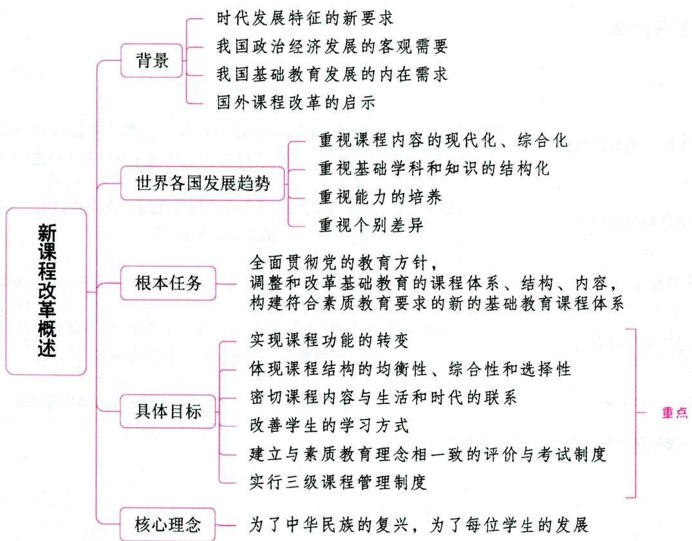

# 第一节 新课程改革的背景与发展趋势

# 一、新课程改革的背景 ★ 【单选、判断】

课程改革是教育改革的核心内容。世界范围的课程改革,其实质和总的趋势就是课程的现代化。本次新一轮课程改革是指1999年开始启动的基础教育课程改革,简称“新课改”。2001年6月8日,教育部颁布了《基础教育课程改革纲要(试行)》(下文简称《纲要》),标志着我国基础教育新课程改革的正式实施。这是中华人民共和国成立以来我国的第八次课程改革,也是规模最大、影响最为深广的一次课程改革。《纲要》指出:基础教育课程改革是一项系统工程。应始终贯彻“先立后破,先实验后推广”的工作方针。各省(自治区、直辖市)都应建立课程改革实验区,实验区应分层推进,发挥示范、培训和指

导的作用，加快实验区的滚动发展，为过渡到新课程做好准备。

# 1. 时代发展特征的新要求（时代背景）

(1)初见端倪的知识经济；(2)国际竞争空前激烈；(3)人类的生存和发展面临困境。

# 2. 我国政治经济发展的客观需要（社会背景）

我国能否很好地把握知识经济时代生产方式变革这一历史机遇，能否充分开发和利用我国的人力资源，取决于多方面的因素。而教育则是其中至关重要的一个因素。历史经验证明，教育在把握人类自身命运、促进社会发展方面能发挥巨大作用。知识经济时代的科学技术已经成为第一生产力。在国与国之间综合国力竞争的时代，由于教育起着奠基作用，综合国力竞争必将聚焦到教育上来。

# 3. 我国基础教育发展的内在需求

我国基础教育课程体系已经到了非改不可的地步，原因在于：(1)固有的知识本位、学科本位问题没有得到根本转变，所产生的危害影响至深，这与时代对人的要求形成了极大反差；(2)传统的应试教育势力强大，素质教育不能真正得到落实。

# 4. 国外课程改革的启示

(1)政府参与并领导课程改革；(2)课程改革的焦点是协调国家和学生发展需要之间的关系；(3)课程改革具有整体性。

真题1 [2022天津北辰，单选]教育改革的核心内容是（）

A. 课程改革

B. 教学方法改革

C. 教育理念

D. 教育目标

答案：A

# 二、新课程改革的发展趋势 ★ 【单选、多选、简答】

# 考点1 我国基础教育课程改革的发展趋势

(1)以学生发展为本、促进学生全面发展与培养个性相结合；(2)稳定并加强基础教育；(3)加强道德教育和人文教育，促进课程科学性与人文性融合；(4)加强课程综合化；(5)课程与现代信息技术相结合，加强课程个性化和多样化；(6)课程法制化。

# 考点2 当代世界各国课程改革的共同发展趋势

说法一：(1)重视课程内容的现代化、综合化；(2)重视基础学科和知识的结构化；(3)重视能力的培养；(4)重视个别差异。

说法二：(1)在课程政策上，谋求国家课程开发与校本课程开发的统一；(2)在课程内容上，既引进符合信息时代要求的高科技知识，又把学习者的个人知识作为课程内容的有机构成；(3)提倡多样化的课程结构；(4)重视课程实施研究和教师进修；(5)提高课程改革的科学水平，设立课程改革的专家咨询机构。

真题2 [2022山东济南，多选]当代世界各国的课程改革的共同发展趋势是（）

A. 进行标准化建设

B. 课程内容的现代化建设

C. 注重基础学科和知识的结构化

D. 注重学生的个别差异

答案：BCD

# 第二节 新课程改革的根本任务、目标、重点和理念

# 一、新课程改革的根本任务 ★【单选、填空、判断】

基础教育课程改革的根本任务是：全面贯彻党的教育方针，调整和改革基础教育的课程体系、结构、内容，构建符合素质教育要求的新的基础教育课程体系。

真题1 [2022河南南阳, 判断]新课改的根本任务是全面贯彻党的教育方针, 调整和改革基础教育的课程体系、结构、内容, 构建符合以人为本思想的新的基础教育课程体系。（）

答案：×

# 二、新课程改革的六项具体目标 ★★★ 【单选、多选、判断、简答】

# 考点1 实现课程功能的转变

新课程改革在《纲要》中首先确立了课程改革的核心目标即课程功能的转变：改变课程过于注重知识传授的倾向，强调形成积极主动的学习态度，使获得基础知识与基本技能的过程同时成为学会学习和形成正确价值观的过程。从单纯注重传授知识转变为引导学生学会学习、学会合作、学会生存、学会做人，打破传统的基于精英主义思想和升学取向的过于狭窄的课程定位，关注学生“全人”的发展。

# 考点2 体现课程结构的均衡性、综合性和选择性

改变课程结构过于强调学科本位、科目过多和缺乏整合的现状，整体设置九年一贯的课程门类和课时比例，设置综合课程，以适应不同地区和学生发展的需求，体现了课程结构的均衡性、综合性和选择性。关于课程结构的变革，《纲要》提出，整体设置九年一贯的义务教育课程，小学阶段以综合课程为主，初中阶段设置分科与综合相结合的课程；高中以分科课程为主；从小学至高中设置综合实践活动并作为必修课程；农村中学课程要为当地社会经济发展服务。

# 考点 3 密切课程内容与生活和时代的联系

改变课程内容“繁、难、偏、旧”和过于注重书本知识的现状，加强课程内容与学生生活以及现代社会和科技发展的联系，关注学生的学习兴趣和经验，精选终身学习必备的基础知识和技能。

# 考点 改善学生的学习方式

改变课程实施过于强调接受学习、死记硬背、机械训练的现状，倡导学生主动参与、乐于探究、勤于

动手,培养学生搜集和处理信息的能力、获取新知识的能力、分析和解决问题的能力,以及交流与合作的能力。

考点5 建立与素质教育理念相一致的评价与考试制度

改变课程评价过分强调甄别与选拔的功能，发挥评价促进学生发展、教师提高和改进教学实践的功能。新课程倡导“立足过程，促进发展”的课程评价，这不仅仅是评价体系的变革，更重要的是评价理念、评价方法与手段以及评价实施过程的转变。

要建立一种发展性的评价体系，一是要建立促进学生全面发展的评价体系，使评价不仅关注学生在语言和数理逻辑方面的发展，而且要发现和发展学生多方面的潜能；二是要建立促进教师不断提高的评价体系，以强调教师对自己教学行为的分析与反思，建立以教师自评为主，校长、教师、学生、家长共同参与的评价制度，使教师从多渠道获得信息，不断提高教学水平；三是要将评价看作是一个系统，从形成多元的评价目标、制定多样的评价工具，到广泛地搜集各种资料，形成建设性的改进意见和建议，每一个环节都是通过评价促进发展的不可或缺的部分。评价目标多元、评价方法多样，重视学生发展和教师成长记录，是今后一段时间内评价与考试改革的主要方向。

考点 6 实行三级课程管理制度

改变课程管理过于集中的状况，实行国家、地方、学校三级课程管理，增强课程对地方、学校及学生的适应性。

新课程改革从我国的国情出发，妥善处理课程统一性与多样性的关系，建立国家、地方、学校三级课程管理体制，实现了集权与放权的结合。三级课程管理制度的确立有助于教材的多样化，有利于满足地方经济、文化发展的需要和学生发展的需要。

真题2 [2024河北石家庄，单选]新课程改革强调整体设置九年一贯的课程门类和课时比例，这是从（ ）角度提出的要求。

A. 课程目标

B. 课程结构

C. 课程内容

D. 课程实施

真题3 [2024安徽合肥/淮北/铜陵, 判断]新课程强调课程内容要密切关注学生兴趣与生活经验, 并不意味着可以忽略间接经验的学习。( )

真题4 [2023浙江金华，简答]简述新课改的具体目标。

答案：2.B 3.√ 4.详见内文

# 三、新课程改革的重点 ★ 【多选】

(1)明确区分义务教育与非义务教育，建立合理的课程结构，更新课程内容。  
(2)突出学生的发展，科学制定课程标准。  
(3)加强新时期学生思想品德教育的针对性和实效性。

加强思想品德教育，强调在向社会主义市场经济转变的过程中，对学生道德、行为、人生观、世界观、价值观及思想政治素质的培养；强调德育在各学科教育环节的渗透，改进教育教学方法，注重实践

环节，增强思想品德教育的针对性和实效性。这些主要通过以下几方面来实现：①加强德育课程建设；②各门课程渗透德育；③设置综合实践活动为必修课。

(4)以创新精神和实践能力的培养为重点，建立新的教学方式，促进学习方式的变革。  
(5) 建立促进学生发展、教师提高的评价体系。  
(6)制定国家、地方、学校三级课程管理政策，提高课程的适应性，满足不同地方、学校和学生的需要。

# 四、新课程改革的理念 ★★ 【单选、多选、不定项、判断】

影响基础教育改革的理论、理念非常庞杂，有些理论主要影响着基础教育的宏观改革，如人力资本理论、终身教育思潮、全民教育思潮等，而有些理论却对基础教育改革的微观领域影响较大，如人本主义教育理念、建构主义教育理念、多元智力理论等。

# 考点1 基础教育课程改革的核心理念

贯穿于第八次课程改革的核心理念是：为了中华民族的复兴，为了每位学生的发展。这一基本的价值取向预示着我国基础教育课程体系的价值转型。

# 知识再拔高·

# 新课程的价值追求

(1)教育公平。这意味着课程必须谋求所有适龄儿童平等享受高质量的基础教育。  
(2)国际理解。这意味着我国的课程体系必须追求国际性与民族性的内在统一。  
(3)回归生活世界。回归生活世界的课程在目标上意味着要培养在生活世界中会生存的人,即会做事、会与他人共同生活的人。  
(4) 关爱自然。这意味着课程必须把关爱自然、追求人与自然的可持续发展作为重要的价值追求。  
(5)个性发展。这意味着课程必须尊重每一位学生个性发展的完整性、独立性、具体性、特殊性。

上述五种理念是“为了中华民族的复兴，为了每位学生的发展”这一核心理念的具体化，是第八次课程改革的基本价值追求。

真题5 [2023河南事业单位，不定项]有的教师教学把“婴儿奶粉中的蛋白质含量”有关知识加入到化学课程的相关内容，有的教师教学时把“礼貌用语”有关知识加入到《小壁虎借尾巴》语文课程的相关内容。类似这些教师的做法体现了课程改革价值追求中的（）

A. 回归生活世界

B. 关爱自然

C. 个性发展

D. 国际理解

真题6 [2023广西贵港，判断]教育公平，意味着课程必须谋求所有适龄儿童平等享受高质量的基础教育。（）

答案：5.A 6.√

# 考点2 基础教育课程改革的基本理念

基础教育课程改革的基本理念包括：关注学生作为“整体的人”的发展；统整学生的生活世界与科学世界；寻求学生主体对知识的建构；创建富有个性的学校文化。具体表现为：走出知识传授的目标取向，确立培养“整体的人”的课程目标（“整体的人”包括两层含义：人的完整性和生活的完整性）；破除书本知识的桎梏，构筑具有生活意义的课程内容；摆脱被知识奴役的处境，恢复个体在知识生成中的合法身份；改变学校个性缺失的现实，创建富有个性的学校文化。

# 知识再拔高

# 基础教育课程改革的基本理念的其他说法

说法一：

(1)课程目标：全人发展；(2)课程内容：统整学生的生活世界和科学世界；(3)学习方式：从被动灌输到主动建构；(4)课程结构：从分科到综合；(5)课程评价：以评价促发展；(6)课程管理：从集权到民主。

说法二：

(1)全人发展的课程价值取向。课程的价值是作为主体的社会和学生与作为客体的课程之间需要关系的反映。由于这种主客体之间的需要关系是不断变化的，因而课程价值的内容和水平也是不断变化的；又由于这种主客体之间的关系是复杂多样的，因而课程价值的表现形式和类型结构也是多样化的。第八次课程改革的一个显著特征是以学生为本，着眼于学生的全人发展，反对权威主义和精英主义，要求所有的学生都能得到全面发展。这种着眼于全人发展的课程价值取向，使学校的课程目标发生了深刻的变革。  
(2)科学与人文整合的课程文化观。1989年,联合国教科文组织在我国召开了以“学会关心: 21世纪的教育”为主题的研讨会,会议所提出的“学会关心”的教育思想,成为科学主义教育与人本主义教育走向融合的一个重要标志,使教育发展方向出现了一次重大变革。伴随着科学主义教育与人本主义教育逐步走向融合之势,课程文化也开始摆脱原有视野的局限,跨入新的视界中,于是,科学人文性课程文化观便确立了。科学人文性课程是科学主义课程与人本主义课程整合建构的课程,它以科学为基础,以人自身的完善和解放为最高目的,强调人的科学素质与人文修养的辩证统一,致力于科学知识、科学精神和人文精神沟通与融合,倡导“科学的人道主义”,力求把“学会生存”“学会关心”“学会尊重、理解与宽容”“学会共同生活”“学会创造”等当代教育理念贯穿到课程发展的各个方面。  
(3)回归生活的课程生态观。回归生活的课程生态观,从本质意义上说,就是强调自然、社会和人在课程体系中的有机统一,使自然、社会和人成为课程的基本来源。因此,自然即课程、生活即课程、自我即课程,便成为现代课程生态观的基本命题。  
(4)缔造取向的课程实施观。缔造取向的课程实施观非常强调在课程实施的过程中要充分发挥师生的自主性、能动性和创造性，特别是要求教师具备较强的课程设计能力，因为教师不仅是课程的实施者，而且还是课程的设计者。  
(5)民主化的课程政策观。课程政策的民主化意味着课程权力的分享，意味着课程由统一化走向多样化。

真题7 [2023河北石家庄，多选]基础教育课程改革的基本理念有（ ）

A. 关注学生作为“整体的人”的发展

B. 统整学生的生活世界与科学世界

C. 寻求学生主体对知识的建构

D. 创建富有个性的学校文化

答案：ABCD

# 本章核心考点回顾

1. 新课程改革的六项具体目标

(1) 实现课程功能的转变（核心目标）：改变课程过于注重知识传授的倾向，强调形成积极主动的学习态度。  
(2)体现课程结构的均衡性、综合性和选择性：改变课程结构过于强调学科本位、科目过多和缺乏整合的现状，整体设置九年一贯的课程门类和课时比例。  
(3) 密切课程内容与生活和时代的联系: 改变课程内容 “繁、难、偏、旧” 和过于注重书本知识的现状。  
(4)改善学生的学习方式：改变课程实施过于强调接受学习、死记硬背、机械训练的现状，倡导学生主动参与、乐于探究、勤于动手。  
(5)建立与素质教育理念相一致的评价与考试制度：“立足过程，促进发展”。  
(6)实行三级课程管理制度：改变课程管理过于集中的状况，实行国家、地方、学校三级课程管理。

2. 基础教育课程改革的核心理念

为了中华民族的复兴，为了每位学生的发展。

# 第二章 新课程与教学改革

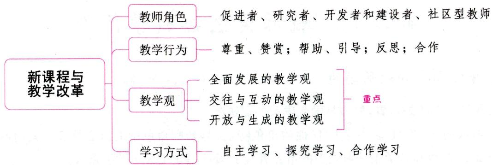

# 第一节 教学改革的主要任务、观点及趋势

# 一、本次教学改革的主要任务 ★ 【单选】

(1)改革旧的教育观念,真正确立起与新课程相适应的、体现素质教育精神的教育观念。确立新的教育观念,是教学改革的首要任务。  
(2)坚定不移地推进教学方式和学习方式的转变。学习方式的转变是本次课程改革的显著特征和核心任务。  
(3)致力于教学管理制度的重建。在转变观念和方式的同时，重建制度，同样是本次教学改革的重要任务。

# 二、我国当前教学改革的主要观点 ★【单选、判断】

(1)实施素质教育——我国当前教学改革的主题；  
(2)坚持整体教学改革和实验——我国当前教学改革的基本策略；  
(3)建立合理的课程结构——我国当前教学改革的重心；  
(4)实施科学的教学评价。

真题1 [2023广东梅州，单选]我国目前正在进行新课程改革，改革的重心是（）

A. 实施素质教育

B. 坚持整体教学改革和实验

C. 建立合理的课程结构

D. 实施科学的教学评价

答案：C

# 三、我国中小学教学改革的趋势 ★ 【判断】

(1)教学目标指向从“双基”走向“三维目标”“核心素养”；  
(2)教学组织形式从“单一”走向“多样化”；

(3)教学评价走向“关注目标”与“关注价值”并重。

真题2 [2023安徽统考，判断]新课程改革的教学评价由“关注目标”转向“关注价值”。( )

答案：×

# 第二节 教师角色与教学行为

# 一、新课程倡导的教师角色 ★★★ 【单选、多选、判断、简答】

# 1. 从教师与学生的关系看，教师是学生学习的促进者

这是教师最明显、最直接、最富时代性的角色特征，是教师角色中的核心特征。其内涵主要包括以下两个方面：（1）教师是学生学习能力的培养者。（2）教师是学生人生的引路人。

# 2. 从教学与研究的关系看，教师是教育教学的研究者

教师即研究者，意味着教师在教学过程中要以研究者的心态置身于教学情境之中，以研究者的眼光审视和分析教学理论与教学实践中的各种问题，对自身的行为进行反思，对出现的问题进行探究，对积累的经验进行总结，最终形成规律性的认识。

# 3. 从教学与课程的关系看，教师是课程的开发者和建设者

在传统的教学中，教学与课程是彼此分离的。教师被排斥于课程之外，教师的任务只是教学，课程游离于教学。教学内容和教学进度由国家的教学大纲和教学计划规定，教学参考资料和考试试卷由专家或教研部门编写、提供，教师成了教育行政部门各项规定的机械执行者，成为各种教学参考资料的简单照搬者。

新课程倡导民主、开放、科学的课程理念，同时确立了国家、地方、学校三级课程管理政策，这就要求课程与教学相互整合，教师必须在课程改革中发挥主体作用。教师不仅是课程实施的执行者，更应成为课程的开发者和建设者。

# 4.从学校与社区的关系看，教师是社区型开放的教师

新课程特别强调学校与社区的互动,重视挖掘社区的教育资源。在这种情况下,教师的角色也要求变革。教师不仅仅是学校的一员,还是社区的一员,是整个社区教育、科学、文化事业的共建者。因此,教师角色是开放的,是“社区型”教师。

真题1 [2023河南开封, 单选]李老师根据自己班级情况, 为解决班级内部班干部的人际关系问题, 建立和谐的班级氛围, 自主开发了“和谐人际”的班级课程。这体现了教师是( )

A. 教育教学的开拓者

B. 课程的建设者与开发者

C. 学生学习的促进者

D. 社区型开放的教师

真题2 [2022湖北武汉，判断]从学校与社区的关系来看，新课程要求教师应该是社区型开放的教师。（）

答案：1.B 2.√

# 二、新课改背景下师生关系的变化 ★【单选、多选、判断】

新课程改革要求建立一种“对话·互动”式的新型师生关系。对话就是通过语言形式所进行的交流，它与权威式的“告诉”或“灌输”不一样，它是主体之间的交流；互动则是主体之间的相互作用，它具有交互性特征。

在教学中有效地运用“对话·互动”，必须做到以下几点：

(1)教师要转变角色和行为，与学生建立新型的民主、平等的师生关系。“对话·互动”内在地要求“当事人”处于“平等的网络”中，都作为主体而存在，没有权威，只有来自各个领域的不同的声音。在传统教育中，相对于学生来讲，教师是“社会代表者”，他们拥有至高无上的权威，在课堂上，控制、管理、命令（指令）等是其主要的活动，而就其言语行为而言，教师通常扮演定向者、定规者、定论者的角色。而新课程给教师角色的定位是“平等中的首席”，要求教师在与学生对话、互动中，首先是一个学习者。其次，教师应当是学生自主学习、自我建构知识和经验的指导者。再次，教师还应该是学生学习的激励者与促进者。

(2)要创设一定的“情境”和引出一定的“话题”。  
(3)教师要学会一些引导“对话·互动”的策略和技巧。

# 三、教师教学行为的变化 ★★ 【单选、多选、判断】

# 1.在对待师生关系上，新课程强调尊重、赞赏

“为了每位学生的发展”是新课程的核心理念。为了实现这一理念，教师必须尊重每一位学生做人的尊严和价值，尤其要尊重以下六种学生：智力发育迟缓的学生、学业成绩不良的学生、被孤立和拒绝的学生、有过错的学生、有严重缺点的学生以及和自己意见不一致的学生。尊重学生同时意味着不伤害学生的自尊心。此外，教师还要学会发现学生的闪光点，学会赞赏每一位学生。

# 2. 在对待教学关系上，新课程强调帮助、引导

教的本质在于引导。引导的特点是含而不露、指而不明、开而不达、引而不发。引导的内容不仅包括方法和思维，同时也包括价值和做人。在这里，引导表现为教师对学生的启迪与激励。

# 3. 在对待自我上，新课程强调反思

新课程非常强调教师的教学反思，依据教学进程，教学反思分为教学前、教学中、教学后三个阶段。教学反思有助于教师形成自我反思的意识和自我监控的能力。

# 4. 在对待与其他教育者的关系上，新课程强调合作

教育教学过程中，教师除了面对学生外，还要与周围其他教师发生联系，要与学生家长进行沟通与配合。课程的综合化趋势特别需要教师之间的合作，不同年级、不同学科的教师要相互配合，齐心协力地培养学生。每个教师不仅要教好自己的学科，还要主动关心和积极配合其他教师的教学，从而使各学科、各年级的教学有机融合、相互促进。教师之间一定要相互尊重、相互学习、团结互助，这不仅具有教学的意义，而且还具有教育的功能。

# 第三节 新的教学观

# 一、全面发展的教学观 ★★★ 【单选、多选、判断】

# 1. 教学重结论更要重过程

教学的目的之一就是使学生理解和掌握正确的结论。但是，如果不经过学生一系列的质疑、判断与比较，以及相应的分析、综合等认识活动，结论就难以获得，也难以真正理解和巩固。更重要的是，没有以多样性、丰富性为前提的教学过程，学生的创新精神和创新思维就不可能培养起来。所以，教学不仅要重结论，更要重过程。

为此，教师要做到：（1)让学生经历过程；(2)要创设生活情境，生活情境要具有含而不露、显而不僵、生动形象且符合实际的特点；(3)要善于引导，教学的本质在于引导。

# 2. 教学关注学科更要关注人

传统的学校教育以学科为本，重认知轻情感，重教书轻育人。新课程强调以人为本，关注人是新课程的核心理念——“为了每位学生的发展”在教学中的具体体现。它意味着：

(1)关注每一位学生。每一位学生都是生动活泼的人、发展的人、有尊严的人，在教师的课堂教学理念中，包括每一位学生在内的全体学生都是自己应该关注的对象。关注的实质是尊重、关心、牵挂，关注本身就是最好的教育。  
(2)关注学生的情绪生活和情感体验。孔子说过：“知之者不如好之者，好之者不如乐知者。”教学过程应该成为学生的一种愉悦的情绪生活和积极的情感体验。  
(3) 关注学生的道德生活和人格养成。教师要充分挖掘和展示课堂教学潜藏的道德因素, 同时要积极关注和引导学生在教学活动中的各种道德表现和道德发展, 从而使教学过程成为学生一种高尚的道德生活和丰富的人生体验。这样, 学生的学科知识增长的过程同时也是人格的健全和发展过程。

# 二、交往与互动的教学观 ★★★ 【单选、多选、判断】

教与学的关系问题是教学过程的本质问题，同时也是教学论中的重大理论问题。教学是教师教与学生学的统一，这种统一的实质是交往、互动。基于此，新课程倡导教学不只是教师教学生学的过程，更是师生交往、积极互动、共同发展的过程。

传统教学中，教师负责教，学生负责学，教学就是对学生单向的“培养”活动。它表现为：

(1)以教为中心，学围绕教转。教师是课堂的主宰者，教学就是教师将自己拥有的知识传授给学生。教学关系成为：我讲，你听；我问，你答；我写，你抄；我给，你收。  
(2)以教为基础，先教后学。先教后学，教了再学，教多少、学多少，怎么教、怎么学，不教不学。学生只能跟着教师学，复制教师讲授的内容。总之，传统教学只是教与学两方面的机械叠加。

新课程强调教学是教与学的交往、互动，师生双方相互交流、相互沟通，在这个过程中，教师与学生分享彼此的思考、经验和知识，交流彼此的情感、体验与观念，丰富教学内容，求得新的发现，从而达成共识、共享、共进，实现教学相长和共同发展，彼此形成一个真正的“学习共同体”。

新课程提倡的师生关系是合作伙伴关系。为此,要处理好师生之间的伙伴关系:(1)要尊重学生,

尊重每一位学生的尊严和价值；(2)要民主，民主是师生关系的融化剂，是师生平等对话的前提。

# 三、开放与生成的教学观 ★★★ 【单选、多选、判断】

传统课程倡导的教学观认为课程是教学的方向、目标或计划,是在教学过程之前和教学情境之外预先规定的,教学的过程就是忠实而有效地传递课程,教师是既定课程的阐述者和传递者,学生则是课程的接受者。

新课程所倡导的教学观认为教师和学生是课程的有机构成部分，是课程的创造者和主体，他们共同参与课程开发的过程。教学成为课程内容持续生成与转化、课程意义不断建构与提升的过程。这样，教学与课程相互转化，相互促进，彼此有机融为一体。基于此，新课程倡导教学不只是课程传递和执行的过程，更是课程创生与开发的过程。

全面发展的教学观是从教学目的角度提出来的，交往与互动的教学观是从师生关系的角度提出来的，开放与生成的教学观是从教学过程与教学结果的角度提出来的，这三种教学观虽是从不同角度提出来的，彼此间却是相互联系、相辅相成的，我们必须从整体的高度把握每一种观念的精神实质，唯有如此，才能正确引领新课程的教学改革。

# 知识再拔高·

# 当代教学的新观念

当代社会正从工业社会向信息社会转型，当代教育正从专才教育向通识教育转变。从重心转移的角度看，当代教学观的变革主要体现为以下六大趋势：(1)从重视教师的教向重视学生的学转变。随着社会的发展，传统的“教师中心说”受到越来越深刻的批判。人们看到教师并不是支配课堂教学活动的绝对权威，学生虽然是教育的对象，但却是学习活动的主体和主人。教师当然重要，但更重要的是学生。(2)从重视知识传授向重视能力培养转变。(3)从重视教法向重视学法转变。(4)从重视认知向重视发展转变。(5)从重视结果向重视过程转变。(6)从重视继承向重视创新转变。

真题1 [2023内蒙古巴彦淖尔，单选]新课程把学习过程看作（）

A. 课程传递和执行的过程

B.师生交往、积极互动、共同发展的过程

C. 教师的教与学生的学的过程

D.知识传授与能力发展的过程

真题2 [2023辽宁锦州, 单选]李老师在给新生上第一节课时就说: “你们不要把我当作课堂的绝对权威, 你们的新观点可能更有趣, 更有创造力, 只要不是故意扰乱课堂秩序, 欢迎大家发表意见。”这主要体现了当代教学观( )的转变。

A. 从重视教师向重视学生

B. 从重视知识传授向重视能力培养

C. 从重视认知向重视发展

D. 从重视结果向重视过程

真题3 [2024安徽合肥/淮北/铜陵，判断]教师是既定课程的阐述者与传递者，学生是既定课程的接受者与吸收者。这是新课程倡导的教学观。（）

答案：1.B 2.A 3. $\times$

# 第四节 学习方式的变革

# 一、新课程倡导的学习方式 ★★★ 【单选、多选、填空、判断、名词解释、简答】

学习方式转变被看成是新课程改革的显著特征和核心任务。转变学习方式,要以培养创新精神和实践能力为主要目的。换句话说,要构建旨在培养创新精神和实践能力的学习方式及其对应的教学方式。

# 考点1 自主学习

# 1. 自主学习的概念

自主学习关注学习者的主体性和能动性，是由学生自主而不是受他人支配的学习方式。自主学习强调学习者在学习中的主体地位和学习中主体作用的发挥。但自主学习不同于自学，自学是一种学习方法，而自主学习首先是一种观念，同时也是一种学习形式。自主学习比自学更为理性化，更强调学习者的主体地位和主观能动性的发挥。

# 2. 自主学习的特点

(1) 自主学习是一种主动学习, 是相对于“被动学习”“他主学习”而言的。主动性是自主学习的基本品质, 它在学生学习活动中表现为“我要学”。“我要学”一方面表现为学习兴趣, 另一方面表现为学习责任。只有学生自觉地担负起学习的责任时, 学习才是一种真正的自主学习。  
(2)自主学习是一种独立学习。“独立学习”是自主学习的核心，表现为“我能学”。新课程改革就要求教师要充分尊重学生的独立性，积极鼓励并创造各种机会，让学生独立学习，培养其独立学习的能力。自主学习的实质就是独立性，独立性是自主学习的灵魂。  
(3)自主学习也是一种元认知监控的学习。自主学习要求学生对为什么学习、能否学习、学习什么、如何学习等问题有自觉的意识和反应，它突出表现在学生对学习的自我计划、自我调整、自我指导和自我强化上。培养学生对学习的自我意识和自我监控并使之养成习惯，是促进学生自主学习的重要因素。

# 考点2 探究学习

# 1.探究学习的概念

探究学习是一种以问题为依托的学习，是学生通过主动探究解决问题的过程。探究学习是相对于“接受学习”而言的。学习过程除了被动接受知识外，还存在大量的发现与探究等认识活动。新课程要求的学习方式的转变，就是要学生转变单一的被动接受式的学习，把学习过程中的发现、探究等认识活动凸显出来，使学习过程更多地成为学生发现问题、分析并解决问题的过程。探究学习或发现学习是体现学习的真正价值、实现有意义学习的一种重要的学习方式。

# 2.探究性学习的类型

探究性学习有接受式探究和发现式探究两种具体类型。在探究性学习中，学生可以采用两种基本的方式来寻求问题的答案。接受式探究即学生围绕着问题，从现有资料或现有资源中直接搜集现成结论或对有关资料稍加整理，对问题加以解答；发现式探究即通过亲身观察、调查、实验、文本解读、研讨等过程，经过整理分析，总结出结论，或建构起意义和理解，从而对问题加以解答。

# 3.探究性学习的特点

说法一：（1）问题性；(2)过程性；(3)开放性。

说法二：(1)自主性；(2)开放性；(3)过程性；(4)实践性。

# 4.探究性学习的过程

探究性学习的过程：问题阶段—计划阶段—研究阶段—解释阶段—反思阶段。

# 考点 3 合作学习

# 1.合作学习的概念

合作学习是指学生以小组为单位进行学习的方式。合作学习是相对于“个体学习”而言的。合作学习的展开往往是在自学基础上进行的小组合作学习和小组内讨论。小组合作学习首先要制定一个小组学习目标，然后通过合作学习活动对小组总体表现进行评价。合作学习的另一种形式是在小组合作学习的基础上进行全班交流或全校交流。

# 2. 合作学习的特点

成功的合作学习情境具有如下特征：异质性小组、明确的目标、小组成员的相互依赖、教师充当监控者和学习资源、个体责任、奖赏小组的成功、自我评价、变化合作时间。合作学习的特点具体表现为互助性、互补性、自主性和互动性。

# 3. 合作学习的意义

合作学习对学生的学习和认知有积极意义。(1)合作学习能够激发创造性，有助于培养学生的合作意识和合作技能；(2)合作学习有利于学生之间的交流沟通，有利于培养团队精神，凝聚人心，增进认识与理解；(3)合作学习能够促使学生不断反省，不断提高。

# 知识再拔高·

# 教学方式、学习方式转变的基本精神

高度概括地说，教学方式、学习方式转变的基本精神就是自主、合作、创新。

自主就是尊重学生学习过程中的自主性、独立性，在学习的内容上、时间上、进度上，更多地给予学生自主支配的机会，给学生自主判断、自主选择和自主承担的机会。

合作就是学生之间和师生之间的互动合作，平等交流。

创新就意味着不故步自封、不因循守旧、不墨守成规，总是尝试着改变，创新、探究和发展是健康人格的重要组成部分。

真题1 [2023安徽蚌埠，单选]新一轮基础教育改革所倡导的学习方式主要是（）

A. 自主、合作、探究

B. 参与、合作、探究

C. 讲授、练习、探究

D. 反思、生成、探究

真题2 [2023江苏苏州，填空]基础教育课程改革倡导学生学习方式的转变，要求以培养学生的创新精神和 ______ 为主要目的。

真题3 [2023河北石家庄，判断]自主学习就是自学。（）

A. 正确

B. 错误

答案：1.A 2.实践能力 3.B

# 二、现代学习方式的基本特征 ★【单选、判断】

(1)主动性。主动性是现代学习方式的首要特征,它对应于传统学习方式的被动性。二者在学生的具体学习活动中表现为:“我要学”和“要我学”。“我要学”是基于学生对学习的一种内在需要,“要我学”则是基于外在的诱因和强制。  
(2)独立性。独立性是现代学习方式的核心特征,它对应于传统学习方式的依赖性。  
(3)独特性。每个人的学习方式是不同的，要尊重每个学生的独特个性和具体生活，为每个学生富有个性的发展创造空间。  
(4)体验性。体验性是现代学习方式的突出特征，在实际的学习活动中，它表现为强调身体性参与、重视直接经验等。  
(5)问题性。现代学习方式特别强调问题在学习活动中的重要性，问题意识是学生进行学习特别是发现学习、探究学习、研究性学习的重要心理因素。

真题4 [2023广西贵港，单选]现代学习方式的核心特征是( )

A. 独立性

B. 主动性

C. 体验性

D. 问题性

答案：A

# 本章核心考点回顾

1. 新课程倡导的教师角色

(1)从教师与学生的关系看，教师是学生学习的促进者；  
(2)从教学与研究的关系看，教师是教育教学的研究者；  
(3)从教学与课程的关系看，教师是课程的开发者和建设者；  
(4)从学校与社区的关系看，教师是社区型开放的教师。

2. 新课程倡导的教学观

(1)全面发展的教学观：①教学重结论更要重过程；②教学关注学科更要关注人。   
(2) 交往与互动的教学观: 新课程倡导教学不只是教师教学生学的过程, 更是师生交往、积极互动、共同发展的过程。  
(3) 开放与生成的教学观: 新课程倡导教学不只是课程传递和执行的过程, 更是课程创生与开发的过程。

3. 新课程倡导的学习方式

（1）自主学习：自主学习不同于自学。  
(2)探究学习：以问题为依托的学习。  
(3)合作学习：以小组为单位进行学习。

4. 现代学习方式的基本特征

(1)主动性(首要特征); (2)独立性(核心特征); (3)独特性; (4)体验性; (5)问题性。

# 第三章 综合实践活动

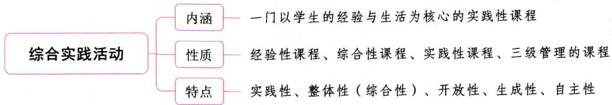

# 第一节 综合实践活动概述

# 一、综合实践活动的内涵 ★★ 【单选、多选、判断、简答】

综合实践活动是基于学生的直接经验，密切联系学生自身生活和社会生活，体现对知识的综合运用的课程形态。这是一门以学生的经验与生活为核心的实践性课程。

教育部于2001年印发的《基础教育课程改革纲要(试行)》规定，综合实践活动的内容主要包括：信息技术教育、研究性学习、社区服务与社会实践、劳动与技术教育。综合实践活动是新的基础教育课程体系中设置的必修课程，自小学三年级开始设置。

教育部于2017年印发的《中小学综合实践活动课程指导纲要》规定，综合实践活动是国家义务教育和普通高中课程方案规定的必修课程，与学科课程并列设置，是基础教育课程体系的重要组成部分。该课程由地方统筹管理和指导，具体内容以学校开发为主，自小学一年级至高中三年级全面实施。

教育部于2022年印发的《义务教育课程方案(2022年版)》规定，将劳动、信息科技从综合实践活动课程中独立出来。

# 知识再拔高·

# 综合实践活动的指定领域与非指定领域

《基础教育课程改革纲要(试行)》规定的综合实践活动的内容并非综合实践活动内容的全部，而是国家为了帮助学校更好地落实综合实践活动而特别指定的四个领域；它们之间在逻辑上不是并列的关系，更不是相互割裂的关系。“研究性学习”作为综合实践活动的基础，倡导探究的学习方式，这一方式渗透于综合实践活动的全部内容之中。“社区服务与社会实践”“信息技术教育”“劳动与技术教育”则是“研究性学习”探究的重要内容。

除上述指定领域以外，综合实践活动还包括大量非指定领域，如班团队活动、学校传统活动（科技节、体育节、艺术节）、社团活动、学生的心理健康活动等，可以与综合实践活动的指定领域相结合，也可以单独开设。

真题1 [2022山东德州，判断]综合实践活动课程的开设时间是从小学五年级开始的。（）

答案：×

# 二、综合实践活动的基本理念

(1)坚持学生的自主选择和主动参与,发展学生的创新精神和实践能力;(2)面向学生完整的生活领域,为学生提供开放的个性发展空间;(3)注重学生的亲身体验和积极实践,促进学习方式的变革。

# 三、综合实践活动的性质 ★【单选、多选】

(1)相对于学科课程而言，综合实践活动是一门经验性课程，不存在内在的知识逻辑和知识体系，是按主题的形式来展开设计的；  
(2)相对于分科课程而言, 综合实践活动是一门综合性课程, 包括内容综合、学习方式综合和活动时空综合三个方面;  
(3)综合实践活动还是一门实践性课程，强调对学生实践能力的培养；  
(4)综合实践活动是三级管理的课程。

# 四、综合实践活动的特点 ★【单选、判断】

# 1. 实践性

综合实践活动是以社会生活和学生的实践活动为基础来开发、设计与利用课程资源的，并非在学科知识的逻辑序列中构建课程和实施课程，实践性是其首要的基本特性。

# 2.整体性(综合性）

综合性是综合实践活动的又一个重要特性，是由综合实践活动中学生所面对的完整的生活世界决定的。可见，综合性源于它的实践性，因为学生的生活与社会实践活动就是由个人、社会、自然等方面的多种要素综合构成的彼此交融的整体。在社会生活实践中，学生与自然、学生与他人、学生与社会、学生与自我的关系是生活世界中最普遍的关系。学生处理这些关系的过程，就是学生个性全面发展的过程。

# 3. 开放性

综合实践活动是一种面向社会生活和实践活动的课程，具有开放性，需要保持同学生生活的密切联系，面向每个学生的个性发展，满足他们融入社会生活和发展综合实践能力的需要。

综合实践活动的课程内容面向学生的生活世界，并随着学生生活的发展变化而变化，具有开放性。只要是与学生的现实生活相关联的，只要是学生自主地提出或自主选择的活动主题，都可以作为学生进行综合实践活动的内容。这种在内容上的开放性特点，是其他任何课程的内容所不具备的。

综合实践活动的过程与结果均具有开放性，表现在学习活动方式和活动过程上，学生可以根据现有的课程资源、自身已有的经验，采取不同的学习方式和活动过程。

# 4.生成性

综合实践活动注重学生的积极参与和亲身经历，让学生在活动过程中不断地形成自身良好的思想意识、情感、态度、价值观和品行，不断地发展动手能力、综合实践能力和创造性，所以，综合实践活动具有生成性，富有生成性的教育价值。

# 5.自主性

综合实践活动充分尊重学生的兴趣、爱好，为学生的自主性的充分发挥开辟了广阔的空间。综合实践活动的主题、活动方式、活动过程，都是学生在教师的指导下，从他们的现实生活情境中自主确定和设计的，具有鲜明的自主性。它注重学生自己选择学习的目标、内容和方式及指导教师，自己决定活动方案和活动结果呈现的形式，指导教师只对其进行必要的指导，不包揽、不替代学生的工作。综合实践活动开

放性的活动领域、活动内容，开放的活动方式、活动过程，为发挥学生学习的自主性创造了条件。

真题2 [2022湖南长沙, 单选]综合实践活动能让学生在活动中不断地形成良好的思想意识、情感等, 不断地发展动手能力和创造性, 这主要体现了综合实践活动的( )

A. 开放性

B. 综合性

C. 实践性

D. 生成性

答案：D

# 第二节 研究性学习

# 一、研究性学习的概念

研究性学习是指学生在教师指导下，从学习生活和社会生活中选择和确定研究专题，主动获得知识、应用知识、解决问题的学习活动。

# 二、研究性学习的组织形式 ★ 【单选】

研究性学习的组织形式主要有三种类型：小组合作研究、个人独立研究、个人研究与全班集体讨论相结合。

(1) 小组合作研究是经常采用的组织形式。课题组一般由 3~6 人组成，学生自己推选研究和组织能力较强的同学为组长，聘请有一定专长的成人（如本校教师、校外人士等）为指导教师。研究过程中，课题组成员各有独立的任务，既有分工，又有合作，各展所长，协作互补。  
(2)个人独立研究可以采取“开放式长作业”形式，即先由教师向全班学生布置研究性学习任务，可以提出一个综合性的研究专题，也可以不确定范围，由每个学生自定具体题目，并各自相对独立地开展研究活动，用几个月到半年时间完成研究性学习作业。  
(3)采用个人研究与全班集体讨论相结合的形式，全班同学需要围绕同一个研究主题，各自收集资料、开展探究活动、取得结论或形成观点，再通过全班集体讨论或辩论，分享初步的研究成果，由此推动同学们在各自原有基础上深化研究，之后或进入第二轮研讨，或就此完成各自的论文。

真题 [2023河北石家庄，单选]研究性学习的组织形式不包括（）

A. 小组合作研究

B. 个人独立研究

C.师生讨论研究

D. 个人研究与班级讨论相结合

答案：C

# 三、对“研究性学习”几种现实价值取向的反思

# 1.“研究性学习”应该防止成人专家化倾向

与“研究性学习”成人专家化取向相伴随的，必然是参与“研究性学习”的学生“精英化”。这与当代我国基础教育的普及化和大众化趋势是不相吻合的。

# 2.“研究性学习”应该防止功能上的过分窄化倾向

研究性学习不仅仅是获取知识的方式和渠道，更重要的是在知识探寻中孕育一种问题意识，亲自寻找并实践解决问题的途径，引发整个学习方式的变革。

# 3.“研究性学习”应该防止学科化倾向

“研究性学习”既是一种学习方式，也是一种课程形态。学科化倾向最终可能导致的是忽视学生学习的过程，以及在过程中所产生的丰富多彩的、活生生的研究性体验，大大加重学生的学习负担，这在根本上是背离研究性学习的价值追求的。研究性学习的教学过程是师生双方共同构建课程领域的过程，而“研究性学习”作为课程领域则成为师生共同探索新知的发展过程。

当然，强调研究性学习的生成取向并不是不要预设。此外，“研究性学习”的开展，要有“课程成本”的观念。我们必须防止不顾学校经费实际情况的浮夸做法，而应该本着量力而行的原则，因地制宜地加以实施。

# 四、作为学习方式的“研究性学习”与作为课程的“研究性学习”的关系 ★ 【单选】

作为一种学习方式，“研究性学习”是指教师不把现成结论告诉学生，而是学生自己在教师指导下自主地发现问题、探究问题、获得结论的过程。作为一种学习方式，“研究性学习”是渗透于学生的所有学科、所有活动之中的。

作为一种课程形态，“研究性学习”课程是为“研究性学习方式”的充分展开所提供的相对独立的、有计划的学习机会。具体来说，是在课程计划中规定一定的课时数，以更有利于学生从事“在教师指导下，从学习生活中和社会生活中选择和确定研究专题，主动地获取知识、应用知识、解决问题的学习活动”。

# ★ 本章核心考点回顾 ★

综合实践活动的内容及实施时间变化

(1)2001年印发的《基础教育课程改革纲要(试行)》规定：①综合实践活动的内容主要包括信息技术教育、研究性学习、社区服务与社会实践、劳动与技术教育。②综合实践活动自小学三年级开始设置。  
(2)2017年印发的《中小学综合实践活动课程指导纲要》规定：综合实践活动课程自小学一年级至高中三年级全面实施。  
(3)2022年印发的《义务教育课程方案（2022年版）》规定：将劳动、信息科技从综合实践活动课程中独立出来。

# 06

# 第六部分教师职业道德

# 内容导学

本部分内容共分为三章。  
- 第一章主要是对教师职业道德的基础概念的讲解,考查题型主要为客观题。  
• 第二章主要介绍了教师职业道德的基本原则、范畴,以及《中小学教师职业道德规范》解读,主、客观题型均会涉及。  
第三章讲述了教师职业道德教育、修养与评价的相关内容，考查题型以客观题为主。  
考生应重点掌握第二章的内容，并结合历年真题有针对性地进行复习。  
为了方便考生梳理知识脉络，我们在各章设置思维导图和核心考点回顾。

# 本部分学习指南

# 一、考情概况

本部分内容较为琐碎、识记性知识较多，考生可带着以下学习目标进行备考：

1. 掌握教师职业道德的特点及功能。  
2. 了解教师职业道德基本原则的主要内容。  
3. 掌握教师职业道德的主要范畴。  
4. 掌握2008年修订的《中小学教师职业道德规范》的内容。  
5. 识记教师职业道德修养的内容与方法。

# 二、考点地图

<table><tr><td>考点</td><td>年份/地区/题型</td></tr><tr><td>教师职业道德的特点</td><td>2024江苏单选;2023山东单选;2023四川判断;2022辽宁单选;2022河南单选、多选、判断;2022广东判断</td></tr><tr><td>教师职业道德的功能</td><td>2024贵州多选;2023湖北单选;2023河南单选;2023河北单选、判断</td></tr><tr><td>教师职业道德基本原则的主要内容</td><td>2024山东多选;2023河南单选;2023浙江单选;2022山西单选;2022河南判断</td></tr><tr><td>教师职业道德的主要范畴</td><td>2024浙江单选;2024四川判断;2023广东单选;2023山东单选;2023河北多选;2022河南单选</td></tr><tr><td>2008年修订的《中小学教师职业道德规范》</td><td>2024河北单选;2024广东单选;2024贵州多选;2024四川多选;2023山东单选;2023安徽单选;2023浙江单选;2023广东多选;2023江苏填空;2022内蒙古单选;2022山西单选</td></tr><tr><td>教师职业道德修养的内容</td><td>2024浙江单选;2024广东判断;2023湖北判断;2022河南单选</td></tr><tr><td>教师职业道德修养的方法</td><td>2024浙江单选;2024贵州单选;2023河北单选;2023内蒙古多选;2022江苏单选;2022河北多选</td></tr></table>

注：上述表格仅呈现重要考点的相关考情。

# 第一章 教师职业道德概述

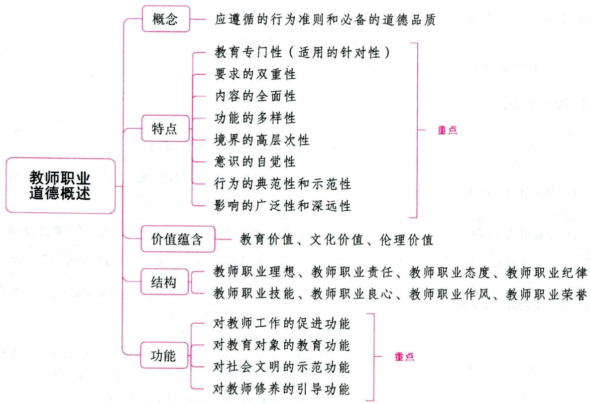

# 第一节 教师职业道德的概念、特点及价值蕴含

# 一、教师职业道德的概念 ★★ 【单选、填空】

教师职业道德又称“教师道德”或“师德”, 它是指教师在从事教育教学活动中所应遵循的行为准则和必备的道德品质。它是社会职业道德的有机组成部分, 是教师行业特殊的道德要求。

教师职业道德是教师在从业过程中进行道德选择、道德评价、道德教育和道德行为等实践活动必须遵循的道德规范和要求，它反映了教师的职业义务，体现了教师所担负的道德责任。

教师职业道德是随着教育的发展而发展的。社会主义的教师职业道德批判地继承了古代师德的优秀遗产，以共产主义道德的基本原则和行为规范为指导，是最先进、最高尚的教师职业道德。

# 二、教师职业道德的特点 ★★★ 【单选、多选、判断】

# 1.教师职业道德的教育专门性（适用的针对性）

教师职业道德适用的针对性表现为教师职业道德对教育善恶的体现和专门适用性，这是教师职业道德

德的一个基本特点。教师职业道德的形成和发展与教师这一行业有着密切联系。教师职业的独特性决定了教师职业道德的针对性。可以说，教师职业道德是关于教育领域是非善恶的道德，它的一切理论都是围绕教师职业展开的。它不仅告诉人们教师职业何以为善的道理，而且指出了教师职业如何为善的途径。

# 2. 教师职业道德要求的双重性

教师的根本任务是教书育人,教师职业道德的一切内容都是围绕这一根本问题产生的,都是与这一根本问题相联系的。古今教师职业道德的发展,始终贯穿着教书育人的要求。在教师职业道德中,育人被视为教书的根本目的。例如,我国古代《礼记》中就有“师也者,教之以事而喻诸德者也”。意思是:教师的职责是既要教给学生有关具体事物的知识,又要让学生知晓立身处世的品德。

# 3.教师职业道德内容的全面性

在古今教育发展的长河中,教师职业道德的内容越来越丰富,涉及教师职业劳动的各个方面,充分体现了教师职业道德内容的全面性。

# 4. 教师职业道德功能的多样性

教师职业道德作为教师这一行业所特有的伦理现象和精神文化，构成了教师这一行业特有的精神风貌，成为教师职业发展源源不断的精神动力。教师职业道德作为教师行为的善恶标准和观念意识，不仅是衡量教师职业行为及其水平的重要依据，对教师行为具有引导作用，而且是教师在职业活动中对各种关系和矛盾加以调节或解决的重要依据，它能提高教师对其职业道德的评价能力，促进教师职业道德修养水平的不断提高……这都说明了教师职业道德功能具有多样性。

# 5.教师职业道德境界的高层次性

境界的高层次是指社会和他人对教师职业道德要求总是在整个社会道德体系中处于较高水平和较高层次。“师德”是高于一般社会公众道德水准的职业道德。教师职业道德的高层次是由教师教书育人的目的和任务决定的。

# 6.教师职业道德意识的自觉性

意识的自觉性是指教师因职业劳动的特点所决定的在职业道德意识上的更高的自觉性，它是教师职业情感和职业行为的基础。

# 7.教师职业道德行为的典范性和示范性

教师职业道德不仅是对教师自身行为的规范要求，对学生进行教育的手段，而且也对社会成员具有教育价值。

# (1)典范性

行为的典范性是指教师的品德和行为对学生的思想品德的形成与行为具有榜样作用。教师职业道德的典范性是由教师劳动的示范性决定的。教师要以身作则、为人师表,这是教师职业道德区别于其他职业道德的显著标志。

# (2) 示范性

教育机构自古以来就被认为是道德高尚的场所和人间净土。人们对教师在道德上的要求一般都高于从事其他职业的人员。因此，教师所具备的职业道德广泛、深入地影响着整个社会成员乃至整个社会的进步。

# 8.教师职业道德影响的广泛性和深远性

# (1)广泛性

所谓教师职业道德影响的广泛性，是指教师的思想道德不仅影响在校学生，而且会通过学生和家长进而影响整个社会。学校是社会主义精神文明建设的基地，教师是精神文明的倡导者和推行者。可以说，教师职业道德建设是一件牵动千家万户并影响千秋万代的大事，具有重大意义。

# (2) 深远性

教师职业道德影响的深远性是指教师的道德品质和行为将给学生留下深刻久远的印象，它不会因学生的毕业而随之结束，还将延续到毕业之后，有时甚至伴随学生的一生。

# 知识再拔高·

# 教师职业道德的特点的其他说法

说法一：(1)鲜明的继承性；(2)强烈的责任性；(3)独特的示范性；(4)严格的标准性。

说法二：（1）从教师的社会重任来看，师德具有全局性；（2）从教师的社会地位来看，师德具有超前性；（3）从教师职业及个人素质来看，师德具有导向性；（4）从教师的人格评价来看，师德具有超越一般职业道德的示范性。

说法三：(1)高度的自觉性。(2)明显的示范性。教师的职业性质和活动特点，决定了教师的职业道德具有“以身立教”的作用，决定了教师要以身作则，时时处处起表率作用。教师的职业性质、活动特点还决定了教师的一举一动，一言一行，待人处事的态度乃至气质、性格不仅会对学生产生深刻的影响，还会通过学生对家庭和社会起着潜移默化的作用。(3)强烈的时代性。

真题1 [2023山东济宁,单选]下列关于其他职业道德与教师职业道德特点的分析，错误的是（）

A. 在内容方面,教师职业道德比一般职业道德更具全面性  
B.“师也者，教之以事而喻诸德者也”体现了教师职业道德要求的双重性  
C. 以身作则、为人师表是教师职业道德区别于其他职业道德的重要特征  
D. 相较于其他职业,教师职业道德功能具有单一性

真题2 [2022辽宁营口，单选]教师的职业性质和活动特点决定了教师的一举一动、一言一行、待人处事的态度乃至气质、性格不仅会对学生产生影响，还会通过学生对家庭和社会起潜移默化的作用。这表明教师职业道德具有（）

A. 高度的自觉性

B. 明显的示范性

C. 强烈的时代性

D. 广泛的利他性

真题3 [2022广东广州，判断]师德是高于一般社会公众道德水准的职业道德。（）

答案：1.D 2.B 3.√

# 三、教师职业道德的价值蕴含 ★★ 【单选、判断】

# 1. 教育价值

教师是从事教育工作的人，其职业道德的教育价值是客观存在的。教师职业道德对社会成员也具有教育价值。同时，教师职业道德所含有的教育价值也体现在它对教师自身的教育中。

# 2.文化价值

教师职业道德既是一种行为规范,又是一种文化现象。它的发展不仅仅是提出一定的职业道德规范或根据社会及教育的实际变化更新教师职业道德,同时总是伴随着对这些规范的理论解释,它反映着教育对自身文明和社会文明的系统思考和追寻,体现出浓郁而又独特的文化意蕴,进而使教师职业道德不仅呈现出一种独特的规范存在,也体现出一种独特的文化存在。

# 3. 伦理价值

教师职业道德作为教师的行为规范，在本质上表现为教师职业行为中的向善和“应当”的价值取向，它常常以公正、热爱、民主、团结、廉洁、文明等概念体现出来。在教育过程中，教师职业道德具体表现为热爱学生、尊重学生的人格、培养学生的思想品德、增进学生的健康、挖掘学生的智慧潜力、陶冶学生的情操、锻炼学生的意志、发展学生的个性……所有这些，确立和保护了学生作为个性的人的价值和精神的独立，从而促使他们的发展既符合社会的需要，又满足个体的需要；既符合道德的原则，又符合学生身心成长规律的要求。从这个意义上讲，教师职业道德具有明显的伦理价值。

真题4 [2022河南郑州，判断]教师职业道德既是一种行为规范，又是一种文化现象。（）

答案：√

# 第二节 教师职业道德的结构与功能

# 一、教师职业道德的结构 ★【单选、不定项、判断】

# 1.教师职业理想

所谓职业理想, 就是指人们对于未来工作类别的选择以及在工作上达到何种成就的向往和追求。职业理想是职业道德的重要组成部分, 有了崇高的职业理想才能产生模范遵守职业道德的行为。

# 2.教师职业责任

所谓教师职业责任, 就是教师必须承担的职责和任务。在社会主义条件下, 人民教师的根本职责,就是培养社会主义新人, 换句话说, 人民教师的职责, 是培养社会主义现代化事业的建设者和接班人,自觉履行教师职责, 要求教师自觉地做到对学生负责, 对家长负责, 对教师集体负责, 对社会负责。

# 3.教师职业态度

教师职业态度，是指教师对自身职业劳动的看法和采取的行为，简而言之，就是指教育劳动态度或教师劳动态度。

# 4.教师职业纪律

教师职业纪律就是教师在从事教育劳动过程中应遵守的规章、条例、守则等。它是维持教育活动正常进行的保证，是教师必须遵守而不能违反的。

# 5.教师职业技能

教师职业技能集中地表现为教师教书育人的本领，教师教书育人活动的效果是教师职业技能的反映。教师职业技能要求教师刻苦钻研业务，不断更新知识，要懂得教育规律，要具备一定的管理知识，勇于实践，不断创新。

# 6.教师职业良心

所谓教师职业良心，就是教师在对学生、学生家长、同事以及对社会、学校、职业履行义务的过程中所形成的特殊道德责任感和道德自我评价能力。

# 7.教师职业作风

所谓教师职业作风，就是教师在自身职业活动中表现出来的一贯态度和行为。

# 8.教师职业荣誉

所谓教师职业荣誉，就是教师在履行职业义务后，社会所给予的赞扬和肯定，以及教师个人所产生的尊严与自豪感。

真题1 [2022湖南长沙，单选]以下不属于教师职业责任的是（）

A. 对社会负责

B. 对家长负责

C. 对学生负责

D. 对家人负责

真题2 [2023湖北武汉，不定项]教师要提高自己的职业技能，要做到（）

A. 刻苦钻研业务, 不断更新知识

B. 懂得教育规律

C.具备一定的管理知识

D. 勇于实践,不断创新

答案：1.D 2.ABCD

# 二、教师职业道德的功能 ★★★ 【单选、多选、判断】

# 1. 对教师工作的促进功能

教师职业道德相对于学校的规章制度、教育计划、教学大纲等，能够更灵活、更有效，时时处处地指导、调节与监督教师的教育行为。教师职业道德对教师教育行为的调节主要是通过社会舆论和内心信念两种形式来实现的。教师职业道德能够通过激发动力、评价优劣、调节行为来处理和调节各种利益关系，保证教师教学工作的顺利开展和教育任务的圆满完成，这是教师职业道德最基本的社会作用。

# 2. 对教育对象的教育功能

青少年具有很大的可塑性。他们往往从教师的道德意识和道德行为中汲取是非、善恶观念。当教师按照教师职业道德作为时，会使道德要求具体化、人格化，从而使学生在富于形象性的榜样中受到启迪和教育，在潜移默化中形成教师所期望学生拥有的良好思想品德，增强教师教育的可信度、吸引力和有效性。

# 3. 对社会文明的示范功能

教师在历代都是社会道德典范，被认为是社会文化使者、高尚道德的代表，他们对社会文明的示范功能通过三种途径表现出来：(1)通过培养学生的优良品德而影响社会道德，学生是具有多重角色的个体，在校是学生，在社会上是公民，他们的多重身份更利于社会文明的传播；(2)通过教师参加各种社会活动而影响社会道德，当教师严格遵循教师职业道德，以高尚的道德面貌出现在社会中时，他们的道德风貌、人格形象便会对社会各方面产生积极影响；(3)通过教师家庭生活和社会生活，促进社会主义新型人际关系的建立和发展。这些都直接或间接地以各种方式体现在社会生活的各个方面，促进文明之花处处开。

# 4. 对教师修养的引导功能

社会对教师整体素质的要求高于其他行业的从业人员。教师在工作岗位上不断提高自己的业务能力和道德水平, 加强自身修养是教师职业道德品质的重要内容和应有要求。在教师自身修养过程中, 教师职业道德具有引导功能。

# 知识再拔高·

# 教师职业道德的功能（作用）的其他说法

说法一：(1)对教师工作的动力功能；(2)对教师职业行为的调节功能；(3)对教育对象的教育功能；(4)对教师工作的评价功能；(5)对社会文明的示范功能；(6)对教师自身修养的引导功能。

说法二：(1)调节作用。对教育过程的调节作用是教师职业道德最基本、最重要的作用。(2)教育作用。(3)导向作用。这种导向作用具体表现为：激励作用、控制作用、调整作用、矫正作用。其中，矫正作用是指教师是学生的一面镜子，不少学生都以教师的道德为榜样，对照自己，检查自己，克服缺点，纠正错误。(4)促进作用。

说法三：(1)教师职业道德对教师起调节和教育作用；(2)教师职业道德对学生起榜样和带动作用；(3)教师职业道德对社会起影响和促进作用。

真题3 [2023湖北武汉, 单选]教师职业道德对教师教育行为的调节主要通过（）和内心信念两种方式来实现。

A. 引导示范

B. 教育对象

C. 伦理价值

D. 社会舆论

真题4 [2023河南周口，单选]教师按照师德的要求不断加强自身修养，主要体现了教师职业道德的（）

A. 反馈功能

B. 引导功能

C. 评价功能

D. 示范功能

真题5 [2023河北邢台, 单选]教师是学生的一面镜子, 不少学生都以教师的道德为榜样, 对照、检查自己, 克服缺点。这是教师职业道德的（ ）作用。

A. 激励

B. 矫正

C. 控制

D. 调整

答案：3.D 4.B 5.B

# 本章核心考点回顾

# 1.教师职业道德的特点

(1)教育专门性(适用的针对性)。(2)要求的双重性——教书育人。(3)内容的全面性。(4)功能的多样性。(5)境界的高层次。(6)意识的自觉性。(7)行为的典范性和示范性——教师要以身作则、为人师表,这是教师职业道德区别于其他职业道德的显著标志。(8)影响的广泛性和深远性。

# 2.教师职业道德的功能

(1)对教师工作的促进功能。教师职业道德对教师教育行为的调节主要是通过社会舆论和内心信念两种形式来实现的。(2)对教育对象的教育功能。(3)对社会文明的示范功能。(4)对教师修养的引导功能。

# 第二章 教师职业道德的基本原则、范畴及规范

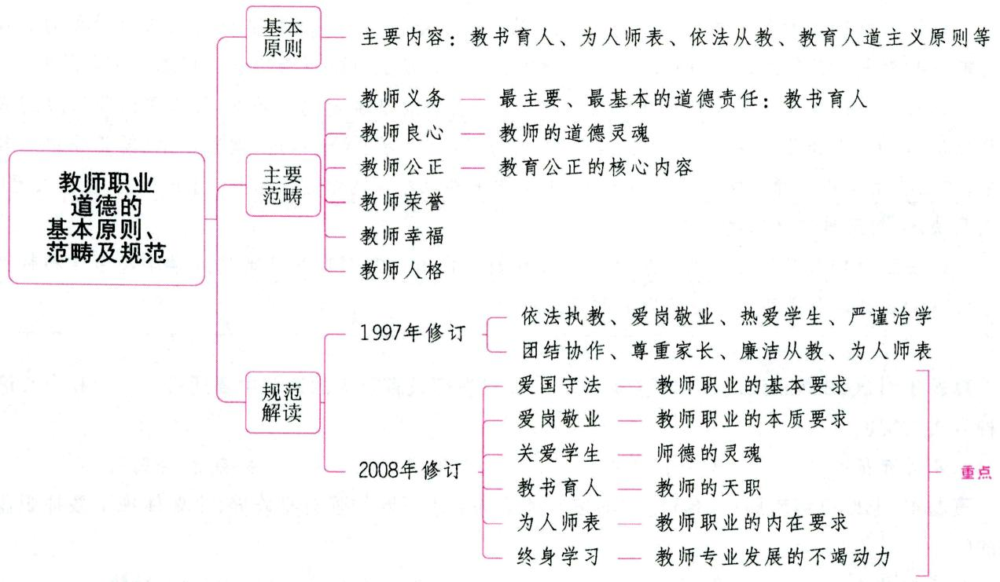

# 第一节 教师职业道德基本原则

# 一、教师职业道德基本原则的内涵 ★ 【单选、判断】

# 考点1 教师职业道德基本原则的含义

教师职业道德基本原则是教师在教育职业活动中正确处理各种利益关系所应遵循的最根本的指导准则, 是一定社会或阶级对教师在职业活动中提出的最根本的道德要求。它指明了教师职业实践中道德行为的总方向, 体现了教师职业道德的本质属性, 统帅整个教师职业道德体系, 是衡量和判断教师行为善恶的最高道德标准。简言之, 教师职业道德基本原则具有指导、统帅和裁决作用。

# 考点2 忠于人民教育事业是我国教师职业道德基本原则

忠于人民教育事业是我国教育社会主义性质的必然要求，是教师在处理个人利益和社会整体利益关系时所必须遵循的根本指导原则，是衡量教育工作者个人行为和品质的最高道德标准。忠于人民教育事业不仅是教育工作者从事职业活动的基本要求，更重要的是每个教育工作者在自己的教育劳动中，要建立崇高的职业理想，把从事教育劳动、培养社会主义事业的建设者和接班人作为自己的志向和抱负，培养自己对教育劳动真挚的、深厚的情感，并以从事教育劳动为荣，以献身教育事业为乐，把自己

平生精力都投入到教育事业中，全心全意地为社会主义教育事业服务。

考点3 教师职业道德基本原则与教师职业道德范畴、教师职业道德规范的关系

道德原则是一定社会或阶级对人们行为提出的最基本的要求，是道德体系的核心，它是人们立身处世的基本准则，也是判断是非、善恶的基本标准。道德规范则是比较具体的道德原则，它是在一定条件下，一定范围内人们立身处世和评价是非、善恶的标准。教师的职业道德规范是对一定社会教育制度和教育活动中伦理关系的概括和总结，又是评判教师行为的道德准则，它体现了社会对教师职业行为的约束作用。道德范畴存在于每一个人的意识和感情中，是反映人们道德关系和行为调节方向的一些基本概念。

教师职业道德规范和范畴都是由教师职业道德基本原则派生出来的，是教师职业道德基本原则的展开、补充和具体化。

真题1 [2024江苏南通，判断]师德规范体现了社会对教师职业行为的约束作用。（）

答案：√

# 二、教师职业道德基本原则的主要内容 ★★★ 【单选、多选、判断】

说法一：(1)教书育人原则；(2)为人师表原则；(3)依法从教原则；(4)教育人道主义原则。

说法二：(1)集体主义原则。(2)教育人道主义原则。(3)教书育人原则。教书育人作为教师职业道德的一个基本原则，是由教师职业的本质特征和职责决定的。(4)乐教勤业原则。乐教勤业是从事教育工作的基础和动力，是教师职业道德基本原则的核心。(5)教育民主原则。教育民主原则是指在教育教学过程中教师要以平等友善的态度对待学生、尊重学生、引导学生，激励学生发展。坚持教育民主原则的具体要求包括：①教师要尊重每个学生的兴趣、爱好、个性和人格；②教师要以平等、宽容、博爱、友善和引导的心态对待学生；③教师要营造一种使学生能平等交流、主动参与、自由探索、大胆创新的民主氛围。(6)教育公正原则。(7)人格示范原则。(8)依法执教原则。

真题2 [2023河南济源，单选]潘老师只顾完成教学任务，对学生的思想道德教育不闻不问，其违背了哪一教师职业道德原则（ ）

A. 集体主义原则

B.教书育人原则

C. 教育民主原则

D. 教育公正原则

真题3 [2024山东济南，多选]教师职业道德的基本原则作为对教师行为的基本要求和评价标准，在教师职业道德体系中居于主导地位。教师必须遵循的基本原则包括（）

A.教书育人原则

B.为人师表原则

C. 教育人道主义原则

D. 依法从教原则

答案：2.B 3.ABCD

# 三、教师职业道德基本原则确立的依据

(1) 必须反映一定社会经济关系和阶级利益的根本要求；(2) 必须符合一般社会道德原则的基本要求；(3) 必须反映教师职业活动的特点。

# 四、教师职业道德基本原则的要求

(1)树立无产阶级的世界观、人生观和价值观；(2)树立崇高的理想、信念和价值目标；(3)具备良好的专业能力素质；(4)具有顽强的意志和崇高的精神境界。

# 第二节 教师职业道德范畴

# 一、教师职业道德范畴的含义

教师职业道德范畴是指那些概括和反映教师职业道德的主要特征、体现一定社会对教师职业道德的根本要求，并成为教师的普遍内心信念，对教师的行为发生影响的基本道德概念。

# 二、教师职业道德的主要范畴 ★★★ 【单选、多选、判断】

# 考点1 教师义务

教师在履行一般社会成员的义务的同时,又有着其特定的职业道德义务。教师义务的内容主要有:(1)不断提高思想政治觉悟和教育教学业务水平;(2)尽职尽责,教书育人;(3)创设一个良好的内部教育环境。

教师在履行教育义务的活动中，最主要、最基本的道德责任是正反两个方面。正面：教书育人；反面：“不要误人子弟”。教师应当对此有清醒的认识。

# 考点2 教师良心

教师良心是教师个人在自己的教育实践中，对社会向教师提出的一系列道德要求的自觉意识，是教师个人对学生、教师集体和社会自觉履行其职责的道德责任感以及对自己教育行为进行道德控制和道德评价的能力，是多种教师职业道德心理因素在教师个人意识中的有机统一。从教师个体职业良心形成的角度看，教师的职业良心首先会受到社会生活和群体的影响。教师良心是教师道德觉悟的综合表现，是教师的道德灵魂。

教师良心作为一种精神动力，是一种内在的道德信念，对教师的道德活动和道德行为具有重要的指导、自我监督和评价作用。

教师良心的特点包括：(1)公正性；(2)综合性；(3)稳定性；(4)内隐性；(5)广泛性。

# 考点3 教师公正

教师公正是教师职业道德修养水平的重要标志，体现着一定社会对教师的根本要求。教师公正是指教师在教育职业活动中，公平合理地对待和评价全体合作者。所谓公平合理地对待和评价全体合作者，即按照社会主义道德原则指导下的伦理定位来对待、评价和处理教师同所有面对的群体或个人之间的关系。从外部来看，主要是教师同社会各界的关系；从内部来看，主要是教师个人同领导、同事和学生的关系。其中，公平合理地评价和对待每个学生是教师公正的最基本的内容。教师公正的核心是对学生的公正。

教师公正是教育公正的核心内容，教育公正不仅包括教师公正，而且也包括教育的制度性公正。

教师公正的内容包括：(1)坚持真理，伸张正义；(2)一视同仁，爱无差等；(3)办事公道，赏罚分明；(4)因材施教，长善救失；(5)确立性别平等意识，公正地对待不同性别的学生。

教师公正的作用包括：(1)有利于调动每个学生的学习积极性；(2)有利于学生形成公正无私的道德品质；(3)有利于教师威信的形成；(4)有利于形成良好的教育教学环境。

# 考点4 教师荣誉

教师荣誉即社会对教师的道德行为的价值所做出的公认的客观评价和教师对自己行为的价值的自我意识。其作用有：(1)教师荣誉是教师道德行为的调节器，对教师道德行为、品质的取向具有导向和制约作用；(2)教师荣誉是激励和推进教师积极进取，更好地履行教师义务，争取个人道德高尚、人格完善的助推器；(3)教师荣誉是促进教师自身道德发展和完善，形成良好师德风尚的重要精神条件。

教师荣誉的内容包括：(1)光荣的角色称号；(2)无私的职业特性；(3)崇高的人格形象。

# 考点5 教师幸福

教师幸福也称教育幸福，是指处于一定社会经济关系和历史环境中的教育工作者，在教育教学过程中，由于感受到目标和理想的实现，而获得的精神上的满足。

准确把握和理解教师幸福的含义，应从四个方面着眼：（1)教师幸福更多体现在精神层面；(2)教师幸福具有给予性和被给予性；(3)教师幸福具有集体性；(4)教师幸福具有无限性。

教师的幸福能力的培养：(1)充分认识教师职业的意义，并与自己的生命意义相联系；(2)培养高尚的师德水平，提升教师的人生境界；(3)教师对自己从事的教育教学活动要有实践能力。

# 考点6 教师人格

这里的人格主要是指道德人格。教师的道德人格是指个体作为教师这一特定社会角色所表现出的道德面貌与特征，是教师在自己的职业活动中表现出的稳定性的道德行为的范式(格式)和道德品质与境界(格位)，也是教师之所以成为教师的主体本质。由于职业的规定性，教师的道德人格与一般道德人格有显著的不同。其主要的特质可以归结为两点：（1)人格与师格的统一；（2)较高的格位水平。

教师人格修养有两个问题：一是修养的策略问题，二是修养的尺度问题。

在策略上，采取“取法乎上”的策略，这是因为：(1)人格修养的规律性；(2)师范人格的特点（格位高）；(3)中国古代的伦理智慧。

在尺度上要确立教师人格修养的审美尺度，按照审美的尺度去修养教师的人格，就是要进行师表美的建设。从德育（道德教育）的角度看，师表之美的价值至少有三点：(1)充分发挥教育主体的德育潜能；(2)充分促成学生的榜样学习；(3)改善教育与道德教育的效能。师表美主要包括：“表美”“道美”和风格美。

真题1 [2024浙江杭州，单选]教师在履行教育义务的活动中，最主要、最基本的道德责任是( )

A.教书育人

B. 依法执教

C. 爱岗敬业

D. 团结协作

真题2 [2023山东菏泽，单选]教师道德觉悟的综合表现，教师的道德灵魂是（）

A.教师义务

B. 教师良心

C. 教师荣誉

D. 教师公平

真题3 [2022河南郑州,单选]教师不断提高自己的政治思想觉悟，这属于（）

A.教师荣誉

B. 教师技能

C. 教师公正

D.教师义务

真题4 [2023河北邢台，多选]教师良心的特点有（）

A. 公正性

B. 综合性

C. 稳定性

D. 广泛性

真题5 [2024四川统考，判断]只要能做到对学生公正，就是一名公正的教师。（）

答案：1.A 2.B 3.D 4.ABCD $5.\times$

# 第三节 《中小学教师职业道德规范》解读

改革开放以来，我国于1985年、1991年、1997年先后三次颁布和修订了《中小学教师职业道德规范》。现今我国社会经济和教育进入新的历史阶段，为适应时代发展的需要，2008年9月，教育部、中国教科文卫体工会全国委员会联合发布了重新修订的《中小学教师职业道德规范》（以下简称新《规范》）。新《规范》的基本内容有六条，体现了教师职业特点对师德的本质要求和时代特征，爱与责任是贯穿其中的核心和灵魂。新《规范》的突出特点是：(1)突出了重要性；(2)体现了时代性；(3)提高了针对性；(4)增强了概括性；(5)注重了操作性。

真题1 [2022内蒙古赤峰，多选]《中小学教师职业道德规范（2008年修订）》的突出特点是（ ）

A. 突出了重要性

B. 体现了时代性

C. 提高了针对性

D. 注重了操作性

答案：ABCD

# 一、1997年修订的《中小学教师职业道德规范》 ★★ 【单选、多选、判断】

# 1. 依法执教

学习和宣传马列主义、毛泽东思想和邓小平同志建设有中国特色社会主义理论，拥护党的基本路线，全面贯彻国家教育方针，自觉遵守《中华人民共和国教师法》等法律法规，在教育教学中同党和国家的方针政策保持一致，不得有违背党和国家方针、政策的言行。

# 2. 爱岗敬业

热爱教育、热爱学校，尽职尽责、教书育人，注意培养学生具有良好的思想品德。认真备课上课，认真批改作业，不敷衍塞责，不传播有害学生身心健康的思想。

# 3. 热爱学生

关心爱护全体学生，尊重学生的人格，平等、公正地对待学生。对学生严格要求，耐心教导，不讽刺、挖苦、歧视学生，不体罚或变相体罚学生，保护学生合法权益，促进学生全面、主动、健康发展。

# 4. 严谨治学

树立优良学风，刻苦钻研业务，不断学习新知识，探索教育教学规律，改进教育教学方法，提高教育、教学和科研水平。

# 5. 团结协作

谦虚谨慎、尊重同志，相互学习、相互帮助，维护其他教师在学生中的威信。关心集体，维护学校荣誉，共创文明校风。

# 6. 尊重家长

主动与学生家长联系，认真听取意见和建议，取得支持与配合。积极宣传科学的教育思想和方法，不训斥、指责学生家长。

# 7.廉洁从教

坚守高尚情操，发扬奉献精神，自觉抵制社会不良风气影响。不利用职责之便谋取私利。

# 8.为人师表

模范遵守社会公德，衣着整洁得体，语言规范健康，举止文明礼貌，严于律己，作风正派，以身作则，注重身教。

以下主要介绍依法执教、热爱学生、严谨治学、廉洁从教：

依法执教是调整教师劳动与法律制度之间关系的师德规范, 是教师完成本职工作的前提和基础,是国家和社会对教师提出的最根本的道德要求。

热爱学生是教育学生的感情基础，是教师职业道德高低的试金石。

严谨治学最重要的是实事求是。其基本要求包括：(1)要有精深的专业知识；(2)要有刻苦钻研、精益求精的精神；(3)要有谦虚谨慎的态度；(4)要有锐意创新的品质。

廉洁从教是指教师在整个教育教学生涯中都要坚持行廉操洁的原则,不贪受学生及家长的钱物、不贪占公共和他人的钱物,不沾染社会上贪、赌、欲等恶习,始终以清廉纯洁的道德品行为学生和世人做出表率。

真题2 [2023河北唐山，单选]对教师而言，廉洁从教的具体内容不包括（）

A. 不能抱怨自己的薪酬

B. 不贪学生及家长的钱财

C. 不占公共与他人的钱财

D. 不染社会上出现的贪污、贿赂等恶习

真题3 [2023湖北武汉, 判断]依法执教是调整教师劳动与法律制度之间关系的师德规范。（）

真题4 [2023广东韶关，判断]一位教师从教几十年来，从未收取学生家长一分一毫。这体现了“廉洁从教”的教师职业道德规范。（）

答案：2.A 3.√ 4.√

二、2008年修订的《中小学教师职业道德规范》 ★★★【单选、多选、填空、判断、简答、案例分析】

考点 爱国守法——教师职业的基本要求

爱国守法是教师处理其与国家社会的关系时所应遵循的原则要求。教师与国家社会的关系是教师必须首先面对的关系，也是在职业行为上必须首先要协调的关系。在教师与国家社会的关系上，教师需要处理自己作为一个公民和社会职业者与国家社会的关系。

新《规范》中关于“爱国守法”方面所规定的具体职业行为要求有以下几点：

# 1. 全面贯彻国家教育方针

教师是从事国家教育事业的专业人员，教师代表国家从事人民的教育事业。教师爱国、爱中国共产党、爱社会主义，具体行为表现在全面贯彻国家教育方针。这是要求教师的一切教育教学行为都要符合国家教育方针的要求。

# 2. 自觉遵守教育法律法规，依法履行教师职责权利

爱国要求教师必须守法，遵守教育法律法规的规范要求。法律法规的核心是权利和义务，因此教师必须自觉履行教育法律法规所规定的教师的权利和义务。

# 3. 不得有违背党和国家方针政策的言行

上面两个要求是“爱国守法”方面倡导性的职业行为，而这一要求则是禁止性的职业行为规定。在教师的职业活动中，出现违背党和国家方针政策的言行，是违背“爱国守法”职业行为规定的。

# 知识再拔高·

# 中小学教师职业道德规范中关于“爱国”和“守法”的基本要求

1.“爱国”的基本要求

(1)牢固树立中华民族和国家利益至上的意识，自觉维护祖国的独立、统一，尊严和利益；(2)为建设富强、民主、文明、和谐、美丽的社会主义现代化强国作出力所能及的贡献；(3)在教育教

学中，积极实施爱国主义教育。

# 2.“守法”的基本要求

守法不仅是法律层面的要求，也是道德层面的要求。作为教师道德规范，守法强调教师要自觉地学法、懂法和守法，同时在教育教学中，严格遵守宪法和教育法律法规，使自己的教育教学活动合法、规范，做到依法执教。

# 考点2 爱岗敬业——教师职业的本质要求

爱岗敬业是教师处理其与教育事业的关系时所应遵循的原则要求。教师的职业活动，是一种事业——教育事业。教育事业是教师职业活动的全部内容，是教师职业活动中必须处理好的根本关系。在一定意义上也可以说，教师与教育事业的关系涵盖了教师职业活动内部全部的关系。这里所说的教师与教育事业的关系，是将教育事业作为一个整体，教师与之发生的关系。

新《规范》中关于“爱岗敬业”方面所规定的具体职业行为要求有以下几点：

# 1. 对工作高度负责

在教师与教育事业的关系上，这一职业行为要求仍然是原则性的，但是从“责任”的要求来看，也可以说是具体的。这是说，教师对教育事业在行为上最重要的是“责任”。

# 2. 认真备课上课

教师对教育事业负责，是通过课堂教学来实现的，因而教师在职业行为上首先就要做到认真备课上课。认真备课上课，是要求教师认真备好每一节课，认真上好每一节课。

# 3. 认真批改作业

学生写作业和教师批改作业，是教学活动的重要环节。教师没有认真地批改作业，学生就不能得到准确的学习信息反馈，教学环节就有缺失。

# 4.认真辅导学生

现代教学活动是以班级授课制为基础的，但是学生的学习是有个性的、有个体差异的，因而集体教学与个别辅导必须结合起来。只有班级教学活动，而没有学生个别辅导，这样的教学也是不完整的。

# 5. 不得敷衍塞责

这是禁止性的职业行为规定，也是原则性、概括性的规定。“不得敷衍塞责”是从禁止性方面强调了教师的教育教学责任。

# 考点3 关爱学生——师德的灵魂

关爱学生是教师处理其与学生的关系时所应遵循的原则要求。教师与学生的关系是教师职业活动中发生的最重要的关系。教育活动主要就是在教师与学生之间发生的，教师所从事的教育活动中心就是师生关系。

新《规范》中关于“关爱学生”方面所规定的具体职业行为要求有以下几点：

# 1. 关心爱护全体学生, 尊重学生人格, 平等公正对待学生

关爱学生的范围是全体学生，而不是某一部分。在实际教育活动中，有些教师不是不能给予学生关爱，而是往往不能给予全体学生关爱。这不符合教师职业行为要求。

关爱学生的核心,是尊重学生人格。尊重学生人格,就是把学生看作与自己一样有尊严、有利益诉求的人。

关爱学生的关键是做到对学生平等公正。平等,是师生之间的平等、生生之间的平等;公正,是将关爱给每一个学生,不论这些学生的发展状况如何、社会背景和家庭背景如何。

# 2. 对学生严慈相济，做学生的良师益友

关爱学生不是不要严格。严格要求学生，也是对学生的成长负责；然而严格不意味着没有宽容，学生成长总会出现这样那样的问题。严格教育学生，应当全面地、科学地要求学生。概括起来讲，严格教育、全面要求学生应当遵循以下四条原则：(1)严而有理；(2)严而有度；(3)严而有方；(4)严而有恒。

# 3. 保护学生安全，关心学生健康，维护学生权益

关爱学生还要求教师对学生的安全、健康负责，对学生的权益负责。学生的安全，是他们的人身安全；学生的健康，是他们的身心健康；学生的权益，是法律赋予他们的权益。

# 4. 不讽刺、挖苦、歧视学生，不体罚或变相体罚学生

这是对教师在与学生关系上的禁止性规定。在语言上讽刺、挖苦学生，在态度上歧视学生，这在职业行为上是不容许的。在教育学生的方法上，采用体罚和变相体罚，也是教师职业道德不容许的。

# 考点4 教书育人——教师的天职

教书育人是教师在处理其与职业劳动的关系时所遵循的原则要求，是教师最核心的职责与任务。教师的职业劳动是具体的教育教学活动。教育教学活动从现象上看是“教书”。在教育教学活动中，教师要开展传递知识与技能的活动，知识与技能是教师直接操作的对象，但是，教师操作知识与技能的目的还在于学生。因而，“育人”是教师职业劳动的本质。

新《规范》中关于“教书育人”方面所规定的具体职业行为要求有以下几点：

# 1.遵循教育规律，实施素质教育

教育的本质要求是促进人的健康全面发展,遵循教育规律就要实施素质教育。素质教育从根本上说,就是“育人”。“教书”是途径,“育人”是目的。当然两者不可偏废。没有“教书”,“育人”没有依托;没有“育人”,“教书”就失去了本来意义。

# 2. 循循善诱，诲人不倦，因材施教

符合教书育人要求的教师职业劳动行为应当是“耐心”的、“引导”的、充满教育“热情”的，而且能够实施针对每一个学生“量身定做”的教育。

# 3. 培养学生良好品行，激发学生创新精神，促进学生全面发展

把“育人”作为目的的教育，把德育放在重要位置上，把教育学生成“人”放在首要位置上；“育人”也要把培养具有创新精神的现代人作为职业劳动的要求。

以“育人”为目的的教育，必须实施全面发展的教育，最终要达到学生全面发展的目的。

# 4. 不以分数作为评价学生的唯一标准

在“教书育人”方面禁止的行为，就是背离“育人”目标的做法，或者说是应试教育的做法。教师头脑中必须明确，以分数作为评价学生唯一标准的做法，是教师职业行为明确禁止的。

# 考点5 为人师表——教师职业的内在要求

为人师表是教师在处理其与自己的关系时应遵循的原则要求。教师职业劳动不只是同别人交往，也是同自己交往，即教师也把自己作为职业行为所要调节的对象，就是对自己提出道德的要求，在自己的心中树立起一种职业行为的形象。

新《规范》中关于“为人师表”方面所规定的具体职业行为要求有以下几点：

# 1. 坚守高尚情操，知荣明耻

这是要求教师在职业行为上符合社会主义的荣辱观。

# 2. 严于律己，以身作则

教师在职业活动中对自己要严格要求，要以自己的行为作为他人，特别是学生的楷模。

# 3. 衣着得体，语言规范，举止文明

以身作则，在行为举止上，要注意穿着、言语和行为符合现代文明要求，能够为学生做出榜样。

我国教师应该遵循的仪表行为规范主要包括：（1)衣着整洁，朴实大方，服饰要符合职业特点，体现教师为人师表的良好形象。(2)举止稳重大方、潇洒自然、彬彬有礼。切忌轻浮粗俗、拘谨呆板。

# 4. 关心集体, 团结协作, 尊重同事, 尊重家长

以身作则，也表现在处理与同事、学生家长的关系上，要能够尊重他人，与他人和谐相处。在处理与家长关系时应遵循的道德要求是：(1)主动与学生家长联系；(2)认真听取家长的意见和建议；(3)尊重学生家长的人格；(4)教育学生尊重家长。

# 5. 作风正派，廉洁奉公

以身作则，体现在为人作风上，就是“廉洁奉公”。这一行为要求在教师方面，就是要求教师不从学生那里谋取自己的利益，就是“廉洁从教”。

# 6. 自觉抵制有偿家教，不利用职务之便谋取私利

有偿家教，是市场经济条件下出现的比较严重的违背教师职业行为规范的问题，新《规范》中特别作为禁止性规定提出。

# 考点6 终身学习——教师专业发展的不竭动力

终身学习是教师在处理其与自己发展的关系时所应遵循的原则要求。教师与自己的发展, 也属于教师与自己关系的范畴。强调教师自己的发展, 是说教师在教育活动中, 不仅要把学生作为一种发展对象来看待, 也要把自己作为一种发展对象来看待。教师的自我发展, 也是教师职业行为调节的对象。这是在终身学习的社会中发生的关系。

新《规范》中关于“终身学习”方面所规定的具体职业行为要求有以下几点：

# 1. 崇尚科学精神，树立终身学习理念，拓宽知识视野，更新知识结构

科学精神是求真的精神, 是不断探索的精神。根据科学精神的要求, 在一个终身学习的社会里, 教师应当具有终身学习的理念, 在行为上能够自觉地继续学习, 发展自己的知识。

# 2. 潜心钻研业务, 勇于探索创新, 不断提高专业素养和教育教学水平

教师的发展，特别是指自己的专业发展。一个能够自觉地发展自己专业水平的教师，才能不断适应教育实践给自己提出的新要求。

一般认为，爱岗敬业、教书育人和为人师表是师德的核心内容，关爱学生是最基本内容。这是社会对教师职业道德的最基本的要求。爱岗敬业是对一切职业的共同要求，没有爱岗敬业的精神，一切就无从谈起。因此，它是师德的基础。教书育人是对教师这一特殊职业的专业要求，它是教师工作的具体内容，师德所引发的效果如何，必须由此而体现，所以它是师德的载体。为人师表是社会对教师这一职业所承担的职责具有的特殊性而提出的比一般职业道德更高的要求，教师的人格、品行所具有的感召力，由此得到充分表现，故而它是师德的支柱。三者形成有机整体，缺一不可。作为一位人民教师，必须信奉之、遵循之、笃行之，并在此基础上升华之，力求达到爱岗敬业精神高尚、教书育人水平高超、为人师表品行高洁的“三高”境界。

# ·记忆有妙招·

为方便考生记忆，编者将2008年修订的《中小学教师职业道德规范》总结成以下口诀：

三爱两人一终身。三爱：爱国守法、爱岗敬业、关爱学生。两人：教书育人、为人师表。一终身：终身学习。

真题5 [2024河北石家庄，单选]在排练节目时，小明多次出现失误，张老师情急之下辱骂、推操了小明。张老师的行为违背了《中小学教师职业道德规范》中关于（ ）的要求。

A. 爱岗敬业

B.为人师表

C. 关爱学生

D.教书育人

真题6 [2024广东广州, 单选] 李老师为了帮助英语后进生, 不仅调整了教学方式, 还分享了许多学习方法和技巧, 使学生能够坚定学习的信心, 勇敢克服学习困难。李老师的行为体现了________的职业道德, 这是________。( )

A.爱岗敬业 师德的灵魂  
B. 爱岗敬业 教师职业的本质要求  
C.为人师表教师职业的内在要求  
D.为人师表 教师专业发展的动力

真题7 [2024贵州贵阳，多选]下列属于教师“关爱学生”的行为的有（）

A. 关注保护学生隐私, 积极维护学生合法权益  
B. 提升个人专业能力,积极参与教师技能大赛  
C. 关心学生日常生活, 主动帮助学生解决困难  
D. 关注弱势学生群体,努力做好沟通帮扶工作

真题8 [2024四川统考,多选]中小学教师职业道德规范中,关于教师“爱国”的基本要求有( )

A. 自觉地学法、懂法和守法  
B. 在教育教学中积极实施爱国主义教育  
C. 把中国建设成为富强、民主、文明的社会主义国家  
D. 在教育教学活动中, 严格遵循宪法和教育法律法规, 做到依法执教  
E.牢固树立中华民族和国家利益至上的意识,自觉维护祖国的独立、统一、尊严和利益

真题9[2023江苏苏州，填空]《中小学教师职业道德规范》中规定，教师要做到爱国守法、关爱学生、教书育人、为人师表、终身学习。

答案：5.C 6.B 7.ACD 8.BCE 9.爱岗敬业

# 本章核心考点回顾

1.教师职业道德基本原则的主要内容

(1)教书育人原则；(2)为人师表原则；(3)依法从教原则；(4)教育人道主义原则。  
2.教师职业道德的主要范畴

(1)教师义务。教师要不断提高思想政治觉悟和教育教学业务水平。  
(2)教师良心。教师良心是教师道德觉悟的综合表现，是教师的道德灵魂，具有公正性、综合性、稳定性、内隐性、广泛性的特点。  
(3)教师公正。教师公正主要包括教师同社会各界、领导、同事和学生的关系。

3. 2008年修订的《中小学教师职业道德规范》

2008年修订的《中小学教师职业道德规范》包括：爱国守法、爱岗敬业、关爱学生、教书育人、为人师表、终身学习。

4. 爱岗敬业——教师职业的本质要求

(1)对工作高度负责；(2)认真备课上课；(3)认真批改作业；(4)认真辅导学生；(5)不得敷衍塞责。

5. 关爱学生——师德的灵魂

(1) 关心爱护全体学生, 尊重学生人格, 平等公正对待学生; (2) 对学生严惩相济, 做学生的良师益友; (3) 保护学生安全, 关心学生健康, 维护学生权益; (4) 不讽刺、挖苦、歧视学生, 不体罚或变相体罚学生。

# 第三章 教师职业道德教育、修养与评价

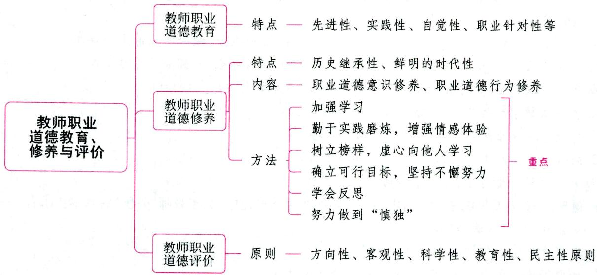

# 第一节 教师职业道德教育

# 一、教师职业道德教育的概念 ★ 【单选】

教师职业道德教育是指社会、集体按照一定的教师职业道德规范通过多种教育手段对在职教师及师范生施加系统的职业道德影响，使他们把教师职业道德规范和行为准则转化为个体的职业道德品质的社会实践活动。

加强教师职业道德教育是提高教师职业道德素质的必然要求，是把教师职业道德规范转化为教师职业道德品质过程中的一个必要环节。

# 二、教师职业道德教育的特点 ★ 【单选】

根据教师职业的活动特点和教师队伍的思想现状，概括地讲，教师职业道德教育主要具有以下特点：

(1)先进性。教师职业道德教育的先进性是指在职业道德教育中用科学理论武装教师，使之树立正确的世界观、人生观和职业道德观，对教师的职业道德行为施以高标准、严要求。  
(2)实践性。教师职业道德教育要深深扎根于社会实践，围绕教师教育教学实践过程中产生的思想问题和道德问题开展教育，有针对性地加以解决，具有鲜明的实践性。  
(3)自觉性。教师要有高度的自觉性。离开了个人自觉，没有自我教育，就不会有教师个人道德的发展。  
(4)职业针对性。教师职业道德的教育必须与教师职业活动的实践相结合,体现出它的职业性。而这种职业性的体现,就必须有针对性,就是要针对教师职业活动的特点和规律,提出有针对性的教育

目的、教育内容和教育手段，解决与教师职业活动有关的各种特殊矛盾和问题，增强教师处理有关关系的认识和能力。

(5)自教互教性。在教师职业道德教育的过程中，受教育者本身又是教育者。教师对学生进行文化知识教育和思想道德教育的过程，其实也是教师自己教育自己的过程。当教师按照有关方面的要求有组织、有计划地向学生实施道德教育的时候，他自身首先就成了这种有组织、有计划的道德教育的对象，这种自教性的特点是教师职业所独有的。同时，由于职业习惯，教师很容易自然地将自己的道德认识和道德经验理论化、系统化，并乐于向同行、同事讲解和传授，使之显示出互教的特点。  
(6)同时多端性。师德教育既可以从某一方面入手，也可以几个方面同时进行。多种开端，并行不悖，相得益彰，从而达到师德品质的各个方面全面发展提高的效果。  
(7)渐进重复性。教师个体职业道德品质的形成和完善不是一蹴而就的，而是一个反复的、逐步提高的过程。

# 三、教师职业道德教育的意义 ★ 【单选】

(1)加强教师职业道德教育是教师崇高社会地位和历史使命的必然要求；  
(2)教师职业道德教育是培养教师社会主义师德品质的重要环节；  
(3)教师职业道德教育是纠正不良教风、校风的有力手段；  
(4)加强教师职业道德教育是提高教师队伍素质，加强教师队伍建设的迫切需要；  
(5)加强教师职业道德教育是促进两个文明建设，全面推进中国特色社会主义教育事业的战略举措。

# 第二节 教师职业道德修养

# 一、教师职业道德修养的概念 ★ 【判断】

教师职业道德修养是将教师职业道德要求转化为自己的信念并付诸行动的活动。简单说,是一种自我锻炼、自我改造、自我陶冶、自我教育的过程。教师职业道德修养不仅是培养教师职业道德的首要环节,也是加强社会主义职业道德建设的迫切要求。

# 二、教师职业道德修养的基本特点 ★★ 【单选、多选、判断】

# 1. 历史继承性

中华民族历来是一个崇尚师德和师德修养的民族,从古代的孔子、孟子,到现代的陶行知、蔡元培,历代圣哲先贤、教育家对师德内涵和修养都提出过非常深刻独到的见解和观点,并终其一生践行自己的主张,成为世人楷模。倡导师德修养,首先就需要教师从深厚的历史和文化底蕴中汲取丰富的精神营养,责无旁贷地传承和弘扬中华民族的优秀师德。

# 2. 鲜明的时代性

伴随社会经济文化发展及教育思想的转变，师德内涵不断融入具有鲜明时代特色的思想、观念、道德意识等内容，烙印上深刻的时代印迹。如以人为本、民主平等的教育思想，就是当今社会赋予师德的时代内涵。倡导师德修养，需要我们紧扣时代脉搏，站立时代潮头，开拓创新，与时俱进，丰富和发展中华民族的优秀师德。

# 教师职业道德修养特点的其他说法

教师职业道德修养的特点集中表现在三个方面：

(1)自觉性。师德修养贵在自觉，严于律己是提高自我道德素质的关键。  
(2)持久性。道德内容的社会性和可变性决定了教师道德修养的持久性。  
(3)实践性。学生的优秀品质主要靠教师的高尚德行来熏陶，学生的理想要靠教师的崇高信念来启迪。

真题1 [2023河北保定, 单选]伴随社会经济文化发展及教育思想的转变, 师德内涵不断融入了新的内容, 不包括以下哪项 ( )

A. 具有鲜明时代特色的思想  
B.具有鲜明时代特色的民族文化  
C. 具有鲜明时代特色的观念  
D.具有鲜明时代特色的道德意识

真题2 [2022河南南阳，多选]师德修养的基本特点包括（）

A. 鲜明的时代性

B. 历史继承性

C. 时代创新性

D. 发展持续性

答案：1.B 2.AB

# 三、教师职业道德修养的内容 ★★★ 【单选、判断】

教师职业道德修养的内容包含两个方面：(1)职业道德意识修养；(2)职业道德行为修养。具体来说，教师职业道德修养主要包括职业道德理想、知识、情感、意志、信念和行为习惯六个方面。

(1)树立远大的职业道德理想。职业道德理想体现了教师职业道德要求的本质。  
(2)掌握正确的职业道德知识。学习和掌握教师职业道德知识是教师职业道德修养的首要环节和最初阶段。  
(3)陶冶真诚的职业道德情感。教师职业道德情感包括：①职业正义感；②职业责任感；③职业义务感；④职业良心感；⑤职业荣誉感；⑥职业幸福感。其中，职业幸福感是教师从事职业活动最强大的精神动力和根本目的。  
(4)磨炼坚强的职业道德意志。是否具备坚强的职业道德意志是衡量教师职业道德素质高低的重要标志。  
(5)确立坚定的职业道德信念。坚定教师职业道德信念，是教师职业道德修养的核心问题。教师职业道德信念是教师对职业理想、职业人格、职业原则、职业规范的坚定不移的信仰，是深刻的师德认识、炽热的师德情感和顽强的师德意志的统一，是把师德认识转变为师德行为的中间媒介和内驱力，并使师德行为表现出明确性和一贯性。比如，许多优秀的边远地区教师，不怕条件艰苦，不计个人得失，坚定不移地战斗在教育岗位上，其中一个重要原因，就是他们具有献身山区教育的坚定信念。  
(6)养成良好的职业道德行为习惯。教师职业道德修养的最终目的是要养成良好的职业道德行为习惯。

真题3 [2024浙江杭州，单选]教师职业道德修养包含职业道德意识修养和（ ）修养。

A. 职业技术

B.职业理念

C. 职业道德行为

D. 科学文化

真题4 [2024广东深圳，判断]是否具备坚定的教师职业道德信念，是衡量教师职业道德素质高低的重要标志之一。（）

真题5 [2023湖北武汉，判断]确定坚定的职业道德信念是教师职业道德修养的首要环节和最初阶段。（）

答案：3.C 4. $\times$ 5. $\times$

# 四、教师职业道德修养的基本原则

(1)坚持知和行的统一；  
(2)坚持动机和效果的统一；  
(3)坚持自律和他律相结合；  
(4)坚持个人和社会相结合；  
(5)坚持继承和创新相结合。

# 五、教师职业道德修养的方法 ★★★ 【单选、多选、判断、简答】

良好的师德修养不是与生俱来的, 而是在科学理论的指导下, 经过长期的社会实践, 不断完善自身的结果, 理论与实践相结合是师德修养的根本途径。(也有说法认为, 实践是师德修养的根本途径。师德修养只有在实践中才能得到不断的充实、提高和完善)

# 1. 加强学习

加强学习，是教师职业道德修养的必要途径。

# 2. 勤于实践磨炼，增强情感体验

参加社会实践是促进教师职业道德修养的根本方法。提升教师职业道德修养，关键在于实践。教师只有在教育教学实践中，在处理师生之间、教师之间、教师与家长或社会其他成员之间的关系中，才能认识到自身行为的是与非，才能辨别善与恶，才能养成自己良好的教师道德品质。

# 3. 树立榜样，虚心向他人学习

树立道德榜样是提升师德修养的重要方法。榜样的力量是无穷的，要引导和鼓励教师之间相互学习、探讨、交流和借鉴，大力宣传教师中的先进典型，用榜样人物的先进事迹、高尚情操、模范行为引领广大教师，把抽象的道德观念、行为规范等形象化、具体化，以先进模范的行为激励教师，增强师德修养的自觉性。

# 4. 确立可行目标，坚持不懈努力

教师职业道德修养同人们认识和改造世界的其他活动一样，有着明确的目标作为指导。师德修养实际上是教师道德认识、道德情感、道德意志、道德信念、道德行为和习惯诸要素从无到有、从低到高、从旧到新的矛盾运动过程，这也就决定了它是一个长期的艰苦过程，必然要求教师确立可行目标后做出坚持不懈的努力。

# 5.学会反思

反思是提高师德修养的重要方法。

# 6.努力做到“慎独”

教师职业道德修养的最高层次就是“慎独”，“慎独”一语最早出自儒家经典《礼记·中庸》。“慎独”用我们现代语言来表述，就是指在没有外界监督、独自一人的情况下，也能自觉遵守道德规则，不做任何对国家、对社会、对他人不道德的事情。显然，这既是一种崇高的道德境界，又是一种重要的职业道德修养方法。

作为教师职业道德修养的方法，“慎独”可以通过自我约束，自我监督，更好地培养、锻炼坚定的职

业道德情感、意志和信念，养成良好的职业道德行为习惯；作为崇高的教师职业道德境界，“慎独”标志着一个教师的职业道德修养已达到高度自觉的程度。尽管很难，但这也是教师必须要做到的。

真题6 [2024浙江杭州，单选]师德修养只有在( )中才能得到不断充实。

A.实践

B. 交往

C. 思考

D. 学习

真题7 [2023河北唐山, 单选]“身正为师, 德高为范”, 作为一名人民教师, 要时刻注意自己的一言一行, 绝不做任何不道德的事情, 但还是会有个别教师以为只要别人看不见就可以为所欲为, 这主要是教师没有做到( )

A. 拜师

B. 反省

C. 慎独

D. 实践

真题8 [2023内蒙古赤峰，多选]良好的师德修养不是与生俱来的，而是在科学理论的指导下，经过长期的社会实践，不断完善自身的结果。以下属于提升教师职业道德修养方法的是（）

A. 加强学习

B. 躬身实践

C. 学会反思

D.努力做到“慎独”

答案：6.A 7.C 8.ABCD

# 第三节 教师职业道德评价

# 一、教师职业道德评价的内涵

教师职业道德评价是指教师自己、他人或社会，根据社会主义教师职业道德准则、规范和科学的标准，在系统广泛地搜集各方面信息，充分占有各种资料的基础上，运用现代技术手段，对教师的职业道德意识、道德情感、道德意志和道德行为进行考察和价值判断。

教师职业道德评价的目的是在对教师的道德全面考察、判断和论证的基础上，探索和掌握教师职业道德形成和发展的客观规律，以便更加有效地指导广大教师提高自己的职业道德素质，完善自己的职业道德品质。教师职业道德评价的依据就是教师教育行为的动机和效果。

# 二、教师职业道德评价的功能 ★【多选】

教师职业道德评价有利于维护和实现教师职业道德规范，有利于教师职业道德素质的形成和发展。教师职业道德评价具有指挥定向、教育发展、分等鉴定、督促激励与问题诊断等功能。其中，教育发展功能是指在教师职业道德评价过程中评价者和被评价者互相影响和启发，通过对方的反馈信息进一步认识到自己的不足，同时学习对方的长处，使自己受到教育，促进自己的思想品德的发展。

真题1 [2022河南濮阳,多选]教师职业道德评价的功能包括( )

A. 教育发展功能

B. 分等鉴定功能

C. 问题诊断功能

D. 督促激励功能

答案：ABCD

# 三、教师职业道德评价的原则 ★★ 【单选、多选、不定项】

教师职业道德评价应遵循的原则有：方向性原则、客观性原则、科学性原则、教育性原则和民主性原则。其中，方向性原则是指教师职业道德评价要体现社会主义的性质，坚持社会主义方向，有利于广大教师提高社会主义的思想觉悟和道德水平。社会主义方向性是我们开展教师职业道德评价的最根本的指导思想和工作原则。因为我们是社会主义国家，我国的教育是社会主义教育，我们的教师职业

道德建设和评价必须坚持社会主义方向。

真题2 [2023安徽蚌埠，多选]教师职业道德评价的原则包括（）

A. 方向性原则

B.客观性原则

C. 科学性原则

D. 教育性原则

E.民主性原则

答案：ABCDE

# 四、教师职业道德评价的方法 ★【判断】

教师职业道德评价方法是指在教师职业道德评价的过程中所采用的各种方式和手段的总称。教师职业道德评价方法是实现教师职业道德评价的任务、保证教师职业道德评价的顺利进行、取得教师职业道德评价良好效果的关键性因素。概括起来，教师职业道德评价的方法有自我评价法、学生评价法和社会评价法。

# 1. 自我评价法

自我评价法是指教师个人根据教师职业道德规范和教师职业道德评价的标准、原则等一系列评价体系,对自己的道德所进行的一种自我认识和自我判断。

自我评价是教师对自己的道德进行评价，在自我评价过程中教师既是评价的主体，又是评价的客体。教师自我评价的内在动力是教师的内心信念。

# 2. 学生评价法

学生评价法是指在教师和学生教与学的相互作用中,学生依据教师职业道德的原则和规范对教师的行为予以判断的一种道德评价方式。学生评价实际上也是一种社会评价,但它是一种特殊的社会评价,这是由教师与学生的特殊关系所决定的。

# 3. 社会评价法

社会评价法是指行为当事人之外的个人或组织，如学校或其他社会方面的人员，根据教师职业道德规范对教师的道德状况做出评价的方法。社会评价法主要是通过社会舆论对教师的道德进行评判。社会舆论是指众人的议论和评判，它是人们用语言或文字对其所关心的社会生活中的某种现象、事件或行为所发表的某种带有倾向性的意见。

# 五、教师职业道德评价的基本要求 ★【单选、多选】

说法一：(1)肯定评价与否定评价相结合，以肯定评价为主；(2)动态评价与静态评价相结合，以动态评价为主；(3)单项评价与综合评价相结合，以综合评价为主；(4)定量评价与定性评价相结合，以定性评价为主；(5)终结性评价与形成性评价相结合，以形成性评价为主；(6)动机评价与效果评价相结合，以动机评价为主；(7)他人评价与自我评价相结合，以他人评价为主。

说法二：(1)坚持评价的实践性，努力实现动机与效果的统一；(2)坚持评价的客观性，努力实现目的和手段的统一；(3)坚持评价的主体性，努力增强教师自身责任感；(4)坚持评价的动态性、发展性，努力实现教师自我道德的完善。

真题3 [2022辽宁营口，多选]师德评价的基本要求包括（）

A. 坚持评价的实践性

B. 坚持评价的客观性

C. 坚持评价的主体性

D. 坚持评价的动态性、发展性

答案：ABCD

# ★ 本章核心考点回顾 ★

# 1.教师职业道德修养的内容

教师职业道德修养的内容包含两个方面：(1)职业道德意识修养；(2)职业道德行为修养。具体来说，教师职业道德修养主要包括以下六个方面：

(1)树立远大的职业道德理想。  
(2)掌握正确的职业道德知识。学习和掌握教师职业道德知识是教师职业道德修养的首要环节和最初阶段。  
(3)陶冶真诚的职业道德情感。  
(4)磨炼坚强的职业道德意志。是否具备坚强的职业道德意志是衡量教师职业道德素质高低的重要标志。  
(5)确立坚定的职业道德信念。  
(6)养成良好的职业道德行为习惯。

# 2. 师德修养的根本途径

说法一：理论与实践相结合。

说法二：实践。师德修养只有在实践中才能得到不断的充实、提高和完善。

# 3.教师职业道德修养的方法

(1)加强学习。  
(2)勤于实践磨炼，增强情感体验。  
(3)树立榜样，虚心向他人学习。   
(4)确立可行目标，坚持不懈努力。  
(5)学会反思。  
(6)努力做到“慎独”。“慎独”是教师职业道德修养的最高层次，标志着一个教师的职业道德修养已达到高度自觉的程度。

# 07

# 第七部分

# 教育教学技能

# 内容导学

本部分内容共分为四章。  
• 第一章主要是对教学技能的基础概念的讲解,第二章主要介绍了教学目标设计和教案设计的相关知识,第三章讲解了课堂教学中常用的教学技能,第四章简单介绍了说课技能与教学反思技能。  
- 本部分内容的考查题型主要为客观题，但一些地区也会涉及主观题，如简答题、案例分析题等。  
考生应重点掌握第二章和第三章的内容，并结合报考地区的考情有针对性地进行复习。  
为了方便考生梳理知识脉络，我们在各章设置思维导图和核心考点回顾。

# 本部分学习指南

# 一、考情概况

本部分内容较为琐碎、识记性知识较多，考生可带着以下学习目标进行备考：

1. 掌握课堂导入的类型和基本要求。  
2. 理解课堂提问的类型和有效运用。  
3. 理解并区分课堂板书的类型。  
4.理解并区分教学强化的类型。

# 二、考点地图

<table><tr><td>考点</td><td>年份/地区/题型</td></tr><tr><td>课堂导入的类型</td><td>2024河北单选;2023河南单选;2023湖北单选;2023天津单选;2023山西单选;2022广东单选</td></tr><tr><td>课堂导入的基本要求</td><td>2023山东判断;2023浙江简答;2022河北多选</td></tr><tr><td>课堂提问的类型</td><td>2023广东单选;2023浙江判断;2022河南单选;2022河北单选;2022山西单选;2022广东单选</td></tr><tr><td>课堂提问的有效运用</td><td>2024河北多选;2023河南单选;2023广东单选;2022浙江单选;2022辽宁多选</td></tr><tr><td>课堂板书的类型</td><td>2023黑龙江单选;2023广东单选</td></tr><tr><td>教学强化的类型</td><td>2023河南单选;2023天津单选</td></tr></table>

注：上述表格仅呈现重要考点的相关考情。

# 核心考点

# 第一章 教学技能概述

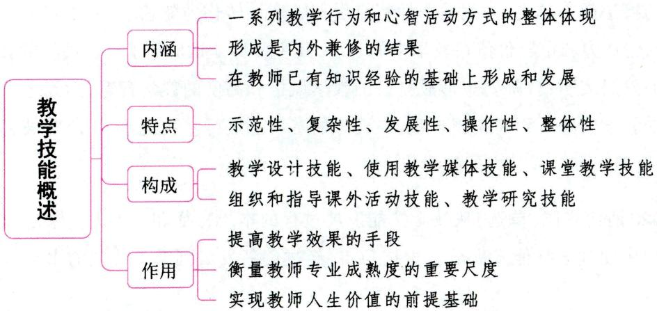

# 第一节 教学技能的内涵

教学技能是教师在已有知识经验基础上, 通过实践练习和反思体悟而形成的一系列教学行为和心智活动方式。这一定义至少包括以下三层含义:

# 一、教学技能是一系列教学行为和心智活动方式的整体体现 ★ 【单选】

所谓行为方式，是指一定的社会角色在社会生活中形成的程序化、规范化、模式化的活动。教学行为总是包含着一定的操作步骤，包含着若干按一定程序予以完成的动作，表现出一定的连续性和周期性。教师教学的心智技能是教师按一定程序组织起来并能顺利完成教师认知活动任务的复杂智力动作系统。

在教学情境中，教师教学技能的展现，必定是教师外在行为方式与内在心智活动方式的整体体现，是教师能在复杂的、不确定的教学情境中做出恰当决策、形成独特工作方式的教学智慧的体现。

# 二、教学技能的形成是内外兼修的结果 ★【单选、多选】

教学技能的形成不仅是教师长期练习和训练的结果，而且是教师在经验基础上体悟反思的结果。从教学技能发展过程的本质特征和发展方向来看，教师就是在不断的自我反思过程中使教学技能发展成教学技巧，再经过创新发展到教学技艺的水平，最终达到教学的最高追求——教学艺术。

教学技巧、教学技艺、教学艺术是教学技能不同发展阶段表现出的三种不同形态。

教学技巧是教学技能发展的初级形态，是教学技能达到一定熟练程度的标志，通常我们所说的“熟能生巧”，就是指某项技能经过练习达到一定熟练程度时，自动化了的多种动作技能间的巧妙配合。可见，教学技巧是教学技能发展的必然结果，是指不但会教，而且能够巧教。

教学技艺是指在巧教的基础上，教师有意识地积累教学经验、自觉探索、不断完善自身的教学技巧并有所创新，使教学呈现美感的一种技能形态。

教学艺术是教学技能发展的最高形态，是在教学技艺的基础上，使教学处处闪烁着创造的火花，教学中刻意追求的痕迹越来越少，内化的个性特点由不随意性转化为随意性，真正到了收放自如的境地。它是教师独特的创造力和审美价值在教学中的表现，其主要特征是形成了自己独特的教学风格。

教学技能的发展表明：教师要想形成自己的教学风格和高度的教学智慧，达到艺术化教学的水平，就需要在具体的教学实践中不断超越自我，在反思的基础上进行自我统整，不断突破别人，也不断突破自己，创造出具有美感和个人魅力的教学艺术。

真题 [2023河南安阳, 单选]从教学技能发展过程的本质特征和发展方向来看, 教师就是在不断的自我反思过程中使教学技能发展成教学技巧, 再经过创新发展到教学技艺的水平, 最终达到教学的最高追求——( )

A. 教学技术

B. 教学境界

C. 教学享受

D. 教学艺术

答案：D

# 三、教学技能是在教师已有知识经验的基础上形成和发展起来的

教学技能既能表现为教师个体的经验，又是教师群体经验的结晶，它植根于个体经验，又不是个体经验的简单描述。它是在教师已有知识经验的基础上形成和发展起来的，是在教师群体经验的基础上，经过反复筛选和实践检验而高度概括化的、系统化的理论系统。这种在丰富经验基础上形成又以简约化的形态呈现的教学技能体系，既源于教学经验又高于教学经验。教学技能是教师个体经验与教师群体经验、教学理论与教学实践相结合的产物，反映了多样性与简约性的统一。

# 第二节 教学技能的特点、构成与作用

# 一、教学技能的特点 ★ 【多选】

# 1.示范性

教师对学生的示范作用无时无刻不在发生着。由于青少年学生的向师性和模仿性，使得教师教学技能的构成、水平和发展情况，对学生的发展和成长具有直接和间接的自发影响力。

# 2.复杂性

教学技能的复杂性主要是由教学过程、教育对象、教学任务等方面来决定的。教学过程是一个复杂的系统，是多因素、多主体共同参与的实践活动，总体上遵照一定的规律、一定程序进行，但无时无刻不受外来因素的影响，需要教师来把握。教师的劳动对象是具体的、正处于发展中的、具有独特个性的生命体，需要教师进行细致的观察，准确的判断，以制定出因人而异且能灵活调整的施教方案。教师的任务是多样的，不仅要关心学生的学习进步，更要关注学生的思想品德和身心健康；既要在课堂内系统全面地传授知识，又要组织开展丰富多彩的课外活动。

# 3. 发展性

教学技能是通过教学行为、活动方式表现出来的，具有一定的稳定性。但同时，教师的教学技能也是发展变化的。由于教师自身的努力以及组织的培养、训练和有效管理等，使教师业已形成的教学技能水平得到不断提高。此外，社会的发展对教育提出新的更高要求，科技的进步使教育不断现代化，青少年学生主体意识增强等，都需要教师的教学技能不断发展和提高。

# 4. 操作性

教师教学技能是教育教学理论应用时的熟练化表现，是教师在对教学技能理解的基础上，通过有计划、有目的、有步骤地训练而获得并提高的，具有很强的操作性。

# 5.整体性

一方面，教师的教学技能是由各种具体的技能构成的，每一种技能又有自己的构成要素。但是这些技能不是截然分开的，而是有机地结合在一起，发挥着整体功能。教师要很好地完成教书育人的使命，就应掌握各种教学技能，使其具有完整性，不能片面强调某一种技能而忽视其他技能。另一方面，教学是一个系统，具有整体性的特征，正是这种整体性决定和支配着教学活动中的任何一种行为方式或具体的操作，而这就使得教师的各种教学行为方式和活动方式相互联系、相互作用、相互渗透、相互依

赖，从而构成一个整体。

# 二、教学技能的构成 ★ 【多选、简答】

在我国，1994年原国家教委在《高等师范学校学生的教师职业技能训练大纲(试行)》中，把教学工作技能分为五类：教学设计技能、使用教学媒体技能、课堂教学技能、组织和指导课外活动技能和教学研究技能。在课堂教学技能中又设置了九项基本技能，即导入技能、板书板画技能、演示技能、讲解技能、提问技能、反馈和强化技能、结束技能、组织教学技能、变化技能。

真题 [2024天津西青，多选]下列属于教师教学技能的有（）

A. 讲解技能

B. 变化技能

C. 强化技能

D. 激励技能

答案：ABC

# 三、教学技能的作用

(1)教学技能是提高教学效果的手段；  
(2)教学技能是衡量教师专业成熟度的重要尺度；  
(3)教学技能是实现教师人生价值的前提基础。

# 本章核心考点回顾

1. 教学技能的特点

(1)示范性；(2)复杂性；(3)发展性；(4)操作性；(5)整体性。

2. 课堂教学技能的构成

(1)导入技能；(2)板书板画技能；(3)演示技能；(4)讲解技能；(5)提问技能；(6)反馈和强化技能；(7)结束技能；(8)组织教学技能；(9)变化技能。

# 第二章 教学设计技能

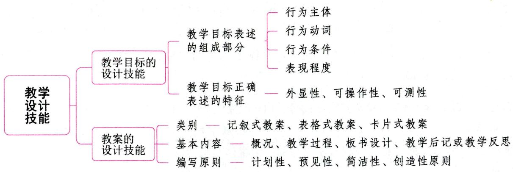

# 第一节 教学目标的设计技能

# 一、教学目标的含义 ★ 【单选、简答】

教学目标是学校教学的出发点和归宿, 是教学的灵魂, 支配着教学的全过程, 并规定了教与学的方向。它是教学活动预期达到的学习效果和标准, 是对完成教学活动后学习者应达到的行为状态的具体描述。

# 二、教学目标设计的步骤 ★【单选、多选】

(1)钻研课程标准，分析课程内容；(2)分析学生已有的学习状态；(3)确定教学目标分类；(4)列出综合性目标；(5)陈述具体的行为目标。

# 三、教学目标的表述要求 ★ 【单选、判断】

# 1. 教学目标表述的组成部分

一个完整的教学目标应该具备四要素，即行为主体、行为动词、行为条件、表现程度。

(1)行为主体。教学目标的对象可以是全班学生,也可以是部分学生。但必须明确的是教学目标表述的是学生的行为而不是教师的行为。错误的表述如“使(让)学生……”“培养学生……”等。正确的表述应该是：“能认出……”“能写出……”等,要清楚地表明达成目标行为的主体是学生。  
(2)行为动词。教学目标应该采用可观察、可操作、可检测的行为动词来描述。  
(3)行为条件。指学生表现目标行为的条件或情境因素，它包括环境因素、设备因素、信息因素、时间因素、人的因素等。如“在课堂讨论中……”“在10分钟内，能……”“在某某统计表中，能……”等。  
(4)表现程度。指学生学习行为结果应该达到的最低标准，使教学目标可测。如“学会……三种解题方法”“记住……主要部件名字”“能用符号语言表示三角形”等。

# 2. 教学目标正确表述的特征

教学目标正确的表述应该具有以下特征：

(1)外显性。教学目标是教师期望引起学生知识结构和行为的变化，因此，教学目标的表述必须是外显的而不能是内隐的。  
(2)可操作性。教学目标的表述要能给学生指出具体的途径，而不是笼统指出学会什么和掌握什么。  
(3)可测性。教学目标是课程目标的进一步具体化，是指导、实施、评价教学的基本依据，其表述要便于教师检查验收，获得反馈信息。

真题1 [2022河北保定，单选]“能在10分钟内正确完成3道四则混合运算题”，这一表述属于（）

A.培养目标

B. 教育目标

C. 教学目标

D. 课程目标

真题2 [2023广西桂林，判断]教学目标的行为主体是教师。（）

答案：1.C 2. $\times$

# 第二节 教案的设计技能

# 一、教案的内涵

教案是教师经过周密策划而设计出来的关于课堂教学的具体实施方案, 通常以一节课为单位编写, 也称之为课时教学进度计划。它既是备课成果的提炼和升华, 又是备课的继续和深入。设计教案是教师备课工作的最后一个环节, 也是教师备课工作中最全面系统、深入具体的一步, 是保证教师有计划、有步骤地上好课的必要手段, 对提高教学质量有着重要意义。

# 二、教案的类别 ★ 【单选、多选、判断】

教案没有固定的格式，通常各学校可根据自己的实际情况，在遵循教案基本构成要素的基础上编制富有自身特色的教案格式。教案从基本形式上可分为三大类：记叙式教案、表格式教案、卡片式教案。

# 1.记叙式教案

记叙式教案是指主要用文字形式将教学方案表达出来的教案。记叙式教案的教学信息容量较大，表述细致，编制简单，是最基本、最常用的教案形式。记叙式教案根据内容的详略分为讲稿式的详案、纲要式的简案，其中，详案是新教师和年轻教师备课时，以及老教师在进行新课题教学时，常常采用的类型。

# 2. 表格式教案

表格式教案是指以表格形式呈现备课内容的教案。表格式教案具有言简意赅、重点突出、方便使用等特点。

# 3. 卡片式教案

卡片式教案是指将教案的纲要、重点、难点和易忘点等内容，以及需要补充的材料等以卡片的形式

呈现的一种教案。卡片式教案适合于有一定教学经验的教师使用，也可以作为教师授课时的辅助材料。卡片式教案通常有两种作用：一是教案纲要提示；二是教学内容提示和材料补充。

卡片式教案没有固定的格式，教师可根据自己的需要确定其书写格式、内容的详略。卡片式教案形式灵活、方便，有利于修改与补充，在辅助课堂教学方面有一定的优势。

# 三、教案的基本内容 ★【单选、判断、简答】

一般来说，教案内容主要由概况、教学过程、板书设计、教学后记或教学反思四部分组成。

# 1.概况

主要包括课题、教学目标、教学重难点、课时安排、课型、教法学法、媒体选择等。

课时教学进度计划中的课题是本课时所讲的题目，一般要醒目地写在一页的首行中间。

教学目标是一篇(节)教材教学的行动纲领，是课程标准的具体落实，是一节课的出发点和落脚点，教学目标要写得具体明确、恰当适中、有指导作用。

教学重难点是依据本节课的教学目标确定的，要有利于实现教学目标。在教学过程中，要突出重点，解决难点，从重难点上启迪学生思维，发展学生的智能。

课时安排要根据教学内容的分量和学生的接受能力而定。课时教学内容的分配要科学合理、突出重点、分散难点。

此外，上课的课型，运用的教学方法、学习方法和媒体等，在编写教案时都要写清楚。

# 2.教学过程

教学过程是教师为了实现教学目标,完成教学任务而制定的具体的教学步骤和措施。教学过程是整个教案的核心和主体,编写时要根据教学目标及教材的具体情况,做到内容充实、重点突出、详略得当。具体来讲,一个完整的教学过程包括：(1)导入；(2)讲授新课；(3)巩固练习；(4)归纳小结。

# 3. 板书设计

教案中要对上课的板书进行精心设计，板书设计要具有科学性、整体性和条理性。

# 4.教学后记或教学反思

教学后记或教学反思是指教师课后的教学小结或教学心得，教师要及时总结每一节课的成败，为以后的教学总结经验，积累资料，有效地提高教学水平。

# 四、教案编写的原则 ★【单选】

# 1. 计划性原则

教案就是教学的行动计划，因此，凡是教学目标、内容、手段、方法、过程、步骤、条件、环境等都要事先有所计划。“凡事预则立，不预则废”，没有计划就是盲目行动。

# 2. 预见性原则

教案是为上课作预想、预设的，能否比较地符合实际，取决于教师预见性的准确程度。教师应通过对学生的了解和近期教学的前置反馈来进行目标校正、内容契合和情境设想，力求此时此想符合彼时彼境。

# 3. 简洁性原则

简洁是智慧的表现。它不仅为教师节省了书写的时间，提高了工作效率，更重要的是它为教师驾