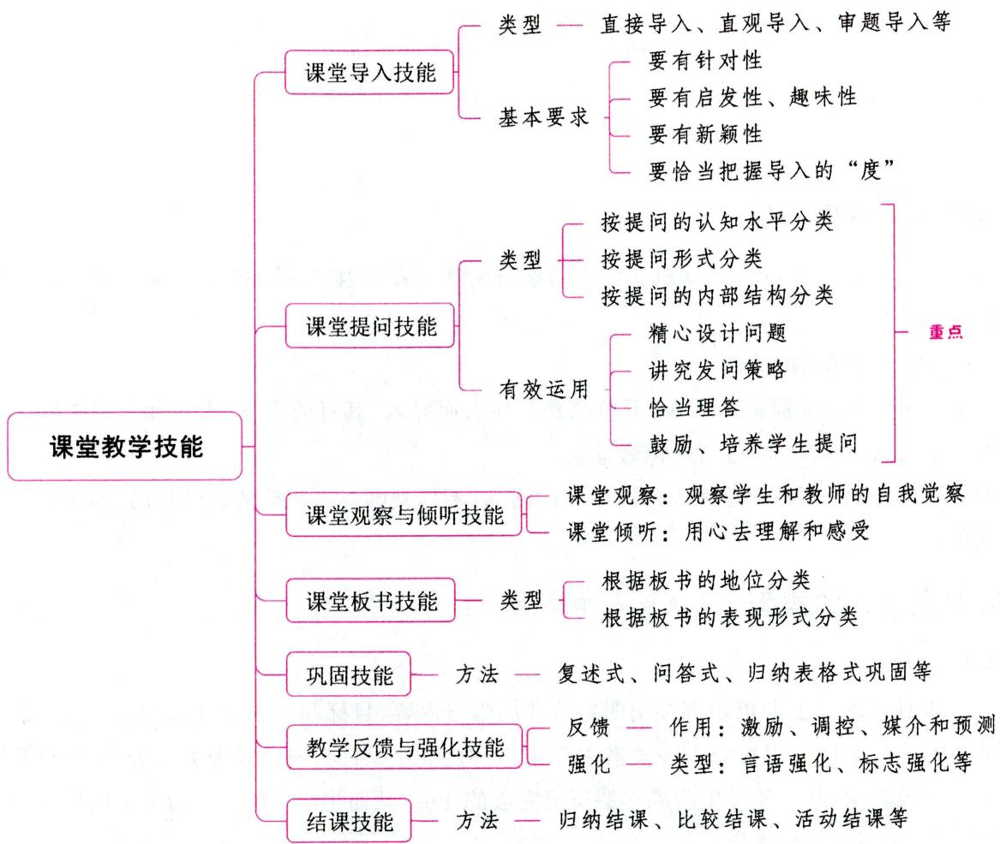
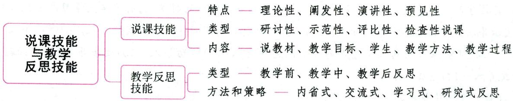
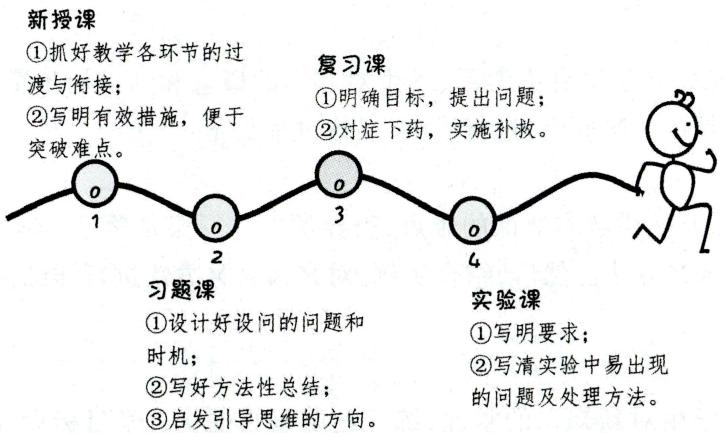

驭教案和课堂施教带来了便利。这需要深刻的思索、高度的概括、精当的提炼、简明的语言。

# 4. 创造性原则

备课是一种创造性劳动，而教案是备课成果的文字显现，当然应体现出创造性来。抄教材、搬“教参”需要摒弃，简单加工或如法炮制也不足取。应该在遵循一般教学规律和教案规范的前提下，力求不断地有所创新，有个性特点。这样，既有利于发挥个人特长，又能满足学生的需求。

真题 [2023广东深圳, 单选]教师在编写教案的过程中, 需要考虑近期教学的反馈以及对教学情境的设想。这体现了教案编写的（）

A. 预见性原则

B. 计划性原则

C. 简洁性原则

D. 创造性原则

答案：A

# 五、教案设计的要求 ★ 【单选、多选、判断】

(1)端正态度，高度重视。  
(2)切合实际，坚持“五性”。“五性”即科学性、主体性、教育性、经济性和实用性。  
(3) 优选教法, 精设课型。  
(4)重视“正本”，关注“附件”。  
(5)认真备课，纠正“背课”。  
(6)内容全面，及时调整。

# 本章核心考点回顾

1. 教学目标表述的组成部分

(1) 行为主体。行为的主体是学生。  
(2)行为动词。采用可观察、可操作、可检测的动词。  
(3)行为条件。  
(4)表现程度。

2. 教案编写的原则

(1)计划性原则；(2)预见性原则；(3)简洁性原则；(4)创造性原则。

# 第三章 课堂教学技能

课堂教学技能是整个教学技能的核心。所谓课堂教学技能，就是教师在课堂教学中，为完成教学任务、促进学生身心全面发展而运用的稳固的教学行为方式。根据课堂教学技能的功能和作用，可分为课堂导入技能、课堂讲授技能、课堂提问技能、课堂倾听技能、课堂对话技能、课堂板书技能、教学反馈和强化技能、结课技能、布置和批改作业技能等。这里，我们仅对常考的课堂教学技能进行详细介绍。

# 第一节 课堂导入技能

# 一、课堂导入的内涵 ★ 【多选】

课堂导入是教师在新的教学内容和教学活动开始时，通过简短的言语或行为，引导学生迅速进入学习状态的教学行为方式。

课堂导入的好坏对教学成败起着至关重要的作用：（1）有效的课堂导入能够牢牢吸引学生的注意力，使学生迅速进入课堂角色；（2）可以强烈地激发学生的学习兴趣和求知欲，使学生迅速做好学习新

知识的心理准备,并产生学习期待；(3)能够使学生明确学习目标,建立新旧知识之间的联系,营造和谐的课堂氛围等。

真题1 [2023黑龙江哈尔滨，多选]课堂导入的好坏对教学成败起着至关重要的作用，有效的课堂导入能（ ）

A.激发学生的学习兴趣和求知动机

B. 营造和谐的课堂氛围

C. 可以重点复习以往的教学内容

D. 建立新旧知识的联系

答案：ABD

# 二、课堂导入的功能

(1)激发学习兴趣，引起学习动机。学生的学习受到多方面因素的影响，其中最主要的是受学习动机的支配。  
(2)引起对所学课题的关注。  
(3)为学习新知识做铺垫。导入，不单纯是为导入而导入，其目的是“引人入胜”，即引导学生进入学习新知识的过程，为学生学习新知识做铺垫。  
(4) 明确学习目的。教学是师生共同参与的活动，不仅教师要有明确的教学目的，学生也应有明确的学习目的。

# 三、课堂导入的类型 ★★★【单选、多选】

# 1.直接导入

直接导入是指教师上课伊始直接阐明本节课的学习内容、目标和要求的导入方法。这是最简单和最常用的一种导入方法。直接导入一般借用课题、人物、事件、名词、成语等为引入语，然后直接概述新课的主要内容及教学程序，使学生明确本课所要完成的任务，从而把学生的注意力吸引向这节课所要学习的问题上来，准备参与教学活动。

# 2.温故导入（复习导入）

温故导入是指教师通过帮助学生复习与即将学习的新知识有关的旧知识, 从中找到新旧知识的联结点, 合乎逻辑、顺理成章地引导学生学习新知识的一种导入方法。温故导入是由已知导向未知, 过渡流畅自然, 适用于连贯性和逻辑性较强的知识内容。

# 3. 直观导入（演示导入）

直观导入指教师借助实物、标本、挂图等直观教具，以及投影、录像等多媒体或示范性实验，对与教学内容相关的信息进行演示，并引导学生通过观察产生疑问，进行思考，从而自然进入新课学习的一种导入方法。这种导入有助于学生获得感性知识，调动学生学习的积极性。

直观导入包括教具导入、实验导入、多媒体导入等。其中，实验导入即上课伊始，教师巧设实验，使学生通过对实验的观察去发现规律，进行归纳总结，推导出结论，从而导入新课。

# 4. 问题导入

问题导入是指教师通过提出富有启发性的问题，引起学生回忆、联想、思考，从而激发学生产生学习和探究欲望，进而导入新的教学内容的一种导入方法。疑问是学习的起点，也是学习的动力。问题

导入能激发学生思维，活跃课堂气氛，使学生带着问题学习，从而促使学生对知识的理解更加深刻。

# 5. 实例导入

实例导入是指教师从学生实际生活中选择与教学内容有密切联系的实例开讲，从而使学生进入学习情境，引出教学内容的一种导入方法。应用实例导入新课，可使抽象的问题具体化，复杂的问题简单化，深奥的问题浅显化。提供实例的方式可以是口头的，也可以是书面的。

# 6. 情境导入

情境导入是指教师运用满怀激情的朗读、演讲或者通过音乐、动画、录像等创设有趣的学习情境，感染学生，引起学生丰富的想象和联想，使其情不自禁地进入学习情境的一种导入方法。具体生动的情境具有很强的感染力和说服力，可以触及学生的内心深处，使其思想与教学内容发生联结。

# 7.审题导入

审题导入是指教师从探讨题意入手导入新课的方法。这种方法直截了当，可以高度概括教材内容，更加突出中心和主题，使学生很快进入对新内容的探讨。审题导入是各科教学中常用的导入方法。运用审题导入新课，关键在于教师应围绕标题或课题，精心设计一系列的问题，通过反问、设问等方式，激发学生思考，以起到导课的作用。

# 8. 悬念导入

悬念导入是一种以认知冲突的方式设疑，使学生思维进入惊奇、矛盾等状态，构成悬念的导入方法。悬念的设置有助于吸引学生的注意力，使学生思维处于一种激活状态，产生非弄清楚不可的求知心理，从而迅速进入学习知识的最佳状态，在思考、研究中学习新知识。

# 9. 活动导入

活动导入是通过组织学生讨论、操作、游戏等活动，进而调动学生学习积极性的一类教学导入形式。学生的积极参与是实现课堂价值的基本保证，通过活动，不仅提高了学生的参与度，而且对学生的主体意识的培养具有重要意义。

# 10.故事导入

故事导入是教师通过讲解与所要学习内容有关的故事、趣事，进而引发学生学习动机的一类教学导入形式。根据学生喜欢听有趣、好玩、新奇、情节生动的故事的心理，通过绘声绘色的故事抓住学生的注意力，进而引发其好奇心，使其投入学习。

# 11.经验导入

经验导入是通过建立学生已有经验与新知识之间的联系，进而引发学生学习动机、形成学习氛围的一类导入形式。在实际教学中，教师一般用旧知识与新知识之间的联系来设计教学导入。

# 12. 诗文导入

诗文导入就是教师利用适当的诗文材料（如诗歌、典故、成语、对联、笑话、歇后语、谜语等）导入新内容的导入方式。教师采用这种导入方式应注意所选择的诗文材料与新课内容要有紧密联系。

# 13. 随机事件的导入

教师除了预设课堂导入，也可以根据课间发生的一些随机性的事件启动课堂教学。由于随机事件是刚刚发生的，学生的感受和体会都真切而深刻，以此来导入教学更容易激发学生的学习兴趣。这种导入方法需要教师对学生的举动保持高度的敏感，并且能够充分挖掘随机事件的教学价值。

真题2 [2024河北石家庄，单选]教师从探讨题意入手导入新课的方法属于( )

A.审题导入

B. 直接导入

C. 问题导入

D. 温故导入

真题3 [2023河南安阳, 单选]信息技术课堂上老师播放上节课两个学生的代表性作品进行展示, 并在向学生讲解的同时引出了本节课的内容。这种课堂导入方式属于( )

A. 直接导入

B. 情境导入

C. 复习导入

D. 设疑导入

真题4 [2023湖北武汉, 单选]韩老师借助昆虫标本自然地进入了生物课的学习, 属于( )

A. 直观导入

B. 悬念导入

C.故事导入

D. 复习导入

答案：2.A 3.C 4.A

# 四、课堂导入的基本要求 ★★★ 【单选、多选、判断、简答】

# 1.导入要有针对性

课堂导入要根据教学实际有针对性地设计：（1)导入设计要与学科性质、教学内容和教学目标相适应；(2)要针对不同年龄阶段学生的心理特点、知识能力基础、认识水平设计导入。

# 2.导入要有启发性、趣味性

富有启发性的导入能引导学生发现问题，激发学生解决问题的强烈愿望，给学生思维上创造矛盾冲突，调动学生积极的思维活动，使他们更好地理解新的教学内容。教师可以通过设置悬念、创设情境、做游戏、展示现象等方法来设计具有启发性的课堂导入，激发学生兴趣。

# 3.导入要有新颖性

求新求异, 喜欢新鲜事物, 爱听新鲜事是学生普遍具有的心理。心理学研究表明, 令学生耳目一新的“新异刺激”, 可以有效地强化学生的感知态度, 吸引学生的注意指向。因此, 导入的形式和内容要有新意, 才能激起学生的兴趣。新颖性导课往往能“出奇制胜”, 但应切忌单为新颖猎奇而走向荒诞不经的极端。

# 4.要恰当把握导入的“度”

课堂导入的主要目的是把新旧知识联结起来，引出新知识，使学生更好地学习新知识。因此，教师一定要把握好导入的“度”。课堂导入应尽量做到简练省时，力争用最少的话语、最短的时间导入新课，引出新的教学内容。一般而言，导入的时间以3~5分钟为宜。

真题5 [2023浙江台州，简答]一堂课的导入的成与败直接影响着整堂课的效果，那么课堂导入应当符合哪些基本要求？

答案：详见内文

# 第二节 课堂提问技能

# 一、课堂提问的内涵 ★ 【判断】

课堂提问是指教师在学生已有知识和经验的基础上,依据教学内容,向学生提出适当的问题,并围绕问题引导学生积极思考,促进学生自觉学习的一种教学方式。与讲授(一种单向的信息传输)相比,

提问是一种师生互动行为，是师生双向交流的过程。

真题1 [2023广东深圳，判断]课堂提问仅指教师以教学目标和教学内容为依据，有针对性地向学生提问。（）

A. 正确

B. 错误

答案：B

# 二、课堂提问的功能

(1)激发学习动机，集中注意力；(2)提示学习重点；(3)启发学生思维；(4)培养学生参与能力；(5)实现师生互动交流，活跃课堂气氛。

# 三、课堂提问的类型 ★★★ 【单选、判断】

# 考点1 按提问的认知水平分类

这一分类又叫“布鲁姆一特内教学提问模式”，是由教育家特内根据布鲁姆《教学目标分类学》的基本思想创设的。在这种提问模式中，教学提问被分成由低到高六个水平，每一水平都与学生不同类型的思维活动相联系。

# 1.知识（回忆）水平的提问

这一水平的提问可用来确定学生是否已记住先前所学的内容, 如定义、公式、定理、具体事实和概念等。如“说出‘勾股定理’的公式”。这一水平的提问是最低层次、最低水平的提问, 它所涉及的心理过程主要是回忆。学生对这类问题的回答通常可以用正确或错误来进行判断, 其内容不超出先前所掌握的知识范围。

在知识水平的提问中，教师常使用的关键词是：谁、什么是、哪里、什么时候、写出等。

# 2. 理解水平的提问

这一水平的提问可用来帮助学生组织所学的知识，弄清它们的含义，它要求学生能用自己的话来叙述所学的知识，能比较和对照知识或事件的异同，能把一些知识从一种形式转变为另一种形式。如“用你自己的话叙述‘勾股定理’”“请把这段古文译成现代文”等。要使学生能够回答这一水平的提问，就必须事先把提问所涉及的必需知识提供给学生。

在理解水平的提问中，教师经常使用的关键词是：怎样理解、有何根据、为什么、怎么样、用你自己的话叙述、比较、对照、解释等。

# 3. 应用水平的提问

这一水平的提问可以用来鼓励和帮助学生应用已学知识去解决问题, 它要求学生能把所学的某些规则或理论应用于某些问题, 对问题进行分类、选择, 以确定正确答案。如“运用纬度和经度的知识, 在地图上找出北京的经纬度数”“请举例说明中学生早恋的危害”。

在应用水平的提问中，教师经常使用的关键词是：应用、运用、分类、选择、举例等。

# 4. 分析水平的提问

分析水平的提问可以用来分析知识的结构、因素，弄清事物间的关系或事项的前因后果，它要求学

生进行批判性思维, 能分析资料, 以确定原因, 进行推论。如“引起‘代沟’的原因是什么”“《皇帝的新装》中的老大臣等官吏对皇帝为什么不说真话”。

在分析水平的提问中，教师经常使用的关键词是：为什么、什么因素、得出结论、证明、分析等。

# 5. 综合水平的提问

这一水平的提问可用来帮助学生将所学知识以另一种新的或有创造性的方式组合起来，形成一种新的关系。这类问题常用于发展学生的创造能力。它所考查的是学生对某一课题或内容的整体性理解，它要求学生能进行预见、创造性地解决问题。如“在什么条件下，森林才能起火”“读完这篇文章，你怎样概括作者的观点”。

在综合水平的提问中，教师经常使用的关键词是：预见、创作、如果……会……、归纳、总结等。

# 6. 评价水平的提问

这种提问可用来帮助学生根据一定的标准来判断材料的价值，它要求学生对一些观念、价值观、问题解决办法或伦理行为进行判断和选择，能提出自己的见解。如“你怎样看待这篇散文”“你认为古诗好还是现代诗好？为什么”。

在评价水平的提问中，教师经常使用的关键词是：判断、评价、证明、你对……有什么看法等。

真题2 [2022河南郑州，单选]“已知一正方形的边长是 $5\mathrm{cm}$ ，那么该正方形的面积是多少？”这属于（ ）

A.知识水平的提问

B. 理解水平的提问

C. 应用水平的提问

D. 分析水平的提问

答案：C

# 考点2 按提问形式分类

按课堂提问的形式，可以将提问分为：

（1)设问型提问。教师将问题提出后，并不要求学生作答，而是自问自答，其目的主要在于引起学生的注意，请学生思考，造成学生的悬念感。设问常用于复习。  
(2)疑问型提问。即由教师设置疑点提出问题，学生独立思考或合作探究后作出回答。这类提问是课堂提问中使用频率最高的一种。  
(3)互问型提问。即由学生提出问题，学生回答问题。互问是一种你来考考我、我来考考你的教学活动。有经验的教师经常会采取互问、互考的方式来激发学生学习的兴趣，调动学生学习的积极性，进而收到良好的效果。  
(4)追问型提问。即围绕某个教学目标或教学主题，将之分解成为若干小问题，一环套一环地系统地提出问题，层层推进，促使学生积极思考。追问的特点是问题与问题之间的间隙时间较短，问题与问题之间呈明显的思维梯度。追问有利于创设富有思维挑战性的问题情境，保持学生注意力的集中与稳定，有利于训练学生思维的敏捷性、灵活性、深刻性与批判性。  
(5)曲问型提问。即针对某一教学内容，教师不直接提问，而是拐上一两个弯，绕道迂回，问在此而意在彼，使学生开动脑筋，通过一番思考、探究才能回答。这种提问富于启发性，吸引学生探究和发现，让学生体验到精神历险的快乐和别有洞天的惊喜，产生“投石击破水底天”的教学效果。

# 考点3 按提问的内部结构分类

按提问的内部结构分类，可以将提问分为：

(1)总分式提问。即将一个大问题分解为若干小问题，这些小问题本身互不直接牵连，而分别与大问题相扣合。回答了诸多小问题，再综合探索大问题。  
(2)台阶式提问。即将几个连贯性的问题由易到难依次提出,前一个问题是后一个问题的基础,后一个问题是对前一个问题的深化,就像攀登台阶一样,步步升高,把学生的思维一步一步一个台阶地引向求知的新天地。  
(3)连环式提问。即教师根据知识的内在联系，设计以疑引疑、环环相扣的一系列问题进行提问。  
(4)插入式提问。即在教学过程中暂时中断提问思路的主线，而插入一个与之相关的内容，在叙述完有关的内容之后再提出问题的方式。

此外，根据教学提问的具体方式，还可以把提问分为直问和曲问、正问和逆问、单问和复问、快问和慢问。

真题3 [2023广东深圳, 单选]某教师讲授《变色龙》一文时, 先提问: “主人公奥楚蔑洛夫的基本性格是什么?”再问: “他‘善变’的特征有哪些? 他的性格总是变来变去, 但有一点是没变的, 那是什么?”最后, 提出有一定深度的问题: “是什么使他一变又变? 作者为什么要塑造这个形象?”根据教学提问的内部结构分类, 这一系列问题的设定是基于( )

A. 总分式提问

B. 台阶式提问

C. 连环式提问

D. 插入式提问

答案：B

# 四、课堂提问的有效运用 ★★★ 【单选、多选】

要实现提问的有效运用，教师应做到以下四点：

# 1. 精心设计问题

一般来说，设计精良的问题应具有以下特点：(1)具有明确的目的；(2)难易适度；(3)富有启发性；(4)角度新颖，具有趣味性；(5)问题清晰明了；(6)问题具有序列性。

# 2. 讲究发问策略

(1)把握发问时机。教师要把握发问的最佳时机,就应结合教学的进展及变化来组织提问。在上课初期,学生的思维处于由平静趋向活跃的状态,应多提一些回忆性问题,这样有助于激发学生的学习兴趣,集中学生的注意力;当学生的思维处于高度活跃状态时,多提一些说明性、分析性和评价性问题,有助于学生分析和理解知识的内容,进一步强化兴趣、维持积极的思维状态;当学生的思维由高潮转入低潮时,多提一些强调性、巩固性、放松性和幽默性问题,这样可以重新激发学生的学习兴趣。  
(2)恰当分配问题。在实际的教学提问中,许多教师不能公平分配问题,往往对某些学生施以更多关注,提许多问题,而对另一些学生则是忽视,从不提问或很少提问。这种提问方式,必然导致不平衡的课堂互动,不利于学生的发展。因此,教师要公平而恰当地将问题分配给每一个学生,使所有学生都有所发展。  
(3)适当停顿。大量的研究表明,适当的停顿有助于提升教学提问的效果。发问中的停顿主要包

括教师提问之前的停顿、教师提问之后与学生回答问题之前的停顿。其中,教师提问之后与学生回答之前的停顿即候答时间,候答时间的长短,直接影响到教学提问的效果。教师如果延长候答时间至3秒或更长,给学生提供更多的思考时间,学生的回答就会有显著的改善,教学效果明显提高。

(4)态度自然。教师发问应态度自然、友善，可用殷切、鼓励、信任的目光扫视全体学生，这样有助于学生积极思考，畅所欲言。  
(5)语言清晰。教师发问时应语言清晰、简单，尽量一次到位，避免复述，这样既节省时间，又可防止学生养成不注意教师发问的不良习惯。

# 3. 恰当理答

提问行为由发问、候答、叫答和理答四个环节组成。理答是指教师对学生回答的处理。提问本身是一个师生互动的过程：教师提问一学生回答一教师反馈。教师的理答是反映教师与学生之间互动质量的重要指标之一。

恰当理答的前提是认真倾听，认真倾听有助于提升提问效果，还有利于建立良好的师生关系。此外，学生回答后，教师不应马上评论或判断，而应停顿片刻(3~5秒)，略作思考，然后再由教师或其他学生对刚才学生的回答作出评价或判断。常用的理答方式主要有：

(1) 提示。提示是指当学生回答不出问题, 回答错误或回答不完整时, 教师通过层层启发, 逐级诱导, 帮助学生慢慢接近正确答案, 并最终由学生自己得出正确答案的一种理答方式。在所有的理答方式中, 提示是对教师挑战最大、难度最大的一种。  
(2)探究。探究是指在教师提问之后，学生虽然提供了正确答案，但他们提供的答案往往不够深入，或者不够详细，或者不够清楚，或者不够规范，这时教师要求学生提供补充信息，进一步解释或澄清自己的观点，使得自己的回答更深入、更详细、更清晰、更规范的一种理答方式。  
(3)转引。转引是教师就一个问题分别向两个或两个以上学生提问的理答方式。转引通常包括以下几种情况: ①当某一个学生不会回答时, 教师请其他学生回答; ②当某一个学生回答出了问题的一个方面, 教师请其他学生加以补充; ③当一个学生回答了问题的一种答案, 教师请其他学生说出问题的另外答案; 等等。  
(4) 延伸。延伸是指教师在随后的教学中用到学生前面提供的正确结论, 或者教师对学生提供的正确答案做进一步的发挥, 使其更具概括性、代表性、普遍性的一种理答方式。延伸实际上对学生是一种非常含蓄、十分有效的奖励手段, 因为它能满足学生的成功感。同时, 延伸也有助于提高学生的认识能力。  
(5) 回问。回问是指当某位学生不能回答时，教师先把问题转引给其他学生，待其他学生正确回答后，再将原问题提问给刚才那位不会回答的学生，或者再问那位不会回答的学生一道类似的题目，直到他（她）也能正确回答的理答方式。

# 4. 鼓励、培养学生提问

（1)鼓励学生敢于提问；(2)鼓励学生善于提问。

真题4 [2023河南郑州, 单选]教师应把握提问的时机, 选好提问的形式, 以最大程度地调动学生的学习兴趣。一般情况下, 当学生的思维处于高度活跃状态时, 应多提( )

A. 回忆性问题

B. 说明性、分析性和评价性问题

C. 强调性和巩固性问题

D. 放松性和幽默性问题

真题5 [2023广东深圳，单选]张老师在课堂上提问，小方同学只回答出了问题的一个方面，张老师就请小吴同学进行补充回答。这种提问技术是（）

A. 转引

B. 提示

C. 回问

D. 探究

真题6 [2024河北石家庄，多选]关于教师课堂提问的叙述，正确的是（）

A. 提出的问题要明确、具体、难易适度  
B. 面向全体学生, 保证每个学生都有回答的机会  
C. 提出的问题要有启发性, 给学生留有思考余地  
D.要根据学生不同的回答，采取恰当的理答方式

真题7 [2022辽宁营口，多选]提问行为由（ ）构成。

A. 发问环节  
B. 候答环节   
C. 叫答环节   
D. 理答环节

答案：4.B 5.A 6.ABCD 7.ABCD

# 第三节 课堂观察与倾听技能

# 一、课堂观察技能

# 考点1 课堂观察的内涵

课堂观察是教师通过自己的感官、思维来获得教学信息反馈的渠道，是理解学生、理解自我的一种重要手段。观察的具体内涵可以从两个层次来理解，一是教师要尽量、充分地关注学生的行为，要尽量地“看到”，二是有针对性地对所观察的行为予以反思，以提高教育教学能力。观察的对象既包括学生，也包括教师本人，即包括观察学生和教师的自我觉察。

# 考点2 课堂观察的原则 ★ 【单选】

# 1.同步性原则

课堂里的许多事情是同时发生的，教师不仅要完成自己的教学任务，还要注意学生的行为表现。教师要注意保持观察的自然状态，不干扰学生的学习活动。

# 2.即时性原则

课堂情况复杂多变，经常会有突发性的问题，因此需要教师即时地进行课堂观察。

# 3. 全面性原则

教师要努力关注到每一个学生的反应，尤其要注意教室里容易被忽略的“盲点”，不仅要观察教学中学生的反应，还要观察学生的个体随意性行为。

# 4.客观性原则

在观察时,教师要尽力摒弃一切个人的主观偏见,使自己的思维具有较大的自由度和充分的空间,展开较为客观的观察。

# 5. 反省性原则

课堂观察的目的是改进课堂教学，加强师生之间的理解和沟通，教师不能仅仅满足于看到了什么，还要进一步反省自己所看到的问题并进行深度的反思。

# 二、课堂倾听技能

# 考点1 课堂倾听的内涵

课堂倾听是指教师在课堂教学中用心去理解和感受学生的各类语言含义的智力和情感过程。在课堂教学中，教师不仅要善于讲，而且要学会倾听，善于倾听。随时倾听学生的认知需求与学习情绪反馈，把握教学机遇，促进学生发展。

# 考点2 提高教师倾听技能的基本原则 ★ 【单选】

# 1. 耐心等待

学生虽然是一个有着独特想法的生命个体，但由于身心发展的限制，他们尚不能准确、明晰地用言语来表达自己的所思、所想，或许他们的想法在教师看来充满孩子气。当学生“词不达意”“语无伦次”时，教师不要轻易地否定他们的看法，不要剥夺他们的话语权，要善于耐心等待。

# 2. 善于理解

教师应该采取换位思考的方式体验学生的心理、精神和内心世界，即“将心比心”“设身处地”地替学生思考。教师理解尊重学生，就容易与学生在感情和思想上产生共鸣。另外，教师善于理解自我、反思自我也是理解学生的一个重要因素，它可以帮助教师更好地走进学生的心理世界。

# 3.真诚赏识

赏识是培养学生自信心和个性的关键，它可以给人以价值感。教师的真诚赏识包括无条件的接纳和赞赏。教师首先要无条件地接纳学生，尊重他们的独特性，这样给学生提供了一个具有安全感的生活环境。学生在教师无条件的接纳中感受到自己是独一无二的，因此会更好地表达、展示自我。在倾听过程中，教师还要善于捕捉学生的优点，并及时给予真诚的赞赏，当然，对于他们的错误也要进行适当的批评和引导。

# 4.热情参与

参与是拉近听者与说者心理距离的重要方式，教师也应在参与中倾听。

# 第四节 课堂板书技能

# 一、课堂板书的概念与特点

# 考点1 课堂板书的概念

课堂板书是指教师在课堂教学中，为了帮助学生理解和掌握知识，配合讲授，把设计好的教学要点写在黑板上的教学行为。课堂板书，有时是指板书的行为，有时是指板书的内容。

板书是课堂教学的重要组成部分，是完成课堂教学任务的有效手段，是教师语言艺术的书写形式。好的板书能提炼出一堂课的精华所在，可以配合教学突出重点，加深印象，增强效果。

考点 2·课堂板书的特点 ★【多选】

(1) 直观形象性; (2) 高度概括性; (3) 艺术性。

# 二、课堂板书的内容与功能 ★【单选】

# 考点1 课堂板书的内容

一般来说，课堂板书主要包括：(1)教学内容的内在逻辑结构；(2)教学的重点和难点；(3)公式及其推导过程；(4)教学内容的补充知识。

# 考点2 课堂板书的功能

(1)概括功能。表现为：①板书紧扣课文；②关键词的概括赋予根据；③做到精炼恰当。  
(2)美育功能。主要包括：①板书的规范美；②板书的结构美；③板书的色彩美。  
(3)互动功能。包括：①板书是师生双方合作完成的；②板书虽然是由教师独立设计的，但在呈现时，却是师生双方共同实现的。  
(4)示范功能。教师在教学板书中, 准确的用语, 规范化的解题举例, 形象、正确、线条分明、比例恰当的实验装置图, 都是对学生很好的指示和示范。

此外, 板书还具有启发功能, 教师精心设计的板书, 能使学生产生联想、类比, 得到启发。

真题1 [2023广东深圳, 单选]教师精心设计的板书能使学生产生联想、类比, 培养学生的发散性思维。这说明板书具有（）

A.概括功能

B. 美育功能

C. 互动功能

D. 启发思维功能

答案：D

# 三、课堂板书的类型 ★★★ 【单选、多选、判断】

# 考点1 根据板书的地位分类

# 1. 主板书

主板书又叫正板书, 或者基本板书或中心板书。它体现教材的知识要点、主要内容或主要事实、主要理论或主要观点、重点、难点、疑点、特点, 反映教师的教学意图, 表达教学目的。主板书一般保留到课堂教学结束, 教师在备课时需要精心设计。

# 2.副板书

副板书又叫辅板书、辅助式板书、附属型板书、注释性板书，是对主板书起辅助作用的。它体现与教材有关的零散知识，或书写与课文有关的字、词、句等，是对主板书的一种注释、说明和充实、补充，是一种根据课堂教学需要，根据学生反馈随机出现的板书，副板书可随写随擦。

# 考点2 根据板书的表现形式分类

# 1. 文字板书

文字板书是教师在黑板上以文字形式表述教学内容的一种板书形式，它主要有下列五种类型：

(1)纲要式板书。纲要式板书是指教师以讲授内容的内在逻辑关系为线索，从而体现教学信息结构体系的板书形式。纲要式板书也叫纲目式板书，是最基本、最常用、最传统的一种板书形式，几乎适用于所有学科。  
(2)词语式板书(语词式板书)。词语式板书是依据教材选择或总结出能精确反映教学内容的关键性词语构成的板书。这种板书常用于语文、政治等学科中。其特点是:紧扣课文、突出教学的重点,激发学生思考,引起学生的联想。  
(3)表格式板书。表格式板书是指教师把在讲解过程中提炼出的关键词以表格的形式绘制在黑板上的板书形式。表格式板书通常用于可以明显分项或具有明确对比性的教学内容中。  
(4)线索式板书。线索式板书是指教师在黑板上板书教材内容的行文线索的板书形式。  
(5)演算式板书。演算式板书是指教师在黑板上用文字、数字和数学符号表述证明过程的板书形式。它广泛应用于数学、化学、物理等理科教学中。

# 2. 图画板书

图画板书是指教师在黑板上用图画来表述事物的形态和结构等内容的一种板书形式。图画板书可分为示意图板书和简笔画板书两种类型。

# 3. 综合式板书

综合式板书是指教师综合运用各种板书形式来表述教学内容。

真题2 [2023黑龙江哈尔滨，单选]紧扣课文、突出教学的重点，激发学生思考，能够引起学生联想的板书类型是（）

A. 表格式板书

B. 词语式板书

C. 纲要式板书

D. 线索式板书

真题3 [2023广东深圳, 单选]教师在黑板上用文字、数字和数学符号表述证明过程, 这种板书形式属于( )板书。

A. 纲要式

B. 表格式

C. 演算式

D. 线索式

答案：2.B 3.C

# 四、课堂板书的设计原则 ★【单选、多选、判断】

(1)规范性原则。规范性就是要注意书写规范和内容规范。所谓书写规范,就是要写规范文字,不写错别字、繁体字等;所谓内容规范,就是要浓缩整节课的内容为一体,板书的词句要简明精炼,内容表达要明确、清晰、简明。有些教师在板书的运用上存在一些错误倾向:①不写或少写板书;②板书过多过滥;③教师虽然精心设计了板书,但只是结论性的文字显示;④教师在教学中注意了学法指导,但如果没板书出来,正确的学习方法很难在学生脑海里留下印象。

(2)客观性原则。客观性体现在一个“真”字上，即真实、准确，具体包括：①要有明确的目的性；

②要确切地反映结构教学内容的各个要素（知识点），以及这些要素之间的联系（即教学内容本身具有的规律性）。  
(3)针对性原则。具有针对性的板书有三个特点: ①突出重点; ②教给方法; ③预防错误。板书设计要针对教学内容和学生特点, 因文因人制宜, 不能千篇一律。根据不同的目的, 板书设计也要不同。  
(4)启发性原则。板书要有启发性, 就是说教师要能通过板书启发学生发现问题、思考问题、解答问题。  
(5)时效性原则。板书不仅要讲究内容美、布局美、书法美，还必须注意时效性。①讲课之前板书，重在指引思路。②讲课之中板书，重在展示中心。板书的时机一般分先讲后书、先书后讲和边讲边书。如果要巧妙引入新课，使学生在不知不觉中获得新知，往往采取先讲后书，总结后再出示课题，收到画龙点睛之效。对难度较大的概念、公式等一般适宜先书后讲。③讲完之后板书，重在强化整体。

# 第五节 巩固技能

# 一、巩固技能的内涵

巩固技能是指教师以组织学生复习为主要手段，在教学过程中引导学生在理解的基础上牢固地掌握学习内容，并能根据实际需要准确再现、恰当地运用的教学行为方式。

# 二、巩固的类型 ★【多选】

(1)学期开始时的巩固。指学期开学后，教师在学生学习新的内容之前，组织学生巩固已学的知识，弥补学生的知识遗忘、缺漏，为学生顺利地接受新知识奠定基础。  
(2)日常教学中的巩固。指日常教学中新授课开始时的引导性复习、新授课进行中的复习、部分新内容教学后的局部复习、新授课结束时的总复习和完成课外作业。  
(3)单元教学后的巩固。指教师在某一单元教学结束后安排的巩固，通常专设复习课进行。  
(4)学期结束时的巩固。指教师在学期结束时安排的巩固，通常专设复习课进行。

# 三、巩固的方法 ★ 【单选】

(1)复述式巩固。指教师在导入新课时，复述与新知相关的旧知，或教师要求学生复述所学的重要内容。  
(2)问答式巩固。教师针对学生学过的内容提问，由学生回答，以促进学生巩固所学知识。  
(3)板演操作式巩固。指通过学生亲自板演和动手制作达到巩固目的。  
(4)图像式巩固。指教师展示大量静态图片及动态图像，或要求学生画图、说图，以达到复习巩固的效果。  
(5)实验演示式巩固。在巩固教学时教师还可让学生上讲台模仿教师的演示进行表演。  
(6)新旧知识对比式巩固。指教师要求学生将新旧知识进行对比，以巩固所学知识。  
(7)归纳表格式巩固。有些教学内容之间存在着相近的关系,学生的记忆容易产生混淆,教师应引导学生共同概括所学知识,并列成表格以达到巩固教学内容的目的。

(8)列举式巩固。对于公式和规律以及其他需要熟练掌握的教材内容，教师可采用举例的方法进行巩固教学。  
(9)练习式巩固。通过练习巩固学生所学内容。

# 第六节 教学反馈与强化技能

# 一、教学反馈技能 ★ 【单选、多选】

# 考点1 教学反馈的内涵

教学反馈是指教师在课堂教学中，有意识地收集和分析教育教学的状况，并做出相应反应的教学行为。它是完成教学进程的重要环节，是强化和调控目标检测的重要手段，具有激励、调控、媒介和预测的作用。

真题1 [2023河南安阳, 单选]在课堂教学中, 丁老师有意识地收集和分析教与学的状况, 并做出相应反应的教学行为是( )

A. 教学反馈  
B. 教学反思  
C. 教学研究  
D. 教学评价

答案：A

# 考点2 教学反馈的基本要求

要提高教学信息反馈的有效性，教师必须做到：（1)要以促进学生的学习为目的；(2)要多途径地获得学生的反馈信息；(3)反馈必须及时；(4)反馈必须准确；(5)指导学生学会自我反馈。

# 二、教学强化技能 ★ 【单选】

# 考点1 教学强化的概念

教学强化是指教师采用一定方法促进和增强学生某一行为向教师期望的方向发展的教学行为。

# 考点2 教学强化的类型

课堂强化就是增强学生某种课堂行为重复出现的可能性的过程。任何行为一旦重复就有可能被强化。课堂中常用的强化技术主要有言语强化、非言语强化、替代强化、延迟强化、局部强化以及符号强化等。

表 7-1 强化的类型  

<table><tr><td>强化的类型</td><td>内涵</td></tr><tr><td>言语强化</td><td>教师在学生做出行为和反应后给予学生某种积极的语言评价，有口头语言强化和书面语言强化两种形式，此外还有一种容易忽略的形式，就是采纳学生的想法</td></tr><tr><td>非言语强化</td><td>教师运用某种非言语因素的身体动作、表情和姿势等传递一种信息，对学生的某种行为表示赞赏和肯定，常用的非言语强化有：（1）面部表情；（2）眼神的运用；（3）体态语强化；（4）服饰语强化</td></tr></table>

续表

<table><tr><td>强化的类型</td><td>内涵</td></tr><tr><td>动作强化</td><td>教师用体态语言对学生的表现进行的强化，包括头势、手势、目光和姿态等，头势如点头或摇头，手势如鼓掌、伸大拇指</td></tr><tr><td>替代强化</td><td>学生因看到榜样的行为被强化而受到强化</td></tr><tr><td>延迟强化</td><td>教师有时对学生前一段时期的行为进行的强化</td></tr><tr><td>局部强化</td><td>教师只强化认可的那部分行为以及相应的欲望，激励学生继续完全实现理想的行为和欲望</td></tr><tr><td>符号强化（标志强化）</td><td>教师用一些醒目的符号、色彩的对比等来强化教学活动。符号强化尤其适用于小学生，“代币制”方法就是非常成功的例子</td></tr><tr><td>活动强化</td><td>教师让学生承担任务从而对学生的学习行为进行的强化</td></tr></table>

真题2 [2023河南漯河，单选]“采用学生的想法”的方式属于课堂强化中的（）

A. 言语强化

B. 替代强化

C. 局部强化

D. 延迟强化

真题3 [2023天津和平, 单选] 老师在学生的作业中打对号或错号, 对板书中的关键内容用彩色、画横线进行标示, 这体现了教学强化技能中的 ( )

A. 活动强化

B. 动作强化

C. 反馈强化

D. 标志强化

答案：2.A 3.D

# 考点3 教学强化的功能

(1)激励功能。强化会引发学生的内心体验，而重复引发快乐体验的行为和避免引发痛苦体验的行为是人的天性。  
(2)维持功能。强化可以促进教师与学生的双向交流，防止和减少非教学因素刺激对学生学习产生的干扰，使学生在教学过程中将注意力集中于学习活动，提高学生注意的持续性。例如，教师对认真听讲的学生给予肯定和表扬，对学生的正确反应给予鼓励和奖赏，能对学生的学习兴奋状态实现正强化；当学生不注意听讲时，教师放慢语速或戛然而止，并长久注视学生，能使学生在强化的作用下集中注意力。  
(3) 促进功能。强化增强学生某种与教学目标相符的认识和行为重复出现的可能性, 学生的认识和行为逐渐从量变到质变发展, 从而使最近发展区不断转化为现有发展区。例如, 有的学生犯了小错误, 自尊心又很强, 如果教师能用信任的眼光注视他, 他可能很快地振作精神, 从头做起。  
(4) 巩固功能。强化使学生正确的认识和行为得到巩固。例如, 当学生做出正确的反应, 符合甚至超过了教师的期望时, 教师用肯定和赞许给予强化, 会使学生获得成就感和满足感, 促进了学生的内部强化, 从而巩固正确的认识和行为。  
(5)强化功能。强化是师生相互作用的一个关键环节。学生在课堂上做出反应后，若教师不进行任何反馈强化，学生得不到来自教师的反馈信息，他们会无所适从，正确的反应可能减弱，错误的反应可能被重复和增强。

# 第七节 结课技能

# 一、结课的内涵

结课是指教师在完成课堂教学活动时，为使学生所学的知识得以及时转化、升华、条理化和系统化，对学过的知识进行归纳总结的教学行为。

结课在课堂教学中具有举足轻重的作用：(1)有助于对教学内容进行归纳和总结并使之系统化；(2)有助于检查教与学的效果；(3)有助于激发并维持学生的学习动机；(4)有助于学生巩固所学知识；(5)具有教学过渡的作用。

# 二、结课的方法 ★【单选】

表 7-2 结课的方法  

<table><tr><td>结课的方法</td><td>概念</td><td>特点</td></tr><tr><td>归纳结课</td><td>即教师用总结性的语言提纲挈领地再现一节课或一个章节的知识结构体系,从而结束课堂教学的方法</td><td>重点和方向明确,便于学生理解和记忆,并能有效地培养学生思维的条理性</td></tr><tr><td>比较结课</td><td>即教师通过分析和比较使学生掌握新旧知识的关系、把握相似知识区别的结课方法</td><td>一般用于具有明显可比较性的教学内容</td></tr><tr><td>活动结课</td><td>即教师采用讨论、实验、演示、竞赛等形式进行结课的方法</td><td>可以用于一些比较枯燥的内容或实践性较强的内容</td></tr><tr><td>悬念结课</td><td>即教师通过设置疑问、留下悬念以启发学生思考的结课方法(在上下两节课的内容有密切联系时,教师可以通过一个吸引人的悬念激发学生的求知欲,顺势要求学生带着疑问去预习新课,为下一节课做好铺垫)</td><td>给学生留下了一个有待探索的未知数,有助于激发学生自主探索新知的热情和欲望</td></tr><tr><td>拓展延伸结课</td><td>即教师把教学内容做进一步延伸和拓展进行结课的方法</td><td>教师不仅要总结归纳所学的知识,而且要注意使所学知识向其他方面延伸、拓宽,以开阔学生的视野</td></tr><tr><td>游戏结课</td><td>教师根据学生的年龄与心理特点,运用游戏结束课堂教学的方法</td><td>以游戏作小结,寓教于乐。主要适用于低年级</td></tr></table>

此外，比较常用的结课方法还有练习法、回应法、点题法、发散法、假象法、朗读法等。

真题 [2023黑龙江哈尔滨，单选]在课程结束时，老师通过班级分组竞赛的方式进行结课，这属于（）

A. 比较结课

B. 活动结课

C. 悬念结课

D. 拓展延伸结课

答案：B

# 三、结课的基本要求

(1)结课要有针对性；(2)结课要有全面性和深刻性；(3)结课要简洁明快；(4)结课要有趣味性。

# ★ 本章核心考点回顾 ★

# 1.课堂导入的类型

(1)直接导入。(2)温故导入(复习导入)。教师找到新旧知识的联结点，引导学生学习新知识。(3)直观导入(演示导入)。教师借助实物、标本、挂图等直观教具。(4)问题导入。(5)实例导入。(6)情境导入。(7)审题导入。指教师从探讨题意入手导入新课。(8)悬念导入。(9)活动导入。(10)故事导入。(11)经验导入。(12)诗文导入。(13)随机事件的导入。

# 2. 课堂导入的基本要求

(1)导入要有针对性；  
(2)导入要有启发性、趣味性；  
(3)导入要有新颖性；  
(4)要恰当把握导入的“度”。

# 3.课堂提问的类型

(1)按提问的认知水平分为:知识(回忆)、理解、应用、分析、综合、评价水平的提问。  
(2)按提问形式分为：设问型、疑问型、互问型、追问型、曲问型提问。  
(3)按提问的内部结构分为：总分式、台阶式、连环式、插入式提问。  
(4)按提问的具体方式分为:直问和曲问、正问和逆问、单问和复问、快问和慢问。

# 4. 课堂提问的有效运用

(1)精心设计问题。  
(2)讲究发问策略。教师要：①把握发问时机；②恰当分配问题；③适当停顿；④态度自然；⑤语言清晰。  
(3)恰当理答。提问行为由发问、候答、叫答和理答四个环节组成。常用的理答方式主要有:提示、探究、转引、延伸、回问。  
(4)鼓励、培养学生提问。

# 5. 课堂板书的类型

(1)根据板书的地位分为：主板书、副板书。  
(2)根据板书的表现形式分为：①文字板书。主要有纲要式、词语式、表格式、线索式、演算式五种类型。②图画板书。③综合式板书。

# 6. 教学强化的类型

教学强化包括言语、非言语、动作、替代、延迟、局部、符号（标志）、活动强化等类型。其中，言语强化包括口头语言强化、书面语言强化、采纳学生的想法三种形式。符号强化（标志强化）是指教师用一些醒目的符号、色彩的对比等来强化教学活动。

# 第四章 说课技能与教学反思技能

# 第一节 说课技能

# 一、说课的含义 ★ 【单选】

说课是说课者运用一定的理论，将自己教学系统设计的思路、依据或者教学后的反思，借助口头语言和其他辅助手段，简约地与同行、教学研究人员以及教育部门有关领导进行交流、探讨，以改进说课者的教学设计、提高教学质量、促进教师成长发展的一种教学研究活动和方式。简言之，说课就是教师阐述在课堂教学中做什么，怎么做，为什么这么做的教学研究活动。说课的重点是“为什么这样做”，要把教学构想、教学效果及其理论依据说清楚。

# 二、说课的特点 ★ 【单选、判断】

# 1.理论性

理论阐释在说课中占有突出的地位，是整个说课的灵魂所在。说课不仅要说出教什么、怎么教，而且要说出为什么要教这些、为什么要这样教。

# 2. 阐发性

说课不仅仅是对教学设计或教学方案的简要说明解释，也不仅仅是对上课的预测和预演，它在兼具上述两点的基础上，更要凸显教学理论对教学设计的指导作用。即以备课为前提，以教案为素材，站在一定的理论高度去阐发案中之理、理中之案。因此，说课的表达方式既有说明，也有证明和阐明。而备课只需心知肚明、纸上写明。说课的阐发性特征要求教师把理论与实践紧密联系起来，用理论指导实践，用实践去印证理论，使教师向着教育家的行列靠近。

# 3.演讲性

说课是对备课的解说，对上课的演示，主要靠语言来表达。这使说课具有演讲性，即对同行或专家、领导发表自己的施教演说。说课的演讲性对教师的语言能力提出了更高的要求。同时，说课的“讲”与上课的“讲”又有所不同。上课是面对学生讲，要通过讲解去激发和指导学生的学习。而说课的“讲”，则是以说课者为中心，单方面阐释自己的教学构想。

# 4. 预见性

说课要求教师不仅讲出怎样教，还要说出学生怎样学。所以，说课者要对所教学生的知识技能、智力水平、学习态度、思想状况、心理特点、非智力因素等方面的差异进行分析。要估计学生在新知识的学习中可能遇到什么困难，要说出根据不同情况所要采取的措施。

真题1 [2022河南郑州, 单选]说课需要授课教师说出自己教学的意图, 说出自己处理教材的方法和目的, 让听课教师明白授课教师是怎样教的, 为什么要这样教。这体现的说课特点是( )

A.理论性

B. 评价性

C.演讲性

D. 阐发性

答案：A

# 三、说课的类型 ★ 【单选、多选】

# 1.研讨性说课（研究性说课）

研讨性说课是指以教研组或年级组为单位，以集体备课为主要形式对说课本身进行探索性研讨的说课。其主要目的是改进备课和说课中存在的问题，帮助教师更好地备课和进一步掌握说课的技能和方法，以不断提高说课者的说课水平，进而提高教学水平。这种类型的说课，一般是为突破教学难点，探讨教学热点问题，寻找解决问题的方法而进行的说课。

# 2. 示范性说课

示范性说课一般是选择素质好的优秀教师，向听课教师示范性说课，再由听说课者谈听的感受、认识和收获，最后组织教师或教研人员对该教师的说课及课堂教学做出客观公正的评析。这种说课具有一定的指导和导向功能。

# 3. 评比性说课

评比性说课是指以评价教师说课和教学水平为主要目的的说课，也叫评价性说课或竞赛性说课。开展评比性说课，能调动教师说课的积极性，促使教师钻研教材，学习教育教学理论，精益求精地掌握说课的方法，不断提高说课水平。这种说课形式能很好地体现说课的灵活性、广泛性和实效性，是培养学科领头人和教学行家的有效途径。

# 4. 检查性说课

检查性说课是指以检查考核教师业务水平和工作状况为主要目的的说课。它是对教学设想、教学效果等的检查和督促，又叫作“汇报性说课”。它是一种大型的、综合的、全面的说课，凡涉及教学过程的内容都要说到，既要突出重点，又要力求全面。

# 四、说课与备课、上课的关系

# 1. 说课与备课的关系

# (1)联系

说课与备课都是为上好课服务的，都属于课前的一种准备工作；二者都需要教师花费一定的时间和精力来研究课程标准、确定教学目标以及了解学生的学习情况，并结合相关的教学理念，选择并确定合适的教学方法，设计最优化的教学程序，以期达到理想的教学效果。

(2)区别

表 7-3 说课与备课的区别  

<table><tr><td></td><td>说课</td><td>备课</td></tr><tr><td>对象</td><td>主要是教育工作者。有一定的经验介绍和交流性质，对教师的理论要求比较高</td><td>教师自己独立地进行教学设计，不需要直接面对学生</td></tr><tr><td>目的</td><td>为了促进教师学习与反思、改进与优化备课，以提高教师整体素质和实现教师专业化发展为最终目的</td><td>教师为了上好一节课，使教学活动能够正常、规范、高效地开展，以全面提高课堂教学的质量和不断促进学生的发展为最终目的</td></tr><tr><td>形式</td><td>教师集体共同开展的一种动态的教学研究活动</td><td>教师个体独立进行的一种静态的教学研究行为</td></tr><tr><td>内容</td><td>不仅要解决怎样上好一节课的问题，而且主要回答为什么要教这些内容和为什么这样教的问题，重在说理</td><td>解决怎样上好一节课的问题</td></tr></table>

# 2. 说课与上课的关系

# (1)联系

从联系来看，通过说课可以展示上课的构想，对上课各个环节进行反思，使上课思路更加清晰，使教学更具计划性，从而提高上课的质量。

# (2)区别

表 7-4 说课与上课的区别  

<table><tr><td></td><td>说课</td><td>上课</td></tr><tr><td>对象</td><td>同行教师、评议者、学校领导或教学专家等</td><td>学生</td></tr><tr><td>目的</td><td>向听者介绍关于一节课的教学设想,使听者了解教师的课堂教学设计</td><td>通过将书本知识传授给学生,培养学生的知识技能,教给学生适当的学习方法,引导学生学会学习</td></tr><tr><td>形式</td><td>教师解说</td><td>课堂教学</td></tr><tr><td>内容</td><td>教师阐述自己的教学构想、说自己如何教、学生怎样学,并说明理论依据</td><td>面对学生教哪些知识、如何去教</td></tr></table>

综上所述，备课是说课、上课的前提和基础，备课的结果直接影响着说课、上课的质量；而说课、上课是备课的表述和检验，是把备课成果付诸实践的两种途径，说课重在对教学内容的分析和设计，上课则是把教学任务付诸实施。

# 五、说课的内容 ★ 【单选、多选】

# 1. 说教材

教材是教学大纲的具体化,是教师教、学生学的具体材料。因此,说课首先要求教师说教材。分析教材应从以下几方面来分析：教材的前后联系和所处的地位；教材的内容和作用；教学重点、难点等。这里，我们重点介绍教学重点、难点。

# (1)教学重点、难点的确定

教学重点是指有共性、有重要价值的内容，主要包含了核心知识、核心技能和核心思想观点等。教

学难点是学生难以理解和掌握的内容。具有以下一个或多个特点的内容，都可能成为教学难点：①学生没有知识基础或者知识基础很薄弱；②学生原有的经验是错误的；③内容学习需要转换思维视角；④内容抽象、容易混淆、过程复杂、综合性强。

(2)确定教学重点、难点的原则

①以“课标”要求为准绳,合法实施；②以学生实际为参数,合情处理；③以知识结构为网络,合理系统；④以知识迁移为目的,适时转化。

# 2. 说教学目标

教学目标是讲课的出发点和归宿,所以要制定得明确、具体,这样才能切实对课堂教学起到指导作用。制定目标时要根据课标要求和教材内容,准确地确定若干条目标。

# 3. 说学生

学生是学习的主体，因此教师说课必须说清楚学生。对学生做出准确无误的分析，这是教学得以正确开展的基础。说学生包括以下几个方面情况：学生的旧知识基础和生活经验；学生的起点能力分析；学生的一般特点与学习风格差异。

# 4. 说教学方法

# (1) 说教法

教师说教法, 不仅要说选择哪些教法, 还要说清楚为什么。对于说教法要注意以下几个方面: ①要明确各种教学方法的特点和作用, 做到教法合理优选, 有机结合; ②教法的选择和运用应以启发式教学为指导思想; ③选择教法的理论依据要准确、具体、针对性强。

# (2) 说学法

学法指导是指教师在传授知识、发展能力的同时，对学生进行学习方法指导，使他们掌握一定的学习方法，并获得选择和运用恰当的学习方法进行有效学习的能力。对于说学法要注意以下几方面：①准备教给学生什么学习方法，培养哪些能力和学习习惯；②结合教学目标、教材特点和学生年龄，贴切并具体地说出理论依据。

# 5. 说教学过程

说教学过程是说课的重点部分。说教学过程具体包括：说教学设计思路；说教学流程；说教学媒体准备；说板书设计。

关于说课的内容，除上述说法外，还有以下两种说法：

说法一：(1)说教学目标；(2)说教学内容；(3)说学生情况；(4)说教学方法；(5)说教学程序设计（说教学过程）；(6)说练习的内容与方法。

说法二：(1)说教材；(2)说教法；(3)说学法；(4)说课堂教学程序。

真题2 [2023广东深圳,多选]从实际出发,确定教学重点和难点,是课堂结构体系中最重要的一环,其应遵循的原则有( )

A. 以课程标准的要求为准绳

B. 以学生实际为参数

C. 以知识结构为网络

D. 以知识迁移为目的

E. 以策略确定为手段

答案：ABCD

# 六、说课的基本要求

(1)语言简明，重点突出；(2)关注教学创新，突出自身特色；(3)说理透彻，理论与实践相结合；(4)要具有较强的教学反思意识。

# 七、说课中应注意的问题

(1)处理好课程标准与教材的关系，教材不是唯一标准；(2)处理好说课与备课的区别，说课不能按教案说；(3)处理好说课与上课的区别，说课不能视听课对象为学生；(4)说课要注意详略得当，突出“说”字，切忌“读”和“背”；(5)备说课教案时要多问几个“为什么”。

# 第二节 教学反思技能

# 一、教学反思的概念与特点

# 1.教学反思的概念

所谓教学反思，是指教师对教育教学实践的再认识、再思考，并以此来总结经验教训，进一步提高教育教学水平。

# 2. 教学反思的特点

(1) 超越性；(2) 实践性；(3) 过程性；(4) 主体性；(5) 发展性。

# 二、教学反思的内容 ★ 【单选】

教学反思的内容包括教学价值、教学实践和教学环境等诸多方面，它们贯穿于教学反思的整个过程之中，成为教师反思自己教学的主要方面。

(1)教学价值反思。反思教学价值的突破口是理清价值主体和价值客体各是什么，价值客体能否满足和如何满足主体的需要。  
(2)教学实践反思。围绕课堂教学活动，一般可将教学实践分为教学目标、教学内容、教学方式、教学评价等环节，教学实践的反思也就是教学主体对上述各个环节好的地方和不尽如人意的地方所进行的思量与改进。其中，教学主体对教学内容的反思过程更多的是对教科书进行认识、开发与实践的过程。教师在教学过程中，应分析教材在编排体系、价值观念、材料的呈现方式等方面的特点和内涵，结合学生的实际特点，对教科书进行“二次开发”，在教学中创造使用，以符合教学实际。  
(3)教学环境反思。教学环境一般可分为物理环境和心理环境两类，在组织教学的过程中和具体的教学过程中，应充分考虑二者对教学任务完成和教学效率提高带来的影响，反思其存在的合理性和对环境的有效利用。

# 三、教学反思的类型 ★★ 【单选、多选】

根据教学的基本流程，教学反思可以分为教学前反思、教学中反思、教学后反思。

(1)教学前反思。教学前反思包括以下内容：需要教给学生哪些关键概念、结论和事实，教学重点、难点的确定是否准确，教学内容的深度和范围对学生是否适度，所设计的活动哪些有助于达到教学目

标,教学内容的呈现方式是否符合学生的年龄和心理特征,哪些学生需要特别关注,哪些条件会影响课的效果,等等。

(2)教学中反思。教学中反思是教师在教学过程中对发生的不可预料情况进行的反思，以及教师在与学生的互动过程中，根据学生的学习效果反馈对教学计划进行的调整。不可预料情况发生时，教师要善于抓住有利于教学计划实施的因素，因势利导，根据学生的反馈对教学计划进行修改和调整，不可大修大改。  
(3)教学后反思。教学后反思是指在一堂课或一个阶段的课上完后，对自己已经上过的课的情况进行回顾和评价。

真题1 [2022河北衡水，多选]教学反思是教师对教育教学实践的再认识、再思考，并以此来总结经验教训，进一步提高教育教学水平。教学反思包括教学前反思、教学中反思、教学后反思。下列属于教学反思内容的是（）

A.需要教给学生哪些关键概念、结论和事实  
B.哪些学生可能需要特别关注  
C. 哪些条件可能会影响教学效果  
D. 根据学生反馈对教学计划进行的修改和调整

答案：ABCD

# 四、教学反思的方法和策略 ★【多选】

(1)内省式反思。即通过自我反省的方式来进行反思，可用反思日记、课后备课、成长自传等方法。  
(2)交流式反思。即通过与他人的交流来进行反思,可用观摩交流、学生反馈、专家会诊和微格教学等方法。  
(3)学习式反思。即通过理论学习或通过与理论对照进行反思。  
(4)研究式反思。即通过教育教学研究来进行反思。

真题2 [2022河南郑州，多选]叶澜教授说：“一个教师写一辈子教案难以成为名师，但如果写三年反思则有可能成为名师。”教师交流式反思的主要形式有（）

A. 微格教学

B. 专家会诊

C. 课后备课

D. 反思日记

答案：AB

# 五、教学反思的作用

(1)教学反思有利于提升教师的教学经验；(2)教学反思有利于提高教师的职业幸福感；(3)教学反思有利于教师形成自己的实践性知识体系。

# 六、教学反思的途径

(1) 阅读理论文献，在理论解读中反思；(2) 撰写教学日志，通过写作进行反思；(3) 寻求专业引领和同伴互助，在对话讨论中反思；(4) 征求学生意见，从学生反馈中反思。

# ★ 本章核心考点回顾 ★

# 1. 说课的特点

(1)理论性；(2)阐发性；(3)演讲性；(4)预见性。

# 2. 说课的内容

(1)说教材；(2)说教学目标；(3)说学生；(4)说教学方法；(5)说教学过程。

# 3. 教学反思的类型

(1)教学前反思；(2)教学中反思；(3)教学后反思。

# 4. 教学反思的方法和策略

(1)内省式反思。可用反思日记、课后备课、成长自传等方法。  
(2)交流式反思。可用观摩交流、学生反馈、专家会诊和微格教学等方法。  
(3)学习式反思。  
(4)研究式反思。

# 08

# 第八部分

# 教育活动设计与教育写作

# 内容导学

本部分内容共分为两章。  
- 第一章主要介绍了教育方案设计、教案设计的内容及答题思路。  
• 第二章主要介绍了教育写作的评分标准及解读、写作类型及特征、议论文写作策略、教育写作典例精析。  
考生应重点掌握教育活动设计的答题思路和议论文的写作策略,并能够结合考题灵活运用。

# 本部分学习指南

本部分在江苏、河南、贵州、天津等省市的招教笔试中会重点考查。教育设计题占试卷总分值的 $10\% \sim 15\%$ ，教育写作题占试卷总分值的 $20\% \sim 35\%$ ，考生要重点了解有关教学设计的答题思路和教育写作的相关策略，并能灵活地运用在实际的解题中。

# 国核心考点

# 第一章 教育活动设计

# 第一节 教育方案设计

# 一、题型简介

教育方案设计一般是根据一定的教育情境或为解决某些教育问题而进行的教育活动方案的设计。

# 二、答题策略

教育方案设计主要考查考生对教育活动的策划组织能力以及语言表达能力等，对考生综合能力要求较高。考生可从教育活动方案的主题、设计依据、目标、准备、内容与过程、预计效果及检验方法等方面来分析教育活动的内容应如何呈现。

# 1. 主题

从真题的考查来看，题目设置贴近教育实际，呈现的是实际教育现象、教育情境或教育问题。因此，主题的设计来源于题干的材料，符合学校教育目标和班集体建设、管理的需要。主题可以用关键词和归纳法进行提炼，从具体现象中找到本质问题，并针对这一问题提出对策，这一对策即可升华为活动主题。具体来说，在设计主题时要注意：

# (1)主题要有针对性

主题的选择从学生实际情况和需要出发，做到有的放矢。

# (2)主题要有知识性和时代性

中小学生富于幻想，有强烈的好奇心和求知欲，要寓教于知识中，同时要从时代和青少年的特点出发，精心设计和构思富有时代特点并能够广泛引起当代学生兴趣的主题。

# (3)主题要突出集中，形象生动

一次班级活动最好集中解决一个问题，歌颂一种精神，培养一种品德，避免内容杂乱无章。否则，会使学生无所适从，难以收到良好的教育效果。

# (4)少先队、共青团活动要体现党的领导

少先队和共青团都是在中国共产党领导下的先进群众组织，在开展活动时应体现党的领导与国家对青少年儿童的最新要求。

# 2. 设计依据

设计依据就是阐述题干材料和所设计的主题之间的联系。一般来说，设计依据可以从以下几个角度进行阐述：

(1)活动主题的重要性。这是指该活动对班级的管理、学生的品格发展、身心成长等的促进作用。  
(2)活动主题的必要性。这主要是针对教育问题而言的，即这一主题的设计能够对解决当前问题有重要的帮助作用。  
(3)活动主题可取得的现实效果。这是预设该活动在解决当前问题中可能取得的良好效果。

# 3. 活动目标

活动目标是指通过教育活动所期望取得的效果。它指明了教育要达到的标准和要求，是开展教育活动的依据。

# （1）活动目标表述的维度

包括认知方面、行为技能方面、情感态度方面。一般来说，教育活动的目标都包含这三个维度，但在实际表述中可根据具体情况，表述其中一个或多个方面。

考生亦可结合所报考的学科和相应的《义务教育课程方案和课程标准(2022年版)》中关于核心素养内涵的内容方面表述活动目标，如语文学科的文化自信、语言运用、思维能力、审美创造等。

# (2) 活动目标表述的要素

行为：通过活动学生能做什么，指向的是学生的行为变化，关注的是学生的行为结果，具有客观性、可操作性。

条件：说明这些行为在什么条件下产生。

标准：指出合格行为的最低标准。

# (3)活动目标表述的要求

①以学生为主体。根据新课程改革倡导的教育观念，要明确学生在学习中的主体地位，因此，在表述时要以学生为主体，即：学生认识……学生学会……学生能够感受到……  
②要具有可操作性，避免过于笼统、概括和抽象。  
③要清晰、准确、可检测，不能用活动的过程和方法来取代。

# 4. 活动准备

一般来说，一个教育活动必然有相应的准备工作，本环节可以根据设计的活动内容以及在作答时的字数限制进行考虑。

活动准备包括：知识准备、情感准备、材料准备和空间环境准备。在答题时一般写出的是材料和空间环境准备。材料准备一般包括活动中涉及的人员角色分配、使用的PPT、卡片、视频、模型、挂图、发言稿、主持词等。空间环境准备一般包括教室布置、桌椅摆放、人员安排等。

# 5. 活动内容和过程

(1)活动内容和过程设计要求

① 契合活动目标，并能够实现活动目标。  
②符合相应学段的学生特点。  
③ 活动环节的表述清晰、具体、明确。  
④突出学生的主体性，保证学生的参与度。  
(5) 活动中教育性与趣味性相结合。

# (2)活动过程的具体环节

# (1)活动导入 (开场)

该环节要点明活动主题，引导学生进入活动，调动学生参与的积极性和主动性。导入部分需要简短，揭示主题，具有一定的吸引力。

一般来说该环节的具体方法包括：名人名言、歌曲、猜灯谜、图片展示、视频播放、设置疑问、情境表演或直接由主持人(班主任或班长等)带入主题。

# ②活动展开

活动展开即利用各种形式展开活动主题的过程。展开过程可以包括多个环节，要内容充实、有层次、方式多样。常用的方式有：游戏（集体或小组）、表演（歌舞、小品等）、朗诵、故事分享、讨论、辩论、情境辨析等。

考生需要注意，该部分的设计虽然灵活性较强，没有统一的标准，但要符合该部分的设计要求，无论是游戏设置、辩论还是表演，都要为活动主题服务，不仅要具有娱乐性和趣味性，也要具有教育性和意义性。在陈述规则或故事过程时，要力求清晰、简洁。考生应搜集一些常用游戏、名人名言、事例典故、小品或情景剧的材料，有意识地进行整理记忆，这样才能在作答时有所依托，不会言之无物。

# (3)活动总结

活动结束时需要总结主题，深化、升华主题。总结可以由学生讨论出的一致结论、主持人（班长）进行总结发言或者以班主任寄语的方式进行。总结部分要紧扣主题，引发学生思考，对学生提出希望和要求。

# 6. 预计效果

预计效果是对教育活动取得的效果的预设。在预计效果时，可以根据活动目的进行作答，特别是针对其行为方面的目标进行阐述，注意贴合实际，做到具体、可检验。

# 7.检验方法

检验方法即对预计效果做出检验，以判断其在实际中能否实现。因此，检验方法要与预计效果相对应。通常来说，检验方法包括：观察法（直观形象地感知结果）、沟通交流法（从与交流者的言语中得出结论）、行为检验法（制造某种现象，考查被检验者的行为是否有所改变）、测试法（通过提问、问卷等方式进行考查）。

# 三、考点例析

学校教育活动种类繁多，以下选取了部分重要的班级活动和教育管理活动进行考点分析，并以典型例题直观展示，以供考生参考。

# 1. 班级主题活动（主题班会类）

此类活动设计不仅要按照题目要求的内容进行，还需要在具体环节设计上注意。

# (1)提炼主题

在确立班会主题时要注意：①以小见大；②有针对性；③有创新性；④有实用性。

# (2)选取内容

充实的内容是主题班会取得成功的重要保证。选取内容时需要注意：

①注重积累素材。一些名人案例、谜语故事、游戏表演等，都要在平时下足功夫进行搜集和准备。

② 融合教育实际。要注意结合学生的实际，让学生能够切实感受到班会主题和自身成长、发展的关系。真实的案例能够引起学生的共鸣，从而取得良好的教育效果。

# (3)确定形式

班会要达到寓教于乐的目的，就要根据学生的特点，运用多种形式开展班会。结合案例分析，班会形式的新颖性可以从如下方面着手：

# ①班会开场

例如：《寸草报春晖》的班会，可以从学生介绍自己的家长开始，通过这样的开场，既缓解了家长和孩子的紧张情绪，又让教师了解了家长们的情况，以便在班会开展过程中更有的放矢；《法，离我们并不遥远》的班会，可以用几个孩子在放学路上打闹受伤引发纠纷的小品开始；中秋节的班会《中秋“家长来访”》，可以从家长们朗读悄悄写给孩子的信开始。

# ②班会主体

小学的班会要有热度，中学的班会要有深度。因此，在小学班会中可以结合游戏、表演、视频、歌唱等形式，在中学阶段的班会中可以结合案例、主题讨论和说服教育等形式。

# ③班会总结

例如，在召开了《你为集体做了些什么》的主题班会后，就要及时表扬那些关心集体利益，为集体做了好事的同学。在召开《“中秋”家长来访》的班会后，可以让学生给自己的家长也写一封信。另外，班主任的总结性寄语要画龙点睛，这就要求班主任的发言要情感真切，富于感染力，能够强化学生对班会主题的理解。

# 【典型例题】

为贯彻落实《中共中央 国务院关于全面加强新时代大中小学劳动教育的意见》《大中小学劳动教育指导纲要(试行)》，全面提高学生劳动素养，某小学拟开展“公益劳动周”活动。在“公益劳动周”活动开始前，班主任李老师想通过主题班会的形式，使学生们进一步认识公益劳动，积极参加公益劳动。

相关情况：活动对象为小学五年级学生，班级人数为40人。

请你根据上述材料完成主题班会的方案设计。

# 【参考答案】

1. 活动主题：爱公益，爱劳动  
2. 活动目标

(1)学生认识到劳动的重要性，树立劳动最光荣的观念；  
(2)学生形成独立生活的能力，并掌握一些基本的知识和技能；  
(3)学生能够体会劳动的辛苦，自觉尊重劳动者及其劳动成果，形成参加公益劳动的积极情感。

# 3. 活动准备

班主任准备好活动方案及班会所需的课件、教具等物品。学生准备好自己的发言稿，协助班主任做好布置教室等事宜。

# 4. 活动过程

（1）播放歌曲《劳动最光荣》引入主题。  
(2)“这些我来做”深化意识。通过小组合作的方式，让学生共同探讨出生活中可以自己动手完成的事情，并形成“这些我来做”小公约，培养学生爱劳动、勤动手的意识。（学生自由回答在生活中可以自己动手完成的事情）  
(3) 通过参加劳动技能竞赛体会劳动的乐趣。通过劳动技能竞赛, 让学生在劳动中接受锻炼, 体会劳动的乐趣, 使他们成为生活中的小能手。(鼓励学生积极分享自己参加劳动活动的体验)

(4)“这些事情我要做”升华主题。每位同学以“这些事情我要做”为主题写一写自己可以做哪些公益劳动，如义务植树、义务大扫除等。

# 5. 活动总结

通过这次主题班会, 我们知道了生活中有哪些可以自己动手完成的事情, 也体会到了劳动的乐趣和辛苦, 希望同学们在今后的学习和生活中能够热爱劳动, 自觉做一些自己力所能及的事情。

# 2. 班级社会实践活动

社会实践活动方案设计一般包括以下几个方面：

# (1)活动的宗旨和目的

由于社会实践活动种类较多，明确社会实践活动的目的，才能在活动中贯彻始终，实现目标，完成好实践活动。

# (2)参与主体

一般调研、实践活动需要参与成员进行分工与合作，主体一般包括学生和教师。

# (3)组织形式

一般来说，任务繁重的调研和实践都需要成立相关小组，以小组为单位实施活动。

# (4)时间要求

做好活动计划和时间分配，要在规定时间内完成规定项目。

# (5) 成果处理

活动成果通过一定形式进行展示，并体现出指导实践的作用。

# 【典型例题】

随着人口数量的激增、生活需求的扩大以及工业的迅猛发展，人类赖以生存和发展的环境受到污染，生态遭到破坏，环境问题已成为当今人类面临的全球性问题之一，引起了世界各国的普遍关注。为了增强中学生的环境意识，树立正确的环境观，班主任程老师组织学生利用寒假，对本市的环境污染问题进行了一系列的考察和调研。

假如你是程老师，请设计一个教育活动方案（自选一个学段）。

# 【参考答案】

学段：高中

主题：环保在我心中

设计依据：

(1)环境问题与人的生存和发展息息相关，人需要承担社会责任，积极关注环境问题。  
(2)高中生已经具备了一定的社会责任意识和实践动手能力。  
(3)通过本次实践活动，可以提升学生的实践能力，促进学生成长发展。

活动目标：

(1)学生能够比较全面地了解我市环境问题的现状和防治措施，正确认识人类经济发展同环境协调发展的关系。  
(2)学生能够形成一定的调查研究能力。  
(3)学生能够做到自觉保护人类赖以生存的自然环境。

活动准备：

(1)学生自愿组合, 成立调查小组, 民主选举组长, 确定调查路线及访问对象。

(2)教师与一些企业的负责人进行联系,请求配合学生的调查访问。

(3)学生搜集企业违法排污，影响群众生产生活的事例，通过真实的例子感知环境对生活的影响。活动内容与过程：

# 1. 活动步骤

(1)学习书本知识。认识当今环境问题的产生、现状及其危害，并了解人们为解决环境问题而采取的一般措施。  
(2)进行实地考察。查看附近河流水体污染现状,到市区查看大气污染现状,到主要交通干道及建筑施工现场考察噪声污染情况,到垃圾转运中心观察废渣污染情况等。  
(3)记录数据。重点走访市环保局、环境监测站、排污站等单位，全面地了解我市环境污染和环境治理的情况。  
(4)谈心得体会。撰写《大气污染与防治》《水污染与防治》《噪声污染与防治》《固体废弃物污染与防治》《环境与我们》等一系列文章，并进行分享交流。

# 2. 实施过程

# (1) 调查走访

①学生以小组为单位，到河流所在地进行观察及取样，并以表格的形式记录观测的数据。  
②学生以小组为单位,对确定的企业进行调查,小组成员合理地进行分工与合作。  
③ 访问河流沿岸居民，询问内容由各组自定。  
④ 在家长的帮助下，通过上网、查阅书籍等方式了解更多的环境问题，以及目前我市的环境状况，并详细记录相关数据。

# (2)收集整理

对活动过程中收集的资料进行归纳整理，以小组为单位制作一张小报，内容可以包括：

(1)活动剪影：调查统计图表、活动的部分照片。  
②感想分析：这次实践活动的感想，对一些污染事件的看法等。

# (3)宣传环保意识

①评出优秀小报，张贴在校园宣传栏中，并提出倡议。  
②当小小解说员，向家长、周围邻居介绍一些环境问题，讲解一些环保做法。

# 预计效果：

(1)学生能够形成正确的资源观、环境观，具有保护环境的责任感和使命感。  
(2)学生在课题研究中能够增强团结协作、信息搜集和处理的能力。  
(3)学生能够在日常生活中注意保护环境。

# 检验方法：

(1)通过学生的调查报告进行直观分析和检验。  
(2)观察学生在今后的学习中分析问题的能力以及在日常生活中是否出现自觉保护环境的行为。

# 3. 家长会

常规家长会的基本内容及组织的基本流程如下：

# (1)家长会的目的

确定召开家长会的主要目的，在不同的时间召开，其目的不同。

# (2)制订计划

①确定家长会时间、地点和形式；②确定邀请人员及参会人数；③确定会议的主要内容和流程；④准备家长会所需材料（PPT、演讲稿、致家长的一封信等）；⑤拟订阶段性培养计划；⑥了解学生家庭情况，掌握班级学生的共性和个性问题。

# (3) 落实计划

①教师致欢迎词，阐明家长会的目的和主要内容；②介绍学校、年级、班级的基本情况以及学生在校学习情况；③注意维持家长会秩序，把握会议进度；④设立教师与家长互动交流和个别交流的环节，也可以设置家长之间互相交流的环节；⑤征求家长对学校教育教学工作的意见与建议；⑥总结家长会的经验。

# 【典型例题】

经过一个学期的学习，学生在学习、交往、综合表现等方面都发生了很大的变化。为了在学期末与家长就学生的整体表现进行沟通和交流，帮助学生在以后的学习中克服缺点，不断进步，班主任决定召开一次家长会。

假如你是该班级的班主任，请设计一个家长会方案（自选一个学段）。

# 【参考答案】

学段：初中

题目：回顾与展望——期末家长交流会

设计依据：

一个学期过后，需要对学生在本学期的表现做出总结和评价。肯定其努力并且督促其改正问题，继续进步，这需要家长的密切配合，特别是在临近假期之时，需要家长和教师形成教育合力，才能达成对学生教育影响的一致性和连贯性。

活动目标：

(1)整合学校、家庭的教育力量，加强教师与家长的沟通，共同办好教育，促进孩子健康成长。  
(2)对学生一学期的表现做出合理的评价，增强学生学习的自信心和积极性。  
(3)认真听取家长对班级管理和教育教学的意见、建议，做好后续教育教学工作。

活动准备：

(1)选取入场音乐，创设愉快的会场氛围。  
(2)设计黑板布置。  
(3)向家长发放困惑咨询表和班级建设意见征集表，征求家长在家庭教育方面的困惑和对班级工作的建议和意见。  
(4)准备给家长的一封信以及家长会的PPT和演讲稿。  
(5)制作班级在本学期取得的各项成绩表及孩子在校生活的视频短片。  
(6)请家长提前准备好对孩子在本学期的学习生活的点评和对孩子新学期的展望的发言（在家长会上进行交流）。  
(7)与个别家长沟通，准备在家长会上介绍自己的教育心得（将提前准备发言的家长分在不同小组）。  
(8)将教室座位合并成几个小组，每个小组 $6\sim 7$ 人。

活动内容与过程：

(1)向家长分发本学期的学生评语。  
(2)班主任总结一学期以来班级建设取得的成绩。  
(3)班主任总结期末检测的情况。帮助家长分析原因，提出今后的改进措施，并指导家长正确对待考试成绩。  
(4)家长分组交流教育心得和教育中存在的困惑，相互学习，共同提高（讨论结束后，每小组安排一名家长发言）。  
(5)家长代表发言:吐露自己的教育心得和感慨,表达对孩子的看法和希望,提出自己的见解,并对班级今后的工作提出建议和意见。  
(6)对家长在问卷中提出的问题进行反馈，并给家长提出几点教育孩子的建议。要帮助家长认识到学生的成长应该是全面的，不能仅仅看成绩，更要关注学生在成长过程中的身心健康、人格发展，要以发展的眼光看待学生，关注孩子一点一滴的进步。  
(7)观看班级视频短片，取得家长对班级工作的支持和理解。  
(8)对新学期的学习生活提出展望和期待。  
(9)假期的安全教育。  
(10)与部分家长进行个别沟通。

预计效果：

(1)家长有正确的教育理念和方法，能够与教师共同努力，构成教育合力。  
(2)学生从家长和教师的评价中获得鼓励和肯定，学习的积极性和主动性得到提高。

检验方法：

(1)与学生沟通，侧面了解家长的想法和做法。  
(2)通过联络群组与家长直接沟通，及时了解家长的教育想法和教育方法。

# 第二节 教案设计

新课程改革背景下的中小学教案，实际上是以学生为中心，围绕学生在学习过程中遇到的学习问题而展开的教学设计。它具有鲜明的目的性、科学的计划性和有序的系统性，而不是一般的教学经验和案例。它是不断循环往复的过程，包括检测、反馈、修正及再实施的认识深化的过程，这个过程特别讲究科学性和创造性。

# 一、中小学教案的基本内容

(1) 课题（说明本课名称）。  
(2)教学目标（或称教学要求，说明本课所要完成的教学任务）。  
(3)课型（说明是新授课，还是复习课）。  
(4)课时（说明共需几课时，本节讲授内容为第几个课时）。  
(5)教学重点（说明本课必须解决的关键性问题）。  
(6)教学难点（说明本课学习时易产生困难和障碍的知识点）。  
(7)教学过程（或称课堂结构，说明教学进行的内容、方法和步骤）。  
(8)作业处理（说明如何布置书面或口头作业）。

(9)板书设计（说明上课时准备写在黑板上的内容）。  
(10)教具（或称教具准备，说明辅助教学手段使用的工具）。

# 二、教案设计思路

# 1. 课题

课题名称即所授课的名称。

# 2.课型

课型是指根据教学任务而划分出来的课堂教学的类型。按照不同的标准，分类也是多种多样的。在教案中常见的有讲授课、练习课、复习课、实验课、示范课、研讨课、汇报课、观摩课、优质课、录像课等。中小学几种常见课型教案的编写要点如下所示：

# 3.课时

课时主要是指授课内容是第几个课时。

# 4.教材分析（教材情况 $^+$ 主要内容）

$xx\times x\times$ 是 $xxxxx$ （学段） $\times \times \times \times$ （版本） $xx\times x\times$ 年级，第 $xx\times x\times$ 册第 $xxxxx$ 单元中的内容，主要讲解 $xxxxx$ （主要内容）。

# 5.学情分析

$\times \times \times \times$ 年级的学生 $x\times x\times x$ ，但 $xx\times x$ 欠缺。所以在教学中 $x\times x\times x$ 。

学情分析主要包括：(1)学生已有的认知水平和能力基础；(2)学生可能遇到的问题；(3)应采取的方法措施。

# 6. 教学目标

根据《义务教育课程方案和课程标准(2022年版)》的要求，课程要围绕核心素养，体现课程性质，反映课程理念，确立课程目标。

以道德与法治课程为例，核心素养是课程育人价值的集中体现，是学生通过课程学习逐步形成的正确价值观、必备品格和关键能力。道德与法治课程要培养的核心素养，主要包括政治认同、道德修养、法治观念、健全人格、责任意识。政治认同是社会主义建设者和接班人必须具备的思想前提，道德修养是立身成人之本，法治观念是行为的指引，健全人格是身心健康的体现，责任意识是担当民族复兴大任时代新人的内在要求。

# 7. 教学的重点和难点

本课的教学重点：通过 $xx\times x$ 学生能够掌握 $x\times x\times x$

本课的教学难点：通过 $xx$ 发展/提高学生 $x\times x\times$

（教学重点是指在授课时必须着重讲解和分析的内容，一般是知识目标；教学难点是指学生经过自学还不能理解或理解有较大困难的内容。一节课可以没有教学难点，但是必须有教学重点）

# 8. 教学方法

主要采取的教学方法： $\times \times \times \times$ 法。

在本节课的教学中主要渗透 $xx\times x\times$ 法、 $x\times x\times x$ 法等。

（教学方法是指在授课过程中所采用的方法，如课堂提问、讨论、启发、自学、演示、演讲、辩论等）

# 9. 教学过程

(1)导入新课

本课主要采用：故事导入/直接导入/游戏导入/情境导入/演示导入/提问导入等（具体怎么导入，需要简单阐述）。

(2)讲授新课

在讲授新课时, 首先引导学生自主学习, 学生对基本的概念和知识初步感知、学习后, 再对重要的生词 (语文, 其他科目视具体情况而定) 进行讲解, 具体过程如下:

··

这部分讲授完成后，开始讲解本节课的难点，引导学生进行探究学习。学生先进行探究学习，能够用自己的话语总结 $x\times x\times x$ 方法。然后，结合实例，对 $x\times x\times x$ 方法进行详细讲解，具体过程如下：

··

(3) 巩固练习

必要的练习有利于学生对新知识的掌握，练习题要紧紧围绕教学目标设计，要精巧、有层次、有梯度、有密度，还要考虑练习的方式，是教师板演还是学生板演。

(4)课堂小结

课堂小结也叫归纳小结，在所授课程将要结束时，总结回顾本节课所学的知识。考生在设计时可以根据实际需要，采用合适的方法，力求做到简单明了。

(5)作业布置

作业的设计要适度、适量、新颖，同时要考虑学生的学习差异，对不同程度的学生，设计不同难度的作业，尽量使每个学生都能获得相应的学习成就感。

# 10. 板书设计

板书是教师为了配合讲解，在黑板上运用文字、图画和表格等视觉符号传递知识的教学行为方式。考生在设计板书时要目的明确、布局合理，与讲授的内容、进度密切结合，同时还要注意形式的美观。

# 三、教案示例

从你所教的学科和学段中选出一节你所熟悉的课，做一个教学设计。

要求：

(1)各学科教学设计，以各科课程标准为依据，鼓励设计体现出自己的教学特色或教学风格。  
(2)突出教学过程的探究性, 整体把握教学活动的结构, 关注学生, 把握预设和生成的统一。  
(3)要有教材分析、学情分析、教学目标、教学过程、板书设计、教学反思等环节。

# 【参考答案】

课题：《赵州桥》（小学三年级，学科：语文）

课型：讲授课

课时：第1课时

教材分析：

这篇课文为我们介绍了赵州桥的雄伟、坚固和美观，课文语言准确、简练，又不乏生动。短短的几百字，不但写明了赵州桥的位置、设计者、建造年代，而且对赵州桥的外形特点及设计的精巧加以详尽的描绘，使人们仿佛身临其境，深切感受到古代劳动人民的智慧和才干。

学情分析：

本课的教育对象是小学三年级学生，这一年龄阶段的学生语言表达能力和感知形象相脱节，需要老师在理解课文内容上对学生加强读和写的指导。

教学目标：

(1)会认11个字，重点认识“智、慧”两个字；会写13个字，重点指导书写“县、设、史”3个字；正确读写“雄伟、坚固、创举、美观、缠绕、智慧”等词语。

(2)有感情地朗读课文，体会课文是怎样描写赵州桥的“美观”的。

(3)读懂课文内容，初步养成留心观察周围事物的习惯和对中国历史文化遗产的热爱与保护意识。教学重点：了解一段话是怎么围绕一个意思写清楚的。

教学难点：学生养成留心观察周围事物的习惯和对中国历史文化遗产的热爱与保护意识。

教学准备：PPT课件、生字词卡片、有关桥梁方面的资料。

教学过程：

1.播放课件，导入课文

请同学们欣赏（各种桥的图片）。

在生活中，千姿百态的桥为我们构成了一道独特的优美风景。乡下村头，潺潺流水的小石桥；街头闹市，人来人往，川流不息的天桥；车水马龙、耸立空中的立交桥，构成人间独特的风景线。一桥飞架南北，天堑变通途。雄伟的南京长江大桥，横卧在滚滚江涛之上的黄河公路大桥……见证了我国桥梁事业的飞速发展，体现了劳动人民的无穷智慧和聪明才干。

1400多年前，隋朝的李春设计参与修建了举世闻名的石孔桥。谁知道它的名字叫什么？

同学们想知道吧，请欣赏（赵州桥的图片）。

请大家说一说，它给你留下了怎样的印象？

课文是怎样描述这座桥的呢？今天，我和大家一起欣赏、学习课文内容，领略赵州桥的飒爽英姿（板书：赵州桥）。

2. 初读课文, 感知大意

(1)自由阅读课文，读准字音，读通语句。  
(2)用笔画出文中带生字的词语，多读几遍。   
(3)同桌间相互说一说赵州桥的建造特点。

3. 检查学习字词、理解课文大意的情况

(1)展示生字，指名拼读、认读。

县汶川拱济隋匠技砌墩横

史坚栏雕缠爪抵智慧历遗

(2)指名学生领读，同桌间互读，相互检查。  
(3)引导学生识记生字，辨析字形、字意。  
(4)指名认读多音字、组词,结合具体语境理解字义、读音。

(5)检查词语认读情况。

让全班学生参与，自由选择词语，练习说句子。

生：【雄伟】高大雄伟的万里长城是中华民族智慧的结晶。(真棒)

生：【精美】朋友送我一个精美的文具盒。（多么深厚的友情啊）

人生：【宝贵】人的生命是最宝贵的财富。(珍惜我们的生命,让生命更精彩)

生：【创举】北京鸟巢的造型设计是世界建筑史上的伟大创举。（说得多好啊）

··

(6)请同学们以小组为单位推荐代表，说说赵州桥设计上的特点。

4.精读课文，学习第一自然段

(1)朗读课文第一自然段,看看谁能读出自豪的感情。

(2)指名学生说一说读懂了什么。

生：(交流汇报)文中介绍了赵州桥的位置、名称、设计者、历史状况。

师：赵州桥成为我国桥梁建造史上一颗璀璨的明珠，体现了我国古代劳动人民的聪明与智慧，我们为此感到骄傲和自豪。下面，我们带着自豪的感情朗读第一自然段。

5. 赏析研读课文第二自然段

(1)请同学们品读本段课文。

(2)引导感悟：

①作者是围绕哪句话来写赵州桥的？它在本段中起什么作用？  
②作者介绍了桥的哪方面知识？用了什么说明方法？  
(3)赵州桥的设计上有什么特点? 这种设计好在哪里?  
(4)本段在写作上有什么特点？

(学生分小组合作交流、汇报)

生：围绕“赵州桥非常雄伟”来写作，这句话是本段中心句，具有总领全段的作用，主要写赵州桥的雄伟、坚固。

生：写“赵州桥长五十多米、宽九米多……横跨在三十七米多宽的河面上”，运用了列数字的说明方法，具有科学性。

生: 赵州桥设计上的特点: ①全部用石头砌成, 下面没有桥墩, 只有一个拱形的大桥洞。②大桥洞顶上左右两边还各有两个拱形的小桥洞。这种设计的作用: 减轻流水的冲击力, 减轻桥身的重量, 节省石料, 是建桥史上的一个创举。

生：本段写作上的特点是：采用“总写——分述”的写法，围绕一句话把内容写具体。

6. 拓展延伸：你还知道我国哪些宝贵的历史文化遗产？

板书设计：

历史悠久：1400多年赵州桥 外形雄伟：长、宽、全部用石头砌成、没有桥墩、横跨河面设计精巧：一个大桥洞、四个小桥洞坚固美观：精美的图案(有的……有的……还有的……)

教学反思：

本课的教学内容是扫清阅读障碍，解决字词障碍、朗读障碍。教学伊始，教师出示预习任务，学生自学，让学生有据可依，学生轻轻松松完成了学习任务。不足之处：对课堂秩序的把控有待加强。

# 第二章 教育写作

教育写作是教师招聘考试众多命题形式中的一种，主要考查考生对于全面教育及新课程改革精神的理解和把握，主要目的是通过教育写作使教师掌握新的教学理念，属于知识运用题型。教育写作在招教考试中所占分值较大，在规定时间内写出一篇文质兼具的佳作并非易事，这就要求考生必须掌握写作技巧，懂得写作章法，做到：字数够、书写佳、主题明、脉络清、气势猛、结尾烈。

# 一、评分标准及解读

为了让考生更加清晰写作中需要注意的问题，让考生有一个自我评价的标准，我们在结合高考作文评分标准的基础上，专门制订了教育写作评分参考标准，详见下表。

表 8-1 教育写作评分参考标准  

<table><tr><td>等级标准</td><td>一等文章
(占总分的80%~100%)</td><td>二等文章
(占总分的51%~79%)</td><td>三等文章
(占总分的28%~50%)</td><td>四等文章
(占总分的0%~27%)</td></tr><tr><td>内容</td><td>切合题意
中心突出
内容充实
思想健康,感情真挚
深刻创新</td><td>符合题意
中心明确
内容较充实
思想健康,感情真实
比较新颖</td><td>基本符合题意
中心基本明确
内容单薄
思想基本健康,感情基本真实
有新颖语句</td><td>偏离题意
中心不明
内容不当
思想不健康,感情虚假
无新颖语句</td></tr><tr><td>语言</td><td>语言流畅</td><td>语言通顺</td><td>语言基本通顺</td><td>语言不通顺</td></tr><tr><td>结构</td><td>结构严谨</td><td>结构完整</td><td>结构基本完整</td><td>结构混乱</td></tr><tr><td>书写</td><td>工整规范</td><td>比较规范</td><td>字迹清晰</td><td>潦草杂乱</td></tr></table>

注：各省市教师招聘考试中的教育写作评分标准略有差异，但整体上区别不大，该评分标准仅作参考。

以下对各个等级的评分标准进行解读：

# 1. 内容

# (1)切合题意

一等切合题意，二等符合题意，三等基本符合题意，四等偏离题意。

现在的教育写作,无论是话题作文,抑或材料作文,正确的立意可能有多个,但是如果材料已经暗示了几个立意角度的关系,那么这些最佳立意角度、最具有辩证性的立意,就是最切合题意的。如果材料叙述冷静客观,没有流露褒贬,从几个允许的角度立意,都算符合题意。基本符合题意是指作文的中心论点与作文材料或题目有关联,是从材料引申出来的,阐述了题目的基本含意但又偏离了出题人本意的论点。偏离题意是指作文的中心论点与题目毫无关系,这个论点跑出了材料、命题含意的范围,如命题人让写的主题是“创新”,考生写的主题是“合作”。

# (2)中心突出

一等中心突出，二等中心明确，三等中心基本明确，四等中心不明。

中心突出即全文明确表达出了一种观点，如赞同什么，反对什么，认为是什么，我们该怎么办，有明

显的主论点和分论点, 并且论据能充分表现主题。中心不明常表现为华丽语言堆积, 多样论据、故事的罗列, 各种观点都有, 这些观点前后无关联, 甚至矛盾, 无主旨句, 老师阅后不知在阐述怎样的道理。

# (3) 内容充实

一等内容充实，二等内容较充实，三等内容单薄，四等内容不当。

作文内容即作文中运用词句呈现出来的整体情况，包括各种论据、材料，记叙的事件、情节。内容充实指材料丰富真实，运用合理，针对现实，言之有物，且言之凿凿。内容单薄指文章像是在做简答题或论述题一样，甚至空发议论，空喊口号，没有可信服的材料，满是空洞的说教之词。内容不当是指论述不着边际，记叙天马行空，让阅卷老师觉得云里雾里。

# (4)思想感情

一等思想健康，感情真挚；二等思想健康，感情真实；三等思想基本健康，感情基本真实；四等思想不健康，感情虚假。

如果文章表达的思想感情是作者真挚感情的自然流露，与文章内容和谐一致，融为一体，合情合理，且传递的是正能量，引导读者积极向上，则视为思想健康，感情真挚。如果文章表达的感情不符合情理，甚至与文章内容相冲突，传递的是负能量，给读者以不良影响，把读者引向阴暗的死胡同，则视为思想不健康，感情虚假。

# (5) 深刻创新

一等深刻创新，二等比较新颖，三等有新颖语句，四等无新颖语句。

深刻侧重指观点方面：观点一针见血，入木三分，发现问题所在，给人以启发意义；透过现象看到事物本质，揭示事件的原因、过程、结果。创新包括作文的各个方面，涵盖观点、内容等。无新颖语句指满篇都是陈词滥调，说教之词，没有让人眼前一亮、耐人寻味的新巧词句。

# 2. 语言

一等语言流畅，二等语言通顺，三等语言基本通顺，四等语言不通顺。

以800字左右的作文为例，语言流畅即文章语句自然通顺，有文采，可以有 $0\sim 1$ 处词汇或句法错误；语言通顺即文章读起来上下衔接自然，不一定有文采，语病在3处以内；语言基本通顺即上下语句大致能连起来，语病在 $3\sim 4$ 处；语言不通顺即有大量语病，读起来磕磕绊绊，影响理解。

# 3.结构

一等结构严谨，二等结构完整，三等结构基本完整，四等结构混乱。

结构严谨即文章有严密有力的框架在支撑，这个框架保证文章可以坚强地站立，有始有终，并有说服力。同时，上下部分紧密相连，前后内容围绕中心，是个有机的整体。结构完整即文章大概有个框架，前后能比较自然地联系、过渡。结构基本完整即文章有个基本的小框架，前后稍微有联系。结构混乱即文章如一盘散沙，条理不清，逻辑不明，甚至没有成篇。

# 4. 书写

一等工整规范，二等比较规范，三等字迹清晰，四等潦草杂乱。

工整规范即卷面没有随意涂抹、勾勾画画等现象，书写规范，端正大方，全文整齐有力；比较规范即卷面没有随意涂抹、勾勾画画等现象，字体可能有大有小，上下错落，不够整齐；字迹清晰是指字迹能让老师看懂写的是哪个字；潦草就不单单是连笔的问题，而是“龙飞凤舞”，难以辨认，无从阅读。

# 二、写作的类型及特征

从命题方式来看，教育写作可以分为命题作文、材料作文和话题作文。

表 8-2 写作的类型及特征  

<table><tr><td rowspan="2">命题作文</td><td>题型特征</td><td>要求考生根据给定的题目进行写作。这类写作对写作内容的限制性较强,直接体现写作意图,可以避免跑题,同时也将考生思想禁锢在一定范围内,不利于考生创造性的发挥</td></tr><tr><td>实例展示</td><td>请以“教育的初心”为题,写一篇不少于300字的小作文。除诗歌外,文体不限</td></tr><tr><td rowspan="2">材料作文</td><td>题型特征</td><td>命题者只给定材料(文字或图画),要求考生在理解材料的实质、内涵,并审明题意后写作。命题者不在题面点明材料的含义</td></tr><tr><td>实例展示</td><td>某日,杨绛先生的同事问她:“您一天能翻译多少字?”杨绛回答:“我想平均起来也就不过五百字左右吧。”面对众人的不解,她补充道:“我翻译其实是很慢的,我首先要把每段话的原意弄清楚,然后每个原文句子通通拆解,再按照我们汉语的语言习惯重新组成句子,把整段话的原意表达出来。”正因如此她才翻译出了一部部脍炙人口的著作。以上内容对我们的教育教学也有一定的启示,请谈谈你的认识和思考。</td></tr><tr><td rowspan="2">话题作文</td><td>题型特征</td><td>给定材料是对话题的说明、解释,目的在于帮助考生理解话题。作为一种比较自由的写作形式,考生可以在文章中最大限度张扬个性,发挥自己的长处</td></tr><tr><td>实例展示</td><td>在一次教师节前夕,习近平总书记来到北京师范大学看望教师和学生,观摩课堂教学,进行座谈交流,并提出好教师的四项标准是“有理想信念、有道德情操、有扎实学识,有仁爱之心”。请以“好教师需有仁爱之心”为话题,写一篇议论文。要求:观点鲜明,主题明确,分析合理,论述深刻,语言连贯,字数不少于800字</td></tr></table>

# 三、议论文写作策略

# 1. 立意

立意是确立文章总论点及其分论点的思维过程。它起着明确主旨、统领全文、指明写作方向的作用，在写作中处于核心地位。

# (1) 立意的基本要求

① 立意要鲜明、集中。一篇文章赞扬什么（或歌颂什么），批评什么（或揭露什么），或说明什么道理，要观点明确，不能模棱两可。一篇文章必须围绕一个中心来写，不能分散，不能有两个（或多个）中心。  
② 立意要贴切、健康。立意要符合题目要求和命题意图，开放式材料作文的立意需符合材料的内容及要求。观点要正面积极，符合社会主流意识。  
③立意要新颖、深刻。要善于从多层次、多角度、多方面来考察材料，做到以小见大、由表及里，从中挖掘出新的思想内容。

# (2) 立意的基本方法

①抓关键词句法。有的材料为突出中心，会在材料中设置关键词、句（开头、结尾、对话），抓住这些关键词、句，再寻找关键词、句之间的逻辑关系，并对关键词、句的内涵进行阐释，找出其引申义、比喻义，就能列出符合题目要求的几个立意，从而准确把握材料主旨。

②以果溯因法。任何事物的产生、变化和发展，都有其内在或外在的原因。因此，考生可以阅读、分析材料的因果联系，从结果切入，以果溯因，从而确立文章的主题。  
③多角度分析。一般来说，材料的各个立意点，是蕴含在材料所涉及的人和事上的，因而我们可以从材料中的人和事入手，问个“为什么”，提炼出多个观点。

# 2. 标题

标题居于一篇文章之首，是文章传递重要信息的有机组成部分。“题好文一半”，考生在拟写标题时，需审清题干对“标题”的要求。例如，以“ $\times \times$ ”为题/题目；以“ $\times \times$ ”为话题，自拟标题。

(1)标题的基本要求

①体现论点。古人云：题如文眼。在标题中体现论点，一者可以先为文章定下基调，确保论证条理清楚，说理分明；二者可以使阅卷者在第一时间明确考生观点，把握文章中心。  
②简洁鲜明。英国著名戏剧大师莎士比亚曾说：“简洁是智慧的灵魂，冗长是肤浅的藻饰。”拟定文章标题，对考生的要求是用适量的字，表达出文章的中心。具体到字数上，单层标题不应超过一行，复合标题不应超过两行。  
③略赋文采。“文似看山不喜平，画如交友须求淡。”袁枚在《随园诗话》中为我们点明了文章出彩的重点——文采。文采如同茶叶，稍加一些就会清芬扑鼻，舌有余香。  
④书写规范。文章标题应居中书写，副标题加破折号在主标题下缩进两个字书写，尽量做到两边空格均匀。标题的书写格式如下：

□□□□□□□□□□□□□□□□成长的引路者□□□□□□□□□□□□□□   
□□□□□□□□□□□□□□□□□——因材施教□□□□□□□□□□□□□□

标题较长需回行时，最好居中排列。

(2)拟题的基本方法

①点事实。“事实”指事情的实际情况。点事实，就是把材料中反映的某一事件或问题简单概括出来作为标题，也可以直接引用材料中的原话做标题。需要注意的是，题目中所涉及的事件或问题，一般是材料中的一个点或一个面，这个点或面往往最能反映材料中心，最具有代表性，最能表达作者的强烈感情。  
②点论题。点论题也就是标题告诉了读者该文的议论范围。  
③点论点。中心论点, 是作者对所论述问题的最基本的看法, 是作者在文章中所提出的最主要的思想观点, 是金部分论点的高度概括和集中体现。用中心论点做标题, 可以鲜明地告诉读者作者的见解和观点, 即作者赞成什么, 反对什么。此种标题多用判断句或陈述句的形式表达。点论点是写作题目拟定中最常用、最推崇的一种拟题方法。

# 3. 开头

(1)开头的基本要求

①快速切入主题。文章的开头是文章的总体方向，要为总论点服务。因此，开头应快速切入主题，让阅卷者开篇便知道文章的核心观点是什么。开头不要啰唆，要简明扼要，以实际内容提出或引出总论点，忌假大空，不要因为大量列举事例而忽略、埋没文章的中心论点。  
② 流畅引出下文。布局谋篇要考虑段与段、层与层之间的组合关系，开头除了要完成好自身的任务，还有个重要功能是引出下文，所以开头的最后一句通常要承上启下，或者宏观概括问题，或者简要论述，为下文的延伸阐述留出足够的空间。

③考虑一定的吸引力。教育写作，要让阅卷者刚刚接触到文章，就被吸引住，有一睹全文的欲望。因此，开头要有一定的吸引力。

# (2) 开头的方式

文章的开头是展现给读者的“第一缕阳光”，不仅奠定了行文的基调，而且能为读者带来一份好心境。常见的开头写法有“开门见山”式、引用名句式、妙用修辞式、故事引入式等。

①“开门见山”式。开篇直截了当地摆出观点，既能渲染出一种气势，也利于畅通文思，围绕论点展开议论。  
②引用名句式。引用诗句、名言、格言、谚语等作为文章的开头，并顺其自然地引出自己的论点。这样不仅使文章立意深邃隽永，而且能展现作者的文采，有先声夺人之势。  
③ 妙用修辞式。文章开头运用比喻、排比等巧妙而贴切的修辞方法，形成一种形式美，让人印象深刻。  
④故事引入式。采用形象化议论，引入故事，提升立意。当然，故事应言简意赅，重点不在于故事本身，而在于为后文提供广阔的议论空间。

# 4. 论证

一篇文章要想算得上精彩，仅仅通过立意提出论点是不够的，还需要通过论证来证明自己的观点以使人信服。

(1)论证的基本要求

(1)论据选取准确；②论证说服充分；③论证方法多样。   
(2)论证的技巧   
$①$ 举例论证

举例论证是指运用典型事例来证明论点的方法。任何论点不能独立存在，事实胜于雄辩，列举确凿、充分、有代表性的事例，能够增强论证的说服力。

$②$ 引用论证

引用论证也叫“引证”，即引用公理、名言警句、经典著作、历史文献、谚语、成语、俗语等作为论据，用以分析问题、说明道理。

③对比论证

对比论证是一种常用的、有说服力的论证方法。事物的特征和本质在对比中最容易显露出来，特别是正反相互对立的事物的比较，具有极大的鲜明性，能给人留下深刻的印象。通过对比，正确的论点会更加稳固。

# 5. 结尾

(1) 结尾的基本要求

①完整简洁；②言之有物。  
(2)结尾的技巧

$①$ 照应式结尾

照应式结尾是指结尾扣题，呼应上文，充分体现文章的连贯性，点明文章的主旨。照应式结尾包括照应标题和照应开头。

② 总结性结尾

总结性结尾是指对全文内容进行综合和小结，对中心思想做一个准确的提炼和归纳，使读者对全文

文有一个清晰明确的总印象或点明主旨，揭示文章主旨。

(3)展望号召式结尾

展望号召式结尾是在文章结尾时发出真挚的呼唤，鼓舞人心，给读者强烈的心灵震撼。展望号召要求我们以坚定有力的语气指明事物未来的发展方向、政策走向，以及问题必然解决、情况必然改善的趋势和前景。一般以感叹句、陈述句等抒发感情，发出倡议。

(4)借用名言式结尾

借用名言式结尾是指引用教育学家或哲人、经典名著中的权威论述，联系主题进行阐释，借题发挥，有引有阐，发掘文章的内涵思想，提升全文的理论层次，展现教育、道义高度与人文情怀，烘托文章的立意。

# 四、典例精析

我国古代伟大教育家孔子说过：“其身正，不令而行；其身不正，虽令不从。”苏联教育家马卡连柯曾说过：“不要以为只有你们在教训孩子、命令孩子的时候才是教育，你们在生活中的每时每刻，说的每一句话……这一切都有重要意义。”

根据文意，站在老师的角度，写一篇不少于800字的议论文。（30分）

# 【深度剖析】

(1)从材料内容来看，孔子和马卡连柯的话都强调了教师的一言一行都会对学生产生巨大的影响，所以教师要以身作则，为人师表，树立正确的教师观。考生可从“为人师表做榜样”的角度出发进行写作。  
(2)从写作要求来看，考生需要从教师的角度出发进行写作，站在其他角度均属于跑题。

# 【写作思路】

以“树立正确教师观，为人师表做榜样”为例：

(1)点明主题。考生可以开门见山，直接点明本文的中心论点。  
(2)论证主题。考生可从正反两个方面选取论据，进一步论证教师要“树立正确教师观，为人师表做榜样”的重要性和必要性。  
(3)深化主题。考生可联系实际,分析教师应该怎样做才能“为人师表做榜样”,同时在文章末尾再次强调“为人师表做榜样”“树立正确教师观”对学生的重要影响,进一步深化文章的主题。

# 【佳作示范】（满分30分）

# 树立正确教师观，为人师表做榜样

教师是学生成长过程中重要的引导者,他们的行为对于培养学生成才至关重要。教师不仅要教书,更要育人,以自己模范的品行来教育和影响学生,成为学生学习的典范。所以教师要树立正确的教师观,在教学过程中以身作则、为人师表,成为学生仿效的榜样。

为人师表是教师的必备素质。张伯苓十分注意对学生进行文明礼貌教育,他认为“教育范围绝不可限于书本教育、智育教育,而应特别着手于人格教育、道德教育”。他指出:“任教者当注重人格感化。”当他劝告学生戒烟而被学生责难时,他立刻当众销毁自己所有的吕宋烟,还折断使用多年的烟袋杆,诚恳地说:“从此以后,我与诸同学共同戒烟。”之后他果然言而有信,成为学生戒烟的榜样。正是他的为人师表,才培养出大批德才兼备的学生,成为近代以来中国民办教育卓有建树的典范,被称为“中国现代教育的一位创造者”。

但有些教师做不到身体力行。一个上课迟到、不及时批改学生作业的教师，如何让学生按时上学，按时完成作业？一个沉迷于有偿家教、把出售知识当作本职的教师，如何让学生体会到师德的高尚？孔子曾说过：“其身正，不令而行；其身不正，虽令不从。”可见，教师的一举一动都是无声的命令。凡是要求学生做到的，教师必须身体力行。

身教重于言教。教师的行为表达着情感，学生从教师的行为中接受着情感的熏染和启迪。这是因为教育是人与人心灵上的相互接触，教师所表现出的道德面貌，既是学生认识社会、认识问题、认识人与人关系的一面镜子，也是学生道德品质成长最直观、最生动的榜样。因此教师必须具有崇高的品德和高尚的人格，才能达到育人的目的。教师要做好人类灵魂的工程师，首先自己要有高尚的道德情操，这样才能以德治教，以德育人，才能成为一名合格的教育工作者。

我们要树立正确的教师观。规范自己的言行举止，要以自己的“言”为学生之师、“行”为学生之范。时时刻刻以自己的人格影响学生，以自己的品行感化学生，以自己的言行引导学生。在学生的眼中，教师是值得信赖的。所以，让我们时时刻刻注意自己的言行，做一个充满爱心的园丁，给这些幼苗一个充满阳光的花园，让他们快乐地成长。

# 【专家点评】

文章整体采用“总分总”的形式，开篇点题，结尾升华主题，简洁明了。在论证主题时，文章围绕“正确教师观”“为人师表”“榜样”等方面进行写作，并从正反两个方面举例，在鲜明的对比下，针对相关问题提出正确、具体的做法。正反对比，论证充分，具有借鉴意义。

# 图书反馈

# 重磅！考题有奖征集！

凡提供当年度考题者, 根据考题完整度, 可获得500元以内奖励。

具体请联系QQ:1831595423

（温馨提示：所提供考题须是当年度考题，且真实有效。）

亲爱的考生：

感谢您对山香教育的信任和支持，您

的建议是我们前进的动力!为进一步提

高图书质量，我们特向全国各地的考生

开展图书反馈活动。

凡通过图书反馈链接提供山香图书

意见反馈者，均可获得相关网课。

  
图书反馈链接

联系方式：400-600-3363

研发部QQ:1831595423

  
招教网 招考资讯平台

  
山香官网考编服务平台

  
山香网校线上学习平台

  
图书订正链接勘误更新平台

# 教师招聘考试备考用书

# 基础篇

专用教材

历年真题详解及预测试卷

# 刷题篇

题库系列：高分题库/专项题库/好题狂做

真题系列：真题大全/历年真题详解/真题精选

# 专项篇

教育写作

案例分析

专项突破

简答题必背

# 强化篇

高频题集

巧学速记

纠错题集

通关宝典

高效学习笔记

学记

S

H

A

N

X

1

A

N

G

教育理论/学科专业知识/公共基础知识/学前教育/事业单位（D类）

  
扫码关注山香教育

# 扫一扫回复备考省份，即可获取：

(1)精选历年考题及解析   
(2)获取当地考试资讯，从容准备   
(3)山香老师备考指导, 不走弯路   
④备考交流群，互动答疑，督促学习

  
定价：78.00元